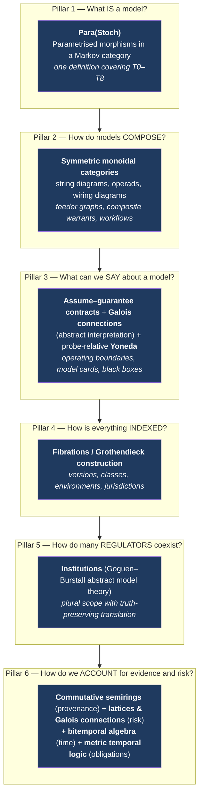

# 00 — Mathematical Foundations

*MAYA — Model & AI Lifecycle Assurance.*  **Evidence, not assertion.**

> **Question this document answers.** *What branch of mathematics generalizes the management of models —
> is it representation theory, category theory, or something else?*
>
> **Short answer.** **Category theory is the right spine, but it is not sufficient on its own.** MAYA
> rests on six mathematical pillars, each chosen because it *pays rent* in the form of a concrete
> engineering property — extensibility without schema migration, mechanically checkable laws, or a
> single engine that serves many analyses. Representation theorems appear, but as *local* results
> inside the framework, not as the organizing principle.

---

## 0. The rule this document obeys

Every abstraction below must satisfy the **rent test**:

> An abstraction earns its place only if it delivers a property we would otherwise have to hand-build,
> hand-check, or hand-migrate — and only if that property is stated as an executable law.

Mathematics that is merely elegant is recorded in §13 (*Deliberate non-adoptions*) and not implemented.
Every law in §12 becomes a property-based test in the codebase. The theory is not decoration; if a law
fails in CI, the build fails.

---

## 1. Why formalize at all

A bank's model estate is heterogeneous in a way that defeats naive schemas. A Monte-Carlo XVA engine,
a logistic scorecard, a FICO black box, an AML rule set, a SABR calibration, an expert-judgment country
scorecard, and a retrieval-augmented LLM drafting SAR narratives have almost nothing in common at the
level of *implementation*. Every product surveyed in [01 §5](01-industry-research.md) responds to this
by picking one shape and degrading everything else into it — which is why banks end up with four
systems and a spreadsheet.

The way out is to find the level of abstraction at which they genuinely *are* the same thing, define
the platform there, and recover the differences as *structure over* that abstraction rather than as
special cases beside it. Three concrete failures motivate this:

| Failure without formalization | Root cause | Pillar that fixes it |
|---|---|---|
| Adding a new model class (say, quantum-annealing portfolio optimisers) requires a database migration and touches every module | The model class was baked into the schema instead of being a *fibre* over it | **Fibrations** (§6) |
| Adding a new regulator (say, MAS or APRA) requires re-modelling "scope", because scope was a boolean | Regulatory regimes were treated as attributes of one logic instead of as *distinct logics with translations* | **Institutions** (§7) |
| Lineage, trust scoring, cost attribution, and classification propagation are four separate engines that disagree | They are the same computation over different **semirings** | **Provenance semirings** (§8) |

---

## 2. The answer in one page



| Pillar | Mathematics | What it generalizes | Engineering payoff |
|---|---|---|---|
| 1 | **Markov categories**, **Para construction** | "Model" itself — deterministic, stochastic, parametric, non-parametric, trained, calibrated, elicited, opaque | One `Model` interface for all nine trainability classes; the trainability class becomes *how the parameter object is inhabited*, not a subclass |
| 2 | **Symmetric monoidal categories**, operads, wiring diagrams | Model composition, feeder/consumer graphs, composite warrants, concurrent workflows | Composite warrants are typed and checked; blast radius is a graph-theoretic closure; aggregate risk is *lax* monoidality |
| 3 | **Assume–guarantee contract algebra**, **abstract interpretation**, **Yoneda (probe-relative)** | Operating boundaries, model cards, vendor black boxes, version compatibility | Contract composition/refinement/quotient give automatic compatibility checking; sound abstraction gives never-understated risk summaries |
| 4 | **Fibrations**, Grothendieck construction, indexed categories | Versions over models, classes over the registry, environments, tenants | New model classes are new fibres — plugin, not migration |
| 5 | **Institutions** (abstract model theory) | Multiple simultaneous regulatory regimes | New regulator = new institution + comorphism; *satisfaction condition* guarantees determinations survive translation |
| 6 | **Commutative semirings**, **lattices/Galois connections**, **bitemporal relational algebra**, **MTL** | Evidence, risk tiering, time, obligations | One evidence engine → lineage, trust, cost, classification by swapping the semiring; monotone tiering; PIT correctness as a theorem; monitors synthesized from specs |

---

## 3. Direct answer to "representation theorem or category theory?"

Both appear, at different scales, and it is worth being precise about which does what.

**Category theory is the organizing principle**, because the questions that dominate model management
are *compositional and structural*: how does a model built from other models inherit their properties?
When may version B replace version A? How do we add a new kind of thing without disturbing existing
things? Those are exactly the questions category theory was built to answer, and it answers them with
*laws* (functoriality, naturality, universal properties) that can be turned into tests.

**Representation theorems are local tools**, not the spine. Three that genuinely matter to us:

| Theorem | Where it applies in MAYA | What it licenses |
|---|---|---|
| **Yoneda lemma** — an object is determined by its relationships to all other objects | Model identity by behaviour (§5.3) | The claim "version 1.0.1 is observationally equivalent to 1.0.0" — and, crucially, the honest statement that this claim is only as strong as the probe set is rich |
| **de Finetti's representation theorem** — an exchangeable sequence is a mixture of i.i.d. sequences | Justifying the "population parameter" abstraction that all T2/T3 models rest on | Why a fitted parameter is a meaningful object at all, and precisely when the exchangeability assumption underlying a training set fails (regime change, selection effects) — a *validation test*, not a formality |
| **Representable Markov categories** (a categorical representation theorem) — a Markov category is representable when stochastic maps `X → Y` correspond to deterministic maps `X → P(Y)` into a distribution object | The bridge between "a model is a stochastic process" and "a model is a function returning a distribution" | Lets MAYA treat a model that returns a point estimate and one that returns a predictive distribution as the same kind of thing, with the point estimate as a deterministic section |

So: **category theory for the architecture, representation theorems for specific guarantees inside it.**
And — as §13 records — several branches the question might suggest (representation theory of groups,
homotopy type theory, topos-theoretic internal logic) are explicitly *not* adopted, because they do not
pass the rent test here.

---

## 4. Pillar 1 — What is a model? `Para(Stoch)`

### 4.1 The definition

A **Markov category** is a symmetric monoidal category in which the monoidal unit is terminal and every
object carries a commutative comonoid structure — a *copy* map and a *discard* map — compatible with the
tensor. Morphisms behave like **Markov kernels**: stochastic maps that can be composed, run in parallel,
copied and discarded. The canonical example is `Stoch`, the Kleisli category of the Giry monad, whose
morphisms `X → Y` are probability kernels. *Deterministic* morphisms are exactly those that commute with
copying — the Dirac kernels.

That gives us stochastic behaviour but not *parameters*. For parameters we use the **Para construction**:
given a monoidal category `C`, `Para(C)` has the same objects, and a morphism `X → Y` is a pair
`(P, f : P ⊗ X → Y)` — a **parameter object** together with a map that consumes parameters and input to
produce output. Composition tensors the parameter objects.

> **MAYA's definition of a model.**
> A **model** is a morphism in `Para(Stoch)`: a triple `(P, X, Y)` with a kernel `f : P ⊗ X → Y`,
> where `P` is the parameter object, `X` the input object, `Y` the output object.

### 4.2 Why this covers *everything*

The nine trainability classes of [02](02-model-taxonomy.md) are not nine kinds of object. They are nine
answers to a single question: **how is the parameter object `P` inhabited?** Formally, each class is
characterised by a *fitting morphism* `φ : D → P` from some evidence object `D`.

| Class | Parameter object `P` | Fitting morphism `φ : D → P` | Kernel `f` |
|---|---|---|---|
| **T0** analytical | `1` (terminal — no parameters) | none required | deterministic |
| **T1** market-calibrated | calibration parameters | `φ` = solver on the calibration instrument set; re-run daily | usually deterministic given `P` |
| **T2** statistically estimated | coefficients | `φ` = estimator (MLE, OLS) on a dataset snapshot | deterministic or predictive-distribution |
| **T3** machine-learned | weights + hyperparameters | `φ` = training algorithm | deterministic scoring or probabilistic |
| **T4** adaptive / online | time-indexed parameters `P(t)` | `φ` is *itself* a process — a morphism in the same category, run continuously | stochastic, non-stationary |

> **Caveat on T4 (finding M-1 of the [adversarial review](11-adversarial-review.md)).** A time-indexed
> parameter object `P(t)` is not, strictly, an object of the category. The honest reading is that a T4
> model is a *sequence* of models related by a governed change process — which is what MAYA actually
> stores. A coalgebraic treatment would be more natural and is noted as future work. We flag this
> rather than paper over it; the same caveat appears in the accompanying paper's limitations.
| **T5** foundation / pretrained | (base weights, prompt, corpus, tool manifest, guardrails) | `φ` = configuration, retrieval, optional adapter fit | genuinely stochastic (sampling) |
| **T6** vendor black box | `P` exists but is **not accessible**; only the composite `f(P, −)` is observable | `φ` is external and opaque | unknown; treated as an arbitrary kernel |
| **T7** expert judgment | weights/thresholds | `φ` = elicitation protocol over a panel | deterministic given `P` |
| **T8** deterministic rule / EUC | rule set | `φ` = policy authoring | deterministic (comonoid homomorphism) |

Three consequences that are immediately practical:

1. **One interface.** Every model in MAYA implements the same three-part signature. The registry does not
   need a `TrainedModel` table and a `PricingModel` table; it needs `parameter_object`,
   `input_object`, `output_object`, and a `fitting_procedure` that may be `null`. *This is the direct
   formal answer to "some models may not need training": training is not part of the definition of a
   model, it is one way of inhabiting `P`.*
2. **T0 is not a degenerate ML model; it is the case `P = 1`.** Asking a Black–Scholes implementation for
   its training set is a type error, and MAYA can say so precisely rather than by convention.
3. **T6 is characterised by inaccessibility of `P`, not by absence of `P`.** That is why the evidence
   schema for a vendor model demands *behavioural* evidence (own-outcomes analysis, benchmarking) rather
   than developmental evidence — the mathematics says the only thing we can observe is the composite.

### 4.3 Determinism is a property, not a category

In a Markov category, `f` is deterministic iff `copy ∘ f = (f ⊗ f) ∘ copy`. MAYA computes and stores this
as a first-class flag because it has direct governance consequences: a non-deterministic model cannot be
reproduced by re-execution alone, so its reproducibility evidence must pin the random source. The law is
testable — run the model twice on identical input and compare — which is exactly `FR-TRN-008`.

### 4.4 Where the model's *output type* lives

A model returning a point estimate and one returning a full predictive distribution differ in the object
`Y`, not in kind. In a **representable** Markov category, kernels `X → Y` correspond to deterministic maps
`X → P(Y)`; MAYA exploits this to store *predictive distributions* as a first-class output type and to
treat point predictions as the deterministic section. Practically, this is what allows calibration tests
(reliability diagrams, PIT histograms) and interval-based monitoring to be defined once, generically,
rather than per model family.

---

## 5. Pillar 2 — How models compose

### 5.1 The feeder graph is a string diagram

`Para(Stoch)` is symmetric monoidal, so model networks are **string diagrams**: boxes wired together,
with sequential composition (`∘`), parallel composition (`⊗`), copying (one model's output feeding two
consumers) and discarding. The yield-curve → pricer → XVA → RWA chain from
[02 §12](02-model-taxonomy.md#12-cross-cutting-the-feederconsumer-graph) is literally a morphism in this
category, built from generators.

This is not analogy. It gives us:

- **Typed composition.** Wiring model `A`'s output into model `B`'s input is legal iff the objects match
  under the contract subtyping rules of §6.3. MAYA checks this statically when a composite warrant is
  requested (`FR-WARRANT-017`).
- **Blast radius = the downstream closure** of a node in the diagram; the graph structure is the
  computation, not a report generated beside it (`FR-INV-010`).
- **Parameter accumulation.** Composing `(P, f)` and `(Q, g)` yields parameter object `Q ⊗ P`. The
  composite therefore *inherits every parameter dependency*, which is precisely why a curve
  recalibration is a change event for everything downstream.
- **Workflows use the same mathematics.** Petri nets generate free symmetric monoidal categories, so
  MAYA's concurrent approval workflows (parallel approvers, joins, quorum) live in the same formal world
  as model composition, and one execution engine serves both.

### 5.2 Aggregate risk is *lax* monoidality — and this is the regulator's point

SR 26-2 states that aggregate model risk "reflects interactions and dependencies among models; reliance
on common assumptions, data, or methodologies". Formally, let `ρ` assign to each model a risk value in a
lattice `(R, ⊔)`. If `ρ` were a *strict* monoidal functor we would have
`ρ(g ∘ f) = ρ(g) ⊔ ρ(f)` — risk would simply be the join of component risks.

It is not. MAYA models `ρ` as a **lax monoidal functor**:

```
ρ(g ∘ f)  ⊒  ρ(g) ⊔ ρ(f)
```

The gap — the *interaction term* — is exactly the shared-dependency, common-assumption and
error-amplification risk that the guidance is asking about. Making laxity explicit turns a vague
sentence in supervisory guidance into a computable quantity: MAYA reports both the join of component
risks and the composite risk, and the difference is the aggregate-risk premium, attributed to shared
features, shared datasets, shared vendors, shared methodologies, and shared assumptions (`FR-INV-011`).

### 5.3 Model identity: probe-relative Yoneda

The Yoneda lemma says an object is determined, up to isomorphism, by the totality of maps into it — an
object *is* what it does. Applied here: a model is determined by its responses to all probes.

We cannot enumerate all probes. So MAYA defines identity **relative to a declared probe set**:

> Let `Π` be a finite set of probes (test inputs, scenarios, edge cases, and their expected-property
> assertions). Two model versions `v₁, v₂` are **Π-equivalent**, written `v₁ ≡_Π v₂`, iff they agree on
> every probe in `Π` within declared tolerance.

This makes MAYA's version semantics precise and honest:

| Version bump | Formal meaning |
|---|---|
| **PATCH** | `v_new ≡_Π v_old` for the model's regression probe set `Π` — an implementation change with *proven* behavioural equivalence |
| **MINOR** | same `(P, X, Y)` and same fitting procedure `φ`, new inhabitant of `P` (refit/recalibration) |
| **MAJOR** | `φ`, `P`, `X` or `Y` changed — a different morphism |

And it forces the honest caveat that no product states: **equivalence is only as strong as `Π`.** MAYA
therefore stores `Π` with every equivalence claim, measures probe-set coverage, and treats "probe set too
weak for this tier" as a finding. That is the Yoneda lemma doing real governance work.

---

## 6. Pillar 3 — What can we say about a model we cannot open?

Three complementary tools. All three are needed, because they answer different questions.

### 6.1 Assume–guarantee contracts

A **contract** is a pair `C = (A, G)`: an *assumption* about the environment and a *guarantee* about
behaviour when the assumption holds. Contract theory (Benveniste et al.) supplies an algebra:

| Operation | Meaning | MAYA use |
|---|---|---|
| **Refinement** `C' ⪯ C` | weaker assumption, stronger guarantee | *"May version B replace version A?"* — a substitutability check, decidable |
| **Composition** `C₁ ⊗ C₂` | contract of the composed system | Composite warrant contract; what a model chain promises end-to-end |
| **Conjunction** `C₁ ∧ C₂` | satisfy both viewpoints | Merging a *performance* contract, a *fairness* contract and a *latency* contract on one model |
| **Quotient** `C / C₁` | what the *missing* component must guarantee | *"Given the target and what we have, what must the challenger deliver?"* — turns a validation gap into a specification |

The mapping into MAYA is exact and is the formal content of the "operating boundaries" requirement
(`FR-INV-006`, from SS1/23 1.2(c)(i)):

- **Assumption `A`** = the operating boundaries: input domain, valid ranges, population definition,
  market regime, data freshness, upstream contracts.
- **Guarantee `G`** = the performance envelope: accuracy/discrimination/calibration bounds, latency,
  fairness bounds, output range, explainability availability.

Two consequences that no surveyed product provides:

1. **Off-boundary use is a contract violation, detected mechanically.** `FR-MON-010` is the runtime check
   `input ⊨ A`. When it fails, the model's guarantee is formally void — which is a much stronger and more
   defensible statement than "the input looked unusual".
2. **Refinement gives version compatibility for free.** Replacing champion with challenger is permitted
   iff the challenger's contract refines the champion's. This is a proof obligation MAYA discharges, not
   a judgement call in a meeting.

### 6.2 Galois connections and sound abstraction

A **model card is an abstraction of a model**, and abstract interpretation tells us exactly what makes an
abstraction trustworthy. Let `Concrete` be the lattice of model behaviours and `Abstract` the lattice of
summaries. A **Galois connection** `α ⊣ γ` satisfies

```
α(c) ⊑ a   ⟺   c ⊑ γ(a)
```

with `α` the abstraction map (behaviour → summary) and `γ` the concretisation map (summary → the set of
behaviours it permits). **Soundness** is `c ⊑ γ(α(c))`: the summary never *excludes* real behaviour.

> **MAYA's soundness law for summaries.** Every generated artifact that stands in for a model — model
> card, documentation section, risk summary, tier — must be a **sound over-approximation**. It may
> overstate risk; it must never understate it.

This is checkable. If a model card states an accuracy floor of 0.82 and the model achieves 0.79 on any
in-boundary slice, `c ⊄ γ(α(c))` and MAYA raises a soundness violation. It also gives a principled answer
to the perennial "how much detail belongs in the model card?" question: as much as is needed for the
abstraction to remain sound at the required precision, and no more.

### 6.3 Schemas and variance

Input/output schemas form a lattice under a subtyping order. Contract and schema compatibility follow the
standard variance rule: a replacement model version must be **contravariant in inputs** (accept at least
as much) and **covariant in outputs** (promise at least as much). MAYA enforces this at warrant issuance and
at alias moves; it is the reason an alias move cannot silently break a consumer.

---

## 7. Pillar 4 — Indexing: fibrations and the Grothendieck construction

Almost everything in MAYA is *a family of things indexed by something else*: versions indexed by model,
calibration sets indexed by version, deployments indexed by environment, inventories indexed by legal
entity, evidence schemas indexed by model class.

The mathematics of indexed families is the **fibration**. A functor `p : E → B` is a fibration when every
morphism in the base `B` lifts cartesianly to `E`. Equivalently (Grothendieck), a fibration over `B` is
the same as an indexed family `B^op → Cat`.

MAYA's principal fibrations:

| Total category `E` | Base `B` | Fibre over `b` | What the lifting means |
|---|---|---|---|
| Versions | Models | all versions of that model | rename/re-own a model → versions follow canonically |
| Calibration sets | Versions | daily calibrations of that version | a T1 model recalibrates without version churn |
| Evidence schemas | Model classes | required evidence for that class | **adding a model class adds a fibre — no migration** |
| Deployments | Environments | what runs in dev/uat/prod | promotion is a cartesian lift |
| Inventory views | Legal entities | that entity's models | consolidation is a limit over the entity diagram |
| Policy sets | Jurisdictions | rules in force there | see §8 |

The payoff is the extensibility property the user asked for, stated precisely:

> **Extension theorem (informal).** Because model classes form the base of a fibration rather than a
> column in a table, introducing a new class — a quantum optimiser, a differential-privacy mechanism, a
> model type nobody has invented yet — requires supplying a new fibre (its evidence schema, lifecycle,
> metric set, document templates) and *nothing else*. No existing fibre, table, API or UI changes.

This is what makes "all kinds of models under the sun are fair game" an architectural guarantee rather
than an aspiration. Concretely it is realised as the plugin architecture of
[04 §7](04-architecture.md) and the class-indexed JSONB evidence documents of
[05](05-data-model.md).

---

## 8. Pillar 5 — Many regulators at once: institutions

### 8.1 The problem

The same model is simultaneously *out of scope* for SR 26-2 (which excludes deterministic and generative
systems), *in scope* for SS1/23 (whose definition includes expert-judgment inputs and qualitative
outputs), *high-risk* under the EU AI Act if it scores consumer creditworthiness, and *a key control*
under SOX. These are not four values of one attribute. They are four **different logical systems**, each
with its own vocabulary, its own sentences, and its own notion of what makes a sentence true of an
inventory.

Modelling this as a boolean, or an enum, or a set of tags, is the mistake that forces a re-architecture
every time a regulator publishes.

### 8.2 The formalism

An **institution** (Goguen & Burstall's abstract model theory) is a four-part structure:

- a category `Sign` of **signatures** (vocabularies),
- a functor `Sen : Sign → Set` giving the **sentences** over each signature,
- a functor `Mod : Sign^op → Cat` giving the **models** (here: inventory states) of each signature,
- a **satisfaction relation** `⊨_Σ ⊆ |Mod(Σ)| × Sen(Σ)`,

subject to the **satisfaction condition**: for any signature morphism `σ : Σ → Σ'`, any `M' ∈ Mod(Σ')`
and any `φ ∈ Sen(Σ)`,

```
M' ⊨_Σ'  σ(φ)    ⟺    Mod(σ)(M') ⊨_Σ  φ
```

— *"truth is invariant under change of notation."*

### 8.3 The mapping

| Institution component | MAYA |
|---|---|
| Signature `Σ` | The vocabulary a regime cares about (SR 26-2: complexity, exposure, purpose, statistical/economic/financial theory. EU AI Act: intended purpose, deployer, natural persons, Annex III category) |
| Sentence `φ ∈ Sen(Σ)` | A regulatory obligation, expressed in that vocabulary |
| Model `M ∈ Mod(Σ)` | The state of the inventory (a model record and its evidence) as seen through that vocabulary |
| Satisfaction `M ⊨ φ` | **Compliance.** A scope determination is `M ⊨ in_scope`; a control obligation is `M ⊨ requires_independent_validation` |
| Institution **comorphism** | The translation from a regime's vocabulary into MAYA's core signature |

### 8.4 What this buys

1. **Adding a regulator is adding an institution and a comorphism.** MAS, APRA, OSFI E-23, a future US
   GenAI RFI — each is a new `(Sign, Sen, Mod, ⊨)` plus a translation into the core vocabulary. The core
   schema, the API and the UI are untouched. This is `P10` with a theorem behind it.
2. **The satisfaction condition is a consistency guarantee we can test.** It says that translating an
   inventory state into a regime's vocabulary and then evaluating an obligation gives the same answer as
   evaluating the translated obligation directly. If those disagree, our translation is wrong — and that
   is exactly the class of bug that produces a scope determination which cannot be defended to an
   examiner. MAYA tests the satisfaction condition as a property (§12, L-8).
3. **Heterogeneous specification is a solved problem.** Institution theory already knows how to combine
   several logics into one environment via translations. We inherit that instead of inventing a
   conflict-resolution scheme.
4. **Scope determinations become derivations, not opinions.** "Why is this out of SR 26-2 scope?" is
   answered by the derivation of `M ⊭_{SR26-2} is_model`, citing the specific clause and the specific
   inventory facts — satisfying the stored-rationale requirement of `FR-INV-004` by construction.

---

## 9. Pillar 6a — Evidence as a commutative semiring

### 9.1 The construction

Green, Karvounarakis and Tannen showed that provenance, bag semantics, probabilistic databases, access
control and incomplete information are **the same computation over different commutative semirings**.
Annotate each base fact with an element of a commutative semiring `K = (K, ⊕, ⊗, 0, 1)`; then relational
algebra propagates annotations by using `⊗` for joint dependence (a join: *this AND that*) and `⊕` for
alternative derivations (a union: *this OR that*).

MAYA's evidence graph is exactly an annotated derivation structure. Every derived governance claim —
*"model M is validated"*, *"version v is reproducible"*, *"this figure in the MDD is current"* — is
computed from base evidence nodes by `⊕`/`⊗`.

### 9.2 One engine, many analyses

This is the single highest-leverage result in the document. **The same evidence computation, evaluated in
different semirings, answers completely different questions:**

| Semiring `K` | `⊕` , `⊗` | Question it answers |
|---|---|---|
| `B = ({⊥,⊤}, ∨, ∧)` | or, and | *Is there sufficient evidence at all?* — gate evaluation |
| `ℕ` | `+`, `×` | *How many independent derivations support this?* — corroboration depth |
| `Why(X)` = sets of sets of evidence ids | `∪`, pairwise `∪` | *Which minimal sets of evidence suffice?* — **why-provenance**; what an examiner must be shown |
| `ℕ[X]` provenance polynomials | polynomial `+`, `×` | *Exactly how was this derived, with multiplicities?* — **how-provenance**; full audit reconstruction |
| `([0,1], max, ×)` | max, product | *How much confidence does this claim carry?* — trust scoring, model health |
| Tropical `(ℝ⁺∪{∞}, min, +)` | min, plus | *What is the cheapest / fastest path to close this gap?* — validation effort and cost attribution |
| Security lattice `(L, ⊓, ⊔)` | meet, join | *What classification does this derived artifact inherit?* — automatic PII/confidentiality propagation (`FR-SEC-007`) |
| `(2^Regimes, ∩, ∪)` | intersect, union | *Which regulatory regimes is this evidence admissible for?* |
| `(Time, max, max)` | latest, latest | *As of when is this claim current?* — **staleness** (`FR-DOC-004`) |

We implement the evidence engine **once**, generically over `K`, and obtain nine capabilities that
competitors build as nine features. Adding a tenth analysis means defining a tenth semiring — roughly
twenty lines of code — and it is automatically consistent with the other nine, because they share the
derivation structure.

> **Practical note.** `ℕ[X]` (how-provenance) is the *universal* semiring: computing once in `ℕ[X]` and
> then applying a semiring homomorphism `ℕ[X] → K` recovers the answer in any other `K`. MAYA therefore
> stores provenance polynomials for Tier 1 evidence and evaluates on demand, and stores the cheaper
> `Why(X)` form below Tier 1. That is a storage/precision trade-off with a theorem telling us exactly
> what we lose.
>
> **Complexity, stated honestly (finding M-2).** `Why(X)` is worst-case *exponential* in the number of
> alternative derivations, and governance DAGs are not always shallow. Mitigations are concrete rather
> than aspirational: canonical form with absorption (`a ⊕ ab = a`), memoisation over subgraphs, depth
> caps, and a hard term cap beyond which evaluation **degrades to `Boolean ⊕ Trust` and emits an
> explicit truncation marker** — never a silently partial answer.

### 9.3 Gluing: evidence as a sheaf

Provenance tells us how a claim was derived; it does not tell us whether independently-produced pieces of
evidence are *mutually consistent*. For that, evidence is treated as a **presheaf** on the structure of a
model (its components, slices, time windows), and the question "do local validations assemble into a
global claim?" is the **gluing condition** of a sheaf.

Concretely: a validator tests slice A, another tests slice B, and both report acceptable performance on
the overlap A∩B — but with different numbers. Sheaf-theoretic data fusion gives a **consistency radius**:
a quantitative measure of how far the local sections are from gluing. A non-zero consistency radius is a
finding, and it detects contradictions that no per-section check can see. This is the formal machinery
behind "effective challenge" as a *global* property rather than a sum of local reviews.

---

## 10. Pillar 6b — Risk as order structure

### 10.1 Tiering is a monotone map between lattices

Materiality and complexity are **not** numbers to be added. Following SS1/23 1.3, they are separate
lattices:

- `M` — materiality, generated by quantitative exposure `E` (a chain) joined with qualitative purpose `Q`
  (a partial order: *regulatory capital* ⊐ *financial reporting* ⊐ *risk management* ⊐ *commercial*).
- `C` — complexity, a product lattice over its declared components: data quality, methodology,
  implementation integrity, use intensity, interpretability, explainability, transparency, bias potential.

Tier is a **monotone map** `τ : M × C → Tier` into a finite chain `Tier₄ ⊏ Tier₃ ⊏ Tier₂ ⊏ Tier₁`.

Monotonicity is not a stylistic choice; it is the property that makes tiering defensible:

> **Monotonicity law.** If exposure increases, or purpose becomes more critical, or complexity increases,
> the tier can only rise or stay the same. Never fall.

That is `L-4` in §12 and is tested by property-based testing over generated inventory states. It is
exactly the kind of assurance an examiner asks for and which no rules-engine-with-a-spreadsheet can give.

### 10.2 Control intensity is a Galois connection with tier

Let `Ctrl` be the lattice of control sets ordered by strictness. The mapping from tier to required
controls, `req : Tier → Ctrl`, and from an applied control set back to the maximum tier it can support,
`sup : Ctrl → Tier`, form a **Galois connection**:

```
req(t) ⊑ c   ⟺   t ⊑ sup(c)
```

Reading it left to right: *the applied controls satisfy the tier's requirements*. Right to left: *the
tier is within what those controls can defend*. They are the same statement. This is why MAYA can answer
both "what must I do for this Tier 1 model?" and "given what we actually did, what tier can this model
legitimately be?" from one definition — and why a control gap and a tier inflation are the same defect
seen from two sides.

### 10.3 Data classification and policy composition

Data classification propagates by **join** in a security lattice: a model trained on `Confidential ⊔
PII` inherits `Confidential ⊔ PII`, and so do its artifacts, documents and monitoring extracts
(`FR-SEC-007`). Policy sets compose by **meet** (all applicable policies must hold). Both are the same
order-theoretic machinery, and both fall out of the semiring evidence engine of §9.2 by choosing the
lattice semiring.

---

## 11. Pillar 6c — Time, obligations, and documents

### 11.1 Bitemporality and the point-in-time correctness theorem

Feature data is **bitemporal**: every fact has a *valid time* (when it was true in the world) and a
*transaction time* (when the system learned it). Training-serving skew and look-ahead leakage are
failures to respect this distinction — the dominant silent failure mode identified in
[01 §5.2](01-industry-research.md).

> **PIT correctness condition.** A training row for entity `e` with label time `t_L`, assembled as of
> system time `t_A`, is point-in-time correct iff for every feature `φ`, the value used is
> ```
> φ(e, t_L, t_A) = value of φ for e with  max{ valid_time ≤ t_L  ∧  transaction_time ≤ t_A }
> ```
> A training set is PIT-correct iff every row is.

Stated this way it is **mechanically verifiable**, and MAYA verifies it rather than trusting the query
author (`FR-FEA-004`). Delta Lake's time travel supplies the transaction-time axis directly; the feature
view schema supplies valid time. Allen's interval algebra handles the reasoning about overlapping
validity windows for slowly-changing dimensions.

Note the corollary that matters for restatements: because `t_A` is explicit, MAYA can distinguish *"the
world changed"* from *"we found out we were wrong"*, and identify exactly which historical training sets,
model versions and decisions are affected by a source restatement (`FR-FEA-016`).

### 11.2 Obligations as metric temporal logic

Governance obligations are temporal statements with deadlines, so they are naturally expressed in
**metric temporal logic (MTL)**:

```
G( tier = 1  →  F[0, 365d] validation_completed )
G( finding.severity = Critical  →  F[0, 30d] (remediated ∨ formally_accepted) )
G( overlay_active  →  F[0, 90d] (reviewed ∨ expired) )
G( in_production ∧ ¬approved  →  X alert )
```

Monitors for MTL formulas can be **synthesized automatically** by standard runtime-verification
constructions. So MAYA's obligation engine is not a hand-written scheduler with special cases; it is a
compiler from declarative specifications to monitors. New obligations are new formulas.

A thin **deontic** layer (obligation `O`, permission `P`, prohibition `F`) sits on top, because model
governance genuinely distinguishes *must*, *may* and *must not* — and because contradiction detection
(`O φ ∧ F φ`) catches policy conflicts before they reach users.

### 11.3 Documentation as a lens

The relationship between the evidence graph and a document is **bidirectional**: documents are generated
from evidence, but humans also edit narrative sections, and those edits must survive regeneration. This
is precisely an **asymmetric lens** with `get : Evidence → Doc` and `put : Evidence × Doc → Evidence`,
subject to the lens laws:

| Law | Statement | What it means operationally |
|---|---|---|
| **GetPut** | `put(e, get(e)) = e` | Regenerating an unedited document changes nothing — no spurious diffs, no churn |
| **PutGet** | `get(put(e, d)) = d` | A human edit is faithfully reflected and is not silently discarded on the next compile |
| **PutPut** | `put(put(e, d), d') = put(e, d')` | Edit history composes cleanly |

And the definition we actually wanted all along:

> **Staleness.** A document `d` is **stale** with respect to current evidence `e'` exactly when
> `get(e') ≠ d` on the auto-generated sections. The diff `get(e') ⊖ d` is precisely *what changed*.

`FR-DOC-004` is therefore not a heuristic. It is a lens-law violation, computed exactly, with a diff the
author can act on.

---

## 12. The laws MAYA enforces

Each of the eighteen laws below is implemented as a property-based test in the MAYA test suite. **If a law fails, the
build fails.** This is how the theory stays honest.

| # | Law | Pillar | Test strategy |
|---|---|---|---|
| **L-1** | *Functoriality of lifecycle.* A model's history is a path in the free category on its lifecycle graph; no state is reachable except along declared transitions. | §2, §5.1 | Generate random event sequences; assert all reachable states are lifecycle-legal |
| **L-2** | *Immutability.* For any version `v`, `hash(manifest(v))` is constant over its lifetime. | §4 | Hash on read; compare with stored digest |
| **L-3** | *Determinism flag correctness.* `deterministic(f)` ⟹ repeated execution on identical input is bit-identical. | §4.3 | Double-execution differential test in the sandbox |
| **L-4** | *Tiering monotonicity.* `(m,c) ⊑ (m',c') ⟹ τ(m,c) ⊑ τ(m',c')`. | §10.1 | Property test over generated lattice pairs |
| **L-5** | *Control adequacy Galois adjunction.* `req(t) ⊑ c ⟺ t ⊑ sup(c)`. | §10.2 | Exhaustive check over the finite tier chain × control lattice |
| **L-6** | *Abstraction soundness.* For every generated summary `a` of behaviour `c`: `c ⊑ γ(a)`. | §6.2 | Replay in-boundary evaluation data against every quantitative claim in generated documents |
| **L-7** | *Contract refinement on substitution.* An alias move to version `v'` requires `contract(v') ⪯ contract(v)`. | §6.1 | Refinement checker at alias-move time; property test on generated contracts |
| **L-8** | *Satisfaction condition.* For every regime comorphism `σ`: `M' ⊨ σ(φ) ⟺ Mod(σ)(M') ⊨ φ`. | §8.2 | Property test over generated inventory states × regime obligations |
| **L-9** | *Provenance homomorphism.* For any semiring homomorphism `h : ℕ[X] → K`, evaluating in `K` equals `h` applied to the `ℕ[X]` result. | §9.2 | Differential test across all implemented semirings |
| **L-10** | *PIT correctness.* Every generated training set satisfies the condition of §11.1. | §11.1 | Automated verifier run on every dataset snapshot; synthetic leakage injection must be caught |
| **L-11** | *Lens laws.* GetPut, PutGet and PutPut hold for every document template. | §11.3 | Round-trip property tests per template |
| **L-12** | *Schema variance.* A replacement version is contravariant in inputs and covariant in outputs. | §6.3 | Static check at warrant issuance; property test on generated schema pairs |
| **L-13** | *Evidence gluing.* Overlapping evidence sections have consistency radius ≤ declared tolerance. | §9.3 | Computed at validation-report compile time |
| **L-14** | *Lax monoidality of risk.* `ρ(g∘f) ⊒ ρ(g) ⊔ ρ(f)` for all composable pairs. | §5.2 | Property test over generated model graphs |
| **L-15** | *Fibration completeness.* Every model class has a total evidence schema, lifecycle, metric set and template set; no fibre is empty. | §7 | Startup validation of the class registry; CI check on plugin registration |
| **L-16** | *No obligation contradiction.* The obligation set is deontically consistent: no `O φ ∧ F φ`. | §11.2 | SAT check on the compiled policy set at policy-publish time |
| **L-17** | *Contract–serving agreement.* For every active warrant, the online feature namespace served equals the namespace pinned by its contract. | [11 · C-2](11-adversarial-review.md) | Continuous production check, **not** a design-time assertion — C-2 was invisible to every design-time check |
| **L-18** | *No personal data in evidence nodes.* A node flagged `contains_personal_data` carries no inline payload, only an erasable pointer. | [11 · H-3](11-adversarial-review.md) | DB `CHECK` constraint plus a payload scanner; reconciles append-only evidence with GDPR erasure |

---

## 12a. A second dividend: the structure tells us where machines may work

The pillars were justified by governance properties. They have a second use, which was not the design
intent and which we now regard as the most practically consequential result of the whole account: several
of them are **decision procedures**, and a decision procedure is exactly what makes machine-generated
output safe to accept.

**Definition (oracle).** For a task `T` with outputs in `O`, an *oracle* is a decidable predicate
`ok_T : O → 𝔹`, computable from the formal structure and from data independent of the output, such that
`ok_T(o)` holds only if `o` is correct.

> **Proposition (automation admissibility).** If `T` is oracle-backed, the soundness of *verified
> automation* — compute `g(x)`, accept iff `ok_T(g(x))` — is **independent of the generator `g`**. No
> incorrect output is accepted, whatever produced it. The generator's error rate determines *throughput*,
> not correctness. If `T` is not oracle-backed, the correctness of the output is exactly the correctness
> of `g`.

This yields a criterion that is a property of the *domain*, not of any model:

> **Deploy machine generation where the formalism supplies a mechanical check. Use humans where it does not.**

| Governance task | Oracle | Pillar |
|---|---|---|
| Encode a regulatory regime | Satisfaction condition (`L-8`) | §8 |
| Assert two versions behave alike | `≡_Π` on the declared probe set | §5.3 |
| Substitute one version for another | Contract refinement (`L-7`) | §6.1 |
| Re-express an artifact in another format | `≡_Π` plus numerical tolerance | §6.1 |
| Claim documentary support for an assertion | Boolean evaluation of the derivation under the cited set | §9.2 |
| Assemble fitting evidence without leakage | Causal admissibility (`L-10`) | §11.1 |
| Propose a remediation plan | *None needed* — computed in the tropical semiring | §9.2 |

**Citation soundness (a corollary of §9.2).** Let claim `c` have derivation `d_c` over evidence
identifiers `X`, and let `S ⊆ X` be a cited set. Then `S` supports `c` **iff** `d_c` evaluates to `⊤` in
the Boolean semiring under the valuation that switches on exactly `S` — equivalently, iff `S` contains a
minimal support of `c`. Verifying a machine-generated citation is therefore a Boolean evaluation over a
structure that already exists, not a further model call.

**What admits no oracle, and why.** For a derived quantity `q = f(Φ)` defined by a versioned rule `f` —
a tier, a control requirement, a scope determination — there is no automation question about computing
`q`: evaluating `f` is deterministic. The automation question arises only for (i) supplying `Φ`, which is
oracle-backed when facts are sourced from systems of record, and (ii) *proposing `f`*, which is a
normative choice. Since `f` **constitutes** the standard, no independent specification exists against
which a proposed `f` could be checked. Concluding a validation, granting an approval and accepting
residual risk fall in the same class. These are not weakly-checkable tasks withheld out of caution; they
have no notion of correctness independent of the authority exercising them.

**Well-foundedness.** Admitting machine assistance into a system that governs machines is not circular.
The governing machinery — `τ`, the evidence structure, the institutions, the lifecycle categories — is not
an element of the governed population; every assistant is. Where the strata touch (an assistant drafting a
regime encoding), the dependency is *mediated by an oracle that is not itself machine-produced*.
**Generation may cross the strata; acceptance may not.**

Operational consequences are in [13 — AI, LLMs and Agents Inside the Platform](13-ai-in-the-platform.md).

---

## 13. Deliberate non-adoptions

Honesty about what we are *not* doing is part of the design. Each of these was considered and rejected
against the rent test of §0.

| Not adopted | Why not |
|---|---|
| **Representation theory (of groups/algebras)** | This is about representing algebraic structures as linear operators. It is genuinely useful *inside* particular models (symmetry in PDE solvers, equivariant networks) but says nothing about managing a heterogeneous estate. Wrong scale. |
| **Homotopy type theory / univalent foundations** | The equality-as-path machinery buys us nothing at this scale; ordinary typed schemas plus the probe-relative equivalence of §5.3 give what we need at a fraction of the cost. |
| **Topos-theoretic internal logic** | Elegant unification of §8 and §9, but we would pay a large comprehension cost for no operational capability we do not already get from institutions plus semirings. Revisit only if regime interactions become genuinely non-classical. |
| **Full mechanised proof (Coq/Lean) of the platform** | Disproportionate. We take the middle path: laws stated formally in §12, enforced by property-based testing rather than proof. If a regulator later requires machine-checked evidence for a specific component (say, the tiering monotonicity proof), §10.1 is small enough to formalise in isolation. |
| **Category-theoretic database schemas (functorial data migration, CQL)** | Attractive and closely related to §7, but the ecosystem, tooling and hiring pool do not support it for a production banking system. We take the *idea* (schemas as categories, migrations as functors) and implement it with conventional Postgres plus disciplined fibre boundaries. |
| **Measure-theoretic probability as the primary formalism** | We use it where it belongs — inside `Stoch` and in validation tests — but Kolmogorov-style measure theory does not compose, and composition is our whole problem. Markov categories exist precisely to fix this. |
| **Ontologies / description logics (OWL) as the core model** | Good for the *glossary* and we will emit RDF for interoperability. But DLs are weak on the parametric, temporal and compositional structure that dominates here. |

---

## 14. From theory to code

The abstractions are not confined to this document. They appear in the codebase as named artifacts:

| Concept | Where it lives |
|---|---|
| `Para(Stoch)` model definition | `maya/domain/model_algebra.py` — `ParametricKernel`, `ParameterObject`, `FittingProcedure` |
| Trainability class as fitting-morphism kind | `maya/domain/trainability.py` |
| Model composition, string diagrams | `maya/domain/composition.py`; composite warrants in `maya/warrants/composite.py` |
| Contract algebra (⪯, ⊗, ∧, /) | `maya/domain/contracts.py` |
| Fibrations / class registry | `maya/registry/fibres.py`, plugin entry points `maya.model_class` |
| Institutions & comorphisms | `maya/regimes/institution.py`, one module per regime |
| Provenance semirings | `maya/evidence/semiring.py` — `Semiring` protocol + nine instances |
| Sheaf consistency radius | `maya/evidence/gluing.py` |
| Risk lattices & Galois connection | `maya/risk/lattice.py`, `maya/risk/tiering.py` |
| Bitemporal PIT verifier | `maya/features/pit.py` |
| MTL obligation compiler | `maya/policy/temporal.py` |
| Document lenses | `maya/docs/lens.py` |
| The eighteen laws | `tests/laws/test_L01.py` … `test_L18.py` |

The architecture in [04](04-architecture.md) is organised around these boundaries, which is why its module
structure looks the way it does.

---

## 15. Sources

**Categorical probability and parametric models**
- [Markov category (nLab)](https://ncatlab.org/nlab/show/Markov+category)
- T. Fritz, *A synthetic approach to Markov kernels, conditional independence and theorems on sufficient statistics* — [ResearchGate](https://www.researchgate.net/publication/341724752_A_synthetic_approach_to_Markov_kernels_conditional_independence_and_theorems_on_sufficient_statistics)
- Fritz, Gonda, Perrone, et al., *Representable Markov categories and comparison of statistical experiments in categorical probability* — [arXiv:2010.07416](https://arxiv.org/pdf/2010.07416) · [TCS](https://www.sciencedirect.com/science/article/abs/pii/S0304397523002098)
- Fritz & Rischel, *Infinite products and zero-one laws in categorical probability* — [arXiv:1912.02769](https://arxiv.org/pdf/1912.02769)
- *A category-theoretic proof of the ergodic decomposition theorem* — [arXiv:2207.07353](https://arxiv.org/pdf/2207.07353)
- *Compositional imprecise probability* — [arXiv:2405.09391](https://arxiv.org/pdf/2405.09391)

**Contracts and compositional system design**
- Benveniste, Caillaud, Nickovic, et al., *Contracts for System Design*, Foundations and Trends in EDA — [review](https://www.fmeurope.org/2020/10/30/book-review-contracts-for-system-design/) · [ResearchGate](https://www.researchgate.net/publication/339504304_Contracts_for_System_Design)
- *Synchronous interfaces and assume/guarantee contracts* — [INRIA](https://people.rennes.inria.fr/Albert.Benveniste/pub/MooreInterfacesAGContracts2017.pdf)
- *Some algebraic aspects of assume-guarantee reasoning* — [arXiv:2309.08875](https://arxiv.org/pdf/2309.08875)
- *A mechanically verified theory of contracts* — [arXiv:2108.13647](https://arxiv.org/pdf/2108.13647)
- *Modular assurance of complex systems using contract-based design principles* — [arXiv:2402.12804](https://arxiv.org/pdf/2402.12804)
- *Compositional cyber-physical systems theory* — [arXiv:2109.04858](https://arxiv.org/pdf/2109.04858)

**Provenance semirings**
- Green, Karvounarakis & Tannen, *Provenance Semirings*, PODS 2007 — [paper](https://web.cs.ucdavis.edu/~green/papers/pods07.pdf) · [ACM](https://dl.acm.org/doi/10.1145/1265530.1265535)
- [Provenance semirings — slides](https://www.cis.upenn.edu/~plclub/propr/greg-slides.pdf)
- *Revisiting semiring provenance for Datalog* — [KR 2022](https://proceedings.kr.org/2022/10/kr2022-0010-bourgaux-et-al.pdf)
- *Semiring provenance for lightweight description logics* — [arXiv:2310.16472](https://arxiv.org/pdf/2310.16472)
- *Provenance for regular path queries* — [arXiv:2001.09864](https://arxiv.org/pdf/2001.09864)

**Institutions and heterogeneous specification**
- Goguen & Burstall, *Institutions: abstract model theory for specification and programming*, JACM — [ACM](https://dl.acm.org/doi/10.1145/147508.147524) · [PDF](https://courses.grainger.illinois.edu/cs522/sp2016/InstitutionsAbstractModelTheory.pdf)
- [Institution Theory — Internet Encyclopedia of Philosophy](https://iep.utm.edu/insti-th/)
- *Introducing H, an institution-based formal specification and verification language* — [arXiv:1908.09868](https://arxiv.org/pdf/1908.09868)
- *Truth invariant under change of notation: a certified category of logics* — [ResearchGate](https://www.researchgate.net/publication/405835750_Truth_Invariant_Under_Change_of_Notation_A_Certified_Category_of_Logics)

**Related foundations referenced in passing**
- Cousot & Cousot, abstract interpretation — Galois connections and sound over-approximation (§6.2)
- Foster et al., lenses and bidirectional transformations (§11.3)
- Baez & Master, Petri nets as free symmetric monoidal categories (§5.1)
- Robinson, sheaf-theoretic data fusion and the consistency radius (§9.3)
- Allen's interval algebra; Snodgrass, bitemporal data management (§11.1)
- Koymans, metric temporal logic; Bauer, Leucker & Schallhart, runtime verification (§11.2)

---

Copyright © 2026 Ashutosh Sinha <ajsinha@gmail.com>. All rights reserved.
Proprietary and confidential. See [LICENSE](../LICENSE) and [NOTICE](../NOTICE).
*Not legal, regulatory or financial advice — see NOTICE §4.*
