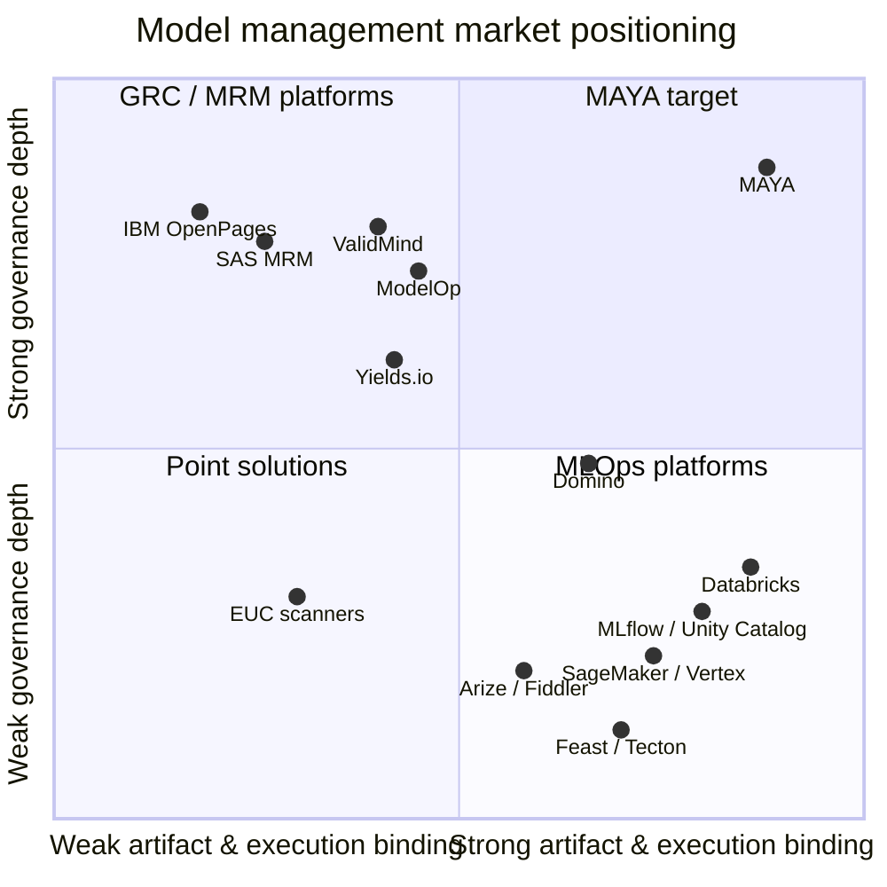

# 01 — Industry Research: Model Landscape, Regulation, and the Commercial Gap

*MAYA — Model & AI Lifecycle Assurance.*  **Evidence, not assertion.**

> **Purpose.** This document is the evidence base for the MAYA requirements and design. It records
> what we found about (a) how large banks actually use models, (b) what regulators now require,
> (c) what commercial and open-source products exist, and (d) the specific, defensible gap that
> justifies building MAYA rather than buying.
>
> **Research date:** September 2026. **Author:** Platform Architecture.

---

## 1. Executive summary

Seven findings drove the design.

| # | Finding | Design consequence |
|---|---|---|
| 1 | **US model risk guidance was rewritten on 17 April 2026.** SR 11-7 (2011) and SR 21-8 were superseded by **SR 26-2 / OCC Bulletin 2026-13**, a principles-based, materiality-driven regime. It narrows the *definition* of a model and explicitly **excludes generative and agentic AI from scope**. | Tiering, validation cadence and control intensity must be **policy-as-code and configurable**, not hardcoded to 2011-era rules. GenAI needs a **parallel governance track**, because it is out of scope for MRM but not out of scope for risk management. |
| 2 | **The UK PRA SS1/23 moves the opposite way** — a broad model definition, a mandatory firm-wide inventory with prescribed attributes, mandatory tiering, and a first-class **post-model adjustment (overlay) register**. | A global bank must satisfy **both** a narrow US scope and a broad UK scope simultaneously. MAYA must support **multiple concurrent regulatory scoping regimes over one inventory**. |
| 3 | **Inventory scale is 1,000+ models** at large banks and growing 50%+ in two years, split across risk, finance, compliance, marketing and operations. Highest-risk concentrations are CECL/IFRS 9, ALM, and BSA/AML. | The inventory is a **high-cardinality operational database**, not a spreadsheet. It needs search, bulk operations, automated discovery, and an API-first model. |
| 4 | **Only a minority of a bank's "models" are trainable ML.** Pricing/valuation engines are calibrated, not trained. Rules engines are deterministic. Vendor models are black boxes. Expert-judgment scorecards are hand-built. | The lifecycle must be a **configurable state machine per model class** with a formal **trainability classification** (see §4), not a fixed `train → deploy` pipeline. |
| 5 | **The market is split in two and neither half is whole.** GRC/MRM platforms (IBM OpenPages, SAS MRM, MetricStream, Moody's) have workflow but no connection to the artifact. MLOps platforms (MLflow/Unity Catalog, SageMaker, Vertex, Domino, Databricks) have artifact lineage but no MRM workflow, no overlay register, no validation findings, no non-ML coverage. | MAYA's thesis: **bind the governance record to the technical artifact via an immutable evidence graph**, and cover *every* model class in one inventory. |
| 6 | **Documentation is the single largest cost centre** in MRM — hundreds of pages per model, produced by hand, stale on arrival. | Documentation must be a **compiled artifact** generated from the evidence graph, with staleness detection. |
| 7 | **Feature management is where reproducibility actually breaks.** Training/serving skew and non-point-in-time-correct training sets are the dominant silent failure mode. | A **first-class feature registry with point-in-time correctness on Delta Lake**, and a hard **feature contract** binding each model version to exact feature view versions. |

---

## 2. The regulatory landscape

### 2.1 United States — SR 26-2 / OCC 2026-13 / FDIC (17 April 2026)

The three agencies jointly issued *Revised Guidance on Model Risk Management*, superseding SR 11-7 (2011) and SR 21-8 (BSA/AML model risk, 2021). Key provisions, quoted:

**Model definition (narrowed).**
> "the term 'model' refers to a complex quantitative method, system, or approach that applies
> statistical, economic, or financial theories to process input data into quantitative estimates.
> The term 'model' in this guidance **excludes simple arithmetic calculations, such as those found
> within spreadsheets, as well as deterministic rule-based processes and software** where there are
> no statistical, economic, or financial theories underpinning their design or use."

**GenAI carve-out.**
> "Generative AI and agentic AI models are novel and rapidly evolving. As such, they are **not within
> the scope of this guidance**. Nonetheless, a banking organization's risk management and governance
> practices should guide the determination of appropriate governance and controls for any tools,
> processes, or systems not covered in this document. However, the principles described in this
> guidance apply to traditional statistical and quantitative models and **non-generative,
> non-agentic AI models**."

**Risk decomposition.** The guidance defines a four-factor risk model that MAYA implements directly:

| Factor | Definition (SR 26-2) | MAYA field |
|---|---|---|
| **Inherent risk** | "the assumptions made in developing the model, the model's complexity, the quality of inputs for the model, and data constraints" | `inherent_risk_score` |
| **Model exposure** | "the significance of the model output to a banking organization's business decisions… can be quantitatively measured (e.g., by portfolio size)" | `exposure_measure` (quantitative) |
| **Model purpose** | "a qualitative consideration that involves the nature and importance of the models used… models developed to help meet regulatory requirements or manage financial risk exposures are generally considered to be of greater risk" | `purpose_class` (qualitative) |
| **Model materiality** | "Model purpose, together with model exposure, determines model materiality." | `materiality = f(purpose, exposure)` |

> "The overall magnitude of model risk reflects a model's inherent risk in the context of model
> materiality… even a fundamentally sound model producing accurate outputs consistent with the
> model's design objective can exhibit high model risk **if it is misapplied or misused**."

This last sentence is why MAYA separates the **model** from its **approved uses** (see data model §5): risk attaches to the *use*, not just the artifact.

**Aggregate risk.**
> "Sound practice involves assessing model risk both individually and **in aggregate**. Aggregate risk
> reflects interactions and dependencies among models; reliance on common assumptions, data, or
> methodologies…"

→ Drives the **model interdependency graph** and **common-dependency concentration analysis**.

**Effective challenge.**
> "the critical analysis conducted by objective experts who evaluate model risk and effect appropriate
> changes throughout the model lifecycle… performed by individuals with the appropriate expertise…
> sufficient independence to maintain objectivity, as well as the organizational standing and
> influence to effect any change."

**Validation cadence is no longer fixed.** The "at least annually" language of SR 11-7 is gone:
> "The timing, nature, and frequency of validation activities vary based on model purpose, model
> methodology, frequency and scope of model changes, data limitations, and other practical constraints."

**Use before validation is permitted, with compensating controls.**
> "certain circumstances (e.g., an urgent business need) may necessitate using the model before
> validation is completed. In those cases, sound practice involves greater attention to the model's
> limitations… informing relevant stakeholders of those limitations, and determining appropriate
> controls (e.g., **placing limits on model use or more closely monitoring its performance**)."

→ MAYA must support a **conditional / restricted approval** state with machine-enforced usage limits.

**Validation components.** Conceptual soundness · Outcomes analysis · Ongoing monitoring.

**Inventory.**
> "an effective model inventory includes sufficient information to understand model risks, so as to
> support effective model risk management at the individual **and aggregate** levels."

**Vendor models.**
> "sound practice includes developing an understanding of the vendor model, including its conceptual
> soundness, design, development data, and performance… conducting ongoing monitoring and outcome
> analysis… Where vendor models are customized… appropriately documenting, justifying, and evaluating
> adjustments made to customize the model."

**Enforceability.** The guidance "does not set forth enforceable standards or prescriptive
requirements; accordingly, non-compliance with this guidance will not result in supervisory
criticism" — *but* "supervisory action may result for any violations of law or unsafe or unsound
practices stemming from insufficient management of model risk." Applicability threshold: **$30bn total assets**.

> **Interpretation for MAYA.** The relaxation of prescription increases, not decreases, the need for a
> system of record. Under a principles-based regime the burden shifts to the firm to *evidence* that
> its chosen controls were proportionate and were actually applied. That is an evidence-graph problem.

### 2.2 United Kingdom — PRA SS1/23 (May 2023, amended 23 April 2026)

Five principles. Materially **broader** than SR 26-2.

**Model definition (broad).**
> "A model is a quantitative method, system, or approach that applies statistical, economic, financial,
> or mathematical theories, techniques, and assumptions to process input data into output. The
> definition of a model includes input data that are quantitative and/or qualitative in nature or
> **expert judgement-based**, and output that are quantitative **or qualitative**."

Plus an explicit extension to deterministic methods:
> "where material deterministic quantitative methods such as decision-based rules or algorithms that
> are not classified as a model have a material bearing on business decisions and are complex in
> nature, firms should consider whether to apply the relevant aspects of the MRM framework."

**Principle 1.2 — inventory scope** covers models "implemented for use, **under development** for
implementation, or **decommissioned**". Prescribed inventory content:

| SS1/23 1.2(c) | Content required |
|---|---|
| (i) | purpose and use — "the relevant product or portfolio, the intended use of the model **with a comparison to its actual use**, and the model **operating boundaries** under which model performance is expected to be acceptable" |
| (ii) | model assumptions and limitations — "risks not captured in model and limitations in the data used to calibrate the model" |
| (iii) | findings from validation — "indicators of whether models are functioning properly, the dates when those indicators were last updated, any **outstanding remediation actions**" |
| (iv) | governance details — "the names of individuals responsible for validation, the dates when validation was last performed, and the **frequency of future validation**" |

"Intended use **compared to actual use**" is a requirement almost no product implements. MAYA does, via
**hook telemetry reconciliation** (§6 of the design): we know what the model was approved for and we
observe what it was actually called for.

**Principle 1.3 — tiering.** Two independent axes, not one score:
- **Materiality** = quantitative size measures (exposure, book/market value, number of customers) **+**
  qualitative purpose factors.
- **Complexity** = "the nature and quality of the input data, the choice of methodology (including
  assumptions), the requirements and integrity of implementation, and the frequency and/or
  extensiveness of use", extended for advanced techniques to include "the use of alternative and
  unstructured data" and "measures of a model's **interpretability, explainability, transparency, and
  the potential for designer or data bias**".

And, notably:
> "The firm-wide model tiering approach should be **subject to periodic validation**… Individual model
> tier assignments… should be **independently reassessed as part of the model validation** process."

→ *The tiering model is itself a model in the inventory.* MAYA registers it as such (self-referential
governance), which is a differentiating capability.

**Principle 3.2(e) — data.**
> "Interconnected data sources and the use of alternative and unstructured data should be identified
> and **recorded in the model inventory**, and the complexity introduced by interconnected data…
> should reflect in the model's tier classification."

**Principle 3.3 — development testing.** Backward-looking (out-of-sample, out-of-time, across economic
regimes), forward-looking (scenarios, sensitivity analysis to establish **operating boundaries**), and
challenger comparison. Explicitly for **dynamic models** — "models able to adapt, recalibrate, or
otherwise change autonomously in response to new inputs" — requiring **parallel outcomes analysis**
comparing pre-change and post-change output against actuals.

**Principle 3.4 + Principle 5 — model adjustments and post-model adjustments (PMAs).** This is the
capability most absent from commercial tooling:
> "the adjustments should be adequately justified and clearly recorded in the model inventory. The
> model inventory should record the decisions taken relating to the reasons for model adjustments,
> and **how the adjustments should be calculated over time**."
> "Where such adjustments are made either to a **feeder model** whose output is the input [to another]…
> the impact… on related models should also be assessed and the relevant model owners and users should
> be made aware."
> "Firms should have a process to consider whether the materiality of model adjustments or a **trend of
> use of recurring model adjustments for the same model limitations**" indicates a deeper problem.

→ MAYA implements a **PMA/Overlay Register** with magnitude tracking, expiry, downstream propagation
alerts, and recurrence trend analysis.

**Principle 2.6 — vendor models.** Firms should "satisfy themselves that the vendor models have been
validated to the same standard", "verify the relevance of vendor supplied data and their assumptions",
and "validate their own use of vendor products and conduct ongoing monitoring and outcomes analysis of
vendor model performance **using their own outcomes**."

### 2.3 EU AI Act

High-risk obligations (Articles 6–49) apply from **2 August 2026**. Directly relevant classifications
for a bank:
- **Annex III(5)(b)** — AI used "to evaluate the creditworthiness of natural persons or to establish
  their credit score" → high-risk.
- **Annex III(5)(c)** — risk assessment and pricing for life and health insurance.
- **Annex III(4)** — employment: recruitment screening, promotion/termination decisions.
- Fraud detection for financial services carries a **derogation** — it is explicitly *not* high-risk
  under the creditworthiness heading, an important scoping subtlety MAYA must encode rather than
  assume.

Obligations that map to concrete MAYA features: risk management system (Art. 9), data and data
governance (Art. 10), **technical documentation to Annex IV** (Art. 11), **automatic event logging over
the system's lifetime** (Art. 12), transparency to deployers (Art. 13), human oversight (Art. 14),
accuracy/robustness/cybersecurity (Art. 15), quality management system (Art. 17), **automatically
generated logs retention** (Art. 19), post-market monitoring (Art. 72), serious incident reporting
(Art. 73). Penalties up to 3% of global turnover for high-risk breaches. Also DORA overlaps on ICT
third-party risk for the vendor-model estate.

→ MAYA ships an **Annex IV technical documentation template** as a first-class document type, and its
inference log is designed to satisfy Art. 12/19 retention.

### 2.4 Other frameworks in scope

| Framework | Relevance | MAYA hook |
|---|---|---|
| **NIST AI RMF 1.0** (Govern / Map / Measure / Manage) + **Generative AI Profile (AI 600-1)**, 12 GenAI risk categories | Voluntary but the de facto US control vocabulary for AI | Control library mapped to GOVERN/MAP/MEASURE/MANAGE subcategories |
| **ISO/IEC 42001** (AIMS), **ISO/IEC 23894** (AI risk) | Certifiable management system; increasingly demanded by counterparties | Evidence export pack; control-to-clause mapping |
| **Basel** — IRB (CRR Art. 143–191), FRTB (MAR), SA-CCR, IRRBB (SRP31) | Internal model approval, PLA/backtesting, NMRF | Regulatory-approval register per model, with approval scope and conditions |
| **IFRS 9 / ASC 326 (CECL)** | ECL staging, lifetime PD/LGD, macro overlays, PMA disclosure | Overlay register feeds audit disclosure |
| **CCAR / DFAST / ICAAP / ILAAP** | Supervisory stress test model estate, FR Y-14 | Scenario and submission linkage |
| **ECOA / Reg B, FCRA, UDAAP; CFPB expectations on advanced credit models** | Adverse action reason codes, disparate impact testing, **search for less discriminatory alternatives (LDA)** | Reason-code dictionary as versioned artifact; fairness test suite; LDA search record |
| **SR 11-3 / OCC 2013-29 & 2020-10 (third-party risk), PRA SS2/21** | Vendor model oversight | Vendor register, attestations, right-to-audit tracking |
| **BCBS 239** | Risk data aggregation, lineage, accuracy, timeliness | Evidence graph is a BCBS 239 lineage artifact |
| **SOX / ICFR** | Models feeding financial statements are key controls | `sox_relevant` flag, control testing linkage |
| **GDPR Art. 22** | Automated decision-making, right to explanation | Explanation capability flag per model use |

---

## 3. How large banks actually use models — quantitative context

- Mean inventory ≈ **175 models**; large-bank distribution is heavily right-skewed. **~20% of commercial
  banks and most investment banks report 1,000+ models.** Some estates exceed 5,000 once EUCs are
  counted.
- **Every surveyed bank reported growth**; 9% (retail), 16% (commercial), 17% (investment) reported
  **>50% growth in two years**.
- Risk-tier split is roughly even across high/moderate/low.
- Highest concentration of **high-risk** models: **CECL/IFRS 9, ALM, and BSA/AML**.
- Reported pain points: validation backlog, documentation burden, inability to answer "what does this
  model depend on", tension between control and innovation ("overly restrictive governance can slow
  development"), and the shift from **periodic inventory attestation to continuous model discovery**.

---

## 4. A trainability taxonomy (original contribution)

The user's observation that "some models may not need training" is the single most important
architectural constraint. Every commercial MLOps product assumes `train → register → deploy`. Most bank
models do not fit. We therefore classify every model on a **trainability class**, which selects the
lifecycle state machine, the evidence requirements, and the monitoring metric set.

| Class | Name | Definition | Bank examples | "Fit" step | Refresh trigger | Primary monitoring |
|---|---|---|---|---|---|---|
| **T0** | **Analytical / closed-form** | Parameters come from theory; no data fitting | Black–Scholes, Garman–Kohlhagen, SA-CCR, LCR/NSFR calculators, RWA engines | *(none)* — implementation verification only | Spec or regulation change | Implementation regression, reference-value benchmarking |
| **T1** | **Market-calibrated** | Parameters re-solved from observable market data, often daily or intraday | Yield-curve bootstrapping, SABR/Heston vol surfaces, HJM/LMM, base correlation | `calibrate` | Every market close / on demand | Calibration error, arbitrage-free checks, repricing error vs market |
| **T2** | **Statistically estimated** | Parameters estimated from historical data by regression/MLE | Logistic PD scorecards, LGD regressions, PPNR, deposit beta, prepayment (CPR) | `estimate` | Periodic refit + trigger-based | KS/AUC/Gini, PSI/CSI, calibration (HL test), backtest |
| **T3** | **Machine-learned** | Learned from data by an algorithm with hyperparameters | XGBoost fraud, GNN AML, transaction categorisation, churn, uplift | `train` | Scheduled retrain + drift trigger | Drift, performance decay, feature importance shift, fairness |
| **T4** | **Adaptive / online** | Updates autonomously in production | Adaptive fraud thresholds, bandit-based NBA, self-tuning AML thresholds | `train` + `continuous_update` | Continuous | **Parallel outcomes analysis** (SS1/23 3.3c), change-magnitude alarms, drift-of-model-itself |
| **T5** | **Foundation / pretrained** | Weights are external; behaviour configured by prompt, RAG corpus, tools, fine-tune | LLM credit-memo drafting, SAR narratives, doc extraction, agentic workflows | `configure` (prompt/RAG/adapter) | Prompt, corpus, base-model, or tool change | Groundedness, citation accuracy, hallucination rate, toxicity, PII leakage, cost/latency, eval-set regression |
| **T6** | **Vendor / third-party black box** | Internals unavailable | FICO scores, Verafin/Actimize/NICE AML, Bloomberg/Murex pricing libs, bureau attributes | *(none visible)* — vendor attests | Vendor release notes | Own-outcomes analysis, version-change detection, benchmark divergence |
| **T7** | **Expert-judgment / qualitative** | Weights or rules set by SME committee | Country-risk scorecards, RCSA scoring, ESG ratings, sovereign overlays | `elicit` | Committee cycle | Override rate, outcome analysis vs judgment, inter-rater consistency |
| **T8** | **Deterministic rule / EUC** | Logic, not theory. Out of SR 26-2 model scope, in scope for SS1/23 §1.1(b) and internal control | AML scenario rules, credit policy cut-offs, allocation spreadsheets, pricing grids | *(none)* | Policy change | Rule-fire distribution, exception rate, change control |

Each class carries a different **evidence obligation**. A T0 model needs an implementation test suite
against analytical benchmarks; demanding a "training dataset" from it is nonsense. A T5 model needs a
frozen eval set and a prompt version; demanding an AUC is nonsense. MAYA encodes this as
**class-specific evidence schemas**, which is why one platform can hold the whole estate.

---

## 5. Commercial and open-source landscape

### 5.1 Category A — GRC / Model Risk Management platforms

| Product | Strengths | Structural weaknesses for our use case |
|---|---|---|
| **IBM OpenPages (Model Risk Governance)** | Enterprise GRC breadth (op risk, policy, audit, controls) on one platform; scales to global estates; strong workflow | Metadata is hand-keyed; **no binding to the actual artifact**; no feature store; no execution; no retraining; heavy implementation cost |
| **SAS Model Risk Management** | Deep MRM domain model; strong in SAS-centric shops; validation workflow and reporting | SAS-ecosystem gravity; weak for Python/OSS estates; limited GenAI; artifact link is by reference only |
| **MetricStream / LogicManager / Empowered** | GRC workflow, mid-market friendly | Generic risk register with a "model" object type; no technical depth |
| **Moody's Model Lifecycle Management** | Credit-risk domain content, benchmarking data, strong analytics heritage | Oriented to Moody's own model content; limited coverage of trading/GenAI estate |
| **ValidMind** | Best-in-class **documentation automation** and validation templates for regulated FS; developer SDK that pushes test results into governance; bidirectional integrations | Documentation/validation-centric; not a model *execution* or feature platform; no hook/serving concept |
| **Yields.io (Chiron)** | Automated validation and testing engine; quantitatively serious; challenger-model automation | Validation-focused point solution; not the system of record for the full lifecycle |
| **ModelOp Center** | Strongest **inventory automation** and "evergreen" discovery; AI Governance Score; use-case intake workflow; model cards and audit reports; agentic AI governance | Governance overlay over other people's runtime; not a feature store; limited native quant/pricing model support |
| **Mitratech ClusterSeven / CIMCON / Apparity / Incisive** | **EUC and spreadsheet discovery** — automated scanning of shared drives, complexity scoring | EUC-only; deliberately narrow |
| **FICO Decision Central** | Decision-centric governance tied to FICO Platform | Vendor-ecosystem lock-in |

**Category A verdict.** Excellent at *process*. Structurally incapable of *evidence*, because nothing in
these products can independently verify that the model described in the workflow is the model running
in production. They store assertions about models, not models.

### 5.2 Category B — MLOps / ML platforms

| Product | Strengths | Structural weaknesses |
|---|---|---|
| **MLflow + Unity Catalog** | Excellent experiment tracking, model registry, **aliases (champion/challenger) as mutable pointers**, lineage from version → run → notebook → dataset, cross-workspace governance | No MRM workflow, no validation findings, no overlays, no tiering, no vendor/EUC/quant coverage, no regulatory documents |
| **Databricks (UC + MLflow + Lakehouse Monitoring)** | The strongest single *substrate*: Delta Lake, lineage, monitoring, serving; vendor now explicitly markets SR 26-2 alignment | Platform lock-in; still no MRM domain objects; assumes everything is a trainable ML asset |
| **AWS SageMaker / GCP Vertex Model Registry** | Registry, approval status, model cards, endpoints | Cloud-scoped; thin governance; no bank-domain concepts |
| **Domino Data Lab (+ Domino Governance)** | Policy templates for **EU AI Act and NIST AI RMF**; governance embedded in the data scientist's IDE — the right *placement* | Tied to Domino workspaces; not an enterprise-wide inventory across SAS/C++/vendor/EUC |
| **Dataiku / DataRobot / H2O** | Broad AutoML + some governance modules | Governance is a feature of their own platform's models only |
| **Feast / Tecton / Hopsworks / Databricks Feature Store** | Point-in-time-correct offline store, low-latency online store, feature registry, lineage | Feature layer only; no governance, no model documentation, no approvals |
| **KServe / BentoML / Seldon / MLServer** | Standardised serving; **Open Inference Protocol (KServe V2)** with health/metadata/infer endpoints; multi-framework runtimes (sklearn, XGBoost, PyTorch, ONNX, PMML, Triton) | Serving only; no notion of "may this model be used for this purpose by this team" |
| **Arize / Fiddler / Arthur / Evidently / WhyLabs / NannyML** | Drift, performance, explainability, fairness, LLM observability | Monitoring only; disconnected from approval state and validation findings |

**Category B verdict.** Excellent at *artifacts and telemetry*. Structurally incapable of *governance*,
because their object model has no concept of materiality, approved use, effective challenge, overlay,
finding, or regulatory approval — and because 60–80% of a bank's model estate never passes through them.

### 5.3 Category C — standards and building blocks worth adopting

- **Open Inference Protocol / KServe V2** — health, metadata, infer. Adopt as MAYA's serving contract so
  any compliant runtime can host a MAYA-issued hook.
- **ONNX / PMML / safetensors** — portable, *non-executing* model formats. Adopt as preferred; treat
  `pickle`/`joblib` as a controlled exception (see below).
- **SPDX 3.0 AI & Dataset profiles / CycloneDX ML-BOM / OWASP AIBOM** — machine-readable AI bill of
  materials covering models, datasets, code, hardware, data processing and governance. Research
  indicates current AIBOM schemas already satisfy **13 of 14 EU AI Act information obligations**. Adopt
  as MAYA's export format.
- **in-toto / Sigstore / SLSA** — provenance attestation. SLSA L3 gives non-falsifiable build provenance.
  Adopt for artifact signing and hook integrity.
- **OpenLineage** — job/dataset lineage events. Adopt as an ingestion format for the evidence graph.
- **Model Cards / System Cards** — adopt as one of several generated document types.
- **Open Policy Agent / Rego** — policy-as-code for gates. Adopt.

### 5.4 Model supply-chain security — a live threat

Research shows **44.9% of popular Hugging Face models still ship as pickle**, that pickle deserialises
to arbitrary code execution, that malicious `.pth` files with embedded RATs have been published to
trusted hubs, and that scanners produce both false positives and false negatives. For a bank ingesting
third-party and open-source models this is an unmanaged supply-chain vector.

→ MAYA enforces a **format policy at upload** (safetensors/ONNX/PMML preferred; pickle requires scan +
sandboxed load + explicit risk acceptance), performs **content-addressed hashing and signing**, and
**never deserialises an untrusted artifact in the control plane** — only inside a network-isolated,
ephemeral sandbox.

---

## 6. The gap — why we build

Plot the market on two axes: *governance depth* and *artifact/execution depth*.

Six capabilities are **absent from every product surveyed**, individually or in combination:

1. **One inventory that genuinely spans all nine trainability classes** — a Monte-Carlo XVA engine, a
   FICO black box, an XGBoost fraud model, a SAR-drafting LLM, and a pricing spreadsheet, with
   class-appropriate evidence for each.
2. **An immutable evidence graph** that cryptographically binds the governance record to the artifact,
   dataset snapshot, feature view version, and training/calibration run — so "validated" is a verifiable
   claim, not a checkbox.
3. **On-demand issuance of governed execution hooks** — the ability for any execution engine to resolve
   a model URN to a runnable, policy-checked, entitlement-bound contract, with kill-switch and
   alias-based champion/challenger routing.
4. **Approved-use vs actual-use reconciliation** (SS1/23 1.2(c)(i)) using hook telemetry.
5. **A post-model-adjustment / overlay register** with materiality, expiry, downstream propagation and
   recurrence-trend analysis (SS1/23 Principle 5).
6. **Compiled, always-fresh documentation** — Model Development Document, Validation Report, Model Card,
   EU AI Act Annex IV pack and AI-BOM generated from the evidence graph with staleness detection.

That combination is the product.

---

## 7. Sources

**Regulation and supervisory guidance**
- [SR 26-2 — Revised Guidance on Model Risk Management (Federal Reserve, 17 Apr 2026)](https://www.federalreserve.gov/supervisionreg/srletters/SR2602.pdf)
- [OCC Bulletin 2026-13 — Model Risk Management: Revised Guidance](https://www.occ.gov/news-issuances/bulletins/2026/bulletin-2026-13.html)
- [OCC News Release 2026-29](https://www.occ.gov/news-issuances/news-releases/2026/nr-occ-2026-29.html)
- [Davis Polk — Visual memo: key changes under the revised MRM guidance](https://www.davispolk.com/insights/client-update/visual-memo-key-changes-under-federal-banking-agencies-revised-model-risk)
- [Sullivan & Cromwell — Federal Banking Agencies Issue Revised Guidance on Model Risk Management](https://www.sullcrom.com/insights/memo/2026/April/OCC-Fed-FDIC-Issue-Revised-Guidance-Model-Risk-Management)
- [Orrick — Agencies Overhaul Model Risk Management Guidance](https://www.orrick.com/en/Insights/2026/04/Agencies-Overhaul-Model-Risk-Management-Guidance-for-Banks-Heres-What-Changed)
- [PRA SS1/23 — Model risk management principles for banks (as amended April 2026)](https://www.bankofengland.co.uk/-/media/boe/files/prudential-regulation/supervisory-statement/2026/liaf0126app5.pdf)
- [PRA SS1/23 publication page](https://www.bankofengland.co.uk/prudential-regulation/publication/2023/may/model-risk-management-principles-for-banks-ss)
- [FDIC — Model Risk Management examination manual section](https://www.fdic.gov/risk-management-manual-examination-policies/model-risk-management)
- [EU AI Act Article 6 — high-risk classification](https://www.fluxforce.ai/regulations/eu-ai-act-article-6-high-risk)
- [EU AI Act timeline for financial services](https://www.horizon-scanner.com/landing/en/blog/eu-ai-act-timeline-financial-services)
- [NIST AI Risk Management Framework](https://www.nist.gov/itl/ai-risk-management-framework)
- [CFPB — Adverse action notices when using AI/ML models](https://www.consumerfinance.gov/about-us/blog/innovation-spotlight-providing-adverse-action-notices-when-using-ai-ml-models/)
- [CFPB fair lending risks in advanced credit scoring models](https://www.consumerfinancialserviceslawmonitor.com/2025/01/cfpb-highlights-fair-lending-risks-in-advanced-credit-scoring-models/)

**Industry data and practice**
- [Moody's — The evolving model risk management landscape in banking (2026 survey, 79 MRM leaders)](https://www.moodys.com/web/en/us/insights/banking/the-evolving-model-risk-management-landscape-in-banking.html)
- [RMA Model Risk Management Survey](https://www.rmahq.org/journal-articles/2024/october-november-2024/in-rma-s-model-risk-management-survey-a-picture-of-banks-diligence-and-frustrations/)
- [Databricks — Model risk management in 2026: a banker's guide to the revised interagency guidance](https://www.databricks.com/blog/model-risk-management-2026-bankers-guide-revised-interagency-guidance)
- [Building a defensible banking model & AI inventory (2026)](https://pitechsol.com/blog/banking-model-ai-inventory/)
- [ACAMS — Effective AML model risk management: six critical components](https://www.acams.org/en/opinion/effective-aml-model-risk-management-for-financial-institutions)
- [Stout — Best practices for bank model risk management](https://www.stout.com/en/insights/article/best-practices-bank-model-risk-management)
- [RiskSpan — End-user computing controls: building an EUC inventory](https://riskspan.com/end-user-computing-controls-euc-inventory/)
- [Model Validation Practice in Banking: A Structured Approach (arXiv)](https://arxiv.org/html/2410.13877v1)

**Products**
- [ModelOp — Evergreen AI Model Inventory](https://www.modelop.com/ai-governance-software/inventory)
- [ValidMind — Model & AI governance platform](https://validmind.com/platform/governance/)
- [Domino Governance](https://docs.dominodatalab.com/en/latest/user_guide/7f8a63/domino-governance/)
- [Yields.io — SS1/23 model risk management principles](https://www.yields.io/insights/ss1-23-model-risk-management-principles-for-uk-banks)
- [Mitratech — Top MRM software solutions 2026](https://mitratech.com/resource-hub/blog/top-8-model-risk-management-mrm-software-solutions-for-2026/)
- [Model Risk Directory — buyer comparison](https://modelriskdirectory.com/guides/best-model-risk-management-software)

**Technical standards and engineering**
- [MLflow Model Registry](https://mlflow.org/docs/latest/ml/model-registry/)
- [Databricks — Manage model lifecycle in Unity Catalog (aliases, lineage)](https://docs.databricks.com/aws/en/machine-learning/manage-model-lifecycle/)
- [KServe — Open Inference Protocol V2](https://kserve.github.io/website/docs/concepts/architecture/data-plane/v2-protocol)
- [KServe — model serving frameworks overview](https://kserve.github.io/website/docs/model-serving/predictive-inference/frameworks/overview)
- [Databricks — What is a feature store?](https://www.databricks.com/blog/what-is-a-feature-store)
- [Feature store comparison 2026: Feast, Tecton, Hopsworks](https://mlopsplatforms.com/posts/feature-store-comparison-2026/)
- [IBM Research — Toward a transparent supply chain for AI (AI-BOM)](https://research.ibm.com/blog/ai-bill-of-materials)
- [Operationalising AI Bills of Materials for verifiable provenance (arXiv)](https://arxiv.org/pdf/2605.19755)
- [Trail of Bits — Exploiting ML models with pickle file attacks](https://blog.trailofbits.com/2024/06/11/exploiting-ml-models-with-pickle-file-attacks-part-1/)
- [PickleBall: secure deserialization of pickle-based ML models (ACM CCS 2025)](https://dl.acm.org/doi/10.1145/3719027.3765037)
- [A large-scale exploit instrumentation study of AI/ML supply chain attacks in Hugging Face models (arXiv)](https://arxiv.org/pdf/2410.04490)
- [Delta Lake time travel for financial services (JETA)](https://www.espjeta.org/Volume2-Issue1/JETA-V2I1P109.pdf)

**Generative AI governance**
- [Governing Generative AI Across Financial Institutions: An SR 26-2-Compatible Framework (arXiv 2607.04103)](https://arxiv.org/html/2607.04103v2)
- [Model Risk Management for Generative AI in Financial Institutions (arXiv 2503.15668)](https://arxiv.org/pdf/2503.15668)
- [GAF-Guard: an agentic framework for risk management and governance in LLMs (arXiv)](https://arxiv.org/pdf/2507.02986)
- [Evaluation and benchmarking suite for financial LLMs and agents (arXiv)](https://arxiv.org/pdf/2602.19073)
