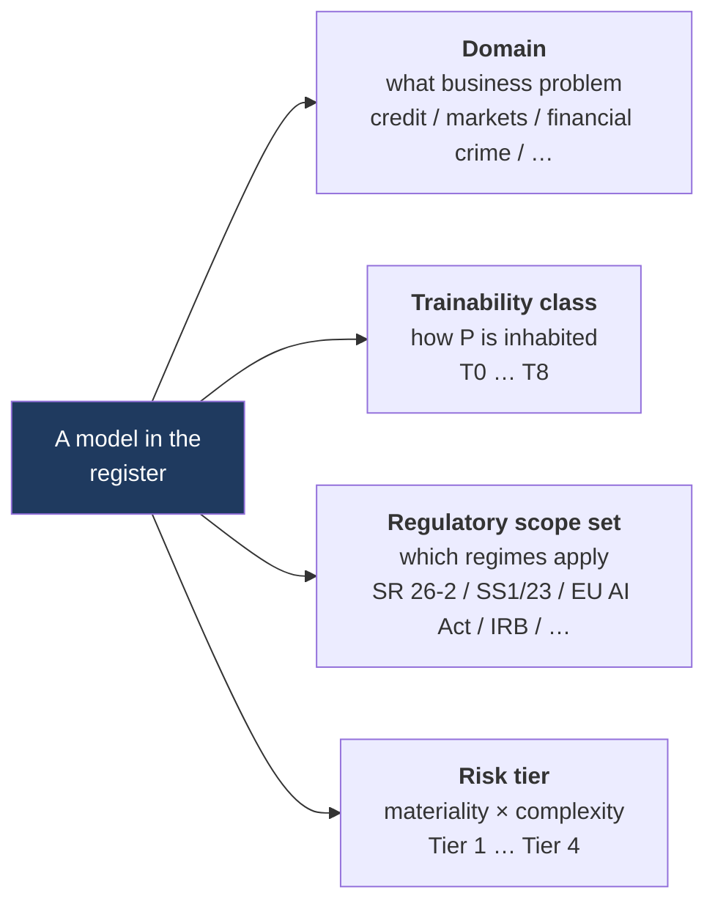
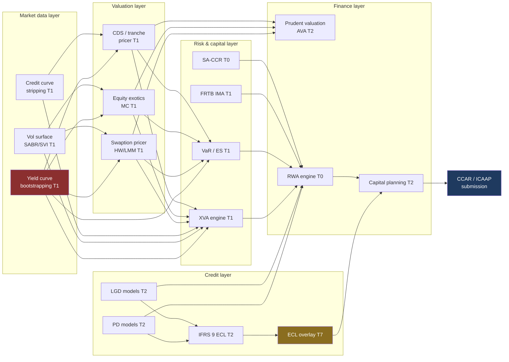

# 02 — Families, fibres, and what each owes as evidence

*MAYA — Model & AI Lifecycle Assurance.*  **Evidence, not assertion.**

> **What this document is.** Two things, kept apart on purpose.
>
> **The fibre** — the nine ways a parameter object can be inhabited, what each one *means*, what
> evidence each owes, and what each refuses. This part is normative: the classification is computed by
> `core/domain/algebra.py` and everything downstream keys on it.
>
> **The catalogue** — a reference list of the model families a large universal bank actually runs,
> eleven domains of them, so that whoever seeds a register has something better than a blank page. This
> part is descriptive. It is not reference data that ships; see §13, which says what does.

---

## How to read this document

Every model in MAYA carries **four orthogonal classifications**. Confusing them is the classic mistake
that makes an inventory unusable, and it is usually one specific confusion: collapsing *what kind of
thing this is* into *how risky it is*.



| | What it is | Who sets it | What it decides |
|---|---|---|---|
| **Domain** | organisational and stable | a person, once | ownership, reporting, the shape of the estate view |
| **Trainability class** | technical, and **derived** | nobody — computed from the kernel | which verbs a warrant may ask for, what evidence is coherent, what monitoring can answer |
| **Regulatory scope set** | jurisdictional, and **multi-valued** | a regime, from inventory facts, with the determination recorded | which obligations attach, and which supervisor to answer in the vocabulary of |
| **Risk tier** | **derived** from two separate lattices | the tiering engine, recomputed | control depth: approval quorum, validation scope, monitoring cadence |

Two of the four are derived and two are declared, and the split is the point. A register in which
somebody types the trainability class has a register in which somebody types it wrongly, and the
consequence is not a bad label — it is a validation checklist asking a closed-form pricer for its
training set.

---

## Part I — The fibre

### The derivation, exactly

A model is a parametric kernel `f : P ⊗ X → D(Y)`. The class is a function of **how `P` is
inhabited**, and of nothing else. `core/domain/algebra.py::ParametricKernel.trainability_class`
computes it, in this order:

```
if the parameter object is opaque          → T6      (it exists and is not ours to see)
if the parameter object is terminal        → T0      (P = I: there is no point to move to)
if fit is `train` and the kernel adapts    → T4
otherwise, by fit procedure:
    calibrate → T1   estimate → T2   train → T3   configure → T5   elicit → T7   author → T8
```

Two consequences worth stating because they are easy to assume away.

**`parameter_kind` alone does not decide the class.** Only the two extremes — `opaque` and `none` — are
read from it. Everything else is decided by the **fit procedure**, because that is the honest question:
not *what shape are the numbers* but *by what act did they come to be*. A kernel declaring
`learned_weights` with `fit: estimate` is **T2**, and correctly so — twenty coefficients from a solver
are an estimation whatever the field is called.

**`adaptive` is the only modifier**, and it promotes `train` to T4. A model that changes itself in
production is a different governance problem from one that is retrained on a cadence, and SS1/23 3.3(c)
says so explicitly by requiring parallel outcomes analysis for it.

| `parameter_kind` | `fit_procedure` | Class | `adaptive` |
|---|---|---|---|
| `none` | `none` | **T0** | ignored |
| `calibration_set` | `calibrate` | **T1** | ignored |
| `estimated_coefficients` | `estimate` | **T2** | ignored |
| `learned_weights` | `train` | **T3** | → **T4** |
| `llm_configuration` | `configure` | **T5** | ignored |
| `opaque` | — | **T6** | ignored |
| `elicited_weights` | `elicit` | **T7** | ignored |
| `rule_set` | `author` | **T8** | ignored |

### The nine fibres

| Class | What `P` is | How it comes to be inhabited | `fit` admissible? | Refresh is triggered by |
|---|---|---|---|---|
| **T0** Analytical | **empty** — the terminal object | it does not. There is nothing to fill | **No** — `L-W1` refuses it | a specification or regulation change |
| **T1** Market-calibrated | a calibration set, re-solved against observable quotes | a solver, usually every morning | Yes, `calibrate` | every market close, or on demand |
| **T2** Statistically estimated | a few coefficients, in the register as a record | an estimator over a historical sample | Yes, `estimate` | a periodic refit, or a trigger |
| **T3** Machine-learned | many weights, in the artifact store as bytes | a training run | Yes, `train` | schedule, drift, or performance decay |
| **T4** Adaptive | weights that move in production | a training run, then the model itself | Yes, `train` + continuous update | continuously, by the model |
| **T5** Configured | base model + prompt + corpus + tools + decoding + guardrails | configuration and retrieval, not fitting | Yes, `configure` | a prompt, corpus, tool, guardrail or **base-model** change |
| **T6** Vendor black box | exists, unreachable | somebody else's problem | **No** — `L-W1` refuses it | a vendor release |
| **T7** Expert judgment | weights or rules a panel agreed | elicitation from people | Yes, `elicit` | the committee cycle |
| **T8** Deterministic rule | a rule set somebody wrote | authorship | Yes, `author` | a policy change |

The `fit` column is not policy. `L-W1` refuses a fit warrant for T0 and T6 and states the reason —
*its parameters come from theory, not from data, so there is nothing to fit*; *its parameters are
inside a vendor black box and cannot be reached* — because a refusal that says "not permitted" teaches
somebody to ask for permission, and a refusal that names the fact about the kernel teaches them the
version is wrong.

### What evidence each fibre owes

The obligation differs by fibre because the *question* differs. Demanding a training dataset from a T0
is not strictness; it is a category error that fills the register with "N/A" until nobody reads a
field. Demanding an AUC from a T5 is the same error in the other direction.

| Class | Conceptual soundness rests on | Outcomes analysis is | Monitoring answers |
|---|---|---|---|
| **T0** | derivation against the published mathematics; conventions read against the term sheet | **benchmarking**, instrument by instrument, against an independent implementation, plus boundary behaviour — zero rates, negative rates, expiry today | *are the inputs still in the range this was benchmarked over* — a breach is a finding against the **use**, not against the mathematics |
| **T1** | the choice of dynamics, and the instrument set the calibration is solved against | repricing error on the calibration set, and on instruments held out of it; arbitrage-free checks | calibration residual, and **parameter stability** — mean reversion jumping 40% overnight is a different local minimum, not new information |
| **T2** | the specification: which regressors, which functional form, what was rejected | discrimination and calibration against realised outcomes, out of sample and out of time | drift in the inputs, decay in discrimination, and the calibration holding |
| **T3** | why the opacity was worth it, evidenced by a benchmark against a simpler incumbent | held-out replay; stability under perturbation; subgroup performance | score drift as the leading indicator, because the labels arrive late |
| **T4** | as T3, plus the change process itself: what may move autonomously and how far | **parallel outcomes analysis** across the change, comparing pre and post against actuals | the magnitude and frequency of autonomous change, with the parameter trajectory retained |
| **T5** | the assembly: what the model was told, what it may retrieve, what it may call | a **frozen evaluation set**, scored on it | regression against that evaluation set, on a schedule **and on every provider version change** |
| **T6** | the vendor's own validation, obtained and assessed rather than assumed | **your own outcomes**, on your own portfolio — the only evidence you control | divergence from your benchmark, and detection of a version change you were not told about |
| **T7** | panel composition, the questions asked, and the dissent | outcome analysis against the judgment, and inter-rater consistency | override rate, and whether the judgment is being overridden in one direction |
| **T8** | the rule read against the policy it implements | above-the-line and below-the-line testing | rule-fire distribution and exception rate |

**What the platform actually computes today.** The validation catalogue holds **eight** tests
— `discrimination.auc`, `discrimination.gini`, `discrimination.ks`, `calibration.brier`,
`calibration.expected_vs_actual`, `stability.psi`, `accuracy.rmse`, `accuracy.mae` — computed from
first definitions rather than pulled from a library. Monitors come in **four** kinds: `input_drift`,
`score_drift`, `performance` and `calibration`, and each admits only the tests that can answer it,
checked at definition time.

That covers the T2 and T3 columns above and part of T1. It does not cover T8's — whether the rule
reads the policy it claims to implement is a human judgment, and above-the-line and below-the-line
testing is not computed here. What the platform can now say about a T8 model is something no column
in this table anticipated, and it is the next section. **The rest of the table is a specification of
what those fibres need, not a description of what MAYA computes.** Arbitrage-free checks, convergence
diagnostics, groundedness and citation precision arrive as recorded results from wherever they were
computed; the platform holds them, gates on them and refuses a conclusion over a failed one, and does
not produce them. Saying otherwise would be the exact overclaim this table exists to prevent.

<a id="t8-the-fibre-that-was-least-served"></a>

### T8, the fibre that was least served

T8 is the largest population in a real bank by count and the worst governed by anything, because a
rule set is usually a spreadsheet, a stored procedure, or a paragraph of policy somebody transcribed
into code once. It was also, until recently, the class this platform served worst: the register held
`parameter_kind: rule_set`, `fit_procedure: author`, `provenance: declared`, and what it held them
*as* was an arbitrary JSON blob in `values`. Versioned, digested, approved by a second person — and
completely opaque. MAYA could tell you the rule set had changed and not one thing about what it said.

There was a second gap behind that one. The grammar has named a `rules` runtime since the first
milestone and no engine implemented it, so a T8 model could be registered, versioned, approved and
attested and never actually be **run** by anything MAYA could see. It was still scored, by whatever
stored procedure the bank was already using — the governed artefact and the executing artefact were
two documents nobody compared, which is the arrangement this platform exists to end.

Both are now closed. `core/rules/` gives the rule set a structure, four checks over it, and an
English rendering; `core/execution/runtimes/rules.py` runs it at the point of `P` that was approved.

#### The rule set has a shape

A rule set is ordered rules, **first match wins**, and a stated `otherwise`:

```json
{"rules": [{"id": "btl_high_ltv",
            "when":    {"all": [{"field": "product", "op": "eq", "value": "btl"},
                                {"field": "ltv", "op": "gt", "value": 0.8}]},
            "then":    {"decision": "refer"},
            "because": "BTL above 80% LTV is outside appetite (CP-2024-11)"}],
 "otherwise": {"decision": "accept"},
 "note": "Origination eligibility, retail mortgages"}
```

A condition is a field test — `field`, `op`, `value` over eleven operators — or an `all`, `any` or
`not` of conditions, nested at most six deep, and **nothing else**. There is no arithmetic and no
free text. `core/features/expressions.py` already parses a whitelisted arithmetic expression and
reusing it here would have been the obvious move; it is the wrong one, for a reason worth stating
plainly. **A free expression is opaque to analysis.** The whole argument for holding rule sets in a
governance platform is that a rule set is the one kind of model a non-programmer can review, and that
the platform can therefore say things about it that it cannot say about a network. None of those
things can be said about `x * 0.3 + y > threshold`. A rule that needs arithmetic needs a **derived
feature**, which is the same boundary drawn everywhere else: the platform transforms what it holds
and does not compute new quantities inside a governed object.

Two fields are required and both are refusals people will want waived. **`otherwise` is required**,
so totality holds by construction rather than by analysis: no input falls through, and there is no
implicit default anywhere in the platform. **`because` is required per rule** — the policy, the
limit, the regulation. A rule nobody can justify is a rule nobody can retire either, because nobody
knows what it was for, and it is the field an author will most want to skip.

#### The four checks

None of them is possible over a free expression, which is the whole of why the structure is the way
it is.

| | What it decides | How |
|---|---|---|
| **Totality** | no input falls through | by construction — `otherwise` is required, so there is nothing to analyse |
| **Reachability** | a rule an earlier rule already covers can never fire | each condition to disjunctive normal form, each conjunction to a domain per field — an interval, a permitted set, an excluded set, a null state — then containment is arithmetic |
| **Contradiction** | the same condition reaching two different outcomes | canonical form of the parsed condition, compared |
| **Conformance** | every field a rule reads is one the version's `input_schema` declares, no ordered operator is asked of a field with no order, no field is compared against a value of the wrong kind (`value_wrong_type`); every outcome field is in its `output_schema` | the same question `refines` answers for featureset satisfaction and typed composition (`L-20`, `L-21`), asked directly against the declared schema rather than routed through `core/domain/lattice.py` |

Reachability is the one worth having, and it is the `docs/11 §3` pattern — a control that reports
success while doing nothing — arrived at from the model side rather than the platform side. A rule
that can never fire never produces a wrong answer, so it survives every review; it appears in the
model card, gets cited in a committee paper, and somebody believes it is in force. No spreadsheet
tells you this.

**The analysis is sound and incomplete, and the distinction is the claim.** *Sound*: when it reports
a rule unreachable, the rule is unreachable — a check that cries wolf is a check somebody turns off,
and the real alarms go with it. *Incomplete*: it reports a rule unreachable when a **single** earlier
rule covers it. Two earlier rules that between them cover a third — `ltv > 0.8` and `ltv <= 0.8`
covering everything — are **not detected**. Full coverage checking is satisfiability over the theory;
it is decidable here and it is a solver, and a solver inside a governance platform is a dependency
whose failure modes nobody in the bank can debug.

So the promise is exactly this and is stated in these words on the rule-set page itself: **no rule is
shadowed by the earlier rules, singly or together.** A check that claims more than it
delivers is the thing this analysis exists to find.

Where the condition's normal form grows past 256 disjunctions the analysis says it **did not run**
rather than running partially and reporting no problems found, and the negation of `between` — which
has no single-atom form — is marked opaque rather than approximated, because an approximation there
would make the analysis unsound, and unsound is the one thing it must not be.

#### An editor, and why it is not a breach of the boundary

[10 §8](10-roadmap.md#8-what-maya-deliberately-will-not-own) says MAYA does not train models and does
not run them, and an authoring surface looks like a straight breach of that. It is not, and the
distinction is what keeps the rest of the boundary intact.

**MAYA does not become the authoring tool. It becomes an editor for a parameter set it already
held.** A T8 rule set was always `P` in the register — versioned, digested, approved by somebody
other than its author. What existed was the governed object; what did not exist was any way to type
into it except a raw JSON body. Publishing from the editor is `ParameterRegister.record` with a
validated document: the set lands `proposed`, `approve` still refuses `self_approval`, the digest is
still taken over the content, the second reviewer is still a different person. No new authority is
minted anywhere.

**This is explicitly not an ONNX or PMML editor**, and the reason is the one that decides the whole
question. Those formats serialize a *fitted* map; authoring one by hand would let MAYA mint an
artifact that has never been trained or validated and is indistinguishable in the register from one
that was. A rule set has no training run to be indistinguishable from. **Authorship is its
provenance** — which is precisely what `declared` means in the provenance vocabulary, and why T0, T7
and T8 sit there together.

Two smaller lines fall out of the same argument. **Rendering is separate from authoring**: the
English form and the canonical bytes carry no authority and can be re-run over an approved set
without authoring anything. And **trialling a draft records nothing and decides nothing** — it is
deliberately not routed through `/execute`, because there is no warrant and no entitlement when an
author reads their own draft back, and an authority invented for a convenience is the kind that turns
up later attached to something else.

#### The decision names the rule that made it

Every decision carries `matched_rule` and `because`, and they travel even when the output schema does
not declare them. That is not diagnostics. A decision a bank cannot attribute to a rule is a decision
it cannot explain to the customer it refused, and under most consumer-credit regimes **the
explanation is the obligation** rather than the outcome.

The `rules` runtime is also absent from `UNVERIFIABLE_DETERMINISM` (`L-W5`), for the same reason the
captive estimator is: MAYA holds the rule set, reads it, and can therefore verify a determinism claim
by executing it — stronger evidence than a seed.

#### What is still not built for T8

The coverage analysis is single-rule, as above.

**Conformance declines to have an opinion on two kinds of dtype, deliberately.** A numeric field
compared with text, or a textual field compared with a number, is refused `value_wrong_type` — that
comparison can never be true, and a rule that can never fire is the outcome `conforms` exists to
prevent. But `date` and `datetime` are checked for neither: a date is an epoch in some registers and
an ISO string in others, and refusing one spelling would refuse correct rules. An unrecognised dtype
is somebody's extension and is likewise left alone. A conformance check that produces false refusals
is one somebody turns off, and the real ones go with it.

Nothing computes above-the-line and below-the-line testing or a rule-fire distribution — the third
column of the T8 row is still a specification of what the fibre needs, and the `trial` endpoint's
per-rule fire counts over sample rows are an author's sanity check before approval, not a monitoring
result.

**What has changed is the getting-in.** The gap that decided whether T8 coverage was a demonstration
or a programme was never the register: it was that a bank's rulebook is a decision table four people
maintain in a spreadsheet, and typing it in is the whole migration. `core/rules/importing.py` reads a
CSV decision table and a DMN 1.3 table into a **candidate** — which takes the same check, trial and
publish path a hand-written rule set does, second-person approval included.

The refusals are the reason it is safe to use. **A misread threshold does not fail**: it produces a
rule set that loads, validates, publishes and then decides differently from the rulebook it claims to
be, and nobody finds that by looking at it. So a cell that is a human judgement is reported rather
than guessed at and the document is refused *whole*; a hit policy that cannot map onto first-match is
refused *by name* with what the approximation would silently become; and the catch-all is **derived**
from first-match semantics rather than inferred from a row's position. A stored procedure is not
translated and will not be.

MAYA still holds the T8 population and does not find it (§11) — though the contract a scanner must
meet is now published, and a reference scanner ships in `tools/scanner/`.

### How a run says which point of `P` it is running at

Fitting does not change the kernel — it picks a point in `P` — so every run has to name the point.
There are five ways, and the vocabulary is closed:

| `parameters.source.binding` | Means | Typical fibre |
|---|---|---|
| `declared` | the values ride on the warrant | T0's constants, T8's thresholds |
| `parameter_set` | a registered inhabitant of `P`, by id and digest | T1, T2, T5, T7 |
| `artifact` | the artifact *is* `P`, and the digest is required (`L-W12`) | T3, T4 |
| `to_be_fitted` | this warrant is the fit that produces them | any fittable class |
| `vendor_internal` | they exist and are not ours to see | T6 |

`L-W8` refuses a run that will not say which. Only a `fit` may leave it unfilled, and a `fit` must bind
`to_be_fitted` and nothing else — it *writes* the parameter object, so declaring that it reads one
describes the wrong direction.

### One fibre per tutorial

**These eight tutorials do not exist.** Sixteen were written, then replaced by
six that were produced *by running them* against a live instance — a pass that
found eight defects in the platform, which is the whole argument for writing a
walkthrough that way. The eleven per-fibre ones were not rewritten under that
discipline and were removed rather than left standing as prose nobody had
executed. Their links stayed here for two milestones, pointing at files that had
been deleted.

What exists is eight walkthroughs, each run end to end:

| Tutorial | What it works through |
|---|---|
| [Defining a model](../content/tutorials/01-defining-a-model.md) | registration, the kernel, the trainability class MAYA *derives* rather than accepts |
| [Features](../content/tutorials/02-features.md) | definition, derivation, the two clocks, loading rows |
| [Featuresets](../content/tutorials/03-featuresets.md) | slots, bindings, publication, the digest a warrant pins |
| [Warrants and training](../content/tutorials/04-warrants-and-training.md) | a fit warrant, the parameters it produces, and running one |
| [The model package](../content/tutorials/05-model-package.md) | everything about a model in one download |
| [One model, end to end](../content/tutorials/06-end-to-end.md) | a multiple linear regression the whole way, as one script whose every response is real |

The per-fibre material is not lost, only unworked: the fibre table in §4 states
each class's `parameter_kind`, `fit_procedure`, runtime and evidence schema, and
the warrant grammar refuses the combinations that make no sense. What is missing
is a narrative for each, and this document should not pretend otherwise.

**One fibre has no tutorial and one is only named.** T7 (expert judgment) is specified here and in
the warrant grammar and is not worked anywhere; T6 (vendor black box) appears as a row in the map and
as a refusal, without a walkthrough of its own. Both are fibres a bank's estate contains in quantity,
and the gap is worth knowing about rather than discovering. T8 was the third of them until
`core/rules/` — the fibre a bank has most of, and the one the platform served worst.

> **A discrepancy, recorded rather than smoothed over.** The tutorials label the two `estimate` models
> **T3** and the `train` model **T4**. The derivation above gives **T2** and **T3**. The code is
> authoritative — `core/domain/algebra.py` is what the register calls, and
> `tests/test_domain.py` asserts it — so the tutorials' labels are wrong and the mapping in this
> document is right. It is recorded here rather than corrected silently because the same slip in a
> register would change which verbs a warrant admits.

### What a fibre is *not*, yet

The design in [00 §7](00-mathematical-foundations.md) treats the model class as a **fibre** over the
register, with a total evidence schema, lifecycle, metric set and template set for each — and `L-15`
asserts that no fibre is empty.

**That is now built, and it is indexed by the trainability class rather than by `model_class`.** The
reason is the same one this whole document is about: `model_class` is declared, and a totality gate
over declared free text is defeated by typing an unregistered word. The trainability class is derived,
so the index cannot be typed wrong.

Which means §5 above is no longer a reference for whoever seeds a register by hand. It **is** the
fibre — `core/fibres/library.py` carries those three columns verbatim for each of the nine classes,
because two statements of one rule disagree eventually and the direction they disagree in is whichever
one the reader happened to open. `FibreRegistry.verify()` runs at start-up and refuses to serve on a
partial fibration (`L-15`).

The fibre is read, not merely held: a `performance` monitor on a T0 pricer and a `calibration` monitor
on a T5 generative assembly are refused `kind_not_answerable`, where before both were accepted and ran
forever without meaning anything — which reads on the estate screen as coverage, and is worse than an
absent monitor, because an absent monitor is visible in the worklist.

---

## Part II — The catalogue

Eleven domains, as a large universal bank with retail, commercial, markets, wealth and treasury
businesses would find them. A bank of that shape typically instantiates **800–3,000 models** across
these families, plus end-user computing in the thousands to tens of thousands.

Column key:

| Column | Meaning |
|---|---|
| **T** | the trainability class this family usually lands in. Two values means the family genuinely splits |
| **Cadence** | typical parameter refresh or recalibration frequency |
| **Tier** | the risk tier this family typically reaches at a large bank (1 = highest). A **hint**, never a stored value: the tier is derived per model by the tiering engine |
| **Evidence that matters** | the measurement this family lives or dies by. Where MAYA does not compute it, it holds it — see *What the platform actually computes today* above |

---

## 1. Domain A — Credit risk

### A1. Regulatory capital (IRB / Basel)

| Model | T | Cadence | Tier | Evidence that matters |
|---|---|---|---|---|
| Retail & wholesale **PD** rating models | T2 | Annual refit | 1 | AUC/Gini, HL calibration test, rating migration, PSI, override rate |
| **LGD** models (workout, market, downturn LGD) | T2 | Annual | 1 | MAE/RMSE vs realised, downturn add-on adequacy, backtest |
| **EAD / CCF** models | T2 | Annual | 1 | Realised vs predicted CCF, utilisation drift |
| **Slotting** models for specialised lending | T7 | Annual | 2 | Slot migration, override rate |
| Effective **maturity** calculation | T0 | On change | 3 | Implementation regression |
| **Rating master scale** & PD calibration mapping | T2/T7 | Annual | 1 | Concentration by grade, monotonicity |
| **Margin of conservatism (MoC)** framework | T7 | Annual | 1 | MoC decomposition, deficiency coverage |

### A2. Accounting provisions (IFRS 9 / CECL)

| Model | T | Cadence | Tier | Evidence that matters |
|---|---|---|---|---|
| **Lifetime PD term structure** | T2 | Quarterly | 1 | Backtest vs realised default curve, vintage stability |
| **Lifetime LGD / collateral haircut** | T2 | Semi-annual | 1 | Realised vs predicted, collateral realisation lag |
| **EAD / behavioural balance projection** | T2 | Semi-annual | 1 | Predicted vs actual balance |
| **SICR / staging trigger** | T7/T2 | Quarterly | 1 | Stage migration matrix, stage-2 volatility, trigger hit-rate |
| **Macroeconomic scenario weighting** | T7 | Quarterly | 1 | Weight stability, non-linearity check |
| **Macro-to-risk-parameter (satellite) models** | T2 | Semi-annual | 1 | Elasticity plausibility, out-of-time fit |
| **Discounting / EIR** engine | T0 | On change | 3 | Implementation regression |
| **Post-model adjustments / management overlays** | T7 | Quarterly | 1 | **PMA magnitude as % of ECL, ageing, recurrence** |

> The last row is deliberately a row in the inventory rather than a note attached to one. Under SS1/23
> Principle 5 and IFRS 9 audit expectations an overlay must be registered, justified, quantified, aged
> and trended — and an overlay renewed past its limit is an unversioned model change wearing a
> temporary label. MAYA holds four adjustment kinds — `parameter`, `output`, `exclusion`,
> `judgemental` — each time-boxed, each refusing renewal without a measurement for the period.

### A3. Origination, underwriting and account management

| Model | T | Cadence | Tier | Evidence that matters |
|---|---|---|---|---|
| **Application scorecards** (cards, mortgage, auto, personal, SME) | T2 | 12–24 mo | 1–2 | KS, Gini, PSI/CSI, approval rate, early default (FPD/SPD), **fairness / AIR** |
| **Behavioural scorecards** | T2 | 12–24 mo | 2 | KS, PSI, roll-rate accuracy |
| **Thin-file / alternative-data scoring** | T3 | 12 mo | 1 | Gini, coverage, **proxy-discrimination testing**, LDA search record |
| **Income estimation & verification** | T3 | 12 mo | 2 | MAPE, verification match rate |
| **Affordability / DTI / stress-rate** models | T2/T0 | Annual | 1 | Arrears by affordability band |
| **Credit line assignment (CLI/CLD)** | T2/T3 | 12 mo | 2 | Utilisation, loss rate by line band, revenue lift |
| **Authorisation / real-time decision** | T3 | 6–12 mo | 1 | Approval rate, loss rate, latency p99 |
| **Pre-approval / pre-screen eligibility** | T2 | 12 mo | 2 | Take-up, adverse selection |
| **Application fraud at origination** | T3 | 3–6 mo | 1 | Detection rate, FPR, value prevented |
| **Adverse-action reason-code generator** | T0/T3 | On model change | 1 | **Reason accuracy, Reg B mapping coverage, causal fidelity** |

### A4. Collections, recovery and workout

| Model | T | Cadence | Tier | Evidence that matters |
|---|---|---|---|---|
| **Collections prioritisation / propensity to pay** | T3 | 6–12 mo | 2 | Cure rate lift, contact efficiency |
| **Roll-rate / delinquency transition** | T2 | Quarterly | 2 | Transition matrix backtest |
| **Recovery / post-default LGD** | T2 | Annual | 1 | Realised recovery vs predicted, timing error |
| **Settlement / hardship offer optimisation** | T3 | 12 mo | 2 | NPV lift, re-default rate, **fairness and vulnerability testing** |
| **Repossession & asset disposal value** | T2 | Annual | 2 | Realised sale price vs estimate |

### A5. Wholesale, counterparty and structured credit

| Model | T | Cadence | Tier | Evidence that matters |
|---|---|---|---|---|
| **Obligor rating** (corporate, FI, sovereign, NBFI, project finance) | T2/T7 | Annual | 1 | Accuracy ratio, migration, override rate |
| **Facility rating / recovery rating** | T2/T7 | Annual | 1 | Realised recovery |
| **Country / sovereign risk scorecard** | T7 | Annual | 2 | Event backtest |
| **Financial spreading & early-warning signals** | T3 | 12 mo | 2 | Lead time to downgrade, precision/recall |
| **Covenant breach prediction** | T3 | 12 mo | 3 | Precision, lead time |
| **Credit portfolio / economic capital model** (copula, factor) | T2 | Annual | 1 | Capital sensitivity, correlation stability |
| **Concentration risk** (HHI, granularity adjustment) | T0/T2 | Quarterly | 2 | Implementation regression |
| **Counterparty credit exposure** (EPE/PFE simulation) | T1 | Daily calibration | 1 | Backtesting exceptions, collateral modelling error |
| **SA-CCR** engine | T0 | On regulation change | 2 | Implementation regression vs reference |
| **CVA capital** (BA-CVA / SA-CVA) | T0/T1 | Daily | 1 | Reconciliation to front-office CVA |
| **Wrong-way risk** | T1 | Quarterly | 2 | Correlation stability |
| **Initial margin (ISDA SIMM)** | T0 | Semi-annual version | 1 | Backtesting, benchmarking vs counterparties |
| **Collateral haircut** models | T2 | Quarterly | 2 | Coverage backtest |
| **ABS / RMBS / CMBS cashflow & waterfall** engines | T0 | On deal | 2 | Cashflow reconciliation |
| **Prepayment / default / severity curves** for structured products | T2 | Quarterly | 1 | Realised vs projected CPR/CDR |
| **Rating-agency methodology replication** | T0/T7 | Annual | 3 | Divergence vs agency rating |

---

## 2. Domain B — Market risk, valuation and trading

### B1. Curve, surface and market-data construction

| Model | T | Cadence | Tier | Evidence that matters |
|---|---|---|---|---|
| **Yield curve bootstrapping / multi-curve OIS discounting** | T1 | Intraday/daily | 1 | Repricing error on calibration instruments, smoothness, arbitrage checks |
| **Volatility surface construction** (SVI, SABR, LSV) | T1 | Daily | 1 | Calibration RMSE, **static arbitrage checks (butterfly, calendar)** |
| **Basis, cross-currency & tenor basis curves** | T1 | Daily | 1 | Repricing error |
| **Credit curve / hazard-rate stripping** | T1 | Daily | 1 | CDS repricing error |
| **Inflation curve (seasonality)** | T1 | Daily | 2 | Repricing error |
| **Interpolation / extrapolation schemes** | T0 | On change | 2 | Reference benchmark |
| **Proxy / mapping models for illiquid marks** | T7/T2 | Quarterly | 1 | Proxy backtest vs observed trades |

> This is the most under-inventoried family in most banks and the most systemically important one. A
> single curve model is a feeder to hundreds of downstream valuation models, which is why §12 exists
> and why an `input_to` edge that is recorded and never type-checked is worse than no edge at all.

### B2. Derivative pricing and valuation

| Model | T | Cadence | Tier | Evidence that matters |
|---|---|---|---|---|
| **Black–Scholes / Bachelier / Black-76** | T0 | Static | 2 | Analytical benchmark regression |
| **Local vol (Dupire), stochastic vol (Heston), LSV** | T1 | Daily calibration | 1 | Calibration error, vanilla repricing |
| **Short-rate (Hull–White, BK), HJM, LIBOR/RFR market model** | T1 | Daily/weekly | 1 | Swaption repricing, hedge P&L explain |
| **FX (Garman–Kohlhagen, quanto, multi-currency)** | T1 | Daily | 2 | Repricing error |
| **Commodity (Schwartz–Smith, Gabillon, seasonal)** | T1 | Daily | 2 | Forward-curve fit |
| **Equity exotics** (Monte Carlo, PDE, tree, American MC/LSM) | T1 | Daily | 1 | Convergence, greeks stability, benchmark |
| **Credit derivatives** (CDS, index, base correlation, CDO tranche) | T1 | Daily | 1 | Tranche repricing, correlation skew stability |
| **Hybrid / multi-asset & structured note pricers** | T1 | Daily | 1 | Independent price verification divergence |
| **Convertible / callable bond models** | T1 | Daily | 2 | Repricing |
| **Insurance-linked / longevity pricing** | T2 | Annual | 3 | Experience analysis |

### B3. XVA and valuation adjustments

| Model | T | Cadence | Tier | Evidence that matters |
|---|---|---|---|---|
| **CVA / DVA** | T1 | Daily | 1 | P&L explain, sensitivity stability, hedge effectiveness |
| **FVA / MVA / ColVA / KVA** | T1 | Daily | 1 | P&L explain, funding-curve sensitivity |
| **Exposure simulation engine (American MC, regression)** | T1 | Daily | 1 | Convergence, regression-basis stability |

### B4. Market risk measurement and capital

| Model | T | Cadence | Tier | Evidence that matters |
|---|---|---|---|---|
| **Historical / parametric / Monte-Carlo VaR** | T1/T2 | Daily | 1 | **Backtesting exceptions (Basel traffic light)**, VaR/P&L ratio |
| **Stressed VaR** | T1 | Daily | 1 | Stress-window selection stability |
| **Expected Shortfall (FRTB IMA)** | T1 | Daily | 1 | ES backtest, liquidity-horizon scaling |
| **P&L Attribution (PLA) test engine** | T0 | Daily | 1 | Spearman/KS PLA zone |
| **Non-Modellable Risk Factor / SES** | T1 | Quarterly | 1 | RFET pass rate |
| **Default Risk Charge** | T1 | Daily | 1 | Backtest |
| **FRTB Standardised Approach (SBM) sensitivities** | T0 | Daily | 1 | Reconciliation to the risk engine |
| **Incremental Risk Charge (legacy)** | T1 | Daily | 2 | Backtest |
| **Risk-factor mapping / proxy** | T7 | Quarterly | 2 | Proxy R², residual analysis |
| **Prudent valuation / AVA** | T2/T7 | Quarterly | 1 | AVA coverage, IPV divergence |
| **Model reserve / uncertainty reserve** | T7 | Quarterly | 1 | Reserve adequacy backtest |
| **Level 3 fair value estimation** | T7/T1 | Quarterly | 1 | Observed-trade divergence |

### B5. Trading, execution and quantitative investment

| Model | T | Cadence | Tier | Evidence that matters |
|---|---|---|---|---|
| **Algorithmic execution (VWAP, TWAP, IS, POV)** | T3 | Continuous | 1 | Slippage vs benchmark, fill rate, **market-abuse surveillance flags** |
| **Market making / auto-quoting / skewing** | T4 | Continuous | 1 | Spread capture, adverse selection, inventory risk |
| **Smart order routing** | T3 | Monthly | 2 | Venue fill quality, best-execution metrics |
| **Market impact / transaction cost analysis** | T2 | Quarterly | 2 | Predicted vs realised impact |
| **Systematic alpha / statistical arbitrage signals** | T3 | Continuous | 1 | Information ratio, decay, capacity, turnover |
| **Portfolio construction & optimisation** | T0/T2 | Daily | 2 | Constraint satisfaction, ex-ante vs ex-post risk |
| **Securities lending / repo pricing & availability** | T2 | Daily | 3 | Rate prediction error |
| **Asset liquidity / liquidity horizon** | T2 | Quarterly | 2 | Realised liquidation cost |

---

## 3. Domain C — Treasury, ALM, liquidity and capital

| Model | T | Cadence | Tier | Evidence that matters |
|---|---|---|---|---|
| **IRRBB — Economic Value of Equity** | T1/T0 | Monthly | 1 | Scenario reasonableness, sensitivity attribution |
| **IRRBB — Net Interest Income simulation** | T2 | Monthly | 1 | Forecast vs actual NII |
| **Repricing gap / basis risk** | T0 | Monthly | 2 | Implementation regression |
| **Non-Maturity Deposit core/volatile split & effective maturity** | T2 | Annual | 1 | Balance stability backtest, decay-curve fit |
| **Deposit beta / rate pass-through** | T2 | Semi-annual | 1 | Predicted vs actual beta by segment |
| **Deposit attrition / decay** | T2 | Annual | 1 | Survival-curve backtest |
| **Mortgage & loan prepayment (CPR)** | T2/T3 | Quarterly | 1 | Realised vs projected CPR, refi-incentive elasticity |
| **Pipeline fallout / lock commitment** | T2 | Quarterly | 2 | Fallout rate error |
| **Credit line utilisation / drawdown under stress** | T2 | Semi-annual | 1 | Realised draw vs projected |
| **Early redemption / surrender** | T2 | Annual | 2 | Backtest |
| **LCR / NSFR calculation engines** | T0 | On regulation change | 1 | Regulatory reconciliation, implementation regression |
| **Liquidity stress testing / survival horizon** | T2/T7 | Monthly | 1 | Scenario severity calibration, outflow backtest |
| **Intraday liquidity** | T2 | Monthly | 2 | Peak-usage prediction |
| **Contingent funding & collateral optimisation** | T0/T2 | Monthly | 2 | Optimality gap |
| **Funds Transfer Pricing curves & liquidity premium** | T0/T2 | Monthly | 1 | Reconciliation to actual funding cost |
| **RWA engines (credit, market, operational)** | T0 | On regulation change | 1 | Regulatory reporting reconciliation |
| **Capital planning / forecasting** | T2 | Quarterly | 1 | Forecast vs actual capital ratios |
| **Economic capital aggregation & diversification** | T2 | Annual | 1 | Correlation-assumption sensitivity |
| **RAROC / EVA / capital allocation** | T0/T2 | Monthly | 2 | Allocation reconciliation |
| **Leverage ratio / TLAC / MREL** | T0 | On change | 2 | Reconciliation |
| **Hedge effectiveness (IFRS 9 / ASC 815)** | T0/T2 | Quarterly | 1 | Effectiveness ratio, de-designation events |
| **Pension / post-retirement actuarial** | T2/T7 | Annual | 2 | Experience analysis |
| **Balance-sheet optimisation** | T0 | Monthly | 2 | Optimality, constraint feasibility |

---

## 4. Domain D — Stress testing, scenario and climate

| Model | T | Cadence | Tier | Evidence that matters |
|---|---|---|---|---|
| **PPNR — net interest income projection** | T2 | Annual (CCAR cycle) | 1 | Out-of-time forecast error, scenario sensitivity |
| **PPNR — fee & non-interest income** | T2 | Annual | 1 | Forecast error |
| **PPNR — non-interest expense** | T2 | Annual | 1 | Forecast error |
| **PPNR — trading revenue / global market shock** | T1 | Annual | 1 | Shock reconciliation |
| **Stressed credit loss projection** | T2 | Annual | 1 | Backtest across historical downturns |
| **Stressed operational loss projection** | T2/T7 | Annual | 1 | Scenario plausibility |
| **Balance-sheet / RWA projection** | T2 | Annual | 1 | Forecast error |
| **Macroeconomic scenario expansion** | T2 | Annual | 1 | Cointegration stability, plausibility bounds |
| **Economic Scenario Generator** | T1 | Annual | 1 | Martingale tests, distributional calibration |
| **Reverse stress testing** | T7/T2 | Annual | 2 | Scenario severity vs break point |
| **Climate physical risk** (hazard → asset damage) | T2/T6 | Annual | 2 | Hazard-model provenance, geospatial coverage |
| **Climate transition risk** (carbon price → sector PD/LGD) | T2 | Annual | 2 | Sensitivity plausibility |
| **Financed emissions / PCAF** | T0/T2 | Annual | 2 | Data-quality score distribution |
| **Climate-adjusted PD/LGD overlays** | T7 | Annual | 2 | Overlay magnitude, overlay register linkage |
| **ICAAP / ILAAP aggregation** | T0 | Annual | 1 | Reconciliation |

---

## 5. Domain E — Financial crime, fraud and compliance

### E1. AML / CTF

| Model | T | Cadence | Tier | Evidence that matters |
|---|---|---|---|---|
| **Transaction monitoring — rules/scenarios** | T8 | Continuous tuning | 1 | Alert volume, **above/below-the-line testing**, SAR conversion rate |
| **Transaction monitoring — ML anomaly / network** | T3 | 6–12 mo | 1 | Precision/recall, SAR conversion, drift |
| **Scenario threshold tuning / segmentation** | T2 | Semi-annual | 1 | ATL/BTL effectiveness, segment stability |
| **Customer Risk Rating (KYC risk score)** | T2/T7 | Annual | 1 | Rating distribution, override rate, SAR correlation |
| **Entity resolution / identity matching** | T3 | 12 mo | 2 | Precision/recall, merge/split error |
| **Beneficial ownership / network traversal** | T3/T8 | 12 mo | 2 | Coverage, path accuracy |
| **Sanctions & watchlist screening (fuzzy name matching)** | T3/T8 | Continuous | 1 | **True-hit recall (must approach 100%)**, FP rate, list-update latency |
| **False-positive reduction / alert triage** | T3 | 6 mo | 1 | **Recall preservation on known-true alerts**, FP reduction, hibernation risk |
| **Mule / laundering network detection** | T3 | 6–12 mo | 1 | Precision, network coverage |
| **SAR narrative drafting** | T5 | On prompt/base change | 1 | Groundedness, factual accuracy, completeness, **human edit distance** |

### E2. Fraud

| Model | T | Cadence | Tier | Evidence that matters |
|---|---|---|---|---|
| **Card / transaction fraud (real-time)** | T3/T4 | Weekly–monthly | 1 | Detection rate at FPR, value prevented, **latency p99**, customer friction |
| **ACH / wire / RTP / faster-payments fraud** | T3 | Monthly | 1 | Detection, FPR, value at risk |
| **Authorised Push Payment scam detection** | T3 | Monthly | 1 | Scam recall, reimbursement exposure |
| **Account takeover** | T3 | Monthly | 1 | Detection, FPR |
| **Synthetic identity detection** | T3 | Quarterly | 1 | Precision, downstream loss avoided |
| **Device fingerprinting / behavioural biometrics** | T3/T6 | Vendor cadence | 2 | Match rate, spoof resistance |
| **Merchant / acquirer risk & chargeback** | T2 | Quarterly | 2 | Chargeback prediction error |
| **Internal fraud / insider threat** | T3 | Annual | 2 | Precision, investigation yield |
| **Cheque / deposit fraud** | T3 | Quarterly | 2 | Detection, hold-decision impact |

### E3. Conduct, markets and regulatory compliance

| Model | T | Cadence | Tier | Evidence that matters |
|---|---|---|---|---|
| **Trade surveillance / market abuse** | T8/T3 | Semi-annual tuning | 1 | Alert-to-case rate, scenario coverage |
| **Communications surveillance (lexicon + classifier)** | T3/T5 | Quarterly | 1 | Recall on seeded cases, FP rate |
| **Best execution / RTS 27-28 analytics** | T0/T2 | Quarterly | 2 | Reconciliation |
| **Complaints classification & root cause** | T3/T5 | Semi-annual | 2 | Classification accuracy, escalation recall |
| **Vulnerable-customer identification** | T3 | Annual | 1 | Recall, **fairness and dignity review** |
| **Suitability / appropriateness assessment** | T2/T7 | Annual | 1 | Mis-selling backtest |
| **FATCA / CRS classification** | T8 | On regulation change | 2 | Classification error rate |
| **Sanctions-evasion typology detection** | T3 | Semi-annual | 1 | Typology coverage |

---

## 6. Domain F — Operational, non-financial and enterprise risk

| Model | T | Cadence | Tier | Evidence that matters |
|---|---|---|---|---|
| **Operational risk capital (SMA / legacy AMA-LDA)** | T2 | Annual | 1 | Loss-distribution fit, backtest |
| **Operational risk scenario analysis** | T7 | Annual | 1 | Scenario plausibility, SME consistency |
| **RCSA scoring & control effectiveness** | T7 | Annual | 3 | Rating consistency, issue correlation |
| **Cyber risk quantification (FAIR-style)** | T2/T7 | Annual | 2 | Scenario calibration vs incidents |
| **Third-party / vendor risk scoring** | T2/T6 | Annual | 2 | Incident correlation |
| **Operational resilience / impact tolerance** | T0/T7 | Annual | 2 | Scenario coverage |
| **Legal & litigation provisioning** | T7 | Quarterly | 2 | Provision adequacy backtest |
| **Key-risk-indicator forecasting** | T2 | Quarterly | 3 | Forecast error |
| **The firm's own model tiering approach** | T2/T7 | Annual | 1 | Self-validation — see the note below |

> **The tiering model is a model.** SS1/23 1.3(d) requires the firm-wide tiering approach to be
> periodically validated and individual assignments independently reassessed at validation. A register
> that cannot hold its own tiering rule has a governance hole exactly where control depth is decided.
> In MAYA the rule is a **versioned policy** in the policy register, which ships with its own cases,
> cannot be published until they pass, must include at least one case it *refuses*, and reports every
> verdict that flipped when a new version is published — so a weakening is something somebody decided
> rather than something somebody discovered.

---

## 7. Domain G — Customer, pricing, marketing and wealth

| Model | T | Cadence | Tier | Evidence that matters |
|---|---|---|---|---|
| **Propensity / response** | T3 | Quarterly | 3 | AUC, lift, campaign return |
| **Uplift / incremental response** | T3 | Quarterly | 3 | Qini, uplift@k |
| **Next-Best-Action / offer orchestration** | T3/T4 | Continuous | 2 | Reward, exploration ratio, **fairness of offer distribution** |
| **Churn / attrition** | T3 | Quarterly | 3 | AUC, retained value |
| **Customer lifetime value** | T2 | Semi-annual | 3 | Forecast error |
| **Segmentation / clustering** | T3 | Annual | 4 | Cluster stability, silhouette |
| **Loan pricing & rate-sheet optimisation** | T2/T3 | Quarterly | 1 | Margin vs volume, **price-discrimination and fair-lending testing** |
| **Deposit pricing elasticity** | T2 | Quarterly | 1 | Volume response error |
| **Fee & discount optimisation** | T3 | Quarterly | 2 | Revenue lift, **UDAAP review** |
| **Recommendation engine** | T3 | Monthly | 3 | CTR, conversion, diversity |
| **Marketing mix modelling & attribution** | T2 | Semi-annual | 3 | Holdout validation |
| **Media budget optimisation** | T0/T2 | Quarterly | 4 | Optimality gap |
| **Robo-advisory strategic asset allocation** | T0/T2 | Annual | 1 | Tracking error, suitability breach rate |
| **Risk profiling / tolerance questionnaire scoring** | T7 | Annual | 1 | Mis-classification, complaint correlation |
| **Goal-based planning / Monte-Carlo wealth projection** | T1 | Annual | 2 | Distributional calibration |
| **Tax-loss harvesting** | T0 | Annual | 3 | Wash-sale compliance |
| **Insurance cross-sell & bancassurance propensity** | T3 | Quarterly | 3 | Conversion lift |

---

## 8. Domain H — Operations, technology and workforce

| Model | T | Cadence | Tier | Evidence that matters |
|---|---|---|---|---|
| **Branch / call-centre / ATM demand forecasting** | T2 | Monthly | 3 | MAPE |
| **ATM & branch cash optimisation** | T0/T2 | Monthly | 3 | Stock-out rate, carry cost |
| **Workforce scheduling & staffing optimisation** | T0 | Weekly | 3 | Service-level attainment |
| **Intelligent document processing** | T3/T5 | Quarterly | 2 | Field-level accuracy, STP rate, exception rate |
| **KYC document verification / liveness / biometric match** | T3/T6 | Vendor cadence | 1 | FAR/FRR, **demographic differential** |
| **Customer-service chatbot / virtual assistant** | T5 | On prompt/base change | 1 | Containment, escalation, groundedness, **harmful-advice rate** |
| **Call routing / intent classification** | T3 | Quarterly | 3 | Routing accuracy |
| **Speech & sentiment analytics** | T3/T5 | Semi-annual | 3 | WER, sentiment accuracy |
| **Agent assist / next-best-response** | T5 | On change | 2 | Suggestion acceptance, accuracy |
| **IT capacity & incident forecasting** | T3 | Quarterly | 4 | Precision, MTTR impact |
| **Payment routing / least-cost routing** | T0/T2 | Monthly | 2 | Cost saving, failure rate |
| **Reconciliation & matching** | T3/T8 | Semi-annual | 2 | Auto-match rate, false-match rate |
| **Process mining / bottleneck detection** | T3 | Annual | 4 | — |
| **HR: attrition prediction** | T3 | Annual | 2 | AUC; **EU AI Act Annex III(4) high-risk** |
| **HR: CV screening / candidate ranking** | T3/T5 | Annual | 1 | **EU AI Act high-risk; adverse-impact ratio mandatory** |

---

## 9. Domain I — Finance, accounting and regulatory reporting

| Model | T | Cadence | Tier | Evidence that matters |
|---|---|---|---|---|
| **Financial planning & forecasting** | T2 | Quarterly | 2 | Forecast error |
| **Revenue recognition & accrual estimation** | T0/T2 | Quarterly | 2 | Reconciliation; **SOX key control** |
| **Expense allocation / cost attribution** | T0 | Monthly | 3 | Allocation reconciliation |
| **Transfer pricing (tax)** | T0/T2 | Annual | 2 | Benchmarking range |
| **Goodwill & intangibles impairment** | T1/T7 | Annual | 1 | Sensitivity, headroom |
| **Deferred tax asset recoverability** | T2 | Annual | 2 | Forecast plausibility |
| **Regulatory reporting calculators** (FR Y-14/9C, COREP, FINREP, MAS 610, APRA) | T0 | On regulation change | 1 | **Reconciliation to ledger, resubmission count** |
| **Data-quality / reconciliation rule engines** | T8 | Continuous | 2 | Break rate, ageing |

---

## 10. Domain J — Generative and agentic applications

> **Scope, which is the whole difficulty.** These are **out of scope for SR 26-2** by its explicit
> carve-out, **in scope for SS1/23** by its broad definition, in scope for the **EU AI Act** where the
> use case qualifies, and in scope for the bank's own AI policy regardless. Three supervisors, three
> answers, one register — which is exactly the case §2.5 of [01](01-industry-research.md) is about, and
> why regimes that disagree are reported as disagreeing rather than merged.

| Use case | T | Autonomy | Tier | Evidence that matters |
|---|---|---|---|---|
| **Credit memo / underwriting narrative drafting** | T5 | Human-approved | 1 | Groundedness, citation accuracy, factual error rate, human edit distance |
| **SAR / STR narrative drafting** | T5 | Human-approved | 1 | Completeness against a typology checklist, hallucination rate |
| **Adverse-action explanation drafting** | T5 | Human-approved | **1** | **Adverse-action fidelity** — does the text reflect the actual principal factors; Reg B compliance |
| **Model documentation & validation report drafting** | T5 | Collaborative | 2 | Evidence-grounding rate, reviewer acceptance |
| **Regulatory horizon scanning & impact assessment** | T5 | Collaborative | 3 | Recall on known issuances, citation accuracy |
| **Contract & covenant extraction** | T5 | Human-approved | 2 | Field accuracy, coverage, exception rate |
| **KYC / adverse-media summarisation** | T5 | Human-approved | 1 | Precision on true adverse media, hallucination rate |
| **Customer-service copilot (internal)** | T5 | Collaborative | 2 | Groundedness, escalation accuracy |
| **Customer-facing conversational assistant** | T5 | Human-approved / bounded | 1 | Harmful-advice rate, PII leakage, jailbreak resistance, complaint rate |
| **Code generation & legacy migration** | T5 | Collaborative | 2 | Test-pass rate, semantic-equivalence testing |
| **Research / market commentary generation** | T5 | Human-approved | 2 | Factuality, **market-abuse and disclosure review** |
| **Data extraction & mapping agents** | T5 | Human-approved | 2 | Field accuracy, reconciliation break rate |
| **Agentic reconciliation / onboarding orchestration** | T5 | Human-approved | 1 | Task success, **action reversibility, blast radius, tool-call audit** |
| **Model/EUC discovery agent** | T5 | Collaborative | 3 | Discovery precision/recall |

**What `P` is for a T5, and why it is a list.** The governed object is the **assembly**: base model and
provider build, prompt version, RAG corpus version, tool manifest, guardrail configuration, decoding
parameters, evaluation-set version, token and cost budget. Any one of those moving changes the model.
`L-W13` refuses a generative warrant that names a model *family* without a build, because `base_model`
names weights the host replaces on their own schedule, unannounced — a warrant carrying only the family
name describes a model that can change between two runs while every field stays identical.

**Anything that remembers cannot be tested one case at a time.** An agentic application carries
conversation state, so a probe set of individual cases cannot support a claim about its behaviour at
any size. Probes have to be **sequences**. The same is true of a Monte Carlo engine's random state and
a GARCH scorer's last shock, which is why this appears here rather than in a generative-AI annex.

---

## 11. Domain K — Deterministic methods, rules and EUCs

Outside the SR 26-2 model definition — "excludes simple arithmetic calculations… as well as
deterministic rule-based processes" — and **explicitly brought in scope by SS1/23 1.1(b)** where
material and complex. Always in scope for internal control and SOX.

| Asset type | T | Tier | Control model |
|---|---|---|---|
| Credit policy cut-offs and decision tables | T8 | 1–2 | Change control, parallel run, outcome monitoring |
| AML scenario rule definitions | T8 | 1 | ATL/BTL tuning, change control |
| Pricing grids and rate sheets | T8 | 2 | Four-eyes approval, effective dating |
| Allocation & apportionment spreadsheets | T8 | 2–3 | EUC controls: version, access, formula lock, reconciliation |
| Regulatory calculation spreadsheets | T8 | 1 | Full EUC control set plus independent recalculation |
| Ad-hoc SAS / R / Python / SQL analytical scripts | T8 | 2–4 | Repository control, peer review, promotion to model if material |
| ETL transformation logic feeding models | T8 | 1–2 | Lineage capture, data-quality assertions |
| Access databases and local data stores | T8 | 2–3 | Discovery, migration plan |

These sit in the **same register** with a scope determination marking them out of SR 26-2 and in scope
for SS1/23 and internal EUC policy — so one register serves both supervisors and *"why is this not a
model?"* has a stored, dated, auditable answer rather than an argument.

The first three rows are the ones the rule-set editor [above](#t8-the-fibre-that-was-least-served)
actually reaches: a decision table, an AML scenario definition and a pricing grid are each ordered
rules over declared fields, and each can now be typed into MAYA, checked for shadowing and
contradiction, read back in English, and executed by the `rules` runtime at the point of `P` a second
person approved. The last five are not — a spreadsheet, a SAS script and an ETL job are code, and
their parameter object is not a rule set in this sense however it is labelled. For those, the control
model in the table is still the whole of what MAYA offers: hold the record, tier it, and refuse a
conclusion drawn over failed evidence.

**Honest boundary.** MAYA holds them; it does not find them. There is no EUC scanner ingestion and no
discovery sweep, so the population arrives by whatever route a bank already uses. Authoring a rule
set inside MAYA is a way to govern one you have decided to bring in; it is not a way to discover the
four thousand you have not. See [01 §6.4](01-industry-research.md#6-the-gap--why-we-build).

---

<a id="12-cross-cutting-the-feederconsumer-graph"></a>

## 12. Cross-cutting: the feeder/consumer graph

The single most valuable structural fact about a bank's estate is that it is a **directed graph**, not
a list. A representative slice:



**The edge is typed, and that is the difference between a graph and a drawing.** MAYA records five
relation kinds — `derives_from`, `input_to`, `challenger_of`, `benchmark_for`, `calibrated_by` — and
`input_to` is **refused unless the ends compose**: what the source produces must be able to stand in
for what the target reads, checked through the same schema order that decides an alias move (`L-21`,
`core/registry/composition.py`). A composite's schema is then **derived** rather than declared, because
a composite whose schema somebody wrote down is a composite that can disagree with its parts.

`challenger_of` and `benchmark_for` are deliberately **not** type-checked: they record how somebody
thinks about a model, and there is no wire. `calibrated_by` propagates but does not compose — a
calibration solves parameters rather than handing an output to an input.

Two consequences follow directly, and both are computations rather than reports.

1. **Blast radius.** Changing the yield-curve model touches valuation, XVA, VaR, FRTB, RWA and capital
   planning. The transitive downstream closure is computed on every proposed change so the impact
   assessment and the owner notifications are driven by what the register says rather than by what
   somebody remembered (SS1/23 3.4(d)).
2. **Common-dependency concentration.** SR 26-2 asks about "reliance on common assumptions, data, or
   methodologies". The shared-feature-view, shared-vendor and shared-methodology counts are the
   arithmetic form of that question.

**What the graph cannot give you is one number.** Aggregate risk over this graph does not compose: two
models fed by the same curve are not two independent risks, and any single figure either double-counts
the shared dependency or ignores it. That is `L-14`'s lax monoidality, and the practical form it takes
is that the board pack reports the indicators and **says there is no composite score** rather than
producing one. The interaction premium `L-14` would quantify is **not built**; §6 of
[17](17-feature-and-model-algebra.md) gives it something to quantify over for the first time.

---

## 13. What ships as reference data, and what does not

Stated plainly because an earlier draft of this document claimed a seed file that does not exist.

| | |
|---|---|
| **A model class is still a string on the register.** | And it is now only an organisational label — grouping and reporting — because the fibration is indexed by the derived trainability class instead. There is no `entry_points` discovery, so a fibre ships in `core/fibres/library.py` rather than in a bank's own package |
| **The lifecycle is one state machine, not one per class.** | Six states with amendment as the only route out of immutability, plus `baselined` as a second **initial** state for imported records — because an imported record must not enter through `draft` or the register would imply historical evidence was asserted when it was not (`L-1`) |
| **What *is* per-class** | the verbs a warrant may ask for, and the refusals: `L-W1` (fit on T0 or T6), `L-W2` (generate on a non-generative runtime), `L-W11` (a calibration with no `as_of`), `L-W12` (parameters in an artifact with no digest), `L-W13` (a generative runtime naming a family but no build). Fourteen laws, all fourteen checked before a signature. **T8 is now the one class with a per-class authoring surface as well** — `core/rules/` and the `/rules/{model}/{semver}` page — and it is per-class for a stated reason rather than by accident: a rule set is the only parameter object whose provenance *is* its authorship, so editing one mints no authority the register did not already hold ([the T8 section above](#t8-the-fibre-that-was-least-served)) |
| **What a bank would extend** | a class of its own, by supplying a fibre and nothing else — `FibreRegistry.register` refuses a partial one, and `verify` refuses to serve on a partial fibration. What is *not* built is `entry_points` discovery, so a bank's fibre ships inside this repository rather than as a separate package. What a bank would **not** extend the same way is the rule vocabulary: adding `matches` or `like` to the eleven operators would end the reachability analysis, because the domains it reasons over are intervals and sets and a regular expression is neither |

---

Copyright © 2026 Ashutosh Sinha <ajsinha@gmail.com>. All rights reserved.
Proprietary and confidential. See [LICENSE](../LICENSE) and [NOTICE](../NOTICE).
*Not legal, regulatory or financial advice — see NOTICE §4.*
