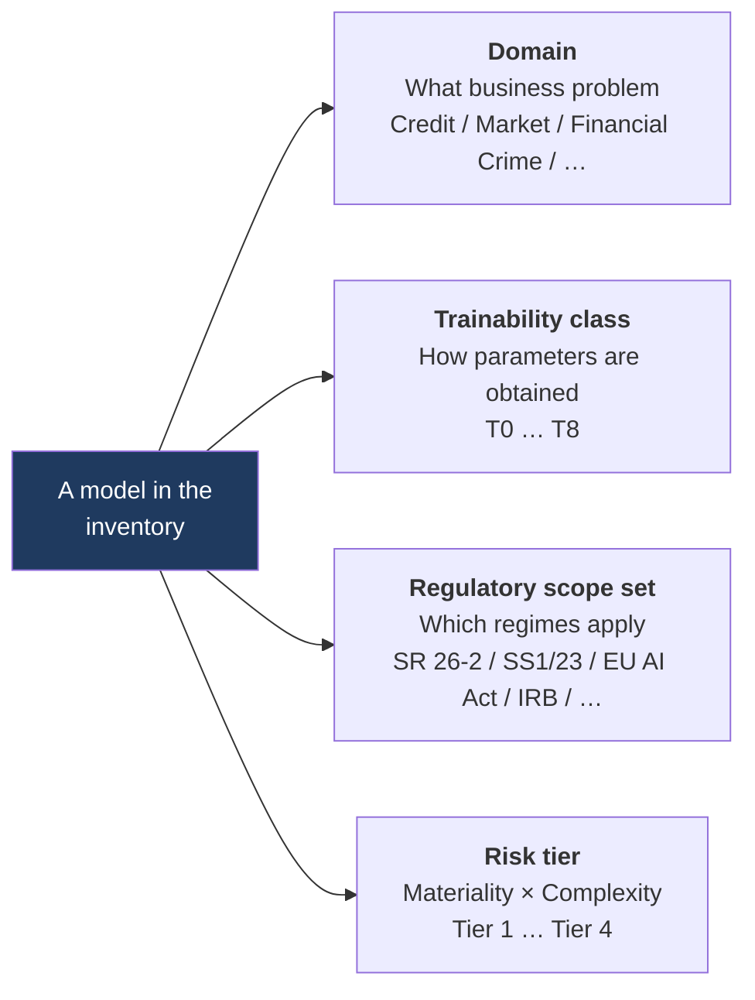
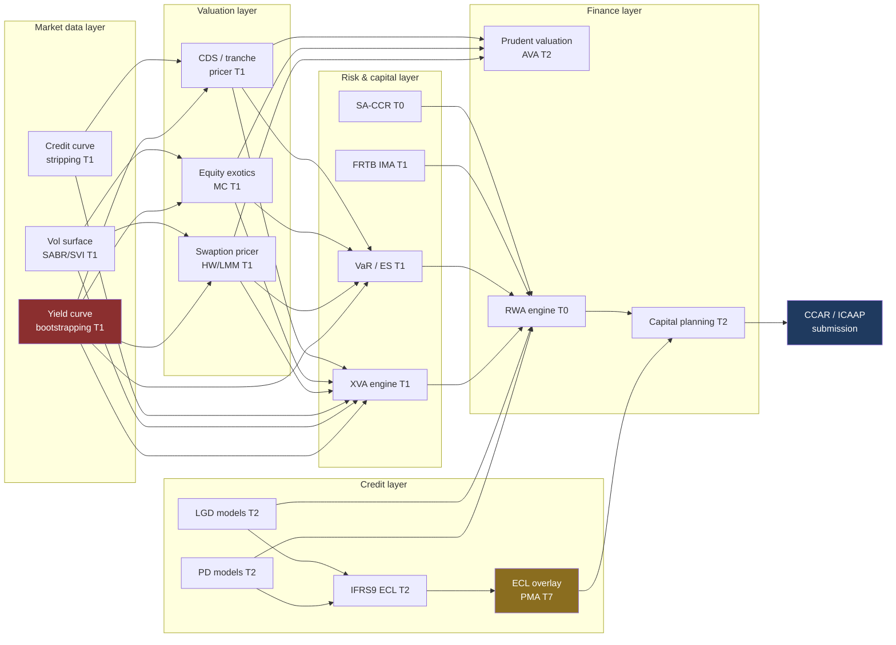

# 02 — The Bank Model Taxonomy

*MAYA — Model & AI Lifecycle Assurance.*  **Evidence, not assertion.**

> **Purpose.** A reference catalogue of every model family a large, universal bank runs. This is the
> seed content for MAYA's `model_class` reference data: it drives lifecycle selection, evidence
> requirements, default monitoring metric sets, and default risk tiering.
>
> A universal bank with retail, commercial, markets, wealth and treasury businesses will typically
> instantiate **800–3,000 models** across these families, plus **5,000–50,000 EUCs**.

---

## 0. How to read this document

Every model in MAYA carries four orthogonal classifications. Confusing them is the classic mistake that
makes inventories unusable.

- **Domain** is stable, organisational, and used for ownership and reporting.
- **Trainability class** (T0–T8, defined in [01 §4](01-industry-research.md#4-a-trainability-taxonomy-original-contribution))
  is *technical* and selects the lifecycle state machine and the evidence schema.
- **Regulatory scope set** is *jurisdictional* and multi-valued; the same model can be in scope for
  SS1/23 and out of scope for SR 26-2.
- **Risk tier** is *derived*, recomputed by the tiering engine, never hand-typed.

Column key in the catalogue tables:

| Column | Meaning |
|---|---|
| **T** | Trainability class T0–T8 |
| **Cadence** | Typical parameter refresh / recalibration frequency |
| **Tier** | Typical risk tier at a large bank (1 = highest) |
| **Key metrics** | The monitoring metrics MAYA seeds by default |

---

## 1. Domain A — Credit Risk

### A1. Regulatory capital (IRB / Basel)

| Model | T | Cadence | Tier | Key metrics |
|---|---|---|---|---|
| Retail & wholesale **PD** rating models | T2 | Annual refit | 1 | AUC/Gini, HL calibration test, rating migration, PSI, override rate |
| **LGD** models (workout, market, downturn LGD) | T2 | Annual | 1 | MAE/RMSE vs realised, downturn add-on adequacy, backtest |
| **EAD / CCF** models | T2 | Annual | 1 | Realised vs predicted CCF, utilisation drift |
| **Slotting** models for specialised lending | T7 | Annual | 2 | Slot migration, override rate |
| Effective **maturity** calculation | T0 | On change | 3 | Implementation regression |
| **Rating master scale** & PD calibration mapping | T2/T7 | Annual | 1 | Concentration by grade, monotonicity |
| **Margin of conservatism (MoC)** framework | T7 | Annual | 1 | MoC decomposition, deficiency coverage |

### A2. Accounting provisions (IFRS 9 / CECL)

| Model | T | Cadence | Tier | Key metrics |
|---|---|---|---|---|
| **Lifetime PD term structure** | T2 | Quarterly | 1 | Backtest vs realised default curve, vintage stability |
| **Lifetime LGD / collateral haircut** | T2 | Semi-annual | 1 | Realised vs predicted, collateral realisation lag |
| **EAD / behavioural balance projection** | T2 | Semi-annual | 1 | Predicted vs actual balance |
| **SICR / staging trigger** | T7/T2 | Quarterly | 1 | Stage migration matrix, stage-2 volatility, trigger hit-rate |
| **Macroeconomic scenario weighting** | T7 | Quarterly | 1 | Weight stability, non-linearity check |
| **Macro-to-risk-parameter (satellite) models** | T2 | Semi-annual | 1 | Elasticity plausibility, out-of-time fit |
| **Discounting / EIR** engine | T0 | On change | 3 | Implementation regression |
| **Post-model adjustments / management overlays** | T7 | Quarterly | 1 | **PMA magnitude as % of ECL, ageing, recurrence** |

> The PMA row is deliberately in the inventory. Under SS1/23 Principle 5 and IFRS 9 audit expectations,
> overlays must be registered, justified, quantified, aged and trended. MAYA models them as first-class
> objects, not free text.

### A3. Origination, underwriting and account management

| Model | T | Cadence | Tier | Key metrics |
|---|---|---|---|---|
| **Application scorecards** (cards, mortgage, auto, personal, SME) | T2 | 12–24 mo | 1–2 | KS, Gini, PSI/CSI, approval rate, early-default (FPD/SPD), **fairness / AIR** |
| **Behavioural scorecards** | T2 | 12–24 mo | 2 | KS, PSI, roll-rate accuracy |
| **Thin-file / alternative-data scoring** | T3 | 12 mo | 1 | Gini, coverage, **proxy-discrimination testing**, LDA search record |
| **Income estimation & verification** | T3 | 12 mo | 2 | MAPE, verification match rate |
| **Affordability / DTI / stress-rate** models | T2/T0 | Annual | 1 | Arrears by affordability band |
| **Credit line assignment (CLI/CLD)** | T2/T3 | 12 mo | 2 | Utilisation, loss rate by line band, revenue lift |
| **Authorisation / real-time decision** | T3 | 6–12 mo | 1 | Approval rate, loss rate, latency p99 |
| **Pre-approval / pre-screen eligibility** | T2 | 12 mo | 2 | Take-up, adverse selection |
| **Application fraud at origination** | T3 | 3–6 mo | 1 | Detection rate, FPR, $ prevented |
| **Adverse-action reason-code generator** | T0/T3 | On model change | 1 | **Reason accuracy, Reg B mapping coverage, causal fidelity** |

### A4. Collections, recovery and workout

| Model | T | Cadence | Tier | Key metrics |
|---|---|---|---|---|
| **Collections prioritisation / propensity to pay** | T3 | 6–12 mo | 2 | Cure rate lift, contact efficiency |
| **Roll-rate / delinquency transition** | T2 | Quarterly | 2 | Transition matrix backtest |
| **Recovery / post-default LGD** | T2 | Annual | 1 | Realised recovery vs predicted, timing error |
| **Settlement / hardship offer optimisation** | T3 | 12 mo | 2 | NPV lift, re-default rate, **fairness/vulnerability testing** |
| **Repossession & asset disposal value** | T2 | Annual | 2 | Realised sale price vs estimate |

### A5. Wholesale, counterparty and structured credit

| Model | T | Cadence | Tier | Key metrics |
|---|---|---|---|---|
| **Obligor rating** (corporate, FI, sovereign, NBFI, project finance) | T2/T7 | Annual | 1 | Accuracy ratio, migration, override rate |
| **Facility rating / recovery rating** | T2/T7 | Annual | 1 | Realised recovery |
| **Country / sovereign risk scorecard** | T7 | Annual | 2 | Event backtest |
| **Financial spreading & early-warning signals (EWS)** | T3 | 12 mo | 2 | Lead time to downgrade, precision/recall |
| **Covenant breach prediction** | T3 | 12 mo | 3 | Precision, lead time |
| **Credit portfolio / economic capital model** (copula, factor) | T2 | Annual | 1 | Capital sensitivity, correlation stability |
| **Concentration risk** (HHI, granularity adjustment) | T0/T2 | Quarterly | 2 | Implementation regression |
| **Counterparty credit exposure** (EPE/PFE simulation) | T1 | Daily calibration | 1 | Backtesting exceptions, collateral modelling error |
| **SA-CCR** engine | T0 | On regulation change | 2 | Implementation regression vs reference |
| **CVA capital** (BA-CVA / SA-CVA) | T0/T1 | Daily | 1 | Reconciliation to front-office CVA |
| **Wrong-way risk** | T1 | Quarterly | 2 | Correlation stability |
| **Initial margin (ISDA SIMM)** | T0 | Semi-annual version | 1 | Backtesting, benchmarking vs counterparties |
| **Collateral haircut** models | T2 | Quarterly | 2 | Coverage backtest |
| **ABS / RMBS / CMBS cashflow & waterfall** engines | T0 | On deal | 2 | Cashflow reconciliation |
| **Prepayment (CPR) / default / severity curves** for structured products | T2 | Quarterly | 1 | Realised vs projected CPR/CDR |
| **Rating-agency methodology replication** | T0/T7 | Annual | 3 | Divergence vs agency rating |

---

## 2. Domain B — Market Risk, Valuation and Trading

### B1. Curve, surface and market-data construction (the foundation layer)

| Model | T | Cadence | Tier | Key metrics |
|---|---|---|---|---|
| **Yield curve bootstrapping / multi-curve OIS discounting** | T1 | Intraday/daily | 1 | Repricing error on calibration instruments, smoothness, arbitrage checks |
| **Volatility surface construction** (SVI, SABR, LSV) | T1 | Daily | 1 | Calibration RMSE, **static arbitrage checks (butterfly/calendar)** |
| **Basis, cross-currency & tenor basis curves** | T1 | Daily | 1 | Repricing error |
| **Credit curve / hazard-rate stripping** | T1 | Daily | 1 | CDS repricing error |
| **Inflation curve (seasonality)** | T1 | Daily | 2 | Repricing error |
| **Interpolation / extrapolation schemes** | T0 | On change | 2 | Reference benchmark |
| **Proxy / mapping models for illiquid marks** | T7/T2 | Quarterly | 1 | Proxy backtest vs observed trades |

> Market-data construction models are the most under-inventoried family in most banks and the most
> systemically important: a single curve model is a **feeder** to hundreds of downstream valuation
> models. MAYA's interdependency graph exists largely for this.

### B2. Derivative pricing and valuation

| Model | T | Cadence | Tier | Key metrics |
|---|---|---|---|---|
| **Black–Scholes / Bachelier / Black-76** | T0 | Static | 2 | Analytical benchmark regression |
| **Local vol (Dupire), stochastic vol (Heston), LSV** | T1 | Daily calib. | 1 | Calibration error, vanilla repricing |
| **Short-rate (Hull–White, BK), HJM, LIBOR/RFR Market Model** | T1 | Daily/weekly | 1 | Swaption repricing, hedge P&L explain |
| **FX (Garman–Kohlhagen, quanto, multi-currency)** | T1 | Daily | 2 | Repricing error |
| **Commodity (Schwartz–Smith, Gabillon, seasonal)** | T1 | Daily | 2 | Forward-curve fit |
| **Equity exotics** (Monte Carlo, PDE, tree, American MC/LSM) | T1 | Daily | 1 | Convergence, greeks stability, benchmark |
| **Credit derivatives** (CDS, index, base correlation, CDO tranche) | T1 | Daily | 1 | Tranche repricing, correlation skew stability |
| **Hybrid / multi-asset & structured note pricers** | T1 | Daily | 1 | Independent price verification (IPV) divergence |
| **Convertible / callable bond models** | T1 | Daily | 2 | Repricing |
| **Insurance-linked / longevity pricing** | T2 | Annual | 3 | Experience analysis |

### B3. XVA and valuation adjustments

| Model | T | Cadence | Tier | Key metrics |
|---|---|---|---|---|
| **CVA / DVA** | T1 | Daily | 1 | P&L explain, sensitivity stability, hedge effectiveness |
| **FVA / MVA / ColVA / KVA** | T1 | Daily | 1 | P&L explain, funding-curve sensitivity |
| **Exposure simulation engine (American MC, regression)** | T1 | Daily | 1 | Convergence, regression-basis stability |

### B4. Market risk measurement and capital

| Model | T | Cadence | Tier | Key metrics |
|---|---|---|---|---|
| **Historical / parametric / Monte-Carlo VaR** | T1/T2 | Daily | 1 | **Backtesting exceptions (Basel traffic light)**, VaR/P&L ratio |
| **Stressed VaR** | T1 | Daily | 1 | Stress-window selection stability |
| **Expected Shortfall (FRTB IMA)** | T1 | Daily | 1 | ES backtest, liquidity-horizon scaling |
| **P&L Attribution (PLA) test engine** | T0 | Daily | 1 | Spearman/KS PLA zone |
| **Non-Modellable Risk Factor (NMRF) / SES** | T1 | Quarterly | 1 | RFET pass rate |
| **Default Risk Charge (DRC)** | T1 | Daily | 1 | Backtest |
| **FRTB Standardised Approach (SBM) sensitivities** | T0 | Daily | 1 | Reconciliation to risk engine |
| **Incremental Risk Charge (legacy IRC)** | T1 | Daily | 2 | Backtest |
| **Risk-factor mapping / proxy** | T7 | Quarterly | 2 | Proxy R², residual analysis |
| **Prudent valuation / AVA** | T2/T7 | Quarterly | 1 | AVA coverage, IPV divergence |
| **Model reserve / uncertainty reserve** | T7 | Quarterly | 1 | Reserve adequacy backtest |
| **Level 3 fair value estimation** | T7/T1 | Quarterly | 1 | Observed-trade divergence |

### B5. Trading, execution and quantitative investment

| Model | T | Cadence | Tier | Key metrics |
|---|---|---|---|---|
| **Algorithmic execution (VWAP, TWAP, IS, POV)** | T3 | Continuous | 1 | Slippage vs benchmark, fill rate, **market abuse surveillance flags** |
| **Market making / auto-quoting / skewing** | T4 | Continuous | 1 | Spread capture, adverse selection, inventory risk |
| **Smart order routing** | T3 | Monthly | 2 | Venue fill quality, best-execution metrics |
| **Market impact / transaction cost analysis (TCA)** | T2 | Quarterly | 2 | Predicted vs realised impact |
| **Systematic alpha / statistical arbitrage signals** | T3 | Continuous | 1 | IR, decay, capacity, turnover |
| **Portfolio construction & optimisation** | T0/T2 | Daily | 2 | Constraint satisfaction, ex-ante vs ex-post risk |
| **Securities lending / repo pricing & availability** | T2 | Daily | 3 | Rate prediction error |
| **Asset liquidity / liquidity horizon** | T2 | Quarterly | 2 | Realised liquidation cost |

---

## 3. Domain C — Treasury, ALM, Liquidity and Capital

| Model | T | Cadence | Tier | Key metrics |
|---|---|---|---|---|
| **IRRBB — Economic Value of Equity (EVE)** | T1/T0 | Monthly | 1 | Scenario reasonableness, sensitivity attribution |
| **IRRBB — Net Interest Income (NII) simulation** | T2 | Monthly | 1 | Forecast vs actual NII |
| **Repricing gap / basis risk** | T0 | Monthly | 2 | Implementation regression |
| **Non-Maturity Deposit (NMD) core/volatile split & effective maturity** | T2 | Annual | 1 | Balance stability backtest, decay-curve fit |
| **Deposit beta / rate pass-through** | T2 | Semi-annual | 1 | Predicted vs actual beta by segment |
| **Deposit attrition / decay** | T2 | Annual | 1 | Survival-curve backtest |
| **Mortgage & loan prepayment (CPR)** | T2/T3 | Quarterly | 1 | Realised vs projected CPR, refi-incentive elasticity |
| **Pipeline fallout / lock commitment** | T2 | Quarterly | 2 | Fallout rate error |
| **Credit line utilisation / drawdown under stress** | T2 | Semi-annual | 1 | Realised draw vs projected |
| **Early redemption / surrender** | T2 | Annual | 2 | Backtest |
| **LCR / NSFR calculation engines** | T0 | On regulation change | 1 | Regulatory reconciliation, implementation regression |
| **Liquidity stress testing / survival horizon** | T2/T7 | Monthly | 1 | Scenario severity calibration, outflow backtest |
| **Intraday liquidity** | T2 | Monthly | 2 | Peak-usage prediction |
| **Contingent funding & collateral optimisation** | T0/T2 | Monthly | 2 | Optimality gap |
| **Funds Transfer Pricing (FTP) curves & liquidity premium** | T0/T2 | Monthly | 1 | Reconciliation to actual funding cost |
| **RWA engines (credit, market, operational)** | T0 | On regulation change | 1 | Regulatory reporting reconciliation |
| **Capital planning / forecasting** | T2 | Quarterly | 1 | Forecast vs actual capital ratios |
| **Economic capital aggregation & diversification** | T2 | Annual | 1 | Correlation-assumption sensitivity |
| **RAROC / EVA / capital allocation** | T0/T2 | Monthly | 2 | Allocation reconciliation |
| **Leverage ratio / TLAC / MREL** | T0 | On change | 2 | Reconciliation |
| **Hedge effectiveness (IFRS 9 / ASC 815)** | T0/T2 | Quarterly | 1 | Effectiveness ratio, de-designation events |
| **Pension / post-retirement actuarial** | T2/T7 | Annual | 2 | Experience analysis |
| **Balance-sheet optimisation** | T0 | Monthly | 2 | Optimality, constraint feasibility |

---

## 4. Domain D — Stress Testing, Scenario and Climate

| Model | T | Cadence | Tier | Key metrics |
|---|---|---|---|---|
| **PPNR — net interest income projection** | T2 | Annual (CCAR cycle) | 1 | Out-of-time forecast error, scenario sensitivity |
| **PPNR — fee & non-interest income** | T2 | Annual | 1 | Forecast error |
| **PPNR — non-interest expense** | T2 | Annual | 1 | Forecast error |
| **PPNR — trading revenue / global market shock** | T1 | Annual | 1 | Shock reconciliation |
| **Stressed credit loss projection** | T2 | Annual | 1 | Backtest across historical downturns |
| **Stressed operational loss projection** | T2/T7 | Annual | 1 | Scenario plausibility |
| **Balance-sheet / RWA projection** | T2 | Annual | 1 | Forecast error |
| **Macroeconomic scenario expansion** (supervisory → internal variables) | T2 | Annual | 1 | Cointegration stability, plausibility bounds |
| **Economic Scenario Generator (ESG)** | T1 | Annual | 1 | Martingale tests, distributional calibration |
| **Reverse stress testing** | T7/T2 | Annual | 2 | Scenario severity vs break point |
| **Climate physical risk** (flood, wildfire, cyclone hazard → asset damage) | T2/T6 | Annual | 2 | Hazard-model provenance, geospatial coverage |
| **Climate transition risk** (carbon price → sector PD/LGD) | T2 | Annual | 2 | Sensitivity plausibility |
| **Financed emissions / PCAF** | T0/T2 | Annual | 2 | Data-quality score distribution |
| **Climate-adjusted PD/LGD overlays** | T7 | Annual | 2 | Overlay magnitude, PMA register linkage |
| **ICAAP / ILAAP aggregation** | T0 | Annual | 1 | Reconciliation |

---

## 5. Domain E — Financial Crime, Fraud and Compliance

### E1. AML / CTF

| Model | T | Cadence | Tier | Key metrics |
|---|---|---|---|---|
| **Transaction monitoring — rules/scenarios** | T8 | Continuous tuning | 1 | Alert volume, **ATL/BTL testing**, SAR conversion rate, productivity |
| **Transaction monitoring — ML anomaly / network** | T3 | 6–12 mo | 1 | Precision/recall, SAR conversion, drift |
| **Scenario threshold tuning / segmentation** | T2 | Semi-annual | 1 | Above/below-the-line effectiveness, segment stability |
| **Customer Risk Rating (CRR / KYC risk score)** | T2/T7 | Annual | 1 | Rating distribution, override rate, SAR correlation |
| **Entity resolution / identity matching** | T3 | 12 mo | 2 | Precision/recall, merge/split error |
| **Beneficial ownership / network traversal** | T3/T8 | 12 mo | 2 | Coverage, path accuracy |
| **Sanctions & watchlist screening (fuzzy name matching)** | T3/T8 | Continuous | 1 | **True-hit recall (must approach 100%)**, FP rate, list-update latency |
| **False-positive reduction / alert triage** | T3 | 6 mo | 1 | **Recall preservation on known-true alerts**, FP reduction %, hibernation risk |
| **Mule / money-laundering network detection** | T3 | 6–12 mo | 1 | Precision, network coverage |
| **SAR narrative drafting** | T5 | On prompt/base change | 1 | Groundedness, factual accuracy, completeness, **human edit distance** |

### E2. Fraud

| Model | T | Cadence | Tier | Key metrics |
|---|---|---|---|---|
| **Card / transaction fraud (real-time)** | T3/T4 | Weekly–monthly | 1 | Detection rate at FPR, $ prevented, **latency p99**, customer friction |
| **ACH / wire / RTP / faster-payments fraud** | T3 | Monthly | 1 | Detection, FPR, value at risk |
| **Authorised Push Payment (APP) scam detection** | T3 | Monthly | 1 | Scam recall, reimbursement exposure |
| **Account takeover (ATO)** | T3 | Monthly | 1 | Detection, FPR |
| **Synthetic identity detection** | T3 | Quarterly | 1 | Precision, downstream loss avoided |
| **Device fingerprinting / behavioural biometrics** | T3/T6 | Vendor cadence | 2 | Match rate, spoof resistance |
| **Merchant / acquirer risk & chargeback** | T2 | Quarterly | 2 | Chargeback prediction error |
| **Internal fraud / insider threat** | T3 | Annual | 2 | Precision, investigation yield |
| **Cheque / deposit fraud** | T3 | Quarterly | 2 | Detection, hold-decision impact |

### E3. Conduct, markets and regulatory compliance

| Model | T | Cadence | Tier | Key metrics |
|---|---|---|---|---|
| **Trade surveillance / market abuse (spoofing, layering, insider)** | T8/T3 | Semi-annual tuning | 1 | Alert-to-case rate, scenario coverage |
| **Communications surveillance (NLP lexicon + classifier)** | T3/T5 | Quarterly | 1 | Recall on seeded cases, FP rate |
| **Best execution / RTS 27-28 analytics** | T0/T2 | Quarterly | 2 | Reconciliation |
| **Complaints classification & root cause** | T3/T5 | Semi-annual | 2 | Classification accuracy, escalation recall |
| **Vulnerable-customer identification** | T3 | Annual | 1 | Recall, **fairness and dignity review** |
| **Suitability / appropriateness assessment** | T2/T7 | Annual | 1 | Mis-selling backtest |
| **FATCA / CRS classification** | T8 | On regulation change | 2 | Classification error rate |
| **Sanctions-evasion typology detection** | T3 | Semi-annual | 1 | Typology coverage |

---

## 6. Domain F — Operational, Non-Financial and Enterprise Risk

| Model | T | Cadence | Tier | Key metrics |
|---|---|---|---|---|
| **Operational risk capital (SMA / legacy AMA-LDA)** | T2 | Annual | 1 | Loss-distribution fit, backtest |
| **Operational risk scenario analysis** | T7 | Annual | 1 | Scenario plausibility, SME consistency |
| **RCSA scoring & control effectiveness** | T7 | Annual | 3 | Rating consistency, issue correlation |
| **Cyber risk quantification (FAIR-style)** | T2/T7 | Annual | 2 | Scenario calibration vs incidents |
| **Third-party / vendor risk scoring** | T2/T6 | Annual | 2 | Incident correlation |
| **Operational resilience / impact tolerance** | T0/T7 | Annual | 2 | Scenario coverage |
| **Legal & litigation provisioning** | T7 | Quarterly | 2 | Provision adequacy backtest |
| **Key-risk-indicator forecasting** | T2 | Quarterly | 3 | Forecast error |
| **Model risk aggregation model** (MAYA's own) | T2 | Annual | 1 | Self-validation; see §9 |

---

## 7. Domain G — Customer, Pricing, Marketing and Wealth

| Model | T | Cadence | Tier | Key metrics |
|---|---|---|---|---|
| **Propensity / response** | T3 | Quarterly | 3 | AUC, lift, campaign ROI |
| **Uplift / incremental response** | T3 | Quarterly | 3 | Qini, uplift@k |
| **Next-Best-Action / offer orchestration** | T3/T4 | Continuous | 2 | Reward, exploration ratio, **fairness of offer distribution** |
| **Churn / attrition** | T3 | Quarterly | 3 | AUC, retained value |
| **Customer lifetime value (CLV)** | T2 | Semi-annual | 3 | Forecast error |
| **Segmentation / clustering** | T3 | Annual | 4 | Cluster stability, silhouette |
| **Loan pricing & rate-sheet optimisation** | T2/T3 | Quarterly | 1 | Margin vs volume, **price-discrimination / fair-lending testing** |
| **Deposit pricing elasticity** | T2 | Quarterly | 1 | Volume response error |
| **Fee & discount optimisation** | T3 | Quarterly | 2 | Revenue lift, **UDAAP review** |
| **Recommendation engine (products, content)** | T3 | Monthly | 3 | CTR, conversion, diversity |
| **Marketing mix modelling & attribution** | T2 | Semi-annual | 3 | Holdout validation |
| **Media budget optimisation** | T0/T2 | Quarterly | 4 | Optimality gap |
| **Robo-advisory strategic asset allocation** | T0/T2 | Annual | 1 | Tracking error, suitability breach rate |
| **Risk profiling / risk tolerance questionnaire scoring** | T7 | Annual | 1 | Mis-classification, complaint correlation |
| **Goal-based planning / Monte-Carlo wealth projection** | T1 | Annual | 2 | Distributional calibration |
| **Tax-loss harvesting** | T0 | Annual | 3 | Wash-sale compliance |
| **Insurance cross-sell & bancassurance propensity** | T3 | Quarterly | 3 | Conversion lift |

---

## 8. Domain H — Operations, Technology and Workforce

| Model | T | Cadence | Tier | Key metrics |
|---|---|---|---|---|
| **Branch / call-centre / ATM demand forecasting** | T2 | Monthly | 3 | MAPE |
| **ATM & branch cash optimisation** | T0/T2 | Monthly | 3 | Stock-out rate, carry cost |
| **Workforce scheduling & staffing optimisation** | T0 | Weekly | 3 | Service-level attainment |
| **Intelligent document processing (OCR, classify, extract)** | T3/T5 | Quarterly | 2 | Field-level accuracy, STP rate, exception rate |
| **KYC document verification / liveness / biometric match** | T3/T6 | Vendor cadence | 1 | FAR/FRR, **demographic differential (NIST FRVT-style)** |
| **Customer-service chatbot / virtual assistant** | T5 | On prompt/base change | 1 | Containment, escalation, groundedness, **harmful-advice rate** |
| **Call routing / intent classification** | T3 | Quarterly | 3 | Routing accuracy |
| **Speech & sentiment analytics** | T3/T5 | Semi-annual | 3 | WER, sentiment accuracy |
| **Agent assist / next-best-response** | T5 | On change | 2 | Suggestion acceptance, accuracy |
| **IT capacity & incident forecasting (AIOps)** | T3 | Quarterly | 4 | Precision, MTTR impact |
| **Payment routing / least-cost routing** | T0/T2 | Monthly | 2 | Cost saving, failure rate |
| **Reconciliation & matching** | T3/T8 | Semi-annual | 2 | Auto-match rate, false-match rate |
| **Process mining / bottleneck detection** | T3 | Annual | 4 | — |
| **HR: attrition prediction** | T3 | Annual | 2 | AUC, **EU AI Act Annex III(4) high-risk** |
| **HR: CV screening / candidate ranking** | T3/T5 | Annual | 1 | **EU AI Act high-risk; adverse-impact ratio mandatory** |

---

## 9. Domain I — Finance, Accounting and Regulatory Reporting

| Model | T | Cadence | Tier | Key metrics |
|---|---|---|---|---|
| **Financial planning & forecasting (FP&A)** | T2 | Quarterly | 2 | Forecast error |
| **Revenue recognition & accrual estimation** | T0/T2 | Quarterly | 2 | Reconciliation, **SOX key control** |
| **Expense allocation / cost attribution** | T0 | Monthly | 3 | Allocation reconciliation |
| **Transfer pricing (tax)** | T0/T2 | Annual | 2 | Benchmarking range |
| **Goodwill & intangibles impairment** | T1/T7 | Annual | 1 | Sensitivity, headroom |
| **Deferred tax asset recoverability** | T2 | Annual | 2 | Forecast plausibility |
| **Regulatory reporting calculators** (FR Y-14/9C, COREP, FINREP, MAS 610, APRA) | T0 | On regulation change | 1 | **Reconciliation to ledger, resubmission count** |
| **Data-quality / reconciliation rule engines** | T8 | Continuous | 2 | Break rate, ageing |

---

## 10. Domain J — Generative and Agentic AI

> **Governance note.** These are **out of scope for SR 26-2** but **in scope for SS1/23** (broad model
> definition), the **EU AI Act** where the use case qualifies, and the bank's own AI policy. MAYA governs
> them on a **parallel track** with a GenAI-specific evidence schema — see [09 §5](09-security-compliance.md).

| Use case | T | Autonomy mode | Tier | Key metrics |
|---|---|---|---|---|
| **Credit memo / underwriting narrative drafting** | T5 | Human-approved automation | 1 | Groundedness, citation accuracy, factual error rate, human edit distance |
| **SAR / STR narrative drafting** | T5 | Human-approved automation | 1 | Completeness vs typology checklist, hallucination rate |
| **Adverse-action explanation drafting** | T5 | Human-approved automation | **1 (Critical)** | **Adverse-action fidelity** — does the text reflect the actual principal factors; Reg B compliance |
| **Model documentation & validation report drafting** | T5 | Collaborative assistance | 2 | Evidence-grounding rate, reviewer acceptance |
| **Regulatory horizon scanning & impact assessment** | T5 | Collaborative assistance | 3 | Recall on known issuances, citation accuracy |
| **Contract & covenant extraction** | T5 | Human-approved automation | 2 | Field accuracy, coverage, exception rate |
| **KYC / adverse-media summarisation** | T5 | Human-approved automation | 1 | Precision on true adverse media, hallucination rate |
| **Customer service copilot (internal-facing)** | T5 | Collaborative assistance | 2 | Groundedness, escalation accuracy |
| **Customer-facing conversational assistant** | T5 | Human-approved / bounded | 1 | Harmful-advice rate, PII leakage, jailbreak resistance, complaint rate |
| **Code generation & legacy migration (COBOL→Java)** | T5 | Collaborative assistance | 2 | Test-pass rate, semantic-equivalence testing |
| **Research / market commentary generation** | T5 | Human-approved automation | 2 | Factuality, **market-abuse and disclosure review** |
| **Data extraction & mapping agents** | T5 | Human-approved automation | 2 | Field accuracy, reconciliation break rate |
| **Agentic reconciliation / onboarding orchestration** | T5 | Human-approved automation | 1 | Task success, **action reversibility, blast radius, tool-call audit** |
| **Model/EUC discovery agent** (feeds MAYA itself) | T5 | Collaborative assistance | 3 | Discovery precision/recall |

**GenAI-specific required metadata** (from the SR 26-2-compatible framework literature): intended use
case and approved scope · operational autonomy classification · decision proximity · consumer harm
potential · evidence source specifications · evaluation metric set · monitoring thresholds and cadence ·
human review requirements · base model + version + provider · prompt version · RAG corpus version ·
tool/function inventory · guardrail configuration version · token/cost budget.

---

## 11. Domain K — Deterministic methods, rules and EUCs

Out of the SR 26-2 model definition ("excludes simple arithmetic calculations… as well as deterministic
rule-based processes"), but **explicitly brought in-scope by SS1/23 1.1(b)** where material and complex,
and always in scope for internal control and SOX.

| Asset type | T | Tier | Control model |
|---|---|---|---|
| Credit policy cut-offs and decision tables | T8 | 1–2 | Change control, parallel run, outcome monitoring |
| AML scenario rule definitions | T8 | 1 | ATL/BTL tuning, change control |
| Pricing grids and rate sheets | T8 | 2 | Four-eyes approval, effective-dating |
| Allocation & apportionment spreadsheets | T8 | 2–3 | EUC controls: version, access, formula lock, reconciliation |
| Regulatory calculation spreadsheets | T8 | 1 | Full EUC control set + independent recalculation |
| Ad-hoc SAS / R / Python / SQL analytical scripts | T8 | 2–4 | Repository control, peer review, promotion to model if material |
| ETL transformation logic feeding models | T8 | 1–2 | Lineage capture, data-quality assertions |
| Access databases and local data stores | T8 | 2–3 | Discovery, migration plan |

MAYA holds these in the same inventory with a **`scope_regime`** attribute set that marks them out of
SR 26-2 scope but in scope for SS1/23 and internal EUC policy — so one register serves both regimes and
the "why is this not a model?" question has a stored, auditable answer.

---

## 12. Cross-cutting: the feeder/consumer graph

The single most valuable structural fact about a bank's model estate is that it is a **directed graph**,
not a list. A representative slice:

Two consequences MAYA implements directly:

1. **Blast radius.** Changing the yield-curve model touches valuation, XVA, VaR, FRTB, RWA and capital
   planning. MAYA computes the transitive downstream set on every proposed change and forces impact
   assessment and notification of affected model owners (SS1/23 3.4(d)).
2. **Aggregate risk / common-dependency concentration.** SR 26-2 asks for "reliance on common
   assumptions, data, or methodologies". MAYA computes concentration statistics over shared feature
   views, shared datasets, shared vendors, shared methodologies and shared assumptions, and surfaces
   single points of failure in the estate.

---

## 13. Seeding MAYA

This taxonomy ships as reference data: `seed/model_classes.yaml`, containing for each family the
default trainability class, lifecycle template, evidence schema, monitoring metric set, documentation
template set, and default tiering hints. Banks fork it. See [10 — Roadmap](10-roadmap.md) Phase 1.
