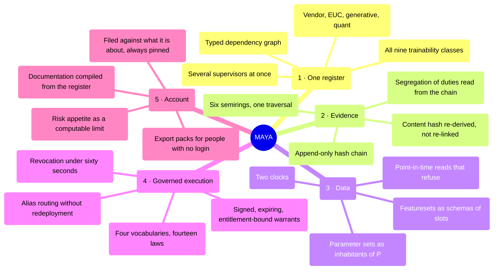
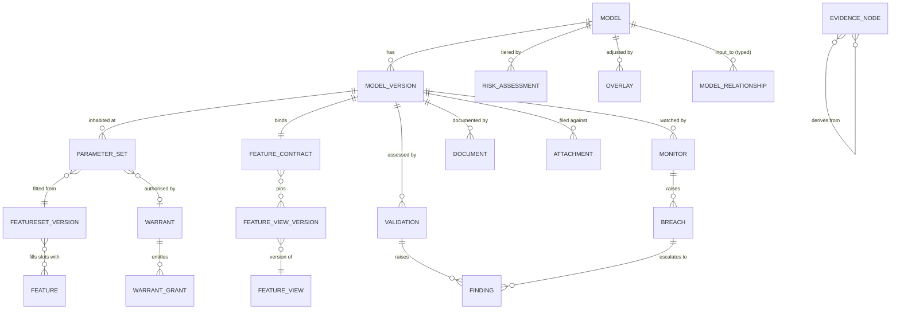

# 03 — Requirements

*MAYA — Model & AI Lifecycle Assurance.*  **Evidence, not assertion.**

**Product:** MAYA — Model & AI Lifecycle Assurance Platform
**Owner:** Model Risk Technology / Platform Architecture
**Theoretical basis:** [00 — Mathematical Foundations](00-mathematical-foundations.md)
**Evidence basis:** [01 — The estate, the supervisors, and what the tools do](01-industry-research.md) ·
[02 — Families, fibres, and what each owes as evidence](02-model-taxonomy.md)

> *māyā* (माया) — the appearance that stands in for reality. SR 26-2 puts it almost the same way:
> *"Models are simplified representations of real-world relationships."* The platform is named for the
> thing it governs, and for the discipline of never mistaking the map for the territory.

---

## 0. How to read this document

### 0.1 The rule about identifiers

**A requirement identifier is permanent.** `FR-INV-016` means the same thing for the life of this
document, whether or not it is still in the same section, still worded the same way, or still wanted.
[10 — Roadmap](10-roadmap.md), [05 — Data Model](05-data-model.md), [00](00-mathematical-foundations.md)
and [16](16-features-composed-and-shaped.md) all cite these identifiers; a renumbering would silently
break the traceability those documents exist to provide.

This edition reorganises the document, rewrites the prose, adds requirements for capabilities built
since the last edition, and adds a status to every row. **No identifier has moved, been reused, or been
retired.**

### 0.2 The status column, and why a requirements document carries one

Most of this platform is built. A requirements document that does not say which parts is a document
whose reader has to go and find out — and the reader who finds out by discovering a gap is the reader
who stops believing the rest.

| Status | Means |
|---|---|
| **Built** | Implemented, with a named test. The requirement describes what the code does |
| **Partial** | Implemented in a form narrower than the requirement states. The row says how it is narrower |
| **Not built** | Specified, not implemented. No code |
| **Refused** | **Deliberately not implemented, and the requirement is the one that is wrong.** Three of these exist and each is argued in the code |

The three refusals are worth reading before anything else, because they are the places where the
platform disagrees with its own specification and says so:

| | Requirement | Why it is refused |
|---|---|---|
| `FR-RPT-004` | an aggregate model risk score for the estate | aggregation requires the parts to compose, and two models fed by the same curve are not two independent risks. Any single figure double-counts the shared dependency or ignores it, and a committee cannot decompose it to find out which. `L-14`; `core/reporting/pack.py::NO_COMPOSITE` |
| `FR-POL-008` | a `warn` verdict on a policy gate | a gate that warns is not a gate |
| `FR-AI` Tier C | registering an AI capability whose output can be neither checked by an oracle nor grounded in evidence | there is no control to apply to it, so admitting it would be admitting an ungoverned capability into a governance platform |

### 0.3 Priority

**M** = Must (release 1) · **S** = Should · **C** = Could · **W** = Won't, this release.

Priority and status are independent, and the interesting rows are the ones where they disagree: an
**M / Not built** row is a hole in release 1 and is meant to be read as one.

### 0.4 What this document is not

It is not the build record. [12 §0](12-implementation-plan.md#0-build-status) is the authoritative
account of what exists and is kept current there. The status column here is a cross-reference, and
where the two disagree, 12 wins and this document is wrong.

### 0.5 Shape of the requirement set

| Part | Modules | Requirements |
|---|---|---|
| **A** The register | `FR-INV`, `FR-TIER` | 32 |
| **B** The kernel and its parameters | `FR-VER`, `FR-PAR` | 21 |
| **C** The inputs | `FR-FEA`, `FR-XFR` | 40 |
| **D** Governed acts | `FR-LC`, `FR-POL`, `FR-SEC`, `FR-BAS` | 55 |
| **E** Assurance | `FR-TRN`, `FR-VAL`, `FR-PMA`, `FR-MON`, `FR-TEL` | 56 |
| **F** Use | `FR-WARRANT` | 17 |
| **G** Account | `FR-DOC`, `FR-RPT` | 26 |
| **H** The platform, and its own AI | `FR-AI`, `FR-PLT` | 31 |
| | **Total functional** | **278** |
| | Non-functional | 27 |
| | Integration | 18 |
| | Acceptance criteria | 10 |

---

## 1. Purpose, scope and definitions

### 1.1 Purpose

MAYA is the system of record and the system of engagement for **every model and model-adjacent asset a
bank runs**, from proposal to archive. It holds the governance — inventory, tiering, approval,
validation, findings, overlays, documentation, evidence — and the engineering — artifacts, features,
parameter sets, versions, execution warrants, monitoring — in one object model, with the governance
record **bound to the engineering artefact by digest** rather than by reference.

It does not run models. It issues a warrant an execution engine acts on, which keeps governance off the
serving path and out of the trading day's critical path.

### 1.2 Scope

**In scope:** all nine trainability classes T0–T8 across the eleven domains of
[02](02-model-taxonomy.md); internally built, vendor-supplied, open-source, embedded and end-user
computing assets; every jurisdiction the bank operates in.

**In scope and commonly missed:** market-data construction models, deterministic regulatory
calculators, vendor black boxes, expert-judgment scorecards, post-model adjustments, prompt bundles and
RAG corpora, and **the firm's own tiering rule**.

### 1.3 Definitions

| Term | As used here |
|---|---|
| **Model** | Any registered asset, whether or not it meets a given supervisor's model definition. Regulatory scope is a separate, multi-valued attribute with a stored determination |
| **Model version** | An immutable kernel, identified by the digest of its canonical manifest. A version is `f`, not `f` at a particular point of `P` |
| **Parameter set** | One inhabitant of `P`, bound to the version, featureset version, window and `as_of` that produced it. **A fit produces a parameter set and not a version** |
| **Model use** | An approved (purpose × product/portfolio × legal entity × geography × channel) tuple. Risk attaches here, not only to the artefact |
| **Artifact** | Bytes, addressed by their own SHA-256 |
| **Feature** | A named, typed, shaped, owned signal with a computation definition and two clocks |
| **Featureset** | A named, versioned **schema of slots**; a version binds each slot to a feature and to the exact feature view version supplying it |
| **Feature contract** | The exact set of pinned feature view versions a model version was fitted on and must be served |
| **Warrant** | A signed, expiring, entitlement-bound execution contract that an engine acts on |
| **Evidence node** | An immutable, hash-identified record of something that happened, whose verification re-derives its content hash from its own fields |
| **Overlay** | A post-model adjustment to input, assumption, methodology or output, time-boxed and measured |
| **Tier** | Derived from materiality × complexity on two separate lattices, driving control depth |
| **Effective challenge** | Critical, independent, competent, empowered review — SR 26-2 |

---

## 2. What it is for

### 2.1 The one sentence

> **Any question an examiner, an auditor, a CRO or an engineer can ask about any model in the bank
> should be answerable from one system, with evidence, without asking a human to look something up.**

The original wording of this sentence promised sixty seconds and an as-at-date reconstruction. The
second half of that promise rested on `FR-INV-016`, which is now **built** — the register at a past
date is a fold of the evidence chain, and the answer carries the chain hash it is true at. The
*sixty seconds* half is still an aim rather than a measurement, and the sentence is marked as one.

### 2.2 The five pillars



### 2.3 Design principles

Each is cited by the requirement rows that depend on it.

| # | Principle | The failure it prevents |
|---|---|---|
| **P1** | **Evidence over assertion** | A field that says "validated" cannot be checked, and a system whose claims cannot be checked is a system an examiner has to take on trust |
| **P2** | **Immutability by default** | A record that can be edited underneath a reviewer is a record that stopped describing what was approved, silently. Corrections are new records with supersession links |
| **P3** | **The lifecycle is data, not code** | A control that needs a release to change is a control people work around |
| **P4** | **Governance where the work happens** | If registering a model properly takes forty lines of plumbing and getting it wrong takes four, the register fills with models nobody registered properly while every control reports success |
| **P5** | **Every class is a first-class class** | A calibrated pricing engine is not a degraded ML model, and treating it as one produces a validation form full of "N/A" |
| **P6** | **Open standards at the boundary** | A closed boundary makes the platform the thing that has to be replaced |
| **P7** | **Zero trust on artifacts** | Deserialising an untrusted artifact in the control plane is arbitrary code execution inside the governance system |
| **P8** | **Explain the derivation** | A derived value nobody can decompose is a value nobody will challenge, which is the opposite of effective challenge |
| **P9** | **Degrade safely** | A governance system in the serving path is a governance system that takes the trading day down. Issued warrants keep working; only new issuance and changes block |
| **P10** | **Regulatory scope is plural** | Adding a supervisor must not require a migration, because the next regulator will not wait |

---

## 3. Who it is for

| # | Persona | What they need | What is in their way today |
|---|---|---|---|
| U1 | **Model developer / quant** | to build, fit, test, document and ship without governance friction | re-keying metadata into a GRC tool; rebuilding training sets; *which feature version did I use?* |
| U2 | **Model owner** | to know their models' health and obligations | no single view; surprise findings; overdue validations discovered at audit |
| U3 | **Independent validator** | to perform effective challenge efficiently and evidence it | chasing artefacts and data; rebuilding developer results by hand |
| U4 | **Head of model risk** | portfolio view, tiering integrity, backlog control, board reporting | inventory accuracy; no aggregate view; board packs assembled by hand |
| U5 | **Model user** | to use approved models correctly and know their limits | limitations and boundaries are in a PDF nobody opens; off-label use is undetectable |
| U6 | **Execution engine** (machine) | to resolve and run a version reliably and fast | hardcoded model paths; silent version drift; no kill switch |
| U7 | **Data engineer / feature owner** | to publish trustworthy features without duplication | feature sprawl; no point-in-time correctness; no visibility of consumers |
| U8 | **Internal audit** | to test whether the framework operates as designed | sampling by hand; evidence in email |
| U9 | **Regulator or examiner** | to verify completeness and control operation | PDF dumps; inconsistent answers to the same question |
| U10 | **Compliance / fair lending / legal** | to assess consumer-protection and AI Act exposure | cannot find which models touch consumers |
| U11 | **Vendor manager** | to track the third-party estate and its attestations | no inventory of embedded vendor models |
| U12 | **Platform / SRE** | to keep it up, fast and secure | — |
| U13 | **CRO / board risk committee** | to know whether model risk is within appetite | narrative-only reporting against an appetite statement nobody can compute against |

---

## 4. The journeys

### J1 — Register and ship a machine-learned model

```mermaid
sequenceDiagram
    autonumber
    actor Dev as Developer
    participant API as MAYA
    participant FS as Featuresets
    participant EV as Evidence chain
    actor Val as Validator
    actor Own as Owner
    Dev->>API: register model (urn, owner, purpose, legal entity)
    API->>API: regimes determine scope; tiering derives the tier
    Dev->>FS: declare a featureset schema; fill it per version
    FS-->>Dev: a featureset version, each slot pinned to a view version
    Dev->>API: create version 1.0.0 — immutable, manifest digest
    Dev->>API: request a fit warrant
    API-->>Dev: refused, or signed — bounded in both clocks (L-W9)
    Dev->>API: record the parameter set produced under that warrant
    API->>EV: warrant, snapshot, featureset version, digest
    Own->>API: approve the parameter set (not the person who recorded it)
    Val->>API: open a validation (refused if a validator built the version)
    Val->>API: record tests; conclude (refused over a failed test or a blocking finding)
    Own->>API: approve the version — a quorum whose depth follows the tier
    API->>API: move the alias (refused unless the contract refines and the schemas vary correctly)
    API-->>Dev: maya://model/... #champion resolves to a signed descriptor
```

### J2 — A calibrated model that is never trained

Same spine, different evidence. No training set; instead a **calibration instrument set**, a
**tolerance**, **arbitrage-free assertions** and an **analytical benchmark suite**. The recalibration
is a **procedure approved once**, not a committee that meets every morning: each morning's parameter
set is accepted against a policy gate on the residuals and **held** when it fails, rather than
requiring a signature. `L-W11` refuses a calibration warrant that will not say what it was calibrated
**as of**, because without the stamp staleness is silent.

*Not worked in a tutorial.* The per-fibre walkthroughs were removed rather than
left standing as prose nobody had executed; see [02 §5](02-model-taxonomy.md).

### J3 — A closed-form model where there is nothing to fit

`register → verify the implementation against analytical benchmarks → benchmark against an independent
implementation → govern the inputs (curve, conventions, valuation date, library version) → approve →
monitor the inputs against the range it was benchmarked over`. A fit warrant is **refused** by `L-W1`,
naming the fact about the kernel that made the request incoherent.

*Not worked in a tutorial* — see [02 §5](02-model-taxonomy.md) for why the
per-fibre walkthroughs are absent rather than pending.

### J4 — Onboard a vendor black box

`register (parameter_kind: opaque → T6) → vendor due diligence → obtain the vendor's validation
attestation → benchmark on your own outcomes → document your own use → approve with conditions →
watch for a version change`. Fitting is refused for the same structural reason as J3.

**Supported.** The class, the refusal and the register were already built; the vendor due-diligence
workflow, the attestation tracker and version-change detection are `FR-VAL-009` and are now built too —
with the distinction that matters recorded on every checklist item: which of them the vendor's word can
discharge, and which only the firm's own outcomes can.

### J5 — A generative application

`intake → boundary determination → prompt, corpus, tool and guardrail versions recorded as the
parameter set → frozen evaluation set → pre-deployment evaluation → human-oversight design → approve →
re-evaluate on schedule and on every provider version change`. `L-W13` refuses a warrant naming a model
family without a build.

*Not worked in a tutorial* — see [02 §5](02-model-taxonomy.md).

### J6 — Issue a warrant to an execution engine

The engine holds only a URN. At run time it resolves, receives a signed descriptor with the artifact
digest or parameter set, the operating boundary and the policy constraints, verifies the signature and
executes. If the warrant has been revoked, resolution fails closed. If a blocking finding is open,
resolution fails closed. See [06 — Warrants & Execution](06-warrants-and-execution.md).

### J7 — The examiner request

*"Show me every model that fed the Q2 provision, its validation status at that date, and any overlays
applied."*

**Most of this journey can now be executed.** `FR-INV-016` is built: the evidence chain records what
happened, and the projection over it reconstructs the register as at a past date — every model's
existence, owner, lifecycle status, tier and versions as they stood, carrying the chain sequence and
hash the answer is true at. So *its validation status at that date* is answerable.

**Which models fed the Q2 provision** is answerable too: `FR-INV-005` is built, and a use carries a
product, a legal entity and effective dates, so the question is a query with an `at`. What is still not
folded by the as-at projection is the overlays applied at a date — those are on the chain and a payload
field away rather than a design away. Alongside it there is an **export pack** per
model, self-contained and digested member by member, and a **board pack** persisted per period so
*"the March pack"* means the March pack rather than a document of the same name recomputed today.

---

## 5. The object model



Every entity emits **evidence nodes**; the chain is the connective tissue rather than a separate
feature, and the segregation-of-duties engine reads it rather than a second who-did-what table.

**Entities in earlier editions of this diagram that have no table.** `MODEL_USE`, `DEPLOYMENT`, `RUN`,
`DATASET_SNAPSHOT` (as a first-class object rather than a column group), `REMEDIATION` and `OBSERVATION`
were drawn as entities and are not. Approved uses and boundaries live on the version's contract, and a
fit is recorded as a parameter set rather than as a run. Removing them from the drawing is the honest
correction; the requirements that describe them are unchanged and still say Not built.

**All four have since been built, and this paragraph used to say why they could not be.** It read
*there is no invocation record at all, which is why `FR-MON-008`, `FR-MON-009` and `FR-WARRANT-009` are
all not built and why `FR-WARRANT-016` cannot be* — and that was true when it was written. `ASSUMPTION`
and `LIMITATION` are now two tables rather than an attribute blob (`FR-INV-007`), and `INVOCATION` is
one (`FR-WARRANT-009`), which unblocked `FR-MON-009` and `FR-WARRANT-016` in turn.

`FR-MON-008` was the last to go, and it was right that it went last: an invocation record holds the SHAPE
of a call and inference logging holds its **content**, and the second is a retention decision rather than a
schema one. `INFERENCE` is therefore a separate table from `WARRANT_INVOCATION` rather than more columns on
it — one can be kept for years without anybody thinking about it, and the other has a sampling rate, a
retention period derived from the model's data classification, and a batch job that **deletes**.

---

## 6. Functional requirements

---

## Part A — The register

### 6.1 Inventory and registration (`FR-INV`)

| ID | Requirement | Pri | Status | Traceability |
|---|---|---|---|---|
| FR-INV-001 | Register a model under a globally unique, human-readable **URN** (`maya://model/<domain>.<family>.<name>`), immutable for life. | M | **Built** | SR 26-2 VI; SS1/23 1.2 |
| FR-INV-002 | Capture the inventory attribute set of §8.1, with mandatory/optional driven by model class and tier. | M | **Partial** — identity, ownership, organisation and classification are columns, and **assumptions and limitations are now two registers rather than a blob** (`FR-INV-007`), as are designations (`FR-INV-019`). Methodology, boundaries and the vendor and generative groups still live in an unstructured attribute blob with no per-attribute obligation, and *mandatory/optional driven by class and tier* is the half that has not moved: the fibres already know what each class owes, and nothing keys the attribute set off them | SS1/23 1.2(c) |
| FR-INV-003 | Support the inventory states a supervisor asks about, including **under development** and **decommissioned**. | M | **Partial** — seven states (`draft`, `baselined`, `submitted`, `approved`, `attested`, `amending`, `retired`) rather than the thirteen named here. `baselined` is a second **initial** state, because an imported record entering through `draft` would imply historical evidence was asserted when it was not (`L-1`) | SS1/23 1.2(a) |
| FR-INV-004 | Record **multi-valued regulatory scope** per model, with a stored rationale for every in/out determination. | M | **Built** — three regimes as institutions, each determination carrying the terms it read and the citation it rests on; regimes that disagree are reported as disagreeing | SR 26-2 II; SS1/23 1.1; AI Act Art. 6 |
| FR-INV-005 | Model **uses** as separate entities: purpose, product, legal entity, geography, channel, segment, decision authority, effective dates. | M | **Built** — `core/registry/uses.py`. `declared_use` on a grant is a string, which is exactly enough to authorise a call and not enough for anything else: a string has no owner, no dates and no product, so risk cannot attach to a use. The distinction worth a table is that **the same model used for two purposes is two risk propositions** — a PD model at origination and the same model for provisioning carry different materiality, and a register holding one row holds one answer for both. Effective dates are the more useful half: SR 26-2 asks about models being *misapplied or misused*, and the commonest form is not a use nobody approved — those get refused — but a use somebody **did** approve, for a period that ended, which nobody switched off, which is invisible to every other control here because the grant still exists and every call is still authorised. `lapsed()` is that list. The estate query answers *which models fed the Q2 provision* with an `at` parameter, because a use in force today and one in force in June are different sets. The dimension vocabularies are deliberately open: a closed list would be this platform having an opinion about how a bank divides itself up. And a grant naming a use nobody declared is reported — the calls are authorised and nothing describes what they are for | SR 26-2 III ("misapplied or misused") |
| FR-INV-006 | Record **operating boundaries** as structured, machine-checkable constraints. | M | **Partial** — they exist on the *version* contract and are enforced at execution (`reject`, `flag`, `clamp`), not on the model as the requirement states | SS1/23 1.2(c)(i) |
| FR-INV-007 | First-class **assumption** and **limitation** registers, each with owner, materiality, mitigation, review date and links to findings and overlays. | M | **Built** — two registers, `model_limitation` and `model_assumption`, each against a **version** because that is the immutable thing they describe. The distinction is load-bearing rather than editorial: a limitation is a boundary of competence and cannot stop being true, an assumption is a claim about the world and **can**, so the limitation register counts what a contract clause *enforces* and the assumption register counts what a monitor *tests*. Both carry owner, materiality, mitigation and review date; both link to a finding and an overlay, and **every one of those four ids is checked to exist and to be on this model** — a link resolving to another model's row reads as coverage and is not. The estate view sorts material-and-unwatched first, `/assumptions` and `/limitations` are screens, and the Assumptions lens now reads both registers instead of only the contract's numeric bounds — which is what closed the gap this row named, because a model with no numeric contract used to render that section as nothing | SS1/23 1.2(c)(ii) |
| FR-INV-008 | A named accountable **individual** owner, plus developer, validator and approver roles; non-empty and non-conflicting. | M | **Partial** — `owner` is one named individual and is enforced; the other three are not columns. Conflict is enforced at the moment of an act, from the evidence chain, rather than at registration | SR 26-2 VI |
| FR-INV-009 | **Model relationships**: `input_to`, `derives_from`, `challenger_of`, `benchmark_for`, `calibrated_by`, with criticality. | M | **Built** — five kinds, a closed vocabulary. `feeds` is accepted on the way in and stored as `input_to`, and is deliberately not published, because a vocabulary offering two words for one relation invites somebody to think they differ | SR 26-2 III |
| FR-INV-010 | Compute **blast radius** — the transitive downstream closure — for any model or proposed change. | M | **Built** — and `challenger_of` is deliberately excluded, because a challenger is not downstream of anything | SS1/23 3.4(d) |
| FR-INV-011 | **Concentration analytics**: shared feature views, datasets, vendors, methodologies and assumptions; flag single points of failure. | S | **Built** — `core/estate/concentration.py`, and the design decision is what it **refuses to produce**. Five kinds are computed: shared upstream models (which existed), shared **feature views**, shared **datasets**, shared **vendors** and shared **methodologies**. The last two are the ones nobody has — a vendor's name sits on the *assessment* and not on the model, so nothing joins four models from one bureau into the single commercial relationship they are, and they move together when it reversions; and a pinned snapshot is invisible in ordinary operation, so two parameter sets fitted from one share whatever was wrong with it **silently**. **There is no aggregate score and there will not be one.** `aggregate_score` is always null: a network that *copies* a dependency and one that *duplicates* it produce identical component ratings, so any figure computed from those ratings is blind to exactly what this exists to find. What composes is the **order** — the worst tier at stake — and not a magnitude, which is `L-14` arriving as an interface rather than as a caveat. **A concentration is not a count**: every shared thing carries the worst tier riding on it and the share of the estate it reaches, and the sort is by what is at stake rather than by how many. And a **single point of failure is named as a dependency rather than asserted**: whether a thing can fail is a fact about a pipeline, a cluster and an on-call rota, MAYA holds none of the three, and the answer says which half of the judgement it has | SR 26-2 III |
| FR-INV-012 | **Bulk import** from files and from connectors (MLflow, Unity Catalog, SageMaker, Vertex, git, SAS metadata, CMDB), with reconciliation and de-duplication. | M | **Partial, and the remaining gap is narrower and differently shaped** — bulk import of a JSON array exists with per-row failure isolation and a URN-collision refusal, and `core/discovery/connectors.py` now reads MLflow, Unity Catalog and git **exports**. All seven sources the row names now have a connector — MLflow, Unity Catalog, git, SageMaker, Vertex, SAS metadata and the CMDB — and there is still no CSV and no Excel. The last two sources are the ones that earn the row: **SAS** reaches a bank's oldest credit, capital and ALM models, which were never in an ML platform and are the first thing a supervisor asks about, and the **CMDB** holds the business service a thing supports, which is the nearest any system in the bank comes to materiality (and is still not materiality — it tells a triager where to go and ask). **What a connector produces is the part worth reading**: candidates for triage, never registrations. Five governance facts are in no ML platform on earth — who owns this in the *bank's* sense rather than who last pushed a commit, what decision it is used for, which legal entity, what materiality, and whether the thing is a model at all rather than a sweep somebody ran once — and a register that inferred them from an export would have manufactured the exact facts it exists to hold. Confidence is deliberately capped well below certainty, and the **fingerprint is an artifact digest or a normalised name, never a `run_id`**, so a model re-registered in the source arrives as the same candidate and a dismissal somebody recorded is not lost. Each candidate also carries `do_not_read_as` — fields the source holds that carry a **governance-sounding name and mean something else**. SageMaker's `Approved` means a pipeline step passed, not that a named person accepted a model at a tier that decided how many signatures it needed; MLflow's `Production` is a deployment stage, not an authorisation; a Unity Catalog owner is a read grant. Naming those is the harder half of the same problem: `must_still_be_established` protects against an *absence*, and an absence is the easy case because somebody notices. Nobody goes looking for the difference between two things called *approved* | — |
| FR-INV-013 | **Continuous discovery**: scheduled sweeps detecting unregistered models, raising a discovery exception. | S | **Built as the receiving half** — `core/discovery/` and the `discovery.backlog` job. MAYA does not crawl the bank's drives and should not: a discovery agent needs credentials to every repository, notebook server, shared drive and gateway in the institution, which is the broadest read access anybody holds, granted to the system whose whole argument is that it holds no standing power. It takes delivery of what a scanner found. **A sweep is idempotent on a fingerprint** — the same artifact found again is the same candidate — which is what stops a monthly sweep re-raising the four thousand spreadsheets nobody had time for last month | 01 §1.1 |
| FR-INV-014 | **EUC discovery ingestion**: accept scan output and triage into the register or an EUC register. | S | **Built** — and the triage is the whole value. Every discovery programme that fails does so the same way: the sweep runs, nobody can look at four thousand findings, and next month the same four thousand come back. So a candidate carries a **decision** and a dismissed one stays dismissed. `not_a_model` is a real outcome, because a firm needs somewhere to put a decision it has already made; `euc` is a destination and not a lesser one, since sending a spreadsheet into the model register puts a tier-4 obligation set on something that needs an owner and a review date; and `deferred` is distinguished from dismissed, because a backlog somebody is carrying is a different fact from a question somebody answered | SS1/23 1.1(b) |
| FR-INV-015 | Full-text and **semantic search** across the register, documents and code. | S | **Partial** — a case-insensitive substring filter over name, URN, owner and model class of the already-scope-filtered list. Not indexed, not full-text, no vectors, and it does not reach documents or code | — |
| FR-INV-016 | **As-at-date query**: reconstruct the register and every model's status as it stood on any past date. | M | **Built** — `core/registry/asat.py`. The answer was already in the building: the evidence chain is append-only, hash-linked and records every act that changes the register, so the register at a moment is a **fold of the chain up to that moment**. No history table is kept in parallel, and the projection carries the **chain sequence and hash it is true at** — which is the reason to fold the chain rather than keep an audit table, because a projection somebody could have rewritten is not evidence and the chain cannot be rewritten without every hash after the edit disagreeing. It folds existence, owner, lifecycle status, tier, versions with their classes, which were approved, and which version each environment's alias pointed at. It does **not** invent the rest: the fields the chain does not carry are named in `not_projected`, because *we do not know what the purpose field said in March* is an answer and a confidently wrong purpose is not — and that list is a to-do list, closed one payload field at a time at the point of the act. `version_created` now carries its model's urn for exactly that reason: a fold cannot look anything up, and asking the register would mean a model deleted since silently lost its versions from its own history | Examiner requests; SOX |
| FR-INV-017 | Periodic **owner attestation** with tracked completion and discrepancy findings. | S | **Partial** — attestation is a real quorum with a validity period, a lapse raises a finding, and outstanding signatures are derived onto each principal's worklist. There is no **campaign**: no generated population, no completion tracking across one, no discrepancy findings | — |
| FR-INV-018 | Model **decommissioning** capturing rationale, replacement, downstream notification, retention class and archive. | M | **Built** — `core/lifecycle/decommission.py`; rationale, a registered replacement link or a deliberate `none`, downstream notification checked against the register's own `blast_radius`, and a named retention class — all validated *before* the transition, so a refusal leaves the model in service. It notifies nobody and archives nothing, and says so; `across_the_estate()` reports retired-without-a-record as a backlog | SS1/23 1.2 fn.6 |
| FR-INV-019 | Tag models `sox_relevant`, `regulatory_reporting`, `consumer_impacting`, `safety_critical`, driving additional control sets. | M | **Built** — `core/risk/designations.py`, and the *driving* half is the design. Each designation names controls required **in addition**, chosen to be what the designation actually implies rather than a general tightening: SOX adds change-control evidence and access review, because SOX is about controls over the thing that produces the numbers; regulatory reporting adds a reconciliation, because the question about a submission is not *is the model good* but *show me this figure came from that model on that date*. They are **orthogonal to the tier and additive to it** — they do not enter `tau`, and `supports_tier` reads tier controls only, because an adjoint that also read designation controls would answer *which tier do these defend* from facts the tier lattice does not contain and `L-5` would stop holding without anything obviously breaking. The extra controls join the waivable set, or a bank that cannot yet reconcile its submissions would have nowhere to say so and the requirement would be one people meet on paper. Designating replaces the set rather than adding to it, because a designation being removed is a decision worth as much as one being applied | SOX; ECOA |
| FR-INV-020 | Support **families and variants** with inherited attributes and delta-only overrides. | S | **Partial** — a `derives_from` edge records the relation; nothing inherits | — |
| FR-INV-021 | **The dependency edge is typed.** An `input_to` edge holds only if what the source produces can stand in for what the target reads, checked through the same order that decides an alias move; a composite's schema is **derived**, never declared. An edge either end of which has no version yet is recorded **without** a type check and the log says so. | M | **Built** — `L-21`, `core/registry/composition.py`, `tests/test_laws.py` | SR 26-2 III |
| FR-INV-022 | `challenger_of` and `benchmark_for` are deliberately **not** type-checked, and `calibrated_by` propagates without composing. They record how somebody thinks about a model; there is no wire. | M | **Built** | — |

### 6.2 Risk tiering (`FR-TIER`)

| ID | Requirement | Pri | Status | Traceability |
|---|---|---|---|---|
| FR-TIER-001 | Two-axis tiering: **materiality** × **complexity**, producing Tier 1–4, with the axes stored separately and never collapsed on input. | M | **Built** — two lattices, a monotone τ (`L-4`) | SR 26-2 III; SS1/23 1.3(a)(b) |
| FR-VAL-020 | **Correlate findings that share a cause**, so a shared upstream failure is one problem rather than twelve. | S | **Built** — `core/validation/correlation.py`. A **root** names a cause once and the findings it produced hang off it. Three refusals make it safe to have. It **merges nothing**: each finding keeps its own owner, model and due date, because a model whose feature stopped landing has a real problem whatever caused it, and dissolving twelve into one would leave eleven models with a live defect and nothing in their own record saying so. It **infers nothing**: the register suggests candidates — same source, same category, one window, several models — and nothing is grouped until a person says so, because a guess that grouped two unrelated findings would hide one behind the other's closure. And **addressing a root closes no finding**: each needs its own closure with its own verifier, since the point of a finding is that somebody checked *this model* is all right again. Attaching is all-or-nothing, because a root that silently covers fewer findings than somebody listed is a root somebody will rely on. What it changes is the counting — delivery-side suppression already damped the storm where it reached a person; this damps it where it is *counted* | M-8 |
| FR-RPT-010 | **Cost attribution and budgets**: what the estate costs, by model and by business unit, with budgets and showback. | C | **Built as attestation and attribution, not as measurement** — `core/estate/cost.py`. MAYA does not run models and so **cannot observe cost**; a figure it computed would be a price somebody typed multiplied by a call count it also did not observe. A cost arrives attested, over a stated period, from a named source. **Attribution comes from the register**, copied at record time, so a report for last quarter says who owned the model last quarter rather than who holds it today — joining live would quietly stop a cost report agreeing with the one issued three months ago. The **headline is the unattributed share**, not the total: a bill is complete by construction, so a line nobody can tie to a registered model looks exactly like one that is, and that line is kept rather than refused because it *is* the finding. Currencies are reported and never summed across — MAYA holds no exchange rate and a converted total would be a number somebody puts in a board pack. **A budget enforces nothing**: MAYA is not on the serving path and cannot decline a model's next invocation, so a breach raises a finding with an owner, which is weaker than a hard stop and is what is true | M-6 |
| FR-TIER-010 | **Bind a tiering fact to a system of record**, so a tier derived from a measurement is distinguishable from one derived from a number somebody typed. | S | **Built** — `core/risk/sourcing.py`. `exposure` is the one that matters: the tier is a monotone function of it and the tier decides how many signatures an approval needs, so the number deciding the depth of the controls was supplied by the person the controls apply to. The audit half always worked — the fact snapshot is stored with every assessment — and what was missing was the **difference between a claim and a measurement**. A fact is now attested to a named source with a **reference**, required because *finance said so* cannot be checked by whoever relies on it a year later. Three states rather than a flag: `stale` is not a demotion to `asserted`, because a figure that *was* measured and has aged needs a refreshed extract rather than an investigation. The estate view is the number this exists to produce — an estate where most exposures are asserted is a finding about the tiering **programme**, invisible the moment a claim and a measurement print identically. **It fetches nothing** (a register with read credentials to the general ledger is trusted with one more thing than it needs) and **refuses nothing** (a register nobody can register into produces unregistered models, which is worse). Peer-cohort comparison is published as a **question that raises no finding** | SR 26-2 III; H-8 |
| FR-TIER-002 | Tiering rules as **versioned policy-as-code** with test fixtures and a promotion workflow. | M | **Partial** — the bands and ranks are configuration and the ruleset version is recorded with every assessment, but tiering is **not one of the four policy gates**, so the rule does not ship with cases, cannot be published against them, and does not report flipped verdicts | SS1/23 1.3(d) |
| FR-TIER-003 | Every assignment stores a **full derivation**: input snapshot, rule version, intermediate scores, final tier, and any override with justification. | M | **Built** | SS1/23 1.3(e) |
| FR-TIER-004 | Complexity scoring must admit the advanced factors: alternative and unstructured data, interpretability, explainability, transparency, designer and data bias. | M | **Partial** — the complexity lattice takes declared facts; the advanced factors are not among the facts the engine reads | SS1/23 1.3(c) |
| FR-TIER-005 | **Automatic re-tiering triggers**: exposure change, a new use, methodology change, data-source change, monitoring breach, regulatory change, elapsed time. | M | **Built as detection; the word *automatic* is refused** — `core/risk/triggers.py`, and the `tiering.stale` job. All seven are watched where they can be. **Nothing is re-tiered**: an automatic re-tier would be the platform changing a governance decision nobody made, in the direction the arithmetic happened to point, at a moment nobody chose. What a trigger says is that the assessment was made against facts that have since changed, and which ones. That is weaker than it sounds and is the right weakness — the failure this is against is not an under-tiered model but an under-tiered model **nobody knows is under-tiered**, because the assessment looks as current as the day it was made. Two things it deliberately cannot tell you: **whether the tier would change** (re-running τ over declared complexity facts nobody re-stated produces a confident number over stale inputs) and **whether the change matters** (that is the threshold, and a threshold with a number in it is a judgement made on a firm's behalf — so it is stated, configurable, and defaults high). **And building it produced a finding sharper than the feature.** The register holds no standing exposure column: an exposure is supplied at assessment time and stored in that assessment's own facts, so outside it the only figure MAYA has is the one the assessment was made from, and comparing it against itself answers nothing. `FR-TIER-005`'s first trigger is therefore **answerable only where `FR-TIER-010` has been done for that model** — and where it has not, this reports *cannot check* rather than not firing, because silently not firing is how a control becomes green and inert. The estate view counts those separately, since a sweep reporting *nothing fired* over an estate it cannot evaluate is reporting its own blindness as an all-clear. Findings from a **shared** cause are raised under one root (`M-8`): a regime activation is one problem across many models, not many problems | SR 26-2 III |
| FR-TIER-006 | Register the tiering approach **as a model** and validate it periodically. | S | **Partial** — the approach is not registered *as a row in the model register*, because a tiering rule is not `f : P ⊗ X → D(Y)` and forcing it into that shape would be the category error `FR-TRN-003` refuses elsewhere. What SS1/23 1.3(d) is actually asking for — that the most consequential model in the estate be held to account — is built: `core/risk/whatif.py` measures a candidate rule against the estate it would be applied to, `RiskEngine.load_bearing` already reports which facts changed the answer, and the periodic review is `review.overdue` on every assessment the rule produced. What is genuinely absent is a *validation episode* against the rule itself | SS1/23 1.3(d) |
| FR-TIER-007 | Tier drives, by configuration: validation scope and cadence, monitoring frequency, documentation set, **approval quorum**, warrant constraints. | M | **Partial** — the approval quorum and the warrant grace period follow the tier, by the `L-5` adjunction. Validation cadence, monitoring frequency and the documentation set do not | SR 26-2 III |
| FR-TIER-008 | **Immaterial-model path**: identification plus condition monitoring for materiality escalation, and no more. | M | **Built** — `core/risk/immaterial.py`. The failure this prevents is not somebody doing too little for a small model; it is somebody doing a bit of everything for four hundred of them, none of it properly, until the tier 1 models are governed to the average standard of the whole estate. **Proportionality is not a discount — it is what makes the expensive controls affordable where they are needed.** So the path reports what a tier 4 model owes (the lattice's own `CONTROLS[4]`, plus anything its designations add) and, explicitly, **what it does not**: an unwritten exemption erodes the first time somebody senior asks why a model has no validation report. The condition monitoring is three things the register can observe without being told — usage, dependence, and the age of the assessment — because materiality was declared once and a declaration goes stale quietly. Nothing is re-tiered automatically: a tripped condition raises a finding that says look at this again, because materiality is a judgement and the register's job is to make sure somebody makes it rather than to make it | SR 26-2 III |
| FR-TIER-009 | What-if simulator: re-run a candidate ruleset across the portfolio and diff the outcome. | S | **Built** — `core/risk/whatif.py`. **A tiering change is measured by who moves, not by whether the rule reads better**: nobody can look at a rule and say what it does, and everybody can look at *eleven models leave tier 1* and have an opinion. **The downgrades are the ones to read.** Raising scrutiny costs money and somebody notices; lowering it is silent, arrives as a spreadsheet with fewer red cells, and is the easiest way to reduce a firm's model risk on paper without touching a model — so downgrades are listed first, ranked by exposure, because *three models moved down* and *three models carrying eleven billion moved down* are different sentences, and a downgrade landing on a model held under a regulatory permission is named as the different conversation it is. **Nothing is applied**: a what-if that could quietly become a what-is would be the fastest route to exactly that outcome | — |
| FR-VAL-020 | **Correlate findings that share a cause**, so a shared upstream failure is one problem rather than twelve. | S | **Built** — `core/validation/correlation.py`. A **root** names a cause once and the findings it produced hang off it. Three refusals make it safe to have. It **merges nothing**: each finding keeps its own owner, model and due date, because a model whose feature stopped landing has a real problem whatever caused it, and dissolving twelve into one would leave eleven models with a live defect and nothing in their own record saying so. It **infers nothing**: the register suggests candidates — same source, same category, one window, several models — and nothing is grouped until a person says so, because a guess that grouped two unrelated findings would hide one behind the other's closure. And **addressing a root closes no finding**: each needs its own closure with its own verifier, since the point of a finding is that somebody checked *this model* is all right again. Attaching is all-or-nothing, because a root that silently covers fewer findings than somebody listed is a root somebody will rely on. What it changes is the counting — delivery-side suppression already damped the storm where it reached a person; this damps it where it is *counted* | M-8 |
| FR-RPT-010 | **Cost attribution and budgets**: what the estate costs, by model and by business unit, with budgets and showback. | C | **Built as attestation and attribution, not as measurement** — `core/estate/cost.py`. MAYA does not run models and so **cannot observe cost**; a figure it computed would be a price somebody typed multiplied by a call count it also did not observe. A cost arrives attested, over a stated period, from a named source. **Attribution comes from the register**, copied at record time, so a report for last quarter says who owned the model last quarter rather than who holds it today — joining live would quietly stop a cost report agreeing with the one issued three months ago. The **headline is the unattributed share**, not the total: a bill is complete by construction, so a line nobody can tie to a registered model looks exactly like one that is, and that line is kept rather than refused because it *is* the finding. Currencies are reported and never summed across — MAYA holds no exchange rate and a converted total would be a number somebody puts in a board pack. **A budget enforces nothing**: MAYA is not on the serving path and cannot decline a model's next invocation, so a breach raises a finding with an owner, which is weaker than a hard stop and is what is true | M-6 |
| FR-TIER-010 | Record **regulatory model approvals** — IRB permission, FRTB IMA desk approval, internal model waiver — with scope, conditions and expiry. | S | **Built** — `core/risk/approvals.py`. **An approval is not a tier and not a control**: it is somebody *else's* decision, about a defined scope, that can be taken away — and a register recording *approved* as a flag could answer neither of the two questions that matter, **for what** and **until when**. It is recorded beside the tier and **never folded into it**, because the pull to treat a permission as grounds for less internal scrutiny is constant and exactly backwards: the numbers reach the capital calculation, and the permission was granted on the strength of the firm's own governance. Conditions are kept as the supervisor wrote them — a paraphrase is what somebody reads in three years when the person who received the letter has left — and a **null expiry means no stated end**, not forever, because IRB permission is withdrawn while a desk approval lapses | Basel |

---

## Part B — The kernel and its parameters

*The two letters of `f : P ⊗ X → D(Y)` that are not the inputs. Keeping them apart is not tidiness: a
fit that produces a new **version** asserts the kernel changed, which is how a daily recalibration comes
to look like two hundred and fifty methodology changes a year.*

### 6.3 Versions and artifacts (`FR-VER`)

| ID | Requirement | Pri | Status | Traceability |
|---|---|---|---|---|
| FR-VER-001 | Upload a model via UI, SDK or API. Accept ONNX, PMML, safetensors, TorchScript, PFA, JSON, tar, GGUF, source bundles, container digests, prompt bundles, spreadsheets, or **reference-only** for a vendor black box. | M | **Partial** — eight artifact formats are accepted by the store; source bundles, spreadsheets and prompt bundles are not formats. Reference-only is fully supported | Core |
| FR-VER-002 | Semantic versioning with declared semantics: MAJOR = methodology change (revalidation), MINOR = refit on the same methodology, PATCH = an implementation fix proven not to change output. | M | **Partial** — semver is enforced and duplicates refused; the *semantics* are documented rather than checked, and no regression proves a PATCH | SS1/23 3.3(c) |
| FR-VER-003 | Versions are **immutable and content-addressed** — SHA-256 over a canonical manifest. Any change is a new version. | M | **Built** — `L-2`, carried through assessment, approval and an alias move, and taken over the *manifest* rather than the row, because a digest over the row moves whenever a status column does | P2 |
| FR-VER-004 | Automatic **artifact introspection** on upload: framework and library versions, input/output schema, hyperparameters, size, opset. | M | **Built** — `core/artifacts/introspect.py`, run at `put` and carried on `describe`. For ONNX: opset, IR version, producer, graph name, the real inputs and outputs with their shapes, node and initializer counts, an exact parameter count, and `metadata_props`, which is where an exporter leaves hyperparameters if anywhere. For safetensors: tensor names, dtypes and an exact parameter count **from the header alone**, with no dependency and no load. It refuses to read `torchscript` and `tar` and says why — those are code, and introspecting them by loading them would put the thing this platform refuses to do in the middle of an upload. And the declared input schema is now **checked against the bytes at version creation**, beside the existing format check, which is what this row's old text was complaining about: the engine's invoke-time check is late, because a version whose schema disagrees with its graph has already been approved, aliased and warranted. The check is on arity and names rather than types, because MAYA's ONNX runtime fills one tensor from the declared schema in order — a name-by-name comparison would refuse every model the platform actually runs | Core |
| FR-VER-005 | **Security scanning at upload**: malware, opcode analysis, dependency vulnerabilities, secrets, licences. Block or quarantine on breach. | M | **Partial, and the split is stated rather than averaged** — `core/scanning/`. **Secrets** and **licences** are done completely and offline. **Opcode analysis is answered by exclusion, which is the stronger answer**: the format vocabulary contains no `pickle`, so there is nothing to scan — a scanner deciding whether an opcode sequence is malicious is in an arms race and a format that cannot execute is not. **Malware and dependency vulnerabilities are ports**, unwired by default and **reported as unavailable rather than as clean**, because a clean result from nothing having looked is worse than no result: the tick is what stops anybody asking. It **quarantines rather than blocks** — a blocked upload is one somebody retries around with a different filename next week, and a quarantined one is on the record with the reason a reviewer needs; nothing is discarded, because a scanner that deletes its own evidence leaves nobody able to check whether it was right. A finding never quotes the credential it found | 01 §4 |
| FR-VER-006 | **Format policy by environment**, with pickle denied in production absent an expiring risk acceptance. | M | **Refused in the stronger direction, and therefore not built as written** — the format list is global and closed and pickle is absent from it, so there is no environment in which it is permitted and no risk-acceptance path to build | 01 §4 |
| FR-VER-007 | **Sign artifacts** (Sigstore/cosign-compatible) and record in-toto/SLSA provenance; verify at resolution. | S | **Built as verification, deliberately not as signing** — `core/artifacts/provenance.py`. **A digest establishes integrity; a signature establishes origin**, and only the second tells you the artifact came from your own build: a substituted file fails the digest check, and a file that was never substituted because the attacker had access to the build has a correct digest from the first moment anybody looked. **MAYA verifies attestations and does not mint them** — signing belongs in a build system with keys a build system holds, and a governance platform that signed artifacts would hold the key that could forge one, which is the same objection it already makes about its own warrant signing. The three states are `verified`, `unverified` and `absent` and they are three different facts: collapsing the middle one would let an attestation nobody could check read as none at all. Verification at resolution is **off by default**, because a firm that has not wired a verifier in would otherwise find every model refusing on the day this shipped — which is how a security control gets turned off permanently in its first week. No cryptographic library is embedded: that would be shipping a trust-root decision a bank's security function has already made differently |
| FR-VER-008 | Generate an **AI-BOM** (SPDX 3.0 AI/Dataset profile, CycloneDX ML-BOM) per version. | S | **Built** — `core/artifacts/bom.py`, in both dialects **from one derivation**, because two independently-assembled documents drift and the one that drifts is the one nobody reads. Every component is derived from what the register already holds — the artifact and its digest, the featureset version and the features it binds, the snapshot the parameters were fitted from, the runtime the grammar admits: **an authored BOM is a document that was true once**, and the reason a supply-chain team wants one is to diff it against the last. What MAYA never saw — the library tree inside an artifact, the build toolchain, the training code — is named **inside the document** rather than emitted as a plausible tree with the interesting half missing, because a bill of materials whose gaps are invisible is worse than a short one: a scanner reports it as clean | AI Act Art. 11 |
| FR-VER-009 | **Version comparison**: parameters, hyperparameters, feature contract, metrics, schema, documentation, and output on a common test set. | M | **Built** — `core/registry/comparison.py`. Contract refinement and schema variance still decide whether an alias *may* move; this answers the other question, because *is this legal* and *what changed* are different and a boolean cannot be turned back into the second. **The most useful output is the shape**: a rebuild, a re-fit, a re-specification and a reclassification arrive at a reviewer looking identical — a new semver, a new digest, an approval request — and they ask completely different questions. **Direction on the contract is read off `L-7` rather than from a text diff**, because a tightened clause and a loosened one are both *changed* and are opposite governance facts; the same for `L-12` on the schemas, since two implementations of one order eventually disagree in the direction of permitting more. *Output on a common test set* is answered from what each version was **measured** to do on the tests they have in common — MAYA runs neither — and where they share no test that is reported as a finding rather than an empty section, because a delta across different test sets looks like an answer | SS1/23 3.3(c) |
| FR-VER-010 | **Aliases** as mutable named pointers per environment, governed, audited, and effective for warrants without redeployment. | M | **Built** — and the move is refused unless the contract refines (`L-7`) and the schemas satisfy variance (`L-12`), *and* the findings register permits it | MLflow/UC pattern |
| FR-VER-011 | Support versions with **no artifact** — vendor, EUC, expert judgment — with full metadata and evidence. | M | **Built** — `descriptor_only` is one of nineteen runtimes and matters most in a bank, where much of the estate runs in engines nobody is going to replace | T6/T7/T8 |
| FR-VER-012 | **Reproducibility bundle**: one command reconstructs the environment, snapshot, feature views, seed and commit to re-run a fit. | M | **Partial, and the gap is measured rather than hidden** — `Experiments.bundle`. **"Reproducible" is a property of a claim, not of a wish**: most platforms show a badge meaning *we stored some metadata*, and this enumerates what a re-run would actually need, says which is present, and **refuses to call a fit reproducible when a fatal fact is missing**. The four the register guarantees — snapshot, featureset version, warrant, window — are the ones that decide whether a re-run answers the same question at all. The three the fitter supplies — seed, environment, commit — are **stated as absent rather than assumed away**, because MAYA did not run the training and cannot reconstruct an environment it never had. Gaps are ranked by threat rather than counted: *seven fields missing* is not a finding, and *you cannot reproduce this because you do not know which rows it read* is | SR 26-2 V; P1 |
| FR-VER-013 | Store **parameter sets** as versioned, high-frequency children of a version, so a daily recalibration does not mint a version. | M | **Built** — see `FR-PAR` | T1 lifecycle |
| FR-VER-014 | Register **prompt bundles, RAG corpus versions, tool manifests and guardrail configs** with the same versioning discipline. | M | **Partial** — they are recorded as the *values* of an `llm_configuration` parameter set, with the prompt carried as a digest, and `L-W13` refuses a generative warrant naming a model family without a build. They are not artifact types with their own storage | T5 |
| FR-VER-015 | Retention and legal hold per artifact class, with a WORM option. | M | **Built** — `core/retention/`. **Retention is per class because the obligations are**: AI Act Art. 19 asks for logs over the system's lifetime, SOX asks seven years of what supported a financial statement, and data protection asks that personal data be held for *less* time — a single estate-wide number satisfies whichever is loudest and quietly breaks the others, so each class names the obligation it comes from. **A period is a floor, never a ceiling**: confusing *may now be deleted* with *must now be deleted* is how a register loses the record that was about to be asked for. **A WORM option is a claim about where something is stored, not a flag on a row** — a directory with the permission bit cleared is an honest limit and not immutable storage, so a class declares the backing it *requires*, the platform reports the backing it *has*, and where they differ it says so rather than showing a tick, because the tick is what stops anybody asking. **And the legal hold is the one control here that overrides another**: it is checked inside `InferenceLog.expire_due` rather than beside it, since a hold a retention job can race is not a hold. It has **no end date and that is correct**, inverting the rule every other bounded thing follows — a hold ends when the matter ends, and putting a date on it would be guessing at a litigation timetable and calling the guess a control; a named owner and a stated matter replace the deadline | AI Act Art. 19; SOX |
| FR-VER-016 | **The artifact store is content-addressed.** A file's name is its own SHA-256, under two levels of fan-out. Three controls fall out rather than being performed: the same bytes stored twice are stored once; an artifact cannot be edited in place, because edited bytes are a different address; and *"these are the bytes the warrant names"* is true by construction. A **declared digest is checked**, so a truncated upload is refused rather than stored under the address of whatever arrived. | M | **Built** | P1, P7 |
| FR-VER-017 | The format vocabulary is **closed**, contains no `pickle`, and formats that **execute code on load** are accepted and **named as such on the warrant**, so an engine is not inferring it from a file extension. A version naming a digest the store holds takes its uri, size and format from the store; a digest the store cannot resolve is **recorded rather than refused**, because plenty of checkpoints live elsewhere and are named here so an engine can verify them on load — and the warrant carries the difference. | M | **Built** | P7 |

### 6.4 The parameter object (`FR-PAR`)

| ID | Requirement | Pri | Status | Traceability |
|---|---|---|---|---|
| FR-PAR-001 | **Parameter sets**: store the inhabitant of `P` an execution engine returns, bound to the version, featureset version, window and `as_of` that produced it. A fit produces a parameter set and **not** a model version. | M | **Built** | — |
| FR-PAR-002 | A fitted parameter set is accepted **only** against a warrant MAYA issued, and only when it names the featureset version it was fitted from. | M | **Built** | `L-W8`, `L-W9` |
| FR-PAR-003 | Provenance is `fitted`, `calibrated` or `declared`, governed to different depths: each fitted set approved individually, a calibration procedure approved once, declared parameters attested. | M | **Built** | — |
| FR-PAR-004 | A parameter set is immutable and approved by somebody other than whoever recorded it; resolution **refuses rather than guesses** when a version has more than one approved set. | M | **Built** | FR-SEC-011 |
| FR-PAR-005 | **Import a rule set from what the bank already has** — a decision table, a DMN file, a stored procedure — so that T8 coverage is a migration rather than a demonstration. | S | **Built for two of the three; the third is refused** — `core/rules/importing.py`. A CSV decision table and a DMN 1.3 decision table are read; a **stored procedure is not translated and will not be**, because SQL is a general language with control flow, mutation and side effects, a translator would be a compiler, and a wrong compiler produces a rule set that loads, validates and decides differently from the procedure it claims to be — which nobody finds by reading it. **Nothing is imported: a candidate is produced**, and it goes through the same `check`, `trial` and `publish` path a hand-written rule set takes, including the second-person approval. An importer that wrote into the register would be authoring a parameter set on somebody's behalf, which is the one thing the rules editor was careful not to do. Three refusals carry the design. **A cell that is a human judgement is reported, never guessed** — `>=650` parses and `good credit` does not, and a document with any untranslated row is refused *whole*, because a parser finds the judgement calls hard and the judgement calls are what a rulebook exists for. **A hit policy that does not map is refused by name**: `COLLECT` aggregates across every matching row, so first-match would return the first row's outcome and agree with the source on most inputs, which is worse than disagreeing on all of them; `PRIORITY` orders by *output* priority, so reading it top-down inverts the rulebook on exactly the overlapping cases it was written to resolve. **And the catch-all is derived, not invented**: a last row constraining no input matches everything and *is* the `otherwise` by the semantics of first-match — the same row anywhere else makes every row below it unreachable, which is reported as a defect in the table. The DMN reader refuses a `DOCTYPE` outright and bounds the document, which removes the entity-expansion and external-entity classes without a dependency | SS1/23 1.1(b) |

---

## Part C — The inputs

*`X` is a **featureset**: a schema of named slots, each version binding every slot to an exact feature
and an exact pinned view version. A model is defined over the slots, so swapping what fills one does
not change the model's input space — it changes what the model was fitted on, which is a different
event with a different control.*

### 6.5 Features and featuresets (`FR-FEA`)

| ID | Requirement | Pri | Status | Traceability |
|---|---|---|---|---|
| FR-FEA-001 | **Feature registry**: name, entity, dtype, semantic and business definition, unit, owner, source system, computation, cadence, sensitivity class, prohibited-basis proxy flag, lineage. | M | **Built** | Core |
| FR-FEA-002 | **Feature views**: versioned groupings for an entity, with a declarative transformation and a schema. | M | **Built** | Core |
| FR-FEA-003 | Materialise to a **Delta offline store** carrying **both clocks** — event time and ingest time — so a read can be point-in-time correct. | M | **Built** | 01 §1.2 |
| FR-FEA-004 | **Training set generation**: from an entity and label spine, produce a point-in-time-correct set and register it as an immutable **snapshot** pinned at a Delta version. | M | **Built** — and a fit on a snapshot the verifier rejected is **refused**, so the screen gates rather than reports | P1 |
| FR-FEA-005 | Optional **online store** with a freshness SLA, for low-latency serving. | S | **Deliberately not built, and nothing depends on it any more.** An online store sits on the serving path at request latency, and `docs/10 §7` says in as many words that MAYA will not own that: *governance on the serving path makes it the bank's single point of failure. MAYA authorises; an engine acts.* `L-17` was recorded as blocked on this and was blocked on the wrong thing — it runs today by holding engines to what they attest they served. `FR-FEA-007` was recorded as impossible without this and is now built the same way, at the level of values rather than namespaces | Skew prevention |
| FR-FEA-006 | **Feature contract**: every version binds exact view versions; serving with a non-matching contract fails closed. | M | **Built** | Skew prevention |
| FR-FEA-007 | **Training–serving skew detection** between offline and online values for the same entity and time. | M | **Built** — `core/features/skew.py`, and it did **not** need an online store. Building one would put this platform on the serving path, which `docs/10 §7` says it must never be, so the shape is the one used everywhere here: the engine says what it served and MAYA compares it against the offline history. **The finding this makes possible is the one that matters, and it needs both clocks.** Skew is almost never *the two stores disagree* — it is that they were asked different questions, and a bitemporal store can tell those apart. `future_value` is the classic point-in-time bug: the served value describes a state of the world after the decision, and every backtest looked fine. `late_arrival` is the subtler one the second clock exists for: the value was true then and did not *arrive* until later, so an event-time-only store cannot tell it from a correct answer. `stale` is the ordinary kind everybody already looks for, and `unmatched` is the worst — the two stores computing different things. **A freshness SLA is not skew detection**: a perfectly fresh store computing a subtly different feature passes every freshness check ever written | 01 §1.2 |
| FR-FEA-008 | **Feature-level lineage**: source column → transformation → feature → view version → model version → use → decision. | M | **Partial** — the chain from source through to model version is real; there is no use object and no decision record to reach | BCBS 239 |
| FR-FEA-009 | **Consumer impact**: before changing or deprecating a feature, list every affected version, warrant and use; block a breaking change without sign-off. | M | **Built** — `core/features/impact.py`. The reference index already answered a version of this and stopped at the model, which looks complete and cannot be acted on: **a count of models is not an impact assessment.** *Eleven models* tells a feature owner nothing they can take to anybody. So the walk runs the whole chain — feature → view → featureset version → parameter set → model version → grant → **declared use** — because *this feeds the origination decision for retail mortgages under three live grants held by two services, one of them tier 1* names who has to be told, what will stop working and how urgent it is. **Live and revoked grants are reported apart**, since a version referring to a feature is a migration and a live grant is an outage. And the answer states its own limit: `reaches_decisions` is false, because the walk reaches the **authority to decide** and stops there — whether the model was called is invocation telemetry and whether an answer reached a customer is outside the register, so a count of affected decisions would be a number MAYA does not have. A feature bound by no parameter set returns nothing and says why: the binding is what makes the chain traceable |
| FR-FEA-010 | **Feature discovery and reuse**: search, similarity, duplicate warning, popularity and quality signals. | S | **Partial** — a Jaccard similarity over name and description tokens raises a duplicate warning at definition time, deliberately not embeddings. No popularity, no quality signal, no search endpoint | — |
| FR-FEA-011 | **Data quality assertions** per feature, evaluated on every materialisation, quarantining the version on failure. | M | **Built** — `core/features/assertions.py`. Four kinds, closed because each has to be checkable against a column of values with no knowledge of what the feature means: `not_null`, `in_range`, `in_set`, `unique`. The one that earns the feature is `in_range`, because it catches a **unit change** — a rate arriving in basis points instead of percent is still a number and every other check the platform has passes it. Assertions live on the **feature** rather than the view, because a null rate unacceptable in one table is unacceptable in the next and an assertion attached to a view has to be restated every time somebody builds another. A failing load is **quarantined, not rejected**: the rows are written and the version is recorded, because deleting the evidence of a bad load is how nobody finds out what arrived — what quarantine buys is that nothing may *pin* it, refused at `pinned()`, the single choke point every binding path goes through. The report names the feature, the assertion and the number, because *`balance` is 61% null against a limit of 1%* tells somebody what happened before they arrive | SS1/23 3.2 |
| FR-FEA-012 | **Feature drift monitoring** against the training-time reference distribution stored in the contract. | M | **Partial** — an `input_drift` monitor with PSI exists and its reference window is stated on the definition; the reference is not read from the contract | SR 26-2 V |
| FR-FEA-013 | **Sensitive-attribute governance**: tag protected characteristics and known proxies; prohibit direct use in in-scope credit models while permitting controlled use for fairness testing. | M | **Built as facts a rule can read; the rule stays the firm's** — `core/features/screening.py`. The tags were always recorded and **nothing read them**, which is worse than an absent column: an absent column is obviously absent, and a tagged estate *looks* governed. What was missing was not a rule but the **facts** — a rule in `core/policy/` is a predicate over a closed vocabulary of published facts, and nothing in that vocabulary could see what a version's contract binds, so no rule could be written however much a firm wanted one. Five facts are now published at `version:approve` and `alias:move`: `binds_protected_basis`, `binds_proxy_risk`, `binds_pii`, `binds_uncertified` and `lowest_certification`, computed by walking the contract's **pinned** view versions — a view that gained a protected characteristic after binding has not changed what this version reads. `proxy_risk` is reported separately from `protected_basis` because it is the harder case: a proxy is not obviously a protected characteristic, and a model built on one is discriminating without any column saying so. **No default rule ships**, and the requirement's own wording is why — *prohibit direct use in in-scope credit models while permitting controlled use for fairness testing*: which models are in scope and what counts as fairness testing are facts about an institution's obligations, and a platform refusing on `protected_basis` alone would refuse the fairness testing the same regulation requires. **And the exposure is reported whether or not a rule exists** — `GET /contract-screening/estate` counts the models binding one *and says whether any rule in force refuses on it*, because publishing facts and stopping there would leave a firm that never wrote the rule exactly where it started, with no way to find out. What it will not do is refuse at `warrant:resolve`: taking a model out of production for a feature it was approved with is a decision somebody already made, revisited at the worst possible moment | ~~no policy enforces~~ the prohibition, and no fairness test exists to permit | ECOA/Reg B; CFPB |
| FR-FEA-014 | **Certification levels** (`experimental`, `certified`, `deprecated`) with policy tying production models to certified features by tier. | S | **Partial** — certification exists as a lifecycle act with its own permission; no policy keys on it | — |
| FR-FEA-015 | Support **request-time features** declared in the contract and validated at serve time. | S | **Built** — `core/features/request_time.py`. Most of a model's inputs come from the feature platform: materialised, versioned, bitemporal, replayable. Some arrive **in the request** — a loan amount typed into a form, a transaction scored as it happens — and that is fine, and it is also a hole in every assurance this platform otherwise gives. The point of the module is that the hole is **declared and visible rather than discovered**. Point-in-time does not apply: the value was never stored as at anything, so a replay re-reads the stored features and substitutes nothing for these. There is no ingest time, so the two clocks that separate a future value from a late arrival do not exist. And **the skew check is blind to them**, which is the dangerous part: there is no offline value to compare against, so `FR-FEA-016` finds nothing — which reads on a screen exactly like finding no skew, so the gap is counted as its own number. **The collision is the real bug and is refused at declaration**: a name that is both a request-time input and a catalogued feature means the model was fitted on the stored value and is served the caller's, the two differ by construction, and nothing anywhere distinguishes them — by the time it shows up in production it looks like model degradation. Validation at serve time is the operating contract's boundary check, which already refuses; what this adds is the declaration the check needs, so a caller-supplied value gets the same treatment as a materialised one instead of arriving unbounded — and an input with **no declared bound at all** is named, because there is then nothing to refuse against. Every violation in a payload is reported rather than the first, and an undeclared field is reported and not refused, since a caller sending a superset for two models is ordinary | — |
| FR-FEA-016 | **Backfill and restatement**: when a source is restated, identify affected snapshots, models and decisions. | S | **Built as the traversal; the backfill itself is refused** — `core/features/impact.py`. Detection already existed and was good: `restated()` compares the pin against current and `restatements()` names which slots moved. What did not exist was the walk **forward**, and a restatement whose blast radius nobody computed is a correction that quietly invalidates a year of output — which is what BCBS 239 asks for under another name. So a restatement now runs the same chain as a consumer-impact query, entered from the other end, and it answers for a view that has **not** moved yet, because the question is worth asking before the correction rather than after. **MAYA does not perform the backfill**: rewriting somebody's feature data is a data-plane act on a store the platform is deliberately not on the write path of, and a register that restated data would be producing the thing it exists to make claims about. What it does is say what the restatement reaches — and, as everywhere, it reaches the authority to decide and not the decisions | BCBS 239 |
| FR-FEA-017 | Delta **time travel** and retention per view, with a minimum by regulatory class. | M | **Partial** — reads are pinned to the Delta version the view version was materialised at, which is the load-bearing half; retention is one global horizon | 01 §1.2 |
| FR-FEA-018 | **Derived features**: `Z = f(X, Y)` with a declared, versioned expression, recorded lineage, an ingest clock inherited as the **maximum** over its inputs, and refusal of any derivation reading a label. | M | **Built** — and the `max` is a *homomorphism* out of the provenance polynomial rather than a rule somebody applies, so it has no exceptions to forget | `L-9` |
| FR-FEA-019 | **Featuresets**: a named, versioned schema of slots, versions binding each slot to a feature and to the exact view version supplying it. Checked against a kernel's declared inputs before a warrant may name it. | M | **Built** | `L-W10` |
| FR-FEA-020 | **Roll-forward**: mint a version re-resolved to current view versions, reporting the slots that moved. Publishing a view version must never alter an existing featureset version. | M | **Built** | — |
| FR-FEA-021 | **Dimensionality**: a feature declares a shape and optional component names for its first axis; the component order **is** the axis order, and the declared shape is checked against the values that arrive. | M | **Built** — a curve whose tenors came back alphabetically would be a different curve and one nobody would notice was wrong, so resolution preserves insertion order and never sorts | — |
| FR-FEA-022 | **Composition**: a feature or featureset may compose from others, resolved by a left-to-right fold in which the rightmost wins, with the object's own operations applied last. | M | **Built** — a monoid, asserted | `L-19` |
| FR-FEA-023 | Composition operations (`add`, `drop`, `override`) are **total**: each is refused when it would have no effect. Cycles and compositions of ephemeral objects are refused. | M | **Built** — an operation that silently did nothing is one somebody believes happened | — |
| FR-FEA-024 | Resolution is a **read-time** act; the resolved members, the lineage, and **which layer decided each member** come back together. | M | **Built** — storing the resolved result would create a second copy that can disagree with the parents | — |
| FR-FEA-025 | **Sealing**: a sealed object takes no amendment and no further versions, and remains composable. Breaking a seal is administrator-only and requires a recorded reason. | M | **Built** — a parent that cannot move is a parent worth building on | — |
| FR-FEA-026 | **Ephemerality**: an object may carry a TTL, after which it is destroyed. It cannot be sealed, cannot be composed from, and its destruction is recorded with the digests of what it held. | M | **Built** — *"it was ephemeral"* is not an answer to an examiner asking about a million rows somebody pulled | — |
| FR-FEA-027 | Ephemeral objects are reaped on a schedule and on request; nothing governed may pin one. | M | **Built** | — |
| FR-FEA-028 | **Ownership**: the creator is recorded permanently; the owner is transferable by name, with the handover witnessed. | M | **Built** — an owner field that quietly becomes a leaver's username is how a model ends up accountable to nobody | — |
| FR-FEA-029 | **Retrieval policy** attaches to the object as default behaviour and is overridden by a request, merged section by section and column by column under the same precedence as composition. | M | **Built** — replacing a section wholesale would silently drop a parent's decision and its author would never see it go | — |
| FR-FEA-030 | **Point-in-time normalisation**: statistics are fitted only from rows knowable at a stated `as_of`; a request without one is **refused**. The fitted statistics are returned with the data. | M | **Built** — a z-score fitted over the whole column encodes what the mean turned out to be, which is leakage and is invisible afterwards. The leaky answer is the one somebody would get by accident, so it must not be the default | `L-10` |
| FR-FEA-031 | **Missing values**: null, NaN and infinity are treated alike; fitted fill strategies require an `as_of`; the fill rate is reported and loud past a threshold; statistics are fitted on observed values **before** anything is filled. | M | **Built** — fitting on imputed values shrinks the spread by exactly the amount that was invented | — |
| FR-FEA-032 | **Alignment** onto a chosen axis with a stated fill rule. Rules that fill from a later observation are **permitted and stamped honestly**: the value inherits that observation's ingest time, so an ordinary point-in-time read excludes it. | M | **Built** — the strongest form the idea takes anywhere here: the leakage is not caught by a check, it is made arithmetically impossible to hide | `L-10` |
| FR-FEA-033 | **One order.** Schemas form a lattice under *A can stand in for B*; every substitutability question — schema variance, warrant admissibility, contract refinement, parent refinement — is the same comparison in it. **Meet is partial and informatively so**: two schemas whose shared slot has two types have no meet, which is the honest answer to *can one featureset serve both these models*. | M | **Built** | `L-20` |
| FR-FEA-034 | **The point-in-time read is an operator** — idempotent, commuting with projection, monotone in `as_of`, and **saturating at the label**. The fourth is the reproducibility guarantee: because the ingest bound is `min(label, as_of)`, every read at or after the label gives the same answer, however many restatements arrived in between. Without the `min` a re-run would quietly *improve* on the original. | M | **Built** | `L-10` |
| FR-FEA-035 | **Restatement is reported, not silently absorbed.** A read pinned at a Delta version returns what the pin says; separately, *has anything underneath this pin been written to since* is answerable per view and per featureset slot. | M | **Built** | BCBS 239 |

### 6.6 Bulk feature transfer (`FR-XFR`)

*A feature value is not a governance document, and an API shaped for one is the wrong shape for the
other. This module exists because that difference has consequences a requirement has to state.*

| ID | Requirement | Pri | Status | Traceability |
|---|---|---|---|---|
| FR-XFR-001 | **Nothing is materialised whole.** Reads iterate record batches off the store; writes parse a batch at a time; peak memory is one batch rather than one dataset. | M | **Built** | — |
| FR-XFR-002 | Batches are sized by **cells rather than rows**, because a fixed row count means one thing at six columns and another at two thousand. | M | **Built** | — |
| FR-XFR-003 | Four formats — `arrow` for an execution engine, `parquet` for disk, `ndjson` for anything, `json` hard-capped for a page — negotiated by parameter or `Accept`. | M | **Built** — plus `csv` on upload only | — |
| FR-XFR-004 | Reads use the **pinned** Delta version, so what comes out is what a version *is* rather than what its path has since become. A featureset exposes its parts and their pins so an engine can read them in parallel. | M | **Built** | FR-FEA-019 |
| FR-XFR-005 | An upload missing either clock is refused **at the upload**, not two layers later during assembly where it stops being fixable. | M | **Built** | FR-FEA-003 |

---

## Part D — Governed acts

### 6.7 Lifecycle and workflow (`FR-LC`)

| ID | Requirement | Pri | Status | Traceability |
|---|---|---|---|---|
| FR-LC-001 | **Configurable lifecycle state machines per model class**, declared as states, transitions, guards, required evidence, required roles and SLAs. | M | **Partial, and the shortfall is deliberate** — `core/lifecycle/profiles.py` makes the guards, required evidence, signature quorum and SLAs vary by class and tier, derived from the fibre and the tier rather than configured twice. The **states and transitions stay one machine**, and that is a design decision rather than an omission: every law here is a statement about that graph — `L-1` is a reachability proof over exactly two initial states, and the immutability of an attested record is the reason amendments exist — so nine graphs would mean nine reachability proofs, nine answers to *can this be changed*, and a supervisor who has to ask which machine a model is on before reading its status. What a firm actually wants from this requirement is *a T3 needs an independent review on file before it can be attested and a T0 does not*, which is a guard on a transition, not a different transition. **The SLA half is new capability**: nothing else in the platform watches the clock on a governance queue, so a record `submitted` for four months was blocked by nothing and appeared on no report. `lifecycle.stalled` now raises an advisory finding for it, and the duration is folded from the evidence chain rather than kept in a column that would drift | P3, P5 |
| FR-LC-002 | Ship reference lifecycles for T0–T8. | M | **Built** — `LifecycleProfiles.reference()`, `GET /api/v1/lifecycle-profiles` and the *Lifecycle profiles* screen. Derived from the fibres rather than written out: `L-15` already makes each class declare the evidence kinds it owes, and a catalogue of lifecycles keyed by class would be a second copy of that which disagrees the first time either moves. This is also the **first consumer `Fibre.evidence` has ever had** — nine classes had been declaring what they owe since the fibres were written, and nothing read the declaration | 02 |
| FR-LC-003 | **Transition guards** evaluated by the policy engine, blocking with a human-readable list of unmet conditions and a link to remediate each. | M | **Built** — four gates, and every refusal carries `code`, `detail` and `remediation` | P8 |
| FR-LC-004 | **Segregation of duties**: developer ≠ validator, approver ≠ developer, configurable by tier. | M | **Built** | SR 26-2 VI |
| FR-LC-005 | **Approval workflows** with a delegated authority matrix by tier, amount and legal entity; parallel and sequential approvers; committee quorum. | M | **Partial** — quorum by tier is built and enforced; there is no authority matrix by amount or entity, and no sequencing | SR 26-2 VI |
| FR-LC-006 | **Conditional / restricted approval**: approve with machine-enforced usage limits — portfolio caps, exposure caps, mandatory human review, expiry — for use-before-validation. | M | **Built** — `core/lifecycle/conditions.py`, and the row's own phrase *machine-enforced rather than promised* is the design brief. **A condition nothing can check is not a condition**, so the vocabulary is closed to kinds the platform can act on and free text is refused naming them: *the model will only be used for low-value cases* is a hope with a date on it. **The distinction that carries the whole thing is `enforced` against `attested`**, recorded per condition. Enforced means something here refuses — a usage cap becomes a grant quota (`FR-WARRANT-010`), an environment restriction becomes a refusal at resolution, an expiry lapses the approval. Attested means MAYA **cannot see** the thing the condition is about: it does not know the exposure behind a call or whether a person read the output, so the control is a named person confirming it periodically and an unconfirmed one going stale. Saying which is which is the point — **a firm that believes its exposure cap is machine-enforced is worse off than one that knows it is a diary entry**, because the first has stopped checking, and selling an attested condition as an enforced one would be the most damaging thing this module could do. The expiry is mandatory and bounded at six months, because a conditional approval with no end date is an unconditional one that has not noticed yet. And the terms bite **at use**: approval is a moment, use is continuous | SR 26-2 V |
| FR-LC-007 | **Change management**: classify a proposed change material or non-material with a rules-based classifier plus override; material changes trigger revalidation. | M | **Built** — `core/lifecycle/changes.py`, computed from the two versions rather than asked of a person who is looking at a pull request and has an opinion about how much work revalidation is; that answer drifts toward non-material over a career. **Three verdicts, not two**: the requirement's material and non-material, plus `class_change`, which it does not have and needs — a version whose parameter object changes KIND is not a material change to a model, it is a different model at the same urn, and the answer is a separate registration rather than a heavier review of the wrong thing. Schema changes are read through the variance the platform already enforces (inputs contravariant, outputs covariant); contract changes are reported by DIRECTION, because widening lets the model answer where nobody validated it and narrowing refuses calls somebody downstream is still making, and those are two different conversations. Every reason is returned rather than reduced to the verdict, because the argument is never about the verdict but about which difference counts. The override takes a reason and an author and keeps the computed answer beside the recorded one on the evidence chain — *this was computed non-material and a person called it material* is a far better sentence for a supervisor than a bare classification | SS1/23 3.3(c) |
| FR-LC-008 | **Parallel run / shadow mode**: run a new version alongside the champion, capture both outputs, produce **parallel outcomes analysis** automatically. | M | **Built** — `core/lifecycle/parallel.py`. MAYA runs neither model, as everywhere: it registers that a run is happening, takes delivery of what both produced, and does the arithmetic. **The distinction the whole thing turns on is that agreement is knowable now and correctness is not.** Two models disagreeing on ten thousand cases is available the moment both have answered; which of them was *right* needs the outcome, and the outcome arrives months later or never. Nearly every shadow-mode dashboard reports a disagreement rate and lets a reader conclude something about quality the data cannot support, so **divergence** and **outcomes analysis** are returned apart and never mixed, each with what it covers. Observations are keyed on the **input**, because a parallel run whose two sides were not asked the same question is two unrelated series printed side by side — and an unpaired observation is reported rather than dropped, since a challenger that silently failed on the hard cases would otherwise look like the better model. **Promoting on divergence alone is refused**: the pressure at the end of an expensive run is to conclude something rather than nothing, and `inconclusive` is an honest end. The shape of a disagreement is read by the recode harness (`FR-VAL-004`) rather than reimplemented | SS1/23 3.3(c) |
| FR-LC-009 | **e-Signature** on approvals with re-authentication, an intent statement and a tamper-evident record. | M | **Partial** — signatures are rows in the evidence chain with actor, role and time, and are tamper-evident by construction. No re-authentication, no intent statement | SOX |
| FR-LC-010 | **Task inbox** per user with SLA, ageing, escalation and delegation. | M | **Partial, and deliberately different** — see `FR-LC-022`. Delegation and out-of-office are not built | — |
| FR-LC-011 | **Exceptions and waivers** with mandatory expiry, compensating controls and an approval level scaled to risk. No indefinite exceptions. | M | **Built** — `core/waivers`, and the four rules are the overlay register's four pointed at a different object, because a waiver and a management adjustment are the same governance animal: both are a temporary departure from the framework and both fail by quietly becoming permanent. `expires_at` is not nullable and is capped, so there is no way to record an indefinite exception — a longer one is *renewed*, which is a decision somebody takes again. A compensating control is required, and the refusal names the honest alternative: if nothing compensates, this is an accepted risk and belongs in a finding somebody owns. The proposer may not approve. Approval scales with the tier — two signatures in two roles at tier 1, one at tier 3 and 4, and an **untiered** model takes the strictest, because a model nobody has tiered is not a safe model. Waivable controls are derived from the tier lattice rather than listed again. Renewal past the limit raises a finding, and a batch job closes expired windows — mandatory expiry is only a control if something acts on the date | — |
| FR-LC-012 | **Campaign engine** generating, assigning and tracking populations for periodic activities. | S | **Built** — `core/lifecycle/campaigns.py`. An attestation round, an inventory certification, a *confirm your limitations still hold* exercise: this is the work a model risk function does most of, and it runs out of spreadsheets because a register that holds models does not obviously hold **rounds of asking about models**. **The population is derived at launch and then frozen, and the derivation is kept beside it** — that is the whole design, and the reason is a number nobody watches. A campaign whose population is a live query silently changes size: a model retired in week three turns 47 of 50 into 47 of 49, and **the completion figure goes up without anybody having done anything**. Completion is the one number a campaign exists to produce. So there are two: **completion** against the frozen population, which can only move when somebody responds, and **drift** — what re-deriving now would add — reported rather than folded in, because adding a model mid-round moves the denominator. The population comes through the **semantic layer** rather than a private query, so a campaign and an estate report cannot disagree about what `in_force` means. **Assignment is derived, never typed**: a campaign with typed assignees ends up assigned to people who left, and reassignment is an act with a reason rather than an edit, because *who was this originally for* is the question asked about the ones that were not done. And a round **can** close over outstanding items — a round has to end — with the never-answered count on the evidence chain, because a campaign that ends quietly and reports 100% is worse than one that reports 84% and stops | — |
| FR-LC-013 | **Intake and use-case triage** for new proposals, including build-versus-buy and generative boundary determination. | S | **Built** — `core/lifecycle/intake.py`. Before a thing is a model it is a paragraph, and the questions are prior ones: is it a model at all, build or buy, and is it generative. **A proposal is not a model and is not stored as one** — no version, no artifact, nothing that could resolve — because keeping it in the model table is the fastest way to turn a register into an inventory of ideas; the crossing between the two is an explicit act, refused before triage. **The most valuable answer triage gives is *this is not a model*.** A register that admits everything is one nobody can read, and the pressure runs entirely the other way, since nobody is ever criticised for registering something. So the out-of-scope determination is recorded **with its reasons and kept**: a proposal declined and forgotten comes back next year as a fresh idea, and the second triage starts over without knowing the first happened. **Scope is proposed from what was written and decided by a person.** The platform reads the description for what the definitions turn on — a quantitative method, an estimate, a decision reaching somebody, a generative output, a third-party origin — and **shows the words it turned on**, because a determination whose reasoning is invisible is one nobody can disagree with and the whole value of triage is in the disagreements. Where the person disagrees with the reading, **both are on the record**. `undecided` is a real sourcing answer rather than a default to build, since the build-versus-buy choice is usually made before the second line hears about it and a default hides that — and the triage travels with the registered model as its first evidence, because that choice decides what the firm owes and is otherwise made in a meeting nobody minuted | — |
| FR-LC-014 | **Notification and escalation** on state changes, SLA breach and monitor breaches. | M | **Built** — three channels, none of them a dependency; the log channel is always available and is the honest default for an instance with nowhere to send | — |
| FR-LC-015 | **Version approval is a quorum whose depth follows the tier**, by the same adjunction that decides every other control set: Tier 1 and 2 require the second line *and* an independent validator; Tier 3 and 4 require one authorised person. | M | **Built** | `L-5`; SR 26-2 VI |
| FR-LC-016 | One decline returns the version to its author. The same person may not sign twice under two roles — **a quorum is a number of people, not a number of roles**. | M | **Built** | — |
| FR-LC-017 | **A version whose model has no tier cannot be approved at all**: approving first and assessing afterwards is a way of choosing your own control depth, and it is the obvious way to game a rule like `FR-LC-015`. | M | **Built** | FR-TIER-001 |
| FR-LC-018 | **Signing a quorum is its own permission**, distinct from approving alone: a validator signs and may never approve unilaterally. | M | **Built** | FR-SEC-002 |
| FR-LC-019 | **Delivery, not a queue.** Outstanding work is already derived; what a digest adds is that something reaches out. A **digest per person per run**, never a message per item, because a message per finding is how somebody starts filtering the sender — at which point the platform has made itself invisible while appearing diligent. | M | **Built** | FR-LC-014 |
| FR-LC-020 | **Silence when nothing has changed**: each delivery records the digest of the work it described, and an unchanged worklist is suppressed until a quiet period passes. A control everybody ignores is not a control. | M | **Built** | — |
| FR-LC-021 | Escalation is **by role rather than hierarchy** — MAYA does not know who reports to whom and should not pretend to. A failed delivery is recorded and raises evidence: silence about a failed send is how somebody concludes they were never told, which is worse than not having sent. | M | **Built** | — |
| FR-LC-022 | **Outstanding work is derived from the register, not assigned into a task table.** There is no task object, so it cannot go stale, cannot disagree with the register, and cannot accumulate orphans. It is filtered to what a principal holds the permission and the scope to do, and for attestation to their own role's signature — and the notification digest reads **the same call the dashboard makes**, so they are two views of one derivation rather than two derivations. | M | **Built** | FR-LC-010 |

### 6.8 Versioned policy gates (`FR-POL`)

*A gate that cannot be changed without a release is a gate people work around; a gate that can be
changed without one is a gate that can be **weakened** without one. These requirements make the first
possible without making the second silent.*

| ID | Requirement | Pri | Status |
|---|---|---|---|
| FR-POL-001 | A rule is a **predicate over a closed vocabulary of published facts** — comparison, membership, boolean connectives, two quantifiers — with no loops, assignment, function definitions, attribute access or subscripting. A rule must be something a reviewer can reason about rather than something they have to run. | M | **Built** |
| FR-POL-002 | A fact a gate does not publish is refused **when the rule is written**. A rule that failed at the moment of a governance decision would have failed at the worst possible time, and its author is long gone by then. | M | **Built** |
| FR-POL-003 | **A policy ships with its own cases and cannot be published until they pass**, and at least one must be a case it *refuses*: a policy nobody has shown to refuse anything is a policy nobody has shown to be a gate. | M | **Built** |
| FR-POL-004 | **Weakening is allowed and never quiet.** On publication the register replays the outgoing version's cases against the incoming rule and reports every verdict that flipped, so a change that loosens a gate is something somebody decided rather than something somebody discovered. | M | **Built** |
| FR-POL-005 | Authoring and publishing are **separate permissions**; a published version is immutable and superseded rather than edited. | M | **Built** |
| FR-POL-006 | **An instance that publishes nothing runs exactly what it ran before**: the built-in rules are the default for every gate, expressed in the same language. | M | **Built** |
| FR-POL-007 | **Policy tightens; the code's invariants are the floor.** A rule runs in addition to the registry's checks, never instead of them — replacing an invariant with configuration means a typo can weaken the platform while the deployment looks successful. | M | **Built** |
| FR-POL-008 | There is no `warn` verdict. A gate that warns is a gate that is not a gate. | M | **Built** |

**Scope of the gate vocabulary.** Four gates are policy-configurable: `version:approve`, `alias:move`,
`model:mutate`, `warrant:resolve`. Tiering rules, monitoring thresholds, format policy and document
gates are **not** among them, which is the narrowing recorded against `FR-TIER-002`.

### 6.9 Identity, access and audit (`FR-SEC`)

| ID | Requirement | Pri | Status |
|---|---|---|---|
| FR-SEC-001 | **SSO via OIDC**: the authorisation-code flow with PKCE, a state parameter and a nonce, all checked. SAML, SCIM and MFA are out of scope for release 1 (§11) — a leaver is suspended by hand, and saying so is better than implying a deprovisioning path that does not exist. | M | **Built** |
| FR-SEC-001a | **Group claims are mapped, never obeyed.** A group with no mapping grants nothing. An identity provider that grants MAYA roles is one that decides segregation of duties, and the person administering it is very often the person whose duties are being segregated. | M | **Built** |
| FR-SEC-001b | **The incompatible-roles check applies to a directory exactly as to a local principal**, and is evaluated *before* provisioning so the lesser problem cannot hide the greater. A group mapping to a conflicting pair refuses the login rather than accepting both or quietly reducing to one. | M | **Built** |
| FR-SEC-001c | Provisioning on first login is **off by default**: it hands everybody in the directory a foothold in the model register. The issuer, subject and the groups that produced the roles are recorded, so *why did this person hold that role in March* survives the directory moving on. | M | **Built** |
| FR-SEC-001d | Token signature verification must not depend on an external cryptography service or on the token's own `alg` claim, and a governance system must be deployable air-gapped. | M | **Built** — RS256 in the standard library; the verifier **constructs** the padded block the signature should have produced and compares the whole of it rather than parsing what it recovers, which is the difference between correct PKCS#1 v1.5 and the Bleichenbacher forgery |
| FR-SEC-002 | **RBAC + ABAC**: eight roles across three lines of defence over a closed vocabulary of named permissions, combined with scope attributes. Incompatible role pairs are refused at assignment. | M | **Built** — and scope filtering runs **before** the page is cut, so a scoped listing is not a full listing with rows hidden |
| FR-SEC-003 | Row-level and field-level authorisation enforced in the data layer as well as the API. | M | **Built** — `core/authz/datalayer.py`. **The row-level policies are generated from `Scope`**, not written beside it, and that is the whole design: two enforcement points written twice will disagree, and the one that disagrees permissively is the one nobody notices. The first time a scope dimension is added both move. They are **emitted, not executed** — applying them is a migration, and a platform that turned on row-level security against a running database would be making an availability decision for somebody else. **Field-level authorisation is redaction, not omission**: a redacted field is replaced by a marker naming the permission that would reveal it, because a response that quietly drops a field is one the reader cannot tell from a response where the field is empty — and concluding a model has no exposure recorded when what you lack is `report:read` is exactly the wrong conclusion to let somebody reach in silence. The sensitive-field list is deliberately short: field-level policy over a hundred fields is a policy nobody can reason about |
| FR-SEC-004 | **Immutable, hash-chained audit log** of every write and every read of sensitive data, with actor, timestamp, before/after, request id and justification where required. | M | **Partial** — the evidence chain covers writes and is tamper-evident by re-derivation rather than by re-linking. **Reads are not logged**, most acts carry no before/after image, and the request id lives in the process log rather than in the node. **The timestamp half is now answerable by somebody other than MAYA**: `core/evidence/timestamps.py` takes an RFC 3161 token over an anchored head, and the whole design is in what it declines to be — MAYA is not the authority *and does not verify*, because checking a token means holding a certificate chain and deciding which roots to trust, a decision the firm's security function has already made and one no register should make on its behalf. `unverified` is a third state that never collapses into either neighbour. And the bound is stated in the interface rather than in a footnote: a token bounds a head **from above only** — it proves this hash existed no later than that time, which is exactly what stops a chain being rewritten and dated before the fact — while saying nothing about how early it existed, nothing about deletion, and nothing at all about the period before the first token was taken |
| FR-SEC-005 | **Segregation of duties** rule engine with periodic access recertification. | M | **Partial** — the rule engine is built; recertification is not |
| FR-SEC-006 | **Secrets management** integration; no credentials in artifacts or configuration; automated secret scanning. | M | **Partial** — the **automated secret scanning** half is built and runs in two places from **one copy of the patterns**: `tools/ci/scan_secrets.py` over the repository and `core/scanning/` over every arriving artifact and document, because two copies of a credential pattern list is two answers to *is this a secret* and the stale one is always the one somebody is relying on. **Secrets management integration is deliberately not built**: a vault client is a deployment's choice and a platform that shipped one would be choosing it, so secrets stay configuration and the signing module names the shipped development key at start-up, loudly, every boot. What is new is that a credential can no longer enter the register inside an upload without being seen |
| FR-SEC-007 | **Data classification propagation**: a model trained on confidential data inherits the classification, and downstream artifacts and documents inherit and enforce it. | M | **Built** — `core/classification/`. The gap was worse than *nothing propagates it*: `sensitivity` was **free text**, shown on one screen and read by nothing, and a join over free text means nothing because 'Confidential', 'confidential' and 'CONF' are three classes to a computer and one to a person. So the vocabulary is closed at definition first. Propagation is then a **join in a totally ordered lattice**, which is why it is derived and never declared: a thing built out of parts is not less sensitive than its most sensitive part, and letting somebody declare a model's class would let them declare it *lower*. Declaring **higher** is allowed — an output can be more disclosive than any single input, which is most of what re-identification is — and lower is refused naming the feature that forces the floor. **`pii` is not a level**: a confidential model on personal data and one on market data are the same class and different legal objects, so it propagates as its own flag. A model whose inputs are bound through a featureset version is traced exactly; one matched only by input-field name is reported as a guess; and one that resolves to nothing is reported as **untraceable** rather than given the default, because reporting `internal` for a model nobody has traced is reporting an assumption as a finding. Documents inherit the join, and the board pack's answer being higher than anybody expected is the correct one |
| FR-SEC-008 | **Examiner and auditor read-only persona** with scoped, time-boxed, fully logged access. | M | **Partial, and the remaining half is refused rather than pending** — the role exists, is scoped and is logged, and access to a **pack** is now time-boxed: `core/export/sharing.py` issues a link that expires, can be capped by read count, can be revoked, and records **every read including the refused ones**, because in a year *the link had expired* is a fact somebody will need. The link points at a **content digest and never a path** — a link to a location serves whatever is at that location later, which is how a supervisor ends up reading a document nobody meant to send. **There is still no examiner portal, and there should not be one.** A portal authenticates a third party *into* the register, and whatever that session can reach they can reach; establishing one means issuing a credential to somebody outside the firm and then owning its lifecycle. The interface says so — `is_a_portal` and `establishes_identity` are both false and published — rather than letting a time-boxed link be mistaken for scoped interactive access, which is the mistake that matters here |
| FR-SEC-009 | Encryption at rest and in transit; optional field-level encryption for personal data in the feature store. | M | **Partial, and the delegation is stated rather than implied** — `/health/encryption`. At-rest and in-transit encryption are the deployment's: a platform shipping its own would be shipping a key-management decision nobody asked it to make. What this **will not do is imply otherwise** — the posture reports plain HTTP, an insecure session cookie, a database URL that does not require TLS and the published signing secret, each with what it actually costs. Findings are reported rather than refused at boot, because an instance somebody is trying on a laptop is legitimate and refusing it would teach people to set the flags without meaning them. **Field-level encryption in the feature store is deliberately not shipped**: encryption with no key rotation is worse than none, because it reads as solved. What is *not* delegated is the inference log's retention (`FR-MON-008`), which deletes rather than relying on the disk being unreadable one day |
| FR-SEC-010 | **Break-glass** access with dual authorisation, automatic expiry and mandatory post-hoc review. | M | **Built** — `core/authz/breakglass.py`. The starting point was the honest one: the `admin` role is *described* as break-glass and is exempt from the incompatible-roles check, which is not break-glass — it is a standing account that happens to be powerful, and that is the thing break-glass exists to replace. A grant is **closed by default**: asked for, agreed to by somebody who is not the requester, ending on its own, and read afterwards by somebody who is not the user. **A unilateral grant is allowed and flagged**, with a shorter window, because refusing outright at three in the morning is how an institution ends up with a shared password in a safe — no name, no reason, no window, no review. **Expiry is derived from the window on every read**, never a flag a batch clears: a grant only closed when a batch runs is open whenever the batch is not. **The review is mandatory in the only sense that means anything** — an unreviewed grant refuses that principal's next request. What was done under a grant is folded from the evidence chain rather than logged twice. **And the figure that actually finds abuse is `unglassed`**: privileged acts by an administrator under *no* open grant, because nobody misusing emergency access opens a grant for it — the abuse is never in the break-glass log, it is in what is missing from it | — |
| FR-SEC-011 | **Segregation of duties is read from the evidence chain**, not from a second who-did-what table. Two records of who did what are two records that can disagree. | M | **Built** |
| FR-SEC-012 | A duty rule may name the **payload field** carrying the identity it is about, because an evidence node's subject is not always the thing an act concerns — a finding is raised against the *model*, while the act being checked is about one *finding*. Without this the raiser-may-not-close rule was inert over HTTP: it searched under the finding's own id, found nothing, and permitted everything. | M | **Built** |
| FR-SEC-013 | **Documents attached to a version are content-addressed and re-hashed on read**: what an approver accepted is what a reader fetches, checked rather than assumed. | M | **Built** |
| FR-SEC-014 | **Attachment review is segregated twice** — by role grant and again in the register — so the person who filed a document cannot accept or reject it. Rejection requires a reason and the rejected document stays on file. | M | **Built** |
| FR-SEC-015 | Each attachment records whether its bytes are text the platform can genuinely read, so later machine review knows what has been read and what has only been stored. | M | **Built** |
| FR-SEC-016 | **A session cookie is ambient**, so a state-changing request whose authority came from one carries a CSRF token checked in **middleware** — a hundred and seventeen mutating endpoints is a hundred and seventeen chances to forget — with exemptions as exact paths rather than prefixes, so the exempt set cannot grow as routes are added beneath it. A redirect target is **bounded before it is remembered**, and an unacceptable one is replaced by the fallback rather than sanitised, because a target somebody had to repair is one nobody understands. | M | **Built** |
| FR-SEC-017 | **Every log line names the request that produced it.** The evidence chain records what was *decided* and the log records what happened around it; a `warrant_resolved` node and the six lines preceding it join on the request id or they do not join at all. An inbound request id is honoured when it is safe to log and replaced when it is not, because the value lands in a log file and a newline in it writes a line of somebody else's choosing. | M | **Built** |

### 6.10 Cold start (`FR-BAS`)

*Every competitor's answer to day one is a migration project. An estate that cannot be imported is an
estate that stays outside the platform, and a governance platform nobody's real models are in is a
demonstration.*

| ID | Requirement | Pri | Status | Traceability |
|---|---|---|---|---|
| FR-BAS-001 | An imported model enters a **`baselined`** state: governed going forward, mutable so its debt can be closed, and reached by **no ordinary transition** — it is a second *initial* state, because an imported record entering through `draft` would imply historical evidence was asserted when it was not. | M | **Built** | `L-1` |
| FR-BAS-002 | Each imported model carries explicit, dated **compliance debt** for each of thirteen gaps, **computed from the register rather than declared**, so an importer cannot under-declare. | M | **Built** | — |
| FR-BAS-003 | Debt **closes by itself** when the evidence arrives, which makes the burn-down a measurement rather than a self-report, and **expires into a finding** at its approved date. | M | **Built** | — |
| FR-BAS-004 | **Debt and breach are reported separately everywhere.** A Tier 1 model that arrived last week and one that missed its validation are different situations, and a single count of "problems" hides which is which. One bad row does not stop the batch. | M | **Built** | — |

---

## Part E — Assurance

### 6.11 Fitting, calibration and experimentation (`FR-TRN`)

| ID | Requirement | Pri | Status | Traceability |
|---|---|---|---|---|
| FR-TRN-001 | **Run tracking** for any fit-like activity, typed by purpose: `fit`, `score`, `backtest`, `validate`, `monitor`, `explain`, `generate`, `simulate`, `optimise`, `stress`. | M | **Built** — `core/parameters/runs.py`, and the verbs are imported from the warrant grammar rather than repeated, so a run and the authority for it cannot describe the same activity differently. The design point is **a run is opened before it happens and closed after.** Every experiment tracker writes its row when the activity finishes, which produces a register of successes — and a fit that started, consumed a warrant, read a snapshot of somebody's data and then vanished appears in none of them. That is the run a supervisor asks about. An open run past its own expected duration is **`lost`**, derived from the clock and never assertable by a caller: somebody who could report a run lost could close one they would rather nobody read. A failed run needs a note, because the failures are the part of a training record anybody reads twice and a bare *failed* six months on is indistinguishable from a run nobody looked at | P5 |
| FR-TRN-002 | Log per run: parameters, hyperparameters, metric time series, tags, commit and diff, environment lockfile or container digest, hardware, seeds, snapshot ids, feature contract, artifacts, output, duration, cost. | M | **Partial** — a parameter set carries the window, `as_of`, snapshot, featureset version, warrant, diagnostics and digest. Everything else on this list is absent | P1 |
| FR-TRN-003 | **Experiment comparison**: parallel coordinates, metric tables, artifact diff, and promotion of a run to a version. | M | **Built, with one part refused on principle** — `core/parameters/experiments.py`. A parameter set under one version **is** an experiment, so nothing new is stored to compare them: the warrant, the snapshot, the featureset version, the window, the cardinality and the diagnostics are already there. `differ_only_in_parameters` is the field to read before the metric table, because runs over the same inputs differ *because of the procedure* and runs over different inputs differ for reasons nobody has separated. **Promotion of a run to a version is a category error and saying so is the answer**: a parameter set is a point in `P` and a version is a kernel, so promoting one to the other would mean the kernel changed because somebody re-fitted — the exact confusion the parameter/version split exists to prevent, and the thing that lets a recalibration procedure be approved once instead of pretending a committee meets every morning. What promotion means here is **approving the parameter set**, and the answer points at it rather than building a wrong thing beside it | — |
| FR-TRN-004 | **Orchestrated jobs** submitted to a configured compute backend with resource profiles, capturing logs and lineage. | S | **Built as the record, refused as the orchestrator** — `core/parameters/runs.py`. MAYA is always the callee, and there is no method that submits: a register that submitted jobs would be on the failure path of the thing it exists to observe, and would need a client for every backend a bank has. What it holds is the half a register is for — the authority the run went out under, the resource profile, the environment, the seeds, the inputs and what came back. **It also never reads `log_uri`.** The field is recorded so a person can find the logs; fetching them would put this platform's readiness on somebody else's object store. An incomplete resource profile is **named on every state, not only at closure**, because it is a fact about the declaration and the moment it is worth knowing is while the run is still open and somebody could still fix the next one | — |
| FR-TRN-005 | **Scheduled recalibration** with tolerance checks: auto-publish within tolerance, escalate outside it. | M | **Partial** — the *mechanism* exists as a policy gate on parameter acceptance, which holds a set that fails the residual test; nothing schedules the recalibration | T1 |
| FR-TRN-006 | **Automated retraining** with trigger conditions and a governed auto-promotion policy that never auto-promotes a Tier 1 model. | S | **Built** — `core/parameters/retraining.py`, and **MAYA retrains nothing**: it says a re-fit is *due*, from five triggers each computed from something the platform already evaluates, and the fit happens under a warrant elsewhere and comes back as a run and a parameter set. A trigger MAYA cannot evaluate is refused **when the policy is written**, because a condition that silently never fires is worse than one nobody declared. The harder half is the standing approval, and the honest framing is that the objection to automatic acceptance — *nobody looked at this number* — is mostly right, while the alternative in practice is not a committee reading every recalibration but **a recalibration that happens anyway, with nobody's name on it**. So a policy **approves a procedure and never a result**, and four things make that defensible, each enforced rather than documented: **Tier 1 is never eligible and it is not a configuration key** — the first thing anybody asks of an auto-promotion policy is whether it can be widened, and a ceiling that can be raised is a ceiling that will be; an **untiered** model takes the same treatment, because a model nobody has tiered is not a safe model. **Every policy expires** within a year, since a standing approval with no end is a permanent delegation and the person who gave it has usually moved on. **The tolerance is declared and checked here** — a policy whose tolerance is evaluated by whatever produced the parameters is a model marking its own homework — and a diagnostic that was **not reported at all** counts as outside it, or a fit that stopped emitting a number would pass the check that number existed for. And **the author may not approve**: it delegates a judgement over every future re-fit, which makes it a larger approval than most. Every acceptance is attributed to the policy's human approver and never to `system`, because *who approved this parameter set* must always have a human answer | — |
| FR-TRN-007 | **Hyperparameter search** with a parent/child run hierarchy. | C | **Built** — a parent run with children, and **the number the hierarchy exists to expose is the count of children**. A search that tried four hundred configurations and published the best one is a multiple-comparisons problem: the best of four hundred draws from a null distribution looks excellent, and reporting only the winner hides the four hundred rather than accounting for them. So the parent carries `tried`, the cost is summed from the children rather than taken from the winner, and children with no parameter set are counted as discarded. **Grandchildren are refused**: nesting would make the child count depend on how somebody chose to group the runs, and a number that can be reshaped by grouping is not a control. And **MAYA selects nothing** — choosing a child means approving its parameter set, which is an act with a person's name on it, and a search cannot approve its own output | — |
| FR-TRN-008 | **Deterministic replay**: re-execute a historical run in a sandbox and assert equality of outputs; report non-reproducibility as a finding. | M | **Partial** — replay re-reads the validation's dataset snapshot **at the Delta version it was pinned at** and re-runs the recorded tests, distinguishing *reproduced* from *unchecked* and reporting separately that the ground has moved. It does not re-execute a fit, and there is no environment reconstruction | `L-3`; SR 26-2 V |
| FR-TRN-009 | **Challenger management**: register challengers against a champion, run them on the same data, maintain a standing comparison. | M | **Partial** — the `challenger_of` edge exists and is excluded from blast radius. Nothing runs them or compares them | SR 26-2 V; SS1/23 3.3(b)(iii) |
| FR-TRN-010 | **Expert-judgment elicitation** (T7): panel composition, questions, individual responses, convergence, final weights, dissent. | S | **Built** — `core/parameters/elicitation.py`. `elicit` was a verb and `elicited_weights` a parameter kind, and what the register held was the number the panel arrived at, which is **the least interesting thing an elicitation produces**. The value is the spread: *how much did they disagree* is the first question a validator asks about a judgemental parameter, and a process storing only the final weight has destroyed the evidence that they disagreed at all. So individual responses are recorded **per round, per panellist, and never overwritten** — a response revised in place erases the movement between rounds, and the movement is the only thing convergence can be measured from; an empty round cannot be advanced, or the series carries a gap nothing explains. **Convergence is measured and explicitly not explained.** The spread narrowing is arithmetic; why it narrowed is not, because a panel that converged on the evidence and one that converged because the most senior person answered first are indistinguishable in the numbers. The **method** is recorded from a closed list so that a workshop's spread is not read like a Delphi's, and the one structural fact about anchoring a register *can* hold — how far apart within a round the answers arrived — is reported. **Dissent is part of the number**: it is attached to the conclusion and carried on the evidence chain, because a final weight whose dissent nobody can find is one that looks unanimous and the firm relying on it does not know it is relying on a majority. **A panel of one is refused** — one expert's judgement is an assumption and the assumption register is where an assumption belongs, with a materiality, an owner and something watching it — and the facilitator may not also answer, since they set the question and see the responses first. **Independence is recorded rather than required**: in a small firm the only person who genuinely understands the model is often the person who built it, and refusing would push the elicitation off the platform entirely, so the conflict is named and the share of the answer it accounts for is visible | T7 |
| FR-TRN-011 | Runs on sensitive data execute in approved compute zones only, enforcing residency and purpose limitation. | M | **Built at the moment MAYA controls** — `core/execution/zones.py`. The honest position is stated before the code: MAYA does not run the training, cannot observe which machine read the rows, and a platform claiming to enforce residency by *watching* would be claiming something it has no way to check. What it can do is **refuse to issue the authority**: a fit happens under a warrant, the warrant names a zone, and a warrant for restricted data into an unapproved zone is never issued. Purpose limitation is checked separately, because it is not about where the data is — it is about what it was gathered to do. **Which data is sensitive is derived** from `FR-SEC-007` rather than from anybody's memory, an unlisted zone handles no more than the weakest class so an unconfigured estate refuses rather than permits by omission, and **where it actually ran is an attestation, not an observation** — a mismatch is a finding rather than a refusal, because by the time it is known the run has happened and refusing would be theatre | GDPR |
| — | *Built and unspecified here:* the captive estimator fits `ols` and `garch11`, deliberately **without randomness anywhere** — a fixed simplex, Nelder–Mead written out rather than imported — because a parameter set nobody can reproduce is a number in the register with no provenance. It **refuses rather than guesses**: exactly collinear regressors are refused rather than arbitrated by the solver, a missing value is refused rather than dropped or zeroed, and a search that stopped early is refused rather than recorded with a flag. | | | |

### 6.12 Validation and effective challenge (`FR-VAL`)

| ID | Requirement | Pri | Status | Traceability |
|---|---|---|---|---|
| FR-VAL-001 | **Validation plans** scoped by tier and class from a configurable catalogue, covering conceptual soundness, outcomes analysis and ongoing monitoring. | M | **Built** — `core/validation/plans.py`, and **derived rather than catalogued**. `L-15` already makes each class declare exactly those three things: `soundness` is conceptual soundness, `outcomes` is outcomes analysis, and `answers` is what ongoing monitoring can establish for that class. A catalogue keyed by class would be a second copy of the fibres and the two would disagree the first time either moved — so the **class supplies what** and the **tier supplies how deeply**, from independent recode at tier 1 to owner attestation at tier 4, each with its meaning stated. Asking a T0 pricer for out-of-sample discrimination is not rigour; it is a category error that wastes a review cycle and teaches everybody the checklist is noise. A narrowed scope is reported rather than refused — a targeted revalidation is a real thing — but what it leaves out is named, or *validated* means something different in every report | SR 26-2 V |
| FR-VAL-002 | **Test catalogue** of reusable, parameterised, executable tests spanning discrimination, calibration, stability, backtesting, sensitivity, stress, benchmarking, arbitrage-free checks, convergence, greeks stability, fairness, explainability, robustness, reproducibility and independent recode. | M | **Partial — eight tests of the sixteen families named.** Discrimination (AUC, Gini, KS), calibration (Brier, expected-vs-actual), stability (PSI) and accuracy (RMSE, MAE), each computed from first definitions rather than pulled from a library, each carrying a digest over everything that decides its verdict. **Fairness, explainability, robustness and backtesting are entirely absent**, which is a material gap against ECOA and AI Act Art. 15 | SR 26-2 V |
| FR-VAL-003 | **Executable validation**: tests run inside MAYA against the pinned version and snapshot; results become evidence nodes, not pasted screenshots. | M | **Built** | P1 |
| FR-VAL-004 | **Independent recode harness**: the validator implements an independent version; MAYA runs both and reports the divergence distribution. | M | **Built** — `core/validation/recode.py`, and the **distribution is the whole contribution**. A recode agreeing to twelve decimal places on 9,997 rows and disagreeing wildly on three is a completely different finding from one off by 1e-9 everywhere, and a pass rate reports them identically — the first is a branch nobody tested (a boundary condition, a missing piecewise case, a tie-break) and is exactly what independent recode exists to find. So the harness classifies the SHAPE: agreement, a rounding **tail**, a **cliff** where a handful of outputs are orders of magnitude out, a **systematic** disagreement, or a **tolerance** set tighter than the arithmetic warrants — that last one told apart from systematic by relative magnitude, because calling it systematic would send a validator to re-read a specification that is fine. Quantiles rather than a mean, since a mean over a bimodal difference describes neither mode, and the worst inputs are named because in the shape this looks for there are only a handful and each is a bug report. It does **not** run the validator's code: executing it would put arbitrary code in the control plane, so MAYA takes two sets of outputs and records where each came from | Industry practice |
| FR-VAL-005 | **Findings register**: severity, category, affected component, owner, due date, remediation plan, status, closure evidence and independent closure verification. | M | **Built** | SS1/23 1.2(c)(iii) |
| FR-VAL-006 | Findings **block or restrict** lifecycle transitions and warrant issuance according to policy. | M | **Built** — and this is the load-bearing control: a blocking finding refuses both an alias move and warrant resolution, so a validation finding stops the model mechanically rather than generating an email | — |
| FR-VAL-007 | **Validation report compiler** producing the standard report from evidence plus narrative, with a completeness checklist. | M | **Built** — markdown only; see `FR-DOC-003` | SR 26-2 V |
| FR-VAL-008 | **Risk-based validation scheduling** with triggers rather than a fixed annual rule, explicitly supporting "no fixed cadence" for low-tier models. | M | **Built** — triggers, each already computed elsewhere in the register: a monitor in breach, and elapsed time by tier. **Tier 4 has no elapsed-time trigger at all** — it is revalidated when something happens to it and not otherwise, and the answer is *no due date* rather than a distant one so the two cannot be mistaken for each other. That is the requirement's "no fixed cadence" clause being used rather than quietly discarded: making the low-tier path a shorter version of the high-tier one is how proportionality gets thrown away. A model that is not due says so as a decision rather than as an omission | SR 26-2 V |
| FR-VAL-009 | **Vendor model validation**: due diligence checklist, attestation ingestion, own-outcomes analysis, customisation documentation. | M | **Built** — `core/validation/vendor.py` and `/vendor-models`. The design is one sentence from SR 26-2 VII: **you cannot validate what you cannot see, so what is validated is your USE of the model, not the model.** The commonest failure is not laziness — it is a bank asking the vendor for a validation report, receiving a thorough one, and filing it, which validates the vendor's development on the vendor's data. So every checklist item records **who must discharge it**, and the items marked `firm` — own outcomes, own population, customisation, exit — **cannot be closed by anything the vendor says**; concluding anything but `not_fit` while one is open is refused, and *not_fit* needs no such evidence because deciding not to use something requires less than deciding to. A **vendor attestation is evidence that the vendor said something and nothing else**: it carries the date and the version it covers, and it goes stale on either. And the failure this is really about is the **version change** — the vendor version string is what the vendor calls it and the artifact digest is what is running, they part company at every silent upgrade, and a change in either reopens the assessment while leaving what the firm established about its own book intact, because that did not stop being true when the vendor shipped | SR 26-2 VII; SS1/23 2.6 |
| FR-VAL-010 | Track **regulatory findings (MRA/MRIA)** linked to models, with remediation programme management. | S | **Built** — `core/validation/supervisory.py`, as its own object rather than as a finding, because it differs from one in two structural ways every register that stores it as a finding gets wrong. **It is not about one model.** Every finding here hangs off a model, and a thematic MRA about documentation reaches forty at once: filing it against one makes the other thirty-nine invisible, and filing it forty times makes it forty matters — so the firm then reports forty remediation programmes to a supervisor who raised one. A matter therefore carries a **scope**, and the findings under it are derived from it. **And it carries two dates.** Every finding already has an internal remediation date derived from its severity; a matter *also* has the date **the firm gave the supervisor** — a commitment made in a letter, by a person, often before anybody costed the work. Conflating them is how a firm discovers on the day that its plan ran past its commitment, so both are held and **`at_risk` is computed**: a matter whose last remediation lands inside the fortnight closure verification needs is flagged now rather than in the week the letter is due. An absent commitment is named, because it reads on every screen exactly like a distant one. **A matter cannot be closed while a finding under it is open** — telling a supervisor something is done when it is not is a failure of bookkeeping rather than of intent, and it happens when the programme is closed in one system while remediations run in another; here there is one system. Closing every finding does **not** close the matter: that is a separate act, which is the point | SR 26-2; SS1/23 |
| FR-VAL-011 | **Validator independence attestation** and conflict declaration per validation. | M | **Built** — and enforced rather than declared: an episode cannot be opened by somebody who built the version | SR 26-2 III, VI |
| FR-VAL-012 | **Ongoing monitoring plan** authored at development time and inherited into production monitoring. | M | **Built** — `core/monitoring/plans.py`. *A monitoring plan* and *a monitored model* are different statements, and the gap between them is where estates actually fail: the plan is written at development time, argued over in validation, approved — and then somebody else, months later, creates whatever monitors seem reasonable, with nothing ever comparing the two and every party doing their job. So the plan is a row against a **version**, and `inherited_at` carries the point: null means *this model has a monitoring plan and is not monitored*, which is a sentence no institution wants to be able to say about itself and almost every institution can — `GET /monitoring-plans` with no urn is exactly that list. A plan starts from the class-aware defaults (`FR-MON-002`) rather than from a blank form, which produces either a copy of the last model's plan or a plan with one monitor on it. Items are checked for admissibility when the plan is **authored** rather than when it is inherited, because a plan that cannot be honoured is worse than no plan: it is reviewed, approved, and fails silently at the one moment nobody is watching. And inheritance is an act performed by a person rather than something approval does quietly — making approval create monitors would mean nobody looked at the plan again, and that drift is the whole reason this exists | SS1/23 3.3(a) |
| FR-VAL-013 | **Re-assess the tier during validation** and record whether it remains appropriate. | M | **Built** — concluding an episode *requires* a `tier_verdict`, with no default, because an episode concluded without one is indistinguishable from one where the validator looked and agreed, and those are the two answers a supervisor most needs told apart. Three verdicts and no fourth: not looking is not a verdict. `tier_at_open` is stamped when the episode opens rather than read at conclusion, because the tier can move while an episode runs and *remains appropriate* is unreadable without knowing which tier was being looked at. Saying the tier is wrong needs a note. `should_be_higher` raises a **finding** — a validator saying a model is riskier than the register says, with nothing happening, is the failure this exists to prevent; `should_be_lower` raises none, because a request to reduce control belongs in a re-assessment somebody signs rather than in a backlog | SS1/23 1.3(e) |
| FR-VAL-014 | **Backlog and capacity management**: workload by validator, forecast, risk prioritisation. | S | **Built** — `core/validation/capacity.py`. Every model risk function runs a backlog and almost none can size it, because the two halves of the answer live apart: what is *due* is in the register and what a team can *do* is in somebody's head. **Workload is derived; capacity is declared.** MAYA counts open episodes and computes what falls due from triggers it already evaluates — and refuses to guess how many validations a person can run in a quarter, because a forecast nobody can dispute is worse than no forecast: it survives the meeting. A validator carrying work with no declared capacity is **named**, since an absent capacity reads exactly like a generous one. **The forecast states its own assumption**: dividing work by capacity assumes every validation costs the same, which is false and everyone knows it, and a forecast that hides its assumption is one people act on — so the effort weights are published as data and the sentence travels with the number. **The sort order is the finding.** Queues are kept sorted by date, and a date sort puts a Tier 4 model in front of a Tier 1 whenever the dates say so; this sorts by risk and *computes* whether the date ordering would invert it, because that is a statement about how the function is being run and is invisible in the list everybody actually keeps. And **an overloaded validator is not a scheduling problem**: the commonest response to a validation backlog is to let a model's own team review it and the second commonest is to conclude an episode without doing the work — both are independence failures that begin as capacity problems, so the overload is named early and named as what it is |
| FR-VAL-015 | **A finding has a workflow between being raised and being closed.** It can be handed over with a reason; it must be **accepted by its owner with a plan** before its date can be moved; and its date can only be moved by somebody who does not own it, with a reason, counted — past the limit the extension becomes a finding of its own. Ageing, overdue-ness, acceptance and escalation are **derived from the acts**, so there is no status table to disagree with the register. | M | **Built** | SS1/23 1.2(c)(iii) |

**The boundary, stated.** A finding's workflow ends at the platform's edge. MAYA records who agreed to
do what by when and refuses to let the date move quietly; it has no view on whether the remediation is
any good, which is what closure evidence and an independent verifier are for.

### 6.13 Overlays and post-model adjustments (`FR-PMA`)

| ID | Requirement | Pri | Status | Traceability |
|---|---|---|---|---|
| FR-PMA-001 | Register any adjustment to model **input, assumption, methodology or output** as a first-class, versioned object with type, direction and calculation method. | M | **Built** — four kinds, each time-boxed | SS1/23 3.4, 5.1 |
| FR-PMA-002 | Capture **quantified magnitude** per period — absolute and as a share of the model's own output — the limitation it addresses, the justification, and **how it will be calculated over time**. | M | **Built** — materiality is computed relative to the model's own output, which is the comparison a committee can act on | SS1/23 3.4(c) |
| FR-PMA-003 | Mandatory **expiry** and an explicit exit plan. | M | **Built** — and renewal is refused without a measurement for the period, which is what stops an overlay being extended by inertia | SS1/23 5.1 |
| FR-PMA-004 | **Downstream propagation**: an overlay on a feeder model notifies downstream owners and records an impact assessment. | M | **Built** — approving an overlay now walks the typed graph. The reason is concrete: an overlay adjusts a model's OUTPUT, a model's output is another model's input, and a downstream owner whose PD feed quietly gained an uplift did not change anything, will not see it in their own monitoring until their outcomes arrive, and will spend that quarter looking for it in their own model. Only **propagating** edges are followed — a challenger is not downstream of the model it argues with, and telling its owner would train them to ignore these. The impact assessment goes on the **evidence chain** rather than only into a mailbox, so the record survives a failed delivery; and the propagation never fails the approval, because an overlay approved without its notification is a governed decision plus a delivery problem, while an approval that failed because a mailbox was down is a governance problem | SS1/23 3.4(d) |
| FR-PMA-005 | **Recurrence and trend**: detect repeated overlays for the same limitation and escalate as an indicator that redevelopment is required. | M | **Built** — an overlay renewed past its limit **raises a finding**, because at that point it is an unversioned model change wearing a temporary label | SS1/23 3.4(g) |
| FR-PMA-006 | Approval authority scaled by magnitude and tier; the proposer may not approve and the owner may not renew. | M | **Built** for the separation; **Partial** for the scaling by magnitude | SS1/23 3.4(d) |
| FR-PMA-007 | **Aggregate view**: total overlay magnitude by portfolio, ageing, trend, top contributors. | M | **Built** — and it appears in every compiled document and in the board pack, because it answers the question a risk committee asks and rarely gets: how much of this estate's output is the models and how much is us | IFRS 9 audit |
| FR-PMA-008 | Overlay register feeds **financial disclosure** extracts. | S | **Built** — `core/overlays/disclosure.py`. IFRS 9 requires disclosure of the significant judgements applied in measuring expected credit losses, and the figure is almost always assembled in a spreadsheet at period end from a list somebody keeps. The register already holds the parts; three things about the extract are decisions rather than arithmetic. **An unmeasured overlay cannot be disclosed and is named**: it is active, it is changing the number and nobody recorded by how much — leaving it out understates the judgement component, and putting it in at zero is worse because zero is a measurement, so it appears as an explicit hole and the extract reports itself **incomplete**. **New and grown are reported separately**, because one is a judgement somebody newly formed and the other is a judgement that got bigger, and the second is the one an auditor asks about; a single *change in overlays* figure collapses them. **An overlay renewed past its own limit is reported as structural** — an adjustment continued five times is not a temporary judgement about an unusual period, it is a permanent correction to a model nobody has fixed, and disclosing it beside genuine period judgements makes both harder to read. That is the overlay register's own central rule arriving in the accounts. A **trend across periods** is offered beside the single-period extract, because a monotonically rising judgement component is the shape a model that needs fixing makes: each quarter is defensible on its own and the series is the finding. And MAYA produces an **extract and not a disclosure note** — the figures are the register's, the words, the materiality judgement and the decision to file are the firm's, and the extract says so in itself | IFRS 9 |

### 6.14 Monitoring (`FR-MON`)

| ID | Requirement | Pri | Status | Traceability |
|---|---|---|---|---|
| FR-MON-001 | **Monitor definitions** as configuration: metric, window, slice, threshold, severity ladder, frequency, owner, action on breach. | M | **Built** — and a monitor kind admits only the tests that can answer it, **checked at definition time** rather than discovered at evaluation | SR 26-2 V |
| FR-MON-002 | **Class-aware default metric sets** seeded from the taxonomy. | M | **Built** — `core/monitoring/defaults.py`, derived from the fibre rather than declared. `L-15` already makes each class say which questions it can answer, so a second table of per-class defaults would be a second opinion that drifts; this module contributes only what the fibre does not know — which *test* implements each kind, and how *often*. Cadence, severity and escalation come from the **tier** and not the class, because how closely a model is watched depends on what rides on it. `propose()` returns what it would create **and what it declines and why**, because a model with no performance monitor because its class cannot answer that, and one with none because nobody got round to it, look identical on every coverage screen ever built. `label_delay_days` defaults to a quarter rather than zero — defaulting it to zero would have shipped the platform's own documented mistake as the default. Seeding is explicit and idempotent by kind and test | 02 |
| FR-MON-003 | Compute monitoring over Delta telemetry **at scale**, incrementally. | M | **Partial** — telemetry is in Delta and correctly bitemporal; evaluation materialises the table into a single-process frame. No incremental computation and no predicate pushdown, so the scale half of this requirement does not hold | — |
| FR-MON-004 | **Delayed-label handling**: performance metrics computed as outcomes mature, with cohort alignment. | M | **Built** — a performance monitor must **declare its outcome window**, maturity is decided per row, and evaluation over an immature cohort is refused **with the date it becomes measurable**, because a number computed from the outcomes that arrived early is biased rather than merely noisy | Credit domain |
| FR-MON-005 | **Slice-level monitoring** by segment, geography, channel, product and protected class; detect aggregate-stable/slice-degraded conditions. | M | **Partial** — a slice can be declared on a monitor and on a result. No fairness metric exists to slice on (`FR-VAL-002`), and nothing detects the aggregate-stable case | ECOA; AI Act Art. 15 |
| FR-MON-006 | **Breach → finding** with severity mapping and assignment. | M | **Built** — escalating with persistence; recovery closes the breach and deliberately **leaves the finding open**, because the model having recovered is not the same as somebody having looked at why it degraded | — |
| FR-MON-007 | **Model health score** per version combining performance, drift, data quality, overlay reliance, validation currency and open findings, with full derivation transparency. | S | **Built** — `core/monitoring/health.py`, and the two things that make every health score eventually mistrusted are the two things done differently. **A mean dilutes**: a model with an excellent AUC, no drift and a validation that expired eighteen months ago averages to a comfortable number, and the comfortable number is what goes on the slide — so the score is a weighted mean over what could be measured and the **band** is that mean *capped* by conditions no amount of good news elsewhere may outweigh, a lapsed validation, an overdue Critical finding, an overlay carrying part of the answer that nobody has measured. **The number and the verdict are reported separately and the verdict wins; where they disagree, the disagreement is the finding.** And **an unmeasured component is not a good one**: a model with no monitors, no validation and no findings has nothing bad to say about it, and a naive composite reads that as health — so absent components are excluded from the denominator, named, and **`coverage` travels with the score everywhere**, because 92 at 30% coverage is a model nobody has looked at rather than a healthy one and the two must not print the same. A model carrying no overlay and a model whose overlays are unmeasured are opposite facts and score as opposites. Nothing is stored: a health score that is written down is stale, and staleness is the condition it exists to detect. The `health.declining` job raises on a poor band **only above half coverage** — a model scoring badly because nothing about it is measurable needs monitors, and `monitoring.stalled` already says so | P8 |
| FR-MON-008 | **Inference logging**: request id, URN and resolved version, feature values or a governed digest, prediction, explanation, latency, caller, outcome, with sampling by tier and retention by class. | M | **Built** — `core/execution/inference.py`, kept apart from `warrant_invocation` on purpose: that table holds the *shape* of a call and can be kept for years without anybody thinking about it, this one holds **content**, and content carries personal data. **The digest is the default and the values are the exception** — a digest proves what was asked and what was answered without holding either, which is what Art. 12 traceability actually needs, and retaining the values is a decision taken per model with an end date. **The digest is keyed**, because an unkeyed digest of a small feature vector (an age, a postcode, a band) is a lookup table anybody with the same hash function can enumerate — worse than storing the data, since it is stored under a name that stops anybody worrying about it; an unkeyed instance is *reported* rather than refused. **Sampling is by tier and the interesting calls are never sampled out**: a refusal, a boundary violation and an error are kept whatever the rate, because the sample exists to make the rare thing visible, and every row says which reason put it there. **Retention is by classification and runs the other way from the instinct** — `restricted` is kept for the shortest time, not the longest — derived from `FR-SEC-007` rather than guessed at, and `inference.expire` **deletes**, because a retention period enforced by a column a query could select around is not a retention period | AI Act Art. 12, 19 |
| FR-MON-021 | **Evaluate monitors at estate scale** — an estate-wide nightly sweep over billions of rows, which does not fit in one process. | S | **Built, and not by putting Spark in MAYA** — `core/monitoring/distributed.py`. Owning a cluster would put the governance platform on the compute path for every model in the bank, which is the availability coupling the architecture exists to avoid. **What moves is the scan and only the scan.** PSI, AUC, Gini and KS are functions of *sufficient statistics* rather than of rows — bin counts against the reference's edges; a rank sum and two class counts by the Mann-Whitney identity; bounded quantile buckets for the two cumulative curves — and every one of those is **additive over partitions**. So a job computes them where the data is and a few hundred numbers come back, while **MAYA computes the metric and MAYA compares it to the threshold**. The alternative already existed and gives more up: `external.py` takes somebody's number and refuses their verdict, but an external observation **cannot be replayed** because MAYA holds neither the population nor a derivation. This one can. The reference bin edges are fixed by the register and carry a digest, and a submission quoting a different one is refused — PSI against edges somebody else chose is a different measurement that prints the same. A submission is refused **whole**, for the reason a discovery sweep is. **What the register still cannot check is stated rather than glossed**: a `WHERE` clause that quietly excluded a segment produces statistics that are arithmetically perfect and describe the wrong population, so the predicate and the claimed row count are recorded and the population is **attested rather than observed**. And a statistic that does not decompose is refused *by name* — Hosmer-Lemeshow's deciles depend on the global distribution, so per-partition deciles are a different partitioning of a different population, and summing them is not the statistic | SS1/23 4.4 |
| FR-MON-009 | **Approved-use vs actual-use reconciliation** from resolution telemetry, raising off-label-use exceptions. | M | **Built** — `core/execution/reconciliation.py`, unblocked by `FR-WARRANT-009`. The insight the requirement turns on: every individual call is ALREADY legitimate. A declared use is checked at resolution against the grant carrying it, and a call for a use nobody holds is refused on the spot — so no single invocation in the log is objectionable. **Off-label use is a pattern of good calls**, and nothing was looking at the pattern. Four shapes, three invisible per-call by construction: a use nobody grants tried persistently (all refused, so a control-effectiveness report shows the platform working perfectly while a team attempts the same unapproved question four hundred times); a granted use nobody exercises; a registered purpose the traffic does not match, where the purpose and the grants were each approved by people who never saw them side by side; and a use that crosses from a lower environment into production. Only the first raises a finding — a register that raised one every time a model's traffic was uneven is a register whose findings nobody reads — and it is idempotent, so a quarterly sweep does not produce a quarterly duplicate | SS1/23 1.2(c)(i) |
| FR-MON-010 | **Operating-boundary monitoring**: flag requests whose inputs fall outside the declared boundaries; count, alert and optionally reject. | M | **Partial** — enforced at execution with `reject`, `flag` or `clamp`, and violations returned on the result. Not counted over time and not alerted, because there is no invocation record to count | SS1/23 1.2(c)(i) |
| FR-MON-011 | **Champion/challenger continuous comparison** with significance and a promotion recommendation. | S | **Built, with the recommendation deliberately weaker than the requirement asks** — `core/monitoring/challengers.py`. **Significant and material are two claims and are answered separately.** With enough windows any difference is significant, including one nobody would act on; materiality is declared in the units of the test itself and is a business judgement rather than an arithmetic one. A challenger that is significant and immaterial is the ordinary result of a long comparison and the ordinary reason to leave the champion alone. **The comparison is paired** — window by window on the monitors the two versions share, matched on the window each observation names rather than zipped, since two monitors on different schedules produce interleaved histories and zipping would pair last quarter against this one. Comparing mean level against mean level would ignore that both versions moved together when the population moved, which is most of what they did. Below five paired windows nothing is tested and the refusal says why: three windows agreeing is a coin landing the same way three times. The significance test is an **exact sign-flip permutation** up to fourteen windows and a normal approximation above it, and **the answer names which**, because a p-value whose method is unstated is one nobody can reproduce. Direction comes from the test catalogue, so a challenger with a *lower* Brier is correctly the better one. **What it will not do is recommend promotion.** MAYA does not decide which model the bank uses, promotion is a second-line approval, and a monitoring module that recommended it would be pre-empting the approval it is evidence for — the strongest available recommendation is to open a validation | — |
| FR-MON-012 | **Adaptive-model (T4) change monitoring**: track the magnitude and frequency of autonomous change, alarm on excursions, retain the trajectory. | M | **Built** — `core/monitoring/adaptive.py` and the `adaptive.change` job. **A T4 has no version bump for anything to notice, and that is the whole problem**: every other control here fires on a version, and an adaptive model changes underneath one nobody re-approved, so the parameter-set trajectory is the only place the change is visible. **The alarm that matters is cumulative drift since somebody last looked, not the size of any one step** — a model moving a tenth of a percent a night moves three percent in a month, and every single step passes a per-change threshold comfortably, which is how an adaptive model ends up somewhere nobody approved without any individual act being wrong. The anchor is therefore the last *approved* parameter set, since that is the last moment somebody looked. Magnitude is the **largest single coefficient move** rather than a norm, because one coefficient doubling is the thing to know and an average over four hundred stable ones buries it — and where the parameters live in an artifact the step is reported as `opaque`, saying that it changed and not how far, because a magnitude there would be a number pretending to be a measurement. Frequency is its own excursion: a model re-fitting faster than anybody can review it is a governance problem whatever the size of each move | SS1/23 3.3(c) |
| FR-MON-013 | **Generative monitoring**: groundedness, citation accuracy, hallucination rate, refusal rate, toxicity, personal-data leakage, jailbreak attempts, injection detections, token cost, latency, edit distance, override rate; trace capture per interaction. | M | **Built** — `core/assist/monitoring.py`. Almost none of it is new measurement: the generation log, the spend ledger (`FR-AI-019`) and the injection scan (`FR-AI-017`) already record it, and what this adds is saying what the numbers mean. **Citation accuracy is 1.0 by construction and that is not good news** — the grounding gate drops an unsupported claim before a reader sees it, so the figure measures the gate and not the model, and a dashboard showing 100% would be true while telling a reader the opposite of what it appears to; the **hallucination rate** carries the information instead. **Toxicity and personal-data leakage are reported as not measured, never as zero**: MAYA has no classifier and will not ship a keyword list dressed up as one, and a dashboard showing no toxicity because nothing looked is worse than a blank, because a blank prompts somebody to ask. **Edit distance is the only number here not self-reported** — everything else is the platform grading its own homework. And **a falling override rate is the alarm rather than the goal**, because a capability improving and a reviewer who has stopped reading look identical in it | NIST GAI Profile |
| FR-MON-014 | **Alerting** with routing, deduplication, suppression windows and on-call escalation. | M | **Partial** — per-person digests, quiet-hours suppression keyed on the digest of the work described, and role-based escalation. No per-alert routing and no on-call rotation | — |
| FR-MON-015 | **Data pipeline monitoring** upstream of models: freshness, volume, schema change, null spikes — because most "model failures" are data failures. | M | **Built** — `core/features/pipeline.py`. Every other monitor in this platform points at a model's SCORES, which is the last place a data problem shows up rather than the first. **Nothing here requires a declaration**: a freshness SLA somebody sets at onboarding is one nobody revisits, and it either never fires or fires until somebody switches it off — so each view is judged against its **own history**, and the question is not *is this within the SLA* but *has this stopped behaving like itself*. A view with too few versions is reported as not judgeable rather than judged from one observation, because a monitor that cries wolf in its first week is one nobody trusts later. Losing a column and gaining one are reported separately, because losing one breaks the featureset pinned to the view. The null check is the one `FR-FEA-011` cannot reach: an assertion catches a rate crossing a line somebody drew in advance, this catches a rate that tripled while staying inside it — with a floor, because 0.1% to 0.4% is a quadrupling and is not news. Only freshness and a lost column raise a finding; raising all four would make this the loudest thing in the estate and therefore the first thing muted | — |
| FR-MON-016 | Ingest **external monitoring results** so MAYA remains the system of record without mandating its own compute. | S | **Built** — `core/monitoring/external.py`. Most banks already have monitoring: an MLOps platform computing PSI nightly, a quant notebook producing the AUC the committee actually looks at, a vendor dashboard for the vendor's own model. A governance platform that insisted on recomputing all of it would ask the firm to run everything twice and would lose, because the number on the slide would keep coming from the other system. **So MAYA takes the number and refuses the verdict.** An ingested observation carries a value, a window, a population size and what computed it — and no `passed` field, deliberately, in the core signature, the endpoint and the SDK alike. Whoever produced the number does not get to say whether it breached: the threshold is the one this firm's second line set and the comparison happens here, using the same judge MAYA's own evaluations use. An external system that could push its metric *and* its pass mark would be marking its own homework, which is the failure mode every "send us your metrics" API has. A breach opens a breach, because taking the number and not acting on it would be filing rather than monitoring. **Provenance is a column, not a detail string**, and what is given up is stated rather than glossed: an external observation cannot be replayed because MAYA does not hold the population behind it, and an estate where most numbers cannot be re-derived is a real finding about the programme — an invisible one if both kinds print the same | Integration |

### 6.15 Telemetry ingestion (`FR-TEL`)

*Monitoring could always be evaluated; it had to be handed its rows, which made it something somebody
remembered to do.*

| ID | Requirement | Pri | Status | Traceability |
|---|---|---|---|---|
| FR-TEL-001 | **Two bitemporal streams per version** — a *score* exists when the model runs, an *outcome* is learned later. Flattening them into one removes the distinction the delayed-label discipline reasons about, before it starts. | M | **Built** | FR-MON-004 |
| FR-TEL-002 | Ingestion is **idempotent on the digest of the batch's own rows**: real collectors deliver at least once, and a monitor that double-counts a redelivered batch reports a population that never existed. | M | **Built** | — |
| FR-TEL-003 | A row without its **own** timestamp is refused rather than stamped with the batch's arrival time, which is how every window silently becomes wrong. | M | **Built** | — |
| FR-TEL-004 | The **sample rate travels on every row**, so a statistic can say what population it speaks for. | M | **Built** | — |
| FR-TEL-005 | The join happens **at read time against a stated moment**, and unlabelled rows come back unlabelled rather than dropped — the monitor decides maturity per row, and a join that discarded them would hand it a cohort that looks complete and is not. | M | **Built** | FR-MON-004 |
| FR-TEL-006 | A drift monitor's reference distribution is drawn from a **stated** earlier window, so *what is this drifting from* is part of the record rather than part of whoever ran it. | M | **Built** | FR-FEA-012 |

---

## Part F — Use

### 6.16 Warrants and execution (`FR-WARRANT`)

Protocol in [06 — Warrants and Execution](06-warrants-and-execution.md).

| ID | Requirement | Pri | Status | Traceability |
|---|---|---|---|---|
| FR-WARRANT-001 | **Issue a warrant on demand** for a version or an alias, subject to policy. | M | **Built** | — |
| FR-WARRANT-002 | Support warrant flavours across the estate's execution technologies, including **descriptor-only**, where the engine supplies its own runtime. | M | **Partial** — the **grammar** covers nineteen runtimes, ten verbs and twelve data bindings, and every warrant is validated against it before signature. The **captive engine implements six** — registered callables, ONNX, a PMML subset, QuantLib, the estimator and `rules` — and refuses the rest **by name**. `descriptor_only` needs no engine and is the case that matters most in a bank | Execution-engine requirement |
| FR-WARRANT-003 | A warrant resolves a stable **URN** to a **signed descriptor** carrying the artifact digest or parameter set, runtime spec, schemas, feature contract, operating boundary, policy constraints, expiry and revocation. | M | **Built**, and *signed* is scoped rather than left to be assumed — `core/execution/signing.py`. HMAC-SHA256 with the key **derived per audience**: `HMAC(root, "maya/warrant/v<gen>/" ‖ principal)`. For two revisions the answer here was *asymmetric signing, not built*, which deferred a real defect to a key hierarchy nobody had. The defect was blast radius — one estate-wide secret means any engine that can verify a warrant can mint one for any model and any principal — and blast radius needs **containment**, not asymmetry. A compromised engine now forges warrants for itself and for nobody else, and the derivation is one-way so holding one key yields no other. The audience is read from **the document being verified**, so re-pointing a warrant at another principal breaks its signature rather than needing a separate check. `key_id` is `<root>.g<generation>.<audience digest>`, both halves one-way, so rotation is legible and two engines visibly do not share a key. **What is not claimed is non-repudiation**: a verifier holds the key it verifies with, so a descriptor is evidence to the bank and not to anybody outside it, and `GET /warrant-signing` publishes that sentence beside what a signature does prove | — |
| FR-WARRANT-004 | **Alias routing**: an engine binds to `#champion` and follows governed alias moves without redeployment. | M | **Built** | — |
| FR-WARRANT-005 | **Pinned-version binding** for reproducibility-critical callers, because regulatory reporting must not silently follow an alias. | M | **Built** | SOX |
| FR-WARRANT-006 | **Entitlement**: a warrant is granted to a principal for a specific **approved use**; resolution fails if the declared use is not granted. | M | **Built** | SR 26-2 III |
| FR-WARRANT-007 | **Kill switch**: revoke a warrant, an alias binding, a version, or every warrant for a model, effective within a configurable TTL, with a documented break-glass. | M | **Built** — epoch-based, so revocation does not depend on finding every issued descriptor | Operational resilience |
| FR-WARRANT-008 | **Fail-safe availability**: resolved descriptors stay valid for their TTL if MAYA is unreachable; only new issuance and revocation propagation are affected. | M | **Built** — and the grace period follows the tier, so a Tier 1 model gets none | P9 |
| FR-WARRANT-009 | **Invocation telemetry**: every resolution and invocation logged with caller, use, version, latency and outcome. | M | **Built** — `core/execution/invocations.py`. What is recorded is the SHAPE of the call and not its content: who called, under what declared use, against which version, how long it took, how it ended. No feature values and no prediction — those are `FR-MON-008`'s business, they carry personal data, and a table that quietly accumulated them would be a retention problem nobody decided to take on. A **refusal is an outcome, not an absence**: a log holding only successes makes a model look healthier the more often it is refused, and a call that never got a warrant at all is still recorded — the kind an access review wants most and the kind a warrant-keyed log would miss. Median latency rather than mean. The logger never raises, because one that could fail the call it is logging is a worse defect than the missing log; and the engine hands it a urn rather than holding a register, so it stays a consumer of the warrant contract and nothing more | FR-MON-009 |
| FR-WARRANT-010 | **Rate limits, quotas and cost budgets** per grant, especially for token-metered generative models. | M | **Built** — `core/execution/quotas.py`, checked in `WarrantService.resolve` *before* the descriptor is signed, because a signed descriptor is an authorisation and handing one out then declining to honour it leaves the caller holding a warrant the platform does not intend to let it use. **Three limits, not three sizes of one thing**: a rate protects the downstream system from a loop; a quota protects the *authorisation* from being used more than anybody intended, which no rate limit would notice because none of it is fast; and cost is the only one whose unit is not calls, which is exactly why it is the one that matters for a token-metered model where ten calls can cost more than ten thousand. **On the grant, not the caller** — a service account holding four grants should not have one runaway use exhaust the other three. **A refused call does not spend**, or a retry loop consumes the allowance it is waiting for and the grant is dead until the window rolls despite never having been used; the refusals are still recorded, which is what makes *who is hammering this* answerable. **The rate window slides**, because a fixed bucket permits twice the limit across a boundary and the burst is the whole point. Nothing is defaulted: an unlimited grant is *reported* as a decision nobody took | — |
| FR-WARRANT-011 | **Signature verification** before execution, and the artifact digest checked at load. | M | **Built** — and for a model whose parameters live in the register the engine **re-derives** their digest before anything runs at them, rather than comparing the stored digest against the warrant's: two copies of the same claim agree over values somebody edited underneath them. An engine collects **its own** signing key from `POST /warrant-signing/key` — the only endpoint in MAYA that returns a secret, which is why it is a recorded act rather than a cacheable `GET`, why the caller must be the audience or hold `principal:manage`, and why the evidence node records the disclosure and not the key | Supply chain |
| FR-WARRANT-012 | **Environment scoping** with distinct policy per environment; production issuance requires an approved state. | M | **Built** | — |
| FR-WARRANT-013 | **Shadow and canary traffic**: mirror a percentage to a challenger without affecting the served result. | S | **Built as the authorisation, refused as the router** — `core/execution/shadow.py`. Mirroring happens in the router and **MAYA is not in the serving path**: it does not mirror, does not sample and cannot observe the share, and a platform claiming to enforce a canary percentage by *watching* would be claiming something it has no way to check — the same objection this codebase already makes about compute residency. The declared share is recorded and **labelled an attestation**. What a register can do is three things and each is a real control. It **authorises the mirror as advisory**: the grant carries a flavour, the answer is non-authoritative and every invocation is recorded as such — a firm that never marked its shadow traffic has a challenger's answers in the same log as its champion's, and *did this number reach a decision* becomes unanswerable a year later. It **refuses a shadow grant whose declared use is an approved production use**, because that is precisely how a shadow answer reaches a decision: not by anybody deciding to use it, but by a grant nothing can tell from a production one at the point of use. And it **notices a shadow that never ends** — shadow mode exists to decide something, and one running past ninety days is a second production model nobody approved, on production traffic, with no owner and no monitoring plan. Where invocation telemetry exists the observed share is computed and reported **with the caveat attached**: it is the share of calls that asked MAYA for a warrant, not the share the router mirrored, and a router copying traffic without resolving is invisible here in a way no arrangement of this platform would fix | — |
| FR-WARRANT-014 | **Optional managed serving** behind an Open Inference Protocol endpoint, for teams without their own runtime. | S | **Refused, and the refusal is the position the rest of the platform rests on.** Every control here is credible because MAYA is not in the serving path: it authorises, it takes delivery of what happened, and it can therefore be the independent record of both. A managed-serving option would end that in two ways at once. **Operationally**, the register and the runtime become one process, so an outage of the governance platform becomes an outage of the bank's credit decisions — and the platform whose whole argument is that a warrant survives its own unavailability (`FR-WARRANT-008`) would have made itself the thing that must not go down. **And in principle**, a platform that both issues the authority and performs the act is the only witness to its own execution: `FR-WARRANT-009`'s invocation log, `FR-MON-016`'s refusal to take a verdict from whoever computed the number, and `FR-TRN-004`'s refusal to submit jobs are all the same rule, and this would be the exception that dissolves it. The captive engine is **a reference consumer of the public warrant contract** so that a deployment works out of the box and the contract is demonstrably usable — which is a different thing from a serving product, and it is off by one configuration key | — |
| FR-WARRANT-015 | **Execution sandboxing**: MAYA-hosted execution runs network-isolated, resource-capped and ephemeral, with no credentials to the control plane. | M | **Partial, and the boundary is published rather than implied** — artifact-backed runtimes run in a child process with CPU and address-space limits read from the warrant, and `describe()` states what it protects against — a runaway loop, an allocation storm, a hard crash — and what it does not, which is a hostile artifact. That needs a container or a VM | P7 |
| FR-WARRANT-016 | **Warrant catalogue**: what exists, who holds it, what it points at, usage volume, last used, and unused-warrant cleanup. | S | **Built**, now that `FR-WARRANT-009` is. The first three were always answerable per model and never across the estate; the last three could not be answered at all. Sorted **never-used first, then longest-idle**, because the reason to read it is to find authorisations nobody needs — a grant nobody has exercised is one the estate is carrying for no reason, and least privilege says to withdraw it. Never-used and idle are reported separately: they call for different actions, one a withdrawal and one a conversation | — |
| FR-WARRANT-017 | **Composite warrants**: one warrant resolving to a DAG of models as a single callable unit, with per-node governance. | C | **Built** — `core/execution/composite.py`, and the value is almost entirely in what it **refuses**. A chain is as governed as its least governed link, so a composite resolves only if every node resolves: one blocking finding anywhere, one revoked grant, one unapproved version, and the whole thing is refused. A composite that resolved while a node was blocked would defeat the blast-radius argument entirely — the reason `input_to` edges are tracked at all is that a change upstream reaches downstream, and an authorisation ignoring the upstream state routes around the only control that knows. **Every refusing node is named, not the first**: a caller told about one fixes it, retries and discovers the next, so a chain with three problems takes three round trips and each looks like a new failure. **The composite's tier is the join of its nodes'** — a chain is at least as risky as its riskiest part, derived and not declarable, because the only direction anybody ever wants to move it is down. **There is deliberately no single signed descriptor**: signing one would be MAYA asserting the chain *as a whole* is authorised, and nothing established that — three people approved three models for three purposes and none of them approved the composition; what comes back is the nodes in topological order, each with its own descriptor and its own limitations. Cycles are **refused rather than truncated**, and the register refuses to create one in the first place — this is the backstop for a graph that arrived by import or restore, where a truncated order would hand a caller a chain that runs and is wrong. A `check` exists beside `resolve`, because *can this chain run* is asked far more often than the chain is run and answering by resolving would mint descriptors nobody intends to use | Feeder graph |

**What is templated is the request, never the document.** A warrant profile fills holes in a request,
selected by a **predicate over facts the platform derives** — trainability class, parameter kind,
runtime, artifact format, tier, domain, environment — never by a category anybody attached, because a
declared taxonomy sitting beside a derived one is two answers to one question with no rule for which
wins. A profile **cannot widen authority**: principal, declared use, environment, TTL, grace and
binding kind are refused *at creation*. And it **fills holes rather than overriding a caller** — a
value the caller supplied is theirs, including one identical to the default, because *"the caller asked
for this"* and *"nobody said, so we chose"* are different facts and only one is the caller's
responsibility. Several matching profiles fold by the `L-19` monoid, and the result names which profile
version supplied each value.

---

## Part G — Account

### 6.17 Documentation (`FR-DOC`)

| ID | Requirement | Pri | Status | Traceability |
|---|---|---|---|---|
| FR-DOC-001 | **Template engine** for document types, versioned, with sections declared as either generated from evidence or human narrative. | M | **Partial** — four templates, each an ordered tuple of lenses with a required flag, in code rather than in a versioned register | SR 26-2 VI |
| FR-DOC-002 | Ship templates: model development document, validation report, model card, ongoing monitoring report, change assessment, decommissioning memo, vendor assessment, **AI Act Annex IV**, AI-BOM, reason-code dictionary, committee paper, examiner pack. | M | **Partial — four of the twelve**: the model development document, the validation report, the model card and Annex IV. The board pack and the export pack are adjacent to the last two and are different objects | AI Act Art. 11 |
| FR-DOC-003 | **Compile** a document from the evidence graph at a pinned moment, rendering to HTML, PDF and DOCX. | M | **Partial** — compiled from the register and the evidence graph by fifteen lenses, rendered to **markdown only**. No PDF, no DOCX, no house template, no signature page: turning compiled markdown into a firm's document standard is deliberately outside what the platform tries to own | — |
| FR-DOC-004 | **Staleness detection**: mark a document stale when evidence it cites is superseded, and show what changed. | M | **Built** — staleness is *computed* from the chain head at compile time, not remembered | `L-11` |
| FR-DOC-005 | **Completeness scoring** against mandatory sections, surfaced as a gate condition. | M | **Built** — and a lens that cannot fill its section **says so in the document**, so a gap in the model's evidence is visible rather than blank | — |
| FR-DOC-006 | **Collaborative narrative editing** with comments, suggestions, review states and history. | S | **Built as review, and editing refused on principle** — `core/docs/review.py`. **A compiled document cannot be edited.** Every sentence in one is assembled from the evidence chain and cites a node; editing the prose would break the citation without changing the record it cites, producing a document that reads correctly and is **no longer traceable to anything** — which is worse than a wrong sentence, because a wrong sentence can be found. So the fix for a wrong sentence is a fix to **the record it was compiled from**, and a recompilation. What a reviewer does is name the section and say what is wrong, with `asks_for` from a closed list, because *please look at this* and *this is factually wrong* are different obligations and a free-text field makes them the same one. **Comments attach to a digest, not a document id**: a document is recompiled, the question a reviewer answered was about the version they read, and a comment carried onto a recompilation is a remark about text that may no longer be there — and worse, one that looks answered. So a recompiled document opens with no live comments and the earlier round is reported as *raised against an earlier version*, which is the honest state and the one that prompts somebody to check. A resolution **says what was done and names the node where the fix was to the record**, because a comment closed with *fixed* is indistinguishable a year later from one closed because the reviewer gave up. A `factual` comment or an `objection` may not be closed by the person who raised it — an objection somebody withdraws themselves is a disagreement that never happened — and withdrawal is its own act, recorded as what it is. The authored narrative sections are attachments and attachments already carry versions; this does not build a second editor | — |
| FR-DOC-007 | **AI drafting assistant** proposing narrative from evidence, every claim carrying a citation, an explicit provenance flag, and mandatory human sign-off. Governed as a model in MAYA itself. | S | **Built** — see `FR-AI-014` | Self-referential governance |
| FR-DOC-008 | **Document repository** with full-text and semantic search, retention and legal hold. | M | **Partial, and the gap is named rather than left to be found** — `core/docs/search.py` gives exact full-text retrieval over filed documents, scoped to what the reader may see, and retention and legal hold are `FR-VER-015`. `attachment.text_indexed` had been on the row since attachments were written: set at upload, read by one status count, and **searched by nothing**. **Retrieval is exact rather than semantic, and that is a decision**: semantic search means an embedding model — something that runs, has a version, drifts, and would have to be registered under the very rules this platform enforces, so a MAYA that shipped an unregistered model to search its own registry would be ridiculous. What it would take is stated in the answer rather than left as an absence somebody discovers. And **a document nobody can read is reported as unread, not skipped** — a PDF filed and never extracted is invisible to a search, and invisible is exactly how it looks to somebody who searched and found nothing, so every answer carries the coverage figure | — |
| FR-DOC-009 | **Attachment of external evidence** with hashing and provenance, filed against the *version* described, content-addressed, re-verified on read, and accepted by somebody other than whoever filed it. | M | **Built** — a development document describes the coefficients it printed and not their replacement, so model-level filing exists and has to be asked for | — |
| FR-DOC-010 | **Export packs**: a signed, complete evidence bundle for a model, portfolio or date, for an examiner or an auditor. | M | **Built** — see `FR-DOC-014`, and **getting it to them** is `core/export/sharing.py`: a time-boxed link to a content digest, for a reader who will never be given a login. *Signed* remains the honest gap — the pack carries digests and the chain head, which is integrity; a signature would be non-repudiation and needs a key custody arrangement this platform does not have | Examiner journey |
| FR-DOC-011 | **Documentation arrives at five moments about six subjects**, and is filed against what it is *about*: the model, the version, one **parameter set**, one **featureset version**, one feature, one validation. A subject is always **pinned** — `featureset_version`, never `featureset` — because a document filed against the set would describe something that has since moved. | M | **Built** — the third and fourth subjects were previously unfilable, and they are the two that matter most in practice | — |
| FR-DOC-012 | **A training record is compiled per parameter set** from what the register already holds: the warrant that authorised the fit, the featureset version it read, the window, the `as_of`, the diagnostics, who recorded it and who accepted it. A model recalibrated every morning produces two hundred and fifty governed acts a year, and compiling means all of them have a record whether or not somebody had time to write one. A fit with **no warrant** is a named gap rather than a blank section. | M | **Built** | FR-PAR-001 |
| FR-DOC-013 | **The dossier** walks the graph from a model — versions, their parameter sets, the featureset versions those were fitted from, and the features in them — **computed, never stored**, because a stored dossier would be a second account of the model's documentation able to disagree with the first. **Every node with nothing filed is a named gap**, with what was expected. | M | **Built** — a page that silently omits what it could not find reads as complete, and a reader cannot tell a thin model from a thin page unless the page says which it is | — |
| FR-DOC-014 | **An export pack answers the person, not the question.** It is **self-contained** because they cannot query; **digested member by member** because they cannot take the platform's word for it; and it carries **where the evidence chain stood** because they will read it months later and *has anything changed* has to have an answer. The **content digest excludes the manifest**, which carries the moment the pack was cut — including it would make every pack differ from every other and destroy the one comparison a reader wants. Everything that could not be gathered is written down with its reason. **Personal data is not re-materialised**: a flagged node carries an empty payload into the pack exactly as it does in the platform, because the payload was discarded at append and there is nothing to resolve. | M | **Built** | `L-18` |

### 6.18 Reporting and risk appetite (`FR-RPT`)

| ID | Requirement | Pri | Status |
|---|---|---|---|
| FR-RPT-001 | Role-based dashboards for each persona. | M | **Partial** — one dashboard, permission-filtered, so different roles see different rows. There is no per-persona surface |
| FR-RPT-002 | **Portfolio views**: register by domain, tier, status, owner, entity and regime; heatmaps; trend over time. | M | **Built** — `core/estate/portfolio.py` and `/portfolio`. Two decisions do the work. **A heatmap is a cross-tabulation with an opinion about what is bad**, and the opinion has to come from somewhere real: the grid is shaded by what is **owed** and never by count, because a cell with forty healthy models and a cell with one missing its validation are not the same cell and a count-coloured grid draws them identically. **And the trend is a series of as-at folds, not a snapshot table** — the failure every register has is a nightly snapshot that starts on the day somebody remembered to add it and is wrong for every day before; folding the evidence chain (`FR-INV-020`) is true for every date the chain covers, back to the first act, and each point carries the chain hash that makes it verifiable rather than asserted. The aggregate headline is weighted by exposure where the register knows it and **says what share of the estate that covers**, because a weighted figure over a third of an estate presented as *the* answer would be worse than the count it replaced |
| FR-RPT-003 | **Model risk indicators** with appetite thresholds. | M | **Partial — twelve derived metrics**: models untiered, models not in force, blocking findings, findings overdue, models unmonitored, open breaches, overlay magnitude, overlays persistent, attestations lapsed, baseline debt, monitored share, in-force share. Against the list this requirement names, **missing**: share of Tier 1 with current validation, validation backlog and ageing, models in use without approval, overdue monitoring, off-label-use exceptions, unreproducible runs, the EUC population |
| FR-RPT-004 | **Aggregate model risk score** for the estate with drill-down and contribution analysis. | S | **Refused.** Aggregating requires the parts to compose; two models fed by the same curve are not two independent risks, and any single figure either double-counts the shared dependency or ignores it — which a committee cannot decompose to find out. This is `L-14` arriving as a product decision, and the pack **says so in itself** rather than leaving an absence |
| FR-RPT-005 | **Board or committee pack** generated on schedule with commentary placeholders and prior-period comparison. | M | **Partial** — built, with prior-period movement, and answering the three questions a committee actually asks: are we inside the limits, what is outside, what moved. Cut on demand rather than on a schedule, and there are no commentary placeholders |
| FR-RPT-006 | **Ad-hoc query builder** and saved views; export to CSV, Excel or Parquet. | S | **Built, over the semantic layer rather than over the tables** — `core/reporting/views.py`, `/query`. **A saved view stores the query and never the rows**, and that single decision is the requirement's real content: an author whose scope reaches four legal entities saves a view, shares it, and a reader scoped to one opens it — had the rows been stored, that reader now holds three entities' worth of models because somebody clicked *share*. Storing the query means the view re-executes under whoever opened it, two readers of one view legitimately see different numbers, and the answer says how many rows each reader's scope removed so neither attributes the difference to a bug. A view is **run once when it is saved**, so a broken one is refused while its author is present rather than in front of the committee it was saved for. **An export is a disclosure and is recorded as one** in the evidence chain — *who took a copy of the model inventory, and when* is asked after something has gone wrong, and by then the answer has to already exist. Three formats: CSV, Parquet, JSON. **`.xlsx` is refused by name with the reason** rather than quietly absent — a binary workbook cannot be diffed, carries formatting and formulas that are not in the register, and invites the edit-then-circulate cycle that turns an extract into a second source of truth nobody versions; CSV opens in Excel. An unexplained absence reads as an oversight and gets raised as one every quarter |
| FR-RPT-007 | **Regulatory return support**: extracts for supervisory returns and AI Act registration. | C | **Built** — `core/reporting/returns.py`: AI Act high-risk registration, a supervisory model inventory and a third-party model return. One sentence governs all three: **an extract is not a filing.** Every model inventory return has fields a register genuinely does not know — the authorised representative, the notified body, the identifier of an EU declaration of conformity — and a tool that emits a plausible value in those boxes has produced the most dangerous artefact in this codebase, because **unlike every other output here it gets sent to a supervisor**. So a field the register cannot answer is emitted empty, named in `not_held`, counted in the header, and the header says the extract is incomplete. A firm that files it anyway is taking a decision; a firm handed a full-looking spreadsheet is not. **Two kinds of gap are separated**: a field the platform never holds is a limit of the platform, a field it could hold and that is empty for every row is a gap in this firm's data — and only the second is somebody's work. **The population is derived and the exclusion is published**: Annex III scope is computed from the designations and purpose classes the register already carries, never from a checkbox at onboarding, because the checkbox is the field that is wrong — and models out of scope are listed with the reason, since a regulator's first question about a population of eleven is what happened to the twelfth. No return here is a legal opinion, and where the reading of Annex III is contestable the extract names the fact it turned on so counsel can disagree with a derivation rather than with a number | AI Act Arts. 49, 71 |
| FR-RPT-008 | **Semantic layer / read API** so the bank's BI tools can query MAYA directly. | S | **Built** — `core/reporting/semantics.py`. The requirement is usually read as *give the BI team database access*, and granting it is the fastest way to lose the register — by a mechanism that does not look like a failure while it is happening. A tool pointed at the physical schema has to decide for itself what *in force* means; `status = 'approved'` is the obvious answer and it is wrong, because a model can be approved and carry a blocking finding. So a second definition of the most important word in the register comes into existence, lives in a dashboard nobody governs, disagrees with the platform, and is the one on the slide. **Handing out SQL is not a semantic layer; it is a database credential with a nicer name.** This publishes **entities and fields, never tables and columns**, and every derived field — `in_force`, `overdue`, `stalled`, `expired` — is computed by the same code the screens use, so it changes in one place. **No parameter anywhere takes query text**: a query is an entity, a field list and comparisons from a closed operator set, and each operator is admissible only for the types it makes sense on. **Scope filters rows rather than refusing the call**, and the answer reports how many rows it removed — a count that is silently short gets reconciled against somebody else's and the difference blamed on a bug. And the catalogue is **checked against the data by a test**: a data dictionary that drifts from the data is the artefact this layer exists to replace |
| FR-RPT-009 | **An appetite limit is a declared threshold over a metric the platform derives**, so utilisation is arithmetic and a breach is a fact rather than a judgement. A metric the platform cannot compute is refused **when the limit is written**, not when the report runs — a limit that failed while a committee was reading it would fail at the worst possible time, and its author is long gone by then. A limit with **no rationale** is refused, because a number nobody can explain is either ignored or obeyed without thought and both are worse than not having it. An **amber threshold on the far side of the limit** is refused: a warning that can only fire after the thing it warns about has happened is not a warning. And **direction belongs to the metric**, not to whoever sets the limit — whether more is worse is a property of *open blocking findings*, and letting an author declare it would let one declare it wrongly, producing a limit that reports green while the estate deteriorates. | M | **Built** |
| FR-VAL-020 | **Correlate findings that share a cause**, so a shared upstream failure is one problem rather than twelve. | S | **Built** — `core/validation/correlation.py`. A **root** names a cause once and the findings it produced hang off it. Three refusals make it safe to have. It **merges nothing**: each finding keeps its own owner, model and due date, because a model whose feature stopped landing has a real problem whatever caused it, and dissolving twelve into one would leave eleven models with a live defect and nothing in their own record saying so. It **infers nothing**: the register suggests candidates — same source, same category, one window, several models — and nothing is grouped until a person says so, because a guess that grouped two unrelated findings would hide one behind the other's closure. And **addressing a root closes no finding**: each needs its own closure with its own verifier, since the point of a finding is that somebody checked *this model* is all right again. Attaching is all-or-nothing, because a root that silently covers fewer findings than somebody listed is a root somebody will rely on. What it changes is the counting — delivery-side suppression already damped the storm where it reached a person; this damps it where it is *counted* | M-8 |
| FR-RPT-010 | Limit versions **accumulate and nothing is edited**, and the evidence node names a **relaxation** rather than leaving a reader to compare two numbers in two rows. A limit that can be changed without a record can be relaxed without one. | M | **Built** |
| FR-RPT-011 | **An unmeasured indicator is never reported as clean.** A metric no wired service can answer comes back null with a reason and is named in the headline, because zero is a measurement and an absent service is not. And **slack is reported**: an appetite under a quarter utilised pack after pack is a limit constraining nothing, and a control that has never fired is indistinguishable from one that cannot. | M | **Built** |
| FR-RPT-012 | **Packs are persisted.** Movement needs something to move from, and a minute referring to "the March pack" needs the March pack rather than a document with the same name recomputed today. | M | **Built** |

---

## Part H — The platform, and its own AI

### 6.19 Machine assistance (`FR-AI`)

Governed by the oracle criterion of [00 §12a](00-mathematical-foundations.md) and detailed in
[13](13-ai-in-the-platform.md). Every capability is registrable only as a governed model in the
register — MAYA governs its own AI on the same terms as the bank's.

**Three tiers, and the third is not registrable.** Tier A: a named oracle checks the output, and the
check *is* the control. Tier B: every claim cites evidence a person then approves. Tier C: output that
can be neither checked nor grounded — deliberately absent from the registry, because there is no
control to apply to it.

| ID | Requirement | Pri | Status | Tier |
|---|---|---|---|---|
| FR-AI-001 | **Capability registry**: every AI capability is a registered model with an owner, approved use, autonomy mode, contract, eval set, budget and kill switch. No exception for platform-internal use. | M | **Partial** — the registry, the tiers, the autonomy mode, the review sample and the kill switch are built; the budget is not, and no capability ships pre-registered | — |
| FR-AI-002 | **No governance credential**: no AI capability may hold a credential permitting a governance state transition, enforced by the identity model rather than by policy text. | M | **Partial** — enforced by *absence*: a capability has no principal, and every generation is attributed to a human actor. That is the right outcome by a weaker mechanism than the requirement asks for | — |
| FR-AI-003 | **Grounding service**: retrieval is over the evidence graph only, never free-floating documents. | M | **Built** — and what may be cited is fixed from the register **before** the model is asked | B |
| FR-AI-004 | **Citation verification**: every generated factual claim carries evidence node ids, checked by Boolean evaluation of the claim's derivation. An unsupported claim is **rejected**, not flagged. | M | **Built** — the gate *removes* unsupported claims and keeps them for the reviewer | B |
| FR-AI-005 | **No generated numbers**: quantitative values are interpolated from evidence, never produced by a language model. | M | **Partial** — enforced through citation soundness rather than by a separate numeric path | B |
| FR-AI-006 | **Unverified narrative marking**: sentences mapping to no derivation are rendered with an explicit marker and require per-section human attestation. | M | **Partial** — removed claims are reported to the reviewer; there is no in-document marker and no per-section attestation | B |
| FR-AI-007 | **Regime encoding assistant**: propose an institution signature and sentences from regulatory text, verified by the satisfaction condition before a human adjudicates. | S | **Built as a proposer, and deliberately not as an encoder** — `core/assist/encoding.py`. **No predicate is ever generated.** A sentence carries an executable predicate, and a language model emitting code that decides what a regulation obliges is the point at which a governance platform starts making up the law — so a proposal names a **form** (`requires`, `forbids`, `implies`) and some **terms**, and MAYA builds the sentence from its own constructors. What crosses the boundary is a form name and term names; anything else a caller sends is discarded and **listed**, because the interesting failure is not that the code would not run but that something tried to send it. **Every proposed sentence carries the span it came from**: a sentence with no citation is one nobody can check against the regulation, which makes the proposal unauditable in exactly the way the encoding must not be. **The proposal is checked before anybody reads it and a failing one is shown, not withheld** — `L-8` and `L-16` run unchanged, and where they fail the failure names the sentence that could not be defended and the state it fails against, which is the most useful thing anybody can be told about a draft. Two honesties in the reading: a construction like *must not X without Y* is flagged **uncertain** with the reason rather than corrected, since correcting it would be the platform interpreting the regulation; and an obligation naming more terms than the form carries has the surplus **named**, because a proposal that silently dropped half an obligation would be the failure this module warns about elsewhere. **Nothing is activated.** The check passing says the draft is *self-consistent* — a far weaker claim than that it reads the law correctly, and a regime that entered force because a machine proposed it and a check passed would mean the institution's obligations were set by something with no standing to set them | A |
| FR-AI-008 | **Probe-set generation**: propose probes over the declared input domain, measure coverage, flag thin probe sets as a deficiency. | S | **Built** — `core/assist/probes.py`, and the design turns on one observation: **the interior of the input domain is where two implementations agree.** Almost every probe set in the wild was written from rows that were lying around, so it samples the ordinary cases — and ten thousand ordinary rows will show two artifacts agreeing to six decimal places while saying nothing about the case that breaks. They come apart at the **boundary**: the value one clamps and the other rejects, the missing field one reads as zero, the category neither was fitted on. So probes are **derived from the declared domain and never sampled from data** — at each declared bound, one step inside, one step outside, the absent value, the wrong type — and both the input schema and the contract's assumptions are read, since a set built from one misses whatever lives in the other. **Coverage is over the declaration, never over the probes**: *we have four thousand probes* is not an answer to *does anything test the lower bound of this input*, and the two are routinely confused because only the first is easy to count. A thin set is reported as a **deficiency in the probe set** rather than as a comparison result, because the two are indistinguishable in every equivalence report ever written. And **MAYA does not run them** — running a probe means running the model, and a platform producing both the test and the result would be the only witness to its own model's behaviour | A |
| FR-AI-009 | **Format migration agent**: convert an artifact to a permitted format, verified by probe equivalence within tolerance, shipping only if equivalence passes. | S | **Built as the gate, deliberately not as the agent** — `core/artifacts/migration.py`. Format migration is real work a bank has to do: a pickle no supported runtime will load, a vendor artifact in a format the grammar does not admit, a framework going out of support. **MAYA does not convert it.** Converting means loading and running a model, and this platform does neither — a register that converted artifacts would be producing the thing it exists to make claims about, and *this artifact is equivalent to that one* would rest on the word of the party that produced both. What MAYA does is the half a register is for: it holds the equivalence claim to a standard and refuses. A migration names two digests, a probe set and the results **somebody else obtained**, and there is no parameter for a converted file. Three refusals, each a way a real equivalence report passes when it should not. **A probe with no result fails and is never skipped** — a report over 40 of 50 probes looks exactly like a report over 50 at the bottom of the page. **A thin probe set makes the claim `unsubstantiated` rather than `passed`**, because two implementations agree in the interior by construction and this one never reached the boundary; recording it as a pass is the failure the whole check is arranged against. And **tolerance has no default**: one chosen after the divergences are known is not a tolerance, it is a description of them, and it will be exactly wide enough. Categorical answers compare by equality rather than by distance — a NaN gap would have compared as agreement, since every comparison with NaN is false and `nan > tolerance` reads as *within tolerance* | A |
| FR-AI-010 | **Remediation-planning agent** executing the plan computed in the tropical semiring. The plan is computed, not proposed. | S | **Built, computed and not executed** — `core/assist/remediation.py`. *What do I still have to do* is answered everywhere else with a checklist, and a checklist is a **conjunction**; the real structure is a disjunction of conjunctions, because there is usually more than one route to a model being in force and the routes cost different amounts. That makes it a shortest-path problem, which the semirings have been able to solve since the evidence engine was written and nothing used them for: `COST` — (min, +) — over the published derivation *is* the cheapest total, and `WHY` over the same DAG gives the minimal sets of facts that would establish the claim. Nothing asks a model what to do next and nothing could: the answer is arithmetic, and an arithmetic answer produced by a language model is a worse version of the same number. **The cheapest path is very often the wrong advice**, and that is the finding this makes: a validation is expensive, a waiver of the validation requirement is cheap, both make the predicate true, and a solver with no opinion about *kind* recommends the waiver every time — correctly and disastrously. So every act is typed `produces_evidence` or `removes_the_requirement`, **the plan is computed over the first only, and the cheap routes are computed too and shown beside it** so a firm takes one deliberately rather than finds it by accident. They are excluded by kind and not by price: pricing them high would be lying about what they cost to make the arithmetic come out right, and the next person to read the table would correct the lie. **Costs are declared and the defaulted share is reported**, because a shortest path over guessed weights is a confident answer to a question nobody asked. **Nothing is executed** — each step names the route a person calls, since no capability here holds a credential permitting a governance transition (`FR-AI-002`), and an assistant that could conclude a validation to close out its own plan would defeat the control structure in one method | A |
| FR-AI-011 | **Natural-language query** translated to a structured query, shown to the user, which then parses and returns or fails. | S | **Built** — `core/assist/nlquery.py`, and the construction is the requirement. *Ask your data a question* is the demo every vendor gives and the feature every model risk function is right to distrust, because in the usual arrangement the model sees the rows and produces the answer — which means a number on a committee slide was written by something that cannot be asked where it got it. Here **the model produces a query and never a number**: it is given the semantic layer's published catalogue, it hands back a structured object, and the rows come from the register under the caller's own scope. Nothing it emits reaches a database, because the proposal is validated against the catalogue and **refused by name** if it names a field that does not exist. **The query is always shown, beside any rows** — not behind a disclosure triangle: an interface showing only the answer is one where nobody can tell a misread question from a wrong number, and the misread question is far commoner. Somebody asking *how many models are unmonitored* and handed *4* has no way to know the query counted retired ones. **A refused proposal is reported, never retried into something that parses**, because a query answering a different question is indistinguishable from one answering yours. Where no provider is wired MAYA translates by **matching the published vocabulary** — deterministic, weaker, and the answer says which of the two produced it, since how far to trust a translation depends entirely on that. The matcher reports the words it did *not* use, and the words on either side of a field are both read: *the credit domain* and *more than two open findings* put the value and the operator **before** the field, and a matcher reading only forwards turns a *greater than* into an *equals* — a query that runs, returns a plausible number and answers nothing that was asked | A |
| FR-AI-012 | **Discovery agents** crawling repositories, notebooks, shared drives and gateways, proposing records that point at a specific artifact, with precision measured before scale-up. | S | **Partial, and the half that is built is the half everybody skips.** The crawling is deliberately not MAYA's — see `FR-INV-013` — but **precision measured before scale-up** is, and it is computed from the triage outcomes. That means it is a real measurement of the scanner rather than the scanner's opinion of itself, and it exists only because the **dismissals** were recorded too: a programme that records only what it found can never grade the thing that found it. A scanner running at thirty percent precision creates more work than it finds risk, and the register is the only place that could ever know — that threshold is now `POOR_PRECISION` and named on the grade. **What the sweep has to look like is published rather than assumed**: `core/discovery/contract.py` states the required per-candidate and per-sweep fields with the reason for each, caps confidence *strictly below* certainty, and refuses a sweep that misses the contract **as a whole**. Refusing whole rather than dropping the bad rows is the load-bearing part: a partial ingest produces a precision figure that grades something other than the scanner that produced it. Every problem is reported at once, because a scanner author fixing one field per round re-runs over forty thousand files each time. And **recall is stated as not computable** — nothing in the register knows what a scanner did not look at, which is why the contract asks the scanner to declare its scope and treats *recall unknown* as the honest answer rather than a defect | B |
| FR-AI-013 | **Validation assistance**: summarise vendor documents against a checklist, generate challenge questions from prior findings, identify assumptions with no corresponding test. Never concludes. | S | **Built** — `core/assist/validation_aid.py`, with the three parts deliberately built differently and **each labelled with which it is**, because a screen that mixed retrieval, derivation and generation without saying so would get one level of trust applied to all three. **Vendor documents: retrieval, never summary.** For each checklist item, which filed attachment mentions it and on what terms — a paraphrase would be a second document saying something the vendor did not, and the validator relying on it cannot cite it when the vendor disagrees. **Challenge questions: derived from findings, never invented.** Each carries the finding it came from and the model it was raised against, because a challenge with no provenance is one the owner can dismiss and *the tool suggested it* is not an answer; the comparison set is models the register already says are comparable, since *this failed on a model like yours* has force where a generic checklist does not. A remediation-SLA finding is excluded — it is a fact about a programme rather than a question about a model, and a validator handed forty of them stops reading. **Untested assumptions: exact, and no model at all.** The register already records whether a monitor watches each assumption, so this is a filter; routing it through a language model would add a source of error to an answer that had none. And **nothing concludes**: no method, no parameter that takes an outcome, and a test asserting both — the absence is the control, and an absence nothing checks is one somebody adds a method to | B |
| FR-AI-014 | **Documentation drafting** under FR-AI-003..006, carrying `ai_drafted` provenance until attested. | S | **Built** — the only one of FR-AI-007..014 that exists. Nothing becomes evidence until a person attests it, and never the person who asked | B |
| FR-AI-015 | **Deliberate sampling**: a fixed fraction of proposals is routed for full independent assessment; the disagreement rate is tracked, to counter automation bias. | S | **Built** — and the sample is **deterministic rather than random**, so a drafter cannot learn which of their outputs are sampled | — |
| FR-AI-016 | **Reviewer edit distance** on AI-drafted artifacts, investigated when it falls — a reviewer who changes nothing is a signal, not a success. | S | **Built** | — |
| FR-AI-017 | **Injection resistance**: all register content is treated as untrusted input, with structural instruction/data separation and injection detection. | M | **Built** — `core/assist/injection.py`. Three layers, and the row says which is load-bearing. The **fence is the control**: register content sits inside a region delimited by a **per-prompt nonce**, because a fixed marker like `---DATA---` is a string the content can print and a delimiter the writer can forge is not a delimiter. The regions divide on **governed against ungoverned** rather than instruction against data — the capability's description was registered by somebody holding `assist:register`, and the caller's free text arrives over HTTP from anyone holding `assist:generate`, so they are labelled apart. **Detection is a signal and never a gate**: it is a blocklist against an adversary who can write anything, so a clean scan means nothing was *recognised*. Nothing is stripped — the words are the evidence that somebody wrote them, and a control whose only output is a quieter prompt is one nobody can audit. `assist.injection` sweeps the chain, because detection that ran only at draft time would miss the row nobody has drafted about yet, which is the row an attacker would choose. **The tightest bound was already there and was built for something else**: the grounding gate means a fully successful injection can produce only a *candidate* fact, and the worst it can achieve is making the model cite a node that says something else — exactly what a reader can check | — |
| FR-AI-018 | **Base-model change detection** by canary probe-set fingerprinting; a detected change re-runs the eval gate. | M | **Built** — `core/assist/canaries.py` and the `assist.canaries` job. A `base_model` string identifies nothing on its own: a hosted model is re-trained, quantised and rolled forward while the string stays the same. Fixed trivial probes, digested at evaluation, compared on the batch. **A stochastic model has no fingerprint, and pretending otherwise is worse than not fingerprinting** — each probe is asked three times at baseline and any that disagrees with itself is excluded by name, with `unfingerprintable` recorded as a real answer, because a digest moving on every check is an alarm that consumes exactly the attention a real change would need. **A change is a trigger, never a verdict**: temperature, a sampling seed or different hardware would do the same, so nothing is suspended. *Re-running the eval gate* means what it can mean for a platform whose gate is a sampling rate — the review sample goes back to 1.0, because every accepted draft and every clean sample was measured against weights that have apparently moved, so that evidence is not wrong, it is about something else. `L-W13` still covers the complementary case | — |
| FR-AI-019 | Per-capability **token, cost and step budgets**, hard-enforced at the gateway. | M | **Built** — `core/assist/budgets.py`, checked in `DraftingService.draft` *before* the provider is asked, which is the only position from which a budget is a control rather than a report. Three numbers because they bound three failures: tokens bound a prompt that grew, cost bounds the invoice, and **steps bound a loop** — a runaway agent is a large number of small calls and passes the other two for a long time first. A rolling window rather than a lifetime cap, which is reached once and leaves the capability dead forever. The overshoot is exactly one call, and that is arithmetic rather than a defect: nothing can know what a call costs before making it. **The slice turned up a defect** — a draft the grounding gate refuses writes *no generation row at all*, so a budget read off the generation log would be one the least reliable capability could never exhaust; spend therefore lives in its own `ai_spend` ledger where `generation_id` is null for exactly those calls. A capability with no budget declared is reported as running on a default rather than as unbudgeted, and exhaustion refuses without suspending | — |
| FR-AI-020 | Capabilities are **model-agnostic**: the gateway is an interface; capabilities are prompts plus eval sets. | S | **Built** as an interface. The deterministic `mock` provider is the default and drafts from the evidence it was handed; the three remote providers **refuse by name**, because a stub returning plausible prose into a governance register is worse than no provider — the first reader would have no way to tell | — |

**What the mock is and is not.** It is not a stand-in for the path. What a model may cite is fixed from
the register before it is asked, so the capability gate, the oracle, the grounding gate, attestation and
the automation-bias sample all run for real, and only the sentence is fake — which is the part the
platform was never going to trust. Wiring a remote provider needs four answers that are not code:
whether the instance may reach the internet, what of the register may leave the institution, how a
non-deterministic model is made reproducible, and who pays.

### 6.20 Platform and extensibility (`FR-PLT`)

| ID | Requirement | Pri | Status |
|---|---|---|---|
| FR-PLT-001 | **API-first**: every UI action available via a versioned REST API, with OpenAPI 3.1 published. | M | **Partial** — OpenAPI 3.1 is published and the UI is served from the same process over the same services. Writes go through the API; **reads do not** — the UI makes direct in-process service calls — so the API-only property is a target rather than a description |
| FR-PLT-002 | **Python SDK** and **CLI** with notebook and CI integration. | M | **Partial** — the SDK is built; there is no CLI and no notebook integration |
| FR-PLT-003 | **Webhooks and an event stream** for all domain events, so downstream systems can react. | M | **Built** — `core/events/`, and **there is no event table**. Every act that changes this register already appends to the evidence chain: hash-linked, append-only, in a total order. A second event log would be a second thing to keep in step, and the first time they disagreed nobody could say which was true — the failure a governance platform cannot afford, because the chain is what an examiner is shown. So a subscription is a **cursor over the chain**, and the chain's `seq` gives consumers exact resumption for free. Delivery is at-least-once and the envelope **supplies the deduplication key** — the node's own `content_hash` — because telling somebody to make their handler idempotent without giving them a key is how at-least-once becomes at-least-twice. A webhook is an **egress** and this platform is meant to be deployable air-gapped, so the URL goes through the same outbound guard as every other outward call and `kinds` is mandatory with `*` refused: a chain node carries model inventory, findings and exposure figures, and *we send you all our events* is not a data-sharing decision anybody made. Delivery runs on the batch, because a governance act must not fail because a receiver is down; a failing subscriber is **suspended, never deleted**, so its cursor survives and it resumes where it stopped |
| FR-PLT-004 | **Plugin architecture** for connectors, test types, metric types, templates, formats, policy evaluators, runtime adapters and notification channels. | M | **Built as a statement of which axes are open and why the others are not** — `core/plugins/`. Eight open sockets would be the fastest way to remove every control in this platform, so the answer is not eight sockets. **The dividing line is whether the extension changes a governance answer.** Test types, metric types, templates and notification channels are **open**: a test's result carries its own digest, a person reviews it and a validator challenges it, so the extension sits *inside* a control rather than around it. Connectors, formats, policy evaluators and runtime adapters are **closed**, and each refusal names what the closure protects and a route to what the caller actually wanted — an open format axis is a `pickle` loader arriving by pull request, and an open policy-evaluator axis is a way to widen every gate from outside it when a rule set already changes what a gate decides, declaratively and without executing anybody's code. **A closed axis here is not a missing feature, it is the feature**: a governance platform that can be extended into permissiveness is one whose assurances mean whatever the last plugin author thought. Registering on an open axis is a governance act with an owner, a purpose and an evidence node, and a name is never silently replaced — that would change what a recorded result *means* without changing its name. **Discovery is now packaging-native and the seam is the control**: `core/plugins/discovery.py` reads `entry_points(group="maya.extensions")`, and it **imports nothing** — a firm's package is *seen* from its metadata and is *enabled* only when configuration names it, because a control that switched itself on when somebody bumped a dependency is a control nobody turned on, and one that switched itself off the same way is worse. `not_installed` and `not_enabled` are separate refusals for that reason: the second is the safe state, and the first means somebody believes a control is running. A closed axis is **reported as refused with the reason** rather than quietly ignored, and a third-party fibre may **add** obligations and never remove one, checked at load |
| FR-PLT-005 | **Reference data administration** for model classes, lifecycles, templates, tiering rules, the test catalogue and the metric catalogue, versioned with an approval workflow of their own. | M | **Partial** — the policy register is exactly this, for four gates. Everything else is code or configuration |
| FR-PLT-006 | **Multi-entity and multi-jurisdiction** tenancy with data residency partitioning. | S | **Partial** — legal entity is a scope attribute that filters listings and detail; there is no partitioning and no residency |
| FR-PLT-007 | **Configuration as code** for lifecycles, policies and templates. | S | **Built, and the boundary is the feature** — `core/platform/configuration.py`. Configuration-as-code done naively to a governance platform is the single most effective way to defeat one, because **the gates and the git repository end up with the same approval process** — and that process is a pull request reviewed by whoever is on shift. So two things hold at once. **What is configuration and what is code is published and does not move**: a firm configures its policies, warrant profiles, monitoring defaults, appetite limits and remediation costs, and it does not configure the lifecycle state graph, the tier lattice, the trainability fibration, the refusal taxonomy, the evidence chain or the segregation-of-duties pairs. Those are not settings that happen to be hardcoded — a firm that could add a transition could add one that skips approval, and one that could edit the lattice could make tier 1 owe what tier 4 owes. Each refusal **carries its reason**, because *why can I not configure X* has an answer and the answer is more useful than the absence. **Applying is a governance act with a diff and an author, not a deployment step.** `plan` renders exactly what would change and `apply` records it on the evidence chain, and each section is still applied through its own register with its own approval — a path here that wrote policies directly would be a second way to publish a gate, and the second way is always the one without the signature. **A plan that loosens is separated from one that tightens and needs a named approver**: *three rules changed* is not a reviewable sentence, *two of these three let something through that is refused today* is; the direction is computed from the shape of each change rather than asserted, and where the shape gives no reading the answer is `neutral` and is **not guessed**, because a wrong direction on a review screen is worse than none — somebody stops reading the diff. Export reads **the registers in force rather than the last file applied**, which is the difference between a description of the platform and a description of somebody's intentions | — |
| FR-PLT-008 | **Sandbox and non-production environments** with production-like configuration and masked data. | M | **Partial** — environment is a first-class warrant dimension with per-environment aliases and policy; there is no provisioning or masking tooling |
| FR-PLT-009 | **Idempotency keys** on mutating APIs; optimistic concurrency with ETags. | M | **Built** — `core/concurrency/`, both halves as middleware, because there are over a hundred and fifty mutating endpoints and a control that many places have to remember is one that will be missing from the next. **A key that ignores the body is worse than no key**: replaying the first answer to a *different* second request tells a client that retried with a corrected payload that the correction succeeded, so a key reused with a different body is a conflict rather than a replay. Keys are scoped by credential, since a well-chosen UUID does not protect you from somebody else's badly chosen one. **The record is claimed before the work**, because a retry usually races the original — a concurrent duplicate is told *not finished* rather than *succeeded*. **A failed request releases the key**, which is the half implementations get wrong: a recorded failure makes the retry replay that failure forever and the key becomes a tombstone for an act that never happened. ETags are **derived from the representation, never stored** — a version column says *unchanged* about something that changed the first time somebody writes a row without bumping it — and weak, because rendering noise is stripped. And **a precondition is never silently ignored**: where `If-Match` cannot be evaluated the request is refused with 428, since dropping the header gives a client optimistic concurrency it does not have and has stopped checking for itself | — |
| FR-PLT-010 | **Bulk operations** for estates of thousands of models. | M | **Partial** — bulk create on import and bulk feature-value transfer. No bulk update, no bulk transition, no bulk export of governance objects |
| FR-PLT-011 | **The client decides nothing.** No local rule about who may act, no copy of the tiering bands, no view of whether a version is approved, no enumeration of the verbs a class admits — each would be a second implementation of a governance rule, and a second implementation disagrees with the first eventually, in the direction of permitting more, because that is the direction in which nobody files a bug. **Standard library only**, asserted by walking the imports, because an SDK with a dependency tree moves the air-gap problem into the client's build pipeline rather than solving it. **Refusals are raised, never returned**, because a caller who forgets to check a returned verdict has continued past a governance decision while their code reads as though it succeeded. `Refused` and `Unreachable` are deliberately unrelated types. `POST` is never retried, because a create that timed out may well have succeeded. | M | **Built** — and a source walker in the suite enforces the first sentence by refusing a trainability class that appears in client code rather than in prose |

---

## 7. Non-functional requirements

**Read this section knowing that almost none of it is demonstrated.** The scale suite asserts
*complexity* rather than wall-clock — that doubling the estate does not more than double the work, that
an operation claimed constant in estate size is — on the reasoning that a threshold in milliseconds is
a promise about somebody else's hardware, and a suite that fails on a loaded machine is one people
re-run rather than read. The figures below are targets. The status column says which have been measured
at all.

| ID | Category | Requirement | Status |
|---|---|---|---|
| NFR-PERF-001 | Latency | Register list and search p95 < 500 ms at 10,000 models; detail p95 < 800 ms | **Shape asserted**, not timed |
| NFR-PERF-002 | Latency | **Warrant resolution p99 < 50 ms** cached, < 200 ms cold — it is on the critical path of production scoring | **Measured** — `tools/spikes/resolution.py`. On the development machine, in-process over 400 warm calls: **warm p99 ≈ 12 ms** against the 50 ms target and **cold p99 ≈ 6 ms** against 200 ms. Three things about that figure rather than the figure itself. It is **in-process**: a deployment's number includes uvicorn, the socket and the JSON encode, so this is a floor rather than a prediction. The two numbers are **close, and that is the finding** — the target distinguishes *cached* from *cold*, this platform has no descriptor cache, so there is no warm path to be fast and the cold target is the only one of the two that means anything here. And the spike reports the **slowest single call** beside the p99, because the hundredth call is the one that times out somebody's scoring loop |
| NFR-PERF-003 | Latency | Hosted inference adds p99 < 20 ms over raw execution | **Not applicable** — no hosted serving |
| NFR-PERF-004 | Throughput | 5,000 resolutions/sec; 50,000 telemetry events/sec | **Not measured** |
| NFR-PERF-005 | Scale | 50,000 models, 500,000 versions, 200,000 features, 20,000 views, 10 M fits, 100 B telemetry rows | **Not demonstrated.** The register lists all models and filters in process; monitoring materialises a Delta table into one frame |
| NFR-PERF-006 | Batch | Point-in-time set generation over 1 B rows × 500 features in < 30 min | **Measured, and the target is not reachable this way** — `tools/spikes/pit_join.py` times `TrainingSetBuilder.latest_admissible`, the real point-in-time read, at roughly **240,000 picks per second** on the development machine. Multiplying that up to 500 billion cells gives about **23 days** — and, more to the point, **about 50 TB of process memory**. The memory is the real answer: a billion rows of five hundred features does not fit in one process at any speed, so the extrapolation describes a program that *cannot be run* rather than one that is slow. That is why the answer is a distributed assembly rather than a faster loop, and the spike prints the arithmetic **labelled as an extrapolation** rather than as a result |
| NFR-AVAIL-001 | Availability | Control plane 99.9%; **resolution plane 99.99%** with regional failover | **Not demonstrated** |
| NFR-AVAIL-002 | Degradation | Resolution serves from cache or replica if the primary is down | **Partial** — issued descriptors remain valid for their TTL (`FR-WARRANT-008`); there is no replica path |
| NFR-AVAIL-003 | RTO/RPO | RTO 4 h, RPO 15 min; RPO 0 for the evidence chain | **Not demonstrated** |
| NFR-SEC-001 | Security | Tier 1 application security standard; annual penetration test; SAST/DAST/SCA in CI; SBOM per release | **Partly built** — the hygiene job runs SAST (bandit's rules through `ruff`'s `S` set), SCA (`pip-audit` against `requirements.txt`), a written secret scanner and a CycloneDX SBOM per build, alongside the suite, the discipline walkers, the laws and both SQL dialects. **No DAST and no penetration test.** Turning SAST on found a server-side request forgery — `token_endpoint` and `jwks_uri` are read out of an identity provider's discovery document and fetched, and nothing checked the scheme — which is the argument for having it |
| NFR-SEC-002 | Security | No untrusted deserialisation in the control plane; artifact introspection in a sandbox | **Built** — by format exclusion and subprocess isolation, with the boundary published |
| NFR-SEC-003 | Security | Least privilege; no standing production data access for engineers | Deployment concern |
| NFR-COMP-001 | Compliance | Audit records retained ≥ 7 years; telemetry per AI Act Art. 19; WORM option | **Built as a schedule; the WORM option is named and not provided** — `core/retention/`. Every class carries a period **and its reason**, because a schedule whose numbers have no *because* is one nobody can defend shortening. Which classes *require* WORM is published; whether the storage underneath is immutable is a deployment fact MAYA cannot see and does not claim, so it is reported as **unverified** rather than asserted. Legal holds **suspend expiry** rather than extending a date — a hold implemented by pushing dates forward is one somebody has to remember to push again |
| NFR-COMP-002 | Compliance | Every derived value reproducible and explainable | **Built** for the tier, the worklist, the estate summary, the indicators and the compiled documents |
| NFR-COMP-003 | Compliance | Data subject access, erasure for the feature store, purpose limitation, residency | **Partial** — `L-18` keeps personal data out of evidence nodes and out of export packs, which is the hard half. There is no erasure workflow |
| NFR-USE-001 | Usability | A developer registers a model and produces a compliant draft in < 30 minutes | **Not measured** |
| NFR-USE-002 | Usability | WCAG 2.2 AA | **Not verified** |
| NFR-USE-003 | Usability | Full keyboard navigation and bulk actions in the register grid | **Partial** — every table is searchable and sortable and every list is paged, with the cap **reported rather than applied silently** |
| NFR-USE-004 | Usability | The system must never require the same fact to be entered twice | Design rule, not tested |
| NFR-OPS-001 | Observability | Traces, metrics, structured logs, SLO dashboards, error budgets | **Partial** — one logger, one format, structured JSON offered rather than imposed, one access line per request at a level that follows the outcome. No traces, no metrics endpoint |
| NFR-OPS-002 | Deployability | Containerised, IaC, blue/green, automated migrations with rollback | **Mostly built; migrations are refused rather than pending.** A two-stage `Dockerfile` running as uid 10001 with a read-only root and no capabilities — verified by building and running it, which is how the one real defect was found: `VOLUME` seeds a fresh volume from the mount point *including ownership*, so a directory that did not exist yet produced a volume owned by root that uid 10001 could not write, and the only symptom was a health check that never went green. `deploy/compose.yaml` gives PostgreSQL with the owner and application roles already separated, and `deploy/helm` **refuses to render** rather than templating a placeholder for the three secrets that have no safe default, or accepting `ReadWriteOnce` with several replicas — which would anchor the evidence chain intermittently on one pod while the readiness report said it was anchored. The chart deliberately does not deploy a database: a register whose evidence chain lives in a StatefulSet the chart owns is one a `helm uninstall` can destroy. **No blue/green**, and still **no migrations** — one typed schema with `--repair-schema`, which is a deliberate position rather than a gap |
| NFR-OPS-003 | Portability | Runs on any cloud or on-premises with object storage | **Partial** — SQLite by default, PostgreSQL by URL alone, everything vendored, no CDN, deployable air-gapped |
| NFR-DATA-001 | Integrity | Governance writes ACID; Delta writes ACID; cross-store consistency by transactional outbox | **Partial** — both halves are ACID; there is no outbox |
| NFR-DATA-002 | Integrity | Content-addressed artifacts, hash verified on read, corruption detected and alarmed | **Built** |
| NFR-MNT-001 | Maintainability | Contract tests on every public API; migration tests | **Partial** — the SDK is tested against the real application in process through a transport seam, because a mock of the thing under test proves only that the mock agrees with itself |
| NFR-MNT-002 | Maintainability | Domain logic must not depend on the web framework or the persistence technology | **Built** — `core/domain/` imports neither |
| NFR-I18N-001 | Localisation | UTF-8 throughout; timezone-aware; strings externalised | **Partial** |

**Two disciplines not in the original list, and both enforced by tests that walk the source rather than
by anybody remembering.** No Python source file exceeds 1,500 code lines — blanks, comments and
docstrings excluded, so a file that explains itself is not penalised — with a second test failing at
90% of the limit so a split stays a choice rather than becoming a chore for whoever adds the next test.
And no exception is ignored: every `except` logs, none is bare, none is only `pass`.

---

## 8. Data requirements

### 8.1 The inventory attribute set

Grouped, with source. `A` = derived by MAYA, `H` = human-entered, `I` = from an integration.
**Bold** groups are columns; the rest live in an unstructured attribute blob (`FR-INV-002`, Partial).

| Group | Attributes | Src |
|---|---|---|
| **Identity** | URN, name, description, domain, family, model class, **trainability class (derived, never entered)**, creation date, status | H/A |
| **Ownership** | accountable owner (an individual); developer, validator, approver, sponsor and custodian are not columns | H |
| **Organisation** | legal entity, business unit, geography | H |
| Purpose & use | statement of purpose, design objectives, intended uses, **actual uses observed**, products, portfolios, segments, channels, decision authority | H/A |
| Operating boundaries | input domain constraints, valid ranges, valid regimes, population definition, exclusions — held on the version contract | H |
| **Scope & regulation** | a determination per regime with its rationale and citation, AI Act classification, permission references, SOX relevance, consumer-impacting flag | A |
| **Risk** | materiality (exposure measure, unit, as-at date; purpose class), complexity and its components, tier, the full derivation, rule version, next review | A |
| Methodology | techniques, algorithm family, key assumptions, key limitations, interpretability class, explainability method, known biases, alternatives rejected | H |
| Data | source systems, featuresets, features, alternative-data flag, personal-data classes, quality issues, representativeness, proxies, adjustments | H/A |
| **Implementation** | runtime, artifact format and digest, entry, environment, deterministic flag, operating contract | H/A |
| **Lifecycle** | development start, first use, last fit or calibration, next scheduled refresh, retirement, replacement | A |
| **Validation** | last episode and type, outcome, validator, open findings by severity, ageing profile | A |
| **Monitoring** | monitors, kinds, thresholds, last evaluation, open breaches | A |
| **Adjustments** | live overlays, aggregate magnitude, ageing, persistence, recurrence | A |
| **Dependencies** | upstream and downstream models with typed edges, upstream featuresets, shared dependencies | A |
| Vendor | vendor, product, version, contract reference, attestation status, right to audit, exit plan, concentration | H/I |
| Generative | base model, provider, build, prompt digest, corpus version, tool manifest, guardrail config, eval-set version, oversight design, budget — held as the values of an `llm_configuration` parameter set | H/A |
| **Documentation** | compiled documents, filed attachments, completeness, staleness, the dossier's named gaps | A |
| **Audit** | the evidence chain: every act, its actor, its subject, its digest, and what it derived from | A |

### 8.2 Persistence

| Data class | Store | Why |
|---|---|---|
| Register, versions, lifecycle, findings, overlays, approvals, policy, entitlements, evidence chain | **SQLite by default, PostgreSQL by URL alone** — one typed schema, 85 tables, **no migrations** | Relational integrity, transactions, complex reads. The default has to work without an operator |
| Feature values, snapshots, telemetry streams | **Delta** | Columnar scale, ACID, time travel, cheap retention |
| Artifact bytes | **Content-addressed local store**, two-level fan-out, 8 GiB ceiling | A file's name is its own digest, so an artifact cannot be edited in place and deduplication is free |
| Attachments | Content-addressed, re-hashed on read | What an approver accepted is what a reader fetches |

**The schema is one typed declaration** — `db/schema/tables.py`, fifty-one tables — and the DDL for each
dialect is generated from it, so the two dialects cannot drift apart by hand. Truth values are `BOOLEAN`
in both; counts are `INTEGER`; timestamps are epoch seconds in a `DOUBLE`. A test fails the build if the
checked-in `.sql` no longer matches the declaration.

Detailed schemas in [05 — Data Model](05-data-model.md).

### 8.3 Retention

| Class | Minimum | Status |
|---|---|---|
| Evidence chain | 10 years, tamper-evident | **Built as a schedule, and the schedule says nothing enforces it** — `core/retention/schedule.py` gives the chain ten years and marks it WORM-requiring. It is append-only and nothing anywhere deletes from it, so the period is a **floor with no mechanism**, and that is stated rather than left to look like enforcement |
| Approved versions and artifacts | Life of model + 10 years | **Built** — a model record for ten years and an artifact for seven, the second because an artifact whose bytes are gone cannot be re-run against the claim somebody made about it. Both are **subject to a legal hold**, which suspends expiry rather than extending a date: a hold that worked by pushing dates forward is one somebody has to remember to push again |
| Validation and findings | 10 years | **Built** — seven years for a validation and its measurements, because the report is what a supervisor asks for and asking is not usually prompt. The period is declared with its reason, since a retention schedule whose numbers have no *because* is one nobody can defend shortening |
| Telemetry for high-risk AI | Per AI Act Art. 19 | **Built, and the inference log is the one class enforced by deletion** — two years for telemetry, one year for inference content, and tighter still per classification in `core/execution/inference.py`, where `restricted` is kept for the *shortest* time rather than the longest. That runs the opposite way to the instinct and is the correct way round: it is the only class whose content is somebody else's personal data |
| Feature store | ≥ 90 days time travel; regulatory views aligned to the audit cycle | **Partial** — one global horizon |

---

## 9. Integration requirements

**Three of these now exist in one direction; the rest do not.** `core/discovery/connectors.py`
reads an **export document** from MLflow, Unity Catalog or a git tree and produces *candidates for
triage* — never registrations, because the five facts that make a registration meaningful are not in
any of those sources and cannot be inferred from them. The direction matters and is the whole design:
a connector **never calls the source's API and never holds a credential**, because a governance
register holding read credentials to every ML platform in the bank is the broadest standing access
anybody has, granted to the system whose entire argument is that it holds none. The export is
produced by a scheduled job over there, with that platform's own credentials, and handed over.
Everything else below is recorded because it is the correct list, and because §6.4 of
[01](01-industry-research.md) names their absence as the largest single gap against the incumbents.

| ID | System | Direction | Requirement | Pri |
|---|---|---|---|---|
| INT-001 | **Databricks / Unity Catalog / MLflow** | ~~Bi~~ **In, from an export** | **Partly built** — `core/discovery/connectors.py` parses an MLflow registry export and a Unity Catalog listing into discovery candidates. Lineage, Delta reads and *pushing governance status back* are not built, and the push half is the one to be careful with: a register that writes status into another system's UI has told somebody a model is approved somewhere the approval is not recorded | M |
| INT-001b | **SageMaker / Vertex AI** | In, from an export | **Built** — both read a registry export rather than an API, and neither maps the source's own approval field onto anything here. Vertex candidates carry the **region**, because a Vertex estate is regional and an export covering one region looks exactly like an export covering all of them | M |
| INT-001c | **SAS metadata** | In, from an export | **Built**, and the estate it reaches is the one an ML connector never sees: a bank's oldest credit, capital and ALM models, built before anybody used the word platform. There is usually no digest, so confidence sits at the lower band and triage does more work — which is correct, because a SAS metadata row is a much weaker claim that something is a model than a model-registry entry is | M |
| INT-002 | **Git** | In | **Partly built** — a git tree listing becomes candidates, keyed on the blob sha so a file that moves folder is the same candidate and the triage somebody recorded survives. Commit refs, PR links, CI events and code scanning results are not built | M |
| INT-003 | **CI/CD** | Bi | A gate step that fails a build on policy breach | M |
| INT-004 | **Object storage** | Bi | Artifact persistence beyond the local store | M |
| INT-005 | **Compute backends** | Out | Submit fits, retrieve logs and lineage | S |
| INT-006 | **Identity provider** | In | OIDC is built; SAML and SCIM are out of scope (§11) | M |
| INT-007 | **Secrets** | Out | Credentials and signing keys | M |
| INT-008 | **GRC platform** | Bi | Sync findings to enterprise issue management; avoid double entry | S |
| INT-009 | **ITSM / CMDB** | Bi | **Partly built** — an extract of model- and analytics-class CIs becomes candidates, carrying the **business service** they support (the nearest thing in the bank to materiality, and still not materiality) and `last_reviewed`, because a CI nobody has looked at in three years is a different candidate from one reviewed last month. Change records for production model changes are not built | S |
| INT-010 | **Data catalogue** | Bi | Push feature and model lineage; pull glossary and ownership | S |
| INT-011 | **ML observability** | In | Ingest metric observations (`FR-MON-016`) | S |
| INT-012 | **Serving runtimes** | Out | Deploy warrants; read endpoint health | S |
| INT-013 | **Collaboration** | Out | Notifications — the webhook and SMTP channels are built; adaptive cards are not | M |
| INT-014 | **BI** | Out | Read-only semantic layer | S |
| INT-015 | **Vendor model providers** | In | Version change feeds, attestation documents | C |
| INT-016 | **LLM gateways** | Bi | Register base models; ingest traces, cost and guardrail events | M |
| INT-017 | **EUC scanners** | In | **Built as a published contract** — `core/discovery/contract.py` states what a scanner must send and refuses a sweep that misses it *whole*. MAYA runs no scanner | C |
| INT-018 | **HR system** | In | Owner validity; leavers → orphaned model detection | S |

---

## 10. Regulatory traceability

| Obligation | Source | Requirements |
|---|---|---|
| A comprehensive inventory sufficient to understand individual **and aggregate** risk | SR 26-2 VI; SS1/23 1.2 | FR-INV-001/002/003/009/011/021; FR-RPT-002 |
| The model definition sets scope; deterministic methods considered | SR 26-2 II; SS1/23 1.1 | FR-INV-004; FR-INV-014; 02 §11 |
| Materiality from purpose × exposure; proportionate control | SR 26-2 III | FR-TIER-001/007/008 |
| Firm-wide tiering on materiality **and** complexity, periodically validated | SS1/23 1.3 | FR-TIER-001..006 |
| Purpose, intended **versus actual** use, operating boundaries | SS1/23 1.2(c)(i) | FR-INV-005/006; FR-MON-009/010 |
| Assumptions and limitations recorded | SS1/23 1.2(c)(ii) | FR-INV-007 |
| Validation findings and outstanding remediation recorded | SS1/23 1.2(c)(iii) | FR-VAL-005/015; FR-LC-019..021 |
| Validation governance, dates and future frequency | SS1/23 1.2(c)(iv) | FR-VAL-008; FR-INV-002 |
| Clear roles, accountability, conflicts of interest managed | SR 26-2 VI | FR-INV-008; FR-LC-004; FR-VAL-011; FR-SEC-005/011/012 |
| Effective challenge by competent, independent, empowered reviewers | SR 26-2 III, V | FR-VAL-001..011 |
| Development: a clear statement of purpose, testing commensurate with risk | SR 26-2 IV; SS1/23 3.1, 3.3 | FR-INV-005; FR-TRN-001/002; FR-VAL-002 |
| Data suitability, representativeness, bias, adjustments, alternative data | SS1/23 3.2 | FR-FEA-001/011/013/016; FR-FEA-021/029..032 |
| Data definitions understood and consistently applied across models | SS1/23 3.2; BCBS 239 | FR-FEA-019/020; FR-FEA-022..024; FR-FEA-033 |
| Records survive the departure of the people who made them | SR 26-2 VI | FR-FEA-025..028; FR-SEC-001c |
| Validation: conceptual soundness, outcomes analysis, ongoing monitoring | SR 26-2 V | FR-VAL-001/002/012; FR-MON-* |
| Risk-based validation timing, with no fixed annual rule | SR 26-2 V | FR-VAL-008 |
| Use before validation permitted with limits and closer monitoring | SR 26-2 V | FR-LC-006; FR-WARRANT-006 |
| Challenger models and benchmarking | SR 26-2 V; SS1/23 3.3(b)(iii) | FR-TRN-009; FR-MON-011 |
| Dynamic models: parallel outcomes analysis on change | SS1/23 3.3(c) | FR-LC-008 and FR-MON-012 — **both built** |
| Model adjustments justified, recorded, with the calculation over time | SS1/23 3.4 | FR-PMA-001..003 |
| Feeder-model adjustments propagated to downstream owners | SS1/23 3.4(d) | FR-PMA-004; FR-INV-010/021 |
| A trend of recurring adjustments triggers reassessment | SS1/23 3.4(g) | FR-PMA-005 |
| The post-model adjustment process and its reporting | SS1/23 Principle 5 | FR-PMA-001..008; FR-RPT-003 |
| Ongoing monitoring against changing conditions | SR 26-2 V | FR-MON-001..016; FR-TEL-001..006 |
| Vendor models: understand, validate own use, monitor own outcomes, document customisation | SR 26-2 VII; SS1/23 2.6 | FR-VAL-009; FR-INV-002; FR-MON-002 |
| Documentation supporting continuity, and tracking of recommendations and exceptions | SR 26-2 VI | FR-DOC-001..014; FR-LC-011; FR-SEC-013..015 |
| Documentation filed against the thing it describes, surviving a refit | SR 26-2 VI; SS1/23 4.x | FR-DOC-011..013 |
| Technical documentation to Annex IV | AI Act Art. 11 | FR-DOC-002/003 |
| Automatic logging over the system's lifetime; log retention | AI Act Art. 12, 19 | FR-MON-008; §8.3 — **met**: every call's shape in `warrant_invocation`, its content as a keyed digest in `inference`, sampled by tier with refusals never sampled out, and retained by data classification with a batch that deletes |
| Data and data governance for high-risk AI | AI Act Art. 10 | FR-FEA-001/011/013 |
| Human oversight design | AI Act Art. 14 | FR-INV-002; FR-LC-006; FR-AI-004/006/014 |
| Accuracy, robustness, cybersecurity | AI Act Art. 15 | FR-VAL-002; FR-VER-005/006/007 |
| Post-market monitoring, serious incident reporting | AI Act Art. 72, 73 | FR-MON-006/014; FR-VAL-010 |
| Adverse action: specific, accurate principal reasons | ECOA/Reg B; CFPB | FR-DOC-002; FR-VAL-002; FR-MON-005 — **not met** |
| Search for less discriminatory alternatives | CFPB | FR-TRN-009; FR-VAL-002 — **not met** |
| Risk data aggregation: accuracy, completeness, timeliness, lineage | BCBS 239 | FR-FEA-008/018/019/035; the evidence chain |
| Reproducibility of a model's parameters and the data that produced them | SR 26-2 V; SS1/23 4.3 | FR-PAR-001..004; FR-XFR-004; FR-FEA-034; `L-W8`, `L-W9`, `L-W10` |
| Ongoing monitoring requires the observations to reach the monitor | SR 26-2 V | FR-TEL-001..006 |
| Approval commensurate with materiality; conflicts managed | SR 26-2 VI; SS1/23 1.3 | FR-LC-015..018 |
| Outstanding items are actioned rather than merely recorded | SS1/23 1.2(c)(iii) | FR-LC-019..022; FR-VAL-015 |
| A change to a control must itself be controlled | SR 26-2 VI; SOX | FR-POL-001..008; FR-RPT-010 |
| Risk appetite is set, measured against, and reported to the board | SR 26-2 VI; SS1/23 1.4 | FR-RPT-003/005/009..012 |
| An importable estate does not begin with an ungoverned population | SR 26-2 VI | FR-BAS-001..004 |
| AI risk management functions (Govern/Map/Measure/Manage) | NIST AI RMF | Control library mapping — see [09](09-security-compliance.md) |
| AI management system clauses | ISO/IEC 42001 | Control library mapping — see [09](09-security-compliance.md) |

**Four obligations in this table are marked not met**, and they are worth naming together because they
share one cause: AI Act Art. 12/19 logging, off-label-use reconciliation, adverse-action reason accuracy
and the search for less discriminatory alternatives all need something MAYA does not have — a record of
what the model was actually asked, and a fairness test suite. `FR-MON-008` and `FR-VAL-002` are the two
requirements that unlock all four.

---

## 11. Assumptions, constraints and what is out of scope

### Assumptions

1. A Delta environment is available for feature values and telemetry. The governance store needs
   nothing: SQLite by default, PostgreSQL by URL alone.
2. Enterprise SSO exists and speaks OIDC.
3. The bank has, or will define, a model risk policy. **MAYA implements policy; it does not invent
   one.**
4. Compute for fitting and validation is provided by existing platforms. MAYA records what a fit
   returned and refuses it unless a warrant it issued authorised the run.

### Constraints

1. **Everything is vendored.** No CDN, no external call, deployable air-gapped — which is why RS256
   verification is written against the standard library rather than delegated.
2. Server-rendered pages with progressive enhancement, not a single-page application. See
   [08 — UI & UX](08-ui-ux.md).
3. MAYA must coexist with, not replace, the enterprise GRC platform for enterprise-level issue
   management.

### Out of scope, and why

| | |
|---|---|
| **Being the bank's data catalogue** | integrate with one; a second catalogue is a second answer |
| **Being the training compute platform** | see the assumption above |
| **Automated model development** | the register records what you chose |
| **High-throughput serving as the primary path** | the captive engine is a reference consumer of the public warrant contract, so a deployment works out of the box without that becoming the only way to run. High-throughput models keep their own runtime and take `descriptor_only` warrants |
| **EUC remediation tooling** | ingest scan results; do not become the spreadsheet migration project |
| **SAML and SCIM** | OIDC only. There is no automatic deprovisioning, so a leaver is suspended by hand, and saying so is better than implying a path that does not exist |
| **MFA enforcement** | delegated to the identity provider, where the second factor already lives |
| **Extraction and retrieval over attached documents** | markdown and text are indexed; a PDF or Word file is stored faithfully and reported as *not machine-readable*, because it is. The register is shaped to support machine review of filed documents; that review is not built |
| **Rendering a compiled document into a firm's document standard** | no PDF, no `.docx`, no house template, no signature page, and each is now refused **by name with its reason** on `/api/v1/document-rendering/formats` rather than being absent. What *is* emitted is **typesetting source** — LaTeX or markdown — with the citations intact, which is the property that matters: a section of a compiled document names the evidence nodes it rested on, and a PDF produced by flattening that away is a document whose claims can no longer be traced, which is the state every hand-written model document in every bank is already in. Coverage gaps are written **into** the output under a heading of their own, because a rendering that dropped them would produce something that *looks* complete. Rendering it needs a TeX distribution or a browser engine — a large attack surface for a formatting need — and a house template, which is a firm's decision and not a register's. **Note that an export pack is not in this list any more — it is built** (`FR-DOC-014`), and neither is sharing one (`FR-SEC-008`) |
| **Estimating, training or calibrating most things** | **narrowed since the previous edition.** The captive estimator fits `ols` and `garch11`, so the path from a featureset version to an approved point of `P` runs end to end. Everything else is fitted wherever you run models, and refused unless a warrant MAYA issued authorised the run |
| **Calling a language model in production** | **narrowed since the previous edition.** MAYA can call one, and the deterministic `mock` provider works; the three remote providers refuse by name, because a stub returning plausible prose into a governance register is worse than no provider |
| **Loosening a gate by configuration** | a policy can tighten a gate and cannot loosen one; the checks written in the registry are the floor (`FR-POL-007`). Loosening still costs a release, deliberately, because a mistyped rule that removed a check would look like a successful deployment |

---

## 12. Acceptance criteria and success metrics

### 12.1 The ten acceptance criteria

| # | Criterion | Status |
|---|---|---|
| AC-1 | A developer registers a model end to end — featureset, point-in-time training set, fit under warrant, parameter set, version, compiled draft, submission — with no fact entered twice. | **Met.** The compiled draft's dependence on structured assumptions was the outstanding half and `FR-INV-007` is built |
| AC-2 | A calibrated pricing model and a vendor black box are registered with **no training step** and produce complete, class-appropriate evidence — and a fit warrant for either is refused, naming the fact about the kernel that made the request incoherent. | **Met** |
| AC-3 | A validator replays a recorded validation from storage, at the Delta version it was pinned at, and MAYA distinguishes *reproduced* from *could not check*. | **Met** |
| AC-4 | An execution engine resolves `#champion`, verifies the signature, checks the operating boundary and executes; an alias move changes the served version with no redeployment; a revocation stops it within the TTL. | **Met** |
| AC-5 | An examiner is given a complete, self-contained, digested export pack for a model, with everything that could not be gathered named in it. | **Met.** The *as-at-date* half of the original criterion is **not met** — see `FR-INV-016` |
| AC-6 | Changing a feeder model surfaces the correct downstream closure over **type-checked** edges. Notification of affected owners is **not built**. | **Partly met** |
| AC-7 | An overlay appears with magnitude relative to the model's own output, ageing, expiry and persistence; renewal is refused without a measurement; one renewed past its limit raises a finding. **Downstream notification is not built.** | **Partly met** |
| AC-8 | Feature drift raises a breach, the breach raises a finding, and the finding refuses warrant resolution. **Training–serving skew is not detected**, because there is no online store. | **Partly met** |
| AC-9 | An artifact in a format the store does not accept is refused; a truncated upload is refused rather than stored under the address of what arrived; a format that executes on load is named as such on the warrant. **There is no scan and no risk-acceptance path.** | **Partly met** |
| AC-10 | The traceability of §10 is satisfied by executable tests rather than by assertion. | **Partly met** — eighteen of the twenty-one foundational laws and all fourteen warrant-admissibility laws run, and a failing one fails the build. The obligations marked *not met* in §10 are not covered by any test, because they are not covered by any code |

### 12.2 Product success metrics

Targets, with no baseline measured in any institution. They are stated so a pilot has something to
measure against, and not as claims.

| Metric | Typical today | Target |
|---|---|---|
| Register completeness (models found by discovery but unregistered) | unknown, because nothing discovers | < 2% |
| Median time to register a model | 3–6 weeks | < 3 days |
| Median validation cycle time, Tier 1 | 12–20 weeks | < 8 weeks |
| Documentation effort per model | 80–200 hours | < 25 hours |
| Share of Tier 1 models with current validation | ~75% | > 98% |
| Share of production runs traceable to a pinned version and a feature contract | ~30% | > 99% |
| Off-label use exceptions | 0, because undetectable | detected and closed within 30 days |
| Examiner request turnaround | 2–4 weeks | < 1 day |
| Overlay reliance as a share of provision | untracked | tracked, and trending down |

---

Copyright © 2026 Ashutosh Sinha <ajsinha@gmail.com>. All rights reserved.
Proprietary and confidential. See [LICENSE](../LICENSE) and [NOTICE](../NOTICE).
*Not legal, regulatory or financial advice — see NOTICE §4.*
