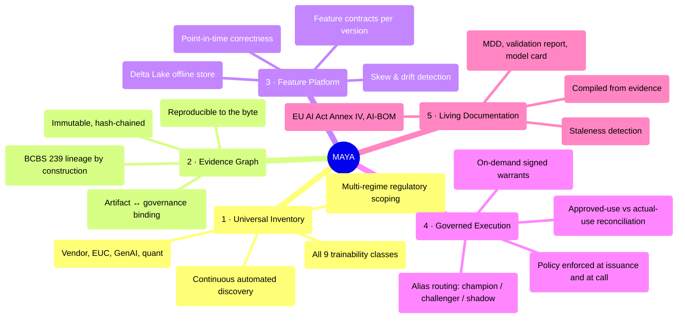
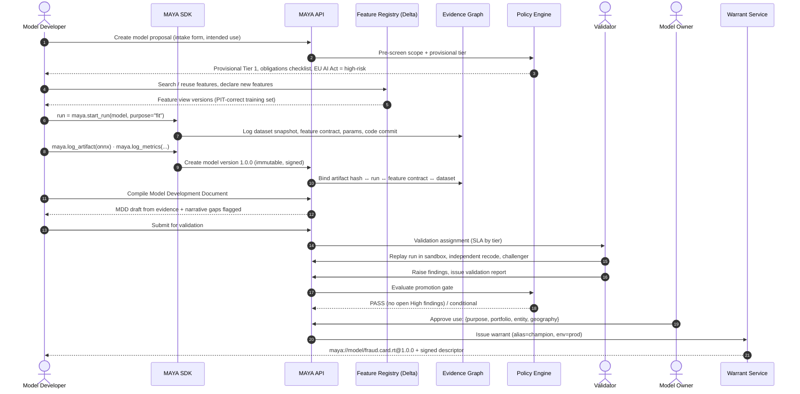
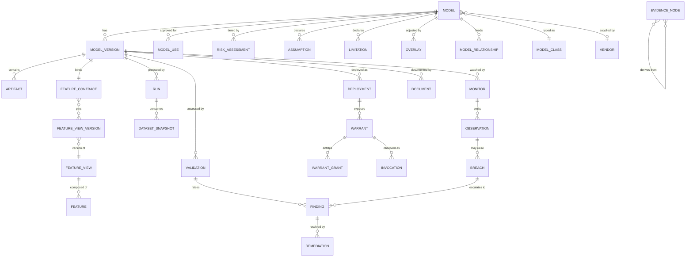

# 03 — MAYA Requirements Specification

*MAYA — Model & AI Lifecycle Assurance.*  **Evidence, not assertion.**

**Product:** MAYA — Model & AI Lifecycle Assurance Platform
**Version:** 1.0 (baseline)
**Status:** For review
**Owner:** Model Risk Technology / Platform Architecture
**Theoretical basis:** [00 — Mathematical Foundations](00-mathematical-foundations.md) — the abstractions these requirements are built on
**Evidence basis:** [01 — Industry Research](01-industry-research.md) · [02 — Model Taxonomy](02-model-taxonomy.md)

> *māyā* (माया) — in Indian philosophy, the appearance that stands in for reality. SR 26-2 puts it
> almost the same way: *"Models are simplified representations of real-world relationships."* The
> platform is named for the thing it governs, and for the discipline of never mistaking the map for
> the territory.

---

## Table of contents

1. [Purpose, scope and definitions](#1-purpose-scope-and-definitions)
2. [Product vision and positioning](#2-product-vision-and-positioning)
3. [Personas](#3-personas)
4. [Primary user journeys](#4-primary-user-journeys)
5. [Domain object model](#5-domain-object-model-requirements-view)
6. [Functional requirements](#6-functional-requirements)
7. [Non-functional requirements](#7-non-functional-requirements)
8. [Data requirements](#8-data-requirements)
9. [Integration requirements](#9-integration-requirements)
10. [Regulatory traceability matrix](#10-regulatory-traceability-matrix)
11. [Assumptions, constraints, out of scope](#11-assumptions-constraints-and-out-of-scope)
12. [Acceptance criteria and success metrics](#12-acceptance-criteria-and-success-metrics)

---

## 1. Purpose, scope and definitions

### 1.1 Purpose

MAYA is the bank's **single system of record and system of engagement for every model and model-adjacent
asset**, from the moment someone proposes one to the moment it is decommissioned and archived. It manages
the *governance* (inventory, tiering, approval, validation, findings, overlays, documentation, audit) and
the *engineering* (artifacts, features, training/calibration runs, versions, deployment warrants, monitoring)
in one object model, with the governance record **cryptographically bound to the engineering artifact**.

### 1.2 Scope

**In scope:** all nine trainability classes T0–T8 across all eleven domains in
[02 — Model Taxonomy](02-model-taxonomy.md); internally built, vendor-supplied, open-source, embedded and
end-user-computing assets; every jurisdiction the bank operates in.

**Explicitly in scope and commonly missed:** market-data construction models, deterministic regulatory
calculators, vendor black boxes, expert-judgment scorecards, post-model adjustments, prompts and RAG
corpora, and the tiering model itself.

### 1.3 Definitions

| Term | Definition used in MAYA |
|---|---|
| **Model** | Any registered asset in the inventory, regardless of whether it meets a given regulator's model definition. Regulatory scope is a separate, multi-valued attribute. |
| **Model Version** | An immutable, content-addressed instance of a model's implementation + parameters + configuration. |
| **Model Use** | An approved (purpose × product/portfolio × legal entity × geography × channel) tuple. A model may have many; risk attaches here. |
| **Artifact** | A binary or serialised object (weights, ONNX graph, PMML, coefficients, prompt bundle, container digest) identified by content hash. |
| **Feature** | A named, typed, semantically defined input signal, with an owner and a computation definition. |
| **Feature View** | A versioned, point-in-time-correct materialisation of a set of features for an entity, in Delta Lake. |
| **Feature Contract** | The exact, immutable set of feature-view versions and transformations a model version was fitted on and must be served. |
| **Warrant** | A signed, policy-bound, resolvable execution contract that lets an execution engine run a specific model version or alias. |
| **Evidence Node** | An immutable, hash-identified record of something that happened (a run, a test, a decision) with its inputs and outputs. |
| **Overlay / PMA** | A post-model adjustment to model input, assumption, methodology or output, made by expert judgment. |
| **Tier** | Derived risk classification from materiality × complexity, driving control intensity. |
| **Effective challenge** | Critical, independent, competent, empowered review — per SR 26-2. |

---

## 2. Product vision and positioning

### 2.1 Vision statement

> **Any question an examiner, an auditor, a CRO or an engineer can ask about any model in the bank should
> be answerable in under sixty seconds, from a single system, with cryptographic evidence, without asking
> a human to look something up.**

### 2.2 The five product pillars

### 2.3 Design principles

| # | Principle | Implication |
|---|---|---|
| P1 | **Evidence over assertion.** | Nothing is "validated" because a field says so; it is validated because a signed evidence chain says so. |
| P2 | **Immutability by default.** | Versions, runs, artifacts, approvals and evidence are append-only. Corrections are new records with supersession links. |
| P3 | **The lifecycle is data, not code.** | Lifecycle state machines, tiering rules, evidence schemas and policies are configuration, versioned like models. |
| P4 | **Governance where the work happens.** | An SDK and CLI make the compliant path the *easy* path from the notebook and the CI pipeline; the UI is for review, not data entry. |
| P5 | **Every class is a first-class class.** | A calibrated pricing engine is not a degraded ML model. It has its own evidence schema. |
| P6 | **Open standards at the boundary.** | Open Inference Protocol, ONNX/PMML, OpenLineage, SPDX/CycloneDX AI-BOM, OPA/Rego, OIDC. |
| P7 | **Zero-trust on artifacts.** | Never deserialise untrusted code in the control plane. Sign everything. Verify at execution. |
| P8 | **Explain the derivation.** | Every derived value (tier, score, status, RAG rating) exposes its inputs, rule version and rationale. |
| P9 | **Degrade safely.** | If MAYA is unavailable, warrants already issued keep working; only *new* issuance and *changes* block. |
| P10 | **Regulatory scope is plural.** | Scope regimes are attributes, not the schema. Adding a regulator must not require a migration. |

---

## 3. Personas

| # | Persona | Goals | Frustrations today | Key MAYA surfaces |
|---|---|---|---|---|
| U1 | **Model Developer / Quant** (~200–600 users) | Build, fit, test, document, ship without governance friction | Re-keying metadata into GRC tools; rebuilding training sets; "which feature version did I use?" | SDK, CLI, notebook plugin, experiment tracking, feature registry, submission workspace |
| U2 | **Model Owner** (business accountable, ~300) | Know their models' health and obligations; get approvals through | No single view; surprise findings; overdue validations discovered at audit | Owner dashboard, obligations inbox, attestation flow |
| U3 | **Independent Validator** (2LoD, ~50–150) | Perform effective challenge efficiently; evidence it | Chasing artifacts and data; rebuilding developer results; template drudgery | Validation workbench, reproducible run replay, challenger sandbox, findings register, report compiler |
| U4 | **Head of Model Risk / MRM Office** | Portfolio view, tiering integrity, backlog control, board reporting | Inventory accuracy; no aggregate risk view; manual board packs | Portfolio dashboard, tiering engine, KRI/risk-appetite board, reporting pack export |
| U5 | **Model User / Business Analyst** | Use approved models correctly; understand limits | Doesn't know limitations or boundaries; uses models off-label | Model catalogue (read-only), limitations panel, "may I use this for X?" checker |
| U6 | **Execution Engine / Application** (machine persona) | Resolve and run a model version reliably and fast | Hardcoded model paths; silent version drift; no kill switch | Warrant Resolution API, OIP v2 endpoints, SDK client |
| U7 | **Data Engineer / Feature Owner** | Publish trustworthy features; avoid duplication | Feature sprawl; no PIT correctness; no consumer visibility | Feature registry, materialisation jobs, consumer impact view |
| U8 | **Internal Audit (3LoD)** | Test whether the framework operates as designed | Sampling by hand; evidence in email | Audit workbench, immutable audit log, sampling and evidence export |
| U9 | **Regulator / External Examiner** | Verify inventory completeness and control operation | PDF dumps; inconsistent answers | Read-only examiner portal, time-travel "as at date" inventory, exam request pack |
| U10 | **Compliance / Fair Lending / Legal** | Assess consumer-protection and AI Act exposure | Cannot find which models touch consumers | Regulatory scope views, fairness dashboards, reason-code registry |
| U11 | **Vendor Manager** | Track third-party model estate and attestations | No inventory of embedded vendor models | Vendor register, attestation tracker, version-change alerts |
| U12 | **Platform / SRE** | Keep it up, fast and secure | — | Ops console, health, quotas, sandbox fleet |
| U13 | **CRO / Board Risk Committee** | Is model risk within appetite? | Narrative-only reporting | Executive board pack, risk appetite dial, trend and exception reporting |

---

## 4. Primary user journeys

### J1 — Register and ship a new ML model (T3)

### J2 — Register a calibrated pricing model (T1) that is never "trained"

Same spine, different evidence schema: no training dataset; instead **calibration instrument set**,
**calibration tolerance**, **arbitrage-free assertions**, **analytical benchmark suite**, **greeks
stability tests**, and a **daily recalibration job** whose outputs are monitored for calibration error
rather than AUC. The lifecycle state machine has `specify → implement → verify → calibrate → benchmark →
approve → operate` with a recurring `recalibrate` sub-cycle that does **not** require re-approval unless
tolerance is breached or methodology changes.

### J3 — Onboard a vendor black box (T6)

`register → vendor due diligence → obtain vendor validation attestation → own-outcomes benchmark →
document own use → approve with conditions → monitor vendor version changes`. MAYA watches for vendor
release notes and flags version changes as a change event requiring impact assessment.

### J4 — Register a GenAI application (T5)

`use-case intake → boundary determination (autonomy mode) → risk matrix (decision proximity × consumer
harm) → prompt/RAG/tool registration → eval-set construction → pre-deployment eval → guardrail config →
human-oversight design → approve → continuous eval + trace monitoring`.

### J5 — Issue a warrant to an execution engine

The scheduler/batch engine holds only a URN. At runtime it calls the Warrant Resolution API, gets a signed
descriptor with artifact URI, feature contract, runtime spec and policy, verifies the signature, and
executes. If MAYA has revoked the warrant (kill switch), resolution fails closed. See [06 — Warrants](06-warrants-and-execution.md).

### J6 — Annual/periodic revalidation and attestation cycle

MAYA generates the population, assigns work by tier and due date, tracks SLA, escalates, and produces
the committee pack. Owners attest to inventory accuracy; discrepancies become findings.

### J7 — Examiner request

Examiner asks: *"Show me every model that fed the Q2 2026 CECL provision, its validation status at that
date, and any overlays applied."* MAYA answers with an **as-at-date** query over the evidence graph and
exports a signed pack.

---

## 5. Domain object model (requirements view)

Every entity above emits **evidence nodes**; the graph is the connective tissue, not a separate feature.

---

## 6. Functional requirements

Priority: **M** = Must (MVP), **S** = Should (v1.1), **C** = Could (v2), **W** = Won't (this release).
Each requirement carries regulatory traceability where applicable.

### 6.1 Module: Inventory & Registration (`FR-INV`)

| ID | Requirement | Pri | Traceability |
|---|---|---|---|
| FR-INV-001 | Register a model with a globally unique, human-readable **URN** (`maya://model/<domain>.<family>.<name>`), immutable for life. | M | SR 26-2 VI; SS1/23 1.2 |
| FR-INV-002 | Capture the full inventory attribute set (§8.1), with per-attribute mandatory/optional driven by `model_class` and tier. | M | SS1/23 1.2(c) |
| FR-INV-003 | Support inventory states: `proposed`, `in_development`, `submitted`, `in_validation`, `approved`, `approved_with_conditions`, `in_use`, `restricted_use`, `suspended`, `decommissioning`, `decommissioned`, `archived`, `rejected`. Include **under-development and decommissioned** models. | M | SS1/23 1.2(a) |
| FR-INV-004 | Record **multi-valued regulatory scope** per model (e.g. `{SR-26-2: out, SS1/23: in, EU-AI-Act: high-risk, IRB: in, SOX: key-control}`) with stored rationale for each in/out determination. | M | SR 26-2 II; SS1/23 1.1; EU AI Act Art. 6 |
| FR-INV-005 | Model **uses** as separate entities: purpose, product/portfolio, legal entity, geography, channel, customer segment, decision authority, effective dates. | M | SR 26-2 III ("misapplied or misused") |
| FR-INV-006 | Record **operating boundaries** — the input domain over which performance is expected acceptable — as structured, machine-checkable ranges/constraints. | M | SS1/23 1.2(c)(i) |
| FR-INV-007 | First-class **assumption register** and **limitation register** per model, each with owner, materiality, mitigation, review date, and linkage to findings and overlays. | M | SS1/23 1.2(c)(ii) |
| FR-INV-008 | Named accountable **individual** owner (not a team) plus developer, validator, and approver roles; enforce non-empty and non-conflicting. | M | SR 26-2 VI |
| FR-INV-009 | **Model relationships**: `feeds`, `consumes`, `challenger_of`, `benchmark_for`, `replaces`, `variant_of`, `component_of`, `calibrated_by`, with strength and criticality. | M | SR 26-2 III (aggregate risk) |
| FR-INV-010 | Compute and visualise **blast radius** (transitive downstream closure) for any model or proposed change. | M | SS1/23 3.4(d) |
| FR-INV-011 | Compute **aggregate/concentration analytics**: shared feature views, shared datasets, shared vendors, shared methodologies, shared assumptions; flag single points of failure. | S | SR 26-2 III |
| FR-INV-012 | **Bulk import** from CSV/Excel and from connectors (MLflow, Unity Catalog, SageMaker, Vertex, git, SAS metadata, ServiceNow CMDB) with reconciliation and de-duplication. | M | — |
| FR-INV-013 | **Continuous discovery**: scheduled connector sweeps that detect unregistered models and raise `discovery_exception` cases. | S | Industry practice (§3 of 01) |
| FR-INV-014 | **EUC discovery** ingestion: accept scan output (file path, owner, complexity score, formula count, macro presence) and triage into inventory or EUC register. | S | SS1/23 1.1(b) |
| FR-INV-015 | Full-text and **semantic search** across inventory, documents and code ("find models that use the 3-month LIBOR curve"). | S | — |
| FR-INV-016 | **As-at-date (time-travel) inventory query**: reconstruct the inventory and every model's status as it stood on any past date. | M | Examiner requests; SOX |
| FR-INV-017 | Periodic **owner attestation** campaigns with tracked completion and discrepancy findings. | S | — |
| FR-INV-018 | Model **decommissioning** workflow capturing rationale, replacement, downstream notification, retention class and archive. | M | SS1/23 1.2 fn.6 |
| FR-INV-019 | Tag models as **`sox_relevant`**, `regulatory_reporting`, `consumer_impacting`, `safety_critical`, driving additional control sets. | M | SOX; ECOA |
| FR-INV-020 | Support **model families / variants** (e.g. one PD methodology instantiated per portfolio) with inherited attributes and delta-only overrides. | S | — |

### 6.2 Module: Risk Tiering & Assessment (`FR-TIER`)

| ID | Requirement | Pri | Traceability |
|---|---|---|---|
| FR-TIER-001 | Two-axis tiering: **materiality** (quantitative exposure + qualitative purpose) × **complexity/inherent risk**, producing Tier 1–4. Axes stored separately, never collapsed on input. | M | SR 26-2 III; SS1/23 1.3(a)(b) |
| FR-TIER-002 | Tiering rules as **versioned policy-as-code** (declarative rules over inventory attributes), with test fixtures and a promotion workflow. | M | SS1/23 1.3(d) |
| FR-TIER-003 | Every tier assignment stores a **full derivation trace**: input snapshot, rule version, intermediate scores, final tier, and human overrides with justification. | M | SS1/23 1.3(e) |
| FR-TIER-004 | Complexity scoring must support the advanced factors: alternative/unstructured data usage, interpretability, explainability, transparency, designer/data bias potential. | M | SS1/23 1.3(c) |
| FR-TIER-005 | **Automatic re-tiering triggers**: exposure change beyond threshold, new use added, methodology change, data-source change, monitoring breach, regulatory change, elapsed time. | M | SR 26-2 III |
| FR-TIER-006 | Register the tiering approach **as a model in the inventory** and subject it to periodic validation. | S | SS1/23 1.3(d) |
| FR-TIER-007 | Tier drives, by configuration: validation scope and cadence, monitoring frequency and metric set, documentation template set, approval authority level, warrant issuance constraints. | M | SR 26-2 III |
| FR-TIER-008 | **Immaterial-model lite path**: models deemed immaterial require only identification + condition monitoring for materiality escalation. | M | SR 26-2 III (explicit) |
| FR-TIER-009 | What-if tiering simulator: re-run the current or a candidate ruleset across the whole portfolio and diff the outcome. | S | — |
| FR-TIER-010 | Record and track **regulatory model approvals** (IRB permission, FRTB IMA desk approval, internal model waiver) with scope, conditions, and expiry. | S | Basel |

### 6.3 Module: Model Versions & Artifacts (`FR-VER`)

| ID | Requirement | Pri | Traceability |
|---|---|---|---|
| FR-VER-001 | **Upload a model** via UI (drag-drop), CLI, SDK or CI webhook. Accept: ONNX, PMML, safetensors, TorchScript, joblib/pickle (restricted), H2O MOJO, PFA, Spark ML, SAS score code, R/Python source bundle, JAR, C++ shared object, container digest, prompt bundle, spreadsheet, or **reference-only** (vendor/black box). | M | Core |
| FR-VER-002 | Semantic versioning `MAJOR.MINOR.PATCH` with declared semantics: MAJOR = methodology change (requires revalidation), MINOR = refit/recalibration on same methodology, PATCH = implementation fix with no output change (must be proven by regression). | M | SS1/23 3.3(c) |
| FR-VER-003 | Versions are **immutable and content-addressed** (SHA-256 of a canonical manifest + artifact digests). Any change creates a new version. | M | P2 |
| FR-VER-004 | Automatic **artifact introspection** on upload: framework and library versions, input/output schema (name, dtype, shape, nullability), declared features, hyperparameters, size, opset. | M | Core |
| FR-VER-005 | **Security scanning at upload**: malware scan, pickle opcode analysis, dependency vulnerability scan, secret detection, licence detection. Block or quarantine on policy breach. | M | Supply chain (01 §5.4) |
| FR-VER-006 | **Format policy enforcement**: configurable allow/deny by environment. Default: pickle denied in production without explicit, expiring risk acceptance. | M | 01 §5.4 |
| FR-VER-007 | **Sign artifacts** (Sigstore/cosign-compatible) and record in-toto/SLSA provenance attestations; verify signature at warrant resolution. | S | SLSA |
| FR-VER-008 | Generate an **AI-BOM** (SPDX 3.0 AI/Dataset profile and CycloneDX ML-BOM) per version. | S | EU AI Act Art. 11; AIBOM research |
| FR-VER-009 | **Version comparison / diff**: parameters, hyperparameters, feature contract, metrics, schema, documentation, and output on a common test set. | M | SS1/23 3.3(c) |
| FR-VER-010 | **Aliases** as mutable named pointers per environment: `champion`, `challenger`, `shadow`, `baseline`, `candidate`, plus custom. Alias moves are governed, audited, and instantly effective for warrants. | M | MLflow/UC pattern |
| FR-VER-011 | Support versions with **no artifact** (vendor black box, EUC, expert-judgment) but full metadata and evidence. | M | T6/T7/T8 |
| FR-VER-012 | **Reproducibility bundle**: one command reconstructs the exact environment (lockfile/container digest), dataset snapshot, feature views, seed, and code commit to re-run a fit. | M | SR 26-2 V; P1 |
| FR-VER-013 | Store **calibration parameter sets** as versioned, high-frequency child objects of a version (a T1 model may recalibrate daily without creating a new model version). | M | T1 lifecycle |
| FR-VER-014 | Register **prompt bundles, RAG corpus versions, tool manifests and guardrail configs** as artifact types with the same versioning discipline. | M | T5 |
| FR-VER-015 | Retention and legal hold per artifact class, with WORM storage option for regulated classes. | M | EU AI Act Art. 19; SOX |

### 6.4 Module: Feature Management (`FR-FEA`)

| ID | Requirement | Pri | Traceability |
|---|---|---|---|
| FR-FEA-001 | **Feature registry**: name, entity, dtype, semantic description, business definition, unit, owner, source system, computation logic, refresh cadence, PII/sensitivity class, prohibited-basis proxy flag, lineage. | M | Core |
| FR-FEA-002 | **Feature views**: versioned groupings of features for an entity, with a declarative transformation definition (SQL / PySpark / Python UDF) and a schema. | M | Core |
| FR-FEA-003 | Materialise feature views to **Delta Lake offline store** with event-time and ingestion-time columns supporting **point-in-time-correct** joins. | M | PIT correctness (01 §5.2) |
| FR-FEA-004 | **Training set generation**: given an entity/label spine with timestamps, produce a PIT-correct training set and register it as an immutable **dataset snapshot** (Delta version pinned). | M | P1 |
| FR-FEA-005 | Optional **online store** sync (Redis / DynamoDB / Postgres) with freshness SLA, for low-latency serving; expose freshness lag as a monitored metric. | S | Training-serving skew |
| FR-FEA-006 | **Feature contract**: every model version binds to exact feature view versions + transformation versions. Serving with a non-matching contract fails closed. | M | Skew prevention |
| FR-FEA-007 | **Training–serving skew detection**: compare offline vs online distributions and values for the same entity/time; alert on divergence. | M | 01 §5.2 |
| FR-FEA-008 | **Feature-level lineage**: source table/column → transformation → feature → feature view version → model version → model use → business decision. | M | BCBS 239 |
| FR-FEA-009 | **Consumer impact analysis**: before changing or deprecating a feature, list every affected model version, warrant and use. Block breaking changes without impact sign-off. | M | — |
| FR-FEA-010 | **Feature discovery and reuse**: search, similarity detection, duplicate-feature warning, popularity and quality signals. | S | — |
| FR-FEA-011 | **Data quality assertions** per feature (null rate, range, cardinality, freshness, referential integrity) evaluated on every materialisation; failures quarantine the version. | M | SS1/23 3.2 |
| FR-FEA-012 | **Feature drift monitoring** (PSI/CSI, KL, KS, Wasserstein) against the training-time reference distribution stored in the contract. | M | SR 26-2 V |
| FR-FEA-013 | **Sensitive-attribute governance**: tag protected characteristics and known proxies; enforce policy that prohibits their direct use in in-scope credit models while permitting controlled use for fairness testing. | M | ECOA/Reg B; CFPB |
| FR-FEA-014 | **Feature ownership and certification levels** (`experimental`, `certified`, `deprecated`) with policy tying production models to certified features by tier. | S | — |
| FR-FEA-015 | Support **on-demand / request-time features** (computed from the request payload) declared in the contract and validated at serve time. | S | — |
| FR-FEA-016 | **Backfill** and **restatement** handling: when a source is restated, identify affected snapshots, models and decisions. | S | BCBS 239 |
| FR-FEA-017 | Delta Lake **time travel** and retention configured per feature view; minimum retention by regulatory class. | M | 01 §5.3 |
| FR-FEA-018 | **Derived features**: a feature computed from others, `Z = f(X, Y)`, with a declared and versioned expression, recorded lineage, an ingest clock inherited as the maximum over its inputs, and refusal of any derivation that reads a label. | M | — |
| FR-FEA-019 | **Featuresets**: a named, versioned presentation of `X` — a declared schema of slots, and versions binding each slot to a feature and to the exact feature view version supplying it. Reusable across models; checked against a kernel's declared input schema before a warrant may name it. | M | — |
| FR-FEA-021 | **Dimensionality**: a feature declares a shape (scalar, vector, matrix, tensor) and optional component names for its first axis; the component order is the axis order, and the declared shape is checked against the values that arrive. | M | — |
| FR-FEA-022 | **Composition**: a feature or featureset may compose from one or more others, resolved by a left-to-right fold in which the rightmost wins, with the object's own operations applied last. | M | — |
| FR-FEA-023 | Composition operations (`add`, `drop`, `override`) are **total**: each is refused when it would have no effect. Cycles and compositions of ephemeral objects are refused. | M | — |
| FR-FEA-024 | Resolution is a **read-time** act; MAYA returns the resolved members, the lineage, and which layer decided each member. | M | — |
| FR-FEA-025 | **Sealing**: a sealed feature or featureset takes no amendment and no further versions, and remains composable. Breaking a seal is administrator-only and requires a recorded reason. | M | — |
| FR-FEA-026 | **Ephemerality**: an object may carry a time to live, after which it is destroyed. It cannot be sealed, cannot be composed from, and its destruction is recorded with the digests of what it held. | M | — |
| FR-FEA-027 | Ephemeral objects are reaped on a schedule and on request; nothing governed may pin one. | M | — |
| FR-FEA-028 | **Ownership**: the creator is recorded permanently; the owner is transferable by name, with the handover witnessed. | M | — |
| FR-FEA-029 | **Retrieval policy** attaches to a feature or featureset as default behaviour and is overridden by a request, merged section by section and column by column under the same precedence as composition. | M | — |
| FR-FEA-030 | **Point-in-time normalisation**: statistics are fitted only from rows knowable at a stated `as_of`; a request without one is refused. The fitted statistics are returned with the data. | M | — |
| FR-FEA-031 | **Missing values**: null, NaN and infinity are treated alike; fitted fill strategies require an `as_of`; the fill rate is reported and flagged past a threshold. Statistics are fitted on observed values before anything is filled. | M | — |
| FR-FEA-032 | **Alignment** onto a chosen axis with a stated fill rule. Rules that fill from a later observation are permitted and stamped with the ingest time at which the value became knowable, so a point-in-time read excludes them. | M | — |
| FR-FEA-020 | **Roll-forward**: mint a featureset version re-resolved to current feature view versions, reporting the slots that moved. Publishing a view version must never alter an existing featureset version. | M | — |
| FR-PAR-001 | **Parameter sets**: store the inhabitant of `P` an execution engine returns, bound to the model version, featureset version, window and `as_of` that produced it. A fit produces a parameter set and **not** a model version. | M | — |
| FR-PAR-002 | A fitted parameter set is accepted **only** against a warrant MAYA issued, and only when it names the featureset version it was fitted from. | M | — |
| FR-PAR-003 | Provenance is `fitted`, `calibrated` or `declared`, governed to different depths: each fitted set approved individually, a calibration procedure approved once, declared parameters attested. | M | — |
| FR-PAR-004 | A parameter set is immutable and approved by somebody other than whoever recorded it; resolution refuses rather than guesses when a version has more than one approved set. | M | — |

### 6.5 Module: Lifecycle & Workflow (`FR-LC`)

| ID | Requirement | Pri | Traceability |
|---|---|---|---|
| FR-LC-001 | **Configurable lifecycle state machines per model class**, defined declaratively (states, transitions, guards, required evidence, required roles, SLAs). | M | P3, P5 |
| FR-LC-002 | Ship reference lifecycles for T0–T8 out of the box (see [04 §5](04-architecture.md)). | M | 02 |
| FR-LC-003 | **Transition guards** evaluated by the policy engine; block with a human-readable list of unmet conditions and direct links to remediate each. | M | P8 |
| FR-LC-004 | **Segregation of duties** enforced: developer ≠ validator; approver ≠ developer; configurable by tier. | M | SR 26-2 VI (conflicts of interest) |
| FR-LC-005 | **Approval workflows** with delegated authority matrix by tier, amount, and legal entity; parallel and sequential approvers; committee approvals with quorum. | M | SR 26-2 VI |
| FR-LC-006 | **Conditional / restricted approval**: approve with machine-enforced usage limits (portfolio caps, exposure caps, mandatory human review, expiry) for use-before-validation cases. | M | SR 26-2 V (explicit) |
| FR-LC-007 | **Change management**: classify proposed changes (material / non-material) with a rules-based classifier plus override; material changes trigger revalidation. | M | SS1/23 3.3(c) |
| FR-LC-008 | **Parallel run / shadow mode** management: run new version alongside champion, capture both outputs, and produce **parallel outcomes analysis** automatically. | M | SS1/23 3.3(c) |
| FR-LC-009 | **e-Signature** on approvals with re-authentication, intent statement, and tamper-evident record. | M | SOX |
| FR-LC-010 | **Task inbox** per user with SLA, ageing, escalation and delegation (including out-of-office). | M | — |
| FR-LC-011 | **Exceptions and waivers** with mandatory expiry, compensating controls, and approval level scaled to risk. No indefinite exceptions. | M | — |
| FR-LC-012 | **Campaign engine** for periodic activities (revalidation, attestation, monitoring review) that generates, assigns and tracks populations. | S | — |
| FR-LC-013 | **Model intake / use-case triage** for new proposals, including build-vs-buy, GenAI boundary determination, and early scope determination. | S | GAICF |
| FR-LC-014 | Reference-data-driven **notification and escalation** (email, Teams/Slack, webhook) on state changes, SLA breach, and breaches. | M | — |

### 6.6 Module: Training, Calibration & Experimentation (`FR-TRN`)

| ID | Requirement | Pri | Traceability |
|---|---|---|---|
| FR-TRN-001 | **Run tracking** for any fit-like activity, typed by purpose: `train`, `estimate`, `calibrate`, `elicit`, `configure`, `verify`, `backtest`, `benchmark`, `evaluate`, `stress`. | M | P5 |
| FR-TRN-002 | Log per run: parameters, hyperparameters, metrics (time series), tags, code commit + diff, environment lockfile/container digest, hardware, random seeds, dataset snapshot ids, feature contract, artifacts, stdout/stderr, duration, cost. | M | P1 |
| FR-TRN-003 | **Experiment comparison** UI: parallel-coordinates, metric tables, artifact diff, and promotion of a run to a model version. | M | — |
| FR-TRN-004 | **Orchestrated training/calibration jobs**: submit to a configured compute backend (Databricks, Spark, Kubernetes, Airflow, Slurm) with resource profiles; capture logs and lineage. | S | — |
| FR-TRN-005 | **Scheduled recalibration** for T1 models with tolerance checks; auto-publish a new calibration set if within tolerance, escalate if not. | M | T1 |
| FR-TRN-006 | **Automated retraining pipelines** for T3 with trigger conditions (schedule, drift, performance decay, data volume) and a governed auto-promotion policy — never auto-promoting a Tier 1 model without human approval. | S | — |
| FR-TRN-007 | **Hyperparameter search** tracking with parent/child run hierarchy. | C | — |
| FR-TRN-008 | **Deterministic replay**: re-execute any historical run in a sandbox and assert bit-level or tolerance-level equality of outputs. Report non-reproducibility as a finding. | M | P1; SR 26-2 V |
| FR-TRN-009 | **Challenger management**: register challenger models against a champion, run them on the same data, and maintain a standing comparison. | M | SR 26-2 V; SS1/23 3.3(b)(iii) |
| FR-TRN-010 | **Expert-judgment elicitation workflow** (T7): structured capture of panel composition, questions, individual responses, convergence, final weights, and dissent. | S | T7 |
| FR-TRN-011 | Runs on **sensitive data** must execute in approved compute zones only; enforce data residency and purpose limitation. | M | GDPR |

### 6.7 Module: Validation & Effective Challenge (`FR-VAL`)

| ID | Requirement | Pri | Traceability |
|---|---|---|---|
| FR-VAL-001 | **Validation plans** scoped by tier and model class, generated from a configurable test catalogue, covering the three SR 26-2 components: conceptual soundness, outcomes analysis, ongoing monitoring. | M | SR 26-2 V |
| FR-VAL-002 | **Test catalogue** with reusable, parameterised, executable tests: discrimination (KS, AUC/Gini, lift), calibration (HL, binomial, Brier, reliability), stability (PSI/CSI), backtesting (Basel traffic light, Kupiec, Christoffersen), sensitivity, stress, benchmarking, arbitrage-free checks, convergence, greeks stability, fairness (AIR, SPD, EOD), explainability (SHAP stability), robustness (adversarial, noise), reproducibility, implementation (independent recode diff). | M | SR 26-2 V |
| FR-VAL-003 | **Executable validation**: validators run tests inside MAYA against the pinned version and dataset snapshot; results become evidence nodes, not pasted screenshots. | M | P1 |
| FR-VAL-004 | **Independent recode / benchmark harness**: validator implements an independent version; MAYA runs both and reports divergence distribution. | M | Industry practice |
| FR-VAL-005 | **Findings register**: severity (Critical/High/Medium/Low), category, affected component, owner, due date, remediation plan, status, evidence of closure, and independent closure verification. | M | SS1/23 1.2(c)(iii) |
| FR-VAL-006 | Findings **block or restrict** lifecycle transitions and warrant issuance according to policy (e.g. open Critical ⇒ suspend production warrant). | M | — |
| FR-VAL-007 | **Validation report compiler** producing the standard report from evidence + validator narrative, with a completeness checklist. | M | SR 26-2 V |
| FR-VAL-008 | **Validation scheduling** by risk-based cadence with triggers, not a fixed annual rule; explicitly support "no fixed cadence, trigger-based" for low-tier models. | M | SR 26-2 V (cadence removed) |
| FR-VAL-009 | **Vendor model validation** workflow: due diligence checklist, vendor attestation ingestion, own-outcomes analysis, customisation documentation and evaluation. | M | SR 26-2 VII; SS1/23 2.6 |
| FR-VAL-010 | Track **MRA/MRIA and regulatory findings** linked to models, with remediation programme management. | S | — |
| FR-VAL-011 | **Validator independence attestation** and conflict-of-interest declaration per validation. | M | SR 26-2 III, VI |
| FR-VAL-012 | **Ongoing monitoring plan** authored at development time (developer supplies "the monitoring pack") and inherited into production monitoring. | M | SS1/23 3.3(a) |
| FR-VAL-013 | **Re-assess tier during validation** and record whether the tier remains appropriate. | M | SS1/23 1.3(e) |
| FR-VAL-014 | **Validation backlog and capacity management**: workload by validator, forecast, and prioritisation by risk. | S | Industry pain point |

### 6.8 Module: Post-Model Adjustments / Overlay Register (`FR-PMA`)

| ID | Requirement | Pri | Traceability |
|---|---|---|---|
| FR-PMA-001 | Register any adjustment to model **input, assumption, methodology or output** as a first-class, versioned object with type, direction, and calculation method. | M | SS1/23 3.4, 5.1 |
| FR-PMA-002 | Capture **quantified magnitude** per reporting period (absolute and % of model output), the limitation it addresses, the justification, the calculation methodology, and **how it will be calculated over time**. | M | SS1/23 3.4(c) |
| FR-PMA-003 | Mandatory **expiry / review date** and an explicit exit plan (what must be true to remove the overlay). | M | SS1/23 5.1 |
| FR-PMA-004 | **Downstream propagation**: when an overlay is applied to a feeder model, notify all downstream model owners and record impact assessment. | M | SS1/23 3.4(d) |
| FR-PMA-005 | **Recurrence and trend analysis**: detect repeated overlays for the same limitation and escalate as an indicator that redevelopment is required. | M | SS1/23 3.4(g) |
| FR-PMA-006 | Approval authority for overlays scaled by magnitude and model tier; material overlays require independent validation. | M | SS1/23 3.4(d) |
| FR-PMA-007 | Aggregate **overlay dashboard**: total overlay as % of ECL/capital/valuation by portfolio, ageing, trend, top contributors. | M | IFRS 9 audit |
| FR-PMA-008 | Overlay register feeds **financial disclosure** extracts. | S | IFRS 9 |

### 6.9 Module: Monitoring & Observability (`FR-MON`)

| ID | Requirement | Pri | Traceability |
|---|---|---|---|
| FR-MON-001 | **Monitor definitions** as configuration: metric, computation window, segment/slice, threshold (absolute, relative, statistical), severity ladder, frequency, owner, action on breach. | M | SR 26-2 V |
| FR-MON-002 | **Class-aware default metric sets** seeded from the taxonomy (T1 → calibration error; T2/T3 → KS/AUC/PSI; T5 → groundedness/hallucination; T6 → own-outcomes divergence; T8 → rule-fire distribution). | M | 02 |
| FR-MON-003 | Compute monitoring over **Delta Lake telemetry** at scale (billions of rows), with incremental computation. | M | — |
| FR-MON-004 | **Delayed-label handling**: performance metrics computed as outcomes mature, with vintage/cohort alignment (essential for credit). | M | Credit domain |
| FR-MON-005 | **Slice-level monitoring**: by segment, geography, channel, product, and **protected class** for fairness. Detect aggregate-stable/slice-degraded conditions. | M | ECOA; EU AI Act Art. 15 |
| FR-MON-006 | **Breach → finding** automation with severity mapping and auto-assignment. | M | — |
| FR-MON-007 | **Model health score** per model version combining performance, drift, data quality, overlay reliance, validation currency, and open findings — with full derivation transparency. | S | P8 |
| FR-MON-008 | **Inference logging**: capture request id, model URN + resolved version, feature values (or a governed subset/hash), prediction, explanation, latency, caller identity, decision outcome, with sampling policy by tier. Retain per regulatory class. | M | EU AI Act Art. 12, 19 |
| FR-MON-009 | **Approved-use vs actual-use reconciliation**: compare warrant invocation patterns (caller, portfolio, geography, volume) against approved uses and raise off-label-use exceptions. | M | SS1/23 1.2(c)(i) |
| FR-MON-010 | **Operating-boundary monitoring**: flag inference requests whose inputs fall outside the declared operating boundaries; count, alert and optionally reject. | M | SS1/23 1.2(c)(i) |
| FR-MON-011 | **Champion/challenger continuous comparison** with statistical significance and a promotion recommendation. | S | — |
| FR-MON-012 | **Adaptive-model (T4) change monitoring**: track the magnitude and frequency of autonomous parameter change and alarm on excursions; retain the parameter trajectory. | M | SS1/23 3.3(c) |
| FR-MON-013 | **GenAI monitoring**: groundedness, citation accuracy, hallucination rate, refusal rate, toxicity, PII leakage, jailbreak attempts, prompt-injection detections, token cost, latency, human-edit distance, human override rate; trace capture per interaction. | M | NIST GAI Profile; GAICF |
| FR-MON-014 | **Alerting** with routing, deduplication, suppression windows and on-call escalation. | M | — |
| FR-MON-015 | **Data pipeline monitoring** upstream of models: freshness, volume, schema change, null spikes — because most "model failures" are data failures. | M | — |
| FR-MON-016 | Ingest **external monitoring** results (Arize, Evidently, Lakehouse Monitoring) via API so MAYA remains the system of record without mandating its own compute. | S | Integration |

### 6.10 Module: Warrants & Execution (`FR-WARRANT`)

Detailed protocol in [06 — Warrants and Execution](06-warrants-and-execution.md).

| ID | Requirement | Pri | Traceability |
|---|---|---|---|
| FR-WARRANT-001 | **Issue a warrant on demand** for a model version or alias, of a requested flavour, subject to policy evaluation. | M | User requirement |
| FR-WARRANT-002 | Support warrant flavours: **REST/OIP-v2**, **gRPC**, **batch job** (Spark/Delta), **Python/Java SDK client**, **SQL UDF**, **stream processor** (Kafka), **container image**, **spreadsheet/API-key**, and **descriptor-only** (execution engine supplies its own runtime). | M | Execution-engine requirement |
| FR-WARRANT-003 | A warrant resolves a stable **URN** (`maya://model/<name>@<version>` or `...#<alias>`) to a **signed Warrant Descriptor** containing artifact URI + digest, runtime spec, input/output schema, feature contract, preprocessing DAG, policy constraints, expiry and revocation endpoint. | M | — |
| FR-WARRANT-004 | **Alias-based routing**: an execution engine may bind to `#champion` and automatically follow governed alias moves without redeployment. | M | Champion/challenger |
| FR-WARRANT-005 | **Pinned-version binding** for reproducibility-critical callers (regulatory reporting must not silently follow an alias). | M | SOX |
| FR-WARRANT-006 | **Entitlement model**: warrants are granted to a principal (service account, team, application) for a specific **approved use**; resolution fails if the caller's declared use is not approved. | M | SR 26-2 III |
| FR-WARRANT-007 | **Kill switch**: revoke a warrant, an alias binding, a version, or all warrants for a model, taking effect within a configurable TTL (default ≤ 60s), with a documented break-glass. | M | Operational resilience |
| FR-WARRANT-008 | **Fail-safe availability**: previously resolved descriptors remain valid for their TTL if MAYA is unreachable; only new issuance and revocation propagation are affected. | M | P9 |
| FR-WARRANT-009 | **Invocation telemetry**: every resolution and (where MAYA serves) every invocation is logged with caller, use, version, latency and outcome. | M | FR-MON-009 |
| FR-WARRANT-010 | **Rate limits, quotas and cost budgets** per warrant grant, especially for T5 token-metered models. | M | — |
| FR-WARRANT-011 | **Signature verification**: descriptors are signed; SDKs verify before execution; artifact digest is checked at load. | M | Supply chain |
| FR-WARRANT-012 | **Environment scoping**: dev / test / uat / prod warrants with distinct policy; production issuance requires approved state. | M | — |
| FR-WARRANT-013 | **Shadow and canary traffic** support: issue a warrant that mirrors a percentage of traffic to a challenger without affecting the served result. | S | — |
| FR-WARRANT-014 | **Optional managed serving**: MAYA can host the model itself behind an OIP-v2 endpoint with autoscaling, for teams without their own runtime. | S | — |
| FR-WARRANT-015 | **Execution sandboxing**: any MAYA-hosted execution runs in a network-isolated, resource-capped, ephemeral sandbox with no credentials to the control plane. | M | P7 |
| FR-WARRANT-016 | **Warrant catalogue** UI: what exists, who holds it, what it points at, usage volume, last used, and unused-warrant cleanup. | S | — |
| FR-WARRANT-017 | Support **composite warrants**: a warrant that resolves to a DAG of models (e.g. curve → pricer → XVA) as one callable unit, with per-node governance. | C | Feeder graph |

### 6.11 Module: Documentation (`FR-DOC`)

| ID | Requirement | Pri | Traceability |
|---|---|---|---|
| FR-DOC-001 | **Template engine** for document types, versioned, with sections declared as either *auto-generated from evidence* or *human narrative*. | M | SR 26-2 VI |
| FR-DOC-002 | Ship templates: Model Development Document, Independent Validation Report, Model Card, Ongoing Monitoring Report, Change Assessment, Decommissioning Memo, Vendor Model Assessment, **EU AI Act Annex IV Technical Documentation**, **AI-BOM**, Adverse-Action Reason Code Dictionary, Committee Paper, Examiner Response Pack. | M | EU AI Act Art. 11 |
| FR-DOC-003 | **Compile** a document: pull metrics, plots, tables and lineage from the evidence graph at a pinned point in time; render to HTML, PDF and DOCX. | M | — |
| FR-DOC-004 | **Staleness detection**: mark a document stale when any evidence it cites has been superseded; show a diff of what changed. | M | Industry pain point |
| FR-DOC-005 | **Completeness scoring** against the template's mandatory sections, surfaced as a gate condition. | M | — |
| FR-DOC-006 | **Collaborative narrative editing** with comments, suggestions, review states and version history. | S | — |
| FR-DOC-007 | **AI drafting assistant** that proposes narrative from evidence — with every generated claim carrying an evidence citation, an explicit "AI-drafted, human-approved" provenance flag, and mandatory human sign-off. Governed as a T5 model in MAYA itself. | S | Self-referential governance |
| FR-DOC-008 | **Document repository** with full-text + semantic search, retention, and legal hold. | M | — |
| FR-DOC-009 | **Attachment of external evidence** (vendor documents, committee minutes, emails) with hashing and provenance. Filed against the *version* described; content-addressed and re-verified on read; accepted by somebody other than whoever filed it. | M | — |
| FR-DOC-010 | **Export packs**: assemble a signed, complete evidence bundle for a model/portfolio/date for examiners or auditors. | M | Examiner journey |

### 6.12 Module: Reporting, Dashboards & Risk Appetite (`FR-RPT`)

| ID | Requirement | Pri |
|---|---|---|
| FR-RPT-001 | Role-based dashboards for each persona (developer, owner, validator, MRM head, auditor, executive). | M |
| FR-RPT-002 | **Portfolio views**: inventory by domain/tier/status/owner/entity/regime; heatmaps; trend over time. | M |
| FR-RPT-003 | **Model risk KRIs** with appetite thresholds: % Tier 1 with current validation, validation backlog and ageing, open High/Critical findings and ageing, models in use without approval, overdue monitoring, overlay reliance %, off-label-use exceptions, unreproducible runs, EUC population. | M |
| FR-RPT-004 | **Aggregate model risk score** for the estate with drill-down and contribution analysis. | S |
| FR-RPT-005 | **Board / committee reporting pack** generated on schedule with commentary placeholders and prior-period comparison. | M |
| FR-RPT-006 | **Ad-hoc query builder** and saved views; export to CSV/Excel/Parquet. | S |
| FR-RPT-007 | **Regulatory return support**: extracts for FR Y-14, ICAAP model annexes, EU AI Act registration data. | C |
| FR-RPT-008 | **Semantic layer / read API** so the bank's BI tools can query MAYA directly. | S |

### 6.13 Module: Identity, Access & Audit (`FR-SEC`)

| ID | Requirement | Pri |
|---|---|---|
| FR-SEC-001 | SSO via OIDC/SAML; SCIM provisioning; MFA enforcement for privileged actions. | M |
| FR-SEC-002 | **RBAC + ABAC**: roles (developer, owner, validator, approver, auditor, admin, examiner, service) combined with attributes (legal entity, business unit, domain, data classification, geography). | M |
| FR-SEC-003 | Row-level and field-level authorisation, enforced in the data layer (Postgres RLS) as well as the API. | M |
| FR-SEC-004 | **Immutable, hash-chained audit log** of every read of sensitive data and every write, with actor, timestamp, before/after, request id and justification where required. | M |
| FR-SEC-005 | **Segregation of duties** rule engine with periodic access recertification. | M |
| FR-SEC-006 | **Secrets management** integration (Vault/KMS); no credentials in model artifacts or configuration; automated secret scanning. | M |
| FR-SEC-007 | **Data classification propagation**: a model trained on Confidential/PII data inherits classification; downstream artifacts and documents inherit and enforce it. | M |
| FR-SEC-008 | **Examiner/auditor read-only persona** with scoped, time-boxed, fully-logged access. | M |
| FR-SEC-009 | Encryption at rest (KMS/CMK) and in transit (TLS 1.3); optional field-level encryption for PII in feature stores. | M |
| FR-SEC-010 | **Break-glass** access with dual authorisation, automatic expiry and mandatory post-hoc review. | M |

### 6.13a Module: Machine Assistance (`FR-AI`)

Governed by the oracle criterion of [00 §12a](00-mathematical-foundations.md) and detailed in
[13](13-ai-in-the-platform.md). Every capability below is itself registered in the inventory as a T5
model, tiered, evaluated and monitored — MAYA governs its own AI on the same terms as the bank's.

| ID | Requirement | Pri | Tier |
|---|---|---|---|
| FR-AI-001 | **Capability registry**: every AI capability is a registered T5 model with an owner, approved use, autonomy mode, contract, eval set, budget and kill switch. No exceptions for platform-internal use. | M | — |
| FR-AI-002 | **No governance credential**: no AI capability may hold a credential permitting a governance state transition. Enforced by the IAM model, not by policy text. | M | — |
| FR-AI-003 | **Grounding service**: retrieval is over the evidence graph only, never free-floating documents. | M | B |
| FR-AI-004 | **Citation verification**: every generated factual claim carries evidence node ids; the cited set is checked by Boolean evaluation of the claim's derivation. An unsupported claim is **rejected**, not flagged. | M | B |
| FR-AI-005 | **No generated numbers**: quantitative values are interpolated from evidence, never produced by a language model. | M | B |
| FR-AI-006 | **Unverified narrative marking**: sentences that map to no derivation are rendered with an explicit `unverified_narrative` marker and require per-section human attestation. | M | B |
| FR-AI-007 | **Regime encoding assistant**: propose an institution signature and sentences from regulatory text; verified by the satisfaction condition (`L-8`) before a human adjudicates. | S | A |
| FR-AI-008 | **Probe-set generation**: propose probes over the declared input domain; measure coverage; flag thin probe sets as a deficiency. | S | A |
| FR-AI-009 | **Format migration agent**: convert artifacts to a permitted format, verified by probe equivalence within tolerance. Ships only if equivalence passes. | S | A |
| FR-AI-010 | **Remediation-planning agent**: execute the plan computed in the tropical semiring — draft tasks, assign from the RACI, schedule against validator capacity, chase. The plan is computed, not proposed. | S | A |
| FR-AI-011 | **Natural-language query**: translate to a structured query; show the generated query to the user; the query parses and returns or fails. | S | A |
| FR-AI-012 | **Discovery agents**: crawl repositories, notebooks, shared drives, SAS metadata, CMDB and the LLM gateway; propose inventory records pointing at a specific artifact. Precision measured before scale-up. | S | B |
| FR-AI-013 | **Validation assistance**: summarise vendor documents against a checklist; generate challenge questions from prior findings; identify assumptions with no corresponding test. Never concludes. | S | B |
| FR-AI-014 | **Documentation drafting** under FR-AI-003..006, with `ai_drafted` provenance until attested. | S | B |
| FR-AI-015 | **Deliberate sampling**: a fixed fraction of AI proposals is routed for full independent assessment; disagreement rate is a tracked quality metric (counters automation bias). | S | — |
| FR-AI-016 | **Reviewer edit-distance metric** on AI-drafted artifacts, with investigation when it falls — a reviewer who changes nothing is a signal, not a success. | S | — |
| FR-AI-017 | **Injection resistance**: all inventory content (descriptions, feature definitions, vendor documents) is treated as untrusted input with structural instruction/data separation and injection detection. | M | — |
| FR-AI-018 | **Base-model change detection** by canary probe-set fingerprinting; a detected change is a change event re-running the eval gate. | M | — |
| FR-AI-019 | Per-capability **token, cost and agent-step budgets**, hard-enforced at the gateway, monitored with thresholds. | M | — |
| FR-AI-020 | AI capabilities are **model-agnostic**: the gateway is an interface; capabilities are prompts plus eval sets. | S | — |

### 6.14 Module: Platform, Extensibility & Administration (`FR-PLT`)

| ID | Requirement | Pri |
|---|---|---|
| FR-PLT-001 | **API-first**: every UI action is available via versioned REST API; OpenAPI 3.1 published. | M |
| FR-PLT-002 | **Python SDK** and **CLI** with first-class notebook and CI/CD integration. | M |
| FR-PLT-003 | **Webhooks and event stream** (Kafka/CloudEvents) for all domain events, so downstream systems can react. | M |
| FR-PLT-004 | **Plugin architecture** for: connectors, test types, metric types, document templates, artifact formats, policy evaluators, runtime adapters, notification channels. | M |
| FR-PLT-005 | **Reference data administration** UI for model classes, lifecycles, templates, tiering rules, test catalogue, metric catalogue — all versioned with an approval workflow of their own. | M |
| FR-PLT-006 | **Multi-entity / multi-jurisdiction** tenancy within one deployment, with data residency partitioning. | S |
| FR-PLT-007 | **Import/export of configuration as code** (GitOps for lifecycles, policies, templates). | S |
| FR-PLT-008 | **Sandbox / non-prod environments** with production-like config and synthetic or masked data. | M |
| FR-PLT-009 | **Idempotency keys** on all mutating APIs; optimistic concurrency with ETags. | M |
| FR-PLT-010 | **Bulk operations** API for estates of thousands of models. | M |

---

## 7. Non-functional requirements

| ID | Category | Requirement |
|---|---|---|
| NFR-PERF-001 | Latency | Inventory list/search p95 < 500 ms at 10,000 models; model detail p95 < 800 ms. |
| NFR-PERF-002 | Latency | **Warrant resolution p99 < 50 ms** (cached descriptor) and < 200 ms cold; this is on the critical path of production scoring. |
| NFR-PERF-003 | Latency | MAYA-hosted OIP-v2 inference adds p99 < 20 ms overhead above raw model execution. |
| NFR-PERF-004 | Throughput | 5,000 warrant resolutions/sec sustained; 50,000 inference log events/sec ingested to Delta. |
| NFR-PERF-005 | Scale | 50,000 models, 500,000 versions, 200,000 features, 20,000 feature views, 10 M runs, 100 B inference log rows. |
| NFR-PERF-006 | Batch | PIT training-set generation over 1 B rows × 500 features in < 30 min on the standard compute profile. |
| NFR-AVAIL-001 | Availability | Control plane 99.9%; **warrant resolution plane 99.99%** with regional failover. |
| NFR-AVAIL-002 | Degradation | Warrant resolution serves from cache/read replica if the primary is down (P9). |
| NFR-AVAIL-003 | RTO/RPO | RTO 4 h, RPO 15 min for the control plane; RPO 0 for the audit log (synchronous replication). |
| NFR-SEC-001 | Security | Meet the bank's Tier 1 application security standard; annual pen test; SAST/DAST/SCA in CI; SBOM per release. |
| NFR-SEC-002 | Security | No untrusted deserialisation in the control plane; all artifact introspection in sandbox. |
| NFR-SEC-003 | Security | Least privilege; no standing production data access for engineers. |
| NFR-COMP-001 | Compliance | Audit records retained ≥ 7 years (configurable to 10+); inference logs retained per EU AI Act Art. 19 and local rules; WORM option. |
| NFR-COMP-002 | Compliance | Every derived value reproducible and explainable (P8). |
| NFR-COMP-003 | Compliance | GDPR: data subject access, erasure handling for feature stores (crypto-shredding), purpose limitation, data residency. |
| NFR-USE-001 | Usability | A developer can register a model and produce a compliant MDD draft in **< 30 minutes** for a Tier 3 model. |
| NFR-USE-002 | Usability | WCAG 2.2 AA accessibility. |
| NFR-USE-003 | Usability | Full keyboard navigation and bulk actions in the inventory grid. |
| NFR-USE-004 | Usability | The system must never require the same fact to be entered twice. |
| NFR-OPS-001 | Observability | OpenTelemetry traces, Prometheus metrics, structured JSON logs; SLO dashboards; error budgets. |
| NFR-OPS-002 | Deployability | Containerised; IaC; blue/green; automated DB migrations with rollback; zero-downtime deploy. |
| NFR-OPS-003 | Portability | Cloud-agnostic: runs on AWS, Azure, GCP or on-prem Kubernetes with S3-compatible object storage. |
| NFR-DATA-001 | Integrity | All governance writes are ACID in Postgres; all Delta writes are ACID; cross-store consistency via the transactional outbox pattern. |
| NFR-DATA-002 | Integrity | Content-addressed artifacts; hash verified on read; corruption detected and alarmed. |
| NFR-MNT-001 | Maintainability | ≥ 85% unit test coverage on domain logic; contract tests on every public API; migration tests. |
| NFR-MNT-002 | Maintainability | Domain logic must not depend on the web framework or the persistence technology (hexagonal architecture). |
| NFR-I18N-001 | Localisation | UTF-8 throughout; date/number/timezone-aware; UI string externalisation for later localisation. |

---

## 8. Data requirements

### 8.1 Minimum inventory attribute set

Grouped, with source regulation. `A` = auto-derived by MAYA, `H` = human-entered, `I` = integration.

| Group | Attributes | Src |
|---|---|---|
| **Identity** | URN, name, short name, aliases, description, domain, family, model class, trainability class, creation date, status | H/A |
| **Ownership** | accountable owner (individual), developer(s), validator(s), approver(s), business sponsor, technical custodian, delegate | H |
| **Organisation** | legal entity, business unit, cost centre, booking entity, geography, region | H |
| **Purpose & use** | statement of purpose, design objectives, intended use(s), **actual use(s) observed**, products, portfolios, customer segments, channels, decision authority, materiality of the decision | H/A |
| **Operating boundaries** | input domain constraints, valid ranges, valid regimes/market conditions, population definition, exclusions | H |
| **Scope & regulation** | scope determination per regime with rationale, EU AI Act classification, IRB/IMA permission, SOX relevance, consumer-impacting flag, GDPR Art. 22 relevance | H/A |
| **Risk** | materiality (quantitative exposure measure + unit + as-at date; qualitative purpose class), complexity score and components, inherent risk, tier, tier rationale, tier date, next review | A |
| **Methodology** | technique(s), algorithm family, key assumptions, key limitations, interpretability class, explainability method, known biases, alternatives considered and rejected | H |
| **Data** | source systems, datasets, features, alternative/unstructured data flag, PII/sensitive data classes, data quality issues, representativeness assessment, proxies used, data adjustments made | H/A |
| **Implementation** | language(s), frameworks + versions, artifact format, code repository, deployment environments, execution engines, run frequency, SLA | A/I |
| **Lifecycle** | development start, first use date, last refit/recalibration, next scheduled refresh, decommission date, replacement model | A |
| **Validation** | last validation date and type, validation outcome, validator, next validation due, cadence basis, open findings by severity, conditions of use | A |
| **Monitoring** | monitoring plan reference, metric set, thresholds, last observation, current RAG, breaches open | A |
| **Adjustments** | active overlays, cumulative overlay magnitude, overlay ageing, recurrence flag | A |
| **Dependencies** | upstream models, downstream models, upstream data, vendor components, shared assumptions | H/A |
| **Vendor** | vendor name, product, version, contract reference, attestation status/date, right-to-audit, exit plan, concentration flag | H/I |
| **GenAI-specific** | base model + provider + version, autonomy mode, decision proximity, consumer harm potential, prompt version, RAG corpus version, tool manifest, guardrail config, eval-set version, human-oversight design, token/cost budget | H/A |
| **Documentation** | document set with versions, completeness score, staleness status | A |
| **Audit** | created/modified by/at, approval history, attestation history, change history | A |

### 8.2 Persistence split

| Data class | Store | Rationale |
|---|---|---|
| Inventory, versions, lifecycle, workflow, findings, overlays, approvals, policy, entitlements, audit log | **PostgreSQL** | Relational integrity, transactions, RLS, complex joins, low-latency reads |
| Feature values (offline), training snapshots, inference logs, monitoring observations, evaluation results, large evidence payloads | **Delta Lake** | Columnar scale, ACID, time travel, schema evolution, cheap retention |
| Artifact binaries | **Object storage** (S3/ADLS/GCS), content-addressed, versioned, optionally WORM | Cost, immutability, size |
| Warrant descriptors (hot cache), sessions, rate limits | **Redis** | Sub-millisecond reads on the critical path |
| Semantic search vectors | **pgvector** in Postgres | Avoid a second datastore; scale is modest |
| Online feature values (optional) | Redis / DynamoDB / Postgres | Serving latency |

Detailed schemas in [05 — Data Model](05-data-model.md).

### 8.3 Retention

| Class | Minimum retention | Notes |
|---|---|---|
| Audit log | 10 years | WORM, hash-chained |
| Approved model versions & artifacts | Life of model + 10 years | WORM for Tier 1 |
| Validation reports & findings | 10 years | |
| Inference logs (high-risk AI) | Per EU AI Act Art. 19 (≥ 6 months, extended by sector rules); bank standard 7 years for credit decisions | Sampled below Tier 1 |
| Feature store (offline) | ≥ 90 days time travel; regulatory feature views aligned to audit cycle | Per 01 §5.3 |
| Monitoring observations | 7 years aggregated, 13 months granular | |
| Runs and experiments | 3 years for non-promoted, life-of-model for promoted | |

---

## 9. Integration requirements

| ID | System | Direction | Requirement | Pri |
|---|---|---|---|---|
| INT-001 | **Databricks / Unity Catalog / MLflow** | Bi | Import registered models, runs, lineage; push governance status back as tags; read Delta tables | M |
| INT-002 | **Git (GitHub/GitLab/Bitbucket)** | In | Commit refs, PR links, CI events, code scanning results | M |
| INT-003 | **CI/CD (Jenkins, GitLab CI, GH Actions, Azure DevOps)** | Bi | `maya validate-gate` step that fails builds on policy breach | M |
| INT-004 | **Object storage** | Bi | Artifact persistence | M |
| INT-005 | **Compute backends** (Databricks Jobs, Kubernetes, Airflow, Spark, Slurm) | Out | Submit runs, retrieve logs and lineage | S |
| INT-006 | **Identity provider** (Entra ID / Okta / Ping) | In | OIDC/SAML SSO, SCIM, group mapping | M |
| INT-007 | **Secrets** (HashiCorp Vault / cloud KMS) | Out | Credentials, signing keys | M |
| INT-008 | **GRC platform** (OpenPages, Archer, ServiceNow IRM) | Bi | Sync model risk issues to enterprise issue management; avoid double entry | S |
| INT-009 | **ITSM / CMDB (ServiceNow)** | Bi | Change records for production model changes; application mapping | S |
| INT-010 | **Data catalogue** (Collibra, Alation, Purview) | Bi | Push feature and model lineage; pull business glossary and data ownership | S |
| INT-011 | **ML observability** (Arize, Fiddler, Evidently, Lakehouse Monitoring) | In | Ingest metric observations | S |
| INT-012 | **Serving runtimes** (KServe, Seldon, BentoML, SageMaker, Vertex, Databricks Serving, Triton) | Out | Deploy warrants; read endpoint health | S |
| INT-013 | **Collaboration** (Teams, Slack, email) | Out | Notifications, approvals via adaptive cards | M |
| INT-014 | **BI** (Power BI, Tableau) | Out | Read-only semantic layer / SQL views | S |
| INT-015 | **Vendor model providers** | In | Version change feeds, attestation documents | C |
| INT-016 | **LLM gateways** (internal AI gateway, Bedrock, Azure OpenAI) | Bi | Register base models; ingest traces, token cost, guardrail events | M |
| INT-017 | **EUC scanners** (ClusterSeven, CIMCON, Apparity) | In | Scan results into the EUC register | C |
| INT-018 | **HR system** | In | Owner validity, leavers process → orphaned model detection | S |

---

## 10. Regulatory traceability matrix

| Obligation | Source | MAYA requirements |
|---|---|---|
| Maintain a comprehensive model inventory sufficient to understand individual **and aggregate** risk | SR 26-2 VI; SS1/23 1.2 | FR-INV-001/002/003/009/011; FR-RPT-002 |
| Model definition sets MRM scope; deterministic methods considered | SR 26-2 II; SS1/23 1.1 | FR-INV-004; FR-INV-014; §11 Domain K |
| Materiality from purpose × exposure; proportionate control | SR 26-2 III | FR-TIER-001/007/008 |
| Firm-wide tiering on materiality **and** complexity; periodically validated | SS1/23 1.3 | FR-TIER-001..006 |
| Inventory records purpose, intended **vs actual** use, operating boundaries | SS1/23 1.2(c)(i) | FR-INV-005/006; FR-MON-009/010 |
| Inventory records assumptions and limitations | SS1/23 1.2(c)(ii) | FR-INV-007 |
| Inventory records validation findings and outstanding remediation | SS1/23 1.2(c)(iii) | FR-VAL-005; FR-INV-002 |
| Inventory records validation governance, dates and future frequency | SS1/23 1.2(c)(iv) | FR-VAL-008; FR-INV-002 |
| Clear roles, accountability, conflict-of-interest management | SR 26-2 VI | FR-INV-008; FR-LC-004; FR-VAL-011; FR-SEC-005 |
| Effective challenge by competent, independent, empowered reviewers | SR 26-2 III, V | FR-VAL-001..011 |
| Development: clear statement of purpose, testing commensurate with risk | SR 26-2 IV; SS1/23 3.1, 3.3 | FR-INV-005; FR-TRN-001/002; FR-VAL-002 |
| Data suitability, representativeness, bias, adjustments, alternative data | SS1/23 3.2 | FR-FEA-001/011/013/016; FR-INV-002 |
| Validation: conceptual soundness, outcomes analysis, ongoing monitoring | SR 26-2 V | FR-VAL-001/002/012; FR-MON-* |
| Risk-based validation timing (no fixed annual rule) | SR 26-2 V | FR-VAL-008 |
| Use before validation permitted with limits and closer monitoring | SR 26-2 V | FR-LC-006; FR-WARRANT-006 |
| Challenger models and benchmarking | SR 26-2 V; SS1/23 3.3(b)(iii) | FR-TRN-009; FR-MON-011 |
| Dynamic models: parallel outcomes analysis on change | SS1/23 3.3(c) | FR-LC-008; FR-MON-012 |
| Model adjustments justified, recorded, with calculation over time | SS1/23 3.4 | FR-PMA-001..003 |
| Feeder-model adjustments propagated to downstream owners | SS1/23 3.4(d) | FR-PMA-004; FR-INV-010 |
| Trend of recurring adjustments triggers reassessment | SS1/23 3.4(g) | FR-PMA-005 |
| Post-model adjustment process and reporting | SS1/23 Principle 5 | FR-PMA-001..008 |
| Ongoing monitoring against changing conditions | SR 26-2 V | FR-MON-001..015 |
| Vendor models: understand, validate own use, own-outcomes monitoring, document customisation | SR 26-2 VII; SS1/23 2.6 | FR-VAL-009; FR-INV-002 (vendor group); FR-MON-002 |
| Documentation supporting continuity, tracking of recommendations and exceptions | SR 26-2 VI | FR-DOC-001..010; FR-LC-011 |
| Technical documentation to Annex IV | EU AI Act Art. 11 | FR-DOC-002/003 |
| Automatic logging over the lifetime of the system; log retention | EU AI Act Art. 12, 19 | FR-MON-008; §8.3 |
| Data and data governance for high-risk AI | EU AI Act Art. 10 | FR-FEA-001/011/013 |
| Human oversight design | EU AI Act Art. 14 | FR-INV-002 (GenAI group); FR-LC-006 |
| Accuracy, robustness, cybersecurity | EU AI Act Art. 15 | FR-VAL-002; FR-VER-005/006/007 |
| Post-market monitoring, serious incident reporting | EU AI Act Art. 72, 73 | FR-MON-006/014; FR-VAL-010 |
| Adverse action: specific, accurate principal reasons | ECOA/Reg B; CFPB | FR-DOC-002 (reason-code dictionary); FR-VAL-002 (fairness); FR-MON-005 |
| Search for less discriminatory alternatives | CFPB | FR-TRN-009; FR-VAL-002 |
| Risk data aggregation: accuracy, completeness, timeliness, lineage | BCBS 239 | FR-FEA-008/018/019; evidence graph |
| Reproducibility of a model's parameters and the data that produced them | SR 26-2 V; SS1/23 4.3 | FR-PAR-001..004; `L-W8`, `L-W9` |
| AI risk management functions (Govern/Map/Measure/Manage) | NIST AI RMF | Control library mapping (see 09) |
| AI management system clauses | ISO/IEC 42001 | Control library mapping (see 09) |

---

## 11. Assumptions, constraints and out of scope

### Assumptions
1. Postgres 16+ and a Delta Lake environment (Databricks or open-source Delta on Spark) are available and supported.
2. Enterprise SSO, secrets management, object storage and a Kubernetes platform exist.
3. The bank has, or will define, a model risk policy; MAYA implements policy, it does not invent it.
4. Compute for training/validation is provided by existing platforms; MAYA orchestrates rather than owns it (except for its own sandboxes).

### Constraints
1. **Technology mandate:** Python + FastAPI backend; jQuery + Bootstrap front end; PostgreSQL + Delta Lake persistence. This rules out an SPA framework; the design uses server-rendered Jinja2 with progressive enhancement (see [08 — UI/UX](08-ui-ux.md)).
2. Cloud-agnostic deployment; no single-vendor-only features on the critical path.
3. Must coexist with, not replace, the enterprise GRC platform for enterprise-level issue management.

### Out of scope for release 1
- Being the bank's general-purpose data catalogue (integrate with Collibra/Purview instead).
- Being the primary training compute platform.
- Automated model *development* (AutoML).
- Real-time payment-scale inference serving as the primary path (MAYA-hosted serving is for convenience; high-TPS models keep their own runtime and use descriptor-only warrants).
- Non-model EUC remediation tooling (ingest scan results only).

---

## 12. Acceptance criteria and success metrics

### 12.1 Release-1 acceptance criteria

| # | Criterion |
|---|---|
| AC-1 | A developer registers a T3 model end-to-end — features from the registry, PIT training set, run, version, MDD draft, submission — in under 30 minutes, with no data entered twice. |
| AC-2 | A T1 pricing model and a T6 vendor model are registered with **no training step** and produce complete, class-appropriate evidence and documentation. |
| AC-3 | A validator replays a historical run in the sandbox and MAYA asserts reproducibility automatically. |
| AC-4 | An execution engine resolves `maya://model/x#champion`, verifies the signature, and executes; an alias move changes the served version with no redeployment; a kill switch stops it within 60 s. |
| AC-5 | An examiner reconstructs the full inventory and any model's status **as at a past date** and exports a signed evidence pack. |
| AC-6 | Changing a yield-curve model surfaces the correct downstream blast radius and notifies affected owners. |
| AC-7 | An overlay applied to an IFRS 9 model appears in the overlay dashboard with magnitude, ageing, expiry and downstream notification, and recurrence is detected. |
| AC-8 | Feature drift and training–serving skew are detected on a seeded test case and raise a finding automatically. |
| AC-9 | A pickle artifact is blocked from production by format policy; the exception path works, expires, and is auditable. |
| AC-10 | The regulatory traceability matrix in §10 is demonstrably satisfied by executable tests, not by assertion. |

### 12.2 Product success metrics (12 months post-launch)

| Metric | Baseline | Target |
|---|---|---|
| Inventory completeness (models found by discovery but unregistered) | unknown | < 2% |
| Median time to register a new model | 3–6 weeks | < 3 days |
| Median validation cycle time (Tier 1) | 12–20 weeks | < 8 weeks |
| Documentation effort per model | 80–200 hours | < 25 hours |
| % of Tier 1 models with current validation | ~75% | > 98% |
| % of production model runs traceable to a pinned version and feature contract | ~30% | > 99% |
| Off-label use exceptions detected | 0 (undetectable) | detected and closed within 30 days |
| Examiner request turnaround | 2–4 weeks | < 1 day |
| Overlay reliance (% of ECL from PMAs) | untracked | tracked, trending down |
| Developer NPS for the governance experience | negative | > +20 |

---

Copyright © 2026 Ashutosh Sinha <ajsinha@gmail.com>. All rights reserved.
Proprietary and confidential. See [LICENSE](../LICENSE) and [NOTICE](../NOTICE).
*Not legal, regulatory or financial advice — see NOTICE §4.*
