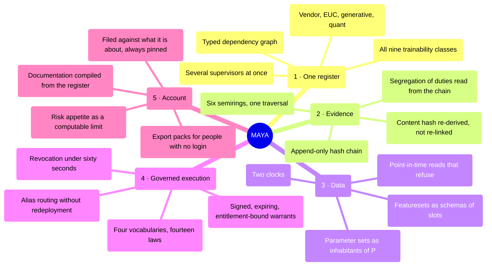
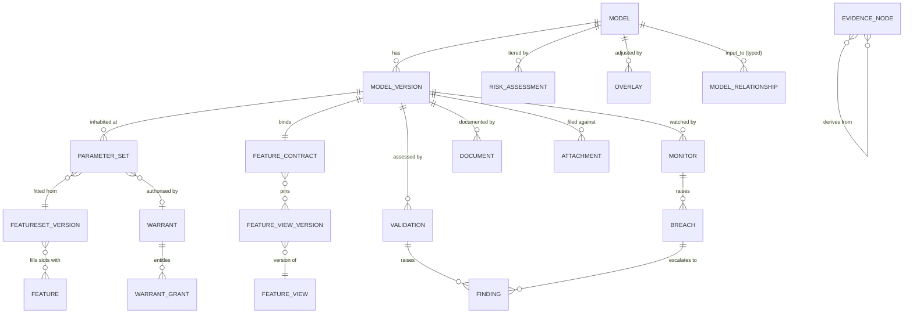

# 03 — Requirements

*MAYA — Model & AI Lifecycle Assurance.*  **Evidence, not assertion.**

**Product:** MAYA — Model & AI Lifecycle Assurance Platform
**Owner:** Model Risk Technology / Platform Architecture
**Theoretical basis:** [00 — Mathematical Foundations](00-mathematical-foundations.md)
**Evidence basis:** [01 — The estate, the supervisors, and what the tools do](01-industry-research.md) ·
[02 — Families, fibres, and what each owes as evidence](02-model-taxonomy.md)

> *māyā* (माया) — the appearance that stands in for reality. SR 26-2 puts it almost the same way:
> *"Models are simplified representations of real-world relationships."* The platform is named for the
> thing it governs, and for the discipline of never mistaking the map for the territory.

---

## 0. How to read this document

### 0.1 The rule about identifiers

**A requirement identifier is permanent.** `FR-INV-016` means the same thing for the life of this
document, whether or not it is still in the same section, still worded the same way, or still wanted.
[10 — Roadmap](10-roadmap.md), [05 — Data Model](05-data-model.md), [00](00-mathematical-foundations.md)
and [16](16-features-composed-and-shaped.md) all cite these identifiers; a renumbering would silently
break the traceability those documents exist to provide.

This edition reorganises the document, rewrites the prose, adds requirements for capabilities built
since the last edition, and adds a status to every row. **No identifier has moved, been reused, or been
retired.**

### 0.2 The status column, and why a requirements document carries one

Most of this platform is built. A requirements document that does not say which parts is a document
whose reader has to go and find out — and the reader who finds out by discovering a gap is the reader
who stops believing the rest.

| Status | Means |
|---|---|
| **Built** | Implemented, with a named test. The requirement describes what the code does |
| **Partial** | Implemented in a form narrower than the requirement states. The row says how it is narrower |
| **Not built** | Specified, not implemented. No code |
| **Refused** | **Deliberately not implemented, and the requirement is the one that is wrong.** Three of these exist and each is argued in the code |

The three refusals are worth reading before anything else, because they are the places where the
platform disagrees with its own specification and says so:

| | Requirement | Why it is refused |
|---|---|---|
| `FR-RPT-004` | an aggregate model risk score for the estate | aggregation requires the parts to compose, and two models fed by the same curve are not two independent risks. Any single figure double-counts the shared dependency or ignores it, and a committee cannot decompose it to find out which. `L-14`; `core/reporting/pack.py::NO_COMPOSITE` |
| `FR-POL-008` | a `warn` verdict on a policy gate | a gate that warns is not a gate |
| `FR-AI` Tier C | registering an AI capability whose output can be neither checked by an oracle nor grounded in evidence | there is no control to apply to it, so admitting it would be admitting an ungoverned capability into a governance platform |

### 0.3 Priority

**M** = Must (release 1) · **S** = Should · **C** = Could · **W** = Won't, this release.

Priority and status are independent, and the interesting rows are the ones where they disagree: an
**M / Not built** row is a hole in release 1 and is meant to be read as one.

### 0.4 What this document is not

It is not the build record. [12 §0](12-implementation-plan.md#0-build-status) is the authoritative
account of what exists and is kept current there. The status column here is a cross-reference, and
where the two disagree, 12 wins and this document is wrong.

### 0.5 Shape of the requirement set

| Part | Modules | Requirements |
|---|---|---|
| **A** The register | `FR-INV`, `FR-TIER` | 32 |
| **B** The kernel and its parameters | `FR-VER`, `FR-PAR` | 21 |
| **C** The inputs | `FR-FEA`, `FR-XFR` | 40 |
| **D** Governed acts | `FR-LC`, `FR-POL`, `FR-SEC`, `FR-BAS` | 55 |
| **E** Assurance | `FR-TRN`, `FR-VAL`, `FR-PMA`, `FR-MON`, `FR-TEL` | 56 |
| **F** Use | `FR-WARRANT` | 17 |
| **G** Account | `FR-DOC`, `FR-RPT` | 26 |
| **H** The platform, and its own AI | `FR-AI`, `FR-PLT` | 31 |
| | **Total functional** | **278** |
| | Non-functional | 27 |
| | Integration | 18 |
| | Acceptance criteria | 10 |

---

## 1. Purpose, scope and definitions

### 1.1 Purpose

MAYA is the system of record and the system of engagement for **every model and model-adjacent asset a
bank runs**, from proposal to archive. It holds the governance — inventory, tiering, approval,
validation, findings, overlays, documentation, evidence — and the engineering — artifacts, features,
parameter sets, versions, execution warrants, monitoring — in one object model, with the governance
record **bound to the engineering artefact by digest** rather than by reference.

It does not run models. It issues a warrant an execution engine acts on, which keeps governance off the
serving path and out of the trading day's critical path.

### 1.2 Scope

**In scope:** all nine trainability classes T0–T8 across the eleven domains of
[02](02-model-taxonomy.md); internally built, vendor-supplied, open-source, embedded and end-user
computing assets; every jurisdiction the bank operates in.

**In scope and commonly missed:** market-data construction models, deterministic regulatory
calculators, vendor black boxes, expert-judgment scorecards, post-model adjustments, prompt bundles and
RAG corpora, and **the firm's own tiering rule**.

### 1.3 Definitions

| Term | As used here |
|---|---|
| **Model** | Any registered asset, whether or not it meets a given supervisor's model definition. Regulatory scope is a separate, multi-valued attribute with a stored determination |
| **Model version** | An immutable kernel, identified by the digest of its canonical manifest. A version is `f`, not `f` at a particular point of `P` |
| **Parameter set** | One inhabitant of `P`, bound to the version, featureset version, window and `as_of` that produced it. **A fit produces a parameter set and not a version** |
| **Model use** | An approved (purpose × product/portfolio × legal entity × geography × channel) tuple. Risk attaches here, not only to the artefact |
| **Artifact** | Bytes, addressed by their own SHA-256 |
| **Feature** | A named, typed, shaped, owned signal with a computation definition and two clocks |
| **Featureset** | A named, versioned **schema of slots**; a version binds each slot to a feature and to the exact feature view version supplying it |
| **Feature contract** | The exact set of pinned feature view versions a model version was fitted on and must be served |
| **Warrant** | A signed, expiring, entitlement-bound execution contract that an engine acts on |
| **Evidence node** | An immutable, hash-identified record of something that happened, whose verification re-derives its content hash from its own fields |
| **Overlay** | A post-model adjustment to input, assumption, methodology or output, time-boxed and measured |
| **Tier** | Derived from materiality × complexity on two separate lattices, driving control depth |
| **Effective challenge** | Critical, independent, competent, empowered review — SR 26-2 |

---

## 2. What it is for

### 2.1 The one sentence

> **Any question an examiner, an auditor, a CRO or an engineer can ask about any model in the bank
> should be answerable from one system, with evidence, without asking a human to look something up.**

The original wording of this sentence promised sixty seconds and an as-at-date reconstruction. The
second half of that promise rests on `FR-INV-016`, which is **not built** — so the sentence is stated
here as an aim and marked as one, rather than as a description.

### 2.2 The five pillars



### 2.3 Design principles

Each is cited by the requirement rows that depend on it.

| # | Principle | The failure it prevents |
|---|---|---|
| **P1** | **Evidence over assertion** | A field that says "validated" cannot be checked, and a system whose claims cannot be checked is a system an examiner has to take on trust |
| **P2** | **Immutability by default** | A record that can be edited underneath a reviewer is a record that stopped describing what was approved, silently. Corrections are new records with supersession links |
| **P3** | **The lifecycle is data, not code** | A control that needs a release to change is a control people work around |
| **P4** | **Governance where the work happens** | If registering a model properly takes forty lines of plumbing and getting it wrong takes four, the register fills with models nobody registered properly while every control reports success |
| **P5** | **Every class is a first-class class** | A calibrated pricing engine is not a degraded ML model, and treating it as one produces a validation form full of "N/A" |
| **P6** | **Open standards at the boundary** | A closed boundary makes the platform the thing that has to be replaced |
| **P7** | **Zero trust on artifacts** | Deserialising an untrusted artifact in the control plane is arbitrary code execution inside the governance system |
| **P8** | **Explain the derivation** | A derived value nobody can decompose is a value nobody will challenge, which is the opposite of effective challenge |
| **P9** | **Degrade safely** | A governance system in the serving path is a governance system that takes the trading day down. Issued warrants keep working; only new issuance and changes block |
| **P10** | **Regulatory scope is plural** | Adding a supervisor must not require a migration, because the next regulator will not wait |

---

## 3. Who it is for

| # | Persona | What they need | What is in their way today |
|---|---|---|---|
| U1 | **Model developer / quant** | to build, fit, test, document and ship without governance friction | re-keying metadata into a GRC tool; rebuilding training sets; *which feature version did I use?* |
| U2 | **Model owner** | to know their models' health and obligations | no single view; surprise findings; overdue validations discovered at audit |
| U3 | **Independent validator** | to perform effective challenge efficiently and evidence it | chasing artefacts and data; rebuilding developer results by hand |
| U4 | **Head of model risk** | portfolio view, tiering integrity, backlog control, board reporting | inventory accuracy; no aggregate view; board packs assembled by hand |
| U5 | **Model user** | to use approved models correctly and know their limits | limitations and boundaries are in a PDF nobody opens; off-label use is undetectable |
| U6 | **Execution engine** (machine) | to resolve and run a version reliably and fast | hardcoded model paths; silent version drift; no kill switch |
| U7 | **Data engineer / feature owner** | to publish trustworthy features without duplication | feature sprawl; no point-in-time correctness; no visibility of consumers |
| U8 | **Internal audit** | to test whether the framework operates as designed | sampling by hand; evidence in email |
| U9 | **Regulator or examiner** | to verify completeness and control operation | PDF dumps; inconsistent answers to the same question |
| U10 | **Compliance / fair lending / legal** | to assess consumer-protection and AI Act exposure | cannot find which models touch consumers |
| U11 | **Vendor manager** | to track the third-party estate and its attestations | no inventory of embedded vendor models |
| U12 | **Platform / SRE** | to keep it up, fast and secure | — |
| U13 | **CRO / board risk committee** | to know whether model risk is within appetite | narrative-only reporting against an appetite statement nobody can compute against |

---

## 4. The journeys

### J1 — Register and ship a machine-learned model

```mermaid
sequenceDiagram
    autonumber
    actor Dev as Developer
    participant API as MAYA
    participant FS as Featuresets
    participant EV as Evidence chain
    actor Val as Validator
    actor Own as Owner
    Dev->>API: register model (urn, owner, purpose, legal entity)
    API->>API: regimes determine scope; tiering derives the tier
    Dev->>FS: declare a featureset schema; fill it per version
    FS-->>Dev: a featureset version, each slot pinned to a view version
    Dev->>API: create version 1.0.0 — immutable, manifest digest
    Dev->>API: request a fit warrant
    API-->>Dev: refused, or signed — bounded in both clocks (L-W9)
    Dev->>API: record the parameter set produced under that warrant
    API->>EV: warrant, snapshot, featureset version, digest
    Own->>API: approve the parameter set (not the person who recorded it)
    Val->>API: open a validation (refused if a validator built the version)
    Val->>API: record tests; conclude (refused over a failed test or a blocking finding)
    Own->>API: approve the version — a quorum whose depth follows the tier
    API->>API: move the alias (refused unless the contract refines and the schemas vary correctly)
    API-->>Dev: maya://model/... #champion resolves to a signed descriptor
```

### J2 — A calibrated model that is never trained

Same spine, different evidence. No training set; instead a **calibration instrument set**, a
**tolerance**, **arbitrage-free assertions** and an **analytical benchmark suite**. The recalibration
is a **procedure approved once**, not a committee that meets every morning: each morning's parameter
set is accepted against a policy gate on the residuals and **held** when it fails, rather than
requiring a signature. `L-W11` refuses a calibration warrant that will not say what it was calibrated
**as of**, because without the stamp staleness is silent.

*Not worked in a tutorial.* The per-fibre walkthroughs were removed rather than
left standing as prose nobody had executed; see [02 §5](02-model-taxonomy.md).

### J3 — A closed-form model where there is nothing to fit

`register → verify the implementation against analytical benchmarks → benchmark against an independent
implementation → govern the inputs (curve, conventions, valuation date, library version) → approve →
monitor the inputs against the range it was benchmarked over`. A fit warrant is **refused** by `L-W1`,
naming the fact about the kernel that made the request incoherent.

*Not worked in a tutorial* — see [02 §5](02-model-taxonomy.md) for why the
per-fibre walkthroughs are absent rather than pending.

### J4 — Onboard a vendor black box

`register (parameter_kind: opaque → T6) → vendor due diligence → obtain the vendor's validation
attestation → benchmark on your own outcomes → document your own use → approve with conditions →
watch for a version change`. Fitting is refused for the same structural reason as J3.

**Partly supported.** The class, the refusal and the register are built; the vendor due-diligence
workflow, the attestation tracker and version-change detection are `FR-VAL-009` and are **not built**.

### J5 — A generative application

`intake → boundary determination → prompt, corpus, tool and guardrail versions recorded as the
parameter set → frozen evaluation set → pre-deployment evaluation → human-oversight design → approve →
re-evaluate on schedule and on every provider version change`. `L-W13` refuses a warrant naming a model
family without a build.

*Not worked in a tutorial* — see [02 §5](02-model-taxonomy.md).

### J6 — Issue a warrant to an execution engine

The engine holds only a URN. At run time it resolves, receives a signed descriptor with the artifact
digest or parameter set, the operating boundary and the policy constraints, verifies the signature and
executes. If the warrant has been revoked, resolution fails closed. If a blocking finding is open,
resolution fails closed. See [06 — Warrants & Execution](06-warrants-and-execution.md).

### J7 — The examiner request

*"Show me every model that fed the Q2 provision, its validation status at that date, and any overlays
applied."*

**This journey cannot be executed today.** The evidence chain records what happened; there is no
projection over it that reconstructs the register as at a past date (`FR-INV-016`, **not built**). What
*can* be produced today is an **export pack** per model — self-contained, digested member by member,
carrying where the chain stood, with everything it could not gather named in `gaps.md` — and a
**board pack** persisted per period so *"the March pack"* means the March pack rather than a document
of the same name recomputed today.

---

## 5. The object model



Every entity emits **evidence nodes**; the chain is the connective tissue rather than a separate
feature, and the segregation-of-duties engine reads it rather than a second who-did-what table.

**Entities in earlier editions of this diagram that have no table.** `MODEL_USE`, `ASSUMPTION`,
`LIMITATION`, `DEPLOYMENT`, `RUN`, `DATASET_SNAPSHOT` (as a first-class object rather than a column
group), `INVOCATION`, `REMEDIATION` and `OBSERVATION` were drawn as entities and are not. Approved uses
and boundaries live on the version's contract; assumptions and limitations live in an unstructured
attribute blob; a fit is recorded as a parameter set rather than as a run; **and there is no invocation
record at all**, which is why `FR-MON-008`, `FR-MON-009` and `FR-WARRANT-009` are all not built and why
`FR-WARRANT-016` cannot be. Removing them from the drawing is the honest correction; the requirements
that describe them are unchanged and still say Not built.

---

## 6. Functional requirements

---

## Part A — The register

### 6.1 Inventory and registration (`FR-INV`)

| ID | Requirement | Pri | Status | Traceability |
|---|---|---|---|---|
| FR-INV-001 | Register a model under a globally unique, human-readable **URN** (`maya://model/<domain>.<family>.<name>`), immutable for life. | M | **Built** | SR 26-2 VI; SS1/23 1.2 |
| FR-INV-002 | Capture the inventory attribute set of §8.1, with mandatory/optional driven by model class and tier. | M | **Partial** — identity, ownership, organisation and classification are columns; methodology, assumptions, boundaries and the vendor and generative groups live in an unstructured attribute blob with no per-attribute obligation | SS1/23 1.2(c) |
| FR-INV-003 | Support the inventory states a supervisor asks about, including **under development** and **decommissioned**. | M | **Partial** — seven states (`draft`, `baselined`, `submitted`, `approved`, `attested`, `amending`, `retired`) rather than the thirteen named here. `baselined` is a second **initial** state, because an imported record entering through `draft` would imply historical evidence was asserted when it was not (`L-1`) | SS1/23 1.2(a) |
| FR-INV-004 | Record **multi-valued regulatory scope** per model, with a stored rationale for every in/out determination. | M | **Built** — three regimes as institutions, each determination carrying the terms it read and the citation it rests on; regimes that disagree are reported as disagreeing | SR 26-2 II; SS1/23 1.1; AI Act Art. 6 |
| FR-INV-005 | Model **uses** as separate entities: purpose, product, legal entity, geography, channel, segment, decision authority, effective dates. | M | **Not built** — a warrant grant carries a `declared_use` string checked at resolution; there is no use object, so risk cannot attach to one | SR 26-2 III ("misapplied or misused") |
| FR-INV-006 | Record **operating boundaries** as structured, machine-checkable constraints. | M | **Partial** — they exist on the *version* contract and are enforced at execution (`reject`, `flag`, `clamp`), not on the model as the requirement states | SS1/23 1.2(c)(i) |
| FR-INV-007 | First-class **assumption** and **limitation** registers, each with owner, materiality, mitigation, review date and links to findings and overlays. | M | **Not built** — free text in an attribute blob. This is the gap that most directly weakens the compiled model development document, whose assumptions lens has nothing structured to read | SS1/23 1.2(c)(ii) |
| FR-INV-008 | A named accountable **individual** owner, plus developer, validator and approver roles; non-empty and non-conflicting. | M | **Partial** — `owner` is one named individual and is enforced; the other three are not columns. Conflict is enforced at the moment of an act, from the evidence chain, rather than at registration | SR 26-2 VI |
| FR-INV-009 | **Model relationships**: `input_to`, `derives_from`, `challenger_of`, `benchmark_for`, `calibrated_by`, with criticality. | M | **Built** — five kinds, a closed vocabulary. `feeds` is accepted on the way in and stored as `input_to`, and is deliberately not published, because a vocabulary offering two words for one relation invites somebody to think they differ | SR 26-2 III |
| FR-INV-010 | Compute **blast radius** — the transitive downstream closure — for any model or proposed change. | M | **Built** — and `challenger_of` is deliberately excluded, because a challenger is not downstream of anything | SS1/23 3.4(d) |
| FR-INV-011 | **Concentration analytics**: shared feature views, datasets, vendors, methodologies and assumptions; flag single points of failure. | S | **Partial** — shared *upstream models* only. Shared feature views, vendors and methodologies are not computed | SR 26-2 III |
| FR-INV-012 | **Bulk import** from files and from connectors (MLflow, Unity Catalog, SageMaker, Vertex, git, SAS metadata, CMDB), with reconciliation and de-duplication. | M | **Partial** — bulk import of a JSON array exists with per-row failure isolation and a URN-collision refusal. **No connector of any kind exists.** No CSV, no Excel | — |
| FR-INV-013 | **Continuous discovery**: scheduled sweeps detecting unregistered models, raising a discovery exception. | S | **Not built** | 01 §1.1 |
| FR-INV-014 | **EUC discovery ingestion**: accept scan output and triage into the register or an EUC register. | S | **Not built** | SS1/23 1.1(b) |
| FR-INV-015 | Full-text and **semantic search** across the register, documents and code. | S | **Partial** — a case-insensitive substring filter over name, URN, owner and model class of the already-scope-filtered list. Not indexed, not full-text, no vectors, and it does not reach documents or code | — |
| FR-INV-016 | **As-at-date query**: reconstruct the register and every model's status as it stood on any past date. | M | **Not built** — and it is the largest single gap against §2.1. Delta time travel gives it for feature *data*; nothing projects the evidence chain into a register state | Examiner requests; SOX |
| FR-INV-017 | Periodic **owner attestation** with tracked completion and discrepancy findings. | S | **Partial** — attestation is a real quorum with a validity period, a lapse raises a finding, and outstanding signatures are derived onto each principal's worklist. There is no **campaign**: no generated population, no completion tracking across one, no discrepancy findings | — |
| FR-INV-018 | Model **decommissioning** capturing rationale, replacement, downstream notification, retention class and archive. | M | **Partial** — `retire` is a governed transition that deletes nothing; the rationale, replacement link, downstream notification and retention class are not captured | SS1/23 1.2 fn.6 |
| FR-INV-019 | Tag models `sox_relevant`, `regulatory_reporting`, `consumer_impacting`, `safety_critical`, driving additional control sets. | M | **Not built** — no columns, therefore no control sets keyed on them | SOX; ECOA |
| FR-INV-020 | Support **families and variants** with inherited attributes and delta-only overrides. | S | **Partial** — a `derives_from` edge records the relation; nothing inherits | — |
| FR-INV-021 | **The dependency edge is typed.** An `input_to` edge holds only if what the source produces can stand in for what the target reads, checked through the same order that decides an alias move; a composite's schema is **derived**, never declared. An edge either end of which has no version yet is recorded **without** a type check and the log says so. | M | **Built** — `L-21`, `core/registry/composition.py`, `tests/test_laws.py` | SR 26-2 III |
| FR-INV-022 | `challenger_of` and `benchmark_for` are deliberately **not** type-checked, and `calibrated_by` propagates without composing. They record how somebody thinks about a model; there is no wire. | M | **Built** | — |

### 6.2 Risk tiering (`FR-TIER`)

| ID | Requirement | Pri | Status | Traceability |
|---|---|---|---|---|
| FR-TIER-001 | Two-axis tiering: **materiality** × **complexity**, producing Tier 1–4, with the axes stored separately and never collapsed on input. | M | **Built** — two lattices, a monotone τ (`L-4`) | SR 26-2 III; SS1/23 1.3(a)(b) |
| FR-TIER-002 | Tiering rules as **versioned policy-as-code** with test fixtures and a promotion workflow. | M | **Partial** — the bands and ranks are configuration and the ruleset version is recorded with every assessment, but tiering is **not one of the four policy gates**, so the rule does not ship with cases, cannot be published against them, and does not report flipped verdicts | SS1/23 1.3(d) |
| FR-TIER-003 | Every assignment stores a **full derivation**: input snapshot, rule version, intermediate scores, final tier, and any override with justification. | M | **Built** | SS1/23 1.3(e) |
| FR-TIER-004 | Complexity scoring must admit the advanced factors: alternative and unstructured data, interpretability, explainability, transparency, designer and data bias. | M | **Partial** — the complexity lattice takes declared facts; the advanced factors are not among the facts the engine reads | SS1/23 1.3(c) |
| FR-TIER-005 | **Automatic re-tiering triggers**: exposure change, a new use, methodology change, data-source change, monitoring breach, regulatory change, elapsed time. | M | **Partial** — elapsed time only, as `next_review_due`. Nothing watches the other six | SR 26-2 III |
| FR-TIER-006 | Register the tiering approach **as a model** and validate it periodically. | S | **Not built** | SS1/23 1.3(d) |
| FR-TIER-007 | Tier drives, by configuration: validation scope and cadence, monitoring frequency, documentation set, **approval quorum**, warrant constraints. | M | **Partial** — the approval quorum and the warrant grace period follow the tier, by the `L-5` adjunction. Validation cadence, monitoring frequency and the documentation set do not | SR 26-2 III |
| FR-TIER-008 | **Immaterial-model path**: identification plus condition monitoring for materiality escalation, and no more. | M | **Not built** as a distinct path | SR 26-2 III |
| FR-TIER-009 | What-if simulator: re-run a candidate ruleset across the portfolio and diff the outcome. | S | **Not built** | — |
| FR-TIER-010 | Record **regulatory model approvals** — IRB permission, FRTB IMA desk approval, internal model waiver — with scope, conditions and expiry. | S | **Not built** | Basel |

---

## Part B — The kernel and its parameters

*The two letters of `f : P ⊗ X → D(Y)` that are not the inputs. Keeping them apart is not tidiness: a
fit that produces a new **version** asserts the kernel changed, which is how a daily recalibration comes
to look like two hundred and fifty methodology changes a year.*

### 6.3 Versions and artifacts (`FR-VER`)

| ID | Requirement | Pri | Status | Traceability |
|---|---|---|---|---|
| FR-VER-001 | Upload a model via UI, SDK or API. Accept ONNX, PMML, safetensors, TorchScript, PFA, JSON, tar, GGUF, source bundles, container digests, prompt bundles, spreadsheets, or **reference-only** for a vendor black box. | M | **Partial** — eight artifact formats are accepted by the store; source bundles, spreadsheets and prompt bundles are not formats. Reference-only is fully supported | Core |
| FR-VER-002 | Semantic versioning with declared semantics: MAJOR = methodology change (revalidation), MINOR = refit on the same methodology, PATCH = an implementation fix proven not to change output. | M | **Partial** — semver is enforced and duplicates refused; the *semantics* are documented rather than checked, and no regression proves a PATCH | SS1/23 3.3(c) |
| FR-VER-003 | Versions are **immutable and content-addressed** — SHA-256 over a canonical manifest. Any change is a new version. | M | **Built** — `L-2`, carried through assessment, approval and an alias move, and taken over the *manifest* rather than the row, because a digest over the row moves whenever a status column does | P2 |
| FR-VER-004 | Automatic **artifact introspection** on upload: framework and library versions, input/output schema, hyperparameters, size, opset. | M | **Not built** — the store returns digest, size, format and whether the format executes on load. Schemas are **declared** by the caller. The ONNX runtime reads the graph's inputs at invoke time and refuses a warrant whose entry block disagrees, which is a check rather than an extraction | Core |
| FR-VER-005 | **Security scanning at upload**: malware, opcode analysis, dependency vulnerabilities, secrets, licences. Block or quarantine on breach. | M | **Not built.** What exists instead is exclusion: the format vocabulary is closed and contains **no `pickle`**, so there is nothing to opcode-scan — and nothing scans for the other four | 01 §4 |
| FR-VER-006 | **Format policy by environment**, with pickle denied in production absent an expiring risk acceptance. | M | **Refused in the stronger direction, and therefore not built as written** — the format list is global and closed and pickle is absent from it, so there is no environment in which it is permitted and no risk-acceptance path to build | 01 §4 |
| FR-VER-007 | **Sign artifacts** (Sigstore/cosign-compatible) and record in-toto/SLSA provenance; verify at resolution. | S | **Not built.** Warrant *descriptors* are signed (HMAC-SHA256 over the canonical descriptor, with TTL jitter); artifacts are verified by **digest**, not by signature, and there is no build provenance | SLSA |
| FR-VER-008 | Generate an **AI-BOM** (SPDX 3.0 AI/Dataset profile, CycloneDX ML-BOM) per version. | S | **Not built** | AI Act Art. 11 |
| FR-VER-009 | **Version comparison**: parameters, hyperparameters, feature contract, metrics, schema, documentation, and output on a common test set. | M | **Not built.** Contract refinement and schema variance decide whether an alias *may* move; neither is a diff a person reads | SS1/23 3.3(c) |
| FR-VER-010 | **Aliases** as mutable named pointers per environment, governed, audited, and effective for warrants without redeployment. | M | **Built** — and the move is refused unless the contract refines (`L-7`) and the schemas satisfy variance (`L-12`), *and* the findings register permits it | MLflow/UC pattern |
| FR-VER-011 | Support versions with **no artifact** — vendor, EUC, expert judgment — with full metadata and evidence. | M | **Built** — `descriptor_only` is one of nineteen runtimes and matters most in a bank, where much of the estate runs in engines nobody is going to replace | T6/T7/T8 |
| FR-VER-012 | **Reproducibility bundle**: one command reconstructs the environment, snapshot, feature views, seed and commit to re-run a fit. | M | **Not built** — no lockfile, no container digest, no seed capture. Replay re-reads a *validation's* pinned snapshot and compares digests, which is a narrower and different guarantee | SR 26-2 V; P1 |
| FR-VER-013 | Store **parameter sets** as versioned, high-frequency children of a version, so a daily recalibration does not mint a version. | M | **Built** — see `FR-PAR` | T1 lifecycle |
| FR-VER-014 | Register **prompt bundles, RAG corpus versions, tool manifests and guardrail configs** with the same versioning discipline. | M | **Partial** — they are recorded as the *values* of an `llm_configuration` parameter set, with the prompt carried as a digest, and `L-W13` refuses a generative warrant naming a model family without a build. They are not artifact types with their own storage | T5 |
| FR-VER-015 | Retention and legal hold per artifact class, with a WORM option. | M | **Not built** — only a Delta vacuum horizon | AI Act Art. 19; SOX |
| FR-VER-016 | **The artifact store is content-addressed.** A file's name is its own SHA-256, under two levels of fan-out. Three controls fall out rather than being performed: the same bytes stored twice are stored once; an artifact cannot be edited in place, because edited bytes are a different address; and *"these are the bytes the warrant names"* is true by construction. A **declared digest is checked**, so a truncated upload is refused rather than stored under the address of whatever arrived. | M | **Built** | P1, P7 |
| FR-VER-017 | The format vocabulary is **closed**, contains no `pickle`, and formats that **execute code on load** are accepted and **named as such on the warrant**, so an engine is not inferring it from a file extension. A version naming a digest the store holds takes its uri, size and format from the store; a digest the store cannot resolve is **recorded rather than refused**, because plenty of checkpoints live elsewhere and are named here so an engine can verify them on load — and the warrant carries the difference. | M | **Built** | P7 |

### 6.4 The parameter object (`FR-PAR`)

| ID | Requirement | Pri | Status | Traceability |
|---|---|---|---|---|
| FR-PAR-001 | **Parameter sets**: store the inhabitant of `P` an execution engine returns, bound to the version, featureset version, window and `as_of` that produced it. A fit produces a parameter set and **not** a model version. | M | **Built** | — |
| FR-PAR-002 | A fitted parameter set is accepted **only** against a warrant MAYA issued, and only when it names the featureset version it was fitted from. | M | **Built** | `L-W8`, `L-W9` |
| FR-PAR-003 | Provenance is `fitted`, `calibrated` or `declared`, governed to different depths: each fitted set approved individually, a calibration procedure approved once, declared parameters attested. | M | **Built** | — |
| FR-PAR-004 | A parameter set is immutable and approved by somebody other than whoever recorded it; resolution **refuses rather than guesses** when a version has more than one approved set. | M | **Built** | FR-SEC-011 |

---

## Part C — The inputs

*`X` is a **featureset**: a schema of named slots, each version binding every slot to an exact feature
and an exact pinned view version. A model is defined over the slots, so swapping what fills one does
not change the model's input space — it changes what the model was fitted on, which is a different
event with a different control.*

### 6.5 Features and featuresets (`FR-FEA`)

| ID | Requirement | Pri | Status | Traceability |
|---|---|---|---|---|
| FR-FEA-001 | **Feature registry**: name, entity, dtype, semantic and business definition, unit, owner, source system, computation, cadence, sensitivity class, prohibited-basis proxy flag, lineage. | M | **Built** | Core |
| FR-FEA-002 | **Feature views**: versioned groupings for an entity, with a declarative transformation and a schema. | M | **Built** | Core |
| FR-FEA-003 | Materialise to a **Delta offline store** carrying **both clocks** — event time and ingest time — so a read can be point-in-time correct. | M | **Built** | 01 §1.2 |
| FR-FEA-004 | **Training set generation**: from an entity and label spine, produce a point-in-time-correct set and register it as an immutable **snapshot** pinned at a Delta version. | M | **Built** — and a fit on a snapshot the verifier rejected is **refused**, so the screen gates rather than reports | P1 |
| FR-FEA-005 | Optional **online store** with a freshness SLA, for low-latency serving. | S | **Not built** — and `L-17`, the contract–serving agreement, is therefore stated and cannot run. Half of it exists: `serving_namespaces` computes what serving must read | Skew prevention |
| FR-FEA-006 | **Feature contract**: every version binds exact view versions; serving with a non-matching contract fails closed. | M | **Built** | Skew prevention |
| FR-FEA-007 | **Training–serving skew detection** between offline and online values for the same entity and time. | M | **Not built** — it cannot be, without `FR-FEA-005` | 01 §1.2 |
| FR-FEA-008 | **Feature-level lineage**: source column → transformation → feature → view version → model version → use → decision. | M | **Partial** — the chain from source through to model version is real; there is no use object and no decision record to reach | BCBS 239 |
| FR-FEA-009 | **Consumer impact**: before changing or deprecating a feature, list every affected version, warrant and use; block a breaking change without sign-off. | M | **Partial** — consumers of a view and of a featureset are computed and retirement is guarded; there is no warrant-level or use-level impact list | — |
| FR-FEA-010 | **Feature discovery and reuse**: search, similarity, duplicate warning, popularity and quality signals. | S | **Partial** — a Jaccard similarity over name and description tokens raises a duplicate warning at definition time, deliberately not embeddings. No popularity, no quality signal, no search endpoint | — |
| FR-FEA-011 | **Data quality assertions** per feature, evaluated on every materialisation, quarantining the version on failure. | M | **Not built** | SS1/23 3.2 |
| FR-FEA-012 | **Feature drift monitoring** against the training-time reference distribution stored in the contract. | M | **Partial** — an `input_drift` monitor with PSI exists and its reference window is stated on the definition; the reference is not read from the contract | SR 26-2 V |
| FR-FEA-013 | **Sensitive-attribute governance**: tag protected characteristics and known proxies; prohibit direct use in in-scope credit models while permitting controlled use for fairness testing. | M | **Partial** — `pii`, `sensitivity`, `protected_basis` and `proxy_risk` are recorded; no policy enforces the prohibition, and no fairness test exists to permit | ECOA/Reg B; CFPB |
| FR-FEA-014 | **Certification levels** (`experimental`, `certified`, `deprecated`) with policy tying production models to certified features by tier. | S | **Partial** — certification exists as a lifecycle act with its own permission; no policy keys on it | — |
| FR-FEA-015 | Support **request-time features** declared in the contract and validated at serve time. | S | **Not built** — `request` is a data binding in the warrant grammar; nothing computes from the payload | — |
| FR-FEA-016 | **Backfill and restatement**: when a source is restated, identify affected snapshots, models and decisions. | S | **Partial** — detection is built and good: `restated()` compares the pin against current, `restatements()` names which slots moved, and a replay reports separately that the ground has moved. **Nothing traverses to affected models or decisions**, and there is no backfill operation | BCBS 239 |
| FR-FEA-017 | Delta **time travel** and retention per view, with a minimum by regulatory class. | M | **Partial** — reads are pinned to the Delta version the view version was materialised at, which is the load-bearing half; retention is one global horizon | 01 §1.2 |
| FR-FEA-018 | **Derived features**: `Z = f(X, Y)` with a declared, versioned expression, recorded lineage, an ingest clock inherited as the **maximum** over its inputs, and refusal of any derivation reading a label. | M | **Built** — and the `max` is a *homomorphism* out of the provenance polynomial rather than a rule somebody applies, so it has no exceptions to forget | `L-9` |
| FR-FEA-019 | **Featuresets**: a named, versioned schema of slots, versions binding each slot to a feature and to the exact view version supplying it. Checked against a kernel's declared inputs before a warrant may name it. | M | **Built** | `L-W10` |
| FR-FEA-020 | **Roll-forward**: mint a version re-resolved to current view versions, reporting the slots that moved. Publishing a view version must never alter an existing featureset version. | M | **Built** | — |
| FR-FEA-021 | **Dimensionality**: a feature declares a shape and optional component names for its first axis; the component order **is** the axis order, and the declared shape is checked against the values that arrive. | M | **Built** — a curve whose tenors came back alphabetically would be a different curve and one nobody would notice was wrong, so resolution preserves insertion order and never sorts | — |
| FR-FEA-022 | **Composition**: a feature or featureset may compose from others, resolved by a left-to-right fold in which the rightmost wins, with the object's own operations applied last. | M | **Built** — a monoid, asserted | `L-19` |
| FR-FEA-023 | Composition operations (`add`, `drop`, `override`) are **total**: each is refused when it would have no effect. Cycles and compositions of ephemeral objects are refused. | M | **Built** — an operation that silently did nothing is one somebody believes happened | — |
| FR-FEA-024 | Resolution is a **read-time** act; the resolved members, the lineage, and **which layer decided each member** come back together. | M | **Built** — storing the resolved result would create a second copy that can disagree with the parents | — |
| FR-FEA-025 | **Sealing**: a sealed object takes no amendment and no further versions, and remains composable. Breaking a seal is administrator-only and requires a recorded reason. | M | **Built** — a parent that cannot move is a parent worth building on | — |
| FR-FEA-026 | **Ephemerality**: an object may carry a TTL, after which it is destroyed. It cannot be sealed, cannot be composed from, and its destruction is recorded with the digests of what it held. | M | **Built** — *"it was ephemeral"* is not an answer to an examiner asking about a million rows somebody pulled | — |
| FR-FEA-027 | Ephemeral objects are reaped on a schedule and on request; nothing governed may pin one. | M | **Built** | — |
| FR-FEA-028 | **Ownership**: the creator is recorded permanently; the owner is transferable by name, with the handover witnessed. | M | **Built** — an owner field that quietly becomes a leaver's username is how a model ends up accountable to nobody | — |
| FR-FEA-029 | **Retrieval policy** attaches to the object as default behaviour and is overridden by a request, merged section by section and column by column under the same precedence as composition. | M | **Built** — replacing a section wholesale would silently drop a parent's decision and its author would never see it go | — |
| FR-FEA-030 | **Point-in-time normalisation**: statistics are fitted only from rows knowable at a stated `as_of`; a request without one is **refused**. The fitted statistics are returned with the data. | M | **Built** — a z-score fitted over the whole column encodes what the mean turned out to be, which is leakage and is invisible afterwards. The leaky answer is the one somebody would get by accident, so it must not be the default | `L-10` |
| FR-FEA-031 | **Missing values**: null, NaN and infinity are treated alike; fitted fill strategies require an `as_of`; the fill rate is reported and loud past a threshold; statistics are fitted on observed values **before** anything is filled. | M | **Built** — fitting on imputed values shrinks the spread by exactly the amount that was invented | — |
| FR-FEA-032 | **Alignment** onto a chosen axis with a stated fill rule. Rules that fill from a later observation are **permitted and stamped honestly**: the value inherits that observation's ingest time, so an ordinary point-in-time read excludes it. | M | **Built** — the strongest form the idea takes anywhere here: the leakage is not caught by a check, it is made arithmetically impossible to hide | `L-10` |
| FR-FEA-033 | **One order.** Schemas form a lattice under *A can stand in for B*; every substitutability question — schema variance, warrant admissibility, contract refinement, parent refinement — is the same comparison in it. **Meet is partial and informatively so**: two schemas whose shared slot has two types have no meet, which is the honest answer to *can one featureset serve both these models*. | M | **Built** | `L-20` |
| FR-FEA-034 | **The point-in-time read is an operator** — idempotent, commuting with projection, monotone in `as_of`, and **saturating at the label**. The fourth is the reproducibility guarantee: because the ingest bound is `min(label, as_of)`, every read at or after the label gives the same answer, however many restatements arrived in between. Without the `min` a re-run would quietly *improve* on the original. | M | **Built** | `L-10` |
| FR-FEA-035 | **Restatement is reported, not silently absorbed.** A read pinned at a Delta version returns what the pin says; separately, *has anything underneath this pin been written to since* is answerable per view and per featureset slot. | M | **Built** | BCBS 239 |

### 6.6 Bulk feature transfer (`FR-XFR`)

*A feature value is not a governance document, and an API shaped for one is the wrong shape for the
other. This module exists because that difference has consequences a requirement has to state.*

| ID | Requirement | Pri | Status | Traceability |
|---|---|---|---|---|
| FR-XFR-001 | **Nothing is materialised whole.** Reads iterate record batches off the store; writes parse a batch at a time; peak memory is one batch rather than one dataset. | M | **Built** | — |
| FR-XFR-002 | Batches are sized by **cells rather than rows**, because a fixed row count means one thing at six columns and another at two thousand. | M | **Built** | — |
| FR-XFR-003 | Four formats — `arrow` for an execution engine, `parquet` for disk, `ndjson` for anything, `json` hard-capped for a page — negotiated by parameter or `Accept`. | M | **Built** — plus `csv` on upload only | — |
| FR-XFR-004 | Reads use the **pinned** Delta version, so what comes out is what a version *is* rather than what its path has since become. A featureset exposes its parts and their pins so an engine can read them in parallel. | M | **Built** | FR-FEA-019 |
| FR-XFR-005 | An upload missing either clock is refused **at the upload**, not two layers later during assembly where it stops being fixable. | M | **Built** | FR-FEA-003 |

---

## Part D — Governed acts

### 6.7 Lifecycle and workflow (`FR-LC`)

| ID | Requirement | Pri | Status | Traceability |
|---|---|---|---|---|
| FR-LC-001 | **Configurable lifecycle state machines per model class**, declared as states, transitions, guards, required evidence, required roles and SLAs. | M | **Not built** — one hardcoded machine, declared as a transition table but neither per class nor configurable | P3, P5 |
| FR-LC-002 | Ship reference lifecycles for T0–T8. | M | **Not built** | 02 |
| FR-LC-003 | **Transition guards** evaluated by the policy engine, blocking with a human-readable list of unmet conditions and a link to remediate each. | M | **Built** — four gates, and every refusal carries `code`, `detail` and `remediation` | P8 |
| FR-LC-004 | **Segregation of duties**: developer ≠ validator, approver ≠ developer, configurable by tier. | M | **Built** | SR 26-2 VI |
| FR-LC-005 | **Approval workflows** with a delegated authority matrix by tier, amount and legal entity; parallel and sequential approvers; committee quorum. | M | **Partial** — quorum by tier is built and enforced; there is no authority matrix by amount or entity, and no sequencing | SR 26-2 VI |
| FR-LC-006 | **Conditional / restricted approval**: approve with machine-enforced usage limits — portfolio caps, exposure caps, mandatory human review, expiry — for use-before-validation. | M | **Not built.** SR 26-2 V permits use before validation *with compensating controls*, and this is the requirement that would make those controls machine-enforced rather than promised | SR 26-2 V |
| FR-LC-007 | **Change management**: classify a proposed change material or non-material with a rules-based classifier plus override; material changes trigger revalidation. | M | **Not built** | SS1/23 3.3(c) |
| FR-LC-008 | **Parallel run / shadow mode**: run a new version alongside the champion, capture both outputs, produce **parallel outcomes analysis** automatically. | M | **Not built** — and SS1/23 3.3(c) requires exactly this for dynamic models, so its absence is the gap behind `FR-MON-012` too | SS1/23 3.3(c) |
| FR-LC-009 | **e-Signature** on approvals with re-authentication, an intent statement and a tamper-evident record. | M | **Partial** — signatures are rows in the evidence chain with actor, role and time, and are tamper-evident by construction. No re-authentication, no intent statement | SOX |
| FR-LC-010 | **Task inbox** per user with SLA, ageing, escalation and delegation. | M | **Partial, and deliberately different** — see `FR-LC-022`. Delegation and out-of-office are not built | — |
| FR-LC-011 | **Exceptions and waivers** with mandatory expiry, compensating controls and an approval level scaled to risk. No indefinite exceptions. | M | **Not built** | — |
| FR-LC-012 | **Campaign engine** generating, assigning and tracking populations for periodic activities. | S | **Not built** | — |
| FR-LC-013 | **Intake and use-case triage** for new proposals, including build-versus-buy and generative boundary determination. | S | **Not built** | — |
| FR-LC-014 | **Notification and escalation** on state changes, SLA breach and monitor breaches. | M | **Built** — three channels, none of them a dependency; the log channel is always available and is the honest default for an instance with nowhere to send | — |
| FR-LC-015 | **Version approval is a quorum whose depth follows the tier**, by the same adjunction that decides every other control set: Tier 1 and 2 require the second line *and* an independent validator; Tier 3 and 4 require one authorised person. | M | **Built** | `L-5`; SR 26-2 VI |
| FR-LC-016 | One decline returns the version to its author. The same person may not sign twice under two roles — **a quorum is a number of people, not a number of roles**. | M | **Built** | — |
| FR-LC-017 | **A version whose model has no tier cannot be approved at all**: approving first and assessing afterwards is a way of choosing your own control depth, and it is the obvious way to game a rule like `FR-LC-015`. | M | **Built** | FR-TIER-001 |
| FR-LC-018 | **Signing a quorum is its own permission**, distinct from approving alone: a validator signs and may never approve unilaterally. | M | **Built** | FR-SEC-002 |
| FR-LC-019 | **Delivery, not a queue.** Outstanding work is already derived; what a digest adds is that something reaches out. A **digest per person per run**, never a message per item, because a message per finding is how somebody starts filtering the sender — at which point the platform has made itself invisible while appearing diligent. | M | **Built** | FR-LC-014 |
| FR-LC-020 | **Silence when nothing has changed**: each delivery records the digest of the work it described, and an unchanged worklist is suppressed until a quiet period passes. A control everybody ignores is not a control. | M | **Built** | — |
| FR-LC-021 | Escalation is **by role rather than hierarchy** — MAYA does not know who reports to whom and should not pretend to. A failed delivery is recorded and raises evidence: silence about a failed send is how somebody concludes they were never told, which is worse than not having sent. | M | **Built** | — |
| FR-LC-022 | **Outstanding work is derived from the register, not assigned into a task table.** There is no task object, so it cannot go stale, cannot disagree with the register, and cannot accumulate orphans. It is filtered to what a principal holds the permission and the scope to do, and for attestation to their own role's signature — and the notification digest reads **the same call the dashboard makes**, so they are two views of one derivation rather than two derivations. | M | **Built** | FR-LC-010 |

### 6.8 Versioned policy gates (`FR-POL`)

*A gate that cannot be changed without a release is a gate people work around; a gate that can be
changed without one is a gate that can be **weakened** without one. These requirements make the first
possible without making the second silent.*

| ID | Requirement | Pri | Status |
|---|---|---|---|
| FR-POL-001 | A rule is a **predicate over a closed vocabulary of published facts** — comparison, membership, boolean connectives, two quantifiers — with no loops, assignment, function definitions, attribute access or subscripting. A rule must be something a reviewer can reason about rather than something they have to run. | M | **Built** |
| FR-POL-002 | A fact a gate does not publish is refused **when the rule is written**. A rule that failed at the moment of a governance decision would have failed at the worst possible time, and its author is long gone by then. | M | **Built** |
| FR-POL-003 | **A policy ships with its own cases and cannot be published until they pass**, and at least one must be a case it *refuses*: a policy nobody has shown to refuse anything is a policy nobody has shown to be a gate. | M | **Built** |
| FR-POL-004 | **Weakening is allowed and never quiet.** On publication the register replays the outgoing version's cases against the incoming rule and reports every verdict that flipped, so a change that loosens a gate is something somebody decided rather than something somebody discovered. | M | **Built** |
| FR-POL-005 | Authoring and publishing are **separate permissions**; a published version is immutable and superseded rather than edited. | M | **Built** |
| FR-POL-006 | **An instance that publishes nothing runs exactly what it ran before**: the built-in rules are the default for every gate, expressed in the same language. | M | **Built** |
| FR-POL-007 | **Policy tightens; the code's invariants are the floor.** A rule runs in addition to the registry's checks, never instead of them — replacing an invariant with configuration means a typo can weaken the platform while the deployment looks successful. | M | **Built** |
| FR-POL-008 | There is no `warn` verdict. A gate that warns is a gate that is not a gate. | M | **Built** |

**Scope of the gate vocabulary.** Four gates are policy-configurable: `version:approve`, `alias:move`,
`model:mutate`, `warrant:resolve`. Tiering rules, monitoring thresholds, format policy and document
gates are **not** among them, which is the narrowing recorded against `FR-TIER-002`.

### 6.9 Identity, access and audit (`FR-SEC`)

| ID | Requirement | Pri | Status |
|---|---|---|---|
| FR-SEC-001 | **SSO via OIDC**: the authorisation-code flow with PKCE, a state parameter and a nonce, all checked. SAML, SCIM and MFA are out of scope for release 1 (§11) — a leaver is suspended by hand, and saying so is better than implying a deprovisioning path that does not exist. | M | **Built** |
| FR-SEC-001a | **Group claims are mapped, never obeyed.** A group with no mapping grants nothing. An identity provider that grants MAYA roles is one that decides segregation of duties, and the person administering it is very often the person whose duties are being segregated. | M | **Built** |
| FR-SEC-001b | **The incompatible-roles check applies to a directory exactly as to a local principal**, and is evaluated *before* provisioning so the lesser problem cannot hide the greater. A group mapping to a conflicting pair refuses the login rather than accepting both or quietly reducing to one. | M | **Built** |
| FR-SEC-001c | Provisioning on first login is **off by default**: it hands everybody in the directory a foothold in the model register. The issuer, subject and the groups that produced the roles are recorded, so *why did this person hold that role in March* survives the directory moving on. | M | **Built** |
| FR-SEC-001d | Token signature verification must not depend on an external cryptography service or on the token's own `alg` claim, and a governance system must be deployable air-gapped. | M | **Built** — RS256 in the standard library; the verifier **constructs** the padded block the signature should have produced and compares the whole of it rather than parsing what it recovers, which is the difference between correct PKCS#1 v1.5 and the Bleichenbacher forgery |
| FR-SEC-002 | **RBAC + ABAC**: eight roles across three lines of defence over a closed vocabulary of named permissions, combined with scope attributes. Incompatible role pairs are refused at assignment. | M | **Built** — and scope filtering runs **before** the page is cut, so a scoped listing is not a full listing with rows hidden |
| FR-SEC-003 | Row-level and field-level authorisation enforced in the data layer as well as the API. | M | **Not built** — there is no row-level security in the Postgres schema and no field-level authorisation anywhere. Authorisation is entirely application-layer |
| FR-SEC-004 | **Immutable, hash-chained audit log** of every write and every read of sensitive data, with actor, timestamp, before/after, request id and justification where required. | M | **Partial** — the evidence chain covers writes and is tamper-evident by re-derivation rather than by re-linking. **Reads are not logged**, most acts carry no before/after image, and the request id lives in the process log rather than in the node |
| FR-SEC-005 | **Segregation of duties** rule engine with periodic access recertification. | M | **Partial** — the rule engine is built; recertification is not |
| FR-SEC-006 | **Secrets management** integration; no credentials in artifacts or configuration; automated secret scanning. | M | **Not built** — secrets are configuration, in a git-ignored overlay. The signing module does name the shipped development key at start-up, which is honest and is not secrets management |
| FR-SEC-007 | **Data classification propagation**: a model trained on confidential data inherits the classification, and downstream artifacts and documents inherit and enforce it. | M | **Not built** — features carry a sensitivity class; nothing propagates it |
| FR-SEC-008 | **Examiner and auditor read-only persona** with scoped, time-boxed, fully logged access. | M | **Partial** — the role exists and is scoped and logged; access is not time-boxed and there is no examiner portal |
| FR-SEC-009 | Encryption at rest and in transit; optional field-level encryption for personal data in the feature store. | M | **Not built** in the platform; delegated to the deployment |
| FR-SEC-010 | **Break-glass** access with dual authorisation, automatic expiry and mandatory post-hoc review. | M | **Not built** — the administrator role is *described* as break-glass and is exempt from the incompatible-roles check, but there is no dual authorisation, no expiry and no mandated review. It binds to history regardless: break-glass exempts you from the check and never from the chain |
| FR-SEC-011 | **Segregation of duties is read from the evidence chain**, not from a second who-did-what table. Two records of who did what are two records that can disagree. | M | **Built** |
| FR-SEC-012 | A duty rule may name the **payload field** carrying the identity it is about, because an evidence node's subject is not always the thing an act concerns — a finding is raised against the *model*, while the act being checked is about one *finding*. Without this the raiser-may-not-close rule was inert over HTTP: it searched under the finding's own id, found nothing, and permitted everything. | M | **Built** |
| FR-SEC-013 | **Documents attached to a version are content-addressed and re-hashed on read**: what an approver accepted is what a reader fetches, checked rather than assumed. | M | **Built** |
| FR-SEC-014 | **Attachment review is segregated twice** — by role grant and again in the register — so the person who filed a document cannot accept or reject it. Rejection requires a reason and the rejected document stays on file. | M | **Built** |
| FR-SEC-015 | Each attachment records whether its bytes are text the platform can genuinely read, so later machine review knows what has been read and what has only been stored. | M | **Built** |
| FR-SEC-016 | **A session cookie is ambient**, so a state-changing request whose authority came from one carries a CSRF token checked in **middleware** — a hundred and seventeen mutating endpoints is a hundred and seventeen chances to forget — with exemptions as exact paths rather than prefixes, so the exempt set cannot grow as routes are added beneath it. A redirect target is **bounded before it is remembered**, and an unacceptable one is replaced by the fallback rather than sanitised, because a target somebody had to repair is one nobody understands. | M | **Built** |
| FR-SEC-017 | **Every log line names the request that produced it.** The evidence chain records what was *decided* and the log records what happened around it; a `warrant_resolved` node and the six lines preceding it join on the request id or they do not join at all. An inbound request id is honoured when it is safe to log and replaced when it is not, because the value lands in a log file and a newline in it writes a line of somebody else's choosing. | M | **Built** |

### 6.10 Cold start (`FR-BAS`)

*Every competitor's answer to day one is a migration project. An estate that cannot be imported is an
estate that stays outside the platform, and a governance platform nobody's real models are in is a
demonstration.*

| ID | Requirement | Pri | Status | Traceability |
|---|---|---|---|---|
| FR-BAS-001 | An imported model enters a **`baselined`** state: governed going forward, mutable so its debt can be closed, and reached by **no ordinary transition** — it is a second *initial* state, because an imported record entering through `draft` would imply historical evidence was asserted when it was not. | M | **Built** | `L-1` |
| FR-BAS-002 | Each imported model carries explicit, dated **compliance debt** for each of thirteen gaps, **computed from the register rather than declared**, so an importer cannot under-declare. | M | **Built** | — |
| FR-BAS-003 | Debt **closes by itself** when the evidence arrives, which makes the burn-down a measurement rather than a self-report, and **expires into a finding** at its approved date. | M | **Built** | — |
| FR-BAS-004 | **Debt and breach are reported separately everywhere.** A Tier 1 model that arrived last week and one that missed its validation are different situations, and a single count of "problems" hides which is which. One bad row does not stop the batch. | M | **Built** | — |

---

## Part E — Assurance

### 6.11 Fitting, calibration and experimentation (`FR-TRN`)

| ID | Requirement | Pri | Status | Traceability |
|---|---|---|---|---|
| FR-TRN-001 | **Run tracking** for any fit-like activity, typed by purpose: `fit`, `score`, `backtest`, `validate`, `monitor`, `explain`, `generate`, `simulate`, `optimise`, `stress`. | M | **Partial** — the ten verbs are the warrant grammar's and are enforced there. There is **no run object**: a fit is recorded as a parameter set and a test as a test result | P5 |
| FR-TRN-002 | Log per run: parameters, hyperparameters, metric time series, tags, commit and diff, environment lockfile or container digest, hardware, seeds, snapshot ids, feature contract, artifacts, output, duration, cost. | M | **Partial** — a parameter set carries the window, `as_of`, snapshot, featureset version, warrant, diagnostics and digest. Everything else on this list is absent | P1 |
| FR-TRN-003 | **Experiment comparison**: parallel coordinates, metric tables, artifact diff, and promotion of a run to a version. | M | **Not built** | — |
| FR-TRN-004 | **Orchestrated jobs** submitted to a configured compute backend with resource profiles, capturing logs and lineage. | S | **Not built** — MAYA is always the callee. It records what a fit returned and refuses it unless a warrant it issued produced it; the fitting happens in an execution engine | — |
| FR-TRN-005 | **Scheduled recalibration** with tolerance checks: auto-publish within tolerance, escalate outside it. | M | **Partial** — the *mechanism* exists as a policy gate on parameter acceptance, which holds a set that fails the residual test; nothing schedules the recalibration | T1 |
| FR-TRN-006 | **Automated retraining** with trigger conditions and a governed auto-promotion policy that never auto-promotes a Tier 1 model. | S | **Not built** | — |
| FR-TRN-007 | **Hyperparameter search** with a parent/child run hierarchy. | C | **Not built** | — |
| FR-TRN-008 | **Deterministic replay**: re-execute a historical run in a sandbox and assert equality of outputs; report non-reproducibility as a finding. | M | **Partial** — replay re-reads the validation's dataset snapshot **at the Delta version it was pinned at** and re-runs the recorded tests, distinguishing *reproduced* from *unchecked* and reporting separately that the ground has moved. It does not re-execute a fit, and there is no environment reconstruction | `L-3`; SR 26-2 V |
| FR-TRN-009 | **Challenger management**: register challengers against a champion, run them on the same data, maintain a standing comparison. | M | **Partial** — the `challenger_of` edge exists and is excluded from blast radius. Nothing runs them or compares them | SR 26-2 V; SS1/23 3.3(b)(iii) |
| FR-TRN-010 | **Expert-judgment elicitation** (T7): panel composition, questions, individual responses, convergence, final weights, dissent. | S | **Not built** — `elicit` is a verb and `elicited_weights` derives T7; the workflow does not exist. Declared parameters are recorded and attested, and that is the whole of it | T7 |
| FR-TRN-011 | Runs on sensitive data execute in approved compute zones only, enforcing residency and purpose limitation. | M | **Not built** | GDPR |
| — | *Built and unspecified here:* the captive estimator fits `ols` and `garch11`, deliberately **without randomness anywhere** — a fixed simplex, Nelder–Mead written out rather than imported — because a parameter set nobody can reproduce is a number in the register with no provenance. It **refuses rather than guesses**: exactly collinear regressors are refused rather than arbitrated by the solver, a missing value is refused rather than dropped or zeroed, and a search that stopped early is refused rather than recorded with a flag. | | | |

### 6.12 Validation and effective challenge (`FR-VAL`)

| ID | Requirement | Pri | Status | Traceability |
|---|---|---|---|---|
| FR-VAL-001 | **Validation plans** scoped by tier and class from a configurable catalogue, covering conceptual soundness, outcomes analysis and ongoing monitoring. | M | **Not built** — an episode declares a scope and a plan as free text | SR 26-2 V |
| FR-VAL-002 | **Test catalogue** of reusable, parameterised, executable tests spanning discrimination, calibration, stability, backtesting, sensitivity, stress, benchmarking, arbitrage-free checks, convergence, greeks stability, fairness, explainability, robustness, reproducibility and independent recode. | M | **Partial — eight tests of the sixteen families named.** Discrimination (AUC, Gini, KS), calibration (Brier, expected-vs-actual), stability (PSI) and accuracy (RMSE, MAE), each computed from first definitions rather than pulled from a library, each carrying a digest over everything that decides its verdict. **Fairness, explainability, robustness and backtesting are entirely absent**, which is a material gap against ECOA and AI Act Art. 15 | SR 26-2 V |
| FR-VAL-003 | **Executable validation**: tests run inside MAYA against the pinned version and snapshot; results become evidence nodes, not pasted screenshots. | M | **Built** | P1 |
| FR-VAL-004 | **Independent recode harness**: the validator implements an independent version; MAYA runs both and reports the divergence distribution. | M | **Not built** — the dossier tells a reader to expect one, which is not the same as having one | Industry practice |
| FR-VAL-005 | **Findings register**: severity, category, affected component, owner, due date, remediation plan, status, closure evidence and independent closure verification. | M | **Built** | SS1/23 1.2(c)(iii) |
| FR-VAL-006 | Findings **block or restrict** lifecycle transitions and warrant issuance according to policy. | M | **Built** — and this is the load-bearing control: a blocking finding refuses both an alias move and warrant resolution, so a validation finding stops the model mechanically rather than generating an email | — |
| FR-VAL-007 | **Validation report compiler** producing the standard report from evidence plus narrative, with a completeness checklist. | M | **Built** — markdown only; see `FR-DOC-003` | SR 26-2 V |
| FR-VAL-008 | **Risk-based validation scheduling** with triggers rather than a fixed annual rule, explicitly supporting "no fixed cadence" for low-tier models. | M | **Not built** — the cadence is not scheduled anywhere, which is a gap SR 26-2's removal of the annual rule makes larger rather than smaller | SR 26-2 V |
| FR-VAL-009 | **Vendor model validation**: due diligence checklist, attestation ingestion, own-outcomes analysis, customisation documentation. | M | **Not built** | SR 26-2 VII; SS1/23 2.6 |
| FR-VAL-010 | Track **regulatory findings (MRA/MRIA)** linked to models, with remediation programme management. | S | **Not built** | — |
| FR-VAL-011 | **Validator independence attestation** and conflict declaration per validation. | M | **Built** — and enforced rather than declared: an episode cannot be opened by somebody who built the version | SR 26-2 III, VI |
| FR-VAL-012 | **Ongoing monitoring plan** authored at development time and inherited into production monitoring. | M | **Not built** | SS1/23 3.3(a) |
| FR-VAL-013 | **Re-assess the tier during validation** and record whether it remains appropriate. | M | **Not built** | SS1/23 1.3(e) |
| FR-VAL-014 | **Backlog and capacity management**: workload by validator, forecast, risk prioritisation. | S | **Not built** — the ageing profile answers *how old are the findings*, which is not *who is overloaded* | Industry pain point |
| FR-VAL-015 | **A finding has a workflow between being raised and being closed.** It can be handed over with a reason; it must be **accepted by its owner with a plan** before its date can be moved; and its date can only be moved by somebody who does not own it, with a reason, counted — past the limit the extension becomes a finding of its own. Ageing, overdue-ness, acceptance and escalation are **derived from the acts**, so there is no status table to disagree with the register. | M | **Built** | SS1/23 1.2(c)(iii) |

**The boundary, stated.** A finding's workflow ends at the platform's edge. MAYA records who agreed to
do what by when and refuses to let the date move quietly; it has no view on whether the remediation is
any good, which is what closure evidence and an independent verifier are for.

### 6.13 Overlays and post-model adjustments (`FR-PMA`)

| ID | Requirement | Pri | Status | Traceability |
|---|---|---|---|---|
| FR-PMA-001 | Register any adjustment to model **input, assumption, methodology or output** as a first-class, versioned object with type, direction and calculation method. | M | **Built** — four kinds, each time-boxed | SS1/23 3.4, 5.1 |
| FR-PMA-002 | Capture **quantified magnitude** per period — absolute and as a share of the model's own output — the limitation it addresses, the justification, and **how it will be calculated over time**. | M | **Built** — materiality is computed relative to the model's own output, which is the comparison a committee can act on | SS1/23 3.4(c) |
| FR-PMA-003 | Mandatory **expiry** and an explicit exit plan. | M | **Built** — and renewal is refused without a measurement for the period, which is what stops an overlay being extended by inertia | SS1/23 5.1 |
| FR-PMA-004 | **Downstream propagation**: an overlay on a feeder model notifies downstream owners and records an impact assessment. | M | **Not built** — the typed graph exists and the overlay register does not walk it | SS1/23 3.4(d) |
| FR-PMA-005 | **Recurrence and trend**: detect repeated overlays for the same limitation and escalate as an indicator that redevelopment is required. | M | **Built** — an overlay renewed past its limit **raises a finding**, because at that point it is an unversioned model change wearing a temporary label | SS1/23 3.4(g) |
| FR-PMA-006 | Approval authority scaled by magnitude and tier; the proposer may not approve and the owner may not renew. | M | **Built** for the separation; **Partial** for the scaling by magnitude | SS1/23 3.4(d) |
| FR-PMA-007 | **Aggregate view**: total overlay magnitude by portfolio, ageing, trend, top contributors. | M | **Built** — and it appears in every compiled document and in the board pack, because it answers the question a risk committee asks and rarely gets: how much of this estate's output is the models and how much is us | IFRS 9 audit |
| FR-PMA-008 | Overlay register feeds **financial disclosure** extracts. | S | **Not built** | IFRS 9 |

### 6.14 Monitoring (`FR-MON`)

| ID | Requirement | Pri | Status | Traceability |
|---|---|---|---|---|
| FR-MON-001 | **Monitor definitions** as configuration: metric, window, slice, threshold, severity ladder, frequency, owner, action on breach. | M | **Built** — and a monitor kind admits only the tests that can answer it, **checked at definition time** rather than discovered at evaluation | SR 26-2 V |
| FR-MON-002 | **Class-aware default metric sets** seeded from the taxonomy. | M | **Not built** — four monitor kinds exist; no defaults are seeded per class | 02 |
| FR-MON-003 | Compute monitoring over Delta telemetry **at scale**, incrementally. | M | **Partial** — telemetry is in Delta and correctly bitemporal; evaluation materialises the table into a single-process frame. No incremental computation and no predicate pushdown, so the scale half of this requirement does not hold | — |
| FR-MON-004 | **Delayed-label handling**: performance metrics computed as outcomes mature, with cohort alignment. | M | **Built** — a performance monitor must **declare its outcome window**, maturity is decided per row, and evaluation over an immature cohort is refused **with the date it becomes measurable**, because a number computed from the outcomes that arrived early is biased rather than merely noisy | Credit domain |
| FR-MON-005 | **Slice-level monitoring** by segment, geography, channel, product and protected class; detect aggregate-stable/slice-degraded conditions. | M | **Partial** — a slice can be declared on a monitor and on a result. No fairness metric exists to slice on (`FR-VAL-002`), and nothing detects the aggregate-stable case | ECOA; AI Act Art. 15 |
| FR-MON-006 | **Breach → finding** with severity mapping and assignment. | M | **Built** — escalating with persistence; recovery closes the breach and deliberately **leaves the finding open**, because the model having recovered is not the same as somebody having looked at why it degraded | — |
| FR-MON-007 | **Model health score** per version combining performance, drift, data quality, overlay reliance, validation currency and open findings, with full derivation transparency. | S | **Not built** | P8 |
| FR-MON-008 | **Inference logging**: request id, URN and resolved version, feature values or a governed digest, prediction, explanation, latency, caller, outcome, with sampling by tier and retention by class. | M | **Not built.** There is no invocation record of any kind. This is the requirement three others depend on, and its absence is why `FR-MON-009`, `FR-WARRANT-009` and `FR-WARRANT-016` cannot be built and why AI Act Art. 12 and 19 are not met | AI Act Art. 12, 19 |
| FR-MON-009 | **Approved-use vs actual-use reconciliation** from resolution telemetry, raising off-label-use exceptions. | M | **Not built** — a declared use is checked *at* resolution against the grant; nothing reconciles the pattern afterwards. SS1/23 1.2(c)(i) asks for exactly this and it is the capability §3 of [01](01-industry-research.md) says nothing on the market implements | SS1/23 1.2(c)(i) |
| FR-MON-010 | **Operating-boundary monitoring**: flag requests whose inputs fall outside the declared boundaries; count, alert and optionally reject. | M | **Partial** — enforced at execution with `reject`, `flag` or `clamp`, and violations returned on the result. Not counted over time and not alerted, because there is no invocation record to count | SS1/23 1.2(c)(i) |
| FR-MON-011 | **Champion/challenger continuous comparison** with significance and a promotion recommendation. | S | **Not built** | — |
| FR-MON-012 | **Adaptive-model (T4) change monitoring**: track the magnitude and frequency of autonomous change, alarm on excursions, retain the trajectory. | M | **Not built** | SS1/23 3.3(c) |
| FR-MON-013 | **Generative monitoring**: groundedness, citation accuracy, hallucination rate, refusal rate, toxicity, personal-data leakage, jailbreak attempts, injection detections, token cost, latency, edit distance, override rate; trace capture per interaction. | M | **Not built** as monitors. Edit distance and an automation-bias sample *are* built, for MAYA's own machine assistance (`FR-AI-015`, `FR-AI-016`) | NIST GAI Profile |
| FR-MON-014 | **Alerting** with routing, deduplication, suppression windows and on-call escalation. | M | **Partial** — per-person digests, quiet-hours suppression keyed on the digest of the work described, and role-based escalation. No per-alert routing and no on-call rotation | — |
| FR-MON-015 | **Data pipeline monitoring** upstream of models: freshness, volume, schema change, null spikes — because most "model failures" are data failures. | M | **Not built** | — |
| FR-MON-016 | Ingest **external monitoring results** so MAYA remains the system of record without mandating its own compute. | S | **Not built.** Raw telemetry rows can be delivered for MAYA to evaluate, which is the opposite arrangement | Integration |

### 6.15 Telemetry ingestion (`FR-TEL`)

*Monitoring could always be evaluated; it had to be handed its rows, which made it something somebody
remembered to do.*

| ID | Requirement | Pri | Status | Traceability |
|---|---|---|---|---|
| FR-TEL-001 | **Two bitemporal streams per version** — a *score* exists when the model runs, an *outcome* is learned later. Flattening them into one removes the distinction the delayed-label discipline reasons about, before it starts. | M | **Built** | FR-MON-004 |
| FR-TEL-002 | Ingestion is **idempotent on the digest of the batch's own rows**: real collectors deliver at least once, and a monitor that double-counts a redelivered batch reports a population that never existed. | M | **Built** | — |
| FR-TEL-003 | A row without its **own** timestamp is refused rather than stamped with the batch's arrival time, which is how every window silently becomes wrong. | M | **Built** | — |
| FR-TEL-004 | The **sample rate travels on every row**, so a statistic can say what population it speaks for. | M | **Built** | — |
| FR-TEL-005 | The join happens **at read time against a stated moment**, and unlabelled rows come back unlabelled rather than dropped — the monitor decides maturity per row, and a join that discarded them would hand it a cohort that looks complete and is not. | M | **Built** | FR-MON-004 |
| FR-TEL-006 | A drift monitor's reference distribution is drawn from a **stated** earlier window, so *what is this drifting from* is part of the record rather than part of whoever ran it. | M | **Built** | FR-FEA-012 |

---

## Part F — Use

### 6.16 Warrants and execution (`FR-WARRANT`)

Protocol in [06 — Warrants and Execution](06-warrants-and-execution.md).

| ID | Requirement | Pri | Status | Traceability |
|---|---|---|---|---|
| FR-WARRANT-001 | **Issue a warrant on demand** for a version or an alias, subject to policy. | M | **Built** | — |
| FR-WARRANT-002 | Support warrant flavours across the estate's execution technologies, including **descriptor-only**, where the engine supplies its own runtime. | M | **Partial** — the **grammar** covers nineteen runtimes, ten verbs and twelve data bindings, and every warrant is validated against it before signature. The **captive engine implements six** — registered callables, ONNX, a PMML subset, QuantLib, the estimator and `rules` — and refuses the rest **by name**. `descriptor_only` needs no engine and is the case that matters most in a bank | Execution-engine requirement |
| FR-WARRANT-003 | A warrant resolves a stable **URN** to a **signed descriptor** carrying the artifact digest or parameter set, runtime spec, schemas, feature contract, operating boundary, policy constraints, expiry and revocation. | M | **Built** | — |
| FR-WARRANT-004 | **Alias routing**: an engine binds to `#champion` and follows governed alias moves without redeployment. | M | **Built** | — |
| FR-WARRANT-005 | **Pinned-version binding** for reproducibility-critical callers, because regulatory reporting must not silently follow an alias. | M | **Built** | SOX |
| FR-WARRANT-006 | **Entitlement**: a warrant is granted to a principal for a specific **approved use**; resolution fails if the declared use is not granted. | M | **Built** | SR 26-2 III |
| FR-WARRANT-007 | **Kill switch**: revoke a warrant, an alias binding, a version, or every warrant for a model, effective within a configurable TTL, with a documented break-glass. | M | **Built** — epoch-based, so revocation does not depend on finding every issued descriptor | Operational resilience |
| FR-WARRANT-008 | **Fail-safe availability**: resolved descriptors stay valid for their TTL if MAYA is unreachable; only new issuance and revocation propagation are affected. | M | **Built** — and the grace period follows the tier, so a Tier 1 model gets none | P9 |
| FR-WARRANT-009 | **Invocation telemetry**: every resolution and invocation logged with caller, use, version, latency and outcome. | M | **Not built** — resolutions are evidence nodes; invocations are not recorded at all. See `FR-MON-008` | FR-MON-009 |
| FR-WARRANT-010 | **Rate limits, quotas and cost budgets** per grant, especially for token-metered generative models. | M | **Not built** | — |
| FR-WARRANT-011 | **Signature verification** before execution, and the artifact digest checked at load. | M | **Built** — and for a model whose parameters live in the register the engine **re-derives** their digest before anything runs at them, rather than comparing the stored digest against the warrant's: two copies of the same claim agree over values somebody edited underneath them | Supply chain |
| FR-WARRANT-012 | **Environment scoping** with distinct policy per environment; production issuance requires an approved state. | M | **Built** | — |
| FR-WARRANT-013 | **Shadow and canary traffic**: mirror a percentage to a challenger without affecting the served result. | S | **Not built** — and it sits outside the platform's shape, since MAYA is not in the serving path | — |
| FR-WARRANT-014 | **Optional managed serving** behind an Open Inference Protocol endpoint, for teams without their own runtime. | S | **Not built.** The captive engine is a **reference consumer of the public warrant contract**, so a deployment works out of the box without that becoming the only way to run — which is a different thing from a serving product | — |
| FR-WARRANT-015 | **Execution sandboxing**: MAYA-hosted execution runs network-isolated, resource-capped and ephemeral, with no credentials to the control plane. | M | **Partial, and the boundary is published rather than implied** — artifact-backed runtimes run in a child process with CPU and address-space limits read from the warrant, and `describe()` states what it protects against — a runaway loop, an allocation storm, a hard crash — and what it does not, which is a hostile artifact. That needs a container or a VM | P7 |
| FR-WARRANT-016 | **Warrant catalogue**: what exists, who holds it, what it points at, usage volume, last used, and unused-warrant cleanup. | S | **Not built** — the first three are answerable per model; the last three need `FR-MON-008` | — |
| FR-WARRANT-017 | **Composite warrants**: one warrant resolving to a DAG of models as a single callable unit, with per-node governance. | C | **Not built.** The groundwork is: an `input_to` edge type-checks and a composite's schema is derived (`FR-INV-021`), which is what `L-14` would need to quantify over | Feeder graph |

**What is templated is the request, never the document.** A warrant profile fills holes in a request,
selected by a **predicate over facts the platform derives** — trainability class, parameter kind,
runtime, artifact format, tier, domain, environment — never by a category anybody attached, because a
declared taxonomy sitting beside a derived one is two answers to one question with no rule for which
wins. A profile **cannot widen authority**: principal, declared use, environment, TTL, grace and
binding kind are refused *at creation*. And it **fills holes rather than overriding a caller** — a
value the caller supplied is theirs, including one identical to the default, because *"the caller asked
for this"* and *"nobody said, so we chose"* are different facts and only one is the caller's
responsibility. Several matching profiles fold by the `L-19` monoid, and the result names which profile
version supplied each value.

---

## Part G — Account

### 6.17 Documentation (`FR-DOC`)

| ID | Requirement | Pri | Status | Traceability |
|---|---|---|---|---|
| FR-DOC-001 | **Template engine** for document types, versioned, with sections declared as either generated from evidence or human narrative. | M | **Partial** — four templates, each an ordered tuple of lenses with a required flag, in code rather than in a versioned register | SR 26-2 VI |
| FR-DOC-002 | Ship templates: model development document, validation report, model card, ongoing monitoring report, change assessment, decommissioning memo, vendor assessment, **AI Act Annex IV**, AI-BOM, reason-code dictionary, committee paper, examiner pack. | M | **Partial — four of the twelve**: the model development document, the validation report, the model card and Annex IV. The board pack and the export pack are adjacent to the last two and are different objects | AI Act Art. 11 |
| FR-DOC-003 | **Compile** a document from the evidence graph at a pinned moment, rendering to HTML, PDF and DOCX. | M | **Partial** — compiled from the register and the evidence graph by fifteen lenses, rendered to **markdown only**. No PDF, no DOCX, no house template, no signature page: turning compiled markdown into a firm's document standard is deliberately outside what the platform tries to own | — |
| FR-DOC-004 | **Staleness detection**: mark a document stale when evidence it cites is superseded, and show what changed. | M | **Built** — staleness is *computed* from the chain head at compile time, not remembered | `L-11` |
| FR-DOC-005 | **Completeness scoring** against mandatory sections, surfaced as a gate condition. | M | **Built** — and a lens that cannot fill its section **says so in the document**, so a gap in the model's evidence is visible rather than blank | — |
| FR-DOC-006 | **Collaborative narrative editing** with comments, suggestions, review states and history. | S | **Not built** | — |
| FR-DOC-007 | **AI drafting assistant** proposing narrative from evidence, every claim carrying a citation, an explicit provenance flag, and mandatory human sign-off. Governed as a model in MAYA itself. | S | **Built** — see `FR-AI-014` | Self-referential governance |
| FR-DOC-008 | **Document repository** with full-text and semantic search, retention and legal hold. | M | **Not built** — there is no extraction pipeline, no full-text index and no retrieval over document content. The register is *shaped* to support machine review of filed documents; that review is not built | — |
| FR-DOC-009 | **Attachment of external evidence** with hashing and provenance, filed against the *version* described, content-addressed, re-verified on read, and accepted by somebody other than whoever filed it. | M | **Built** — a development document describes the coefficients it printed and not their replacement, so model-level filing exists and has to be asked for | — |
| FR-DOC-010 | **Export packs**: a signed, complete evidence bundle for a model, portfolio or date, for an examiner or an auditor. | M | **Built** — see `FR-DOC-014` | Examiner journey |
| FR-DOC-011 | **Documentation arrives at five moments about six subjects**, and is filed against what it is *about*: the model, the version, one **parameter set**, one **featureset version**, one feature, one validation. A subject is always **pinned** — `featureset_version`, never `featureset` — because a document filed against the set would describe something that has since moved. | M | **Built** — the third and fourth subjects were previously unfilable, and they are the two that matter most in practice | — |
| FR-DOC-012 | **A training record is compiled per parameter set** from what the register already holds: the warrant that authorised the fit, the featureset version it read, the window, the `as_of`, the diagnostics, who recorded it and who accepted it. A model recalibrated every morning produces two hundred and fifty governed acts a year, and compiling means all of them have a record whether or not somebody had time to write one. A fit with **no warrant** is a named gap rather than a blank section. | M | **Built** | FR-PAR-001 |
| FR-DOC-013 | **The dossier** walks the graph from a model — versions, their parameter sets, the featureset versions those were fitted from, and the features in them — **computed, never stored**, because a stored dossier would be a second account of the model's documentation able to disagree with the first. **Every node with nothing filed is a named gap**, with what was expected. | M | **Built** — a page that silently omits what it could not find reads as complete, and a reader cannot tell a thin model from a thin page unless the page says which it is | — |
| FR-DOC-014 | **An export pack answers the person, not the question.** It is **self-contained** because they cannot query; **digested member by member** because they cannot take the platform's word for it; and it carries **where the evidence chain stood** because they will read it months later and *has anything changed* has to have an answer. The **content digest excludes the manifest**, which carries the moment the pack was cut — including it would make every pack differ from every other and destroy the one comparison a reader wants. Everything that could not be gathered is written down with its reason. **Personal data is not re-materialised**: a flagged node carries an empty payload into the pack exactly as it does in the platform, because the payload was discarded at append and there is nothing to resolve. | M | **Built** | `L-18` |

### 6.18 Reporting and risk appetite (`FR-RPT`)

| ID | Requirement | Pri | Status |
|---|---|---|---|
| FR-RPT-001 | Role-based dashboards for each persona. | M | **Partial** — one dashboard, permission-filtered, so different roles see different rows. There is no per-persona surface |
| FR-RPT-002 | **Portfolio views**: register by domain, tier, status, owner, entity and regime; heatmaps; trend over time. | M | **Not built** — filters and paging on the list, and nothing else |
| FR-RPT-003 | **Model risk indicators** with appetite thresholds. | M | **Partial — twelve derived metrics**: models untiered, models not in force, blocking findings, findings overdue, models unmonitored, open breaches, overlay magnitude, overlays persistent, attestations lapsed, baseline debt, monitored share, in-force share. Against the list this requirement names, **missing**: share of Tier 1 with current validation, validation backlog and ageing, models in use without approval, overdue monitoring, off-label-use exceptions, unreproducible runs, the EUC population |
| FR-RPT-004 | **Aggregate model risk score** for the estate with drill-down and contribution analysis. | S | **Refused.** Aggregating requires the parts to compose; two models fed by the same curve are not two independent risks, and any single figure either double-counts the shared dependency or ignores it — which a committee cannot decompose to find out. This is `L-14` arriving as a product decision, and the pack **says so in itself** rather than leaving an absence |
| FR-RPT-005 | **Board or committee pack** generated on schedule with commentary placeholders and prior-period comparison. | M | **Partial** — built, with prior-period movement, and answering the three questions a committee actually asks: are we inside the limits, what is outside, what moved. Cut on demand rather than on a schedule, and there are no commentary placeholders |
| FR-RPT-006 | **Ad-hoc query builder** and saved views; export to CSV, Excel or Parquet. | S | **Not built** for governance data. Bulk export in four formats exists for **feature values** only |
| FR-RPT-007 | **Regulatory return support**: extracts for supervisory returns and AI Act registration. | C | **Not built** |
| FR-RPT-008 | **Semantic layer / read API** so the bank's BI tools can query MAYA directly. | S | **Not built** — there is a REST API and no semantic layer |
| FR-RPT-009 | **An appetite limit is a declared threshold over a metric the platform derives**, so utilisation is arithmetic and a breach is a fact rather than a judgement. A metric the platform cannot compute is refused **when the limit is written**, not when the report runs — a limit that failed while a committee was reading it would fail at the worst possible time, and its author is long gone by then. A limit with **no rationale** is refused, because a number nobody can explain is either ignored or obeyed without thought and both are worse than not having it. An **amber threshold on the far side of the limit** is refused: a warning that can only fire after the thing it warns about has happened is not a warning. And **direction belongs to the metric**, not to whoever sets the limit — whether more is worse is a property of *open blocking findings*, and letting an author declare it would let one declare it wrongly, producing a limit that reports green while the estate deteriorates. | M | **Built** |
| FR-RPT-010 | Limit versions **accumulate and nothing is edited**, and the evidence node names a **relaxation** rather than leaving a reader to compare two numbers in two rows. A limit that can be changed without a record can be relaxed without one. | M | **Built** |
| FR-RPT-011 | **An unmeasured indicator is never reported as clean.** A metric no wired service can answer comes back null with a reason and is named in the headline, because zero is a measurement and an absent service is not. And **slack is reported**: an appetite under a quarter utilised pack after pack is a limit constraining nothing, and a control that has never fired is indistinguishable from one that cannot. | M | **Built** |
| FR-RPT-012 | **Packs are persisted.** Movement needs something to move from, and a minute referring to "the March pack" needs the March pack rather than a document with the same name recomputed today. | M | **Built** |

---

## Part H — The platform, and its own AI

### 6.19 Machine assistance (`FR-AI`)

Governed by the oracle criterion of [00 §12a](00-mathematical-foundations.md) and detailed in
[13](13-ai-in-the-platform.md). Every capability is registrable only as a governed model in the
register — MAYA governs its own AI on the same terms as the bank's.

**Three tiers, and the third is not registrable.** Tier A: a named oracle checks the output, and the
check *is* the control. Tier B: every claim cites evidence a person then approves. Tier C: output that
can be neither checked nor grounded — deliberately absent from the registry, because there is no
control to apply to it.

| ID | Requirement | Pri | Status | Tier |
|---|---|---|---|---|
| FR-AI-001 | **Capability registry**: every AI capability is a registered model with an owner, approved use, autonomy mode, contract, eval set, budget and kill switch. No exception for platform-internal use. | M | **Partial** — the registry, the tiers, the autonomy mode, the review sample and the kill switch are built; the budget is not, and no capability ships pre-registered | — |
| FR-AI-002 | **No governance credential**: no AI capability may hold a credential permitting a governance state transition, enforced by the identity model rather than by policy text. | M | **Partial** — enforced by *absence*: a capability has no principal, and every generation is attributed to a human actor. That is the right outcome by a weaker mechanism than the requirement asks for | — |
| FR-AI-003 | **Grounding service**: retrieval is over the evidence graph only, never free-floating documents. | M | **Built** — and what may be cited is fixed from the register **before** the model is asked | B |
| FR-AI-004 | **Citation verification**: every generated factual claim carries evidence node ids, checked by Boolean evaluation of the claim's derivation. An unsupported claim is **rejected**, not flagged. | M | **Built** — the gate *removes* unsupported claims and keeps them for the reviewer | B |
| FR-AI-005 | **No generated numbers**: quantitative values are interpolated from evidence, never produced by a language model. | M | **Partial** — enforced through citation soundness rather than by a separate numeric path | B |
| FR-AI-006 | **Unverified narrative marking**: sentences mapping to no derivation are rendered with an explicit marker and require per-section human attestation. | M | **Partial** — removed claims are reported to the reviewer; there is no in-document marker and no per-section attestation | B |
| FR-AI-007 | **Regime encoding assistant**: propose an institution signature and sentences from regulatory text, verified by the satisfaction condition before a human adjudicates. | S | **Not built** — the verifier exists (`L-8`); nothing proposes | A |
| FR-AI-008 | **Probe-set generation**: propose probes over the declared input domain, measure coverage, flag thin probe sets as a deficiency. | S | **Not built** | A |
| FR-AI-009 | **Format migration agent**: convert an artifact to a permitted format, verified by probe equivalence within tolerance, shipping only if equivalence passes. | S | **Not built** | A |
| FR-AI-010 | **Remediation-planning agent** executing the plan computed in the tropical semiring. The plan is computed, not proposed. | S | **Not built** — the semiring exists; nothing computes a plan from it | A |
| FR-AI-011 | **Natural-language query** translated to a structured query, shown to the user, which then parses and returns or fails. | S | **Not built** | A |
| FR-AI-012 | **Discovery agents** crawling repositories, notebooks, shared drives and gateways, proposing records that point at a specific artifact, with precision measured before scale-up. | S | **Not built** | B |
| FR-AI-013 | **Validation assistance**: summarise vendor documents against a checklist, generate challenge questions from prior findings, identify assumptions with no corresponding test. Never concludes. | S | **Not built** | B |
| FR-AI-014 | **Documentation drafting** under FR-AI-003..006, carrying `ai_drafted` provenance until attested. | S | **Built** — the only one of FR-AI-007..014 that exists. Nothing becomes evidence until a person attests it, and never the person who asked | B |
| FR-AI-015 | **Deliberate sampling**: a fixed fraction of proposals is routed for full independent assessment; the disagreement rate is tracked, to counter automation bias. | S | **Built** — and the sample is **deterministic rather than random**, so a drafter cannot learn which of their outputs are sampled | — |
| FR-AI-016 | **Reviewer edit distance** on AI-drafted artifacts, investigated when it falls — a reviewer who changes nothing is a signal, not a success. | S | **Built** | — |
| FR-AI-017 | **Injection resistance**: all register content is treated as untrusted input, with structural instruction/data separation and injection detection. | M | **Not built** | — |
| FR-AI-018 | **Base-model change detection** by canary probe-set fingerprinting; a detected change re-runs the eval gate. | M | **Not built** as detection. `L-W13` refuses a warrant that names a family without a build, which prevents the *undetectable* case rather than detecting the change | — |
| FR-AI-019 | Per-capability **token, cost and step budgets**, hard-enforced at the gateway. | M | **Not built** | — |
| FR-AI-020 | Capabilities are **model-agnostic**: the gateway is an interface; capabilities are prompts plus eval sets. | S | **Built** as an interface. The deterministic `mock` provider is the default and drafts from the evidence it was handed; the three remote providers **refuse by name**, because a stub returning plausible prose into a governance register is worse than no provider — the first reader would have no way to tell | — |

**What the mock is and is not.** It is not a stand-in for the path. What a model may cite is fixed from
the register before it is asked, so the capability gate, the oracle, the grounding gate, attestation and
the automation-bias sample all run for real, and only the sentence is fake — which is the part the
platform was never going to trust. Wiring a remote provider needs four answers that are not code:
whether the instance may reach the internet, what of the register may leave the institution, how a
non-deterministic model is made reproducible, and who pays.

### 6.20 Platform and extensibility (`FR-PLT`)

| ID | Requirement | Pri | Status |
|---|---|---|---|
| FR-PLT-001 | **API-first**: every UI action available via a versioned REST API, with OpenAPI 3.1 published. | M | **Partial** — OpenAPI 3.1 is published and the UI is served from the same process over the same services. Writes go through the API; **reads do not** — the UI makes direct in-process service calls — so the API-only property is a target rather than a description |
| FR-PLT-002 | **Python SDK** and **CLI** with notebook and CI integration. | M | **Partial** — the SDK is built; there is no CLI and no notebook integration |
| FR-PLT-003 | **Webhooks and an event stream** for all domain events, so downstream systems can react. | M | **Not built** — a webhook channel posts a per-person work digest to one URL, which is a notification transport rather than a domain event stream. No per-event delivery, no envelope standard, no subscriptions, no replay |
| FR-PLT-004 | **Plugin architecture** for connectors, test types, metric types, templates, formats, policy evaluators, runtime adapters and notification channels. | M | **Not built.** Every extension axis is a closed in-code tuple. What *is* demonstrated is the warrant grammar's extensibility — a new model technology is a new value in one of four vocabularies — which is a narrower claim than the fibration makes and is the one the code supports |
| FR-PLT-005 | **Reference data administration** for model classes, lifecycles, templates, tiering rules, the test catalogue and the metric catalogue, versioned with an approval workflow of their own. | M | **Partial** — the policy register is exactly this, for four gates. Everything else is code or configuration |
| FR-PLT-006 | **Multi-entity and multi-jurisdiction** tenancy with data residency partitioning. | S | **Partial** — legal entity is a scope attribute that filters listings and detail; there is no partitioning and no residency |
| FR-PLT-007 | **Configuration as code** for lifecycles, policies and templates. | S | **Not built** |
| FR-PLT-008 | **Sandbox and non-production environments** with production-like configuration and masked data. | M | **Partial** — environment is a first-class warrant dimension with per-environment aliases and policy; there is no provisioning or masking tooling |
| FR-PLT-009 | **Idempotency keys** on mutating APIs; optimistic concurrency with ETags. | M | **Not built.** Two *domain-level* idempotencies exist and should not be confused with this: telemetry ingestion on the row digest, and scheduler jobs that derive their own work |
| FR-PLT-010 | **Bulk operations** for estates of thousands of models. | M | **Partial** — bulk create on import and bulk feature-value transfer. No bulk update, no bulk transition, no bulk export of governance objects |
| FR-PLT-011 | **The client decides nothing.** No local rule about who may act, no copy of the tiering bands, no view of whether a version is approved, no enumeration of the verbs a class admits — each would be a second implementation of a governance rule, and a second implementation disagrees with the first eventually, in the direction of permitting more, because that is the direction in which nobody files a bug. **Standard library only**, asserted by walking the imports, because an SDK with a dependency tree moves the air-gap problem into the client's build pipeline rather than solving it. **Refusals are raised, never returned**, because a caller who forgets to check a returned verdict has continued past a governance decision while their code reads as though it succeeded. `Refused` and `Unreachable` are deliberately unrelated types. `POST` is never retried, because a create that timed out may well have succeeded. | M | **Built** — and a source walker in the suite enforces the first sentence by refusing a trainability class that appears in client code rather than in prose |

---

## 7. Non-functional requirements

**Read this section knowing that almost none of it is demonstrated.** The scale suite asserts
*complexity* rather than wall-clock — that doubling the estate does not more than double the work, that
an operation claimed constant in estate size is — on the reasoning that a threshold in milliseconds is
a promise about somebody else's hardware, and a suite that fails on a loaded machine is one people
re-run rather than read. The figures below are targets. The status column says which have been measured
at all.

| ID | Category | Requirement | Status |
|---|---|---|---|
| NFR-PERF-001 | Latency | Register list and search p95 < 500 ms at 10,000 models; detail p95 < 800 ms | **Shape asserted**, not timed |
| NFR-PERF-002 | Latency | **Warrant resolution p99 < 50 ms** cached, < 200 ms cold — it is on the critical path of production scoring | **Not measured** |
| NFR-PERF-003 | Latency | Hosted inference adds p99 < 20 ms over raw execution | **Not applicable** — no hosted serving |
| NFR-PERF-004 | Throughput | 5,000 resolutions/sec; 50,000 telemetry events/sec | **Not measured** |
| NFR-PERF-005 | Scale | 50,000 models, 500,000 versions, 200,000 features, 20,000 views, 10 M fits, 100 B telemetry rows | **Not demonstrated.** The register lists all models and filters in process; monitoring materialises a Delta table into one frame |
| NFR-PERF-006 | Batch | Point-in-time set generation over 1 B rows × 500 features in < 30 min | **Not measured** |
| NFR-AVAIL-001 | Availability | Control plane 99.9%; **resolution plane 99.99%** with regional failover | **Not demonstrated** |
| NFR-AVAIL-002 | Degradation | Resolution serves from cache or replica if the primary is down | **Partial** — issued descriptors remain valid for their TTL (`FR-WARRANT-008`); there is no replica path |
| NFR-AVAIL-003 | RTO/RPO | RTO 4 h, RPO 15 min; RPO 0 for the evidence chain | **Not demonstrated** |
| NFR-SEC-001 | Security | Tier 1 application security standard; annual penetration test; SAST/DAST/SCA in CI; SBOM per release | **Partly built** — the hygiene job runs SAST (bandit's rules through `ruff`'s `S` set), SCA (`pip-audit` against `requirements.txt`), a written secret scanner and a CycloneDX SBOM per build, alongside the suite, the discipline walkers, the laws and both SQL dialects. **No DAST and no penetration test.** Turning SAST on found a server-side request forgery — `token_endpoint` and `jwks_uri` are read out of an identity provider's discovery document and fetched, and nothing checked the scheme — which is the argument for having it |
| NFR-SEC-002 | Security | No untrusted deserialisation in the control plane; artifact introspection in a sandbox | **Built** — by format exclusion and subprocess isolation, with the boundary published |
| NFR-SEC-003 | Security | Least privilege; no standing production data access for engineers | Deployment concern |
| NFR-COMP-001 | Compliance | Audit records retained ≥ 7 years; telemetry per AI Act Art. 19; WORM option | **Not built** |
| NFR-COMP-002 | Compliance | Every derived value reproducible and explainable | **Built** for the tier, the worklist, the estate summary, the indicators and the compiled documents |
| NFR-COMP-003 | Compliance | Data subject access, erasure for the feature store, purpose limitation, residency | **Partial** — `L-18` keeps personal data out of evidence nodes and out of export packs, which is the hard half. There is no erasure workflow |
| NFR-USE-001 | Usability | A developer registers a model and produces a compliant draft in < 30 minutes | **Not measured** |
| NFR-USE-002 | Usability | WCAG 2.2 AA | **Not verified** |
| NFR-USE-003 | Usability | Full keyboard navigation and bulk actions in the register grid | **Partial** — every table is searchable and sortable and every list is paged, with the cap **reported rather than applied silently** |
| NFR-USE-004 | Usability | The system must never require the same fact to be entered twice | Design rule, not tested |
| NFR-OPS-001 | Observability | Traces, metrics, structured logs, SLO dashboards, error budgets | **Partial** — one logger, one format, structured JSON offered rather than imposed, one access line per request at a level that follows the outcome. No traces, no metrics endpoint |
| NFR-OPS-002 | Deployability | Containerised, IaC, blue/green, automated migrations with rollback | **Not built** — there are no migrations at all: one typed schema, with `--repair-schema` to add what a deployed database lacks |
| NFR-OPS-003 | Portability | Runs on any cloud or on-premises with object storage | **Partial** — SQLite by default, PostgreSQL by URL alone, everything vendored, no CDN, deployable air-gapped |
| NFR-DATA-001 | Integrity | Governance writes ACID; Delta writes ACID; cross-store consistency by transactional outbox | **Partial** — both halves are ACID; there is no outbox |
| NFR-DATA-002 | Integrity | Content-addressed artifacts, hash verified on read, corruption detected and alarmed | **Built** |
| NFR-MNT-001 | Maintainability | Contract tests on every public API; migration tests | **Partial** — the SDK is tested against the real application in process through a transport seam, because a mock of the thing under test proves only that the mock agrees with itself |
| NFR-MNT-002 | Maintainability | Domain logic must not depend on the web framework or the persistence technology | **Built** — `core/domain/` imports neither |
| NFR-I18N-001 | Localisation | UTF-8 throughout; timezone-aware; strings externalised | **Partial** |

**Two disciplines not in the original list, and both enforced by tests that walk the source rather than
by anybody remembering.** No Python source file exceeds 1,500 code lines — blanks, comments and
docstrings excluded, so a file that explains itself is not penalised — with a second test failing at
90% of the limit so a split stays a choice rather than becoming a chore for whoever adds the next test.
And no exception is ignored: every `except` logs, none is bare, none is only `pass`.

---

## 8. Data requirements

### 8.1 The inventory attribute set

Grouped, with source. `A` = derived by MAYA, `H` = human-entered, `I` = from an integration.
**Bold** groups are columns; the rest live in an unstructured attribute blob (`FR-INV-002`, Partial).

| Group | Attributes | Src |
|---|---|---|
| **Identity** | URN, name, description, domain, family, model class, **trainability class (derived, never entered)**, creation date, status | H/A |
| **Ownership** | accountable owner (an individual); developer, validator, approver, sponsor and custodian are not columns | H |
| **Organisation** | legal entity, business unit, geography | H |
| Purpose & use | statement of purpose, design objectives, intended uses, **actual uses observed**, products, portfolios, segments, channels, decision authority | H/A |
| Operating boundaries | input domain constraints, valid ranges, valid regimes, population definition, exclusions — held on the version contract | H |
| **Scope & regulation** | a determination per regime with its rationale and citation, AI Act classification, permission references, SOX relevance, consumer-impacting flag | A |
| **Risk** | materiality (exposure measure, unit, as-at date; purpose class), complexity and its components, tier, the full derivation, rule version, next review | A |
| Methodology | techniques, algorithm family, key assumptions, key limitations, interpretability class, explainability method, known biases, alternatives rejected | H |
| Data | source systems, featuresets, features, alternative-data flag, personal-data classes, quality issues, representativeness, proxies, adjustments | H/A |
| **Implementation** | runtime, artifact format and digest, entry, environment, deterministic flag, operating contract | H/A |
| **Lifecycle** | development start, first use, last fit or calibration, next scheduled refresh, retirement, replacement | A |
| **Validation** | last episode and type, outcome, validator, open findings by severity, ageing profile | A |
| **Monitoring** | monitors, kinds, thresholds, last evaluation, open breaches | A |
| **Adjustments** | live overlays, aggregate magnitude, ageing, persistence, recurrence | A |
| **Dependencies** | upstream and downstream models with typed edges, upstream featuresets, shared dependencies | A |
| Vendor | vendor, product, version, contract reference, attestation status, right to audit, exit plan, concentration | H/I |
| Generative | base model, provider, build, prompt digest, corpus version, tool manifest, guardrail config, eval-set version, oversight design, budget — held as the values of an `llm_configuration` parameter set | H/A |
| **Documentation** | compiled documents, filed attachments, completeness, staleness, the dossier's named gaps | A |
| **Audit** | the evidence chain: every act, its actor, its subject, its digest, and what it derived from | A |

### 8.2 Persistence

| Data class | Store | Why |
|---|---|---|
| Register, versions, lifecycle, findings, overlays, approvals, policy, entitlements, evidence chain | **SQLite by default, PostgreSQL by URL alone** — one typed schema, 51 tables, **no migrations** | Relational integrity, transactions, complex reads. The default has to work without an operator |
| Feature values, snapshots, telemetry streams | **Delta** | Columnar scale, ACID, time travel, cheap retention |
| Artifact bytes | **Content-addressed local store**, two-level fan-out, 8 GiB ceiling | A file's name is its own digest, so an artifact cannot be edited in place and deduplication is free |
| Attachments | Content-addressed, re-hashed on read | What an approver accepted is what a reader fetches |

**The schema is one typed declaration** — `db/schema/tables.py`, fifty-one tables — and the DDL for each
dialect is generated from it, so the two dialects cannot drift apart by hand. Truth values are `BOOLEAN`
in both; counts are `INTEGER`; timestamps are epoch seconds in a `DOUBLE`. A test fails the build if the
checked-in `.sql` no longer matches the declaration.

Detailed schemas in [05 — Data Model](05-data-model.md).

### 8.3 Retention

| Class | Minimum | Status |
|---|---|---|
| Evidence chain | 10 years, tamper-evident | **Partial** — tamper-evident and never deleted; no retention policy is enforced |
| Approved versions and artifacts | Life of model + 10 years | **Not built** |
| Validation and findings | 10 years | **Not built** |
| Telemetry for high-risk AI | Per AI Act Art. 19 | **Not built** |
| Feature store | ≥ 90 days time travel; regulatory views aligned to the audit cycle | **Partial** — one global horizon |

---

## 9. Integration requirements

**None of the following is built.** There is no connector of any kind in the repository. They are
recorded because they are the correct list, and because §6.4 of [01](01-industry-research.md) names
their absence as the largest single gap against the incumbents.

| ID | System | Direction | Requirement | Pri |
|---|---|---|---|---|
| INT-001 | **Databricks / Unity Catalog / MLflow** | Bi | Import registered models, runs and lineage; push governance status back; read Delta tables | M |
| INT-002 | **Git** | In | Commit refs, PR links, CI events, code scanning results | M |
| INT-003 | **CI/CD** | Bi | A gate step that fails a build on policy breach | M |
| INT-004 | **Object storage** | Bi | Artifact persistence beyond the local store | M |
| INT-005 | **Compute backends** | Out | Submit fits, retrieve logs and lineage | S |
| INT-006 | **Identity provider** | In | OIDC is built; SAML and SCIM are out of scope (§11) | M |
| INT-007 | **Secrets** | Out | Credentials and signing keys | M |
| INT-008 | **GRC platform** | Bi | Sync findings to enterprise issue management; avoid double entry | S |
| INT-009 | **ITSM / CMDB** | Bi | Change records for production model changes | S |
| INT-010 | **Data catalogue** | Bi | Push feature and model lineage; pull glossary and ownership | S |
| INT-011 | **ML observability** | In | Ingest metric observations (`FR-MON-016`) | S |
| INT-012 | **Serving runtimes** | Out | Deploy warrants; read endpoint health | S |
| INT-013 | **Collaboration** | Out | Notifications — the webhook and SMTP channels are built; adaptive cards are not | M |
| INT-014 | **BI** | Out | Read-only semantic layer | S |
| INT-015 | **Vendor model providers** | In | Version change feeds, attestation documents | C |
| INT-016 | **LLM gateways** | Bi | Register base models; ingest traces, cost and guardrail events | M |
| INT-017 | **EUC scanners** | In | Scan results into the register | C |
| INT-018 | **HR system** | In | Owner validity; leavers → orphaned model detection | S |

---

## 10. Regulatory traceability

| Obligation | Source | Requirements |
|---|---|---|
| A comprehensive inventory sufficient to understand individual **and aggregate** risk | SR 26-2 VI; SS1/23 1.2 | FR-INV-001/002/003/009/011/021; FR-RPT-002 |
| The model definition sets scope; deterministic methods considered | SR 26-2 II; SS1/23 1.1 | FR-INV-004; FR-INV-014; 02 §11 |
| Materiality from purpose × exposure; proportionate control | SR 26-2 III | FR-TIER-001/007/008 |
| Firm-wide tiering on materiality **and** complexity, periodically validated | SS1/23 1.3 | FR-TIER-001..006 |
| Purpose, intended **versus actual** use, operating boundaries | SS1/23 1.2(c)(i) | FR-INV-005/006; FR-MON-009/010 |
| Assumptions and limitations recorded | SS1/23 1.2(c)(ii) | FR-INV-007 |
| Validation findings and outstanding remediation recorded | SS1/23 1.2(c)(iii) | FR-VAL-005/015; FR-LC-019..021 |
| Validation governance, dates and future frequency | SS1/23 1.2(c)(iv) | FR-VAL-008; FR-INV-002 |
| Clear roles, accountability, conflicts of interest managed | SR 26-2 VI | FR-INV-008; FR-LC-004; FR-VAL-011; FR-SEC-005/011/012 |
| Effective challenge by competent, independent, empowered reviewers | SR 26-2 III, V | FR-VAL-001..011 |
| Development: a clear statement of purpose, testing commensurate with risk | SR 26-2 IV; SS1/23 3.1, 3.3 | FR-INV-005; FR-TRN-001/002; FR-VAL-002 |
| Data suitability, representativeness, bias, adjustments, alternative data | SS1/23 3.2 | FR-FEA-001/011/013/016; FR-FEA-021/029..032 |
| Data definitions understood and consistently applied across models | SS1/23 3.2; BCBS 239 | FR-FEA-019/020; FR-FEA-022..024; FR-FEA-033 |
| Records survive the departure of the people who made them | SR 26-2 VI | FR-FEA-025..028; FR-SEC-001c |
| Validation: conceptual soundness, outcomes analysis, ongoing monitoring | SR 26-2 V | FR-VAL-001/002/012; FR-MON-* |
| Risk-based validation timing, with no fixed annual rule | SR 26-2 V | FR-VAL-008 |
| Use before validation permitted with limits and closer monitoring | SR 26-2 V | FR-LC-006; FR-WARRANT-006 |
| Challenger models and benchmarking | SR 26-2 V; SS1/23 3.3(b)(iii) | FR-TRN-009; FR-MON-011 |
| Dynamic models: parallel outcomes analysis on change | SS1/23 3.3(c) | FR-LC-008; FR-MON-012 |
| Model adjustments justified, recorded, with the calculation over time | SS1/23 3.4 | FR-PMA-001..003 |
| Feeder-model adjustments propagated to downstream owners | SS1/23 3.4(d) | FR-PMA-004; FR-INV-010/021 |
| A trend of recurring adjustments triggers reassessment | SS1/23 3.4(g) | FR-PMA-005 |
| The post-model adjustment process and its reporting | SS1/23 Principle 5 | FR-PMA-001..008; FR-RPT-003 |
| Ongoing monitoring against changing conditions | SR 26-2 V | FR-MON-001..016; FR-TEL-001..006 |
| Vendor models: understand, validate own use, monitor own outcomes, document customisation | SR 26-2 VII; SS1/23 2.6 | FR-VAL-009; FR-INV-002; FR-MON-002 |
| Documentation supporting continuity, and tracking of recommendations and exceptions | SR 26-2 VI | FR-DOC-001..014; FR-LC-011; FR-SEC-013..015 |
| Documentation filed against the thing it describes, surviving a refit | SR 26-2 VI; SS1/23 4.x | FR-DOC-011..013 |
| Technical documentation to Annex IV | AI Act Art. 11 | FR-DOC-002/003 |
| Automatic logging over the system's lifetime; log retention | AI Act Art. 12, 19 | FR-MON-008; §8.3 — **not met** |
| Data and data governance for high-risk AI | AI Act Art. 10 | FR-FEA-001/011/013 |
| Human oversight design | AI Act Art. 14 | FR-INV-002; FR-LC-006; FR-AI-004/006/014 |
| Accuracy, robustness, cybersecurity | AI Act Art. 15 | FR-VAL-002; FR-VER-005/006/007 |
| Post-market monitoring, serious incident reporting | AI Act Art. 72, 73 | FR-MON-006/014; FR-VAL-010 |
| Adverse action: specific, accurate principal reasons | ECOA/Reg B; CFPB | FR-DOC-002; FR-VAL-002; FR-MON-005 — **not met** |
| Search for less discriminatory alternatives | CFPB | FR-TRN-009; FR-VAL-002 — **not met** |
| Risk data aggregation: accuracy, completeness, timeliness, lineage | BCBS 239 | FR-FEA-008/018/019/035; the evidence chain |
| Reproducibility of a model's parameters and the data that produced them | SR 26-2 V; SS1/23 4.3 | FR-PAR-001..004; FR-XFR-004; FR-FEA-034; `L-W8`, `L-W9`, `L-W10` |
| Ongoing monitoring requires the observations to reach the monitor | SR 26-2 V | FR-TEL-001..006 |
| Approval commensurate with materiality; conflicts managed | SR 26-2 VI; SS1/23 1.3 | FR-LC-015..018 |
| Outstanding items are actioned rather than merely recorded | SS1/23 1.2(c)(iii) | FR-LC-019..022; FR-VAL-015 |
| A change to a control must itself be controlled | SR 26-2 VI; SOX | FR-POL-001..008; FR-RPT-010 |
| Risk appetite is set, measured against, and reported to the board | SR 26-2 VI; SS1/23 1.4 | FR-RPT-003/005/009..012 |
| An importable estate does not begin with an ungoverned population | SR 26-2 VI | FR-BAS-001..004 |
| AI risk management functions (Govern/Map/Measure/Manage) | NIST AI RMF | Control library mapping — see [09](09-security-compliance.md) |
| AI management system clauses | ISO/IEC 42001 | Control library mapping — see [09](09-security-compliance.md) |

**Four obligations in this table are marked not met**, and they are worth naming together because they
share one cause: AI Act Art. 12/19 logging, off-label-use reconciliation, adverse-action reason accuracy
and the search for less discriminatory alternatives all need something MAYA does not have — a record of
what the model was actually asked, and a fairness test suite. `FR-MON-008` and `FR-VAL-002` are the two
requirements that unlock all four.

---

## 11. Assumptions, constraints and what is out of scope

### Assumptions

1. A Delta environment is available for feature values and telemetry. The governance store needs
   nothing: SQLite by default, PostgreSQL by URL alone.
2. Enterprise SSO exists and speaks OIDC.
3. The bank has, or will define, a model risk policy. **MAYA implements policy; it does not invent
   one.**
4. Compute for fitting and validation is provided by existing platforms. MAYA records what a fit
   returned and refuses it unless a warrant it issued authorised the run.

### Constraints

1. **Everything is vendored.** No CDN, no external call, deployable air-gapped — which is why RS256
   verification is written against the standard library rather than delegated.
2. Server-rendered pages with progressive enhancement, not a single-page application. See
   [08 — UI & UX](08-ui-ux.md).
3. MAYA must coexist with, not replace, the enterprise GRC platform for enterprise-level issue
   management.

### Out of scope, and why

| | |
|---|---|
| **Being the bank's data catalogue** | integrate with one; a second catalogue is a second answer |
| **Being the training compute platform** | see the assumption above |
| **Automated model development** | the register records what you chose |
| **High-throughput serving as the primary path** | the captive engine is a reference consumer of the public warrant contract, so a deployment works out of the box without that becoming the only way to run. High-throughput models keep their own runtime and take `descriptor_only` warrants |
| **EUC remediation tooling** | ingest scan results; do not become the spreadsheet migration project |
| **SAML and SCIM** | OIDC only. There is no automatic deprovisioning, so a leaver is suspended by hand, and saying so is better than implying a path that does not exist |
| **MFA enforcement** | delegated to the identity provider, where the second factor already lives |
| **Extraction and retrieval over attached documents** | markdown and text are indexed; a PDF or Word file is stored faithfully and reported as *not machine-readable*, because it is. The register is shaped to support machine review of filed documents; that review is not built |
| **Document rendering beyond markdown** | no PDF, no house template, no signature page. Turning compiled markdown into a firm's document standard is deliberately outside what the platform tries to own. **Note that an export pack is not in this list any more — it is built** (`FR-DOC-014`) |
| **Estimating, training or calibrating most things** | **narrowed since the previous edition.** The captive estimator fits `ols` and `garch11`, so the path from a featureset version to an approved point of `P` runs end to end. Everything else is fitted wherever you run models, and refused unless a warrant MAYA issued authorised the run |
| **Calling a language model in production** | **narrowed since the previous edition.** MAYA can call one, and the deterministic `mock` provider works; the three remote providers refuse by name, because a stub returning plausible prose into a governance register is worse than no provider |
| **Loosening a gate by configuration** | a policy can tighten a gate and cannot loosen one; the checks written in the registry are the floor (`FR-POL-007`). Loosening still costs a release, deliberately, because a mistyped rule that removed a check would look like a successful deployment |

---

## 12. Acceptance criteria and success metrics

### 12.1 The ten acceptance criteria

| # | Criterion | Status |
|---|---|---|
| AC-1 | A developer registers a model end to end — featureset, point-in-time training set, fit under warrant, parameter set, version, compiled draft, submission — with no fact entered twice. | **Met**, apart from the compiled draft's dependence on structured assumptions (`FR-INV-007`) |
| AC-2 | A calibrated pricing model and a vendor black box are registered with **no training step** and produce complete, class-appropriate evidence — and a fit warrant for either is refused, naming the fact about the kernel that made the request incoherent. | **Met** |
| AC-3 | A validator replays a recorded validation from storage, at the Delta version it was pinned at, and MAYA distinguishes *reproduced* from *could not check*. | **Met** |
| AC-4 | An execution engine resolves `#champion`, verifies the signature, checks the operating boundary and executes; an alias move changes the served version with no redeployment; a revocation stops it within the TTL. | **Met** |
| AC-5 | An examiner is given a complete, self-contained, digested export pack for a model, with everything that could not be gathered named in it. | **Met.** The *as-at-date* half of the original criterion is **not met** — see `FR-INV-016` |
| AC-6 | Changing a feeder model surfaces the correct downstream closure over **type-checked** edges. Notification of affected owners is **not built**. | **Partly met** |
| AC-7 | An overlay appears with magnitude relative to the model's own output, ageing, expiry and persistence; renewal is refused without a measurement; one renewed past its limit raises a finding. **Downstream notification is not built.** | **Partly met** |
| AC-8 | Feature drift raises a breach, the breach raises a finding, and the finding refuses warrant resolution. **Training–serving skew is not detected**, because there is no online store. | **Partly met** |
| AC-9 | An artifact in a format the store does not accept is refused; a truncated upload is refused rather than stored under the address of what arrived; a format that executes on load is named as such on the warrant. **There is no scan and no risk-acceptance path.** | **Partly met** |
| AC-10 | The traceability of §10 is satisfied by executable tests rather than by assertion. | **Partly met** — eighteen of the twenty-one foundational laws and all fourteen warrant-admissibility laws run, and a failing one fails the build. The obligations marked *not met* in §10 are not covered by any test, because they are not covered by any code |

### 12.2 Product success metrics

Targets, with no baseline measured in any institution. They are stated so a pilot has something to
measure against, and not as claims.

| Metric | Typical today | Target |
|---|---|---|
| Register completeness (models found by discovery but unregistered) | unknown, because nothing discovers | < 2% |
| Median time to register a model | 3–6 weeks | < 3 days |
| Median validation cycle time, Tier 1 | 12–20 weeks | < 8 weeks |
| Documentation effort per model | 80–200 hours | < 25 hours |
| Share of Tier 1 models with current validation | ~75% | > 98% |
| Share of production runs traceable to a pinned version and a feature contract | ~30% | > 99% |
| Off-label use exceptions | 0, because undetectable | detected and closed within 30 days |
| Examiner request turnaround | 2–4 weeks | < 1 day |
| Overlay reliance as a share of provision | untracked | tracked, and trending down |

---

Copyright © 2026 Ashutosh Sinha <ajsinha@gmail.com>. All rights reserved.
Proprietary and confidential. See [LICENSE](../LICENSE) and [NOTICE](../NOTICE).
*Not legal, regulatory or financial advice — see NOTICE §4.*
