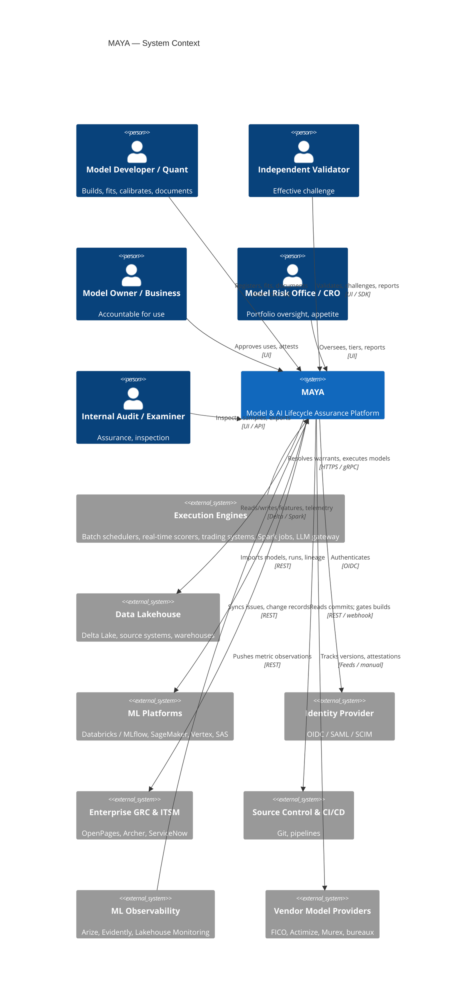
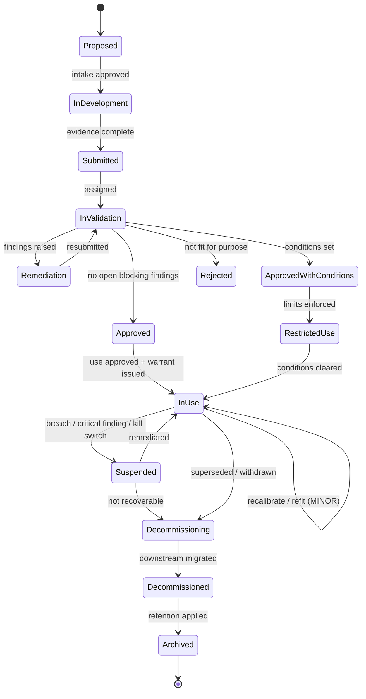
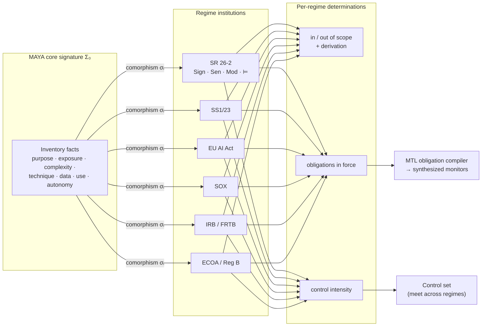
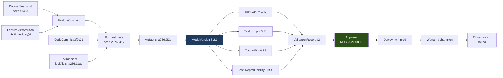
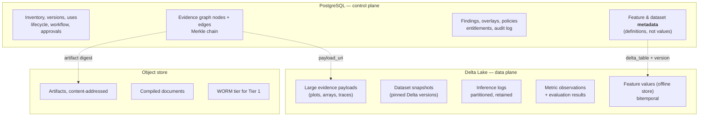
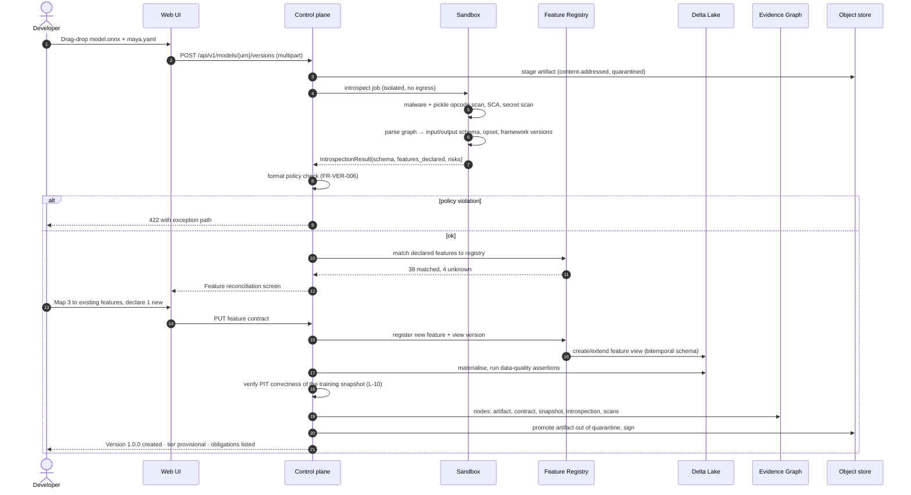
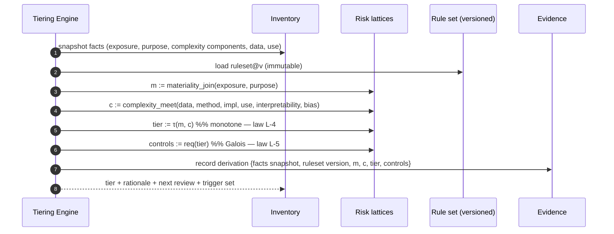
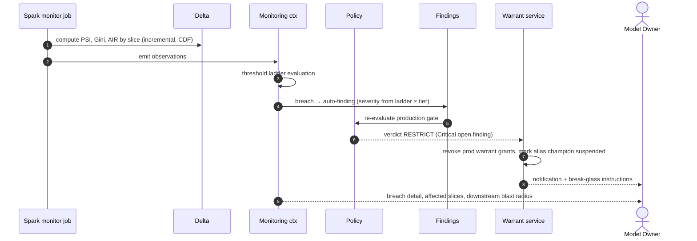
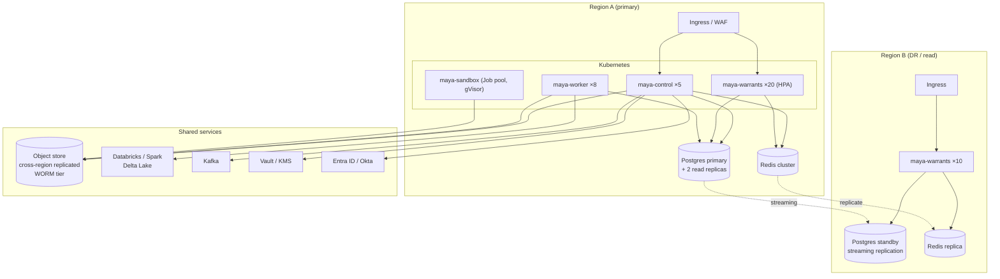

# 04 — MAYA Architecture and Design

*MAYA — Model & AI Lifecycle Assurance.*  **Evidence, not assertion.**

**Companion to:** [00 — Mathematical Foundations](00-mathematical-foundations.md) · [03 — Requirements](03-requirements.md)
**Annexes:** [05 — Data Model](05-data-model.md) · [06 — Warrants & Execution](06-warrants-and-execution.md) · [07 — Feature Platform](07-feature-platform.md) · [08 — UI/UX](08-ui-ux.md) · [09 — Security & Compliance](09-security-compliance.md)

---

## 1. Architectural overview

### 1.1 The one-sentence architecture

> MAYA is a **modular monolith** in Python/FastAPI that maintains a **fibred registry** of models as
> morphisms in `Para(Stoch)`, binds every governance claim to an **immutable, semiring-annotated evidence
> graph** in PostgreSQL, stores feature and telemetry data in **Delta Lake**, evaluates **institution-indexed
> regulatory obligations** as policy-as-code, and issues **signed execution warrants** that let any external
> engine run any governed model version on demand.

### 1.2 Why a modular monolith, not microservices

| Consideration | Decision |
|---|---|
| The domain is densely interconnected — tiering reads inventory, evidence, findings, overlays and monitoring in one transaction | A monolith keeps these as ACID transactions rather than sagas |
| Governance data is *small* (10⁵ models, 10⁶ versions); feature/telemetry data is *large* | Split by **data gravity**, not by service noun: control plane = Postgres monolith; data plane = Delta/Spark |
| Team size at launch is 8–15 engineers | Microservices would be premature distribution |
| Warrant resolution has a 10× tighter SLA than everything else (`NFR-PERF-002`) | It is the **one** component extracted as an independently scalable, independently deployable service |

The result is two deployable units plus workers, described in §3.

### 1.3 Architectural drivers, ranked

1. **Evidential integrity** — the system's value is that its claims are verifiable. Immutability and hash-chaining beat every other concern.
2. **Extensibility without migration** — new model classes and new regulators must be plugins (§7, §8).
3. **Warrant-path availability and latency** — production scoring depends on it (`NFR-PERF-002`, `NFR-AVAIL-001`).
4. **Auditability of every derivation** — nothing derived may be unexplainable (`P8`).
5. **Developer ergonomics** — if the compliant path is slower than the non-compliant path, the inventory rots.

---

## 2. Context



---

## 3. Container architecture

```mermaid
flowchart TB
    subgraph CLIENTS["Clients — all use the same public API"]
        UI["<b>maya-web</b><br/>separate process · static assets<br/>Bootstrap 5 + jQuery + ES modules<br/>nginx / CDN"]
        SDK["Python / JVM SDK + CLI<br/>notebook + CI plugins"]
        ENG["Execution engines<br/>(batch, realtime, Spark, LLM gateway)"]
    end

    subgraph EDGE["Edge"]
        GW["API Gateway / Ingress<br/>TLS, WAF, rate limit, OIDC"]
    end

    subgraph CONTROL["maya-api — FastAPI modular monolith"]
        API["REST API v1 · OpenAPI 3.1<br/>the ONLY interface"]
        AUTHB["Token broker /auth/*<br/>OIDC PKCE refresh"]
        REND["Document renderer<br/>server-side HTML / PDF"]
        direction TB
        subgraph CTX["Bounded contexts"]
            REG["Registry<br/>models, versions, artifacts"]
            FEA["Feature Platform"]
            LC["Lifecycle & Workflow"]
            VAL["Validation & Findings"]
            PMA["Overlay Register"]
            EVD["Evidence Engine<br/>semirings, provenance"]
            POL["Policy & Regime Engine<br/>institutions, OPA/Rego, MTL"]
            RISK["Risk & Tiering<br/>lattices, Galois"]
            DOC["Documentation Compiler<br/>lenses"]
            MON["Monitoring Orchestration"]
            IAM["Identity, RBAC/ABAC, Audit"]
            AI["Machine Assistance<br/>oracle-gated · grounded"]
        end
    end

    subgraph WARRANTSVC["Warrant Resolution Service — independently scaled"]
        HR["Resolver<br/>p99 < 50 ms"]
        SIGN["Descriptor signer / verifier"]
        REV["Revocation & kill switch"]
    end

    subgraph WORKERS["Async Workers (Celery)"]
        W1["Ingestion & connectors"]
        W2["Artifact introspection<br/>+ security scan (sandboxed)"]
        W3["Doc compilation"]
        W4["Monitoring evaluation"]
        W5["Notifications & campaigns"]
        W6["Discovery sweeps"]
    end

    subgraph SANDBOX["Execution Sandbox Fleet"]
        SB["Ephemeral, network-isolated pods<br/>artifact load, replay, validation runs,<br/>MAYA-hosted OIP-v2 serving"]
    end

    subgraph DATAPLANE["Data Plane"]
        SPARK["Spark / Databricks Jobs<br/>PIT joins, materialisation,<br/>monitoring at scale"]
    end

    subgraph STORES["Persistence"]
        PG[("PostgreSQL 16<br/>governance system of record<br/>+ pgvector + RLS")]
        DL[("Delta Lake<br/>features, snapshots,<br/>telemetry, observations")]
        OBJ[("Object Store<br/>content-addressed artifacts<br/>WORM tier")]
        RD[("Redis<br/>warrant cache, sessions,<br/>rate limits, queues")]
    end

    subgraph BUS["Eventing"]
        KAF["Kafka / CloudEvents<br/>domain event stream"]
    end

    UI -->|bearer token| GW
    SDK --> GW
    ENG --> GW
    GW --> API & AUTHB & REND
    GW --> HR
    API --> CTX
    REND --> CTX
    CTX --> PG
    CTX --> KAF
    CTX -.enqueue.-> WORKERS
    HR --> RD
    HR -->|warrant_projection ONLY| PG
    HR --> SIGN
    REV --> RD
    W2 --> SB
    W3 --> PG & OBJ
    W4 --> SPARK
    W6 --> W1
    FEA --> SPARK
    SPARK --> DL
    MON --> DL
    REG --> OBJ
    SB --> OBJ
    KAF --> WORKERS

    style WARRANTSVC fill:#2d5016,color:#fff
    style CONTROL fill:#1f3a5f,color:#fff
    style STORES fill:#4a3a1f,color:#fff
```



### 3.1 Deployable units

| Unit | Scaling | Why separate |
|---|---|---|
| `maya-web` | Static; CDN + 2 pods | **Separate process, separate pipeline** ([ADR-011](adr/ADR-011-decoupled-frontend.md)). A front-end outage stops human review but not warrant resolution, jobs, monitoring or the SDK |
| `maya-api` | 3–10 pods, CPU-bound | The bulk of the domain; deploys together for transactional integrity |
| `maya-warrants` | 10–100 pods, latency-critical, regional | 10× tighter SLA; must survive control-plane outage (`P9`) |
| `maya-worker` | Queue-depth autoscaled | Long-running, retryable |
| `maya-sandbox` | Job-per-task, hard-isolated | **Never** runs untrusted code in-process with the control plane (`P7`) |
| `maya-spark` (jobs) | Cluster-managed | Data-plane compute |

---

## 4. Bounded contexts and the module map

Each context maps to a mathematical pillar. This is the architectural payoff of
[00](00-mathematical-foundations.md): module boundaries are not arbitrary.

This is the map **as built**. The package is `core/`; module names are the ones on disk.

```
core/
├── domain/                     # Pure domain — no web framework, no ORM (hexagonal)
│   ├── algebra.py              # Para(Stoch): ParametricKernel, ParameterObject, FitProcedure,
│   │                           #   and trainability_class as a DERIVED property — T0–T8 are
│   │                           #   computed from how P is inhabited, so there is nothing to store
│   ├── contracts.py            # Assume-guarantee algebra: refines, compose, conjoin, quotient (L-7)
│   ├── schemas.py              # Schema lattice, variance rule (L-12)
│   └── identity.py             # Probe-relative equivalence (Yoneda), version semantics
├── registry/                   # Models, immutable versions, governed aliases
│   ├── models.py  versions.py  aliases.py  catalogue.py  specs.py
├── regimes/                    # Institutions
│   ├── signature.py            # Sign — the vocabulary a regime reasons in
│   ├── sentences.py            # Sen — obligations in that vocabulary
│   ├── translation.py          # The comorphism into the core signature
│   ├── engine.py               # ⊨ ; the satisfaction condition, checked before activation
│   └── library.py              # SR 26-2, PRA SS1/23, EU AI Act
├── evidence/
│   ├── semirings.py            # Semiring + six instances (00 §9.2)
│   └── engine.py               # Append chain over the DAG; evaluate a claim in any semiring
├── risk/
│   ├── lattices.py             # Materiality and complexity, kept separate; the control sets
│   └── tiering.py              # τ : M × C → Tier, monotone (L-4); its adjoint (L-5)
├── features/
│   ├── catalogue.py  registry.py  views.py  contracts.py  assembly.py
│   ├── derived.py  expressions.py   # Z = f(X, Y); nine whitelisted functions, checked at the AST
│   ├── sets.py                 # Featuresets: a schema, and versions that fill it
│   ├── shapes.py               # Scalar, vector, matrix, tensor; named components on the first axis
│   ├── composition.py          # The fold: a monoid over definitions (L-19)
│   ├── lifecycle.py            # Sealing, ephemerality with a TTL, creator-vs-owner
│   ├── policy.py               # Retrieval policy: fill · normalise · align, and nothing else
│   ├── normalisation.py  preparation.py  alignment.py   # Point-in-time statistics, fills, axes
│   ├── transfer.py             # Arrow / Parquet / NDJSON streaming; nothing materialised whole
│   └── pit.py                  # Bitemporal verifier: static rejection, then sampling (L-10, H-6)
├── parameters/                 # Inhabitants of P — a fit makes one, not a version
│   └── register.py             # Recorded under a warrant MAYA issued, approved by a second person
├── telemetry/                  # Two bitemporal streams per version; idempotent on the batch digest
│   └── collector.py            # Scores exist when the model runs; outcomes are learned later
├── lifecycle/
│   ├── states.py               # The six-state record machine
│   ├── approval.py             # Version approval as a quorum, its depth set by tier (L-5)
│   ├── attestation.py  amendments.py  service.py
├── policy/                     # Versioned gates — policy tightens, it never loosens
│   ├── language.py             # A rule is a predicate over a closed vocabulary; no loops, no calls
│   ├── facts.py                # What each of the four gates publishes, and the built-in defaults
│   └── engine.py               # Draft with cases, publish once they pass, report what a change flipped
├── validation/                 # Catalogue, findings, statistics
│   ├── replay.py  storage.py   # Replay from the pinned snapshot, not from what a caller hands back
├── overlays/                   # PMA register
├── monitoring/                 # Monitor definitions, observations, breaches, delayed labels
├── docs/
│   ├── lenses.py               # Fifteen lenses; get only — there is no put (see L-11)
│   ├── compiler.py  templates.py  context.py
├── attachments/                # The documents people wrote, as against the compiled ones
│   ├── store.py                # Content-addressed bytes; re-hashed on read
│   └── register.py             # Version-level filing, segregated review, supersession
├── execution/                  # Warrants — issuance, signing, revocation
│   ├── grammar/                # The four vocabularies, their product, and the admissibility laws
│   ├── runtimes/               # quantlib · onnx · pmml · bound callables; the other thirteen refuse
│   ├── sandbox.py              # Artifact-backed runtimes in a child process with rlimits
│   └── urn.py  grants.py  builder.py  signing.py  warrants.py  engine.py
├── assist/                     # Machine assistance — a bounded context, not a layer
│   ├── capabilities.py         # Tier A (an oracle checks it) or Tier B (every claim cites evidence)
│   ├── grounding.py            # Unsupported claims are REMOVED, and kept for the reviewer
│   ├── oracles.py              # ok_T predicates: satisfaction condition, probe equivalence, refinement
│   └── generations.py          # Nothing is evidence until a person attests it, never the asker
├── authz/                      # Roles, scope, segregation of duties read from the evidence chain
│   ├── roles.py  scope.py  segregation.py  principals.py  policy.py
│   └── oidc.py  jws.py         # Authorisation code + PKCE; an RS256 verifier in the standard library
├── notify/                     # A digest per person per run; silence when nothing has changed
├── scheduler/                  # Five idempotent jobs turning computed conditions into consequences
├── estate/                     # The worklist and the summary, derived from the register
├── baseline/                   # Cold-start import and dated compliance debt (C-5)
├── content/                    # Help, about and tutorials as markdown, rendered server-side
└── config/                     # YAML with a git-ignored .local overlay, ${...} resolution

db/          # The only package that knows about storage. Two hand-written schemas,
             # 43 tables, no migrations. Repositories are the only interface.
routes/      # HTTP routers — thin, no domain logic. RFC-9457-shaped refusals.
web/         # Jinja2 templates and vendored static assets (Bootstrap 5, jQuery). No CDN.
```

**Dependency rule.** `core/domain/` depends on nothing in MAYA. `registry/`, `risk/`, `evidence/`
depend only on `domain/` and `db/`. `routes/` and `web/` depend on everything and are depended on by
nothing.

> **Not built, and named rather than omitted.** There is no `fibres.py` — a model class is a string on
> the register, so `L-15`'s startup totality check does not exist. There is no `gluing.py` (`L-13`),
> no `aggregate.py` for lax monoidal risk (`L-14`), no `temporal.py` or `deontic.py` (`L-16` — the
> five scheduler jobs do that work directly), no `connectors/` package, no `workers/` package and no
> Celery, and no `skew.py`: skew detection needs an online store, which is design rather than code.
> The import-linter contract of `NFR-MNT-002` is likewise a plan, not a CI gate. Each of these is a
> gap in the build, not a naming difference, and the map above is the wrong place to hide one.

---

## 5. The Universal Model Envelope

Every model — regardless of class, language or origin — is described by one versioned manifest,
`maya.yaml`. This is the concrete realisation of the `Para(Stoch)` definition.

```yaml
apiVersion: maya.dev/v1
kind: ModelVersion

identity:
  urn: "maya://model/credit.pd.smallbiz"
  version: "3.2.1"
  display_name: "Small Business PD Scorecard"
  model_class: "credit.pd.scorecard"        # selects the fibre → evidence schema, lifecycle, metrics
  trainability_class: "T2"                  # how P is inhabited

# ---- Para(Stoch) signature ------------------------------------------------
signature:
  input:                                    # object X
    schema_ref: "schemas/pd_input@2"
    fields:
      - {name: years_in_business, dtype: float32, nullable: false, unit: years}
      - {name: dscr,              dtype: float32, nullable: true}
      - {name: industry_sic,      dtype: string,  nullable: false, cardinality: 1200}
  output:                                   # object Y
    kind: "predictive_distribution"         # or point_estimate | class_probabilities | text | struct
    schema_ref: "schemas/pd_output@1"
    fields:
      - {name: pd_12m, dtype: float32, range: [0.0, 1.0]}
      - {name: score,  dtype: int16,   range: [300, 850]}
  parameters:                               # object P
    kind: "estimated_coefficients"
    artifact_ref: "sha256:9f2c…"
    count: 42
  deterministic: true                       # L-3 asserted and tested

# ---- Fitting morphism φ : D → P -------------------------------------------
fitting:
  procedure: "estimate"                     # none | calibrate | estimate | train | elicit | configure
  run_ref: "run/01J8X…"
  dataset_snapshots: ["ds/pd_smallbiz_train@delta:v1487"]
  feature_contract_ref: "fc/01J8X…"
  code: {repo: "git@…/pd-smallbiz", commit: "a3f9c21", dirty: false}
  environment: {lockfile_digest: "sha256:11ab…", container: "ghcr.io/…@sha256:77de…"}
  seed: 20260417

# ---- Assume-guarantee contract --------------------------------------------
contract:
  assumptions:                              # A — operating boundaries
    input_domain:
      years_in_business: {min: 0, max: 60}
      dscr: {min: -5.0, max: 20.0}
    population: "US small business, revenue < $50M, SIC not in [6xxx]"
    regime: "non-recessionary; unemployment < 8%"
    upstream:
      - {contract_ref: "contract/bureau_attributes@4", freshness: "P1D"}
  guarantees:                               # G — performance envelope
    discrimination: {metric: gini, min: 0.42, slice: overall}
    calibration:    {metric: hosmer_lemeshow_p, min: 0.05}
    fairness:       {metric: adverse_impact_ratio, min: 0.80, slices: [race_proxy, sex, age_62plus]}
    latency:        {p99_ms: 25}
    availability:   "explanation available for every score"

# ---- Governance -----------------------------------------------------------
governance:
  owner: "person/j.okafor"
  developer: ["person/a.silva"]
  validator: ["person/m.chen"]
  regime_scope:
    sr_26_2:   {in_scope: true,  rationale: "statistical method producing quantitative estimate"}
    ss1_23:    {in_scope: true}
    eu_ai_act: {classification: "high_risk", annex: "III(5)(b)"}
    sox:       {key_control: false}
    ecoa:      {in_scope: true, adverse_action_required: true}
  uses:
    - {purpose: "origination_decision", portfolio: "SB Term Loan", entity: "LE-US-01",
       geography: "US", channel: "branch,digital", decision_authority: "automated_with_referral"}
  assumptions_ref: ["asm/01J…","asm/02K…"]
  limitations_ref: ["lim/01J…"]

# ---- Execution ------------------------------------------------------------
runtime:
  format: "onnx"
  opset: 17
  artifact: {uri: "s3://maya-artifacts/sha256/9f2c…", digest: "sha256:9f2c…", bytes: 184320}
  preprocessing_dag_ref: "prep/01J…"
  resources: {cpu: "500m", memory: "512Mi", gpu: null}
  warrant_flavours: ["rest_oip_v2", "python_sdk", "sql_udf", "batch_spark"]

signatures:
  - {type: "cosign", key_id: "maya-signing-2026", value: "MEUCIQ…"}
provenance:
  slsa_level: 3
  attestation_ref: "att/01J…"
```

### 5.1 Class-specific envelopes

The fibration means the *shape* above is constant while the fibre contents differ. Illustrations:

| Class | `parameters.kind` | `fitting.procedure` | Distinctive envelope sections |
|---|---|---|---|
| **T0** SA-CCR | `none` | `none` | `reference_implementation`, `regulatory_citation`, `implementation_tests` |
| **T1** SABR surface | `calibration_set` | `calibrate` | `calibration_instruments`, `tolerance`, `arbitrage_assertions`, `recalibration_schedule` |
| **T5** SAR drafting | `llm_configuration` | `configure` | `base_model`, `prompt_version`, `rag_corpus_version`, `tool_manifest`, `guardrails`, `eval_set`, `autonomy_mode`, `human_oversight` |
| **T6** FICO score | `opaque` | `none` | `vendor`, `contract_ref`, `attestation`, `own_outcomes_plan`, `customisations` |
| **T7** Country scorecard | `elicited_weights` | `elicit` | `panel`, `elicitation_protocol`, `convergence`, `dissent_record` |
| **T8** AML scenario | `rule_set` | `none` | `rules`, `thresholds`, `atl_btl_plan`, `change_control` |

---

## 6. Lifecycle as a functor

### 6.1 The generic spine

Lifecycles are declarative. A lifecycle definition is a directed graph; a model's history is a path
(a morphism in the free category on that graph — law `L-1`). Guards are predicates evaluated by the
policy engine.



### 6.2 Class-specific specialisation

The graph above is the **base**; each class supplies a fibre that adds, removes or constrains transitions.

| Class | Specialisation |
|---|---|
| **T0** | `InDevelopment` gains `ImplementationVerification`; no `fit` self-loop; revalidation triggered by spec/regulation change only |
| **T1** | `InUse` carries a `Recalibrate` sub-cycle producing calibration sets, **not** model versions. Tolerance breach escalates to `Suspended` |
| **T3** | `InUse` gains `AutoRetrainCandidate → ShadowEvaluation → PromotionDecision`; auto-promotion is policy-gated and forbidden for Tier 1 |
| **T4** | Continuous `ParameterDrift` monitoring state with mandatory **parallel outcomes analysis** on every material autonomous change (SS1/23 3.3(c)) |
| **T5** | `Submitted` is preceded by `BoundaryDetermination` and `RiskMatrixAssignment`; `EvalGate` before every prompt/corpus/base-model change |
| **T6** | `InDevelopment` replaced by `VendorDueDiligence → AttestationReview → OwnOutcomesBenchmark`; vendor version change re-enters at `ChangeAssessment` |
| **T7** | `Elicitation` state with panel quorum guard |
| **T8** | Lightweight: `Draft → PeerReview → ChangeApproval → InUse`, with ATL/BTL tuning cycles |

### 6.3 Guards are policy, not code

```rego
package maya.gates.promote_to_production

default allow := false

allow if {
    input.model.tier != 1
    count(blocking_findings) == 0
    input.documents.mdd.completeness >= 0.9
}

allow if {
    input.model.tier == 1
    input.validation.status == "approved"
    count(blocking_findings) == 0
    input.documents.mdd.completeness == 1.0
    input.documents.validation_report.status == "issued"
    input.approvals.count_at_level["model_risk_committee"] >= 1
    not stale_documents
}

blocking_findings[f] if {
    f := input.findings[_]
    f.severity in {"Critical", "High"}
    f.status != "closed"
}

stale_documents if { input.documents[_].stale == true }

deny_reason contains msg if {
    some f in blocking_findings
    msg := sprintf("Blocking finding %s (%s) is open", [f.id, f.severity])
}
```

Every denial returns `deny_reason` with a deep link to remediate — `P8` in practice.

---

## 7. Extensibility: the fibration in code

The **Extension Theorem** of [00 §7](00-mathematical-foundations.md#7-pillar-4--indexing-fibrations-and-the-grothendieck-construction)
becomes a plugin contract. Adding a model class requires **no schema change, no core code change**.

```python
# core/registry/ — NOT BUILT: a model class is a string on the register, and there is no plugin loader
from typing import Protocol, Sequence

class ModelClassFibre(Protocol):
    """One fibre of the fibration p: Registry -> ModelClasses.

    Supplying an implementation is the ONLY thing required to support a new
    kind of model. Law L-15 asserts every registered fibre is total.
    """
    key: str                       # e.g. "markets.pricing.stochastic_vol"
    trainability_class: str        # T0..T8

    def evidence_schema(self) -> dict: ...              # JSON Schema for the fibre's evidence document
    def lifecycle(self) -> "LifecycleDefinition": ...   # base graph + specialisation
    def default_monitors(self) -> Sequence["MonitorDefinition"]: ...
    def document_templates(self) -> Sequence[str]: ...
    def tiering_hints(self) -> "TieringHints": ...
    def contract_template(self) -> "ContractTemplate": ...
    def introspector(self) -> "ArtifactIntrospector | None": ...
    def validators(self) -> Sequence["TestDefinition"]: ...
```

Registered via Python entry points, so a bank's own classes ship as a separate package:

```toml
[project.entry-points."maya.model_class"]
"markets.pricing.stochastic_vol" = "acme_maya_ext.pricing:StochasticVolFibre"
"quantum.portfolio.annealer"     = "acme_maya_ext.quantum:AnnealerFibre"
```

Nine extension points exist, all following the same pattern:

| Extension point | Entry-point group | Example |
|---|---|---|
| AI capability | `maya.ai_capability` | a house drafting assistant; a discovery agent |
| Oracle | `maya.oracle` | a bank-specific check for a bank-specific task |
| Model class (fibre) | `maya.model_class` | new pricing family, quantum optimiser |
| Regulatory regime (institution) | `maya.regime` | MAS, APRA, OSFI E-23 |
| Evidence semiring | `maya.semiring` | a bank-specific trust calculus |
| Artifact format | `maya.artifact_format` | proprietary quant-library binary |
| Validation test | `maya.test` | a house backtesting method |
| Monitoring metric | `maya.metric` | a domain-specific drift statistic |
| Document template | `maya.doc_template` | local regulator's report format |
| Warrant flavour | `maya.warrant_flavour` | in-house RPC protocol |
| Connector | `maya.connector` | in-house ML platform |

---

## 8. Regime engine: institutions in practice



A regime module declares its vocabulary, its sentences, and the translation:

```python
# core/regimes/library.py
class SR26_2(Institution):
    key = "sr_26_2"

    signature = Signature(sorts=["Model", "Method", "Estimate"],
                          predicates=["is_complex", "applies_theory", "produces_quantitative_estimate",
                                      "is_generative_ai", "is_agentic_ai", "is_deterministic_rule"])

    def translate(self, facts: CoreFacts) -> RegimeFacts:
        """Comorphism σ: Σ₀ → Σ_SR26-2.  Law L-8 tests the satisfaction condition."""
        return RegimeFacts(
            is_complex=facts.complexity_score >= self.cfg.complexity_threshold,
            applies_theory=facts.technique_family in STATISTICAL_ECONOMIC_FINANCIAL,
            produces_quantitative_estimate=facts.output_kind in QUANTITATIVE_KINDS,
            is_generative_ai=facts.trainability_class == "T5",
            is_agentic_ai=facts.autonomy_mode in AGENTIC_MODES,
            is_deterministic_rule=facts.trainability_class == "T8",
        )

    sentences = [
        Sentence("is_model",
                 formula="is_complex ∧ applies_theory ∧ produces_quantitative_estimate "
                         "∧ ¬is_generative_ai ∧ ¬is_agentic_ai ∧ ¬is_deterministic_rule",
                 citation="SR 26-2 §II"),
        Sentence("warrants_comprehensive_oversight",
                 formula="is_model ∧ materiality ⊒ Material",
                 citation="SR 26-2 §III"),
        Sentence("vendor_own_outcomes_analysis_required",
                 formula="is_model ∧ is_vendor_supplied",
                 citation="SR 26-2 §VII"),
    ]
```

The scope determination stored on the model is then a **derivation**, not a flag:

```json
{
  "regime": "sr_26_2",
  "determination": "out_of_scope",
  "derivation": {
    "sentence": "is_model",
    "evaluated": false,
    "failing_conjunct": "¬is_generative_ai",
    "facts": {"trainability_class": "T5", "is_generative_ai": true},
    "citation": "SR 26-2 §II fn.3",
    "evaluated_at": "2026-09-03T10:14:22Z",
    "regime_version": "2026-04-17",
    "note": "Out of SR 26-2 scope; governed under SS1/23 and internal AI policy."
  }
}
```

**Adding MAS or APRA is adding one module.** No migration, no core change — the guarantee the user asked for.

---

## 9. Evidence engine

### 9.1 Structure

The evidence graph is an append-only DAG in Postgres. Each node is immutable, content-addressed, and
Merkle-chained to its parents, so tampering is detectable and the chain is independently verifiable.



### 9.2 One engine, many questions

```python
# core/evidence/semirings.py
@dataclass(frozen=True)
class Semiring(Generic[K]):
    name: str
    zero: K
    one: K
    plus: Callable[[K, K], K]    # alternative derivations — OR
    times: Callable[[K, K], K]   # joint dependence — AND

BOOLEAN   = Semiring("boolean",   False,  True, lambda a, b: a or b,  lambda a, b: a and b)
COUNTING  = Semiring("counting",  0,      1,    lambda a, b: a + b,   lambda a, b: a * b)
TRUST     = Semiring("trust",     0.0,    1.0,  max,                  lambda a, b: a * b)
COST      = Semiring("cost",      inf,    0.0,  min,                  lambda a, b: a + b)
FRESHNESS = Semiring("freshness", 0.0,    0.0,  max,                  max)
WHY       = Semiring("why",       set(),  {frozenset()}, _why_plus,   _why_times)
```

The same traversal, different answers:

```python
engine.evaluate(claim, derivations, BOOLEAN,   presence_valuation(version_id)).value
    # -> True
engine.evaluate(claim, derivations, WHY,       why_valuation()).value
    # -> {{VR_v2, APPR_MRC}, {VR_v2, APPR_DELEGATED}}   # what to show an examiner
engine.evaluate(claim, derivations, TRUST,     trust_valuation(version_id)).value
    # -> 0.91
engine.evaluate(claim, derivations, COST,      effort_valuation()).value
    # -> 0.0  (or, if unmet: 14.5 person-days to close the cheapest path)
engine.evaluate(claim, derivations, FRESHNESS, recorded_at_valuation()).value
    # -> 1786521600.0   → compare to now for staleness
```

Six product capabilities, one implementation.

> **Three that are not there.** `ℕ[X]` how-provenance, a security lattice for classification
> propagation, and a regime-admissibility powerset are all constructions this shape admits and none of
> them is built. The consequence worth naming: without `ℕ[X]` there is no universal object, so each
> semiring is a separate traversal rather than a homomorphic image, and law `L-9` is vacuous as
> stated. See [00 §9.2](00-mathematical-foundations.md#92-one-engine-many-analyses).

---

## 10. Warrant architecture (summary)

Full protocol in [06 — Warrants & Execution](06-warrants-and-execution.md). Architecturally:

```mermaid
sequenceDiagram
    autonumber
    participant E as Execution Engine
    participant H as maya-warrants
    participant R as Redis cache
    participant P as Postgres
    participant O as Object store

    Note over E: holds only maya://model/credit.pd.smallbiz#champion
    E->>H: POST /v1/resolve {urn, principal, declared_use, env}
    H->>R: lookup(urn, principal, env)
    alt cache hit and not revoked
        R-->>H: signed descriptor (TTL 300s)
    else miss
        H->>P: resolve alias → version, check approval, entitlement, findings, policy
        P-->>H: version + contract + policy verdict
        H->>H: build + sign descriptor (HMAC-SHA256; Ed25519 is the production target)
        H->>R: cache with TTL and revocation tag
    end
    H-->>E: 200 WarrantDescriptor{artifact_uri, digest, schemas, feature_contract, constraints, expiry, sig}
    E->>E: verify signature, check declared_use ⊆ approved_uses
    E->>O: fetch artifact by digest (cached locally)
    E->>E: verify digest, load in sandbox, execute
    E-->>H: POST /v1/telemetry {invocations, latency, boundary_violations}
    Note over H,P: telemetry → Delta → approved-use vs actual-use reconciliation (FR-MON-009)
```

Key properties:
- **Latency**: cached path is a Redis GET plus signature check — p99 < 50 ms.
- **Availability**: descriptors remain valid for their TTL if MAYA is down (`P9`).
- **Kill switch**: revocation writes a tombstone; resolvers check it; effective within TTL (default 60 s), with an immediate-broadcast path for emergencies.
- **Fail-closed on entitlement**: an unknown or unapproved `declared_use` is refused.

---

## 11. Technology stack

> **Read this table as the production target, not as the bill of materials.** The reference
> implementation deliberately runs on a much smaller footprint, and where the two differ the difference
> is stated in the last column rather than left for a reader to discover by looking for a service that
> is not there. The rule that decided most of these: a governance system that cannot be deployed
> air-gapped is one somebody works around, so where the standard library will do, it does.

| Layer | Choice | Rationale, and what actually ships |
|---|---|---|
| API / web | **FastAPI** (async), Pydantic v2, Uvicorn behind Gunicorn | Mandated; excellent OpenAPI generation, type safety, async I/O for connectors |
| Templating | **Jinja2** server-rendered + partial fragments | Mandated stack is jQuery/Bootstrap, not an SPA; server rendering keeps the security model simple |
| Front end | **Bootstrap 5.3**, **jQuery 3.7**, DataTables, Chart.js, Cytoscape.js (graphs), CodeMirror 6 (policy/YAML), Mermaid (diagrams) | See [08 — UI/UX](08-ui-ux.md) |
| ORM / DB | **PostgreSQL 16** in production; SQLite by default | **No ORM and no migration tool.** Two hand-written schemas in `db/schema/`, 43 tables, switchable by URL alone. `ltree`, `pgvector`, RLS and declarative partitioning are **not used** — the shipped DDL has no foreign keys, no `CHECK` constraints and no triggers, and referential integrity is enforced in the repositories |
| Lakehouse | **Delta Lake** via `delta-rs` | Features, snapshots, telemetry. Spark/Databricks is the target for large jobs and is not a dependency of the reference implementation |
| Object store | S3 / ADLS / GCS, content-addressed, Object Lock for WORM | Target. What ships is a content-addressed store on the local filesystem, with the digest as the key and a re-hash on every read |
| Cache / queue | **Redis 7** | Target, for the warrant cache and rate limits. **Not used**: warrant TTL and jitter are computed in process |
| Async | **Celery**; **APScheduler** for cron-like campaigns | Target. What ships is `core/scheduler/` — seven idempotent jobs invoked by an ordinary authenticated call, so cron, a Kubernetes CronJob or a person produce identical results, with an in-process loop off by default |
| Eventing | **Kafka** with CloudEvents envelopes | Target. Not used |
| Policy | Target was **OPA/Rego**. **What ships is `core/policy/`**: a rule is a predicate over a closed vocabulary of published facts — comparison, membership, boolean connectives, `any`/`all` and six other functions, no loops, no assignment, no attribute access — checked at the AST | Rego is a general language, and a gate written in one is a program a reviewer has to run rather than reason about. A fact the gate does not publish is refused *when the rule is written*, not at the moment of a governance decision |
| Auth | OIDC authorisation-code flow with PKCE, state and nonce; HTTP Basic and a session cookie for people; **HMAC-SHA256** warrant signatures | **No Authlib, no SAML, no SCIM, no MFA.** RS256 verification is in the standard library (`core/authz/jws.py`) for the air-gap reason above: the verifier *constructs* the padded block the signature should have produced and compares the whole of it, and decides the algorithm itself rather than reading `alg` from the token. Ed25519 descriptor signing remains the production target |
| Signing | **Sigstore/cosign** for artifacts, in-toto attestations | Target. Not used |
| Sandboxing | Target was gVisor / Kata on Kubernetes. **What ships** is a `spawn`ed child process with `RLIMIT_CPU` and `RLIMIT_AS` read from the warrant, for the two artifact-backed runtimes | `P7`, honestly scoped: it protects against a runaway loop, an allocation storm and a hard crash, and **not** against a hostile artifact — the child shares the filesystem and the network namespace. See [09 §2.2](09-security-compliance.md) |
| Search | Postgres FTS + `pgvector` | Target. **Not used** — there is no semantic feature matching and no duplicate-feature detection |
| Observability | OpenTelemetry, Prometheus, Grafana, structured JSON logs | Target. Structured logging ships; the rest does not |
| Testing | pytest; **Hypothesis** for L-4; schemathesis and testcontainers as targets | The executable laws live beside the code they constrain — see [00 §12](00-mathematical-foundations.md#12-the-laws-maya-enforces) |
| Packaging | `uv` / Poetry, Docker, Helm, Terraform | Target. What ships is `requirements.txt` |

### 11.1 FastAPI application shape

```python
# run_maya_web.py
def create_app(settings: Settings) -> FastAPI:
    app = FastAPI(title="MAYA", version=API_VERSION, openapi_url="/api/v1/openapi.json")

    # Plugin discovery FIRST — fibres must exist before routers reference them (L-15).
    plugins = PluginLoader.discover()
    plugins.validate_totality()          # every fibre total: evidence schema, lifecycle, metrics, templates

    app.state.container = Container(settings, plugins)   # explicit DI, no globals

    app.add_middleware(RequestContextMiddleware)   # request id, actor, tenant → contextvars
    app.add_middleware(AuditMiddleware)            # append-only audit of every mutating call
    app.add_middleware(RLSSessionMiddleware)       # sets Postgres session vars for row-level security
    app.add_middleware(OTelMiddleware)

    for router in (models, versions, artifacts, features, runs, validations,
                   findings, overlays, documents, monitors, warrants, policies,
                   regimes, evidence, reports, admin):
        app.include_router(router.router, prefix="/api/v1")

    app.include_router(web.router)     # Jinja2 pages
    return app
```

**Rule:** routers contain no domain logic. They validate input, call an application service, and render.
Domain logic lives in `core/domain/` and the context packages, which are importable and testable without
a web server.

---

## 12. Persistence strategy

### 12.1 The split, and why



| Rule | Statement |
|---|---|
| **R1** | Anything that participates in a governance *decision transaction* lives in Postgres. |
| **R2** | Anything whose volume is proportional to *business events* rather than *models* lives in Delta. |
| **R3** | Postgres never stores feature or telemetry **values**, only definitions and pinned pointers. |
| **R4** | Delta never stores authoritative governance **state**; it may store derived copies for analytics. |
| **R5** | Cross-store writes use the **transactional outbox** pattern: commit to Postgres with an outbox row, then a worker performs the Delta write and marks the outbox row done. Idempotent, at-least-once, reconciled nightly. |

### 12.2 Delta Lake layout

```
maya_lake/
├── features/
│   ├── <entity>/<feature_view>/               # partitioned by event_date; Z-ordered by entity_id
│   │      ├── _delta_log/                      # transaction-time axis via Delta versions
│   │      └── …                                # columns: entity_id, event_ts (valid time),
│   │                                           #          ingest_ts (transaction time), features…
├── snapshots/
│   └── <snapshot_id>/                          # immutable materialised training sets
├── telemetry/
│   ├── inference_log/                          # partitioned by dt, model_urn
│   ├── warrant_resolution_log/
│   └── boundary_violations/
├── monitoring/
│   ├── observations/                           # metric time series
│   └── evaluations/                            # test/eval results incl. GenAI evals
└── evidence/
    └── payloads/                               # large artifacts referenced from the evidence graph
```

Delta features exploited: **ACID** for concurrent materialisation, **time travel** for the
transaction-time axis (the mechanism behind PIT correctness, law `L-10`), **CDF** for incremental
monitoring, **schema evolution** with enforcement, **liquid clustering/Z-order** for entity lookups,
**deletion vectors** and crypto-shredding for GDPR erasure, **VACUUM retention** aligned to regulatory
retention classes.

### 12.3 Postgres specifics

- **Row-Level Security** on every tenant/entity-scoped table, driven by session variables set in middleware — so a bug in an API handler cannot leak another legal entity's models.
- **Partitioning** on `audit_log`, `evidence_node`, `metric_observation_rollup` by month.
- **JSONB + JSON Schema validation** for fibre-specific evidence documents — the fibration expressed in storage, so a new class needs no DDL.
- **`ltree`** for lifecycle paths and organisational hierarchy.
- **Generated columns + expression indexes** for hot inventory filters.
- **`pgvector`** for semantic search over model descriptions, documents and code summaries.
- **Advisory locks** for alias moves (serialise champion changes per model).

---

## 13. Key sequences

### 13.1 Upload a model and identify features



### 13.2 Tiering with full derivation



### 13.3 Monitoring breach → finding → warrant restriction



---

## 14. Deployment topology



**Failure behaviour.** If Region A's control plane is unavailable, Region B's `maya-warrants` continue to
resolve from the standby and the Redis replica. Reads succeed; new issuance and alias moves fail closed
with a clear error. This is `P9` and `NFR-AVAIL-002`.

---

## 15. Performance and scale design

| Concern | Approach |
|---|---|
| Warrant resolution p99 < 50 ms | Descriptors pre-computed and cached; Redis GET + Ed25519 verify; **no DB on the hot path** — the resolver reads only `warrant_projection` (finding H-2); local in-process LRU in front of Redis |
| **Cache stampede on alias move** (finding H-1) | **Pre-warm before invalidate** — build and sign the new descriptor, write it to cache, *then* flip the pointer, so the cache is never empty · **single-flight coalescing** per `(urn, principal, env)` · **TTL jitter ±20%** to prevent synchronised expiry · **stale-while-revalidate** for up to 5 s while the new descriptor is built |
| Inventory list at 50k models | Keyset pagination, covering indexes, materialised summary view refreshed on domain events, server-side DataTables |
| Blast radius on a 50k-node graph | Adjacency in Postgres; recursive CTE with depth cap for interactive use; nightly precomputed transitive closure for portfolio analytics |
| PIT join over 1B rows × 500 features | Spark with broadcast-free range joins, entity bucketing, Z-order on `entity_id`, `AS OF` via Delta time travel |
| 50k inference-log events/sec | Buffered ingest → Kafka → structured streaming → Delta with optimised writes; auto-compaction; sampling policy by tier |
| Monitoring at portfolio scale | Delta **Change Data Feed** for incremental computation; only changed partitions recomputed |
| Evidence graph queries | Provenance polynomials materialised for Tier 1; `Why` form below; depth-limited traversal with memoisation |
| Document compilation | Async worker; cached rendered fragments keyed by evidence hash — unchanged evidence never re-renders |

---

## 16. Failure modes and mitigations

| Failure | Impact | Mitigation |
|---|---|---|
| Postgres primary loss | Control plane down | Streaming standby, automated failover, RTO 4 h / RPO 15 min; warrants keep serving (`P9`) |
| Redis loss | Warrant latency degrades | Resolver falls back to Postgres read replica; latency budget degrades to 200 ms, not an outage |
| Malicious artifact upload | RCE risk | Quarantine + sandboxed introspection + format policy + signing; control plane never deserialises |
| Alias move breaks a consumer | Production incident | Contract refinement check (`L-7`) and schema variance check (`L-12`) block the move; canary + shadow first |
| Feature source restated | Silent model degradation | Bitemporal detection, affected-snapshot identification, automatic finding, downstream notification |
| Evidence graph corruption | Loss of assurance | Merkle chain verification job; WORM copies of Tier 1 evidence; append-only enforced at the DB role level |
| Policy misconfiguration blocks everyone | Operational gridlock | Policy changes are themselves versioned, tested against a golden corpus, canaried, and reversible; break-glass with dual authorisation |
| Runaway GenAI cost | Financial | Per-warrant token/cost budgets, hard stops, anomaly alerting |
| Clock skew across regions | Bad temporal reasoning | NTP discipline; all temporal logic uses server-assigned monotonic transaction time, never client time |

---

## 17. Architecture decision records

See [`docs/adr/`](adr/INDEX.md) for the full set. Summary:

| ADR | Decision |
|---|---|
| [ADR-001](adr/ADR-001-modular-monolith.md) | Modular monolith + one extracted warrant service |
| [ADR-002](adr/ADR-002-postgres-delta-split.md) | Postgres for governance, Delta for data-plane volume |
| [ADR-003](adr/ADR-003-para-stoch-model-definition.md) | `Para(Stoch)` as the universal model definition |
| [ADR-004](adr/ADR-004-fibration-extensibility.md) | Model classes as fibres, delivered as plugins |
| [ADR-005](adr/ADR-005-institutions-for-regimes.md) | Institutions for multi-regulator scoping |
| [ADR-006](adr/ADR-006-semiring-evidence.md) | Semiring-annotated provenance as the single evidence engine |
| [ADR-007](adr/ADR-007-warrant-protocol.md) | Signed, TTL'd, alias-aware warrant descriptors |
| [ADR-008](adr/ADR-008-server-rendered-ui.md) | ~~Server-rendered Jinja2~~ — **superseded by ADR-011** |
| [ADR-009](adr/ADR-009-no-untrusted-deserialisation.md) | Sandbox-only artifact loading; format policy |
| [ADR-010](adr/ADR-010-laws-as-tests.md) | The laws enforced by tests in CI |
| [ADR-011](adr/ADR-011-decoupled-frontend.md) | Decoupled front end consuming backend services over the public API |

> **Post-review.** This architecture incorporates the dispositions of
> [11 — Adversarial Design Review](11-adversarial-review.md): 27 findings, 17 requiring redesign. The
> most consequential were **C-2** (the online feature store was unversioned, silently defeating the
> feature contract) and **C-5** (day-one adoption with 1,200 evidence-less legacy models).

---

Copyright © 2026 Ashutosh Sinha <ajsinha@gmail.com>. All rights reserved.
Proprietary and confidential. See [LICENSE](../LICENSE) and [NOTICE](../NOTICE).
*Not legal, regulatory or financial advice — see NOTICE §4.*
