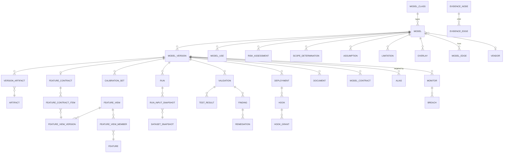

# 05 — Data Model

*MAYA — Model & AI Lifecycle Assurance.*  **Evidence, not assertion.**

**Annex to** [04 — Architecture](04-architecture.md). Implements the structures of
[00 — Mathematical Foundations](00-mathematical-foundations.md).

---

## 1. Principles

| # | Principle |
|---|---|
| D1 | **Immutable core, mutable periphery.** Versions, runs, artifacts, evidence, approvals and audit are append-only. Only pointers (aliases, current tier, status) mutate — and their history is retained. |
| D2 | **The fibration lives in JSONB.** Class-specific evidence is a JSON document validated against the fibre's JSON Schema. A new model class adds no DDL. |
| D3 | **Postgres holds definitions and decisions; Delta holds values and events.** |
| D4 | **Every derived value stores its derivation.** Tier, status, health score, scope determination — each carries the inputs, rule version and rationale. |
| D5 | **Bitemporal where it matters.** Feature data, exposure measures and organisational facts carry valid time and transaction time. |
| D6 | **RLS everywhere.** Entity/tenant scoping enforced in the database, not only the API. |
| D7 | **ULIDs, not sequences.** Sortable, non-guessable, safe to generate client-side. |

Naming: singular table names, `snake_case`, `_id` suffix for keys, `*_at` for timestamps (all `timestamptz`, UTC).

---

## 2. Entity–relationship overview



---

## 3. Reference and organisation

```sql
-- ---------------------------------------------------------------- reference
CREATE TABLE model_class (
    key                 text PRIMARY KEY,               -- 'credit.pd.scorecard'
    display_name        text NOT NULL,
    domain              text NOT NULL,                  -- A..K of the taxonomy
    trainability_class  char(2) NOT NULL
        CHECK (trainability_class IN ('T0','T1','T2','T3','T4','T5','T6','T7','T8')),
    lifecycle_key       text NOT NULL REFERENCES lifecycle_definition(key),
    evidence_schema     jsonb NOT NULL,                 -- JSON Schema for the fibre (D2)
    default_monitors    jsonb NOT NULL DEFAULT '[]',
    document_templates  text[] NOT NULL DEFAULT '{}',
    tiering_hints       jsonb NOT NULL DEFAULT '{}',
    contract_template   jsonb NOT NULL DEFAULT '{}',
    plugin_source       text,                           -- entry point that supplied this fibre
    is_active           boolean NOT NULL DEFAULT true,
    created_at          timestamptz NOT NULL DEFAULT now()
);
COMMENT ON TABLE model_class IS
  'One fibre of the fibration p: Registry -> ModelClasses. Law L-15 asserts totality.';

CREATE TABLE legal_entity (
    id            text PRIMARY KEY,          -- 'LE-US-01'
    name          text NOT NULL,
    jurisdiction  char(2) NOT NULL,
    parent_id     text REFERENCES legal_entity(id),
    path          ltree NOT NULL,
    regimes       text[] NOT NULL DEFAULT '{}'   -- regimes in force for this entity
);

CREATE TABLE business_unit (
    id        text PRIMARY KEY,
    name      text NOT NULL,
    path      ltree NOT NULL,
    parent_id text REFERENCES business_unit(id)
);

CREATE TABLE person (
    id            text PRIMARY KEY,         -- 'person/j.okafor'
    display_name  text NOT NULL,
    email         citext NOT NULL UNIQUE,
    upn           text UNIQUE,
    is_active     boolean NOT NULL DEFAULT true,
    manager_id    text REFERENCES person(id),
    left_at       timestamptz               -- drives orphaned-model detection
);

CREATE TABLE vendor (
    id              text PRIMARY KEY,
    name            text NOT NULL,
    product         text,
    contract_ref    text,
    criticality     text CHECK (criticality IN ('low','medium','high','critical')),
    right_to_audit  boolean NOT NULL DEFAULT false,
    exit_plan_ref   text,
    attributes      jsonb NOT NULL DEFAULT '{}'
);
```

---

## 4. The model and its versions

```sql
CREATE TABLE model (
    id                  text PRIMARY KEY,               -- ULID
    urn                 text NOT NULL UNIQUE,           -- maya://model/credit.pd.smallbiz
    name                text NOT NULL,
    description         text,
    model_class_key     text NOT NULL REFERENCES model_class(key),
    trainability_class  char(2) NOT NULL,               -- denormalised from class; may be overridden

    -- ownership (FR-INV-008): individuals, not teams
    owner_id            text NOT NULL REFERENCES person(id),
    developer_ids       text[] NOT NULL DEFAULT '{}',
    validator_ids       text[] NOT NULL DEFAULT '{}',
    sponsor_id          text REFERENCES person(id),

    -- organisation
    legal_entity_id     text NOT NULL REFERENCES legal_entity(id),
    business_unit_id    text NOT NULL REFERENCES business_unit(id),
    geographies         text[] NOT NULL DEFAULT '{}',

    -- purpose
    purpose_statement   text NOT NULL,
    design_objectives   jsonb NOT NULL DEFAULT '[]',

    -- provenance of the model itself
    origin              text NOT NULL
        CHECK (origin IN ('internal','vendor','open_source','embedded','inherited','euc')),
    vendor_id           text REFERENCES vendor(id),

    -- derived, with derivations stored separately
    status              text NOT NULL,
    current_tier        smallint CHECK (current_tier BETWEEN 1 AND 4),
    tier_assessed_at    timestamptz,
    health_score        numeric(5,4),

    -- flags driving additional control sets (FR-INV-019)
    sox_relevant            boolean NOT NULL DEFAULT false,
    regulatory_reporting    boolean NOT NULL DEFAULT false,
    consumer_impacting      boolean NOT NULL DEFAULT false,
    safety_critical         boolean NOT NULL DEFAULT false,

    -- fibre-specific attributes, validated against model_class.evidence_schema (D2)
    class_attributes    jsonb NOT NULL DEFAULT '{}',

    created_at  timestamptz NOT NULL DEFAULT now(),
    created_by  text NOT NULL REFERENCES person(id),
    updated_at  timestamptz NOT NULL DEFAULT now(),

    CONSTRAINT vendor_required_for_vendor_origin
        CHECK (origin <> 'vendor' OR vendor_id IS NOT NULL)
);

CREATE INDEX ON model (legal_entity_id, current_tier, status);
CREATE INDEX ON model (owner_id) WHERE status IN ('in_use','restricted_use');
CREATE INDEX ON model USING gin (class_attributes jsonb_path_ops);
CREATE INDEX ON model USING gin (to_tsvector('english', name || ' ' || coalesce(description,'')));

-- Finding H-5: ENABLE alone does not apply to the table owner or a superuser. If the application
-- connects as the schema owner -- the common default in migration-managed apps -- RLS silently
-- does nothing while appearing to be on. FORCE is mandatory, and the app must not own the schema.
ALTER TABLE model ENABLE ROW LEVEL SECURITY;
ALTER TABLE model FORCE  ROW LEVEL SECURITY;
CREATE POLICY model_entity_isolation ON model
    USING (legal_entity_id = ANY (string_to_array(current_setting('maya.entities', true), ',')));
-- NULL session var -> NULL -> row filtered out: fail-closed by construction.
-- Roles: maya_app (runtime, non-owner) | maya_migrate (DDL only, unused at runtime)
--        maya_retention (dual-controlled deletes) | maya_read (replicas, reporting)
-- CI asserts a cross-entity read returns zero rows under maya_app. Untested isolation is assumed
-- isolation, which is not isolation.
```

```sql
CREATE TABLE model_version (
    id              text PRIMARY KEY,
    model_id        text NOT NULL REFERENCES model(id),
    semver          text NOT NULL,                      -- '3.2.1'
    major smallint NOT NULL, minor smallint NOT NULL, patch smallint NOT NULL,

    -- Para(Stoch) signature (00 §4)
    input_schema    jsonb NOT NULL,                     -- object X
    output_schema   jsonb NOT NULL,                     -- object Y
    output_kind     text NOT NULL
        CHECK (output_kind IN ('point_estimate','predictive_distribution',
                               'class_probabilities','ranking','text','structured','decision','none')),
    parameter_kind  text NOT NULL
        CHECK (parameter_kind IN ('none','calibration_set','estimated_coefficients','learned_weights',
                                  'llm_configuration','rule_set','elicited_weights','opaque')),
    is_deterministic boolean NOT NULL,                  -- law L-3

    -- fitting morphism φ : D → P
    fitting_procedure text NOT NULL
        CHECK (fitting_procedure IN ('none','calibrate','estimate','train','elicit','configure','author')),
    fitting_run_id    text REFERENCES run(id),

    -- the manifest is the source of truth; the columns above are projections
    manifest        jsonb NOT NULL,
    manifest_digest text NOT NULL,                      -- sha256 of canonical form (law L-2)

    change_type     text CHECK (change_type IN ('major','minor','patch')),
    change_summary  text,
    supersedes_id   text REFERENCES model_version(id),

    -- probe-relative equivalence claim (00 §5.3)
    equivalent_to_id  text REFERENCES model_version(id),
    equivalence_probe_set_id text REFERENCES probe_set(id),

    status      text NOT NULL,
    created_at  timestamptz NOT NULL DEFAULT now(),
    created_by  text NOT NULL REFERENCES person(id),

    UNIQUE (model_id, semver),
    CONSTRAINT patch_requires_equivalence_proof
        CHECK (change_type <> 'patch' OR equivalence_probe_set_id IS NOT NULL)
);

-- Immutability (D1). A trigger that RAISES, never a rule that silently discards.
-- Finding C-3: `DO INSTEAD NOTHING` reports success while dropping the write, which is the
-- worst possible failure mode for an integrity control. Silence is never acceptable enforcement.
CREATE OR REPLACE FUNCTION model_version_immutable() RETURNS trigger AS $$
BEGIN
    IF (to_jsonb(OLD) - 'status' - 'updated_at')
       IS DISTINCT FROM (to_jsonb(NEW) - 'status' - 'updated_at') THEN
        RAISE EXCEPTION 'model_version % is immutable; create a new version instead', OLD.id
              USING ERRCODE = 'restrict_violation';
    END IF;
    RETURN NEW;
END $$ LANGUAGE plpgsql;

CREATE TRIGGER trg_model_version_immutable
    BEFORE UPDATE ON model_version
    FOR EACH ROW EXECUTE FUNCTION model_version_immutable();

-- The same pattern replaces every "append-only" claim in this schema.
```

```sql
CREATE TABLE artifact (
    digest        text PRIMARY KEY,                     -- 'sha256:9f2c…' — content-addressed
    storage_uri   text NOT NULL,
    format        text NOT NULL,                        -- onnx | pmml | safetensors | pickle | …
    size_bytes    bigint NOT NULL,
    introspection jsonb NOT NULL DEFAULT '{}',
    scan_results  jsonb NOT NULL DEFAULT '{}',          -- malware, opcode, SCA, secrets, licence
    signature     jsonb,                                -- cosign / in-toto attestation
    slsa_level    smallint,
    worm          boolean NOT NULL DEFAULT false,
    created_at    timestamptz NOT NULL DEFAULT now()
);

CREATE TABLE version_artifact (
    model_version_id text NOT NULL REFERENCES model_version(id),
    artifact_digest  text NOT NULL REFERENCES artifact(digest),
    role             text NOT NULL,   -- primary | preprocessor | prompt_bundle | rag_index | rule_set …
    PRIMARY KEY (model_version_id, artifact_digest, role)
);

-- T1 models recalibrate frequently without version churn (fibration, 00 §7)
CREATE TABLE calibration_set (
    id                text PRIMARY KEY,
    model_version_id  text NOT NULL REFERENCES model_version(id),
    as_of             timestamptz NOT NULL,
    parameters        jsonb NOT NULL,
    instrument_set    jsonb NOT NULL,
    calibration_error numeric,
    within_tolerance  boolean NOT NULL,
    arbitrage_checks  jsonb NOT NULL DEFAULT '{}',
    run_id            text REFERENCES run(id),
    created_at        timestamptz NOT NULL DEFAULT now(),
    UNIQUE (model_version_id, as_of)
);
CREATE INDEX ON calibration_set (model_version_id, as_of DESC);
```

### 4.1 Aliases — the mutable pointers

```sql
CREATE TABLE alias (
    id                text PRIMARY KEY,
    model_id          text NOT NULL REFERENCES model(id),
    environment       text NOT NULL CHECK (environment IN ('dev','test','uat','prod')),
    name              text NOT NULL,                    -- champion | challenger | shadow | baseline | …
    model_version_id  text NOT NULL REFERENCES model_version(id),
    moved_at          timestamptz NOT NULL DEFAULT now(),
    moved_by          text NOT NULL REFERENCES person(id),
    justification     text,
    UNIQUE (model_id, environment, name)
);

CREATE TABLE alias_history (        -- append-only; the pointer moves, the history does not
    id text PRIMARY KEY,
    model_id text NOT NULL, environment text NOT NULL, name text NOT NULL,
    from_version_id text, to_version_id text NOT NULL,
    refinement_check jsonb NOT NULL,      -- law L-7 evidence
    variance_check   jsonb NOT NULL,      -- law L-12 evidence
    moved_at timestamptz NOT NULL, moved_by text NOT NULL, justification text
);
```

---

## 5. Uses, contracts, assumptions and limitations

```sql
-- Risk attaches to the USE, not just the model (SR 26-2 §III)
CREATE TABLE model_use (
    id                  text PRIMARY KEY,
    model_id            text NOT NULL REFERENCES model(id),
    purpose             text NOT NULL,
    product             text, portfolio text, customer_segment text, channel text,
    legal_entity_id     text NOT NULL REFERENCES legal_entity(id),
    geography           text,
    decision_authority  text NOT NULL
        CHECK (decision_authority IN ('informational','advisory','automated_with_referral',
                                      'fully_automated','regulatory_submission')),
    exposure_measure    numeric, exposure_unit text, exposure_as_of date,
    approved            boolean NOT NULL DEFAULT false,
    approved_by         text REFERENCES person(id),
    approved_at         timestamptz,
    conditions          jsonb NOT NULL DEFAULT '[]',    -- machine-enforced limits (FR-LC-006)
    effective_from      date NOT NULL,
    effective_to        date,
    withdrawn_reason    text
);
CREATE INDEX ON model_use (model_id) WHERE approved;

-- Assume-guarantee contract (00 §6.1)
CREATE TABLE model_contract (
    id                text PRIMARY KEY,
    model_version_id  text NOT NULL REFERENCES model_version(id),
    assumptions       jsonb NOT NULL,   -- A: operating boundaries, upstream contracts, population
    guarantees        jsonb NOT NULL,   -- G: performance envelope, fairness, latency
    refines_id        text REFERENCES model_contract(id),
    created_at        timestamptz NOT NULL DEFAULT now()
);

CREATE TABLE assumption (
    id text PRIMARY KEY,
    model_id text NOT NULL REFERENCES model(id),
    statement text NOT NULL,
    category text NOT NULL,             -- data | methodology | economic | behavioural | implementation
    materiality text NOT NULL CHECK (materiality IN ('low','medium','high','critical')),
    rationale text, mitigation text,
    owner_id text REFERENCES person(id),
    review_due date,
    status text NOT NULL DEFAULT 'active',
    created_at timestamptz NOT NULL DEFAULT now()
);

CREATE TABLE limitation (
    id text PRIMARY KEY,
    model_id text NOT NULL REFERENCES model(id),
    statement text NOT NULL,
    category text NOT NULL,             -- data_gap | population | regime | methodology | implementation
    severity text NOT NULL,
    compensating_control text,
    overlay_id text,                    -- if addressed by a PMA
    disclosed_to_users boolean NOT NULL DEFAULT false,
    status text NOT NULL DEFAULT 'open',
    created_at timestamptz NOT NULL DEFAULT now()
);
```

---

## 6. Risk, scope and the model graph

```sql
-- Every tier assignment stores its full derivation (D4, FR-TIER-003)
CREATE TABLE risk_assessment (
    id                text PRIMARY KEY,
    model_id          text NOT NULL REFERENCES model(id),
    assessed_at       timestamptz NOT NULL DEFAULT now(),
    ruleset_version   text NOT NULL,

    fact_snapshot     jsonb NOT NULL,       -- exact inputs at assessment time
    materiality       jsonb NOT NULL,       -- {quantitative:{...}, qualitative:{...}, joined:'Material'}
    complexity        jsonb NOT NULL,       -- component scores incl. interpretability, bias potential
    inherent_risk     jsonb NOT NULL,
    tier              smallint NOT NULL CHECK (tier BETWEEN 1 AND 4),
    required_controls jsonb NOT NULL,       -- req(tier) via the Galois connection (L-5)
    rationale         text NOT NULL,

    override_tier     smallint,
    override_by       text REFERENCES person(id),
    override_reason   text,
    next_review_due   date NOT NULL,
    triggers          jsonb NOT NULL DEFAULT '[]',
    assessed_by       text NOT NULL
);
CREATE INDEX ON risk_assessment (model_id, assessed_at DESC);

-- Institutions (00 §8): one row per regime, holding a derivation not a flag
CREATE TABLE scope_determination (
    id              text PRIMARY KEY,
    model_id        text NOT NULL REFERENCES model(id),
    regime_key      text NOT NULL,          -- 'sr_26_2' | 'ss1_23' | 'eu_ai_act' | 'sox' | …
    regime_version  text NOT NULL,          -- '2026-04-17'
    determination   text NOT NULL,          -- in_scope | out_of_scope | high_risk | key_control | …
    derivation      jsonb NOT NULL,         -- sentence, evaluated facts, failing conjunct, citation
    obligations     jsonb NOT NULL DEFAULT '[]',
    determined_at   timestamptz NOT NULL DEFAULT now(),
    determined_by   text NOT NULL,
    superseded_by   text REFERENCES scope_determination(id),
    UNIQUE (model_id, regime_key, regime_version, determined_at)
);

-- The feeder/consumer graph = generators of the string diagram (00 §5.1)
CREATE TABLE model_edge (
    id            text PRIMARY KEY,
    from_model_id text NOT NULL REFERENCES model(id),
    to_model_id   text NOT NULL REFERENCES model(id),
    relation      text NOT NULL
        CHECK (relation IN ('feeds','challenger_of','benchmark_for','replaces',
                            'variant_of','component_of','calibrated_by','shares_assumption')),
    criticality   text NOT NULL CHECK (criticality IN ('low','medium','high','critical')),
    description   text,
    discovered_by text,                     -- 'declared' | 'lineage' | 'code_scan'
    created_at    timestamptz NOT NULL DEFAULT now(),
    UNIQUE (from_model_id, to_model_id, relation)
);
CREATE INDEX ON model_edge (to_model_id, relation);

-- Nightly precomputed transitive closure for portfolio analytics (interactive uses a recursive CTE)
CREATE MATERIALIZED VIEW model_blast_radius AS
WITH RECURSIVE reach(root_id, model_id, depth, path) AS (
    SELECT m.id, m.id, 0, ARRAY[m.id] FROM model m
  UNION ALL
    SELECT r.root_id, e.to_model_id, r.depth + 1, r.path || e.to_model_id
    FROM reach r
    JOIN model_edge e ON e.from_model_id = r.model_id AND e.relation = 'feeds'
    WHERE r.depth < 12 AND NOT e.to_model_id = ANY (r.path)
)
SELECT root_id, model_id AS downstream_id, min(depth) AS depth
FROM reach WHERE depth > 0 GROUP BY root_id, model_id;
CREATE UNIQUE INDEX ON model_blast_radius (root_id, downstream_id);
```

---

## 7. Features (metadata; values live in Delta)

```sql
CREATE TABLE feature (
    id              text PRIMARY KEY,
    name            text NOT NULL UNIQUE,
    entity          text NOT NULL,                      -- customer | account | facility | instrument | …
    dtype           text NOT NULL,
    description     text NOT NULL,
    business_definition text NOT NULL,
    unit            text,
    owner_id        text NOT NULL REFERENCES person(id),
    source_systems  text[] NOT NULL DEFAULT '{}',
    computation     jsonb NOT NULL,                     -- SQL / PySpark / UDF definition
    refresh_cadence text NOT NULL,

    sensitivity     text NOT NULL
        CHECK (sensitivity IN ('public','internal','confidential','restricted')),
    pii             boolean NOT NULL DEFAULT false,
    protected_basis boolean NOT NULL DEFAULT false,     -- a protected characteristic itself
    proxy_risk      text CHECK (proxy_risk IN ('none','low','medium','high')),
                                                        -- known proxy for a protected basis (ECOA)
    certification   text NOT NULL DEFAULT 'experimental'
        CHECK (certification IN ('experimental','certified','deprecated')),
    quality_assertions jsonb NOT NULL DEFAULT '[]',
    created_at      timestamptz NOT NULL DEFAULT now()
);
CREATE INDEX ON feature (entity, certification);
CREATE INDEX ON feature USING gin (to_tsvector('english', name||' '||description||' '||business_definition));

CREATE TABLE feature_view (
    id          text PRIMARY KEY,
    name        text NOT NULL UNIQUE,
    entity      text NOT NULL,
    owner_id    text NOT NULL REFERENCES person(id),
    delta_table text NOT NULL,                          -- 'maya_lake.features.customer.sb_financials'
    online_store text,                                  -- null if offline-only
    description text
);

CREATE TABLE feature_view_version (
    id                text PRIMARY KEY,
    feature_view_id   text NOT NULL REFERENCES feature_view(id),
    version           integer NOT NULL,
    transformation    jsonb NOT NULL,
    schema            jsonb NOT NULL,
    delta_version     bigint NOT NULL,                  -- pinned Delta table version = transaction time
    valid_time_column text NOT NULL,
    ingest_time_column text NOT NULL,
    materialised_at   timestamptz NOT NULL,
    quality_report    jsonb NOT NULL DEFAULT '{}',
    reference_distributions jsonb NOT NULL DEFAULT '{}',-- baseline for drift (FR-FEA-012)
    UNIQUE (feature_view_id, version)
);

CREATE TABLE feature_view_member (
    feature_view_id text NOT NULL REFERENCES feature_view(id),
    feature_id      text NOT NULL REFERENCES feature(id),
    PRIMARY KEY (feature_view_id, feature_id)
);

-- The binding that prevents training-serving skew (FR-FEA-006)
CREATE TABLE feature_contract (
    id                text PRIMARY KEY,
    model_version_id  text NOT NULL REFERENCES model_version(id) UNIQUE,
    digest            text NOT NULL,
    on_demand_features jsonb NOT NULL DEFAULT '[]',
    preprocessing_dag jsonb NOT NULL DEFAULT '{}',
    created_at        timestamptz NOT NULL DEFAULT now()
);

CREATE TABLE feature_contract_item (
    feature_contract_id     text NOT NULL REFERENCES feature_contract(id),
    feature_view_version_id text NOT NULL REFERENCES feature_view_version(id),
    feature_id              text NOT NULL REFERENCES feature(id),
    role                    text NOT NULL DEFAULT 'input',
    PRIMARY KEY (feature_contract_id, feature_view_version_id, feature_id)
);

CREATE TABLE dataset_snapshot (
    id             text PRIMARY KEY,
    name           text NOT NULL,
    kind           text NOT NULL,     -- training | validation | test | oot | calibration | eval
    delta_table    text NOT NULL,
    delta_version  bigint NOT NULL,
    row_count      bigint,
    label_column   text,
    spine_definition jsonb,
    pit_verified   boolean NOT NULL DEFAULT false,      -- law L-10
    pit_report     jsonb,
    digest         text NOT NULL,
    created_at     timestamptz NOT NULL DEFAULT now()
);
```

---

## 8. Runs, validation, findings, overlays

```sql
CREATE TABLE run (
    id               text PRIMARY KEY,
    model_id         text REFERENCES model(id),
    purpose          text NOT NULL
        CHECK (purpose IN ('train','estimate','calibrate','elicit','configure',
                           'verify','backtest','benchmark','evaluate','stress','replay')),
    status           text NOT NULL,
    params           jsonb NOT NULL DEFAULT '{}',
    metrics          jsonb NOT NULL DEFAULT '{}',
    tags             jsonb NOT NULL DEFAULT '{}',
    code_repo        text, code_commit text, code_dirty boolean,
    environment      jsonb NOT NULL DEFAULT '{}',       -- lockfile digest, container digest, hardware
    seed             bigint,
    feature_contract_id text REFERENCES feature_contract(id),
    parent_run_id    text REFERENCES run(id),
    started_at timestamptz, ended_at timestamptz,
    duration_ms bigint, cost_usd numeric(12,4),
    executed_by text NOT NULL,
    reproducible boolean, reproducibility_report jsonb   -- law L-3 / FR-TRN-008
);
CREATE INDEX ON run (model_id, purpose, started_at DESC);

CREATE TABLE run_input_snapshot (
    run_id text NOT NULL REFERENCES run(id),
    dataset_snapshot_id text NOT NULL REFERENCES dataset_snapshot(id),
    role text NOT NULL,
    PRIMARY KEY (run_id, dataset_snapshot_id, role)
);

CREATE TABLE validation (
    id               text PRIMARY KEY,
    model_version_id text NOT NULL REFERENCES model_version(id),
    kind             text NOT NULL
        CHECK (kind IN ('initial','periodic','targeted','change','vendor','annual_review','tier_review')),
    scope            jsonb NOT NULL,
    plan             jsonb NOT NULL,
    validator_ids    text[] NOT NULL,
    independence_attestation jsonb NOT NULL,             -- FR-VAL-011
    status           text NOT NULL,
    outcome          text CHECK (outcome IN ('approved','approved_with_conditions','rejected','deferred')),
    conditions       jsonb NOT NULL DEFAULT '[]',
    tier_reassessment jsonb,                             -- SS1/23 1.3(e)
    started_at timestamptz, completed_at timestamptz, due_at timestamptz,
    report_document_id text REFERENCES document(id)
);

CREATE TABLE test_result (
    id             text PRIMARY KEY,
    validation_id  text REFERENCES validation(id),
    run_id         text REFERENCES run(id),
    test_key       text NOT NULL,                        -- 'discrimination.gini'
    parameters     jsonb NOT NULL DEFAULT '{}',
    slice          jsonb NOT NULL DEFAULT '{}',
    value          numeric,
    value_json     jsonb,
    threshold      jsonb,
    passed         boolean,
    evidence_node_id text REFERENCES evidence_node(id),
    computed_at    timestamptz NOT NULL DEFAULT now()
);
CREATE INDEX ON test_result (validation_id, test_key);

CREATE TABLE finding (
    id             text PRIMARY KEY,
    model_id       text NOT NULL REFERENCES model(id),
    model_version_id text REFERENCES model_version(id),
    validation_id  text REFERENCES validation(id),
    breach_id      text REFERENCES breach(id),
    source         text NOT NULL,       -- validation | monitoring | audit | regulator | self_identified
    severity       text NOT NULL CHECK (severity IN ('Critical','High','Medium','Low','Observation')),
    category       text NOT NULL,
    title          text NOT NULL,
    description    text NOT NULL,
    affected_component text,
    blocking       boolean NOT NULL DEFAULT false,
    owner_id       text NOT NULL REFERENCES person(id),
    raised_at      timestamptz NOT NULL DEFAULT now(),
    due_at         date NOT NULL,
    status         text NOT NULL DEFAULT 'open',
    closed_at      timestamptz,
    closure_verified_by text REFERENCES person(id),
    closure_evidence jsonb
);
CREATE INDEX ON finding (model_id, status, severity) WHERE status <> 'closed';

-- Post-model adjustments — SS1/23 Principle 5 (FR-PMA-*)
CREATE TABLE overlay (
    id              text PRIMARY KEY,
    model_id        text NOT NULL REFERENCES model(id),
    adjustment_type text NOT NULL
        CHECK (adjustment_type IN ('input','assumption','methodology','output','post_model')),
    direction       text CHECK (direction IN ('increase','decrease','both')),
    title           text NOT NULL,
    limitation_id   text REFERENCES limitation(id),      -- what deficiency it addresses
    justification   text NOT NULL,
    calculation_method text NOT NULL,                    -- "how calculated over time" (SS1/23 3.4c)
    approved_by     text REFERENCES person(id),
    approval_level  text NOT NULL,
    effective_from  date NOT NULL,
    expires_at      date NOT NULL,                       -- mandatory (FR-PMA-003)
    exit_criteria   text NOT NULL,
    status          text NOT NULL DEFAULT 'active',
    recurrence_group text,                               -- links repeats for trend analysis (FR-PMA-005)
    downstream_notified_at timestamptz,
    created_at      timestamptz NOT NULL DEFAULT now()
);

CREATE TABLE overlay_measurement (                        -- quantified magnitude per period
    overlay_id     text NOT NULL REFERENCES overlay(id),
    period         date NOT NULL,
    absolute_value numeric NOT NULL,
    currency       char(3),
    pct_of_output  numeric(8,5),
    computed_at    timestamptz NOT NULL DEFAULT now(),
    PRIMARY KEY (overlay_id, period)
);
```

---

## 9. Deployment, hooks and monitoring

```sql
CREATE TABLE deployment (
    id               text PRIMARY KEY,
    model_version_id text NOT NULL REFERENCES model_version(id),
    environment      text NOT NULL,
    runtime          text NOT NULL,      -- maya_hosted | kserve | sagemaker | databricks | external | in_process
    endpoint         text,
    status           text NOT NULL,
    deployed_at      timestamptz NOT NULL DEFAULT now(),
    deployed_by      text NOT NULL REFERENCES person(id),
    retired_at       timestamptz
);

CREATE TABLE hook (
    id               text PRIMARY KEY,
    model_id         text NOT NULL REFERENCES model(id),
    binding_kind     text NOT NULL CHECK (binding_kind IN ('pinned_version','alias')),
    model_version_id text REFERENCES model_version(id),
    alias_name       text,
    environment      text NOT NULL,
    flavour          text NOT NULL,      -- rest_oip_v2 | grpc | batch_spark | python_sdk | sql_udf | …
    descriptor       jsonb NOT NULL,
    descriptor_sig   text NOT NULL,
    ttl_seconds      integer NOT NULL DEFAULT 300,
    status           text NOT NULL DEFAULT 'active',
    revoked_at       timestamptz, revoked_by text, revoke_reason text,
    created_at       timestamptz NOT NULL DEFAULT now(),
    CONSTRAINT binding_consistent CHECK (
        (binding_kind = 'pinned_version' AND model_version_id IS NOT NULL AND alias_name IS NULL)
     OR (binding_kind = 'alias'          AND alias_name IS NOT NULL))
);

CREATE TABLE hook_grant (
    id            text PRIMARY KEY,
    hook_id       text NOT NULL REFERENCES hook(id),
    principal     text NOT NULL,                        -- service account / team / application
    model_use_id  text NOT NULL REFERENCES model_use(id),
    rate_limit_rps integer,
    daily_quota    bigint,
    cost_budget_usd numeric(12,2),
    expires_at    timestamptz,
    status        text NOT NULL DEFAULT 'active'
);
CREATE INDEX ON hook_grant (principal, status);

CREATE TABLE monitor (
    id               text PRIMARY KEY,
    model_version_id text REFERENCES model_version(id),
    model_id         text REFERENCES model(id),
    metric_key       text NOT NULL,
    slice            jsonb NOT NULL DEFAULT '{}',
    window           text NOT NULL,
    frequency        text NOT NULL,
    thresholds       jsonb NOT NULL,                    -- severity ladder
    label_delay      interval,                          -- delayed-label handling (FR-MON-004)
    action_on_breach jsonb NOT NULL DEFAULT '{}',
    owner_id         text NOT NULL REFERENCES person(id),
    source           text NOT NULL DEFAULT 'maya',      -- maya | arize | evidently | lakehouse | custom
    status           text NOT NULL DEFAULT 'active'
);

CREATE TABLE breach (
    id           text PRIMARY KEY,
    monitor_id   text NOT NULL REFERENCES monitor(id),
    observed_at  timestamptz NOT NULL,
    value        numeric, value_json jsonb,
    threshold    jsonb NOT NULL,
    severity     text NOT NULL,
    slice        jsonb NOT NULL DEFAULT '{}',
    status       text NOT NULL DEFAULT 'open',
    finding_id   text REFERENCES finding(id),
    acknowledged_by text, acknowledged_at timestamptz
);
```

> Metric **observations** (the time series itself) live in Delta at
> `maya_lake/monitoring/observations`; Postgres holds only definitions and breaches. Rule **R2**.

---

## 10. Evidence graph

```sql
-- Findings C-4 and H-3.
--   C-4: a Merkle DAG alone detects content mutation but NOT deletion of a leaf or insertion into
--        history, because there is no global ordering. A linear append chain is layered over the DAG.
--   H-3: append-only evidence and GDPR erasure are irreconcilable IF evidence holds personal data.
--        It does not. Nodes hold hashes, counts, statistics and pointers; erasable payloads live in
--        Delta under a per-subject key. Crypto-shredding destroys the payload; the chain stays valid,
--        because it is computed over content_hash, not content. The erasure is itself chained.
CREATE TABLE evidence_node (
    id            text PRIMARY KEY,
    seq           bigint GENERATED ALWAYS AS IDENTITY,   -- C-4: monotonic append order
    kind          text NOT NULL,   -- dataset_snapshot | run | artifact | test_result | approval |
                                   -- document | observation | attestation | scan | erasure | external
    subject_type  text NOT NULL, subject_id text NOT NULL,
    payload       jsonb NOT NULL DEFAULT '{}',
    payload_uri   text,                       -- large or erasable payloads in Delta / object store
    contains_personal_data boolean NOT NULL DEFAULT false,
    content_hash  text NOT NULL,
    prev_hash     text NOT NULL,              -- C-4: linear chain over the DAG
    chain_hash    text NOT NULL,              -- H(seq || prev_hash || content_hash || sorted parents)
    classification text NOT NULL DEFAULT 'internal',
    regimes       text[] NOT NULL DEFAULT '{}',   -- admissibility semiring input
    trust         numeric(5,4) NOT NULL DEFAULT 1.0,
    effort_days   numeric(8,2),
    occurred_at   timestamptz NOT NULL,
    recorded_at   timestamptz NOT NULL DEFAULT now(),
    recorded_by   text NOT NULL,
    -- H-3: personal data may never be inline; it must be an erasable pointer
    CONSTRAINT no_inline_personal_data
        CHECK (NOT contains_personal_data OR (payload = '{}'::jsonb AND payload_uri IS NOT NULL))
) PARTITION BY RANGE (recorded_at);

-- C-4: the chain head is anchored daily to WORM storage and an internal RFC-3161 timestamping
-- authority. Verification compares the walked chain against the ANCHOR, not against itself --
-- self-consistency of a chain an attacker controls proves nothing.

CREATE TABLE evidence_edge (
    child_id  text NOT NULL REFERENCES evidence_node(id),
    parent_id text NOT NULL REFERENCES evidence_node(id),
    role      text NOT NULL,     -- 'derives_from' | 'supports' | 'contradicts' | 'supersedes'
    PRIMARY KEY (child_id, parent_id, role)
);
CREATE INDEX ON evidence_edge (parent_id);

-- Claims are queries over the graph, evaluated in a chosen semiring (00 §9.2)
CREATE TABLE evidence_claim (
    id            text PRIMARY KEY,
    subject_type  text NOT NULL, subject_id text NOT NULL,
    claim_key     text NOT NULL,             -- 'validated_for_production'
    definition    jsonb NOT NULL,            -- the derivation expression over node kinds
    how_provenance jsonb,                    -- N[X] polynomial, materialised for Tier 1
    last_evaluated_at timestamptz,
    UNIQUE (subject_type, subject_id, claim_key)
);
```

**Append-only enforcement.** The application role holds `INSERT` and `SELECT` on `evidence_node`,
`evidence_edge`, `audit_log` and `alias_history` — no `UPDATE`, no `DELETE`. Retention deletion runs
under `maya_retention`, is dual-controlled, and writes a tombstone into the chain.

**Audit on a separate physical database (finding H-9).** `audit_log` is write-heavy and cannot be lost;
evidence traversal is read-heavy and recursive. They compete on one primary. `audit_log` therefore lives
in its own database with synchronous replication (RPO 0), which also simplifies its distinct retention
and role model.

---

## 10a. Hook projection — the read model for `maya-hooks`

Finding **H-2**: the hook service must not read the control plane's normalised tables. That coupling
would let a control-plane migration break the one component that must never break, and makes its
"independent deployability" fictional. It reads **only** this flat, versioned projection, maintained
through the outbox.

```sql
CREATE TABLE hook_projection (
    urn              text NOT NULL,
    environment      text NOT NULL,
    alias_name       text,                    -- null for pinned bindings
    model_version_id text NOT NULL,
    semver           text NOT NULL,
    projection_version smallint NOT NULL,     -- published contract version, its own lifecycle
    descriptor       jsonb NOT NULL,          -- pre-built, ready to sign
    governance_snapshot jsonb NOT NULL,       -- status, tier, validation, findings, overlays
    entitlements     jsonb NOT NULL,          -- principal -> approved use, limits, budgets
    revoked          boolean NOT NULL DEFAULT false,
    revocation_epoch bigint NOT NULL,
    updated_at       timestamptz NOT NULL DEFAULT now(),
    PRIMARY KEY (urn, environment, coalesce(alias_name, semver))
);
CREATE INDEX ON hook_projection (revocation_epoch);
```

The projection's schema is a **published contract with its own version**, evolved under expand/contract
discipline independently of the control-plane schema. This also removes every join from the hot path.

---

## 10b. Machine assistance

Every AI capability is a row in `model` like any other artifact — that is the point. These tables carry
only what is specific to running them.

```sql
CREATE TABLE ai_capability (
    id              text PRIMARY KEY,
    model_id        text NOT NULL REFERENCES model(id) UNIQUE,  -- it IS a registered T5 model
    capability_key  text NOT NULL UNIQUE,     -- 'doc.draft' | 'regime.encode' | 'discovery.crawl'
    oracle_key      text,                     -- ok_T predicate; NULL = grounded-only (Tier B)
    assist_tier     char(1) NOT NULL CHECK (assist_tier IN ('A','B')),  -- 'C' cannot exist here
    autonomy_mode   text NOT NULL
        CHECK (autonomy_mode IN ('collaborative_assistance','human_approved_automation')),
    eval_set_id     text NOT NULL REFERENCES dataset_snapshot(id),
    token_budget    bigint, cost_budget_usd numeric(12,2), max_agent_steps integer,
    status          text NOT NULL DEFAULT 'draft'
);
-- Tier C is unrepresentable by construction: a capability that would make a governance decision
-- cannot be recorded, and no ai_capability principal is ever granted a lifecycle-transition scope.

CREATE TABLE ai_generation (
    id              text PRIMARY KEY,
    capability_id   text NOT NULL REFERENCES ai_capability(id),
    subject_type    text NOT NULL, subject_id text NOT NULL,
    prompt_version  text NOT NULL,
    base_model      text NOT NULL, base_model_fingerprint text,   -- canary probe hash (FR-AI-018)
    output          jsonb NOT NULL,
    claims          jsonb NOT NULL,   -- [{sentence_id, cited_evidence_ids[], verified bool, minimal_support}]
    unverified_narrative_ids text[] NOT NULL DEFAULT '{}',
    rejected_claims jsonb NOT NULL DEFAULT '[]',   -- failed citation verification; never published
    tokens integer, cost_usd numeric(10,4), latency_ms integer,
    attested_by     text REFERENCES person(id),
    attested_at     timestamptz,
    edit_distance   numeric(6,4),     -- reviewer change on attestation; a FALL is investigated
    sampled_for_review boolean NOT NULL DEFAULT false,   -- deliberate anti-automation-bias sample
    created_at      timestamptz NOT NULL DEFAULT now()
);
CREATE INDEX ON ai_generation (capability_id, created_at DESC);
```

Evidence nodes produced from an attested generation carry `kind='document'` with
`payload->>'provenance' = 'ai_drafted'` and reduced `trust`, which the trust semiring propagates without
further code.

---

## 11. Documents, policy, identity, audit

```sql
CREATE TABLE document (
    id               text PRIMARY KEY,
    model_id         text REFERENCES model(id),
    model_version_id text REFERENCES model_version(id),
    template_key     text NOT NULL,
    template_version text NOT NULL,
    version          integer NOT NULL,
    title            text NOT NULL,
    generated_sections jsonb NOT NULL,       -- lens get(evidence)
    narrative_sections jsonb NOT NULL,       -- human put()
    evidence_digest  text NOT NULL,          -- evidence state at compile time
    completeness     numeric(4,3) NOT NULL,
    stale            boolean NOT NULL DEFAULT false,     -- law L-11 / FR-DOC-004
    stale_diff       jsonb,
    rendered_uri     jsonb NOT NULL DEFAULT '{}',        -- {html, pdf, docx}
    status           text NOT NULL DEFAULT 'draft',
    approved_by      text REFERENCES person(id),
    approved_at      timestamptz,
    ai_assisted      boolean NOT NULL DEFAULT false,     -- FR-DOC-007 provenance flag
    created_at       timestamptz NOT NULL DEFAULT now()
);

CREATE TABLE policy (
    key            text NOT NULL,
    version        integer NOT NULL,
    kind           text NOT NULL,      -- gate | tiering | obligation_mtl | deontic | format | retention
    body           text NOT NULL,      -- Rego / MTL / DSL source
    tests          jsonb NOT NULL DEFAULT '[]',
    status         text NOT NULL DEFAULT 'draft',
    published_at   timestamptz, published_by text,
    PRIMARY KEY (key, version)
);

CREATE TABLE obligation (               -- compiled from MTL (00 §11.2)
    id           text PRIMARY KEY,
    model_id     text NOT NULL REFERENCES model(id),
    regime_key   text NOT NULL,
    formula      text NOT NULL,
    deontic      char(1) NOT NULL CHECK (deontic IN ('O','P','F')),
    deadline_at  timestamptz,
    status       text NOT NULL,         -- pending | satisfied | breached | waived
    satisfied_by jsonb
);

CREATE TABLE audit_log (
    id          bigserial,
    occurred_at timestamptz NOT NULL DEFAULT now(),
    actor_id    text NOT NULL, actor_type text NOT NULL,
    action      text NOT NULL,
    subject_type text NOT NULL, subject_id text NOT NULL,
    before      jsonb, after jsonb,
    request_id  text, ip inet, user_agent text,
    justification text,
    prev_hash   text NOT NULL, hash text NOT NULL,      -- hash chain
    PRIMARY KEY (id, occurred_at)
) PARTITION BY RANGE (occurred_at);
```

---

## 12. Delta Lake schemas

```sql
-- Offline feature store — bitemporal (00 §11.1)
CREATE TABLE maya_lake.features.customer.sb_financials (
    entity_id       STRING   NOT NULL,
    event_ts        TIMESTAMP NOT NULL,   -- VALID time: when the fact was true
    ingest_ts       TIMESTAMP NOT NULL,   -- TRANSACTION time: when we learned it
    source_system   STRING,
    revenue_ttm     DOUBLE,
    dscr            DOUBLE,
    years_in_business FLOAT,
    _quality_flags  MAP<STRING, BOOLEAN>
) USING DELTA
PARTITIONED BY (DATE(event_ts))
TBLPROPERTIES (
    'delta.enableChangeDataFeed'         = 'true',
    'delta.logRetentionDuration'         = 'interval 400 days',
    'delta.deletedFileRetentionDuration' = 'interval 400 days',
    'delta.enableDeletionVectors'        = 'true',
    'maya.retention_class'               = 'regulatory',
    'maya.feature_view_id'               = 'fv_01J8X…'
);

-- Inference log — EU AI Act Art. 12/19 evidence
-- Finding H-7: partitioning by model_urn at 50k models x 365 days yields ~18M partitions and a
-- metadata problem dwarfing the data problem. Partition by date only; cluster for pruning.
CREATE TABLE maya_lake.telemetry.inference_log (
    request_id      STRING,
    occurred_at     TIMESTAMP,
    model_urn       STRING,
    model_version    STRING,
    hook_id         STRING,
    principal       STRING,
    declared_use_id STRING,
    features        MAP<STRING, STRING>,   -- governed subset or hashes, per sensitivity policy
    feature_digest  STRING,
    prediction      STRING,
    prediction_json STRING,
    explanation     STRING,
    boundary_ok     BOOLEAN,               -- input ⊨ A  (contract assumption check)
    latency_ms      INT,
    outcome         STRING,                -- realised outcome, backfilled as labels mature
    outcome_at      TIMESTAMP
) USING DELTA
PARTITIONED BY (DATE(occurred_at))
CLUSTER BY (model_urn, occurred_at)
TBLPROPERTIES (
    'maya.retention_class'            = 'ai_act_high_risk',
    'delta.autoOptimize.optimizeWrite'= 'true',
    'delta.autoOptimize.autoCompact'  = 'true'
);
-- Ingest: Kafka -> Structured Streaming, 60s trigger, optimised writes, auto-compaction.
-- The 50k events/sec target is sustained ingest with ~60-90s visibility latency, NOT real-time.
-- Anything that cannot tolerate that reads the event stream instead of the table.

CREATE TABLE maya_lake.monitoring.observations (
    monitor_id STRING, model_urn STRING, model_version STRING,
    metric_key STRING, slice MAP<STRING,STRING>,
    window_start TIMESTAMP, window_end TIMESTAMP,
    value DOUBLE, value_json STRING, sample_size BIGINT,
    computed_at TIMESTAMP
) USING DELTA PARTITIONED BY (DATE(window_end), model_urn);
```

---

## 13. Migration and evolution strategy

### 13.0 Circular and forward references (finding H-4)

Three reference cycles exist and cannot be resolved by table ordering alone:

| Cycle | Resolution |
|---|---|
| `model_version.fitting_run_id → run` ⟷ `run.model_id → model` | `DEFERRABLE INITIALLY DEFERRED`, added in a post-creation migration step |
| `validation.report_document_id → document` ⟷ `document.model_version_id → model_version` | `DEFERRABLE INITIALLY DEFERRED` |
| `finding.breach_id → breach` ⟷ `breach.finding_id → finding` | **Denormalised**: `breach.finding_id` is dropped in favour of a view. The relationship is 1:0..1 from breach to finding, so one direction suffices |

All foreign keys are created in a dedicated migration step after every table exists.

**Tables referenced above and defined here:** `probe_set` (id, name, description, probes jsonb,
coverage numeric, created_at), `lifecycle_definition` (key, version, states jsonb, transitions jsonb,
guards jsonb, status), and `document` (see §11) — flagged as missing by finding F-3.

### 13.1 Evolution strategy

| Change type | Mechanism | DDL required? |
|---|---|---|
| New model class | Register a fibre plugin; `INSERT` into `model_class` | **No** |
| New class-specific attribute | Extend the fibre's JSON Schema; existing rows validate against their own schema version | **No** |
| New regulatory regime | Register an institution plugin; `INSERT` into `scope_determination` per model | **No** |
| New evidence semiring | Register a semiring plugin | **No** |
| New document template | Register a template plugin | **No** |
| New core relationship or first-class concept | Alembic migration, expand/contract pattern, dual-write window | Yes |
| Feature view schema change | Delta schema evolution + new `feature_view_version` | No (Postgres) |

**Expand/contract discipline.** Add nullable → backfill → dual-write → switch reads → drop old, across
at least two releases. Every migration ships with a tested down-path and is exercised against a
production-shaped dataset in CI.
