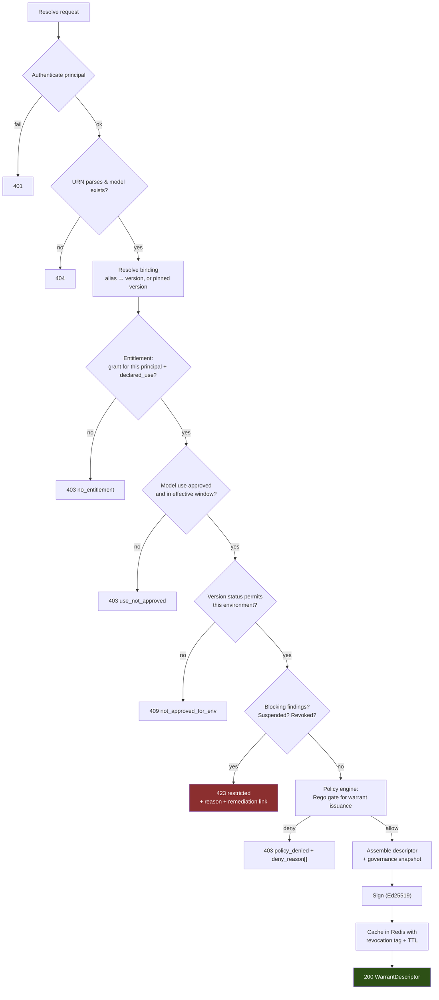
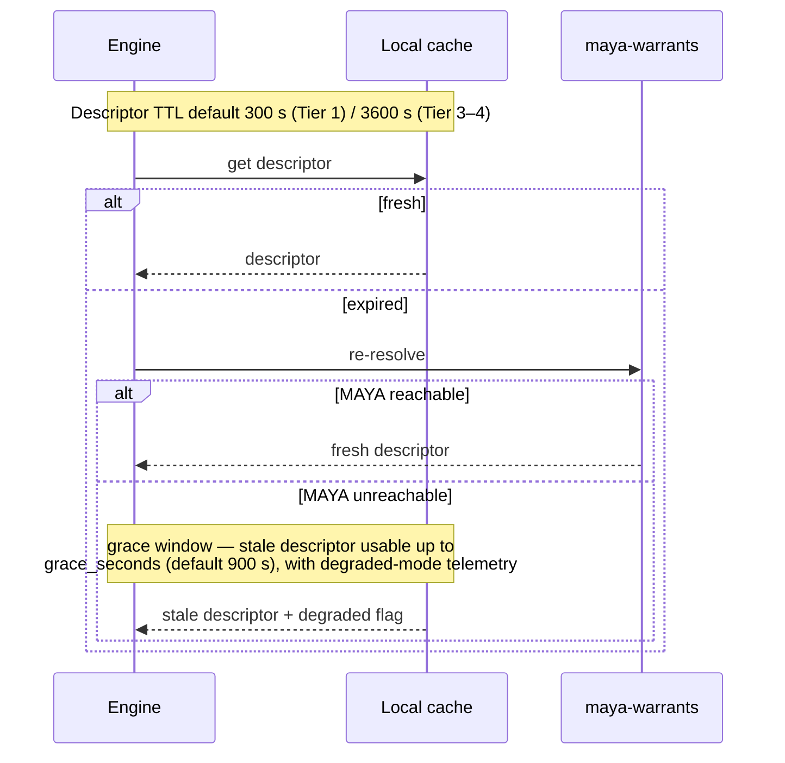
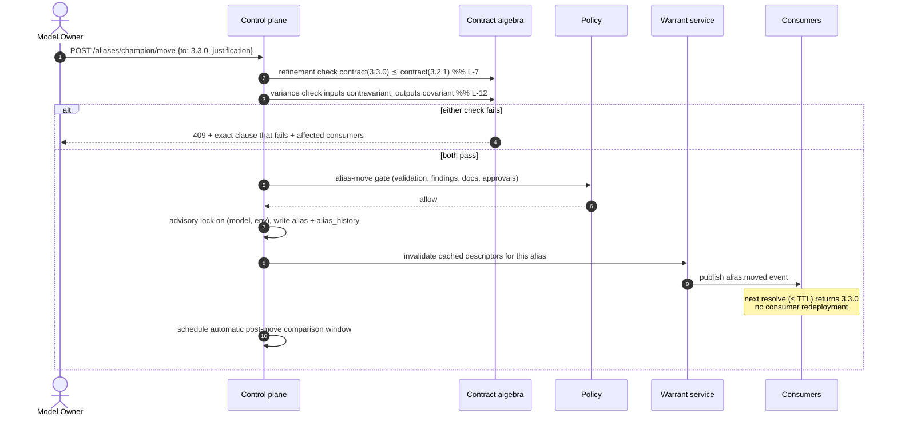

# 06 — Warrants and the Execution Contract

*MAYA — Model & AI Lifecycle Assurance.*  **Evidence, not assertion.**

**Annex to** [04 — Architecture](04-architecture.md).

> *"The system should be able to produce warrants on demand so an execution engine can run a model or its
> version at will."*
>
> This document specifies that mechanism. A **warrant** is not a URL. It is a **signed, policy-bound,
> expiring execution contract** — the operational realisation of the assume–guarantee contract of
> [00 §6.1](00-mathematical-foundations.md#61-assumeguarantee-contracts).

---

## 1. Design goals

| # | Goal | Consequence |
|---|---|---|
| G1 | An execution engine should hold **only a URN**, never a path, endpoint or version | Model changes never require redeploying consumers |
| G2 | Running a model must be **impossible** without a valid entitlement for an **approved use** | Governance is enforced at execution, not by policy documents |
| G3 | Every execution must be **attributable** to a model version, feature contract and caller | Reproducibility and approved-vs-actual-use reconciliation |
| G4 | A model must be **stoppable** in under a minute, globally | Kill switch for incidents and critical findings |
| G5 | MAYA being down must not stop **already-authorised** production scoring | `P9` — governance must not become a single point of failure for the bank |

> **G4 and G5 pull against each other**, and the naive reconciliation is wrong. See §6.1: revocation and
> staleness are handled by two *independent* mechanisms, so a network partition extends authorisation
> currency without extending revocation ignorance. This was finding **C-1** of the
> [adversarial review](11-adversarial-review.md).
| G6 | The contract must work for a **1 ms C++ pricer**, a **6-hour Spark batch**, and a **streaming LLM** | Flavours, not one protocol |
| G7 | Consumers must not be broken by governed version moves | Contract refinement + schema variance checks (`L-7`, `L-12`) |

---

## 2. The URN

```
maya://model/<domain>.<family>.<name>[@<semver>][#<alias>][?<qualifiers>]
```

| Form | Binding | Use when |
|---|---|---|
| `maya://model/credit.pd.smallbiz@3.2.1` | **Pinned version** — immutable forever | Regulatory reporting, SOX-relevant calculations, reproducing a historical decision, back-testing |
| `maya://model/credit.pd.smallbiz#champion` | **Alias** — follows governed moves | Ordinary production scoring |
| `maya://model/credit.pd.smallbiz#challenger` | Alias | Shadow evaluation |
| `maya://model/credit.pd.smallbiz@3.2.1?calibration=2026-09-02` | Pinned version + **calibration set** | T1 models where parameters change daily but the version does not |
| `maya://composite/markets.xva.desk_a#champion` | Composite (a DAG of models) | End-to-end chains — curve → pricer → XVA |

**Rule.** Anything feeding a regulatory submission or a financial-statement figure **must** pin. MAYA
enforces this: a `model_use` with `decision_authority = 'regulatory_submission'` cannot be granted an
alias-bound warrant.

---

## 3. Warrant flavours

One governance model, many delivery mechanisms. The flavour determines what the descriptor contains and
how the caller executes; it does **not** change the policy evaluation.

> **State, stated.** A `flavour` is a string on the grant record and defaults to `descriptor_only`.
> The eleven below are the *delivery* mechanisms this document plans for, and none of them has
> per-flavour behaviour in code today. The axis that *is* built and closed is **`realisation.runtime`**
> — seventeen values, each declaring the keys its `entry` block must carry (§3a). The two are not the
> same axis and the distinction matters: a flavour says how a caller receives a descriptor, a runtime
> says how the kernel becomes something an engine can invoke. Where this document later says "eleven
> flavours cover the estate", the sentence that is true today is the runtime one.

| Flavour | Delivered as | Executed by | Typical consumer |
|---|---|---|---|
| `rest_oip_v2` | HTTPS endpoint speaking **Open Inference Protocol v2** (KServe V2: `/v2/health`, `/v2/models/{n}`, `/v2/models/{n}/infer`) | MAYA-hosted or external runtime | Microservices, decision engines |
| `grpc_oip_v2` | gRPC endpoint, same protocol | as above | Low-latency internal callers |
| `python_sdk` | `maya.load("urn")` returning a callable with the feature contract bound | In-process in the caller | Notebooks, batch Python, Airflow |
| `jvm_sdk` | Java/Scala client | In-process | Spark, Kafka Streams, JVM trading systems |
| `batch_spark` | A job specification + a registered Spark/Databricks task | Spark cluster | Nightly scoring over Delta |
| `sql_udf` | A registered UDF in Databricks SQL / Snowflake / Postgres | Warehouse engine | Analysts scoring in SQL |
| `stream` | A Kafka Streams / Flink operator specification | Stream processor | Real-time fraud, surveillance |
| `container` | An OCI image digest that embeds the model and preprocessing | Any container runtime | Air-gapped or vendor-hosted environments |
| `descriptor_only` | The signed descriptor alone; the caller supplies its own runtime | Caller (e.g. a C++ pricing library) | Quant libraries, HPC grids, existing engines |
| `sheet` | An API key + Excel/Power Query connector | Business users | Controlled EUC replacement |
| `composite` | A DAG descriptor of member warrants | Orchestrator or MAYA | Model chains |

`descriptor_only` matters most in a bank: the majority of the estate already runs inside engines nobody
is going to replace.

> **Limitation, stated rather than implied.** For `descriptor_only`, MAYA governs **resolution**, not
> execution. A receiving engine can skip boundary checks, ignore the feature contract, cache the
> artifact indefinitely and never report telemetry. This was finding **C-6** of the
> [adversarial review](11-adversarial-review.md). Four controls narrow the gap; none closes it.

**Engine certification.** Every execution engine is a registered principal with a certification level,
and the level is an **input to model risk tiering** — an opaque engine raises the effective complexity
of every model it runs.

| Level | Meaning | Consequence |
|---|---|---|
| `attested` | Uses a MAYA SDK, verified build provenance, signs its telemetry | Full trust; telemetry admissible as evidence |
| `cooperating` | Custom integration, reports telemetry, unverified | Telemetry retained at reduced trust, which the evidence semiring propagates automatically |
| `opaque` | Resolves only; no telemetry | Tier 1 consumer-impacting models may not be granted an `opaque` warrant without a dated, approved migration plan |

**Liveness as a control.** A principal that resolves but never reports is an exception, raised as a
finding. Silence is evidence.

---

## 3a. The four axes, and why the grammar is their product

A warrant is not a document type per model kind. Every model a bank runs — a Black–Scholes closed
form, a Hull–White calibration, a gradient-boosted PD model, a prompt bundle, an agent, a credit
rulebook, a spreadsheet, a vendor black box — differs along exactly **four independent axes**, and the
grammar is their *product*:

| Axis | Field | Values |
|---|---|---|
| **1 · How `P` is inhabited** | `parameters.kind` | `none` · `calibration_set` · `estimated_coefficients` · `learned_weights` · `llm_configuration` · `rule_set` · `elicited_weights` · `opaque` — **eight** |
| **2 · How the kernel is realised** | `realisation.runtime` | `python.callable` · `container` · `rest` · `onnx` · `pmml` · `pfa` · **`quantlib`** · `solver` · `sas` · `r` · `matlab` · `sql` · `spreadsheet` · `rules` · `llm.prompt` · `llm.agent` · `descriptor_only` — **seventeen** |
| **3 · What is asked of it** | `operation.verb` | `score` · `fit` · `validate` · `backtest` · `explain` · `simulate` · `stress` · `optimise` · `generate` · `monitor` — **ten** |
| **4 · Where its data comes from** | `data.inputs[].binding` | `inline` · `request` · `feature_namespace` · **`featureset`** · `dataset_snapshot` · `delta_table` · `sql_query` · `stream` · `market_data` · `document_corpus` · `scenario_set` · `artifact` — **twelve** |

A fifth, smaller vocabulary says where a run's parameters come from — `parameters.source.binding` is
one of `artifact` · `parameter_set` · `declared` · `to_be_fitted` · `vendor_internal` — and it is
closed and checked, so a run cannot decline to say which point in `P` it is running at.

QuantLib pricing is `(none, quantlib, score, market_data)`. A Hull–White calibration is *the same
library and the same runtime* at `(calibration_set, quantlib, fit, market_data)`. An XGBoost PD model
is `(learned_weights, onnx, score, feature_namespace)`. One structure, different coordinates — and
that is the argument: *"is it AI?"* puts the first two in one bucket, while *"how is `P` inhabited?"*
separates them correctly, which is what makes the evidence expectations right for each.

It extends the right way. A model technology nobody anticipated is a **new value in one vocabulary**,
almost always a runtime — not a new section, not a new document type, and not a change to anything
that already works.

### The QuantLib runtime

Most of what a bank runs is not a learned model but a valuation, and those have no parameter object to
fit — which is what T0 means, and why `L-W1` refuses to warrant one for fitting. They have something
the learned ones do not: an as-of date that changes the answer. So the captive QuantLib runtime
**takes the evaluation date from the warrant and never from the clock**, because a valuation that
reads today is not reproducible tomorrow and a backtest of it is a backtest of nothing; and it
**builds the curve from what the warrant carries and nothing else**, because reaching for a market
data service would put an unversioned input into a governed computation.

Six instruments are priced for real: discount factor, zero rate, forward rate, fixed-rate bond,
vanilla swap, European swaption. A missing past fixing, an unknown day count, an instrument or a
pricing engine it does not build — each is refused **by name** rather than substituted, because a day
count silently swapped moves every cash flow and an engine silently swapped produces a number nobody
can reconcile.

It is **not sandboxed**, and the reason is stated rather than left implicit: it loads no artifact, so
there is nothing untrusted to isolate from. Writing it surfaced a real hazard worth recording, because
it is the kind that survives a code review — QuantLib keeps fixing history in a **process-global**
manager, so one warrant's fixing would still be present for the next valuation. Each valuation now
starts from an empty history and sees only what its own warrant carries.

---

## 4. The Warrant Descriptor

**Ten sections, each answering exactly one question.** The list is closed and checked: a document
missing any of them fails `L-W0` before anything else is looked at.

| Section | The question it answers |
|---|---|
| `subject` | which model and version this is about |
| `operation` | what is being asked of it |
| `parameters` | where the parameter object comes from |
| `realisation` | how to obtain and invoke the artifact |
| `data` | where the inputs come from and where the outputs go |
| `io_contract` | the input and output schemas |
| `constraints` | the operating boundary and the resource limits |
| `authority` | who may do this, for what, until when |
| `governance` | the state of the record at the moment of issue |
| `signature` | integrity |

```jsonc
{
  "maya_warrant": "1.0",
  "warrant_id":   "wrt_01a06d3f8b21",
  "issued_at":    1767225600.0,

  "subject": {
    "urn":               "maya://model/credit.pd.smallbiz#champion",
    "model_urn":         "maya://model/credit.pd.smallbiz",
    "version":           "3.2.1",
    "version_id":        "01a06d1c4472",
    "manifest_digest":   "sha256:4e1b…",
    "binding_kind":      "alias",              // alias | version
    "model_class":       "credit.pd.scorecard",
    "trainability_class": "T3",                // DERIVED, never declared
    "tier":              1
  },

  "operation": {
    "verb":         "score",                   // one of ten
    "determinism":  "deterministic",
    "seed":         null,                      // L-W5: required if a stochastic runtime claims determinism
    "mode":         "batch"
  },

  "parameters": {                              // L-W8: every run says which point in P it runs at
    "kind":   "learned_weights",
    "source": {"binding": "artifact"},         // artifact | parameter_set | declared |
    "digest": "sha256:9f2c…",                  //   to_be_fitted | vendor_internal
    "mutable": false
  },

  "realisation": {
    "runtime": "onnx",                         // one of seventeen; declares its own entry keys
    "entry":   {"graph": "model.onnx"},
    "artifact": {"uri": "…/sha256/9f2c…", "digest": "sha256:9f2c…", "format": "onnx"},
    "environment": {}
  },

  "data": {
    "inputs":  [{"name": "features", "binding": "feature_namespace",
                 "namespace": "features/customer/sb_financials/v7"}],
    "outputs": [{"name": "prediction", "sink": "response"}]
  },

  "io_contract": {
    "input_schema":  {"fields": [{"name": "dscr", "dtype": "numeric"},
                                 {"name": "years_in_business", "dtype": "numeric"}]},
    "output_schema": {"fields": [{"name": "pd_12m", "dtype": "numeric"}]}
  },

  "constraints": {                             // A — the contract's assumptions, machine-checked
    "operating_boundary": {"dscr": {"min": -5.0, "max": 20.0}},
    "on_boundary_violation": "reject",         // reject | flag_and_score | flag_and_refer
    "resources": {"max_seconds": 30, "max_memory_mb": 2048}   // read by the sandbox
  },

  "authority": {
    "principal":     "svc/loan-origination-prod",
    "declared_use":  "origination_decision",
    "environment":   "prod",
    "granted_at":    1767225600.0,
    "expires_at":    1767225660.0,             // TTL, jittered — see §6
    "grace_seconds": 0,
    "revocation":    {"epoch": 4471, "check": "required"}
  },

  "governance": {                              // why this is allowed to run, right now
    "tier": 1, "model_status": "active", "version_status": "approved"
  },

  "signature": {
    "alg":    "HMAC-SHA256",
    "key_id": "maya-warrant-signing-2026-09",
    "value":  "d41f8a0c7e93b256…"
  }
}
```

Three things about this document are worth stating rather than leaving to be inferred.

**The signature block is excluded whole from what is signed**, rather than blanked. A warrant signed
before the block existed and one signed after therefore produce the same digest over the same content,
which is what stops a signature that verifies in one place and fails in another.

**`alg` is `HMAC-SHA256`, and that is what ships.** Ed25519 with a 90-day overlapping key set is the
production target and appears in §11 as such. The distinction matters to a deployer: HMAC is a shared
secret, so a descriptor's authenticity can be *verified* only by a party that could also have
*minted* it. Asymmetric signing is what makes client-side verification meaningful, and until it lands,
§5.3 step 1 is a check an engine performs against a key it must be trusted with.

**Resources are read by the sandbox.** `constraints.resources.max_seconds` and `max_memory_mb` become
`RLIMIT_CPU` and `RLIMIT_AS` on the child process that loads an artifact-backed runtime — the memory
budget added to the interpreter's own footprint, and the runtime's dependencies imported *before* the
limit is applied, so a library's import cost is never charged to the model's budget.

---

## 5. Resolution protocol

### 5.1 Request

```http
POST /v1/resolve HTTP/1.1
Authorization: Bearer <workload-identity-token>
Content-Type: application/json

{
  "urn": "maya://model/credit.pd.smallbiz#champion",
  "environment": "prod",
  "declared_use": {"purpose": "origination_decision", "portfolio": "SB Term Loan",
                   "legal_entity": "LE-US-01"},
  "flavour": "rest_oip_v2",
  "client": {"sdk": "maya-python/1.4.0", "engine": "loan-origination/2026.8"}
}
```

### 5.2 Evaluation pipeline



Every denial returns a machine-readable reason **and** a human-actionable next step:

```json
{
  "error": "restricted",
  "reason_code": "blocking_finding_open",
  "detail": "Critical finding FND-4821 (fairness: AIR 0.74 on age_62plus) is open.",
  "remediation_url": "https://maya.bank.internal/findings/FND-4821",
  "break_glass": {"available": true, "requires": "dual_authorisation",
                  "url": "https://maya.bank.internal/breakglass/new?warrant=…"}
}
```

### 5.3 Client-side verification (mandatory)

Every MAYA SDK performs, before executing:

1. **Signature verification** against the pinned MAYA public key set.
2. **Expiry check** — `expires_at > now`, with clock-skew tolerance.
3. **Artifact digest verification** after fetch — refuse to load on mismatch.
4. **Declared-use conformance** — the caller's actual context must match `authorization.declared_use`.
5. **Feature contract conformance** — every required feature present, correct dtype, online store within its freshness SLA.
6. **Boundary check** — evaluate `constraints.operating_boundaries` and apply `on_boundary_violation`.

Steps 3–6 are the runtime enforcement of `input ⊨ A`. When they fail, the model's guarantee `G` is
formally void, and MAYA records a boundary violation rather than a silent bad score.

---

## 6. Lifetime, caching and the kill switch

### 6.1 Why TTLs



Three timers, tuned per tier:

| Timer | Default (Tier 1) | Default (Tier 3–4) | Meaning |
|---|---|---|---|
| `ttl_seconds` | **60** | 3600 | How long a descriptor is authoritative |
| `grace_seconds` | **0** | 900 | How long a stale descriptor may be used if MAYA is unreachable (`G5`) |
| `revocation_poll` | 30 | 300 | How often a long-running engine re-checks the revocation epoch |

**Grace is an opt-in concession, not a default.** For Tier 1 it is zero unless a consumer can evidence
that failing stale is *less* dangerous than failing closed — real-time payment authorisation is the
canonical case. Such grants are per-warrant, expiring, and reported as a KRI, so the population of
consumers running with a grace window is always visible rather than assumed away.

#### The revocation floor

Grace must never become a window in which a known-revoked model keeps deciding. The two concerns are
therefore decoupled:

1. Every SDK maintains a **locally persisted revocation list**, refreshed on every successful
   resolution, on every telemetry acknowledgement, and from the event stream.
2. A descriptor whose id, version or model appears on that list is **refused regardless of grace
   state**. Grace extends *authorisation currency*; it never extends *revocation ignorance*.
3. Every MAYA response of any kind carries the current revocation epoch, so an engine still reaching
   *any* MAYA endpoint learns of a revocation even when resolution itself is failing.

**Residual risk, stated plainly.** A fully partitioned engine holding a pre-partition descriptor for a
model revoked *during* the partition will continue for at most `ttl + grace` — 60 seconds at Tier 1
defaults. That is the honest worst case, and it is a design parameter rather than an accident.

A batch job that runs for six hours resolves once and pins for the job's duration — MAYA records the
pinned version so the run is reproducible even though the alias may have moved mid-job.

### 6.2 Kill switch

```http
POST /v1/warrants/{warrant_id}/revoke
{"reason": "critical_finding", "scope": "all_grants", "urgency": "immediate"}
```

Propagation, fastest to slowest:

1. **Immediate** — a `revocation` event is published on Kafka; SDKs subscribed to the stream drop the descriptor within ~1 s.
2. **Epoch bump** — the global `revocation.epoch` increments; any engine polling (default 30 s) sees the change and re-resolves.
3. **TTL expiry** — worst case, the descriptor dies at `expires_at` (≤ 300 s for Tier 1).

Revocation scopes: a single grant · all grants on a warrant · all warrants for a version · all warrants for a
model · all warrants for a vendor (used when a vendor discloses a defect) · **estate-wide** (dual-authorised,
for a systemic event such as a bad market-data feed).

### 6.3 Degraded mode is a first-class state

An engine operating on a stale descriptor sets `degraded=true` in telemetry. MAYA surfaces degraded
execution volume on the operations dashboard and raises an alert if it exceeds a threshold or persists.
Governance never silently disappears; it becomes visibly degraded.

---

## 7. Alias moves — the governed version switch

Moving `champion` from 3.2.1 to 3.3.0 is the single most dangerous operation in the platform. It is
gated by proof obligations, not judgement.



The **automatic post-move comparison** runs for a configurable window (default 7 days), comparing the new
champion's output distribution and monitored metrics against the previous champion's on overlapping
traffic. Material divergence beyond the declared tolerance triggers an automatic rollback proposal —
this is the **parallel outcomes analysis** required by SS1/23 3.3(c), performed as infrastructure rather
than as a project.

---

## 8. Composite warrants

A composite warrant exposes a **DAG of models as one callable unit** — the composed morphism of
[00 §5.1](00-mathematical-foundations.md#51-the-feeder-graph-is-a-string-diagram).

```yaml
apiVersion: maya.dev/v1
kind: CompositeWarrant
metadata:
  urn: "maya://composite/markets.xva.desk_a"
spec:
  nodes:
    - id: curve   ; urn: "maya://model/markets.curve.usd_ois#champion"
    - id: vol     ; urn: "maya://model/markets.vol.usd_swaption_sabr#champion"
    - id: pricer  ; urn: "maya://model/markets.pricing.swaption_hw#champion"
    - id: xva     ; urn: "maya://model/markets.xva.cva_engine#champion"
  edges:
    - {from: curve,  to: pricer, port: discount_curve}
    - {from: vol,    to: pricer, port: vol_surface}
    - {from: curve,  to: xva,    port: discount_curve}
    - {from: pricer, to: xva,    port: mtm}
  inputs:  [trade_portfolio, valuation_date, counterparty]
  outputs: [cva, dva, fva, exposure_profile]
```

MAYA:
- **type-checks the wiring** using the schema lattice (a port mismatch is refused at definition time);
- **composes the contracts** — the composite's assumptions are the union of member assumptions not
  discharged internally; its guarantees are derived by contract composition;
- **computes composite risk** as the lax monoidal join (`L-14`), so the composite's tier reflects the
  interaction premium, not just the maximum member tier;
- **resolves atomically** — all members resolve at one instant, so the composite result is attributable
  to one consistent set of versions;
- **fails closed as a unit** — revoking any member revokes the composite.

This is what makes an XVA desk's full valuation chain a governed object rather than four separately
governed objects and an undocumented script.

---

## 9. Serving surfaces

### 9.1 MAYA-hosted (Open Inference Protocol v2)

For teams without their own runtime, MAYA hosts the model in a sandboxed serving pod that speaks OIP v2,
so any KServe-compatible client works unchanged:

```
GET  /v2/health/ready
GET  /v2/models/{model_name}
GET  /v2/models/{model_name}/versions/{version}
POST /v2/models/{model_name}/infer
POST /v2/models/{model_name}/versions/{version}/infer
```

MAYA adds governance headers on every response:

```
X-Maya-Model-Urn:        maya://model/credit.pd.smallbiz
X-Maya-Model-Version:    3.2.1
X-Maya-Feature-Contract: sha256:c701…
X-Maya-Boundary-Ok:      true
X-Maya-Descriptor-Id:    hd_01J8XQ…
```

Those headers propagate into the caller's own logs, so a downstream incident can be traced to an exact
governed version without consulting MAYA.

### 9.2 Python SDK

```python
import maya

# Alias-bound: follows governed champion moves automatically
model = maya.load(
    "maya://model/credit.pd.smallbiz#champion",
    use="origination_decision",
    entity="LE-US-01",
)

result = model.predict({
    "customer_id": "C-88213",
    "request_amount": 250_000,
})

result.prediction        # {'pd_12m': 0.0187, 'score': 712}
result.model_version     # '3.2.1'
result.boundary_ok       # True
result.explanation       # SHAP contributions, reason codes
result.reason_codes      # ['DSCR_LOW', 'THIN_FILE']  → Reg B adverse action
result.descriptor_id     # 'hd_01J8XQ…'

# Pinned, for reproducing a historical decision exactly
historic = maya.load("maya://model/credit.pd.smallbiz@3.1.0?calibration=2026-03-31")
```

The SDK fetches features from the online store per the contract, checks boundaries, emits telemetry, and
verifies signatures — none of which the caller has to remember to do. **The compliant path is the
shortest path** (`P4`).

### 9.3 SQL UDF

```sql
SELECT
    account_id,
    maya_predict('maya://model/credit.pd.smallbiz#champion',
                 struct(years_in_business, dscr, industry_sic)) AS pd_result
FROM analytics.sb_portfolio;
```

The UDF resolves once per query, pins for the query's duration, and writes telemetry — so an analyst
scoring in SQL is as governed as a production service.

### 9.4 Batch

```python
maya.batch_score(
    urn="maya://model/credit.pd.smallbiz#champion",
    input_table="maya_lake.portfolio.sb_accounts",
    output_table="maya_lake.scores.sb_pd_20260903",
    as_of="2026-09-03",                 # PIT-correct feature retrieval at this instant
    use="portfolio_monitoring",
)
```

`as_of` is not cosmetic: it drives the bitemporal feature lookup of
[00 §11.1](00-mathematical-foundations.md#111-bitemporality-and-the-point-in-time-correctness-theorem),
so a re-run six months later reproduces the original scores exactly.

---

## 10. Telemetry and approved-vs-actual-use reconciliation

Telemetry is what turns SS1/23's "intended use **compared to** actual use" from an aspiration into a
report.

```http
POST /v1/telemetry
{
  "descriptor_id": "hd_01J8XQ…",
  "window": {"from": "2026-09-03T08:00:00Z", "to": "2026-09-03T08:00:30Z"},
  "invocations": 14203,
  "latency_ms": {"p50": 6, "p95": 14, "p99": 22},
  "boundary_violations": 37,
  "errors": 2,
  "degraded": false,
  "context_distribution": {
    "portfolio": {"SB Term Loan": 13980, "SB Line of Credit": 223},
    "geography": {"US": 14203},
    "channel":   {"digital": 9100, "branch": 5103}
  },
  "samples": [ /* sampled full records per tier policy → inference_log */ ]
}
```

A nightly job compares the observed distribution against the approved `model_use` set and raises
exceptions:

| Exception | Example |
|---|---|
| **Off-label portfolio** | 223 calls for "SB Line of Credit", which is not an approved use |
| **Unapproved geography** | Calls originating in a jurisdiction outside the approval |
| **Volume anomaly** | 40× the expected daily volume — suggests a new, unassessed use |
| **Boundary violation rate** | 0.26% of inputs outside operating boundaries — assumption `A` failing |
| **Dormant approval** | An approved use with zero calls for 180 days — candidate for withdrawal |
| **Undeclared consumer** | A new principal resolving the warrant |

Each becomes a finding with an owner and a due date. This capability exists in no product surveyed in
[01 §5](01-industry-research.md), and it is the difference between an inventory that describes intentions
and one that describes reality.

---

## 11. Security model

| Control | Implementation |
|---|---|
| Authentication | Workload identity (SPIFFE/Kubernetes SA tokens, or mTLS client certs); no long-lived shared secrets |
| Authorisation | Grant = (principal, warrant, approved use); ABAC on entity/geography |
| Integrity | **Target:** Ed25519 descriptor signatures, key rotation every 90 days with an overlapping key set, SDKs pinning the key set. **As built:** HMAC-SHA256 over the canonical form with the signature block excluded — adequate for integrity against a party that holds no key, and *not* adequate for third-party verification, because a shared secret cannot distinguish a verifier from a minter. Asymmetric signing is the one change this section is waiting on |
| Artifact integrity | Content-addressed fetch; digest verified after download; cosign signature verified for Tier 1 |
| Confidentiality | TLS 1.3 everywhere; descriptors contain no secrets, only references resolved via the caller's own credentials |
| Replay resistance | Descriptors are short-lived and bound to principal + environment |
| Least privilege | The descriptor grants exactly one use in one environment |
| Auditability | Every resolution and revocation is written to the append-only audit log |
| Anti-exfiltration | Rate limits and daily quotas per grant; anomaly detection on resolution patterns (bulk model extraction is detectable) |

---

## 12. Failure semantics

| Situation | Behaviour | Rationale |
|---|---|---|
| MAYA unreachable, descriptor fresh | Execute normally | Governance already granted |
| MAYA unreachable, descriptor within grace | Execute, flag `degraded`, alert | Availability over strictness for already-approved work (`G5`) |
| MAYA unreachable, past grace | **Fail closed** | Ungoverned execution is not a fallback |
| Revoked | Fail closed, with reason and break-glass link | `G4` |
| Feature online store stale beyond SLA | Fail closed by default; `serve_stale` is an explicit, per-warrant, expiring opt-in | Stale features are silent model failure |
| Input outside operating boundaries | Per `on_boundary_violation`: reject, or score with a flag, or refer to human | The contract's assumption is violated; the guarantee no longer holds |
| Artifact digest mismatch | **Fail closed**, raise a security incident | Possible tampering |
| Signature verification failure | **Fail closed**, raise a security incident | Possible forged descriptor |
| Quota or budget exhausted | Fail closed with `429` and a clear message | Cost control, especially for T5 |

---

## 13. Featuresets, and naming the point in P

Two additions, specified in [15](15-featuresets-and-parameters.md).

**`data.inputs[].binding: featureset`** names a versioned presentation of `X`
rather than enumerating namespaces. It joins `feature_namespace` and
`dataset_snapshot` as a bitemporal binding, so **L-W3** admits training from it,
and **L-W9** requires a fit reading one to bound both clocks — an `as_of` and a
`from`/`to` window. The featureset fixes the columns; the warrant fixes the
period, which is what lets one set serve *train on 2019–2023* and *train on
2020–2024* without becoming two sets. `as_of` is deliberately **not** required
for a `score`: reading a featureset at whatever is current is legitimate when
serving, and is not when training.

**`parameters.source.binding`** becomes a closed vocabulary — `artifact` ·
`parameter_set` · `declared` · `to_be_fitted` · `vendor_internal` — checked by
**L-W8**. Every run must say which point in `P` it is running at, because
training does not change the kernel and a run that will not name its inhabitant
produces a number attributable to nothing. A `fit` binds `to_be_fitted` and
nothing else; it *writes* the parameter object, so declaring that it reads one
describes the wrong direction.

That law found a real error in `examples/warrants/02-quantlib-hullwhite-calibrate`,
which claimed its calibration set came from an artifact while its verb produced
it.

**A third law is checked at issuance rather than in the grammar.** **L-W10** asks
whether the featureset a warrant names actually provides what the kernel declares
it reads. That is contravariance in inputs — the same variance rule (**L-12**)
that gates an alias move, applied one level out — and it is refused as
`schema_not_satisfied` with the missing slots named. It cannot live in the
grammar, because the grammar validates a document in isolation and this question
needs the register: it compares a featureset version's resolved slots against a
model version's input schema, and neither is in the document being validated.

### The full admissibility set

| Law | Refuses | Checked |
|---|---|---|
| `L-W0` | A malformed document — a missing section, an unknown verb, a runtime without its entry keys | grammar |
| `L-W1` | `fit` on T0 or T6 | grammar |
| `L-W2` | `generate` on a non-generative runtime | grammar |
| `L-W3` | Training from a binding that cannot be read as-of | grammar |
| `L-W4` | A `fit` with no `parameter_object` sink | grammar |
| `L-W5` | Claimed determinism from a stochastic runtime with no seed | grammar |
| `L-W6` | `fit` on a `descriptor_only` model | grammar |
| `L-W7` | A backtest with no outcomes | grammar |
| `L-W8` | A run that will not name its point in `P` | grammar |
| `L-W9` | A featureset read for training, unbounded in either clock | grammar |
| `L-W10` | A featureset that does not provide what the kernel reads | warrant issuance |
| `L-W11` | A calibrated parameter object that does not say what it was calibrated as of | grammar |
| `L-W12` | Parameters bound to an artifact, with no artifact digest | grammar |
| `L-W13` | A generative runtime naming a model family but no build | grammar |

Every one is checked **before** the warrant is signed. A signature over a
non-conforming document would assure that it is authentic and not that it is
usable, and an engine would reasonably read it as both.

---

Copyright © 2026 Ashutosh Sinha <ajsinha@gmail.com>. All rights reserved.
Proprietary and confidential. See [LICENSE](../LICENSE) and [NOTICE](../NOTICE).
*Not legal, regulatory or financial advice — see NOTICE §4.*
