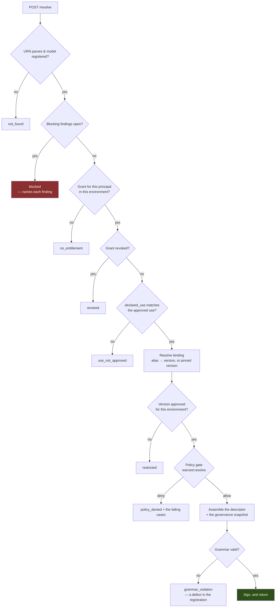
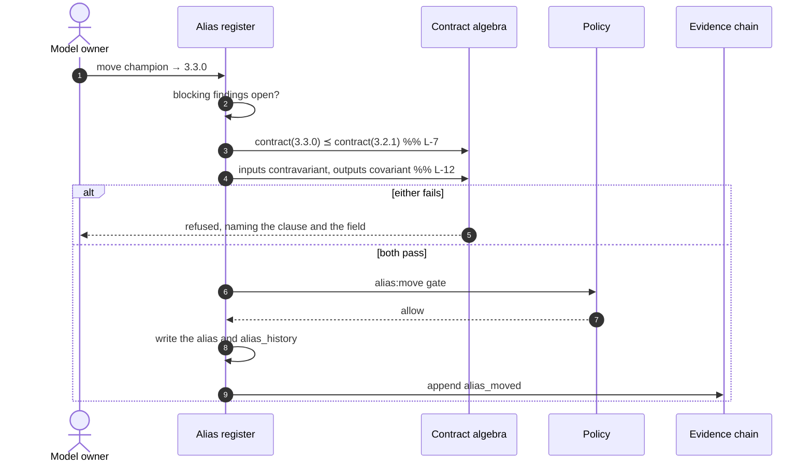

# 06 — Warrants and the Execution Contract

*MAYA — Model & AI Lifecycle Assurance.*  **Evidence, not assertion.**

**Annex to** [04 — Architecture](04-architecture.md).

---

## 1. MAYA does not run models

It authorises them, and a **warrant** is the whole of that authorisation: a signed, expiring,
entitlement-bound document that says which version, at which point of `P`, for whose benefit, under
what boundary, until when. An execution engine reads it and acts. MAYA never sees the inputs, never
holds the outputs, and is not on the path between a caller and a score.

That boundary is the reason the platform is usable in a bank at all. Most of the estate already runs
inside engines nobody is going to replace — a C++ pricing library, a Spark job, a vendor appliance,
a spreadsheet — and a governance system that insisted on being the runtime would govern the fraction
of the estate willing to move. It also means governance cannot become an outage: a warrant already
in a caller's hands keeps working while MAYA is down, which is the whole of `P9`.

Three things follow, and each is a refusal somewhere later in this document.

**A consumer holds a URN, never a version.** Everything else resolves at the moment of use, against
the policy in force at that moment. A governed version move therefore requires no consumer to
redeploy — and an open blocking finding stops resolution, so a validation finding actually stops the
model rather than generating an email.

**The document does not fork by kind of model.** There is one grammar over the whole estate, and a
Hull–White calibration differs from a gradient-boosted PD model in its *coordinates*, not in its
shape. Fourteen admissibility laws then refuse the combinations that are incoherent. §3 and §5 are
the argument for that, because it is the design decision most often questioned.

**The signature comes last.** Everything checkable is checked before the document is signed, because
a signature over a non-conforming warrant asserts that it is authentic and not that it is usable,
and an engine would reasonably read it as both.

### The tension that had to be resolved rather than balanced

A model must be stoppable everywhere in under a minute. MAYA being unreachable must not stop
already-authorised production scoring. The naive reconciliation — a grace window on the descriptor —
gives you a window in which a *known-revoked* model keeps deciding, which is exactly the failure the
kill switch exists to prevent. This was finding **C-1** of the
[adversarial review](11-adversarial-review.md), and the resolution is that the two concerns are
carried by two independent mechanisms: **grace extends authorisation currency and never extends
revocation ignorance.** §8 says how much of that is built, and how much is not.

---

## 2. The URN

```
maya://model/<domain>.<family>.<name>[@<semver>][#<alias>]
```

| Form | Binding | Use when |
|---|---|---|
| `maya://model/credit.pd.smallbiz#champion` | **alias** — follows governed moves | ordinary production scoring |
| `maya://model/credit.pd.smallbiz#challenger` | alias | shadow evaluation |
| `maya://model/credit.pd.smallbiz@3.2.1` | **pinned version** — immutable forever | reproducing a historical decision, back-testing, anything feeding a regulatory submission |

Pinning is not a style preference. An alias is a stable identifier over moving contents — finding
**C-2** — and that is precisely the right thing for production scoring and precisely the wrong thing
for a figure somebody will be asked to reproduce in two years. An earlier draft of this document
said MAYA *enforces* pinning for regulatory submissions, by refusing an alias-bound warrant to a use
whose decision authority is a submission. **It does not.** There is no `decision_authority` on a
use, so that rule is a convention here and would have to become a policy gate to be one anywhere
else.

**A URN pins a version or names an alias, never both**, and `build_urn` refuses the pair. Two
bindings for one subject would leave a reader deciding which one won.

A calibration qualifier (`?calibration=2026-09-02`) appears in earlier drafts and is **not** parsed:
`parse_urn` reads a name, an optional `@semver` and an optional `#alias`, and nothing else. The
point of `P` a run executes at is carried by the `parameters` section of the descriptor instead,
which is where `L-W8` can see it. `maya://composite/…` is likewise refused — the prefix is
`maya://model/` and nothing else resolves.

---

## 3. One document, four axes

A warrant is not a document type per model kind. Every model a bank runs — a Black–Scholes closed
form, a Hull–White calibration, a gradient-boosted PD model, a prompt bundle, an agent, a credit
rulebook, a spreadsheet, a vendor black box — differs along four independent axes, and the grammar
is their **product**.

| Axis | Field | Values |
|---|---|---|
| **1 · how `P` is inhabited** | `parameters.kind` | `none` · `calibration_set` · `estimated_coefficients` · `learned_weights` · `llm_configuration` · `rule_set` · `elicited_weights` · `opaque` — **eight** |
| **2 · how the kernel is realised** | `realisation.runtime` | `python.callable` · `container` · `rest` · `onnx` · `pmml` · `pfa` · `quantlib` · **`estimator`** · `solver` · `sas` · `r` · `matlab` · `sql` · `spreadsheet` · `rules` · `llm.prompt` · `llm.agent` · `descriptor_only` — **nineteen runtimes** |
| **3 · what is asked of it** | `operation.verb` | `score` · `fit` · `validate` · `backtest` · `explain` · `simulate` · `stress` · `optimise` · `generate` · `monitor` — **ten** |
| **4 · where its data comes from** | `data.inputs[].binding` | `inline` · `request` · `feature_namespace` · `featureset` · `dataset_snapshot` · `delta_table` · `sql_query` · `stream` · `market_data` · `document_corpus` · `scenario_set` · `artifact` — **twelve** |

Each runtime declares the keys its `entry` block must carry — `onnx` needs a `graph`, `spreadsheet`
needs a workbook, a sheet and the input and output cells, `llm.agent` needs a provider, a base
model, a graph and a step ceiling — so an engine that understands the runtime needs nothing further
to locate and call the thing. `descriptor_only` declares none, and that is its meaning: MAYA carries
the governance and cannot locate an artifact.

A fifth, smaller vocabulary says where a run's parameters come from. `parameters.source.binding` is
one of `artifact` · `parameter_set` · `declared` · `to_be_fitted` · `vendor_internal`, and it is
closed and checked, so a run cannot decline to say which point of `P` it is running at.

QuantLib pricing is `(none, quantlib, score, market_data)`. A Hull–White calibration is *the same
library and the same runtime* at `(calibration_set, quantlib, fit, market_data)`. An XGBoost PD
model is `(learned_weights, onnx, score, feature_namespace)`. One structure, different coordinates —
and that is the argument. *"Is it AI?"* puts the first two in one bucket and separates the second
from the third; *"how is `P` inhabited?"* separates the first two and is the question the evidence
expectations actually depend on.

That is a statement about the **grammar**, and the grammar is what governs. Whether any particular
engine can execute a given coordinate is a separate question, answered in §10 — the captive engine
prices and does not calibrate, so the Hull–White warrant is admissible and would be refused by name
at execution.

It extends in the right direction. A model technology nobody anticipated is a **new value in one
vocabulary**, almost always a runtime: not a new section, not a new document type, and not a change
to anything that already works.

### Why the document is not templated by kind of model

The ask recurs, and it is half right in a way worth being precise about, because the wrong half is
expensive.

If a T4 warrant had a different *shape* from a T3 warrant, every engine, replay path and audit query
would have to branch on model type before it could read anything, and the branch would grow a case
per model family forever. One grammar over the whole estate with no special case is the property the
rest of the design rests on.

And the content already differs, derivably. The parameter kind, the admissible verbs, the artifact
block, the determinism claim, the required data bindings — each is computed from a fact about the
kernel rather than declared by somebody. Nothing needs a template for any of it.

What *is* genuinely tedious is the **request**, and that is what a profile fills in (§6).

---

## 4. The descriptor: ten sections, one question each

The list is closed. A document missing any of them fails `L-W0` before anything else is looked at.

| Section | The question it answers |
|---|---|
| `subject` | which model and version this is about |
| `operation` | what is being asked of it |
| `parameters` | where the parameter object comes from |
| `realisation` | how to obtain and invoke the artifact |
| `data` | where the inputs come from and where the outputs go |
| `io_contract` | the input and output schemas |
| `constraints` | the operating boundary and the resource limits |
| `authority` | who may do this, for what, until when |
| `governance` | the state of the record at the moment of issue |
| `signature` | integrity |

```jsonc
{
  "maya_warrant": "1.0",
  "warrant_id":   "wrt_01a06d3f8b21",
  "issued_at":    1767225600.0,

  "subject": {
    "urn":                "maya://model/credit.pd.smallbiz#champion",
    "model_urn":          "maya://model/credit.pd.smallbiz",
    "version":            "3.2.1",
    "version_id":         "01a06d1c4472",
    "manifest_digest":    "sha256:4e1b…",
    "binding_kind":       "alias",            // alias | version
    "trainability_class": "T3"                // DERIVED from the kernel, never declared
  },

  "operation": {
    "verb":        "score",                   // one of ten
    "determinism": "deterministic",
    "seed":        null,                      // L-W5: required if a claim of determinism cannot be checked
    "mode":        "batch"
  },

  "parameters": {                             // L-W8: every run says which point of P it runs at
    "kind":    "learned_weights",
    "source":  {"binding": "artifact"},       // artifact | parameter_set | declared |
    "digest":  "sha256:9f2c…",                //   to_be_fitted | vendor_internal
    "mutable": false
  },

  "realisation": {
    "runtime": "onnx",                        // one of eighteen; declares its own entry keys
    "entry":   {"graph": "model.onnx"},
    "artifact": {"uri": "…/sha256/9f2c…", "digest": "sha256:9f2c…", "format": "onnx",
                 "held_by_maya": true, "executes_on_load": false},
    "environment": {}
  },

  "data": {
    "inputs":  [{"name": "features", "binding": "feature_namespace",
                 "namespace": "features/customer/sb_financials/v7"}],
    "outputs": [{"name": "prediction", "sink": "response"}]
  },

  "io_contract": {
    "input_schema":  [{"name": "dscr", "dtype": "numeric"},
                      {"name": "years_in_business", "dtype": "numeric"}],
    "output_schema": [{"name": "pd_12m", "dtype": "numeric"}]
  },

  "constraints": {                            // A — the contract's assumptions, machine-checked
    "operating_boundary": {"dscr": {"min": -5.0, "max": 20.0}},
    "on_boundary_violation": "reject",        // reject | flag_and_score | flag_and_refer
    "resources": {"max_seconds": 30}          // read by the sandbox
  },

  "authority": {
    "principal":     "svc/loan-origination-prod",
    "declared_use":  "origination_decision",
    "environment":   "prod",
    "granted_at":    1767225600.0,
    "expires_at":    1767225660.0,            // TTL, jittered — §7
    "grace_seconds": 0,
    "revocation":    {"epoch": 4471, "check": "required"}
  },

  "governance": {                             // why this is allowed to run, right now
    "tier": 1, "model_status": "active", "version_status": "approved"
  },

  "signature": {
    "alg":    "HMAC-SHA256",
    "key_id": "k-9d1c4f7a02b8e315",
    "value":  "d41f8a0c7e93b256…"
  }
}
```

Four things about this document are worth stating rather than leaving to be inferred.

**`trainability_class` is derived and travels.** It is computed from how the version's parameter
object is inhabited, so a warrant cannot claim a class that contradicts the kernel it describes.
Half the admissibility laws quantify over it, and none of them would mean anything if somebody could
type it.

**`key_id` is not the key.** It once was: the signing secret was used as the HMAC key *and* written
into every descriptor as `signature.key_id`, and `warrant:read` is held by every role, the auditor
included. Anybody holding one warrant could mint another — any model, any principal, any use, with
the operating boundary emptied and an expiry a century out — and MAYA's own `verify()` would accept
it. The key id is now a one-way digest of the secret. It still identifies which key signed, which is
what a key id is for and what makes rotation legible, and it cannot be turned back into the secret.
A deployment still running on one of the published default keys is named **at start-up**, loudly,
rather than discovered.

**The signature block is excluded whole from what is signed**, rather than blanked. A warrant signed
before the block existed and one signed after therefore produce the same digest over the same
content, which is what stops a signature that verifies in one place and fails in another.

**`alg` is `HMAC-SHA256`, and the key is derived per audience.** For two revisions this paragraph
said the target was Ed25519, on the argument that a shared secret cannot distinguish a verifier from
a minter. The argument was right about the defect and wrong about the fix.

The defect has two halves. *Who can forge* is operational: under one estate-wide secret, an engine
compromised today mints a warrant for any model, any principal, any use, and the blast radius of one
compromised consumer is the whole estate. *Who can prove authorship to a third party* is the half
that needs public-key cryptography, and it is the rarer requirement by a wide margin — it is showing
somebody who is **not the bank** that only MAYA could have issued a descriptor.

The first half does not need asymmetry. It needs the key to be derived from the audience:

    k_audience = HMAC(root, "maya/warrant/v<gen>/" ‖ audience)

MAYA holds the root and derives every audience key; an engine is handed its own and can derive
nothing, because the step is one-way. A stolen key now forges warrants **for one principal**, which
is containment — and containment is what the shared secret was actually costing.

Two consequences worth stating. The audience is read from **the document being verified**, so an
attacker who re-points a legitimately held warrant at another principal changes the key it should
have been signed under and the signature fails here, rather than depending on a separate check
somebody remembered to write. And `key_id` becomes `<root>.g<generation>.<audience digest>`: both
halves one-way, the root half making rotation legible and the audience half making it obvious at a
glance that two engines are not sharing a key.

**What this does not claim is non-repudiation**, and `GET /warrant-signing` says so in those words.
A verifier holds the key it verifies with, so a descriptor is evidence **to the bank** and not to
anybody outside it. If a firm ever needs the other half, it is a new requirement with its own
argument rather than a deferred item on this one.

---

## 5. Fourteen refusals, before the signature

A warrant can be well-formed and still be nonsense: asking a closed-form pricer to be *fitted*,
training on a source that cannot be read as-of, generating prose from a gradient-boosting graph.
These are the rules that make such a document a refusal at issuance rather than a failure three
layers down inside an artifact loader.

They are not invented for the grammar. The trainability class falls out of how `P` is inhabited, so
what a class admits is what the class *means*: `requires_fitting_evidence` is exactly the predicate
that decides whether `fit` is coherent, and the grammar refuses what it says is a type error.

| Law | Refuses | Because | Where |
|---|---|---|---|
| `L-W0` | a malformed document | ten required sections, a known verb, a known runtime carrying its entry keys, known bindings and sinks carrying theirs, and the `data` paths the verb requires. Shape runs first and short-circuits: there is no point telling somebody their `fit` has the wrong parameter binding when the document has no `parameters` section | `grammar/validator.py` |
| `L-W1` | `fit` on T0 or T6, **and** a trainability class outside T0–T8 | T0's parameters come from theory — there is nothing to fit; T6's are inside a vendor black box and cannot be reached. The second half exists because the class is what the first half quantifies over: a class of `"T6 "`, one trailing space, once turned *fitting a vendor black box is a type error* into an admitted warrant | `grammar/rules.py` |
| `L-W2` | `generate` on a non-generative runtime | an ONNX graph does not produce prose | `grammar/rules.py` |
| `L-W3` | training from a non-bitemporal binding | it cannot be read as-of, so it cannot be shown leak-free | `grammar/rules.py` |
| `L-W4` | a `fit` with no `parameter_object` sink | a fit must say where the parameters it produces will go | `grammar/rules.py` |
| `L-W5` | claimed determinism, no seed, from a runtime running arbitrary code | an LLM at 0.7 is not reproducible and neither is an unseeded simulation; the claim would be believed. Not *is the runtime random* — undecidable from a name — but *can MAYA check the claim* | `grammar/rules.py` |
| `L-W6` | `fit` on a `descriptor_only` model | you cannot inhabit what nothing on this side can reach | `grammar/rules.py` |
| `L-W7` | a backtest with no outcomes | that is a re-score wearing a backtest's name | `grammar/rules.py` |
| `L-W8` | a run that will not say which point of `P` it runs at | fitting does not change the kernel, so a run declining to name its inhabitant produces a number attributable to nothing. Only a `fit` may leave it unfilled, and a `fit` must bind `to_be_fitted` and nothing else — it *writes* the parameter object, so declaring that it reads one describes the wrong direction | `grammar/rules.py` |
| `L-W9` | a featureset or feature namespace read for training that is unbounded in either clock | the set fixes the columns; the warrant must fix the period, or *train on 2019–23* and *train on 2020–24* are the same document. A `dataset_snapshot` is exempt: it is bounded by construction | `grammar/rules.py` |
| `L-W10` | a featureset that does not provide what the kernel declares it reads | contravariance in inputs — `L-12` applied one level out. Refused as `schema_not_satisfied`, with the missing slots named | `core/execution/warrants.py` |
| `L-W11` | a calibrated parameter object with no `as_of` | a calibration *reproduces a market* rather than summarising a history, so the moment it was solved for is part of what it means. Without the stamp, staleness is silent: yesterday's fit prices today's book and nothing in the record says which market it came from. The law requires the age to be **statable**, not small — how old is too old depends on the cadence, which is a policy gate's question | `grammar/rules.py` |
| `L-W12` | parameters bound to an artifact, with no artifact digest | when the parameter object *is* the file, *which numbers did this run at* and *which bytes did it load* are the same question, and an undigested binding answers neither. Deliberately **not** keyed on the trainability class: it bites hardest on T3, and a PMML scorecard is T2 and carries the identical exposure | `grammar/rules.py` |
| `L-W13` | a generative runtime naming a model family but no build | `base_model` names a family whose weights the host replaces on their own schedule, unannounced. A warrant carrying only the family name describes a model that can change between two runs while every field stays identical — C-2 in generative disguise | `grammar/rules.py` |

Thirteen are checked by the grammar over the document alone. `L-W10` cannot be, and the reason is
structural rather than incidental: it compares a *featureset version's* resolved slots against a
*model version's* declared input schema, and neither is in the document being validated. It is
therefore discharged at issuance, against the register.

### Why these are laws rather than a taxonomy

Every one of them is keyed on a fact the platform **derives** — `parameters.kind`, the source
binding, the runtime, the trainability class — and none mentions a category anybody attached to a
model. That constraint is what keeps the single document shape honest. A declared taxonomy sitting
beside a derived one is two answers to one question with no rule for which wins, and the failure is
not hypothetical: a model labelled `neural_network` whose `parameter_kind` says `calibration_set`
has to be adjudicated by somebody, and nobody will.

So *warrants already differ by kind of model* — as **refusals over one document**, never as
different documents. The last three laws are the clearest demonstration, because each was added
without touching a section, a verb or a schema.

> **`L-W8` earned its place on the day it was written.** It caught a real error in a shipped example:
> `examples/warrants/02-quantlib-hullwhite-calibrate` declared that its calibration set came from an
> artifact while its verb *produced* it. Two more were wrong the same way.

There are thirteen worked examples in `examples/warrants/`, and they exist to keep the grammar
honest against the estate rather than against itself. The suite asserts what they must span: seven
trainability classes, four verbs, eight runtimes, six bindings. **T4 and T7 are not among them**,
and neither are `validate`, `explain`, `simulate`, `stress`, `optimise` or `monitor` — a coverage
gap in the examples rather than in the grammar, and worth naming because a reader counting worked
cases would otherwise conclude the estate was covered.

The full grammar, its vocabularies and a validation endpoint are served live at
`/api/v1/grammar`, `/api/v1/grammar/schema` and `/api/v1/grammar/validate`, so a document can be
checked without being issued.

> **One gap in the closed set, named.** `parameters.kind` is constrained by the published JSON
> Schema and **not** by the validator that runs. Every other vocabulary on the four axes is checked
> in Python; this one is checked only by a document nobody is obliged to run. The same file argues
> — about the trainability class, and correctly — that the schema is not what runs, which is exactly
> why this is worth writing down rather than leaving to be discovered.

---

## 6. What *is* templated: the request

A **warrant profile** is named, versioned request defaults, and it comes with three constraints that
stop it becoming the taxonomy §5 exists to avoid.

**Selected by a predicate over derived facts.** The selectable set is closed:
`trainability_class`, `parameter_kind`, `fit_procedure`, `runtime`, `artifact_format`,
`environment`, `tier`, `domain`, `model_class`. Selecting on anything else is refused as
`unknown_profile_fact`. Because the truth is what chose the profile, a profile *cannot* disagree
with the truth.

**Defaults only, and only for keys a caller could have typed.** A profile may fill `verb`,
`max_seconds`, `mode`, `inputs` and `outputs`. Everything that decides who may act, for what, in
which environment and until when — `principal`, `declared_use`, `environment`, the URN, the TTL, the
grace window, the signature, the whole `authority` and `governance` sections, and
`trainability_class` itself — is refused at **creation** as `authority_not_defaultable`. A check
performed when the profile is written is a check nobody can forget to perform at use, and a profile
that could widen authority would be an authority mechanism wearing a convenience mechanism's
clothes. Note that `environment` is selectable and not defaultable: choosing to apply only in prod
is not the same act as deciding what prod means.

**It never overrides a caller.** A profile fills holes. A value the caller supplied is theirs,
including a value identical to the default, because *"the caller asked for this"* and *"nobody said,
so we chose"* are different facts and only one of them is the caller's responsibility.

Several profiles may match. They compose by the same fold featuresets use — left to right, rightmost
wins, `{}` as the identity — ordered by **specificity**, so the most specific speaks last. That is
the `L-19` monoid, reused rather than reinvented, and saying so is what makes `(A ∘ B) ∘ C` and
`A ∘ (B ∘ C)` the same set rather than a question about the order somebody happened to declare them
in. `apply()` returns the filled request *and the derivation*: which profiles matched, in what
order, and which one each value came from. A default whose origin cannot be named is a value nobody
can argue with later.

Three further refusals, each preventing a thing that reads as a control and is not:

| Refused | Why |
|---|---|
| a profile with **no defaults** | it would match and change nothing, which reads as a control that ran |
| a predicate allowing **no values** | it can never match, and a profile that never fires is one somebody believes is protecting them |
| an **obligation** dressed as a default | *"a T4 warrant in prod must carry a digest"* is not a default, because a default is something you can drop. It is a law (`L-W12`) or a policy gate, and both refuse rather than suggest |

Retiring a profile stops it applying and leaves the version in place: warrants it shaped stand, and
the evidence chain records the creation and the retirement.

```
GET  /api/v1/warrant-profile-vocabulary    the facts, the defaultable keys, the authority set
GET  /api/v1/warrant-profiles
POST /api/v1/warrant-profiles
POST /api/v1/warrant-profiles/{name}/retire
POST /api/v1/warrant-profiles/preview      what a request would be filled to, without issuing
```

> **State, stated.** The register, the predicate, the fold and every refusal above are built and
> tested. `apply()` is reachable **only through the preview endpoint**: it is not yet called from
> `WarrantService.resolve`, so no warrant issued today has been shaped by a profile. The part that
> had to be right first is which keys are defaultable and which are authority, because that is the
> part a later wiring cannot repair.

---

## 7. Resolution

### 7.1 The surface

```
POST /api/v1/resolve          a signed descriptor, or a refusal
POST /api/v1/fit-warrants     a descriptor authorising a fit from a named featureset version
POST /api/v1/warrants         grant an entitlement
POST /api/v1/warrants/revoke  withdraw one
GET  /api/v1/engine           what the captive engine implements, and what its sandbox does not protect against
POST /api/v1/execute          the captive engine, as one consumer of the endpoints above
```

`/execute` is deliberately on the same list and deliberately last. The captive engine is a reference
*consumer* of the public contract, bundled so a deployment works out of the box; disable it and any
external engine that resolves warrants behaves identically.

### 7.2 The order of the checks, and why it is that order



Two orderings in that diagram are decisions rather than convenience.

**Blocking findings are checked before entitlement.** A model that failed effective challenge must
not be servable, and resolution is the one point every consumer passes through however it was
entitled. Checking it first also means the refusal a caller sees names the real problem rather than
a missing grant.

**Revocation is checked before the declared use.** A withdrawn warrant is withdrawn whatever the
caller claims to be doing with it.

Every refusal carries a code, a detail and a remediation:

```json
{"error": "blocked",
 "detail": "1 blocking finding(s) open against maya://model/credit.pd.smallbiz
            (fairness: AIR 0.74 on age_62plus)",
 "remediation": "close the blocking findings, or withdraw the model from service"}
```

`grammar_violation` is the interesting one. It means the register produced a document that does not
conform, which is a defect in the model's *registration* rather than in the request — so the message
says so, and names the exact paths.

### 7.3 The fit warrant carries the schema

`/fit-warrants` discharges `L-W10` and then puts the resolved plan into the document: the entity,
the grain, every slot with its dtype, the label slot and its outcome window, the pinned namespaces
and the point-in-time rule. Names and types, never values — the values are large, they are fetched
through the transfer API, and a signed credential is not a wire format for a dataset.

The reason is that a warrant naming a featureset by name and digest made the digest the only thing
standing between *the right columns* and *some columns*, which is a check nobody can perform by
reading. An engine receiving a fit warrant should not need a second call to learn what it is being
asked to train on.

---

## 8. Lifetime, revocation, and the partition

### 8.1 Three timers

| Timer | Tier 1 | Tier 2 | Tier 3–4 | Meaning |
|---|---|---|---|---|
| `ttl_seconds` | **60** | 300 | 3600 | how long a descriptor is authoritative |
| `grace_seconds` | **0** | 0 | 900 | how long a stale descriptor may be used when MAYA is unreachable |
| `jitter_pct` | 20 | 20 | 20 | the band expiry is spread over |

Both are written onto the **grant** at issue, from the tier defaults, and travel on every
descriptor minted against it.

**Grace is zero where it matters, and that is the default rather than a setting somebody has to
find.** At Tier 1 and Tier 2 it is zero: failing closed is the right behaviour unless a consumer can
evidence that failing *stale* is less dangerous, and real-time payment authorisation is the
canonical case where it is. Configuring per-tier rather than per-warrant is a limitation worth
naming — the exception a payments consumer needs has to be made for its whole tier, which is
broader than it should be.

**Jitter exists for a reason found in review as H-1.** A fleet issued descriptors at deploy time
expires them in lockstep, and the resulting herd hits resolution at exactly the moment the platform
is least able to absorb it. Spreading expiry over ±20% turns a spike into a trickle.

### 8.2 Revocation

```http
POST /api/v1/warrants/revoke
{"urn": "maya://model/credit.pd.smallbiz", "reason": "critical_finding"}
```

Revoking marks the grant and **bumps a global epoch**, which every descriptor carries in
`authority.revocation.epoch`. Revoking by URN revokes every grant on the model. From that instant no
resolution succeeds: the next re-resolve fails closed with `revoked` and the reason.

> **What is built, and what is not.** Revocation state is a column on the grant, and it is
> authoritative at the point of resolution — that half genuinely works. The rest does not. The epoch
> is an **in-process counter that resets to zero on restart, and nothing in the platform ever reads
> it back**; `"check": "required"` beside it is a string no consumer acts on. There is no event
> stream, no descriptor cache to invalidate, and no locally persisted revocation list in the SDK.
> Descriptors are not cached at all — every resolve mints a fresh document — so the exposure is
> narrower than it would otherwise be, but a descriptor already in a caller's hands is **not
> recalled**: it dies at `expires_at + grace_seconds` and nothing shortens that.
>
> The honest worst case is therefore `ttl + grace` — **sixty seconds at Tier 1 defaults**, and
> seventy-five minutes at Tier 3, where an hour of TTL and fifteen minutes of grace add up. The
> Tier 1 number is a design parameter; the Tier 3 number is what a long TTL costs, and it is why the
> tier drives the timer at all. Either way, the sub-second propagation a kill switch is supposed to
> have is not what ships, and calling the epoch a mechanism when nothing consumes it would be the
> plainest possible overclaim.

A batch job that runs for six hours resolves once and works from that descriptor for the job's
duration. The descriptor names the exact version, so the run stays attributable to one version even
if the alias moves mid-job — which is the same reason the descriptor carries the version and not
only the URN it was resolved from.

### 8.3 Degraded mode

An engine operating on a stale descriptor is expected to flag it. `WarrantSigner.is_expired`
computes `now > expires_at + grace_seconds`, which is the boundary between *degraded* and *refused*.
Governance never silently disappears; it becomes visibly degraded — but *visibly* is doing work
the platform does not yet support. Nothing collects a degraded flag, and the dashboard that would
show degraded volume across the estate is part of the telemetry gap in §13.

---

## 9. Alias moves — the governed version switch

Moving `champion` from 3.2.1 to 3.3.0 is the most dangerous ordinary operation in the platform,
because it changes what every alias-bound consumer runs without any of them being asked. It is gated
by proof obligations rather than judgement.



The refinement and variance **results are written into `alias_history`**, not merely computed. A
proof that was performed and discarded is indistinguishable afterwards from one that was skipped,
and an examiner asking *on what basis did 3.3.0 replace 3.2.1* deserves the answer rather than the
assurance that a check exists.

`L-12` goes through the schema lattice of [17 §2](17-feature-and-model-algebra.md): the same
`refines` relation that decides whether a featureset satisfies a kernel and whether an `input_to`
edge type-checks. One order, four questions — which is `L-20`.

**Not built:** the automatic post-move comparison window. Comparing the new champion's output
distribution against the previous champion's on overlapping traffic — the parallel outcomes analysis
SS1/23 3.3(c) asks for — is a monitoring capability that exists per model and is not scheduled by an
alias move.

---

## 10. What actually executes

The grammar names nineteen runtimes. No engine implements all of them, and the useful thing an
engine can do is be **precise about which** — so a warrant naming a runtime this engine does not
have is refused by name, listing what it does have, rather than failing inside an artifact loader.
The refusal distinguishes two cases needing different actions: `no_runtime` (never implemented —
route the warrant elsewhere) and `runtime_unavailable` (implemented, dependency missing — install
the package).

The captive engine implements six: registered Python callables (which also answer for
`descriptor_only`), ONNX graphs, the regression and scorecard subset of PMML, QuantLib, the
estimator, and `rules`. `GET /api/v1/engine` reports exactly that, per runtime, with the reason for
each one it cannot currently run.

**`rules`** is the newest, and the only one whose parameter object is a document MAYA can read. For
a T8 model the rule set **is** `P`, so it arrives in `inputs["parameters"]` the way every
register-held parameter object does, and running a rule set at an unapproved point of `P` is refused
by the same mechanism that refuses running a scorecard at unapproved coefficients rather than by
anything in the runtime. That is also why `rules` is absent
from `UNVERIFIABLE_DETERMINISM` (`L-W5`): MAYA holds the rules and can verify a determinism claim by
executing them, which is stronger evidence than a seed. It refuses a warrant whose verb is not
`score` — a change to the rules is a new parameter set somebody approves, not a fit — and it refuses
to run at all if the stored document no longer parses, because that means the register holds
something its own checks would refuse and answering with the part it can read would be answering with
part of a policy.

The **estimator** is the only runtime whose job is to *inhabit* a parameter object rather than read
one, and it is what makes a `fit` warrant executable end to end. Two families: `ols` by least
squares, and `garch11` by a hand-written deterministic Nelder–Mead — no optimiser library and no
random restart, because a fit that lands somewhere different on a second run cannot be the evidence
for a parameter set. It refuses fewer than thirty rows, a constant series, collinear regressors, a
target that is also a regressor, an unidentified system and a fit that did not converge, each by
name — a fitted number that quietly came from a rank-deficient design is worse than no number.

### 10.1 The QuantLib runtime

Most of what a bank runs is not a learned model but a valuation, and those have no parameter object
to fit — which is what T0 means, and why `L-W1` refuses to warrant one for fitting. They have
something the learned ones do not: an as-of date that changes the answer.

So the runtime **takes the evaluation date from the warrant and never from the clock**, because a
valuation that reads today is not reproducible tomorrow and a backtest of it is a backtest of
nothing. And it **builds the curve from what the warrant carries and nothing else**, because
reaching for a market data service would put an unversioned input into a governed computation.

Six instruments are priced for real — discount factor, zero rate, forward rate, fixed-rate bond,
vanilla swap, European swaption — against three pricing engines and four day counts. A missing past
fixing, an unknown day count, an instrument or an engine it does not build: each is refused **by
name** rather than substituted, because a day count silently swapped moves every cash flow and an
engine silently swapped produces a number nobody can reconcile.

It **prices and does not calibrate**. There is no Hull–White solver here, so
`examples/warrants/02-quantlib-hullwhite-calibrate` is an admissible warrant this engine refuses as
`instrument_unsupported` — which is the intended shape of the answer. The grammar governs what may
be asked; an engine says what it can do; and the two are allowed to differ as long as the gap is a
named refusal rather than a wrong number.

It is **not sandboxed**, and the reason is stated rather than left implicit: it loads no artifact, so
there is nothing untrusted to isolate from. Writing it surfaced a hazard worth recording, because it
is the kind that survives a code review — QuantLib keeps fixing history in a **process-global**
manager, so one warrant's fixing would still be present for the next valuation. Each valuation now
starts from an empty history and sees only what its own warrant carries.

### 10.2 The sandbox, and what it does not do

`constraints.resources.max_seconds` becomes `RLIMIT_CPU`, and a memory ceiling becomes `RLIMIT_AS`,
on a child process — spawned, not forked, so it inherits no database handle — that loads an
artifact-backed runtime. The memory budget is added to the interpreter's own footprint read from
`/proc/self/status`, and the runtime's dependencies are imported *before* the limit is applied, so
a library's import cost is never charged to the model's budget.

Two limits of the limits. Only `onnx` and `pmml` are sandboxed: QuantLib loads no artifact, and a
bound callable cannot be isolated at all. And MAYA's own builder writes `max_seconds` but never
`max_memory_mb`, so every MAYA-issued warrant runs at the 2,048 MB default — the field is read, and
nothing on this side currently sets it.

| Protects against | Does not protect against |
|---|---|
| a runaway artifact — CPU and address space are bounded, and the parent reclaims the child on timeout | a **deliberately hostile** artifact. The child shares the filesystem and the network namespace; blocking those needs a container, a VM or seccomp |
| a crash — a segfault in a native runtime kills the child, not the platform | a **callable bound in process**. You cannot isolate a function handed to you in your own address space, and the engine does not claim to |
| unbounded allocation — it fails in the child | |

`describe()` returns both columns, and `GET /api/v1/engine` serves them. An engine that claims
isolation it does not have is more dangerous than one that claims none.

### 10.3 `descriptor_only`, and the governance it cannot reach

`descriptor_only` is one of the nineteen and matters most in a bank, because the majority of the
estate already runs inside engines nobody is going to replace. MAYA governs **resolution**, not
execution: a receiving engine can skip boundary checks, ignore the io contract, cache the artifact
indefinitely and never report telemetry. This was finding **C-6** of the
[adversarial review](11-adversarial-review.md). Three things narrow it and none closes it: the TTL
bounds how long an unsupervised engine may act on one authorisation, revocation bites at the next
resolution, and the artifact digest makes the bytes checkable by anybody who bothers. A fourth
control — treating silence from a principal that resolves and never reports as an exception — is
described in earlier drafts and **is not built**, because nothing records a resolution to be silent
about. The honest position is that for `descriptor_only` a warrant is a *record of authorisation*
rather than a *mechanism of enforcement*.

---

## 11. Failure semantics

The first three rows bind the **engine** and the rest bind **MAYA**, and the difference matters: the
rows MAYA owns are enforced by the code that refuses, and the rows the engine owns are a contract
an engine can decline to honour — which is §10.3 restated as a table.

| Situation | Behaviour | Rationale |
|---|---|---|
| MAYA unreachable, descriptor fresh | execute normally | governance was already granted |
| MAYA unreachable, descriptor within grace | execute, flag degraded | availability over strictness for already-approved work |
| MAYA unreachable, past grace | **fail closed** | ungoverned execution is not a fallback |
| grant revoked | fail closed on the next resolve, with the reason | the kill switch |
| open blocking finding | fail closed at resolution, naming each finding | a finding that does not stop the model is a memo |
| version not approved for this environment | fail closed as `restricted` | promotion is what makes a version servable, not registration |
| artifact digest mismatch | **fail closed** before loading | possible tampering; every runtime verifies the digest first |
| input outside the operating boundary | per `on_boundary_violation`: reject, score with a flag, or refer | the contract's assumption is violated, so the guarantee no longer holds |
| the register produced a non-conforming document | **fail closed**, unsigned | signing it would assure authenticity and be read as usability |

---

## 12. Security

| Control | As built |
|---|---|
| Integrity | HMAC-SHA256 over the canonical form, the signature block excluded whole. The key id is a one-way digest of the secret, so publishing it in every descriptor discloses nothing. A published default key is named at start-up |
| Authorisation | a grant is `(principal, environment, declared use)`, checked at every resolution; the declared use must match exactly |
| Least privilege | a descriptor authorises one use in one environment, and expires |
| Replay resistance | short-lived, bound to principal and environment, and carrying the revocation epoch at issue |
| Confidentiality | the descriptor carries no secrets — schemas, digests and references, resolved by the caller's own credentials |
| Auditability | granting and revoking append to the hash-chained evidence record as `warrant_issued` and `warrant_revoked`. **A resolution does not**: there is no `warrant_resolved` node, so the chain records who was entitled and when it was withdrawn, and not how often the entitlement was exercised. Execution writes nothing at all |
| Containment | the signing key is **derived per audience** from the root and the principal the warrant is for, so a compromised engine forges warrants for itself and for nobody else. One-way, so holding one key yields no other. Rotation is a generation counter carried in the key id, so a warrant issued under an earlier generation is distinguishable rather than mysteriously invalid |
| **Not claimed** | non-repudiation to a third party. A verifier holds the key it verifies with, so a descriptor proves authorship **to the bank** and not to anybody outside it. `GET /warrant-signing` publishes that sentence beside what a signature does prove, rather than letting *signed* be read as more than it is |

---

## 13. Designed, not built

Named here rather than left to be discovered, because a specification that reads the same for what
exists and what is planned has stopped being a specification.

| | State |
|---|---|
| **Warrant flavours** | `flavour` is a string on the grant, defaulting to `descriptor_only`, with **no per-flavour behaviour anywhere**. The delivery mechanisms it was meant to select — an OIP v2 endpoint, a gRPC endpoint, a JVM SDK, a Spark job spec, a SQL UDF, a stream operator, an OCI image, a spreadsheet connector — are none of them built. The axis that *is* built and closed is `realisation.runtime`, and where an earlier draft of this document said "eleven flavours cover the estate", the sentence that is true is the runtime one |
| ~~**Composite warrants**~~ **Built** | `core/execution/composite.py`. A chain of models resolves as one unit or is refused as one, and its tier is the **join** of its nodes' — which is exactly what `L-14` permits and no more. The aggregate `ρ` is not built and will not be: a network that *copies* a dependency and one that *duplicates* it produce identical component ratings, so any single figure over those ratings is blind to precisely what it would exist to find. What composes is the **order**, not a magnitude |
| **MAYA-hosted serving** | there is no serving pod and no Open Inference Protocol surface. MAYA issues and revokes; the captive engine executes on demand through `/execute` |
| **SQL UDF, batch scoring, `maya.load`** | not built. The Python SDK is a client for the register and the warrant API — `warrants.resolve`, `warrants.for_fitting`, `warrants.execute`, `warrants.validate`, the profile endpoints — not an in-process model loader |
| **Engine certification** | `attested` / `cooperating` / `opaque` as a registered property of a principal, feeding effective complexity in tiering, is design. Principals exist; the certification level does not |
| ~~**Approved-vs-actual-use reconciliation**~~ **Built** — `core/execution/reconciliation.py`. The insight the requirement turns on: **every individual call is already legitimate**, because a declared use is checked at resolution and a call for a use nobody holds is refused on the spot. Off-label use is therefore a *pattern of good calls*, and nothing was looking at the pattern. Four shapes, three of them invisible per-call by construction — including a use nobody grants being attempted persistently, where a control-effectiveness report shows the platform working perfectly while a team tries the same unapproved question four hundred times. What follows was the state before it | telemetry ingestion exists and is bitemporal and idempotent, over two streams — scores and outcomes — and it feeds **monitoring**. The nightly job that compares an observed context distribution against the approved `model_use` set and raises off-label portfolio, unapproved geography, volume anomaly and dormant approval exceptions is not built. This is the capability that would turn SS1/23's *intended use compared to actual use* from an aspiration into a report, and it is the largest single gap in this document |
| **Client-side verification as a mandate** | still a mandate rather than a mechanism, and one thing under it has changed: an engine can now **collect its own signing key** (`POST /warrant-signing/key`) and verify a descriptor locally without holding anything that signs for another principal. What it cannot do is prove authorship to a third party — a verifier holds the key it verifies with — and `GET /warrant-signing` publishes that sentence beside what a signature does prove. The rest is unchanged: the SDK is a client, not an enforcement point. Signature checking, expiry checking, digest verification after fetch, declared-use conformance and boundary evaluation are what an engine *must* do; only digest verification is performed by MAYA's own runtimes today, and it is performed before every invocation |
| **Distributed revocation** | §8.2 |
| **Profiles at issuance** | §6 — built, tested, and reachable only through preview |
| **A record of use** | resolution and execution write nothing to the evidence chain. The grant and its withdrawal are recorded; what was done under it is not |

---

## 14. Traceability

| Section | Satisfies |
|---|---|
| §1 The boundary | `P9`; finding **C-1** |
| §2 The URN | finding **C-2** |
| §3 The four axes | the derived trainability class of [00 §2](00-mathematical-foundations.md) |
| §4 The descriptor | the assume–guarantee contract: `constraints.operating_boundary` is `A`, `io_contract` is the typed part of `G` |
| §5 Admissibility | `L-W0`–`L-W13`; `L-W10` is `L-12` one level out |
| §6 Profiles | the `L-19` monoid |
| §7 Resolution | governance evaluated at the moment of use, not at deployment |
| §9 Alias moves | `L-7`, `L-12`, `L-20` |
| §10 `descriptor_only` | finding **C-6** |
| §13 | what is not built, by name |

The featureset half of this — what a fit warrant may name, and why the set fixes the columns while
the warrant fixes the period — is [15 — X and P](15-featuresets-and-parameters.md). The order that
`L-W10`, `L-12` and `L-21` all reduce to is [17 §2](17-feature-and-model-algebra.md).

---

Copyright © 2026 Ashutosh Sinha <ajsinha@gmail.com>. All rights reserved.
Proprietary and confidential. See [LICENSE](../LICENSE) and [NOTICE](../NOTICE).
*Not legal, regulatory or financial advice — see NOTICE §4.*
