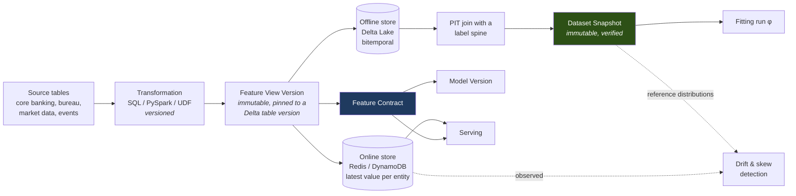
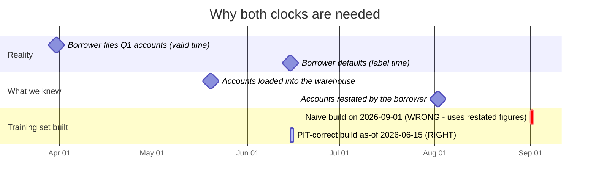
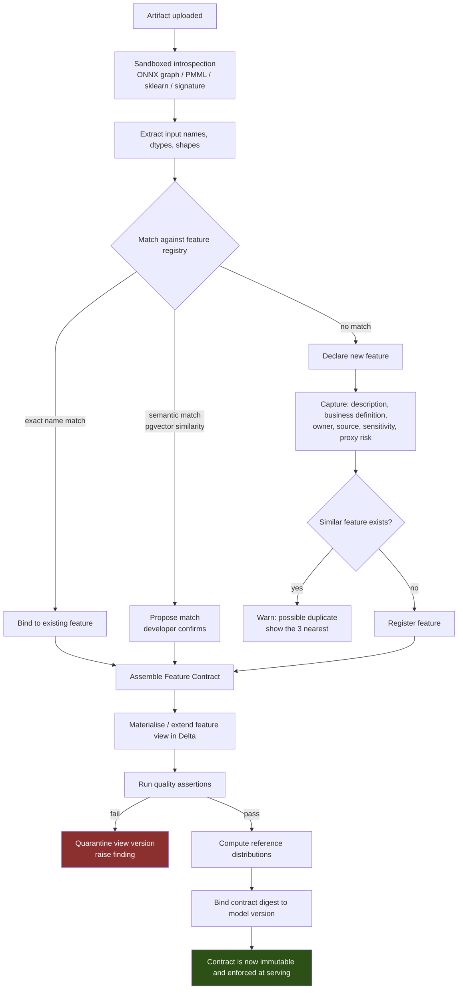

# 07 — The Feature Platform

*MAYA — Model & AI Lifecycle Assurance.*  **Evidence, not assertion.**

**Annex to** [04 — Architecture](04-architecture.md). Implements the bitemporal theory of
[00 §11.1](00-mathematical-foundations.md#111-bitemporality-and-the-point-in-time-correctness-theorem).

> Most "model failures" in banks are feature failures. A model that scored 0.47 Gini in development and
> 0.31 in production has usually not degraded — it was never trained on the data it is now being served.
> This annex specifies the machinery that makes that class of failure impossible to introduce silently.

---

## 1. Concepts



| Concept | Definition |
|---|---|
| **Feature** | A named, typed, semantically defined signal about an entity, with an owner and a business definition. Not a column — a *meaning*. |
| **Feature View** | A group of features for one entity, produced by one versioned transformation, materialised to one Delta table. |
| **Feature View Version** | An immutable pinning of (transformation version, schema, Delta table version). |
| **Feature Contract** | The exact set of feature-view versions a model version was fitted on and must be served. Digest-addressed. |
| **Dataset Snapshot** | An immutable, PIT-verified materialisation used by a fitting run. |
| **Entity** | The key a feature is about: customer, account, facility, instrument, counterparty, transaction, desk, book. |

---

## 2. Bitemporality: the two clocks

Every feature row carries two timestamps. Conflating them is the source of look-ahead bias.

| Clock | Column | Meaning | Source |
|---|---|---|---|
| **Valid time** | `event_ts` | When the fact was true in the world | The business event |
| **Transaction time** | `ingest_ts` (and the Delta table version) | When MAYA learned it | The pipeline |



A model trained on the naive build learns from **restated** accounts that did not exist when the credit
decision was made. It will validate beautifully and fail in production. The PIT-correct build uses only
facts with `event_ts ≤ label_ts` **and** `ingest_ts ≤ as_of`.

### 2.1 The verifier

MAYA does not trust the query author. Every dataset snapshot is checked:

```python
# maya/features/pit.py
def verify_pit_correctness(snapshot: DatasetSnapshot,
                           spine: LabelSpine,
                           contract: FeatureContract) -> PitReport:
    """Law L-10. Independently recompute a stratified sample of rows using the
    bitemporal rule and assert equality with the delivered snapshot."""
    violations, sample = [], snapshot.stratified_sample(n=SAMPLE_N, strata=["label_ts_month", "entity_type"])

    for row in sample:
        for item in contract.items:
            expected = lookup_bitemporal(
                view_version = item.feature_view_version,
                entity_id    = row.entity_id,
                valid_before = row.label_ts,          # event_ts <= label_ts
                known_before = snapshot.as_of,        # ingest_ts <= as_of
            )
            if not equal_within_tolerance(row[item.feature_name], expected):
                violations.append(PitViolation(row.entity_id, item.feature_name,
                                               got=row[item.feature_name], expected=expected))

    leakage = detect_future_leakage(snapshot, spine)   # any feature correlating with post-label events
    return PitReport(passed=not violations and not leakage,
                     violations=violations, leakage=leakage, sample_size=len(sample))
```

### 2.2 Three layers, and an honest statement of what each proves

Sampling alone cannot establish the *absence* of leakage, and a leak confined to a rare, high-value
segment — where it does most damage — may well be missed. Finding **H-6** of the
[adversarial review](11-adversarial-review.md) rejected the original single-layer claim. Verification is
therefore three layers, each with a different strength:

| Layer | What it does | What it actually proves |
|---|---|---|
| **1 · Static analysis** | Parses the assembly query and requires **both** a valid-time and a transaction-time bound. An assembly lacking either is **rejected**, not sampled | A genuine proof for the dominant leakage class. This is the strong check |
| **2 · Stratified sampling** | Independent recomputation over strata across label period, entity type **and label value** | Detects *systematic* violations at a stated statistical power. Does not prove absence |
| **3 · Adversarial injection** | CI injects a deliberately leaky feature the verifier must catch | Proves the verifier still works — which is the failure mode that would otherwise be silent and catastrophic |

**Law L-10, restated honestly:** *no assembly passes without a static temporal bound, and sampling
detects systematic violations at stated power.* Weaker than the original wording, and true.

An unverified snapshot cannot be attached to a fitting run for a Tier 1 or Tier 2 model. A failing
snapshot raises a Critical finding.

---

## 3. Defining features

```yaml
apiVersion: maya.dev/v1
kind: FeatureView
metadata:
  name: sb_financials
  entity: customer
  owner: person/d.raman
spec:
  description: "Small-business financial ratios derived from filed accounts"
  source:
    delta_table: silver.customer_financials
    valid_time_column: statement_date          # when the facts were true
    ingest_time_column: _ingested_at           # when we learned them
  transformation:
    engine: pyspark
    version: 7
    code: |
      df = source.withColumn("dscr", F.col("ebitda") / F.col("debt_service"))
             .withColumn("years_in_business",
                         F.months_between(F.col("statement_date"), F.col("incorporation_date")) / 12)
  features:
    - name: dscr
      dtype: float32
      description: "Debt service coverage ratio (EBITDA / annual debt service)"
      business_definition: "Per Credit Policy CP-114 §3.2"
      unit: ratio
      sensitivity: confidential
      pii: false
      quality_assertions:
        - {type: range,       min: -50, max: 100}
        - {type: null_rate,   max: 0.15}
        - {type: freshness,   max_lag: P400D}
        - {type: distribution, reference: baseline_2025Q4, test: psi, max: 0.10}
    - name: years_in_business
      dtype: float32
      sensitivity: internal
      proxy_risk: low
  materialisation:
    schedule: "0 3 * * *"
    mode: incremental
    partition_by: [DATE(statement_date)]
    cluster_by: [customer_id]
  online:
    enabled: true
    store: redis_prod
    freshness_sla: PT15M
    ttl: P90D
  retention:
    class: regulatory
    time_travel_days: 400
```

---

## 4. Feature identification during model upload

When a model is uploaded, MAYA extracts the input schema and reconciles it against the registry. This is
the workflow the user asked for — *upload a model, identify features, persist features in Delta Lake*.



Semantic matching uses `pgvector` over feature descriptions and business definitions, which materially
reduces the duplicate-feature sprawl that makes large feature stores unusable — the top complaint in
mature feature-store deployments.

---

## 5. Training set generation

```python
snapshot = maya.features.build_training_set(
    spine        = "SELECT customer_id, decision_ts AS label_ts, defaulted_12m AS label "
                   "FROM analytics.sb_originations WHERE decision_ts BETWEEN '2022-01-01' AND '2025-06-30'",
    feature_views= ["sb_financials@7", "bureau_attributes@12", "behavioural_12m@3"],
    as_of        = "2025-07-01",          # transaction-time cut: what we knew then
    name         = "pd_smallbiz_train_v4",
)

snapshot.pit_verified     # True
snapshot.delta_version    # 1487
snapshot.digest           # 'sha256:f01a…'
snapshot.row_count        # 184_223
snapshot.report.leakage   # []
```

Under the hood, per feature view, a range join:

```sql
SELECT s.customer_id, s.label_ts, s.label, f.dscr, f.years_in_business
FROM   spine s
LEFT JOIN LATERAL (
    SELECT dscr, years_in_business
    FROM   maya_lake.features.customer.sb_financials VERSION AS OF 1487   -- transaction time
    WHERE  entity_id = s.customer_id
      AND  event_ts <= s.label_ts                                          -- valid time
      AND  ingest_ts <= TIMESTAMP '2025-07-01'                             -- transaction time
    ORDER BY event_ts DESC, ingest_ts DESC
    LIMIT 1
) f ON true;
```

Delta's `VERSION AS OF` supplies the transaction-time axis for free — which is precisely why Delta Lake,
rather than a plain warehouse table, is the right substrate for a regulated feature store.

Performance at scale (1B rows × 500 features, `NFR-PERF-006`): entity bucketing so the join is
partition-local, Z-order/liquid clustering on `entity_id`, spine broadcast when small, and per-view
parallelism with a final narrow join on the spine key.

---

## 6. Serving and skew

### 6.1 The contract is enforced, not documented

At serve time the SDK (or the MAYA-hosted runtime) validates against `feature_contract`:

- every **required** feature present;
- **dtype** matches;
- online-store **freshness** within SLA;
- values within **operating boundaries**;
- the contract **digest** matches the one bound to the resolved version.

A mismatch fails closed. It is not possible to serve a model with features it was not fitted on.

### 6.2 Skew detection

Two independent checks, because they catch different bugs:

| Check | Method | Catches |
|---|---|---|
| **Distributional skew** | Compare online serving distribution against the snapshot's reference distribution (PSI, KS, Wasserstein) per feature, per slice | Population change, upstream pipeline change |
| **Value-level skew** | For a sampled set of entities, recompute the feature offline for the exact serving timestamp and compare to what was actually served | Transformation drift, online/offline logic divergence, stale cache |

Value-level skew is the expensive one and the one that actually catches implementation bugs. MAYA runs it
on a daily sample for Tier 1 and Tier 2 models. A divergence beyond tolerance is a Critical finding: it
means the deployed model is not the validated model in any meaningful sense.

### 6.3 Drift

Feature drift is computed against the **training-time reference distribution stored in the contract** —
not against last month, and not against a moving baseline. Drift means "the world has moved away from
what this model was fitted on", which is only measurable relative to the fitting distribution.

---

## 7. Governance of features

| Control | Behaviour |
|---|---|
| **Certification levels** | `experimental` → `certified` → `deprecated`. Policy: Tier 1 and 2 production models may only use `certified` features. |
| **Ownership** | Every feature has a named owner. Owner departure (from the HR feed) raises an orphaned-feature exception. |
| **Consumer impact** | Changing or deprecating a feature lists every affected model version, hook and approved use. Breaking changes require impact sign-off from every affected model owner. |
| **Sensitive attributes** | `protected_basis` features cannot be bound into a contract for a model in ECOA scope — the policy engine blocks it. They remain available to the **fairness testing** path, which is a separate, audited entitlement. |
| **Proxy risk** | Features flagged `proxy_risk: high` (e.g. zip-code-derived) trigger mandatory proxy-discrimination testing and a documented business-necessity justification before a credit model may use them. |
| **Data quality** | Assertions run on every materialisation. Failure quarantines the view version so no model can bind to bad data. |
| **Lineage** | Source table/column → transformation version → feature → view version → contract → model version → approved use → business decision. Queryable end to end; exported to the enterprise data catalogue. |
| **Restatement** | When a source restates, bitemporality identifies exactly which snapshots, model versions and historical decisions used the superseded values. |
| **GDPR erasure** | Deletion vectors plus crypto-shredding of per-subject keys; the erasure record itself is retained as evidence. |
| **Retention** | Per view, by regulatory class; Delta `VACUUM` and `logRetentionDuration` set from the class, never ad hoc. |

---

## 8. Online store

Optional and pluggable — many bank models are batch-only and need no online store.

> **Critical design point (finding C-2).** An online store keyed only by entity silently defeats the
> feature contract. When a feature view advances from v7 to v8 with a changed transformation, a model
> pinned to v7 begins receiving v8 values — contract digest still matching, every guard reporting
> green. That is the exact training–serving skew this platform exists to prevent, introduced by the
> platform itself. **The online store is therefore namespaced by feature view version.**

| Aspect | Design |
|---|---|
| Backends | Redis (default), DynamoDB, Cassandra, Postgres (small estates) |
| **Key layout** | **`fv:{feature_view_id}:v{version}:{entity_id}`** — the version is part of the key, always |
| **Resolution** | Serving reads the namespace **pinned by the contract**, never "latest" |
| **Version transition** | Publishing a new view version starts a **dual-write** period. The old namespace is retained until no active contract references it — which MAYA knows exactly, from `feature_contract_item` |
| **Namespace retirement** | A governed action with a consumer-impact check, identical to feature deprecation |
| Write path | Streaming sync from the Delta offline store via structured streaming on the change data feed; last-value-per-entity semantics *within a version namespace* |
| Freshness | Measured continuously as `now − max(ingest_ts)`; exposed as a monitored metric with an SLA per view |
| Consistency | Eventual, with an explicit SLA. Serving fails closed past the SLA unless `serve_stale` is explicitly granted (expiring) |
| Cost control | TTLs per view; features with no online consumers are not synced — MAYA knows the consumers from the contracts |
| On-demand features | Computed at request time from the payload; declared in the contract, validated at serve time, and logged so the training and serving definitions can be diffed |
| **Cost** | Roughly `k ×` storage, where `k` is the number of concurrently pinned versions per view — in practice 1–2. That is the correct price for the guarantee |

**Law L-17 · contract–serving agreement.** For every active hook, the online namespace actually served
must equal the namespace pinned by its contract. Checked continuously in production, not asserted at
design time — because C-2 was invisible to every design-time check.

---

## 9. Feature discovery

The economics of a feature store are determined by reuse. MAYA optimises for it:

- **Search** — full text plus semantic (`pgvector`) over names, descriptions and business definitions.
- **Duplicate detection** — on registration, the three nearest existing features are shown with their owners; creating a near-duplicate requires a one-line reason.
- **Popularity and quality signals** — how many models use it, quality assertion pass rate, drift stability, owner responsiveness.
- **Provenance display** — where it comes from and what it costs to compute, so a developer can see that a "cheap" feature depends on a six-hour upstream job.
- **Recommendations** — "models solving similar problems also use…", derived from contract co-occurrence.
