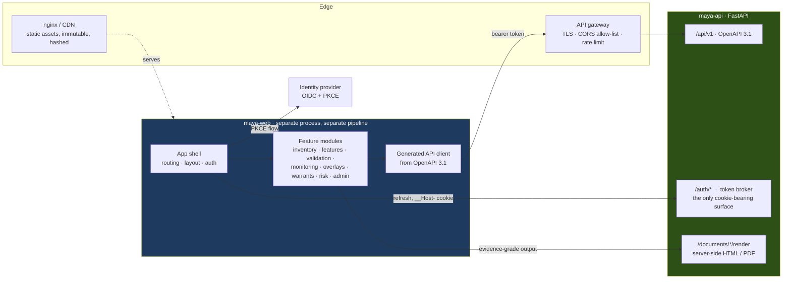

# 08 — UI and UX Design

*MAYA — Model & AI Lifecycle Assurance.*  **Evidence, not assertion.**

**Annex to** [04 — Architecture](04-architecture.md). Governed by
[ADR-011](adr/ADR-011-decoupled-frontend.md). Stack: **Bootstrap 5 + jQuery**, running as a
**separate process** against the backend API.

---

## 1. Front-end architecture

The UI is an independently built, independently deployed application. It has no privileged path into
the backend: it uses the same public, versioned API that the SDK and any third-party client uses.



### 1.1 Rules

1. **Two processes, two pipelines, two release cadences.** `maya-web` is static assets; `maya-api` is
   FastAPI. Neither imports the other. A front-end release carries no migration risk; an API release
   does not require a UI release.
2. **The API is the only interface.** There is no server-rendered application page and no internal
   shortcut. This is the point of the change: the API is exercised continuously by the product itself
   and therefore cannot drift from what real clients need.
3. **P4′ — the client renders decisions, it never derives them.** Tier, gate verdicts, obligations,
   eligibility and RAG status are computed by the backend and returned *with rationale*. Endpoints
   return `allowed` plus `deny_reason[]` — never the raw facts a client would need to recompute a
   verdict. If the client cannot obtain the inputs, it cannot drift from the backend's answer.
4. **Evidence-grade output is rendered server-side.** Documents, committee packs and examiner exports
   come back from the API as HTML or PDF. Anything that may be taken into an examination is produced
   by the system of record.
5. **jQuery is used deliberately, not apologetically.** No client-side rendering framework, no virtual
   DOM. Views are small ES modules that fetch, template with a minimal string templater, and bind
   events through delegation. Complexity is kept out of the client by rule 3, so this is sufficient.
6. **Accessibility is a requirement** (`NFR-USE-002`): semantic HTML, ARIA on custom widgets, full
   keyboard operation, visible focus, 4.5:1 contrast, and no colour-only status encoding — every RAG
   chip carries an icon and a text label.

### 1.2 Module structure

Front-end modules mirror the backend's bounded contexts, so a change is localised on both sides.

```
maya-web/
├── src/
│   ├── shell/            # routing, layout, auth, error handling, toasts
│   ├── api/              # generated client + thin wrappers, retry, problem+json handling
│   ├── components/       # grid, derivation panel, RAG chip, graph, diff, form-from-schema
│   ├── modules/
│   │   ├── inventory/    ├── features/    ├── validation/   ├── findings/
│   │   ├── overlays/     ├── monitoring/  ├── warrants/        ├── risk/
│   │   ├── documents/    ├── regimes/     ├── examiner/     └── admin/
│   └── styles/           # Bootstrap 5 theme, design tokens
└── tests/                # component tests + contract test against the published OpenAPI
```

Each module owns its routes, views and API slice, and registers itself with the shell. Adding a module
touches the module and one registration line — the front-end counterpart of the backend's plugin
boundary.

### 1.3 The schema-driven form

Model-class metadata forms are **generated in the browser from the fibre's JSON Schema**, served by the
API. This is the fibration reaching the UI: a new model class adds a fibre on the backend and its
capture form appears in the front end with **no front-end change at all**. A T1 pricing model is asked
for calibration instruments and tolerance; a T5 model is asked for autonomy mode and eval set; neither
required a UI release.

### 1.4 Authentication

> **Tense warning.** This table is the *design* for the decoupled frontend of
> [ADR-011](adr/ADR-011-decoupled-frontend.md). The interface that exists is
> server-rendered Jinja whose pages call the same API **under a session cookie**,
> so ambient cookie authority is exactly what it has and the row below saying
> CSRF does not apply describes an architecture nobody has deployed. What is
> built is documented in [09 §3.4a](09-security-compliance.md): a token required
> on any state-changing request whose authority came from the cookie, and on
> nothing else. A control written in the future tense reads as a control, and
> the tense is the part people skip.

| Element | Design |
|---|---|
| Login | OIDC Authorization Code + **PKCE**, initiated by the shell |
| Access token | **Memory only.** Never `localStorage` or `sessionStorage`; lost on tab close, by design |
| Refresh | `__Host-`-prefixed, `SameSite=Strict`, `HttpOnly`, `Secure` cookie against `/auth/refresh` — the only cookie-bearing surface, and CSRF-protected |
| API calls | Bearer token in `Authorization`. No ambient cookie authority, so CSRF does not apply to the API |
| Silent renewal | Refresh ~60 s before expiry; on failure, re-authenticate without losing unsaved form state |
| Step-up | Privileged actions (alias move, revocation, override, break-glass) trigger re-authentication with an intent statement, returned as `403 step_up_required` |
| CORS | Strict per-environment origin allow-list. No wildcards |

### 1.5 API conventions the UI depends on

| Convention | Purpose |
|---|---|
| `RFC 9457 problem+json` errors | One error shape, rendered consistently; `deny_reason[]` and `remediation_url` surfaced inline |
| Keyset pagination with `next_cursor` | Stable paging over 50,000 models |
| `ETag` + `If-Match` on mutations | Optimistic concurrency; the UI shows a real conflict dialog rather than silently overwriting |
| `Idempotency-Key` on POST | Safe retry on flaky networks |
| `?expand=` and `?fields=` | One request per screen instead of N+1 chatter |
| `/derivations/{id}` on every derived value | Powers the universal `[why?]` affordance (`P8`) |
| Server-Sent Events on `/events` | Live task inbox, breach alerts, long-running job progress — without polling |

---

## 2. Information architecture

```
MAYA
├── Home                    role-aware landing: my work, my models, alerts
├── Inventory
│   ├── Models              the grid — filter, search, bulk actions, saved views
│   ├── Model detail        the spine of the product (§3)
│   ├── Graph               interactive dependency / blast-radius explorer
│   └── Discovery           unregistered models found by connectors; triage queue
├── Features
│   ├── Catalogue           search, reuse, quality, popularity
│   ├── Feature view        definition, versions, materialisation, consumers
│   └── Contracts           which model uses which feature version
├── Work
│   ├── My tasks            approvals, validations, attestations, findings — with SLA
│   ├── Validations         workbench (§4)
│   ├── Findings            register, ageing, remediation
│   └── Campaigns           periodic revalidation / attestation cycles
├── Monitoring
│   ├── Health board        portfolio RAG, breaches, degraded warrants
│   ├── Model monitors      metrics, slices, thresholds, history
│   └── Use reconciliation  approved vs actual use exceptions
├── Overlays                PMA register, magnitude, ageing, recurrence
├── Documents               repository, templates, staleness queue
├── Warrants                   catalogue, grants, usage, revocation
├── Risk
│   ├── Portfolio           tier distribution, heatmaps, concentration
│   ├── KRIs & appetite     dials, trends, breaches
│   └── Board pack          generated reporting
├── Regimes                 per-regulator views, scope determinations, obligations
├── Examiner                read-only, as-at-date, request packs
└── Admin                   classes, lifecycles, policies, templates, tests, users, connectors
```

---

## 3. The model detail page

The most-used screen in the product. It must answer, without scrolling or clicking: *is this model
healthy, is it allowed to be used, and what do I owe on it?*

```
┌──────────────────────────────────────────────────────────────────────────────────────────────┐
│  Small Business PD Scorecard                            maya://model/credit.pd.smallbiz      │
│  ● IN USE   ▲ TIER 1   ◆ T2 statistically estimated   Owner: J. Okafor   LE-US-01            │
│  ┌────────────┬────────────┬────────────┬────────────┬────────────┬────────────┐            │
│  │ HEALTH     │ VALIDATION │ FINDINGS   │ OVERLAYS   │ DOCS       │ WARRANTS      │            │
│  │ ● 0.87     │ ✓ Current  │ ⚠ 1 High   │ ⚠ 1 active │ ⚠ 1 stale  │ ● 3 active │            │
│  │ Amber      │ 4 Aug 2026 │ due 14 Sep │ exp 31 Dec │ MDD §4     │ 14.2k/day  │            │
│  └────────────┴────────────┴────────────┴────────────┴────────────┴────────────┘            │
│                                                                                              │
│  REGULATORY SCOPE                                                                            │
│  SR 26-2 ✓ in scope · SS1/23 ✓ in scope · EU AI Act ▲ HIGH-RISK Annex III(5)(b)              │
│  ECOA ✓ adverse action required · SOX — not a key control        [why? →]                    │
│──────────────────────────────────────────────────────────────────────────────────────────────│
│ Overview │ Versions │ Features │ Uses │ Risk │ Validation │ Findings │ Overlays │ Monitoring │
│ Documents │ Warrants │ Dependencies │ Evidence │ History                                        │
│──────────────────────────────────────────────────────────────────────────────────────────────│
│                                                                                              │
│  PURPOSE            Estimate 12-month PD for US small-business term loans at origination.    │
│  OPERATING          years_in_business ∈ [0, 60] · dscr ∈ [-5, 20] · US SMB revenue < $50M    │
│  BOUNDARIES         non-recessionary (unemployment < 8%)          ▸ 37 violations in 24h     │
│                                                                                              │
│  ASSUMPTIONS (4)                                    LIMITATIONS (3)                          │
│  ▸ Bureau data available for ≥95% (HIGH)            ▸ Thin-file segment under-represented    │
│  ▸ Stable industry mix (MEDIUM)                       → mitigated by overlay OVL-221         │
│                                                                                              │
│  CURRENT VERSION 3.2.1  ●champion    Fitted 2026-07-14 · Gini 0.47 · HL p 0.31 · AIR 0.86    │
│  Feature contract sha256:c701… (42 features, 3 views)     [replay run] [compare] [download]  │
└──────────────────────────────────────────────────────────────────────────────────────────────┘
```

Design notes:

- **Six status tiles, always visible.** Each is a link to the tab that resolves it. Colour is never the
  only signal — icon plus text.
- **Regulatory scope is on the header**, with `[why? →]` opening the stored derivation, not a tooltip.
  This is `P8` made visible.
- **Operating boundaries are shown with live violation counts.** The contract is not a document; it is
  being checked right now.
- **Assumptions and limitations are on the overview**, not buried. They are what a user needs to know
  before relying on the output, and burying them is how models get misused.

---

## 4. The validation workbench

Validators are the scarcest resource in model risk. The workbench exists to stop them doing clerical work.

```
┌─────────────────────────────────────────────────────────────────────────────────────────┐
│ VALIDATION VAL-2026-0412 · credit.pd.smallbiz 3.2.1 · Periodic · Due 30 Sep · M. Chen   │
├──────────────────┬──────────────────────────────────────────────────────────────────────┤
│ PLAN             │  CONCEPTUAL SOUNDNESS                                    6/8 complete │
│ ▸ Conceptual   6/8│  ┌────────────────────────────────────────────────────────────────┐ │
│ ▸ Outcomes     4/6│  │ CS-03  Variable selection justification            ✓ Satisfied  │ │
│ ▸ Monitoring   3/3│  │        Evidence: MDD §4.2, run r_01J8X (stepwise trace)         │ │
│ ▸ Implementation  │  │ CS-06  Challenger comparison                       ⚠ Gap        │ │
│   2/4             │  │        No GBM challenger on the 2024-25 OOT window.             │ │
│ ▸ Fairness     3/3│  │        [run challenger →]  [waive with rationale]               │ │
│                   │  └────────────────────────────────────────────────────────────────┘ │
│ TOOLS             │                                                                      │
│ ▸ Replay run      │  QUICK ACTIONS                                                       │
│ ▸ Challenger      │  [Replay fitting run in sandbox]  → reproducibility PASS ✓          │
│ ▸ Independent     │  [Fit challenger: GBM / RF / constrained-monotone GAM]              │
│   recode          │  [Independent recode → divergence distribution]                     │
│ ▸ Test catalogue  │  [Slice explorer: performance by 14 segments]                       │
│ ▸ Sensitivity     │  [Sensitivity sweep → recompute operating boundaries]               │
│                   │                                                                      │
│ FINDINGS (2)      │  EVIDENCE GLUING          consistency radius 0.02  ✓ within tolerance│
│ ▸ FND-4821 High   │  (local slice validations assemble into a global claim — 00 §9.3)   │
│ ▸ FND-4830 Med    │                                                                      │
│                   │  [Compile validation report]   completeness 78%  →  4 sections open  │
└──────────────────┴──────────────────────────────────────────────────────────────────────┘
```

The validator never leaves MAYA to fetch data, rebuild an environment, or copy numbers into Word. Every
test executed here becomes an evidence node, so the report compiles itself.

---

## 5. The dependency graph

Cytoscape.js, server-fed. The single screen that makes aggregate risk legible.

```
┌───────────────────────────────────────────────────────────────────────────────────┐
│ DEPENDENCY EXPLORER      [downstream ▾] [depth 3 ▾] [tier ≥ 2 ▾]   ⬤ Impact mode  │
│                                                                                   │
│              ┌──────────────┐                                                     │
│              │ USD OIS curve│◄── selected                                         │
│              │ T1 · Tier 1  │                                                     │
│              └──────┬───────┘                                                     │
│         ┌───────────┼────────────┬───────────────┐                                │
│    ┌────▼─────┐┌────▼─────┐┌─────▼────┐┌─────────▼───┐                            │
│    │ Swaption ││ CDS      ││ XVA      ││ VaR / ES    │                            │
│    │ pricer   ││ pricer   ││ engine   ││ engine      │                            │
│    └────┬─────┘└────┬─────┘└─────┬────┘└─────┬───────┘                            │
│         └───────────┴────────────┴───────────┴──► RWA ──► Capital planning        │
│                                                                                   │
│ ⬤ BLAST RADIUS: 23 downstream models · 4 Tier 1 · 3 regulatory submissions        │
│   Aggregate risk premium (lax monoidality): +1.4 tiers over component max         │
│   [notify 11 affected owners]  [open impact assessment]  [export for change record]│
└───────────────────────────────────────────────────────────────────────────────────┘
```

"Impact mode" is what a developer sees *before* proposing a change to a feeder model — the notification
list is generated, not remembered.

---

## 6. Model upload

A four-step wizard, but each step is a full server-rendered page so it survives a refresh and can be
resumed.

| Step | Content |
|---|---|
| **1 · Artifact** | Drag-drop. Live progress. Then: introspection summary, format policy verdict, security scan results. A blocked format shows the exception path inline, with its expiry. |
| **2 · Features** | The reconciliation table: matched (green), fuzzy-matched with confidence (amber, confirm/reject), unmatched (red, declare). Duplicate warnings show the three nearest existing features with owners. |
| **3 · Metadata** | Only what cannot be derived. Fields are driven by the model class fibre — a T1 pricing model is asked for calibration instruments and tolerance; a T5 model is asked for autonomy mode and eval set. **The form is generated from the fibre's JSON Schema**, which is the fibration reaching the UI. |
| **4 · Review** | Provisional tier with full derivation, the obligations this creates, the documents required, and the estimated validation timeline. Then submit. |

At every step, a persistent right rail shows *"what this will require of you"* — so nobody discovers at
step 4 that they have committed to a Tier 1 validation.

---

## 7. Executive and board views

```
┌─────────────────────────────────────────────────────────────────────────────────┐
│ MODEL RISK — BOARD RISK COMMITTEE                            Q3 2026            │
├─────────────────────────────────────────────────────────────────────────────────┤
│ INVENTORY 1,247 models (+83 QoQ)      TIER 1: 214   TIER 2: 391   T3/4: 642     │
│                                                                                 │
│ RISK APPETITE                                                                   │
│  Tier 1 with current validation        98.1%  ████████████████████░  ≥98%  ✓    │
│  Open Critical findings > 90 days          2  ██░░░░░░░░░░░░░░░░░░░  ≤0    ✗    │
│  Models in use without approval            0  ░░░░░░░░░░░░░░░░░░░░░  =0    ✓    │
│  ECL overlay reliance                   4.2%  ████████░░░░░░░░░░░░░  ≤5%   ✓    │
│  Off-label use exceptions open              7  ███░░░░░░░░░░░░░░░░░░  ≤10   ✓    │
│  Validation backlog (Tier 1, wks)         6.2  ████████░░░░░░░░░░░░░  ≤8    ✓    │
│                                                                                 │
│ TREND — aggregate model risk score          MOVEMENTS THIS QUARTER              │
│  ▁▂▃▃▄▄▃▃▂▂▂▁   improving                   ▸ 12 models re-tiered upward         │
│                                              ▸ 3 GenAI use cases approved       │
│ ATTENTION                                    ▸ 1 vendor model version change    │
│ ▸ FND-4102 CECL macro overlay recurring 4th consecutive quarter → redevelopment │
│ ▸ USD OIS curve model validation due; 23 downstream models affected             │
│                                        [generate board pack ▾]  [drill down →]  │
└─────────────────────────────────────────────────────────────────────────────────┘
```

The board pack is generated, versioned and reproducible — an examiner can ask what the committee was
shown in Q3 2026 and receive exactly that.

---

## 8. Brand and identity

### 8.0 The elements

| Element | Value | Where it appears |
|---|---|---|
| **Name** | MAYA — Sanskrit *māyā* (माया), *appearance* / *representation* | Everywhere |
| **Tagline** | Model & AI Lifecycle Assurance | Login, page title, document headers, footers |
| **Slogan** | **Evidence, not assertion.** | Login screen, empty states, export-pack cover pages, the About panel |
| **Principle** | *A model is a representation of the world. Governance is knowing the difference.* | About panel, onboarding, examiner portal cover |
| **Mark** | The copy map | App bar, favicon, export packs, decks |

### 8.1 The mark


A **square inscribed in a circle** — the oldest model there is. Archimedes bounded π this way, with a
tractable figure standing in for one that cannot be computed directly.

The **gap** between the square and the circle is the model error. The **four points** are where the
model and the world agree. Add sides and the gap closes but never vanishes: no model becomes the thing
it represents. That reading is worth knowing, because it is the argument the whole platform makes.

Assets live in [`assets/logo/`](../assets/logo/): `maya-mark.svg` (primary), `maya-mark-white.svg`
(knockout for crimson), `maya-mark-mono.svg` (inherits `currentColor`), and `maya-lockup.svg`
(mark + wordmark + tagline + slogan).

### 8.2 Usage rules

| Rule | Detail |
|---|---|
| Clear space | Minimum of one-quarter the mark's width on every side |
| Minimum size | 20 px for the mark; 180 px wide for the lockup. Below 20 px use the favicon crop |
| Colour | Crimson `#A51C30` on light; white knockout on crimson; `currentColor` mono elsewhere |
| Never | Recolour, rotate, close the gap, add effects, stretch, or place the mark on a busy image |
| Favicon | `maya-mark-64.png`, rounded square, full bleed |
| Dark mode | Mono mark inherits the foreground; the lockup uses the white-knockout variant |

### 8.3 Voice

The slogan is a **claim about the product**, so it is used where the product is making that claim —
not decoratively. It belongs on the login screen, on the cover of an examiner export pack, and in the
About panel. It does not belong on every page header, where it becomes wallpaper and stops meaning
anything.

---

## 9. Design system

| Element | Standard |
|---|---|
| **Colour** | Bootstrap semantic palette. Status: green (healthy) / amber (attention) / red (breach) / grey (inactive). **Never colour alone** — always icon + label. |
| **Tier badges** | `▲ TIER 1` red · `▲ TIER 2` amber · `▲ TIER 3` blue · `▲ TIER 4` grey. Consistent everywhere, always with the number. |
| **Trainability chips** | `◆ T2 statistically estimated` — full text on hover; the class is always visible so nobody assumes a pricing model was "trained". |
| **Derivation links** | Any derived value renders with a `[why?]` affordance opening its derivation panel. Non-negotiable (`P8`). |
| **Staleness** | Stale documents and expired approvals render struck-through with a diff link. Never silently current. |
| **Empty states** | Every empty state explains *why* it is empty and offers the next action. |
| **Destructive actions** | Type-to-confirm for revocation, decommissioning and alias moves. Alias moves additionally show the affected consumer list. |
| **Density** | Compact tables by default (banks look at hundreds of rows); a comfortable mode is available. |
| **Print** | Every detail page has a print stylesheet producing a clean, dated, watermarked document — because people take these into meetings. |
| **Responsive** | Full functionality ≥ 1280px; read and approve on tablet; alerts and approvals on phone. |

---

Copyright © 2026 Ashutosh Sinha <ajsinha@gmail.com>. All rights reserved.
Proprietary and confidential. See [LICENSE](../LICENSE) and [NOTICE](../NOTICE).
*Not legal, regulatory or financial advice — see NOTICE §4.*
