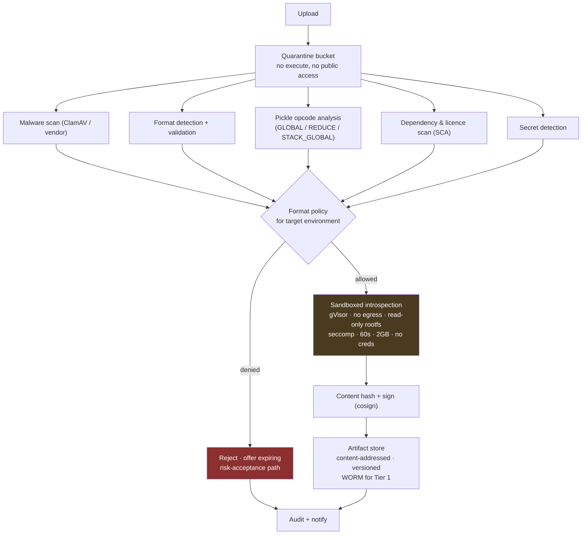

# 09 — Security, Controls and Compliance

*MAYA — Model & AI Lifecycle Assurance.*  **Evidence, not assertion.**

**Annex to** [04 — Architecture](04-architecture.md).

---

## 1. Threat model

MAYA is a **Tier 1 / crown-jewel** application: it holds the bank's model intellectual property, controls
what runs in production decisioning, and is the evidence base an examiner relies on. Compromise is a
regulatory event, not merely an IT one.

| # | Threat | Impact | Controls |
|---|---|---|---|
| T1 | **Malicious model artifact** (pickle RCE, poisoned weights, backdoored `.pth`) | Code execution, lateral movement | Format policy; opcode scanning; malware scan; sandbox-only deserialisation; content addressing; signature verification |
| T2 | **Evidence tampering** — altering a validation result or approval after the fact | Fraudulent assurance; regulatory misstatement | A linear `seq`/`prev_hash` chain over the derivation DAG, so deletion of a leaf and insertion into the past are both detectable. Verification **re-derives each node's content hash from its own fields** rather than re-linking the stored one — see §4. Append-only DB roles and WORM copies remain targets |
| T3 | **Unauthorised model execution** — running an unapproved model, or an approved model for an unapproved purpose | Unassessed risk in production; consumer harm | Warrant entitlements bound to approved uses; fail-closed resolution; use reconciliation |
| T4 | **Model exfiltration** — bulk download of proprietary models | IP loss | Rate limits and quotas on resolution; anomaly detection on access patterns; artifact download audit; watermarking for Tier 1 |
| T5 | **Insider tier manipulation** — lowering a tier to escape controls | Control avoidance | Tiering is derived and traced; overrides require justification, elevated authority, and independent reassessment at validation |
| T6 | **Feature poisoning** — corrupting upstream data to shift model behaviour | Financial loss; fraud | Data-quality assertions; drift and skew detection; source lineage; anomaly alerting |
| T7 | **Prompt injection / jailbreak** against T5 models registered in MAYA | Data leakage; harmful output | Guardrail configuration as a versioned artifact; injection detection in monitoring; autonomy-mode limits; mandatory human review at Critical |
| T7a | **Prompt injection through inventory metadata** — an attacker or careless developer places instructions in a model description, feature definition or vendor document, which the platform's own drafting assistant then reads | Data exfiltration; corrupted governance artifacts. Note this surface does **not** exist for an ordinary enterprise chatbot | All inventory content treated as untrusted input; structural instruction/data separation; injection detection; capabilities hold no credential they do not need (`FR-AI-017`) |
| T7b | **Evidence poisoning by an assistant** — machine-created evidence supporting a machine-made claim | Fabricated assurance | Agents may **propose**; only humans and instrumented systems create evidence. AI output carries `ai_drafted` provenance and reduced trust, which the trust semiring propagates automatically |
| T7c | **Automation bias** — a usually-correct triage queue trains reviewers to approve without looking | Silent governance failure at scale | Deliberate sampling of AI proposals for full independent assessment (`FR-AI-015`); reviewer edit distance tracked, with a *falling* edit distance investigated (`FR-AI-016`) |
| T8 | **Supply-chain compromise** of MAYA itself | Total | SBOM per release; signed images; SLSA L3 build; dependency pinning; SCA in CI; reproducible builds |
| T9 | **Cross-entity data leakage** in a multi-entity deployment | Regulatory breach | Scope filtering in the application, on legal entity and domain, applied to listings as well as detail reads (§3.3). Postgres RLS as a second line is **designed and not built**, so this control is currently single-layer |
| T10 | **Denial of the warrant plane** | Bank-wide scoring outage | Independent scaling; regional failover; descriptor grace window; static fallback |
| T11 | **Compromised MAYA signing key** | Forged descriptors | KMS/HSM-held keys; 90-day rotation with overlapping validity; SDK pins a key set; emergency key revocation |
| T12 | **Malicious or careless policy change** | Estate-wide gridlock or estate-wide bypass | Policies versioned, peer-reviewed, tested against a golden corpus, canaried; policy changes are themselves audited and reversible |

---

## 2. Artifact security



### 2.1 Format policy

| Format | dev | test | uat | prod | Note |
|---|---|---|---|---|---|
| ONNX, PMML, PFA | ✓ | ✓ | ✓ | ✓ | Preferred — declarative, non-executing |
| safetensors | ✓ | ✓ | ✓ | ✓ | Preferred for tensors |
| H2O MOJO, Spark ML, TorchScript | ✓ | ✓ | ✓ | ✓ | Constrained execution |
| Source bundle (Python/R/SAS) | ✓ | ✓ | ✓ | ⚠ | Requires container pinning and code review |
| Container digest | ✓ | ✓ | ✓ | ✓ | Must be signed and SBOM-attested |
| **pickle / joblib / `.pth`** | ✓ | ✓ | ⚠ | ✗ | Denied in production. Exception: expiring, dual-authorised, with scan evidence and a migration plan |
| Reference-only (vendor) | ✓ | ✓ | ✓ | ✓ | No artifact; behavioural evidence required |

The pickle position is deliberate and evidence-based: research shows ~45% of popular public models still
ship as pickle, that malicious `.pth` files with embedded remote-access payloads have been published to
trusted hubs, and that scanners have both false positives and false negatives. A bank should not accept
that class of risk in production when ONNX and safetensors exist.

### 2.2 Sandbox specification

The table below is the **target**. What ships is narrower, and the gap is the whole point of this
subsection: a boundary that is published is one an engineer can plan around, and a boundary that is
implied is one somebody discovers by trusting it.

| Property | Target | As built (`core/execution/sandbox.py`) |
|---|---|---|
| Isolation | gVisor or Kata Containers; one pod per task | A **`spawn`ed child process**, not `fork` — a forked child inherits the parent's open database handles and signal state |
| Network | Deny-all egress | **None.** The child shares the network namespace |
| Filesystem | Read-only root; capped `tmpfs` scratch | **None.** The child shares the filesystem |
| Identity | No service account token, no cloud credentials | Inherited from the parent process |
| Limits | CPU, memory, PID, wall-clock caps | `RLIMIT_CPU` and `RLIMIT_AS`, **read from `constraints.resources` on the warrant**, defaulting to 30 s and 2 GB. The wall clock is the CPU budget plus two seconds |
| Syscalls | Restrictive seccomp profile | **None** |
| Output | Structured result only | A four-kind pipe: `ok`, `refused` (the original refusal, re-raised with its code and remediation), `limit`, `failed` |

Two implementation details are load-bearing rather than incidental. The memory budget is **additive to
the interpreter's own footprint**, read from `/proc/self/status`, so a 512 MB budget means 512 MB for
the model rather than 512 MB for Python and the model together. And the runtime's dependencies are
imported **before** the limit is applied, so a library's import cost is never charged to the model's
budget — otherwise the first ONNX model of the day fails for a reason that has nothing to do with it.

**Which runtimes are isolated:** `onnx` and `pmml` — the artifact-backed ones. `quantlib` is **not**,
and the reason is stated rather than implied: it loads no artifact, so there is nothing untrusted to
isolate from. A bound callable runs in process by construction and is named as such.

**What the boundary is published as protecting against**, in the words `describe()` returns: *a
runaway loop, an allocation storm, an artifact crash.* And what it does not: *a deliberately hostile
artifact — the child shares the filesystem and the network namespace*, and *bound callables, which run
unisolated by construction.*

So `P7` — *the control plane never loads a model artifact in-process* — holds for ONNX and PMML and is
enforced by process boundary rather than by container. Against a hostile artifact it is not a control.
Blocking the filesystem and the network needs a container, a VM or seccomp, and pretending otherwise
would be worse than saying so, because a reader who believes this is a security boundary will put a
vendor's binary behind it.

---

## 3. Identity and access

### 3.1 Roles

**Eight roles across three lines of defence**, and each is a named set drawn from a closed vocabulary
of **72 permissions** in `resource:act` form. Two roles are supersets of others by construction rather
than by copying, which is what stops the two drifting apart.

| Role | Line | Holds | The sentence that defines it |
|---|---|---|---|
| `model_developer` | First | 23 permissions | *Builds models and features. Cannot approve, tier or validate.* |
| `model_owner` | First | `model_developer` ∪ 15 more | *Owns a model end to end: registers it, requests its tier, issues warrants.* |
| `validator` | Second | the 15 read permissions ∪ 14 more | *Second line. Runs effective challenge and closes findings. Never builds.* |
| `model_risk_manager` | Second | `validator` ∪ 15 more | *Second line with authority: approves versions, moves aliases, sets tiers.* |
| `auditor` | Third | the 15 read permissions ∪ `finding:raise` | *Reads everything, raises findings, remediates nothing.* |
| `operator` | — | 7 permissions | *Runs the platform and the monitoring batch. No governance authority.* |
| `service` | — | 6 permissions | *A non-human principal. Resolves and executes warrants; signs in to nothing.* |
| `admin` | — | all 64 | *Everything, including principal management. For bootstrap and break-glass.* |

One distinction in that vocabulary is worth pulling out, because it is the kind that is usually
collapsed: **`version:sign` and `version:approve` are separate permissions.** A validator holds the
first and never the second — signing a quorum is not the same act as approving alone.

**Four incompatible pairs**, refused at the point a principal is created *and* at SSO login:

| Pair | Because |
|---|---|
| `model_developer` + `model_risk_manager` | a developer who can also approve versions is a first line approving its own work |
| `model_owner` + `model_risk_manager` | an owner who can also approve and tier their own models defeats second-line challenge |
| `model_developer` + `auditor` | the third line must not build what it audits |
| `model_owner` + `auditor` | the third line must not own what it audits |

`admin` bypasses the conflict check. That is deliberate and it is the break-glass path; it is also the
single most valuable line in an access review of this system.

### 3.2 Segregation of duties

Enforced, and — this is the part that distinguishes it from a role matrix — **read from the evidence
chain rather than from a second who-did-what table**. A duty conflict is a question about what a
person *did*, and the chain is the only record of that which cannot disagree with itself.

| Act | Refused when the actor recorded | Because |
|---|---|---|
| `version:approve` | `version_created` against this version | the person who created a version may not approve it |
| `alias:move` | `version_created` against this version | the person who created a version may not promote it into an environment |
| `validation:conclude` | `version_created` against this version | the person who created a version may not conclude its validation |
| `finding:close` | `finding_raised` **for this finding** | the person who raised a finding may not close it |

The last row carries a lesson worth keeping. A rule may name the payload field carrying the identity
it is about, because an evidence node's *subject* is not always the thing an act concerns: a finding is
raised against the **model**, which is where a reader looks for it, while the act being checked is
about one **finding**. Without that field the raiser-may-not-close rule was **inert over HTTP** — it
searched under the finding's own id, found nothing, and permitted everything. A segregation control
that silently permits is worse than none, because it is reported as present.

The refusal names the act, the actor and the chain position: *"the person who raised a finding may not
close it — j.okafor recorded 'finding_raised' against this subject at evidence #4821."*

Two rules in earlier drafts of this section are **not implemented**: policy author ≠ publisher is
enforced by *permission* (`policy:author` sits with the validator, `policy:publish` with the model risk
manager) rather than by an actor comparison, so one person holding both roles could do both; and the
overlay proposer ≠ approver rule lives in `core/overlays/`, not here. There is **no nightly re-sweep**
for retrospective conflicts created by a role change.

### 3.3 Scope

Scope has **two dimensions — legal entity and domain** — and an empty tuple on either means
unrestricted there. It filters **listings as well as detail reads**, which is the property that
matters: a model out of scope is invisible rather than merely unopenable, because the existence of a
model can itself be sensitive.

> **Row-level security is not implemented.** Earlier drafts of this section described three
> independent layers with Postgres RLS as the last line. The shipped schema has no RLS, no session
> variables and no separate application role, so **there is one layer, in the application**, and
> finding H-5's `FORCE ROW LEVEL SECURITY` fix remains a Postgres design. Business unit, geography and
> classification are not scope dimensions. A reader planning a multi-entity deployment should treat
> defence in depth here as unbuilt rather than as configured.

### 3.4 Authentication

Three routes to a principal, all against the same register:

**Password.** PBKDF2-HMAC-SHA256, **200,000 iterations**, a 32-hex-character salt per principal. A
successful verification is cached for **60 seconds** under a per-process peppered key that never holds
the password — and the cache shortens the key derivation and **never the decision**: `status` is
re-read from the store on every request, so suspending a principal takes effect immediately. An
unknown username is hashed against a dummy salt so it costs the same as a wrong password.

**HTTP Basic**, for services, against that same register. A malformed `Authorization` header is treated
as absent rather than as an error, because a broken header and a missing one should not be
distinguishable to a prober.

**SSO — see §3.5.**

### 3.4a Ambient authority, and the two things it cost

A session cookie is *ambient*: the browser sends it whether or not the page that
triggered the request came from us. Everything below follows from that one
property, and both defects here were live.

**Cross-site request forgery.** The cookie is `SameSite=Strict`, which is a real
defence and is **somebody else's** — enforced by the browser, removable by a
client that does not implement it or an intermediary that strips the attribute,
and its removal invisible from here. So there is now a token as well, and the
boundary it applies to is the part worth stating: **a state-changing method whose
authority came from the session cookie, and nothing else.**

Requiring a token from a Basic-authenticated service client would protect
nothing — the browser never sends that header unprompted, and a caller who can
set it already holds the credential — while breaking every engine and script,
which is how a security control ends up switched off in configuration.

| | Token required |
|---|---|
| `POST`/`PUT`/`DELETE` under a session cookie | **yes** |
| `POST` under HTTP Basic | no — the authority is not ambient |
| `GET`/`HEAD`/`OPTIONS` | no — nothing changes |
| `/login`, `/auth/login`, `/auth/callback` | no — they *establish* the session |

Enforced in middleware rather than in each route, because there are ninety
mutating endpoints and a control ninety places have to remember will be missing
from the ninety-first. The exemptions are **exact paths, never prefixes**: a
prefix exemption grows silently as routes are added beneath it.

The token is **per session, not per form**. A single-use token breaks the back
button, breaks two tabs, and breaks every page here that posts more than once —
and each breakage teaches somebody to work around the control rather than with
it. A control people route around is worse than one they never had, because it
also reports success. It is minted on first render rather than at sign-in, so a
session predating the control gets one instead of silently skipping the check.
Comparison is constant-time; it is the one place this codebase compares a secret.

Middleware ordering is load-bearing and worth recording: the guard is registered
**before** the session middleware, which places it **inside** it. Starlette wraps
later-added middleware on the outside, and a CSRF guard running before the
session is decoded has no session to compare a token against. It failed loudly,
which is the only reason this is a note rather than an incident.

**The open redirect.** `POST /login` honoured whatever `next` carried, so
`/login?next=https://evil.example/phish` sent the browser there immediately
after somebody typed real credentials into the real form on the real domain.
That is the whole of a credential-phishing attack, and the redirect is the part
that makes the link look legitimate — the part that was ours to remove. The same
door stood open on the SSO path, where the target survived a round trip through
the identity provider before being followed, so it is bounded before it is
*remembered* rather than before it is followed.

Only a path is accepted now. A scheme, a host, a protocol-relative `//host`, the
backslash spellings browsers normalise, and the control characters they strip
before resolving a URL are each **replaced by the fallback rather than
sanitised** — a redirect target somebody had to repair is a redirect target
nobody understands.

### 3.5 Single sign-on

The authorisation-code flow with **PKCE, a state parameter and a nonce** — all standard, all checked,
and PKCE used even when a client secret is configured. Discovery must yield an issuer matching the
configured one; the state must match and be under ten minutes old; the ID token's issuer, audience,
expiry, issued-at and nonce are each checked with 120 seconds of leeway.

**RS256 verification is in the standard library** (`core/authz/jws.py`), for the same reason every
front-end asset is vendored: a governance system that cannot be deployed air-gapped is one somebody
works around. Two details are the whole of why it is written rather than imported:

- The verifier **constructs** the padded block the signature should have produced —
  `00 01 FF…FF 00 || DigestInfo || SHA-256` — and compares the whole of it, rather than parsing what
  it recovers. That is the difference between correct PKCS#1 v1.5 and the Bleichenbacher forgery,
  which works precisely against verifiers that parse.
- It **decides the algorithm itself** rather than reading `alg` from the token. That is the other
  famous way a JWT is accepted with no signature at all.

Alongside: a 2048-bit minimum modulus, and a refusal to try keys in turn when a token carries no `kid`
and the provider publishes several — `ambiguous_key`, because guessing is how a verifier ends up
accepting a signature from a key nobody meant to trust. Tested against genuine OpenSSL-signed tokens
rather than against its own arithmetic.

**What is not mechanical is roles.** An identity provider that grants MAYA roles is one that decides
segregation of duties, and the person administering it is very often the person whose duties are being
segregated. So:

- **Group claims are mapped, never obeyed.** A group with no mapping in `auth.oidc.roles.*` grants
  nothing, and never grants itself.
- **The incompatible-roles check of §3.1 applies to a directory exactly as it does to a local
  principal.** A group membership mapping to a conflicting pair **refuses the login** rather than
  accepting both or quietly reducing to one — and it is checked *before* the provisioning check, so
  the lesser problem cannot hide the greater.
- **Provisioning on first login is off by default**, because it hands everybody in the directory a
  foothold in the model register.
- The issuer, subject and the groups that produced the roles are recorded on an evidence node, so
  *"why did this person have that role in March"* survives the directory moving on. The token is not.

**No SAML and no SCIM.** A SAML-only directory is unsupported, and automatic deprovisioning is not
built, so **a leaver is suspended by hand**. That is a real operational obligation, and stating it here
is cheaper than a bank discovering it during an access review.

### 3.6 Versioned gates

A gate that cannot be changed without a release is a gate people work around; a gate that *can* be
changed without one is a gate that can be **weakened** without one, which is worse. `core/policy/`
makes the first possible without making the second silent.

A rule is a **predicate over a closed vocabulary of facts** — comparison, membership, boolean
connectives, `any` and `all` over a generator, six other functions, and no loops, assignment, function
definitions, attribute access or subscripting. That restriction is what makes a rule something a
reviewer can reason about rather than something they have to run. A fact the gate does not publish is
refused **when the rule is written**, because a rule that failed at the moment of a governance decision
would have failed at the worst possible time.

Four gates, each publishing its own facts: `version:approve` (12), `alias:move` (9), `model:mutate` (5),
`warrant:resolve` (8). There is no `warn` verdict — a gate that warns is a gate that is not a gate.

Four properties do the work:

- **A policy ships with its own cases and cannot be published until they pass**, and **at least one
  must be a case it refuses**: a policy nobody has shown to refuse anything is a policy nobody has
  shown to be a gate.
- **Weakening is allowed and never quiet.** On publication the register replays the *outgoing*
  version's cases against the incoming rule and reports every verdict that flipped, bucketed as
  `loosened` or `tightened`, into the evidence node and the log. A change that loosens a gate becomes
  something somebody decided rather than something somebody discovered.
- **Authoring and publishing are separate permissions.** Cases are re-run at publish time, not trusted
  from the draft.
- **An instance that publishes nothing runs exactly what it ran before**: the built-in rules are the
  default for every gate, expressed in the same language.

And the honest boundary, stated rather than implied: **policy tightens; the code's invariants are the
floor.** A rule runs *in addition to* the checks written in the registry, never instead of them.
Loosening a gate still costs a release — deliberately, because replacing an invariant with a line of
configuration means a typo can weaken the platform and the failure looks like a successful deployment.

### 3.7 Attached documents

The other half of documentation: the papers people wrote, as against the ones MAYA compiled.

Stored under the **SHA-256 of their bytes**, so the same file is stored once and cannot be edited in
place — changing a byte changes the digest, which is the whole mechanism. They are **re-hashed on the
way out**, and a mismatch raises rather than serves: *"the stored bytes for sha256:… no longer hash to
that digest — the store has been tampered with or has corrupted; do not use this document and raise an
incident."* What an approver accepted is what a reader fetches, checked rather than assumed.

Filed against the **version** they describe rather than the model, because a development document
describes the coefficients it printed and not their replacement; model-level filing exists and has to
be asked for. **Review is segregated twice**: by role grant, and again in the register, so the person
who filed a document cannot accept it even if their role would let them — and that check precedes the
accept/reject branch, so it applies to a rejection too. Rejection requires a reason, and the rejected
document stays on file, because the papers that did not pass are the ones a supervisor asks about.
Supersession names what it replaces, so *"which MDD was in force in March"* is answerable.

Each attachment records whether its bytes are text the platform can genuinely read — six media types
qualify, and PDF and Word are not among them. They are served faithfully and reported as **not
machine-readable**, because that is what they are. There is no extraction pipeline and no retrieval
over document content: the register is *shaped* to support machine review of filed documents, and that
review is not built. Saying which is the difference between a roadmap and a claim.

---

## 4. Audit

**There is no separate `audit_log` table. The evidence chain is the audit log**, and that is a
deliberate consolidation rather than an omission: two records of who did what are two records that can
disagree, and segregation of duties (§3.2) is decided by reading the chain, which only works if the
chain is the record.

```
evidence_node:  seq · kind · subject_type · subject_id · payload · parents
                contains_personal_data · trust · recorded_at · recorded_by
                content_hash · prev_hash · chain_hash
```

- **Two structures, one table.** The `parents` edges are a DAG and say *what supports what*. The
  `seq`/`prev_hash` chain is linear and says *what order things happened in*, which is what makes
  deleting a leaf or inserting into the past detectable — finding C-4.
- **Verification re-derives, and this is where a real defect lived.** `verify_chain` recomputes each
  node's `content_hash` from the node's own kind, subject, payload and parents, and only then checks
  the links. Re-linking a *stored* content hash proves the links are intact and says nothing about
  whether the thing linked is still what was recorded — so an edited payload left a chain that
  verified and a record that lied. The scale suite found it. The unit test that should have found it
  years earlier was named for payload tampering while actually altering the stored hash: a test
  passing for a reason other than its name, which is the failure mode a green suite is worst at
  showing you. Both are fixed, and the four checks now run in order: sequence gap → `prev_hash` →
  **re-derived `content_hash`** → `chain_hash`.
- **`L-18` is enforced in the append path, not in DDL.** A node flagged `contains_personal_data`
  stores an empty payload *and is hashed over what it stored*, so it verifies against itself. Hashing
  the original would make every such node fail its own verification — which is the trap the obvious
  implementation falls into.
- **The log is not the audit trail, and is what makes it usable.** The chain
  records what was *decided*; the log records what happened around it. Every line
  carries a **request id** and the **principal**, every response returns the id in
  `X-Request-ID`, and one access line per request gives method, path, status and
  duration — so a `warrant_resolved` node and the six lines preceding it join, and
  *"what else was this process doing when it refused me"* has an answer. An
  inbound request id is honoured only when it is safe to log: the value reaches a
  log file, and a newline in it forges an entry, so anything outside
  `[A-Za-z0-9._:-]{1,64}` is **replaced rather than escaped** and the response
  header says which id was used. The request id is deliberately **not** written
  into evidence nodes — it would change every content hash for a field that
  belongs to a transport rather than to a governance decision.
- **Anchoring is not built.** Writing the daily chain head to WORM storage and to an RFC-3161
  timestamping authority is C-4's third disposition and remains a design. Until it exists,
  verification compares the chain against itself, and self-consistency of a chain an attacker
  controls proves less than it appears to.
- **Append-only at the database role level** is likewise a target; the shipped schema has no role
  separation.
- **Comprehensive for governance acts, and not for reads.** Every governance act appends a node —
  a version created, a tier assessed, an alias moved, a finding raised or closed, a document accepted,
  a policy published, an SSO login and the groups that produced its roles. Sensitive *reads* — an
  artifact download, a PII feature preview, an examiner's query — are **not** recorded, which is a gap
  worth naming because an access-review question about who looked at what has no answer here.
- **Justification required** for: overrides, exceptions, break-glass, alias moves, revocations,
  decommissioning, tier overrides.
- **Retention is unbounded.** Ten-year retention, monthly partitioning and partition-level WORM are
  targets; nothing expires today, and nothing is partitioned.

---

## 5. Generative and agentic AI controls

SR 26-2 places GenAI and agentic AI **outside** MRM scope while stating that the firm's own risk
management should determine appropriate governance. MAYA implements that as a **parallel track**, so
these systems are governed without pretending they are statistical models.

### 5.1 Boundary determination

Before a GenAI use case may be registered for production, four gate conditions must hold:

| Gate | Condition |
|---|---|
| **G1 — No autonomous authority** | The system does not make a substantive decision on its own |
| **G2 — Institutional anchoring** | Output is grounded in approved models, policies or documents — not open-ended generation |
| **G3 — Bounded function** | It performs a defined support task, not general-purpose reasoning |
| **G4 — Feasible oversight** | A human can meaningfully review the output in the time available |

Only two operating modes pass:

- **Collaborative assistance** — a human is engaged throughout.
- **Human-approved automation** — the system processes autonomously but a human approves before the
  output has effect.

Anything failing a gate is either redesigned or refused. That decision, and its rationale, is recorded.

### 5.2 Risk assignment

A two-dimensional matrix — **decision proximity** × **consumer harm potential** — yielding Low / Moderate /
High / Critical, which sets evaluation rigour, monitoring frequency and human-review requirements.

| | Harm: none | Harm: inconvenience | Harm: financial | Harm: rights/credit |
|---|---|---|---|---|
| **Far from decision** | Low | Low | Moderate | High |
| **Informs decision** | Low | Moderate | High | Critical |
| **Drafts the decision** | Moderate | High | Critical | Critical |
| **Executes the decision** | *not permitted without redesign* | | | |

Adverse-action explanation drafting sits at **Critical**: it is consumer-facing, credit-related, and
drafts the text that becomes a legal notice under Reg B.

### 5.3 Evaluation and monitoring

| Metric | Applies | Definition |
|---|---|---|
| Accuracy | all | Factual correctness against ground truth or reviewer adjudication |
| **Groundedness** | RAG | Proportion of claims supported by retrieved evidence |
| **Citation accuracy** | RAG | Cited sources actually contain the cited claim |
| Completeness | drafting | Material information captured against a checklist |
| **Hallucination rate** | all | Unsupported assertions per output |
| Traceability | all | Output auditable to sources or rules |
| **Adverse-action fidelity** | credit | Does the text reflect the *actual* principal factors driving the decision |
| Toxicity / harmful advice | customer-facing | Guardrail violations |
| PII leakage | all | Sensitive data in output |
| Jailbreak / injection | all | Detected attempts and successes |
| Refusal rate | all | Over- and under-refusal |
| Human edit distance | drafting | How much reviewers change — the best available proxy for real quality |
| Human override rate | decisioning | How often the human disagrees |
| Cost & latency | all | Tokens, dollars, p99 |

**Every prompt change, RAG corpus change, base-model change, tool change or guardrail change re-runs the
frozen eval set before deployment.** A base-model version silently changing under a vendor endpoint is
treated as a change event — MAYA fingerprints base-model behaviour on a canary probe set to detect it.

### 5.4 Agentic additions

For systems that take actions rather than produce text:

- **Tool manifest** as a versioned artifact — every callable function, its blast radius, and whether it
  is reversible.
- **Action audit** — every tool call logged with arguments and result.
- **Reversibility classification** — irreversible actions require human approval regardless of risk tier.
- **Budget and step limits** — hard caps on iterations, tokens and cost, enforced at the gateway.
- **Blast-radius assessment** at registration — what is the worst thing this agent can do?

---

## 5a. The platform's own machine assistance

MAYA uses AI. It therefore governs its own use on exactly the terms in §5, with no platform exemption —
see [13](13-ai-in-the-platform.md) for the full argument and [00 §12a](00-mathematical-foundations.md)
for the criterion.

| Control | Implementation |
|---|---|
| **Self-registration** | Every capability is a T5 model in MAYA's own inventory: owner, approved use, autonomy mode, tier, contract, frozen eval set, budget, kill switch. Visible on the same dashboards, to the same auditors, with the same red marks when it drifts |
| **Oracle gating** | A capability is admitted only where a decision procedure checks its output, or where citation verification applies. Capabilities without either do not ship |
| **No governance credential** | No AI capability holds a credential permitting a governance state transition. This is enforced by the IAM model, not by policy — policy erodes under commercial pressure from sensible people |
| **Grounded output only** | Retrieval over the evidence graph; every factual claim cites evidence node ids; the citation is verified by Boolean evaluation; numbers are interpolated, never generated |
| **Provenance** | `ai_drafted` until human attestation, at reduced trust, propagated automatically by the trust semiring |
| **Forcing function** | If the platform cannot govern its own AI, it cannot govern the bank's. Every awkwardness in the GenAI track surfaces first in our own use, where we cannot blame the user |

## 6. Fair lending and consumer protection

Applies to models in ECOA/Reg B, FCRA, UDAAP or EU AI Act Annex III scope.

| Control | Implementation |
|---|---|
| **Protected-basis exclusion** | Features flagged `protected_basis` cannot bind into a credit model's contract — enforced by the policy engine, not by review |
| **Proxy testing** | Features with `proxy_risk: high` require documented business necessity and proxy-discrimination testing before use |
| **Disparate impact testing** | Adverse Impact Ratio, statistical parity difference and equal-opportunity difference computed at validation **and** continuously in monitoring, per protected class |
| **Less discriminatory alternative search** | A documented, evidenced search for LDAs, retained as evidence — the CFPB's stated expectation. MAYA's challenger framework performs and records it |
| **Reason-code dictionary** | A versioned artifact mapping each feature to a borrower-readable reason and a Reg B category, with legal sign-off recorded |
| **Reason-code fidelity testing** | For each generated reason: is it specific to this applicant, causal in the model, accurate against the application data, and free of disparate-impact concern? Tested, not assumed |
| **Explanation availability** | The contract's guarantee `G` includes "explanation available for every score"; a model that cannot explain cannot be approved for adverse-action use |
| **Vulnerable-customer treatment** | Flagged models require additional review of outcomes for vulnerable segments |
| **Record retention** | Application, features, score, reasons and model version retained per FCRA/Reg B and the bank's standard |

---

## 7. Control library and framework mapping

MAYA ships a control library mapped to the frameworks a large bank must evidence. Each control names the
MAYA feature that operates it, so a control-testing exercise becomes a query rather than a project.

| Control | SR 26-2 | SS1/23 | EU AI Act | NIST AI RMF | ISO 42001 | Operated by |
|---|---|---|---|---|---|---|
| Complete model inventory | VI | 1.2 | Art. 11 | MAP-1 | 6.1 | Registry + discovery |
| Documented scope determination | II | 1.1 | Art. 6 | MAP-1.1 | 6.1.2 | Regime engine |
| Risk tiering with rationale | III | 1.3 | Art. 9 | MAP-1.5 | 6.1.2 | Tiering engine |
| Named individual accountability | VI | 2.x | Art. 14 | GOVERN-2 | 5.3 | Ownership model |
| Segregation of duties | VI | 2.x | — | GOVERN-3 | 5.3 | SoD engine |
| Development standards & testing | IV | 3.1–3.3 | Art. 9, 15 | MEASURE-2 | 8.3 | Lifecycle + test catalogue |
| Data governance & representativeness | — | 3.2 | **Art. 10** | MAP-2 | 8.2 | Feature platform |
| Independent validation | V | 4.x | Art. 9 | MEASURE-3 | 9.2 | Validation workbench |
| Effective challenge evidenced | III, V | 4.x | — | MEASURE-3.3 | 9.2 | Evidence graph |
| Ongoing monitoring | V | 4.x | **Art. 72** | MEASURE-4 | 9.1 | Monitoring |
| Automatic event logging | — | — | **Art. 12, 19** | MEASURE-1 | 8.4 | Inference log |
| Technical documentation | VI | 4.x | **Art. 11 / Annex IV** | GOVERN-4 | 7.5 | Document compiler |
| Human oversight design | V | 3.x | **Art. 14** | GOVERN-3.2 | 8.1 | Use conditions + GenAI gates |
| Change management | — | 3.3(c) | Art. 43 | MANAGE-4 | 8.1 | Lifecycle + alias gates |
| Post-model adjustment control | — | **Principle 5** | — | MANAGE-2 | 8.1 | Overlay register |
| Vendor model oversight | **VII** | 2.6 | Art. 25 | GOVERN-6 | 8.1 | Vendor register |
| Issue and remediation tracking | VI | 1.2(c)(iii) | Art. 73 | MANAGE-4 | 10.1 | Findings register |
| Aggregate risk assessment | **III** | 1.2(b) | — | MAP-5 | 6.1 | Dependency graph |
| Access control & audit trail | — | — | Art. 12 | GOVERN-1 | 8.4 | IAM + audit log |
| Model supply-chain integrity | — | — | Art. 15 | MANAGE-3 | 8.1 | Signing + AI-BOM |

---

## 8. Business continuity

| Scenario | Response |
|---|---|
| MAYA control plane unavailable | Warrant plane continues; already-authorised production scoring is unaffected. Governance changes queue. |
| MAYA warrant plane unavailable in a region | Regional failover; SDK grace window covers the switch. |
| Total MAYA outage beyond the grace window | Documented manual break-glass: pre-authorised static descriptors for a named set of Tier 1 production models, held in escrow, dual-controlled, with mandatory post-hoc review of every use. |
| Data loss | Postgres PITR; Delta time travel; object-store versioning and cross-region replication; quarterly restore tests with evidence. |
| Ransomware | Immutable backups (object lock); WORM evidence tier; offline chain-head anchors. |
| Loss of a key person | No single-person dependency: ownership is a role with a deputy; policy and configuration are code in git. |

**Recovery objectives:** control plane RTO 4 h / RPO 15 min; warrant plane RTO 15 min / RPO 0; audit log RPO 0
(synchronous replication).

---

Copyright © 2026 Ashutosh Sinha <ajsinha@gmail.com>. All rights reserved.
Proprietary and confidential. See [LICENSE](../LICENSE) and [NOTICE](../NOTICE).
*Not legal, regulatory or financial advice — see NOTICE §4.*
