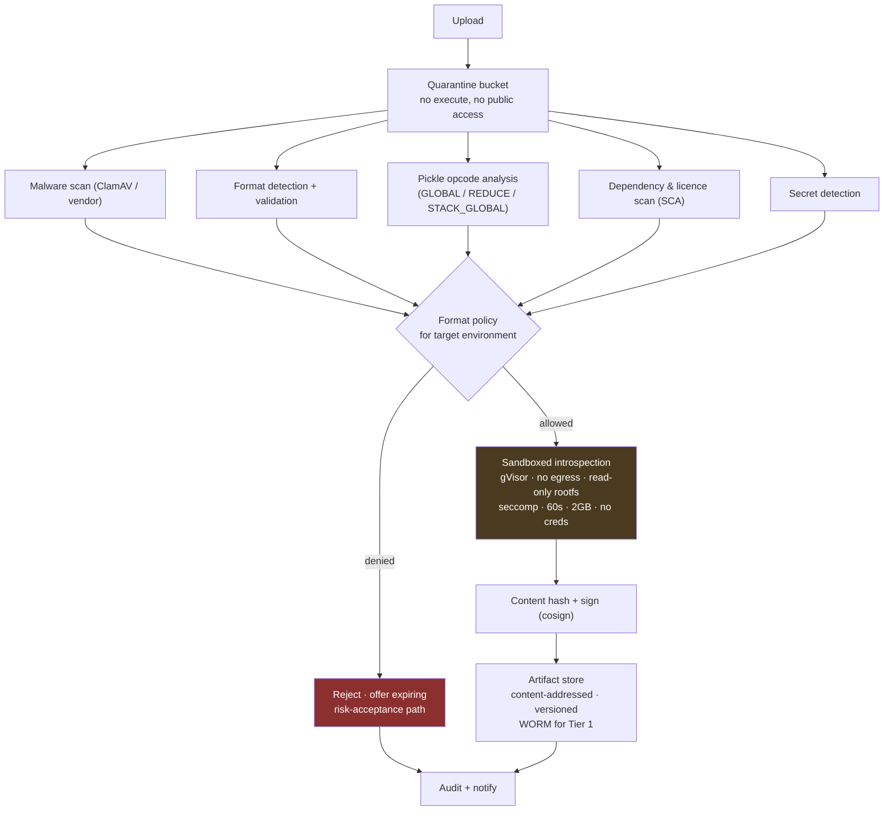

# 09 — Security, Controls and Compliance

*MAYA — Model & AI Lifecycle Assurance.*  **Evidence, not assertion.**

**Annex to** [04 — Architecture](04-architecture.md).

---

## 1. Threat model

MAYA is a **Tier 1 / crown-jewel** application: it holds the bank's model intellectual property, controls
what runs in production decisioning, and is the evidence base an examiner relies on. Compromise is a
regulatory event, not merely an IT one.

| # | Threat | Impact | Controls |
|---|---|---|---|
| T1 | **Malicious model artifact** (pickle RCE, poisoned weights, backdoored `.pth`) | Code execution, lateral movement | Format policy; opcode scanning; malware scan; sandbox-only deserialisation; content addressing; signature verification |
| T2 | **Evidence tampering** — altering a validation result or approval after the fact | Fraudulent assurance; regulatory misstatement | Append-only tables at the DB role level; Merkle chaining; WORM copies for Tier 1; independent chain verification job |
| T3 | **Unauthorised model execution** — running an unapproved model, or an approved model for an unapproved purpose | Unassessed risk in production; consumer harm | Hook entitlements bound to approved uses; fail-closed resolution; use reconciliation |
| T4 | **Model exfiltration** — bulk download of proprietary models | IP loss | Rate limits and quotas on resolution; anomaly detection on access patterns; artifact download audit; watermarking for Tier 1 |
| T5 | **Insider tier manipulation** — lowering a tier to escape controls | Control avoidance | Tiering is derived and traced; overrides require justification, elevated authority, and independent reassessment at validation |
| T6 | **Feature poisoning** — corrupting upstream data to shift model behaviour | Financial loss; fraud | Data-quality assertions; drift and skew detection; source lineage; anomaly alerting |
| T7 | **Prompt injection / jailbreak** against T5 models registered in MAYA | Data leakage; harmful output | Guardrail configuration as a versioned artifact; injection detection in monitoring; autonomy-mode limits; mandatory human review at Critical |
| T7a | **Prompt injection through inventory metadata** — an attacker or careless developer places instructions in a model description, feature definition or vendor document, which the platform's own drafting assistant then reads | Data exfiltration; corrupted governance artifacts. Note this surface does **not** exist for an ordinary enterprise chatbot | All inventory content treated as untrusted input; structural instruction/data separation; injection detection; capabilities hold no credential they do not need (`FR-AI-017`) |
| T7b | **Evidence poisoning by an assistant** — machine-created evidence supporting a machine-made claim | Fabricated assurance | Agents may **propose**; only humans and instrumented systems create evidence. AI output carries `ai_drafted` provenance and reduced trust, which the trust semiring propagates automatically |
| T7c | **Automation bias** — a usually-correct triage queue trains reviewers to approve without looking | Silent governance failure at scale | Deliberate sampling of AI proposals for full independent assessment (`FR-AI-015`); reviewer edit distance tracked, with a *falling* edit distance investigated (`FR-AI-016`) |
| T8 | **Supply-chain compromise** of MAYA itself | Total | SBOM per release; signed images; SLSA L3 build; dependency pinning; SCA in CI; reproducible builds |
| T9 | **Cross-entity data leakage** in a multi-entity deployment | Regulatory breach | Postgres RLS as the last line; ABAC in the API; residency partitioning; tested with negative cases |
| T10 | **Denial of the hook plane** | Bank-wide scoring outage | Independent scaling; regional failover; descriptor grace window; static fallback |
| T11 | **Compromised MAYA signing key** | Forged descriptors | KMS/HSM-held keys; 90-day rotation with overlapping validity; SDK pins a key set; emergency key revocation |
| T12 | **Malicious or careless policy change** | Estate-wide gridlock or estate-wide bypass | Policies versioned, peer-reviewed, tested against a golden corpus, canaried; policy changes are themselves audited and reversible |

---

## 2. Artifact security



### 2.1 Format policy

| Format | dev | test | uat | prod | Note |
|---|---|---|---|---|---|
| ONNX, PMML, PFA | ✓ | ✓ | ✓ | ✓ | Preferred — declarative, non-executing |
| safetensors | ✓ | ✓ | ✓ | ✓ | Preferred for tensors |
| H2O MOJO, Spark ML, TorchScript | ✓ | ✓ | ✓ | ✓ | Constrained execution |
| Source bundle (Python/R/SAS) | ✓ | ✓ | ✓ | ⚠ | Requires container pinning and code review |
| Container digest | ✓ | ✓ | ✓ | ✓ | Must be signed and SBOM-attested |
| **pickle / joblib / `.pth`** | ✓ | ✓ | ⚠ | ✗ | Denied in production. Exception: expiring, dual-authorised, with scan evidence and a migration plan |
| Reference-only (vendor) | ✓ | ✓ | ✓ | ✓ | No artifact; behavioural evidence required |

The pickle position is deliberate and evidence-based: research shows ~45% of popular public models still
ship as pickle, that malicious `.pth` files with embedded remote-access payloads have been published to
trusted hubs, and that scanners have both false positives and false negatives. A bank should not accept
that class of risk in production when ONNX and safetensors exist.

### 2.2 Sandbox specification

| Property | Setting |
|---|---|
| Isolation | gVisor or Kata Containers; one pod per task; destroyed after use |
| Network | Deny-all egress; artifact fetched by the supervisor and mounted read-only |
| Filesystem | Read-only root; `tmpfs` scratch capped |
| Identity | No service account token; no cloud credentials; no MAYA API access |
| Limits | CPU, memory, PID, wall-clock caps; OOM and timeout are normal outcomes, not incidents |
| Syscalls | Restrictive seccomp profile; no `ptrace`, no `mount` |
| Output | Structured result only; stdout/stderr captured, size-capped and sanitised |

The control plane **never** loads a model artifact in-process. This is `P7`, and it is the single most
important security decision in the design.

---

## 3. Identity and access

### 3.1 Roles

| Role | Capabilities |
|---|---|
| `viewer` | Read the catalogue and non-sensitive metadata |
| `developer` | Create models/versions, run fits, author documents, submit for validation |
| `feature_owner` | Define, materialise, certify and deprecate features |
| `model_owner` | Own models, approve uses, attest, accept residual risk within authority |
| `validator` | Execute validations, raise findings, issue reports (**never** on models they developed) |
| `approver` | Approve promotions within a delegated authority matrix |
| `mrm_admin` | Tiering rules, policies, lifecycles, templates, campaigns |
| `auditor` | Read everything including evidence and audit log; no writes |
| `examiner` | Time-boxed, scoped, fully-logged read; as-at-date queries; pack export |
| `platform_admin` | Infrastructure; **no** access to governance decisions or model artifacts |
| `service` | Machine principals for hook resolution and telemetry |

### 3.2 Segregation of duties

Enforced, not advisory:

```python
SOD_RULES = [
    Sod("developer_not_validator",
        "A person may not validate a model version they developed or materially advised on"),
    Sod("owner_not_sole_approver",
        "The model owner may not be the sole approver for Tier 1 and Tier 2"),
    Sod("no_self_finding_closure",
        "The person who raised a finding may not verify its closure"),
    Sod("policy_author_not_publisher",
        "Policy authoring and policy publication require different people"),
    Sod("platform_admin_no_governance",
        "Platform administrators cannot alter governance state or read artifacts"),
    Sod("overlay_proposer_not_approver",
        "The proposer of a post-model adjustment may not approve it"),
]
```

Violations are blocked at the API and re-checked in a nightly sweep (to catch role changes that create a
retrospective conflict). Access is recertified quarterly for privileged roles, annually otherwise.

### 3.3 Defence in depth for data isolation

Three independent layers, because one is not enough for cross-entity separation:

1. **API layer** — ABAC filters on entity, business unit, geography and classification.
2. **Data layer** — Postgres Row-Level Security keyed to session variables set by middleware. A missing
   filter in a handler still cannot leak.
3. **Storage layer** — separate object-store prefixes and KMS keys per legal entity where residency rules
   require it.

Negative tests for all three run in CI: an authenticated user of entity A must receive 404, not 403, for
entity B's models (existence itself can be sensitive).

---

## 4. Audit

```
audit_log:  actor · action · subject · before · after · request_id · ip · justification
            prev_hash · hash          ← SHA-256 chain over the canonicalised record
```

- **Append-only at the database role level.** The application role has `INSERT`/`SELECT` only.
- **Hash-chained.** A daily verification job walks the chain and alarms on any break.
- **Anchored.** The daily chain head is written to WORM storage and, optionally, to an internal
  timestamping authority — so tampering requires compromising two systems with different controls.
- **Comprehensive.** Every mutating call, every sensitive read (artifact download, PII feature preview,
  examiner access), every policy evaluation that denied an action.
- **Justification required** for: overrides, exceptions, break-glass, alias moves, revocations,
  decommissioning, tier overrides.
- **Retained 10 years**, partitioned monthly, with partition-level WORM.

---

## 5. Generative and agentic AI controls

SR 26-2 places GenAI and agentic AI **outside** MRM scope while stating that the firm's own risk
management should determine appropriate governance. MAYA implements that as a **parallel track**, so
these systems are governed without pretending they are statistical models.

### 5.1 Boundary determination

Before a GenAI use case may be registered for production, four gate conditions must hold:

| Gate | Condition |
|---|---|
| **G1 — No autonomous authority** | The system does not make a substantive decision on its own |
| **G2 — Institutional anchoring** | Output is grounded in approved models, policies or documents — not open-ended generation |
| **G3 — Bounded function** | It performs a defined support task, not general-purpose reasoning |
| **G4 — Feasible oversight** | A human can meaningfully review the output in the time available |

Only two operating modes pass:

- **Collaborative assistance** — a human is engaged throughout.
- **Human-approved automation** — the system processes autonomously but a human approves before the
  output has effect.

Anything failing a gate is either redesigned or refused. That decision, and its rationale, is recorded.

### 5.2 Risk assignment

A two-dimensional matrix — **decision proximity** × **consumer harm potential** — yielding Low / Moderate /
High / Critical, which sets evaluation rigour, monitoring frequency and human-review requirements.

| | Harm: none | Harm: inconvenience | Harm: financial | Harm: rights/credit |
|---|---|---|---|---|
| **Far from decision** | Low | Low | Moderate | High |
| **Informs decision** | Low | Moderate | High | Critical |
| **Drafts the decision** | Moderate | High | Critical | Critical |
| **Executes the decision** | *not permitted without redesign* | | | |

Adverse-action explanation drafting sits at **Critical**: it is consumer-facing, credit-related, and
drafts the text that becomes a legal notice under Reg B.

### 5.3 Evaluation and monitoring

| Metric | Applies | Definition |
|---|---|---|
| Accuracy | all | Factual correctness against ground truth or reviewer adjudication |
| **Groundedness** | RAG | Proportion of claims supported by retrieved evidence |
| **Citation accuracy** | RAG | Cited sources actually contain the cited claim |
| Completeness | drafting | Material information captured against a checklist |
| **Hallucination rate** | all | Unsupported assertions per output |
| Traceability | all | Output auditable to sources or rules |
| **Adverse-action fidelity** | credit | Does the text reflect the *actual* principal factors driving the decision |
| Toxicity / harmful advice | customer-facing | Guardrail violations |
| PII leakage | all | Sensitive data in output |
| Jailbreak / injection | all | Detected attempts and successes |
| Refusal rate | all | Over- and under-refusal |
| Human edit distance | drafting | How much reviewers change — the best available proxy for real quality |
| Human override rate | decisioning | How often the human disagrees |
| Cost & latency | all | Tokens, dollars, p99 |

**Every prompt change, RAG corpus change, base-model change, tool change or guardrail change re-runs the
frozen eval set before deployment.** A base-model version silently changing under a vendor endpoint is
treated as a change event — MAYA fingerprints base-model behaviour on a canary probe set to detect it.

### 5.4 Agentic additions

For systems that take actions rather than produce text:

- **Tool manifest** as a versioned artifact — every callable function, its blast radius, and whether it
  is reversible.
- **Action audit** — every tool call logged with arguments and result.
- **Reversibility classification** — irreversible actions require human approval regardless of risk tier.
- **Budget and step limits** — hard caps on iterations, tokens and cost, enforced at the gateway.
- **Blast-radius assessment** at registration — what is the worst thing this agent can do?

---

## 5a. The platform's own machine assistance

MAYA uses AI. It therefore governs its own use on exactly the terms in §5, with no platform exemption —
see [13](13-ai-in-the-platform.md) for the full argument and [00 §12a](00-mathematical-foundations.md)
for the criterion.

| Control | Implementation |
|---|---|
| **Self-registration** | Every capability is a T5 model in MAYA's own inventory: owner, approved use, autonomy mode, tier, contract, frozen eval set, budget, kill switch. Visible on the same dashboards, to the same auditors, with the same red marks when it drifts |
| **Oracle gating** | A capability is admitted only where a decision procedure checks its output, or where citation verification applies. Capabilities without either do not ship |
| **No governance credential** | No AI capability holds a credential permitting a governance state transition. This is enforced by the IAM model, not by policy — policy erodes under commercial pressure from sensible people |
| **Grounded output only** | Retrieval over the evidence graph; every factual claim cites evidence node ids; the citation is verified by Boolean evaluation; numbers are interpolated, never generated |
| **Provenance** | `ai_drafted` until human attestation, at reduced trust, propagated automatically by the trust semiring |
| **Forcing function** | If the platform cannot govern its own AI, it cannot govern the bank's. Every awkwardness in the GenAI track surfaces first in our own use, where we cannot blame the user |

## 6. Fair lending and consumer protection

Applies to models in ECOA/Reg B, FCRA, UDAAP or EU AI Act Annex III scope.

| Control | Implementation |
|---|---|
| **Protected-basis exclusion** | Features flagged `protected_basis` cannot bind into a credit model's contract — enforced by the policy engine, not by review |
| **Proxy testing** | Features with `proxy_risk: high` require documented business necessity and proxy-discrimination testing before use |
| **Disparate impact testing** | Adverse Impact Ratio, statistical parity difference and equal-opportunity difference computed at validation **and** continuously in monitoring, per protected class |
| **Less discriminatory alternative search** | A documented, evidenced search for LDAs, retained as evidence — the CFPB's stated expectation. MAYA's challenger framework performs and records it |
| **Reason-code dictionary** | A versioned artifact mapping each feature to a borrower-readable reason and a Reg B category, with legal sign-off recorded |
| **Reason-code fidelity testing** | For each generated reason: is it specific to this applicant, causal in the model, accurate against the application data, and free of disparate-impact concern? Tested, not assumed |
| **Explanation availability** | The contract's guarantee `G` includes "explanation available for every score"; a model that cannot explain cannot be approved for adverse-action use |
| **Vulnerable-customer treatment** | Flagged models require additional review of outcomes for vulnerable segments |
| **Record retention** | Application, features, score, reasons and model version retained per FCRA/Reg B and the bank's standard |

---

## 7. Control library and framework mapping

MAYA ships a control library mapped to the frameworks a large bank must evidence. Each control names the
MAYA feature that operates it, so a control-testing exercise becomes a query rather than a project.

| Control | SR 26-2 | SS1/23 | EU AI Act | NIST AI RMF | ISO 42001 | Operated by |
|---|---|---|---|---|---|---|
| Complete model inventory | VI | 1.2 | Art. 11 | MAP-1 | 6.1 | Registry + discovery |
| Documented scope determination | II | 1.1 | Art. 6 | MAP-1.1 | 6.1.2 | Regime engine |
| Risk tiering with rationale | III | 1.3 | Art. 9 | MAP-1.5 | 6.1.2 | Tiering engine |
| Named individual accountability | VI | 2.x | Art. 14 | GOVERN-2 | 5.3 | Ownership model |
| Segregation of duties | VI | 2.x | — | GOVERN-3 | 5.3 | SoD engine |
| Development standards & testing | IV | 3.1–3.3 | Art. 9, 15 | MEASURE-2 | 8.3 | Lifecycle + test catalogue |
| Data governance & representativeness | — | 3.2 | **Art. 10** | MAP-2 | 8.2 | Feature platform |
| Independent validation | V | 4.x | Art. 9 | MEASURE-3 | 9.2 | Validation workbench |
| Effective challenge evidenced | III, V | 4.x | — | MEASURE-3.3 | 9.2 | Evidence graph |
| Ongoing monitoring | V | 4.x | **Art. 72** | MEASURE-4 | 9.1 | Monitoring |
| Automatic event logging | — | — | **Art. 12, 19** | MEASURE-1 | 8.4 | Inference log |
| Technical documentation | VI | 4.x | **Art. 11 / Annex IV** | GOVERN-4 | 7.5 | Document compiler |
| Human oversight design | V | 3.x | **Art. 14** | GOVERN-3.2 | 8.1 | Use conditions + GenAI gates |
| Change management | — | 3.3(c) | Art. 43 | MANAGE-4 | 8.1 | Lifecycle + alias gates |
| Post-model adjustment control | — | **Principle 5** | — | MANAGE-2 | 8.1 | Overlay register |
| Vendor model oversight | **VII** | 2.6 | Art. 25 | GOVERN-6 | 8.1 | Vendor register |
| Issue and remediation tracking | VI | 1.2(c)(iii) | Art. 73 | MANAGE-4 | 10.1 | Findings register |
| Aggregate risk assessment | **III** | 1.2(b) | — | MAP-5 | 6.1 | Dependency graph |
| Access control & audit trail | — | — | Art. 12 | GOVERN-1 | 8.4 | IAM + audit log |
| Model supply-chain integrity | — | — | Art. 15 | MANAGE-3 | 8.1 | Signing + AI-BOM |

---

## 8. Business continuity

| Scenario | Response |
|---|---|
| MAYA control plane unavailable | Hook plane continues; already-authorised production scoring is unaffected. Governance changes queue. |
| MAYA hook plane unavailable in a region | Regional failover; SDK grace window covers the switch. |
| Total MAYA outage beyond the grace window | Documented manual break-glass: pre-authorised static descriptors for a named set of Tier 1 production models, held in escrow, dual-controlled, with mandatory post-hoc review of every use. |
| Data loss | Postgres PITR; Delta time travel; object-store versioning and cross-region replication; quarterly restore tests with evidence. |
| Ransomware | Immutable backups (object lock); WORM evidence tier; offline chain-head anchors. |
| Loss of a key person | No single-person dependency: ownership is a role with a deputy; policy and configuration are code in git. |

**Recovery objectives:** control plane RTO 4 h / RPO 15 min; hook plane RTO 15 min / RPO 0; audit log RPO 0
(synchronous replication).

---

Copyright © 2026 Ashutosh Sinha <ajsinha@gmail.com>. All rights reserved.
Proprietary and confidential. See [LICENSE](../LICENSE) and [NOTICE](../NOTICE).
*Not legal, regulatory or financial advice — see NOTICE §4.*
