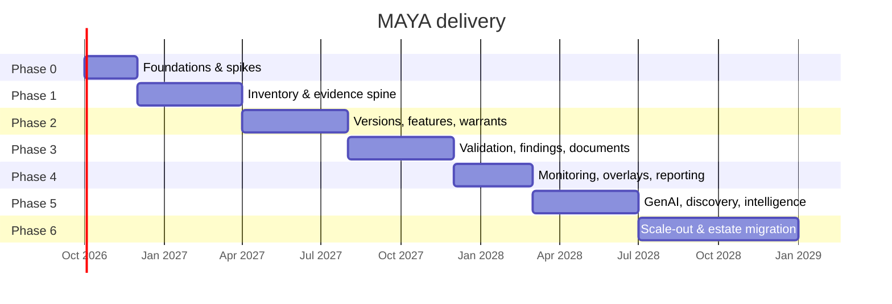

# 10 — Delivery Roadmap

*MAYA — Model & AI Lifecycle Assurance.*  **Evidence, not assertion.**

**Annex to** [03 — Requirements](03-requirements.md) and [04 — Architecture](04-architecture.md).

---

## 0. What this document is now

**This is a programme plan for a bank deployment, not a record of what has been built.** The two had
drifted far enough apart to mislead: the phases below are dated from October 2026 and describe as
future work a great deal that exists today, so a reader taking §2 at face value would conclude that
the registry, the warrant protocol and the feature platform are ahead rather than behind.

The authoritative record of what exists is
[**12 §0, Build status**](12-implementation-plan.md#0-build-status). Read that first. Against it:

| Phase | Status of its component list |
|---|---|
| **0 — Foundations** | Domain core built. The law harness exists in a different shape (no `tests/laws/`; see [00 §12](00-mathematical-foundations.md#12-the-laws-maya-enforces)). No plugin loader, no Alembic, no IaC, and the three spikes were not run |
| **1 — Inventory and evidence spine** | Built, except: no connectors (MLflow, Unity Catalog, git), no discovery, no bulk import from those sources, no RLS. **The Python SDK is built** (`sdk/python`); the Java one is not, and its contract is written down rather than stubbed |
| **2 — Versions, features and warrants** | Built, and overtaken — the warrant *grammar*, featuresets, parameter sets and bulk transfer are all beyond what this phase asked for. Not built: the online store, and therefore skew detection |
| **3 — Validation, findings and documentation** | Built, including replay from the pinned snapshot. Not built: export packs, an examiner portal, PDF or any rendering beyond markdown |
| **4 — Monitoring, overlays and reporting** | Built, including telemetry ingestion, delayed labels and the overlay register. Not built: the board pack, KRI dashboards, Spark-scale evaluation |
| **5 — GenAI, discovery and intelligence** | **Inverted.** Machine assistance is built and governed; the *generation* is not — MAYA records what a language model produced and never calls one. No discovery, no EUC scanner, no semantic search |
| **6 — Scale-out and estate migration** | Not started, and correctly so: it is a deployment phase |

Three whole subsystems appear in no phase below, because they were not foreseen when this was written:
**versioned policy gates**, **single sign-on**, and **notification**. Each is in 12 §0.

The sequencing argument in §1 and the build/buy record in §5 are unaffected by any of this and are the
reason to keep the document.

---

## 1. Strategy

Three principles shape the sequencing.

1. **Earn the inventory before automating it.** Nothing else works if the inventory is incomplete, so
   Phase 1 optimises for *getting every model in*, including the awkward ones — vendor, EUC, quant.
2. **Ship the hard architecture first, the pretty features later.** The evidence graph, the fibration and
   the warrant protocol are load-bearing. Retrofitting immutability or extensibility is not possible; adding a
   dashboard is trivial.
3. **Make the compliant path the fast path from day one.** If the SDK lands after the UI, developers will
   have already built workarounds and we will spend two years undoing them.

---

## 2. Phases

### Phase 0 — Foundations (2 months)

| Deliverable | Detail |
|---|---|
| Repository, CI/CD, IaC | Two repositories ([ADR-011](adr/ADR-011-decoupled-frontend.md)), Docker, Helm, Terraform, environments |
| Domain core | `Para(Stoch)` types, trainability classes, contract algebra, schema lattice |
| Law harness | Law tests beside the code they constrain, Hypothesis where a generated input earns it; L-4, L-7 and L-12 implemented first |
| Plugin loader | Entry points, fibre totality validation (L-15) |
| Postgres baseline | Core DDL, RLS pattern, audit chain, Alembic |
| Delta baseline | Table layouts, retention classes, write path |
| **Spikes** | PIT join at 1B rows; warrant resolution p99 under load; sandbox escape testing; ONNX/PMML introspection breadth |

**Exit:** the executable laws exist as tests (most failing); a model can be created and read; the spikes have
answered the three questions that could invalidate the architecture.

### Phase 1 — Inventory and evidence spine (4 months) — *MVP*

| Deliverable | Requirements |
|---|---|
| Model registry with URNs, ownership, uses, assumptions, limitations | FR-INV-001..009, 018..020 |
| Model class fibres for the top 20 families (seeded from [02](02-model-taxonomy.md)) | — |
| Regime engine with SR 26-2, SS1/23, EU AI Act, SOX | FR-INV-004 |
| Tiering engine with derivation, triggers, monotonicity | FR-TIER-001..008 |
| Evidence graph + Boolean/Why/How/Freshness semirings | FR-* (foundational) |
| Dependency graph, blast radius | FR-INV-009..011 |
| Bulk import; MLflow, Unity Catalog and git connectors | FR-INV-012 |
| Lifecycle engine, workflow, approvals, e-signature, SoD | FR-LC-001..011 |
| IAM, RBAC/ABAC, RLS, audit chain | FR-SEC-001..010 |
| Inventory UI, model detail page, as-at-date query | FR-INV-015..016 |
| Python SDK v1 (register, read, submit) | FR-PLT-002 |

**Exit:** 300 models registered including 30 vendor and 20 quant; a tier derivation withstands challenge
from the MRM head; an as-at-date inventory export is produced for a mock examiner request.

### Phase 2 — Versions, features and warrants (4 months)

| Deliverable | Requirements |
|---|---|
| Version upload, introspection, security scanning, format policy, signing | FR-VER-001..008, 011, 015 |
| Calibration sets for T1; prompt bundles for T5 | FR-VER-013..014 |
| Aliases with refinement and variance gates | FR-VER-009..010 |
| Feature registry, views, Delta materialisation, quality assertions | FR-FEA-001..003, 011, 014, 017 |
| PIT training-set generation and verifier | FR-FEA-004; L-10 |
| Feature contracts and consumer impact | FR-FEA-006, 008..009 |
| Run tracking, reproducible replay, challengers | FR-TRN-001..003, 008..009 |
| **Warrant service**: resolution, signing, revocation, telemetry | FR-WARRANT-001..012 |
| Warrant flavours: `descriptor_only`, `python_sdk`, `rest_oip_v2`, `batch_spark` | FR-WARRANT-002 |
| Upload wizard, feature reconciliation UI | — |

**Exit:** an execution engine runs a production model solely via a warrant; an alias move switches the served
version with no consumer change; a PIT-verified training set reproduces a fit bit-for-bit.

### Phase 3 — Validation, findings and documentation (4 months)

| Deliverable | Requirements |
|---|---|
| Validation plans, test catalogue, executable tests | FR-VAL-001..004 |
| Independent recode harness; sandbox execution | FR-VAL-004 |
| Findings, remediation, blocking behaviour, closure verification | FR-VAL-005..006 |
| Risk-based validation scheduling and campaigns | FR-VAL-008, FR-LC-012 |
| Vendor validation workflow | FR-VAL-009 |
| Document compiler, lenses, staleness, completeness | FR-DOC-001..006; L-11 |
| Templates: MDD, validation report, model card, Annex IV, AI-BOM, decommissioning | FR-DOC-002 |
| Export packs and examiner portal | FR-DOC-010; FR-SEC-008 |
| Validation workbench UI | — |

**Exit:** a full Tier 1 validation is completed end-to-end in MAYA; the validation report compiles with
>90% auto-generated content; an EU AI Act Annex IV pack is produced for a high-risk model.

### Phase 4 — Monitoring, overlays and reporting (3 months)

| Deliverable | Requirements |
|---|---|
| Monitor definitions, class-aware defaults, Spark evaluation | FR-MON-001..003 |
| Delayed labels, slice monitoring, fairness slices | FR-MON-004..005 |
| Breach → finding automation; model health score | FR-MON-006..007 |
| Inference logging and retention | FR-MON-008 |
| **Approved-use vs actual-use reconciliation** | FR-MON-009 |
| Operating-boundary monitoring | FR-MON-010 |
| Training–serving skew detection | FR-FEA-007, 012 |
| **Overlay / PMA register** with magnitude, ageing, propagation, recurrence | FR-PMA-001..008 |
| KRIs, risk appetite, board pack | FR-RPT-001..006 |
| External monitoring ingestion | FR-MON-016 |

**Exit:** a monitoring breach automatically restricts a production warrant; the overlay dashboard is used in
a real IFRS 9 committee; the board pack is generated rather than assembled.

### Phase 5 — GenAI, discovery and intelligence (4 months)

| Deliverable | Requirements |
|---|---|
| GenAI track: boundary gates, risk matrix, eval harness | §5 of [09](09-security-compliance.md) |
| Prompt/RAG/tool/guardrail versioning; base-model change detection | FR-VER-014; FR-MON-013 |
| LLM gateway integration; trace, cost and token monitoring | INT-016 |
| Agentic controls: tool manifest, action audit, reversibility, budgets | — |
| Continuous discovery sweeps; discovery exceptions | FR-INV-013 |
| EUC scanner ingestion and register | FR-INV-014 |
| Semantic search across inventory, docs and code | FR-INV-015 |
| AI documentation assistant (governed as a T5 model in MAYA itself) | FR-DOC-007 |
| Automated retraining pipelines with governed promotion | FR-TRN-006 |
| Composite warrants | FR-WARRANT-017 |
| Additional warrant flavours: `sql_udf`, `stream`, `container`, `sheet` | FR-WARRANT-002 |

**Exit:** GenAI use cases are governed on the parallel track; discovery finds unregistered models the
inventory campaign missed; the documentation assistant demonstrably reduces authoring time without
introducing ungrounded claims.

### Phase 6 — Scale-out and estate migration (6 months)

| Deliverable | Detail |
|---|---|
| Migrate the full estate | 1,000+ models, all domains, all entities |
| Decommission legacy | Retire the incumbent MRM tool and the inventory spreadsheets |
| Remaining connectors | SageMaker, Vertex, SAS, ServiceNow, Collibra, GRC, ML observability |
| Multi-entity and residency | FR-PLT-006 |
| Regulatory return extracts | FR-RPT-007 |
| Performance hardening | Meet every NFR at full estate size |
| Fibre library expansion | All families in [02](02-model-taxonomy.md) |
| Bank-specific extensions | Local regulators, house test methods, in-house runtimes |

---

## 3. Team

| Phase | Backend | Frontend | Data/Spark | Quant/MRM SME | Platform/SRE | Security | Product/BA |
|---|---|---|---|---|---|---|---|
| 0 | 3 | 1 | 1 | 1 | 1 | 0.5 | 1 |
| 1 | 5 | 2 | 1 | 2 | 1 | 0.5 | 2 |
| 2 | 6 | 2 | 2 | 2 | 2 | 1 | 2 |
| 3 | 6 | 3 | 2 | 3 | 2 | 0.5 | 2 |
| 4 | 5 | 2 | 3 | 2 | 2 | 0.5 | 2 |
| 5 | 6 | 2 | 2 | 2 | 2 | 1 | 2 |
| 6 | 4 | 2 | 2 | 3 | 2 | 0.5 | 3 |

The **quant/MRM SME** line is not optional. A platform built without validators in the room produces a
system validators route around.

---

## 4. Risks

| Risk | L | I | Mitigation |
|---|---|---|---|
| **Developers route around MAYA** | H | H | SDK-first; the compliant path must be faster; embed in notebooks and CI; measure and publish developer NPS |
| **Inventory never reaches completeness** | M | H | Automated discovery from Phase 5, but *manual* connector-driven reconciliation from Phase 1; make unregistered models fail their CI gate |
| **Regulatory change invalidates the model** | M | M | Institutions (§8 of [00](00-mathematical-foundations.md)) make this a plugin change; SR 26-2 arriving mid-design is precisely the scenario this guards against |
| **Over-engineering the theory** | M | M | The rent test (§0 of [00](00-mathematical-foundations.md)); every abstraction ships with a law and a test or it is cut |
| **Delta/Spark expertise scarce** | M | M | Keep Spark to the data plane; `delta-rs` for small operations; invest in two deep specialists |
| **Warrant plane becomes a bank-wide SPOF** | L | **VH** | Independent scaling, regional failover, grace window, escrowed static descriptors, quarterly failure drills |
| **Scope creep into enterprise GRC** | H | M | Explicit boundary: MAYA owns model risk; issues sync to the GRC platform, they do not live in two places |
| **jQuery/Bootstrap constraint limits UX** | M | L | Server-rendered fragments; the constraint mainly costs us rich client interactivity, which this product needs less than it needs correctness |
| **Vendor models resist governance** | M | M | Contractual attestation requirements at renewal; own-outcomes analysis works without vendor cooperation |
| **GenAI moves faster than the platform** | H | M | GenAI is a fibre and a track, not a rebuild; expect quarterly evolution of that fibre |
| **Machine assistance ships ahead of its oracle** | H | H | No capability ships before the check that verifies it — see [12](12-implementation-plan.md). The pressure to ship an impressive ungated demo will be constant; the gate is that a capability without an oracle or a grounding check does not deploy |
| **Assistants drift toward deciding** | M | **VH** | Architectural, not procedural: no AI principal holds a credential permitting a governance state transition ([13 §5](13-ai-in-the-platform.md)). Policy erodes; missing credentials do not |

---

## 5. Build/buy decision record

| Option | Assessment |
|---|---|
| **Buy a GRC/MRM platform** (OpenPages, SAS MRM, ValidMind, ModelOp) | Gets workflow and documentation quickly. Does not deliver artifact binding, feature management, warrants, or coverage of the quant and EUC estate. Would require a second and third system alongside. |
| **Buy an MLOps platform** (Databricks, Domino, DataRobot) | Gets artifacts, lineage and monitoring for the ML subset. Does not deliver MRM domain objects, multi-regime scoping, overlays, findings, or 60–80% of the estate. |
| **Buy both and integrate** | The status quo at most large banks. Produces two inventories that disagree, and an integration layer nobody owns. The disagreement is itself an audit finding. |
| **Build MAYA** | Higher initial cost. Delivers the six capabilities absent from the market ([01 §6](01-industry-research.md#6-the-gap--why-we-build)), and the extension architecture means the bank is not exposed to a vendor's roadmap for the next regulator or the next model paradigm. |

**Recommendation: build**, while integrating rather than replacing — MLflow/Unity Catalog stays as a
training substrate, the enterprise GRC platform stays as the enterprise issue register, and ML
observability tools stay as optional metric producers. MAYA is the system of record that binds them.

---

Copyright © 2026 Ashutosh Sinha <ajsinha@gmail.com>. All rights reserved.
Proprietary and confidential. See [LICENSE](../LICENSE) and [NOTICE](../NOTICE).
*Not legal, regulatory or financial advice — see NOTICE §4.*
