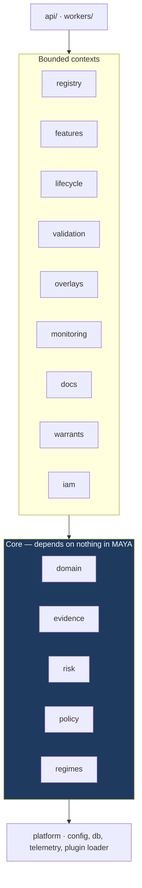
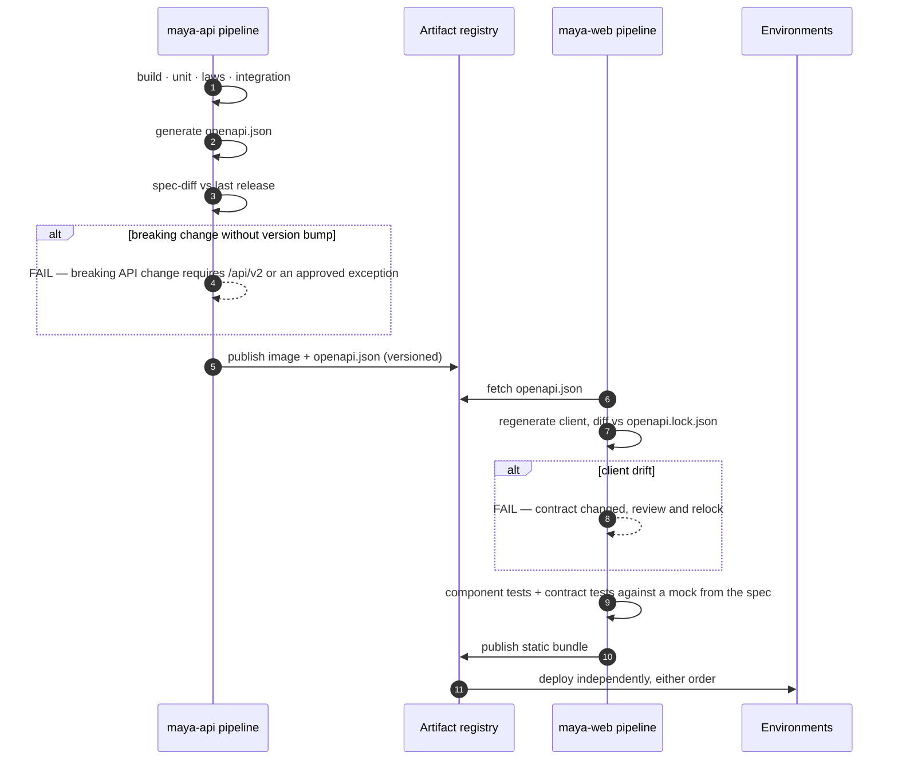

# 12 — Implementation Plan

*MAYA — Model & AI Lifecycle Assurance.*  **Evidence, not assertion.**

**Follows** [10 — Roadmap](10-roadmap.md) (phases and business sequencing) and
[11 — Adversarial Design Review](11-adversarial-review.md) (findings this plan discharges).
**Governed by** [ADR-011](adr/ADR-011-decoupled-frontend.md) — front end and backend are separate,
concurrently running processes.

> Where [10](10-roadmap.md) answers *what we deliver and when*, this document answers *how it is built*:
> repository topology, module boundaries, the contract between front end and backend, the test pyramid,
> CI gates, environments, and a workstream-level breakdown with explicit definitions of done.

---

---

## 0. Build status

*Last updated after milestone 31. This section is the authoritative record of what
is built; the phases below are the plan it is being built against.*

| | Component | State | Evidence |
|---|---|---|---|
| ✅ | **Configuration** (`core/config/`) | **Complete** | YAML with git-ignored `.local` overlay, `${...}` resolution, typed accessors, source tracking, auto-reload, precedence CLI > env > files |
| ✅ | **Domain algebra** (`core/domain/`) | **Complete** | `Para(Stoch)` kernels, derived trainability T0–T8, schema variance (L-12), contract algebra with refinement (L-7), probe-relative equivalence |
| ✅ | **Persistence** (`db/`) | **Complete** | Two hand-written schemas, no migrations. SQLite default, PostgreSQL switchable by URL alone. Repositories are the only interface; no SQL above this package |
| ✅ | **Evidence engine** (`core/evidence/`) | **Complete** | Append-only hash chain with tamper and deletion detection. Verification **re-derives** each node's content hash from its own fields rather than re-linking the stored one — re-linking proves the links are intact and says nothing about whether the thing linked is still what was recorded, so an edited payload left a chain that verified and a record that lied. The scale suite found it, and the unit test that should have was named for payload tampering while actually altering the stored hash: a test passing for a reason other than its name. Six semirings over one traversal; citation verification |
| ✅ | **Risk tiering** (`core/risk/`) | **Complete** | Separate materiality and complexity lattices, monotone τ (L-4), Galois-adjoint control sets (L-5), derivation stored with every assessment |
| ✅ | **Registry** (`core/registry/`) | **Complete** | Immutable versions, governed aliases gated on refinement and variance proofs *and* on the findings register, full move history |
| ✅ | **Warrants** (`core/execution/`) | **Complete** | Signed, expiring, entitlement-bound descriptors. Fails closed on unknown principal, unapproved use, unapproved version, revocation, and open blocking findings |
| ✅ | **Captive engine** (`core/execution/engine.py`) | **Complete** | A consumer of the public warrant contract. Verifies signature, expiry and operating boundary before touching an artifact |
| ✅ | **Feature platform** (`core/features/`) | **Complete** | Bitemporal Delta storage, version-namespaced serving (fixes C-2), PIT assembly with three-layer verification, contracts, retirement guard |
| ✅ | **HTTP surface** (`routes/`) | **Complete** | Inventory, versions, aliases, risk, warrants, features, health. RFC-9457-shaped refusals carrying remediation |
| ✅ | **Web interface** (`web/`) | **Complete** | Landing, login, about, help, dashboard, model detail. The model page shows versions, pinned feature contracts, validation episodes, findings, warrants and evidence. Every asset vendored — no CDN |
| ✅ | **Content system** (`core/content/`) | **Complete** | Help and about pages are markdown under `content/`, rendered server-side and cached on modification time. 30 help topics in 6 sections (~23,000 words) plus a competitive analysis on About. Versioned and reviewable in a pull request alongside the behaviour they describe |
| ✅ | **Validation & findings** (`core/validation/`) | **Complete** | Eight-test catalogue computed from first definitions; independence attested and enforced; approval refused over a failed test or an open blocking finding; findings register whose blocking flag gates both alias promotion and warrant resolution; digest-based reproducibility replay that distinguishes *unchecked* from *reproduced*. A finding also has a workflow between being raised and being closed: it can be handed over with a reason, must be accepted by its owner with a plan before its date can be moved, and its date can only be moved by somebody who does not own it, with a reason, counted — past the limit the extension becomes a finding of its own. Ageing, overdue-ness, acceptance and escalation are **derived from the acts**, so there is no status table to disagree with the register, and the ageing profile a committee asks for (severity, age distribution, overdue, extension counts) is computed rather than assembled by hand |
| ✅ | **Documentation compiler** (`core/docs/`) | **Complete** | Four document kinds compiled from the register and the evidence graph by fifteen lenses. Every section records the evidence it rested on, so citation soundness is a Boolean evaluation rather than a claim. Staleness is *computed* from the chain head at compile time, not remembered. A lens that cannot fill its section says so in the document, so a gap in the model's evidence is visible rather than blank. Rendered through the same markdown pipeline as the help system |
| ✅ | **Monitoring** (`core/monitoring/`) | **Complete** | Four monitor kinds, each admitting only the tests that can answer it, checked at definition time. Delayed labels are first-class: a performance monitor must declare its outcome window, maturity is decided per row, and evaluation over an immature cohort is refused with the date it becomes measurable. A breach raises a finding, escalating with persistence; recovery closes the breach and deliberately leaves the finding open |
| ✅ | **Overlay register** (`core/overlays/`) | **Complete** | Four adjustment kinds, each time-boxed; the proposer may not approve and the owner may not renew; renewal is refused without a measurement for the period. Persistence, materiality relative to the model's own output, and trend are computed — and an overlay renewed past its limit raises a finding, because at that point it is an unversioned model change. Aggregate magnitude answers the question a risk committee asks and rarely gets. Appears in every compiled document |
| ✅ | **Regime engine** (`core/regimes/`) | **Complete** | Three regimes encoded as institutions — SR 26-2, PRA SS1/23, EU AI Act — each with its own signature, obligations in that vocabulary, and a translation into the core. The satisfaction condition (truth invariant under change of notation) is *checked* against probe states spanning the corners, and a regime whose encoding fails it cannot be activated. Determinations are derivations: every verdict carries the terms it read and the citation it rests on. Regimes that disagree are reported as disagreeing rather than merged. Adding a supervisor is a signature, some sentences and a translation |
| ✅ | **Authorisation** (`core/authz/`) | **Complete** | Eight roles across three lines of defence, refused incompatible pairs, entity and domain scope that filters listings as well as detail pages, and segregation of duties read from the evidence chain rather than a second who-did-what table. A rule may name the payload field carrying the identity it is about, because an evidence node's subject is not always the thing an act concerns: a finding is raised against the *model*, which is where a reader looks for it, while the act being checked is about one finding. Without that the raiser-may-not-close rule was inert over HTTP — it searched under the finding's own id, found nothing, and permitted everything. HTTP Basic for services against the same principal register; PBKDF2 with a short verification cache that shortens the key derivation and never the decision |
| ✅ | **Lifecycle & attestation** (`core/lifecycle/`) | **Complete** | Six-state record machine: draft → submitted → approved → attested, with amendment as the only route out of immutability. Attestation is a quorum of configured roles, each signing once and only for a role they hold; one decline returns the record to work. An attested record refuses field changes *and* new versions. Retirement keeps everything; deletion is administrators-only and leaves the evidence chain intact. Workflow stepper in the interface driven by the same API an external client uses |
| ✅ | **Warrant grammar** (`core/execution/grammar/`) | **Complete** | Four independent vocabularies whose *product* covers the estate: how the parameter object is inhabited × how the kernel is realised (17 runtimes) × what is asked of it (10 verbs) × where its data comes from (12 bindings). Ten admissibility laws derived from the algebra — `fit` is refused for T0 and T6 because that is what those classes mean. JSON Schema generated from the vocabulary and published; every warrant validated before it is signed. Thirteen worked examples in `examples/warrants/`, spanning QuantLib swaption pricing, swap pricing and Hull–White calibration, ONNX, PMML, prompt bundles, agents, a vendor black box, a spreadsheet, a VaR backtest, and a linear regression fitted from a featureset and then scored on the parameters it produced — all validated on every test run |
| ✅ | **Decks** (`tools/deck/`) | **Complete** | Three, reproducible from source rather than binaries nobody can edit safely, each re-audited for geometry before it ships. The *research* deck argues models as parametric kernels; the *system design* deck is for whoever builds the platform; the *model and feature engineering* deck is for whoever uses it: it opens with the five words and a single-slide process diagram of model, feature and warrant management, and closes with a worked example carrying real numbers — a daily price series and a lagged unemployment rate, aligned into one featureset, read by a linear regression and a GARCH model, then extended until the old model can no longer consume it — the four rows being the catalogue, the selection, the model, and what comes back |
| ✅ | **Tutorials** (`content/tutorials/`) | **Complete** | Six worked walkthroughs rendered at request time: a model end to end with four separated principals, storing artifacts, running several versions, features end to end, training a model end to end (a New Jersey home-price regression, from primitive features through derived ones and a named featureset to the coefficients an engine returns), and warrants by model family |
| ✅ | **Machine assistance** (`core/assist/`) | **Complete** | Capabilities registered at Tier A (a named oracle checks the output) or Tier B (every claim cites evidence); Tier C is deliberately not registrable. Five oracles, each backed by machinery that exists for another reason. The grounding gate *removes* unsupported claims rather than flagging them, and keeps them for the reviewer. Nothing is evidence until a person attests it, and never the person who asked. Edit distance and a mandatory review sample detect automation bias |
| ✅ | **Scheduler** (`core/scheduler/`) | **Complete** | Seven idempotent jobs turning computed conditions into recorded consequences: a lapsed attestation and a stalled monitor each raise a finding, overlays past their window close, baseline debt reconciles, a missed remediation window is recorded as its own finding rather than by rewriting the original, a finding nobody ever accepted is recorded as another, and everybody with outstanding work is told about it. A run is an ordinary authenticated call — cron, a CronJob or a person produce identical results — with an in-process loop offered as a convenience and off by default. One failing job does not stop the others, and the scheduler reports its own health on `/health/ready` |
| ✅ | **Estate view & worklist** (`core/estate/`) | **Complete** | Outstanding work derived from the register rather than assigned — no task table, so it cannot go stale, disagree with the register, or accumulate orphans. Filtered to what a principal holds the permission and scope to do, and for attestation to their own role's signature. A finding whose owner has never accepted it is derived onto the list too, which makes the reminder cycle the existing notification digest rather than a second delivery path. Estate summary aggregates governance, assurance, adjustments and baseline debt, with debt kept apart from breach |
| ✅ | **Scale suite** (`tests/test_scale.py`, `tests/test_transfer_scale.py`) | **Complete** | Every other test asserts something is *correct*; these assert it is still correct, and still quick enough to use, at a size where a good implementation and a bad one look different. Written to two rules. **Assert shape, not stopwatch**: a threshold in milliseconds is a promise about somebody else's hardware and a suite that fails on a loaded machine is one people re-run rather than read, so the assertions are mostly about *complexity* — that doubling the estate does not more than double the work, that an operation claimed constant in estate size is, that a read claimed not to materialise a dataset does not. Where a wall-clock budget appears it is generous by an order of magnitude, because its job is to catch a change from linear to quadratic rather than to measure a machine. **Run at a size the default suite will not**, marked `scale` and excluded by default: a slow suite gets disabled, and a disabled suite proves nothing. It found the evidence chain defect below on its first run |
| ✅ | **Versioned gates** (`core/policy/`) | **Complete** | A gate that cannot be changed without a release is a gate people work around; a gate that *can* be changed without one is a gate that can be **weakened** without one, which is worse. Everything here makes the first possible without making the second silent. A rule is a **predicate over a closed vocabulary of facts** — comparison, membership, boolean connectives, two quantifiers, and no loops, assignment or function definitions, which is what makes a rule something a reviewer can reason about rather than something they have to run. A fact the gate does not publish is refused *when the rule is written*, because a rule that failed at the moment of a governance decision would have failed at the worst possible time. **A policy ships with its own cases and cannot be published until they pass**, and at least one must be a case it refuses: a policy nobody has shown to refuse anything is a policy nobody has shown to be a gate. **Weakening is allowed and never quiet** — the register replays the outgoing version's cases against the incoming rule and reports every verdict that flipped, so a change that loosens a gate is something somebody decided rather than something somebody discovered. Authoring and publishing are separate duties. An instance that publishes nothing runs exactly what it ran before: the built-in rules are the default for every gate, expressed in the same language. And the honest boundary, stated rather than implied — **policy tightens; the code's invariants are the floor**, because replacing an invariant with a line of configuration means a typo can weaken the platform and the failure looks like a successful deployment |
| ✅ | **Single sign-on** (`core/authz/oidc.py`, `core/authz/jws.py`) | **Complete** | The authorisation-code flow with PKCE, a state parameter and a nonce — all standard, all checked. RS256 verification is **in the standard library**, for the same reason every asset here is vendored: a governance system that cannot be deployed air-gapped is one somebody works around. The verifier **constructs** the padded block the signature should have produced and compares the whole of it rather than parsing what it recovers, which is the difference between correct PKCS#1 v1.5 and the Bleichenbacher forgery; and it decides the algorithm itself rather than reading `alg` from the token, which is the other famous way a JWT gets accepted with no signature at all. What is not mechanical is roles: an identity provider that grants MAYA roles is one that decides segregation of duties, and the person administering it is very often the person whose duties are being segregated. So **group claims are mapped, never obeyed** — a group with no mapping grants nothing — and **the incompatible-roles check applies to a directory exactly as it does to a local principal**: a group membership mapping to a conflicting pair refuses the login rather than accepting both or quietly reducing to one, and it is checked *before* provisioning so the lesser problem cannot hide the greater. Provisioning on first login is off by default, because it hands everybody in the directory a foothold in the model register. The issuer, subject and the groups that produced the roles are recorded, so *"why did this person have that role in March"* survives the directory moving on. Tested against genuine OpenSSL-signed tokens rather than against its own arithmetic |
| ✅ | **Notification** (`core/notify/`) | **Complete** | Delivery, not a queue. The outstanding work is already derived from the register; what was missing was that nothing ever reached out, so an item nobody happened to log in and look at simply sat there. Three channels and none of them a dependency — the log channel is always available and is the honest default for an instance with nowhere to send; webhook and SMTP both use the standard library. A **digest per person per run**, not a message per item, because a message per finding is how somebody starts filtering the sender, at which point the platform has made itself invisible while appearing diligent. **Silence when nothing has changed**: each delivery records the digest of the *work* it described, and an unchanged worklist is suppressed until a quiet period passes — nothing is more certain to be ignored than a daily message that says exactly what yesterday's said, and a control everybody ignores is not a control. Escalation is **by role rather than hierarchy**, because MAYA does not know who reports to whom and should not pretend to; what it does know is that an item overdue and unactioned for a week has stopped being one person's problem. A failed delivery is recorded and raises evidence: silence about a failed send is how somebody concludes they were never told, which is worse than not having sent, since they would at least have known. It notifies from the *same call the dashboard makes* — two views of one derivation, not two derivations |
| ✅ | **QuantLib runtime** (`core/execution/runtimes/quantlib.py`) | **Complete** | Most of what a bank runs is not a learned model but a valuation, and those have no parameter object to fit — which is what T0 means, and why the grammar refuses to warrant one for fitting. They have something the learned ones do not: an as-of date that changes the answer. So this runtime **takes the evaluation date from the warrant and never from the clock** (a valuation that reads today is not reproducible tomorrow, and a backtest of it is a backtest of nothing), and **builds the curve from what the warrant carries and nothing else** (reaching for a market data service would put an unversioned input into a governed computation). Six instruments — discount factor, zero and forward rate, fixed bond, vanilla swap, European swaption — priced for real against QuantLib 1.43. A missing past fixing, an unknown day count, an instrument or pricing engine it does not build: each refused by name rather than substituted, because a day count silently swapped moves every cash flow and an engine silently swapped produces a number nobody can reconcile. Not sandboxed, and the reason is stated: it loads no artifact, so there is nothing untrusted to isolate from. Writing it surfaced a real hazard — QuantLib keeps fixing history in a **process-global** manager, so one warrant's fixing would still be there for the next valuation; each valuation now starts from an empty history and sees only what its own warrant carries |
| ✅ | **Shaped, composed and prepared features** (`core/features/shapes.py`, `composition.py`, `lifecycle.py`, `policy.py`, `normalisation.py`, `preparation.py`, `alignment.py`) | **Complete** | Five things a feature is not. **Not always a number**: a shape and named components make a curve a vector and a correlation structure a matrix, the component order *is* the axis order, and a declared shape is checked against the values because one nobody verifies is a comment. **Not always defined in one place**: inheriting from one parent and combining several are the same operation at different arities, so there is one mechanism — a left-to-right fold in which the rightmost wins, with an object's own operations applied last. That is a *monoid* (associative, empty identity, both asserted in the tests), which is what makes "a combination of features is a feature" a statement rather than an aspiration. Every operation is total: a drop of something absent, an add of something present, an override of something absent are each refused, because the no-op alternative leaves a child quietly differing from what its author wrote. **Not always mutable**: a sealed object takes no amendment and no further versions, and can still be composed from — which is the point, since a parent that cannot move is a parent worth building on. **Not always permanent**: an ephemeral object has a TTL, cannot be sealed, cannot be composed from, and leaves its evidence behind when its rows go. **Not always accountable to its author**: the creator is history and the owner is a responsibility, transferred by name with the handover in the chain. Retrieval policy attaches to the object as default behaviour and a request overrides it, by the same left-to-right rule; statistics for normalisation and for fitted fills come from what was knowable at a stated moment, and a request without one is refused rather than served the leaky answer somebody would get by accident. Alignment offers back-fill and interpolation without refusing them and **stamps them honestly** — a value derived from a later observation inherits that observation's ingest clock, so an ordinary point-in-time read excludes it and the leakage is arithmetically impossible to hide |
| ✅ | **Bulk feature transfer and management pages** (`core/features/transfer.py`, `routes/transfer_routes.py`, `web/templates/features*.html`) | **Complete** | Every other surface here moves small documents; feature values are not small, and an API that turns a few million rows into JSON objects spends most of its time and nearly all of its memory on punctuation. So the rule is inverted for this one layer: **nothing is materialised whole** — reads iterate Arrow record batches straight off the Delta files, writes parse a batch at a time, and peak memory is one batch rather than one dataset. A batch is sized by **cells rather than rows**, because sixteen thousand rows of six columns is a few megabytes and sixteen thousand rows of two thousand columns is not. Four formats: `arrow` for an execution engine (zero-copy, incremental both ways), `parquet` for disk (under half of NDJSON for the same rows), `ndjson` for anything, and `json` hard-capped for a page. Reads use the *pinned* Delta version, so what comes out is what a version is rather than what its path has since become; a featureset's `/parts` names each namespace and its pin, so an engine can pull a large set in parallel instead of waiting on a join. An upload missing either clock is refused at the upload rather than two layers later during assembly, where it stops being fixable. Interface pages define features and derived features, upload values to a view, declare a featureset schema, fill it, and roll it forward with a diff of what moved — and `/models/new` registers a model and uploads a version through the same two endpoints an engine uses after a fit |
| ✅ | **Telemetry ingestion** (`core/telemetry/`) | **Complete** | Monitors could always be evaluated; they had to be *handed* their rows, which made monitoring something somebody remembered to do and left the scheduler able only to record that a monitor had stopped. Two bitemporal Delta streams per version — a **score** exists when the model runs, an **outcome** is learned later, and the gap between them is precisely what the delayed-label discipline reasons about, so flattening them into one would take that reasoning away before it started. Ingestion is idempotent on the digest of the batch's own rows, because real collectors deliver at least once and a monitor that double-counts a redelivered batch reports a population that never existed. A row without its own timestamp is refused rather than stamped with the batch's, which is how every window silently becomes wrong. The sample rate travels on every row, so a statistic can say what population it speaks for. The join happens at read time against a stated moment, and unlabelled rows come back unlabelled rather than dropped — the monitor decides maturity per row, and a join that discarded them would hand it a cohort that looks complete and is not. A drift monitor's reference distribution is drawn from a *stated* earlier window, so "what is this drifting from" is part of the record rather than part of whoever ran it |
| ✅ | **Version approval as a quorum** (`core/lifecycle/approval.py`) | **Complete** | The model *record* was attested by several people while the version — the thing that actually runs — was approved by one. The depth of control now follows the tier, which is the same adjunction (**L-5**) that decides every other control set: a Tier 1 or 2 version needs the second line *and* an independent validator; Tier 3 and 4 need one authorised person, and saying so beats pretending a scheduling heuristic deserves the ceremony of a capital model. One decline returns the version to its author. The same person may not sign twice under two hats, because a quorum is a number of people rather than a number of roles. **A version whose model has no tier cannot be approved at all** — approving first and assessing afterwards would be a way of choosing your own control depth, and it is the obvious way to game a rule like this one. Signing is its own permission: a validator signs a quorum and may never approve alone |
| ✅ | **Replay from storage** (`core/validation/storage.py`) | **Complete** | Replay used to need the caller to hand the data back, which made it a control you help perform rather than one somebody can run against you. It now re-reads the dataset snapshot the episode was pinned to, at the Delta version it was pinned at. A validation with no snapshot, a snapshot whose table is gone, or a test whose columns are absent is reported as *skipped* with the reason, because "we checked and it matched" and "we could not check" are opposite findings. It does not follow a restatement: if the table has been written to since, the replay still sees what the validation saw, and the report says separately that the ground has moved — a finding about the data rather than about the test. `replayable()` answers what a second line actually asks: what fraction of what was concluded can be checked without asking whoever concluded it |
| ✅ | **Delta time travel on reads** (`core/features/views.py`) | **Complete** | An assembly used to read a namespace, and a namespace is a path — two writes produce two Delta versions and a read gets whichever is current, so a snapshot was reproducible only until somebody wrote to the view again. Reads are now pinned to the Delta version the view version was materialised at, and a featureset binding carries that version alongside the path, which is what makes *same featureset version → same bytes* true rather than true-until-Tuesday. `restated()` answers the neighbouring question a reviewer asks before comparing two runs: has anything underneath this pin been written to since |
| ✅ | **Featuresets and the parameter object** (`core/features/sets.py`, `core/features/derived.py`, `core/features/expressions.py`, `core/parameters/`) | **Complete** | Two of the three letters in `f : P × X → D(Y)` become objects in the register. A **featureset** declares a schema — named slots with types — and a version *fills* it, binding each slot to a feature and to the exact feature view version supplying its values. That separation is what makes "different versions may hold different features, all adhering to the same structure" true rather than hopeful: a model reads the slot, so swapping a constituent does not change it, and a version that cannot fill the schema is refused as a different set or a model change. **Derived features** compute values from values in a deliberately small whitelisted expression language, with lineage as the transitive closure, an ingest clock inherited as `max` over the inputs — the easiest way to leak the future, and arithmetic, so it is computed rather than trusted — and a refusal for any slot derived from the label, checked before resolution so "you cannot train on the answer" beats "no view supplies that". **Parameter sets** are inhabitants of P: a fit produces one and *not* a model version, because the kernel did not change. Accepted only against a warrant MAYA issued, named by the featureset version that produced them, approved by somebody other than whoever recorded them, and refused as ambiguous rather than guessed at when a version has two. Laws **L-W8**, **L-W9** and **L-W10** added — the first two in the grammar, the third at warrant issuance, because a featureset does not exist to be checked against a kernel until a warrant names both. L-W8 caught a real error in the shipped QuantLib calibration example, which claimed its parameters came from an artifact while its verb produced them |
| ✅ | **Fitting a parameter object** (`core/execution/runtimes/estimator.py`, `core/parameters/fitting.py`) | **Complete** | The piece that was missing from the middle. Every control around a parameter set existed — a fit warrant, a refusal for one no warrant authorised, an approval by somebody else — and nothing anywhere could produce the numbers, so none of those controls had ever been exercised against a real fit. The **estimator runtime** is the only one here whose job is to *inhabit* a parameter object rather than read one: `ols` for the linear estate, and `garch11` because it is iterative and therefore exercises what a closed-form fit leaves untested — a search that stopped early produces three numbers indistinguishable from one that finished, and is refused rather than recorded with a flag. **No randomness anywhere**: fixed simplex, fixed coefficients, Nelder–Mead written out rather than imported, because a parameter set nobody can reproduce is a number in the register with no provenance. It **refuses rather than guesses** — exactly collinear regressors are refused rather than arbitrated by the solver, and a missing value is refused rather than dropped or zeroed, because dropping changes the population the fit speaks for without saying so and the featureset's fill policy is where that decision belongs. The **service** is four steps in the right order: authority resolved before any data is read, the training set read back at the Delta version the snapshot *pinned* rather than at the head, the estimator run through the ordinary runtime dispatch, and the result recorded through the ordinary register — so it lands `proposed` and still needs somebody other than whoever ran it |
| ✅ | **Attached documents** (`core/attachments/`) | **Complete** | The other half of documentation: the papers people wrote, as against the ones MAYA compiled. Filed against the *version* they describe rather than the model, because a development document describes the coefficients it printed and not their replacement; model-level filing exists but has to be asked for. Stored under the SHA-256 of their bytes, so the same file is stored once, cannot be edited in place, and is re-hashed on the way out — what an approver accepted is what a reader fetches, checked rather than assumed. Review is segregated twice: by role grant, and again in the register, so the person who filed a document cannot accept it even if their role would let them. Rejection requires a reason and the rejected document stays on file. Supersession names what it replaces, so "which MDD was in force in March" is answerable. Each attachment records whether its bytes are text the platform can genuinely read, so later machine review knows what has actually been read and what has only been stored |
| ✅ | **Engine isolation** (`core/execution/sandbox.py`) | **Complete** | Artifact-backed runtimes (ONNX, PMML) load and run in a child process with CPU and address-space limits read from the warrant's `constraints.resources`. The memory budget is additive to the interpreter's own footprint, and the runtime's dependencies are imported *before* the limit is applied, so a library's import cost is never charged to the model's budget. The boundary is published rather than implied: `describe()` states what it protects against — a runaway loop, an allocation storm, a hard crash — and what it does not, which is a hostile artifact. That needs a container or a VM, and saying so is better than implying an isolation the process model does not provide. Bound callables run in process by construction and are named as such |
| ✅ | **Baseline import** (`core/baseline/`) | **Complete** | Closes adversarial finding C-5, judged the single most likely cause of total failure. Imported models enter a `baselined` lifecycle state — governed going forward, mutable so their debt can be closed — carrying explicit dated debt for each of thirteen gaps *computed from the register rather than declared*, so an importer cannot under-declare. Debt closes by itself when the evidence arrives, making the burn-down a measurement rather than a self-report, and expires into a finding at its board-approved date. Debt and breach are reported separately everywhere. One bad row does not stop the batch |

### What is genuinely working

The end-to-end governed path runs: register a model → create an immutable version →
assess its risk → approve → point an alias (refused unless the contract refines and
the schemas satisfy variance) → issue a warrant → resolve a signed descriptor →
execute through an engine that checks the boundary first → revoke and watch it fail
closed. Features can be defined, materialised bitemporally into Delta, pinned by
contract, and assembled into a point-in-time-correct training set that is refused
outright if either temporal bound is missing.

The validation path runs alongside it: open an episode against a version (refused
if a validator built it) → record catalogue tests with declared thresholds → try
to conclude `approved` (refused if any test failed, refused again if a blocking
finding is open) → raise a finding and watch both the alias gate and warrant
resolution fail closed → close it with an independent verifier and evidence, and
watch service resume. Any recorded result can be replayed and compared on its
digest, which catches a threshold moved after the fact as readily as a changed
number.

### Every planned component is now built

The roadmap's components are complete. What remains is not in the plan's
component list and is recorded below: operational surface, scale, and the parts
deliberately left outside the platform's boundary.

### Honest gaps

- **MAYA does not call a language model.** It records what one produced, gates
  it, holds it until a person signs, and measures whether that person is still
  reading. Generation happens wherever you run models — the same boundary the
  platform draws everywhere else.
- **No document rendering beyond markdown.** No PDF, no house template, no
  signature page, no export pack. Turning the compiled markdown into a firm's
  document standard is deliberately outside what the platform tries to own.
- **Attached documents are stored, not read.** A markdown or text attachment is
  indexed; a PDF or Word file is served faithfully and reported as *not
  machine-readable*, because it is. There is no extraction pipeline, no
  full-text search and no retrieval over document content, so the machine review
  and question-answering that the register is shaped to support are not built —
  only made possible, and made honest about what has actually been read.
- **No SAML and no SCIM.** OIDC is supported; a SAML-only directory and
  automatic deprovisioning are not, so a leaver is suspended by hand.
- **Parameters are computed for two families and stored for the rest.** The
  captive engine now fits, so the path from a featureset version to an approved
  point of `P` runs end to end: `ols` for the linear estate and `garch11` for
  the volatility one. Everything else is still recorded rather than produced —
  the engine that fitted it is wherever you run models, and MAYA refuses the
  result unless a warrant it issued authorised the run.
- **A policy can tighten a gate and cannot loosen one.** The checks written in
  the registry are the floor, and a rule runs in addition to them. Loosening a
  gate still costs a release — deliberately, because a mistyped rule that
  removed a check would look like a successful deployment.
- **A finding's workflow ends at the platform's boundary.** Assignment,
  acknowledgement, planning, extension, escalation and the ageing profile are
  all here, and none of them does the remediation. MAYA records who agreed to do
  what by when, and refuses to let the date move quietly; it has no view on
  whether the work is any good, which is what closure evidence and an
  independent verifier are for.
- **File size, not total size.** The governing rule is that no Python source
  file exceeds 1,500 code lines — blanks, comments and docstrings excluded, so
  a file that explains itself is not penalised for it. It is now **enforced by
  `tests/test_size_discipline.py`** rather than by nobody noticing, which is how
  it was previously kept: the API suite had reached 2,471 code lines, not
  because anybody decided to break the rule but because everything was appended
  where the fixtures already were. It is split by subject into five modules, the
  largest at 758. A second test fails at 90% of the limit, so a split stays a
  choice rather than becoming a chore for whoever adds the next test.
- **The captive engine implements five runtimes of eighteen.** No container, no
  spreadsheet, no SQL, no LLM. Each is refused by name; a real estate needs a
  real engine for the rest.
- **The estimator fits *and* scores, at the point of P the warrant names.** A
  run warrant for a model whose parameters live in the register now binds the
  approved set rather than the artifact — because for a fitted model the
  artifact binding was a false statement, there being no artifact and the
  numbers deciding what it does living somewhere the warrant did not name. The
  engine reads the values and **re-derives** their digest before anything runs
  at them, rather than comparing the stored digest against the warrant's: two
  copies of the same claim would agree over values somebody had edited
  underneath them, which is the defect the scale suite found in the evidence
  chain, one object over.

## 1. Engineering principles

| # | Principle | Enforcement |
|---|---|---|
| E1 | **Modularity is mechanical, not cultural.** Boundaries that are not enforced by a tool are not boundaries. | `import-linter` contracts in CI; a violating import fails the build |
| E2 | **Extension points are plugins, never `if` statements.** Nine entry-point groups; no core module may branch on model class, regime, or format. | Lint rule banning class/regime literals outside `registry/`, `regimes/` |
| E3 | **The API is the only interface.** No privileged server-side path exists for the UI. | Contract tests in both pipelines; a spec-diff gate on breaking changes |
| E4 | **Two processes, always.** Front end and backend build, test, release and fail independently. | Separate pipelines; no shared build step |
| E5 | **The laws are the acceptance criteria.** Seven of the nineteen foundational laws are executable today, along with all eleven warrant-admissibility laws; a failing law fails the build, and [00 §12](00-mathematical-foundations.md#12-the-laws-maya-enforces) states by name which of the rest are not yet executable. | The law tests live beside the code they constrain, not in a `tests/laws/` package; the whole suite runs on every commit |
| E6 | **Domain code is framework-free.** `core/domain/` imports no web framework and no ORM. | Import contract |
| E7 | **Every migration is reversible and rehearsed.** Expand/contract, tested against production-shaped data. | Migration test suite in CI |
| E8 | **Silence is never enforcement.** Integrity controls raise; they do not discard. | Review checklist; finding C-3 |

---

## 2. Repository topology

Two repositories, because they are two products with two lifecycles. A monorepo was considered and
rejected: it makes the shared build step tempting, and the shared build step is how decoupling dies.

**The target**, on which the two-repository argument rests:

```
maya-api/                                  maya-web/
├── core/                                  ├── src/
│   ├── domain/          # pure            │   ├── shell/     # routing, auth, layout
│   ├── registry/  regimes/  evidence/     │   ├── api/       # GENERATED client + wrappers
│   ├── risk/  features/  parameters/      │   ├── components/
│   ├── lifecycle/  policy/  validation/   │   ├── modules/   # one per bounded context
│   ├── monitoring/  overlays/  docs/      │   └── styles/    # Bootstrap 5 theme + tokens
│   ├── execution/  authz/  assist/        ├── tests/
│   ├── telemetry/  notify/  scheduler/    │   ├── component/
│   └── attachments/  estate/  baseline/   │   └── contract/  # against published OpenAPI
├── db/  routes/  web/  content/           └── openapi.lock.json
├── tests/                                 maya-sdk/     (Python, JVM)
└── deploy/          # Helm, Terraform     maya-ext-*/   (bank-specific fibres & regimes)
```

**As built, one repository.** The split above is the deployment target and the reason ADR-011 exists;
the reference implementation is a single tree with `core/`, `db/`, `routes/`, `web/`, `content/` and
`tests/` side by side, and the front end served from the same process. That does not weaken ADR-011's
argument — the UI still consumes only the public API, which is the property that had to be preserved —
but it does mean the *process* independence is asserted rather than demonstrated, and a reader
planning a deployment should know which.

Also absent from the build: `migrations/` (there are none — two hand-written schemas), `seed/`,
`connectors/`, `workers/`, `deploy/`, and `maya-ext-*`. The tests are one flat package rather than
`unit/ integration/ contract/ laws/ adversarial/`, and there is no `tests/laws/`.

`maya-ext-*` was to be the proof that extensibility is real: the bank's proprietary model classes and
local regulators shipping as separate packages the core has never seen. **No such package exists, and
no plugin loader exists to load one.** The extensibility that *is* demonstrated is the warrant
grammar's — a new model technology is a new value in one of four vocabularies — which is a narrower
claim than the fibration made and is one the code supports.

---

## 3. Module boundaries and the dependency rule



**The rule, enforced in CI.** `domain/` imports nothing from MAYA. Core modules import only `domain/`
and `platform/`. Bounded contexts import core and each other **only through published interfaces**, never
through internal modules. `api/` and `workers/` import everything and are imported by nothing.

```toml
# .importlinter
[[tool.importlinter.contracts]]
name = "domain is pure"
type = "forbidden"
source_modules = ["maya.domain"]
forbidden_modules = ["maya.api", "maya.registry", "maya.platform", "fastapi", "sqlalchemy"]

[[tool.importlinter.contracts]]
name = "layered architecture"
type = "layers"
layers = ["maya.api | maya.workers", "maya.registry | maya.features | maya.lifecycle | maya.validation | maya.overlays | maya.monitoring | maya.docs | maya.warrants | maya.iam", "maya.evidence | maya.risk | maya.policy | maya.regimes", "maya.domain", "maya.platform"]

[[tool.importlinter.contracts]]
name = "no branching on extension keys outside their registries"
type = "forbidden"
source_modules = ["maya.lifecycle", "maya.validation", "maya.monitoring", "maya.docs"]
forbidden_modules = ["maya.regimes.sr26_2", "maya.regimes.ss1_23", "maya.regimes.eu_ai_act"]
```

The third contract is the one that keeps E2 honest: if a context imports a *specific* regime, someone has
written an `if regime == ...` and the plugin boundary has been breached.

---

## 4. The front end / backend contract



**Compatibility rules.** Additive changes are free. Breaking changes require a new major path with two
minor versions of overlap and `Sunset` headers. The front end pins `openapi.lock.json`, so a backend
change can never silently break it — the pipeline fails first, which is the point.

**Local development.** `docker compose up` starts Postgres, Redis, MinIO, a Delta-capable Spark, and
`maya-api`. `maya-web` runs against either the local API or a **Prism mock generated from the spec**, so
front-end work is never blocked by backend availability. That is the practical dividend of E4.

---

## 5. Test strategy

| Layer | Scope | Target | Runs |
|---|---|---|---|
| **Unit** | `domain/`, core modules; no I/O | ≥ 90% on domain, ≥ 85% overall | Every commit, < 90 s |
| **Laws** (beside the code they constrain) | The executable laws — L-4, L-5, L-7, L-12, L-18, L-19 and the eleven warrant laws. Hypothesis for L-4; exhaustive or example-based for the rest, which is what a finite lattice deserves | All pass | Every commit |
| **Scale** (`tests/test_scale.py`, `tests/test_transfer_scale.py`) | Complexity, not stopwatch: that doubling the estate does not more than double the work, and that a read claimed not to materialise a dataset does not | All pass at a size the default suite will not run | Marked `scale`, **excluded by default** — a slow suite gets disabled, and a disabled suite proves nothing |
| **Integration** | Real Postgres, Redis, MinIO, Delta via testcontainers | Every repository and service path | Every commit, < 8 min |
| **Contract** | Schemathesis against the live spec; SDK round-trip | Full endpoint coverage | Every commit |
| **Adversarial** | Leakage injection · RLS cross-entity negative tests · stampede load · sandbox escape · malicious artifact corpus | Must catch every seeded defect | Every commit (fast subset), nightly (full) |
| **Migration** | Expand/contract up and down against production-shaped data | Reversible, no data loss | Every commit touching `migrations/` |
| **Performance** | Warrant resolution p99, PIT join, inference ingest | Meets the NFR or fails | Nightly + pre-release |
| **Front end** | Component tests; contract tests against the spec mock; axe accessibility | WCAG 2.2 AA, zero critical | Every commit |
| **End-to-end** | The ten acceptance criteria of [03 §12.1](03-requirements.md) | All pass | Pre-release |

**The adversarial suite is not optional and not decorative.** A PIT verifier that silently stops
detecting leakage is a catastrophic invisible regression; it is therefore tested by injecting leakage it
must catch, not by examples it is known to pass. The same logic applies to RLS isolation and to the
malicious-artifact corpus.

---

## 6. CI gates

A merge requires all of:

1. Lint, format, type check (`ruff`, `mypy --strict` on `domain/` and core).
2. **Import contracts pass** — the modularity guarantee.
3. Unit + laws + integration + contract green.
4. Coverage thresholds met.
5. **Spec-diff gate** — no unapproved breaking API change.
6. **Fibre totality** — every registered model class supplies a complete fibre (law L-15).
7. Security: SAST, SCA, secret scan, container scan; SBOM generated and signed.
8. Migration up/down rehearsed.
9. For `maya-web`: client matches `openapi.lock.json`; axe accessibility clean.

Release additionally requires: performance suite green, full adversarial suite green, the ten acceptance
criteria green, and signed images with SLSA provenance.

---

## 7. Environments

| Environment | Purpose | Data | Notes |
|---|---|---|---|
| `local` | Development | Synthetic seed, ~50 models | Compose; API mock available for front-end-only work |
| `ci` | Automated verification | Generated fixtures | Ephemeral, torn down per run |
| `dev` | Integration with real connectors | Masked subset | First place plugins are loaded from `maya-ext-*` |
| `uat` | Business validation, training | **Baseline-imported** copy of the real inventory, masked | Where C-5 baseline import is rehearsed with real users |
| `prod` | Production | Real | Blue/green; warrant plane deploys independently |

---

## 8. Workstreams

Six concurrent streams, deliberately structured so that no stream blocks another for more than a sprint.

| # | Stream | Owns | Interfaces to others via |
|---|---|---|---|
| **W1** | **Core & extensibility** | `domain/`, `registry/` fibration, plugin loader, laws harness | Published interfaces; the fibre protocol |
| **W2** | **Governance** | Lifecycle, validation, findings, overlays, approvals, policy, regimes | Domain events |
| **W3** | **Data & features** | Feature platform, PIT verifier, Delta layout, Spark jobs, monitoring compute | Feature contract; metric API |
| **W4** | **Execution** | Warrant service, warrant projection, SDKs, serving, telemetry | `warrant_projection` schema (a versioned contract) |
| **W5** | **Experience** | `maya-web`, all UI modules, document rendering | The OpenAPI contract only |
| **W6** | **Platform & security** | IAM, audit, sandbox fleet, IaC, CI/CD, observability | Infrastructure interfaces |
| **W7** | **Machine assistance** | `core/assist/` — capabilities, grounding, citation verification, oracles, evals | The oracle protocol; every capability registered as a T5 model |

W5 is unblocked from day one because it works against the spec mock. That is the single most valuable
consequence of the decoupling mandate: the front end never waits.

---

## 9. Phase-level work breakdown

### Phase 0 — Foundations

| Stream | Deliverable | Definition of done |
|---|---|---|
| W1 | Domain core: `ParametricKernel`, trainability, contract algebra, schema lattice | Laws L-2, L-4, L-7, L-12 implemented and passing |
| W1 | Plugin loader + fibre protocol + totality check | A dummy `maya-ext-demo` package registers a class with zero core changes |
| W6 | Repos, both pipelines, IaC, environments, import contracts | A commit to either repo deploys to `dev` unattended |
| W6 | Postgres baseline, RLS pattern with **FORCE**, audit chain, Alembic | Cross-entity negative test passes under `maya_app` |
| W3 | Delta layout, retention classes, outbox writer with idempotent MERGE | Duplicate outbox delivery produces one row |
| W4 | OpenAPI skeleton, spec-diff gate, generated client, Prism mock | `maya-web` builds and runs against the mock |
| **Spikes** | PIT join at 1B rows · warrant resolution under stampede load · sandbox escape testing · ONNX/PMML introspection breadth | Each answers a question that could invalidate the architecture |

**Exit:** the laws exist as tests (most failing by design); a model can be created and read end to end
through the API and the UI; the three spikes have reported.

### Phase 1 — Inventory and evidence spine · MVP

| Stream | Deliverable |
|---|---|
| W1 | Registry, URNs, versions (immutable via **trigger**, not rule), 20 seeded fibres |
| W1 | Evidence graph with `seq` + `prev_hash` chain, daily WORM anchoring; Boolean/Why/How/Freshness semirings |
| W2 | Regime engine with SR 26-2, SS1/23, EU AI Act, SOX; scope determinations as derivations |
| W2 | Tiering engine with derivation trace, triggers, **sourced exposure measures** (H-8) |
| W2 | Lifecycle engine, workflow, approvals, e-signature, SoD |
| W2 | **Baseline import mode** with compliance-debt tracking (C-5) |
| W3 | Dependency graph, blast radius, concentration analytics |
| W4 | Bulk import; MLflow, Unity Catalog, git connectors; SDK v1 |
| W5 | Inventory grid, model detail page, derivation panels, as-at-date query, **debt vs breach visually distinct** |
| W6 | IAM, RBAC/ABAC, audit chain verification job |

**Exit:** 300 models registered including 30 vendor and 20 quant; a tier derivation withstands challenge
from the MRM head; an as-at-date export satisfies a mock examiner request; **baseline import of 300
models produces a debt burn-down, not a wall of red**.

### Phase 2 — Versions, features, warrants

| Stream | Deliverable |
|---|---|
| W1 | Upload, sandboxed introspection, security scanning, format policy, signing, AI-BOM |
| W1 | Aliases with refinement (L-7) and variance (L-12) gates; calibration sets; prompt bundles |
| W3 | Feature registry, views, Delta materialisation, quality assertions |
| W3 | **Three-layer PIT verification** — static, sampled, adversarial (H-6) |
| W3 | Feature contracts; **version-namespaced online store** with dual-write (C-2); law L-17 |
| W3 | Run tracking, deterministic replay, challenger management |
| W4 | Warrant service: `warrant_projection` read model (H-2), resolution, signing, **revocation floor** (C-1) |
| W4 | Stampede protection: pre-warm, single-flight, jitter, stale-while-revalidate (H-1) |
| W4 | Flavours: `descriptor_only`, `python_sdk`, `rest_oip_v2`, `batch_spark`; engine certification (C-6) |
| W5 | Upload wizard, feature reconciliation UI, schema-driven fibre forms |

**Exit:** an engine runs a production model solely via a warrant; an alias move switches the served version
with no consumer change; a kill switch stops it within 60 s **including under a simulated partition**; a
PIT-verified training set reproduces a fit bit-for-bit.

### Phase 3 — Validation, findings, documentation

W1 test catalogue and executable tests · W2 validation plans, findings with blocking behaviour, risk-based
scheduling, vendor workflow · W1 document compiler with lens laws and staleness · templates (MDD,
validation report, model card, **Annex IV**, AI-BOM) · W5 validation workbench, examiner portal ·
W6 export packs with signed evidence bundles.

**Exit:** a full Tier 1 validation completed in-system; the validation report compiles with > 90%
auto-generated content; an Annex IV pack produced for a high-risk model.

### Phase 4 — Monitoring, overlays, reporting

W3 monitor definitions, class-aware defaults, Spark evaluation, delayed labels, slice and fairness
monitoring, skew detection · W2 breach → **correlated** finding (M-8), overlay register with magnitude,
ageing, propagation, recurrence · W4 inference logging, **approved-use vs actual-use reconciliation**,
boundary monitoring · W5 health board, overlay dashboard, KRIs, board pack.

**Exit:** a breach automatically restricts a production warrant; the overlay dashboard is used in a real
IFRS 9 committee; the board pack is generated rather than assembled.

### Machine assistance, sequenced by oracle strength

W7 does not run as a single phase. Capabilities are introduced when the oracle that checks them exists,
which is the whole point of the criterion:

| Capability | Ships with | Because its oracle is |
|---|---|---|
| Semantic search, feature deduplication | Phase 1 | Embeddings only — no claim to check |
| Natural-language query | Phase 1 | The query parses and returns, or it does not |
| Probe-set generation | Phase 2 | Probes execute and discriminate |
| Format migration agent | Phase 2 | Probe equivalence within tolerance |
| Regime encoding assistant | Phase 2 | The satisfaction condition (`L-8`), which lands in Phase 1 |
| Documentation drafting | Phase 3 | Citation verification, which needs the evidence graph and document compiler |
| Validation assistance | Phase 3 | Partially checkable; ships behind the grounding gate |
| Remediation-planning agent | Phase 4 | The tropical semiring computes the plan; the agent only coordinates |
| Discovery agents | Phase 5 | Grounded in a specific artifact; ships only once precision can be measured |
| Finding correlation, committee drafting | Phase 5 | Grounded; deploy once trust is established |

**No capability ships before its check.** A capability whose oracle is not yet built waits, however
attractive the demo.

### Phase 5 — GenAI, discovery, intelligence

W2 GenAI track: boundary gates, risk matrix, eval harness, agentic controls · W1 prompt/RAG/tool/guardrail
versioning, base-model change fingerprinting · W4 LLM gateway integration, cost and token monitoring,
composite warrants, `sql_udf`/`stream`/`container`/`sheet` flavours · W3 continuous discovery, EUC ingestion,
semantic search · W1 AI documentation assistant, itself governed as a T5 model in the inventory.

### Phase 6 — Scale-out and migration

Full estate migration; legacy decommissioning; remaining connectors; multi-entity and residency;
performance hardening to every NFR at full scale; fibre library expansion; bank-specific `maya-ext-*`.

---

## 10. Recurring quality activities

| Activity | Cadence | Owner |
|---|---|---|
| **Adversarial review** (the [11](11-adversarial-review.md) method, re-run) | End of every phase | Architecture + an engineer outside the stream |
| Threat model refresh | Every phase | W6 |
| Performance regression | Nightly | W6 |
| Chaos drill — kill the control plane, verify warrants survive | Quarterly | W4 + W6 |
| DR restore rehearsal with evidence | Quarterly | W6 |
| Chain-anchor verification audit | Monthly | W6 |
| Developer NPS on the governance experience | Quarterly | Product |
| Dependency and base-image refresh | Fortnightly | W6 |

The first row matters most. Two of the six critical findings in [11](11-adversarial-review.md) were
invisible from inside the design and would each, independently, have sunk the programme. There is no
reason to believe Phase 3's design will be more self-evident than Phase 0's.

---

## 11. Definition of done

**A story** is done when: code merged with all CI gates green; unit and integration tests written;
any new law implemented; API documented in the spec; UI accessible; telemetry emitted; runbook updated
if operationally relevant.

**A phase** is done when: every exit criterion demonstrated to the sponsor on `uat` with realistic data;
the adversarial re-review completed and its findings dispositioned; performance suite green at the
phase's scale target; documentation in `docs/` updated to match what was actually built — because a
design document that has drifted from the system is worse than no design document.

---

## 12. Principal delivery risks

| Risk | Mitigation |
|---|---|
| **Developers route around the platform** | SDK ships in Phase 1, not later; the compliant path must be measurably faster; unregistered models fail their CI gate; developer NPS is a tracked metric with a target |
| **Baseline import overwhelms the MRM office** | Debt is burn-down, not breach; board-approved debt expiry per tier; rehearsed on `uat` with real users before `prod` |
| **The two repos drift** | Spec-diff gate and `openapi.lock.json` make drift a build failure rather than a runtime surprise |
| **Modularity erodes under delivery pressure** | Import contracts are CI gates, not guidelines. The only way to breach a boundary is to change the contract, visibly, in review |
| **The warrant plane becomes a bank-wide SPOF** | Independent scaling and failover; grace and revocation-floor semantics; quarterly chaos drills; escrowed static descriptors for a named Tier 1 set |
| **Theory ossifies into decoration** | Laws are acceptance criteria. A law that cannot be tested is a signal the abstraction failed the rent test and should be cut |

---

Copyright © 2026 Ashutosh Sinha <ajsinha@gmail.com>. All rights reserved.
Proprietary and confidential. See [LICENSE](../LICENSE) and [NOTICE](../NOTICE).
*Not legal, regulatory or financial advice — see NOTICE §4.*
