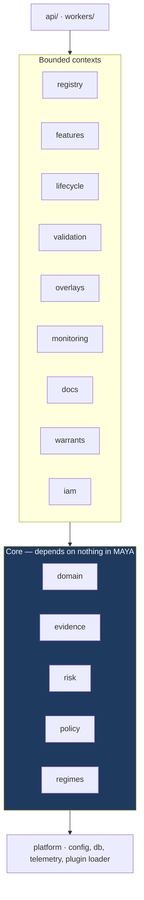
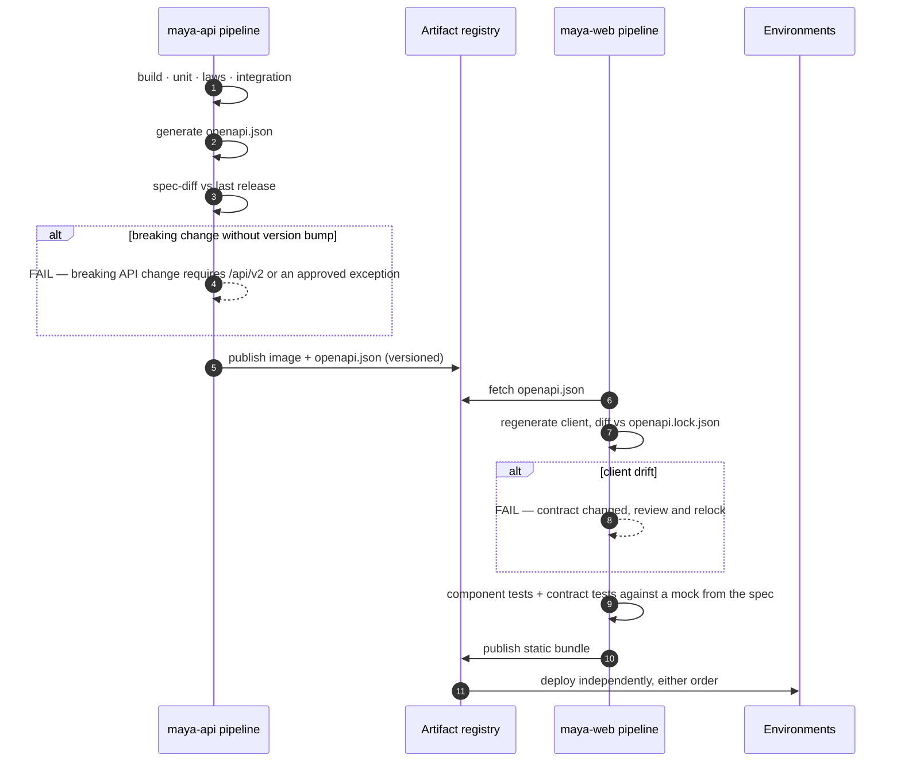

# 12 — Implementation Plan

*MAYA — Model & AI Lifecycle Assurance.*  **Evidence, not assertion.**

**Follows** [10 — Roadmap](10-roadmap.md) (phases and business sequencing) and
[11 — Adversarial Design Review](11-adversarial-review.md) (findings this plan discharges).
**Governed by** [ADR-011](adr/ADR-011-decoupled-frontend.md) — front end and backend are separate,
concurrently running processes.

> Where [10](10-roadmap.md) answers *what we deliver and when*, this document answers *how it is built*:
> repository topology, module boundaries, the contract between front end and backend, the test pyramid,
> CI gates, environments, and a workstream-level breakdown with explicit definitions of done.

---

---

## 0. Build status

*Last updated after milestone 12. This section is the authoritative record of what
is built; the phases below are the plan it is being built against.*

| | Component | State | Evidence |
|---|---|---|---|
| ✅ | **Configuration** (`core/config/`) | **Complete** | YAML with git-ignored `.local` overlay, `${...}` resolution, typed accessors, source tracking, auto-reload, precedence CLI > env > files |
| ✅ | **Domain algebra** (`core/domain/`) | **Complete** | `Para(Stoch)` kernels, derived trainability T0–T8, schema variance (L-12), contract algebra with refinement (L-7), probe-relative equivalence |
| ✅ | **Persistence** (`db/`) | **Complete** | Two hand-written schemas, no migrations. SQLite default, PostgreSQL switchable by URL alone. Repositories are the only interface; no SQL above this package |
| ✅ | **Evidence engine** (`core/evidence/`) | **Complete** | Append-only hash chain with tamper and deletion detection; six semirings over one traversal; citation verification |
| ✅ | **Risk tiering** (`core/risk/`) | **Complete** | Separate materiality and complexity lattices, monotone τ (L-4), Galois-adjoint control sets (L-5), derivation stored with every assessment |
| ✅ | **Registry** (`core/registry/`) | **Complete** | Immutable versions, governed aliases gated on refinement and variance proofs *and* on the findings register, full move history |
| ✅ | **Warrants** (`core/execution/`) | **Complete** | Signed, expiring, entitlement-bound descriptors. Fails closed on unknown principal, unapproved use, unapproved version, revocation, and open blocking findings |
| ✅ | **Captive engine** (`core/execution/engine.py`) | **Complete** | A consumer of the public warrant contract. Verifies signature, expiry and operating boundary before touching an artifact |
| ✅ | **Feature platform** (`core/features/`) | **Complete** | Bitemporal Delta storage, version-namespaced serving (fixes C-2), PIT assembly with three-layer verification, contracts, retirement guard |
| ✅ | **HTTP surface** (`routes/`) | **Complete** | Inventory, versions, aliases, risk, warrants, features, health. RFC-9457-shaped refusals carrying remediation |
| ✅ | **Web interface** (`web/`) | **Complete** | Landing, login, about, help, dashboard, model detail. The model page shows versions, pinned feature contracts, validation episodes, findings, warrants and evidence. Every asset vendored — no CDN |
| ✅ | **Content system** (`core/content/`) | **Complete** | Help and about pages are markdown under `content/`, rendered server-side and cached on modification time. 18 help topics in 6 sections (~12,000 words) plus a competitive analysis on About. Versioned and reviewable in a pull request alongside the behaviour they describe |
| ✅ | **Validation & findings** (`core/validation/`) | **Complete** | Eight-test catalogue computed from first definitions; independence attested and enforced; approval refused over a failed test or an open blocking finding; findings register whose blocking flag gates both alias promotion and warrant resolution; digest-based reproducibility replay that distinguishes *unchecked* from *reproduced* |
| ✅ | **Documentation compiler** (`core/docs/`) | **Complete** | Four document kinds compiled from the register and the evidence graph by twelve lenses. Every section records the evidence it rested on, so citation soundness is a Boolean evaluation rather than a claim. Staleness is *computed* from the chain head at compile time, not remembered. A lens that cannot fill its section says so in the document, so a gap in the model's evidence is visible rather than blank. Rendered through the same markdown pipeline as the help system |
| ✅ | **Monitoring** (`core/monitoring/`) | **Complete** | Four monitor kinds, each admitting only the tests that can answer it, checked at definition time. Delayed labels are first-class: a performance monitor must declare its outcome window, maturity is decided per row, and evaluation over an immature cohort is refused with the date it becomes measurable. A breach raises a finding, escalating with persistence; recovery closes the breach and deliberately leaves the finding open |
| ✅ | **Overlay register** (`core/overlays/`) | **Complete** | Four adjustment kinds, each time-boxed; the proposer may not approve and the owner may not renew; renewal is refused without a measurement for the period. Persistence, materiality relative to the model's own output, and trend are computed — and an overlay renewed past its limit raises a finding, because at that point it is an unversioned model change. Aggregate magnitude answers the question a risk committee asks and rarely gets. Appears in every compiled document |
| ⬜ | **Regime engine** | **Not started** | Institutions, scope determinations as derivations, obligation compiler |
| ✅ | **Authorisation** (`core/authz/`) | **Complete** | Eight roles across three lines of defence, refused incompatible pairs, entity and domain scope that filters listings as well as detail pages, and segregation of duties read from the evidence chain rather than a second who-did-what table. HTTP Basic for services against the same principal register; PBKDF2 with a short verification cache that shortens the key derivation and never the decision |
| ✅ | **Lifecycle & attestation** (`core/lifecycle/`) | **Complete** | Six-state record machine: draft → submitted → approved → attested, with amendment as the only route out of immutability. Attestation is a quorum of configured roles, each signing once and only for a role they hold; one decline returns the record to work. An attested record refuses field changes *and* new versions. Retirement keeps everything; deletion is administrators-only and leaves the evidence chain intact. Workflow stepper in the interface driven by the same API an external client uses |
| ✅ | **Warrant grammar** (`core/execution/grammar/`) | **Complete** | Four independent vocabularies whose *product* covers the estate: how the parameter object is inhabited × how the kernel is realised (17 runtimes) × what is asked of it (10 verbs) × where its data comes from (11 bindings). Seven admissibility laws derived from the algebra — `fit` is refused for T0 and T6 because that is what those classes mean. JSON Schema generated from the vocabulary and published; every warrant validated before it is signed. Ten worked examples spanning QuantLib pricing and calibration, ONNX, PMML, prompt bundles, agents, a vendor black box, a spreadsheet and a VaR backtest, all validated on every test run |
| ✅ | **Tutorials** (`content/tutorials/`) | **Complete** | Five worked walkthroughs rendered at request time: a model end to end with four separated principals, storing artifacts, running several versions, features end to end, and warrants by model family |
| ⬜ | **Machine assistance** | **Not started** | Capability registry, grounding gate, oracle-backed generation |
| ⬜ | **Baseline import** | **Not started** | Compliance-debt tracking for legacy models (finding C-5) |

### What is genuinely working

The end-to-end governed path runs: register a model → create an immutable version →
assess its risk → approve → point an alias (refused unless the contract refines and
the schemas satisfy variance) → issue a warrant → resolve a signed descriptor →
execute through an engine that checks the boundary first → revoke and watch it fail
closed. Features can be defined, materialised bitemporally into Delta, pinned by
contract, and assembled into a point-in-time-correct training set that is refused
outright if either temporal bound is missing.

The validation path runs alongside it: open an episode against a version (refused
if a validator built it) → record catalogue tests with declared thresholds → try
to conclude `approved` (refused if any test failed, refused again if a blocking
finding is open) → raise a finding and watch both the alias gate and warrant
resolution fail closed → close it with an independent verifier and evidence, and
watch service resume. Any recorded result can be replayed and compared on its
digest, which catches a threshold moved after the fact as readily as a changed
number.

### Honest gaps

- **No document rendering beyond markdown.** No PDF, no house template, no
  signature page, no export pack. Turning the compiled markdown into a firm's
  document standard is deliberately outside what the platform tries to own.
- **No telemetry ingestion or scheduler.** Scored rows are passed in; there is no
  streaming collector, no sampling strategy, no automatic reference-window
  management, and nothing calls `monitors.due()` on a cadence.
- **No routing or notification.** Attestation is a quorum and the outstanding
  signatures are visible, but nobody is *told* they are outstanding: there is no
  task inbox, no reminder, no escalation and no review calendar.
- **Version approval is still single-signature.** The model *record* is attested
  by a quorum; an individual version is approved by one authorised person.
- **No single sign-on.** Local credentials only; no OIDC, SAML or SCIM, so
  principals are provisioned by hand.
- **No policy engine.** Lifecycle guards are hard-coded checks in the registry
  rather than versioned Rego, so gates cannot yet be changed without a release.
- **The captive engine runs registered Python callables only.** It does not load
  ONNX, PMML or a container, and there is no sandbox — so it is a reference
  implementation of the *protocol*, not of artifact execution.
- **No Delta time-travel on reads yet.** `DeltaStore` supports `as_of_version`,
  but assemblies pin a namespace rather than a table version, so restatement
  handling is not implemented.
- **Findings have no workflow.** They are raised, tracked and closed, but there
  is no assignment, escalation, reminder or reporting cycle around them.
- **Replay supplies its own data.** The caller passes the series back in; the
  platform does not yet re-read the pinned dataset snapshot to replay from
  storage, which is what would make replay an unattended control rather than an
  assisted one.
- **File size, not total size.** The governing rule is that no Python source file
  exceeds 1,500 code lines; every file is well inside it, and the packages are
  split by responsibility rather than by length.
- **The captive engine implements one runtime.** The grammar describes
  seventeen; the bundled engine runs registered Python callables and nothing
  else. It is a reference implementation of the *protocol*, not of artifact
  execution, and a real estate needs a real engine.

## 1. Engineering principles

| # | Principle | Enforcement |
|---|---|---|
| E1 | **Modularity is mechanical, not cultural.** Boundaries that are not enforced by a tool are not boundaries. | `import-linter` contracts in CI; a violating import fails the build |
| E2 | **Extension points are plugins, never `if` statements.** Nine entry-point groups; no core module may branch on model class, regime, or format. | Lint rule banning class/regime literals outside `registry/`, `regimes/` |
| E3 | **The API is the only interface.** No privileged server-side path exists for the UI. | Contract tests in both pipelines; a spec-diff gate on breaking changes |
| E4 | **Two processes, always.** Front end and backend build, test, release and fail independently. | Separate pipelines; no shared build step |
| E5 | **The laws are the acceptance criteria.** Eighteen executable laws; a failing law fails the build. | `tests/laws/` runs on every commit |
| E6 | **Domain code is framework-free.** `maya/domain/` imports no web framework and no ORM. | Import contract |
| E7 | **Every migration is reversible and rehearsed.** Expand/contract, tested against production-shaped data. | Migration test suite in CI |
| E8 | **Silence is never enforcement.** Integrity controls raise; they do not discard. | Review checklist; finding C-3 |

---

## 2. Repository topology

Two repositories, because they are two products with two lifecycles. A monorepo was considered and
rejected: it makes the shared build step tempting, and the shared build step is how decoupling dies.

```
maya-api/                                  maya-web/
├── maya/                                  ├── src/
│   ├── domain/          # pure           │   ├── shell/          # routing, auth, layout
│   ├── registry/        # fibration      │   ├── api/            # GENERATED client + wrappers
│   ├── regimes/         # institutions   │   ├── components/     # grid, derivation panel, graph
│   ├── evidence/        # semirings      │   ├── modules/        # one per bounded context
│   ├── risk/            # lattices       │   └── styles/         # Bootstrap 5 theme + tokens
│   ├── features/        # bitemporal     ├── tests/
│   ├── lifecycle/  ├── policy/           │   ├── component/
│   ├── validation/ ├── overlays/         │   └── contract/       # against published OpenAPI
│   ├── monitoring/ ├── docs/             └── openapi.lock.json   # pinned backend contract
│   ├── warrants/      ├── iam/
│   ├── connectors/ ├── api/   ├── workers/
│   └── platform/
├── migrations/                            maya-sdk/       (Python, JVM)
├── seed/            # model_classes.yaml  maya-ext-*/     (bank-specific fibres & regimes)
├── tests/
│   ├── unit/ integration/ contract/
│   ├── laws/        # test_L01 … test_L18
│   └── adversarial/ # leakage injection, RLS negative tests, stampede load
└── deploy/          # Helm, Terraform
```

`maya-ext-*` is the proof that extensibility is real: the bank's proprietary model classes and local
regulators ship as separate packages that the core has never seen.

---

## 3. Module boundaries and the dependency rule



**The rule, enforced in CI.** `domain/` imports nothing from MAYA. Core modules import only `domain/`
and `platform/`. Bounded contexts import core and each other **only through published interfaces**, never
through internal modules. `api/` and `workers/` import everything and are imported by nothing.

```toml
# .importlinter
[[tool.importlinter.contracts]]
name = "domain is pure"
type = "forbidden"
source_modules = ["maya.domain"]
forbidden_modules = ["maya.api", "maya.registry", "maya.platform", "fastapi", "sqlalchemy"]

[[tool.importlinter.contracts]]
name = "layered architecture"
type = "layers"
layers = ["maya.api | maya.workers", "maya.registry | maya.features | maya.lifecycle | maya.validation | maya.overlays | maya.monitoring | maya.docs | maya.warrants | maya.iam", "maya.evidence | maya.risk | maya.policy | maya.regimes", "maya.domain", "maya.platform"]

[[tool.importlinter.contracts]]
name = "no branching on extension keys outside their registries"
type = "forbidden"
source_modules = ["maya.lifecycle", "maya.validation", "maya.monitoring", "maya.docs"]
forbidden_modules = ["maya.regimes.sr26_2", "maya.regimes.ss1_23", "maya.regimes.eu_ai_act"]
```

The third contract is the one that keeps E2 honest: if a context imports a *specific* regime, someone has
written an `if regime == ...` and the plugin boundary has been breached.

---

## 4. The front end / backend contract



**Compatibility rules.** Additive changes are free. Breaking changes require a new major path with two
minor versions of overlap and `Sunset` headers. The front end pins `openapi.lock.json`, so a backend
change can never silently break it — the pipeline fails first, which is the point.

**Local development.** `docker compose up` starts Postgres, Redis, MinIO, a Delta-capable Spark, and
`maya-api`. `maya-web` runs against either the local API or a **Prism mock generated from the spec**, so
front-end work is never blocked by backend availability. That is the practical dividend of E4.

---

## 5. Test strategy

| Layer | Scope | Target | Runs |
|---|---|---|---|
| **Unit** | `domain/`, core modules; no I/O | ≥ 90% on domain, ≥ 85% overall | Every commit, < 90 s |
| **Laws** (`tests/laws/`) | The eighteen laws, property-based via Hypothesis | All pass; bounded generators, fixed seeds | Every commit; **nightly deep run** with wider generation |
| **Integration** | Real Postgres, Redis, MinIO, Delta via testcontainers | Every repository and service path | Every commit, < 8 min |
| **Contract** | Schemathesis against the live spec; SDK round-trip | Full endpoint coverage | Every commit |
| **Adversarial** | Leakage injection · RLS cross-entity negative tests · stampede load · sandbox escape · malicious artifact corpus | Must catch every seeded defect | Every commit (fast subset), nightly (full) |
| **Migration** | Expand/contract up and down against production-shaped data | Reversible, no data loss | Every commit touching `migrations/` |
| **Performance** | Warrant resolution p99, PIT join, inference ingest | Meets the NFR or fails | Nightly + pre-release |
| **Front end** | Component tests; contract tests against the spec mock; axe accessibility | WCAG 2.2 AA, zero critical | Every commit |
| **End-to-end** | The ten acceptance criteria of [03 §12.1](03-requirements.md) | All pass | Pre-release |

**The adversarial suite is not optional and not decorative.** A PIT verifier that silently stops
detecting leakage is a catastrophic invisible regression; it is therefore tested by injecting leakage it
must catch, not by examples it is known to pass. The same logic applies to RLS isolation and to the
malicious-artifact corpus.

---

## 6. CI gates

A merge requires all of:

1. Lint, format, type check (`ruff`, `mypy --strict` on `domain/` and core).
2. **Import contracts pass** — the modularity guarantee.
3. Unit + laws + integration + contract green.
4. Coverage thresholds met.
5. **Spec-diff gate** — no unapproved breaking API change.
6. **Fibre totality** — every registered model class supplies a complete fibre (law L-15).
7. Security: SAST, SCA, secret scan, container scan; SBOM generated and signed.
8. Migration up/down rehearsed.
9. For `maya-web`: client matches `openapi.lock.json`; axe accessibility clean.

Release additionally requires: performance suite green, full adversarial suite green, the ten acceptance
criteria green, and signed images with SLSA provenance.

---

## 7. Environments

| Environment | Purpose | Data | Notes |
|---|---|---|---|
| `local` | Development | Synthetic seed, ~50 models | Compose; API mock available for front-end-only work |
| `ci` | Automated verification | Generated fixtures | Ephemeral, torn down per run |
| `dev` | Integration with real connectors | Masked subset | First place plugins are loaded from `maya-ext-*` |
| `uat` | Business validation, training | **Baseline-imported** copy of the real inventory, masked | Where C-5 baseline import is rehearsed with real users |
| `prod` | Production | Real | Blue/green; warrant plane deploys independently |

---

## 8. Workstreams

Six concurrent streams, deliberately structured so that no stream blocks another for more than a sprint.

| # | Stream | Owns | Interfaces to others via |
|---|---|---|---|
| **W1** | **Core & extensibility** | `domain/`, `registry/` fibration, plugin loader, laws harness | Published interfaces; the fibre protocol |
| **W2** | **Governance** | Lifecycle, validation, findings, overlays, approvals, policy, regimes | Domain events |
| **W3** | **Data & features** | Feature platform, PIT verifier, Delta layout, Spark jobs, monitoring compute | Feature contract; metric API |
| **W4** | **Execution** | Warrant service, warrant projection, SDKs, serving, telemetry | `warrant_projection` schema (a versioned contract) |
| **W5** | **Experience** | `maya-web`, all UI modules, document rendering | The OpenAPI contract only |
| **W6** | **Platform & security** | IAM, audit, sandbox fleet, IaC, CI/CD, observability | Infrastructure interfaces |
| **W7** | **Machine assistance** | `maya/ai/` — capabilities, grounding, citation verification, oracles, evals | The oracle protocol; every capability registered as a T5 model |

W5 is unblocked from day one because it works against the spec mock. That is the single most valuable
consequence of the decoupling mandate: the front end never waits.

---

## 9. Phase-level work breakdown

### Phase 0 — Foundations

| Stream | Deliverable | Definition of done |
|---|---|---|
| W1 | Domain core: `ParametricKernel`, trainability, contract algebra, schema lattice | Laws L-2, L-4, L-7, L-12 implemented and passing |
| W1 | Plugin loader + fibre protocol + totality check | A dummy `maya-ext-demo` package registers a class with zero core changes |
| W6 | Repos, both pipelines, IaC, environments, import contracts | A commit to either repo deploys to `dev` unattended |
| W6 | Postgres baseline, RLS pattern with **FORCE**, audit chain, Alembic | Cross-entity negative test passes under `maya_app` |
| W3 | Delta layout, retention classes, outbox writer with idempotent MERGE | Duplicate outbox delivery produces one row |
| W4 | OpenAPI skeleton, spec-diff gate, generated client, Prism mock | `maya-web` builds and runs against the mock |
| **Spikes** | PIT join at 1B rows · warrant resolution under stampede load · sandbox escape testing · ONNX/PMML introspection breadth | Each answers a question that could invalidate the architecture |

**Exit:** the laws exist as tests (most failing by design); a model can be created and read end to end
through the API and the UI; the three spikes have reported.

### Phase 1 — Inventory and evidence spine · MVP

| Stream | Deliverable |
|---|---|
| W1 | Registry, URNs, versions (immutable via **trigger**, not rule), 20 seeded fibres |
| W1 | Evidence graph with `seq` + `prev_hash` chain, daily WORM anchoring; Boolean/Why/How/Freshness semirings |
| W2 | Regime engine with SR 26-2, SS1/23, EU AI Act, SOX; scope determinations as derivations |
| W2 | Tiering engine with derivation trace, triggers, **sourced exposure measures** (H-8) |
| W2 | Lifecycle engine, workflow, approvals, e-signature, SoD |
| W2 | **Baseline import mode** with compliance-debt tracking (C-5) |
| W3 | Dependency graph, blast radius, concentration analytics |
| W4 | Bulk import; MLflow, Unity Catalog, git connectors; SDK v1 |
| W5 | Inventory grid, model detail page, derivation panels, as-at-date query, **debt vs breach visually distinct** |
| W6 | IAM, RBAC/ABAC, audit chain verification job |

**Exit:** 300 models registered including 30 vendor and 20 quant; a tier derivation withstands challenge
from the MRM head; an as-at-date export satisfies a mock examiner request; **baseline import of 300
models produces a debt burn-down, not a wall of red**.

### Phase 2 — Versions, features, warrants

| Stream | Deliverable |
|---|---|
| W1 | Upload, sandboxed introspection, security scanning, format policy, signing, AI-BOM |
| W1 | Aliases with refinement (L-7) and variance (L-12) gates; calibration sets; prompt bundles |
| W3 | Feature registry, views, Delta materialisation, quality assertions |
| W3 | **Three-layer PIT verification** — static, sampled, adversarial (H-6) |
| W3 | Feature contracts; **version-namespaced online store** with dual-write (C-2); law L-17 |
| W3 | Run tracking, deterministic replay, challenger management |
| W4 | Warrant service: `warrant_projection` read model (H-2), resolution, signing, **revocation floor** (C-1) |
| W4 | Stampede protection: pre-warm, single-flight, jitter, stale-while-revalidate (H-1) |
| W4 | Flavours: `descriptor_only`, `python_sdk`, `rest_oip_v2`, `batch_spark`; engine certification (C-6) |
| W5 | Upload wizard, feature reconciliation UI, schema-driven fibre forms |

**Exit:** an engine runs a production model solely via a warrant; an alias move switches the served version
with no consumer change; a kill switch stops it within 60 s **including under a simulated partition**; a
PIT-verified training set reproduces a fit bit-for-bit.

### Phase 3 — Validation, findings, documentation

W1 test catalogue and executable tests · W2 validation plans, findings with blocking behaviour, risk-based
scheduling, vendor workflow · W1 document compiler with lens laws and staleness · templates (MDD,
validation report, model card, **Annex IV**, AI-BOM) · W5 validation workbench, examiner portal ·
W6 export packs with signed evidence bundles.

**Exit:** a full Tier 1 validation completed in-system; the validation report compiles with > 90%
auto-generated content; an Annex IV pack produced for a high-risk model.

### Phase 4 — Monitoring, overlays, reporting

W3 monitor definitions, class-aware defaults, Spark evaluation, delayed labels, slice and fairness
monitoring, skew detection · W2 breach → **correlated** finding (M-8), overlay register with magnitude,
ageing, propagation, recurrence · W4 inference logging, **approved-use vs actual-use reconciliation**,
boundary monitoring · W5 health board, overlay dashboard, KRIs, board pack.

**Exit:** a breach automatically restricts a production warrant; the overlay dashboard is used in a real
IFRS 9 committee; the board pack is generated rather than assembled.

### Machine assistance, sequenced by oracle strength

W7 does not run as a single phase. Capabilities are introduced when the oracle that checks them exists,
which is the whole point of the criterion:

| Capability | Ships with | Because its oracle is |
|---|---|---|
| Semantic search, feature deduplication | Phase 1 | Embeddings only — no claim to check |
| Natural-language query | Phase 1 | The query parses and returns, or it does not |
| Probe-set generation | Phase 2 | Probes execute and discriminate |
| Format migration agent | Phase 2 | Probe equivalence within tolerance |
| Regime encoding assistant | Phase 2 | The satisfaction condition (`L-8`), which lands in Phase 1 |
| Documentation drafting | Phase 3 | Citation verification, which needs the evidence graph and document compiler |
| Validation assistance | Phase 3 | Partially checkable; ships behind the grounding gate |
| Remediation-planning agent | Phase 4 | The tropical semiring computes the plan; the agent only coordinates |
| Discovery agents | Phase 5 | Grounded in a specific artifact; ships only once precision can be measured |
| Finding correlation, committee drafting | Phase 5 | Grounded; deploy once trust is established |

**No capability ships before its check.** A capability whose oracle is not yet built waits, however
attractive the demo.

### Phase 5 — GenAI, discovery, intelligence

W2 GenAI track: boundary gates, risk matrix, eval harness, agentic controls · W1 prompt/RAG/tool/guardrail
versioning, base-model change fingerprinting · W4 LLM gateway integration, cost and token monitoring,
composite warrants, `sql_udf`/`stream`/`container`/`sheet` flavours · W3 continuous discovery, EUC ingestion,
semantic search · W1 AI documentation assistant, itself governed as a T5 model in the inventory.

### Phase 6 — Scale-out and migration

Full estate migration; legacy decommissioning; remaining connectors; multi-entity and residency;
performance hardening to every NFR at full scale; fibre library expansion; bank-specific `maya-ext-*`.

---

## 10. Recurring quality activities

| Activity | Cadence | Owner |
|---|---|---|
| **Adversarial review** (the [11](11-adversarial-review.md) method, re-run) | End of every phase | Architecture + an engineer outside the stream |
| Threat model refresh | Every phase | W6 |
| Performance regression | Nightly | W6 |
| Chaos drill — kill the control plane, verify warrants survive | Quarterly | W4 + W6 |
| DR restore rehearsal with evidence | Quarterly | W6 |
| Chain-anchor verification audit | Monthly | W6 |
| Developer NPS on the governance experience | Quarterly | Product |
| Dependency and base-image refresh | Fortnightly | W6 |

The first row matters most. Two of the six critical findings in [11](11-adversarial-review.md) were
invisible from inside the design and would each, independently, have sunk the programme. There is no
reason to believe Phase 3's design will be more self-evident than Phase 0's.

---

## 11. Definition of done

**A story** is done when: code merged with all CI gates green; unit and integration tests written;
any new law implemented; API documented in the spec; UI accessible; telemetry emitted; runbook updated
if operationally relevant.

**A phase** is done when: every exit criterion demonstrated to the sponsor on `uat` with realistic data;
the adversarial re-review completed and its findings dispositioned; performance suite green at the
phase's scale target; documentation in `docs/` updated to match what was actually built — because a
design document that has drifted from the system is worse than no design document.

---

## 12. Principal delivery risks

| Risk | Mitigation |
|---|---|
| **Developers route around the platform** | SDK ships in Phase 1, not later; the compliant path must be measurably faster; unregistered models fail their CI gate; developer NPS is a tracked metric with a target |
| **Baseline import overwhelms the MRM office** | Debt is burn-down, not breach; board-approved debt expiry per tier; rehearsed on `uat` with real users before `prod` |
| **The two repos drift** | Spec-diff gate and `openapi.lock.json` make drift a build failure rather than a runtime surprise |
| **Modularity erodes under delivery pressure** | Import contracts are CI gates, not guidelines. The only way to breach a boundary is to change the contract, visibly, in review |
| **The warrant plane becomes a bank-wide SPOF** | Independent scaling and failover; grace and revocation-floor semantics; quarterly chaos drills; escrowed static descriptors for a named Tier 1 set |
| **Theory ossifies into decoration** | Laws are acceptance criteria. A law that cannot be tested is a signal the abstraction failed the rent test and should be cut |

---

Copyright © 2026 Ashutosh Sinha <ajsinha@gmail.com>. All rights reserved.
Proprietary and confidential. See [LICENSE](../LICENSE) and [NOTICE](../NOTICE).
*Not legal, regulatory or financial advice — see NOTICE §4.*
