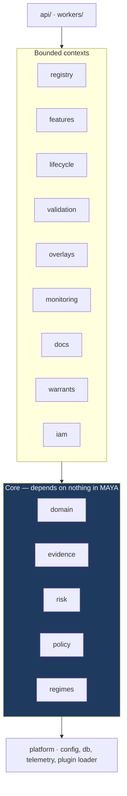
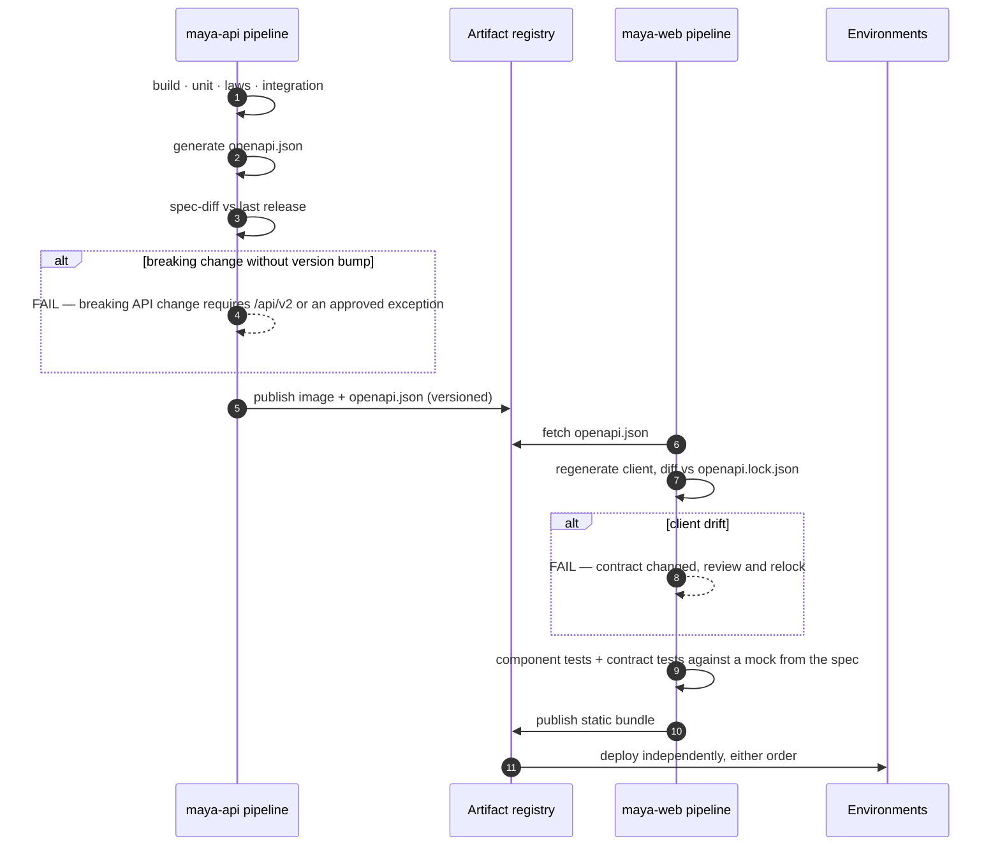

# 12 — The build: what exists, what it taught, and how it is put together

*MAYA — Model & AI Lifecycle Assurance.*  **Evidence, not assertion.**

**Annex to** [04 — Architecture](04-architecture.md) and [10 — What Is Left](10-roadmap.md).

---

## 0. Build status

**This section is the authoritative record of what is built.** Every other
document that needs to say whether something exists links here rather than
repeating it, because two records of what is built are two records that can
disagree — the same argument that gives the platform one evidence chain instead
of a chain and an audit log.

What remains, and the order it should be done in, is [10](10-roadmap.md). This
document does not duplicate that either.

### It runs end to end

Register a model → create an immutable version → assess its risk → approve →
point an alias (refused unless the contract refines and the schemas satisfy
variance) → issue a warrant → resolve a signed descriptor → execute through an
engine that checks the operating boundary before it touches an artifact → revoke
and watch it fail closed.

Alongside it: define features, materialise them bitemporally into Delta, pin them
by contract, and assemble a point-in-time-correct training set that is refused
outright if either temporal bound is missing.

And alongside *that*: open a validation episode against a version (refused if a
validator built it) → record catalogue tests with declared thresholds → try to
conclude `approved` (refused if any test failed; refused again if a blocking
finding is open) → raise a finding and watch both the alias gate and warrant
resolution fail closed → close it with an independent verifier and evidence, and
watch service resume. Any recorded result can be replayed and compared on its
digest, which catches a threshold moved after the fact as readily as a changed
number.

And, for the class the estate has most of: author a **rule set** against a T8
version's declared schemas → watch a rule an earlier rule already covers be
refused by name → publish it as a parameter set that lands `proposed` → have
somebody other than its author approve it → issue a warrant naming the `rules`
runtime → and get back a decision that says which rule made it.

**Over 2,200 tests**, plus a scale suite excluded by default. **18 of 21** foundational
laws executable and **14 of 14** warrant-admissibility laws checked before every
signature.

### The components

| | Component | State | What it is, and what it refuses |
|---|---|---|---|
| ✅ | **Configuration** (`core/config/`) | **Complete** | YAML with git-ignored `.local` overlay, `${...}` resolution, typed accessors, source tracking, auto-reload, precedence CLI > env > files |
| ✅ | **Domain algebra** (`core/domain/`) | **Complete** | `Para(Stoch)` kernels, derived trainability T0–T8, schema variance (L-12), contract algebra with refinement (L-7), probe-relative equivalence |
| ✅ | **Persistence** (`db/`) | **Complete** | One typed schema (`db/schema/tables.py`), DDL generated per dialect, no migrations. SQLite default, PostgreSQL switchable by URL alone. Repositories are the only interface; no SQL above this package |
| ✅ | **Evidence engine** (`core/evidence/`) | **Complete** | Append-only hash chain with tamper and deletion detection. Verification **re-derives** each node's content hash from its own fields rather than re-linking the stored one — re-linking proves the links are intact and says nothing about whether the thing linked is still what was recorded, so an edited payload left a chain that verified and a record that lied. The scale suite found it, and the unit test that should have was named for payload tampering while actually altering the stored hash: a test passing for a reason other than its name. Six semirings over one traversal; citation verification |
| ✅ | **Risk tiering** (`core/risk/`) | **Complete** | Separate materiality and complexity lattices, monotone τ (L-4), Galois-adjoint control sets (L-5), derivation stored with every assessment |
| ✅ | **Registry** (`core/registry/`) | **Complete** | Immutable versions, governed aliases gated on refinement and variance proofs *and* on the findings register, full move history |
| ✅ | **Warrants** (`core/execution/`) | **Complete** | Signed, expiring, entitlement-bound descriptors. Fails closed on unknown principal, unapproved use, unapproved version, revocation, and open blocking findings |
| ✅ | **Captive engine** (`core/execution/engine.py`) | **Complete** | A consumer of the public warrant contract. Verifies signature, expiry and operating boundary before touching an artifact. **Six** of the grammar's nineteen runtimes: registered Python callables (answering for `descriptor_only` as well), ONNX, the regression and scorecard subset of PMML, QuantLib, the estimator and `rules`. It refuses the rest **by name**, distinguishing a runtime never implemented from one whose dependency is missing. Its own docstring said "three" while five were registered — the count-written-once-and-never-recounted pattern in the code's own account of itself, now asserted by a test |
| ✅ | **Feature platform** (`core/features/`) | **Complete** | Bitemporal Delta storage, version-namespaced serving (fixes C-2), PIT assembly with three-layer verification, contracts, retirement guard |
| ✅ | **HTTP surface** (`routes/`) | **Complete** | Inventory, versions, aliases, risk, warrants, features, health. RFC-9457-shaped refusals carrying remediation |
| ✅ | **Web interface** (`web/`) | **Complete** | Landing, login, about, help, dashboard, model detail. The model page shows versions, pinned feature contracts, validation episodes, findings, warrants and evidence. Every asset vendored — no CDN |
| ✅ | **Content system** (`core/content/`) | **Complete** | Help and about pages are markdown under `content/`, rendered server-side and cached on modification time. 19 help topics in 7 sections (~69,000 words) plus a competitive analysis on About. Versioned and reviewable in a pull request alongside the behaviour they describe |
| ✅ | **Validation & findings** (`core/validation/`) | **Complete** | Eight-test catalogue computed from first definitions; independence attested and enforced; approval refused over a failed test or an open blocking finding; findings register whose blocking flag gates both alias promotion and warrant resolution; digest-based reproducibility replay that distinguishes *unchecked* from *reproduced*. A finding also has a workflow between being raised and being closed: it can be handed over with a reason, must be accepted by its owner with a plan before its date can be moved, and its date can only be moved by somebody who does not own it, with a reason, counted — past the limit the extension becomes a finding of its own. Ageing, overdue-ness, acceptance and escalation are **derived from the acts**, so there is no status table to disagree with the register, and the ageing profile a committee asks for (severity, age distribution, overdue, extension counts) is computed rather than assembled by hand |
| ✅ | **Documentation compiler** (`core/docs/`) | **Complete** | Four document kinds compiled from the register and the evidence graph by fifteen lenses. Every section records the evidence it rested on, so citation soundness is a Boolean evaluation rather than a claim. Staleness is *computed* from the chain head at compile time, not remembered. A lens that cannot fill its section says so in the document, so a gap in the model's evidence is visible rather than blank. Rendered through the same markdown pipeline as the help system |
| ✅ | **Monitoring** (`core/monitoring/`) | **Complete** | Four monitor kinds, each admitting only the tests that can answer it, checked at definition time. Delayed labels are first-class: a performance monitor must declare its outcome window, maturity is decided per row, and evaluation over an immature cohort is refused with the date it becomes measurable. A breach raises a finding, escalating with persistence; recovery closes the breach and deliberately leaves the finding open |
| ✅ | **Overlay register** (`core/overlays/`) | **Complete** | Four adjustment kinds, each time-boxed; the proposer may not approve and the owner may not renew; renewal is refused without a measurement for the period. Persistence, materiality relative to the model's own output, and trend are computed — and an overlay renewed past its limit raises a finding, because at that point it is an unversioned model change. Aggregate magnitude answers the question a risk committee asks and rarely gets. Appears in every compiled document |
| ✅ | **Regime engine** (`core/regimes/`) | **Complete** | Three regimes encoded as institutions — SR 26-2, PRA SS1/23, EU AI Act — each with its own signature, obligations in that vocabulary, and a translation into the core. The satisfaction condition (truth invariant under change of notation) is *checked* against probe states spanning the corners, and a regime whose encoding fails it cannot be activated. Determinations are derivations: every verdict carries the terms it read and the citation it rests on. Regimes that disagree are reported as disagreeing rather than merged. Adding a supervisor is a signature, some sentences and a translation |
| ✅ | **Authorisation** (`core/authz/`) | **Complete** | Eight roles across three lines of defence, refused incompatible pairs, entity and domain scope that filters listings as well as detail pages, and segregation of duties read from the evidence chain rather than a second who-did-what table. A rule may name the payload field carrying the identity it is about, because an evidence node's subject is not always the thing an act concerns: a finding is raised against the *model*, which is where a reader looks for it, while the act being checked is about one finding. Without that the raiser-may-not-close rule was inert over HTTP — it searched under the finding's own id, found nothing, and permitted everything. HTTP Basic for services against the same principal register; PBKDF2 with a short verification cache that shortens the key derivation and never the decision |
| ✅ | **Lifecycle & attestation** (`core/lifecycle/`) | **Complete** | Seven-state record machine: draft → submitted → approved → attested, plus `baselined` for an imported model and `amending`/`retired`, with amendment as the only route out of immutability. Attestation is a quorum of configured roles, each signing once and only for a role they hold; one decline returns the record to work. An attested record refuses field changes *and* new versions. Retirement keeps everything; deletion is administrators-only and leaves the evidence chain intact. Workflow stepper in the interface driven by the same API an external client uses |
| ✅ | **Warrant grammar** (`core/execution/grammar/`) | **Complete** | Four independent vocabularies whose *product* covers the estate: how the parameter object is inhabited × how the kernel is realised (19 runtimes) × what is asked of it (10 verbs) × where its data comes from (12 bindings). Fourteen admissibility laws derived from the algebra — `fit` is refused for T0 and T6 because that is what those classes mean, and the last three quantify over how `P` is inhabited rather than over a category anybody attached: a calibration must state its `as_of` (**L-W11**) or staleness is silent, parameters living inside an artifact need that artifact digested (**L-W12**), and a generative runtime must pin the build rather than the model family (**L-W13**). Each caught a shipped example on the day it was written. JSON Schema generated from the vocabulary and published; every warrant validated before it is signed. Thirteen worked examples in `examples/warrants/`, spanning QuantLib swaption pricing, swap pricing and Hull–White calibration, ONNX, PMML, prompt bundles, agents, a vendor black box, a spreadsheet, a VaR backtest, and a linear regression fitted from a featureset and then scored on the parameters it produced — all validated on every test run |
| ✅ | **Decks** (`tools/deck/`) | **Complete** | Three, reproducible from source rather than binaries nobody can edit safely, each re-audited for geometry before it ships. The *research* deck argues models as parametric kernels; the *system design* deck is for whoever builds the platform; the *model and feature engineering* deck is for whoever uses it: it opens with the five words and a single-slide process diagram of model, feature and warrant management, and closes with a worked example carrying real numbers — a daily price series and a lagged unemployment rate, aligned into one featureset, read by a linear regression and a GARCH model, then extended until the old model can no longer consume it — the four rows being the catalogue, the selection, the model, and what comes back |
| ✅ | **Tutorials** (`content/tutorials/`) | **Complete** | **Six** worked walkthroughs, rendered at request time, each produced by *running it* against a live instance — a pass that found eight defects in the platform, which is the argument for writing one that way. They are: defining a model, features, featuresets, warrants and training, the model package, and one model end to end. Sixteen existed before, including one per kind of model; eleven were removed rather than left standing as prose nobody had executed, and their links survived in four documents for two milestones afterwards. What the per-fibre ones carried is stated rather than narrated: the fibre table in `02 §4` gives every class its `parameter_kind`, `fit_procedure`, runtime and evidence schema, and the warrant grammar refuses the combinations that make no sense |
| ✅ | **Machine assistance** (`core/assist/`) | **Complete** | Capabilities registered at Tier A (a named oracle checks the output) or Tier B (every claim cites evidence); Tier C is deliberately not registrable. Five oracles, each backed by machinery that exists for another reason. The grounding gate *removes* unsupported claims rather than flagging them, and keeps them for the reviewer. Nothing is evidence until a person attests it, and never the person who asked. Edit distance and a mandatory review sample detect automation bias |
| ✅ | **Scheduler** (`core/scheduler/`) | **Complete** | 22 idempotent jobs turning computed conditions into recorded consequences: a lapsed attestation, a stalled monitor and a model past the review date its own tier set each raise a finding, overlays past their window close, baseline debt reconciles, a missed remediation window is recorded as its own finding rather than by rewriting the original, a finding nobody ever accepted is recorded as another, and everybody with outstanding work is told about it. A run is an ordinary authenticated call — cron, a CronJob or a person produce identical results — with an in-process loop offered as a convenience and off by default. One failing job does not stop the others, and the scheduler reports its own health on `/health/ready` |
| ✅ | **Estate view & worklist** (`core/estate/`) | **Complete** | Outstanding work derived from the register rather than assigned — no task table, so it cannot go stale, disagree with the register, or accumulate orphans. Filtered to what a principal holds the permission and scope to do, and for attestation to their own role's signature. A finding whose owner has never accepted it is derived onto the list too, which makes the reminder cycle the existing notification digest rather than a second delivery path. Estate summary aggregates governance, assurance, adjustments and baseline debt, with debt kept apart from breach |
| ✅ | **Scale suite** (`tests/test_scale.py`, `tests/test_transfer_scale.py`) | **Complete** | Every other test asserts something is *correct*; these assert it is still correct, and still quick enough to use, at a size where a good implementation and a bad one look different. Written to two rules. **Assert shape, not stopwatch**: a threshold in milliseconds is a promise about somebody else's hardware and a suite that fails on a loaded machine is one people re-run rather than read, so the assertions are mostly about *complexity* — that doubling the estate does not more than double the work, that an operation claimed constant in estate size is, that a read claimed not to materialise a dataset does not. Where a wall-clock budget appears it is generous by an order of magnitude, because its job is to catch a change from linear to quadratic rather than to measure a machine. **Run at a size the default suite will not**, marked `scale` and excluded by default: a slow suite gets disabled, and a disabled suite proves nothing. It found the evidence chain defect below on its first run |
| ✅ | **Versioned gates** (`core/policy/`) | **Complete** | A gate that cannot be changed without a release is a gate people work around; a gate that *can* be changed without one is a gate that can be **weakened** without one, which is worse. Everything here makes the first possible without making the second silent. A rule is a **predicate over a closed vocabulary of facts** — comparison, membership, boolean connectives, two quantifiers, and no loops, assignment or function definitions, which is what makes a rule something a reviewer can reason about rather than something they have to run. A fact the gate does not publish is refused *when the rule is written*, because a rule that failed at the moment of a governance decision would have failed at the worst possible time. **A policy ships with its own cases and cannot be published until they pass**, and at least one must be a case it refuses: a policy nobody has shown to refuse anything is a policy nobody has shown to be a gate. **Weakening is allowed and never quiet** — the register replays the outgoing version's cases against the incoming rule and reports every verdict that flipped, so a change that loosens a gate is something somebody decided rather than something somebody discovered. Authoring and publishing are separate duties. An instance that publishes nothing runs exactly what it ran before: the built-in rules are the default for every gate, expressed in the same language. And the honest boundary, stated rather than implied — **policy tightens; the code's invariants are the floor**, because replacing an invariant with a line of configuration means a typo can weaken the platform and the failure looks like a successful deployment |
| ✅ | **Single sign-on** (`core/authz/oidc.py`, `core/authz/jws.py`) | **Complete** | The authorisation-code flow with PKCE, a state parameter and a nonce — all standard, all checked. RS256 verification is **in the standard library**, for the same reason every asset here is vendored: a governance system that cannot be deployed air-gapped is one somebody works around. The verifier **constructs** the padded block the signature should have produced and compares the whole of it rather than parsing what it recovers, which is the difference between correct PKCS#1 v1.5 and the Bleichenbacher forgery; and it decides the algorithm itself rather than reading `alg` from the token, which is the other famous way a JWT gets accepted with no signature at all. What is not mechanical is roles: an identity provider that grants MAYA roles is one that decides segregation of duties, and the person administering it is very often the person whose duties are being segregated. So **group claims are mapped, never obeyed** — a group with no mapping grants nothing — and **the incompatible-roles check applies to a directory exactly as it does to a local principal**: a group membership mapping to a conflicting pair refuses the login rather than accepting both or quietly reducing to one, and it is checked *before* provisioning so the lesser problem cannot hide the greater. Provisioning on first login is off by default, because it hands everybody in the directory a foothold in the model register. The issuer, subject and the groups that produced the roles are recorded, so *"why did this person have that role in March"* survives the directory moving on. Tested against genuine OpenSSL-signed tokens rather than against its own arithmetic |
| ✅ | **Notification** (`core/notify/`) | **Complete** | Delivery, not a queue. The outstanding work is already derived from the register; what was missing was that nothing ever reached out, so an item nobody happened to log in and look at simply sat there. Three channels and none of them a dependency — the log channel is always available and is the honest default for an instance with nowhere to send; webhook and SMTP both use the standard library. A **digest per person per run**, not a message per item, because a message per finding is how somebody starts filtering the sender, at which point the platform has made itself invisible while appearing diligent. **Silence when nothing has changed**: each delivery records the digest of the *work* it described, and an unchanged worklist is suppressed until a quiet period passes — nothing is more certain to be ignored than a daily message that says exactly what yesterday's said, and a control everybody ignores is not a control. Escalation is **by role rather than hierarchy**, because MAYA does not know who reports to whom and should not pretend to; what it does know is that an item overdue and unactioned for a week has stopped being one person's problem. A failed delivery is recorded and raises evidence: silence about a failed send is how somebody concludes they were never told, which is worse than not having sent, since they would at least have known. It notifies from the *same call the dashboard makes* — two views of one derivation, not two derivations |
| ✅ | **QuantLib runtime** (`core/execution/runtimes/quantlib.py`) | **Complete** | Most of what a bank runs is not a learned model but a valuation, and those have no parameter object to fit — which is what T0 means, and why the grammar refuses to warrant one for fitting. They have something the learned ones do not: an as-of date that changes the answer. So this runtime **takes the evaluation date from the warrant and never from the clock** (a valuation that reads today is not reproducible tomorrow, and a backtest of it is a backtest of nothing), and **builds the curve from what the warrant carries and nothing else** (reaching for a market data service would put an unversioned input into a governed computation). Six instruments — discount factor, zero and forward rate, fixed bond, vanilla swap, European swaption — priced for real against QuantLib 1.43. A missing past fixing, an unknown day count, an instrument or pricing engine it does not build: each refused by name rather than substituted, because a day count silently swapped moves every cash flow and an engine silently swapped produces a number nobody can reconcile. Not sandboxed, and the reason is stated: it loads no artifact, so there is nothing untrusted to isolate from. Writing it surfaced a real hazard — QuantLib keeps fixing history in a **process-global** manager, so one warrant's fixing would still be there for the next valuation; each valuation now starts from an empty history and sees only what its own warrant carries |
| ✅ | **Shaped, composed and prepared features** (`core/features/shapes.py`, `composition.py`, `lifecycle.py`, `policy.py`, `normalisation.py`, `preparation.py`, `alignment.py`) | **Complete** | Five things a feature is not. **Not always a number**: a shape and named components make a curve a vector and a correlation structure a matrix, the component order *is* the axis order, and a declared shape is checked against the values because one nobody verifies is a comment. **Not always defined in one place**: inheriting from one parent and combining several are the same operation at different arities, so there is one mechanism — a left-to-right fold in which the rightmost wins, with an object's own operations applied last. That is a *monoid* (associative, empty identity, both asserted in the tests), which is what makes "a combination of features is a feature" a statement rather than an aspiration. Every operation is total: a drop of something absent, an add of something present, an override of something absent are each refused, because the no-op alternative leaves a child quietly differing from what its author wrote. **Not always mutable**: a sealed object takes no amendment and no further versions, and can still be composed from — which is the point, since a parent that cannot move is a parent worth building on. **Not always permanent**: an ephemeral object has a TTL, cannot be sealed, cannot be composed from, and leaves its evidence behind when its rows go. **Not always accountable to its author**: the creator is history and the owner is a responsibility, transferred by name with the handover in the chain. Retrieval policy attaches to the object as default behaviour and a request overrides it, by the same left-to-right rule; statistics for normalisation and for fitted fills come from what was knowable at a stated moment, and a request without one is refused rather than served the leaky answer somebody would get by accident. Alignment offers back-fill and interpolation without refusing them and **stamps them honestly** — a value derived from a later observation inherits that observation's ingest clock, so an ordinary point-in-time read excludes it and the leakage is arithmetically impossible to hide |
| ✅ | **Bulk feature transfer and management pages** (`core/features/transfer.py`, `routes/transfer_routes.py`, `web/templates/features*.html`) | **Complete** | Every other surface here moves small documents; feature values are not small, and an API that turns a few million rows into JSON objects spends most of its time and nearly all of its memory on punctuation. So the rule is inverted for this one layer: **nothing is materialised whole** — reads iterate Arrow record batches straight off the Delta files, writes parse a batch at a time, and peak memory is one batch rather than one dataset. A batch is sized by **cells rather than rows**, because sixteen thousand rows of six columns is a few megabytes and sixteen thousand rows of two thousand columns is not. Four formats: `arrow` for an execution engine (zero-copy, incremental both ways), `parquet` for disk (under half of NDJSON for the same rows), `ndjson` for anything, and `json` hard-capped for a page. Reads use the *pinned* Delta version, so what comes out is what a version is rather than what its path has since become; a featureset's `/parts` names each namespace and its pin, so an engine can pull a large set in parallel instead of waiting on a join. An upload missing either clock is refused at the upload rather than two layers later during assembly, where it stops being fixable. Interface pages define features and derived features, upload values to a view, declare a featureset schema, fill it, and roll it forward with a diff of what moved — and `/models/new` registers a model and uploads a version through the same two endpoints an engine uses after a fit |
| ✅ | **Telemetry ingestion** (`core/telemetry/`) | **Complete** | Monitors could always be evaluated; they had to be *handed* their rows, which made monitoring something somebody remembered to do and left the scheduler able only to record that a monitor had stopped. Two bitemporal Delta streams per version — a **score** exists when the model runs, an **outcome** is learned later, and the gap between them is precisely what the delayed-label discipline reasons about, so flattening them into one would take that reasoning away before it started. Ingestion is idempotent on the digest of the batch's own rows, because real collectors deliver at least once and a monitor that double-counts a redelivered batch reports a population that never existed. A row without its own timestamp is refused rather than stamped with the batch's, which is how every window silently becomes wrong. The sample rate travels on every row, so a statistic can say what population it speaks for. The join happens at read time against a stated moment, and unlabelled rows come back unlabelled rather than dropped — the monitor decides maturity per row, and a join that discarded them would hand it a cohort that looks complete and is not. A drift monitor's reference distribution is drawn from a *stated* earlier window, so "what is this drifting from" is part of the record rather than part of whoever ran it |
| ✅ | **Version approval as a quorum** (`core/lifecycle/approval.py`) | **Complete** | The model *record* was attested by several people while the version — the thing that actually runs — was approved by one. The depth of control now follows the tier, which is the same adjunction (**L-5**) that decides every other control set: a Tier 1 or 2 version needs the second line *and* an independent validator; Tier 3 and 4 need one authorised person, and saying so beats pretending a scheduling heuristic deserves the ceremony of a capital model. One decline returns the version to its author. The same person may not sign twice under two hats, because a quorum is a number of people rather than a number of roles. **A version whose model has no tier cannot be approved at all** — approving first and assessing afterwards would be a way of choosing your own control depth, and it is the obvious way to game a rule like this one. Signing is its own permission: a validator signs a quorum and may never approve alone |
| ✅ | **Serialised model artifacts** (`core/artifacts/`, `routes/artifact_routes.py`) | **Complete** | A version could always NAME an artifact and the engine verified its digest before loading; what it could not do was HOLD one, so the single thing the chain of custody rests on arrived by a route the platform had no view of and `artifact_uri` was whatever string somebody typed. The store is **content-addressed** — a file's name is its own SHA-256, under `data/artifacts/ab/cd/<digest>` with two levels of fan-out because one directory holding a hundred thousand files is slow on every filesystem that has ever existed. Three controls fall out rather than being performed: the same weights stored twice are stored once, an artifact cannot be edited in place because edited bytes are a different address, and *"these are the bytes the warrant names"* is true by construction. A declared digest is **checked**, so a truncated upload is refused instead of stored under the address of whatever arrived. Eight formats, closed on purpose and with no `pickle`: an artifact's format decides how it is loaded, and "we will work it out at load time" is how a pickle gets deserialised in a control plane — `torchscript` and `tar` execute code when they load, are accepted, and are **named as such** on the warrant so an engine is not inferring it from a file extension. A version naming a digest the store holds takes its uri, size and format **from the store**, which is the authority on its own contents; a digest it cannot resolve is *recorded* rather than refused, because plenty of checkpoints live elsewhere and are named here so the engine can verify them on load, and the warrant carries the difference as `held_by_maya`. Ceiling 8 GiB, deliberately: a governance platform is not a model store of last resort |
| ✅ | **Warrant profiles** (`core/execution/profiles.py`) | **Complete** | The recurring ask is that warrants be templated per kind of model. Half of it is right, and this is the half: the **request**, not the document. Were the document to fork by type, every engine, replay path and audit query would branch on model type before it could read anything, and the branch would grow a case per family without bound — so what is templated is what a caller types, and the grammar validates the result exactly as if they had typed it. Three constraints keep a profile from becoming a taxonomy. It **selects by a predicate over facts the platform derives** — trainability class, parameter kind, runtime, artifact format, tier, domain, environment — never by a category attached to a model, because a declared taxonomy sitting beside a derived one is two answers to one question with no rule for which wins; selecting by the derived facts means a profile *cannot* disagree with the truth, since the truth is what chose it. It **cannot widen authority**: principal, declared use, environment, TTL, grace and binding kind are refused *at creation*, because a check performed when the profile is written is one nobody can forget to perform at use, and the refusal points at the `warrant:resolve` gate that can hold an obligation. And it **fills holes rather than overriding a caller** — a value the caller supplied is theirs, including one identical to the default, since *"the caller asked for this"* and *"nobody said, so we chose"* are different facts and only one is the caller's responsibility. Several matching profiles fold by the **L-19** monoid, left to right with the rightmost winning per key and `{}` as the identity, ordered by specificity so the most specific speaks last; the result names which profile version supplied each value, because a default whose origin cannot be named is a value nobody can argue with later |
| ✅ | **Browser-surface security** (`core/authz/csrf.py`, `routes/base.py::local_path`) | **Complete** | Two defects, both live, both from the same property: a session cookie is **ambient** — the browser sends it whether or not the page that triggered the request came from us. **The open redirect** was the sharper one. `POST /login` honoured whatever `next` carried, so `/login?next=https://evil.example/phish` sent the browser there immediately after somebody typed real credentials into the real form on the real domain; the redirect is the part that makes such a link look legitimate, and it is the part that was ours to remove. The same door stood open on the SSO path, where the target survived a round trip through the identity provider before being followed, so it is now bounded before it is *remembered*. A scheme, a host, a protocol-relative `//host`, the backslash spellings browsers normalise and the control characters they strip are each **replaced by the fallback rather than sanitised** — a redirect target somebody had to repair is one nobody understands. **CSRF** had exactly one defence, `SameSite=Strict`, which is real and is *somebody else's*: enforced by the browser, removable by a client that does not implement it or an intermediary that strips the attribute, and its removal invisible from here. The token added beside it applies to one case and states why — a state-changing method whose authority came from the cookie. Requiring one from a Basic-authenticated engine would protect nothing, since the browser never sends that header unprompted, while breaking every service client, which is how a control ends up switched off in configuration. Enforced in **middleware**, because a hundred and seventeen mutating endpoints is a hundred and seventeen chances to forget, with exemptions as **exact paths rather than prefixes** so the exempt set cannot grow as routes are added beneath it. Per session rather than per form: a single-use token breaks the back button, two tabs, and every page here that posts more than once, and a control people route around is worse than one they never had because it also reports success. Ordering is load-bearing — the guard registers *before* the session middleware, which places it *inside* it, since Starlette wraps later-added middleware outermost and a guard running before the session is decoded has nothing to compare against |
| ✅ | **Request context in the log** (`core/log.py`) | **Complete** | Every line already went through one logger with one format; what no line said was **which request produced it**, so a refusal a user reported was a refusal somebody reproduced before they could read about it, and two people using the platform at once produced one interleaved stream with nothing to separate them. There is a second reason particular to this system: the evidence chain records what was *decided* and the log records what happened around it, so a `warrant_resolved` node and the six lines preceding it join on the request id or they do not join at all. Both identifiers ride on **one mutable dict per request** rather than a context variable per field, and that shape is a constraint rather than a preference — a sync route runs in a threadpool with a *copy* of the context, so a `ContextVar.set` inside it is invisible to the middleware that resumes afterwards, and the access line would have said every request was anonymous however carefully the route identified its caller. A copied context still points at the same dict, so a write crosses that boundary while a rebind does not; both halves are asserted directly. An inbound `X-Request-ID` is honoured when it is **safe to log** — that is what lets one trace span a gateway, a queue and this process — and replaced when it is not, because the value lands in a log file and a newline in it writes a line of somebody else's choosing. The context filter is installed on the **handler** rather than on a logger, since a filter on a logger does not run for records propagating up from its children and every logger here is one. One access line per request carries method, path, status and duration at a level that follows the outcome: a refusal is a governance decision worth seeing at `WARNING`, a fault is not routine. JSON output is offered rather than imposed — a person reading a terminal is served worse by it, and an instance nobody ships logs from should not pay for a format only a machine reads |
| ✅ | **Python SDK** (`sdk/python/maya_sdk`) | **Complete** | The client, and the one rule it keeps: **it decides nothing**. No local rule about who may act, no copy of the tiering bands, no view of whether a version is approved, no enumeration of the verbs a trainability class admits — every one of those would be a second implementation of a governance rule, and a second implementation disagrees with the first eventually, in the direction of permitting more, because that is the direction in which nobody files a bug. A source walker in the suite enforces it by refusing a trainability class that appears in code rather than in prose, which is the rule most likely to be broken by somebody being helpful. What it *is* for is the other half of design rule E5: **the compliant path has to be the fast path**, because if registering a model properly takes forty lines of HTTP plumbing and getting it wrong takes four, the register fills with models nobody registered properly while every control reports success. **Standard library only** — an SDK with a dependency tree moves the air-gap problem into the client's build pipeline rather than solving it, and that is asserted by walking the imports. **Refusals are raised, never returned**: a caller who forgets to check a returned verdict has continued past a governance decision while their code reads as though it succeeded, and the platform's `code`/`detail`/`remediation` all survive the crossing along with the request id, so a traceback quotes the identifier the server logged. `Refused` and `Unreachable` are deliberately unrelated types — *"MAYA said no"* and *"MAYA did not answer"* call for opposite responses. `POST` is never retried, because a create that timed out may well have succeeded. Datasets stream to a file rather than into a list, because feature values are not small. The artifact digest is computed **client-side** and sent, so the platform checks what arrived against what was meant rather than hashing whatever turned up. Tested against the real application in-process through a transport seam: a mock of the thing under test proves only that the mock agrees with itself |
| ⬜ | **Java SDK** (`sdk/java`) | **Not built** | The contract it must honour is written down rather than sketched, because a stub that compiles and does the wrong thing is worse than an empty folder — the folder is honest about where the work is |
| ✅ | **Export packs** (`core/export/`) | **Complete** | A compiled document answers a question; a pack answers the *person* — a supervisor, an internal auditor, a diligence team, none of whom will be given a login. Every property follows from that: **self-contained** because they cannot query, **digested member by member** because they cannot take the platform's word for it, and carrying **where the chain stood** because they will read it months later and *"has anything changed"* has to be a question with an answer rather than an assurance. The gathering is not reimplemented — it uses the document compiler's own **context builder**, because two gatherers would be two answers to *"what is true about this model"* and the second would drift in the places nobody looks. Three decisions are worth recording. **The content digest excludes the manifest**, which carries the moment the pack was cut: including it would make every pack differ from every other and destroy the one comparison a reader wants. The same reasoning puts the chain head in the manifest rather than in the digested content, and records the *act* of cutting a pack against the **pack** — whose identity is its content digest — rather than against the model, since against the model it would land inside the next pack's own evidence and every pack would differ from the last for no reason but that somebody had taken one. **Documents are rendered, not compiled**: compiling is an act that authors a document and records it, and cutting a pack monthly should not silently author four documents a month — which forced a `render`/`compile` split in the compiler that is worth having on its own. And **a gap is written down**, in `gaps.md`, with its reason: a pack that silently omits what it could not reach reads as complete, and a reader cannot tell a thin model from a thin export. Personal data is not re-materialised — a flagged node carries an empty payload into the pack exactly as it does in the platform. (This said "carries its erasable pointer"; there is no pointer. The payload is discarded at append, so there is nothing to resolve and nothing to leak.) Writing the digest test found a real documentation defect on the way: the provenance lens quoted the **platform-wide** chain length in a per-model document, so every model's document changed whenever anything happened anywhere |
| ✅ | **Risk appetite and the board pack** (`core/reporting/`) | **Complete** | An appetite statement in most banks is a sentence in a document, which is not a control: nobody can compute against a sentence, so the quarterly number is prepared by hand and whether it is inside the limit is somebody's judgement. Here a limit is a **declared threshold over a metric the platform derives**, so utilisation is arithmetic and a breach is a fact. Four refusals make it a governance object rather than a dashboard. A metric the platform cannot compute is refused **when the limit is written**, not when the report runs — a limit that failed while a committee was reading it would fail at the worst possible time, and its author is long gone by then. A limit with **no rationale** is refused, because a number nobody can explain is a number nobody will change, so it is either ignored or obeyed without thought and both are worse than not having it. An **amber threshold on the far side of the limit** is refused: a warning that can only fire after the thing it warns about has happened is not a warning. And **direction belongs to the metric**, not to whoever sets the limit — whether more is worse is a property of *open blocking findings*, and letting an author declare it would let one declare it wrongly, producing a limit that reports green while the estate deteriorates. Versions accumulate and nothing is edited, for the same reason the policy register keeps its history: a limit that can be changed without a record can be **relaxed** without one, so the evidence node names a relaxation rather than leaving a reader to compare two numbers in two rows. The pack answers the three questions a committee actually asks — inside the limits, what is outside, what moved — which is why packs are **persisted**: movement needs something to move from, and a minute referring to "the March pack" needs the March pack rather than a document with the same name recomputed today. Two things it deliberately does. An **unmeasured indicator is never reported as clean**: a metric no wired service can answer comes back null with a reason and is named in the headline, because zero is a measurement and an absent service is not. And **slack is reported** — an appetite under 25% utilised pack after pack is a limit constraining nothing, and a control that has never fired is indistinguishable from one that cannot. There is **no composite score**, and the pack says so in itself rather than leaving an absence: aggregating requires the parts to compose, two models fed by the same curve are not two independent risks, and any single figure either double-counts the shared dependency or ignores it — which is the impossibility result from [00 §5](00-mathematical-foundations.md) arriving as a product decision rather than as a footnote |
| ✅ | **The foundational laws, made executable** (`tests/test_laws.py`, `core/evidence/semirings.py`, `core/regimes/sentences.py`) | **18 of 21** | The strongest claim this design makes is that the laws are the acceptance criteria, and it was **37% true** — which is a claim that reads as 100% true to everybody who does not check. Five were closed: **L-1** (the reachable closure of the lifecycle graph equals its declared state set), **L-2** (a version digest carried through assessment, approval and an alias move), **L-3** (a determinism claim checked by double execution rather than stored and believed), **L-9** (ℕ[X] implemented, so the universal property is checked over 200 random derivation DAGs against five semirings), and **L-16** (deontic consistency, enforced at regime activation). Writing them found two things a table could not. `baselined` was reachable by **no declared edge** — not a violation but a second *initial* object, because an imported record must not enter through `draft` or the register would imply historical evidence was asserted when it was not; `INITIAL` now says so. And **`FRESHNESS` is not a semiring**: it is (max, max), `max(0, 5) ≠ 0`, so its zero does not annihilate and the universal property does not reach it — the practical consequence being that a claim resting on a *missing* fact reports the freshness of the facts that are present. Both are kept as tests so neither is quietly re-assumed. The remaining five are named **in the test file as well as the table**, each with the reason, because a gap recorded only in a document is a gap somebody has to go looking for; and `tests/test_documentation_counts.py` now counts the executable laws from the table itself, so "thirteen of nineteen" cannot drift the way every other count in this repository has |
| ✅ | **Replay from storage** (`core/validation/storage.py`) | **Complete** | Replay used to need the caller to hand the data back, which made it a control you help perform rather than one somebody can run against you. It now re-reads the dataset snapshot the episode was pinned to, at the Delta version it was pinned at. A validation with no snapshot, a snapshot whose table is gone, or a test whose columns are absent is reported as *skipped* with the reason, because "we checked and it matched" and "we could not check" are opposite findings. It does not follow a restatement: if the table has been written to since, the replay still sees what the validation saw, and the report says separately that the ground has moved — a finding about the data rather than about the test. `replayable()` answers what a second line actually asks: what fraction of what was concluded can be checked without asking whoever concluded it |
| ✅ | **Delta time travel on reads** (`core/features/views.py`) | **Complete** | An assembly used to read a namespace, and a namespace is a path — two writes produce two Delta versions and a read gets whichever is current, so a snapshot was reproducible only until somebody wrote to the view again. Reads are now pinned to the Delta version the view version was materialised at, and a featureset binding carries that version alongside the path, which is what makes *same featureset version → same bytes* true rather than true-until-Tuesday. `restated()` answers the neighbouring question a reviewer asks before comparing two runs: has anything underneath this pin been written to since |
| ✅ | **Featuresets and the parameter object** (`core/features/sets.py`, `core/features/derived.py`, `core/features/expressions.py`, `core/parameters/`) | **Complete** | Two of the three letters in `f : P × X → D(Y)` become objects in the register. A **featureset** declares a schema — named slots with types — and a version *fills* it, binding each slot to a feature and to the exact feature view version supplying its values. That separation is what makes "different versions may hold different features, all adhering to the same structure" true rather than hopeful: a model reads the slot, so swapping a constituent does not change it, and a version that cannot fill the schema is refused as a different set or a model change. **Derived features** compute values from values in a deliberately small whitelisted expression language, with lineage as the transitive closure, an ingest clock inherited as `max` over the inputs — the easiest way to leak the future, and arithmetic, so it is computed rather than trusted — and a refusal for any slot derived from the label, checked before resolution so "you cannot train on the answer" beats "no view supplies that". **Parameter sets** are inhabitants of P: a fit produces one and *not* a model version, because the kernel did not change. Accepted only against a warrant MAYA issued, named by the featureset version that produced them, approved by somebody other than whoever recorded them, and refused as ambiguous rather than guessed at when a version has two. Laws **L-W8**, **L-W9** and **L-W10** added — the first two in the grammar, the third at warrant issuance, because a featureset does not exist to be checked against a kernel until a warrant names both. L-W8 caught a real error in the shipped QuantLib calibration example, which claimed its parameters came from an artifact while its verb produced them |
| ✅ | **Rule sets, and the `rules` runtime** (`core/rules/`, `core/execution/runtimes/rules.py`, `routes/rule_routes.py`) | **Complete** | Two absences that were really one. The register always held a **T8** rule set as `P` — `parameter_kind: rule_set`, `fit_procedure: author`, `provenance: declared`, versioned, digested, approved by a second person — and held it as an arbitrary JSON blob, so the platform could say the rule set had changed and not one thing about what it said. Meanwhile the grammar had named a `rules` runtime since the first milestone and no engine implemented it, so a T8 model could be registered, approved and attested and never be run by anything MAYA could see: it was still *scored*, by whatever stored procedure the bank already had, which is the two-documents-nobody-compared arrangement this platform exists to end. A rule set now has a **structure** — ordered rules, first match wins, a required `otherwise`, a required `because` per rule, and conditions that are trees of `field op value` under `all`/`any`/`not` with **no arithmetic**. Reusing the derived-feature expression parser was the obvious move and the wrong one: a free expression is opaque to analysis, and the entire argument for holding rule sets in a governance platform is that the platform can say things about them it cannot say about a network. Four checks fall out and none is possible over an expression — **totality** by construction, **reachability**, **contradiction**, and **conformance** of every field read against the version's `input_schema` and every outcome field against its `output_schema`. Reachability is the one worth having, and it is `docs/11 §3` from the model side: a rule an earlier rule already covers never fires, therefore never produces a wrong answer, therefore survives every review while somebody believes it is in force. It is **sound and incomplete**, stated in those words everywhere it appears — it reports a rule unreachable when a **single** earlier rule covers it, and two earlier rules that jointly cover a third are not detected, because full coverage is satisfiability over the theory and a solver in a governance platform is a dependency nobody in the bank can debug. The **editor** is the one place MAYA authors a model and does not breach [10 §7](10-roadmap.md#7-what-maya-deliberately-will-not-own): it edits a parameter set the register already held rather than minting one, publishing is `parameters.record` with a validated document, and `self_approval` is still refused. Deliberately **not** an ONNX or PMML editor — those serialize a fitted map, and hand-authoring one would mint an artifact indistinguishable in the register from a trained one, where a rule set has no training run to be indistinguishable from. `check` and `trial` carry no authority and record nothing, so an author iterates without touching the register; every decision names `matched_rule` and `because`, because a refusal a bank cannot attribute is one it cannot explain, and the explanation is usually the regulatory obligation rather than the decision. Sixty-nine tests |
| ✅ | **Fitting a parameter object** (`core/execution/runtimes/estimator.py`, `core/parameters/fitting.py`) | **Complete** | The piece that was missing from the middle. Every control around a parameter set existed — a fit warrant, a refusal for one no warrant authorised, an approval by somebody else — and nothing anywhere could produce the numbers, so none of those controls had ever been exercised against a real fit. The **estimator runtime** is the only one here whose job is to *inhabit* a parameter object rather than read one: `ols` for the linear estate, and `garch11` because it is iterative and therefore exercises what a closed-form fit leaves untested — a search that stopped early produces three numbers indistinguishable from one that finished, and is refused rather than recorded with a flag. **No randomness anywhere**: fixed simplex, fixed coefficients, Nelder–Mead written out rather than imported, because a parameter set nobody can reproduce is a number in the register with no provenance. It **refuses rather than guesses** — exactly collinear regressors are refused rather than arbitrated by the solver, and a missing value is refused rather than dropped or zeroed, because dropping changes the population the fit speaks for without saying so and the featureset's fill policy is where that decision belongs. The **service** is four steps in the right order: authority resolved before any data is read, the training set read back at the Delta version the snapshot *pinned* rather than at the head, the estimator run through the ordinary runtime dispatch, and the result recorded through the ordinary register — so it lands `proposed` and still needs somebody other than whoever ran it |
| ✅ | **Attached documents** (`core/attachments/`) | **Complete** | The other half of documentation: the papers people wrote, as against the ones MAYA compiled. Filed against the *version* they describe rather than the model, because a development document describes the coefficients it printed and not their replacement; model-level filing exists but has to be asked for. Stored under the SHA-256 of their bytes, so the same file is stored once, cannot be edited in place, and is re-hashed on the way out — what an approver accepted is what a reader fetches, checked rather than assumed. Review is segregated twice: by role grant, and again in the register, so the person who filed a document cannot accept it even if their role would let them. Rejection requires a reason and the rejected document stays on file. Supersession names what it replaces, so "which MDD was in force in March" is answerable. Each attachment records whether its bytes are text the platform can genuinely read, so later machine review knows what has actually been read and what has only been stored |
| ✅ | **Engine isolation** (`core/execution/sandbox.py`) | **Complete** | Artifact-backed runtimes (ONNX, PMML) load and run in a child process with CPU and address-space limits read from the warrant's `constraints.resources`. The memory budget is additive to the interpreter's own footprint, and the runtime's dependencies are imported *before* the limit is applied, so a library's import cost is never charged to the model's budget. The boundary is published rather than implied: `describe()` states what it protects against — a runaway loop, an allocation storm, a hard crash — and what it does not, which is a hostile artifact. That needs a container or a VM, and saying so is better than implying an isolation the process model does not provide. Bound callables run in process by construction and are named as such |
| ✅ | **Baseline import** (`core/baseline/`) | **Complete** | Closes adversarial finding C-5, judged the single most likely cause of total failure. Imported models enter a `baselined` lifecycle state — governed going forward, mutable so their debt can be closed — carrying explicit dated debt for each of thirteen gaps *computed from the register rather than declared*, so an importer cannot under-declare. Debt closes by itself when the evidence arrives, making the burn-down a measurement rather than a self-report, and expires into a finding at its board-approved date. Debt and breach are reported separately everywhere. One bad row does not stop the batch |

---

## 1. What the build taught

The most useful thing this repository has produced is not a component. It is a
short list of ways a control can be **green and inert**, each found the hard way
and each now held by a test that walks the source rather than by a reviewer
remembering.

### A test that passes for a reason other than its name

The unit test for evidence tampering was named for altering a *payload* and
actually altered the *stored hash*. It passed, correctly, for years — while the
verifier it was meant to check re-linked stored hashes and would have accepted an
edited payload. The scale suite found the real defect, on its first run.

This is the failure mode a green suite is worst at showing you, and it recurred:
three controls were inert over HTTP while their unit tests were green — effective
challenge, overlay self-renewal and finding closure — each asserting against a
value the production path never produced.

### A count written once and never recounted

Forty tables when there were forty-two. Seventeen runtimes when there were
eighteen. Ninety mutating endpoints when there were a hundred and four — and a
hundred and seven a milestone later, which is the point: the number moves, and
only a test that recounts it moves with it. Thirteen of nineteen laws when it was
seventeen of twenty-one. Five runtimes in the captive engine when there were six,
in six documents and in the engine's own docstring, which said three.

`tests/test_documentation_counts.py` now derives every claimed number from the
code and searches the documents for any *other* number claimed against the same
subject. It has caught something on nearly every milestone since — and once
caught itself: its `CREATE TABLE` pattern was unanchored and matched the phrase
inside the schema's own header **comment**, so the test whose entire job is to
stop a count drifting was the source of a wrong count in four documents.

### A control described in the future tense

*"No ambient cookie authority, so CSRF does not apply to the API"* was true of the
decoupled front end in ADR-011, which nobody built. What runs is a Jinja
interface calling the same API under a session cookie. Three reviewers read the
sentence and believed it, and the API had no CSRF defence for as long as it
stood.

[08](08-ui-ux.md) is now organised **by tense** for exactly this reason: present
tense for what runs, conditional for what does not, and nothing mixed.

### A vocabulary that reads as something else

The model relation was called `feeds`. In a bank a *feed* means market data or a
nightly file, so `A feeds B` read as though MAYA consumed or produced one — which
it does not, and never has. It is `input_to` now. Nobody would have caught that
from the code; it took a reader asking what it meant.

### An identifier that is stable over moving contents

Finding **C-2**, and it has now appeared in five disguises: a feature view served
without its version; a featureset whose constituents could move; a composition
pinning a parent that advanced; a document filed against a featureset rather than
a featureset *version*; and a warrant naming a base model family rather than a
build. The same pin closes all five, and looking for the sixth is a reasonable
use of a review hour.

### The discipline walkers

Several tests do not test a feature. They walk the source and hold a rule that
would otherwise rot:

| | |
|---|---|
| `test_logging_discipline` | no exception is ignored: every `except` logs, none is bare, none is only `pass` |
| `test_refusal_discipline` | every coded refusal maps to a status that says who must act, and no code is mapped twice |
| `test_schema_discipline` | one typed declaration renders to both dialects identically; the checked-in `.sql` is not stale; a truth value is a `Boolean` and a count is not |
| `test_size_discipline` | no source file over 1,500 lines |
| `test_documentation_counts` | every number claimed in prose is recounted from the code |
| `test_deck_geometry` | no slide has overlapping or escaping content |
| `test_ui_tables` | every HTML table has a header, and pagination where it needs one |
| `test_laws` | the foundational laws, run as tests, with the five that do not run named |

Each exists because the rule it holds had already been broken once.

---

## 2. Engineering principles

| # | Principle | Enforcement |
|---|---|---|
| E1 | **Modularity is mechanical, not cultural.** Boundaries that are not enforced by a tool are not boundaries. | `tests/test_import_discipline.py` walks the imports, and `.github/workflows/ci.yml` runs it on every push and pull request. For a long time the enforcement column said "import-linter contracts in CI" and there was no CI — the principle's own standard, applied to the principle, said it was not a boundary. It is one now |
| E2 | **Extension points are plugins, never `if` statements.** Nine entry-point groups; no core module may branch on model class, regime, or format. | Lint rule banning class/regime literals outside `registry/`, `regimes/` |
| E3 | **The API is the only interface.** No privileged server-side path exists for the UI. | Contract tests in both pipelines; a spec-diff gate on breaking changes |
| E4 | **Two processes, always.** Front end and backend build, test, release and fail independently. | Separate pipelines; no shared build step |
| E5 | **The laws are the acceptance criteria.** Eighteen of the twenty-one foundational laws are executable today, along with all fourteen warrant-admissibility laws; a failing law fails the build, and [00 §12](00-mathematical-foundations.md#12-the-laws-maya-enforces) states by name which of the rest are not yet executable. | The law tests live beside the code they constrain, not in a `tests/laws/` package; the whole suite runs on every commit |
| E6 | **Domain code is framework-free.** `core/domain/` imports no web framework and no ORM. | `test_import_discipline.py::test_the_domain_depends_on_nothing_in_maya` |
| E7 | **Every migration is reversible and rehearsed.** Expand/contract, tested against production-shaped data. | Migration test suite in CI |
| E8 | **Silence is never enforcement.** Integrity controls raise; they do not discard. | Review checklist; finding C-3 |

---

## 3. Repository topology

Two repositories, because they are two products with two lifecycles. A monorepo was considered and
rejected: it makes the shared build step tempting, and the shared build step is how decoupling dies.

**The target**, on which the two-repository argument rests:

```
maya-api/                                  maya-web/
├── core/                                  ├── src/
│   ├── domain/          # pure            │   ├── shell/     # routing, auth, layout
│   ├── registry/  regimes/  evidence/     │   ├── api/       # GENERATED client + wrappers
│   ├── risk/  features/  parameters/      │   ├── components/
│   ├── lifecycle/  policy/  validation/   │   ├── modules/   # one per bounded context
│   ├── monitoring/  overlays/  docs/      │   └── styles/    # Bootstrap 5 theme + tokens
│   ├── execution/  authz/  assist/        ├── tests/
│   ├── telemetry/  notify/  scheduler/    │   ├── component/
│   └── attachments/  estate/  baseline/   │   └── contract/  # against published OpenAPI
├── db/  routes/  web/  content/           └── openapi.lock.json
├── tests/                                 maya-sdk/     (Python, JVM)
└── deploy/          # Helm, Terraform     maya-ext-*/   (bank-specific fibres & regimes)
```

**As built, one repository and one process.** The split above is the deployment target and the reason
ADR-011 exists; the reference implementation is a single tree with `core/`, `db/`, `routes/`, `web/`,
`content/` and `tests/` side by side, and the front end served from the same process.

This paragraph used to add that the UI "still consumes only the public API, which is the property that
had to be preserved". That was not true and it is the sentence that made the drift look reviewed:
`routes/ui_routes.py` makes **47 direct in-process service calls**. Writes go through the API; reads do
not, and there is no CORS middleware anywhere, which a two-origin deployment could not function
without. So neither the process independence nor the API-only property is demonstrated — and principle
E3 below is a target rather than a description.

Also absent from the build: `migrations/` (there are none — one typed schema), `seed/`,
`connectors/`, `workers/`, `deploy/`, and `maya-ext-*`. The tests are one flat package rather than
`unit/ integration/ contract/ laws/ adversarial/`, and there is no `tests/laws/`.

`maya-ext-*` was to be the proof that extensibility is real: the bank's proprietary model classes and
local regulators shipping as separate packages the core has never seen. **No such package exists, and
no plugin loader exists to load one.** The extensibility that *is* demonstrated is the warrant
grammar's — a new model technology is a new value in one of four vocabularies — which is a narrower
claim than the fibration made and is one the code supports.

---

## 4. Module boundaries and the dependency rule



**The rule, enforced by `tests/test_import_discipline.py`.** `core/domain/` imports nothing from MAYA.
`core/` never imports `routes/` or `web/`. `db/` never imports `core/`. The SDK imports the standard
library and nothing else. One crossing is permitted and named: **`core.log`**, because the platform rule
is that no exception is swallowed and everything is logged through one logger, so a layer forbidden from
importing it would have to invent a second logger or stay silent.

This paragraph read *"enforced in CI"* for a long time, and printed the `.importlinter` configuration
below to show how. **There was no CI in this repository for a long time** — and the rule was therefore
enforced by nobody. There is now: `.github/workflows/ci.yml` runs the suite in four shards, the seven
discipline walkers, the laws, the deck's geometry, and the whole thing a second time against real
PostgreSQL. Still absent: no `pyproject.toml`, no `ruff`, no `mypy`, no `import-linter`, no coverage
gate and no security scanning.

The boundaries turned out to be held throughout, which is exactly why the absence went unnoticed: a rule
everybody happens to keep is indistinguishable from a rule that is enforced, right up until somebody does
not. The rule itself is a source
walker in the ordinary suite, so it needs no third-party tooling to hold. The `import-linter`
configuration below is retained as what a contract-based check would say if one were added — it is not
what enforces the rule today.

```toml
# .importlinter
[[tool.importlinter.contracts]]
name = "domain is pure"
type = "forbidden"
source_modules = ["maya.domain"]
forbidden_modules = ["maya.api", "maya.registry", "maya.platform", "fastapi", "sqlalchemy"]

[[tool.importlinter.contracts]]
name = "layered architecture"
type = "layers"
layers = ["maya.api | maya.workers", "maya.registry | maya.features | maya.lifecycle | maya.validation | maya.overlays | maya.monitoring | maya.docs | maya.warrants | maya.iam", "maya.evidence | maya.risk | maya.policy | maya.regimes", "maya.domain", "maya.platform"]

[[tool.importlinter.contracts]]
name = "no branching on extension keys outside their registries"
type = "forbidden"
source_modules = ["maya.lifecycle", "maya.validation", "maya.monitoring", "maya.docs"]
forbidden_modules = ["maya.regimes.sr26_2", "maya.regimes.ss1_23", "maya.regimes.eu_ai_act"]
```

The third contract is the one that keeps E2 honest: if a context imports a *specific* regime, someone has
written an `if regime == ...` and the plugin boundary has been breached.

---

## 5. The front end / backend contract



**Compatibility rules.** Additive changes are free. Breaking changes require a new major path with two
minor versions of overlap and `Sunset` headers. The front end pins `openapi.lock.json`, so a backend
change can never silently break it — the pipeline fails first, which is the point.

**Local development — planned, and not what happens today.** The paragraph below describes the
intended shape. What actually exists is `python run_maya_web.py`: one process, SQLite on disk, Delta on
the local filesystem, and the interface served by the same application that serves the API. There is no
`docker-compose.yml` in this repository, no Redis, no MinIO and no Spark, and `maya-web` is not a
separate deployable — [§3](#3-repository-topology) shows the split this plan assumes and
[§0](#0-build-status) records that it was not taken.

*Intended:* `docker compose up` starts Postgres, Redis, MinIO, a Delta-capable Spark and `maya-api`;
`maya-web` runs against either the local API or a **Prism mock generated from the spec**, so front-end
work is never blocked by backend availability. That is the practical dividend of E4.

---

## 6. Test strategy

**Four of these nine layers exist.** Unit, laws, scale and — through the PostgreSQL job — a narrow
slice of integration. The other five name tools that are not dependencies of this repository:
testcontainers, Schemathesis, an adversarial corpus, migration rehearsal against production-shaped
data, and a front-end component suite with `axe`. The *Runs* column below is what the plan asks for,
not a record of what happens; [§0](#0-build-status) is the record, and [§7](#7-ci-gates) lists the
seven jobs that actually fire.

Two of the missing five are worth separating. **Migration rehearsal is not missing, it is not
applicable** — there are no migrations; the DDL is re-applied. **Accessibility is partly covered**
after all: `tests/test_ui_accessibility.py` computes contrast ratios against WCAG AA and asserts every
form control carries a programmatic name, which is not `axe` and is not nothing.

| Layer | Scope | Target | Runs (planned) |
|---|---|---|---|
| **Unit** | `domain/`, core modules; no I/O | ≥ 90% on domain, ≥ 85% overall | Every commit, < 90 s |
| **Laws** (beside the code they constrain) | The executable laws — L-4, L-5, L-7, L-12, L-14, L-17, L-18, L-19 and the fourteen warrant laws. Hypothesis for L-4; exhaustive or example-based for the rest, which is what a finite lattice deserves | All pass | Every commit |
| **Scale** (`tests/test_scale.py`, `tests/test_transfer_scale.py`) | Complexity, not stopwatch: that doubling the estate does not more than double the work, and that a read claimed not to materialise a dataset does not | All pass at a size the default suite will not run | Marked `scale`, **excluded by default** — a slow suite gets disabled, and a disabled suite proves nothing |
| **Integration** | Real Postgres, Redis, MinIO, Delta via testcontainers | Every repository and service path | Every commit, < 8 min |
| **Contract** | Schemathesis against the live spec; SDK round-trip | Full endpoint coverage | Every commit |
| **Adversarial** | Leakage injection · RLS cross-entity negative tests · stampede load · sandbox escape · malicious artifact corpus | Must catch every seeded defect | Every commit (fast subset), nightly (full) |
| **Migration** | Expand/contract up and down against production-shaped data | Reversible, no data loss | Every commit touching `migrations/` |
| **Performance** | Warrant resolution p99, PIT join, inference ingest | Meets the NFR or fails | Nightly + pre-release |
| **Front end** | Component tests; contract tests against the spec mock; axe accessibility | WCAG 2.2 AA, zero critical | Every commit |
| **End-to-end** | The ten acceptance criteria of [03 §12.1](03-requirements.md) | All pass | Pre-release |

**The adversarial suite is not optional and not decorative.** A PIT verifier that silently stops
detecting leakage is a catastrophic invisible regression; it is therefore tested by injecting leakage it
must catch, not by examples it is known to pass. The same logic applies to RLS isolation and to the
malicious-artifact corpus.

---

## 7. CI gates

**Seven of the nine gates run.** The header said *four* while the table three lines below it marked
seven as running, which is the shape of drift this document exists to prevent — a number written once
and not recounted when the rows under it changed.

`.github/workflows/ci.yml` fires on every push and pull request to `main` and `develop`, in **nine job
definitions and twelve runs**: hygiene (linter, types, dependency advisories, secret scan, SBOM, spec
lock), the discipline walkers, the laws, the deck's geometry and slide count, the suite in four shards,
a combined coverage floor, the dialect-sensitive files a second time against real **PostgreSQL**, and
two conformance runs of the whole suite — once with `MAYA_DELTA_BACKEND=maya_deltalake` and once with
`MAYA_TABLE_FORMAT=iceberg`, each of which then proves that the substitution is what actually ran
rather than trusting the environment variable.

That last one is the gate this section did not think to ask for, and it earned its place immediately.
`db/schema/postgres.sql` is maintained column-for-column beside the SQLite one and had **never been
executed** — adversarial review had already found fourteen `BOOLEAN` columns in it that no insert could
have succeeded against — the finding that eventually made the two files generated rather than written. Running it found something else: the suite itself was not dialect-portable. Every
test had been getting a fresh database from `sqlite:///:memory:` without anybody deciding it should, so
against one shared PostgreSQL database thirteen assertions failed on accumulated evidence sequences —
`assert 467 == 1`. Isolation is now the `db` fixture's job, stated there, rather than an accident of the
driver.

### 7.1 "Runs" meant the job fires, and for a while every job that fired was red

Stated plainly because the table above says **Runs** against seven gates, and a reader reasonably
takes that to mean *runs and passes*. For a stretch of commits it meant only the first half.

Two defects, both of the same shape — something true on the developer's machine and nowhere else:

**`itsdangerous` was never declared.** `starlette.middleware.sessions` imports it at module scope, and
starlette does not depend on it; it is an optional extra. It was in the developer virtualenv by
accident. So every job that imports `run_maya_web` — the laws, all four shards, the spec lock, both
conformance runs — died at import with `ModuleNotFoundError`, while the whole suite passed locally.
A dependency that is real and undeclared is invisible until the first clean install, which in a bank
is the deployment rather than a laptop.

**Every `BOOLEAN` column defaulted to an integer.** The columns were declared
`server_default=text('0')` — a raw SQL literal, passed through to both dialects unchanged. The *type*
was right, which is what the schema tests checked. PostgreSQL does not implicitly cast integer to
boolean in a default expression any more than in an insert, so `CREATE TABLE` failed on the first
truth column and **the entire dialect was uncreatable** — the same failure as the original fourteen
`BOOLEAN` columns, arriving through the default instead of the value, one milestone after the typed
declaration was supposed to have ended it. SQLite accepted it, exactly as it accepted the original.
`false()` and `true()` are compiled *by the dialect* rather than passed through: SQLite still renders
`0` and `1`, so the checked-in SQLite DDL is byte-identical and a deployed database sees nothing;
PostgreSQL renders `false` and `true`. `test_a_truth_columns_default_is_a_truth_value_in_both_dialects`
now asserts the default and not only the type.

With the import error gone, four jobs went green and three more failures became visible underneath it.
None was a test being wrong.

**The spec lock was stale by fourteen paths** — every feature-source endpoint, the three log endpoints,
three retire endpoints, `/limitations`, `/model/{name}/specification`, `/warrants/estate` and
`GET /api/v1/warrants`, added across earlier milestones while the gate that reports them was dying at
import. All fourteen were intended; the one entry that is not an addition, `/api/v1/limitations` losing
`urn` and `semver` as *required*, is the change that let the estate-wide question be asked at all.
Locked at 282 paths.

**All four shards failed a coverage floor while their tests passed.** `fail_under = 90` lives in
`pyproject.toml` and pytest-cov applies it to every run that measures coverage — including a shard,
which runs a quarter of the files and lands near 60%. The `coverage` job that combines the four already
enforces it, and already said in its own comment that "a floor computed from one shard of four is worse
than no floor". The shards now pass `--cov-fail-under=0`.

**Both conformance jobs failed on `onnx`, and the guard was asking about a different package.**
`onnxruntime` *executes* an ONNX graph and is what MAYA needs; `onnx` *authors* one and is what the
tests need to build a fixture without committing a binary file. Only the first is in
`requirements.txt`. The tests skipped on `OnnxRuntime().available()` and their bodies imported `onnx`,
so an environment with the runtime and not the authoring library did not skip — it errored. That is
every CI job installing only `requirements.txt`, and no developer machine.

**And the SBOM step had been failing on a renamed flag** — `--outfile` became `--output-file` in
cyclonedx-bom 5, three major versions ago. That one is worth naming for its shape rather than its
content: the Hygiene job runs the linter, the type check, `pip-audit` and the secret scan *before*
building the SBOM. All four were passing. The job was red, so the four green steps inside it reported
nothing anybody saw. **A gate's result is the job's result**, and a step that fails at the end of a job
discards the evidence of every step before it.

**And a sixth, found by asking what the suite skips.** `tests/test_postgres_dialect.py` — six tests
whose entire subject is the second dialect — had never run anywhere. It skips unless
`MAYA_TEST_POSTGRES` is set, nothing set it, and it was not in the PostgreSQL job's file list either,
so it reported *skipped* on every run and nobody read the reason. Its own docstring says "It should run
in CI." Wired in now, with a step that treats a skip as an error, because a test that skips silently is
the failure mode that file was written to end. Running it found two more real defects: the
blocking-findings gate passed `int(blocking)` into `blocking = :b`, and PostgreSQL answers
`operator does not exist: boolean = smallint` — a third instance of the integer/boolean confusion,
this time in a *query* rather than the schema or the default, in the control that decides whether a
model may be approved. And its tamper test still used the repository to edit an evidence row, which is
now refused outright; the tamper goes around the application through raw SQL, which is what
[§4.1 of the adversarial review](11-adversarial-review.md) actually describes.

The lesson is not any of the six. It is that **a gate nobody reads is a gate that is not running**, and
this document had no row for *did the last build pass*. All five were found by opening the CI history,
which is a thing that has to be done rather than assumed. As of 2026-09-08 all sixteen jobs pass, which
is the first time this repository has had a green build. The neighbouring habit, which found the sixth:
read what the suite **skips**, because a skip is a test reporting that it did not run and the summary
line is the only place it says so.

| | Gate | State |
|---|---|---|
| 1 | Lint, format, type check (`ruff`, `mypy`) | **Runs** — `ruff check .` with a rule set chosen in `pyproject.toml` rather than inherited, and `tools/ci/typecheck.py`, which gates on the 257 modules that check cleanly and carries the other 61 in `mypy_backlog.txt`. Not `--strict`: adopting it across 318 modules in one release produces a blanket ignore, which is the same thing as `mypy \|\| true` wearing a hat |
| 2 | Import contracts pass | **Runs** — `tests/test_import_discipline.py` walks the imports |
| 3 | Unit, laws, integration green | **Runs** — the laws in their own job, the suite in four shards |
| 4 | Coverage thresholds met | **Runs** — the four shards upload their data, a `coverage` job combines them, and `fail_under = 90` is a floor set just under where the suite sits (93%). Chosen after measuring: 80 would have caught nothing |
| 5 | Spec-diff gate | **Runs** — `openapi.lock.json` records the API's *shape* (paths, methods, parameter and body field names, requiredness) and `tools/ci/spec_lock.py` compares. Deliberately not the whole OpenAPI document: locking descriptions would make a reworded docstring an interface change, and the gate would be noise inside a week |
| 6 | Fibre totality (`L-15`) | **Runs** — in the laws job, and again at every application start-up |
| 7 | Security: SAST, SCA, secret scan, SBOM | **Runs** — bandit's rules through `ruff`'s `S` set (which found a server-side request forgery on its first run), `pip-audit` against `requirements.txt`, `tools/ci/scan_secrets.py`, and a CycloneDX SBOM uploaded per build. No DAST |
| 8 | Migration up/down rehearsed | **Not applicable** — there are no migrations; the DDL is re-applied |
| 9 | Client matches the spec; accessibility | **Not built** — no generated client, no axe run |

Release additionally requires: performance suite green, full adversarial suite green, the ten acceptance
criteria green, and signed images with SLSA provenance. **None of those run**, and the performance one
cannot until the three spikes in [10 §2.3](10-roadmap.md) are performed — which is why every NFR figure
in [03 §7](03-requirements.md) is a target rather than a result.

---

## 8. Environments

**None of these exist.** There is one deployment shape today: a single process, run by hand or by a
container image somebody builds, against SQLite or PostgreSQL. No `local` compose stack, no `ci`
environment beyond the GitHub runner, no `dev`, `uat` or `prod` — and therefore no blue/green, no
independently deployed warrant plane and no masked copy of a real inventory. The table is the target
that [10](10-roadmap.md) sequences, kept here because the *shape* is a design decision (the warrant
plane deploying independently is a claim about coupling, not about hosting) and deleting it would lose
the argument along with the fiction.

| Environment | Purpose | Data | Notes |
|---|---|---|---|
| `local` | Development | Synthetic seed, ~50 models | Compose; API mock available for front-end-only work |
| `ci` | Automated verification | Generated fixtures | Ephemeral, torn down per run |
| `dev` | Integration with real connectors | Masked subset | First place plugins are loaded from `maya-ext-*` |
| `uat` | Business validation, training | **Baseline-imported** copy of the real inventory, masked | Where C-5 baseline import is rehearsed with real users |
| `prod` | Production | Real | Blue/green; warrant plane deploys independently |

---

## 9. Workstreams

Six concurrent streams, deliberately structured so that no stream blocks another for more than a sprint.

| # | Stream | Owns | Interfaces to others via |
|---|---|---|---|
| **W1** | **Core & extensibility** | `domain/`, `registry/` fibration, plugin loader, laws harness | Published interfaces; the fibre protocol |
| **W2** | **Governance** | Lifecycle, validation, findings, overlays, approvals, policy, regimes | Domain events |
| **W3** | **Data & features** | Feature platform, PIT verifier, Delta layout, Spark jobs, monitoring compute | Feature contract; metric API |
| **W4** | **Execution** | Warrant service, warrant projection, SDKs, serving, telemetry | `warrant_projection` schema (a versioned contract) |
| **W5** | **Experience** | `maya-web`, all UI modules, document rendering | The OpenAPI contract only |
| **W6** | **Platform & security** | IAM, audit, sandbox fleet, IaC, CI/CD, observability | Infrastructure interfaces |
| **W7** | **Machine assistance** | `core/assist/` — capabilities, grounding, citation verification, oracles, evals | The oracle protocol; every capability registered as a T5 model |

W5 is unblocked from day one because it works against the spec mock. That is the single most valuable
consequence of the decoupling mandate: the front end never waits.

---

## 10. Recurring quality activities

| Activity | Cadence | Owner |
|---|---|---|
| **Adversarial review** (the [11](11-adversarial-review.md) method, re-run) | End of every phase | Architecture + an engineer outside the stream |
| Threat model refresh | Every phase | W6 |
| Performance regression | Nightly | W6 |
| Chaos drill — kill the control plane, verify warrants survive | Quarterly | W4 + W6 |
| DR restore rehearsal with evidence | Quarterly | W6 |
| Chain-anchor verification audit | Monthly | W6 |
| Developer NPS on the governance experience | Quarterly | Product |
| Dependency and base-image refresh | Fortnightly | W6 |

The first row matters most. Two of the six critical findings in [11](11-adversarial-review.md) were
invisible from inside the design and would each, independently, have sunk the programme. There is no
reason to believe Phase 3's design will be more self-evident than Phase 0's.

---

## 11. Definition of done

**A story** is done when: code merged with all CI gates green; unit and integration tests written;
any new law implemented; API documented in the spec; UI accessible; telemetry emitted; runbook updated
if operationally relevant.

**A phase** is done when: every exit criterion demonstrated to the sponsor on `uat` with realistic data;
the adversarial re-review completed and its findings dispositioned; performance suite green at the
phase's scale target; documentation in `docs/` updated to match what was actually built — because a
design document that has drifted from the system is worse than no design document.

---

## 12. Principal delivery risks

| Risk | Mitigation |
|---|---|
| **Developers route around the platform** | SDK ships in Phase 1, not later; the compliant path must be measurably faster; unregistered models fail their CI gate; developer NPS is a tracked metric with a target |
| **Baseline import overwhelms the MRM office** | Debt is burn-down, not breach; board-approved debt expiry per tier; rehearsed on `uat` with real users before `prod` |
| **The two repos drift** | Spec-diff gate and `openapi.lock.json` make drift a build failure rather than a runtime surprise |
| **Modularity erodes under delivery pressure** | Import contracts are CI gates, not guidelines. The only way to breach a boundary is to change the contract, visibly, in review |
| **The warrant plane becomes a bank-wide SPOF** | Independent scaling and failover; grace and revocation-floor semantics; quarterly chaos drills; escrowed static descriptors for a named Tier 1 set |
| **Theory ossifies into decoration** | Laws are acceptance criteria. A law that cannot be tested is a signal the abstraction failed the rent test and should be cut |

---

Copyright © 2026 Ashutosh Sinha <ajsinha@gmail.com>. All rights reserved.
Proprietary and confidential. See [LICENSE](../LICENSE) and [NOTICE](../NOTICE).
*Not legal, regulatory or financial advice — see NOTICE §4.*
