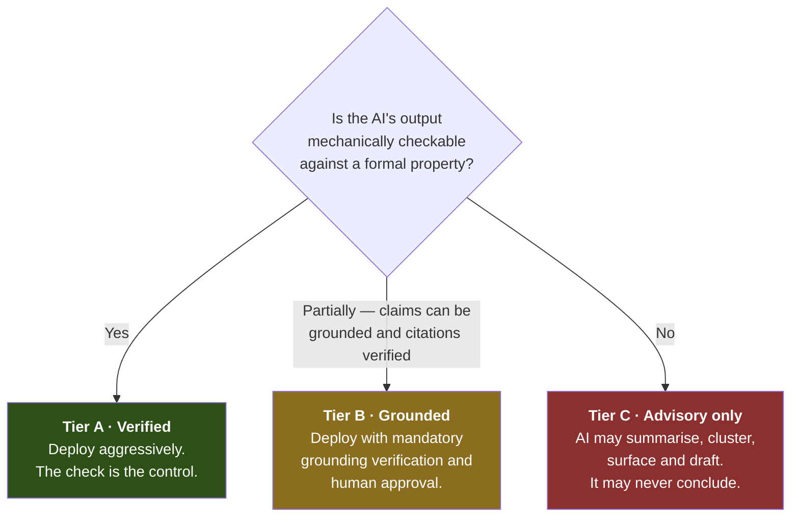
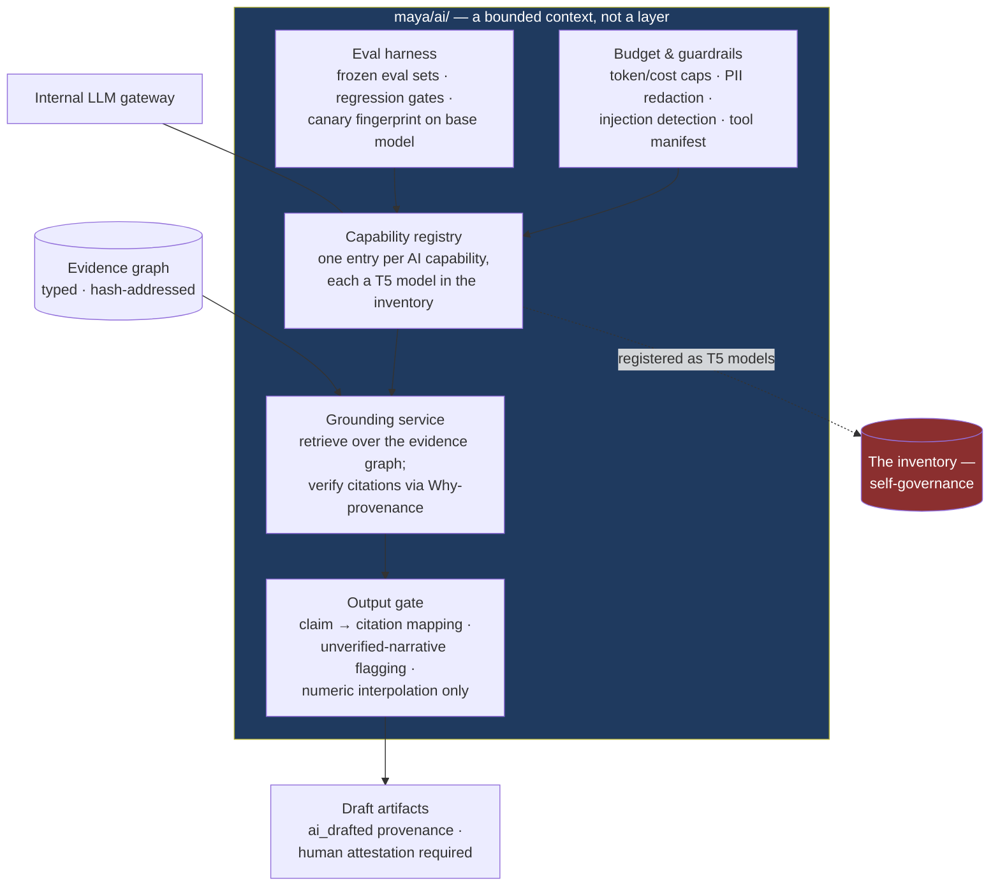

# 13 — AI, LLMs and Agents *Inside* the Platform

*MAYA — Model & AI Lifecycle Assurance.*  **Evidence, not assertion.**

> **A note on what this document is.** The rest of the specification treats AI as something the platform
> **governs**. This document treats AI as something the platform **uses** — and takes a position on where
> that is a good idea, where it is a bad idea, and why the distinction is sharper here than in most
> enterprise settings.
>
> It is an opinion, argued. Where I think the popular answer is wrong, I say so.

---

## 1. The organising principle

Most enterprise AI strategies sort use cases by *value* and then bolt on controls. That produces the
familiar pattern: an impressive pilot, a governance review that cannot say anything more specific than
"a human should check it", and a production system whose failure mode is that nobody checks.

For a governance platform, there is a much better sorting criterion available, and it comes directly
from the formal foundations:

> **Deploy AI where the formalism gives you a mechanical check on the AI's output.
> Use humans where it does not.**

This is not a general principle of AI deployment — it is available *here* because
[00 — Mathematical Foundations](00-mathematical-foundations.md) supplies unusually strong checks. The
satisfaction condition checks a regulatory encoding. Why-provenance checks whether cited evidence
actually supports a claim. Contract refinement checks a substitution. Probe-relative equivalence checks
a behavioural claim. A generated test either runs or does not.

Where such a check exists, an LLM can be wrong loudly and cheaply, and the system catches it. Where no
check exists, an LLM is wrong *quietly*, and in a governance system quiet wrongness is the failure mode
that matters.

Everything below is organised on that axis.

---

## 2. The three tiers

| | Tier A — Verified | Tier B — Grounded | Tier C — Advisory only |
|---|---|---|---|
| **Control** | A formal check passes or fails | Every claim cites evidence; citations are verified; a human approves | A human decides; AI never appears in the decision path |
| **Autonomy** | Human-approved automation, sometimes higher | Human-approved automation | Collaborative assistance |
| **Evidence status** | Output may become an evidence node once the check passes | Output is a draft with `ai_drafted` provenance until attested | Never evidence |
| **If the model degrades** | The check fails; nothing bad ships | Citations fail; the draft is rejected | A human was always deciding |

---

## 3. Tier A — where I would deploy AI aggressively

These are the cases where a formal property, already in the design, acts as an oracle.

### 3.1 Drafting regulatory institution encodings

The institutions approach ([00 §8](00-mathematical-foundations.md)) has exactly one weakness: encoding a
regime is expensive expert work. A new supervisory statement is forty pages of open-textured prose that
someone must turn into a signature and a set of sentences.

This is an excellent LLM task — read the text, propose the vocabulary, propose the obligations, cite the
clause for each — and, crucially, **its output is checkable**. The satisfaction condition
(law `L-8`) is a property test over generated inventory states. A defective encoding fails it.

That combination is rare and valuable: the AI does the expensive part, and a theorem checks the answer.
I would build this early. It converts the extensibility guarantee from "possible" to "cheap", which is
the difference between a guarantee and a claim.

**What the AI does not do:** publish. A proposed encoding goes to a human regulatory specialist with the
satisfaction-condition test results attached. The specialist's job changes from *authoring* to
*reviewing an encoding that has already passed a consistency check* — which is a much better use of a
scarce person.

### 3.2 Probe-set generation

[00 §5.3](00-mathematical-foundations.md) is candid that behavioural equivalence is only as strong as the
probe set, and that thin probe sets are the norm. Generating probes — boundary values, rare segments,
edge cases in the declared input domain, adversarial inputs — is a task LLMs are genuinely good at, and
the output is self-checking: a probe either executes and discriminates, or it does not.

This attacks a real weakness in the design rather than adding a feature. The worked example in the paper
— a "patch" release that silently changed 2% of scores because no probe covered missing DSCR — is
exactly what generated probe sets catch.

### 3.3 Code-to-document consistency

Does the methodology described in the model development document match the methodology in the code? This
is a question humans answer badly, slowly, and inconsistently, and it is where model documentation most
often becomes fiction.

An LLM comparing a document section against a code diff, and flagging divergence for review, is doing
something checkable in the weak sense that a human can adjudicate each flag in seconds. Precision matters
more than recall here; a noisy version of this is worse than nothing.

### 3.4 Format migration

Converting a pickle artifact to ONNX so it can enter production under the format policy
([09 §2.1](09-security-compliance.md)) is a mechanical task with a perfect oracle: run both artifacts over
the probe set and assert numerical equivalence within tolerance. An agent can do the conversion, run the
equivalence test, and open a pull request. If equivalence fails, nothing ships.

I would automate this without hesitation. It removes the main source of friction the format policy
creates, which is otherwise an adoption risk.

### 3.5 Natural-language query over the inventory

*"Which models fed the Q2 2026 CECL provision, what was their validation status at that date, and which
had active overlays?"* Text to structured query over a well-defined schema, where the query either parses
and returns or does not, and the user sees the generated query. Low risk, high daily value, and it makes
the as-at-date capability actually usable by people who will never write SQL.

### 3.6 Remediation planning — and the nicest tie-in in the design

The tropical semiring `(ℝ⁺∪{∞}, min, +)` from [00 §9.2](00-mathematical-foundations.md) computes, for any
unmet governance claim, **the cheapest path to close the gap** — in person-days, over the actual evidence
structure.

That is a plan waiting to be executed. An agent can take the computed path, draft the remediation
tasks, assign them from the RACI, schedule them against validator capacity, and chase them. The *plan*
comes from the algebra, not the model; the agent does the coordination. The AI is not deciding what needs
to happen — the semiring decided that — so there is nothing for it to be creatively wrong about.

---

## 4. Tier B — deploy, with grounding verification

### 4.1 Documentation drafting, and why it is different here

Documentation is the largest cost in model risk — 80 to 200 hours per model, stale on arrival. It is the
obvious LLM application and it is the one most likely to be done badly.

The usual approach is RAG over a document store, which produces fluent text with plausible-looking
citations that nobody checks. In this platform the substrate is different in a way that matters:

> The evidence graph is **typed, hash-addressed, and carries provenance semirings**. So "cite your
> sources" is not a hope — it is `return the evidence node ids`, and **Why-provenance can verify that
> the cited set actually supports the claim.**

That is grounding *verification*, not grounding *aspiration*, and I think it is the single strongest
argument for building documentation drafting here rather than buying a generic tool.

The gate is strict:

1. Every generated sentence carrying a factual claim must map to one or more evidence node ids.
2. The cited set is checked against the claim's actual derivation. A citation that does not support the
   claim is a **failure**, not a warning.
3. Unmappable sentences are rendered but visibly flagged as `unverified_narrative` and require explicit
   human attestation.
4. Numbers are **never generated**. They are interpolated from evidence. The model writes prose around
   values it did not compute — which removes the entire class of hallucinated statistics.
5. The whole capability is registered in the inventory as a T5 model, tiered, evaluated against a frozen
   eval set, and re-gated on every prompt, corpus or base-model change.

### 4.2 Model and EUC discovery

Inventory completeness is the top adoption risk ([10](10-roadmap.md)), and discovery is a genuinely good
agent task: crawl git repositories, notebooks, shared drives, SAS metadata, the CMDB and the LLM gateway;
classify what is found; propose an inventory record with a provisional class and tier.

Grounded, because every proposal points at a specific artifact a human can open. The agent proposes; a
human confirms; the confirmation is the evidence.

I would scope this narrowly at first. A discovery agent with poor precision generates a triage queue
nobody works, and an unworked queue is worse than no queue — it creates the appearance of coverage.

### 4.3 Validation assistance

Not validation. *Assistance.* Summarising a 200-page vendor methodology document against a
due-diligence checklist. Generating challenge questions from a corpus of prior validation findings for
similar model classes. Drafting a test plan from the class's test catalogue. Identifying which
assumptions in the MDD have no corresponding test.

That last one is quietly valuable: "you asserted six assumptions and tested four" is a mechanical gap
analysis dressed as an AI feature, and it is the kind of finding that surfaces late and embarrassingly
today.

### 4.4 Finding correlation and triage

Finding **M-8** in the [adversarial review](11-adversarial-review.md) identified notification storms: one
upstream failure raising findings on every downstream model. Clustering findings into root cause plus
impact records is a task where an LLM's judgement about semantic similarity genuinely helps, and where
a human confirms the grouping before notifications go out.

### 4.5 Committee and examiner support

Drafting committee papers from the reporting pack; turning committee minutes into structured decision
records; assembling a first-pass response to an examiner request by locating relevant evidence. All
grounded in existing artifacts, all human-approved before they leave the building.

---

## 5. Tier C — where I would refuse

I want to be unambiguous about this, because the commercial pressure runs the other way and the
vocabulary of "AI-powered governance" is already in the market.

**AI must never make a governance decision.** Specifically, never:

| Decision | Why not |
|---|---|
| **Assign a risk tier** | The tier must be a *derivation* from a versioned rule set over sourced facts. An LLM-assigned tier is unexplainable, unstable across runs, and destroys the audit chain. It may *propose* an input; it may not produce the output. |
| **Conclude a validation** | Effective challenge is defined by SR 26-2 as critical analysis by objective experts with the standing to effect change. An LLM has no standing, no accountability, and cannot be sanctioned. |
| **Make a scope determination** | The whole point of the institutions construction is that scope is a derivation with a citation. Replacing it with a model's opinion discards the single most valuable property in the design. |
| **Approve anything** | Approval is an accountable human act with an e-signature behind it. |
| **Accept residual risk** | Requires authority. Models do not have authority. |
| **Close a finding** | Closure requires independent verification by a person who did not raise it. |
| **Compute a metric** | Do not ask a language model for a Gini coefficient. Compute it and let the model describe it. This sounds obvious and is violated constantly. |

**And AI must never be in the hook path.** [06](06-hooks-and-execution.md) requires p99 under 50 ms and
deterministic behaviour. Nothing probabilistic goes there.

---

## 6. The recursion, and why it is a feature

There is an obvious objection: a platform that governs AI, using AI, is either circular or hypocritical.

I think it is neither — provided one rule holds absolutely:

> **Every AI capability inside the platform is registered in the platform's own inventory as a T5 model:
> tiered, contracted, evaluated, monitored, and subject to the same gates as anything the bank runs.**

The documentation assistant has an owner, an approved use, an autonomy mode, a frozen eval set, a
hallucination-rate threshold, a cost budget, and a kill switch. Its prompt is a versioned artifact. A
base-model change under a vendor endpoint is detected by canary fingerprinting and treated as a change
event.

This is not compliance theatre. It is the strongest possible forcing function on the product:

- **If the platform cannot govern its own AI, it cannot govern the bank's.** Every awkwardness in the
  GenAI track shows up first in our own use, where we cannot blame the user.
- **It produces the reference implementation.** When a team asks what a governed GenAI application looks
  like, the answer is a working one they already use.
- **It makes the platform its own first customer**, which is the most reliable quality mechanism there
  is.

I would make this non-negotiable, and I would put the platform's own AI capabilities on the same
dashboard as everything else — visible to the same auditors, with the same red marks when they drift.

---

## 7. Architecture

AI is a bounded context behind the same plugin boundary as everything else. It is not a layer that
reaches into other modules.

**Design commitments:**

| Commitment | Rationale |
|---|---|
| No AI capability may write to the inventory without a human transition | Preserves the audit chain (Tier C) |
| All retrieval is over the evidence graph, never over free-floating documents | Grounding must be verifiable, not plausible |
| Numbers are interpolated from evidence, never generated | Removes hallucinated statistics entirely |
| Agent tool manifests are versioned artifacts with declared reversibility and blast radius | Per [09 §5.4](09-security-compliance.md) |
| Irreversible actions require human approval regardless of tier | Agents chase and draft; they do not commit |
| Per-capability token, cost and step budgets, hard-enforced at the gateway | Cost is a monitored metric with thresholds |
| Model-agnostic: the gateway is an interface, capabilities are prompts + evals | Base models change faster than the platform |

---

## 8. Risks I would watch, including one that is usually missed

| Risk | Why it matters here | Mitigation |
|---|---|---|
| **Fluency reduces scrutiny** | This is the one I worry about most and it is rarely named. AI-drafted documentation *reads* complete. Reviewers of fluent text find fewer problems than reviewers of obviously rough text — the artifact's polish becomes a signal of its quality, and it is not one. The risk is not that AI writes bad documentation; it is that AI writes *plausible* documentation and thereby lowers the quality of human review. | Render AI-drafted sections visibly differently. Show the citation for every claim inline. Require attestation per section, not per document. Track reviewer edit distance as a metric and investigate when it drops — a reviewer who changes nothing is a signal, not a success. |
| **Prompt injection through model metadata** | An attacker — or a careless developer — puts instructions in a model description, a feature definition or a vendor document, and the documentation assistant reads it. This is a real injection surface that a normal enterprise chatbot does not have. | Treat all inventory content as untrusted input. Structural separation of instructions from data. Injection detection. Never grant a capability write access it does not need. |
| **Evidence poisoning** | If an agent can create evidence nodes, it can create supporting evidence for a claim. | Agents may propose; only humans and instrumented systems may create evidence. AI output carries `ai_drafted` provenance and reduced trust, which the trust semiring propagates automatically. |
| **Automation bias in triage** | A discovery or triage queue that is usually right trains people to approve without looking. | Deliberate sampling: a fixed fraction of AI proposals routed for full independent assessment, with disagreement tracked as a quality metric. |
| **Base-model drift** | A vendor silently updates a model behind an endpoint and behaviour changes. | Canary probe-set fingerprinting on a schedule; a detected change is a change event that re-runs the eval gate. |
| **Cost blowout** | Agentic loops over a large estate can be expensive fast. | Hard per-capability budgets; agent step caps; cost as a monitored metric with alerting. |
| **Capability creep into Tier C** | The pressure to let a well-performing assistant "just assign the tier" will be constant and will come from sensible people. | Make it architecturally impossible: no AI capability holds a credential permitting a governance state transition. Policy is not enough; the credential must not exist. |

---

## 9. What I would build, in order

| | Capability | Tier | Why here |
|---|---|---|---|
| **1** | Semantic search and feature deduplication | A | Already in the design; embeddings only; immediate daily value; near-zero risk |
| **2** | Natural-language query over the inventory | A | Makes as-at-date and portfolio views usable by non-technical users |
| **3** | Documentation drafting with grounding verification | B | Largest cost centre; the evidence graph makes this genuinely better than a generic tool |
| **4** | Probe-set generation | A | Attacks an acknowledged weakness in the design rather than adding surface |
| **5** | Regulatory institution encoding assistant | A | Converts the extensibility guarantee from possible to cheap; checkable by `L-8` |
| **6** | Model and EUC discovery agents | B | Attacks the top adoption risk — but only after precision can be measured |
| **7** | Validation assistance and gap analysis | B | High value to the scarcest role in the process |
| **8** | Remediation-planning agents on the tropical semiring | A | The plan comes from the algebra; the agent only coordinates |
| **9** | Format migration agents with equivalence oracles | A | Removes the friction the format policy creates |
| **10** | Finding correlation and committee drafting | B | Quality-of-life; deploy once trust is established |

Items 1, 2, 4, 5, 8 and 9 are Tier A and I would move on them with confidence. Items 3, 6, 7 and 10 are
Tier B and each needs its grounding gate working before it ships. Nothing on this list is Tier C, because
nothing on this list makes a decision.

---

## 10. The position, stated plainly

I think AI belongs in this platform, substantially, and for a specific reason that is easy to miss: a
governance system built on formal foundations is an *unusually good* place to use AI, because it comes
with oracles. The satisfaction condition checks a regulatory encoding. Why-provenance checks a citation.
Contract refinement checks a substitution. An equivalence test checks a conversion. Elsewhere in the
enterprise, "the AI might be wrong" is managed with review processes and hope. Here, for a meaningful
fraction of the work, it is managed with a test.

And I think the boundary should be drawn harder than is currently fashionable. AI should draft, retrieve,
propose, cluster, convert, generate tests, and chase. It should never conclude, approve, tier, scope, or
close. Not because models are untrustworthy in some general sense, but because the entire value of this
platform is that its claims are *derivable* — and a claim whose provenance is "a language model said so"
is precisely the kind of claim the system exists to eliminate.

The recursion is the best part. A platform that governs models, governed by itself, using models it
governs. If that turns out to be uncomfortable in practice, we will have learned something important
about the GenAI track before a single business unit does.
