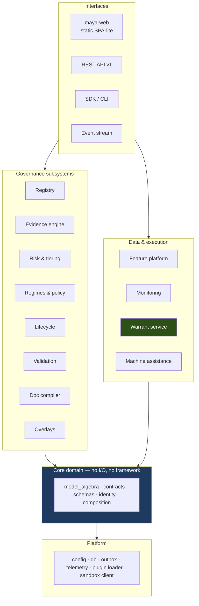
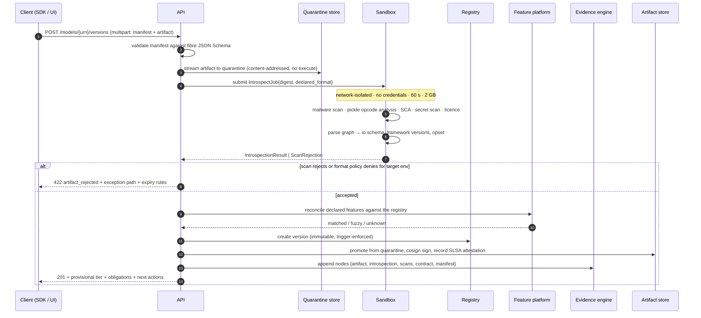
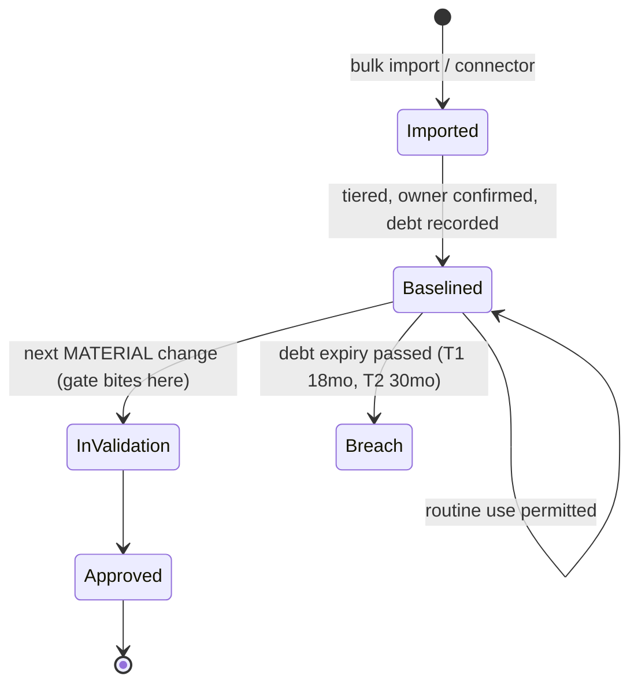
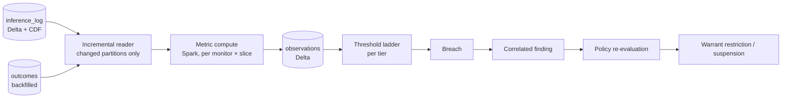
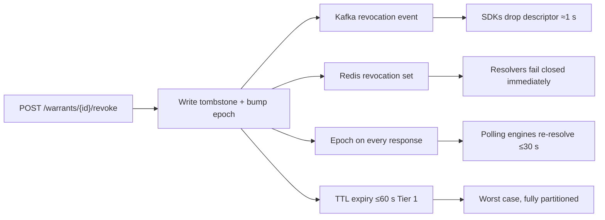

# 14 — Detailed System Design

*MAYA — Model & AI Lifecycle Assurance.*  **Evidence, not assertion.**

**Level.** This document sits one level below [04 — Architecture](04-architecture.md). Where 04 answers
*what the containers are and why*, this answers *what each component does internally* — interfaces,
algorithms, transaction boundaries, error taxonomy, concurrency, caching, and operations.

**Audience.** Engineers implementing the system. It is written to be sufficient to start coding from.

**Incorporates.** The dispositions of [11 — Adversarial Review](11-adversarial-review.md), the decoupled
front end of [ADR-011](adr/ADR-011-decoupled-frontend.md), and the oracle criterion of
[00 §12a](00-mathematical-foundations.md).

---

## Table of contents

**Part I — Foundations**
[1 Design overview](#1-design-overview) ·
[2 Core domain](#2-core-domain) ·
[3 Registry and the fibration](#3-registry-and-the-fibration)

**Part II — Governance subsystems**
[4 Evidence engine](#4-evidence-engine) ·
[5 Risk and tiering](#5-risk-and-tiering) ·
[6 Regimes and policy](#6-regimes-and-policy) ·
[7 Lifecycle and workflow](#7-lifecycle-and-workflow) ·
[8 Validation and findings](#8-validation-and-findings) ·
[9 Documentation compiler](#9-documentation-compiler)

**Part III — Data and execution**
[10 Feature platform](#10-feature-platform) ·
[11 Monitoring](#11-monitoring) ·
[12 Warrant subsystem](#12-warrant-subsystem) ·
[13 Machine assistance](#13-machine-assistance)

**Part IV — Interfaces**
[14 API design](#14-api-design) ·
[15 Front-end design](#15-front-end-design) ·
[16 SDK and events](#16-sdk-and-events)

**Part V — Cross-cutting**
[17 Persistence and transactions](#17-persistence-and-transactions) ·
[18 Concurrency and idempotency](#18-concurrency-and-idempotency) ·
[19 Caching and performance](#19-caching-and-performance) ·
[20 Error taxonomy](#20-error-taxonomy) ·
[21 Observability and operations](#21-observability-and-operations) ·
[22 Capacity model](#22-capacity-model) ·
[23 Testing design](#23-testing-design)

---

# Part I — Foundations

## 1. Design overview

### 1.1 Component inventory



### 1.2 Component responsibility table

| Component | Owns | Does **not** own |
|---|---|---|
| **Core domain** | The algebra: parametric kernels, contracts, schema lattice, probe equivalence, composition | Persistence, HTTP, orchestration |
| **Registry** | Models, versions, artifacts, aliases, fibres, introspection | Deciding whether a version may be promoted |
| **Evidence engine** | The append chain, semiring evaluation, gluing | Interpreting what evidence means for a gate |
| **Risk & tiering** | Lattices, τ, control adequacy, derivation traces | Overriding a tier (that is a workflow action) |
| **Regimes & policy** | Institutions, comorphisms, Rego gates, MTL obligations | Executing a transition |
| **Lifecycle** | State machines, transitions, guards, approvals, SoD | Guard *content* (that is policy) |
| **Validation** | Plans, test execution, findings, remediation | Computing metrics at scale (that is monitoring) |
| **Doc compiler** | Lenses, templates, rendering, staleness | Authoring narrative |
| **Overlays** | PMA register, magnitude, propagation, recurrence | Approving an overlay |
| **Feature platform** | Registry, materialisation, PIT, contracts, skew | Model semantics |
| **Monitoring** | Monitor defs, evaluation orchestration, breaches, health | Deciding consequences (policy does) |
| **Warrant service** | Resolution, signing, revocation, telemetry ingest | Any governance decision — it reads a projection |
| **Machine assistance** | Capabilities, grounding, citation checking, oracles | Any governance state transition |

### 1.3 Design rules that bind every component

| # | Rule |
|---|---|
| **DR-1** | A component exposes a **port** (a Protocol class) and is consumed only through it. No cross-component imports of internals. |
| **DR-2** | Domain logic is **pure and synchronous**. I/O happens in adapters at the edge of a component. |
| **DR-3** | Every write path is **idempotent** given an `Idempotency-Key` or a natural key. |
| **DR-4** | Every derived value is written with its **derivation record** in the same transaction. |
| **DR-5** | Nothing outside `platform/db` opens a transaction. Components receive a `UnitOfWork`. |
| **DR-6** | Every externally-visible failure maps to an entry in the **error taxonomy** (§20). No bare 500s. |
| **DR-7** | Any component that can block a user action must return **why**, and a link to remediate. |

---

## 2. Core domain

`maya/domain/` — no FastAPI, no SQLAlchemy, no network. Fully unit-testable.

### 2.1 Model algebra

```python
# maya/domain/model_algebra.py
from typing import Protocol, Literal, Mapping, Sequence
from dataclasses import dataclass

ParameterKind = Literal["none", "calibration_set", "estimated_coefficients", "learned_weights",
                        "llm_configuration", "rule_set", "elicited_weights", "opaque"]
FitProcedure  = Literal["none", "calibrate", "estimate", "train", "elicit", "configure", "author"]

@dataclass(frozen=True)
class ObjectSpec:
    """An object of the category: a typed, named product with optional constraints."""
    schema: "SchemaRef"
    kind: Literal["point_estimate", "predictive_distribution", "class_probabilities",
                  "ranking", "text", "structured", "decision", "none"]

@dataclass(frozen=True)
class ParameterObject:
    kind: ParameterKind
    artifact_digest: str | None          # None for `none` and `opaque`
    cardinality: int | None

    @property
    def is_terminal(self) -> bool:        # P ≅ I  — the T0 case
        return self.kind == "none"

    @property
    def is_accessible(self) -> bool:      # False for vendor black boxes (T6)
        return self.kind != "opaque"

@dataclass(frozen=True)
class ParametricKernel:
    """A model: f : P ⊗ X → Y."""
    parameters: ParameterObject
    input:  ObjectSpec
    output: ObjectSpec
    deterministic: bool                   # copy ∘ f = (f ⊗ f) ∘ copy  — law L-3

    def trainability_class(self, fit: FitProcedure, adaptive: bool) -> str:
        if not self.parameters.is_accessible:            return "T6"
        if self.parameters.is_terminal:                  return "T0"
        return {"calibrate": "T1", "estimate": "T2",
                "train": "T4" if adaptive else "T3",
                "configure": "T5", "elicit": "T7", "author": "T8"}[fit]
```

**Why this shape.** `trainability_class` is a *derived* function of the parameter object and the fitting
procedure, never a stored enum the user picks. That is the direct encoding of
[00 §4.2](00-mathematical-foundations.md) and is what prevents the estate from drifting into
mislabelled records.

### 2.2 Contract algebra

```python
# maya/domain/contracts.py
@dataclass(frozen=True)
class Contract:
    assumptions: "Predicate"      # A — operating boundaries, population, regime, upstream freshness
    guarantees:  "Predicate"      # G — performance envelope, fairness, latency, explainability

    def refines(self, other: "Contract") -> "RefinementResult":
        """C' ⪯ C  iff  A ⊆ A'  and  (A ∧ G') ⊆ G.  Decidable on our predicate language."""
        weaker_assumption = other.assumptions.implies(self.assumptions)
        stronger_guarantee = (other.assumptions & self.guarantees).implies(other.guarantees)
        return RefinementResult(
            holds=weaker_assumption and stronger_guarantee,
            failing_clauses=[...],           # DR-7: always say which clause failed
        )

    def compose(self, downstream: "Contract") -> "Contract": ...
    def conjoin(self, other: "Contract") -> "Contract": ...
    def quotient(self, have: "Contract") -> "Contract":
        """What a missing component must guarantee. Turns a gap into a specification."""
```

**Predicate language.** Deliberately restricted so refinement stays decidable: conjunctions of interval
constraints on numeric fields, set-membership on categoricals, comparisons on metrics, and freshness
bounds. Anything richer is recorded as a *narrative* assumption that does not participate in automated
refinement — and is flagged as such, so nobody believes a check happened that did not.

### 2.3 Schema lattice and variance

```python
def substitutable(new: Schema, old: Schema) -> VarianceResult:
    """Contravariant in inputs, covariant in outputs (law L-12)."""
    return VarianceResult(
        ok = new.input.accepts_superset_of(old.input)
             and new.output.is_subtype_of(old.output),
        input_regressions  = old.input.fields_not_accepted_by(new.input),
        output_regressions = old.output.fields_not_provided_by(new.output),
    )
```

### 2.4 Probe-relative identity

```python
def pi_equivalent(a: RunnableRef, b: RunnableRef, probes: ProbeSet,
                  tol: Tolerance) -> EquivalenceResult:
    """v₁ ≡_Π v₂ — the formal content of a PATCH release."""
    diffs = [(p, execute(a, p), execute(b, p)) for p in probes]
    return EquivalenceResult(
        equivalent = all(within(tol, x, y) for _, x, y in diffs),
        probe_set_id = probes.id,
        coverage = probes.coverage_of(a.declared_input_domain),   # honesty about Π's strength
        divergences = [...],
    )
```

`coverage` is stored with every equivalence claim. A claim made on a probe set covering 12% of the
declared input domain is recorded as such and, above a tier threshold, raises a finding.

---

## 3. Registry and the fibration

### 3.1 Fibre resolution

```python
class FibreRegistry:
    def __init__(self, plugins: PluginLoader):
        self._fibres: dict[str, ModelClassFibre] = {}
        for ep in plugins.entry_points("maya.model_class"):
            f = ep.load()()
            self._validate_total(f)          # law L-15, at startup — never at request time
            self._fibres[f.key] = f

    def _validate_total(self, f) -> None:
        missing = [n for n in ("evidence_schema", "lifecycle", "default_monitors",
                               "document_templates", "tiering_hints", "contract_template")
                   if not getattr(f, n)()]
        if missing:
            raise FibreIncomplete(f.key, missing)   # fail startup, not the user's request
```

**Startup contract.** A half-implemented class cannot reach production because the process refuses to
boot. This is deliberate: a partially-registered fibre would otherwise surface as a confusing runtime
error weeks later, in the one place the platform must be trustworthy.

### 3.2 Version creation — the full path



**Transaction boundary.** Steps 8–11 are one Postgres transaction plus an outbox row for the object-store
promotion. If promotion fails, the outbox retries; the version exists but is marked
`artifact_pending`, and cannot be aliased. Partial visibility is preferable to a lost write.

### 3.3 Alias moves

The most dangerous operation in the platform. Sequence and guards:

```python
def move_alias(model_id, env, name, to_version, actor, justification) -> AliasMoveResult:
    with uow.transaction():
        lock = advisory_lock(f"alias:{model_id}:{env}")          # serialise per (model, env)
        cur  = aliases.get(model_id, env, name)
        new  = versions.get(to_version)

        ref = new.contract.refines(cur.contract)                 # L-7
        var = substitutable(new.schema, cur.schema)              # L-12
        if not (ref.holds and var.ok):
            raise AliasMoveRefused(ref, var, consumers=warrants.consumers_of(model_id, env, name))

        verdict = policy.evaluate("gates.alias_move", context(model_id, new, env))
        if not verdict.allow:
            raise PolicyDenied(verdict.deny_reason)

        warrant_projection.rebuild(model_id, env, name, new)        # PRE-WARM before invalidate (H-1)
        aliases.point(model_id, env, name, new)
        alias_history.append(cur, new, ref, var, actor, justification)
        evidence.append(kind="alias_move", parents=[new.evidence_id], payload={...})
        outbox.put(CacheInvalidate(urn, env, name), AliasMoved(...))
    monitoring.schedule_post_move_comparison(model_id, env, window="P7D")
    return AliasMoveResult(...)
```

**Pre-warm before invalidate** is not an optimisation; it is the fix for the stampede identified as
finding H-1. The cache is never empty for a hot alias.

---

# Part II — Governance subsystems

## 4. Evidence engine

### 4.1 Append path

```python
def append(kind, subject, payload, parents, *, personal_data=False, uow) -> EvidenceNode:
    content_hash = sha256(canonical_json({"kind": kind, "subject": subject,
                                          "payload": payload, "parents": sorted(parents)}))
    with uow.lock("evidence_chain"):                 # serialises seq; contention is low
        prev = evidence.head()
        node = EvidenceNode(
            id=ulid(), seq=prev.seq + 1, kind=kind, subject=subject,
            payload={} if personal_data else payload,          # L-18: never inline
            payload_uri=delta.put(payload) if personal_data else None,
            contains_personal_data=personal_data,
            content_hash=content_hash, prev_hash=prev.chain_hash,
            chain_hash=sha256(f"{prev.seq+1}|{prev.chain_hash}|{content_hash}|"
                              f"{'|'.join(sorted(p.chain_hash for p in parents))}"),
        )
        evidence.insert(node)                        # INSERT-only role
    return node
```

**Chain vs DAG.** The DAG expresses derivation; the linear `seq`/`prev_hash` chain makes deletion and
back-dating detectable (finding C-4). A daily job walks the chain and compares the head against an
anchor in WORM storage and an RFC-3161 timestamp — self-consistency alone proves nothing.

### 4.2 Semiring evaluation

```python
class Semiring(Protocol[K]):
    zero: K ; one: K
    def plus(self, a: K, b: K) -> K: ...
    def times(self, a: K, b: K) -> K: ...

def evaluate(claim: ClaimRef, K: Semiring[T], valuation: Callable[[str], T]) -> T:
    """Memoised bottom-up evaluation of the derivation DAG."""
    memo: dict[str, T] = {}
    def go(node: str) -> T:
        if node in memo: return memo[node]
        d = derivations[node]
        if d.is_leaf: r = valuation(node)
        else:
            r = K.zero
            for alt in d.alternatives:                       # OR
                t = K.one
                for dep in alt.requires: t = K.times(t, go(dep))   # AND
                r = K.plus(r, t)
        memo[node] = r
        return r
    return go(claim.root)
```

**Complexity discipline (finding M-2).** `Why(X)` is worst-case exponential in the number of
alternatives. Controls: canonical form with absorption (`a ⊕ ab = a`), memoisation, a depth cap, and a
hard term cap of 4,096 monomials beyond which evaluation **degrades to `Boolean ⊕ Trust` and emits an
explicit `truncated=true` marker**. A silently partial answer is never returned.

### 4.3 The nine valuations

| Semiring | Registered as | Used by |
|---|---|---|
| `Boolean` | `maya.semiring:boolean` | Lifecycle gates, warrant resolution |
| `Counting` | `…:counting` | Corroboration depth on the model page |
| `Why(X)` | `…:why` | Examiner packs, "what must I show?" |
| `ℕ[X]` | `…:how` | Tier 1 audit reconstruction (materialised) |
| `Trust` | `…:trust` | Model health score, AI-drafted provenance discounting |
| `Tropical` | `…:cost` | Remediation planning, validator capacity forecasting |
| `Classification` | `…:classification` | PII/confidentiality propagation (`FR-SEC-007`) |
| `Admissibility` | `…:regimes` | Which regulators accept this evidence |
| `Freshness` | `…:freshness` | Document staleness (`FR-DOC-004`) |

## 5. Risk and tiering

### 5.1 The algorithm

```python
def assess(model_id: str, ruleset_version: str, uow) -> RiskAssessment:
    facts = FactCollector(model_id).collect()        # sourced where possible (finding H-8)
    rules = rulesets.get(ruleset_version)            # immutable, versioned, tested

    m = Materiality(
        quantitative = rules.exposure_band(facts.exposure_measure, facts.exposure_unit),
        qualitative  = rules.purpose_class(facts.purpose, facts.decision_authority),
    ).join()                                          # join in the materiality lattice M

    c = Complexity.meet(                              # meet over the product lattice C
        data          = rules.score_data(facts),
        methodology   = rules.score_method(facts),
        implementation= rules.score_impl(facts),
        use_intensity = rules.score_use(facts),
        interpretability = rules.score_interp(facts),
        transparency  = rules.score_transparency(facts),
        bias_potential= rules.score_bias(facts),
    )

    tier     = rules.tau(m, c)                        # monotone (law L-4)
    controls = rules.req(tier)                        # Galois adjoint (law L-5)

    return RiskAssessment(
        fact_snapshot=facts.as_dict(), ruleset_version=ruleset_version,
        materiality=m, complexity=c, tier=tier, required_controls=controls,
        rationale=rules.explain(m, c, tier),          # DR-4: derivation stored, always
        next_review_due=rules.review_due(tier),
        triggers=rules.triggers_for(tier, facts),
    )
```

### 5.2 Fact sourcing (anti-gaming)

| Fact | Source | If unavailable |
|---|---|---|
| `exposure_measure` | Bound to a system of record (risk data mart, GL, portfolio system) with a nightly reconciliation | Marked `unsourced`; peer-cohort outlier detection applies; flagged on the model page |
| `purpose_class` | Human, but a change requires approval **at the tier being left**, not the tier being entered | — |
| complexity components | Derived from artifact introspection, feature contract, and lineage where possible | Human with rationale |

Annual **retrospective calibration** back-tests tier assignments against realised incidents, findings and
losses. A tier that never predicts anything is evidence of systematic understatement, not of a quiet
portfolio.

### 5.3 Re-tiering triggers

Evaluated by an event handler on: exposure change beyond band, new approved use, methodology change,
data-source change, monitoring breach at severity ≥ High, regime change, elapsed review period. Each
trigger enqueues an assessment; assessments are cheap and append-only, so re-running is always safe.

## 6. Regimes and policy

### 6.1 Institution interface

```python
class Institution(Protocol):
    key: str ; version: str
    signature: Signature
    sentences: Sequence[Sentence]
    def translate(self, facts: CoreFacts) -> RegimeFacts: ...   # the comorphism component

def determine(model_id: str, inst: Institution) -> ScopeDetermination:
    core   = CoreFacts.for_model(model_id)
    local  = inst.translate(core)
    result = inst.sentences["is_model"].evaluate(local)
    return ScopeDetermination(
        regime_key=inst.key, regime_version=inst.version,
        determination="in_scope" if result.value else "out_of_scope",
        derivation={"sentence": "is_model", "evaluated": result.value,
                    "failing_conjunct": result.first_false_conjunct,
                    "facts": local.as_dict(), "citation": result.citation},
        obligations=[s.key for s in inst.sentences if s.is_obligation and s.evaluate(local).value],
    )
```

**Law L-8 in CI.** Hypothesis generates inventory states; for each regime and each sentence, evaluating
natively and evaluating the translation must agree. A disagreement is a defective encoding — the exact
class of bug that produces an indefensible scope determination.

### 6.2 Policy evaluation

Two engines, deliberately separate:

| Engine | Language | Answers | Latency budget |
|---|---|---|---|
| **Gate engine** | Rego (OPA) | "May this transition happen *now*?" | < 20 ms, in-process |
| **Obligation engine** | MTL → synthesised monitors | "What is owed, by when?" | Batch, nightly + event-driven |

```python
verdict = policy.evaluate("gates.promote_to_production", {
    "model": model.as_policy_input(), "validation": validation.summary(),
    "findings": findings.open_summary(), "documents": docs.completeness(),
    "approvals": approvals.summary(), "evidence": evidence.evaluate(claim, BOOLEAN),
})
# verdict.allow: bool ; verdict.deny_reason: list[{code, message, remediation_url}]   (DR-7)
```

Policy bundles are versioned artifacts with their own test corpus, a canary environment, and a rollback
path. A policy change that would newly block more than a configured fraction of the estate requires
explicit acknowledgement — the safeguard against estate-wide gridlock.

## 7. Lifecycle and workflow

### 7.1 Engine

A lifecycle is a graph; a model's history is a path (law L-1). The engine is generic; all content is
configuration supplied by the fibre.

```python
def attempt(model_id, transition, actor, payload, uow) -> TransitionResult:
    with uow.transaction():
        m  = models.get_for_update(model_id)
        lc = lifecycles.get(m.model_class.lifecycle_key)
        t  = lc.transition(m.status, transition) or fail(UnknownTransition(...))

        unmet = [g for g in t.guards if not policy.evaluate(g, context(m)).allow]
        sod   = sod_engine.violations(actor, t, m)
        if unmet or sod:
            raise TransitionBlocked(unmet, sod)        # each entry carries a remediation link

        models.set_status(m, t.to_state)
        evidence.append("transition", m.ref, {...}, parents=[...])
        audit.write(actor, transition, m, before, after)
        outbox.put(StatusChanged(m.urn, t.to_state))
    return TransitionResult(m.status, next_transitions=lc.enabled_from(t.to_state, m))
```

### 7.2 Approvals and segregation of duties

```python
SOD = [
  Rule("developer_not_validator",  lambda a,t,m: a.id not in m.developer_ids or t.role != "validator"),
  Rule("owner_not_sole_approver",  lambda a,t,m: not (m.tier <= 2 and a.id == m.owner_id and t.is_sole)),
  Rule("no_self_finding_closure",  lambda a,t,m: a.id != t.finding.raised_by),
  Rule("policy_author_not_publisher", ...),
  Rule("overlay_proposer_not_approver", ...),
  Rule("platform_admin_no_governance", ...),
]
```

Checked at the API **and** re-checked nightly, because a role change can create a retrospective conflict
that the point-in-time check never sees.

### 7.3 Baseline import (finding C-5)



A `compliance_debt` record enumerates absent evidence, its materiality, an owner and a dated plan. Debt
is a **burn-down**, reported separately from breach on every dashboard and never rendered in the same
colour. Existing use is not blocked; *change* is.

## 8. Validation and findings

### 8.1 Test catalogue

```python
class TestDefinition(Protocol):
    key: str ; category: str                    # discrimination | calibration | stability | …
    applicable_to: Callable[[ModelVersion], bool]
    def run(self, ctx: TestContext) -> TestResult: ...
```

Tests execute in the sandbox against a **pinned** version and dataset snapshot; the result becomes an
evidence node with the run's inputs hashed in. A pasted screenshot is not evidence and has no path into
the system.

### 8.2 Reproducibility replay

```python
def replay(run_id) -> ReplayReport:
    r = runs.get(run_id)
    env = sandbox.materialise(r.environment)               # container digest or lockfile
    out = sandbox.execute(env, r.code_commit, r.dataset_snapshots, r.params, seed=r.seed)
    if r.deterministic:
        ok, detail = bitwise_equal(out.artifact_digest, r.artifact_digest)
    else:
        ok, detail = distributionally_equal(out.metrics, r.metrics, tol=r.tolerance)
    if not ok:
        findings.raise_(severity="High", category="reproducibility", detail=detail)
    return ReplayReport(ok, detail)
```

### 8.3 Findings

Severity ladder, blocking semantics, and correlation:

| Severity | Blocks | Default SLA |
|---|---|---|
| Critical | Production warrant issuance; suspends existing warrants | 30 days |
| High | Promotion; alias moves | 60 days |
| Medium | Nothing automatically | 90 days |
| Low / Observation | Nothing | Next review |

**Correlation (finding M-8).** A breach with a common upstream cause produces **one root finding plus
impact records**, not N findings. Notification goes to the root owner, with a digest to affected owners.

## 9. Documentation compiler

### 9.1 The lens

```python
def get(evidence_state: EvidenceState, template: Template) -> GeneratedSections: ...
def put(evidence_state: EvidenceState, doc: Document) -> EvidenceState: ...

def compile(model_version_id, template_key) -> Document:
    ev   = evidence.state_for(model_version_id)
    gen  = get(ev, templates.get(template_key))
    prev = documents.latest(model_version_id, template_key)
    doc  = Document(generated_sections=gen,
                    narrative_sections=prev.narrative_sections if prev else {},
                    evidence_digest=ev.digest,
                    completeness=templates.completeness(gen, prev))
    doc.stale = bool(prev and prev.generated_sections != gen)
    doc.stale_diff = diff(prev.generated_sections, gen) if doc.stale else None
    return doc
```

**Laws in CI.** GetPut (no spurious diffs), PutGet (no lost edits), PutPut (edits compose) — one property
test per template. Staleness is a lens-law consequence, not a heuristic.

### 9.2 Rendering

Server-side only (ADR-011): Jinja2 → HTML → WeasyPrint → PDF; DOCX via a template writer. Rendered
fragments are cached keyed by `evidence_digest`, so unchanged evidence never re-renders.

### 9.3 Attached documents

The compiler answers *what does the register know*. It cannot answer *what did
the quant write*, and the two are held as separate entities rather than one with
a flag.

```python
def attach(urn, kind, title, filename, data, semver=None, model_level=False, actor):
    version_id = current_version(urn) if not model_level else None   # version-level default
    digest, size = store.put(data)                                   # content-addressed
    refuse_if_identical_document_already_on(version_id, digest)
    return register.add(state="attached", attached_by=actor, digest=digest, ...)

def review(attachment_id, accept, actor, note):
    refuse_if(actor == row.attached_by, "self_review")               # second line, in the register
    refuse_if(not accept and not note, "reason_required")
    return register.set(state="accepted" if accept else "rejected", reviewed_by=actor)
```

**Version-level by default.** A model development document describes the
coefficients it printed, not their replacement. Model-level filing exists — a
board paper genuinely is about the model — but it is asked for, because the
ambiguous case should not be the default.

**Content-addressed.** `store.put` returns `sha256(bytes)` and writes under it,
staged beside and moved into place so a reader never sees a half-written object
under a digest that promises the whole one. `store.get` re-hashes before
returning: *what was reviewed is what is served* is checked, not assumed. A
mismatch is `document_corrupt` with a remediation that says raise an incident.

**Segregation is checked twice.** The role grant separates `document:attach`
(first line) from `document:review` (second). The register checks the identity
again, because a role grant is a policy that can change and segregation of duty
is not.

**What can be read is recorded.** `text_indexed` is set from the media type. A
PDF is stored and served faithfully but reported as not machine-readable, so
`text()` returns `None` rather than a guess. Machine validation of documents
depends on knowing what has genuinely been read.

**Supersession, not edit.** A revised document is a new attachment naming what it
replaces; the prior row moves to `superseded` and links forward. Superseding the
same document twice is refused, because the chain would fork.

Two baseline gaps read the register — no MDD on file, and documents on file with
none accepted by a second person — and every compiled document carries a
*Documents on file* section that lists rejections alongside acceptances.

---

# Part III — Data and execution

## 10. Feature platform

### 10.0 Featuresets, derived features and the parameter object

Specified in full in [15](15-featuresets-and-parameters.md). The three interfaces
that matter here:

```python
def publish(name, bindings, label=None) -> FeaturesetVersion:
    refuse_if_slots_unfilled(bindings)          # not a version of THIS set
    refuse_if_bindings_name_no_slot(bindings)   # adding a slot changes X
    refuse_leakage(bindings, label)             # BEFORE resolution, on purpose
    resolved = {slot: pin(feature, view, view_version) for slot in slots}
    return version(bindings=resolved, digest=canonical(resolved))

def compute(name, rows) -> rows:                # Z = f(X, Y)
    return [{**r, name: expr.evaluate(r),
             "ingest_ts": max(ingest_ts of inputs)} for r in rows]

def record(urn, semver, values, provenance, warrant_id, featureset, ...):
    refuse_unless_warrant_is_ours(warrant_id)   # fitted only
    refuse_unless_featureset_named(featureset)  # fitted only
    return parameter_set(state="proposed")      # approved by a second person
```

Three points worth stating at design level.

**A featureset version pins, it does not name.** Each slot resolves to
`(feature, view, view_version, namespace)`. Naming a view without a version would
recreate finding **C-2** one level out: a stable identifier resolving to moving
data, digest unchanged, monitors green.

**`ingest_ts(Z) = max(ingest_ts(X), ingest_ts(Y))`.** A derived value was not
knowable before its inputs were. Taking the minimum, or stamping the computation
time, makes every PIT assembly built on it invisibly early. It is arithmetic, so
it is computed rather than trusted.

**A fit produces a parameter set, not a model version.** `f : P × X → D(Y)` is
unchanged by fitting; only `P` is re-inhabited. The parameter set is immutable,
versioned, and gated by an approval from somebody other than whoever recorded it.

### 10.1 Point-in-time assembly

```python
def build_training_set(spine: SpineSpec, views: list[FeatureViewVersionRef],
                       as_of: datetime, name: str) -> DatasetSnapshot:
    static = analyse_temporal_predicates(spine, views)     # LAYER 1 — the strong check
    if not (static.has_valid_time_bound and static.has_transaction_time_bound):
        raise AssemblyRejected(static.missing)             # rejected, not sampled

    df = spark.read(spine)
    for v in views:
        df = df.join(pit_lateral(v, as_of), on=["entity_id"], how="left")

    snap = delta.write(df, name=name)
    report = verify_pit(snap, spine, views, as_of)         # LAYER 2 — stratified sample
    snap.pit_verified = report.passed
    if not report.passed:
        findings.raise_(severity="Critical", category="leakage", detail=report)
    return snap
```

The generated join per view:

```sql
LEFT JOIN LATERAL (
  SELECT <features>
  FROM   <view_table> VERSION AS OF :delta_version     -- transaction time (Delta)
  WHERE  entity_id  = s.entity_id
    AND  event_ts  <= s.label_ts                        -- valid time
    AND  ingest_ts <= :as_of                            -- transaction time
  ORDER BY event_ts DESC, ingest_ts DESC
  LIMIT 1
) f ON true
```

**Three layers, honestly labelled** (finding H-6): static analysis *proves* the dominant leakage class is
absent; stratified sampling *detects systematic* violations at stated power; adversarial injection in CI
proves the verifier still works.

**Performance** (`NFR-PERF-006`): entity bucketing so the join is partition-local, liquid clustering on
`entity_id`, spine broadcast when small, per-view parallelism, final narrow join on the spine key.

### 10.2 Online store — version namespacing (finding C-2)

```
key = f"fv:{feature_view_id}:v{version}:{entity_id}"
```

| Phase | Behaviour |
|---|---|
| Publish v(n+1) | Begin **dual-write** to `v{n}` and `v{n+1}` |
| Steady state | Serving reads the namespace **pinned by the contract**, never "latest" |
| Retire v(n) | Permitted only when `feature_contract_item` shows zero active contracts on v(n) — a governed action with consumer-impact check |

**Law L-17** checks continuously in production that the namespace served equals the namespace pinned.
C-2 was invisible to every design-time check, so its guard is a runtime one.

### 10.3 Skew detection

| Check | Cadence | Catches |
|---|---|---|
| Distributional (PSI/KS/Wasserstein vs the contract's reference distribution) | Daily | Population change, upstream pipeline change |
| **Value-level** — recompute offline for a sampled entity at the exact serving timestamp and compare | Daily, Tier 1–2 | Transformation drift, online/offline logic divergence, stale cache |

Value-level is the expensive one and the one that catches real bugs. Divergence beyond tolerance is
Critical: the deployed model is not the validated model in any meaningful sense.

## 11. Monitoring

### 11.1 Evaluation pipeline



### 11.2 Delayed labels

Credit outcomes mature over months. Monitors declare a `label_delay`; performance metrics are computed
on **vintage cohorts** whose outcome window has closed, and the UI shows both the metric and the maturity
of the cohort it was computed on. Reporting an AUC on immature outcomes is worse than reporting nothing.

### 11.3 Metric plugin

```python
class MetricDefinition(Protocol):
    key: str ; requires_labels: bool ; supports_slices: bool
    def compute(self, ctx: MetricContext) -> MetricValue: ...
```

Seeded per trainability class from the taxonomy: T1 → calibration error, arbitrage checks; T2/T3 →
KS/AUC/PSI/HL; T4 → parameter-change magnitude and parallel outcomes analysis; T5 → groundedness,
hallucination rate, human edit distance; T6 → own-outcomes divergence; T8 → rule-fire distribution.

## 12. Warrant subsystem

### 12.1 Resolution algorithm

```python
def resolve(req: ResolveRequest) -> WarrantDescriptor:
    principal = authn.verify(req.token)                      # workload identity, mTLS or SA token
    key = (req.urn, principal.id, req.environment, req.declared_use_id)

    if (d := local_lru.get(key)) and d.fresh(): return d      # in-process, ~µs
    if revocations.contains(d): raise Revoked(...)            # revocation floor beats every cache

    with singleflight(key):                                   # coalesce concurrent misses (H-1)
        if (d := redis.get(key)) and d.fresh() and not revocations.contains(d):
            local_lru.put(key, d); return d
        row = warrant_projection.get(req.urn, req.environment)   # ONLY table warrants reads (H-2)
        if row is None: raise NotFound(...)
        if row.revoked: raise Revoked(row.revoke_reason)
        ent = row.entitlements.get(principal.id)
        if ent is None or ent.model_use_id != req.declared_use_id: raise NoEntitlement(...)
        if row.governance_snapshot.blocking_findings: raise Restricted(...)
        d = sign(build_descriptor(row, ent, req), key_id=current_signing_key())
        redis.setex(key, ttl_with_jitter(row.tier), d)        # ±20% jitter
        local_lru.put(key, d)
    return d
```

**Budgets.** p99 < 50 ms cached (`NFR-PERF-002`) is met by never touching the primary database on the hot
path: `warrant_projection` is served from a read replica, and the common case is a Redis GET plus an Ed25519
signature verification.

### 12.2 Revocation



Three timers (`ttl`, `grace`, `revocation_poll`) with **Tier 1 defaults of 60 s / 0 s / 30 s**. Grace is
an opt-in, expiring, per-grant concession reported as a KRI — not a default (finding C-1).

### 12.3 Telemetry and use reconciliation

Nightly job compares observed `context_distribution` against approved `model_use` rows and raises
exceptions for off-label portfolio, unapproved geography, volume anomaly, boundary-violation rate,
dormant approval, and undeclared consumer. This is the mechanised form of SS1/23's "intended use compared
to actual use".

## 13. Machine assistance

### 13.1 Capability contract

```python
class Capability(Protocol):
    key: str ; assist_tier: Literal["A", "B"]        # "C" is unrepresentable — see §13.3
    oracle_key: str | None                            # required for tier A
    def generate(self, ctx: CapabilityContext) -> Draft: ...

def run(cap: Capability, ctx) -> CapabilityResult:
    draft = cap.generate(ctx)
    if cap.assist_tier == "A":
        ok = oracles.get(cap.oracle_key).check(draft, ctx)
        if not ok.holds: return CapabilityResult(rejected=True, reason=ok.detail)
    else:
        draft = grounding_gate(draft, ctx)             # citation verification, §13.2
    ai_generations.record(cap, draft, ctx)
    return CapabilityResult(draft=draft, requires_attestation=True)
```

### 13.2 The grounding gate

```python
def grounding_gate(draft: Draft, ctx) -> Draft:
    for s in draft.sentences:
        if not s.is_factual_claim: continue
        supported = evidence.evaluate(s.claim_ref, BOOLEAN,
                                      valuation=lambda x: x in s.cited_evidence_ids)
        if not supported:
            draft.reject(s, missing=evidence.evaluate(s.claim_ref, WHY))   # name what is missing
    draft.numbers = interpolate_from_evidence(draft.number_slots, ctx)     # never generated
    draft.mark_unverified(draft.unmapped_sentences)                        # explicit, not silent
    return draft
```

This is [00 §12a](00-mathematical-foundations.md)'s citation-soundness result as code: verification is a
Boolean evaluation over the derivation, not a second model call.

### 13.3 Structural prohibition

```sql
assist_tier char(1) NOT NULL CHECK (assist_tier IN ('A','B'))
```

Tier C is unrepresentable. In addition, **no `ai_capability` principal is ever granted a
lifecycle-transition scope** in the IAM model. A capability cannot make a governance decision because it
holds no credential to attempt one — and policy erodes where missing credentials do not.

---

# Part IV — Interfaces

## 14. API design

### 14.1 Conventions

| Concern | Decision |
|---|---|
| Base | `/api/v1`, OpenAPI 3.1, JSON |
| Errors | RFC 9457 `application/problem+json`, with `code`, `deny_reason[]`, `remediation_url` |
| Pagination | Keyset: `?limit=&cursor=`; responses carry `next_cursor` |
| Concurrency | `ETag` + `If-Match` on mutations; 412 on mismatch with a diff payload |
| Idempotency | `Idempotency-Key` header on POST; 24-hour replay window |
| Shaping | `?expand=` and `?fields=` to avoid N+1 chatter from the UI |
| Derivations | `GET /derivations/{id}` on every derived value — powers the universal `[why?]` |
| Time travel | `?as_of=` on inventory reads |
| Events | `GET /events` (SSE) for the task inbox, breaches and job progress |
| Deprecation | Two minor versions of overlap; `Sunset` and `Deprecation` headers |

### 14.2 Resource surface (abridged)

| Group | Endpoints |
|---|---|
| Models | `GET/POST /models` · `GET/PATCH /models/{urn}` · `/uses` · `/assumptions` · `/limitations` · `/relationships` · `/blast-radius` · `/scope-determinations` |
| Versions | `POST /models/{urn}/versions` · `GET /versions/{id}` · `/compare` · `/contract` · `/reproducibility` |
| Aliases | `GET/PUT /models/{urn}/environments/{env}/aliases/{name}` · `/history` |
| Risk | `POST /models/{urn}/assessments` · `GET /assessments/{id}` · `GET /tiering/rulesets` · `POST /tiering/simulate` |
| Features | `/features` · `/feature-views` · `/feature-views/{id}/versions` · `/contracts` · `/training-sets` |
| Runs | `POST /runs` · `/runs/{id}/metrics` · `/artifacts` · `POST /runs/{id}/replay` |
| Validation | `/validations` · `/validations/{id}/tests` · `/findings` · `/findings/{id}/remediation` |
| Overlays | `/overlays` · `/overlays/{id}/measurements` |
| Monitoring | `/monitors` · `/observations` · `/breaches` · `/health/{urn}` |
| Warrants | `POST /warrants` · `POST /v1/resolve` *(warrant service)* · `/warrants/{id}/revoke` · `/telemetry` |
| Documents | `POST /documents/compile` · `/documents/{id}` · `/documents/{id}/render` · `/export-packs` |
| Policy | `/policies` · `POST /policies/evaluate` · `/obligations` |
| Assistance | `/ai/capabilities` · `POST /ai/{capability}/draft` · `/ai/generations/{id}/attest` |
| Admin | `/model-classes` · `/lifecycles` · `/templates` · `/regimes` · `/connectors` · `/users` |

## 15. Front-end design

Two processes ([ADR-011](adr/ADR-011-decoupled-frontend.md)). The UI holds no governance logic: it renders
`allowed` + `deny_reason[]`, never the facts needed to recompute a verdict.

| Concern | Design |
|---|---|
| Shell | Hash-free history routing; module registry; error boundary; SSE subscription |
| Modules | One per bounded context, each owning routes, views and its generated client slice |
| API client | Generated from OpenAPI; pinned via `openapi.lock.json`; drift fails the build |
| Auth | OIDC + PKCE; access token in memory only; refresh via `__Host-` `SameSite=Strict` cookie against the token broker |
| Step-up | `403 step_up_required` triggers re-authentication with an intent statement for alias moves, revocations, overrides |
| Forms | **Generated in-browser from the fibre's JSON Schema** — a new model class needs no front-end release |
| Tables | Server-side DataTables against the keyset API |
| Graph | Cytoscape.js, server-fed adjacency, depth-capped |
| Documents | Fetched as server-rendered HTML/PDF — never assembled client-side |

## 16. SDK and events

**SDK responsibilities:** resolve and verify descriptors, fetch features per the contract, check
boundaries, execute, emit signed telemetry, maintain the local revocation list. The compliant path must
be the shortest path, or the inventory rots.

**Event stream:** CloudEvents over Kafka. Topics: `maya.model.*`, `maya.version.*`, `maya.alias.*`,
`maya.finding.*`, `maya.breach.*`, `maya.warrant.*`, `maya.evidence.*`. At-least-once; consumers idempotent
on `event_id`.

---

# Part V — Cross-cutting

## 17. Persistence and transactions

### 17.1 Unit of work

```python
with uow.transaction() as tx:          # one Postgres transaction
    ...domain mutations...
    tx.evidence.append(...)            # same transaction — DR-4
    tx.audit.write(...)                # same transaction
    tx.outbox.put(event)               # same transaction — the only way out
# commit → outbox relay → Kafka / Delta / cache invalidation
```

### 17.2 The outbox

At-least-once with idempotent consumers. Every Delta write carries `outbox_id` and merges on it
(finding M-3). A nightly reconciliation compares `outbox(done)` against Delta row counts and has a
**defined repair action**, not merely an alert.

### 17.3 Partitioning and retention

| Table | Partition | Retention |
|---|---|---|
| `audit_log` | monthly, **separate database** (finding H-9) | 10 years, WORM |
| `evidence_node` | monthly | Life of model + 10 years |
| `ai_generation` | monthly | 3 years |
| Delta `inference_log` | by date, clustered by `model_urn` (finding H-7) | Per regulatory class |

### 17.4 Migrations

Expand/contract across at least two releases: add nullable → backfill → dual-write → switch reads → drop.
Every migration ships with a tested down-path, exercised in CI against production-shaped data.

## 18. Concurrency and idempotency

| Hazard | Control |
|---|---|
| Concurrent alias moves | Postgres advisory lock per `(model, environment)` |
| Concurrent version creation | Unique `(model_id, semver)`; content-addressed artifacts deduplicate |
| Evidence chain contention | Short lock around `seq` allocation only; append is O(1) |
| Duplicate API submissions | `Idempotency-Key`, 24-hour replay of the original response |
| Lost updates on inventory edits | `ETag`/`If-Match`; 412 returns a field-level diff for the UI to render |
| Duplicate outbox delivery | `MERGE` on `outbox_id` |
| Concurrent materialisation | Delta ACID; view version pinned per job |

## 19. Caching and performance

| Cache | Key | TTL | Invalidation |
|---|---|---|---|
| Warrant descriptor (Redis) | `(urn, principal, env, use)` | 60 s–1 h by tier, ±20% jitter | Pre-warm on alias move, then swap |
| Warrant descriptor (in-process LRU) | same | ≤ TTL | Epoch bump |
| Inventory summary view | materialised | on domain event | Event-driven refresh |
| Rendered document fragments | `evidence_digest` | indefinite | Digest change |
| Blast-radius closure | nightly materialised view | 24 h | Recompute on edge change |
| Policy bundles | version | on publish | Explicit |

**Stampede controls:** pre-warm-before-invalidate, single-flight coalescing, TTL jitter,
stale-while-revalidate for 5 s.

## 20. Error taxonomy

| Code | HTTP | Meaning | Client action |
|---|---|---|---|
| `validation_failed` | 422 | Payload or manifest invalid | Fix and retry |
| `artifact_rejected` | 422 | Scan or format policy | Convert format, or request an expiring exception |
| `transition_blocked` | 409 | Guards unmet | Follow `deny_reason[].remediation_url` |
| `policy_denied` | 403 | Gate refused | As above |
| `no_entitlement` | 403 | No grant for this principal and use | Request a grant |
| `use_not_approved` | 403 | Declared use is not approved | Seek approval |
| `restricted` | 423 | Blocking finding or suspension | Remediate, or break-glass |
| `revoked` | 410 | Warrant revoked | Stop; do not retry |
| `step_up_required` | 403 | Re-authentication needed | Re-authenticate |
| `precondition_failed` | 412 | ETag mismatch | Refetch, merge, retry |
| `quota_exceeded` | 429 | Rate, quota or cost budget | Back off |
| `fibre_incomplete` | 500 | Plugin misconfiguration | Operator action; fails at startup normally |
| `evidence_truncated` | 200 + flag | Provenance term cap hit | Narrow the query |

**Never a bare 500.** Anything unmapped is logged with a correlation id and returned as
`internal_error` with that id, so support and the user are looking at the same event.

## 21. Observability and operations

### 21.1 SLOs

| SLO | Target | Error budget |
|---|---|---|
| Warrant resolution availability | 99.99% | 4.3 min/month |
| Warrant resolution p99 | < 50 ms cached | 1% of requests |
| Control plane availability | 99.9% | 43 min/month |
| Inventory read p95 | < 500 ms | 5% |
| Training-set build (1B × 500) | < 30 min | 10% |
| Document compile p95 | < 60 s | 5% |
| Evidence chain verification | daily, 0 breaks | zero tolerance |

### 21.2 Golden signals per component

Warrant service: resolutions/s, cache hit ratio, p50/p99, denial rate by code, revocation propagation lag,
degraded-mode volume. Control plane: request rate, latency, error rate by taxonomy code, transaction
duration, outbox lag. Workers: queue depth, job duration, retry rate, sandbox failures. Data plane: job
duration, rows processed, small-file count, skew-check divergence, PIT rejections.

### 21.3 Runbooks

Chain verification failure · outbox lag · stampede · Delta small-file growth · sandbox escape suspicion ·
policy gridlock · revocation propagation failure · base-model drift detection · signing key rotation ·
regional failover.

## 22. Capacity model

| Dimension | Year 1 | Year 3 | Notes |
|---|---|---|---|
| Models | 1,500 | 5,000 | Plus 20k EUC records |
| Versions | 8,000 | 40,000 | ~5–8 per model |
| Evidence nodes | 4 M | 25 M | ~500/version plus monitoring |
| Postgres | ~120 GB | ~600 GB | Excluding audit (separate DB) |
| Audit rows | 60 M | 400 M | Separate DB, WORM archive |
| Delta features | 15 TB | 80 TB | Dominated by 3–5 large views |
| Inference log | 8 B rows | 60 B rows | Sampled below Tier 1 |
| Warrant resolutions | 400/s peak | 2,500/s peak | Cache hit ratio > 0.98 |
| Sandbox jobs | 300/day | 2,000/day | Introspection, replay, validation |

## 23. Testing design

| Suite | What it proves | Gate |
|---|---|---|
| Unit | Domain algebra correctness | ≥ 90% on `domain/` |
| **Laws** (L-1 … L-18) | The formal properties hold under generated inputs | All pass; nightly deep run |
| Integration | Repository and service paths against real Postgres/Redis/MinIO/Delta | Every commit |
| Contract | API matches the spec; SDK round-trips | Schemathesis, every commit |
| **Adversarial** | Leakage injection · RLS cross-entity negative tests · stampede load · malicious artifact corpus · sandbox escape | Must catch every seeded defect |
| Migration | Up and down against production-shaped data | Every migration |
| Performance | The SLOs of §21.1 | Nightly + pre-release |
| Front end | Component, contract-against-mock, axe accessibility | Every commit |
| End-to-end | The ten acceptance criteria of [03 §12.1](03-requirements.md) | Pre-release |

**Why adversarial tests are not optional.** A PIT verifier that silently stops detecting leakage, or an
RLS policy that silently stops isolating, is a catastrophic invisible regression. Both are therefore
tested by injecting the failure they must catch — not by examples they are known to pass.

---

## Traceability

| This document | Satisfies |
|---|---|
| §2 Core domain | [00 §4–6](00-mathematical-foundations.md); `FR-VER-002`, `L-3`, `L-7`, `L-12` |
| §3 Registry | `FR-VER-001..015`, `FR-INV-*`, `L-2`, `L-15` |
| §4 Evidence | [00 §9](00-mathematical-foundations.md); `L-9`, `L-18`; findings C-4, H-3, M-2 |
| §5 Tiering | [00 §10](00-mathematical-foundations.md); `FR-TIER-001..010`, `L-4`, `L-5`; finding H-8 |
| §6 Regimes | [00 §8](00-mathematical-foundations.md); `FR-INV-004`, `L-8`, `L-16` |
| §7 Lifecycle | `FR-LC-001..014`; finding C-5 |
| §8 Validation | `FR-VAL-001..014`, `FR-TRN-008` |
| §9 Documents | `FR-DOC-001..010`, `L-11`; §9.3 closes `FR-DOC-009` (external evidence, hashed, with provenance) |
| §10 Features | `FR-FEA-001..020`, `FR-PAR-001..004`, `L-10`, `L-17`, `L-W8`, `L-W9`; findings C-2, H-6; featuresets and the parameter object in [15](15-featuresets-and-parameters.md) |
| §11 Monitoring | `FR-MON-001..016` |
| §12 Warrants | `FR-WARRANT-001..017`; findings C-1, C-6, H-1, H-2 |
| §13 Assistance | [00 §12a](00-mathematical-foundations.md); `FR-AI-001..020` |
| §14–16 Interfaces | `FR-PLT-001..010`; ADR-011 |
| §17–19 | `NFR-DATA-*`, `NFR-PERF-*`; findings H-7, H-9, M-3 |
| §20–23 | `NFR-OPS-*`, `NFR-MNT-*`; ADR-010 |

---

Copyright © 2026 Ashutosh Sinha <ajsinha@gmail.com>. All rights reserved.
Proprietary and confidential. See [LICENSE](../LICENSE) and [NOTICE](../NOTICE).
*Not legal, regulatory or financial advice — see NOTICE §4.*
