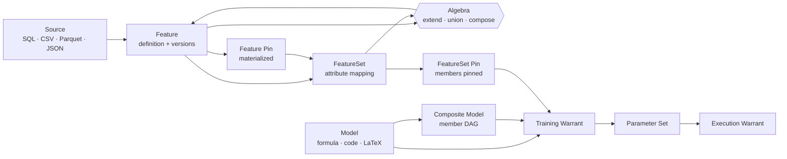
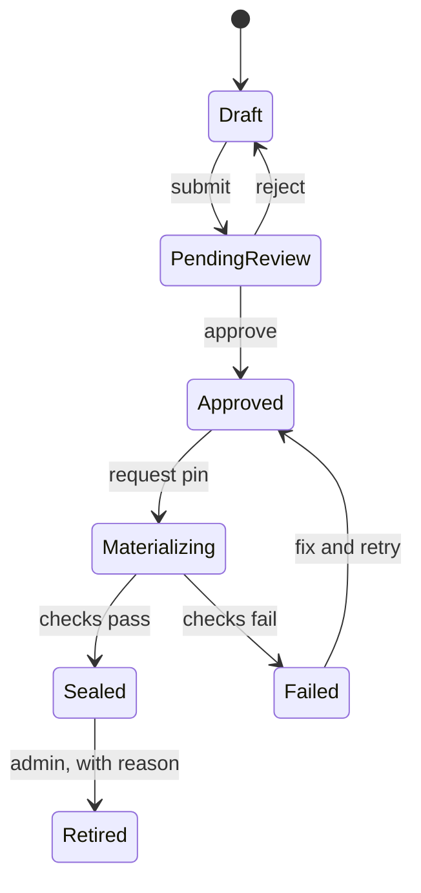
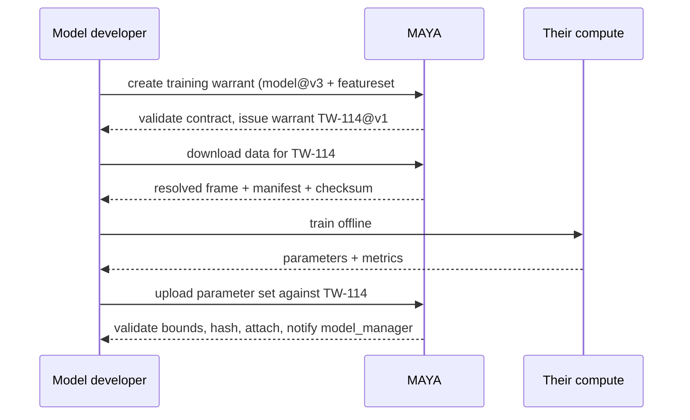
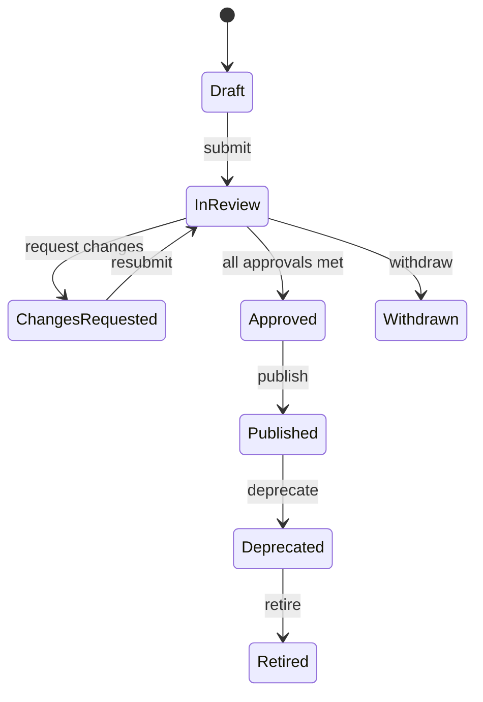
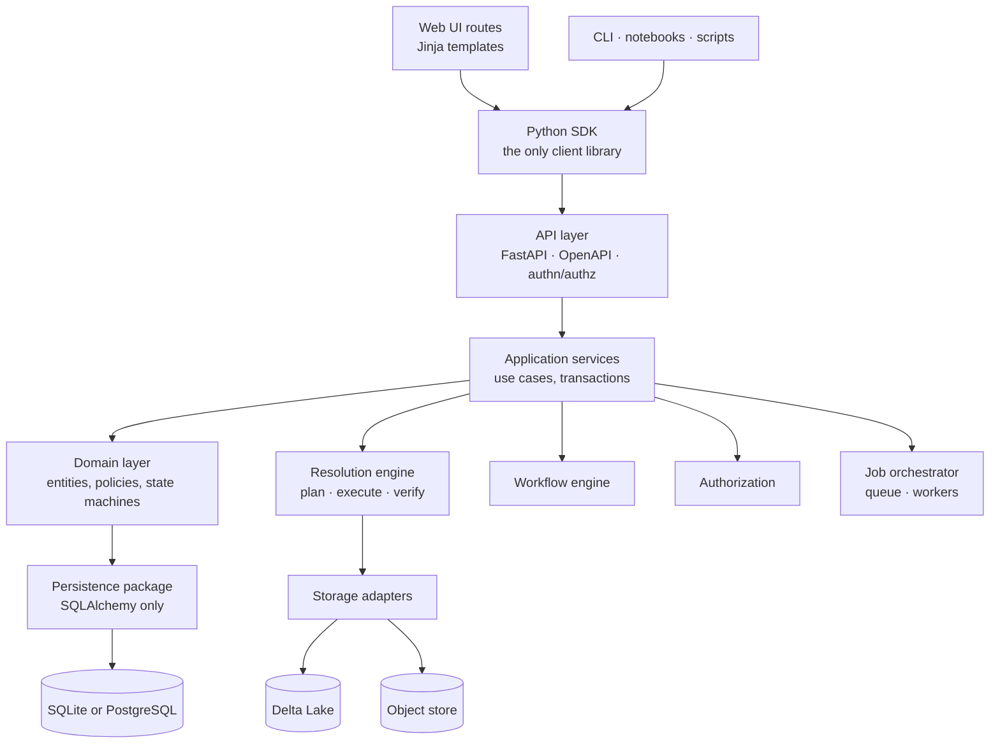

# MAYA — System Requirements & Design Specification

**Model & Feature Management Platform** · Version 2.0 (ground-up rebuild) · 2026-09-17 · Ash (Ashutosh Sinha)

> **Revision 2.5 — 2026-09-19.** Three corrections from building §25 and the last of the
> audit's gaps, each marked *Revision 2.5* where it lands. The break-glass path §13.3
> promises is now a named account rather than a restart in `mode: hybrid` (§12, §13.3).
> §25's claim that "untrusted plugins run under the same sandbox rules as user Python"
> cannot hold for code imported into the server process, so the safety rule is an
> allowlist and the difference between the two trust levels is stated (§25). And two rows
> of §25's table listed things MAYA does not ship — object stores other than the local
> filesystem, and ONNX and PMML runtimes against ADR-007 — which is what an extension
> point is for, so the rows now say so.
>
> **Revision 2.4 — 2026-09-19.** No new decisions: this revision marks, each as
> *Revision 2.4* where it lands, places where this document contradicted itself or a
> decision already taken, found by reading it against the code
> ([audit](audit/spec-audit-2026-09-19.md)). Schema changes are an estate export and
> reload, never a migration (§5.1, §20, §23, against §14.3); success criteria number
> eighteen, not ten (§26.1); OIDC logout runs both ways (§12); tables page on the server
> by table, not past a threshold (§16.7); break-glass sign-in during an IdP outage is
> `mode: hybrid` (§13.3); catalog search is MAYA's own index everywhere (§24.5, §25); and
> Revision 2.2's summary below called that index a scan. Two more, from closing those
> gaps: §10.2's example asked the model owner to approve while §11's matrix gave that role
> no approval capability, so a production namespace could approve no execution warrant at
> all — the matrix now grants it (§11, §3); and `namespace_read` behaved exactly like
> `public_read`, so §11.1 now says who a namespace's people are.
>
> **Revision 2.3 — 2026-09-19.** Three decisions from building and measuring version 0.2,
> each marked *Revision 2.3* where it lands: several web processes on one node require
> PostgreSQL, and MAYA refuses them over SQLite (§14.1); the estate export reads the
> database as it is, so the one upgrade path works across the schema change that needs
> it (§14.3); and SAML adds signed requests and single logout in both directions, an
> IdP's logout request accepted only when signed (§12). Two more, from version 0.3, are
> marked the same way: feature-set pin materialization is the namespace's
> `materialize_policy`, and a pin not written is sealed by hash and replayed (§6.6,
> §26.3); and a signed-in session's principal is reused for up to two seconds, so a
> session ended in another web process can outlive its end by that long (§12).
>
> **Revision 2.2 — 2026-09-19.** Three corrections from the first build, each marked
> *Revision 2.2* where it lands: the dark `--maya-crimson-deep` token (§16.6), which failed
> this document's own contrast gate; CodeMirror 5 in place of 6 (§17), which the
> no-build rule requires; and catalog search shipping as a scan before FTS (§13.4.2). *Revision 2.4:* not a
> scan — MAYA's own inverted index, maintained in the writing transaction (§13.4.2).
>
> **Revision 2.1 — 2026-09-17.** The eight open decisions of §26.3 are closed and that
> section now records them as taken. Six further calls are folded in throughout:
> **no database migrations** (§14.3), **`maya_delta`** as the lakehouse layer in place of
> a direct `delta-rs` dependency (§7.4, §13.1), **Windows, Linux and macOS as equal
> first-class platforms** (§24.5), **Bootstrap 5 and jQuery with a Harvard Crimson
> visual system** (§16.6), **a universal table contract** — every table paginated,
> searchable and sortable (§16.7) — and **workflow policy authored and managed in the
> UI** (§10.6). This Markdown is the authority; the `.docx` and `.pdf` beside it are
> renderings, rebuilt by `tools/docs/build_spec.py`.

## 1. Executive summary and vision

MAYA is the system of record for quantitative **features**, **feature sets**, **models** and the **warrants** that license a model to be trained or run. Definition, data, documentation, approval and evidence live in one place, so any number a model produced can be rebuilt exactly, years later, by someone who was not there.

Four failures MAYA is built to remove:

1. Feature logic lives in notebooks and SQL snippets, so two teams compute "adjusted close" differently and neither is wrong.
2. Training data is a file on a share drive. When results are challenged, nobody can produce the exact rows used.
3. A model's mathematics lives in a PDF, its code in a repo, its parameters in a spreadsheet, and the three drift apart.
4. Nothing binds *this model version* + *this data version* + *these parameters* into one auditable, transferable object.

The warrant is MAYA's distinguishing primitive. A **training warrant** freezes a model version against a feature set version and receives the parameters that training produced. An **execution warrant** packages a model, its parameters and its input contract into a license that can be handed to a downstream system or a regulator. Warrants make "who was allowed to run what, on which data, with whose approval" a query rather than an archaeology project.

| Capability | Feature store (Feast, Tecton) | Model registry (MLflow) | Model risk tool | MAYA |
| --- | --- | --- | --- | --- |
| Versioned feature definitions | yes | no | no | yes |
| Frozen, immutable data snapshots | partial (TTL) | no | no | yes, by pinning |
| Declarative missing-value resolution | no | no | no | yes, layered |
| Model mathematics as structured data | no | no | prose only | yes, formula IR |
| LaTeX spec document as a first-class artifact | no | no | attached file | yes, edited in place |
| Approval workflow with segregation of duties | no | no | yes | yes |
| Training/execution license object | no | no | no | yes, warrants |
| Per-object read vs read-write grants | no | partial | yes | yes |

Eight principles govern every design choice that follows:

1. **Definitions are code; data is a consequence.** MAYA stores how a number is produced, and materializes values only when asked to.
2. **Immutability is earned by pinning.** Anything pinned is frozen forever; nothing else claims to be reproducible.
3. **Everything meaningful is versioned and addressable.** Features, feature sets, models, parameters, warrants, schemas, resolution policies, LaTeX documents.
4. **Resolution is deterministic.** The same definition over the same inputs yields byte-identical output, or MAYA reports why it cannot.
5. **Authorization is on objects, not just menus.** A role opens a door; an ACL decides which rooms.
6. **One door to the database.** All persistence lives in a single package behind repositories; no ORM call escapes it.
7. **Small, replaceable parts.** No non-UI source file exceeds 1,500 non-comment lines, which forces composition over accretion.
8. **The platform never silently guesses.** Missing data, ambiguous joins and schema drift raise typed, explainable errors.

## 2. Scope, goals and non-goals

MAYA governs the definition, materialization, documentation and approval of features, feature sets and models, and the issuance of warrants. It does not train models and does not serve predictions.

**In scope**

- Feature and feature set definition, schema management, source binding, resolution policy, versioning, pinning and materialization to Delta Lake.
- Model definition: mathematical formula, Python artifact, parameter sets, LaTeX specification document, versioning.
- Warrant issuance, sealing, parameter upload and custody, execution manifests.
- Workflow, approvals, segregation of duties, per-object access control.
- Web UI, REST API, Python SDK, CLI.
- Lineage, audit, reproducibility evidence, export bundles.

**Out of scope for v2.0** (deliberate, each with a hook so it can be added later)

- Distributed training or a GPU scheduler. MAYA issues warrants; training runs on the user's own compute. An optional *in-platform runner* is a v2.2 extension point.
- Low-latency online serving. MAYA is a governance and batch-resolution plane; a serving cache is a v2.3 extension.
- Streaming ingestion. Sources are batch (SQL, CSV, Parquet, JSON) in v2.0; a `StreamSource` driver slots into the same source interface later.
- Automated feature discovery, AutoML, drift monitoring. MAYA emits the events a monitoring system needs but does not build one.

**Success criteria** — measurable, and each traceable to an acceptance test:

| # | Criterion | Target |
| --- | --- | --- |
| SC-1 | Byte-identical re-resolution of any pinned feature set | 100% of pins, verified by content hash |
| SC-2 | Time to reproduce a two-year-old training run from its warrant | under 10 minutes, no human archaeology |
| SC-3 | Concurrent interactive users on one node without p95 degradation | 200 |
| SC-4 | p95 page interaction latency, metadata screens | under 300 ms |
| SC-5 | p95 resolution of a 50-column, 10-year daily feature set | under 15 s warm, under 60 s cold |
| SC-6 | Non-UI source file size, excluding comments and blank lines | 100% under 1,500 lines |
| SC-7 | Unauthorized access attempts that succeed in the permission test suite | 0 |
| SC-8 | Audit completeness: state changes with an immutable, attributable record | 100% |
| SC-9 | Time for a new model designer to publish a first model, unaided | under 60 minutes |
| SC-10 | Database portability: full test suite green on SQLite and PostgreSQL | both |
| SC-11 | Point-in-time reconstruction: a feature resolved as of a past knowledge instant, after a restatement | exact, with the pre-restatement values |
| SC-12 | Marginal storage of a monthly pin whose history did not change | the delta only, under 5% of full pin size |
| SC-13 | UI actions reachable through the public SDK, and SDK methods backed by a public endpoint | 100% both ways, checked in CI |
| SC-14 | Platform parity: the full suite green on Windows, Linux and macOS | all three |
| SC-15 | Drift between the two shipped schema files and the SQLAlchemy metadata they are generated from | zero, regenerated and diffed in CI |
| SC-16 | `maya_delta` backend equivalence: the same operation on the native and fallback backends | byte-identical results, and each backend reads the other's tables |
| SC-17 | Tables in the UI that are paginated, searchable and sortable | 100%, enforced by a template crawler |
| SC-18 | Dependency seams (§13.4): Type A suites run on both backends, Type B output compared across accelerators | 100% of seams exercised both ways; Type B byte-identical on every platform |

## 3. Personas and roles

MAYA ships eight roles, stored in the database, assignable many-to-many to a user, and extensible: an administrator can define a custom role as a named set of permissions. Roles grant *capabilities*; access to a specific object is decided separately by its ACL (section 11).

| Role | Owns | Typical day |
| --- | --- | --- |
| `admin` | Users, roles, SSO config, system settings, storage backends, workflow policy | Onboards a team, rotates a credential, adjusts an approval policy |
| `feature_designer` | Feature definitions, schemas, resolution rules, sources | Defines `daily_data_yhoo`, sets forward-fill on volume, submits for review |
| `feature_manager` | Approval of features and feature sets, pin authorization | Reviews a schema change, approves a pin for a quarter-end snapshot |
| `model_designer` | Model definitions, formula, Python artifact, LaTeX specification | Writes the model math, uploads `score.py`, drafts the spec document |
| `model_developer` | Training warrants, parameter upload, experiment iteration | Draws a warrant, trains offline, uploads parameters with metrics |
| `model_manager` | Approval of models, warrants and parameter sets | Challenges a parameter set, approves promotion to `approved` |
| `model_owner` | Access policy for a model and its lineage; accountable for its use | Grants read-write to a desk, restricts a model to three users |
| `techops` | Runtime health, job queues, retries, storage compaction, backups | Drains a worker, replays a failed materialization, runs a restore drill |

**Capability matrix.** C = create, R = read, U = update, A = approve, P = pin/seal, G = grant access. A blank cell means no capability from the role; object ACLs can still grant read.

| Capability | admin | feat des | feat mgr | mdl des | mdl dev | mdl mgr | mdl owner | techops |
| --- | --- | --- | --- | --- | --- | --- | --- | --- |
| Feature definition | CRUG | CRU | RA | R | R | R | R | R |
| Feature pin | P | request | AP | | request | | | R |
| Feature set | CRUG | CRU | RAP | R | CRU | R | R | R |
| Model definition | CRUG | | R | CRU | R | RA | RG | R |
| Python artifact | CRU | | R | CRU | RU | RA | R | R |
| LaTeX spec | CRU | | R | CRU | RU | RA | R | R |
| Training warrant | CRUG | | R | R | CRU | RAP | RG | R |
| Parameter set | CRU | | | R | CRU | RA | R | R |
| Execution warrant | CRUG | | | R | R | CRUAP | RG | R |
| Users and roles | CRUG | | | | | | | R |
| Jobs and queues | CRU | R own | R own | R own | R own | R own | R own | CRU |

Two rules bind the matrix. **Segregation of duties**: the identity that creates or last modified an object cannot be the identity that approves it, unless an administrator has enabled `workflow.allow_self_approval` for a non-production environment. **Ownership follows creation**: the creator of a model becomes its first `model_owner` unless an administrator reassigns it, and every object has exactly one accountable owner at all times.

## 4. Domain model and ubiquitous language

Every MAYA object is one of three kinds, and this distinction removes most of the ambiguity in the original notes.

- **Definition** — a named, mutable-in-draft description of how something is produced. Has a lineage of versions.
- **Version** — an immutable snapshot of a definition, minted when the definition changes in a semantically meaningful way. Identified by a content hash.
- **Pin** — an immutable *materialization* of a version: values computed, written to Delta Lake, sealed, never recomputed. A pin carries a name and an as-of date.

A version freezes *how*; a pin freezes *what*. A feature version can be resolved a hundred times and return different values as its source moves. A feature pin returns the same bytes forever.



The flow reads left to right: sources feed features, features compose into feature sets, a pinned feature set plus a model version yields a training warrant, training yields parameters, and parameters plus a model yield an execution warrant. The loop back through Algebra is deliberate — features and feature sets are closed under their operators, so a derived object is an ordinary object and re-enters the same flow (sections 5.8 and 6.8). A composite model is likewise an ordinary model and takes one warrant over one feature set (sections 8.7 and 9.5).

**Identity and naming.** Every object has a stable UUID, a human name unique within its namespace, and a fully qualified reference used in APIs, SDK and lineage: `maya://feature/adj_close_yhoo@v3`, `maya://feature/adj_close_yhoo#eom_2026_03`, `maya://featureset/equity_panel@v7`, `maya://model/black_scholes@v2`, `maya://warrant/train/bs_calibration@v1`. `@` addresses a version, `#` addresses a pin. A bare name resolves to the latest approved version, and MAYA logs that resolution so "latest" never hides in an audit trail.

**Namespaces.** Objects live in a namespace (`equity.pricing`, `credit.pd`), which is the unit of bulk permission, quota and export. Namespaces nest one level and are created by administrators.

**Version semantics.** A new version is minted when the resolved *definition hash* changes: schema, source binding, transformation, or resolution policy. Cosmetic edits — description, tags, owner — do not mint a version. MAYA classifies each version bump as `breaking` (schema or type change), `behavioral` (resolution or filter change) or `additive` (new optional column), and surfaces the classification on every dependent object so a feature set owner sees exactly what a member change will do to them.

**Core entities.** `User`, `Role`, `Grant`, `Namespace`, `Feature`, `FeatureVersion`, `FeaturePin`, `Schema`, `SourceBinding`, `ResolutionPolicy`, `FeatureSet`, `FeatureSetVersion`, `FeatureSetPin`, `AttributeMapping`, `JoinSpec`, `Model`, `ModelVersion`, `FormulaSpec`, `CodeArtifact`, `SpecDocument`, `ParameterSet`, `TrainingWarrant`, `ExecutionWarrant`, `WorkflowInstance`, `Approval`, `Job`, `AuditEvent`, `LineageEdge`, `Derivation` (an algebra operation with its ordered operands), `InheritanceLink` (parent reference plus override diff), `CompositeMember`.

## 5. Feature subsystem

A feature is a named, schema-bearing dataset produced from exactly one source, indexed by a declared key, and governed by a resolution policy. `adj_close_yhoo` is a one-column feature keyed by `(date, symbol)`; `daily_data_yhoo` is a four-column feature over the same key.

### 5.1 Anatomy

A feature version is the tuple: **identity** (name, namespace, owner, tags, description) + **schema** + **index** + **source binding** + **resolution policy** + **transformation** + **quality contract**.

**Time axes.** Every feature is **bitemporal**. Each row carries an *event time* — the date the value is about, and part of the index — and a *knowledge time*, the instant MAYA could first have known it, taken from the source watermark, the vendor publication stamp or the upload. Every resolution declares an `as_of_known` instant alongside its event-time range, and a vendor restatement is a new knowledge-time row rather than an overwrite, so "what did we know on 31 March" stays answerable and a backtest cannot silently consume restated values. This is not optional and not a later addition: the two columns, the second index dimension and the hash that covers them exist from the first schema (*Revision 2.4:* there are no migrations, §14.3), because retrofitting them would rewrite every table, every pin and every content hash in the system. Semantics, the leakage certificate and the storage cost are in §29.1.

**Schema.** An ordered list of attributes, each with a name, a logical type, nullability, unit, and an optional semantic tag (`price`, `rate`, `count`, `categorical`). Logical types are MAYA's own, mapped to Arrow and Delta on write: `int32/64`, `float32/64`, `decimal(p,s)`, `bool`, `string`, `date`, `timestamp[tz]`, `duration`, `list<T>`, `map<K,V>`, `struct<...>`, `fixed_vector<T,n>`, `tensor<T,shape>`. `decimal` is mandatory for monetary attributes; MAYA warns when a `float` carries the `price` tag.

**Index.** Every feature declares an index — the columns that identify a row. Typical: `(date)` for a pure time series, `(date, symbol)` for a panel, `()` for a scalar table. The index drives alignment in feature sets, so it is required and immutable within a version lineage; changing it is a `breaking` bump.

**Orientation.** A feature is a **vector** (one value attribute over the index), a **matrix** (several value attributes), or a **tensor** (value attributes of type `tensor<T,shape>`). MAYA derives orientation from the schema rather than asking the user to declare it.

### 5.2 Sources

| Source type | Configuration | Notes |
| --- | --- | --- |
| `sql` | Named connection + query + parameter bindings | Connections are admin-managed; credentials never in the query. Parameters are typed and bound, never string-interpolated |
| `csv` | Uploaded file + dialect + header + type overrides | Inferred schema is a proposal the designer confirms |
| `parquet` | Uploaded file or object-store path | Schema read from footer; mapped to MAYA logical types |
| `json` | Uploaded file + record path + flattening policy | Supports newline-delimited and nested arrays |
| `delta` | Existing Delta table + optional version | Reads another team's table without copying |
| `derived` | An expression over other feature versions | Lets `log_return` be defined from `adj_close` and stay in lineage |
| `python` | A registered, sandboxed transform function | Escape hatch; requires `model_designer` or `feature_designer` plus approval |

Uploads are content-addressed: the same bytes uploaded twice produce one stored blob and a warning that the file already exists as feature *X*. Every source binding records a **freshness contract** (`expected_lag`, `schedule`) so MAYA can flag a stale feature before someone pins it by mistake.

### 5.3 Resolution policy

Resolution answers two questions: what does the output index look like, and how are gaps filled. A policy has a **grid** and a set of **rules**.

- **Grid**: `as_is` (the source's own rows), `calendar` (a named calendar: `NYSE`, `TARGET`, `ISO_business_days`, `natural_days`), or `union`/`intersection` of member grids when used inside a feature set.
- **Rules**, applied per attribute, in a deterministic order: `none` (leave null), `forward_fill`, `backward_fill`, `linear_interp`, `spline_interp`, `constant(v)`, `mean_of_window(n)`, `last_known_as_of(lag)`, `zero`, `previous_period`, `custom(fn)`.

Each rule is bounded and audited. `forward_fill` takes a `limit` (maximum consecutive filled periods) and a `max_age`; beyond either, the value stays null rather than quietly propagating a year-old price. Every resolution run emits a **fill report**: rows produced, rows filled per rule, longest fill run, first and last gap. The fill report is stored with a pin and shown before a user confirms one.

Look-ahead safety matters for anything used in training. `linear_interp` and `backward_fill` consume future information; MAYA marks them `non_causal` and refuses to apply them inside a feature set used by a training warrant unless the model designer has explicitly set `allow_non_causal: true` with a written justification, which then appears on the warrant.

### 5.4 Transformations

A feature may declare an ordered pipeline of typed steps between source and output: `rename`, `cast`, `filter`, `derive(expr)`, `aggregate(by, agg)`, `pivot`, `unpivot`, `window(fn, size)`, `lag(n)`, `resample(freq, agg)`, `dedupe(keep)`, `clip`, `winsorize(p)`. Steps are expressed in a restricted, side-effect-free expression language that compiles to Arrow compute kernels, so MAYA can show the plan, hash it, and run it identically on every backend.

### 5.5 Quality contract

Optional but strongly encouraged per attribute: `not_null`, `unique_on_index`, `range(min,max)`, `allowed_values`, `monotonic`, `max_daily_change`, `row_count_between`, `freshness_within`. Checks run on every resolution and always on pin. A failing check blocks a pin, blocks promotion through workflow, and raises an alert to the owner; it never silently passes.

### 5.6 Versioning and pinning

A draft feature is editable by its designer. On submit, MAYA computes the definition hash and mints a version; the version moves through workflow (section 10) to `approved`.

**Pinning** materializes a version. The user supplies a pin name and an as-of date; the uniqueness key is `(feature_name, pin_name, as_of_date)`, exactly as in the original notes. On pin MAYA: resolves the version, runs quality checks, writes the result to Delta Lake, computes a content hash over the sorted, canonicalized data, records the fill report, the source watermark and the as-of-known instant, and seals the record. A sealed pin cannot be modified, re-resolved or deleted; it can only be **retired** (hidden from pickers, still resolvable for audit) by an administrator, with a reason.

**Pin lifecycle in one picture:**



### 5.7 What a user can do

Upload a file and have MAYA propose a schema. Change a declared data type, with a preview of how many rows would fail the cast before committing. Edit the resolution policy and see the fill report change live on a sample. Compare two versions attribute by attribute. Download a feature version (resolved now) or a pin (exactly as sealed) as CSV, Parquet, Arrow IPC or JSON, with a manifest naming the version, hash and time of export. Clone a feature into a new draft. Subscribe to a feature and be notified when a new version is approved or a dependent pin is created.

### 5.8 Feature algebra

Features are **closed under a set of operators**: every operator takes features and produces a *feature definition*, not a one-off result. The product is itself named, versioned, pinnable, permissioned and visible in lineage. Building a feature out of other features is a first-class act, not a copy-paste.

| Operator | Notation | Produces | Rule |
| --- | --- | --- | --- |
| Project | `π[attrs](F)` | Feature with a subset of attributes | Index must be retained |
| Rename | `ρ[a→b](F)` | Same data, renamed attributes | Pure metadata |
| Transform | `τ[pipeline](F)` | Derived feature | The section 5.4 pipeline, applied to a feature rather than a source |
| Union | `F₁ ∪ F₂` | Rows of both | Schemas must unify; index collisions resolved by a declared policy |
| Intersect | `F₁ ∩ F₂` | Rows whose index appears in both | Values taken from the priority side |
| Difference | `F₁ ∖ F₂` | Rows of `F₁` absent from `F₂` | Index-only comparison |
| Compose | `F₁ ⋈ F₂` | Attributes of both, aligned on the index | Widening; produces a matrix feature |
| Coalesce | `⊕(F₁, F₂, …)` | First non-null value across ordered inputs | The vendor-fallback operator: Bloomberg, else Yahoo |
| Aggregate | `γ[by, agg](F)` | Coarser index | Declares the aggregation per attribute |
| Reshape | `pivot`, `unpivot`, `resample`, `lag` | New index or orientation | Index change is a `breaking` class |
| Case | `σ[cond](F₁, F₂)` | Row-wise selection between inputs | Condition is an expression over the index or attributes |

**Typing rules.** Every operator is type-checked at definition time, not at run time. Indexes must be compatible (identical columns and types, or a declared broadcast). Attribute unification requires identical logical types or an explicit cast; conflicting units or semantic tags are an error, not a warning. Non-causality propagates: a feature built from a non-causal input is itself non-causal and carries the flag into every warrant that touches it.

**Inheritance.** A feature may `extend` exactly one parent. The child inherits schema, index, source binding, transformation pipeline, resolution policy and quality contract, then overrides named parts:

```
feature adj_close_yhoo_eur extends adj_close_yhoo@v3:
  override source.filter: currency == 'EUR'
  override resolution.adjusted_close: forward_fill(limit=2)
  add     attribute: fx_rate -> feature/eurusd@v1 . rate
```

The override is stored as a **diff, not a copy**, which is the whole point: a fix to the parent's source flows to every child. Parent binding is declared: `pinned` (frozen at `@v3`, immune to parent change) or `tracking` (latest approved parent, with the child marked for re-approval whenever the parent takes a `breaking` or `behavioral` bump). Multiple inheritance is deliberately not supported — the diamond problem has no good answer in a governed system. Combining several parents is composition (`⋈`, `∪`, `⊕`), which is explicit about precedence.

**Laws and optimization.** Union is associative and commutative up to the declared collision policy; `τ` distributes over `∪` when the pipeline is elementwise; projection and filters push down through `∪`, `⋈` and `τ`. The resolution planner uses these to fuse steps and prune reads, and states the rewrite in the plan so a user can see why their five-operator feature ran as two scans. Because definition hashes are canonical, two algebraically identical definitions hash the same and MAYA flags the duplicate at creation rather than letting the catalog fill with near-copies.

**Materialization.** A derived feature is pinned like any other; its pin records the exact parent versions or pins consumed, so the pin is self-contained evidence. Two modes are supported: `virtual` (resolve on demand by replaying the algebra) and `materialized` (pinned to Delta). Cycles are rejected at definition time; derivation depth is capped (default 16, configurable); and the cost estimate rolls up through the tree so a user sees what a deep chain will cost before running it.

## 6. FeatureSet subsystem

A feature set is a **view**: a named list of attributes, each mapped to one attribute of one member feature version or pin, assembled on a declared index grid by a declared alignment rule. It stores no data of its own.

### 6.1 Attribute mapping

Each feature set attribute declares: its own name (free, need not match the source), the member reference (`maya://feature/adj_close_yhoo@v3` or a pin), the source attribute, an optional cast, an optional per-attribute resolution override, and an optional per-attribute filter. This is what lets `px` in a feature set point at `adjusted_close` in `daily_data_yhoo`.

```
featureset equity_panel:
  index: (date, symbol)
  grid: calendar NYSE, intersection of members
  attributes:
    px      -> feature/daily_data_yhoo@v4 . adjusted_close   [ffill limit 3]
    vol     -> feature/daily_data_yhoo@v4 . daily_volume     [zero]
    beta    -> feature/factor_betas#eom_2026_03 . beta_mkt    [as_is]
    surface -> feature/vol_surface@v2 . grid                 [tensor<float64,[8,12]>]
```

### 6.2 Alignment algebra

Members rarely share an index exactly. MAYA supports four alignment modes, declared once per feature set and overridable per member:

| Mode | Meaning | Use |
| --- | --- | --- |
| `inner` | Keep index values present in all members | Strict training panels |
| `outer` | Union of index values, gaps left to resolution rules | Exploratory sets |
| `left(member)` | Drive the grid from one member | A target series drives the panel |
| `asof(tolerance, direction)` | Match nearest prior (or next) key within a tolerance | Intraday marks against daily fundamentals |

Where a member's index is a subset of the set's index (a per-symbol static attribute joined onto a date panel), MAYA performs a **broadcast** join and states so in the plan. Where a member's index has columns the set does not, the mapping must declare an aggregation or the definition is rejected — MAYA never silently picks a row.

### 6.3 Filters

A feature set can filter globally (date range, symbol universe, a boolean expression over its own attributes) or per member. Filters are declarative and compiled into the read plan, so a date-range filter becomes Delta partition pruning rather than a post-hoc pandas slice. Universe filters may reference another feature — "symbols where `in_sp500` is true as of the row date" — which keeps survivorship bias out of the panel by construction.

### 6.4 Policy precedence

The original notes ask for global, selective and per-member resolution. The rule is a strict, documented precedence, shown in the UI for every attribute so nobody has to guess:

1. Attribute-level override in the feature set (highest).
2. Member-group override ("these five attributes use forward fill").
3. Feature set global policy.
4. The member feature's own policy.
5. System default: leave null (lowest).

The resolved policy for each attribute, and which layer won, is recorded in the resolution manifest.

### 6.5 Shape

A feature set resolves to a tensor. In practice it is a matrix — rows on the index, columns the attributes — and a single-attribute set is a vector. When any attribute is itself `list`, `fixed_vector` or `tensor`, the result is ragged or higher-rank; MAYA exposes three materialization shapes on read: `tabular` (nested columns preserved), `wide` (nested values exploded to suffixed columns, e.g. `surface_0_0 … surface_7_11`), and `tensor` (a dense `numpy`/Arrow tensor with an accompanying axis manifest). The requested shape is part of the download and part of the warrant, so training always receives what it was promised.

### 6.6 Pinning a feature set

As the notes require: **a feature set will refuse to pin unless every member is pinned.** MAYA makes that easy rather than annoying. When a user pins a feature set whose members are unpinned versions, the UI offers **cascade pin**: create a pin of each member under a shared pin name and as-of date, in one transaction, with one approval, then pin the set. If any member pin fails a quality check the whole cascade rolls back.

A feature set pin stores the list of member pin references, the fully resolved policy and filter set, the resolution manifest, a content hash of the resolved output and, by default, the resolved output itself in Delta Lake as a convenience materialization. That last point is a deliberate change from the notes: storing the resolved frame costs disk but removes join-time ambiguity forever, and it is the difference between "we can probably reproduce it" and "here are the bytes". It is configurable per namespace (`featureset.pin.materialize: always | on_demand | never`); when `never`, resolution replays deterministically from member pins. *Revision 2.3:* the setting is the namespace's `materialize_policy`, not a configuration key. Under `on_demand` and `never` the pin is sealed by the content hash of its resolved output with nothing written; a read replays it from the member pins and serves it only if the replay reproduces that hash (`on_demand` then writes it). Integrity verification replays such pins the same way.

Resolution of an unpinned feature set uses pinned members where the mapping names them and live versions otherwise, exactly as the notes specify.

### 6.7 Composition and reuse

A feature set may include another feature set as a member (one level of nesting, cycles rejected at definition time), so a firm-wide "market panel" can be extended by a desk without copy-paste. A feature set can be **forked** into a draft, **diffed** against another version attribute by attribute, and carries a **cost estimate** (rows, bytes, estimated resolution seconds) computed before a user clicks resolve.

### 6.8 FeatureSet algebra

Feature sets are closed under the same operator family, applied to sets of attributes rather than to single features. Every operator yields a new feature set definition, versionable and pinnable in its own right.

| Operator | Meaning | Index behaviour |
| --- | --- | --- |
| `extend(S)` | Inherit S, then add, remove or override attributes and policy | Inherited unless overridden |
| `project(S, attrs)` | Keep a subset of attributes | Unchanged |
| `S₁ ∪ S₂` | Row-wise append (more history, more symbols) | Index union; schemas must unify |
| `S₁ ∩ S₂` | Rows whose index appears in both | Index intersection |
| `S₁ ∖ S₂` | Rows of S₁ not in S₂ | Anti-join on index |
| `S₁ ⋈ S₂` | Column-wise merge under the section 6.2 alignment modes | Per the declared mode |
| `override(S, policy)` | Same attributes, different resolution, filter or grid | Unchanged |
| `pivot / unpivot(S)` | Long ↔ wide across an index column | Index changes; `breaking` |
| `sample(S, spec)` | Deterministic subset — by date range, universe, or seeded fraction | Subset of the index |

*Revision 2.4:* every operator above is built. A set that is an operation over other sets
carries a `derivation` block — `{operator, operands, options}` — instead of `members`, and
resolves by resolving its operands and applying the operator; `union`, `intersect`,
`difference`, `join` (§6.2's alignment modes), `project`, `pivot`, `unpivot` and `sample`
are the feature algebra's own executors, so a set operation and the equivalent feature
operation cannot drift apart. `override` re-resolves one operand under a replaced policy,
filter, grid or alignment. `sample` is deterministic: a date range, a universe, or a
seeded fraction chosen by hashing each row's index, so the same spec keeps the same rows
on any machine. A derived set pins only over operands that are themselves pinned, and
refuses by name otherwise — there is no cascade, because pinning somebody else's feature
set is their decision.

**Inheritance and override.** `extend` is the workhorse. A firm-wide `market_panel` is inherited by a desk, which overrides two resolution rules, drops an attribute it cannot see, and adds three of its own. The child stores only the diff, so a correction to the parent reaches every desk. Parent binding is `pinned` or `tracking`, exactly as for features.

Inherited policy inserts one layer into the precedence stack of section 6.4, between the set's own global policy and the member feature's policy:

1. Attribute-level override in this feature set.
2. Member-group override in this feature set.
3. This feature set's global policy.
4. **Inherited policy from the parent feature set chain, nearest ancestor first.**
5. The member feature's own policy.
6. System default: leave null.

The UI shows, for every attribute, which layer won and which ancestor supplied it.

**Constraints.** Cycles are rejected. Derivation depth is capped (default 8 for sets, since each level multiplies the member fan-out). An operand's access restrictions propagate: a set derived from one the user cannot fully read is created, but resolves with the withheld attributes named and null, never silently dropped. Pinning follows the section 6.6 rule transitively — pinning a derived set requires every leaf feature in the whole algebra tree to be pinned, and cascade pin walks the tree.

**Equivalence.** `project(extend(S, …), attrs)` and the directly-written equivalent hash identically, so MAYA recognises when a desk has reinvented a set that already exists and offers the existing one. Over a large catalog this is the difference between reuse and sprawl.

## 7. Physical storage and the array serialization contract

MAYA uses three stores, each with one job: a **relational database** for metadata, workflow and ACLs; a **Delta Lake** for materialized feature data; an **object store** for blobs (uploads, PDFs, code artifacts, parameter files, export bundles). Nothing that must be queried transactionally lives in Delta; nothing large lives in the database.

### 7.1 Delta layout

One Delta table per feature, not per pin. Pins are partitions, which keeps the table count manageable and lets Delta's own file skipping do the work.

```
<root>/features/<namespace>/<feature_name>/
    _delta_log/
    pin_id=<uuid>/as_of=<yyyy-mm-dd>/part-*.parquet
```

Partition columns are `pin_id` and `as_of`. Within a partition, files are sorted by the feature's index columns and Z-ordered on the first two index columns, so a date-range read of one symbol touches a handful of files. Target file size is 128 MB; MAYA compacts on a schedule and after every pin.

**A pin is a manifest, not a copy.** Within a partition, data is written as **content-addressed fragments**: a fragment is a run of rows identified by the hash of its canonical Arrow bytes, and a pin stores the ordered list of fragment hashes it is made of. Pinning writes only fragments the store has never seen, so a month-end pin of a feature whose history did not move costs its delta rather than its full size, and a cascade pin across forty members stops duplicating terabytes. Like bitemporality, this is a Phase 1 commitment rather than an optimization to add later: pins written as opaque copies cannot be de-duplicated afterwards without rewriting sealed data, which sealing forbids. Fragment boundaries, the fragment index and provably safe garbage collection are in §29.3.

Feature set pins, when materialized, follow the same layout under `/featuresets/`. Delta time travel is used for operational recovery only — MAYA's own pin identity never depends on a Delta version number, because a table rewrite would then change meaning.

### 7.2 The array problem

This is the subtle part the notes call out. A feature can hold list, vector, matrix or tensor values; a feature set that merely *references* those values must return them intact, including through joins, exports and round-trips to CSV. Three rules solve it.

**Rule 1: store natively in Arrow, never as a string.** A `list<float64>` is written as a Parquet/Arrow `LIST`, a `fixed_vector<float64,8>` as `FIXED_SIZE_LIST`, a `tensor<float64,[8,12]>` as a `FIXED_SIZE_LIST` of length 96 plus schema metadata carrying the shape, row-major order and dtype. Nesting survives, predicates still push down, and no parser has to guess whether `"[1,2,3]"` was text or an array. A ragged `list` carries its own offsets; no padding, no sentinel values.

**Rule 2: every nested attribute carries an axis manifest.** Stored in Delta schema metadata and mirrored in the metadata database: `{dtype, shape, order: "row_major", axis_names: ["strike","tenor"], axis_values: {...}, null_policy}`. Without the manifest, a 96-float array is meaningless; with it, MAYA can render it as a labelled grid in the UI and hand `numpy` a correctly shaped array.

**Rule 3: serialization on export is explicit, lossless and declared.** The export format is part of the request and recorded in the manifest, so a downstream reader never has to infer.

| Export format | Nested value encoding | Round-trips |
| --- | --- | --- |
| Arrow IPC / Feather | Native nested types + metadata | Lossless, preferred |
| Parquet | Native nested types + metadata | Lossless |
| JSON / NDJSON | Native JSON arrays, shape in a sidecar header | Lossless |
| CSV, `wide` shape | Exploded to suffixed columns with an axis header row | Lossless with the header |
| CSV, `packed` shape | One column, base64 of little-endian binary + dtype/shape in the manifest | Lossless, not human-readable |
| CSV, `json` shape | One column of JSON text, quoted per RFC 4180 | Lossless, readable, slow |

CSV never gets an undeclared array. A user who picks CSV for a feature with tensor attributes is asked which of the three encodings they want, with the trade-off shown, and the choice is written into the export manifest and the warrant.

**Rule 4: hashing is canonical.** The content hash of a pin is computed over the canonical Arrow representation — schema sorted by name, rows sorted by index, floats in IEEE-754 binary, nested values in declared order — not over file bytes. Two pins with the same data hash the same even if written by different engine versions, which is what makes reproducibility verifiable rather than hopeful.

### 7.3 Sizing and retention

A pin's storage footprint is estimated before it is created and charged against a namespace quota. Retention policy is per namespace: pins are never auto-deleted, but cold pins move to an infrequent-access tier after a configurable age, and retired pins can be archived to a compressed bundle with their manifest. An administrator can run **integrity verification** on demand: re-read every pin, recompute its hash, and report drift. Drift is a serious incident and raises a system alert.

### 7.4 `maya_delta` — the lakehouse layer

MAYA does not depend directly on a Delta implementation. It depends on **`maya_delta`**,
a package of MAYA's own that presents one API over two interchangeable backends.

| Backend | Selected when | What it is |
| --- | --- | --- |
| `native` | the `deltalake` wheel imports and passes the self-check | The Rust `delta-rs` bindings. Fast, battle-tested, and the default wherever a wheel exists |
| `pure` | the native import fails, the self-check fails, or configuration pins it | MAYA's own pure-Python implementation of the Delta transaction-log protocol over Arrow and Parquet |

The backend is chosen once at startup, is **named on the health page and in every pin's
provenance record**, and can be pinned by configuration — because "it worked on my
machine" is usually a backend difference nobody logged. Selection is never silent.

**Why a fallback exists at all.** MAYA is specified to run on Windows, Linux and macOS
(§24.5) and in air-gapped sites that install from a local mirror. A native wheel is a
dependency on someone else's build matrix: a new Python, an unusual architecture, a
locked-down site with no compiler, and the platform that was supposed to be portable is
not. The pure backend costs throughput and costs nothing else — it is the difference
between MAYA being slower somewhere and MAYA being unavailable there.

**What the pure backend implements.** A declared subset of the Delta protocol, stated
rather than implied: the `metaData`, `protocol`, `add`, `remove` and `commitInfo`
actions; Parquet checkpoints; optimistic concurrency by exclusive create
(`O_CREAT|O_EXCL`) of the next log entry, which is atomic on NTFS, ext4 and APFS alike
and needs no lock daemon; partition pruning; per-file min/max statistics for file
skipping; a space-filling-curve sort on write where §7.1 asks for Z-ordering; and time
travel by version. It does **not** implement deletion vectors, column mapping, change
data feed or liquid clustering, and it **refuses loudly** on a table that requires a
reader or writer feature it does not have rather than approximating one. The refusal
names the feature.

**How the two are kept honest.** One conformance suite, run twice — once per backend —
asserting identical results, plus a cross-backend round trip in both directions: a table
written by `native` is read by `pure` and vice versa, with the bytes compared. This is
the only thing that makes the fallback trustworthy, and it is why the suite is a release
gate rather than a nice-to-have. Protocol version numbers are read from the log and
asserted as ranges, never as literals; a test that hard-codes a specific version number
passes for the wrong reason the moment the writer is upgraded.

`maya_delta` ships as its own top-level package with no MAYA domain knowledge in it, so
it is independently testable and swappable behind the `LakeStore` port of §25.

It is also the first instance of a general policy rather than a special case: **§13.4**
states the rule for every dependency seam in MAYA, classifies each one by which side is
authoritative, and lists what is deliberately *not* proxied. `maya_delta` is a Type A
seam — native preferred, pure fallback — and, because its output feeds a content hash, it
carries the byte-comparison obligation that §13.4.1 puts on anything near the hash path.

## 8. Model subsystem

A model is a compute kernel `Y = f(a, b, c; θ)` with four faces, versioned together: its **mathematics**, its **code**, its **parameters**, and its **specification document**. A model version is the tuple of all four plus its input contract.

### 8.1 How the mathematics is stored

The notes ask whether JSON is the right container. The answer is: JSON is the right *envelope*, but not as free text. MAYA stores a **formula IR** — an expression tree with typed nodes — and generates every other representation from it.

```json
{
  "outputs": [{"name": "price", "type": "float64", "unit": "USD"}],
  "inputs": [
    {"name": "S", "type": "float64", "role": "feature", "desc": "spot"},
    {"name": "K", "type": "float64", "role": "feature"},
    {"name": "sigma", "type": "float64", "role": "parameter", "bounds": [0, 5]}
  ],
  "body": {"op": "mul", "args": [
      {"ref": "S"},
      {"op": "ncdf", "args": [{"ref": "d1"}]}
  ]},
  "lets": {"d1": {"op": "div", "args": [...]}},
  "latex": "C = S\\,N(d_1) - K e^{-rT} N(d_2)"
}
```

This buys four things a LaTeX string alone cannot: MAYA type-checks inputs against the feature set bound to a warrant; it renders LaTeX for the spec document automatically; it can emit reference Python for validation; and it can **diff two model versions mathematically**, telling a reviewer "the discount factor changed from continuous to simple compounding" instead of showing a text diff.

Three authoring paths write the same IR: a LaTeX-like expression box with live rendering, a visual node editor for non-programmers, and direct upload of the JSON via API. For models whose mathematics genuinely cannot be expressed as a closed form — a gradient-boosted tree, a neural network — the IR degrades gracefully to a **declared black-box node** carrying the architecture description, hyperparameters and a mandatory prose statement of what the model estimates. MAYA records that the model is opaque rather than pretending otherwise, and model risk reporting uses that flag.

### 8.2 Input contract

Every model version declares its inputs as a typed contract: required attributes, their logical types, units, index requirements, and whether each is a feature, a parameter, or a runtime constant. MAYA validates a feature set against the contract *before* a warrant can be drawn, so a shape mismatch is caught at warrant time rather than at 3 a.m. in a training script.

### 8.3 Code artifact

A model may carry Python. The artifact is a file or a small package with a declared entry point conforming to one of MAYA's interfaces:

```python
class MayaModel(Protocol):
    def fit(self, X: pa.Table, y: pa.Array | None, ctx: FitContext) -> Parameters: ...
    def predict(self, X: pa.Table, params: Parameters, ctx: RunContext) -> pa.Array: ...
```

On upload MAYA runs static validation — syntax, entry point present, signature match, import allowlist, no filesystem or network calls outside the provided context, size and complexity limits — and a smoke execution in a sandbox against a small sample from the declared feature set. A failing artifact cannot be submitted for approval. The artifact is content-hashed, stored immutably, and its hash appears in every warrant that uses it.

### 8.4 Parameters

Parameters are a first-class versioned object, not a file attachment. A `ParameterSet` has a schema (names, types, shapes, bounds), values, the training warrant that produced it, the metrics reported at training time, the author, and a status. Parameters are validated against the model's declared bounds on upload. Several parameter sets may exist for one model version — per region, per desk, per vintage — each separately approvable.

### 8.5 Specification document

Every model version carries a LaTeX specification document edited inside MAYA (section 17), versioned with the model, and rendered to PDF on demand. MAYA ships a firm-standard template with required sections — purpose, scope and limitations, mathematical formulation, assumptions, data and features used, calibration methodology, validation evidence, known weaknesses, change log — and blocks submission when a required section is empty. Formula blocks in the document can be *bound* to the formula IR with `\mayaformula{body}`, so the document cannot drift from the implementation: a model version whose IR changed re-renders the document and marks it for re-review.

### 8.6 Versioning

A new model version is minted when the formula IR hash, the code artifact hash, or the input contract changes. Parameters and the spec document version independently but are *bound* to a model version. A model version carries a **maturity**: `experimental`, `candidate`, `approved`, `restricted`, `deprecated`, `retired`. Deprecation requires a successor reference or an explicit statement that none exists, and MAYA warns every owner of a warrant that depends on it.

### 8.7 Composite models

A **composite model** is a model version whose body is a DAG of member model versions plus a combination rule. It is a model in every respect — it has a version, an input contract, a spec document, parameters, approvals and warrants — and it trains and executes under **one** warrant against **one** feature set.

| Kind | Combination | Example |
| --- | --- | --- |
| `ensemble` | Weighted average, vote, or a trained meta-learner over member outputs | Three PD models blended by region |
| `pipeline` | Member outputs feed the next member's inputs, in declared order | A denoiser feeding a pricer |
| `router` | A condition selects which member runs per row | Regime-switching volatility model |
| `residual` | Member *n* fits the residual of members 1…*n−1* | Boosted correction on a closed-form base |
| `hierarchical` | Members produce components the combiner assembles by formula | Curve built from tenor-bucket models |

**Representation.** The formula IR gains a `composite` node; nothing else about the model subsystem changes:

```json
{
  "composite": {
    "kind": "ensemble",
    "members": [
      {"alias": "base",  "ref": "maya://model/black_scholes@v2"},
      {"alias": "skew",  "ref": "maya://model/skew_adj@v5"}
    ],
    "combine": {"op": "add", "args": [
        {"ref": "base.price"},
        {"op": "mul", "args": [{"param": "w_skew"}, {"ref": "skew.adj"}]}]},
    "train": {"mode": "sequential", "order": ["base", "skew"], "shared_split": true}
  }
}
```

**Input contract.** The composite's contract is the union of its members' contracts, with aliasing where two members want the same attribute under different names. MAYA computes it automatically and validates the single bound feature set against the union, so a missing attribute is caught at warrant time no matter which member needed it.

**Parameters.** One `ParameterSet` per composite version, namespaced by member alias (`base.sigma`, `skew.beta`, `w_skew` for the combiner's own parameters). Members' parameters remain individually addressable, comparable across vintages, and bound-checked against each member's declared ranges. A composite may also *borrow* an already-approved parameter set for a member — `frozen: true` on that member — which is the normal case when a validated model is reused inside a new ensemble; training then fits only the unfrozen members and the combiner.

**Versioning and binding.** Members are referenced by pinned version (`@v2`) by default; a member reference may be `tracking`, in which case a member bump marks the composite for re-approval and names the member that moved. A composite version bumps when its member set, any pinned member reference, the combine expression, or the training plan changes.

**Governance.** A composite's maturity is capped at the *lowest* maturity among its members — a composite cannot be `approved` while a member is `experimental`. Opacity propagates: one black-box member makes the composite partially opaque, and the spec document must state what the opaque part contributes. Access propagates too: a user needs read on the composite and on every member, and the composite's owner cannot grant access to a member they do not own; MAYA names the members blocking the grant. Deprecating a member warns every composite that contains it.

**Depth and cycles.** Composites may nest (a composite as a member of a composite), cycles are rejected at definition time, and nesting depth is capped at 4 by default. The model diff viewer renders a composite as its DAG, so a reviewer sees structural change — a member swapped, a weight now trained rather than fixed — rather than a JSON diff.

## 9. Warrant subsystem

A warrant is a named, versioned, permissioned **license to compute**. It binds a model version to the exact data and parameters it may use, and it is the object a user hands to a colleague, a downstream system or a reviewer.

### 9.1 Training warrant

Drawn by a `model_developer` (or `admin`) from a model version plus a feature set version or pin. On creation MAYA validates the model's input contract against the feature set's resolved schema and refuses on mismatch, listing every offending attribute.

Contents: model version reference and hash, feature set reference (pinned or versioned), resolved policy snapshot, requested materialization shape, train/validation/test split specification, random seed, environment declaration (Python version, library pins), objective and metric definitions, expiry date, and access policy.

The workflow the notes describe, made explicit:



On download, MAYA records who downloaded, when, and the checksum issued. On parameter upload it verifies the uploader used that checksum — if the data was modified outside MAYA, the parameter set is flagged `unverified_data` and cannot be approved without an explicit override and justification. That single check is what turns a warrant from paperwork into a control.

**Parameters produced outside MAYA are the normal case**, exactly as the notes describe, and MAYA treats offline training as first class: a `maya warrant fetch TW-114` CLI command, an SDK context manager that downloads, verifies and yields Arrow tables, and an upload that accepts JSON, NPZ, Pickle (scanned), or ONNX weights with a declared schema.

### 9.2 Execution warrant

Drawn from either a training warrant (taking its model version and an approved parameter set) or directly from a model version for non-trainable models. It answers: *what can be run, on what inputs, by whom, until when.*

Contents: model version, parameter set reference, input contract restated as a runtime schema, feature or feature set bindings for each input, resolution policy for live inputs, output schema, validity window, permitted environments (`dev`, `uat`, `prod`), rate or volume limits, and an escalation contact. MAYA renders it as a human-readable **execution manifest** (PDF and JSON) and as a machine-readable bundle the SDK can consume in one call.

### 9.3 Sealing, custody and reuse

A warrant is sealed the same way a pin is: once sealed, immutable, and its referenced objects become undeletable. Sealing requires the approval defined by policy — typically `model_manager` for training warrants and `model_manager` plus `model_owner` for execution warrants in production.

Every warrant keeps a **chain of custody**: created by, approved by, sealed by, downloaded by (with timestamps and checksums), parameters uploaded by, superseded by. A warrant can be **cloned** into a new draft to re-run a study with one variable changed, and MAYA links the clone to its origin so a series of experiments reads as a family rather than a pile.

### 9.4 Lifecycle and expiry

Warrants expire. An execution warrant with a validity window past its end date moves to `expired` and any SDK call against it fails closed with a clear error and the name of the person to contact. Thirty days before expiry MAYA notifies the owner and the model manager. A warrant can be **revoked** immediately by the model owner or an administrator, with a reason that propagates to every consumer, which is the control that matters when a model is found to be wrong in production.

### 9.5 Warrants over composite models

One composite, one warrant, one feature set — that is the contract. A training warrant drawn on a composite carries everything its members need, so the developer never juggles three warrants for one ensemble.

What the warrant adds for a composite:

- **Union contract validation.** The bound feature set is checked against the union of member contracts before the warrant is issued, with mismatches reported per member and per attribute.
- **Member manifest.** Every member's model version, artifact hash, frozen/trainable flag and borrowed parameter set is listed on the warrant and in the chain of custody.
- **Training plan.** The composite's declared mode (`sequential`, `parallel`, `joint`) and order, the shared split specification, and a single seed from which per-member seeds are derived deterministically — so the whole composite reproduces, not just each piece.
- **Partial parameter upload.** Members may be trained and uploaded independently against the same warrant; the warrant reports which members are outstanding and cannot be sealed until every trainable member has an accepted parameter set, or the developer marks a member as borrowing an approved one.
- **Per-member metrics.** Metrics are recorded per member and for the composite as a whole, which is what makes "the ensemble improved but the skew member degraded" visible at review.

An execution warrant over a composite resolves the whole DAG: the manifest names the member models, their parameter sets, the combine expression, the execution order and the single input contract the caller must satisfy. The caller runs one thing. Revocation is atomic over the composite; revoking a warrant on a member model also flags every composite execution warrant that embeds it, with the member named.

## 10. Workflow and approval engine

One engine drives every object's lifecycle. States, transitions, required approvals and notifications are **configuration**, not code, so a firm can tighten production policy without a release.

### 10.1 The canonical state machine



Features, feature sets, models, parameter sets and warrants all use it; only the approval requirements differ. Pins and seals are transitions *within* `Approved`, not separate states, which keeps the mental model small.

### 10.2 Approval policy

A policy is declared per namespace and per object type:

```yaml
model_version:
  transitions:
    submit:   {from: draft, to: in_review, requires_role: [model_designer, admin]}
    approve:  {from: in_review, to: approved,
               approvals: [{role: model_manager, count: 1},
                           {role: model_owner, count: 1, when: "env == 'prod'"}],   # Revision 2.4: the owner holds 'A' (§3)
               segregation: strict,
               checks: [spec_document_complete, code_artifact_validated,
                        formula_typechecks, no_open_blocking_comments]}
    publish:  {from: approved, to: published, requires_role: [model_owner]}
  sla: {in_review: 5d}
  on_enter_in_review: notify(model_manager, channel: [inbox, email])
```

*Revision 2.4:* an approval's `when` is read, not guessed: `prod`, `env == 'prod'`,
`env != 'prod'` and the `nonprod` forms. A namespace marked `production` is env `prod`.
Any other form is refused when the policy is saved, and a stored form MAYA cannot read
asks for the approval rather than dropping it — before this, every form but the bare word
`prod` silently made the approval unconditional. A policy whose approver could never hold
the capability (§11's ceiling) is also refused, rather than leaving its objects stuck in
review.

**Checks** are named, pluggable predicates evaluated at transition time; a failing check blocks the transition and explains which one failed. This is how "you cannot approve a model whose spec document has an empty limitations section" becomes enforceable.

### 10.3 Review experience

Approval is a review, not a button. A reviewer sees a **semantic diff** against the previously approved version — schema changes, policy changes, formula changes rendered as mathematics, code diff, spec document diff — plus the impact list: every dependent feature set, warrant and model, and who owns each. Reviewers can comment inline on any element, and open blocking comments prevent approval by default.

### 10.4 Delegation, escalation, emergency

Delegation: any approver can delegate to a named person for a date range; delegations are logged and appear on the approval record. Escalation: an item past its SLA escalates to the namespace owner and appears on an aging report. **Break-glass**: an administrator can force a transition, which requires a written reason, notifies the model owner and a configured distribution list immediately, marks the object `force_approved` permanently, and lands in a dedicated report that is reviewed monthly. Break-glass is never silent and never erasable.

### 10.5 Bulk and campaign operations

Quarter-end work is bulk work. MAYA supports **campaigns**: a named set of objects moved through a transition together — pin these forty features as of 31 March, re-approve every model touching a changed feature — with one approval covering the campaign, per-item status, partial failure handling and a single audit record that expands to its items.

### 10.6 Workflow is authored and managed in the UI

§10.2 shows a policy as YAML because that is the clearest way to write one down. It is
not how a policy is *maintained*. Everything in this section is visible and editable
from the web UI, by people who will never open a YAML file.

**Viewing.** Each object type's state machine renders as a diagram with the live
population on it — how many objects sit in each state, how long they have been there,
and which transitions are currently blocked and by which check. A reviewer sees the
policy that governs the item in front of them, on the review screen, including which
SoD strictness is in force (§28.9) and which approvals are still outstanding and from
whom. An instance view shows one object's path so far: every transition, actor,
rationale and timestamp, in order.

**Managing.** The policy editor is a first-class admin screen, not a text box holding
YAML. Transitions, required approvals and their conditions, named checks, SLAs and
notification routing are edited as structured controls with validation as you type: an
unreachable state, a transition with no approver who could ever satisfy it, a check that
does not exist, or a policy that would make some object permanently unapprovable are all
refused at edit time with the reason. The editor previews the change against the live
population — *"this would block 14 objects currently in review"* — before it is saved.

**The policy is itself governed.** A policy edit is a versioned change that goes through
the workflow engine: drafted, diffed against the active version, approved, published,
and audited, with the previous version retained and the effective policy for any past
decision recoverable. A governance system whose own rules can be changed silently by an
administrator does not govern anything.

**YAML remains, as a projection.** The stored policy record is the authority; YAML is
its import and export format, for GitOps, for review in a pull request, and for moving a
policy between environments. Round-trip fidelity is tested in both directions. There are
not two sources of truth — there is one record with a text representation.

## 11. Authorization: roles plus object ACLs

Access is decided by a single function evaluated on every request: `can(principal, action, object) -> Decision`. Nothing in the UI, API, SDK or CLI bypasses it, and the decision — allow or deny, and the rule that decided — is logged for sensitive actions.

### 11.1 The four inputs

1. **Role capabilities** from the user's roles (section 3), which say what kinds of action are possible at all.
2. **Object ACL**: per object, a list of grants. A grant is `(principal, level, expiry?, conditions?)` where principal is a user, a group, a role or `everyone`, and level is `read`, `read_write`, `approve`, `own` or `admin`. This satisfies the notes directly: a model owner restricts a model to selected users or opens it to everyone, at read-only or read-write.
3. **Namespace default**: a namespace declares whether new objects are `private` (owner only), `namespace_read` or `public_read`. Owners can always tighten or widen an individual object. *Revision 2.4:* the two open levels behaved identically, because MAYA had no notion of belonging to a namespace. A namespace's **people** are its owner, anyone holding a grant on it, and holders of the roles its preset staffs (§28.9); `namespace_read` reads to them, `public_read` to anyone signed in. An explicit grant is decided first either way.
4. **Object state**: sealed and pinned objects are read-only to everyone including their owner; retired objects are readable only with an explicit audit grant.

### 11.2 Resolution order

Deny wins, then the most specific grant wins:

1. Explicit deny on the object for this user → deny.
2. Explicit user grant on the object → use it.
3. Group or role grant on the object → highest level among matches.
4. `everyone` grant on the object → use it.
5. Inherited namespace default → use it.
6. Otherwise → deny.

Role capability is a *ceiling*: an object ACL cannot grant an action the user's roles do not permit. A `feature_designer` granted `approve` on a model cannot approve it; the grant is inert and the UI says so when it is created, rather than silently.

### 11.3 Inheritance and cascade

Grants cascade down containment: namespace → object → versions → pins. A grant on a feature covers its versions and pins unless a pin carries its own tighter grant, which is the common case for sensitive materialized data. Reading a feature set requires read on the set *and* on every member it exposes; MAYA shows a partial view and names the attributes withheld rather than failing the whole read, which keeps collaboration workable while staying strict.

### 11.4 Fine-grained scoping

Beyond object level, a grant may carry conditions evaluated at resolution time: a **row filter** (`symbol in @user.desk_universe`), a **column mask** (specified attributes returned null or hashed), and a **time bound** (no data after a cut-off, for a model validator who must not see the out-of-sample period). These are expressed in the same expression language as feature filters and compiled into the read plan.

### 11.5 Groups, service accounts and delegation

Groups are managed locally or mapped from SSO claims. Service accounts are principals with roles and grants, no interactive login, and mandatory credential expiry. A user can grant a service account no more access than they hold. Access requests are a workflow: a user clicks *request access*, the owner receives an approval item, and the resulting grant is time-boxed by default (90 days) with a renewal reminder. Every grant, change and expiry is an audit event, and each owner receives a quarterly **access recertification** list showing who holds what and letting them revoke in bulk.

## 12. Authentication

SSO when configured, database authentication otherwise, decided by one config switch and never by code paths scattered through the app. Both providers implement the same `AuthProvider` interface and return the same `Principal`.

```yaml
auth:
  mode: sso | db | hybrid     # hybrid: SSO for humans, DB for break-glass and service accounts
  sso:
    protocol: oidc | saml2
    issuer: https://idp.example.com
    client_id: maya
    claims: {username: preferred_username, email: email, groups: groups}
    group_role_map: {"maya-admins": [admin], "quant-research": [model_designer, feature_designer]}
    jit_provision: true
    on_missing_group: deny
  db:
    password_policy: {min_length: 12, require_classes: 3, history: 5, max_age_days: 90}
    lockout: {attempts: 5, window: 15m, duration: 30m}
  session: {idle_timeout: 30m, absolute_timeout: 12h, concurrent_sessions: 3}
  mfa: {required_for_roles: [admin, model_owner], totp: true, webauthn: true}
```

**Bootstrap.** On first start with an empty database MAYA creates `admin` with password `maya-dev-admin`, as specified. It is created with `must_change_password: true`, and the login banner, the system health page and a startup log line all warn while the default password is unchanged. In any deployment where `environment != dev`, MAYA refuses to start with the default password unless `allow_default_admin_password: true` is set explicitly — a deliberate speed bump against shipping the default to production.

**Passwords** are hashed with Argon2id (memory 64 MB, time 3, parallelism 4), never logged, never returned by any API. Password reset uses single-use, time-limited tokens; an administrator reset forces a change at next login.

**SSO details.** OIDC authorization code flow with PKCE; SAML 2.0 with signed assertions
and clock-skew tolerance. The two are not equally portable: OIDC needs nothing beyond
pure-Python HTTP and JWT handling and is therefore the floor, always available on every
platform. SAML 2.0 signature verification needs `xmlsec`, a native C library that is a
routine install failure on Windows and macOS. MAYA treats SAML as a **declared
capability** (§13.4, Type C): its availability is resolved at startup, and a deployment
configured for SAML on a host without `xmlsec` **fails to start** with the missing
package named — rather than starting cleanly and failing at the first person's login,
which is how this dependency is usually discovered. *Revision 2.3:* sign-in is
SP-initiated only (an unsolicited Response cannot be tied to a request). AuthnRequests and
logout messages may be signed with MAYA's own key pair. Single logout runs in both
directions over HTTP-Redirect: signing out of MAYA ends the session and asks the IdP to
end its own, and the IdP's LogoutRequest ends every MAYA session of the person it names
(only the named IdP session, when it names one), but only when the IdP signed it. *Revision 2.4:* OIDC logout also runs both ways: with `auth.sso.post_logout_redirect_uri` set, signing out of MAYA sends the browser to the issuer's end-session endpoint, and the IdP ends MAYA sessions server to server with a back-channel logout token, checked like an ID token and single-use by `jti`. SAML back-channel (SOAP) logout is not supported. Group-to-role mapping is configurable and re-evaluated at every login, so removing someone from an IdP group removes their MAYA capability at their next session without a manual step. JIT provisioning creates the user on first login with mapped roles and no object grants. SSO failures fall back to an error page, never to DB login, unless `mode: hybrid`. *Revision 2.5:* with one exception, which §13.3 needs and which is now built — the accounts named in `auth.break_glass.users` may sign in with a password under `mode: sso` too. They are ordinary database accounts holding the administrator role, MFA applies to them as it does to anyone, their session is short (`auth.break_glass.session_minutes`), and every such sign-in is audited, logged at warning level and notified to every administrator.

**Service principals.** API keys and OAuth2 client credentials, scoped to roles and namespaces, with mandatory expiry, last-used tracking, one-click revocation and a rotation reminder. Keys are shown once at creation and stored only as hashes.

**API keys in detail.** A key is `maya_<env>_<key_id>_<secret>`: the environment segment stops a UAT key from ever being accepted in production, the key id is the audit handle and the lookup index, and only the secret is sensitive. Keys are shown once at creation and stored as Argon2id hashes. Each key carries an owning principal, a role subset no larger than that principal holds, a namespace scope, an optional action allowlist (for example `read` and `resolve` but not `pin`), an optional CIDR allowlist, a mandatory expiry no further out than the namespace policy permits, and its own rate-limit budget. Every use updates a last-used timestamp, and keys unused for a configurable period are reported for revocation. Revocation is immediate and propagates through the authorization cache within its TTL of a few seconds. Creating, rotating, scoping and revoking keys is itself an SDK capability, so credential management is scriptable.

**Session tokens for the web tier.** The UI authenticates people, not machines: at login MAYA issues a short-lived token bound to the server-side session, carrying the user's own roles and grants and no more, silently refreshed while the session lives and dead the moment the session ends. *Revision 2.3:* one page makes several internal calls, so a fully signed-in session's principal is reused for `auth.session.principal_cache_seconds` (default 2; 0 turns it off). A sign-out, revocation or access change applies at once in the web process that made it, and at most that many seconds late in any other; a session still owing a second factor is never reused. Before, the home page resolved the same session six times. The window is accepted deliberately, as the price of that, and is the one place a session outlives its end. The web tier holds no shared key, and an audit entry raised through it names the human as actor with the channel recorded as `web`, which is what makes "who did this" answerable no matter which surface they used.

**Sessions.** Server-side session records so an administrator can list and terminate sessions. Cookies are `HttpOnly`, `Secure`, `SameSite=Lax`, with CSRF tokens on all state-changing requests; API clients use bearer tokens and never cookies. Every authentication event — success, failure, lockout, MFA challenge, token issuance, revocation — is audited.

## 13. System architecture

A layered modular monolith with a clean seam between layers, deployable as one process for a small team and as separate API and worker fleets under load. A microservice split is not justified by the problem and would multiply the transactional complexity of pinning.



**Dependency rule.** Arrows point one way. The domain layer knows nothing of SQLAlchemy, HTTP or Delta; services orchestrate; adapters implement ports defined by the domain. This is what makes the SQLite/PostgreSQL switch, and later a different lakehouse, a configuration change rather than a rewrite.

**One client library.** The web UI is not a privileged insider: its route handlers call the **Python SDK**, exactly as a notebook or a CI job does, and nothing in `maya.web` may import a service, a repository or a domain entity. Every capability therefore reaches the browser only if it exists in the SDK first, which makes "the API is complete" a structural fact rather than a promise. The rule is enforced in CI by the same import-linter that guards the persistence package (§14, §23), and the SDK contract is section 18.2.

### 13.1 Stack decisions

| Concern | Choice | Why |
| --- | --- | --- |
| API | Python 3.13, FastAPI, Pydantic v2 | Typed contracts, automatic OpenAPI, async I/O where it helps. 3.13 matches the estate and is pinned in `.python-version` |
| ORM | SQLAlchemy 2.0 (typed, `Mapped[...]`) | Required by the brief; 2.0 style keeps sessions explicit |
| Schema | Two generated DDL files — `schema/postgresql.sql`, `schema/sqlite.sql` — **no migration framework** | One typed SQLAlchemy metadata is the source; both files are generated from it and CI fails on drift (§14.3) |
| Compute | Apache Arrow + Polars for in-process resolution; DuckDB for pushdown SQL over Parquet/Delta | Columnar, zero-copy, releases the GIL during heavy kernels |
| Lakehouse | **`maya_delta`** — a wrapper that prefers the native `deltalake` wheel and falls back to MAYA's own pure-Python Delta implementation | ACID and time travel with no JVM and no Spark, and no hard dependency on a native wheel existing for the platform in front of us (§7.4) |
| Job queue | Postgres-backed queue (`SKIP LOCKED`); APScheduler for cron; SQLite mode uses an in-process queue | One fewer service to run; Redis/Celery is a pluggable driver |
| Cache | In-process LRU + optional Redis | Metadata and resolved-plan caching |
| UI | Jinja2 + **Bootstrap 5** + **jQuery**, all vendored, no build pipeline; Harvard Crimson visual system (§16.6) | Server-rendered and progressively enhanced; renders air-gapped; a developer moves between MAYA and DishtaYantra without relearning the layout grammar |
| LaTeX | Tectonic (self-contained TeX) in a sandboxed worker | Deterministic PDFs, no system TeX install |
| Auth | Authlib (OIDC) + python3-saml | Standards-compliant, well-audited |
| Observability | OpenTelemetry traces, Prometheus metrics, structured JSON logs | Vendor-neutral |
| Dependency seams | Every optional or native component sits behind a named MAYA seam, resolved once at startup and reported (§13.4) | A capability must not vanish because a wheel does not exist for the interpreter in front of us |

### 13.2 Request and data paths

Three paths matter and they are deliberately different. **Metadata reads** (browse, search, diff) hit the database and return in milliseconds; they never touch Delta. **Resolution** (preview, download, pin) builds a typed plan, checks authorization and quotas, then runs in a worker with progress streamed to the UI. **Uploads** stream to the object store, are scanned and hashed, then a metadata record is written; the file is never buffered whole in memory.

### 13.3 Failure posture

Every external dependency has a declared behaviour when absent: object store down → uploads and pins fail fast with a clear message, browsing still works; Delta unavailable → resolution fails, metadata and workflow still work; IdP unreachable → existing sessions continue, new logins fail with a break-glass path for administrators (*Revision 2.5:* that path is now a door rather than a restart. Revision 2.4 said `mode: sso` refuses every password sign-in, so the only way in was to restart every process in `mode: hybrid` — a configuration change at the worst possible moment, which then opened password sign-in to every database account rather than to the one kept for this. `auth.break_glass.users` names that account instead; see §12 and the SSO outage runbook); a worker dies mid-pin → the pin is left in `Materializing`, the orphan partition is garbage-collected by a reaper, and the job is retried idempotently. MAYA degrades in named ways rather than in surprising ones.

### 13.4 Proxied dependencies

`maya_delta` (§7.4) is not a one-off. It is the first instance of a policy that applies
across the stack: **where a capability MAYA needs is supplied by a component that may not
be present, MAYA depends on its own named seam and never on the component directly.**
One resolver (`maya/core/backends.py`) settles every such choice at startup, and the
resolved set is reported, recorded and pinnable.

The reason is not elegance. MAYA must run on Windows, Linux and macOS (§24.5) and in
air-gapped sites installing from a local mirror, and every native wheel is a dependency
on somebody else's build matrix. A capability that vanishes because a wheel does not
exist for the interpreter in front of us is an outage we chose in advance.

#### 13.4.1 Three polarities, and why the distinction matters more than the list

A proxy has a direction, and choosing the wrong one is how this pattern causes the
failure it was meant to prevent.

**Type A — native preferred, pure fallback.** The third-party implementation is faster;
MAYA's own guarantees the capability exists. Correctness is defined by the *contract*,
and both sides are tested against it. Absence costs throughput and nothing else.

**Type B — MAYA's implementation is authoritative, native is an accelerator.** Used
wherever the output feeds a **content hash, a definition hash or a signature**. Here the
pure implementation *is* the specification, and any accelerator must agree with it
**bit for bit** or it is a defect in the accelerator. This inversion is the single most
important rule in this section: a proxy on the hash path whose two sides can disagree
does not degrade gracefully, it silently destroys every reproducibility claim MAYA makes
— two pins of identical data would hash differently depending on which machine wrote
them, and SC-1 would pass on each machine separately while being false across them.

**Type C — substitutable, never downgraded.** One API over several *real* backends,
where a weaker fallback would be worse than an outage. Cryptography is the case that
matters: a hand-rolled fallback signer is how a governance platform ships a
vulnerability. Absence here is a **refusal with a named reason**, never a quiet
substitution.

#### 13.4.2 The register

| Seam | Type | Preferred | Fallback / alternatives | If it is missing |
| --- | --- | --- | --- | --- |
| `maya_delta` (§7.4) | **A** | `deltalake` (delta-rs) | MAYA's pure-Python Delta protocol subset | Slower writes and reads; declared protocol subset; unsupported features refused by name |
| `maya/core/djson` | **A** | `orjson` | stdlib `json` | Slower encode. Same bytes — this seam is on the hash path for definition JSON, so it is tested as Type B even though the fallback is stdlib |
| `maya/core/frames` | **A** | `polars` | Arrow compute kernels via `pyarrow` | Slower resolution. The expression compiler already targets Arrow kernels (§5.4), so this is an accelerator, not a second engine |
| `maya/core/pushdown` | **A** | `duckdb` | MAYA's own predicate and projection pushdown over Parquet statistics | Wider scans. Plans state which path ran |
| PostgreSQL driver | **A** | `psycopg` (v3) | `pg8000`, pure Python | Slower; no binary COPY. SQLAlchemy dialect selection only — no MAYA code changes |
| `maya/core/search` | **A** | PostgreSQL `tsvector`; SQLite **FTS5** | MAYA's own scan over the metadata store | Slower catalog search. FTS5 is **not compiled into every Python's bundled SQLite**, so this is detected at startup, not assumed. *Revision 2.2:* version 0.1 ships MAYA's own inverted index (`search_terms`, maintained in the writing transaction; ranked, prefix-matched, permission-filtered) on both databases; the `tsvector`/FTS5 backends follow once catalog size makes them matter |
| `maya/core/compress` | **A** | `zstandard` / Arrow's zstd | stdlib `zlib` | Larger wire payloads. Already negotiated by content encoding (§18.2.3) |
| `maya/core/tzdb` | **A** | system tz database via `zoneinfo` | the `tzdata` wheel | **Windows ships no system tz database at all.** A bitemporal platform with tz-aware timestamps everywhere cannot treat this as optional; `tzdata` is a hard requirement on Windows and the startup check says so |
| `maya/core/procstat` | **A** | `psutil` | per-platform `/proc`, `sysctl`, Job Object queries | Coarser resource accounting. The sandbox's *caps* never depend on it — only its *reporting* does |
| `maya/core/typeset` (§17.1) | **A**, *labelled* | Tectonic | MAYA's own structural PDF renderer | A **draft render**, watermarked as such, refused for any sealed or exported artifact. See §13.4.3 |
| `maya/core/chunker` (§29.3) | **B** | optional native rolling hash | **MAYA's pure-Python rolling hash — authoritative** | Nothing. The pure implementation defines fragment boundaries; an accelerator that disagrees on one boundary is a defect |
| `maya/core/canonical` (§7.2 Rule 4) | **B** | — | **MAYA's own canonicalizer — authoritative** | Nothing. Canonical ordering, float encoding and nested-value order are MAYA's definition and are never delegated |
| `maya/core/kdf` | **A**, *recorded* | `argon2-cffi` (Argon2id) | stdlib `hashlib.scrypt`; PBKDF2-HMAC-SHA512 as the floor | A weaker but still standard KDF. **The algorithm and its parameters are stored alongside every hash**, never assumed globally, so verification keeps working across a change and a login transparently rehashes to the strongest available. A password store that assumes one KDF cannot ever change it |
| `maya/core/crypto` | **C** | `cryptography` | PKCS#11 / HSM, cloud KMS | **Refusal.** Signing, sealing, warrant tokens and audit anchoring are unavailable and MAYA says which backend it wanted. No pure-Python signer, ever |
| `maya/security/sandbox` (§17.2) | **C**, *tiered* | seccomp + cgroups (Linux) | `sandbox-exec` (macOS), Job Objects + restricted token (Windows), rlimits only | Not a fallback but a **declared tier**, named on the health page and recorded permanently on every artifact validated under it. Below the configured minimum, MAYA refuses to start outside dev |
| `maya/security/sso` | **C** | OIDC via `authlib` (pure) | SAML 2.0 via `python3-saml` + `xmlsec` (native C) | OIDC is the floor and always available. SAML is a **declared capability**: absent `xmlsec`, MAYA refuses SAML configuration at startup with the package named, rather than failing at someone's first login |
| `maya/storage/blob` (§25) | **C** | S3 / Azure Blob / GCS | local filesystem | Configuration, not fallback. Already a `BlobStore` port |
| `maya/jobs/queue` (§15.2) | **C** | PostgreSQL `SKIP LOCKED` | SQLite in-process; Redis driver | Configuration, not fallback |
| `maya/core/calendars` (§25) | **A** | a market-calendar library, if configured | **MAYA's own shipped calendar data** | Nothing. MAYA ships NYSE, LSE, TARGET and ISO business-day calendars as data, on DishtaYantra's precedent. A calendar is governance input; it is not something to discover at runtime from a package that may be a version behind |
| Event loop | **A**, *declared* | `uvloop` + `httptools` | stdlib `asyncio` | **Neither has a Windows wheel**, so Windows always runs the stdlib loop. This is stated on the health page rather than left as an unexplained performance difference between platforms |

#### 13.4.3 Rules that apply to every seam

1. **One resolver, one report.** `maya/core/backends.py` resolves every seam once at
   startup. The result appears on the system health page, in the startup banner
   (§24.5), and in `/readyz`. There is no second place a backend can be chosen, and no
   `try: import X except ImportError` scattered through the codebase.
2. **Selection is never silent.** A fallback that engages without saying so is how
   "it works on my machine" becomes a week of debugging. Every fallback logs at
   startup, names what it wanted, and says what it costs.
3. **Any seam may be pinned by configuration.** `lake.backend: pure`,
   `json.backend: stdlib`, and so on — so a site can force the portable path and the
   CI matrix can exercise it deliberately rather than only by accident of what happens
   to be installed.
4. **The resolved backend set is provenance.** It is written into every pin's
   provenance record (§19), every warrant, and every reproducibility bundle (§18.4).
   A result that cannot be reproduced because a different backend was resolved is a
   result whose backend set was not recorded.
5. **Type B seams are byte-compared in CI, on every platform.** Not "tested" — compared.
   The pure implementation's output is the fixture.
6. **A Type A seam's suite runs twice**, once per backend, exactly as `maya_delta`'s
   conformance suite does. A fallback nobody exercises is a fallback that does not work.
7. **No new seam without a stated cost.** The register above names what is lost in every
   row. A proxy introduced without an answer to "and what is worse now" is usually a
   proxy that should have been a hard dependency.

**The labelled fallback, and why typesetting is the interesting case.** §17.1 promises
that a specification document's PDF is a *true LaTeX build rather than an approximation
of one*, and a silent fallback would make that promise false while the artifact still
looked right — the exact failure this platform exists to remove. So `maya/core/typeset`
is Type A with a condition: without Tectonic, MAYA renders a structurally faithful draft
that is **watermarked on every page**, marked `draft_render` in its metadata, and
**refused** wherever the PDF is evidence — a sealed model version, an execution manifest,
an export bundle. A model cannot reach `approved` on a draft render. The capability
degrades; the guarantee does not.

#### 13.4.4 What is deliberately not proxied

Stating this matters as much as the register, because a pattern applied everywhere stops
being a decision.

- **Apache Arrow (`pyarrow`).** It is not a dependency, it is MAYA's memory format, its
  type system and its wire format. There is nothing to fall back *to*, and a
  pure-Python re-implementation of Arrow would be a different product. It is a hard
  floor, has wheels everywhere MAYA claims to run, and its absence is an install error
  rather than a degraded mode.
- **SQLAlchemy.** The persistence package is defined in terms of it (§14) and the two
  shipped schema files are generated from its metadata (§14.3). A second ORM behind a
  seam would be a second schema.
- **FastAPI, Pydantic, Jinja2, `httpx`.** Pure Python, universally installable, and
  structurally load-bearing. A seam here would buy nothing.
- **The database engines themselves.** SQLite and PostgreSQL are both first-class and
  both tested; that is parity (§14.1), not a proxy. MAYA does not silently substitute
  one for the other, ever.

## 14. Persistence layer

All database code lives in `maya.persistence` and nowhere else. The rule is enforced by an import-linter check in CI: any module outside that package importing `sqlalchemy` fails the build. No service, API handler or UI adapter ever sees a `Session`.

```
maya/persistence/
  engine.py          # engine + session factory, dialect selection
  session.py         # UnitOfWork: transaction scope, retry, savepoints
  models/            # declarative ORM classes, one module per aggregate
  repositories/      # one repository per aggregate root, port-implementing
  mappers/           # ORM row <-> domain entity translation
  types.py           # portable column types (JSONB/JSON, UUID, decimal, tz-aware)
  locks.py           # advisory locks (PG) / mutex fallback (SQLite)
  schema/            # postgresql.sql, sqlite.sql — GENERATED, never hand-edited
  seed.py            # bootstrap admin, default roles, default policies
```

**Repositories** expose intention-revealing methods (`find_approved_versions(feature_id)`), not a generic query builder, so query behaviour is testable and every N+1 problem has one place to live. **Unit of work** owns the transaction boundary; services call `with uow:` and never commit inside a loop.

### 14.1 SQLite and PostgreSQL parity

The two backends differ in ways that bite, so each difference is handled once, in `types.py` or `locks.py`:

| Difference | Handling |
| --- | --- |
| `JSONB` vs `JSON` | A `PortableJSON` type; queries use containment helpers with a dialect-specific implementation |
| `UUID` native vs text | `PortableUUID`, stored as native on PG, 36-char text on SQLite |
| Timezone-aware timestamps | Always stored UTC; SQLite values normalized on read and write |
| `NUMERIC` precision | `decimal` mapped to `NUMERIC(38,12)` on PG; on SQLite stored as text and converted, never float |
| Concurrent writers | PG: row locks and advisory locks. SQLite: WAL mode, `busy_timeout`, one writer, serialized through a write mutex. *Revision 2.3:* that mutex lives in one process and is what keeps read-then-write steps (linking the audit chain, numbering versions) atomic, so SQLite is **one writing process**: `server.workers` above 1 requires PostgreSQL, and MAYA refuses to start the combination |
| `SKIP LOCKED` job queue | PG native; SQLite uses an in-process queue with the same interface |
| Full-text search | PG `tsvector`; SQLite FTS5 — both behind a `SearchIndex` port. *Revision 2.2:* shipped instead as MAYA's own inverted index on both backends (§13.4.2) |

SQLite is supported for single-node, small-team and development use, and MAYA says so plainly in the UI when running on it, including its concurrency ceiling. PostgreSQL 14+ is the supported production backend.

### 14.2 Schema conventions

Surrogate UUID primary keys; natural keys enforced by unique constraints (`(feature_id, version_no)`, `(feature_id, pin_name, as_of_date)`). Soft delete only where a real use case exists — most objects are retired, not deleted. Optimistic concurrency via a `row_version` column on every mutable aggregate, so two users editing one draft produce a clear conflict rather than a lost update. Every table carries `created_at`, `created_by`, `updated_at`, `updated_by`. Audit and lineage tables are append-only, enforced by a database rule where the backend supports it.

### 14.3 Schema, and why there is no migration framework

**MAYA ships no migration tool and no migration history.** There is no Alembic, no
revision graph, no `upgrade()`/`downgrade()` pair to get wrong. The schema is created
whole, from a file, and a database whose schema does not match the code is not
upgraded in place — it is rebuilt.

Two files are shipped, one per supported dialect:

```
maya/persistence/schema/postgresql.sql
maya/persistence/schema/sqlite.sql
```

**Both are generated, and neither is ever hand-edited.** The single source of truth is
the typed SQLAlchemy metadata in `maya/persistence/models/`; `tools/ci/gen_schema.py`
emits each file with `CreateTable` under the matching dialect, and a CI gate
regenerates both and fails the build on any diff (SC-15). This is the only arrangement
in which "two consistent schema files" stays true: two files maintained by hand are two
files that will disagree, and the disagreement will be found by a user rather than by
the build. Generating them also means dialect differences are resolved once, in
`types.py`, rather than twice in prose.

Everything above the file is SQLAlchemy. Repositories, the unit of work, portable
types and locks are unchanged from §14.1–§14.2; the `.sql` files exist so that creating
a database is a reviewable, diffable, auditable artifact rather than the side effect of
importing a package.

**Schema identity.** The generated DDL is hashed, and the hash is written into a
`schema_meta` row at creation. On startup MAYA compares the stored hash with the hash
of the DDL the running code generates; on mismatch it **refuses to start** and names the
command to run. A schema that has silently drifted is the one failure mode a
migration-free design must not permit.

**Evolution, stated honestly.** Without migrations there is no in-place `ALTER`
pathway, and pretending otherwise would be the exact dishonesty this platform exists to
remove. Schema change is therefore export → recreate → import:

```
maya admin export-estate   --out estate.mayabundle   # dialect-neutral, versioned, hashed
maya admin init-db         --force                   # drops and recreates from the .sql file
maya admin import-estate   --in  estate.mayabundle   # re-materialises, verifying every hash
```

*Revision 2.3:* the export must work exactly when startup refuses, so it reads the
database as it is rather than through a platform that first checks the schema. Each
table is read through the code's column types, but only for the columns the database
really has. Columns the new code added take their defaults on import, and anything the
new code no longer has is named in the bundle's manifest, never silently dropped.

The cost is a maintenance window proportional to estate size, and the benefit is that
there is exactly one way a database can be shaped and it is a file you can read. Because
this path is the *only* upgrade path, it is built in Phase 0 and exercised on every
release, not written when it is first needed — an export/import cycle that has never
been run is not an upgrade path, it is a hope. Feature data in Delta is unaffected: pins
are immutable, content-addressed and independent of the metadata schema.

## 15. Concurrency, compute and job orchestration

MAYA serves many users at once, and the honest engineering answer in Python is: **async for I/O, threads for Arrow, processes for isolation, a queue for anything slow.** Throwing threads at everything would hit the GIL and make things worse.

### 15.1 Execution model

| Work | Mechanism | Rationale |
| --- | --- | --- |
| HTTP request handling | `asyncio` event loop, multiple Uvicorn workers | Thousands of concurrent connections, minimal memory |
| Database access | Synchronous SQLAlchemy in a bounded thread pool | Keeps the ORM simple; pool sized to DB connection limits |
| Feature resolution, joins, casts | Arrow/Polars/DuckDB kernels, multi-threaded in native code | Releases the GIL; real parallelism |
| Pin materialization, exports, LaTeX, integrity scans | Background jobs on worker processes | Long-running, retryable, cancellable |
| User Python artifacts | Separate sandboxed subprocess, resource-capped | Isolation and safety; a user's infinite loop cannot take the platform down |

Each layer's concurrency is bounded by explicit, configurable limits: HTTP workers, DB pool size and overflow, resolution thread pool, job worker count, per-user concurrent jobs, per-namespace concurrent resolutions. No unbounded pool exists anywhere.

### 15.2 Jobs

Every slow operation is a `Job` with an id, type, owner, parameters hash, state (`queued`, `running`, `succeeded`, `failed`, `cancelled`), progress, logs, and an idempotency key. Users see their jobs in a live panel; techops sees all of them.

Guarantees: **idempotent** — a job with the same idempotency key is deduplicated, so a double-click never pins twice; **cancellable** — cooperative cancellation checked between stages, with partial output cleaned up; **retryable** — exponential backoff with jitter, capped attempts, then a dead-letter state with the failure preserved; **fair** — a per-user concurrency cap and a weighted queue so one person's fifty-feature campaign cannot starve everyone else; **observable** — every job carries a trace id linking its logs, spans and audit events.

### 15.3 Locking and consistency

Locks are named, ordered and short. A pin takes a lock on `(feature_id)`; a cascade pin takes locks on its members in sorted id order, which makes deadlock impossible by construction. Long resolutions hold no database lock — they take a lock only for the metadata write at the end, and that write validates that nothing changed underneath via `row_version`.

Pinning is the one operation that spans two stores. It runs as a **saga**: write Delta partition → verify hash → commit metadata. If the metadata commit fails, the partition is orphaned and reclaimed by the reaper, and the pin never becomes visible. Nothing is visible to users until the metadata commit succeeds, so a half-pin cannot be observed.

### 15.4 Caching and backpressure

Three caches with explicit invalidation: authorization decisions (short TTL, invalidated on any grant change), metadata reads (invalidated by `row_version`), and resolved plans keyed by definition hash. Pin data is immutable and therefore cacheable forever, keyed by content hash.

When the queue exceeds a configured depth or memory pressure crosses a threshold, MAYA sheds load deliberately: new resolution requests are queued rather than started, the UI shows an honest wait estimate, and interactive metadata traffic keeps priority. Every resolution declares an estimated memory footprint and is rejected up front if it exceeds the per-job limit, with a suggestion to narrow the date range or split the request.

## 16. Web UI

The UI follows DishtaYantra's code structure: FastAPI serving Jinja2 templates from `web/templates/`, **vendored JavaScript with no build pipeline**, progressive enhancement over server-rendered HTML, SSE for live progress, and the same layout grammar, navigation chrome, form components and help-page structure. A developer moving between the two codebases should find the same file layout and the same idioms.

The client stack is **Bootstrap 5 and jQuery**, both vendored and pinned under
`static/vendor/`. No bundler, no node toolchain, no CDN — the application renders with
its network cable unplugged, which is a hard requirement for the air-gapped topology of
§24.1 and a useful discipline everywhere else. Bootstrap is themed through CSS custom
properties rather than a recompiled Sass build, which is what keeps "no build pipeline"
true rather than aspirational (§16.6). Where a richer surface is genuinely needed —
the algebra canvas (§16.3), the editors (§17) — the library is vendored on the same
terms and nothing about the build changes.

```
maya/web/
  templates/
    base.html  nav.html
    _macros/
      table.html                    # THE table macro — every table in the product
      form.html  status.html  diff.html  job.html
    features/  featuresets/  models/  warrants/  workflow/  admin/  help/
  static/vendor/                    # bootstrap 5, jquery, cytoscape, codemirror,
                                    #   katex — vendored, pinned, no bundler, no CDN
  static/css/
    tokens.css                      # the Harvard Crimson token set (§16.6)
    theme.css                       # Bootstrap variable overrides + MAYA components
  static/js/
    table.js                        # search, sort, paging behaviour for the macro
  routes/                           # thin: parse, call the SDK, render
```

Parity rules carried over: no silent config defaults; client-side computation for UI-only metrics; help pages and `about.html` generated from the version module, never hand-edited; and `core/version.py` as the single source of version truth.

**The UI is an SDK client, with no private path to the backend.** A route handler parses the request, checks nothing itself, calls the Python SDK (§18.2) with the session token minted for the logged-in user, and renders the result; `maya.web` imports `maya.sdk` and nothing deeper, which CI enforces. Three consequences are worth stating because they are the point of the rule. Any screen we can build, a customer can script, because the screen used the same methods. A capability missing from the SDK cannot be quietly special-cased into the UI to hit a deadline. And the authorization decision is made once, server-side, for browser and script alike, so there is no second permission surface to get wrong. Long operations are jobs the SDK streams, and the route proxies that stream to the browser over SSE; the browser itself never holds an API key.

The cost is honest: on the clustered topology every page view becomes an HTTP call to the API tier. That is a few milliseconds against a 300 ms budget, the calls parallelize with the async client, and on laptop and single-node deployments the SDK's `inproc` transport removes the socket entirely while still running the full API stack.

### 16.1 Information architecture

A fixed top navigation bar with six areas — **Catalog**, **Workbench**, **Models**, **Warrants**, **Workflow**, **Admin** — each opening a mega-menu panel whose entries carry an icon and a one-line description, plus a global command palette (`⌘K`) that searches every object by name, tag, owner and lineage. Every object page has the same five-tab shape: *Overview*, *Definition*, *Data*, *Lineage*, *History & Comments*. Learning one object teaches all of them.

### 16.2 Screen inventory

| Area | Screens |
| --- | --- |
| Catalog | Search and browse with faceted filters (namespace, type, owner, status, tag, freshness); object pages for feature, feature set, model, warrant; pin browser; comparison view |
| Workbench | Feature designer (schema, source, resolution, transform pipeline, live sample preview with fill report); feature set builder (drag members, map attributes, choose alignment, preview); upload wizard with schema inference and cast-failure preview; download dialog with format and array-encoding choice |
| Models | Model editor (formula builder with live LaTeX rendering, input contract, Python editor, parameter sets); spec document editor with PDF export; model diff viewer |
| Warrants | Warrant creation wizard with contract validation; warrant detail with chain of custody; parameter upload and metric comparison; execution manifest preview |
| Workflow | My queue, review screen with semantic diff and inline comments, campaign console, delegation settings, SLA aging report |
| Admin | Users, roles, groups, SSO config, namespaces and quotas, workflow policy editor, storage and connection settings, job console, audit explorer, system health, feature flags |

### 16.3 Lineage and algebra canvas

The algebra of sections 5.8, 6.8 and 8.7 is only as useful as it is visible, so MAYA gives it a dedicated interactive canvas built on Cytoscape.js — vendored, no build pipeline, the same graph stack and idioms as DishtaYantra's DAG designer.

**What the canvas shows.** Object versions and pins are nodes; algebra operations are their own diamond-shaped operator nodes, so `union`, `intersect`, `extend`, `override`, `coalesce`, `compose` and `transform` are visible as structure rather than hidden inside a definition. Edges are typed and styled distinctly:

| Edge | Drawn | Meaning |
| --- | --- | --- |
| `extends` | Solid, hollow arrowhead | Inheritance, with the override count on the label |
| `derives_from` | Solid | Output of an operator |
| `operand_of` | Thin, ordered | Input to an operator, numbered where order matters |
| `member_of` | Dashed | Feature set membership |
| `composite_member` | Double | Member of a composite model |
| `pinned_as` | Dotted | Version to pin |
| `trained_on` / `executed_under` | Bold | Warrant relationships |

**Interactions.** Click any node to pin the view to its subgraph. Toggle direction: upstream (what built this), downstream (what breaks if I change this), or both. Collapse an inheritance chain to a single node with a depth badge, then expand it. Filter by object type, namespace, status or pinned-only. Hover an operator node to see its typing rules and collision policy; hover an `extends` edge to see the override diff. Overlay modes recolour the graph by **freshness**, **approval status**, **access** (what this user can actually read), or **cost**, so impact, governance and expense are read off the same picture.

**Working from the canvas.** Selecting two features and choosing an operator opens the definition editor prefilled with that algebra expression, so the graph is an authoring surface, not just a report. Selecting a subtree offers cascade pin. A change in review renders as an overlay on the canvas — added nodes green, changed amber, removed struck through — which is the impact analysis of section 19 in visual form.

**Scale.** Graphs beyond ~300 visible nodes switch to a focus-plus-context layout: the selected neighbourhood is drawn in full and the rest collapses into namespace clusters with counts, expandable on demand. Layout runs client-side with a server-side path query, so a deep lineage trace does not ship the whole graph to the browser.

### 16.4 Interaction principles

**Nothing destructive without a preview.** Changing a data type shows how many rows would fail. Pinning shows row counts, fill report, storage estimate and cost before the button becomes active. Sealing shows exactly what becomes immutable.

**Long operations never block the page.** They become jobs, with a progress panel streamed over SSE, and the user can navigate away and be notified on completion.

**Authorization is visible.** Controls the user cannot use are shown disabled with the reason and a *request access* action, rather than hidden — hidden controls make people think the system is broken.

**Every screen answers "what will this break?"** Dependent objects and their owners are one click away from any definition change.

### 16.5 Accessibility and browser support

WCAG 2.1 AA: keyboard navigation for every action, visible focus, labelled form controls, live regions for job progress, contrast-checked tokens, and no meaning carried by colour alone (status pills carry a glyph and a word). Tables support keyboard paging and column-level sort and filter. Supported browsers: current and previous major of Chrome, Edge, Firefox, Safari. The UI is responsive to 1280 px and usable to 1024 px; it is not a mobile product, and MAYA says so rather than pretending.

### 16.6 Visual system — Harvard Crimson

MAYA's identity is **Harvard Crimson**, `#A51C30`, and the palette is built outward from
it rather than decorated with it. The full set lives in `static/css/tokens.css` as CSS
custom properties on `:root`, redefined under a dark scheme; no component hard-codes a
colour, and Bootstrap's own variables (`--bs-primary` and the rest) are re-pointed at
these tokens so the framework and the product cannot disagree.

| Token | Light | Dark | Role |
| --- | --- | --- | --- |
| `--maya-crimson` | `#A51C30` | `#DE6B81` | Primary action, active nav, focus ring, chart series 1 |
| `--maya-crimson-strong` | `#8A1626` | `#D4526A` | Hover and pressed states |
| `--maya-crimson-deep` | `#6E1120` | `#E07A8E` | Headings that carry the brand, table header rules |
| `--maya-crimson-tint` | `#FBEEF0` | `#2A1A1E` | Selected row, callout background |
| `--maya-ink` | `#1A1A1A` | `#ECECEF` | Body text |
| `--maya-slate` | `#6B7480` | `#8996A0` | Secondary text, muted labels, axis lines |
| `--maya-surface` | `#FFFFFF` | `#1F1F23` | Cards, tables, panels |
| `--maya-canvas` | `#F7F5F2` | `#151517` | Page background — parchment, not grey |
| `--maya-indigo` | `#293352` | `#A9B6D6` | Informational accent, second chart series |

*Revision 2.2:* the dark value of `--maya-crimson-deep` was `#A51C30`, which measures
**2.20:1** on the dark surface and failed this section's own gate even as a non-text
colour (3:1). The gate caught it on the first build; the value is now `#E07A8E` (5.74:1).

**Contrast is checked, not asserted.** Crimson on white measures **7.48:1** and white on
crimson the same, which clears WCAG AA and AAA for body text; the same crimson on the
dark canvas measures **2.44:1**, which is why dark mode uses a lightened token at
**5.67:1** rather than reusing the brand value. A CI gate recomputes every
foreground/background pair in `tokens.css` and fails the build below 4.5:1 for text or
3:1 for non-text, because a palette checked once by hand is a palette that drifts on the
next well-meaning tweak.

**Restraint is the point.** Crimson is a signal, not a wash: it marks the primary action,
the active location, focus, and brand-bearing headings. Status is never carried by colour
alone — every pill carries a glyph and a word (§16.5) — and destructive actions are
distinguished by confirmation and copy rather than by being a slightly different red
than the brand. Density is deliberate: this is a professional tool read for hours, so
the base is 14px with a compact table row, generous line height, and a single accent.

### 16.7 The universal table contract

MAYA is a catalog, and a catalog is tables. **Every table in the product is paginated,
searchable and sortable** — no exceptions, and not as a per-screen decision.

There is exactly one table macro, `_macros/table.html`, and every table in every template
is produced by it. It provides, uniformly:

- **Pagination** with a rows-per-page dropdown offering 25 / 50 / 100 / 250 / All, the
  choice remembered per table per user, and a clear statement of what is shown and out of
  how many. Beyond a configurable threshold the macro switches from client-side paging to
  the cursor pagination of §18.1 without changing how it looks or behaves. *Revision 2.4:*
  the switch is by table, not by threshold: features, feature sets, models, pins, audit,
  events and jobs always page on the server, other tables on the client, and a server
  table sorts on one server-orderable column at a time (ADR-016).
- **Search** across the visible columns, debounced, with the matched term highlighted and
  a stated count of what the filter removed. Server-side beyond the threshold, in which
  case it becomes the catalog's own `q=` parameter, so a large table searches the whole
  result set rather than the loaded page.
- **Sort** on every column that has a meaningful order, multi-column with a modifier,
  ascending and descending, with the active sort shown in the header and — this being the
  point — applied to the *whole* result set, never only to the visible page.
- Column show/hide with the choice remembered, CSV and Arrow export of the current view
  honouring the active filter and sort, keyboard paging and sorting for accessibility
  (§16.5), and an empty state that says why it is empty and what to do next.

**Enforced, not encouraged.** A template crawler in CI parses every file under
`maya/web/templates/` and fails the build on any `<table>` element not emitted by the
macro (SC-17). This is deliberately the same shape of check as the navigation crawler:
a rule that is merely written down is a rule that holds until the first deadline.

## 17. Embedded editors

Both editors use CodeMirror 5, vendored, no build step, consistent with the UI rules above.
*Revision 2.2:* this section said CodeMirror 6, but CodeMirror 6 ships as ES modules meant to be
bundled, which §16's no-build-pipeline rule forbids. CodeMirror 5 is a single vendored file
with the Python and LaTeX (`stex`) modes, and is what ships.

### 17.1 LaTeX editor

Split pane: source on the left, rendered preview on the right. Preview uses KaTeX for formulas and a client-side renderer for structure, updating within ~200 ms of a keystroke — fast feedback without a server round-trip. **Export to PDF** compiles the real document with Tectonic in a sandboxed worker, which
guarantees the PDF is a true LaTeX build rather than an approximation of one. Where
Tectonic is unavailable — an air-gapped site, a platform with no build, an installation
that declined the download — MAYA does **not** silently produce something that looks like
a LaTeX build. It renders a structurally faithful **draft**, watermarked on every page and
marked `draft_render` in its metadata, and refuses it anywhere the PDF is evidence: a
sealed model version, an execution manifest, an export bundle. A model version cannot
reach `approved` on a draft render. The capability degrades; the guarantee does not
(§13.4.3).

Features: firm templates with required sections; a section outline with completeness indicators; `\mayaformula{...}` and `\mayaref{maya://...}` macros that pull live content from the formula IR and the object catalog, so numbers and references cannot go stale; figure and table upload; BibTeX bibliography; spell check; find and replace; full version history with side-by-side diff; comments anchored to line ranges; and a compile log surfaced in readable form when a build fails. Compilation is capped (time, memory, output size), runs with no network and no shell escape, and a failed build never blocks editing.

### 17.2 Python editor

For model code artifacts and for `python` feature transforms. Syntax highlighting, indentation, bracket matching, multi-file tabs, and language intelligence through a pinned Pyright/LSP worker — completion, hover types and inline diagnostics against MAYA's own stub package, so a designer gets type errors on `ctx.features` before they ever run anything.

**Validation ladder**, run in order, each failure reported precisely:

1. Parse and lint (`ruff`), with a MAYA rule set.
2. Entry point and signature check against the declared interface.
3. Import allowlist: standard library subset plus `numpy`, `pandas`, `polars`, `pyarrow`, `scipy`, `scikit-learn`, `statsmodels`; the list is administrator-configurable per namespace.
4. Static ban on filesystem, subprocess, socket and `eval`/`exec` use outside the provided context object.
5. Smoke run in a sandboxed subprocess against a sample from the declared feature set, with CPU, memory, wall-clock and output-size caps, no network, and a read-only filesystem.
6. Determinism probe: the smoke run is executed twice and the outputs compared; a mismatch is reported as a warning with the seed used, since non-determinism undermines every reproducibility claim MAYA makes.

**The sandbox is per-platform, and its tier is declared.** MAYA runs on three operating
systems (§24.5) whose isolation primitives are not equivalent, and pretending otherwise
would be the most dangerous silent default in the product.

| Platform | Mechanism | Tier |
| --- | --- | --- |
| Linux | Separate OS user, seccomp-bpf syscall filter, cgroup v2 CPU/memory caps, no network namespace, read-only mount | `strong` |
| macOS | Separate user, `sandbox-exec` profile, `setrlimit` caps, no network | `moderate` |
| Windows | Restricted token, Job Object CPU/memory/process caps, separate desktop, no network | `moderate` |
| Any, misconfigured | Subprocess with `setrlimit`/Job Object caps only | `minimal` |

The active tier is resolved at startup, shown on the health page, and recorded on every
validation report and every warrant that depended on one. MAYA **refuses to start** in a
non-dev environment at a tier below the configured minimum, which defaults to `strong`.
A model artifact validated under `minimal` carries that fact permanently, so a reviewer
knows what the green tick was worth. Artifacts that pass are content-hashed and stored immutably; the validation report is attached to the version and shown to reviewers.

### 17.3 Expression editor

A third, lighter editor for transformation and filter expressions, with autocomplete over available attributes, inline type checking, and a live three-row result preview. It shares the same grammar everywhere expressions appear — feature transforms, feature set filters, ACL row filters, workflow check conditions — so one syntax is learned once.

## 18. API, SDK and CLI

One API, one client library, no private endpoints. The REST API is the only way into MAYA, the Python SDK is the only library that speaks it, and the web UI is a client of that SDK like everyone else (§13, §16). If the UI can do it, a script can do it, by construction rather than by policy.

### 18.1 REST API

Versioned at `/api/v1`, OpenAPI 3.1 generated from Pydantic models, with a generated reference page in the help section. Resource-oriented:

```
GET    /api/v1/features?namespace=&owner=&status=&q=&cursor=
POST   /api/v1/features
GET    /api/v1/features/{id}/versions/{v}
POST   /api/v1/features/{id}/versions/{v}:resolve      -> job
POST   /api/v1/features/{id}/pins                      -> job
GET    /api/v1/features/{id}/pins/{pin}/data?format=arrow&shape=tabular
POST   /api/v1/featuresets/{id}/pins:cascade           -> job
POST   /api/v1/models/{id}/versions/{v}/artifact
POST   /api/v1/warrants/training
GET    /api/v1/warrants/training/{id}/data
POST   /api/v1/warrants/training/{id}/parameters
POST   /api/v1/warrants/{id}:seal
GET    /api/v1/lineage?root=maya://model/black_scholes@v2&depth=3
GET    /api/v1/jobs/{id}   ·   GET /api/v1/jobs/{id}/events  (SSE)
```

Conventions: cursor pagination, `If-Match`/`ETag` optimistic concurrency on mutations, idempotency keys on every POST that creates work, RFC 9457 problem-detail errors with a stable `type` code and a human `detail`, and long operations returning `202` plus a job URL. Data endpoints stream Arrow IPC by default and negotiate Parquet, CSV, JSON and NDJSON through `Accept`. Rate limits are per principal and per namespace, with headers stating the remaining budget.

**Webhooks and events.** A durable event stream (`feature.version.approved`, `pin.sealed`, `warrant.parameters.uploaded`, `model.deprecated`, `access.granted`, and the rest) delivered by webhook with HMAC signatures and retries, or consumed over SSE. This is the hook a monitoring or scheduling system needs without MAYA growing one.

### 18.2 Python SDK

The SDK is not a convenience wrapper written after the fact. It is **the only client of MAYA**, used by the web UI, the CLI, notebooks, schedulers and CI alike. A capability that is not in the SDK does not exist for anyone, including our own UI, so API completeness and SDK completeness are the same problem and cannot drift apart.

#### 18.2.1 Principles

1. **Parity or nothing.** Every public endpoint has an SDK method; every SDK method maps to one public endpoint. A generated conformance test fails the build when either side gains something the other lacks.
2. **Typed all the way down.** Request and response models are Pydantic classes generated from the same OpenAPI document the server publishes, so an SDK built against v1.7 cannot silently mis-parse a v1.9 payload.
3. **Thin core, ergonomic surface.** A generated transport layer does HTTP, auth, retries and pagination; a small hand-written layer above it provides the handles and verbs people actually want (`feature.pin(...)`, `warrant.data(...)`).
4. **Nothing hidden.** The SDK never resolves a bare name silently, never falls back to a different version, and never caches anything that is not content-addressed and therefore immutable.
5. **The server decides.** Authorization, quotas, workflow and validation live server-side. The SDK may pre-check for a friendlier error but never grants anything.

#### 18.2.2 Authentication and credentials

The SDK authenticates with an **API key** by default. Keys are issued per principal — a human or a service account — scoped to roles and namespaces, with mandatory expiry, last-used tracking and one-click revocation (§12).

| Form | Shape | Used by |
| --- | --- | --- |
| API key | `maya_<env>_<key_id>_<secret>`, shown once, stored as an Argon2id hash | Scripts, CI, schedulers, service accounts |
| Session token | Short-lived (default 15 min), bound to a browser session and refreshed silently | The web UI, on behalf of the logged-in user |
| OIDC device flow | Interactive login from a terminal or notebook, exchanged for a short-lived token | Humans who should not hold a long-lived key |

Credential resolution order, first match wins, and the SDK states which one it used when `MAYA_DEBUG_AUTH` is set: explicit `api_key=` argument → `MAYA_API_KEY` environment variable → the named profile in `~/.maya/config.toml` → an active device-flow token in the local keyring → anonymous, which can only reach the health endpoints.

```toml
# ~/.maya/config.toml
[profiles.prod]
base_url = "https://maya.example.com"
api_key_env = "MAYA_API_KEY_PROD"   # never the secret itself, only where to find it
default_namespace = "equity.pricing"
cache_dir = "~/.maya/cache"
```

A key is a bearer credential and is treated as one: sent only over TLS, never logged, never written to a config file by the SDK, redacted from every exception and traceback, and refused with a clear error if the URL is plain HTTP outside `localhost`.

**How the web UI authenticates.** The UI never holds a shared or administrative key. At login the web tier mints a session token bound to that user's server-side session, with the user's own roles and grants and no more; the SDK call carries it, and the audit record names the human as the actor with `channel: web`. Session token in hand, the web tier can do exactly what the user could do from a terminal — no special path, no elevated scope.

#### 18.2.3 Remote by default

**The SDK is a network client.** MAYA runs as a server; the SDK is how anything reaches it over HTTPS from wherever the caller happens to be — a laptop, a Jupyter kernel, a SLURM or Kubernetes job, a CI runner, an Airflow worker, a desk's trading box, a partner's environment. "Using the SDK" never means "MAYA is installed here". `pip install maya-sdk` brings in a client of a few megabytes and nothing else: no database, no Delta Lake, no engine, no object-store credentials, no server configuration.

A caller needs exactly three things: a base URL, an API key, and a network route to it. Everything else — resolution, pinning, workflow, authorization, audit — happens on the server, and the client receives typed results and Arrow bytes. A thousand grid workers can each hold a client; they are a thousand ordinary API callers, subject to the same per-principal rate limits and quotas as anyone else.

| Transport | When it applies | What it changes |
| --- | --- | --- |
| `http` | **The default, and the normal case.** Any caller outside the server process, on any host, over TLS | Nothing; this is the contract every other mode is measured against |
| `inproc` | Only when the caller literally runs inside the API process — the laptop and single-node topologies of §24.1 | Skips the socket by dispatching through ASGI. Routing, validation, authentication, authorization, workflow checks and audit all still run. It is a latency optimization, never a permission shortcut, and the health page names the mode in use |
| `record` / `replay` | Tests | Captures or serves fixtures instead of calling out (§18.2.7) |

Because the normal case is remote, the client is built for a real network rather than a loopback:

- **Large data does not go through the API tier.** A download returns a short-lived, single-use presigned URL and the SDK streams from object storage directly, so a 40 GB pin does not saturate the pods that serve everyone's catalog pages. The grant is still authorized, audited and checksummed by MAYA; only the bytes take the shorter path. Where an environment forbids direct storage access, a config flag routes the stream back through the API, slower and stated plainly.
- **Transfers survive a bad network.** Ranged, resumable downloads with content-hash verification on completion; a dropped connection resumes rather than restarts.
- **Ask for less.** Column projection, date-range and universe filters are pushed to the server, and Arrow IPC is zstd-compressed on the wire, so a laptop on a home connection pulls the columns it asked for rather than the whole panel.
- **Immutable data is fetched once.** The local cache is keyed by content hash, so a pin downloaded by one grid worker to a shared cache directory is not downloaded again by the other nine hundred.
- **Corporate networks are assumed, not resented.** `HTTPS_PROXY` and `NO_PROXY` are honoured, custom CA bundles are configurable, optional mTLS is supported, SSE falls back to polling where a proxy buffers event streams, and connection pooling with keep-alive is on by default.
- **Failure is legible.** Connect, read and total timeouts are separate and configurable; a network failure raises a distinct error from a server refusal, so a user can tell "the VPN dropped" from "you may not read this".

The only mode that is genuinely local is `maya.offline(bundle=...)`, which serves the read API from a reproducibility bundle (§18.4) on a machine with no route to any MAYA at all.

#### 18.2.4 Shape of the API

```python
import maya

my = maya.connect(profile="prod")  # or base_url=..., api_key=...

# Catalog: cursor pagination is an iterator, not a page counter
for f in my.features.list(namespace="equity.pricing", status="approved"):
    print(f.name, f.latest_version.version_no)

# Definitions round-trip as typed objects or as the YAML used for Git sync
feat = my.features.get("daily_data_yhoo")
draft = feat.clone(name="daily_data_yhoo_eur")
draft.extend(parent="daily_data_yhoo@v3", binding="pinned")
draft.override(resolution={"adjusted_close": "forward_fill(limit=2)"})
draft.submit(note="EUR variant for the Paris desk")

# Resolution and pinning are jobs, and jobs stream progress
job = feat.version(4).pin("q1_2026", as_of="2026-03-31", as_of_known="2026-04-02T18:00Z")
pin = job.wait(progress=print)  # or `await job` in the async client

tbl = pin.to_arrow(shape="tabular")  # also .to_polars(), .to_pandas(), .to_file()

# Feature sets, including cascade pin over an algebra tree
panel = my.featuresets.get("equity_panel")
panel.pin("q1_2026", as_of="2026-03-31", cascade=True).wait()

# Models and warrants
warrant = my.warrants.training.create(
    model="black_scholes@v3",
    featureset="equity_panel#q1_2026",
    split={"train": 0.7, "validation": 0.15, "test": 0.15},
    seed=42,
    holdout="escrowed",
)
with warrant.data(shape="tensor") as ds:  # downloads, verifies checksum, yields Arrow
    params = train(ds.X, ds.y)

warrant.upload_parameters(params, metrics={"rmse": 0.0123}, notes="seed 42")
score = warrant.score_holdout(params)  # MAYA scores; the test rows never leave (§29.4)

# Rehearsing a change before anyone reviews it
with my.workspace("ffill-limit-change") as ws:
    ws.features.get("adj_close_yhoo").override(resolution={"px": "forward_fill(limit=1)"})
    print(ws.shadow_replay().summary())  # numeric impact per dependent model (§29.2)
    ws.submit_for_review()
```

Resource namespaces mirror the API exactly: `features`, `featuresets`, `models`, `parameters`, `warrants.training`, `warrants.execution`, `workflow`, `lineage`, `jobs`, `namespaces`, `admin`. Both a synchronous `maya.Client` and an `maya.AsyncClient` are published from one source; the async client is what the web tier uses so a page render never blocks a worker thread.

#### 18.2.5 Behaviour the SDK guarantees

| Concern | Behaviour |
| --- | --- |
| Pagination | Every `list()` returns a lazy iterator that follows cursors; `list(...).page()` exposes raw pages when a caller wants them |
| Retries | Idempotent verbs retry on 429, 502, 503, 504 and connection resets with exponential backoff and jitter; non-idempotent verbs never retry without an idempotency key |
| Idempotency | Every create-work call sends a client-generated idempotency key, so a retried pin never pins twice |
| Concurrency | Mutations send `If-Match` with the ETag last read and raise `ConflictError` rather than overwriting |
| Jobs | `job.wait()`, `job.progress()`, `job.cancel()`, and an SSE-backed event stream; `wait()` takes a timeout and never blocks forever |
| Caching | Pinned data is cached locally by content hash and verified on read, because a pin is immutable; definitions and live resolutions are never cached |
| Verification | Every data download checks the server-issued checksum before the bytes are handed to the caller, and records the checksum for later parameter upload (§9.1) |
| Bitemporality | `as_of` (event time) and `as_of_known` (knowledge time) are explicit arguments on every resolve, download and pin; omitting `as_of_known` means "now" and says so in the manifest |
| Version skew | The client sends `X-Maya-Client: python/<version>`; the server refuses a client older than the supported window with an upgrade message naming the command |
| Errors | RFC 9457 problem details map to a typed hierarchy under `MayaError`: `PermissionDenied`, `ContractMismatch`, `WarrantExpired`, `WarrantSuspended`, `QuotaExceeded`, `ValidationFailed`, `ConflictError`, `NotApproved`, `LicenceBreach`, each carrying the machine-readable context the server sent |
| Offline | `maya.offline(bundle=...)` opens a reproducibility bundle (§18.4) and serves the same read API from it with no network at all |

#### 18.2.6 Package layout

```
maya/sdk/
  client.py        # Client, AsyncClient, connect()
  config.py        # profiles, env resolution, validation
  auth.py          # api key, session token, device flow, keyring
  transport/       # http, inproc (ASGI), record-replay
  generated/       # models + low-level operations, generated from OpenAPI
  resources/       # features, featuresets, models, warrants, workflow, admin
  handles.py       # FeatureHandle, PinHandle, WarrantHandle, JobHandle
  io.py            # Arrow streaming, shapes, format negotiation, checksums
  cache.py         # content-hash local cache
  errors.py        # typed hierarchy
  testing.py       # fakes and fixtures for downstream users
```

The SDK depends only on `httpx`, `pydantic` and `pyarrow`; `polars` and `pandas` are optional extras, so importing `maya` in a constrained environment pulls in almost nothing. It is published as a wheel with a lock file, is installable from a local mirror for air-gapped sites, and follows semantic versioning independently of the server, with a compatibility table in the help pages.

#### 18.2.7 Testing and support

`maya.testing` ships an in-memory fake implementing the same protocol, so a team can unit-test code that uses MAYA without a server, plus a recorded-fixture mode for integration tests. Our own UI tests run against the fake, which is the sharpest proof that the UI holds no backdoor: if the SDK protocol is enough to render every screen, then no screen depends on anything private.

### 18.3 CLI

`maya` wraps the SDK for scripting and CI: `maya feature list|show|upload|pin|download|diff`, `maya featureset build|pin|download`, `maya model push|validate|diff`, `maya warrant create|fetch|upload-params|seal`, `maya job watch|cancel`, `maya admin user|role|grant|policy`, `maya export bundle|verify`. Output is human-readable by default and `--json` for pipelines; every command returns meaningful exit codes so CI can gate on them.

### 18.4 Reproducibility bundle

`maya export bundle maya://warrant/train/bs_calibration@v1` produces a signed archive containing the warrant, model version, formula IR, code artifact, parameter set, feature set definition, every member pin's data and manifest, the environment declaration, and a `verify.py` that recomputes every hash. `maya export verify` checks a bundle offline, on a machine with no MAYA access. This is the artifact you hand a regulator or an acquirer.

## 19. Lineage, provenance and audit

Lineage is not a reporting afterthought; it is written by the same transaction that creates the object, so it cannot drift.

**Lineage graph.** Nodes are object versions, pins and algebra operators; edges are typed: `extends`, `overrides`, `operand_of`, `composite_member`, `derived_from`, `member_of`, `pinned_as`, `trained_on`, `parameterized_by`, `executed_under`, `superseded_by`. Because algebra operations are nodes rather than text buried in a definition, a union of two vendor feeds or an inherited desk panel is traceable edge by edge; section 16.3 renders exactly this graph. Two questions are first-class and answered in milliseconds:

- *Upstream*: given this production number, what model, parameters, feature set, features, sources and people produced it?
- *Downstream (impact)*: if I change this feature, which feature sets, models, warrants and reports move, and who owns each?

Impact analysis runs **before** a change is submitted, not after it lands, and the review screen shows it to the approver.

**Provenance record.** Every materialization stores: the definition hash, the resolved policy, the source watermark (max source timestamp or Delta version read), the engine version, the library versions, **the resolved backend set for every seam of §13.4**, the wall-clock time, the actor, the fill report, the quality-check results, and the content hash. The backend set is there because a result nobody can reproduce for want of knowing which implementation produced it is not evidence. That record is what makes SC-1 and SC-2 testable rather than aspirational.

**Audit log.** Append-only, in its own table with insert-only permissions, covering every state change, permission change, download, export, login, break-glass and administrative action. Each entry carries actor, principal type, timestamp with timezone, object reference, action, before/after summary, request id, trace id and source IP. Entries are chained with a running hash (each row includes the hash of the previous), so tampering is detectable; the chain head is periodically written to an external append-only sink. Audit is queryable in the UI with saved views, exportable as CSV or JSON, and retained per policy (default seven years for governance objects). Nothing in MAYA — not an administrator, not a migration — can edit or delete an audit entry.

**Comments and decisions.** Review comments, approval rationales and break-glass justifications are part of the record, not a side channel in chat. A model's *Decisions* view reads as a narrative: what was proposed, who objected, what changed, who approved, and when.

## 20. Observability and operations

**Metrics** (Prometheus): request rate, latency histograms and error rate per endpoint; job queue depth, wait time, run time and failure rate per job type; resolution rows and bytes per second; Delta file counts and small-file ratio per table; database pool utilization and slow-query count; cache hit rates; active sessions; authorization denials; pins created and bytes stored per namespace.

**Traces** (OpenTelemetry): one trace from HTTP request through service, plan, resolution, storage read and job execution, so "why did this pin take 40 minutes" has an answer with spans rather than a guess.

**Logs**: structured JSON, one event per line, always carrying request id, trace id, actor and object reference; secrets and data values never logged; log level configurable per module at runtime.

**Health**: `/healthz` (process alive), `/readyz` (database, object store, Delta, queue reachable), and a system health page showing each dependency, the schema version, the queue depth, the worker fleet, and any degraded mode in plain language.

**SLOs**: 99.9% monthly availability for metadata operations; p95 under 300 ms for metadata reads; 99% of pin jobs finishing within their estimated time × 2; zero unrecovered pin sagas. Each SLO has an alert with a runbook link.

**Runbooks** ship with the product, not after it: stuck job, orphaned pin partition, Delta small-file explosion, database failover, IdP outage, sandbox escape suspicion, storage quota exhaustion, restore drill, and default-password remediation.

**Backup and recovery.** Database: continuous WAL archiving plus nightly full backups, RPO 5 minutes, RTO 1 hour. Object store and Delta: versioned buckets with cross-region replication where available. Recovery is *tested*, not assumed — a quarterly restore drill restores to a scratch environment and runs `maya admin verify-integrity`, which re-reads every pin and recomputes hashes. The drill result is recorded and visible.

**Upgrades.** Rolling, backward-compatible one version back for API and schema. Migrations run in an expand-migrate-contract pattern so a rollback never strands data. *Revision 2.4:* this contradicted §14.3. MAYA has no migrations: an upgrade that changes the schema is an estate export under the old version, a schema created by the new one, and an import, and a rollback is the same in reverse from the export kept (ADR-012). The API stays backward-compatible one version back. Every release carries a changelog entry and a version bump across the same set of files DishtaYantra uses, by the same ritual.

## 21. Security and model risk governance

### 21.1 Threat model

| Threat | Control |
| --- | --- |
| Malicious Python artifact | Static validation, import allowlist, sandboxed subprocess, no network, no credentials, resource caps, approval required before any privileged use |
| SQL injection through a `sql` source | Parameterized queries only; free-text SQL runs under a read-only, least-privilege connection managed by an administrator; queries are reviewed at approval |
| Privilege escalation via ACLs | Role capability is a hard ceiling; grants cannot exceed the granter's own level; every grant audited and recertified |
| Data exfiltration through exports | Every download audited with checksum; per-namespace export quotas; optional watermarking of exported manifests; column masking honoured on every path |
| Tampering with a pinned artifact | Content hashing, immutable storage, periodic integrity verification, hash-chained audit |
| Credential theft | Argon2id hashing, MFA for privileged roles, short-lived tokens, mandatory API key expiry, secrets from environment or a vault — never in the database or config files in plaintext |
| Path traversal or zip bombs in uploads | Content-type sniffing, size and expansion limits, path normalization, quarantine-then-scan, storage by content hash rather than by supplied filename |
| CSRF, XSS, clickjacking | CSRF tokens, contextual output escaping, strict CSP with no inline script, `X-Frame-Options: DENY` |
| Denial of service | Rate limits, per-job memory ceilings, queue depth shedding, request timeouts, bounded pools everywhere |

### 21.2 Data protection

TLS 1.2+ in transit; encryption at rest on database and object store; per-namespace data classification (`public`, `internal`, `confidential`, `restricted`) that drives export controls, masking defaults and retention. Personal data is out of MAYA's intended scope; where a feature could contain it, the namespace is marked and exports require an additional approval.

### 21.3 Model risk alignment

MAYA is designed to satisfy the evidence a model risk function asks for, without the platform pretending to be the validator:

- **Inventory**: a complete, queryable register of models, their versions, owners, maturity, dependencies and use, exportable on demand.
- **Documentation**: the spec document is mandatory, structured and versioned with the model.
- **Independent review**: segregation of duties enforced in workflow; validator comments and conclusions recorded against a version.
- **Reproducibility**: warrants and pins make any historical result rebuildable, which is the single most common gap in model risk findings.
- **Limitations and assumptions**: required sections that block approval when empty.
- **Ongoing monitoring**: MAYA emits the events and exposes the metrics a monitoring system consumes, and records monitoring outcomes against the model version.
- **Change control**: every version change classified, impact-analysed, approved and dated.

This maps onto SR 26-2 — the April 2026 US supervisory guidance that superseded SR 11-7 and SR 21-8 — and its non-US equivalents, plus EU AI Act inventory and technical-documentation duties where a model is in scope. SR 26-2 is principles-based and puts weight on effective challenge proportionate to risk, which is exactly what a configurable approval policy plus a recorded challenge trail is for. MAYA holds the evidence; the firm's policy decides what "enough" means, which is why every requirement above is configurable per namespace rather than hard-coded.

## 22. Engineering standards

### 22.1 Size and modularity

No non-UI source file exceeds **1,500 lines excluding comments and blank lines**, measured by a CI check that fails the build. Two softer thresholds sit under it, reported but not fatal: 800 lines is a warning, and a file over 1,200 lines requires a note in the pull request explaining why it should not be split. UI templates are exempt, as in DishtaYantra.

The constraint is a means, not the goal. It is satisfied by design, not by moving code into a `utils2.py`:

- One aggregate per module; one responsibility per class.
- Strategy objects for every axis of variation — source drivers, resolution rules, storage backends, auth providers, export formats, workflow checks — each a small class implementing a declared protocol, registered by name.
- Composition over inheritance; inheritance depth capped at 3.
- Functions under 50 lines, cyclomatic complexity under 10, enforced by `ruff`.
- Public interfaces are protocols in a `ports` module; implementations never import each other.

### 22.2 Typing and errors

Full type annotations, `mypy --strict` on the domain and service layers. Errors are a typed hierarchy rooted at `MayaError` with subclasses carrying a stable code, a user-facing message and machine-readable context; every API error maps to one. No bare `except`; no swallowed exceptions except in deliberately defensive audit and recording paths, as in DishtaYantra. No silent config defaults — an unset required setting fails at startup with the setting's name and an example value.

### 22.3 Package layout

```
<repo root>/
  run_maya_web.py    # the startup script — the one supported way to start MAYA
  maya/
    domain/          # entities, value objects, policies, state machines — no I/O
    ports/           # protocols the domain requires
    services/        # use cases, transactions, orchestration
    resolution/      # planner, kernels, rules, shape handling
    storage/         # lake (via maya_delta), object store, cache adapters
    persistence/     # SQLAlchemy only (section 14), incl. the generated schema/
    workflow/        # engine, policies, checks, the UI-facing policy editor model
    security/        # authn providers, authz evaluator, per-platform sandbox
    api/             # FastAPI routers, schemas
    web/             # templates, static, routes (section 16)
    jobs/            # queue, workers, handlers
    sdk/  cli/       # client surfaces
    config/  observability/
    core/            # version.py, and the dependency seams of section 13.4:
                     #   backends.py (the one resolver), djson, frames, pushdown,
                     #   search, compress, tzdb, procstat, typeset, crypto,
                     #   chunker, canonical, calendars/
  maya_delta/        # the lakehouse layer (section 7.4) — its own top-level package
    native.py        #   the deltalake-backed backend
    pure/            #   MAYA's own Delta protocol implementation
    conformance/     #   the suite both backends must pass identically
  config/            # application.yaml (tracked) + application.local.yaml (ignored)
  tools/ci/          # the gate scripts — Python, so they run on all three platforms
  tests/  docs/  assets/
```

`maya_delta` sits beside `maya` rather than inside it because it holds no MAYA domain
knowledge: it is a general Delta Lake implementation, reachable only through the
`LakeStore` port of §25, independently testable, and swappable for something better
without touching a line of MAYA.

### 22.4 Conventions

Additive, backward-compatible changes by default. Semantic versioning. Every release bumps the version across the same file set by the established ritual and prepends to `docs/CHANGELOG.md`. Docstrings on every public class and method. Architecture decisions recorded as numbered ADRs in `docs/adr/`, referenced from the code they govern. Scripts that must run on all three platforms are **Python, not shell** — `python
tools/ci/gates.py`, not `bash gates.sh` — because a POSIX shell is not a thing Windows
has. Shell wrappers may exist for muscle memory, but they delegate and never hold logic.
Paths are `pathlib` throughout; no string concatenation of separators, and no POSIX
separator baked into anything stored or compared.

## 23. Testing and release engineering

The discipline is verify-don't-assert: a behaviour is claimed only when a test, a benchmark or a rendered screenshot shows it.

| Layer | What it covers | Gate |
| --- | --- | --- |
| Unit | Domain entities, state machines, policy precedence, expression evaluation, type mapping | 90% line coverage on `domain/` and `resolution/` |
| Property-based | Resolution rules and serialization round-trips, via Hypothesis: any schema → write → read → identical | Must hold for every logical type including nested |
| Repository | Every repository against real SQLite *and* real PostgreSQL | Full suite green on both |
| Service | Use cases with fakes for storage; transaction boundaries and rollback | Every use case has a failure-path test |
| API contract | Generated OpenAPI checked against a committed snapshot; breaking changes fail | Explicit approval to change the snapshot |
| Authorization | A matrix suite: every role × every action × every object state | Zero unexpected allows (SC-7) |
| Concurrency | Parallel pin attempts, cascade deadlock probes, double-submit idempotency, cancellation mid-job | No lost updates, no deadlocks, no duplicate pins |
| Reproducibility | Pin, export, wipe cache, re-resolve, compare hashes | Byte-identical (SC-1) |
| Performance | Benchmarks on fixed datasets, tracked per release | No regression over 10% without a note |
| UI | Playwright end-to-end on the main journeys, with real screenshots | Green before release |
| Security | Dependency scanning, SAST, sandbox escape tests, an annual external review | No high findings unresolved |

**Test data.** A synthetic market dataset ships with the repo — symbols, calendars, gaps, corporate actions, a volatility surface with tensor values, deliberately messy CSVs — so every developer tests against the same realistic, awkward data rather than tidy fixtures.

**CI pipeline.** Lint → type-check → file-size check → import-linter (no `sqlalchemy` outside `persistence`) → client-boundary check (nothing under `maya.web` imports anything but `maya.sdk`) → SDK/API parity check (every endpoint has a method, every method an endpoint) → unit → repository on both backends → service → API contract → authorization matrix → concurrency → e2e → build artifacts. A pull request cannot merge on a red pipeline, and the file-size and import-boundary checks are non-overridable.

**Release.** Semantic version, changelog entry, migration dry-run on a production-shaped copy (*Revision 2.4:* an estate export and reload rehearsed on a production-shaped copy, §14.3), canary deployment, and a rollback tested in staging before every production release.

## 24. Deployment, configuration and capacity

### 24.1 Topologies

| Topology | Shape | Fits |
| --- | --- | --- |
| Laptop | One process, SQLite, local filesystem Delta and blobs | Development, demos, a single researcher |
| Single node | One host, PostgreSQL, local or NFS storage, 2 API workers + 2 job workers | A team of 10–30 |
| Clustered | N API pods behind a load balancer, M job worker pods, managed PostgreSQL, S3-compatible object store | 200+ users, the target production shape |
| Air-gapped | Clustered, with vendored dependencies, a local PyPI mirror and Tectonic's offline bundle | Regulated environments |

The same artifact runs all four; only configuration differs. Containers are built reproducibly with pinned dependencies and run as a non-root user.

### 24.2 Configuration

Layered, in precedence order: defaults in code → `application.yaml` → `application.properties` → environment variables → command-line flags. Every setting is declared in a typed schema with a description, a default and a validator; MAYA renders the full effective configuration on an admin page with the source of each value, and fails at startup on an unknown key or a missing required one. **No silent defaults**: where a value materially changes behaviour — authentication mode, database URL, storage root, sandbox enablement — there is no default at all in non-dev environments. Secrets come from the environment or a vault reference, never from a file in the repo, and are redacted everywhere they could be displayed or logged.

### 24.3 Capacity and performance targets

Stated for the clustered topology on modest hardware (API pods 4 vCPU / 8 GB; worker pods 8 vCPU / 32 GB):

| Dimension | Target |
| --- | --- |
| Concurrent interactive users per API pod | 200 |
| Metadata read p95 | under 300 ms |
| Catalog search p95 over 100k objects | under 500 ms |
| Resolution: 50 columns × 10 years daily × 500 symbols | under 15 s warm, under 60 s cold |
| Pin write throughput | 50 MB/s per worker sustained |
| Objects supported without degradation | 100k features, 20k feature sets, 10k models, 100k pins |
| Delta table size per feature | 2 TB before partition strategy is revisited |
| Job queue throughput | 1,000 jobs/hour per worker pod for small jobs |
| Cold start to serving | under 30 s |

Scaling levers, in the order to pull them: add job workers (resolution is embarrassingly parallel across pins), add API pods, add read replicas for catalog queries, then partition namespaces across Delta roots. Vertical scaling of worker memory matters more than core count for wide tensor feature sets.

### 24.4 Client connectivity

Every client is remote (§18.2.3), so the deployment has to account for callers that are not in the cluster.

| Concern | Position |
| --- | --- |
| Ports and protocol | One inbound port, 443, HTTPS only; HTTP is refused outside `localhost` |
| Where clients live | Laptops, notebook servers, HPC and grid nodes, CI runners, schedulers, and downstream applications consuming execution warrants |
| Data path | Catalog and control traffic to the API tier; bulk reads streamed from object storage by presigned URL, which means clients need egress to the storage endpoint as well as to MAYA, or the routed-through-API fallback enabled |
| Credentials on the client | An API key and nothing else — never database, Delta or object-store credentials |
| Fleet callers | Per-principal and per-namespace rate limits keep one grid job from starving interactive users; a shared, content-hash-keyed cache directory on a network filesystem is the recommended pattern for grid fleets |
| Air-gapped sites | The SDK installs from a local mirror; offline bundles cover the case where there is no route to a server at all |
| Latency | The client is chatty only where a human is waiting; list, get and diff are single round trips, and bulk paths stream |

### 24.5 Platform support

**Windows, Linux and macOS are equal first-class platforms.** Not "Linux, and it
probably works elsewhere" — the full test suite runs on all three in CI and all three
must be green to release (SC-14). Server deployments will overwhelmingly be Linux; the
laptop topology of §24.1 will overwhelmingly not be, and a platform that a quant cannot
run on their own machine is a platform they will route around (§28.1).

What that costs, and where it is paid:

| Concern | Position |
| --- | --- |
| Process model | `multiprocessing` start method is **`spawn`** everywhere, never `fork`. Worker entry points are importable module-level functions and the startup script carries a `__main__` guard, because `spawn` re-imports |
| Paths | `pathlib` throughout. Delta log paths are stored POSIX-style per the protocol and translated on use — never the reverse |
| Atomicity | Commits use exclusive create (`O_CREAT|O_EXCL`); file replacement uses `os.replace`. Both are atomic on NTFS, ext4 and APFS. No `flock`, no advisory-lock dependency in the data path |
| Case sensitivity | Identifiers are compared case-sensitively in the domain and stored case-preserved; a test asserts that two objects differing only in case cannot collide on a case-insensitive filesystem |
| Sandbox | Three mechanisms, one declared tier, stated on the health page (§17.2) |
| Native wheels | Every native dependency must have a wheel for all three, or sit behind a seam with a fallback (§13.4). This is exactly why `maya_delta` exists (§7.4) |
| Time zones | **Windows ships no system tz database.** `zoneinfo` therefore needs the `tzdata` wheel, which is a hard requirement on Windows rather than an optional extra — a bitemporal platform whose timestamps are all tz-aware cannot treat it as one. Checked at startup |
| Event loop | `uvloop` and `httptools` have **no Windows wheels**, so Windows always runs the stdlib `asyncio` loop. Stated on the health page rather than left as an unexplained cross-platform performance difference |
| Full-text search | SQLite **FTS5 is not compiled into every Python's bundled SQLite**. Detected at startup; MAYA's own inverted index is the fallback (§13.4). *Revision 2.4:* the own index is used on every platform and both databases (Revision 2.2, ADR-019) |
| Line endings | `.gitattributes` normalises; content hashes are computed over canonical Arrow bytes, never over text files, so CRLF cannot alter a pin |
| Scripts and gates | Python, not shell (§22.4) |
| PostgreSQL in CI | Mandatory on Linux; run on Windows and macOS where a server is available. SQLite runs everywhere, always |

**Starting MAYA.** There is one supported entry point, `run_maya_web.py` at the
repository root, in the shape DishtaYantra uses: a `__main__` guard that sets the
multiprocessing start method before anything else imports, a banner naming
`VERSION`, `BUILD_DATE`, the Python and platform in use, the resolved database dialect,
the `maya_delta` backend and the sandbox tier, then logging configuration, signal and
`atexit` handlers for a clean drain, and the server. It takes the configuration path and
`--key=value` overrides (§24.2). `python run_maya_web.py` is the documented command on
all three platforms, and nothing else is supported — a second way to start a server is a
second set of startup invariants to get wrong.

## 25. Extensibility and integrations

Every axis of variation is a registered plugin implementing a declared protocol, discovered by entry point, configured by name. Adding one never edits core code.

| Extension point | Protocol | Ships with |
| --- | --- | --- |
| Source driver | `SourceDriver.schema() / read(plan)` | sql, csv, parquet, json, delta, derived, python |
| Resolution rule | `ResolutionRule.apply(col, grid, ctx)` | ffill, bfill, linear, spline, constant, zero, window mean, as-of |
| Storage backend | `LakeStore` / `BlobStore` | Delta on the local filesystem (*Revision 2.5:* S3, Azure Blob and GCS are the point's reason for existing, not something MAYA ships; a deployment that needs one registers a `LakeStore` at this point) |
| Export format | `Exporter.write(table, opts)` | Arrow, Parquet, CSV, JSON, NDJSON, Excel |
| Auth provider | `AuthProvider.authenticate()` | OIDC, SAML2, DB |
| Workflow check | `Check.evaluate(object, ctx)` | Completeness, validation, quality, comment checks |
| Notification channel | `Notifier.send(event, recipients)` | In-app inbox, email, webhook, Slack, Teams |
| Model runtime | `ModelRuntime.predict(...)` | The formula IR evaluator (*Revision 2.5:* blind scoring only, per ADR-007. MAYA executes no model code, so ONNX and PMML are candidates for a plugin at this point, not for the core) |
| Calendar | `Calendar.business_days(range)` | NYSE, LSE, TARGET, ISO business days, natural days |
| Search index | `SearchIndex` | MAYA's own inverted index, on both databases (Revision 2.4, ADR-019) |

A plugin declares its name, version, configuration schema and required capabilities, and is listed on an admin page with its status. *Revision 2.5:* the second half of that promise cannot be kept as it was written. An entry-point plugin is imported into MAYA's own process and runs with MAYA's privileges — it can reach the database and the signing key — so the sandbox rules for user Python, which exist because that code runs in a container with no network and no credentials, do not apply to it and no amount of care makes them apply. What MAYA does instead is make loading one an explicit decision: a third-party plugin loads only when `plugins.allow` names it, a plugin that is installed and not allowed is shown as refused with that reason rather than silently absent, and one that fails to import is shown as failed with the error instead of stopping MAYA. The sandbox rules continue to govern user Python in a model artifact, which is a different thing at a different trust level.

**Integrations worth building early**, each thin because the event stream and API already exist: Git sync (export definitions as YAML to a repo and diff them there, so definitions live under source control too); Airflow/Prefect operators that resolve and pin on a schedule; Jupyter/JupyterLab extension for browsing the catalog and pulling a pin into a notebook in one cell; BI connectors reading pinned data directly from Delta; and an OpenLineage emitter so MAYA's lineage joins a firm-wide graph rather than staying an island.

## 26. Roadmap, risks and open decisions

### 26.1 Phases

| Phase | Delivers | Done when |
| --- | --- | --- |
| 0. Foundation | Config, persistence package, domain skeleton, auth (DB + SSO), RBAC/ACL evaluator, base UI chrome, job queue, audit | A user logs in, sees an empty catalog, and every test harness runs on both backends |
| 1. Features | Definition, schema, sources, upload, transforms, resolution rules, preview, versioning, bitemporal columns, content-addressed pinning to Delta, download | A feature is defined, pinned and downloaded byte-identically twice |
| 2. FeatureSets | Mapping, alignment, filters, policy precedence, shapes, cascade pin, download | A tensor-bearing feature set pins and round-trips through CSV and Arrow |
| 3. Workflow | State machine, approval policies, semantic diff, impact analysis, campaigns, notifications | A feature reaches `approved` only through a compliant, audited path |
| 4. Models | Formula IR, editors, Python artifact, validation sandbox, LaTeX editor and PDF, parameter sets | A model is defined, documented, validated and approved |
| 5. Warrants | Training and execution warrants, download and checksum verification, parameter custody, sealing, manifests | A training run round-trips and its bundle verifies offline |
| 6. Hardening | Performance, concurrency soak, SDK/CLI polish, reproducibility bundle, runbooks, external security review | All ten success criteria measured and met (*Revision 2.4:* there are eighteen, §3) |

Phases 1 and 2 are the product's spine; everything after is faster because the resolution engine and the workflow engine are already load-bearing.

**Two Phase 1 items cannot be retrofitted**, and no schedule pressure should move them later. Bitemporality (§5.1, §29.1) touches every column, index and hash: without it, "what did we know on 31 March" is unanswerable and a vendor restatement corrupts backtests silently, with nothing in the system to detect it. Content-addressed pin storage (§7.1, §29.3) fixes the physical layout: without it, cascade pins duplicate terabytes of unchanged history, and sealed pins cannot be rewritten to fix it afterwards. Everything else in §28 and §29 is additive and can arrive in a later phase; these two are one-way doors.

### 26.2 Top risks

| Risk | Why it bites | Mitigation |
| --- | --- | --- |
| Resolution semantics ambiguity | Alignment and fill rules have edge cases that only surface with real data; wrong answers here are silent | Property-based tests, the synthetic messy dataset, fill reports on every run, explicit precedence displayed in the UI |
| Nested/tensor handling leaks | Array serialization is where most platforms quietly lose fidelity | Native Arrow types, axis manifests, round-trip tests for every type and format, no string encoding by default |
| Python GIL limiting concurrency | A naive threaded design will not hold 200 users | Async I/O + native kernels + worker processes, benchmarked under soak before Phase 6 |
| Scope creep into training and serving | The warrant boundary is what keeps MAYA coherent | Non-goals stated in section 2; runtime is an extension point, not a v2.0 feature |
| Two-store consistency on pin | A half-pin would destroy trust in immutability | Saga with hash verification, reaper for orphans, nothing visible before metadata commit |
| Workflow policy too rigid or too loose | Either drives people around the system or fails governance | Policy as configuration per namespace, with break-glass that is loud and audited |
| SQLite mistaken for a production backend | Concurrency ceiling will be discovered under load | UI banner, documented limits, PostgreSQL required when `environment: prod` |

### 26.3 Decisions taken

All eight open decisions were closed on **2026-09-17**, before any Phase 1 code. Each
becomes a numbered ADR in `docs/adr/` during Phase 0; this table is the register.

| # | Decision | Taken | Consequence carried into the design |
| --- | --- | --- | --- |
| D-1 | Feature set pin materialization default | **Always materialize** the resolved frame | Reproducibility over disk. `featureset.pin.materialize` remains per-namespace, but the default is `always` (§6.6). *Revision 2.3:* the setting is the namespace's `materialize_policy`; `on_demand` and `never` seal by hash and replay from the member pins (§6.6) |
| D-2 | Pin uniqueness | **A pin series.** `(feature, pin_name)` is the series; `as_of_date` selects within it | "The month-end series" is a browsable, subscribable object. Fixes the `feature_pins` key and the `#` URI form before any pin exists (§4, §30 A) |
| D-3 | Non-causal fill inside a training set | **Override with written justification**, never a silent allow and never a bare block | The justification is surfaced on the warrant *and* recorded as an exception on the leakage certificate (§5.3, §29.1) |
| D-4 | Model runtime in v2.0 | **Out of scope**, with exactly one conceded exception: blind scoring against an escrowed holdout | The warrant boundary is what keeps MAYA coherent. The exception is narrow, bounded, and runs in the same sandbox as §17.2 (§2, §29.4) |
| D-5 | Namespace granularity | **Per team**, nesting one level | Determines quota, recertification scope and export control (§4, §11) |
| D-6 | Lakehouse engine | **`maya_delta`** — native `deltalake` preferred, MAYA's own pure-Python Delta as fallback. **No Spark, no JVM** | Supersedes the original "delta-rs only" framing: portability to Windows, macOS and air-gapped sites is the binding constraint, not JVM avoidance alone (§7.4) |
| D-7 | Default parent binding for `extends` | **`pinned`** by default; `tracking` opt-in per object and **blocked outright in production namespaces** | A child's behaviour never changes without the child being touched — which is the drift MAYA exists to remove (§5.8, §6.8) |
| D-8 | Composite parameter granularity | **One parameter set per composite**, namespaced by member alias | The composite reproduces as a single unit (§8.7, §9.5) |

Six further calls were taken at the same time and are folded into the sections they
govern rather than listed only here: **no migrations** (§14.3), **cross-platform parity**
(§24.5), **Bootstrap 5 + jQuery with the Harvard Crimson system** (§16.6), **the
universal table contract** (§16.7), **workflow authored and managed in the UI** (§10.6),
and **one startup script** (§24.5).

Two questions remain genuinely open, and neither blocks code:

- **SoD preset for the first namespaces** — *Small team* (3 roles), *Standard* (6) or
  *Regulated* (all 8, strict) (§28.9). All three ship; the question is what the seeded
  namespaces get.
- **Who seeds the first two namespaces** (§28.11). The platform cannot create its own
  critical mass of curated features. This is a sponsorship question, not an engineering
  one, and it decides whether the finished platform lands into use or into silence.

## 27. Competitive analysis

No product occupies MAYA's position, but five adjacent categories each do part of the job well, and a serious design should steal from all of them rather than pretend they do not exist.

### 27.1 The landscape

| Category | Representative products | What they are genuinely good at | Where they stop |
| --- | --- | --- | --- |
| Feature stores | [Tecton](https://www.tecton.ai), [Feast](https://feast.dev) (Linux Foundation), Databricks Feature Engineering, [Hopsworks](https://www.hopsworks.ai), SageMaker and Vertex feature stores, Chalk | Point-in-time-correct training sets, offline/online parity, low-latency serving, streaming ingestion, scale | No approval workflow, no model side, no immutable snapshot you can hand to an auditor, no feature algebra beyond transformation functions |
| Lakehouse versioning | Delta Lake, Apache Iceberg (branch and tag since 1.2.0), [lakeFS](https://lakefs.io) (which acquired DVC in January 2026 and now acts as an Iceberg REST catalog) | Git-like branch/tag/commit over data, write-audit-publish, cheap isolation, time travel | Versions data, not meaning: no schema semantics, no resolution policy, no owner, no approval, no model linkage |
| ML registries and experiment tracking | MLflow, Weights & Biases, Neptune, SageMaker and Vertex registries | Run tracking, artifact lineage, metrics comparison, deployment hooks | A run is a record of what happened, not a licence for what may happen; no per-object ACLs of consequence; documentation is an attachment |
| Catalog, lineage and contracts | DataHub, Collibra, Atlan, OpenLineage, dbt, Great Expectations, Soda | Discovery, column-level lineage, ownership, tests, semantic layer, GitOps definitions | Descriptive, not custodial: they observe pipelines rather than gate them, and they hold no data |
| Model risk and AI governance | ModelOp, Modulos, Credo AI, IBM watsonx.governance and Promontory, SAS MRM, OneTrust, Archer | Inventory, validation workflow, issue tracking, regulator-shaped reporting, EU AI Act and SR 26-2 mappings | Governance *about* models, disconnected from the data and code: they store a document saying a model was validated, not the artefacts that let you re-run it |
| In-house quant platforms | Goldman SecDB/Slang, JPMorgan Athena, BofA Quartz, Beacon, Bloomberg BQuant | Exactly this problem, solved deeply, with curve/surface objects and full graph dependency | Decade-scale investment, proprietary languages, poor portability, and no firm can buy one |

The gap MAYA occupies is the seam: feature stores hold the data but not the governance, MRM tools hold the governance but not the data, and the in-house platforms hold both but cost a decade. MAYA is the buyable middle — governed, reproducible, and deliberately not a serving engine.

### 27.2 Head-to-head

| Capability | Tecton / Feast | Databricks + MLflow | lakeFS / Iceberg | DataHub / dbt | ModelOp / watsonx | MAYA |
| --- | --- | --- | --- | --- | --- | --- |
| Point-in-time-correct joins | strong | good | n/a | partial | no | yes (§6.2 `asof`) |
| Immutable, hash-verified data snapshot | no | snapshot id only | snapshot/tag | no | no | yes, content-addressed (§7.2) |
| Declarative missing-value resolution | no | no | no | no | no | yes, layered (§5.3, §6.4) |
| Algebra over features (union, inherit, override) | transformation functions only | SQL/dbt refs | branch/merge of bytes | dbt `ref`, no operator model | no | yes, closed operator set (§5.8) |
| Approval workflow with SoD | no | partial (registry stages) | no | dbt PR review | strong | yes, policy as config (§10) |
| Object-level ACL, read vs read-write | coarse | Unity Catalog, good | repo/branch level | coarse | strong | yes, plus row/column/time scoping (§11) |
| Model mathematics as structured data | no | no | no | no | prose only | yes, formula IR (§8.1) |
| Spec document bound to implementation | no | no | no | no | template documents | yes, `\mayaformula` binding (§8.5) |
| Composite/ensemble as one governed object | no | pipeline artifact | no | no | no | yes, one warrant (§8.7) |
| Transferable licence to train or run | no | no | no | no | approval record | yes, warrants (§9) |
| Offline-verifiable evidence bundle | no | no | no | no | reports | yes (§18.4) |
| Online low-latency serving | strong | strong | n/a | n/a | n/a | out of scope (§2) |
| Streaming features | strong | strong | n/a | n/a | n/a | out of scope (§2) |
| Ecosystem and scale | very large | very large | large | large | moderate | new |

### 27.3 What MAYA takes from each

Borrowing is the point. Each of these is now folded into the design, with the section that carries it:

| Borrowed from | Idea | Where it lands in MAYA |
| --- | --- | --- |
| Feast, Tecton | Point-in-time correctness as a first-class guarantee, not a convention | `asof` alignment plus the causality rules in §5.3 and the leakage certificate in §29 |
| Iceberg, lakeFS | Branch, tag and write-audit-publish over data | **New**: definition *workspaces* (§28.3) — a branch of the catalog where a change and its downstream effects can be evaluated before merge; pins already are tags |
| Nix, Bazel | Content-addressed build graph with a shared cache | **New**: content-addressed materialization (§29.3) — identical algebra shares bytes, so cascade pins stop duplicating data |
| dbt | Definitions as reviewable source, `ref` graph, contracts, GitOps | Git sync of YAML definitions (§25) and the plan/impact surface of §19 |
| Great Expectations, Soda | Data contracts as gates, not dashboards | Quality contracts that block pins and promotions (§5.5) |
| MLflow, W&B | Run-level metric comparison and artifact lineage | Parameter sets with metrics, per-member for composites (§8.4, §9.5) |
| Unity Catalog | Governed three-level namespace with lineage and masking | Namespaces, row filters and column masks (§11.4) |
| OpenLineage | A standard lineage emission format so the graph leaves the tool | Emitter in §25 |
| ModelOp, watsonx.governance | Inventory, validation workflow, regulator-shaped reporting, vendor-model accountability | §10, §21.3, plus **new**: third-party model registration (§29.10) |
| SAS MRM, EUC governance practice | Spreadsheets are models too | **New**: Excel model import to formula IR (§29.9) |
| Kaggle private leaderboards | The holdout the competitor cannot see | **New**: escrowed holdout and blind scoring (§29.4) |
| SecDB/Athena/Quartz | First-class financial objects and a whole-graph dependency model | The feature algebra and bitemporal core (§5.8, §29.1) |
| Certificate transparency, RFC 3161 | Tamper-evidence anyone can verify | Hash-chained audit with external anchoring (§19, §29.6) |

### 27.4 Where MAYA deliberately loses

A credible competitive position states its losses. MAYA will be beaten on **online serving latency** (Tecton, SageMaker), **streaming freshness** (Tecton, Chalk, Databricks), **raw scale** (anything Spark-backed), **ecosystem breadth and connectors** (Databricks, DataHub), and **out-of-the-box regulatory report templates** (ModelOp, watsonx.governance, SAS). Three of those five are reachable later through the extension points already declared; two are architectural choices we should not reverse. Where a firm needs sub-10 ms serving, the right answer is MAYA governing the definition and a serving layer consuming a sealed execution warrant — not MAYA growing a serving tier.

**Buy-versus-build.** MAYA is worth building only because the seam is real: the combination of pinned, hash-verified data, an algebra over feature definitions, model mathematics as data, and a transferable compute licence is not purchasable in one product today, and stitching four vendors together reproduces the drift problem the platform exists to remove. Any part of MAYA that becomes purchasable — a better sandbox, a better LaTeX service, a better lineage store — should be swapped in through the plugin protocols of §25 rather than defended.

**Sources.** [SR 26-2 analysis, IBM Promontory](https://www.ibm.com/downloads/documents/us-en/15db806050424f33) · [Revised MRM guidance, April 2026](https://www.archerirm.com/post/new-model-risk-management-rules-and-the-effect-on-your-risk-and-compliance-program) · [MRM software landscape 2026](https://mitratech.com/resource-hub/blog/top-8-model-risk-management-mrm-software-solutions-for-2026/) · [lakeFS 2025 release review and DVC acquisition](https://lakefs.io/?p=35090) · [Iceberg branches and tags](https://www.dremio.com/?p=13096) · [Feature store comparison, 2026](https://www.tacnode.io/post/how-to-evaluate-a-feature-store) · [AI governance vendor comparison, 2026](https://www.modulos.ai/modulos-vs-modelop/)

## 28. Critical review of this design

Sections 1–26 describe a coherent system. Read adversarially, it has eleven real weaknesses. Each is stated plainly, with the change made in response; where the change is structural it must land in Phase 0 or 1, because retrofitting is either impossible or a rewrite.

### 28.1 The platform is easy to route around

**The problem, and it is the one that kills platforms like this.** Every screen in §16 asks for a submit, a review and an approval. A quant with a deadline will open a notebook instead, and the catalog will slowly become a record of what people did last quarter. Governance that is not the path of least resistance is governance nobody uses.

**The change.** Every user gets a personal **scratch namespace** with zero ceremony: no approval, no review, no SoD, unlimited drafts, and a clear `ungoverned` watermark on everything in it. Promotion out of scratch is one action that opens the workflow. The platform's job is to make the *first* five minutes faster than a notebook — `maya feature quick <file.csv>` gives a typed, resolvable, shareable feature in one command — and only then to make the governed path worth taking. Ceremony scales with consequence: a scratch feature has none, a production execution warrant has all of it.

### 28.2 Bitemporality was missing, and cannot be added later

**The problem.** §5 models one time axis: the event date. Financial data has two. A vendor restates last month's volumes; a corporate action reclassifies a year of prices; a fundamental is published with a six-week lag and then revised twice. Without a *knowledge time* alongside the event time, "what did we know on 31 March" is unanswerable, backtests silently use restated values, and pinning is a workaround rather than an answer. Every column, index and hash in the design would have to change to add this later.

**The change.** Features are **bitemporal by default**: every row carries an event time and a knowledge time (the instant MAYA could first have known the value), and every resolution declares an as-of-known instant, defaulting to the pin's as-of date. Details in §29.1.

### 28.3 Change has no safe rehearsal space

**The problem.** §10 reviews a change by describing it. A reviewer sees a semantic diff and an impact list, but nobody can *run* the proposed world before approving it. On a change to a widely used feature, the list of affected objects is the least interesting part of the question.

**The change.** A definition change happens on a **workspace** — a copy-on-write branch of the catalog, borrowed from Iceberg and lakeFS. Inside a workspace a designer edits definitions, resolves against them, and runs the shadow replay of §29.2; the review screen shows the branch diff and the numeric impact; approval is a merge. Workspaces are cheap because nothing is copied until it is written, and they give the platform its write-audit-publish story.

### 28.4 Cascade pins will multiply storage

**The problem.** §6.6 pins every member on every cascade. Forty features pinned monthly for three years is 1,440 materializations of data that is mostly identical between pins. At panel scale this is tens of terabytes of duplication, and the quota in §7.3 turns into a reason not to pin — which defeats the design.

**The change.** Pin storage becomes **content-addressed** (§29.3): a pin is a manifest of immutable fragments, fragments are shared across pins that contain the same bytes, and only genuinely changed data is written. A month-end pin of a slow-moving feature costs its delta, not its size.

### 28.5 The warrant stops at the door

**The problem.** §9 issues an execution warrant and then hopes. Once the manifest leaves MAYA, expiry, revocation and rate limits are documentation. A model found wrong on a Friday afternoon cannot actually be stopped.

**The change.** Execution warrants become **live instruments**: short-lived signed tokens rather than perpetual documents, an SDK that reports each execution back as a lineage event, and **covenants** — declared bounds on inputs and outputs whose breach suspends the warrant automatically (§29.5). Offline use remains possible and is explicitly labelled `unattested` on the warrant, so the weaker mode is visible rather than assumed.

### 28.6 The formula IR asks a lot of its authors

**The problem.** §8.1 is the most valuable idea in the model subsystem and the most likely to be ignored. Quants will not hand-build expression trees, and a model subsystem whose best feature is optional will be used as a file store.

**The change.** Nobody authors the IR by hand. It is *derived*: parsed from LaTeX, lifted from Python via AST analysis of the uploaded artifact, extracted from an Excel workbook (§29.9), or drafted by the assistant of §29.8 and corrected by the author. The IR then earns its place by doing work the author wants — type checking against the feature set, automatic document rendering, semantic diffs, and the conformance testing of §29.7.

### 28.7 Reproducibility is claimed but only half-proved

**The problem.** §7.2's canonical hash proves the *data* is identical. It says nothing about the code that consumed it. A bundle that verifies hashes but not behaviour proves the least interesting half.

**The change.** The bundle of §18.4 gains a pinned execution environment (image digest and lockfile) and a recorded output hash from the original run, so `verify` re-executes and compares outputs, not just inputs. Where re-execution is impossible — a black-box vendor model — the bundle says so explicitly instead of implying a verification it cannot perform.

### 28.8 Data licensing is unmodelled, and it is a real liability

**The problem.** A feature built on licensed market data inherits redistribution terms. §11 governs who may read an object inside MAYA and has nothing to say about whether that person may lawfully receive that vendor's data, or whether a derived feature is still covered. In a bank this is a contractual exposure, not a nicety.

**The change.** Sources carry licence terms, and licence propagates through the algebra as the *most restrictive* of a derivation's operands (§29.6). Exports and warrants that would breach terms are blocked with the clause named.

### 28.9 Eight roles is more than most teams have

**The problem.** §3 assumes a firm with separate feature designers, feature managers, model designers, developers, managers and owners. A ten-person desk has three people wearing all eight hats, and strict SoD then blocks every transition.

**The change.** Roles stay as the permission vocabulary, but MAYA ships **presets** — *Small team* (three roles), *Standard* (six), *Regulated* (all eight, strict SoD) — chosen at namespace creation and changeable. SoD strictness is a namespace setting with `strict`, `two_person` and `none`, and the UI states which is active on every review screen.

### 28.10 The 1,500-line rule measures the wrong thing

**The problem.** A line count is a proxy. It is satisfiable by a `helpers.py` of 1,499 lines and defeats nothing.

**The change.** The line limit stays as a cheap smoke alarm, but the real gates are the ones that constrain structure: the import-linter boundaries of §14, a maximum public-symbol count per module, cyclomatic complexity, and a dependency-cycle check. A module that passes those and exceeds the line count needs a note; a module that fails them fails the build regardless of length.

### 28.11 Remaining honest risks

Four weaknesses have no clean fix and are accepted with mitigation. **Two-store consistency** (§15.3) is inherent to holding metadata and data apart; the saga plus the reaper makes a half-pin invisible but not impossible. **Python's concurrency ceiling** is mitigated, not removed, and a genuine step change would mean a Rust resolution core — a decision worth revisiting after Phase 2 benchmarks rather than now. **No online serving** means some execution will happen outside MAYA and some lineage will escape; the SDK narrows it and nothing closes it. **Adoption depends on a critical mass of curated features**, which the platform cannot create — the first two namespaces must be seeded by whoever sponsors the build, or the catalog is an empty shop.

## 29. MAYA innovations

Ten ideas that no product in §27 offers, each specified enough to build and honest about its cost. They are ordered by how early they must land: 29.1 to 29.3 are structural and belong in Phase 1, the rest layer on.

### 29.1 Bitemporal features and the leakage certificate

Every feature row carries two timestamps: **event time** (the date the value is about) and **knowledge time** (the instant MAYA could first have known it, taken from the source watermark, the vendor publication stamp or the upload). Every resolution declares an `as_of_known` instant, and the resolver filters on both axes.

This makes three previously-impossible things routine. "What did we know on 31 March" is a query, not an exercise. A restatement is a *new knowledge-time row*, never an overwrite, so history stays intact and the old view remains reproducible. And MAYA can **prove** the absence of look-ahead: for a training set, the resolver checks that every row's inputs have knowledge time at or before that row's own event time plus the declared lag, and emits a **leakage certificate** — a signed statement, attached to the warrant, naming the rule checked, the rows examined, and any exception with the justification that permitted it.

Point-in-time correctness exists in Feast and Tecton as a join semantic. Nobody issues a certificate. In a validation meeting the certificate is the difference between "we were careful" and "here is the proof".

**Cost.** Two extra columns in every table, a second index dimension, and roughly 20–30% more storage. It must be in the schema from Phase 1.

### 29.2 Shadow replay: numeric impact analysis

§19 answers *what depends on this*. The question people actually have is *how much does it move*. Before approving a feature change, MAYA re-runs every affected execution warrant on a sampled window — once against the current definition, once against the proposed one — and reports the distribution of output differences per model: median shift, 95th percentile, worst row, and the count of rows crossing a declared materiality threshold.

The review screen then reads "this forward-fill limit change moves 3 of 11 dependent models; the PD model's output shifts by more than 2 bp on 0.4% of rows" instead of a list of names. Approval becomes an informed decision. Jobs run in the workspace of §28.3, so nothing production-facing is touched.

**Cost.** Compute, and a sampling strategy honest about its coverage. Gated by a per-namespace budget, with the sample size stated on the report.

### 29.3 Content-addressed materialization

A pin is not a copy of data; it is a **manifest of fragments**, where a fragment is a range of rows identified by the hash of its canonical Arrow bytes. Pinning writes only fragments the store has never seen. Two month-end pins of a feature whose history did not change share every fragment but the last month. A feature set pin references fragments rather than duplicating them. Verification walks the manifest and recomputes hashes.

This is Nix's build cache and Git's object store applied to feature data, and it turns the storage objection of §28.4 into a non-issue: the marginal cost of a pin is its delta. It also makes the equivalence claim of §5.8 pay off in bytes — two teams whose algebra is identical share both the definition hash and the stored fragments, so the duplication is caught before it is written.

**Cost.** A fragment index and a garbage collector that is provably safe against sealed pins. Fragment boundaries must be chosen by content (rolling hash over the index), not by row count, or a single inserted row invalidates everything downstream.

### 29.4 Escrowed holdout and blind scoring

Test-set leakage is the most common quiet failure in model development, and no governance workflow catches it because the developer holds the data. MAYA removes the temptation structurally: a training warrant may declare a **sealed holdout**. The developer's download contains train and validation only; the test partition is materialized, hashed and escrowed, and is not downloadable by anyone in a developer role. To evaluate, the developer uploads either the fitted parameters or a prediction function, and MAYA scores against the escrowed partition, returning metrics and nothing else.

The number of scoring attempts is counted and shown on the warrant, because twenty attempts against a holdout is itself overfitting, and the count is the only honest way to say so. Borrowed in spirit from private leaderboards; absent from every governance product.

**Cost.** MAYA must execute scoring, which is a narrow, well-bounded step into the runtime it otherwise avoids — the sandbox of §17.2 already does exactly this work.

### 29.5 Warrants with covenants

An execution warrant may carry **covenants**: declared, machine-checkable conditions under which it remains valid. Input covenants bound the distribution of incoming features (population stability index, null rate, range, staleness). Output covenants bound the model's own results. Usage covenants bound volume and environment.

Breach is not a dashboard entry. A breach suspends the warrant, notifies the owner and the model manager, and every consuming SDK call fails closed with the covenant named. A suspended warrant is reinstated only by an explicit, audited decision. This converts a warrant from a document describing permission into an instrument that withdraws it, which is what "the model was found wrong on Friday" actually requires.

**Cost.** A monitoring loop and a clear false-positive story; covenants are opt-in per warrant, with recommended defaults that start loose.

### 29.6 Licence algebra and tamper-evident custody

Two controls that both follow the graph.

**Licence algebra.** A source declares its licence terms — redistribution, derived-work rights, permitted user population, retention. A derived feature inherits the *most restrictive* combination of its operands' terms, computed through the algebra of §5.8. MAYA then refuses an export, grant or warrant that would breach the inherited terms, naming the source and the clause. Every bank has this exposure and manages it with email.

**Tamper-evident custody.** The hash-chained audit of §19 periodically anchors its chain head externally — an RFC 3161 timestamp or an append-only transparency log — so the claim "this pin existed with this hash on this date" is verifiable by someone who does not trust MAYA, its administrators, or its database. That is the difference between an audit trail and evidence.

**Cost.** Licence modelling needs legal input to get the vocabulary right; anchoring needs one external dependency and an offline verification path.

### 29.7 Spec-code conformance testing

The formula IR (§8.1) is executable. So MAYA generates a reference implementation from the documented mathematics and differentially tests it against the uploaded Python artifact: sampled inputs drawn from the bound feature set's own distributions, outputs compared within a declared tolerance, and counter-examples reported as concrete input rows.

The result is a statement no other platform can make: *the code implements the documentation, checked on 10,000 sampled inputs, to a relative tolerance of 1e-9*. Where they disagree, the reviewer is shown the exact inputs where the implementation and the specification part company. Where the model is a declared black box the test is skipped and the model version says so, which is itself useful information.

**Cost.** An interpreter for the IR, and honesty about coverage — sampled agreement is not proof, and the report says so.

### 29.8 The assistant as a recorded challenger

An LLM assistant, scoped and auditable, in four places: drafting a feature definition from a description and a sample file; lifting a formula IR from LaTeX, Python or a spreadsheet; drafting the spec document sections the author has not written; and — the one that matters — acting as a **recorded challenger** on every review, producing a short memo that flags look-ahead risk, unbounded fills, schema drift, missing limitations, and inconsistencies between the document and the IR.

The assistant never approves, never blocks and never writes to a sealed object. Its memo is attached to the review as a non-binding challenge, attributed to the model and version that produced it, and the human approver records whether they agreed. This fits SR 26-2's emphasis on effective challenge proportionate to risk: it raises the floor on small models that would otherwise get a cursory review, without pretending to be independent validation.

**Cost.** Prompt and output governance, a strict no-write boundary, and resistance to the temptation to let it approve anything.

### 29.9 Spreadsheets as first-class models

A large share of the models a bank actually runs are Excel workbooks, and model risk practice has always struggled with them. MAYA ingests a workbook: it parses the formula graph, identifies input cells, intermediate calculations and outputs, and lifts the computation into a formula IR that is then governed exactly like any other model — versioned, documented, warranted, diffable, and conformance-tested against the original workbook.

The workbook remains the artifact the business recognises; MAYA holds the structured version that makes it reviewable. This is the single fastest route to a populated inventory, because it governs what already exists rather than asking anyone to rewrite it.

**Cost.** Excel's semantics are broad; scope v1 to arithmetic, standard functions, named ranges and simple lookups, and refuse the rest loudly rather than approximating it.

### 29.10 Vendor models under the same wrapper

SR 26-2 keeps the institution accountable for models it buys, and none of the artefacts MAYA relies on — source, formula, parameters — exist for a vendor black box. MAYA registers it anyway: a model version whose implementation is an opaque endpoint or library, with a declared input contract, a recorded vendor version, the documentation the vendor supplied, and warrants that behave exactly as they do for internal models. What cannot be verified is marked unverifiable rather than omitted, and the covenants of §29.5 become the primary control because they are the only one available.

**Cost.** Low to build, high in value: it makes the inventory complete, and completeness is what an examiner actually asks for.

### 29.11 What these change about the roadmap

Three of the ten are structural. Bitemporality (§29.1) and content-addressed materialization (§29.3) must land inside Phase 1 or never; workspaces (§28.3) must land with Phase 3 workflow, since approval-as-merge is hard to retrofit onto an approval-as-button design. The rest — shadow replay, escrowed holdout, covenants, licence algebra, conformance testing, the assistant, spreadsheet import, vendor models — are additive and belong in Phases 4 to 6 in roughly that order, each behind a feature flag so the core platform ships without waiting for them.

## 30. Appendices

### A. Core schema outline

Primary tables and their defining columns; audit, lineage and job tables omitted for brevity.

| Table | Key columns | Notes |
| --- | --- | --- |
| `users` | id, username, email, auth_source, status, mfa_enabled | No password column for SSO users |
| `roles`, `user_roles`, `groups`, `group_members` | id, name, description | Roles carry a capability set |
| `namespaces` | id, name, parent_id, default_visibility, quota_bytes | Unit of policy and quota |
| `grants` | id, object_type, object_id, principal_type, principal_id, level, expires_at, conditions | The ACL table |
| `features` | id, namespace_id, name, owner_id, index_spec, status | Unique (namespace, name) |
| `feature_versions` | id, feature_id, version_no, definition_hash, schema_json, source_binding_json, resolution_json, transform_json, quality_json, status, change_class | Immutable once submitted |
| `feature_pins` | id, feature_version_id, pin_name, as_of_date, content_hash, delta_path, row_count, bytes, fill_report_json, sealed_at | Unique (feature_id, pin_name, as_of_date) |
| `feature_sets` / `feature_set_versions` | …, grid_json, alignment_json, filter_json, policy_json | Members in a child table |
| `feature_set_members` | feature_set_version_id, attr_name, ref_uri, source_attr, cast, overrides_json | The attribute mapping |
| `feature_set_pins` | id, fsv_id, pin_name, as_of_date, member_pin_ids, content_hash, manifest_json, sealed_at | Materialization optional by policy |
| `models` / `model_versions` | …, formula_ir_json, input_contract_json, artifact_hash, spec_doc_id, maturity | Version on IR/artifact/contract change |
| `parameter_sets` | id, model_version_id, training_warrant_id, schema_json, values_ref, metrics_json, status | Values in object store when large |
| `spec_documents` / `spec_document_versions` | id, model_id, latex_blob_ref, compiled_pdf_ref, sections_json | Required-section completeness tracked |
| `training_warrants` / `execution_warrants` | id, name, version_no, refs…, env_json, validity, sealed_at, revoked_at | Chain of custody in a child table |
| `workflow_instances` / `approvals` | object ref, state, policy_id, approver_id, decision, rationale, decided_at | Drives every lifecycle |
| `derivations` | id, target_type, target_version_id, operator, operand_refs_ordered, options_json | One row per algebra operation; operands ordered where order matters |
| `inheritance_links` | id, child_version_id, parent_ref, binding (pinned/tracking), override_diff_json | Single parent enforced by a unique constraint on child_version_id |
| `composite_members` | id, composite_version_id, alias, member_ref, binding, frozen, borrowed_parameter_set_id, order_no | Combine expression and training plan live in the composite's formula IR |

### B. Permission levels

| Level | Read definition | Read data | Edit draft | Submit | Approve | Pin/seal | Grant |
| --- | --- | --- | --- | --- | --- | --- | --- |
| `read` | yes | yes | | | | | |
| `read_write` | yes | yes | yes | yes | | | |
| `approve` | yes | yes | | | yes | yes | |
| `own` | yes | yes | yes | yes | policy | yes | yes |
| `admin` | yes | yes | yes | yes | yes | yes | yes |

Every cell is additionally gated by the role ceiling in section 11.2.

### C. Glossary

**Alignment** — the rule joining members of a feature set onto a common index. **As-of date** — the date a pin's data represents. **Attribute** — a named, typed column. **Campaign** — a bulk workflow operation over many objects. **Cascade pin** — pinning a feature set and its members in one transaction. **Composite model** — a model whose body is a DAG of member models under one combination rule. **Content hash** — a canonical hash of data, used for verification. **Definition hash** — a hash of a definition, used for versioning. **Execution warrant** — a license to run a model with given parameters. **Feature** — a named, schema-bearing dataset from one source. **FeatureSet** — a view composing attributes of several features. **Fill report** — the per-run record of what resolution filled. **Formula IR** — the structured representation of a model's mathematics. **Grid** — the index values a resolution produces. **Namespace** — the unit of grouping, policy and quota. **Non-causal** — a rule that consumes future information. **Parameter set** — a versioned set of trained parameters. **Pin** — an immutable materialization. **Resolution** — computing a feature or feature set's values. **Seal** — making a warrant immutable. **Shape** — tabular, wide or tensor output form. **Training warrant** — a license to train, binding a model version to data. **Version** — an immutable snapshot of a definition. **Warrant** — a named, permissioned license to compute. **Bitemporal** — carrying both an event time and a knowledge time. **Covenant** — a machine-checked condition whose breach suspends a warrant. **Escrowed holdout** — a test partition MAYA scores against but never releases. **Fragment** — a content-addressed block of pinned data shared between pins. **Leakage certificate** — signed evidence that a training set contains no look-ahead. **Shadow replay** — re-running dependent models to measure a change numerically. **Workspace** — a copy-on-write branch of the catalog in which a change is rehearsed.
