# MAYA — QA Cheatsheet

**For testers outside the organisation.** Everything here has been run against a
live instance. Every command can be copied and pasted. Where a command is
*supposed* to fail, that is said out loud — MAYA refuses a great deal on
purpose, and a refusal is usually the feature working.

---

## Contents

| # | Topic |
|---|---|
| 0 | [Before you start](#0-before-you-start) |
| 1 | [Signing in](#1-signing-in) |
| 2 | [Roles, users and RBAC](#2-roles-users-and-rbac) |
| 3 | [API keys](#3-api-keys) |
| 4 | [Models, their mathematics, and attached documents](#4-models-their-mathematics-and-attached-documents) |
| 5 | [Features — scalars, arrays, matrices, and rules](#5-features--scalars-arrays-matrices-and-rules) |
| 6 | [Featuresets and slot resolution](#6-featuresets-and-slot-resolution) |
| 7 | [Composition and inheritance](#7-composition-and-inheritance) |
| 8 | [The approval workflow](#8-the-approval-workflow) |
| 9 | [Training: fit warrant → data → parameters](#9-training-fit-warrant--data--parameters) |
| 10 | [Execution: a warrant an outside engine runs](#10-execution-a-warrant-an-outside-engine-runs) |
| 11 | [Doing it all again at a new version](#11-doing-it-all-again-at-a-new-version) |
| 12 | [Watching what the server does — the live log](#12-watching-what-the-server-does--the-live-log) |
| — | [When something is refused](#when-something-is-refused) |

---

## 0. Before you start

### Start the platform

```bash
.venv/bin/python run_maya_web.py          # macOS / Linux
.venv\Scripts\python run_maya_web.py       # Windows
```

It listens on **http://localhost:5006**. Leave it running in its own terminal.

### Build the example estate

Open a second terminal and run **one** of these:

```bash
python docs/QA/qa_setup.py                # any platform — this is the one to use
./docs/QA/qa-setup.sh                     # macOS / Linux, needs bash and curl
```

Both create the same people, features, data, featureset and model this document
walks through. It takes a few seconds and prints what it made. **Everything
below assumes you have run it.**

The Python one is written with MAYA's own SDK, so it doubles as a worked
example of the client a bank would build against — and it is idempotent: run it
twice and it reports what already exists rather than making a second copy.

### Every command in this document, two ways

Each step below gives a **`curl`** version and a **Python** version. They do the
same thing through the same API; use whichever your machine has. On Windows,
use the Python one — `curl` is present in recent Windows but the quoting rules
for JSON differ enough to be a trap.

**For `curl`**, paste these once:

```bash
BASE=http://127.0.0.1:5006
API=$BASE/api/v1
AUTH=admin:maya-admin-dev
```

**For Python**, start a session once and keep it open:

```python
import sys; sys.path.insert(0, "sdk/python")     # from the repository root
from maya_sdk import Maya

maya = Maya("http://127.0.0.1:5006", "admin", "maya-admin-dev")
maya.whoami()
```

Everything after this uses `maya`. If a call is refused, the SDK raises
`Refused` carrying the code, the detail and the remediation — the same three
fields `curl` prints — so:

```python
from maya_sdk.errors import Refused

try:
    maya.models.get("maya://model/nothing-here")
except Refused as refusal:
    print(refusal.status, refusal.code)
    print(refusal.detail)
    print(refusal.remediation)
```

> **The password is `maya-admin-dev`.** It is not `admin123`. The old default
> was eight characters, and MAYA requires twelve — so the shipped credential
> had to satisfy the platform's own rule.

### Sign-in accounts

| Username | Password | Role |
|---|---|---|
| `admin` | `maya-admin-dev` | administrator — can do everything |
| `q.tester` | `qa-password-long` | `feature_curator` — features only |
| `s.iqbal` | `mrm-password-long` | `model_risk_manager` — second line |
| `j.okafor` | `owner-password-long` | `model_owner` |
| `svc/qa-runner` | *(no password)* | service account, used with an API key |

---

## 1. Signing in

### In the browser

Go to **http://localhost:5006**, and sign in as `admin` / `maya-admin-dev`.

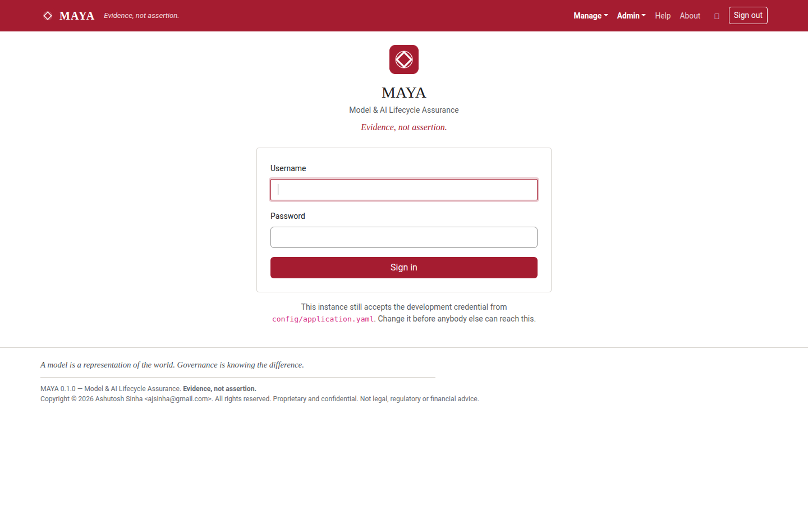

You land on the dashboard. The bar across the top has four menus — **Manage**,
**Admin**, **Help**, **About** — and everything in this document is reachable
from one of them.

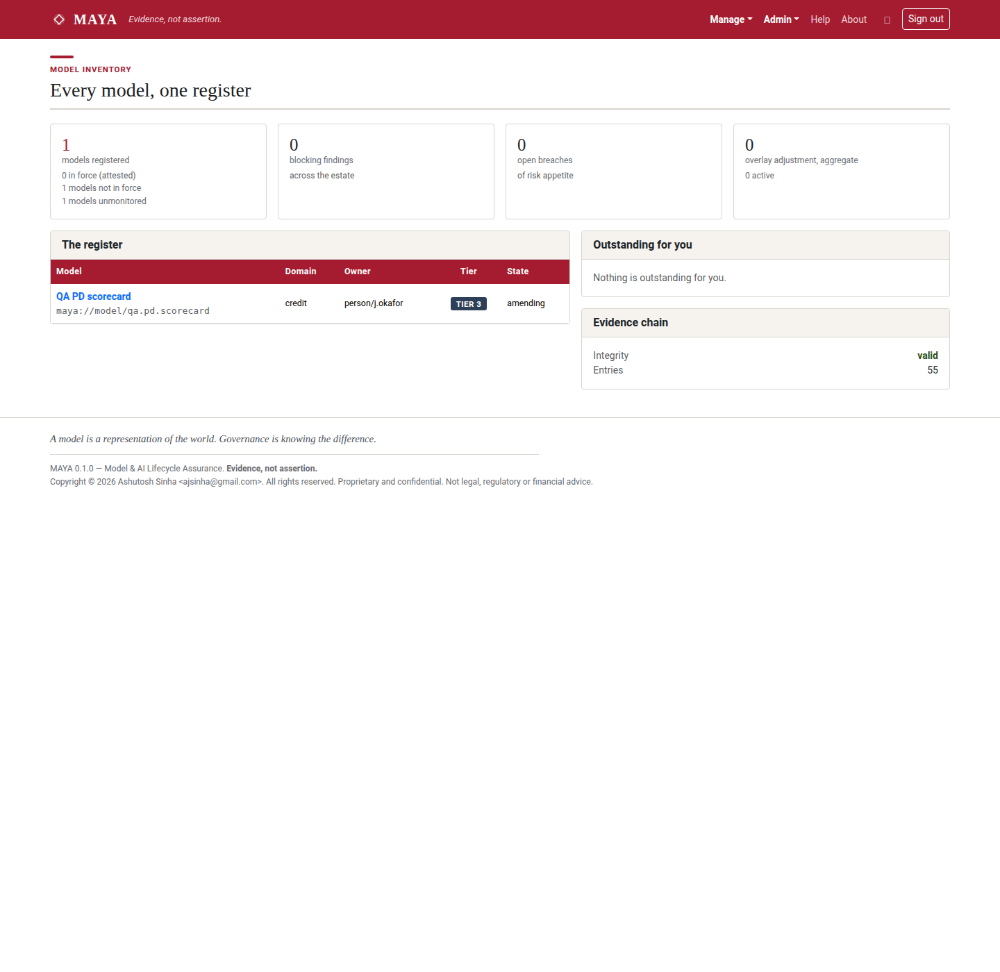

### From the command line

Two ways, and the difference matters:

```bash
# HTTP Basic — for scripts. No cookie, no CSRF token needed.
curl -s -u $AUTH $API/me

# A browser session — a cookie, which then requires a CSRF token on writes.
curl -s -c /tmp/maya-cookies.txt -X POST $BASE/login \
  -d "username=admin&password=maya-admin-dev&next=/dashboard"
```

```python
# The SDK is the script path: HTTP Basic, no cookie, no CSRF token.
maya = Maya("http://127.0.0.1:5006", "admin", "maya-admin-dev")
maya.whoami()

# Or a key, which is how a SERVICE should connect — see section 3.
service = Maya("http://127.0.0.1:5006", api_key="maya_sk_...")
```

The browser session with its cookie and CSRF token is for the screens. A script
uses Basic or a key, and needs neither.

**Use HTTP Basic (`-u $AUTH`) for everything in this document.** It is what the
`-u` in every command below does. Session cookies are for the browser.

**Check it worked:**

```bash
curl -s -u $AUTH $API/me
```

```python
maya.whoami()
```

You should see your username, your roles, and every permission they carry.

---

## 2. Roles, users and RBAC

### Create a role

```bash
curl -s -u $AUTH -X POST $API/roles -H 'content-type: application/json' -d '{
  "name": "feature_curator",
  "description": "defines and loads features, nothing else",
  "permissions": ["feature:read", "feature:define", "feature:materialise"]
}'
```

```python
maya.principals.define_role(
    name="feature_curator",
    description="defines and loads features, nothing else",
    permissions=["feature:read", "feature:define", "feature:materialise"])
```

A role **needs a description**. A list of permissions is not an explanation of
who should hold them, and MAYA refuses without one.

### Change what a role grants

```bash
curl -s -u $AUTH -X PUT $API/roles/feature_curator \
  -H 'content-type: application/json' -d '{
  "permissions": ["feature:read", "feature:define", "feature:materialise", "featureset:define"]
}'
```

```python
maya.principals.amend_role(
    "feature_curator",
    permissions=["feature:read", "feature:define", "feature:materialise",
                 "featureset:define"])
```

### Create a user and give them the role

```bash
curl -s -u $AUTH -X POST $API/principals -H 'content-type: application/json' -d '{
  "username": "q.tester",
  "display_name": "Q Tester",
  "roles": ["feature_curator"],
  "password": "qa-password-long"
}'
```

```python
maya.principals.create(username="q.tester", display_name="Q Tester",
                       roles=["feature_curator"], password="qa-password-long")
```

Passwords must be **at least 12 characters**.

### See RBAC actually bite

```bash
# What can this person do?
curl -s -u q.tester:qa-password-long $API/me

# Something they may not do:
curl -s -u q.tester:qa-password-long -X POST $API/models \
  -H 'content-type: application/json' -d '{
  "urn":"maya://model/nope","name":"nope","model_class":"c","domain":"credit",
  "owner":"person/q","legal_entity":"uk","purpose":"p"}'
```

```python
from maya_sdk import Maya
from maya_sdk.errors import Refused

tester = Maya("http://127.0.0.1:5006", "q.tester", "qa-password-long")
tester.whoami()                       # what can this person do?

try:                                  # something they may not do
    tester.models.register(
        urn="maya://model/nope", name="nope", model_class="c",
        domain="credit", owner="person/q", legal_entity="uk", purpose="p")
except Refused as refusal:
    print(refusal.status, refusal.code, refusal.detail)
```

**Expected — this is the feature working:**

```json
{"error":"forbidden",
 "detail":"'model:register' is not granted by your roles (feature_curator)",
 "remediation":"ask an administrator for a role that carries this permission"}
```

### Delete a role

```bash
curl -s -u $AUTH -X DELETE $API/roles/feature_curator
```

```python
maya.call("DELETE", "/roles/feature_curator")
```

> The SDK has no `delete_role`, deliberately: a role held by somebody is not
> deletable, and the refusal is the interesting part. `maya.call` is the escape
> hatch for anything the SDK does not name.

**Expected while somebody holds it:**

```json
{"error":"role_in_use",
 "detail":"'feature_curator' is held by q.tester, and a role that stops existing
           while somebody holds it makes their next request resolve against a
           name that is not there",
 "remediation":"change those principals' roles first"}
```

Change `q.tester`'s roles first, then the delete succeeds.

### Two refusals worth trying deliberately

```bash
# A role that holds both halves of a separated duty
curl -s -u $AUTH -X POST $API/roles -H 'content-type: application/json' -d '{
  "name":"solo","description":"one person, the whole lifecycle",
  "permissions":["model:register","model:submit","version:approve"]}'
```

```python
try:
    maya.principals.define_role(
        name="solo", description="one person, the whole lifecycle",
        permissions=["model:register", "model:submit", "version:approve"])
except Refused as refusal:
    print(refusal.code)               # incompatible_permissions
    print(refusal.detail)             # names the pair, and why
```

→ `409 incompatible_permissions`, naming which pair and why. One person may not
both propose a model and approve it.

```bash
# Suspend yourself
curl -s -u $AUTH -X POST $API/principals/admin/suspend
```

```python
try:
    maya.principals.suspend("admin", reason="testing")
except Refused as refusal:
    print(refusal.detail)
```

→ `409 self_suspension`. Reinstating needs a permission you would no longer
have.

### In the browser

**Admin → People and roles.**

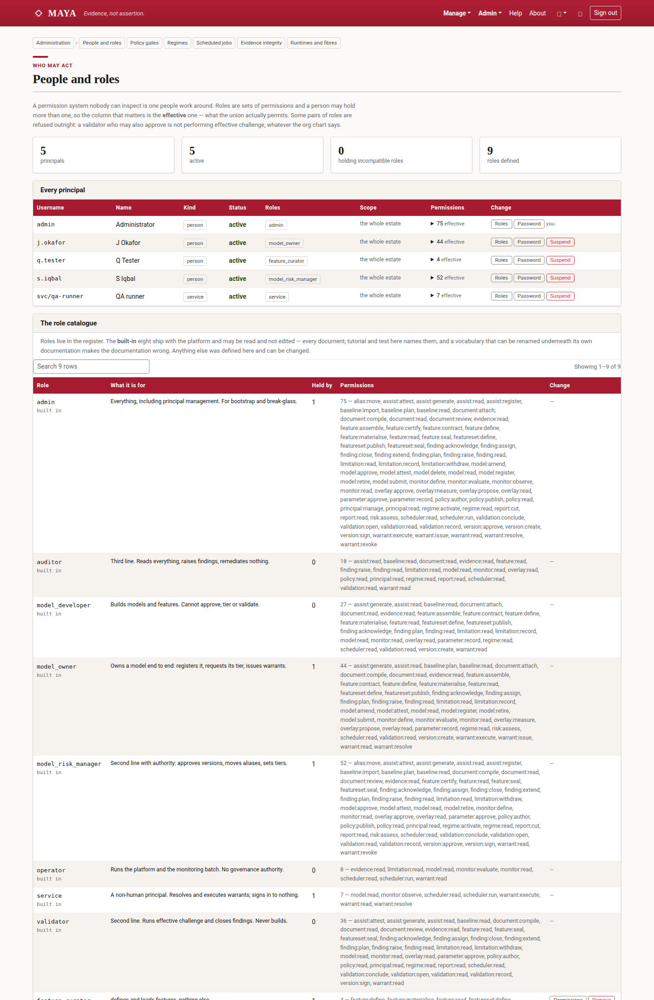

On this screen you can:

- **Add somebody** — the card at the bottom, with role checkboxes.
- **Roles** — click it on any row to change that person's roles inline.
- **Password** — an inline form with a confirm field.
- **Suspend / Reinstate** — note there is no Suspend button on *your own* row.
- **Define a role** — with a picker listing every valid permission.
- Expand any **effective** count to see the full permission list for that person.

---

## 3. API keys

An API key lets a script or a service authenticate without a password. A key
belongs to a **principal** and may carry **fewer** permissions than that
principal — never more.

### Create the service account, then the key

```bash
curl -s -u $AUTH -X POST $API/principals -H 'content-type: application/json' -d '{
  "username": "svc/qa-runner", "display_name": "QA runner",
  "kind": "service", "roles": ["service"]}'

curl -s -u $AUTH -X POST $API/api-keys -H 'content-type: application/json' -d '{
  "username": "svc/qa-runner",
  "name": "qa-nightly",
  "scopes": ["model:read", "warrant:resolve"],
  "lifetime_days": 30
}'
```

```python
maya.principals.create(username="svc/qa-runner", display_name="QA runner",
                       kind="service", roles=["service"])

issued = maya.api_keys.issue(username="svc/qa-runner", name="qa-nightly",
                             scopes=["model:read", "warrant:resolve"],
                             lifetime_days=30)
secret = issued["secret"]             # the ONLY copy — nowhere else, ever
```

**The `secret` in that response is shown once and never again.** Copy it now.

```bash
SECRET=maya_sk_...paste it here...
```

### Use it

```bash
curl -s -H "X-API-Key: $SECRET" $API/me
# or, equivalently:
curl -s -H "Authorization: Bearer $SECRET" $API/models
```

```python
service = Maya("http://127.0.0.1:5006", api_key=secret)
service.whoami()
service.models.list()
```

`/me` reports **the key's** permissions, not the person's — a key scoped to two
permissions reports two.

### See the scope bite

```bash
curl -s -H "X-API-Key: $SECRET" $API/evidence/chain
```

```python
try:
    service.verify_evidence()
except Refused as refusal:
    print(refusal.status, refusal.code)      # 403: the key is narrower
```

**Expected:**

```json
{"error":"outside_key_scope",
 "detail":"the API key 'qa-nightly' does not carry 'evidence:read',
           though svc/qa-runner does",
 "remediation":"use a key whose scope covers this, or issue one that does"}
```

### Revoke it

```bash
curl -s -u $AUTH -X POST $API/api-keys/<key-id>/revoke \
  -H 'content-type: application/json' -d '{"reason":"QA finished"}'
```

```python
maya.api_keys.revoke(issued["id"], reason="QA finished")

try:
    service.whoami()
except Refused as refusal:
    print(refusal.code)               # key_revoked — not a generic 401
```

Get `<key-id>` from `curl -s -u $AUTH $API/api-keys`.

### Things that are refused on purpose

| Try this | Expected |
|---|---|
| `"scopes": ["principal:manage"]` on a `service` principal | `422 scope_exceeds_principal` — a key cannot grant what the identity never had |
| `"lifetime_days": 99999` | `422 lifetime_refused` — every key expires; 1–365 days |
| Using a key after its expiry | `401 key_expired`, naming the date |
| Using a key whose principal is suspended | `401 key_principal_not_active` |

### In the browser

**Admin → API keys.**

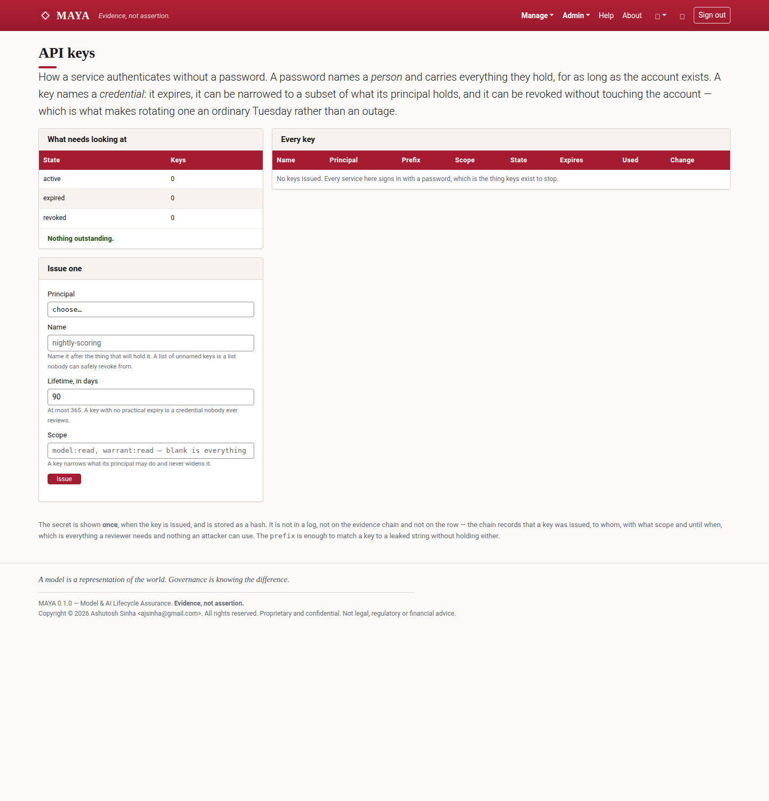

Issue one on the left; the secret appears once with a **Copy the secret**
button and a warning if you try to navigate away. Revoke from the list on the
right. Keys expiring within 14 days are flagged in red *and* labelled
"expiring" — not colour alone.

---

## 4. Models, their mathematics, and attached documents

### Register a model

```bash
curl -s -u $AUTH -X POST $API/models -H 'content-type: application/json' -d '{
  "urn": "maya://model/qa.pd.scorecard",
  "name": "QA PD scorecard",
  "model_class": "credit.pd.scorecard",
  "domain": "credit",
  "owner": "person/j.okafor",
  "legal_entity": "LE-US-01",
  "purpose": "12-month probability of default at origination"
}'
```

```python
maya.models.register(
    urn="maya://model/qa.pd.scorecard",
    name="QA PD scorecard",
    model_class="credit.pd.scorecard",
    domain="credit",
    owner="person/j.okafor",
    legal_entity="LE-US-01",
    purpose="12-month probability of default at origination")
```

Every field is required. `urn` is the model's permanent name.

### Assess its tier

**Do this before anything else.** The tier decides how many signatures the model
needs, how often it must be reviewed, and which controls apply.

```bash
curl -s -u $AUTH -X POST $API/models/qa.pd.scorecard/assess \
  -H 'content-type: application/json' -d '{
  "exposure": 250000000,
  "purpose_class": "credit_decision",
  "feature_count": 3,
  "uses_alternative_data": false,
  "interpretable": true
}'
```

```python
maya.models.assess("qa.pd.scorecard",
                   exposure=250_000_000,
                   purpose_class="credit_decision",
                   feature_count=3,
                   uses_alternative_data=False,
                   interpretable=True)
```

Returns the tier (1 = most material, 4 = least), the required controls, and the
reasoning. **Tiers 1 and 2 need two signatures to approve a version; tiers 3
and 4 need one.**

### Add a version — the JSON way

The **kernel** is the model. For a closed-form model, `runtime: "formula"` means
MAYA holds the mathematics itself:

```bash
curl -s -u $AUTH -X POST $API/models/qa.pd.scorecard/versions \
  -H 'content-type: application/json' -d '{
  "semver": "1.0.0",
  "kernel": {
    "runtime": "formula",
    "parameter_kind": "estimated_coefficients",
    "fit_procedure": "estimate",
    "entry": {
      "expression": "1 / (1 + exp(-(intercept + beta_dscr * dscr + beta_ltv * ltv)))",
      "target": "pd_12m"
    },
    "input_schema": [
      {"name": "dscr", "dtype": "numeric", "symbol": "\\mathrm{DSCR}", "unit": "ratio"},
      {"name": "ltv",  "dtype": "numeric", "symbol": "\\mathrm{LTV}",  "unit": "ratio"}
    ],
    "output_schema": [{"name": "pd_12m", "dtype": "numeric", "unit": "probability"}]
  }
}'
```

```python
maya.versions.create("qa.pd.scorecard", semver="1.0.0", kernel={
    "runtime": "formula",
    "parameter_kind": "estimated_coefficients",
    "fit_procedure": "estimate",
    "entry": {"expression": "1 / (1 + exp(-(intercept + beta_dscr * dscr "
                            "+ beta_ltv * ltv)))",
              "target": "pd_12m"},
    "input_schema": [
        {"name": "dscr", "dtype": "numeric",
         "symbol": r"\mathrm{DSCR}", "unit": "ratio"},
        {"name": "ltv", "dtype": "numeric",
         "symbol": r"\mathrm{LTV}", "unit": "ratio"},
    ],
    "output_schema": [{"name": "pd_12m", "dtype": "numeric",
                       "unit": "probability"}],
})
```

> Note the `r"..."` on the LaTeX. In Python a plain `"\mathrm"` is an escape
> sequence; the raw string is what sends the backslash MAYA needs.

> **Important.** `input_schema` declares the **features** the model reads —
> *not* its coefficients. `intercept`, `beta_dscr` and `beta_ltv` appear in the
> expression but are **parameters**, and they arrive later from training
> (section 9). Putting them in `input_schema` makes MAYA demand that your
> featureset supply them, and it will refuse.

### Get the mathematics — LaTeX and Python

```bash
curl -s -u $AUTH "$API/mathematics?urn=maya://model/qa.pd.scorecard&semver=1.0.0"
```

```python
maya.call("GET", "/mathematics",
          params={"urn": "maya://model/qa.pd.scorecard", "semver": "1.0.0"})
```

Returns:

```
expression : 1 / (1 + exp(-(intercept + beta_dscr * dscr + beta_ltv * ltv)))

latex      : \frac{1}{1 + e^{-\left(\alpha + \beta_{1} \cdot \mathrm{DSCR}
                                  + \beta_{2} \cdot \mathrm{LTV}\right)}}

python     : a complete, importable module with a predict() function
```

**Neither is stored.** Both are derived from the same expression MAYA
evaluates, every time you ask — so the equation on a model card, the code a
validator recomputes with, and the answer the platform gives *cannot* disagree.
The `symbol` field on each input controls how it is typeset.

Paste the `latex` value into any LaTeX document or a maths renderer to see the
equation.

> **There is no LaTeX editor in the product.** MAYA derives LaTeX from the
> expression; it does not let you write LaTeX and store it. A written
> specification belongs in an **attachment** (below), where a named person
> signs for it.

### Attach a document

This is where a written spec, a validation report or a TeX file goes:

```bash
curl -s -u $AUTH -X POST $API/attachments \
  -F "urn=maya://model/qa.pd.scorecard" \
  -F "kind=model_development_document" \
  -F "title=QA PD scorecard specification" \
  -F "semver=1.0.0" \
  -F "file=@/path/to/your/spec.tex"
```

```python
maya.attachments.attach("maya://model/qa.pd.scorecard",
                        "path/to/your/spec.tex",
                        kind="model_development_document",
                        title="QA PD scorecard specification",
                        semver="1.0.0")
```

Note these are **form fields**, not JSON — including `urn`.

```bash
# what is filed against this model
curl -s -u $AUTH "$API/attachments?urn=maya://model/qa.pd.scorecard"
```

```python
maya.attachments.list("maya://model/qa.pd.scorecard")
```

An attachment lands **awaiting review**. Somebody other than the person who
filed it accepts or rejects it.

### In the browser

**Manage → The estate**, then click the model. Or go straight to
`/model/qa.pd.scorecard`.

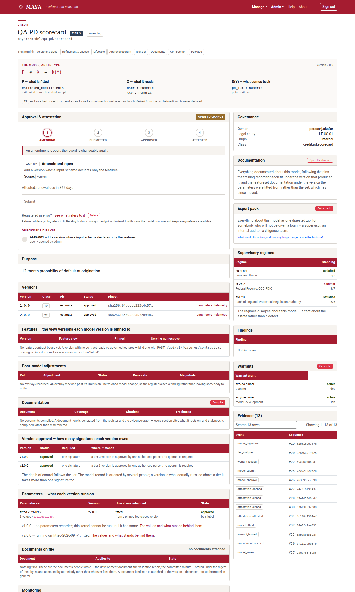

The model page shows the lifecycle state, every version, the alias history, the
evidence chain, attached documents, warrants, and a **Cut a pack** button that
downloads everything about the model as one zip.

To register a model in the browser: **Manage → Register a model**.

---

## 5. Features — scalars, arrays, matrices, and rules

A **feature** is a named, typed fact about an entity. Data arrives in a
**feature view**, which is a materialised table of rows.

### Define features

```bash
# a scalar
curl -s -u $AUTH -X POST $API/features -H 'content-type: application/json' -d '{
  "name": "dscr", "entity": "borrower", "dtype": "numeric",
  "description": "debt service coverage ratio", "owner": "person/d.raman"}'

# an ARRAY — twelve monthly balances
curl -s -u $AUTH -X POST $API/features -H 'content-type: application/json' -d '{
  "name": "monthly_balances", "entity": "borrower", "dtype": "numeric",
  "shape": [12],
  "description": "twelve monthly balances", "owner": "person/d.raman"}'

# a MATRIX — a 3x3 correlation matrix
curl -s -u $AUTH -X POST $API/features -H 'content-type: application/json' -d '{
  "name": "correlation", "entity": "borrower", "dtype": "numeric",
  "shape": [3, 3],
  "description": "a 3x3 correlation matrix", "owner": "person/d.raman"}'
```

```python
# a scalar
maya.features.define(name="dscr", entity="borrower", dtype="numeric",
                     description="debt service coverage ratio",
                     owner="person/d.raman")

# an ARRAY — twelve monthly balances
maya.features.define(name="monthly_balances", entity="borrower",
                     dtype="numeric", shape=[12],
                     description="twelve monthly balances",
                     owner="person/d.raman")

# a MATRIX — a 3x3 correlation matrix
maya.features.define(name="correlation", entity="borrower", dtype="numeric",
                     shape=[3, 3], description="a 3x3 correlation matrix",
                     owner="person/d.raman")
```

`shape` is what makes a feature an array or a matrix. Omit it for a scalar.

### Create a view and load data

```bash
curl -s -u $AUTH -X POST $API/feature-views -H 'content-type: application/json' -d '{
  "name": "qa_borrower", "entity": "borrower", "owner": "person/d.raman",
  "features": ["dscr", "ltv", "monthly_balances", "correlation"],
  "description": "QA borrower facts"}'

curl -s -u $AUTH -X POST $API/feature-views/qa_borrower/materialise \
  -H 'content-type: application/json' -d '{
  "rows": [
    {"entity_id":"C1","event_ts":100.0,"ingest_ts":110.0,
     "dscr":1.20,"ltv":0.62,
     "monthly_balances":[10,11,12,11,10,9,9,10,11,12,13,12],
     "correlation":[[1,0.3,0.1],[0.3,1,0.2],[0.1,0.2,1]]},
    {"entity_id":"C2","event_ts":100.0,"ingest_ts":110.0,
     "dscr":2.10,"ltv":0.35,
     "monthly_balances":[20,21,22,21,20,19,19,20,21,22,23,22],
     "correlation":[[1,0,0],[0,1,0],[0,0,1]]}
  ]}'
```

```python
maya.features.create_view(
    name="qa_borrower", entity="borrower", owner="person/d.raman",
    features=["dscr", "ltv", "monthly_balances", "correlation"],
    description="QA borrower facts")

maya.views.materialise("qa_borrower", rows=[
    {"entity_id": "C1", "event_ts": 100.0, "ingest_ts": 110.0,
     "dscr": 1.20, "ltv": 0.62,
     "monthly_balances": [10, 11, 12, 11, 10, 9, 9, 10, 11, 12, 13, 12],
     "correlation": [[1, 0.3, 0.1], [0.3, 1, 0.2], [0.1, 0.2, 1]]},
    {"entity_id": "C2", "event_ts": 100.0, "ingest_ts": 110.0,
     "dscr": 2.10, "ltv": 0.35,
     "monthly_balances": [20, 21, 22, 21, 20, 19, 19, 20, 21, 22, 23, 22],
     "correlation": [[1, 0, 0], [0, 1, 0], [0, 0, 1]]},
])
```

For anything of a real size, upload a FILE instead — it streams rather than
going through a request body, and CSV or JSONL is what a person usually has:

```python
maya.features.load("qa_borrower", "rows.csv")     # or .jsonl, .parquet, .arrow
```


### The two clocks — the most important idea here

**Every row needs `event_ts` and `ingest_ts`.**

- `event_ts` — when the fact was *true*
- `ingest_ts` — when you *learned* it

They are different, and the difference is what makes training honest. A figure
filed in March and **restated** in August is two rows with the same `event_ts`
and different `ingest_ts`:

```json
{"entity_id":"C1","event_ts":100.0,"ingest_ts":110.0,"dscr":1.20}
{"entity_id":"C1","event_ts":100.0,"ingest_ts":900.0,"dscr":0.40}
```

Ask for data "as of" a moment and MAYA gives you what was **knowable then** —
not what you know now. A row missing either clock is refused.

### Rules on a feature

A feature carries a **retrieval policy** — how it is filled, normalised and
aligned when it is read. A policy says **exactly three things and nothing
else**: `fill`, `normalise`, `align`.

Each is keyed **by column**:

```bash
curl -s -u $AUTH -X POST $API/features -H 'content-type: application/json' -d '{
  "name": "utilisation", "entity": "borrower", "dtype": "numeric",
  "description": "credit line utilisation", "owner": "person/d.raman",
  "defaults": {
    "fill":      {"utilisation": "median"},
    "normalise": {"utilisation": "zscore"},
    "align":     {"rule": "flat_forward"}
  }
}'
```

```python
maya.features.define(
    name="utilisation", entity="borrower", dtype="numeric",
    description="credit line utilisation", owner="person/d.raman",
    defaults={"fill": {"utilisation": "median"},
              "normalise": {"utilisation": "zscore"},
              "align": {"rule": "flat_forward"}})
```

| Section | Values |
|---|---|
| `fill` | `zero`, `constant`, `mean`, `median`, `most_frequent`, `keep` |
| `normalise` | `none`, `zscore`, `minmax`, `robust`, `rank` |
| `align` | `flat_forward`, `flat_backward`, `linear`, `nearest`, `none` |

> `{"normalise": "zscore"}` is the natural mistake and is refused — the section
> is a mapping of *column* to method, so it is
> `{"normalise": {"your_column": "zscore"}}`. There is **no**
> `/features/{name}/policy` endpoint.

**Change a policy afterwards** with `amend`, which takes a `fields` object:

```bash
curl -s -u $AUTH -X POST $API/features/utilisation/amend \
  -H 'content-type: application/json' -d '{
  "fields": {"description": "credit line utilisation, capped at 1.0"}}'
```

```python
maya.catalogue.amend("utilisation",
                     fields={"description":
                             "credit line utilisation, capped at 1.0"})
```

**Freeze and certify:**

```bash
# seal it — no further change to the definition
curl -s -u $AUTH -X POST $API/features/dscr/seal \
  -H 'content-type: application/json' -d '{"note":"agreed with the second line"}'

# certify it for use
curl -s -u $AUTH -X POST $API/features/dscr/certify \
  -H 'content-type: application/json' -d '{"level":"certified"}'
```

```python
maya.catalogue.seal("dscr", note="agreed with the second line")
maya.catalogue.certify("dscr", level="certified")
```

**See everything about a feature — definition, policy, lineage, where it is
used:**

```bash
curl -s -u $AUTH $API/features/dscr/resolved
```

```python
maya.catalogue.resolved("dscr")
```

(`GET $API/features/dscr` is **not** a route — use `/resolved`, or the list at
`GET $API/features`.)

### In the browser

**Manage → All features** lists the catalogue with certification, lineage and
where each feature is used.

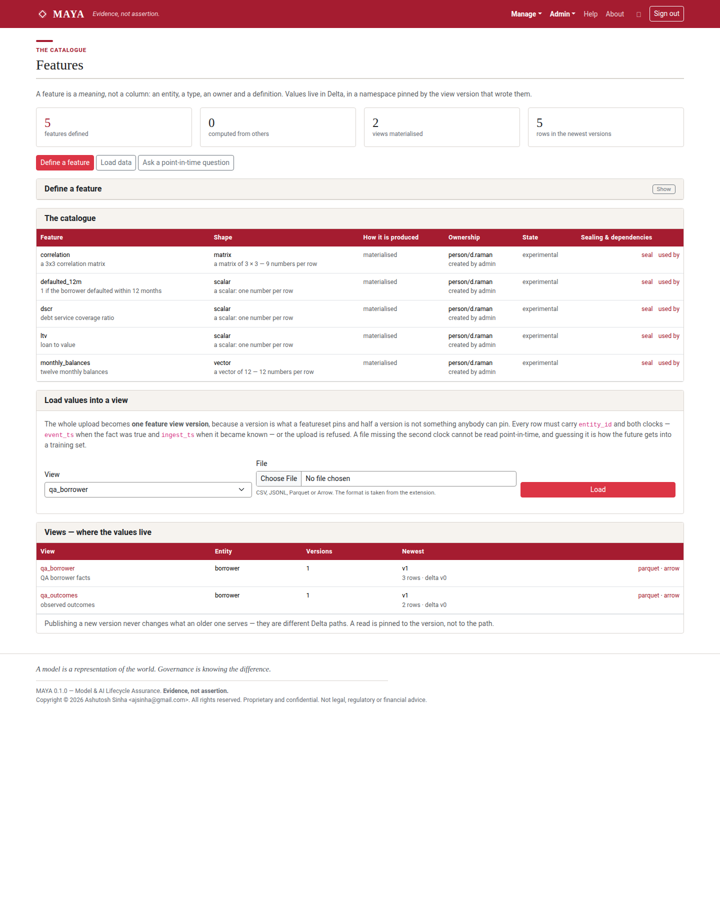

Click a feature for its definition, what it rests on, what rests on it, and
where its values live.

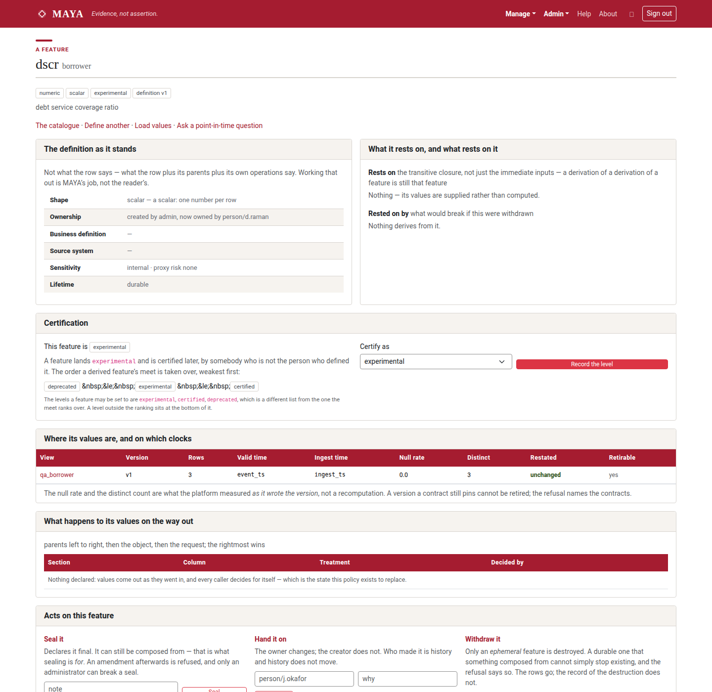

**Manage → Define a feature** to create one, and **Manage → Load data** to
upload rows — including a CSV upload.

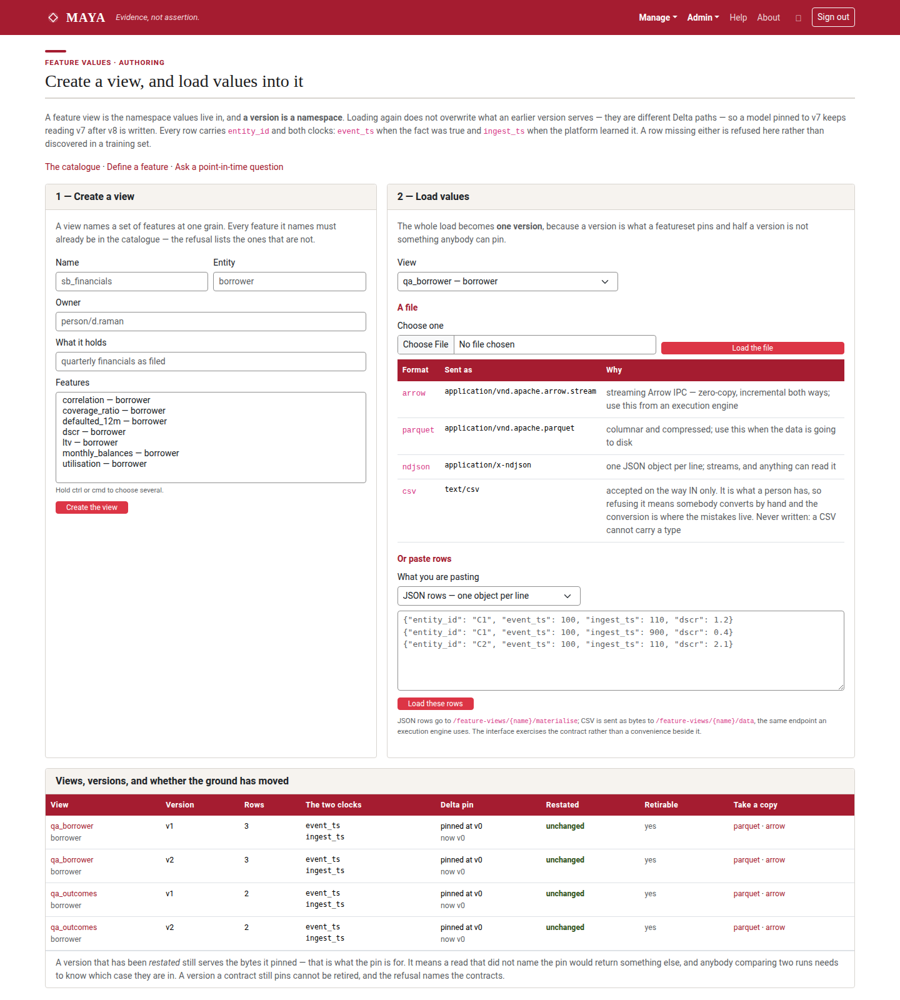

---

## 6. Featuresets and slot resolution

A **featureset** is the schema a model reads: a set of named **slots**. Each
slot is *resolved* to a real feature when you publish a version.

### Define the schema

```bash
curl -s -u $AUTH -X POST $API/featuresets -H 'content-type: application/json' -d '{
  "name": "qa_pd_training",
  "entity": "borrower",
  "slots": {"dscr": "numeric", "ltv": "numeric", "defaulted": "numeric"},
  "label_slot": "defaulted",
  "outcome_window_days": 365,
  "description": "slot names match the kernel input names"
}'
```

```python
maya.featuresets.define(
    name="qa_pd_training", entity="borrower",
    slots={"dscr": "numeric", "ltv": "numeric", "defaulted": "numeric"},
    label_slot="defaulted", outcome_window_days=365,
    description="slot names match the kernel input names")
```

> **The slot names are the attribute names your model reads.** If your kernel's
> `input_schema` declares `dscr` and `ltv`, your featureset must have slots
> called `dscr` and `ltv`. This is checked (law L-W10) when you ask for a
> training warrant — see section 9.

> **`label_slot` must be one of the slots.** Naming a label that is not in
> `slots` is refused.

### Resolve the slots — bind and publish

```bash
curl -s -u $AUTH -X POST $API/featuresets/qa_pd_training/versions \
  -H 'content-type: application/json' -d '{
  "bindings": {"dscr": "dscr", "ltv": "ltv", "defaulted": "defaulted_12m"}
}'
```

```python
maya.featuresets.fill("qa_pd_training", bindings={
    "dscr": "dscr", "ltv": "ltv", "defaulted": "defaulted_12m"})
```

`{"slot": "feature"}`. The response shows each slot pinned to a specific
**feature view version** — not "the latest", a fixed version. That pin is what
makes a training set reproducible.

### Enforcing resolution

- Every slot must bind. An unbound slot is refused at publish.
- A feature with no materialised view is refused: *"no materialised feature
  view supplies 'x'; materialise it before a featureset can pin it."*
- Once published, a version is immutable. Change a binding by publishing a
  **new version**.

```bash
curl -s -u $AUTH $API/featuresets/qa_pd_training
```

```python
maya.featuresets.get("qa_pd_training")
maya.featuresets.resolved("qa_pd_training")     # after composition
```

### In the browser

**Manage → All featuresets**, and **Manage → Compose a featureset** to author
one.

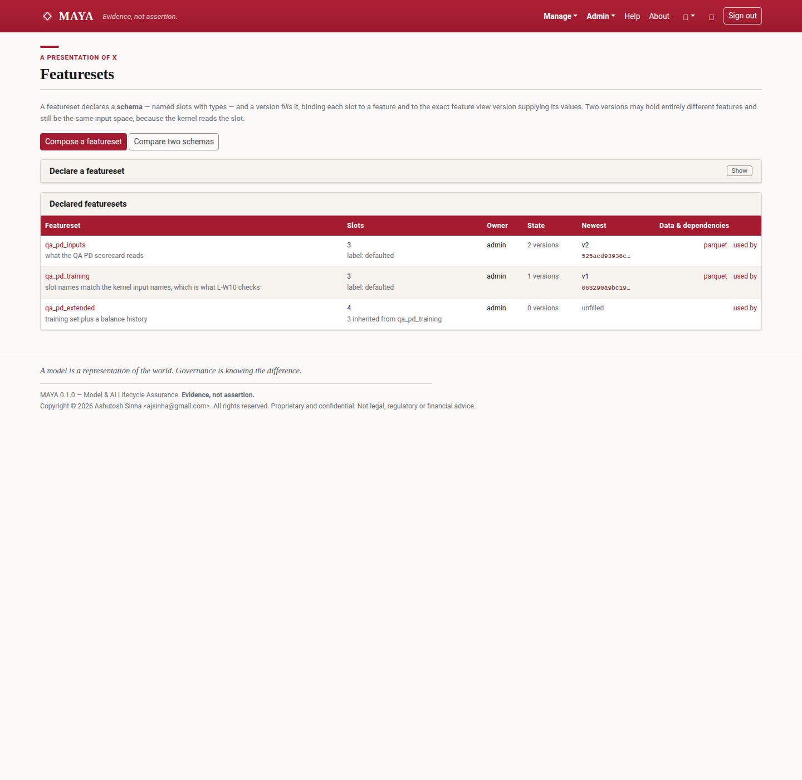

The authoring screen walks through declare → bind → publish, and shows which
slots are still unresolved.

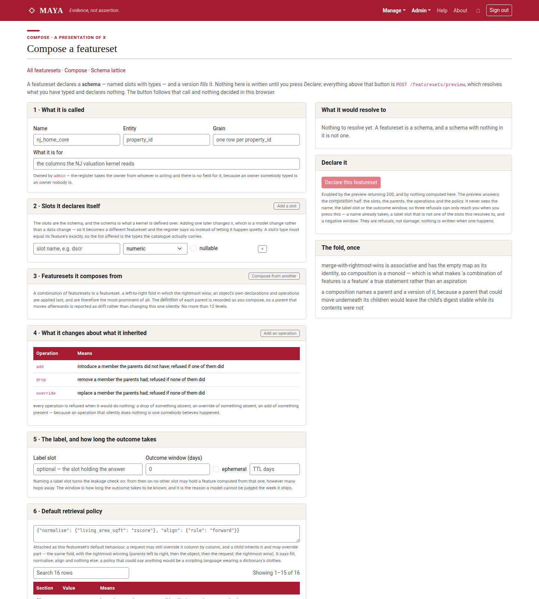

---

## 7. Composition and inheritance

### A feature composed from other features

```bash
curl -s -u $AUTH -X POST $API/derived-features \
  -H 'content-type: application/json' -d '{
  "name": "coverage_ratio",
  "expression": "dscr / ltv",
  "dtype": "numeric",
  "description": "cover per unit of leverage"
}'
```

```python
maya.features.derive(name="dscr_x_ltv", dtype="numeric",
                     expression="dscr * ltv",
                     owner="person/d.raman",
                     description="the interaction term")
```

The expression may use the other features by name, plus `log`, `exp`, `sqrt`,
`abs`, `min`, `max`, `floor`, `ceil`, `round`, and the row's clocks
(`event_ts`, `ingest_ts`, `event_year`).

### A featureset composed from other featuresets

```bash
curl -s -u $AUTH -X POST $API/featuresets -H 'content-type: application/json' -d '{
  "name": "qa_pd_extended",
  "entity": "borrower",
  "composes": ["qa_pd_training"],
  "slots": {"balances": "numeric"},
  "description": "everything the training set has, plus a balance history"
}'
```

**The rule: rightmost wins.** Composition folds left to right, and the object's
own slots are applied last — so `qa_pd_extended`'s own definitions override
anything it inherits. This is a *monoid*: `(A ∘ B) ∘ C` and `A ∘ (B ∘ C)` give
the same answer, so the order two people happened to edit in carries no
meaning.

**Check what it actually resolves to:**

```bash
curl -s -u $AUTH $API/featuresets/qa_pd_extended/resolved
```

```python
maya.featuresets.resolved("qa_pd_extended")
```

`qa_pd_extended` declares one slot of its own and inherits three:

```
resolved slots: ['balances', 'defaulted', 'dscr', 'ltv']
```

`GET $API/featuresets/qa_pd_extended` shows only the declared slot
(`balances`); `/resolved` shows what the composition adds up to. The difference
between those two answers is the whole point of composition.

### See what depends on what

```bash
curl -s -u $AUTH "$API/references?kind=feature&id=dscr"
```

```python
maya.call("GET", "/references", params={"kind": "feature", "id": "dscr"})
```

Tells you everything that refers to a feature and whether it can be deleted.

### In the browser

**Manage → Dependencies** answers "where is this used?" for any model, feature
or featureset.

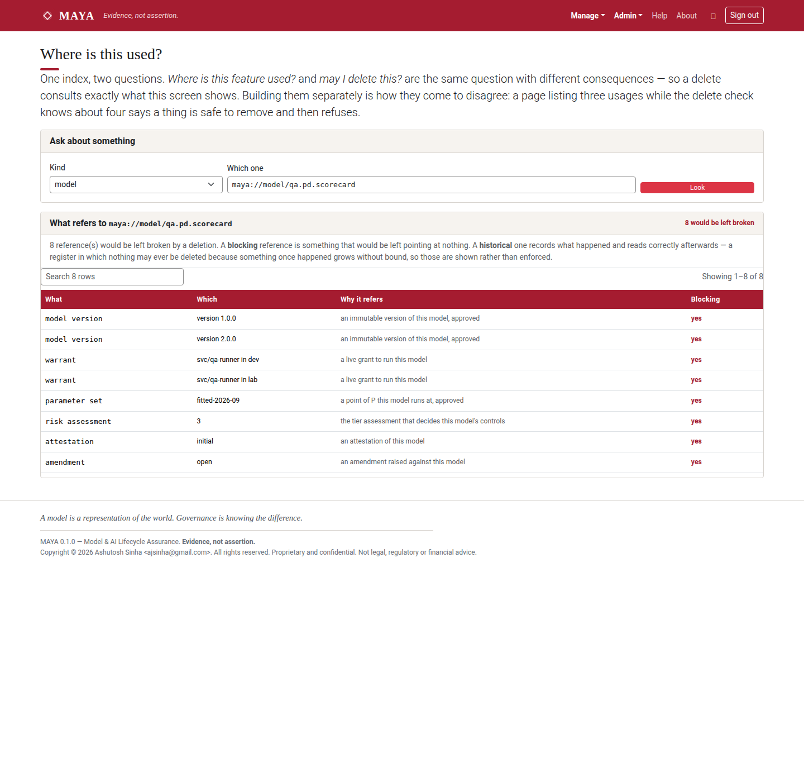

Ask it about a name that does not exist and it says so in red — which is *not*
the same answer as "nothing refers to it".

---

## 8. The approval workflow

**Nothing runs until it has been through this.** There are two lifecycles that
must both complete: the **version** and the **model record**.

### Step 1 — approve the version

```bash
# how many signatures does this tier need?
curl -s -u $AUTH $API/version-approval-quorum
```

```python
maya.approvals.quorum()
maya.approvals.needed(urn="maya://model/qa.pd.scorecard", semver="1.0.0")
```

```
tier 1 -> 2 signature(s): ['model_risk_manager', 'validator']
tier 2 -> 2 signature(s): ['model_risk_manager', 'validator']
tier 3 -> 1 signature(s): one authorised person
tier 4 -> 1 signature(s): one authorised person
```

For a **tier 3 or 4** model, one authorised person approves:

```bash
curl -s -u s.iqbal:mrm-password-long \
  -X POST $API/models/qa.pd.scorecard/versions/1.0.0/approve
```

```python
mrm = Maya("http://127.0.0.1:5006", "s.iqbal", "mrm-password-long")
mrm.versions.approve("qa.pd.scorecard", "1.0.0")

# As admin, who CREATED it — segregation of duties refuses this:
try:
    maya.versions.approve("qa.pd.scorecard", "1.0.0")
except Refused as refusal:
    print(refusal.code, refusal.detail)
```

> **You cannot approve a version you created.** Try it as `admin` (who created
> it) and you get:
>
> ```json
> {"error":"segregation_of_duties",
>  "detail":"the person who created a version may not approve it — admin
>            recorded 'version_created' against this subject at evidence #21",
>  "remediation":"route the approval to someone in the second line who did not
>                 build it"}
> ```
>
> This is the platform working. Approve as `s.iqbal` instead.

For a **tier 1 or 2** model, open a quorum and have each role sign:

```bash
curl -s -u $AUTH -X POST $API/version-approvals \
  -H 'content-type: application/json' \
  -d '{"urn":"maya://model/qa.pd.scorecard","semver":"1.0.0"}'

curl -s -u s.iqbal:mrm-password-long \
  -X POST $API/version-approvals/<approval-id>/sign \
  -H 'content-type: application/json' \
  -d '{"role":"model_risk_manager","decision":"approve"}'
```

```python
opened = mrm.versions.open_quorum(urn="maya://model/qa.pd.scorecard",
                                  semver="1.0.0")
mrm.versions.sign_quorum(opened["id"], role="model_risk_manager",
                         statement="the coefficients match the fit report")

validator = Maya("http://127.0.0.1:5006", "a.mehta", "val-password-long")
validator.versions.sign_quorum(opened["id"], role="validator",
                               statement="effective challenge complete")

maya.approvals.progress(opened["id"])     # who is still outstanding
```

**One person cannot sign twice under two roles.** A quorum is a number of
people, not a number of hats.

### Step 2 — submit and approve the model record

```bash
curl -s -u $AUTH -X POST $API/models/qa.pd.scorecard/submit \
  -H 'content-type: application/json' -d '{}'

curl -s -u s.iqbal:mrm-password-long \
  -X POST $API/models/qa.pd.scorecard/approve \
  -H 'content-type: application/json' -d '{}'
```

```python
maya.lifecycle.submit("maya://model/qa.pd.scorecard")
mrm.lifecycle.approve("maya://model/qa.pd.scorecard")
```

### Step 3 — attest it

Approval is not enough. **Attestation** is what puts a model *in force*, and it
takes signatures from every required role:

```bash
curl -s -u s.iqbal:mrm-password-long \
  -X POST $API/models/qa.pd.scorecard/attest \
  -H 'content-type: application/json' \
  -d '{"role":"model_risk_manager","decision":"attest"}'

curl -s -u j.okafor:owner-password-long \
  -X POST $API/models/qa.pd.scorecard/attest \
  -H 'content-type: application/json' \
  -d '{"role":"model_owner","decision":"attest"}'
```

```python
mrm.lifecycle.attest("maya://model/qa.pd.scorecard", role="model_risk_manager")

owner = Maya("http://127.0.0.1:5006", "j.okafor", "owner-password-long")
owner.lifecycle.attest("maya://model/qa.pd.scorecard", role="model_owner")
```

After the first signature the response tells you who is still outstanding:

```json
"signed_roles": ["model_risk_manager"],
"outstanding_roles": ["model_owner"],
"complete": false
```

After the last one:

```json
"state": "attested",
"meaning": "in force and immutable; open an amendment to change it"
```

### Check the state at any point

```bash
curl -s -u $AUTH $API/models/qa.pd.scorecard
```

```python
model = maya.models.get("maya://model/qa.pd.scorecard")
print(model["lifecycle"]["state"], "—", model["lifecycle"]["meaning"])
```

Look at `lifecycle.state` and `lifecycle.meaning`.

| State | Meaning |
|---|---|
| `draft` | being written; open to change |
| `submitted` | put forward for approval |
| `approved` | approved but **not yet in force** |
| `attested` | in force and immutable |
| `retired` | withdrawn from use; nothing deleted |

### In the browser

**Manage → Model algebra** shows the lifecycle, the quorum for each tier, and
what each transition requires.

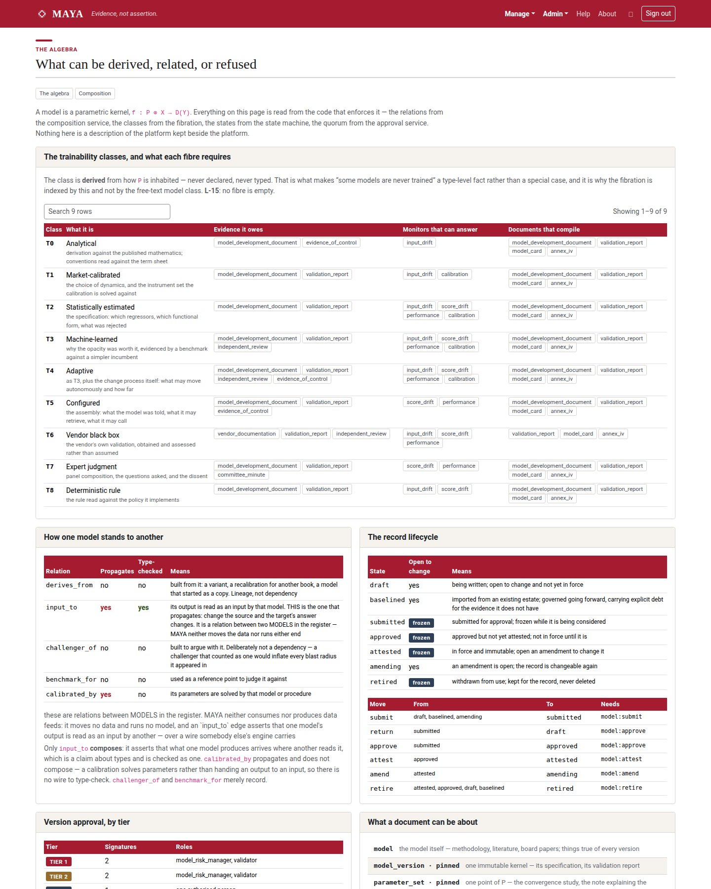

The model page itself has the buttons for each transition available to you.

---

## 9. Training: fit warrant → data → parameters

This is the sequence. An engine **outside** MAYA does the actual training.

```
  MAYA                                  Your training engine
  ────                                  ────────────────────
  1. grant authority
  2. issue a FIT WARRANT      ────────► 3. read the training data
                                        4. fit the model
  5. record the parameters    ◄──────── (send the coefficients back)
  6. somebody else approves them
```

### Step 1 — grant the engine authority

```bash
curl -s -u $AUTH -X POST $API/warrants -H 'content-type: application/json' -d '{
  "urn": "maya://model/qa.pd.scorecard",
  "principal": "svc/qa-runner",
  "declared_use": "model_development",
  "environment": "lab",
  "flavour": "formula"
}'
```

```python
owner.warrants.grant(urn="maya://model/qa.pd.scorecard#champion",
                     principal="svc/qa-runner",
                     declared_use="origination_decision",
                     environment="prod")
```

**Keep the `id` from this response** — it is the *grant id*, and you need it in
step 5.

### Step 2 — get a fit warrant

```bash
curl -s -u $AUTH -X POST $API/fit-warrants -H 'content-type: application/json' -d '{
  "urn": "maya://model/qa.pd.scorecard@2.0.0",
  "environment": "lab",
  "principal": "svc/qa-runner",
  "declared_use": "model_development",
  "featureset": "qa_pd_training",
  "featureset_version": 1,
  "window": {"from": 0.0, "to": 1000.0},
  "as_of": 1000.0
}'
```

```python
fit_warrant = owner.warrants.for_fitting(
    urn="maya://model/qa.pd.scorecard@2.0.0",
    environment="lab",
    principal="svc/qa-runner",
    declared_use="model_development",
    featureset="qa_pd_training",
    featureset_version=1,
    window={"from": 0.0, "to": 1000.0},
    as_of=1000.0)
```

Law **L-W10** is checked here: the featureset must supply what the kernel
declares it reads. Adding a regressor is a model change, not a data change —
so a featureset that cannot fill a slot is refused at the warrant rather than
discovered during the fit.

The warrant tells the engine everything it needs:

```json
"data": {"inputs": [{
    "name": "training_set", "binding": "featureset",
    "featureset": "qa_pd_training", "version": 1,
    "digest": "sha256:063290a9…", "as_of": 1000.0,
    "window": {"from": 0.0, "to": 1000.0},
    "slots": [ … each slot, pinned to a view version … ]}]},

"parameters": {"kind": "estimated_coefficients",
               "source": {"binding": "to_be_fitted"}}
```

`to_be_fitted` means *"this warrant authorises producing a parameter set; there
isn't one yet."*

> **If this is refused with `schema_not_satisfied`**, your featureset's slot
> names do not match the kernel's `input_schema`. That is law L-W10:
> adding a regressor is a model change, not a data change.

### Step 3 — retrieve the training data

Assemble a point-in-time correct snapshot:

```bash
curl -s -u $AUTH -X POST $API/featuresets/qa_pd_training/training-sets \
  -H 'content-type: application/json' -d '{
  "version": 1, "name": "qa_pd_train_v1", "as_of": 1000.0,
  "spine": [{"entity_id":"C1","label_ts":500.0},
            {"entity_id":"C2","label_ts":500.0}]
}'
```

```python
maya.featuresets.training_set(
    "qa_pd_training", version=1, as_of=600.0,
    spine=[{"entity_id": "C1", "label_ts": 500.0},
           {"entity_id": "C2", "label_ts": 500.0}])
```

**Keep the `id`** — the snapshot id, needed in step 5.

Then pull the rows:

```bash
curl -s -u $AUTH -H 'accept: application/x-ndjson' \
  "$API/featuresets/qa_pd_training/versions/1/data?as_of=1000.0"
```

```python
maya.featuresets.data("qa_pd_training", version=1, as_of=600.0,
                      into="training.parquet", format="parquet")
```

```json
{"defaulted_12m": 0, "entity_id": "C2", "event_ts": 500.0, "ingest_ts": 505.0, "dscr": 2.1, "ltv": 0.35}
{"defaulted_12m": 1, "entity_id": "C1", "event_ts": 500.0, "ingest_ts": 900.0, "dscr": 0.4, "ltv": 0.81}
```

Note **C1's `dscr` is 0.4**, the restated figure — not the 1.20 originally
filed. That is point-in-time correctness doing its job.

The response also carries a `pit_report` saying how many values were
independently recomputed and whether leakage was screened.

### Step 4 — train, outside MAYA

Your engine fits the model however it likes and produces coefficients. MAYA is
not involved.

### Step 5 — record the parameters

```bash
curl -s -u $AUTH -X POST $API/parameters -H 'content-type: application/json' -d '{
  "urn": "maya://model/qa.pd.scorecard",
  "semver": "2.0.0",
  "name": "fitted-2026-09",
  "kind": "estimated_coefficients",
  "values": {"intercept": -2.31, "beta_dscr": -0.84, "beta_ltv": 3.02},
  "provenance": "fitted",
  "diagnostics": {"auc": 0.78, "n": 2},
  "featureset": "qa_pd_training",
  "featureset_version": 1,
  "window": {"from": 0.0, "to": 1000.0},
  "as_of": 1000.0,
  "snapshot_id": "<the training set id from step 3>",
  "warrant_id": "<the GRANT id from step 1>",
  "note": "fitted by an engine outside MAYA"
}'
```

```python
# `warrant_id` is not optional: a fitted set is accepted only against a
# warrant MAYA issued, because without one "which data produced these
# numbers" has no answer.
recorded = maya.parameters.record(
    urn="maya://model/qa.pd.scorecard", semver="1.0.0",
    name="qa-fit-2026Q1", kind="estimated_coefficients",
    warrant_id=fit_warrant["warrant_id"],
    values={"intercept": -1.8, "beta_dscr": -0.9, "beta_ltv": 2.4})
```

> **`warrant_id` is the grant id from step 1**, not the `warrant_id` field in
> the fit warrant. A resolved warrant is a signed descriptor minted per call and
> is not stored; the grant is the standing authority the register knows about.
> Using the wrong one gives `unknown_warrant`.

The parameter set lands **`proposed`**.

### Step 6 — somebody else approves them

```bash
curl -s -u s.iqbal:mrm-password-long \
  -X POST $API/parameter-sets/<parameter-set-id>/review \
  -H 'content-type: application/json' \
  -d '{"accept": true, "note": "reviewed against the training record"}'
```

```python
mrm.parameters.review(recorded["id"], accept=True,
                      note="coefficients agree with the fit report")
```

The field is **`accept`** (a boolean), not `decision`.

---

## 10. Execution: a warrant an outside engine runs

### Get an execution warrant

```bash
curl -s -u $AUTH -X POST "$API/resolve?verb=score" \
  -H 'content-type: application/json' -d '{
  "urn": "maya://model/qa.pd.scorecard@2.0.0",
  "principal": "svc/qa-runner",
  "declared_use": "model_development",
  "environment": "lab"
}'
```

```python
descriptor = owner.warrants.resolve(
    urn="maya://model/qa.pd.scorecard#champion",
    principal="svc/qa-runner",
    declared_use="origination_decision",
    environment="prod")
print(descriptor["signature"][:32], "...")
```

**It carries the approved parameters:**

```json
"parameters": {
  "kind": "estimated_coefficients",
  "source": {
    "binding": "parameter_set",
    "parameter_set": "01a07d0e04b4aa44d71245eafdb1",
    "name": "fitted-2026-09",
    "version": 1,
    "digest": "sha256:b3e1aee2194ca0347512c044d13d9e450fa531512040148c20f354e0b33a2f57"
  },
  "mutable": false
}
```

The engine reads the coefficients from the parameter set the warrant names, and
the digest lets it prove it used the ones that were approved.

`@2.0.0` pins a version. Leave it off and you get whatever the environment's
alias points at.

> **`no_approved_parameters`** means step 6 has not happened. The refusal says
> so exactly.

### Run it inside MAYA (optional — for checking your own results)

```bash
curl -s -u $AUTH -X POST "$API/execute?verb=score" \
  -H 'content-type: application/json' -d '{
  "urn": "maya://model/qa.pd.scorecard@2.0.0",
  "principal": "svc/qa-runner",
  "declared_use": "model_development",
  "environment": "lab",
  "inputs": {"features": {"dscr": 1.2, "ltv": 0.6}}
}'
```

```json
{"prediction": {"family": "formula", "target": "pd_12m",
                "prediction": 0.18153234966930745},
 "boundary_ok": true, "latency_ms": 1.594}
```

### A caller may not supply a coefficient

```bash
curl -s -u $AUTH -X POST "$API/execute?verb=score" \
  -H 'content-type: application/json' -d '{
  "urn":"maya://model/qa.pd.scorecard@2.0.0","principal":"svc/qa-runner",
  "declared_use":"model_development","environment":"lab",
  "inputs":{"features":{"dscr":1.2,"ltv":0.6,"beta_dscr":99.0}}}'
```

→ `parameter_overridden`. Somebody who can set a coefficient is choosing the
model, and the warrant would still claim it ran at its approved point.

### In the browser

**Manage → Warrants** for one model — the grant, the resolution, and the laws
that apply.

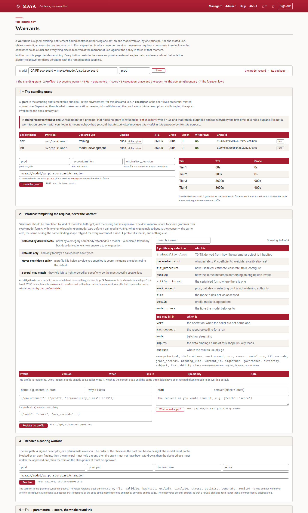

**Manage → Who may run what** for every standing grant across the estate,
soonest to lapse first.

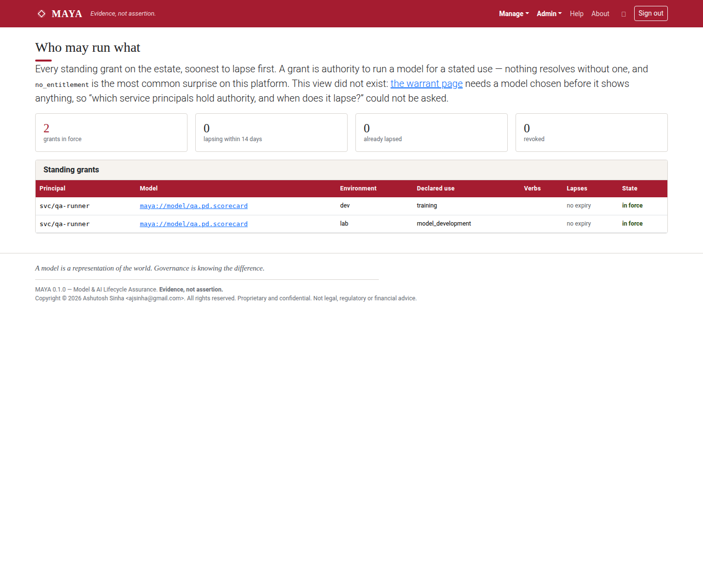

---

## 11. Doing it all again at a new version

### The model is attested, so it is immutable

```bash
curl -s -u $AUTH -X POST $API/models/qa.pd.scorecard/versions \
  -H 'content-type: application/json' -d '{"semver":"3.0.0", "kernel": { … }}'
```

**Expected:**

```json
{"error":"registry_refused",
 "detail":"cannot add a version to maya://model/qa.pd.scorecard: this model is
           attested and therefore immutable; open an amendment to change it"}
```

### Open an amendment first

```bash
curl -s -u $AUTH -X POST $API/models/qa.pd.scorecard/amend \
  -H 'content-type: application/json' -d '{
  "reason": "add a version with a third regressor",
  "scope": ["version"]}'
```

This needs `model:amend` — `admin` and `model_owner` have it;
`model_risk_manager` does not.

### Then the whole sequence again

1. Add the new version (section 4)
2. Approve it — **by somebody who did not create it** (section 8)
3. New featureset version if the inputs changed (section 6)
4. New fit warrant, new training set, new parameters (section 9)
5. New execution warrant, pinned to `@3.0.0` (section 10)

### Versions are independent

Each version has its own approval, its own parameter sets and its own warrants.
`@1.0.0` and `@2.0.0` can both be resolvable at once, with different
coefficients, and an alias decides which one production gets:

```bash
# PUT, not POST — and NOT by whoever created the version
curl -s -u s.iqbal:mrm-password-long \
  -X PUT $API/models/qa.pd.scorecard/aliases \
  -H 'content-type: application/json' -d '{
  "environment":"prod","alias":"champion","semver":"2.0.0",
  "justification":"the three-regressor fit backtests better"}'
```

Every alias move is recorded with who moved it and why. Promoting a version you
created is refused — *"the person who created a version may not promote it into
an environment"* — for the same reason you cannot approve your own work.

---

## 12. Watching what the server does — the live log

**Do this early and leave it open in a second tab.** Every other section of this
document is easier with it: when something refuses and you cannot tell why, the
answer is usually in the six lines around the refusal.

**Admin → Live log**, or `/admin/logs` directly.

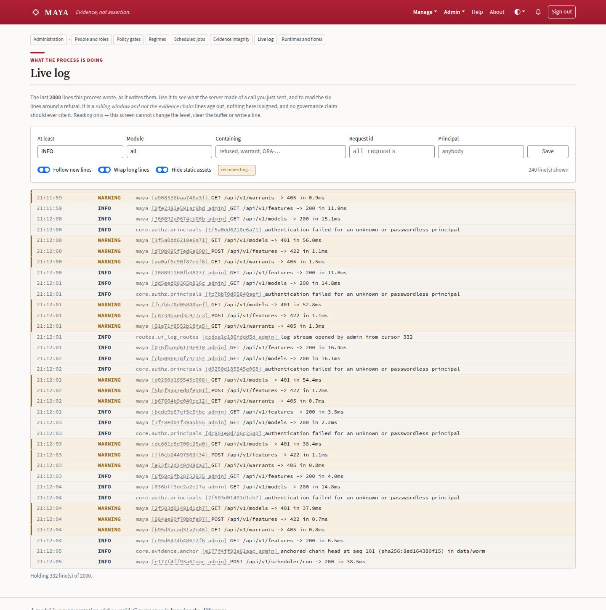

It shows the last 2,000 lines this process wrote, as it writes them. It is a
**rolling window and not the evidence chain** — lines age out, nothing here is
signed, and nothing here should ever be quoted as a governance record. Use it
to diagnose; use `/api/v1/evidence` to cite.

### The one thing that makes it useful

Every response MAYA sends carries a **request id**, and every log line written
while serving that request carries the same id. So:

1. make the call that misbehaved;
2. find its line in the log;
3. **click the request id** — the view narrows to that one request, in order,
   across every module that touched it.

You can also paste an id from a response header:

```bash
curl -s -D- -u $AUTH $API/models -o /dev/null | grep -i x-request-id
```

### Who currently holds authority to run what

Not part of the log, but the other thing a tester reaches for and could not
get before: the estate-wide list of standing warrant grants.

```bash
# every grant you may see, soonest to lapse first
curl -s -u $AUTH "$API/warrants" | jq '.warrants[] | {model_urn, principal, environment, lapses_in_days, revoked}'

# only what is actually in force
curl -s -u $AUTH "$API/warrants?live=true" | jq .count

# one model, one environment, one principal
curl -s -u $AUTH "$API/warrants?model=maya://model/qa.pd.scorecard&environment=prod"
```

The screen is **Manage → Who may run what** (`/warrants/estate`), and it reads
the same call — so if the two ever disagree about who may run what, that is
worth reporting.

### The controls

| Control | What it does |
|---|---|
| **At least** | the level and everything louder — `WARNING` includes `ERROR` |
| **Module** | one subsystem: `core.execution`, `core.features`, `routes` … |
| **Containing** | free text, matched against the module, the message and any traceback |
| **Request id** | one request, end to end |
| **Principal** | everything one person or service did |
| **Follow new lines** | sticks to the bottom; scrolling up turns it off, scrolling back down turns it on |
| **Hide static assets** | on by default — one page load is thirty stylesheet and font lines |
| **Save** | the current view as a text file, to attach to a defect |

Filters run on the **server**, so narrowing does not throw away lines the
browser would then be unable to get back.

### From a script

```bash
# the window as JSON; `cursor` is where to ask from next time
curl -s -u $AUTH "$API/logs?level=WARNING&limit=50" | jq '.lines[] | .message'

# everything one request did
curl -s -u $AUTH "$API/logs?request_id=ad274890ec7fcf69" | jq -r '.lines[].message'

# follow it, exactly as the page does
curl -s -N -u $AUTH "$API/logs/stream?level=WARNING"

# as a text file, for attaching to a defect report
curl -s -u $AUTH "$API/logs/download?contains=refused" -o refusals.txt
```

### What to check while you are here

- **The window is honest about gaps.** If lines aged out between two reads, the
  page says so in a banner rather than showing a continuous stream that is not
  one. Worth provoking: set the level to `DEBUG`, generate traffic, and watch.
- **Nothing that names itself a credential appears.** `password:`, `api_key=`,
  `Authorization: Bearer …` are blanked on the way into the buffer, so the
  stream, the JSON and the download all agree. **If you ever see a live secret
  on this page, that is a defect — report it with the exact line.**
- **It cannot change anything.** There is no control here that sets the level,
  clears the buffer or writes a line, and every endpoint under `/api/v1/logs`
  is a `GET`. A screen that could quieten the log could hide what it shows you.
- **It needs `log:read`.** `admin`, `operator` and `auditor` hold it; a
  `model_developer` does not, and should get the same refusal from both the
  page and the API.

```bash
# should be 403, from both doors
curl -s -o /dev/null -w '%{http_code}\n' -u d.raman:dev-pw-long-enough $API/logs
```

---

## When something is refused

**A refusal is not a bug.** MAYA's design is that a control which permits what
it should refuse is worse than one that refuses too much. Every refusal has the
same shape:

```json
{"error": "a_short_code",
 "detail": "what happened, in a sentence",
 "remediation": "what to do about it"}
```

**Read the `remediation` first.** It names the act that gets you unstuck.

### The ones you are most likely to meet

| Code | What it means |
|---|---|
| `forbidden` | your role does not carry that permission |
| `segregation_of_duties` | you did an earlier step, so you may not do this one |
| `incompatible_roles` / `incompatible_permissions` | one person would hold both halves of a separated duty |
| `restricted` | the version is not approved in that environment |
| `no_entitlement` | no standing grant for that principal, use and environment |
| `no_approved_parameters` | the model needs coefficients and none are approved |
| `schema_not_satisfied` | the featureset does not supply what the kernel reads |
| `registry_refused` | a lifecycle rule — usually "this is attested and immutable" |
| `still_referenced` | something points at what you tried to delete |
| `csrf_token_invalid` | reload the page (browser), or use HTTP Basic (scripts) |

### If you are stuck

```bash
curl -s -u $AUTH $API/policies      # the rules in force
curl -s -u $AUTH $API/roles         # every role and what it grants
curl -s -u $AUTH $API/me            # what you can do right now
```

And **Help** in the top bar has the same material as a set of pages.

---

## What to report

Anything where:

- a **success message does not correspond to anything** — a count that says
  work happened when it didn't, a "verified" that verified nothing;
- a **refusal names an act that does not exist**, or points at the wrong object;
- a **screen offers a control that then refuses**, or hides one you hold the
  permission for;
- the **UI and the API disagree** about the same question;
- anything **500s**.

Include the exact command or the page URL, what you expected, and what you got.
MAYA logs a request id on every response — quoting it makes the trace findable.
Better still: open **Admin → Live log**, click that request id, and attach the
saved text file to the report. See [section 12](#12-watching-what-the-server-does--the-live-log).
