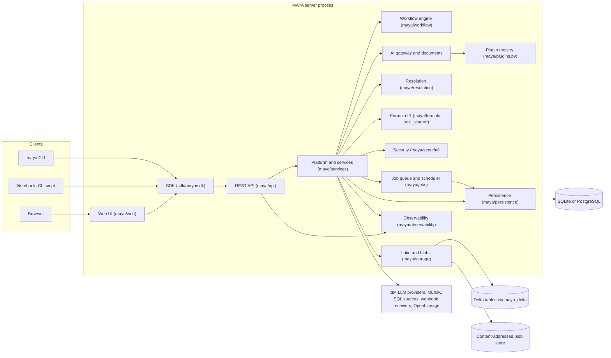
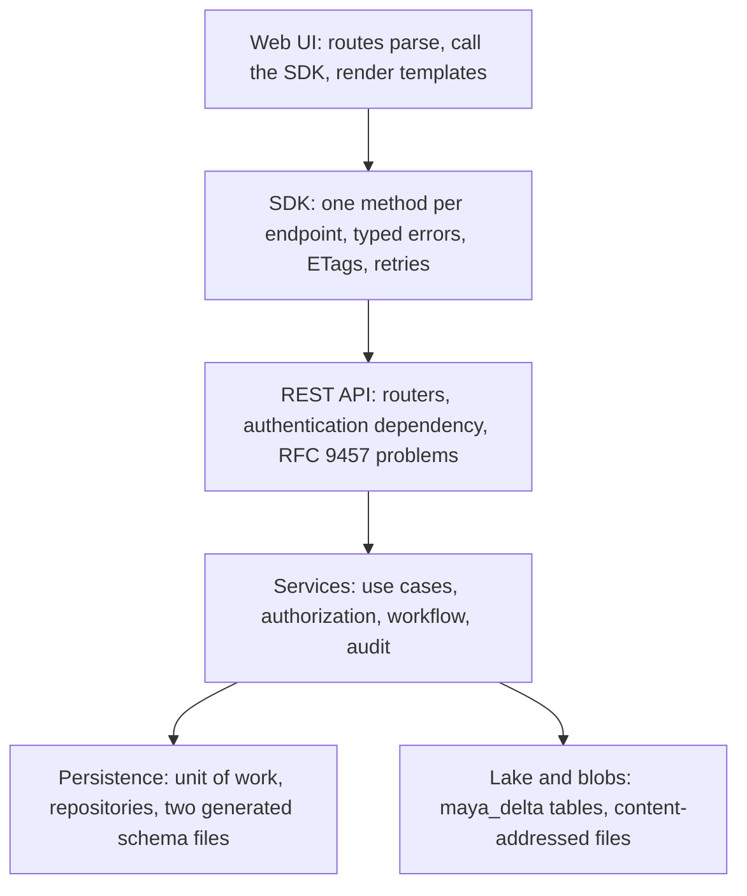
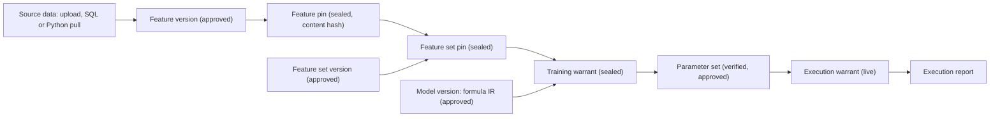
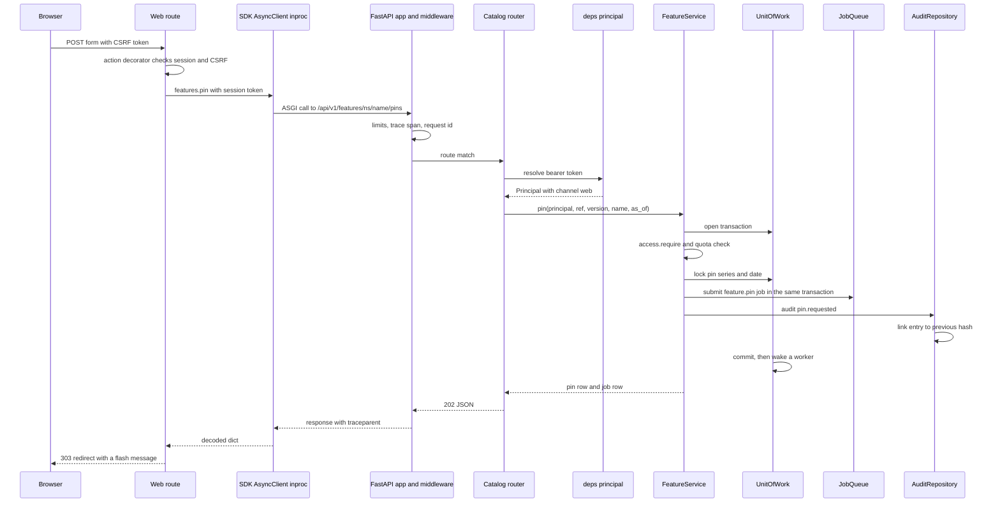

# How MAYA fits together

This section is for someone about to change MAYA's code, or review a change to it, who needs to know how the parts are built and where each responsibility lives before reading a module. It explains internals — control flow, data flow, module boundaries and the reasons behind them. The rules a user follows (what a definition may contain, which role may approve what, every setting) are not repeated here; each page links to the guide or specification section that owns them.

Read this page first. It gives the map, the layering, one walk through the governed chain and one request's life. Then read the component page for whatever you are about to touch.

## The system map

MAYA is one Python process (or several sharing one PostgreSQL database) serving a FastAPI application. The web UI is mounted in the same ASGI application as the REST API, but it is an ordinary SDK client: it reaches the API through the SDK's in-process transport, holding the signed-in user's session token, and has no other way in. Below the API, a single `Platform` object holds every service, the job queue, the workflow engine, the database and the lake.

Two arrows are missing on purpose. Nothing goes from the web UI to the services directly, and nothing outside `maya/persistence` touches the database driver. Both are enforced by `tools/ci/import_boundaries.py`, which fails the build when `maya.web` imports anything but `maya.sdk` (plus the version and error modules the SDK itself re-exports), or when any module outside `maya.persistence` imports SQLAlchemy.

## The layering

Each layer may call the one below it and nothing further down. The rule is the reason the UI cannot grow a privileged path, and the reason the database dialect is invisible above one package.

| Layer | Owns | Does not own |
|---|---|---|
| Web UI | Pages, forms, CSRF, flash messages, the help system | Any decision: every rule is enforced below the API |
| SDK | The wire: paths, headers, retries, conditional requests, error mapping | State, beyond an ETag cache and a pin cache that verifies by hash |
| REST API | HTTP: routing, the principal, problem documents, response encoding | Business rules; a router calls one service method and returns |
| Services | Every rule: authorization, workflow, refusals, audit entries | SQL; they speak to repositories through a unit of work |
| Persistence | Transactions, the audit hash chain, schema identity | Anything a user would recognise as a rule |
| Lake and blobs | Bytes by content hash | Which bytes a person may see |

The resolution package and the formula package sit beside the services as pure computation: they take frames or IR documents and return frames or IR documents, with no I/O. `maya/resolution/__init__.py` says so in one sentence, and that is why both can be tested without a database.

## One walk through the governed chain

MAYA is a register. It does not train, run, serve or deploy models. What it governs is the chain of custody from source data to a reported execution, and every link in that chain is a row that names the one before it by hash. The walk below follows one value from a CSV file to a run report, naming the code that handles each step. The user-facing rules for each step are in the guides linked at the end of each paragraph.

1. **Source data.** An upload or a pull lands in the feature's bitemporal ingest log, a Delta table under `raw/<namespace>/<name>/<schema generation>` in the lake, every row stamped with a `_knowledge_time`. A restatement is a later append, never an overwrite. `FeatureService.ingest` and `SourceService.pull` both end in `LakeStore.append_raw`; if the new rows overlap old keys, the ingest's own transaction queues a restatement assessment. See [lake-and-storage.md](lake-and-storage.md) and [integrations.md](integrations.md); rules in the [data and lake guide](../../maya/web/guides/data-and-lake-guide.md).
2. **Feature.** A feature version is a definition: index, schema, resolution rules, transforms, quality contract. It moves through the workflow engine (`draft → in_review → approved`), and in the seeded policy `definition_valid` runs on submission and `quality_passes` on approval. See [workflow.md](workflow.md).
3. **Pin.** Pinning an approved version queues a `feature.pin` job. The job resolves the version as of a knowledge time (`FeatureData.resolve_definition` → `maya.resolution.resolver.resolve_feature`), runs the quality contract, writes only the fragments the lake does not already hold, re-reads and re-hashes them, and only then seals the row. See [resolution.md](resolution.md) and [lake-and-storage.md](lake-and-storage.md).
4. **Feature set.** A feature set version maps attributes onto member features. Pinning it refuses unless every member is pinned; with `cascade` the job pins the unpinned members under the same name and date, and rolls every one of them back if any fails. See [resolution.md](resolution.md).
5. **Model.** A model version holds a formula IR — parsed from text, lifted from Python or a spreadsheet, or a declared black box — whose hash, with the artifact hash and input contract, is the version's definition hash. See [formula.md](formula.md).
6. **Training warrant.** Drawing one up checks that the model version is approved, validates its input contract against the feature set, issues a signed leakage certificate, and fixes the escrowed holdout by content hash. Downloading data under it records the checksum MAYA issued. See [warrants-and-custody.md](warrants-and-custody.md).
7. **Parameters.** A parameter upload names the checksum it trained on; a checksum MAYA never issued marks the set `unverified_data`. The set is approved through its own workflow policy.
8. **Execution warrant.** Binds the model version and the approved parameter set to environments, covenants, limits and an expiry. Once approved and sealed it is *live*, and every check against it fails closed when it is not.
9. **Execution report.** Whatever runs the model — never MAYA, except for blind scoring and attested batch scoring — reports back. `ExecutionService.report` evaluates the covenants on each report, and a breach suspends the warrant in the same transaction. See [governance.md](governance.md).

Every step above writes an audit entry, and every audit entry is linked into one SHA-256 hash chain inside the same transaction as the change it records. That chain, and the lineage edges written beside it, are what make the walk reproducible after the fact. See [services.md](services.md) and [persistence.md](persistence.md).

## One request's life

The sequence below is a person clicking *Pin* on a feature page. It is the path every web action takes, so it is worth reading once in full.

What makes this path worth knowing:

- **The UI has no privileged path.** `maya.web.routes.common.client` builds `AsyncClient(app=request.app, token=request.session.get("token"), channel="web")`. The call crosses the whole API — limits, tracing, the authentication dependency, the router — and only skips the socket. A rule enforced in a service is enforced for the browser, the CLI and a notebook alike. See [web-ui.md](web-ui.md) and [sdk.md](sdk.md).
- **The principal is resolved once per request** by `maya.api.deps.principal`, from the bearer token. The web tier's calls are marked `channel: web`, which the audit entry records. See [api.md](api.md) and [security.md](security.md).
- **The service owns the transaction.** `with self.p.uow(p.username) as uow:` opens one transaction; the pin row, the job row and the audit entry commit together or not at all, so a job can never exist for a pin that rolled back. On SQLite the unit of work also holds the process-wide write mutex. See [persistence.md](persistence.md).
- **Work that takes time is a job.** The request returns `202` with the job; a worker claims it later and runs the pin saga. See [jobs-and-scheduler.md](jobs-and-scheduler.md).
- **Errors travel typed.** A refusal raised in the service is a `MayaError` subclass; the API renders it as an RFC 9457 problem document; the SDK maps its `type` back onto the same class; the web `action` decorator turns it into a flash message on the previous page.

## Processes and roles

`Platform.build(settings, role=...)` produces one of three shapes. The *primary* process (`run_maya_web.py`) creates and verifies the schema, seeds, reaps jobs a dead process left running, and runs the job workers, the webhook dispatcher and the scheduler. Extra *web* processes (`server.workers` above 1, which requires PostgreSQL) serve requests over the database the primary prepared. A *worker* process (`run_maya_web.py --worker`) runs the job queue only, with no HTTP server. The reasons for each split are in the docstring of `Platform.build`, and in [ADR-022](../design/adr/ADR-022-several-web-processes-need-postgresql.md). See [services.md](services.md) and [jobs-and-scheduler.md](jobs-and-scheduler.md).

## Component index

| Page | What it explains | Code |
|---|---|---|
| [web-ui.md](web-ui.md) | Server-rendered pages, the SDK-only rule, the in-process transport, help | `maya/web` |
| [api.md](api.md) | The FastAPI app, routers, dependencies, problems, ETags, paging, idempotency, the OpenAPI snapshot | `maya/api` |
| [sdk.md](sdk.md) | The standalone `maya-sdk` project: transports, the `@endpoint` registry, handles, record and replay, offline bundles, `_shared` | `sdk/maya/sdk` |
| [services.md](services.md) | The `Platform`, service wiring, how services call each other, the unit of work boundary, the audit chain, events | `maya/services/platform.py`, `maya/services/registry.py` |
| [persistence.md](persistence.md) | Models, repositories, the unit of work, the two generated schema files, no migrations, purge, SQLite and PostgreSQL | `maya/persistence` |
| [lake-and-storage.md](lake-and-storage.md) | `LakeStore`, `maya_delta`, blobs, fragments and content addressing, the pin saga, maintenance | `maya/storage`, `maya_delta` |
| [resolution.md](resolution.md) | Bitemporal resolution, as-of, rules, feature set alignment, cascade pins | `maya/resolution`, `maya/services/feature_data.py`, `maya/services/featuresets.py` |
| [formula.md](formula.md) | The formula IR, evaluator, composites, codegen, lifting from LaTeX, Python and spreadsheets | `sdk/maya/sdk/_shared`, `maya/formula` |
| [workflow.md](workflow.md) | The engine, policies, checks, separation of duties, delegation, escalation, the challenger hook | `maya/workflow`, `maya/services/workflow_service.py` |
| [warrants-and-custody.md](warrants-and-custody.md) | Training and execution warrants, parameter sets, the leakage certificate, blind scoring, covenants, bundles, custody | `maya/services/warrants.py`, `execution.py`, `bundle.py`, `custody.py` |
| [jobs-and-scheduler.md](jobs-and-scheduler.md) | The database-backed queue, workers, fairness, backpressure, the scheduler's sweeps | `maya/jobs` |
| [security.md](security.md) | Authentication, SSO, MFA and WebAuthn, the authorization function, API keys, the sandbox, signing | `maya/security`, `maya/services/auth.py`, `access.py` |
| [observability.md](observability.md) | Metrics, tracing, logs, health, governance gauges, alert rules and dashboards | `maya/observability`, `config/prometheus`, `config/grafana` |
| [ai-and-documents.md](ai-and-documents.md) | The AI gateway, model profiles, provider plugins, document generation, the assistant, LLM applications | `maya/services/ai.py`, `maya/llm`, `maya/documents`, `maya/assistant`, `maya/services/llm.py` |
| [governance.md](governance.md) | Tiering, periodic review and the sweep, findings, monitoring, champion and challenger, restatements, evidence, batch scoring | `maya/services/governance.py` and its neighbours |
| [integrations.md](integrations.md) | SQL and Python sources, MLflow and SageMaker import, OpenLineage, webhooks and events out | `maya/services/sources.py`, `integrations.py`, `webhooks.py`, `maya/persistence/external.py` |
| [plugins.md](plugins.md) | The extension-point registry, built-ins, discovery, the allowlist | `maya/plugins.py`, `maya/notifiers.py` |

The developer guide ([../developer/README.md](../developer/README.md)) is the practical companion: how to add a source connector, a provider, a check or an endpoint, and which gates will hold you to it.

## What this section does not do

It does not restate the specification. Requirements and their rationale are in [MAYA_Requirements_and_Design.md](../design/MAYA_Requirements_and_Design.md); the decisions that shaped the code, with their costs, are in the [ADRs](../design/adr/README.md). It does not describe operating MAYA — that is the [operations guide](../../maya/web/guides/operations-guide.md) and the [runbooks](../operations/runbooks/README.md). And it describes the code as it is: where a module's own docstring and its behaviour disagree, the page says which, rather than choosing the comfortable one.
