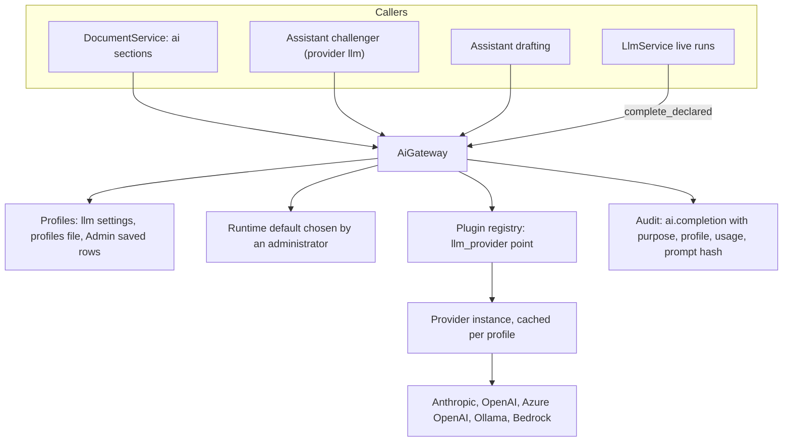
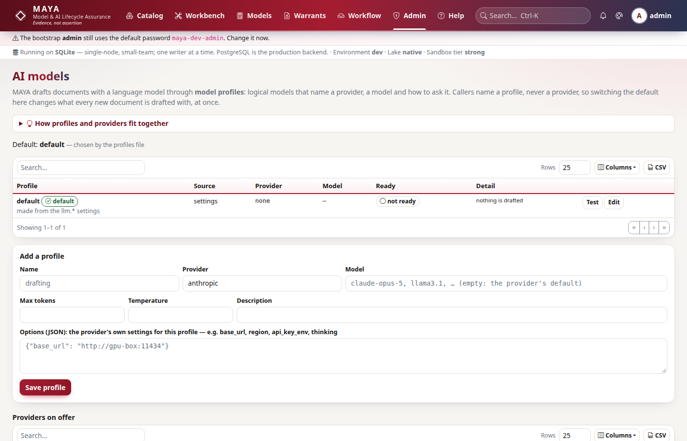
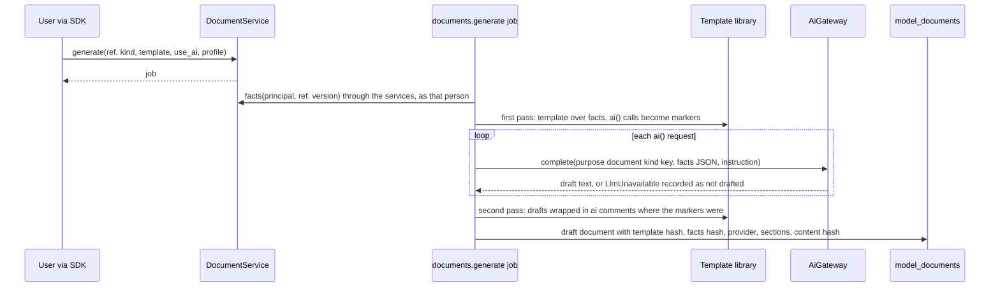
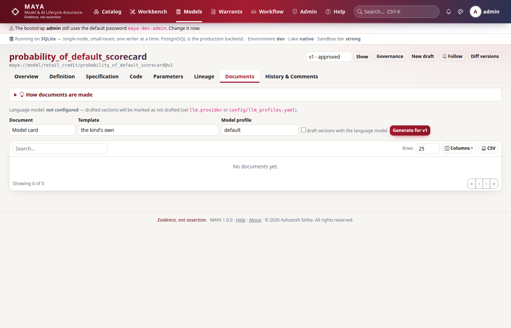
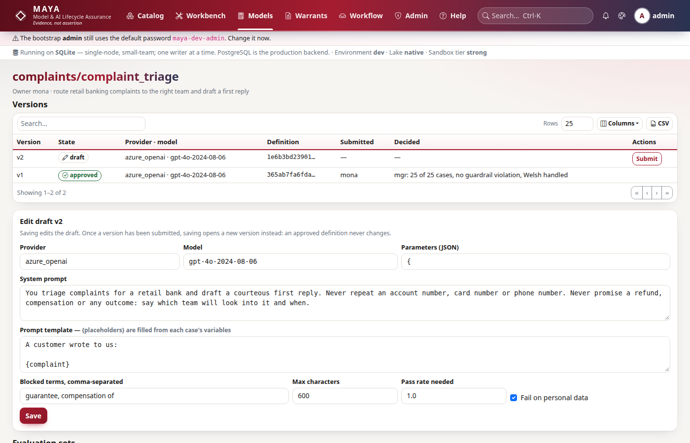

# AI gateway and documents

MAYA uses language models in four places — drafting sections of model documents, writing the recorded challenger's memo on a review, proposing a feature definition or specification text, and running the live evaluations of a governed LLM application — and every one of those calls goes through one gateway. Callers name a *model profile*, never a provider; the gateway resolves the profile to a provider plugin, makes the call, and records it in the audit log. What comes back is always a draft or an observation: nothing in this part of MAYA approves, blocks or edits anything. This page explains how the gateway, profiles and providers are built, how a document is generated from facts and then drafted, how the challenger and the drafting assistant are bounded, and how LLM applications are governed.

The user-facing account — generating and approving documents, templates, profiles and switching the default, what is sent to a provider, the challenger memo, and the whole lifecycle of LLM applications — is in the [documents and AI reference](../../maya/web/guides/documents-and-ai-reference.md) and the [LLM applications reference](../../maya/web/guides/llm-apps-reference.md); operating providers is in the [ai-gateway runbook](../operations/runbooks/ai-gateway.md). This page does not repeat them.

| Module | What it does |
|---|---|
| `maya/services/ai.py` | `AiGateway`: profiles (settings, file, database), the runtime default, provider construction from the plugin registry, `complete`, `complete_declared`, audit and metrics |
| `maya/llm/profiles.py` | `Profile`, loading the profiles file and the implicit `default` profile from `llm.*`, the settings view a provider reads |
| `maya/llm/base.py` | `Message`, `Completion`, the `LlmProvider` protocol |
| `maya/llm/providers.py` | The built-in providers: `anthropic`, `openai` (and compatible servers), `azure_openai`, `ollama`, `bedrock`, `stub`, `none` |
| `maya/services/documents.py` | `DocumentService`: the facts snapshot, the `documents.generate` job, drafting, labels, approval, rendering to Markdown, HTML and PDF |
| `maya/documents/render.py`, `latex.py` | Templates, the two-pass render, Markdown to HTML and to LaTeX |
| `maya/services/assistant.py` | `AssistantService`: the recorded challenger's memos (queued on review, written by a job) and drafting |
| `maya/assistant/rules.py`, `claude.py`, `challenger.py`, `drafts.py` | Deterministic findings; the Anthropic-direct challenger; the gateway challenger; deterministic drafters |
| `maya/services/llm.py` | `LlmService`: LLM applications, versions sealed by a definition hash, evaluation sets, recorded and live runs, submission and decision |
| `maya/services/typesetting.py` | Where a LaTeX build's limits are decided, shared by documents and the specification PDF |

## Structure



## How it works

### Profiles, not providers

A profile names a provider, a model, sampling parameters and any provider option that profile needs differently (another base URL, region or key variable). Profiles come from three places, later ones winning a name clash: the `llm.*` settings (one implicit profile, `default`), the profiles file (`llm.profiles_file`, YAML), and profiles an administrator saved under **Admin → AI models**, stored in `llm_profiles`. The default is, in order, the administrator's runtime choice (a database row every process reads), `llm.profile`, then the file's `default:` line:

```python
# maya/services/ai.py
        with self.p.uow() as uow:
            for row in uow.repo("llm_profiles").list(order_by=["name"]):
                known[row["name"]] = prof.from_row(row)
        chosen = self._runtime_default()
        if chosen and chosen in known:
            return known, chosen, "an administrator (Admin → AI models)"
        return known, default, source
```

Because the choice is read from the database on each resolution, switching the default takes effect at once in every process without a restart. A template asks `ai("intended_use", "...", profile="local")`, or leaves the profile out; moving a deployment from one provider to another, or giving one kind of section a cheaper model, is a profile edit, never a template or code change. A profile's secrets are never stored: a saved profile's options naming a key, secret, password or token are refused unless the name ends in `_env` (naming the environment variable that holds it), and providers read keys from the environment at the moment of use.



### Providers are plugins

The gateway builds a provider by looking its name up at the `llm_provider` extension point — a built-in or an allowed third-party plugin — and calling its factory with a settings view that lays the profile's choices over the global settings:

```python
# maya/services/ai.py
    def _build(self, chosen: prof.Profile) -> Any:
        if self.override is not None:
            return self.override
        key = json.dumps(chosen.as_row() | {"options": chosen.options}, sort_keys=True, default=str)
        if key not in self._cache:
            plugin = self.p.plugins.get("llm_provider", chosen.provider)
            if plugin is None or plugin.factory is None:
                raise LlmUnavailable(
                    f"The provider '{chosen.provider}' is not registered or not an allowed plugin "
                    "(see Admin → AI models)"
                )
            self._cache[key] = plugin.factory(prof.ProfileSettings(self.p.settings, chosen))
        return self._cache[key]
```

The cache key is the whole profile, so editing a profile builds a fresh provider. The contract a provider implements is deliberately small — a system prompt and messages in, text and token counts out — and every failure (no key, no network, an unknown model) is raised as `LlmUnavailable` with a sentence a person can act on. `none` is the default provider: MAYA drafts nothing until someone chooses one, and documents still render with their AI sections marked as not drafted. `stub` answers deterministically for tests and offline demonstrations. This is currently the only extension point whose plugins MAYA actually calls at run time; see [plugins.md](plugins.md).

### Every call is recorded

`_ask` calls the provider, then writes `ai.completion` (or `ai.completion_failed`) to the audit log with the purpose, the profile, the provider and model, the token counts, the stop reason and the SHA-256 of the prompt — not the prompt itself, because it carries a model's facts, which the audit log's readers may not be allowed to see. It also counts completions by outcome, observes duration and adds tokens, with the purpose cut to its first two segments so a document's per-section purposes do not multiply series. `complete_declared` asks exactly the provider and model an approved LLM application version declares, bypassing the default — what is governed there is that pairing, so an administrator's switch must not change it.

### Documents: facts first, prose second



A document is built from a *snapshot* of what MAYA holds about one model version — its mathematics and contract, code checks, warrants, certificate, blind scores, fairness evidence, challengers, findings, reviews, covenants and monitoring — gathered through the same services and the same read permissions as every screen, as the person who asked. The snapshot (minus its generation time) is hashed and the hash stored with the document, so "which facts was this written from" has an answer. The template's hash and the content hash are stored too.

Templates are Jinja2 files producing Markdown (`<name>.md.j2`), looked up in `documents.template_dir` first and then among the built-ins, so a firm replaces the built-in model card by dropping a file of the same name. The render is two passes: the first renders the template over the facts with each `ai(key, instruction, words, profile)` leaving a marker and recording its request; the requests are drafted (or marked not drafted); the second pass puts each draft in place, wrapped in `<!--ai:key-->` comments. The label a reader sees on a drafted section — "drafted by …, not reviewed" or "reviewed by …" — is applied when the document is shown, from its state, so approving a document changes the label without changing the stored text. Approval is by someone other than the person who generated it. A conclusion such as "fit for use" is not a section a template can draft.

Rendering produces Markdown, HTML (raw HTML in drafted text neutralised) or PDF: the Markdown subset becomes a LaTeX article (`documents/latex.py`) built under the deployment's typesetting caps (`services/typesetting.py`), falling back to the draft renderer when the host cannot build it and saying so.



### The assistant: a recorded challenger and a drafter

When a feature, feature set or model version reaches `in_review`, the assistant's workflow listener queues a memo in the same transaction, so a memo exists only if the submission commits ([workflow.md](workflow.md)). An `assistant.challenge` job writes it: it builds a dossier (definitions, the specification text, the formula IR, never data rows), hashes it, runs the deterministic checks in `assistant/rules.py` (look-ahead, unbounded fills, placeholders, thin sections and the like), and — with `assistant.provider: llm` — asks the profile `assistant.profile` names through the gateway for a challenge in a fixed JSON schema (`challenger.py`; findings whose severity or category MAYA does not know are dropped, and a reply that is not JSON is recorded as a failure, leaving the deterministic findings). `assistant.provider: claude` asks Anthropic directly through its SDK (`claude.py`, the only module that imports it) with structured outputs. The dossier is the object under review, written by people who want it approved, so the system prompt treats it strictly as data; text in it that reads like an instruction is itself a finding.

The boundaries are structural rather than promised: memos live in their own table, nothing in the assistant updates a version or takes a transition, and no workflow check reads a memo. The reviewer records whether they agreed, and that is audited. Drafting (`assistant/drafts.py`) proposes a feature definition from a sample file and a sentence, or the specification sections an author has not written; each field says where it came from, and a draft goes through the same validation as a hand-written one — the worst an assistant can do is waste a minute.

### LLM applications

An LLM application is governed like a model whose "formula" is a provider, a model name, a system prompt, a prompt template, sampling parameters and guardrails. Every field that changes behaviour is sealed into a version's definition hash; editing is allowed only in draft, and any later change is a new version. An evaluation set is named cases — template variables and the checks the answer must pass — hashed as content. A run scores a version on a set, either *recorded* (answers produced elsewhere and submitted) or *live* (MAYA calls exactly the declared provider and model through `complete_declared`); checks are deterministic (`contains`, `regex`, `max_chars`, `json` and the like — no model grades another model), and guardrails (blocked terms, a length cap, personal-data patterns) run on every answer and fail the case whatever its checks said. A version can be submitted only with a run on its own definition hash, against its evaluation set in its current state, that meets its pass-rate threshold with no guardrail violation, and it is decided by someone who neither owns the application nor submitted it.



## Example

```python
# Generate a model card drafted under a named profile, wait, then read it as Markdown
job = my.documents.generate("retail_credit/probability_of_default_scorecard",
                            kind="model_card", use_ai=True, profile="drafting")
my.wait(job)                                  # generate returns the job row
docs = my.documents.list("retail_credit/probability_of_default_scorecard")
md = my.documents.render(docs[0]["id"], format="md")

# The gateway's state, and switching the default (administrators)
print(my.ai.status())
my.ai.set_default("local")
```

```yaml
# config/llm_profiles.yaml: two logical models; templates never name a provider
default: drafting
profiles:
  drafting:
    provider: anthropic
    model: claude-opus-5
    max_tokens: 2048
  local:
    provider: ollama
    model: llama3.1
    options: {base_url: http://gpu-box:11434}
```

## How it connects

- Providers are registered at the `llm_provider` point of the [plugin registry](plugins.md); allowed third-party providers load from entry points.
- Document generation and challenger memos are [jobs](jobs-and-scheduler.md); the challenger is a [workflow](workflow.md) listener.
- Facts are gathered through the [services](services.md) with the requester's permissions ([security.md](security.md)); PDFs are built under the same typesetting caps as specification documents ([formula.md](formula.md)).
- AI metrics and the `MayaAiProviderFailing` and `MayaAiTokenBudget` alerts are on [observability.md](observability.md).

Gates that protect it: the suites `tests/test_llm.py`, `tests/test_documents.py`, `tests/test_assistant.py`, `tests/test_assistant_drafts.py`, `tests/test_typeset.py`, `tests/test_typeset_text.py` and `tests/test_plugins.py`.

## What it does not do

No model output approves, blocks or edits anything; the gateway returns drafts and memos only. Prompts are not logged, only their hashes, so the audit log proves a call happened and with what, not what was said. Data rows are never sent by the challenger or drafter; document drafting sends the facts snapshot, which includes metrics and descriptions. Live LLM application runs execute synchronously inside the request, case by case, not as a job, so a large evaluation set on a slow provider can meet the request deadline. Document templates render in Jinja2's sandboxed environment, so a template in `documents.template_dir` can use the facts it is given but cannot walk to Python internals; writing to that directory is still a privilege, since a template decides what a document says. And the gateway calls no provider until one is configured: the default is `none`.

Extending it: adding a provider plugin is in the developer guide, [llm-providers.md](../developer/llm-providers.md); adding or replacing a document template is in [document-templates.md](../developer/document-templates.md).
