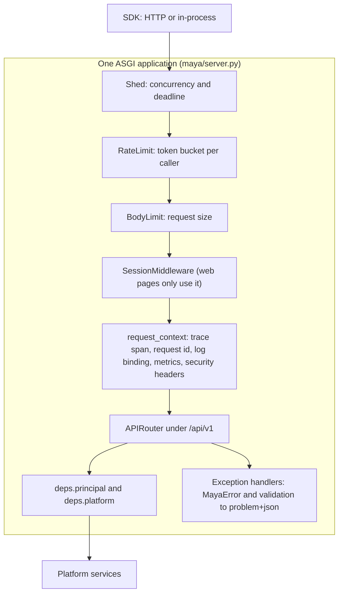
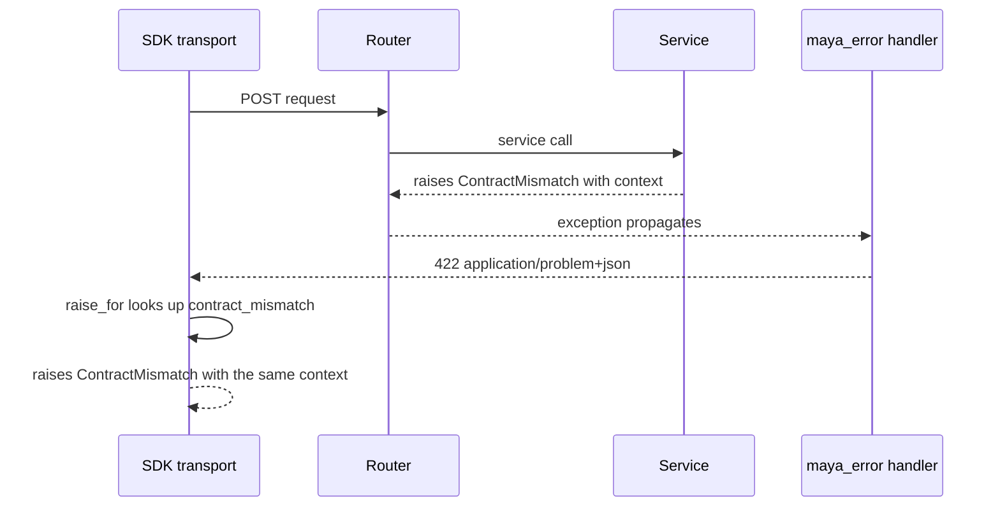

# REST API

The REST API is MAYA's only public surface: the web UI, the CLI, notebooks and CI all reach the platform through it, by way of the SDK. It is a FastAPI application versioned at `/api/v1`, whose routers are deliberately thin — each resolves the caller, calls one service method and encodes the answer — so that the rules live in one place, the services, and the API owns only HTTP. This page explains the application's construction, the request pipeline, error documents, conditional requests, paging and idempotency at the code level, and the snapshot that turns a contract change into a reviewed decision.

The endpoints themselves, and the conventions a caller follows, are documented for users in the [REST API guide](../reference/API_GUIDE.md) (also in Help as the [API guide](../../maya/web/guides/api-guide.md)). This page does not list them.

| Module | What it does |
|---|---|
| `maya/api/app.py` | `ROUTERS`, `create_api`, the exception handlers, the request-context middleware, `/healthz`, `/readyz`, `/metrics` |
| `maya/api/deps.py` | The `Me` and `Plat` dependencies, problem responses, ETags and `If-Match`, byte ranges, date parsing |
| `maya/api/limits.py` | Four ASGI layers: body size, rate, concurrency and deadline |
| `maya/api/routers/*.py` | One router per area: `admin`, `catalog`, `registry`, `workflow`, `workspaces`, `events`, `custody`, `identity`, `auth`, `assistant`, `retention`, `governance`, `integrations`, `ai`, `documents`, `llm` |
| `maya/api/schemas.py`, `schemas_governance.py` | Pydantic request bodies; the OpenAPI document is generated from them |
| `maya/services/paging.py` | Keyset paging with signed, query-bound cursors (used by routers, lives with the services) |
| `maya/server.py` | The composition root: API, then web UI, then limits, on one ASGI app |
| `tools/ci/openapi.lock.json` | The contract snapshot `tools/ci/api_snapshot.py` compares against |

## Structure



The limits are added last in `build_app` and Starlette wraps the last-added middleware outermost, so load shedding sees a request first and the body limit last, closest to the route.

## How it works

### One list of routers

Every router the public API mounts is named once:

```python
# maya/api/app.py
# Every router the public API mounts, in one place. The gates that read the OpenAPI
# document without a platform (SDK parity, the API snapshot) build their app from this
# tuple, so a router added here is inspected by them the day it arrives; when they kept
# their own copy of the list, a new router could pass every gate while being unreachable.
ROUTERS = (
    admin.router,
    catalog.router,
    registry.router,
# ...
    llm.router,
)
```

`create_api(platform)` builds the FastAPI object, stores the platform on `app.state`, mounts each router under `/api/v1`, installs the exception handlers and adds the three operational endpoints outside the prefix: `/healthz` (alive and version), `/readyz` (database reachable, lake root present, the seam report — `503` when not ready) and `/metrics` (Prometheus text, behind a bearer token when `observability.metrics.token_env` names one). See [observability.md](observability.md).

### A router is a translation, not a decision

A route resolves its two dependencies, parses what HTTP gives it into Python values and calls the service:

```python
# maya/api/routers/catalog.py
@router.post("/features/{namespace}/{name}/pins", tags=["features"], status_code=202)
def pin_feature(
    namespace: str,
    name: str,
    body: s.PinIn,
    me: Principal = Me,
    plat: Any = Plat,
    idempotency_key: str | None = Header(default=None),
) -> Response:
    return ok(
        plat.features.pin(
            me,
            ref_of("feature", namespace, name),
            version_no=body.version_no,
            pin_name=body.pin_name,
            as_of=parse_date(body.as_of, "as_of"),
            as_of_known=parse_instant(body.as_of_known, "as_of_known"),
            idempotency_key=idempotency_key,
        ),
        202,
    )
```

Routes are synchronous functions; FastAPI runs them in its thread pool, which is why the unit of work, not the middleware, binds the actor to log lines (see [observability.md](observability.md)). `ok()` encodes with MAYA's own JSON encoder (`maya.core.djson`) so dates, decimals and numpy values serialise the same way everywhere.

`Me` resolves the bearer credential through the auth service and, for the web, CLI and SDK, records which channel the call came from:

```python
# maya/api/deps.py
def principal(
    request: Request,
    authorization: str | None = Header(default=None),
    x_maya_channel: str | None = Header(default=None),
) -> Principal:
    """Resolve the bearer credential; the web tier marks its calls ``channel: web``."""
    token = None
    if authorization and authorization.lower().startswith("bearer "):
        token = authorization[7:].strip()
    ip = request.client.host if request.client else None
    p = request.app.state.platform.auth.principal(token, ip=ip, path=request.url.path)
    if x_maya_channel in ("web", "cli", "sdk"):
        p.channel = x_maya_channel
    return p
```

What the principal carries and how it is built (sessions, API keys, the two-second cache) is on [security.md](security.md).

### Errors as RFC 9457 problem documents

Every deliberate refusal in MAYA is a `MayaError` subclass with a stable `code` and an HTTP `status`. The class hierarchy lives in `sdk/maya/sdk/_shared/errors.py`, shared byte for byte with the SDK (`maya.core.errors` is an alias of it), so the server and the client agree on the classes by construction:

```python
# sdk/maya/sdk/_shared/errors.py
    def to_problem(self) -> dict[str, Any]:
        """RFC 9457 problem-detail body."""
        return {
            "type": self.code,
            "title": type(self).__name__,
            "status": self.status,
            "detail": self.message,
            "context": self.context,
        }
```

`install_handlers` registers one handler for `MayaError` (rendering `to_problem()` as `application/problem+json`) and one for Pydantic's `RequestValidationError` (rendered as `validation_failed`, 422, with each failing field named). An exception that is not a `MayaError` is a bug and surfaces as FastAPI's 500. The SDK closes the loop in `raise_for`: it looks the `type` up in `ERRORS_BY_CODE` and raises the same class with the same context, so a caller writes `except ContractMismatch:` rather than parsing a message. The `context` dictionary is where a refusal's machine-readable detail travels — the failing checks, the rule that denied, the limit that was hit.



The limits layer writes its own problem documents (`payload_too_large` 413, `rate_limited` 429, `overloaded` 503, `request_timeout` 504); their `type` codes are not in `ERRORS_BY_CODE`, so the SDK raises the base `MayaError` for them, carrying the status. An SDK older than `MIN_CLIENT` is answered by the request-context middleware with the shared `ClientTooOld` error (426, `client_too_old`), which the SDK raises as that class.

### The request-context middleware

For every HTTP request the middleware opens a trace span (continuing the caller's `traceparent` if one was sent), sets `request.state.request_id` (the caller's `X-Request-Id` or the trace id), binds the request id, path and channel into the logging context, counts the request and its duration under the matched route template, and sets the security headers — `X-Frame-Options: DENY`, `nosniff`, `same-origin` referrer policy and a `script-src 'self'` content security policy on everything except the interactive docs. It returns `traceparent` on the response, so a client can quote the trace when reporting a problem.

### Conditional requests: ETags and If-Match

A read's validator is the hash of the bytes served, not a row version:

```python
# maya/api/deps.py
def etag(body: str | bytes) -> str:
    """A read's validator: the hash of the bytes served.

    A row version would be cheaper and would be wrong, because a read is more than its
    row. A feature's payload carries its grants, its pins, the transitions open to *this*
    caller and the owner's name — none of which bump the feature's own version column, and
    all of which a caller who was told 304 would then be holding stale. The body is the one
    thing that cannot be stale about itself.
    """
```

`ok_if_changed(data, if_none_match)` serialises the answer, computes its tag and returns `304` with no body when the caller already holds it. The server still resolves the read — what a 304 saves is the payload, which matters for a scheduler polling a large listing. `require_match(if_match, current)` guards writes to an open draft: the router reads the object again, hashes it the same way, and refuses with the ordinary `ConflictError` if the caller's tag no longer matches. Only drafts are guarded, because only a draft has two writers who can lose each other's work; sealed objects are refused outright rather than merged. The SDK sends both headers itself (see [sdk.md](sdk.md)).

Downloads advertise `Accept-Ranges`, honour a single `Range` (`byte_range` in `deps.py`) and use `If-Range` with the ETag, so an interrupted download resumes against the same bytes or starts again — never stitched onto a different object.

### Paging

Lists that can grow use keyset pages, built in `maya/services/paging.py`. A route builds a `Listing` (table, offered sorts, filters, search, a per-row `keep` for authorization and an `enrich` for presentation) and `run_page` walks it in one unit of work. The pager reads rows in sort-column-then-primary-key order, drops the rows `keep` refuses, and stops at one row more than the page, which is how it knows a next page exists without counting.

The cursor is opaque, signed with a key derived from the session secret, and bound to the query it was issued for:

```python
# maya/services/paging.py
    def encode(self, shape: str, key: tuple[Any, Any]) -> str:
        payload = _b64(
            json.dumps(
                {"h": shape, "k": [_enc(key[0]), _enc(key[1])]}, separators=(",", ":")
            ).encode()
        )
        return f"{payload}.{self._sign(payload)}"
```

`shape` is a digest of the table, sort, filters, authorization scope and search. A tampered cursor, or one replayed against a different query, is refused as `InvalidCursor` (400) rather than silently answering some other page. Authorization filtering before the page is cut means a page never contains a row the caller may not read and never comes back short because of one.

### Idempotency

A retried write must not do the work twice. MAYA handles this where the work becomes durable — the job queue — rather than with a generic response cache. A pin route passes the `Idempotency-Key` header to the service, the service passes it to `JobQueue.submit`, and `submit` takes a named lock on the key and returns the existing job when the same key arrives with the same parameters (a different parameter hash under the same key is a `ConflictError`):

```python
# maya/jobs/queue.py
        if idempotency_key:
            # concurrent submitters of one key queue here; the second then finds the first
            uow.lock(f"job:idempotency:{idempotency_key}")
            existing = uow.repo("jobs").find_one(idempotency_key=idempotency_key)
            if existing:
                if existing["params_hash"] != params_hash:
                    raise ConflictError(
                        "Idempotency key reused with different parameters", key=idempotency_key
                    )
                return existing
```

The pin services add one step before that: a retried pin finds its own pin row already present (the series-and-date clash that would otherwise be a conflict), and `catalog.replayed_pin` returns the original pin and job, marked `replayed`, when the job carries the same key. A *different* key asking for the same series and date is a genuine clash and is refused. The SDK retries only methods that are idempotent by nature (`GET`, `PUT`, `DELETE`) or that carry an `Idempotency-Key`.

### Limits

`maya/api/limits.py` wraps the whole application, so it applies to the web pages as well as the API. Each limit is counted per process. The web tier's in-process SDK calls pass through the same stack but are counted as part of the page that made them: the concurrency layer sets a context variable (`NESTING`) when it admits a request, and an inner call made from that request's task sees it, takes no slot of its own, spends no rate token and runs under the page's deadline. A context variable is seen only by calls made from the admitting task, so no outside caller can claim to be inside a request.

### The OpenAPI snapshot

`tools/ci/api_snapshot.py` builds the application from `ROUTERS` without a platform, projects the generated OpenAPI document onto the contract alone — parameters, request and response bodies, schema fields, types, required lists — and compares it with `tools/ci/openapi.lock.json`. Descriptions and titles are left out, so rewording a docstring changes nothing; changing what a client sends or receives fails the gate and names the difference. Accepting the change is `python tools/ci/api_snapshot.py --update`, and the lock file's diff is reviewed with the code. `tools/ci/sdk_parity.py` reads the same generated document and fails when an endpoint has no SDK method or an SDK method names no endpoint.

## Example

A pin that is safe to retry, then a conditional read:

```bash
# Request a pin; retrying with the same key returns the same pin and job
curl -s -X POST "https://maya.example.com/api/v1/features/bureau/applications/pins" \
  -H "Authorization: Bearer $MAYA_API_KEY" \
  -H "Idempotency-Key: pin-applications-fy2025" \
  -H "Content-Type: application/json" \
  -d '{"version_no": 1, "pin_name": "fy2025", "as_of": "2025-12-31"}'

# Read the feature, then ask again with its ETag: 304 and no body if nothing changed
curl -si "https://maya.example.com/api/v1/features/bureau/applications" \
  -H "Authorization: Bearer $MAYA_API_KEY" | grep -i '^etag'
curl -si "https://maya.example.com/api/v1/features/bureau/applications" \
  -H "Authorization: Bearer $MAYA_API_KEY" -H 'If-None-Match: "<etag from above>"'
```

## How it connects

- Clients reach it only through the [SDK](sdk.md); the [web UI](web-ui.md) is one of those clients.
- Every route calls a service on the [Platform](services.md); the principal comes from [security](security.md).
- Long work returns `202` and a job from the [job queue](jobs-and-scheduler.md).
- Its request metrics, trace spans and health endpoints are described on [observability.md](observability.md).

Gates that protect it: `tools/ci/api_snapshot.py` (contract snapshot), `tools/ci/sdk_parity.py` (one SDK method per endpoint), `tools/ci/ui_parity.py`, `tools/ci/module_symbols.py` (a router module over 60 public symbols must split), and the suites `tests/test_api_contract.py`, `tests/test_api_and_gates.py`, `tests/test_paging.py`, `tests/test_conditional_reads_and_resume.py`, `tests/test_limits.py` and `tests/test_api_guide.py`.

## What it does not do

It holds no business rule: a router that grew an `if` about who may do what would be a defect. It keeps no response cache for idempotency — only job submission and pin requests deduplicate, which is where duplication would cost something. Its limits are per process, not shared across processes, because a shared counter would need a shared store MAYA does not require. And it does not version beyond `/api/v1`: a contract change is gated and reviewed, not forked.

Extending it: adding an endpoint, its schema, its SDK method and its snapshot entry is in the developer guide, [api-endpoints.md](../developer/api-endpoints.md).
