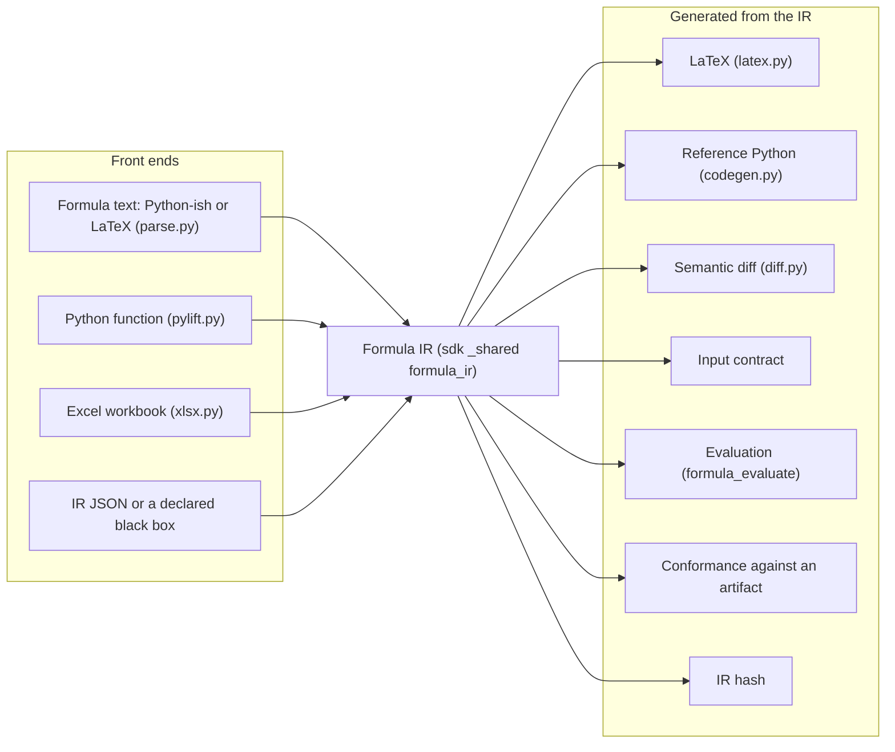
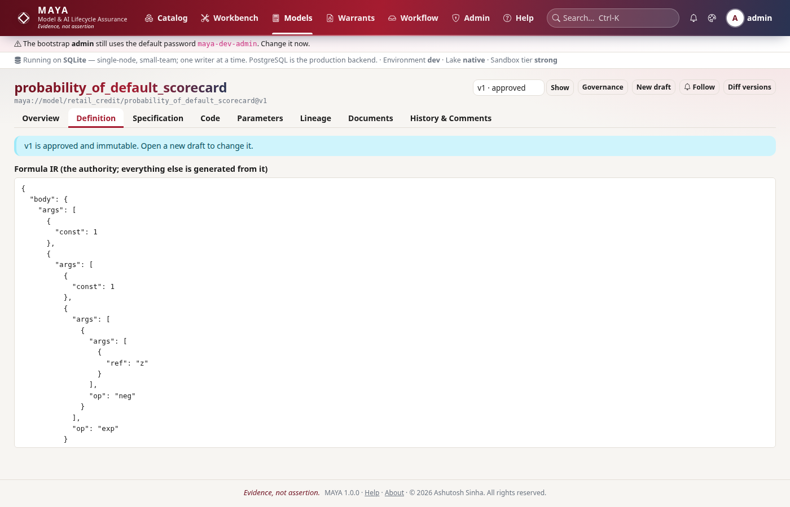
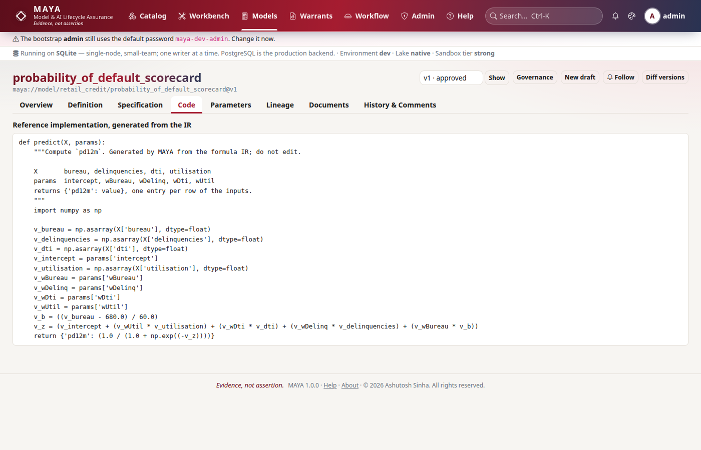

# The formula IR

A model's mathematics is held in MAYA as a typed expression tree — the formula IR — and every other representation of it is generated from that tree: the LaTeX in the specification document, the reference Python implementation, the semantic diff between versions, the input contract a training warrant checks, and the numbers blind scoring produces. Nobody writes the IR by hand; it is parsed from formula text (Python-ish or LaTeX), lifted from a Python function, lifted from a spreadsheet, or declared as a black box. This page explains where the IR lives (inside the SDK, since bundles score offline), how it is validated, hashed and evaluated, how composites work, and how each of the lifting front ends and generating back ends fits around it.

The rules a model author follows — syntax, roles, node forms, the operations, composites, maturity, the specification document, the artifact ladder — are in the [models reference](../../maya/web/guides/models-reference.md) and the [authoring reference](../../maya/web/guides/authoring-reference.md). This page does not repeat them.

| Module | What it does |
|---|---|
| `sdk/maya/sdk/_shared/formula_ir.py` | The IR itself: `OPS`, `validate_ir`, `let_order`, `ir_hash`, `input_contract`, `typecheck` |
| `sdk/maya/sdk/_shared/formula_evaluate.py` | `evaluate` and `evaluate_composite`, vectorised over numpy arrays |
| `sdk/maya/sdk/_shared/formula_composite.py` | Composite validation, the union contract, capped maturity, member seeds, cycle and depth checks |
| `maya/formula/ir.py`, `evaluate.py`, `composite.py` | Alias modules: the server's old names for the three shared modules above |
| `maya/formula/parse.py` | Formula text, Python-ish or LaTeX, into an IR; refuses with the position named |
| `maya/formula/pylift.py` | A Python function's body into an IR; refuses loops, branches and unknown calls by line |
| `maya/formula/xlsx.py` | An Excel workbook's formula graph, walked back from one output cell, into an IR; checked against the workbook's cached results |
| `maya/formula/latex.py` | The IR rendered as LaTeX |
| `maya/formula/codegen.py` | The IR emitted as a reference Python module (`to_python`) or a single self-contained function (`to_python_kernel`) |
| `maya/formula/diff.py` | What changed in the mathematics between two IRs, in words |
| `maya/formula/conformance.py` | Differential test of an uploaded implementation against the IR on sampled inputs |
| `maya/formula/artifact.py` | The six-rung validation ladder for a model code artifact |
| `maya/formula/specdoc.py` | The specification document: required sections, completeness, `\mayaformula` and `\mayaref` macros |
| `maya/services/models.py` | `ModelService`: builds the IR on create, versions it, wires the checks and the generated outputs |
| `maya/web/kernel_templates/` | The compute-kernel wizard's library of worked formulae, each parsed and generated in tests |

## Structure



## How it works

### Where the IR lives, and why

The IR, its evaluator and the composite logic moved into `sdk/maya/sdk/_shared/` because a reproducibility bundle must score offline exactly as MAYA scores it, on a machine that has only the SDK. Keeping a copy in each place would be keeping two definitions of a model's mathematics that must agree forever. Instead the server imports them through alias modules — `maya.formula.ir` *is* `maya.sdk._shared.formula_ir`, by `sys.modules` replacement — so server code that says `from maya.formula import ir as irmod` gets the very module the SDK uses. The alias mechanism is described on [sdk.md](sdk.md). The front ends and back ends (`parse`, `pylift`, `xlsx`, `latex`, `codegen`, `diff`, `conformance`, `artifact`, `specdoc`) stay in `maya/formula`, because only the server needs them.

### The tree

JSON is the envelope; the tree is the content. A node is exactly one of `{"op": name, "args": [...]}`, `{"ref": name}` (an input, a let, or `alias.output` inside a composite), `{"const": number}` or `{"param": name}`. The operations are a closed table with their arities:

```python
# sdk/maya/sdk/_shared/formula_ir.py
OPS: dict[str, tuple[int, int | None]] = {
    "add": (2, None),
    "sub": (2, 2),
    "mul": (2, None),
    "div": (2, 2),
    "pow": (2, 2),
# ...
    "where": (3, 3),
# ...
    "na": (0, 0),  # "not available" (Excel's #N/A): evaluates to NaN
}
```

A model IR has `inputs` (each with a role: `feature`, `parameter` or `constant`), `lets` (named intermediates, evaluated in topological order — `let_order` refuses a cycle by naming it), a `body` and `outputs`. `validate_ir` checks every node's form and arity, the inputs and outputs, and the joint parameter constraints; `typecheck(ir, available)` checks the feature inputs against what a feature set supplies. The IR is row-wise: one row in, one row out, no state between rows and no aggregation. A quantity that is an average or a recursion over rows is an input, computed upstream (see [resolution.md](resolution.md)).

The IR hash is what versions and warrants bind to:

```python
# sdk/maya/sdk/_shared/formula_ir.py
def canonical_json(obj: Any) -> str:
    """Sorted keys, no whitespace — the hashed form."""
    return json.dumps(obj, sort_keys=True, separators=(",", ":"), ensure_ascii=False)


def ir_hash(ir: dict[str, Any]) -> str:
    """sha256 over the canonical IR, excluding the cosmetic ``latex`` field."""
    body = {k: v for k, v in ir.items() if k != "latex"}
    return hashlib.sha256(canonical_json(body).encode("utf-8")).hexdigest()
```

`latex` is excluded because it is generated from the tree; two IRs that differ only in how their LaTeX was rendered are the same mathematics. A model version's definition hash is built from the IR hash, the artifact hash and the input contract, and an execution warrant's manifest and its short-lived tokens carry the IR hash, so a scoring service can prove which mathematics it was licensed to run.



### Evaluation

`evaluate` is a small tree walker over numpy arrays. It refuses a black box (there is no closed form) and a composite (which has its own entry point), validates the IR, places parameters and declared constant values into the environment, evaluates the lets in order, then the body:

```python
# sdk/maya/sdk/_shared/formula_evaluate.py
    env = {k: _as_array(v) for k, v in inputs.items()}
    for inp in ir.get("inputs", []):
        if inp.get("role") in ("parameter", "constant") and inp["name"] in params:
            env.setdefault(inp["name"], params[inp["name"]])
        elif inp.get("role") == "constant" and "value" in inp:
            env.setdefault(inp["name"], inp["value"])
    lets = ir.get("lets") or {}
    for name in let_order(lets):
        env[name] = eval_node(lets[name], env, params)
    result = eval_node(ir["body"], env, params)
```

Arithmetic runs under `np.errstate(all="ignore")`, so a division by zero produces the IEEE result rather than an exception; `ncdf`, `ncdfinv` and `npdf` are implemented in the module without SciPy, so the SDK does not need it. MAYA evaluates the IR in exactly three places: blind scoring against a warrant's escrowed holdout, attested batch scoring under a live execution warrant, and the evidence and challenger computations that score on the holdout. That is the narrow exception to "MAYA does not run models" recorded in [ADR-007](../design/adr/ADR-007-no-model-runtime-except-blind-scoring.md); the `model_runtime` extension point lists only this evaluator. A declared black box is scored by running its validated artifact in the sandbox instead (see [security.md](security.md)).

### Composites

A composite's IR declares members (each an approved model version under an alias), an optional training order, and a combiner expression over `alias.output` references. `evaluate_composite` evaluates members in train order (or declaration order), each with its own alias-namespaced parameters (`base.sigma`), exposes each member's outputs to later members and to the combiner, and evaluates the combiner with its own bare parameters. A nested composite is evaluated recursively with its members addressed as `alias/member`. `formula_composite.py` holds the structural rules that must hold before any of that: the union of the members' input contracts (refusing conflicting declarations of one input), maturity capped at the least mature member, deterministic per-member seeds derived from the composite's seed, and cycle and nesting-depth checks. One parameter set per composite, keyed by member alias, is [ADR-011](../design/adr/ADR-011-one-parameter-set-per-composite.md).

### Front ends: lifting into the IR

`ModelService` builds the IR at creation from whichever source it was given:

```python
# maya/services/models.py
    def _build_ir(
        self,
        *,
        formula: str | None = None,
        roles: dict[str, str] | None = None,
        ir: dict[str, Any] | None = None,
        python_source: str | None = None,
    ) -> dict[str, Any] | None:
        if formula:
            return parse_model(formula, roles=roles or {})
        if python_source:
            return lift_python(python_source)
        return ir
```

- **Formula text** (`parse.parse_model`). Lines of `name = expression`, the last naming the output. The parser accepts Python-ish syntax and the LaTeX people already write (`\frac`, `\sqrt`, Greek letters, subscripts, implicit multiplication). In plain text a multi-letter identifier is one symbol; inside LaTeX notation an undeclared run of letters is read as a product of single letters (`\frac{ab}{c}` is `a·b/c`), which is the right reading of LaTeX — so names declared in `roles` or defined by an earlier line are carried into the parser as known symbols. Free names become inputs, `feature` unless a role says otherwise. Anything it cannot read is refused with the position, never guessed.
- **A Python function** (`pylift.lift_python`). Assignments followed by a `return` of an arithmetic expression, with `math`, `numpy` and `scipy.stats.norm` calls mapped onto IR operations. Loops, branches, attribute access and unknown calls are refused with the line named.
- **A spreadsheet** (`xlsx.lift_workbook`). MAYA walks the formula graph back from one output cell: numeric cells it reaches become inputs, formula cells become lets, defined names name them. A deliberately narrow set of Excel functions is supported, including `VLOOKUP`/`HLOOKUP` over constant tables; text, dates, array formulas, volatile and financial functions and circular references are refused by cell and construct. The lift is then checked against the workbook itself: every formula cell for which Excel stored a cached result is recomputed from the IR and compared. A preview stores nothing; an import writes the IR into a draft. `write_workbook` goes the other way, so a version can be downloaded as a workbook.
- **IR JSON or a black box.** An IR uploaded as-is is validated like any other; a black box declares its inputs and outputs and nothing else, and is governed through its code artifact and its vendor provenance.

The compute-kernel wizard is the same translation, on its own: `POST /formula/kernel` (`ModelService.kernel`) parses text or Python and returns the IR, its hash, the LaTeX MAYA renders it back as, and the generated function — creating nothing, so an author meets a refusal there rather than at `models.create`.


### Back ends: generated from the IR

- **LaTeX** (`latex.to_latex`). Precedence-aware rendering of each operation; the specification document's `\mayaformula` macro pulls it in, so the document cannot drift from the IR it describes.
- **Reference Python** (`codegen.to_python`). A module whose one function, `predict(X, params)`, depends on `math` and `numpy` only, so it runs on a validator's machine with no MAYA installed. Bundles ship it as `model/reference_model.py`; `to_python_composite` emits the members and the combiner. `to_python_kernel` emits a single function with its helpers inside it, for pasting into someone else's code.
- **Semantic diff** (`diff.semantic_diff`). What changed in the mathematics — an input added, a bound tightened, discounting moved from continuous to simple compounding — rather than a JSON diff.
- **Conformance** (`conformance.conformance_test`). An uploaded implementation is run against the IR's reference semantics on sampled inputs (from the unit interval, or drawn from a feature set's own values), and the rows where they part company are reported. The report states that sampled agreement is not proof.



The workflow checks `formula_typechecks`, `spec_document_complete`, `code_artifact_validated`, `code_matches_specification`, `spec_true_build` and `composite_members_mature` are `ModelService` methods built on these modules; they are registered with the workflow engine in `registry._checks` (see [workflow.md](workflow.md)).

## Example

```python
# Create a model from formula text, then look at what MAYA made of it
m = my.models.create(
    namespace="retail_credit",
    name="pd_logit",
    formula="z = intercept + wUtil*utilisation + wDti*dti\npd12m = 1/(1 + exp(-z))",
    roles={"intercept": "parameter", "wUtil": "parameter", "wDti": "parameter"},
)
model = my.models.get("retail_credit/pd_logit")
print(model["versions"][0]["latex"])
print(my.models.reference_code("retail_credit/pd_logit", 1)["source"])

# The translation alone: nothing is stored
k = my.models.kernel(text="price = S*ncdf(d1) - K*exp(-r*T)*ncdf(d2)",
                     roles={"r": "parameter"}, name="price")
print(k["python"])

# A spreadsheet: preview the lift and its check against the workbook's own results
report = my.models.lift_workbook(open("pd.xlsx", "rb").read(), output="Model!B12")
```

```bash
# The same spreadsheet from the CLI; --preview stores nothing
maya model import-workbook retail_credit/pd_logit pd.xlsx --output Model!B12 --preview
```

## How it connects

- The [SDK](sdk.md) carries the IR, evaluator and composite modules; offline bundles score with them.
- [Warrants](warrants-and-custody.md) check the input contract against a feature set, evaluate the IR for blind scoring, and record the IR hash in manifests and tokens; bundles ship the generated reference code.
- [Workflow](workflow.md) runs the model checks built on these modules; the [sandbox](security.md) runs artifacts and black boxes, never the IR.
- [Governance](governance.md) uses the evaluator for batch scoring, champion and challenger, evidence and restatement impact.

Gates that protect it: the suites `tests/test_formula.py`, `tests/test_spreadsheet.py`, `tests/test_spreadsheet_libreoffice.py`, `tests/test_compute_kernel.py`, `tests/test_kernel_templates.py` (every template parses and generates), `tests/test_conformance_gate.py`, `tests/test_composite_governance.py`, `tests/test_vendor_models.py` and `tests/test_sdk_standalone.py` (the evaluator works with the server blocked).

## What it does not do

The IR has no loops, no state across rows and no aggregation, by design; a model that needs them is a black box with a code artifact, or computes the aggregate upstream. The lifting front ends refuse what they cannot translate exactly rather than approximating it. MAYA evaluates the IR only to score blind, to score attested batches and to compute evidence on a holdout — it does not serve a model. Conformance is sampled, not proved, and says so.

Extending it: adding an operation to the IR touches the shared modules, every back end and the SDK's public surface; that, and adding a code artifact runtime, is in the developer guide, [model-artifacts.md](../developer/model-artifacts.md).
