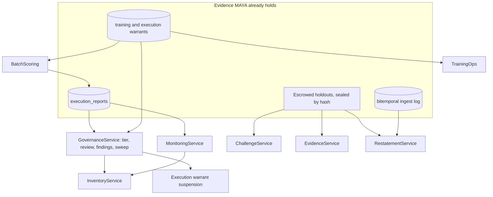
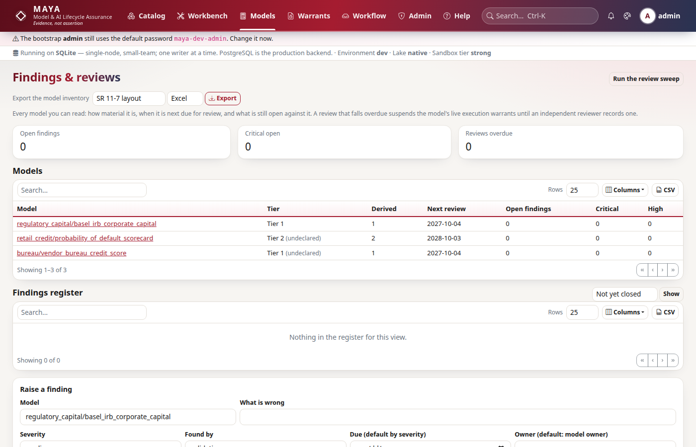
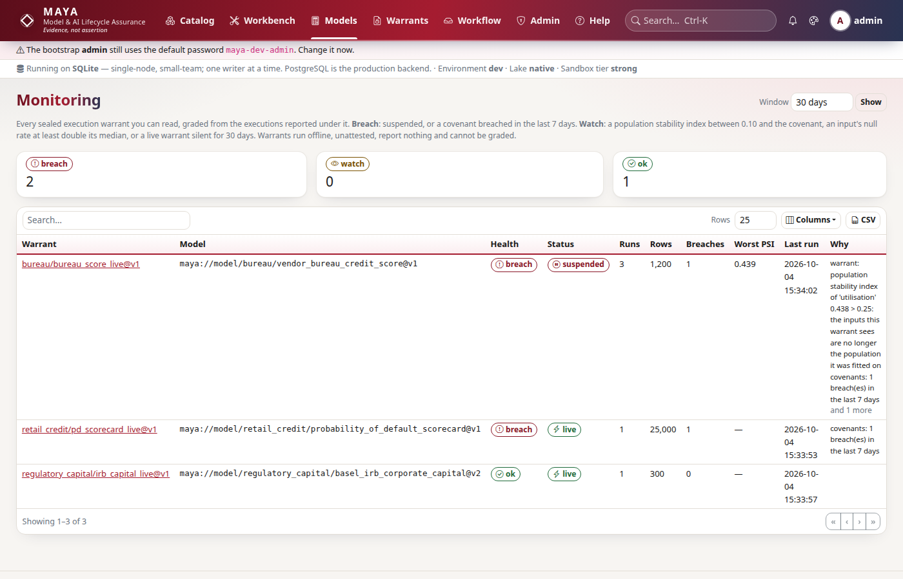
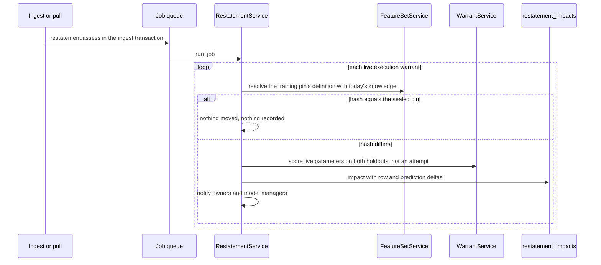

# Model risk governance

The governance services are what a model risk function works in: the inventory and its tiering, periodic review and the sweep that enforces it, validation findings, ongoing monitoring of live models, champion and challenger comparisons, fairness and explainability evidence, attested batch scoring, training dispatch, and alerts when data under a live model is corrected. None of them adds a new kind of control. Each is built from evidence MAYA already holds — warrants, run reports, escrowed holdouts, the bitemporal log — and each acts through instruments that already exist, chiefly the execution warrant's suspension. This page explains how each service is built from those pieces and how they connect.

The user-facing rules — tiers and the questionnaire, review intervals, finding states and moves, covenant kinds and health grades, the challenger verdict, evidence, dispatch, batch scoring and restatement impacts — are in the [model risk reference](../../maya/web/guides/model-risk-reference.md); the procedures are the runbooks [periodic-review-and-expiry](../operations/runbooks/periodic-review-and-expiry.md), [governance-backlog](../operations/runbooks/governance-backlog.md), [suspended-execution-warrant](../operations/runbooks/suspended-execution-warrant.md) and [restated-data-under-a-live-model](../operations/runbooks/restated-data-under-a-live-model.md). This page does not repeat them.

| Module | What it does |
|---|---|
| `maya/services/governance.py` | `GovernanceService`: findings and their moves, the materiality profile and derived tier, periodic reviews, the overdue sweep, the overview |
| `maya/services/inventory.py` | `InventoryService`: one row per readable model, exported in an SR 11-7 or SS1/23 aligned layout as CSV, JSON or Excel |
| `maya/services/monitoring.py` | `MonitoringService`: run reports read as series per warrant, and a health grade across warrants. Writes nothing |
| `maya/services/challenges.py` | `ChallengeService`: two warrants on the same escrowed holdout, compared row by row with a paired bootstrap |
| `maya/services/evidence.py` | `EvidenceService`: segment metrics and permutation importance on the escrowed holdout |
| `maya/services/batch_scoring.py` | `BatchScoring`: a pinned feature set scored under a live execution warrant, as a job, sealed and reported |
| `maya/services/training_ops.py` | `TrainingOps`: dispatch of a training warrant to the firm's own compute, and the reference re-fit |
| `maya/services/restatements.py` | `RestatementService`: assessment of a correction's impact on every live model whose training pin it touches |
| `maya/observability/governance.py` | The scrape-time gauges these services are alerted on |

## Structure



The services were registered in a second batch (`registry._governance`) after the services they read — execution, warrants and models — and they reach them through the platform like any other ([services.md](services.md)).

## How it works

### Materiality: a tier derived from evidence

A model's tier (1 most material to 3) is *derived*, every time it is read, from what MAYA can measure and what only the owner can declare:

```python
# maya/services/governance.py
        q_score, q_drivers, complete = self._answers_score(prof.get("answers") or {})
        drivers.extend(q_drivers)
        score = max(USES.get(use or "", 1), e_score, reach, q_score) + (1 if opaque else 0)
        tier = 4 - min(score, 3)
```

The drivers are the declared use and exposure, the measured *reach* (live and suspended execution warrants and the executions reported under them), the materiality questionnaire's answers (from `config/tiering.yaml`), and transparency — a black box is one tier more material than its reach. Each driver is returned with its value, score and reason, so the tier explains itself. An override is allowed with a written reason, and one that makes a model *less* material than the evidence says is flagged (`override_lowers`), since that is the direction an override needs explaining. Because the tier is derived on read rather than stored, a model that acquires its third live warrant becomes more material without anyone remembering to re-tier it.

### Periodic review and the sweep

The tier sets the review interval (overridable per model). `next_review_due` is computed from the last review, or from the first approval when there has been none. The scheduler's hourly `governance.review_sweep` calls `sweep`, which suspends every live execution warrant of every overdue model through the same columns a covenant breach uses, with a reason beginning with a fixed prefix:

```python
# maya/services/governance.py
                reason = f"{REVIEW_REASON} since {prof['next_review_due']:%Y-%m-%d}"
                for w in self._warrants(uow, model["id"]):
                    if self.p.execution.status(w) != "live":
                        continue
                    uow.repo("execution_warrants").update(
                        w["id"], {"suspended_at": utcnow(), "suspend_reason": reason}
                    )
```

So the live instrument fails closed and says why — the next scoring call receives `WarrantSuspended` naming the overdue review ([warrants-and-custody.md](warrants-and-custody.md)). Recording a review (by a model manager, validator or administrator, never the model's owner, with an outcome and a note) lifts exactly the suspensions whose reason carries that prefix and no others: a warrant suspended for a covenant breach stays suspended until somebody decides otherwise. Each suspension and reinstatement is a custody event and an audit entry.



### Findings

A finding has a severity, a source, an owner and a due date (defaulted by severity), and moves through a small state machine — `open`, `remediating`, `remediated`, `closed`, `accepted` — defined as data in `MOVES` (each action, the states it may be taken from, and the state it leads to). Nobody closes their own fix, for the same reason nobody approves their own model; accepting a risk needs a written reason. Every move is kept in the finding's own history and in the audit chain. Open findings by severity are a gauge, and a critical finding left open is an alert.

### The inventory

`InventoryService.rows` builds one row per model the caller may read — purpose, owner, tier and its drivers, validation and review dates, open findings, live warrants and what monitoring makes of them — with stable keys. Each framework is a labelling of those keys (`COLUMNS` maps each key to its SR 11-7 and SS1/23 label, or leaves it out of a layout). The export says how many models were left out because the caller may not read them, because an inventory that silently omits what its reader cannot see reads as complete, and every export says it is an aligned layout, not a regulatory filing template.

### Monitoring: a reading, never a write

Covenants are evaluated on each run report as it arrives, which catches a breach but not a drift: a null rate creeping up over fifty runs breaches nothing until the fifty-first. `MonitoringService` reads the reports as series — volume per day, each input's and output's null rate, mean and range per run with the covenant's bounds beside them, the population stability index against the baseline the covenant was drawn with, and breaches on the same axis — and grades each sealed warrant `breach` (suspended, or a breach in the last seven days), `watch` (PSI in the 0.10 to 0.25 band, an input's latest null rate at least double its median, or a live warrant silent for thirty days) or `ok`. It writes nothing, which is why it cannot drift from the evidence it reads.



### Champion and challenger, and evidence

Both rest on the escrowed holdout ([warrants-and-custody.md](warrants-and-custody.md)). A challenge is only made between two training warrants whose holdout hashes are equal — then both models are scored on exactly the same rows in the same order, and nobody on either side has seen them:

```python
# maya/services/challenges.py
        hashes = {side: w.get("holdout_hash") for side, w in warrants.items()}
        if not all(hashes.values()) or hashes["champion"] != hashes["challenger"]:
            raise ValidationFailed(
                "The two warrants were not drawn on the same escrowed holdout, so their scores "
                "are not comparable. Draw the challenger's warrant on the champion's feature "
                "set pin, with the same split and seed.",
```

Each side is scored (an attempt counted on its warrant), and the per-row errors — which only MAYA holds — are compared: the difference in the metric, a paired bootstrap 95% interval with a fixed seed so the same challenge gives the same interval anywhere, and the share of rows the challenger wins. The verdict is `challenger_better` only when the whole interval is below zero. Promotion is a person's decision with a rationale, by someone who does not own the challenger's warrant, and it records the decision only — the champion's execution warrants keep running until someone draws the challenger's and retires the champion's.

`EvidenceService.compute` cuts the holdout by a segment column and reports each segment's error, bias and mean prediction (suppressing segments too small to report without revealing holdout rows), and computes permutation importance by shuffling each input with a fixed seed and re-scoring. It needs only predictions, so it works for a black box scored in the sandbox. A computation counts as one holdout attempt, and only aggregates leave.

### Attested batch scoring

MAYA still does not serve models; what `BatchScoring` adds is narrow. A `execution.batch_score` job, while the execution warrant is live in the environment asked for, resolves a *pin* (data frozen by content), evaluates the IR with the warrant's approved parameters (or runs a black box's validated artifact in the sandbox), seals the output table by its canonical content hash, stores it as a blob, reports the run on the warrant exactly as an external scorer would — so its covenants are evaluated and a breach suspends the warrant — and records the input pin and output hash in the warrant's custody. Batches are capped at five million rows. Nothing about the output is asserted by anyone: it is reproducible to the byte from the pin, the IR and the parameters.

### Training dispatch and the reference re-fit

`TrainingOps.dispatch` turns a training warrant into a job for the firm's own compute: a manifest signed with the platform key (warrant, data path, seed, target, split), a short-lived API key scoped to the warrant's namespace, and two ready-to-submit job definitions — a Kubernetes `Job` and a SageMaker `CreateTrainingJob` request. MAYA never runs it; inside the job, `maya.sdk.trainer.fit_under_warrant` downloads the data, calls the firm's fit function and uploads the parameters with the data checksum and the dispatch id. `refit` fits the parameters itself — deterministic Levenberg–Marquardt least squares from the developer's values, on the training split only — and records the comparison as evidence. It never becomes a parameter set: MAYA checks a fit, it does not supply one.

### Restatement alerts

A restatement never touches a pin, which means a model fitted on a pin keeps running on the story the pin tells after the source has said the story was wrong. When an ingest or pull brings back a key already in the log with a different value, its own transaction queues a `restatement.assess` job (so only if the ingest commits). The job takes every live execution warrant, finds the feature set pin its training warrant was drawn on, and resolves the same definition — the same member versions, the same as-of date — with what is known now. If the corrected result hashes the same as the sealed pin, nothing under that model moved and nothing is said. If it differs, it measures the difference without showing anyone a row: rows changed, added and dropped in training and holdout; the live parameters scored blind on the holdout both ways (not counted as an attempt, since it is MAYA's own check with approved parameters); and how far predictions moved. The difference is stored as an impact on the warrant, owners and model managers are notified, and the owner acknowledges it with a note. Nothing is suspended: whether a correction invalidates a model is a judgement, and the impact is the evidence for it.



## Example

```python
# Record a review (lifts review-overdue suspensions), raise a finding, export the inventory
my.governance.record_review("retail_credit/probability_of_default_scorecard",
                            outcome="satisfactory", note="Annual review; no change to use.")
f = my.governance.raise_finding(model="retail_credit/probability_of_default_scorecard",
                                title="PSI on utilisation above 0.2", severity="medium")
inv = my.governance.inventory(format="xlsx", framework="ss1-23")

# Compare a challenger with the champion on their shared holdout
c = my.challenges.create(champion=champion_warrant_id, challenger=challenger_warrant_id)
print(c["result"]["verdict"], c["result"]["interval"])

# Score a pinned feature set under a live warrant, as a job
job = my.evidence.batch_score(ew_id, pin="maya://featureset/bureau/panel#q3/2026-09-30",
                              environment="prod")
```

## How it connects

- Every suspension goes through the execution warrant's columns and custody log ([warrants-and-custody.md](warrants-and-custody.md)); scoring uses the holdout predictor and the [formula](formula.md) evaluator or the [sandbox](security.md).
- Restatement assessment uses [resolution](resolution.md) and the bitemporal log in the [lake](lake-and-storage.md).
- Sweeps, assessments and batches are [scheduler tasks and jobs](jobs-and-scheduler.md); the gauges and alerts are on [observability.md](observability.md).
- Documents draw their facts from these services ([ai-and-documents.md](ai-and-documents.md)).

Gates that protect it: the suites `tests/test_governance.py`, `tests/test_governance_rules.py`, `tests/test_challenges.py`, `tests/test_restatements.py`, `tests/test_integrations.py` (dispatch and MLflow sync), `tests/test_dashboards.py` and `tests/test_metrics_inventory.py`.

## What it does not do

It does not decide whether a model is fit for use: tiers are derived, reviews and findings are recorded by people, and a challenger's promotion and a restatement's significance are judgements MAYA records rather than makes. It suspends automatically only for an overdue review (and, through the execution service, a covenant breach); monitoring grades, it does not act. It does not train: dispatch hands a job to the firm's compute and the re-fit is a check, never a parameter set. And the inventory export is an aligned layout of what MAYA holds, not a filing.

Extending it: there is no governance extension point; new questionnaire answers live in `config/tiering.yaml`, documented in the developer guide's [settings-and-config.md](../developer/settings-and-config.md).
