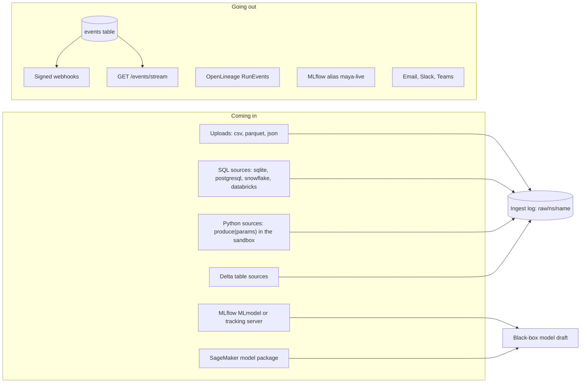
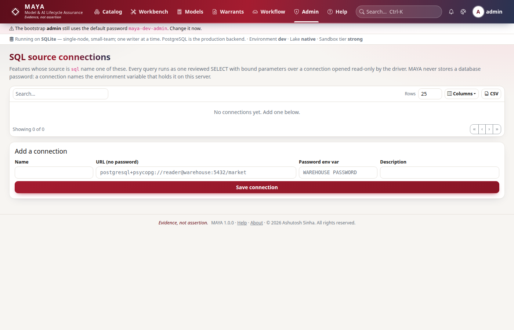
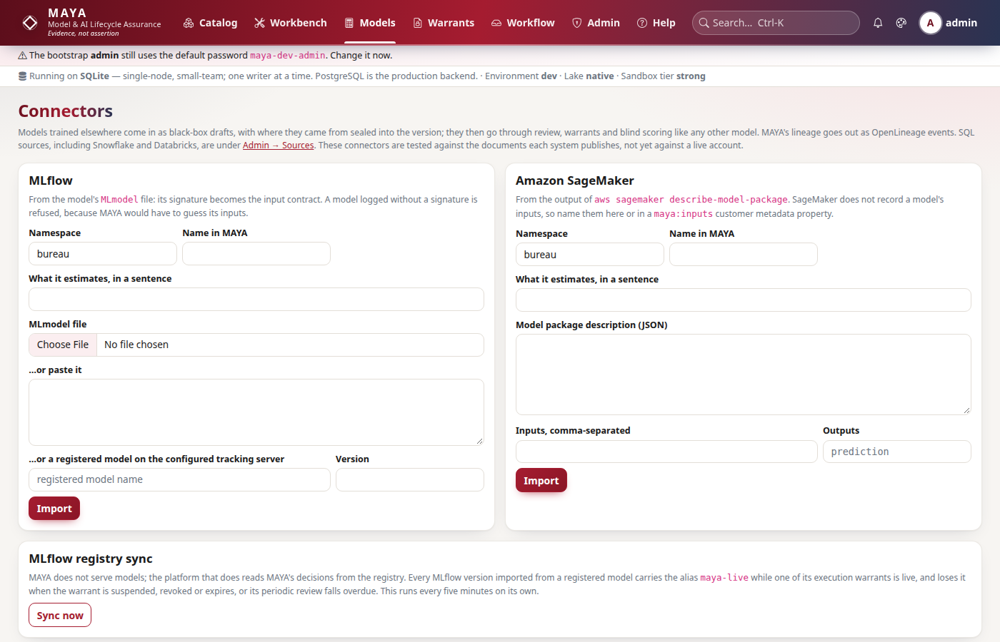
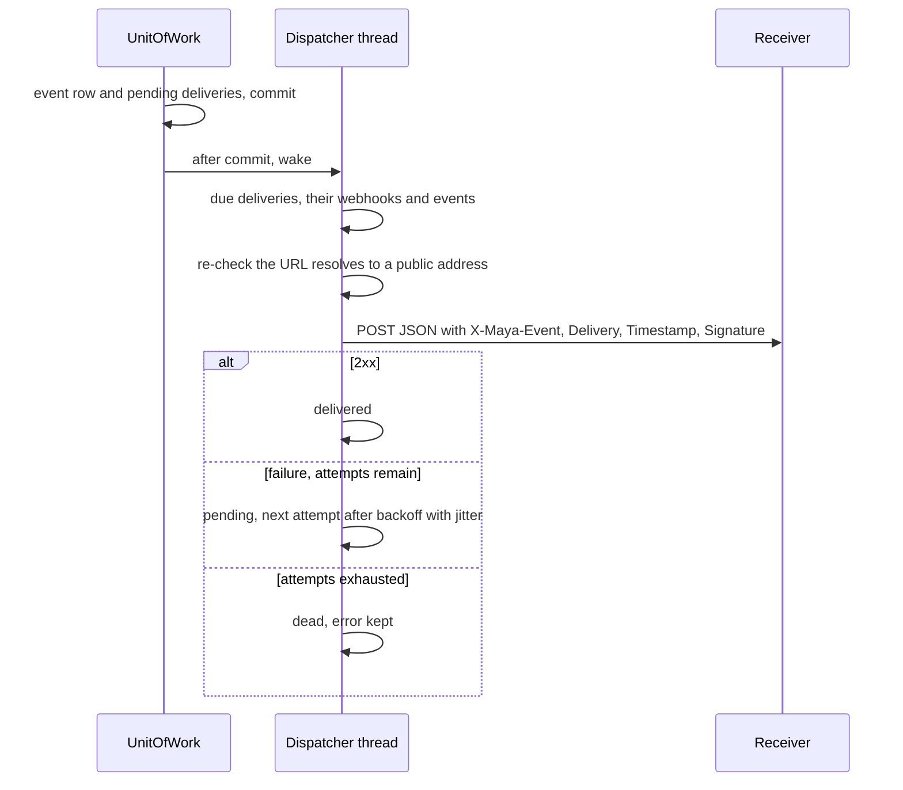

# Integrations

MAYA meets other systems at a small number of well-guarded edges. Data comes in from uploads and from SQL, Python and Delta sources, and always lands in the bitemporal ingest log first. Models trained elsewhere come in from MLflow and SageMaker as black-box drafts that then go through the same review, warrants and scoring as any model. Information goes out as signed webhooks for every event, a server-sent event stream, OpenLineage run events, MAYA's live-or-not decisions pushed back to the MLflow registry, and notifications to email, Slack and Teams. This page explains how each edge is built and what guards it.

The settings, the import procedures and the endpoint summary are in the [integrations reference](../../maya/web/guides/integrations-reference.md); SQL and Python sources as a definition author writes them are in the [features reference](../../maya/web/guides/features-reference.md); webhook and event operation is in the [operations guide](../../maya/web/guides/operations-guide.md). This page does not repeat them.

| Module | What it does |
|---|---|
| `maya/services/sources.py` | `SourceService`: administrator-managed SQL connections; the *pull* that snapshots a SQL or Python source into the ingest log; the Python source runner |
| `maya/persistence/external.py` | Read-only queries against someone else's database: one `SELECT`, bound parameters, a read-only connection, the password from the environment at use |
| `maya/services/feature_data.py` | `delta_frame`: an external Delta table read as a source, at the version knowable at the cut-off |
| `maya/services/integrations.py` | `IntegrationService`: MLflow and SageMaker import, MLflow registry sync, OpenLineage events |
| `maya/services/webhooks.py` | `WebhookService`: webhook registration, URL guarding, signed at-least-once delivery, the dispatcher thread |
| `maya/api/routers/events.py` | `GET /events` (paged) and `GET /events/stream` (server-sent events) |
| `maya/notifiers.py` | Notification channels: inbox, webhook, email, Slack, Teams — each off until configured |
| `sdk/maya/sdk/integrations.py` | The SDK's `integrations` namespace |

## Structure



## How it works

### Sources are pulled, never read live

A SQL or Python source is the specification's escape hatch, and the guard on it is architectural: its rows are snapshotted into the feature's bitemporal ingest log by an explicit *pull*, with a knowledge time (the source's own publication column if the definition names one, else the moment of the pull), and every resolution reads the log. Reading the source live at each resolution would absorb upstream restatements silently — the one thing bitemporality exists to prevent — so MAYA never does. A pull that overlaps keys already in the log is a restatement; it appends rather than overwrites, and queues a restatement assessment in the pull's own transaction ([governance.md](governance.md)).

```python
# maya/services/sources.py
        known_at = knowledge_time or utcnow()
        table = self.p.feature_data.prepare_ingest(eff, frame, known_at)
        generation = f"{feature['name']}/{schema_generation(eff)}"
        prior = self.p.lake.read_raw(ns["name"], generation)
        from maya.services.features import _overlaps

        restatement = _overlaps(prior, table, eff["index"])
        version = self.p.lake.append_raw(ns["name"], generation, table)
        code_hash = hashlib.sha256(code.encode()).hexdigest()
```

The query or the producer's code is part of the feature's definition, so it is hashed and reviewed at approval like any other field; the pull records the SHA-256 of the code that actually ran, so the audit entry names it.

**SQL.** Connections are created by administrators and name the environment variable that holds the password; a URL that carries a password is refused. Every query MAYA runs against someone else's database passes three independent guards in `persistence/external.py`:

```python
# maya/persistence/external.py
    body = _LEADING.sub("", query or "").strip().rstrip(";").strip()
    if not body:
        raise ValidationFailed("The SQL source has no query")
    if ";" in _strip_strings(body):
        raise ValidationFailed("One statement only: a ';' inside the query is refused")
    if not re.match(r"(?is)^(select|with)\b", body):
        raise ValidationFailed("Only SELECT (or WITH … SELECT) queries are allowed")
```

the text check (one statement, `SELECT` or `WITH`, no forbidden keyword outside string literals); bound parameters, never interpolation; and a connection opened read-only at the driver (`mode=ro` for SQLite, `default_transaction_read_only` and a statement timeout for PostgreSQL), so a statement that slipped past the text check still cannot write. Snowflake and Databricks come through their own SQLAlchemy dialects and have no driver-level read-only session, so for them the guards are the text check, a statement timeout where the driver takes one, and credentials — a Snowflake URL must name a role. The module says plainly that neither has been exercised against a live account. Keeping this code in `maya.persistence` is what lets the import gate say "nothing outside persistence imports SQLAlchemy" without an exception.

**Python.** A `python` source's function runs only in the sandbox — no network, no filesystem, capped CPU, memory and output — at the verified tier, which every pull records. It computes; it cannot fetch. `run_python_source` wraps the producer in an entry point, runs it with `numpy` and `pandas` preloaded, and accepts either columns or records back. See [security.md](security.md) for the sandbox.

**Delta.** A `delta` source reads an external Delta table through `maya_delta`, at the version committed at or before the resolution's knowledge cut-off (or a pinned version), with each row's knowledge time taken from a declared column or the commit time of the version it came from. The path must lie inside `sources.delta.roots`, so a definition cannot name an arbitrary directory on the server.



### Models in: MLflow and SageMaker

An import registers a *black-box draft* whose input contract is taken from the source system and whose provenance is sealed into the IR, so it is hashed with the version:

```python
# maya/services/integrations.py
        ir = {
            "inputs": [{**i, "role": "feature"} for i in inputs],
            "outputs": outputs,
            "black_box": {
                "estimates": estimates.strip(),
                "architecture": architecture,
                "provenance": provenance,
            },
        }
        model = self.p.models.create(
            p, namespace=namespace, name=name, kind="black_box", ir=ir, description=description
        )
```

From MLflow, the `MLmodel` file is uploaded or fetched from `integrations.mlflow.tracking_uri`; its signature becomes the input contract, and a model logged without a signature is refused, because every later contract check would otherwise be a check of a guess. A SageMaker `DescribeModelPackage` document names the image, the model data, the approval status and metrics but not the inputs, so they are taken from the caller (or a `maya:inputs` metadata property) and the provenance says so. A sentence saying what the model estimates is required, because a black box is reviewed on it. From there the draft is an ordinary model: review, warrants, blind scoring through its validated artifact in the sandbox.

### Decisions out: the MLflow alias

MAYA does not serve models; the platform that does reads MAYA's decisions from the registry. `sync_mlflow` points the `integrations.mlflow.live_alias` alias (default `maya-live`) at every MLflow-imported version that has a live execution warrant, and removes it from every version that does not. It is a reconciler rather than a hook in every warrant transition: each pass compares what should be true with what it last made true, so a suspension, a revocation, an expiry and an overdue review all reach the registry the same way, within one interval (`integrations.mlflow_sync`, every five minutes).



### Lineage out: OpenLineage

MAYA's lineage edges, grouped by what they produce, become OpenLineage `RunEvent` documents — one job per produced object, its sources as inputs, with run ids derived deterministically (UUIDv5 under a fixed namespace) from the produced object and its time, so emitting twice does not invent a second run. They can be downloaded, or posted to `integrations.openlineage.url` with a bearer token from the environment variable the settings name. The service's docstring states what is not claimed: none of the three connectors has been exercised against a live MLflow server, a SageMaker account or a hosted OpenLineage consumer from the test suite; they are tested against the documents those systems publish and recorded HTTP exchanges.

### Events and webhooks

Every audit entry that is an event (see [services.md](services.md)) is written to the `events` table in the same transaction, with one `webhook_deliveries` row per active webhook whose subscription matches — empty means everything, a trailing `*` is a prefix (`warrant.*`). After commit the dispatcher is woken; it also polls. `GET /events` pages the table after a sequence number; `GET /events/stream` serves it as server-sent events.



```python
# maya/services/webhooks.py
        headers = {
            "Content-Type": "application/json",
            "User-Agent": "MAYA-Webhooks/1",
            "X-Maya-Event": event["type"],
            "X-Maya-Delivery": d["id"],
            "X-Maya-Timestamp": stamp,
            "X-Maya-Signature": signature(self._box().open(hook["secret_sealed"]), stamp, body),
        }
```

Delivery is at-least-once; `X-Maya-Delivery` is the idempotency key a receiver deduplicates on. The signature is HMAC-SHA256 over `"<timestamp>.<body>"` with the webhook's secret, shown once at creation and sealed at rest with `SecretBox`. Redirects are not followed. A webhook URL must be HTTPS and, outside dev, must not resolve to a private, loopback, link-local or reserved address — checked at creation and again before every attempt, since DNS may have changed. A governance platform that can be told to POST into its own network is a pivot, not a feature. Backoff is exponential with jitter, capped at an hour; after the attempt cap a delivery is dead with its last error kept, and the backlog is a gauge with an alert.

### Notifications

`maya/notifiers.py` holds the channels: the in-app inbox (which every notice lands in first, always, so the record survives a channel that is down), signed webhooks, email, Slack and Teams. Each is off until configured — a platform that mails people by default mails the wrong people the first time it starts on a laptop — and a channel that cannot send says so rather than dropping the notice. Slack and Teams take an incoming-webhook URL, which is a secret and therefore lives in the environment or the local overlay, never in the tracked configuration file.

## Example

```python
# A SQL connection (administrators), then a pull of a feature whose source is sql
my.sources.create_connection("warehouse", "postgresql+psycopg://reader@warehouse:5432/market",
                             password_env="WAREHOUSE_PASSWORD")
my.features.pull("maya://feature/equity/prices")

# Import an MLflow model as a black-box draft, then push live decisions to the registry
my.integrations.import_mlflow(namespace="bureau", name="vendor_score",
                              mlmodel=open("MLmodel").read(),
                              estimates="probability of default within 12 months")
my.integrations.sync_mlflow()

# Subscribe a receiver to every warrant event
hook = my.events.create_webhook("risk-ops", "https://ops.example.com/maya", ["warrant.*"])
print(hook["secret"])                    # shown once
```

## How it connects

- Pulls and uploads write the ingest log in the [lake](lake-and-storage.md) and feed [resolution](resolution.md); restatements feed [governance](governance.md).
- Python sources run in the [sandbox](security.md); SQL reads live in [persistence](persistence.md).
- Imported models are [formula](formula.md) IRs with a black box and go through the [workflow](workflow.md) and [warrants](warrants-and-custody.md) like any other.
- Events are emitted by the [unit of work](services.md); webhook backlog and delivery outcomes are metrics on [observability.md](observability.md); notifier channels are registered at the `notifier` point of the [plugin registry](plugins.md).

Gates that protect it: `tools/ci/no_secrets.py` (no secret in tracked configuration), and the suites `tests/test_sql_source.py`, `tests/test_python_source.py`, `tests/test_delta_source.py`, `tests/test_integrations.py`, `tests/test_observability.py` (webhooks and events) and `tests/test_security_regressions.py`.

## What it does not do

It never reads a source at resolution time; data enters only by ingest or pull. It never stores a database password or a provider key. It does not serve or deploy an imported model — it registers a black box, and pushes an alias to say which versions are licensed. The connectors have been tested against published documents and recorded exchanges, not live accounts. Webhook delivery is at-least-once, not exactly-once. And the webhook address check resolves the host name before the HTTP client connects separately, so a DNS answer that changes between the two lookups is not caught by it.

Extending it: adding a source connector is in the developer guide, [source-connectors.md](../developer/source-connectors.md); the webhook and event contract a receiver relies on is in [extension-points.md](../developer/extension-points.md).
