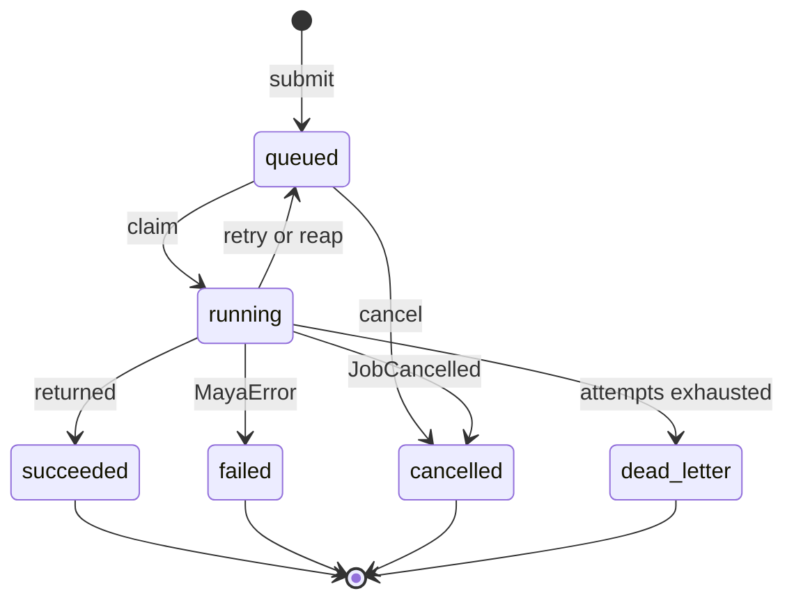
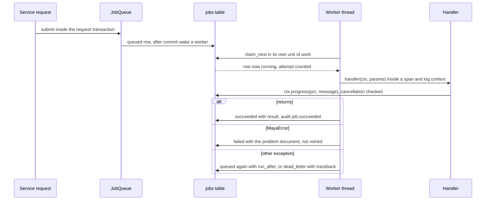
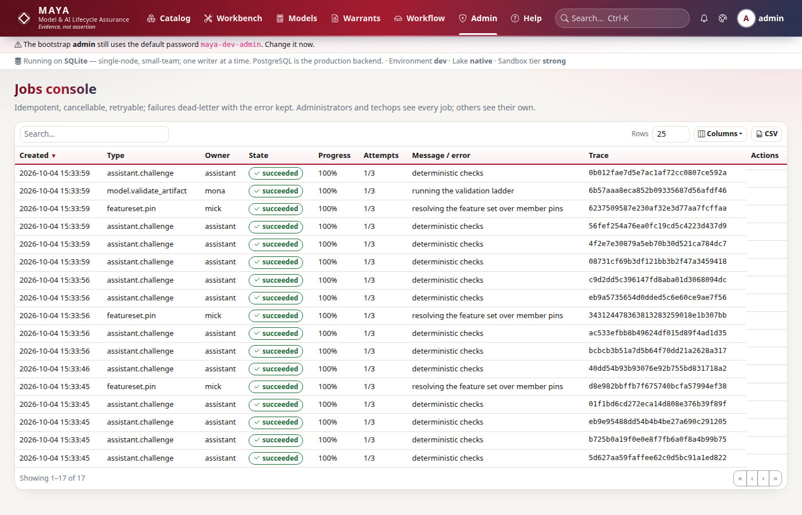

# Jobs and the scheduler

Anything slow in MAYA — a pin, a cascade pin, artifact validation, a document render, a batch score, an integrity scan, a restatement assessment, the challenger's memo — runs as a job, so a request returns at once with something to follow, and the work survives a browser closing. The queue is the database itself: a `jobs` table, claimed by worker threads in the primary process or in dedicated worker processes. Beside it, a small interval scheduler runs the maintenance sweeps. This page explains how a job is submitted, claimed fairly, executed, retried and dead-lettered; how backpressure refuses work MAYA cannot start; and what the scheduler runs and where.

Operating jobs — watching, cancelling, retrying, the worker process — is in the [operations guide](../../maya/web/guides/operations-guide.md) and the [stuck-or-failed-jobs-and-pins runbook](../operations/runbooks/stuck-or-failed-jobs-and-pins.md); the settings are in the [configuration reference](../../maya/web/guides/configuration-reference.md). This page does not repeat them.

| Module | What it does |
|---|---|
| `maya/jobs/queue.py` | `JobQueue` (submit, backpressure, cancel, run, retry, dead-letter, workers, reap), `JobContext` (progress, cooperative cancellation), `Fairness` |
| `maya/persistence/repositories/special.py` | `JobRepository.claim_next`: arrival order or weighted fair queueing; `SKIP LOCKED` on PostgreSQL |
| `maya/jobs/scheduler.py` | `Scheduler`: named tasks on intervals, one thread, each task isolated from the others |
| `maya/services/registry.py` | `_jobs` registers every handler; `wire` registers every scheduled task |
| `run_maya_web.py` | The primary process starts workers and the scheduler; `--worker` starts a process that only drains the queue |
| `maya/services/ops.py` | The jobs console's reads, cancel and retry |

## Structure



A job is submitted inside the caller's transaction and claimed by a worker. A job cancelled while still queued is closed at once, and its `on_cancel` hook runs (closing a pin that would otherwise wait for ever). A handler that returns succeeds; one that raises a `MayaError` fails without retry; one that raises `JobCancelled` at a progress point is cancelled. Any other exception requeues the job with backoff while attempts remain, and dead-letters it after; the primary process also requeues jobs left running by a process that died.

## How it works

### Submission is part of the caller's transaction

A service submits a job with the unit of work it is already in, so the job row commits with the change that asked for it — a pin row and its job exist together or not at all:

```python
# maya/jobs/queue.py
    def submit(
        self,
        uow: Any,
        job_type: str,
        params: dict[str, Any],
        *,
        owner: str,
        idempotency_key: str | None = None,
    ) -> dict[str, Any]:
        """Enqueue inside the caller's transaction; dedupe on the idempotency key."""
        if job_type not in self.handlers:
            raise MayaError(f"No handler registered for job type '{job_type}'")
        self.check_backpressure(uow, owner)
        params_hash = djson.canonical_hash(params)
```

The job row records the type, owner, parameters and their canonical hash, the attempt cap and the current trace id, so the job's span continues the trace of the request that queued it. After commit, `uow.after_commit(self._wake.set)` wakes an idle worker in this process; workers in other processes find the row on their next poll (one second). An idempotency key deduplicates under a named lock, as described on [api.md](api.md).

### Backpressure

Accepting work that cannot be started is a promise MAYA cannot keep, so a submission is refused before its row is written when the queue is deeper than `jobs.queue.max_depth`, or the owner already has `jobs.per_user.max_queued` waiting:

```python
# maya/jobs/queue.py
            if 0 < limit <= seen:
                from maya.observability.metrics import METRICS

                METRICS.inc("maya_job_shed_total", {"reason": reason})
                wait = self.wait_estimate(depth)
                raise QuotaExceeded(
                    f"{what} ({seen} queued, the limit is {limit}). Nothing was queued. "
                    f"The queue should clear in about {wait} second(s); submit again then, "
                    "or cancel jobs you no longer need.",
                    reason=reason,
                    queued=seen,
                    limit=limit,
                    estimated_wait_seconds=wait,
                )
```

The wait estimate is the queue's depth times `jobs.queue.seconds_per_job` divided by this process's workers — a guess, but one made from numbers the caller can see on the jobs page.

### Claiming fairly

Strict arrival order is not fair: one person cascade-pinning ten thousand features would put ten thousand rows ahead of everyone else. `JobRepository.claim_next` applies two limits together. A per-owner concurrency cap (`jobs.per_user.max_concurrent`) passes over owners already at it. Weighted fair queueing ranks the oldest `jobs.claim_candidates` runnable rows by how much of the fleet their owner already holds — jobs of theirs running, plus their own queued jobs ahead of this one — and takes the lowest rank, oldest first:

```python
# maya/persistence/repositories/special.py
        rank = dict(running)
        ordered = []
        for job in eligible:  # queued is already in arrival order
            ordered.append((rank.get(job.owner, 0), job))
            rank[job.owner] = rank.get(job.owner, 0) + 1
        return [job for _, job in sorted(ordered, key=lambda pair: pair[0])]
```

So somebody with nothing running is served before the second job of somebody already running one, and a campaign's jobs interleave with everyone else's — while a campaign still gets every idle worker when nobody else wants one. `jobs.fair: false` restores arrival order. The claim itself (`_take`) re-reads the row as still `queued`, with `FOR UPDATE SKIP LOCKED` on PostgreSQL so two workers never take the same job, sets it `running`, stamps the worker and start time, and counts the attempt. On SQLite the claim runs under the unit of work's write mutex.

### Execution, retry and dead letter



The handler runs inside a trace span continuing the submitter's trace, and inside a logging context bound to the job's owner and reference, so its log lines say whose work it was. It receives a `JobContext`: `progress(pct, message)` writes the progress and a bounded log (the last 200 entries) and raises `JobCancelled` if cancellation was requested; `check_cancel()` does the same without writing. Cancellation is cooperative: a running job stops at its next progress point.

The outcome depends on what the handler raised:

```python
# maya/jobs/queue.py
        except MayaError as exc:
            # A deliberate refusal (quality failure, contract mismatch) is not
            # retried: running it again would refuse again.
            self._finish(
                job["id"],
                "failed",
                error=f"{type(exc).__name__}: {exc.message}",
                result={"problem": exc.to_problem()},
            )
            return "failed"
```

A deliberate refusal is `failed` at once, with its problem document kept as the result. Any other exception is retried with exponential backoff capped at a minute, randomised by a factor between 0.5 and 1.5, until `max_attempts`; then it is `dead_letter` with the error and a short traceback kept. Every terminal state is audited (`job.succeeded`, `job.failed`, `job.cancelled`, `job.dead_letter` — the last is also an event). The jobs console's retry (`OpsService.retry_job`, administrators and techops) requeues a failed or dead-lettered job with its attempts reset.

### Handlers that clean up after themselves

Some jobs promise something to the rest of the system. A pin row that is `materializing` blocks its name and date until it is sealed or failed, so the pin handlers make sure it never stays that way: `run_pin_job` marks the pin failed on any error before re-raising, `register(..., on_cancel=...)` fails a pin whose job is cancelled before it ran, and `registry._announcing` wraps pin handlers so subscribers hear the outcome whether the job succeeded or failed, without the notification ever changing that outcome.

### Workers and processes

`JobQueue.start` runs `jobs.workers` daemon threads, each looping `run_one` and waiting on the wake event (or one second) when the queue is empty; a worker never dies on one bad job. The primary process starts them; an extra web process does not; `run_maya_web.py --worker` builds a platform in the `worker` role, which runs the job queue and nothing else — no HTTP server, no scheduler, no webhook dispatcher — so a long pin cannot compete with interactive traffic for the same interpreter. Only the primary reaps: on startup it requeues every job left `running`, because a process that died cannot finish them; from a second process that would steal jobs the first is halfway through. `drain()` runs jobs inline until the queue is empty, which is what tests and `maya.testing` use.



### The scheduler

The scheduler is deliberately small: a list of `(name, seconds, function)` and one thread that ticks every 60 seconds and runs whatever is due, each task wrapped so one failing sweep cannot stop the others.

```python
# maya/jobs/scheduler.py
    def run_due(self, now: float | None = None) -> list[str]:
        """Run every task whose interval has elapsed; returns the names that ran."""
        now = time.monotonic() if now is None else now
        ran = []
        for name, seconds, fn in self.tasks:
            if now - self._last.get(name, -1e18) >= seconds:
                self._last[name] = now
                try:
                    fn()
                    ran.append(name)
                except Exception:  # noqa: BLE001 - one failing sweep must not stop the others
                    logger.exception("scheduled task %s failed", name)
        return ran
```

Every task is due on the first tick, a minute after startup, then on its interval. `registry.wire` registers them:

| Task | Interval | What it does |
|---|---|---|
| `workflow.escalate_overdue` | hourly | Notifies namespace owners of items past their SLA, once each |
| `execution.expiry_notices` | hourly | Notifies owners once, 30 days before an execution warrant expires (expiry itself is computed) |
| `notices.sweep` | hourly | Subscribers' notices: expiry, covenant breaches and pins the quality contract blocked |
| `governance.review_sweep` | hourly | Suspends the live execution warrants of models whose periodic review is overdue |
| `integrations.mlflow_sync` | every 5 minutes | Pushes MAYA's live or not-live decisions to the MLflow registry |
| `tracking.revoked_members` | hourly | Flags composites whose member warrants have been revoked |
| `lake.maintenance` | `lake.maintenance.interval_seconds` | Compaction and vacuum |
| `custody.anchor` | `custody.anchor.interval_seconds` | Anchors the audit chain head |
| `integrity.verify` | `integrity.verify.interval_seconds` (0 turns it off) | Queues an integrity-verification job |

The sweeps run in the scheduler thread, so they are written to be idempotent — a restart, or a sweep that overlaps itself, sends nothing twice. Integrity verification is the exception that is long enough to matter, so the scheduler only *queues* it as a job with an idempotency key naming the interval window, and a worker runs it. A job the scheduler queued has no person behind it; `_system_principal` runs it as `techops` with `principal_type: system`, so the audit entry says plainly that MAYA did it.

## Example

```python
# Follow a job to its end, cancel one, retry a dead-lettered one
out = my.featuresets.pin("maya://featureset/bureau/credit_application_panel",
                         version_no=1, pin_name="fy2025", as_of="2025-12-31", cascade=True)
done = my.wait(out["job"], timeout=900, progress=lambda j: print(j["progress"], j["message"]))
my.jobs.cancel(other_job_id)
my.jobs.retry(dead_job_id)
```

```bash
# Watch a job from the CLI; start a worker process that only drains the queue (PostgreSQL)
maya job watch <job-id>
python run_maya_web.py --worker
```

## How it connects

- Services submit jobs inside their [unit of work](persistence.md); handlers are service methods registered by [registry.wire](services.md).
- The pin handlers run the saga on [lake-and-storage.md](lake-and-storage.md) and the cascade on [resolution.md](resolution.md); document, challenger and batch jobs are on [ai-and-documents.md](ai-and-documents.md) and [governance.md](governance.md).
- Queue depth, runs, durations, wait times and shed submissions are metrics on [observability.md](observability.md); job ids carry trace ids.

Gates that protect it: the suites `tests/test_job_fairness.py`, `tests/test_worker_process.py`, `tests/test_concurrency.py`, `tests/test_tracking_and_notices.py`, `tests/test_lake_maintenance.py` and `tests/test_custody.py`.

## What it does not do

It is not a distributed task system: there is no broker, no priority field, no result backend beyond the row, and no cross-process wake-up other than polling. The scheduler has no persistence and no leader election — its tasks run in the primary process only, and are idempotent because they must be. Retries cover unexpected errors, not refusals. Cancellation is cooperative, and a handler that never reports progress cannot be stopped short of its end. Fairness and backpressure are counted over the one queue table, but the wait estimate uses only the submitting process's worker count.

Extending it: adding a job type, its handler and its cancel hook, or a scheduled task, is in the developer guide, [jobs.md](../developer/jobs.md).
