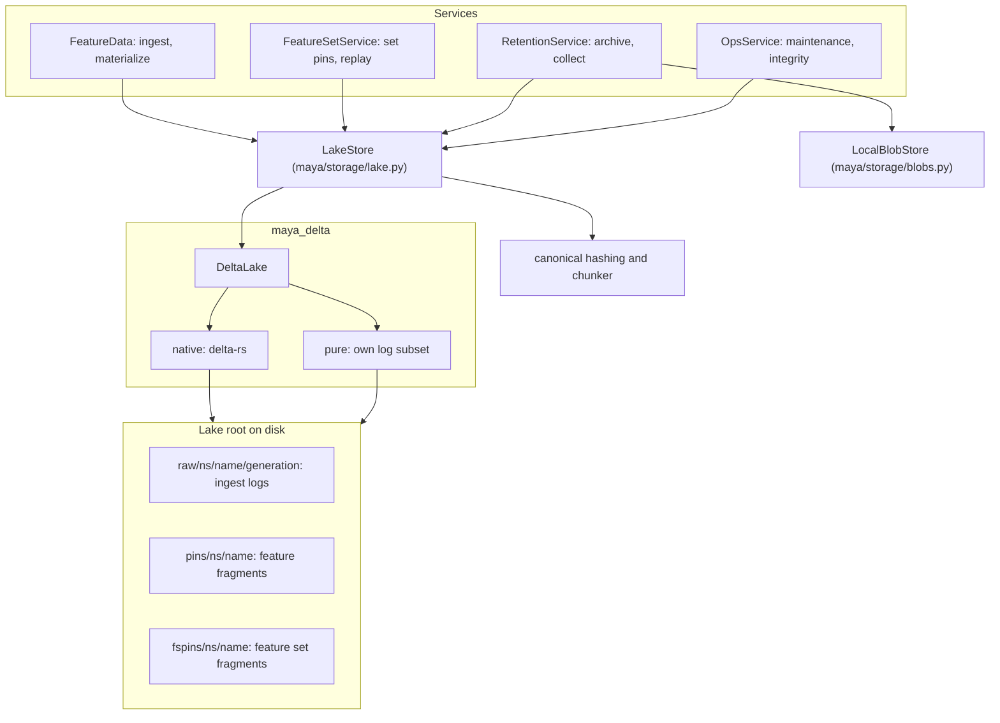
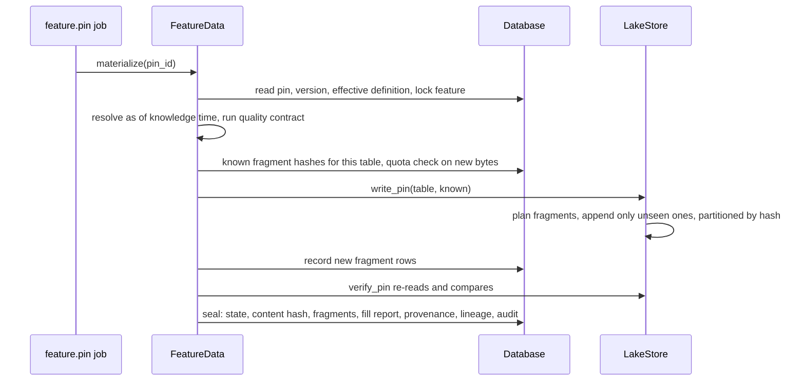

# Lake and storage

MAYA keeps bytes in two places outside the database: a lake of Delta tables, which holds every feature's bitemporal ingest log and every pin's data, and a content-addressed blob store, which holds uploads, code artifacts, rendered PDFs and exported bundles. Both address content by hash rather than by name, which is what lets a pin be proved to be the same bytes years later and lets an unchanged month of data cost nothing to pin again. This page explains the `LakeStore` port, the `maya_delta` engine beneath it, content-defined fragments and content hashes, the pin saga that writes them, the blob store, and maintenance.

The user-facing account — where data lives, what a pin records, how to download, compact and verify — is in the [data and lake guide](../../maya/web/guides/data-and-lake-guide.md). The decisions are [ADR-003](../design/adr/ADR-003-maya-delta-beside-maya.md), [ADR-009](../design/adr/ADR-009-maya-delta-lakehouse-engine.md), [ADR-004](../design/adr/ADR-004-always-materialize-feature-set-pins.md) and [ADR-025](../design/adr/ADR-025-materialize-policy.md).

| Module | What it does |
|---|---|
| `maya/storage/lake.py` | `LakeStore`: the only MAYA module that touches `maya_delta`. Ingest logs, fragment writes and reads, pin verification, maintenance |
| `maya/storage/blobs.py` | `LocalBlobStore`: bytes stored under their SHA-256, written atomically |
| `maya_delta/__init__.py` | `DeltaLake` and `select_backend`: one API over two backends, the choice reported |
| `maya_delta/native.py` | The native backend: delta-rs (`deltalake`) for the transaction log, pyarrow for the data files |
| `maya_delta/pure/` | MAYA's own implementation of a declared subset of the Delta protocol: `log.py`, `table.py`, `maintenance.py` |
| `maya_delta/files.py`, `schema.py` | Data-file decoding and Arrow-Delta schema translation shared by both backends |
| `maya_delta/conformance/suite.py` | One set of cases both backends must pass identically |
| `maya/core/chunker.py` | Content-defined fragment boundaries |
| `sdk/maya/sdk/_shared/canonical.py` | Canonical value encoding, row digests, fragment and content hashes (shared with the SDK and shipped in bundles) |
| `maya/core/canonical_fast.py` | A column-at-a-time accelerator producing the same row digests |
| `maya/services/feature_data.py` | The pin saga for feature pins (`materialize`, `_write_fragments`, `_seal`) |
| `maya/services/retention.py` | Cold-pin reporting, pin archives, and the fragment collector |

## Structure



## How it works

### Two kinds of table

Each feature has an ingest log; each feature or feature set that has been pinned has a fragment store:

- **`raw/<namespace>/<name>/<schema generation>`** — the bitemporal ingest log. Every upload or pull is appended with its `_knowledge_time`; a restatement is a later append, never an overwrite. The schema generation is a short hash of the declared columns, so an additive schema change starts a fresh log rather than rewriting the old one. It is read whole at its latest version, and resolution applies the knowledge-time cut (see [resolution.md](resolution.md)).
- **`pins/<namespace>/<name>`** and **`fspins/<namespace>/<name>`** — fragment stores. One Delta table per object, one partition per content-addressed fragment. A pin is an ordered list of fragment hashes; it owns no files of its own.

`LakeStore` is the only module that imports `maya_delta`. Everything above it asks for "append these rows to this feature's log" or "write this table as a pin" and gets back a version number or a `FragmentWrite`.

### Content-defined fragments

A pin's rows, sorted by the index, are split into fragments at boundaries chosen by content, not by row count:

```python
# maya/core/chunker.py
def boundaries(row_digests: Sequence[bytes], params: ChunkParams) -> list[tuple[int, int]]:
    """Split rows into ``[start, end)`` runs using content-defined cut points."""
    cuts: list[tuple[int, int]] = []
    start = 0
    n = len(row_digests)
    for i, digest in enumerate(row_digests):
        length = i - start + 1
        if length < params.minimum and i != n - 1:
            continue
        is_cut = int.from_bytes(digest[:8], "big") % params.target == 0
        if is_cut or length >= params.maximum:
            cuts.append((start, i + 1))
            start = i + 1
    if start < n:
        cuts.append((start, n))
    return cuts
```

A row ends a fragment when its canonical digest, read as an integer, is divisible by the target size (bounded below and above by `minimum` and `maximum`). Inserting or changing a row therefore changes only the fragment it lands in; every other fragment keeps its bytes and its hash. That is why the marginal cost of a month-end pin is its delta rather than its size: pinning writes only fragments the table has never seen. The chunk parameters are part of the hash contract and are recorded per pin.

### Content hashes over values, never over files

Every row is encoded canonically — one literal case per type in `encode_value`, so a float, a date, a decimal and a nested list each have exactly one byte form — and hashed. A fragment's hash is SHA-256 over its row digests in order; a pin's content hash is the schema digest followed by its fragment hashes:

```python
# sdk/maya/sdk/_shared/canonical.py
def content_hash(schema_hex: str, fragment_hashes: Sequence[str]) -> str:
    """Pin content hash: schema digest plus the ordered fragment hashes."""
    h = hashlib.sha256(b"maya-content-v1\x00" + schema_hex.encode("ascii"))
    for fh in fragment_hashes:
        h.update(fh.encode("ascii"))
    return h.hexdigest()
```

Because the hash is over values, it does not depend on which Delta backend wrote the files, on Parquet's encoding choices, or on compaction rewriting the files later. The module lives in the SDK's `_shared` package and is shipped inside every reproducibility bundle as `lib/canonical.py`, because it *is* the definition of the hash: a verifier without MAYA recomputes the same number. `maya/core/canonical_fast.py` computes the same row digests a column at a time and falls back to the pure encoder for any type it does not cover; the pure code is authoritative, and an accelerator that disagrees is the one that is wrong.

### The pin saga

Pinning is a saga — write fragments, re-read and verify, commit metadata — and nothing is usable until the last step commits. For a feature pin it runs inside a `feature.pin` job:



```python
# maya/services/feature_data.py
        write, lake_table = self._write_fragments(ns["name"], feature["name"], table)
        verify = self.p.lake.verify_pin(
            "pins", ns["name"], feature["name"], write.fragments, write.content_hash, written=table
        )
        if not verify["ok"]:
            self._fail_pin(pin_id, actor, checks, "hash verification after write failed")
            raise ValidationFailed("Pin hash verification failed after write", **verify)
        return self._seal(pin_id, actor, write, lake_table, res, checks, version, label)
```

The steps run in separate short transactions on purpose: holding a database transaction (and on SQLite, the process-wide write mutex) across a resolution and a lake write would stall every other writer for as long as the pin takes. Instead the pin row stays `materializing` until `_seal` commits, and any failure — a quality check, an empty resolution, a lake error, a hash mismatch — leaves it `failed` (`fail_if_unfinished` catches the errors `materialize` did not itself record). A failed pin's fragments may already be in the lake; they are unreferenced, and the collector below can reclaim them. A quota is checked twice: once on an estimate when the pin is requested, and again on the real number of new bytes just before anything is written, so a queue of pins cannot slip past a quota by all being estimated while none is yet written.

Verification compares values: if the table read back equals the table just hashed, value for value (with NaN equal to NaN, as the canonical encoding makes it), the hash is the same by construction; anything short of equal is re-hashed and reported.

### Feature set pins and the materialize policy

A feature set pin is written the same way, into `fspins/`, unless its namespace's `materialize_policy` says otherwise ([ADR-025](../design/adr/ADR-025-materialize-policy.md)). Under `on_demand` or `never` the pin is sealed by its content hash and its member pins with nothing written; a later read replays the resolution over the recorded member pins and serves the result only if it reproduces the sealed hash exactly, raising `IntegrityError` otherwise. Under `on_demand` the first replay is then written, and later reads come from the lake. The cascade that pins members is on [resolution.md](resolution.md).

### The two backends

`maya_delta` offers one API over two interchangeable engines. `native` is delta-rs through the `deltalake` wheel, chosen when it imports and passes a self-check (write and read a tiny table); `pure` is MAYA's own implementation of a declared subset of the Delta transaction-log protocol over pyarrow — commits by exclusive file creation, Parquet checkpoints, time travel, compaction and vacuum, and a refusal by name (`UnsupportedFeature`) for anything outside the subset, such as deletion vectors or column mapping. The choice is made once, reported with its reason through `LakeBackendInfo`, and may be pinned with `lake.backend`. Both decode data files through the same `files.py`, so they differ only in how they arrive at the list of live files. On Windows `auto` chooses `pure`, because the native writer's long file names push MAYA's pin paths past the 260-character limit; the reasoning is in `_native_problem`.

The native backend never calls delta-rs's own Arrow readers: in delta-rs 1.6.3 they leave a native thread that deadlocks interpreter shutdown, so the native backend reads the snapshot's add actions and decodes the files itself. `maya_delta/conformance/suite.py` runs one set of cases against each backend, and cross-backend round trips (written by one, read by the other) live in `tests/test_maya_delta.py`.


### The blob store

`LocalBlobStore` keeps bytes under `<root>/blobs/ab/cd/<sha256>`. Uploads stream through a hasher into a temporary file and are moved into place with `os.replace`, atomic on NTFS, ext4 and APFS; the same bytes uploaded twice are one blob, and a hostile filename cannot traverse the filesystem because the filename is never used. Every `get` re-hashes the bytes and refuses a blob whose content no longer matches its name as storage corruption. Ingested files, code artifacts, compiled PDFs, reproducibility bundles and pin archives are all blobs; rows that refer to them store the hash.

### Maintenance, retention and collection

- **Compaction and vacuum.** `LakeStore.maintain` compacts small files and vacuums unreferenced files past the retention window, table by table. It is safe for sealed pins because a pin is read by fragment value and row number, never by file, and the ingest log is read at its latest version. `OpsService.lake_maintenance` runs it, on the scheduler's `lake.maintenance` interval or when an administrator asks. Vacuum below seven days of retention must be asked for explicitly, since it ends time travel to the versions whose files it removes.
- **Cold pins.** `RetentionService.cold_report` lists pins unread for longer than a cut-off and the bytes they hold. The cut-off is the setting `retention.cold_after_days` (default 180), unless a caller passes `days`. Reads are noted at most once an hour per pin. Cold is a statement, not a move: the lake is a directory, and there is no infrequent-access tier to move bytes to.
- **Archive.** A retired pin's rows, manifest and fragment list can be packed into one compressed blob; `restore` refuses if the archive does not hash to what was sealed. Archiving does not delete fragments, which are shared with every other pin holding the same rows.
- **Collection.** `RetentionService.collect` removes fragments no pin row of any state references. It refuses to remove anything if a pin was created while it was reading (a pin records its fragments before it seals), defaults to a dry run, runs only when an administrator asks, and removes with a Delta *remove* commit, so the bytes stay on disk until a vacuum past retention takes them.

## Example

```bash
# Compact and vacuum every lake table now, then list unreferenced fragments without removing them
python -m maya.cli admin collect-fragments          # dry run: the plan, nothing removed
python -m maya.cli admin collect-fragments --apply  # remove (a Delta remove; vacuum frees the disk)
python -m maya.cli admin cold-pins --days 180
```

```python
# The same from the SDK, as an administrator
my.admin.lake_maintain()
print(my.admin.storage())                  # bytes per namespace, shared fragments, cold pins
print(my.admin.collect_fragments(dry_run=True))
```

```yaml
# config/application.local.yaml: pin the backend rather than letting auto choose
lake:
  backend: pure
```

## How it connects

- [Resolution](resolution.md) produces the tables written here; the [services](services.md) own the saga's transactions; the database ([persistence.md](persistence.md)) holds pin rows, fragment rows and blob hashes.
- [Warrants](warrants-and-custody.md) bind to pins by content hash, and bundles ship `canonical.py` so a verifier can recompute it.
- Integrity verification (`OpsService.verify_integrity`, scheduled by `integrity.verify.interval_seconds`) re-reads every sealed pin and recomputes its hash; lake gauges are on [observability.md](observability.md).

Gates that protect it: `tools/ci/protocol_literals.py` (tests compare protocol versions to the constants `maya_delta` declares), `tools/ci/seam_imports.py`, and the suites `tests/test_maya_delta.py`, `tests/test_canonical_fast.py`, `tests/test_materialization.py`, `tests/test_lake_maintenance.py`, `tests/test_retention.py`, `tests/test_path_budget.py` and `tests/test_quotas.py`.

## What it does not do

It has one storage backend: the local filesystem. There is no object-store implementation of `LakeStore` or `BlobStore`, so cold pins are reported rather than moved, and a deployment across machines needs a shared filesystem. The pure backend implements a declared subset of Delta and refuses tables that need more. Nothing removes bytes on a schedule: compaction rewrites layout without changing content, and collection runs only when an administrator asks. The retention module's own docstring still says the collector is not built and that the lake layer has no delete; both are out of date — `collect` and `LakeStore.delete_fragments` exist and behave as described above.

Extending it: the `lake_store` extension point and what a second backend would have to satisfy are in the developer guide, [extension-points.md](../developer/extension-points.md).
