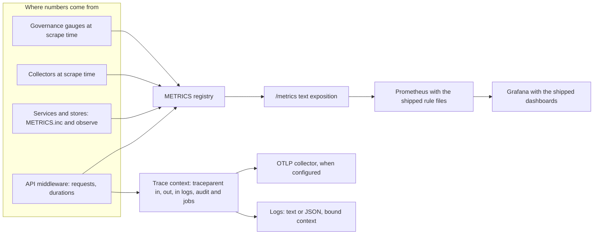
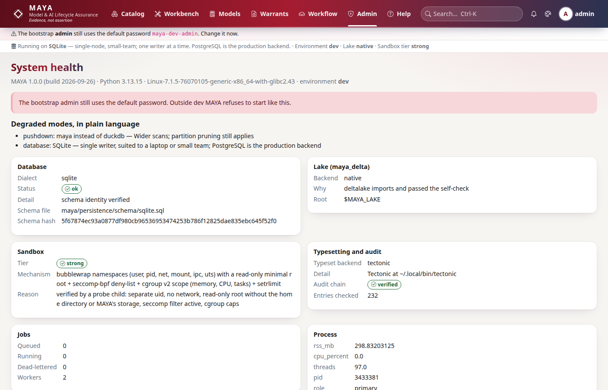

# Observability

MAYA reports on two things: whether the platform is healthy, and whether the models it governs are in order. The first is the usual set — request rates and latency, the job queue, the database pool, logs and traces. The second is particular to a register: how many execution warrants are live, suspended or about to lapse, how many reviews are overdue, how many corrections sit unacknowledged under live models. Both are exported as Prometheus metrics with no third-party dependency, alerted on by shipped rule files and drawn by shipped dashboards. This page explains how metrics, gauges, traces, logs and the health endpoints are built and wired.

Running the stack — scraping, loading the rule files, importing the dashboards, reading the health page, changing log levels — is in the [operations guide](../../maya/web/guides/operations-guide.md); each alert links a runbook under [docs/operations/runbooks](../operations/runbooks/README.md). This page does not repeat them.

| Module | What it does |
|---|---|
| `maya/observability/metrics.py` | `METRICS`, a dependency-free registry: counters, histograms, scrape-time collectors, text exposition |
| `maya/observability/collectors.py` | `Collectors`: platform gauges read at scrape time — queue, posture, pool, lake, namespaces — with a TTL on the costly ones |
| `maya/observability/governance.py` | Governance gauges: warrants by status, expiring warrants, versions by state, overdue reviews, open findings, restatements, documents |
| `maya/observability/caches.py` | Hit and miss counters for MAYA's few deliberate caches |
| `maya/observability/tracing.py` | W3C trace context always; span export over OTLP when configured and installed |
| `maya/observability/logs.py` | Text or JSON logging, a context-variable binding of request, actor and object, per-module levels at runtime |
| `maya/observability/events.py` | Which audit entries are events (see [services.md](services.md)) |
| `maya/services/ops.py` | `health()` for the health page, `ready()` for `/readyz`, integrity verification, log levels |
| `maya/services/registry.py` | `_collectors`: registers the scrape-time sources on `METRICS` |
| `config/prometheus/maya-slo.rules.yml`, `maya-governance.rules.yml` | Platform and governance alert rules, each linking a runbook |
| `config/grafana/maya-platform.json`, `maya-governance.json` | Dashboards, generated by `tools/ops/build_dashboards.py` |

## Structure



## How it works

### Metrics without a client library

`METRICS` is a small thread-safe registry. Counters and histograms are updated in-process where things happen; label sets are sorted tuples so one series has one key:

```python
# maya/observability/metrics.py
    def inc(self, name: str, labels: dict[str, Any] | None = None, value: float = 1.0) -> None:
        with self._lock:
            series = self._counters.setdefault(name, {})
            key = _labels(labels)
            series[key] = series.get(key, 0.0) + value
```

`render()` writes the Prometheus text format, escaping label values; metric and label names are fixed in code. Writing the exposition directly costs about two hundred lines and removes a dependency from a server that must start on a laptop. The emission points are spread through the code and named on the page that owns them: the API middleware counts `maya_http_requests_total` and observes `maya_http_request_duration_seconds` by method, matched route template and status; the job queue counts submissions, runs, shed submissions and observes duration and wait; the pin saga counts sealed pins and new bytes; the audit repository counts entries; the engine counts statements and slow statements without ever recording their text; the AI gateway counts completions and tokens; access counts denials. Series that an alert reads are started at zero (`METRICS.inc(name, value=0.0)`), because `rate()` over a series that does not exist yet is an empty result, not a zero, and an alert on it never evaluates.

### Gauges are read at scrape time

"How many jobs are queued" is not an event anybody emits, so gauges are computed when Prometheus scrapes. `registry._collectors` registers three sources on the registry — queue and session counts, static facts (build info, sandbox tier, which backend every seam resolved to) and the `Collectors` object — after clearing any left by an earlier platform in the process, so exactly one platform owns the scrape:

```python
# maya/services/registry.py
    gauges = Collectors(platform)
    METRICS._collectors.clear()  # one platform per process owns the scrape
    METRICS.collector(state)
    METRICS.collector(static)
    METRICS.collector(gauges.all)
    caches.seed()  # every registered cache reports its zeros before its first lookup
```

Most gauges are computed fresh on every scrape. Three are expensive — listing every lake table's files, attributing bytes to namespaces, and walking the catalogue for the governance gauges — so `Collectors` holds their answers for `observability.metrics.cache_seconds`. That is a deliberate trade against "never stale": a Delta file count a minute old is still worth having; a scrape that reads the whole lake on a large estate is not. The costly namespace gauges can be turned off entirely.

### Governance gauges

`observability/governance.py` reports the state of the inventory, not of the machine: execution warrants by computed status and those expiring within 7 and 30 days, training warrants by state, versions of every governed kind by workflow state, models past their periodic review by tier, open findings by severity, restatement impacts open and acknowledged with the age of the oldest open one, and documents waiting for a second person. No label carries a model or warrant name — counts are by status, kind, tier or severity — so series stay bounded however large the inventory grows, and a metric scraper learns nothing it may not read. Each gauge has an alert in `maya-governance.rules.yml` (`MayaCovenantBreached`, `MayaExecutionWarrantSuspended`, `MayaExecutionWarrantExpiring`, `MayaRestatementUnderLiveModel`, `MayaRestatementUnacknowledged`, `MayaPeriodicReviewOverdue`, `MayaTierOneReviewOverdue`, `MayaCriticalFindingOpen`, `MayaReviewQueueBacklog`, `MayaAiProviderFailing`, `MayaAiTokenBudget`); the platform file carries the service-level alerts (availability burn, latency, slow pins, job wait, dead letters, shedding, stuck pins, integrity drift, small-file growth, pool saturation, default password, restore drills, webhook backlog, sandbox tier, denial spikes). The alert says how many; the runbook says where to look; the Governance and Monitoring pages list them by name ([governance.md](governance.md)).

### Tracing

Trace context is W3C `traceparent`, always, and needs nothing installed. The API middleware continues the caller's trace or starts one, binds the trace id as the request id, and returns `traceparent` on the response. The SDK forwards the current context on in-process calls, so one trace runs from the browser's request through the web route, the API and the service. The unit of work stamps the trace id into every audit entry it writes, the job queue stores it on every job, and the job's span continues it — so a pin that ran a minute later in a worker thread is on the same trace as the click that requested it.

```python
# maya/observability/tracing.py
    if not has_module("opentelemetry.sdk"):
        _STATE.update(
            tracer=None,
            exporting=False,
            detail="trace ids propagate; spans are not exported: the OpenTelemetry "
            "SDK is not installed (pip install opentelemetry-sdk "
            "opentelemetry-exporter-otlp-proto-http)",
        )
        return dict(_STATE)
```

Exporting spans is the `tracing` seam: with the OpenTelemetry SDK installed and `observability.otlp.endpoint` set, spans go over OTLP/HTTP; otherwise trace ids still propagate and are recorded, and the health page says spans are not exported rather than letting a dashboard stay silently empty. Spans are opened at the request, around feature and feature set resolution, around lake pin writes and reads, and around each job.

### Logs that say who and what

Every log line should carry the request id, trace id, actor and object reference, and a logging call deep in a service has no idea who the request belongs to. So the fields are *bound* on a context variable and the formatter reads it. The HTTP middleware binds the request id, path and channel; the job runner binds the job's owner and reference; and the unit of work binds the actor — not the authentication dependency, because FastAPI resolves a synchronous dependency in a worker thread whose context copy is thrown away. Switching `logging.format` between text and JSON changes every line without touching a call site. `set_level` changes a module's level at runtime (`maya.resolution` up, `maya.persistence` left alone) and `levels` says what is overridden, so an override can be seen and undone; both are exposed to administrators through `OpsService` and `PUT /system/log-level`. Data values are never logged — that is why slow statements are counted rather than logged.

### Health and readiness

`/healthz` answers alive and the version, with no authentication. `/readyz` answers `200` only when the database is reachable and the lake root exists, and includes the seam report; it is what a load balancer should poll. The health page (`OpsService.health`, also `GET /system/health`) is for a person: version, environment, database dialect, schema hash and the schema file it came from, the lake backend and why it was chosen, the measured sandbox tier, the typesetting backend, the job queue, every seam and every degraded mode in plain language, process statistics and role, whether the default administrator password is still active, tracing status, webhook backlog and the audit chain's verification. The web tier's page chrome reads a summary of it on every page ([web-ui.md](web-ui.md)).



## Example

```yaml
# prometheus.yml: scrape MAYA and load both rule files
scrape_configs:
  - job_name: maya
    metrics_path: /metrics
    authorization: {credentials_file: /etc/prometheus/maya-metrics-token}
    static_configs: [{targets: ["maya.example.com:8600"]}]
rule_files:
  - /etc/prometheus/maya-slo.rules.yml
  - /etc/prometheus/maya-governance.rules.yml
```

```python
# Turn up resolution logging on a running instance without a restart (administrators)
my.admin.set_log_level("maya.resolution", "DEBUG")
health = my.admin.health()
print(health["tracing"], health["degraded"])
```

```bash
# Regenerate the dashboards after changing a panel; the test checks the committed JSON
python tools/ops/build_dashboards.py
```

## How it connects

- The [API](api.md) middleware starts every trace and counts every request; the [SDK](sdk.md) forwards `traceparent` in-process.
- The [unit of work](persistence.md) binds the actor and stamps trace ids into audit entries; [jobs](jobs-and-scheduler.md) carry them across threads and processes.
- Governance gauges read the same tables as the [governance services](governance.md) and the [warrant](warrants-and-custody.md) status function.
- Integrity verification and lake maintenance report through metrics and audit entries ([lake-and-storage.md](lake-and-storage.md)).

Gates that protect it: `tests/test_metrics_inventory.py` (every metric the specification names is in the rendered exposition, not merely registered), `tests/test_slo_rules.py` and `tests/test_governance_rules.py` (every alert's metric exists and its runbook link resolves), `tests/test_dashboards.py` (every panel queries metrics MAYA exports, and the committed JSON is what the generator writes), `tests/test_observability.py` and `tests/test_log_context.py`.

## What it does not do

It ships no Prometheus, Grafana or collector; it exports and provides the configuration for them. Metrics are per process: with several web processes, each exposes its own counters, and scrape-time gauges (which read the shared database) are repeated by each. Spans are exported only when the OpenTelemetry SDK is installed and an endpoint is configured. Logs never carry data values, which means a log line will tell you a resolution was slow but not which rows made it so. Governance gauges count; they do not name the model — the screens do.

Extending it: a new metric, its alert and its dashboard panel, and the tests that will hold them together, are covered in the developer guide, [testing-and-gates.md](../developer/testing-and-gates.md).
