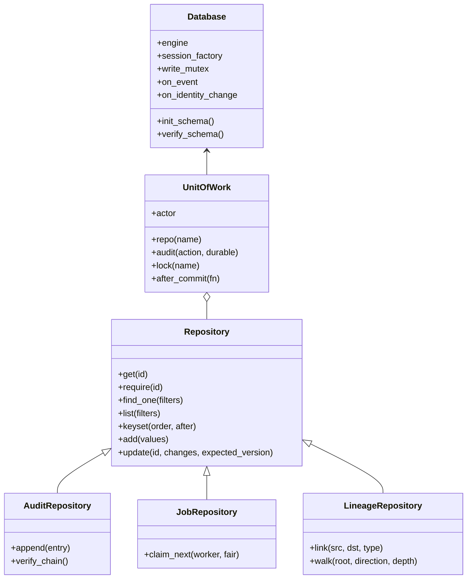
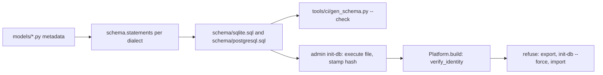

# Persistence

The persistence package is the only code in MAYA that knows a database exists. It owns the ORM models, the repositories that read and write them, the unit of work that bounds every transaction, the hash-chained audit log, and the two schema files the database is created from. Everything above it speaks in plain dictionaries through `uow.repo("<table>")`. This page explains how the package is built, why there are no migrations, how SQLite and PostgreSQL differ underneath one API, and the two whole-estate operations — export and purge — that sit outside the unit of work.

The rules for choosing a database, moving between them and upgrading are written for operators in the [operations guide](../../maya/web/guides/operations-guide.md) and the runbooks [schema-rebuild](../operations/runbooks/schema-rebuild.md) and [move-between-sqlite-and-postgresql](../operations/runbooks/move-between-sqlite-and-postgresql.md). The decisions are [ADR-012](../design/adr/ADR-012-no-migrations-two-generated-schema-files.md), [ADR-013](../design/adr/ADR-013-sqlite-default-postgresql-by-config.md), [ADR-022](../design/adr/ADR-022-several-web-processes-need-postgresql.md) and [ADR-023](../design/adr/ADR-023-estate-export-reads-the-database-as-it-is.md).

| Module | What it does |
|---|---|
| `maya/persistence/models/` | The typed SQLAlchemy metadata in six modules (`catalog`, `registry`, `identity`, `operations`, `governance`, `llm`); `MODELS` maps table name to class |
| `maya/persistence/models/base.py` | `Base` (naming convention, `to_dict`), `Tracked` (UUID key, audit columns, `row_version`) |
| `maya/persistence/types.py` | Portable column types: JSON/JSONB, UUID, UTC datetimes, `Money` |
| `maya/persistence/engine.py` | `Database`: engine, session factory, SQLite pragmas, the SQLite write mutex, slow-query counting |
| `maya/persistence/session.py` | `UnitOfWork`: transaction, repositories, audit, events, durable entries, named locks, after-commit hooks |
| `maya/persistence/repositories/` | `Repository` (generic CRUD with a closed filter vocabulary), and the special ones: audit chain, job claiming, lineage, search |
| `maya/persistence/schema.py`, `schema/sqlite.sql`, `schema/postgresql.sql` | DDL generated from the metadata, the shipped files, the schema hash and its verification |
| `maya/persistence/estate.py` | Export and load of every table, dialect-neutral: the only upgrade path |
| `maya/persistence/purge.py` | Removing one namespace and everything in it (development only) |
| `maya/persistence/search_index.py` | MAYA's own inverted index, re-indexed in the writing transaction |
| `maya/persistence/external.py` | Read-only queries against other people's databases (SQL sources) |

## Structure



## How it works

### The metadata is the single source of truth

Every table is a class under `maya/persistence/models/`. Mutable aggregates mix in `Tracked`, which gives each row a UUID key, `created_by` / `updated_by` audit columns and an optimistic-concurrency counter:

```python
# maya/persistence/models/base.py
class Tracked:
    """Surrogate UUID key, audit columns and optimistic concurrency."""

    id: Mapped[str] = mapped_column(PortableUUID, primary_key=True, default=new_id)
    created_at: Mapped[dt.datetime] = mapped_column(UTCDateTime, default=utcnow)
    created_by: Mapped[str | None] = mapped_column(String(128))
    updated_at: Mapped[dt.datetime] = mapped_column(UTCDateTime, default=utcnow, onupdate=utcnow)
    updated_by: Mapped[str | None] = mapped_column(String(128))
    row_version: Mapped[int] = mapped_column(Integer, default=1, nullable=False)
```

Every difference between SQLite and PostgreSQL at the column level is handled once, in `types.py`: `PortableJSON` is JSONB on PostgreSQL and JSON text on SQLite; `PortableUUID` is native UUID or a 36-character string, always a `str` in Python; `UTCDateTime` is always timezone-aware UTC; `Money` is `NUMERIC(38,12)` or text, never a float. A column declared anywhere else in a dialect-specific way would be the first of many.

### Repositories return dictionaries

A repository never returns an ORM instance, so nothing above this package can hold a session or trigger a lazy load. Filters are keyword arguments with a small closed vocabulary of suffixes rather than a query builder — every query shape has one place to live and one place to be tested:

```python
# maya/persistence/repositories/base.py
_OPS = {
    "eq": lambda c, v: c == v,
    "ne": lambda c, v: c != v,
    "lt": lambda c, v: c < v,
    "le": lambda c, v: c <= v,
    "gt": lambda c, v: c > v,
    "ge": lambda c, v: c >= v,
    "in": lambda c, v: c.in_(list(v)),
    "notin": lambda c, v: c.not_in(list(v)),
    "isnull": lambda c, v: c.is_(None) if v else c.is_not(None),
    "ilike": lambda c, v: func.lower(c).like(f"%{str(v).lower()}%"),
    "prefix": lambda c, v: c.startswith(str(v), autoescape=True),  # % and _ are literal
}
```

So a service writes `uow.repo("jobs").count(state="queued", owner=owner)` or `uow.repo("delegations").list(delegate_id=..., revoked_at__isnull=True, starts_on__le=today)`. `repository_class(name)` generates a plain repository for any table in `MODELS`, and returns a special one for `audit_events`, `jobs`, `lineage_edges` and `search`.

`update(id, changes, expected_version=...)` is the optimistic-concurrency path: when the caller passes the `row_version` it read and someone else has written since, it raises `ConflictError` naming both versions. On PostgreSQL it also takes the row with `SELECT … FOR UPDATE`. `keyset` serves the API's cursor pages, ordered by the sort column and then the primary key so ties never repeat or skip a row. A few set-shaped reads (`latest_per`, `count_per`, `owner_namespace_counts`) exist because the loop they replace issued one query per row.

### The unit of work

A service opens one per transaction. On entry it acquires the SQLite write mutex if the database is SQLite, opens a session and binds the actor into the logging context; on exit it commits or rolls back:

```python
# maya/persistence/session.py
    def __exit__(self, exc_type: Any, exc: Any, tb: Any) -> None:
        try:
            if exc_type is None:
                for entry in self._durable:
                    self.repo("audit_events").append(entry)
# ...
                self.session.commit()
                changed = changed or self.session.info.pop("identity_changed", False)
                if changed and self.db.on_identity_change is not None:
                    self.db.on_identity_change()
                for fn in self._after_commit:
                    fn()
            else:
                self.session.rollback()
                self._write_durable()
        finally:
            self.session.close()
            logs.restore(self._log_context)
            if self.db.is_sqlite:
                self.db.write_mutex.release()
```

Four things happen here that a service never has to think about:

- **Durable audit entries.** A refusal recorded with `durable=True` is written in a fresh session after the rollback, because the refusal is usually the exception that rolled the transaction back.
- **Identity changes.** A `before_flush` listener marks a transaction that touched users, roles, groups, grants, API keys, namespaces, or a session's revocation or second factor. After commit, `on_identity_change` lets the auth service drop its cached principals at once rather than waiting out the cache window.
- **After-commit hooks.** `uow.after_commit(fn)` runs `fn` only once the data is durable — the job queue uses it to wake a worker, the event emitter to wake the webhook dispatcher — so nothing is woken for work that rolled back.
- **Named locks.** `uow.lock(name)` takes a transaction-scoped PostgreSQL advisory lock keyed by a hash of the name (`pg_advisory_xact_lock`); on SQLite the write mutex already serialises writers, so it does nothing. The pin services use it per series-and-date, the job queue per idempotency key.

The audit chain itself (`uow.audit` → `AuditRepository.append`) and the event emission are explained on [services.md](services.md), because they are what services rely on; the mechanics are in `session.py` and `repositories/special.py`.

### Two generated schema files, and no migrations

The DDL is generated from `Base.metadata` for each dialect and shipped as `maya/persistence/schema/sqlite.sql` and `postgresql.sql`. Each file carries a header with its schema hash — SHA-256 of the generated DDL — and ends with the triggers that make `audit_events` append-only. Creating a database executes the shipped file for the configured dialect and stamps the hash into `schema_meta`. Every start compares the stamp with what the running code generates:

```python
# maya/persistence/schema.py
def verify_identity(engine: Engine) -> str:
    """Refuse to run against a database whose schema is not the code's schema."""
    expected = schema_hash(engine.dialect.name)
    found = stored_hash(engine)
    if found is None:
        raise ConfigurationError(
            "The database has no MAYA schema. Run 'python -m maya.cli admin init-db'."
        )
    if found != expected:
        raise ConfigurationError(
            "Schema mismatch: the database was created from a different schema "
```

The refusal names the three commands of the only upgrade path: export the estate, recreate the schema, import the estate. Why no migration framework? A migration chain is a second, hand-maintained description of the schema that must agree with the first forever, and on two dialects it is two such chains; a governance register that cannot prove which schema its evidence was written under has a weaker claim than one that refuses to start. The cost — an upgrade is an export and an import, with downtime proportional to the estate — is stated in ADR-012.



`tools/ci/gen_schema.py --check` regenerates both files and fails the build on any difference, so a model change cannot ship without its schema files, and `create_all` itself refuses to create a database from a file that has drifted from the metadata.

`estate.py` is the upgrade path's body. `export` writes every table as JSON lines, in dependency order, each table hashed in a manifest (`maya-estate-v1`). `load` verifies every hash before writing anything, loads into an empty, freshly created schema, advances PostgreSQL's sequences past the loaded keys, and the import then walks the audit chain to prove it survived the journey. The export reads the database as it is, not through the ORM's current shape, so an older database can be exported by a newer MAYA (ADR-023).

### SQLite and PostgreSQL

The configuration key `db.dialect` decides everything; the two are never mixed in one deployment.

| Concern | SQLite | PostgreSQL |
|---|---|---|
| Writers | One process; a process-wide re-entrant mutex held by every unit of work | Many processes; row locks and advisory locks |
| Named locks (`uow.lock`) | No-op (the mutex covers it) | `pg_advisory_xact_lock` on a hash of the name |
| Audit chain appends | Serialised by the mutex | Serialised by advisory lock `727274` |
| Job claiming | Under the mutex | `SELECT … FOR UPDATE SKIP LOCKED` |
| `update()` | Plain read then write | `SELECT … FOR UPDATE` |
| Connection | `check_same_thread=False`; WAL, `busy_timeout`, `foreign_keys=ON`, `synchronous=NORMAL` | Pool with pre-ping, `pool_size` and `max_overflow` from settings |
| Several web processes | Refused at startup (`check_web_processes`) | Supported |

The SQLite mutex is why one process can serve a small team without "database is locked" errors: concurrent requests queue in Python instead of failing in the driver. It is also why several SQLite processes are refused — the read-then-write steps (linking the audit chain, claiming a job) would interleave across processes with nothing to serialise them.

### Purge: the one deletion

MAYA does not delete governed objects; an audit chain, a custody log and a lineage graph all rest on the objects they name still existing. `purge.purge_namespace` is the exception, and `AccessService.purge_namespace` refuses it unless `app.environment` is `dev`, the caller is an administrator and the namespace's name is typed again. It finds the namespace's rows three ways, because the schema links them three ways — by foreign key, by an object id with no foreign key, and by reference string — removes children before parents and the namespace last, in one transaction. The audit log and the event stream are left as they are; the purge is itself audited. It exists so a demonstration or a test estate can recover from a run that stopped half way.

### Search

Catalog search is MAYA's own inverted index ([ADR-019](../design/adr/ADR-019-own-inverted-index-search.md)), one code path on both dialects. A session `after_flush` hook re-indexes every written feature, feature set, model, warrant and namespace in the same transaction, so the index can never describe a state that did not commit. Terms are tokenised from names (camel case and underscores split), tags, namespace and description, weighted in that order. The index is derived data: startup rebuilds it when it is empty but the catalog is not.

## Example

```bash
# Create the schema from the shipped file for the configured dialect
python -m maya.cli admin init-db

# The upgrade path: export, recreate, import (the import verifies hashes and the audit chain)
python -m maya.cli admin export-estate --out estate.mayabundle
python -m maya.cli admin init-db --force
python -m maya.cli admin import-estate --in estate.mayabundle

# After changing a model: regenerate the schema files, then prove they match
python tools/ci/gen_schema.py
python tools/ci/gen_schema.py --check
```

Inside a service, the whole API is a unit of work and a repository name:

```python
# A read and a guarded write in one transaction
with platform.uow("dana") as uow:
    pin = uow.repo("feature_pins").find_one(pin_name="fy2025", state="sealed")
    uow.repo("features").update(feature_id, {"description": "Bureau file"}, expected_version=3)
    uow.audit("feature.updated", object_type="feature", object_ref=ref)
```

## How it connects

- [Services](services.md) are its only callers, through the unit of work; the audit chain and events are explained there.
- The [job queue](jobs-and-scheduler.md) is a table claimed through `JobRepository`.
- Byte storage is not here: pins and blobs live in the [lake and blob store](lake-and-storage.md), and the database holds their manifests and hashes.
- `external.py` is the read-only reader behind SQL sources ([integrations.md](integrations.md)).

Gates that protect it: `tools/ci/gen_schema.py --check` (schema files match the metadata), `tools/ci/import_boundaries.py` (nothing outside this package imports SQLAlchemy; application code uses only the session, engine, external reader, estate and purge modules; no code above reaches `uow.session`, `db.engine` or `Base.metadata`), and the suites `tests/test_workflow_and_estate.py`, `tests/test_concurrency.py`, `tests/test_purge.py`, `tests/test_search.py`, `tests/test_web_processes.py` and `tests/test_counted_totals.py`.

## What it does not do

It has no migrations and will not grow them (ADR-012). It does not mix dialects, and it does not let several SQLite processes write. It does not store pin data or uploaded files — only their hashes and manifests. Its purge refuses outside development, and nothing else in MAYA deletes a governed row. The boundary is enforced by a gate, not by the language: `tools/ci/import_boundaries.py` refuses SQLAlchemy imports outside `maya/persistence` and any reach past the unit of work — a session, the engine, the metadata, or an ORM model's `__mapper__` or `__table__`. What a caller may know about a table, a repository says: `primary_key` and `columns`.

Extending it: adding a table, regenerating the schema files and what the estate export needs from it is in the developer guide, [persistence-and-schema.md](../developer/persistence-and-schema.md).
