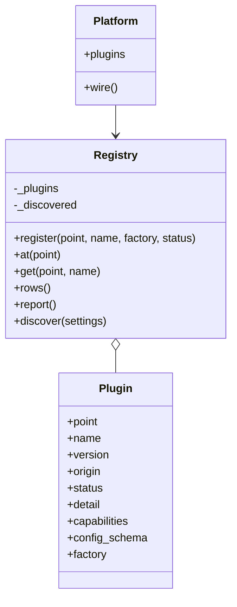
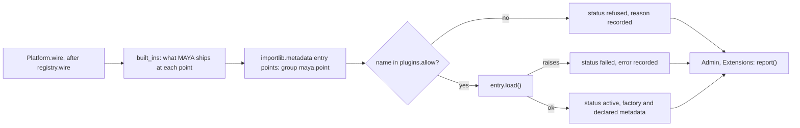
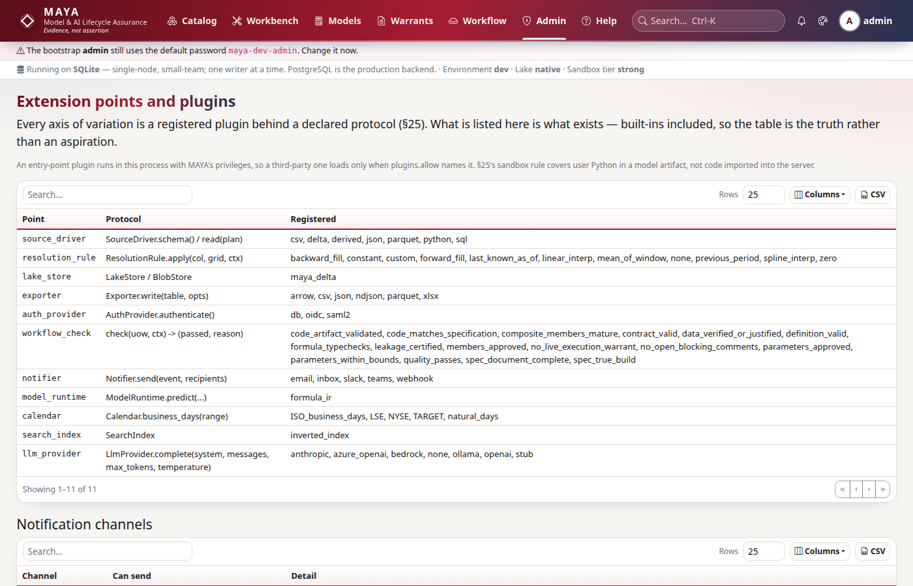

# Plugins and extension points

MAYA varies along a number of axes — source drivers, resolution rules, export formats, authentication providers, calendars, notification channels, language-model providers — and `maya/plugins.py` is the registry that names those axes, lists what is registered at each, and discovers third-party implementations from installed distributions. It is deliberately modest, and its safety story is an allowlist: an entry-point plugin runs inside the server with MAYA's own privileges, so it loads only when configuration names it. This page explains how the registry is built and populated, how discovery and the allowlist work, how extension points differ from MAYA's *seams*, and — because a listed point and a pluggable point are different claims — which points MAYA actually consults at run time today.

The `plugins.allow` setting is documented in the [configuration reference](../../maya/web/guides/configuration-reference.md); the specification's intent is [§25](../design/MAYA_Requirements_and_Design.md#25-extensibility-and-integrations). This page does not repeat them.

| Module | What it does |
|---|---|
| `maya/plugins.py` | `POINTS` (each extension point, its protocol and what ships), `Plugin`, `Registry` (register, look up, report, discover), `built_ins` |
| `maya/services/platform.py` | `Platform.wire`: builds the registry after the services, registers the built-ins, runs discovery once |
| `maya/llm/providers.py` | `BUILT_IN`: the language-model providers registered at `llm_provider`, with their factories |
| `maya/notifiers.py` | `CHANNELS`: the notification channels registered at `notifier` |
| `maya/core/backends.py` | The seam resolver — a different mechanism, for optional *dependencies* rather than alternative implementations |
| `maya/services/ops.py` | `extensions()`: the registry's report plus each channel's readiness, for the Admin → Extensions screen |

## Structure





## How it works

### The points

Each point is a name, the protocol §25 declares for it, and a sentence naming what MAYA ships there:

```python
# maya/plugins.py
POINTS: dict[str, tuple[str, str]] = {
    "source_driver": (
        "SourceDriver.schema() / read(plan)",
        "sql, csv, parquet, json, delta, derived, python",
    ),
# ...
    "llm_provider": (
        "LlmProvider.complete(system, messages, max_tokens, temperature)",
        "anthropic, openai (and compatible servers), azure_openai, ollama, bedrock, stub, none",
    ),
}
```

There are eleven: `source_driver`, `resolution_rule`, `lake_store`, `exporter`, `auth_provider`, `workflow_check`, `notifier`, `model_runtime`, `calendar`, `search_index` and `llm_provider`. `register` refuses an unknown point, and replaces an existing registration of the same name, point and origin, so a later registration from the same source wins while an installed plugin can never displace a built-in.

### Built-ins: the table is the truth

`built_ins(registry, platform)` registers what MAYA itself ships, reading each list from the code that implements it rather than from a copy: source drivers from `catalog.SUPPORTED_SOURCES`, resolution rules from `rules.PARAMS`, calendars from `calendars.CALENDARS`, providers from `providers.BUILT_IN` (with their `from_settings` factories), channels from `notifiers.CHANNELS`. Workflow checks have no static list — the services register them with the workflow engine at wiring time — so `built_ins` lists `platform.workflow.checks`, which is why `Platform.wire` builds the registry after `registry.wire`:

```python
# maya/services/platform.py
        from maya.services import registry

        registry.wire(self)
        # §25: what is registered at each extension point, and what an installed plugin was
        # refused for. Built after the services, because the workflow checks are registered
        # by them, and discovered once so a screen can list it without walking the packages.
        from maya.plugins import Registry as PluginRegistry, built_ins

        self.plugins = built_ins(PluginRegistry(), self)
        self.plugins.discover(self.settings)
```

Reading from the implementing code means nothing is listed to make the table look full, and nothing that exists can be missing from it.



### Discovery and the allowlist

`discover` runs once per platform. For each point it reads the entry-point group `maya.<point>` from the installed distributions, and for each entry:

```python
# maya/plugins.py
                if entry.name not in allowed and f"{point}:{entry.name}" not in allowed:
                    self.register(
                        point,
                        entry.name,
                        origin=origin,
                        status="refused",
                        detail=(
                            f"installed by {origin} and not in plugins.allow (as {entry.name} or "
                            f"{point}:{entry.name}). A plugin runs with MAYA's privileges, so it "
                            "is opt-in by name."
                        ),
                    )
                    continue
```

Before that, an entry with a built-in's name at the same point is refused outright: a plugin never replaces what MAYA ships. An entry not named in `plugins.allow` (a comma-separated list of names, or `point:name` to allow one point only) is recorded as `refused` with the reason, and its code is never imported. An allowed entry is loaded; if loading raises, it is recorded as `failed` with the error, and MAYA carries on — one bad plugin must not stop the platform. A loaded entry is `active`, with whatever version, capabilities and configuration schema it declares in a `maya_plugin` attribute. `at` and `get` return only active plugins. The report lists refused and failed ones separately, because "it is installed" and "it is in use" are different claims and an operator who installed a plugin and did not allow it should be able to see why it is not there.

Why an allowlist rather than a sandbox? §25 says untrusted plugins run under the sandbox rules for user Python. That is not true of something imported into the server: it can read the database and the signing key. The sandbox covers code in a model artifact or a Python source, which runs in a separate interpreter ([security.md](security.md)); a plugin is trusted code, so trusting it is made an explicit, named, reviewable act.

### Which points are consulted at run time

A point being listed is not the same as MAYA looking a plugin up there when it does the work. Today:

| Point | Consulted at run time | How the work is actually dispatched |
|---|---|---|
| `llm_provider` | Yes | `AiGateway._build` calls `plugins.get("llm_provider", name)` and the plugin's factory; an allowed third-party provider is used exactly like a built-in ([ai-and-documents.md](ai-and-documents.md)) |
| `notifier` | No | `notifiers.send` dispatches from the `CHANNELS` dictionary; an allowed third-party channel is listed but never sent to |
| `source_driver` | No | Source types are validated against `catalog.SUPPORTED_SOURCES` and handled by code in `FeatureData` and `SourceService` |
| `resolution_rule` | No | Rules are parsed and applied from `rules.PARAMS` and its implementations |
| `exporter` | No | Export encodings are implemented in `resolution/shapes.py` |
| `auth_provider` | No | `auth.mode` and `auth.sso.protocol` select between the built-in password, OIDC and SAML code |
| `workflow_check` | Indirectly | Checks are registered with the workflow engine by the services; the plugin registry only lists them |
| `calendar` | No | `core/calendars` |
| `lake_store`, `search_index`, `model_runtime` | No | One implementation each, by design ([ADR-009](../design/adr/ADR-009-maya-delta-lakehouse-engine.md), [ADR-019](../design/adr/ADR-019-own-inverted-index-search.md), [ADR-007](../design/adr/ADR-007-no-model-runtime-except-blind-scoring.md)) |

So for every point but `llm_provider`, the registry is a truthful inventory of what MAYA ships, and the discovery of a third-party implementation is recorded but has no effect on behaviour. That is the honest state of §25's promise that "adding one never edits core code": it holds for language-model providers and not yet for the rest.

### Extension points are not seams

`maya/core/backends.py` resolves *seams*: optional dependencies MAYA can run with or without — `deltalake` for the lake, `orjson` for JSON, `polars` for frames, `duckdb` for pushdown, `psycopg` for PostgreSQL, `zstandard`, `cryptography` and others. Each seam is settled once at startup, any seam may be pinned (`seams.<name>`), the choice and its cost are reported on the health page and in `/readyz` and recorded in every pin's provenance and every warrant, and a Type C seam (signing) refuses rather than falls back. `tools/ci/seam_imports.py` fails the build if anything outside the resolver probes for an optional package. A seam chooses between implementations of the same behaviour that MAYA owns; an extension point admits a new implementation from outside. The two are reported side by side on the admin screens but are separate mechanisms.

## Example

```toml
# A third-party provider's pyproject.toml: one entry point in the maya.llm_provider group
[project.entry-points."maya.llm_provider"]
acme_llm = "acme_maya.provider:AcmeProvider.from_settings"
```

```yaml
# config/application.local.yaml: allow it by name; until then it is listed as refused
plugins:
  allow: acme_llm
```

```python
# What is registered, refused or failed, and which channels can send (administrators)
report = my.admin.extensions()
for row in report["refused"]:
    print(row["point"], row["name"], row["detail"])
print(report["channels"])
```

## How it connects

- The [Platform](services.md) builds the registry after wiring the services; the [AI gateway](ai-and-documents.md) is its run-time consumer.
- Notification channels are described on [integrations.md](integrations.md); workflow checks on [workflow.md](workflow.md); resolution rules and calendars on [resolution.md](resolution.md).
- Seams are reported by [observability](observability.md) and recorded in pin provenance ([lake-and-storage.md](lake-and-storage.md)).

Gates that protect it: `tests/test_plugins.py` (what the registry lists is what exists, and an installed plugin is not loaded merely because it is installed), `tools/ci/seam_imports.py`, and `tests/test_foundation.py` for the seam resolver.

## What it does not do

It does not sandbox plugins: an allowed plugin is trusted code in the server process. It does not reload: discovery runs once per platform, so allowing a plugin takes a restart. It does not route work through the registry for any point except `llm_provider`, as the table above says. And it does not version-check a plugin against MAYA beyond recording what the plugin declares.

Extending it: writing and registering a plugin, and what each point would need before it could be consulted at run time, is in the developer guide, [extension-points.md](../developer/extension-points.md) and [llm-providers.md](../developer/llm-providers.md).
