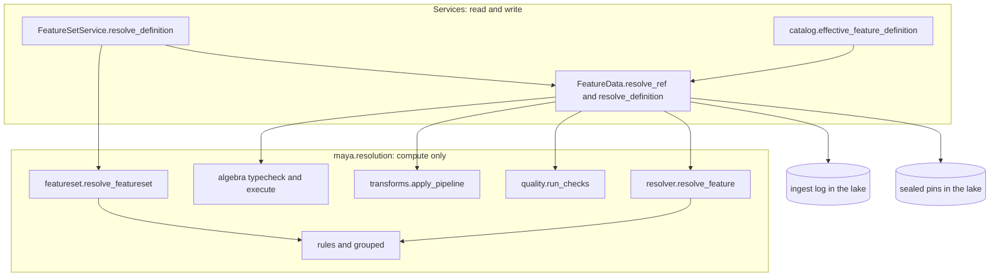
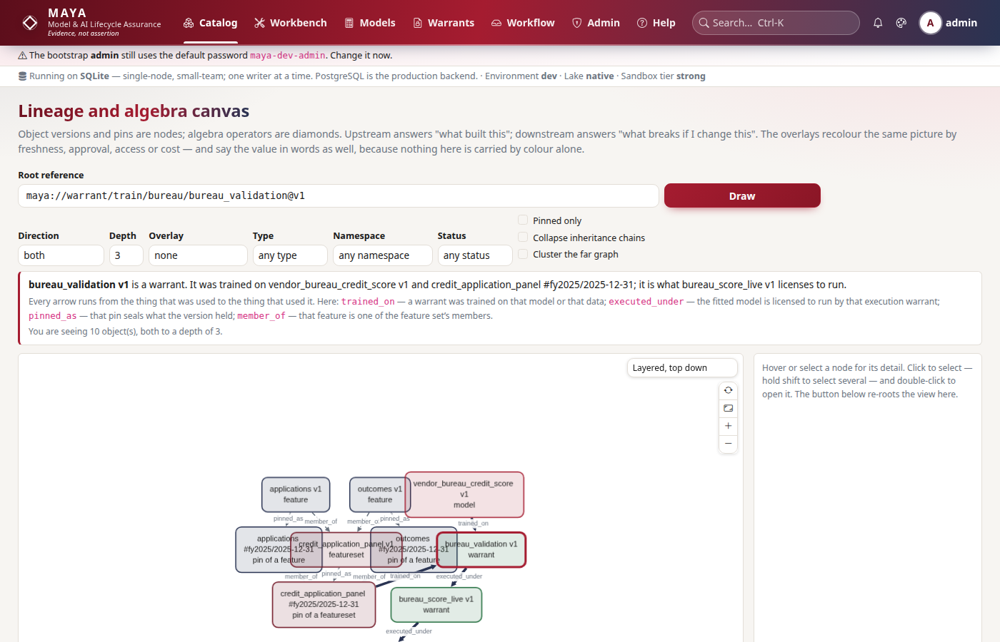
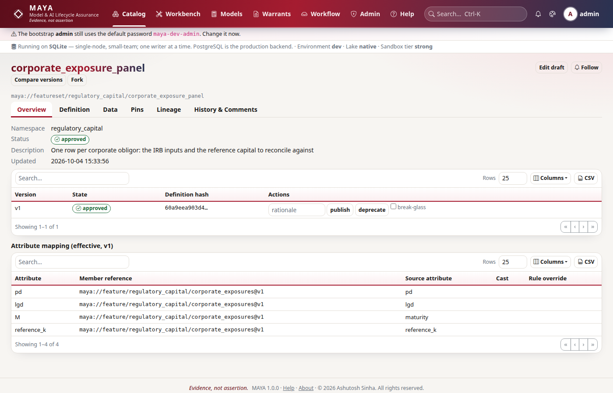
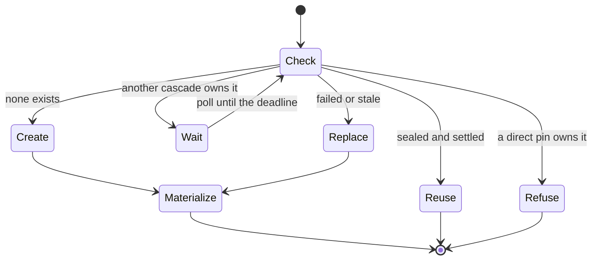

# Resolution

Resolution turns stored rows into the frame a person or a model sees: for a feature, the ingest log cut at a knowledge time, gridded, filled and transformed; for a feature set, its members aligned onto one index and filled under a recorded precedence. It is the code that makes "what did we know on 31 March" a filter rather than an exercise, and it is pure — the `maya.resolution` package takes frames and returns frames, with no database and no I/O, while the services read the data, call it, and write the result. This page explains the order of operations, how knowledge time and event time interact, where the rules and their non-causality are decided, how a feature set is assembled, and how a cascade pin works.

The rules a definition author follows — every key, every rule and its parameters, alignment modes, fill precedence, inheritance — are in the [features reference](../../maya/web/guides/features-reference.md), the [feature algebra reference](../../maya/web/guides/algebra-reference.md) and the [feature sets reference](../../maya/web/guides/featuresets-reference.md). The step-by-step account of a resolution plan, written for users, is in the [data and lake guide](../../maya/web/guides/data-and-lake-guide.md). This page does not repeat them.

| Module | What it does |
|---|---|
| `maya/resolution/resolver.py` | `resolve_feature`: bitemporal cut, latest knowledge per key, grid, rules, fill report |
| `maya/resolution/rules.py` | Rule parsing, bounds, the per-series implementations, and which rules are non-causal |
| `maya/resolution/grouped.py` | The same rules over every group at once, in one numpy pass, for float columns |
| `maya/resolution/featureset.py` | `resolve_featureset`: member frames, keys, grid, joins, filters, the fill precedence, the manifest |
| `maya/resolution/algebra.py` | The feature algebra: `typecheck` at definition time, `execute` over resolved operands |
| `maya/resolution/transforms.py` | Transformation pipelines and their output schema |
| `maya/resolution/expr.py` | The one restricted expression language (transforms, filters, ACL row filters) |
| `maya/resolution/quality.py` | Quality contracts, which block a pin and never warn |
| `maya/resolution/shapes.py`, `types.py` | Logical types to Arrow, read shapes and export encodings |
| `maya/services/feature_data.py` | `FeatureData`: reads the log or a pin, calls the resolver, runs the pin saga |
| `maya/services/featuresets.py` | `FeatureSetService`: effective definitions, member resolution, set pins and cascades, replay |
| `maya/services/catalog.py` | `effective_feature_definition`: `extends` resolved into one complete definition |

## Structure



## How it works

### Two clocks

Every row carries an event time (the first index column — the date the value is about) and a knowledge time (`_knowledge_time` — when MAYA learned it). Resolution takes two different cut-offs, and confusing them is the commonest misreading:

- **`as_of_known`** cuts by knowledge time: rows learned after it are dropped, so a later restatement is invisible to a resolution as of an earlier moment.
- **`as_of`** (a pin's date) is the end of the event-time range: the last date the frame covers.

A pin records both. A pin requested without `as_of_known` defaults it to the moment of the request and records that it was defaulted.

### A feature: a fixed, deterministic order

`resolve_feature` always runs the same steps, in the same order, and reports what each did:

```python
# maya/resolution/resolver.py
def bitemporal_cut(raw: pd.DataFrame, index: list[str], as_of_known: Any) -> pd.DataFrame:
    """Apply steps 1 and 2: the knowledge-time filter and latest row per key."""
    df = raw.copy()
    if not index:
        raise ValidationFailed("a feature must declare an index")
    df[index[0]] = to_event_dates(df[index[0]])
# ...
    if as_of_known is not None:
        df = df[df[KT].isna() | (df[KT] <= _to_utc(as_of_known))]
    df = df.sort_values(index + [KT], kind="mergesort", na_position="first")
    return df.drop_duplicates(subset=index, keep="last").reset_index(drop=True)
```



```mermaid
flowchart LR
    Raw["ingest log rows"]
    Cut["1. drop rows known after as_of_known"]
    Latest["2. latest knowledge per full index key"]
    Grid["3. grid: as_is, or calendar days crossed with every other key"]
    Range["range filter to start and end"]
    RulesStep["4. one rule per attribute, per group, in date order"]
    Trans["transform pipeline"]
    Qual["quality contract"]
    Out["frame, fill report, plan"]
    Raw --> Cut
    Cut --> Latest
    Latest --> Grid
    Grid --> Range
    Range --> RulesStep
    RulesStep --> Trans
    Trans --> Qual
    Qual --> Out
```

Sorting with a stable merge sort, `NaT` knowledge times first, and keeping the last row per key means a restatement wins over the value it restates, and a row with no knowledge time (a legacy upload) loses to any row that has one. A calendar grid is the calendar's open days across the range crossed with every distinct non-date key — every symbol, for a panel — so a gap is a row with nulls rather than a missing row, and the rules can see it.

`FeatureData.resolve_definition` wraps this with the parts that need I/O and the parts that come after: it reads the ingest log (or, for a derived feature, resolves each operand and replays the algebra), calls `resolve_feature`, applies the transform pipeline, and returns a `Resolved` holding the frame, a metadata block (index, output schema, policy, whether anything non-causal was used), the fill report and a plan — one line per step, which is what a preview shows. The quality contract runs at pin time (in `materialize`) and in the `quality_passes` workflow check; it blocks, it never warns. Inheritance (`extends`) is resolved before any of this, by `catalog.effective_feature_definition`, into one complete definition, and a child reads the ingest log of the ancestor that actually holds the data.

### Rules, and why non-causality is decided here

Each rule fills gaps in one series and reports what it did — how many values it filled and the longest run. Three rules consume future information, and the module says so in one place:

```python
# maya/resolution/rules.py
NON_CAUSAL = frozenset({"backward_fill", "linear_interp", "spline_interp"})
```

A rule's `non_causal` flag travels in the fill report of every attribute it filled, propagates through the algebra (a feature derived from a non-causal operand is non-causal) and through feature sets, and is read by the training warrant's leakage certificate, which refuses non-causal data in a training set unless the warrant explicitly allows it with a written justification. Deciding causality where the rule is defined, rather than where it is consumed, means the certificate cannot miss a rule nobody told it about. See [warrants-and-custody.md](warrants-and-custody.md) and [ADR-006](../design/adr/ADR-006-non-causal-fill-justified-override.md).

`apply_rules` computes groups once for all attributes. For float columns and the common rules, `grouped.apply_grouped` runs one numpy pass over the whole column, resetting the running state at each group boundary; anything else takes the per-group path. `tests/test_resolution_grouped.py` checks the two against each other on randomised data, so the fast path cannot quietly mean something different.

### Derived features

A derived feature's source is an algebra expression over other features or pins. Each operator has two halves: `typecheck(op, options, metas)` runs at definition time with no data — index compatibility, type unification, unit and tag conflicts are errors there, never at run time — and `execute(op, options, frames, metas)` replays the operator over resolved operand frames. `FeatureData._derive` resolves each operand (a pin read exactly, a version resolved at the same `as_of_known`), type-checks, executes, and then runs the same grid-and-rules step over the result. Depth is capped (`catalog.MAX_DERIVATION_DEPTH`), so a cycle or a runaway chain is refused rather than recursed into.



### A feature set: assembled, aligned, filled under a recorded precedence

A feature set is a view. Its members arrive already resolved under their own policies — read from pins where the set names pins, resolved otherwise — and `resolve_featureset` assembles them:

1. **Member frames.** Each member's attributes are filtered, cast and renamed onto the set's attribute names, keeping each member's knowledge-time column (`_kt__<alias>`); a member indexed on keys the set does not have is aggregated down to the set's keys.
2. **Keys and grid.** The driving keys come from the alignment mode (`inner`, `left` on a driving member, `outer`, `asof`), and a calendar grid may be laid over them.
3. **Joins.** Each member is joined exactly on the set's index, as of the driving member within a tolerance, or broadcast onto every row when it is indexed on fewer keys (a market series beside a panel). A member may override the set's alignment.
4. **Filters.** Date range, a point-in-time universe, then — after filling — a row filter expression.
5. **Filling.** For each attribute, `choose_rule` picks the rule by precedence and records which layer supplied it; re-applying that rule on the set's grid fills only the gaps alignment introduced.
6. **Manifest.** Each attribute's member, source attribute, winning rule, its layer and source, and the fill report; the row's knowledge time is the latest of its members'.

```python
# maya/resolution/featureset.py
    if entry.get("rule") is not None:
        return {"rule": entry["rule"], "layer": "attribute", "source": "featureset"}
    for i, g in enumerate(group_policies or []):
        if attr in g.get("attrs", []):
            return {"rule": g["rule"], "layer": "group", "source": g.get("name", f"group[{i}]")}
    gp = rule_for(global_policy, attr)
    if gp is not None:
        return {"rule": gp, "layer": "global", "source": "featureset"}
```

The precedence — attribute override, member group, the set's global policy, the nearest ancestor's policy, the member's own policy, and finally "leave null" — is written down in the specification and the featuresets reference. The architecture point is that the layer that won is *recorded per attribute in the manifest*, so nobody reading a pinned panel has to work out which rule filled a value.

The as-of join is `pandas.merge_asof` on the event date, `by` the remaining index columns, with the tolerance and direction the alignment declares (only `backward` and `forward` are accepted).



### Cascade pins

A feature set pin refuses unless every member is pinned, because a set pin over live members would not be reproducible. With `cascade: true`, the `featureset.pin` job pins the unpinned members itself, under the set pin's name and as-of date, and rolls every member pin it created back if anything fails. `_pin_members` visits members in sorted feature-id order, so two cascades over overlapping members can never wait on each other in a cycle. For each member, `_member_action` decides what to do with a pin that already exists for that name and date: none exists, so create one; it is sealed and no unfinished cascade owns it, so reuse it; another cascade is still making it, or sealed it but may yet roll back, so wait (polling every 50 ms); a direct pin request is making it, so refuse; it failed, was only requested, or is left over from a finished cascade, so replace it:



The wait is bounded (`featuresets.cascade_wait_seconds`) and honours cancellation; on expiry the cascade fails with a `ConflictError` naming the member. A member pin created by a cascade records `cascade_of` in its provenance, which is how a later cascade knows whose it is. On failure, `_rollback` deletes exactly the member pins this cascade created, marks the set pin failed and writes `featureset.cascade_rolled_back` to the audit log.

```python
# maya/services/featuresets.py
    def run_pin_job(self, ctx: Any, params: dict[str, Any]) -> dict[str, Any]:
        created: list[str] = []
        try:
            return self._materialize(ctx, params["pin_id"], params.get("cascade", False), created)
        except Exception as exc:
            self._rollback(ctx.actor, params["pin_id"], created, str(exc))
            raise
```

After the members, the set is resolved over the member pins (never over live member versions), written or sealed according to the namespace's materialize policy, and verified. How the bytes are written is on [lake-and-storage.md](lake-and-storage.md).

## Example

```python
# What a feature looked like as known on 31 March, then the same with today's knowledge
pre = my.features.preview("maya://feature/bureau/applications@v1",
                          as_of_known="2026-03-31T23:59:59Z", end="2026-03-31")
now = my.features.preview("maya://feature/bureau/applications@v1", end="2026-03-31")
print(pre["fill_report"], now["fill_report"])

# A feature set pin that pins its unpinned members first, under the same name and date
out = my.featuresets.pin("maya://featureset/bureau/credit_application_panel",
                         version_no=1, pin_name="fy2025", as_of="2025-12-31", cascade=True)
my.wait(out["job"])
```

```bash
# The same cascade from the CLI
maya featureset pin bureau/credit_application_panel --version 1 --name fy2025 \
    --as-of 2025-12-31 --cascade
```

## How it connects

- [Lake and storage](lake-and-storage.md) supplies the ingest log and the pins, and stores what a pin resolves to.
- [Warrants](warrants-and-custody.md) resolve a feature set (or read its pin) to draw training data, and read the non-causal flags for the leakage certificate.
- [Restatement alerts](governance.md) resolve a pin's definition twice — at the pin's knowledge time and now — and compare the hashes.
- Grant conditions (row filters, column masks, time bounds) are applied to resolved frames after resolution; see [security.md](security.md).
- The [workflow engine](workflow.md) calls `quality_passes`, which resolves a sample and runs the contract.

Gates that protect it: the suites `tests/test_resolution_core.py`, `tests/test_resolution_edges.py`, `tests/test_resolution_grouped.py`, `tests/test_resolution_algebra.py`, `tests/test_featureset_proofs.py`, `tests/test_set_algebra.py`, `tests/test_set_composition.py`, `tests/test_shapes_arrow.py` and `tests/test_language_tables.py`; `tools/ci/typecheck.py` covers the services that call it.

## What it does not do

It never reads a source live at resolution time: SQL and Python sources are pulled into the ingest log first, because reading live would absorb upstream restatements silently. It does not overwrite a restated value; it only chooses between knowledge rows. It does not decide whether non-causal data may be used — it reports it, and the warrant decides. It has no aggregation across rows inside a model: that is upstream, in transforms and the algebra. And the expression language is a whitelisted subset of Python expressions with no `eval` anywhere; what it cannot parse it refuses, naming the construct.

Extending it: adding a resolution rule, a calendar or a source driver is in the developer guide, [extension-points.md](../developer/extension-points.md) and [source-connectors.md](../developer/source-connectors.md).
