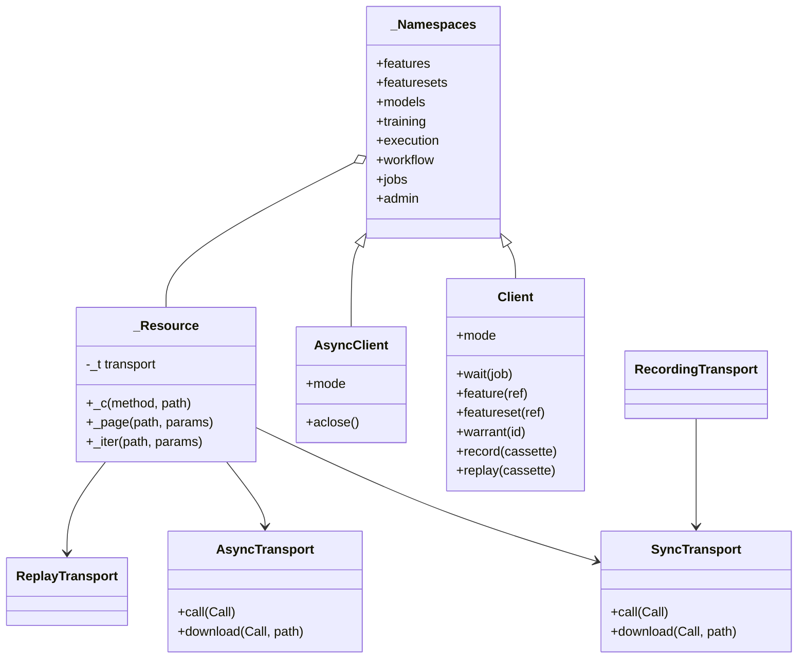

# SDK

The SDK is the only client library of MAYA. The web UI, the CLI, notebooks, CI jobs and the code that scores a model under a warrant all use it, and it is the only way any of them reaches the platform. It is its own project — `sdk/`, built and versioned as the `maya-sdk` distribution — because end users install it without the server, and a small amount of code the server and the client must agree on exactly (the error classes, content hashing, archive reading and the formula IR) lives inside it. This page explains how the SDK is built: its transports, the endpoint registry, handles, record and replay, offline bundles, and the shared modules the server imports back through alias modules.

What each SDK namespace offers, and the CLI commands, are documented for users in the [SDK and CLI reference](../../maya/web/guides/sdk-cli-reference.md). This page does not list them.

| Module | What it does |
|---|---|
| `sdk/pyproject.toml` | The `maya-sdk` project: dependencies `httpx`, `PyYAML`, `pyarrow`, `numpy`; extras `offline` (`cryptography`) and `polars` |
| `sdk/maya/sdk/__init__.py` | The public names: `Client`, `AsyncClient`, `connect`, `offline`, `Offline` and the typed errors |
| `sdk/maya/sdk/client.py` | `Client` and `AsyncClient`, profile resolution, `connect()`, `wait()`, handle factories |
| `sdk/maya/sdk/transport.py` | `Call`, `SyncTransport`, `AsyncTransport`, retries, conditional headers, resumable downloads, `raise_for` |
| `sdk/maya/sdk/base.py` | `ENDPOINTS`, the `@endpoint` decorator, `_Resource` and the cursor-paging helpers |
| `sdk/maya/sdk/resources.py`, `governance.py`, `integrations.py`, `llm.py` | One class per namespace, one method per endpoint |
| `sdk/maya/sdk/handles.py` | `Record` (a dict with attribute access) and handles that carry their verbs |
| `sdk/maya/sdk/cache.py` | `ReadCache` (ETag-revalidated reads) and `PinCache` (sealed pins only, verified by hash) |
| `sdk/maya/sdk/replay.py` | Record and replay: cassettes for tests with no server |
| `sdk/maya/sdk/offline.py` | `maya.offline(bundle=...)`: the read API served from a verified reproducibility bundle |
| `sdk/maya/sdk/guard.py` | `WarrantGuard`: check an execution warrant before scoring, report the run after |
| `sdk/maya/sdk/trainer.py` | `fit_under_warrant`: the entry point of a training job MAYA dispatched |
| `sdk/maya/sdk/_shared/` | Code shared with the server: `errors`, `canonical`, `archives`, `formula_ir`, `formula_evaluate`, `formula_composite` |

## Structure



Every namespace object is a `_Resource` holding one transport. A resource method builds a `Call` and hands it to the transport; it returns whatever the transport returns, which is a value on a `SyncTransport` and an awaitable on an `AsyncTransport`. That is why one class serves both clients: there is no async copy of the resource code.

## How it works

### A standalone project inside a namespace package

`maya` has no `__init__.py` on either side, so it is a namespace package: the server distribution contributes `maya.api`, `maya.services` and the rest, and `maya-sdk` contributes `maya.sdk`. The server's `pyproject.toml` excludes `maya.sdk*` from its own wheel and depends on `maya-sdk` like any client. The SDK must never import from MAYA outside `maya.sdk`; `tests/test_sdk_standalone.py` proves it by starting a fresh interpreter that blocks every other `maya.*` import (and `maya_delta`), then importing every SDK module and exercising a client, a profile, an error mapping, canonical hashing and an offline bundle. One import crosses the line deliberately and tolerates its absence: the transport forwards the current `traceparent` when it runs inside the server, and does nothing when `maya.observability` is not there.

### The shared modules and their aliases

Five things must behave identically on both sides of the wire: the error hierarchy (a refusal raised by the server must be the class the client raises), canonical content hashing (a pin's hash must match wherever it is computed), archive reading (a bundle is opened the same way), and the formula IR and its evaluator (a bundle must score offline exactly as MAYA scores it). They live in `sdk/maya/sdk/_shared/`, once. The server's old module names are aliases that replace themselves in `sys.modules`:

```python
# maya/formula/ir.py
import sys
from typing import TYPE_CHECKING

from maya.sdk._shared import formula_ir as _shared

if TYPE_CHECKING:  # what this name is, for the type checker
    from maya.sdk._shared.formula_ir import *  # noqa: F403

sys.modules[__name__] = _shared
```

`maya.core.errors`, `maya.core.canonical`, `maya.core.archives`, `maya.formula.ir`, `maya.formula.evaluate` and `maya.formula.composite` all follow this pattern. Importing the old name gives the shared module itself, private names included, so `isinstance` checks, class identity and module-level state are the same object on the server. A copy would drift; an alias cannot.

### The endpoint registry

Every resource method is filed against the endpoint it calls:

```python
# sdk/maya/sdk/base.py
ENDPOINTS: dict[tuple[str, str], str] = {}


def endpoint(method: str, path: str) -> Callable[[Any], Any]:
    def deco(fn: Any) -> Any:
        ENDPOINTS[(method, path)] = f"{fn.__qualname__}"
        fn.__maya_endpoint__ = (method, path)
        return fn

    return deco
```

`tools/ci/sdk_parity.py` compares `ENDPOINTS` with the routes in the server's generated OpenAPI document and fails when either side has something the other lacks — an endpoint nobody can call from the SDK, or a method that calls nothing. `tools/ci/public_symbols.py` snapshots the public surface (`maya.sdk.__all__`, and every public method of `Client`, `AsyncClient` and each namespace, with its signature) into `tools/ci/public_symbols.lock.json`, so removing or changing a method someone's code calls is a reviewed decision. `tools/ci/ui_parity.py` closes the third side: every SDK endpoint is reached by some web page or action, apart from a short named list.

Paging helpers sit beside the registry. A `page()` method returns one `{items, next_cursor, page_size, sort}` page; an `iter()` method follows `next_cursor` and is a generator on a sync client and an async generator on an async one, chosen by the transport type.

### Transports

`Client(base_url)` builds an `httpx.Client` against `<base_url>/api/v1`; `Client(app=...)` builds Starlette's `TestClient` over the ASGI application; `AsyncClient(app=...)` builds an `httpx.AsyncClient` over `httpx.ASGITransport`. The in-process transports run the request through the whole ASGI stack and skip only the socket — that is what the web tier uses, with the session token and `channel="web"` (see [web-ui.md](web-ui.md)). A credential is refused over plain HTTP to anything but localhost (`_refuse_plain_http`), because an API key is a bearer credential.

The synchronous transport retries what is safe to retry:

```python
# sdk/maya/sdk/transport.py
    def call(self, call: Call) -> Any:
        idempotent = call.method in ("GET", "PUT", "DELETE") or "Idempotency-Key" in call.headers
        key, headers = self.reads.prepare(call)
        for attempt in range(self.retries + 1):
            try:
                r = self.client.request(
                    call.method,
                    call.path,
                    params=_clean(call.params),
                    json=call.json_body,
                    files=call.files,
                    data=call.data,
                    headers=_headers(self.token, self.channel, headers),
                )
            except httpx.TransportError as exc:
                if not idempotent or attempt == self.retries:
                    raise TransportError(f"Network failure talking to MAYA: {exc}") from exc
```

Network failures and `429`/`502`/`503`/`504` are retried with capped exponential backoff, only for idempotent calls. A network failure is a `TransportError`, distinct from any server refusal, so a caller can tell "MAYA said no" from "MAYA could not be reached". The asynchronous transport does not retry; it serves the web tier, where the server is the same process. Every request carries `X-Maya-Client: python/<version>` (the server answers `426` to a client older than it supports) and `X-Maya-Channel`.

`raise_for` maps a problem document's `type` onto the class in `ERRORS_BY_CODE`, with the server's `context` as keyword arguments — the client half of the error contract described on [api.md](api.md).

### Conditional requests and the two caches

Conditional headers are a property of the wire, so they live in the transport rather than in each method. `ReadCache` remembers the last body of each read against the `ETag` MAYA issued; the next read of the same path sends `If-None-Match`, and a `304` is answered from the cache — MAYA has just affirmed those exact bytes. A write that names a `guard` path (the open-draft updates do) sends `If-Match` with the ETag of the client's last read of that path, so two people editing one draft cannot silently overwrite each other.

`PinCache` is different and has one rule: only a sealed pin is cached, keyed by its content hash and the shape asked for, and every hit is re-verified against that hash before it is returned. A definition or a live resolution can change under you; caching either would be a way to serve yesterday's numbers quietly. It lives under `~/.maya/cache` (`MAYA_CACHE_DIR` moves it, `MAYA_CACHE=0` turns it off) and evicts least recently used files past its size bound.

Downloads stream to disk and resume: a part file's ETag is kept beside it (`<file>.etag`), and the next attempt asks for the rest with `Range` and `If-Range`. If the object moved, the server sends all of it and the part is overwritten rather than stitched onto bytes it never belonged to.

### Handles

The resource methods speak in dictionaries. `handles.py` adds the object shape the specification writes — `feature(ref).version(4).pin(...)`, `job.wait(progress=print)`, `pin.to_arrow()`, `with warrant(id).data() as ds` — without keeping a second model of the server's fields in step:

```python
# sdk/maya/sdk/handles.py
class Record(dict):
    """A server object: a dict, plus attribute access for the fields it happens to have.
# ...
    def __getattr__(self, name: str) -> Any:
        if name.startswith("_"):
            raise AttributeError(name)
        try:
            return wrap(self[name])
        except KeyError:
            raise AttributeError(
                f"no field '{name}' on this {self.get('object_type') or 'record'}; "
                f"it carries: {', '.join(sorted(self)) or '(nothing)'}"
            ) from None
```

Every record *is* a dict, so code that consumed the plain return values does not break. Handles (`FeatureHandle`, `FeatureSetHandle`, `ModelHandle`, `VersionHandle`, `PinHandle`, `JobHandle`, `TrainingWarrantHandle`) carry the client and add the verb that belongs to the thing; each verb is a call to an ordinary resource method.

### Record and replay

`Client.record(cassette, base_url, ...)` wraps the live transport in a `RecordingTransport` that writes every request and response to a JSON cassette; `Client.replay(cassette)` serves the cassette with no network at all. A request is matched by method, path, query parameters and a hash of its body and uploaded files; identical requests replay their responses in order, so polling a job replays its progress. A refusal is recorded as its typed error and replays as the same class. Request headers are never recorded, and response fields named like a token or a secret are redacted. A request with no recording raises `ReplayMiss`, naming it — a replay never guesses. A cassette recorded by either client replays in either.

### Offline bundles

`maya.offline(bundle)` opens a reproducibility bundle exported from a training warrant (see [warrants-and-custody.md](warrants-and-custody.md)) and serves the read API from it, with the same method names a live client uses: `training.get`, `training.data`, `training_data`, `models.get`, plus `predict`. Opening checks every file against the manifest's SHA-256 and the Ed25519 signature over the file list — with the `cryptography` extra installed; without it, the report says the signature was not checked, never that it passed. A bundle that fails is refused, not partly served. `predict` evaluates the signed formula IR with the shared evaluator; the bundle's `reference_model.py` is never imported, because a bundle may come from outside and opening one must not run code it carries. Anything a bundle does not hold — the catalog, workflow, other warrants — raises `NotInBundle` by name.

## Example

```python
# A pin from a handle, waited on, read back as Arrow
import maya.sdk as maya

my = maya.connect(profile="prod")              # ~/.maya/config.yaml, or MAYA_API_KEY
job = my.feature("maya://feature/bureau/applications").pin("fy2025", as_of="2025-12-31")
job.wait(progress=lambda row: print(row["progress"], row["message"]))
pins = my.feature("maya://feature/bureau/applications").pins()
table = pins[0].to_arrow()                     # a PinHandle; sealed pin bytes are cached by hash

# The same calls in a test, recorded once and replayed with no server
rec = maya.Client.record("tests/cassettes/pin.json", "http://127.0.0.1:8600", api_key="...")
rec.features.get("maya://feature/bureau/applications")
again = maya.Client.replay("tests/cassettes/pin.json")
again.features.get("maya://feature/bureau/applications")

# A regulator's machine: no route to MAYA
with maya.offline("bureau_validation.mayabundle") as b:
    print(b.verify())
    print(b.predict({"utilisation": [0.4], "dti": [0.3]}))
```

## How it connects

- It speaks only to the [REST API](api.md), over HTTP or in-process; the [web UI](web-ui.md) is its in-process user.
- Its error classes, hashing and formula modules are the server's too, through the aliases above; the formula half is on [formula.md](formula.md).
- `WarrantGuard` and `fit_under_warrant` are the client ends of execution warrants and training dispatch ([warrants-and-custody.md](warrants-and-custody.md), [governance.md](governance.md)).

Gates that protect it: `tools/ci/sdk_parity.py`, `tools/ci/public_symbols.py`, `tools/ci/ui_parity.py`, `tests/test_sdk_standalone.py` (the SDK works with the rest of MAYA blocked, and from its wheel alone), `tests/test_sdk_modes.py` (HTTP, in-process, record, replay, offline), `tests/test_sdk_handles.py` and `tests/test_conditional_reads_and_resume.py`.

## What it does not do

It decides nothing: every check it appears to make (a warrant guard's liveness test, a checksum comparison) is repeated by the server, or is a convenience over a call that would refuse the same thing. It caches no live data — only sealed pins, verified by hash, and read bodies the server has just re-affirmed. Offline, it reads a bundle and scores its formula; it cannot create, approve or pin anything, and it cannot score a declared black box, whose artifact it will not run. The bundle's signature is checked against the public key carried in the bundle's own manifest, which proves the files were not changed after signing but not *whose* key signed them; comparing the reported `key_id` with your MAYA's signing key is the reader's step.

Extending it: adding a method for a new endpoint, and the parity and snapshot gates it must pass, is in the developer guide, [sdk-development.md](../developer/sdk-development.md).
