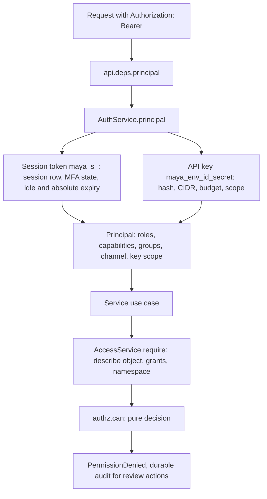
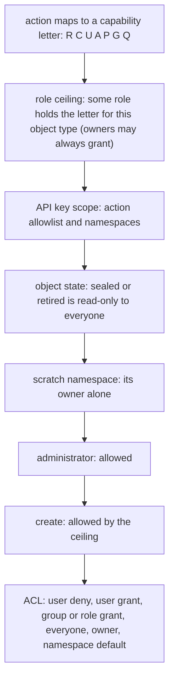

# Security

Security in MAYA is a small number of chokepoints that every surface passes through. Every request carries one credential, resolved into one `Principal` by one function; every decision about what that principal may do is made by one pure function, `can()`; every piece of code MAYA did not write runs in one sandbox; and every signature MAYA makes comes from one signer that refuses rather than downgrades. This page explains how those are built and connected — authentication (passwords, sessions, single sign-on, second factors, API keys), authorization (the role ceiling, object ACLs, grant conditions), the sandbox, and the cryptography.

The security model as a user and an administrator meet it — sign-in modes, password rules, SSO set-up, MFA enforcement, API key practice, the sandbox tiers, the production checklist — is in the [security guide](../../maya/web/guides/security-guide.md); roles, capabilities, grants, conditions and licences are in the [access reference](../../maya/web/guides/access-reference.md). This page does not repeat them.

| Module | What it does |
|---|---|
| `maya/services/auth.py` | `AuthService`: password sign-in, sessions, the principal (and its cache), API keys and client credentials, password policy and resets |
| `maya/services/sso.py` | OIDC and SAML sign-in ending in one claims-to-principal step; group-to-role mapping; JIT provisioning; MFA sessions |
| `maya/services/passkeys.py` | WebAuthn registration and authentication as a second factor; challenges stored server-side |
| `maya/security/oidc.py`, `saml.py`, `passkeys.py` | The protocols only: discovery, token and assertion validation, logout, ceremonies |
| `maya/security/passwords.py`, `breakglass.py` | Password policy; the named administrator accounts that may use a password under `auth.mode: sso` |
| `maya/security/authz.py` | `Principal`, `Decision`, `can()`: the one authorization function |
| `maya/security/roles.py` | The shipped roles and their capability matrix, as data; namespace presets |
| `maya/security/conditions.py` | Grant conditions: row filters, column masks, time bounds; their most-restrictive combination |
| `maya/security/keys.py` | Per-key rate budgets, rotation with overlap, the rotation report |
| `maya/security/licence.py` | The licence algebra: vendor terms that follow data through derivation |
| `maya/services/access.py` | `AccessService`: builds what `can()` needs from the database, `require`, grants, namespaces, users and roles |
| `maya/security/sandbox.py`, `sandbox_runner.py` | The per-platform sandbox, its measured tier, and the child-side runner |
| `maya/core/crypto.py`, `kdf.py`, `totp.py` | Ed25519 signing, Fernet sealing, JWS verification; password hashing; TOTP |

## Structure



## How it works

### One credential, one principal

Every API call carries a bearer credential, and `AuthService.principal` dispatches on its prefix:

```python
# maya/services/auth.py
        if not token:
            raise NotAuthenticated("Authentication required: send a bearer token or API key")
        if token.startswith("maya_s_"):
            return self._session_principal(token, path)
        if token.startswith("maya_"):
            return self._key_principal(token, ip)
        raise NotAuthenticated("Unrecognised credential")
```

A **session token** comes from a sign-in — password, OIDC or SAML — and is stored only as a hash. Resolving it checks the session is not revoked, that its second factor is satisfied (a session still owing one may reach only the MFA endpoints), and both its idle and absolute expiry; an expired session is closed as it is found, and the refusal is raised only after that closure commits, so later requests do not have to expire it again. The web tier keeps the token in its signed cookie and sends it on every in-process SDK call ([web-ui.md](web-ui.md)).

One page makes several API calls, each resolving the same session, so a fully signed-in session's principal is cached for `auth.session.principal_cache_seconds` (default two seconds, [ADR-026](../design/adr/ADR-026-principal-cache-window.md)). The accepted cost: a sign-out in another process, a revocation or a role change reaches a session at most that late. A sign-out in this process clears the entry at once, sessions owing a second factor are never cached, and any committed change to users, roles, groups, grants, keys or sessions calls `forget_principals` through the unit of work's identity-change hook ([persistence.md](persistence.md)).

An **API key** has the form `maya_<env>_<key id>_<secret>`. Resolving it refuses a key for another environment, an unknown, revoked or expired key, a client credential presented as a key, a wrong secret (audited durably), and a caller outside the key's CIDR list; it then charges the key's own rate budget and builds the owner's principal narrowed to the key:

```python
# maya/services/auth.py
    def _scope_to_key(self, uow: Any, p: Principal, row: dict[str, Any]) -> Principal:
        """Narrow a principal to what one credential carries: its role subset, its
        namespaces and its action allowlist."""
        if row["roles"]:
            p.roles = [r for r in p.roles if r in row["roles"]]
            p.capabilities = merge_capabilities(self._role_caps(uow, p.roles))
        p.key_namespaces, p.key_actions = row["namespaces"], row["actions"]
        return p
```

A key can only ever be narrower than its owner. Secrets are hashed with the password KDF (Argon2id preferred, scrypt then PBKDF2 as fallbacks, the algorithm stored with each hash); a verified secret is cached briefly by a hash of the probe so a busy script does not pay Argon2 on every call. Client credentials are exchanged at `POST /auth/token` for a short-lived token rather than used directly.

`build_principal` assembles the principal from the user's roles, plus the roles of every group they belong to, merging the capability letters of all of them. Status other than `active` refuses.

### Single sign-on and second factors

`auth.mode` is `db`, `sso` or `hybrid`. The protocol modules (`oidc.py`, `saml.py`) validate what an identity provider sends and nothing else: an ID token must be signed by a key the issuer publishes (asymmetric only), for the configured issuer and audience, unexpired, with the nonce MAYA sent; a SAML response must carry a signed assertion for MAYA's entity id and ACS, within its validity window, answering an AuthnRequest MAYA issued and has not seen answered — python3-saml accepts an unsolicited response, so MAYA refuses one itself. Both protocols end in the same step in `sso.py`, which maps groups to roles *at every login* (so removing someone from an IdP group removes the MAYA capability at their next session), provisions a user on first sign-in with the mapped roles and no grants, and refuses a user with no mapped group when configured to. Logout runs both ways for OIDC (RP-initiated and back-channel, [ADR-027](../design/adr/ADR-027-oidc-logout-both-ways.md)) and front-channel for SAML ([ADR-024](../design/adr/ADR-024-saml-signed-requests-and-single-logout.md)). Misconfigured SSO refuses at startup, not at first use.

A password sign-in by a user with a second factor yields a *challenge* session that can only verify; a user whose role requires a second factor but who has none gets an *enroll* session that can only enroll. TOTP seeds are sealed at rest with `SecretBox` (Fernet, key under the storage root). WebAuthn challenges are issued and stored server-side, bound to user and session, single-use (consumed before the response is verified) and short-lived; a signature counter that fails to rise is refused as a cloned key. Under `auth.mode: sso`, the accounts named in `auth.break_glass.users` may still sign in with a password: they must be administrators, MFA applies, their sessions are short, and every use is audited durably, notified to every administrator and logged at warning level.

### One authorization function

`can(principal, action, obj, grants, namespace)` is pure: the caller supplies everything, so the authorization matrix can be tested exhaustively without a database (`tests/test_authz_matrix.py`). Its order of evaluation is the security model in code:

```python
# maya/security/authz.py
    letter = ACTION_LETTER.get(action)
    if letter is None:
        return Decision(False, f"unknown action '{action}'")
    obj_type = obj["type"]
# ...
    scope = _key_scope(p, action, obj)
    if scope is not None:  # a Decision(False) is falsy: test identity, not truth
        return scope
    if obj.get("state") in FROZEN_STATES and action in WRITE_ACTIONS:
        return Decision(False, f"object is {obj['state']}: read-only to everyone")
```



The role ceiling comes first and an ACL can never exceed it: a grant beyond what the holder's roles carry is *inert*, and `inert_grant_reason` says so when the grant is made rather than letting it look effective. Owners are the one exception at the ceiling — an owner may always share what they made. Administrators pass only after the ceiling and state checks, so even an administrator cannot edit a sealed object. In the ACL step, an explicit deny for the user wins, then the user's own grants, then the strongest group or role grant, then an `everyone` grant, then ownership, then the namespace's default visibility; in a namespace that is not private, review actions (approve, pin, seal) follow the role capability rather than needing a per-object grant. Every `Decision` carries the rule that decided it, and that rule is what a refusal quotes.

`AccessService.require` is how services call it: it loads the object's description, its live grants and its namespace, calls `can()`, counts the denial and — for approve, pin, seal, grant, revoke and anything on a namespace — records an `authz.denied` audit entry with `durable=True`, so the refusal survives the rollback it causes. Authorization is a call inside each use case, never a decorator on a route, which is what lets the same rule hold for the browser, the CLI and a notebook.

### Grant conditions

A grant may narrow what it gives with a row filter (an expression in the one expression language, with `@user.username` and `@user.desk` substituted), a time bound (no row after a cut-off) and column masks (`null`, or `hash` — SHA-256 of the value's text, so joins still work). When a read is decided by a grant, the decision carries that grant's conditions — combined to the most restrictive when several grants of equal level apply: filters AND-ed, masks unioned with `null` beating `hash`, the earliest cut-off winning. The services apply them to every frame returned to that principal after resolution: previews, downloads, feature set members, and the data a training warrant issues, so a warrant can never hand over what a direct read would have withheld ([warrants-and-custody.md](warrants-and-custody.md)). Conditions are validated when the grant is made, not at first read.

Licences are a separate axis: a source declares redistribution, derived-works, population and retention terms, and anything derived from it inherits the most restrictive combination, each clause remembering which source imposed it (`licence.py`). They are enforced at download, export, bundle and warrant creation.

### The sandbox

Code MAYA did not write — a model's code artifact, a declared black box at scoring time, a Python source's producer function — runs in a separate interpreter (`python -I`), never in the server process:

```python
# maya/security/sandbox.py
    request = json.dumps(
        {
            "source": source,
            "entry": entry,
            "payload": payload,
            "preload": list(preload),
            "paths": _library_paths(),
            "limits": {"cpu_seconds": cpu_seconds, "memory_mb": memory_mb},
            "seccomp": platform.system() == "Linux",
        }
    )
```

The parent writes one JSON request to the child's stdin in an empty temporary directory with a stripped environment, enforces a wall-clock kill and an output-size cap, and reads one JSON response. The child (`sandbox_runner.py`, copied in, importing nothing from MAYA so it carries no platform code or credentials) applies resource limits to itself, disables networking in-process and calls the entry point. The *tier* is measured, not assumed: on Linux a probe child verifies a bubblewrap jail (fresh user, pid, network, mount, IPC and UTS namespaces, a read-only root without the home directory or MAYA's storage), a seccomp-bpf deny-list and a cgroup v2 scope, and only then reports `strong`; macOS with `sandbox-exec` is `moderate`; otherwise `minimal`. Every validation report records the tier, and outside dev MAYA refuses to start below `sandbox.min_tier`.

### Signing and sealing

```python
# maya/core/crypto.py
class Signer:
    """Ed25519 signer bound to one key file."""

    def __init__(self, key_dir: Path) -> None:
        Backends.require("crypto")
```

The signing key is created on first use under the storage root (`keys/signing.pem`), never in configuration. Leakage certificates, execution tokens and manifests, reproducibility bundles and custody anchors are all signed with it. `crypto` is a Type C seam: with no `cryptography` package, `Backends.require` raises `CapabilityRefused` naming what was wanted. There is no pure-Python fallback signer and there will not be one, because a signature nobody should trust is worse than none. `SecretBox` seals secrets MAYA must read back (TOTP seeds, webhook secrets) under the same rule. `verify_jws` checks IdP token signatures, accepting only the asymmetric algorithms in `JWT_ALGORITHMS`.

## Example

```python
# A narrow API key: one role, one namespace, read and download only, 30 days
key = my.auth.create_api_key("ci-reader", roles=["model_developer"], namespaces=["bureau"],
                             actions=["read", "download"], days=30)
print(key["api_key"])                     # shown once ("shown_once": true)

# Why a request was refused: the decision's rule travels in the problem's context
try:
    my.models.transition("bureau/vendor_bureau_credit_score", 1, "approve")
except maya.PermissionDenied as exc:
    print(exc.message, exc.context.get("rule"))
```

```bash
# The same key from the CLI; rotate it later with an overlap
maya key create ci-reader --role model_developer --namespace bureau --action read \
    --action download --days 30
maya key rotate <key-id> --overlap-days 7
```

## How it connects

- The [API](api.md) resolves the principal once per request; [services](services.md) call `AccessService.require` in every use case; the [workflow engine](workflow.md) calls `can()` for each transition.
- Grant conditions are applied to frames produced by [resolution](resolution.md); the sandbox runs artifacts for [formula](formula.md) validation, black boxes for [warrants](warrants-and-custody.md) and Python sources for [integrations](integrations.md).
- Sessions, keys, grants and the audit of denials are rows in [persistence](persistence.md); security metrics (denials, failed sign-ins) are on [observability.md](observability.md).

Gates that protect it: `tools/ci/no_secrets.py` (every key naming a secret is empty or an environment reference), `tools/ci/sast.py` (bandit; medium and high findings fail unless reviewed in place), and the suites `tests/test_authz_matrix.py`, `tests/test_read_scoping.py`, `tests/test_conditions.py`, `tests/test_principal_cache.py`, `tests/test_auth_credentials.py`, `tests/test_sso_mfa.py`, `tests/test_sso_keycloak.py`, `tests/test_saml.py`, `tests/test_saml_slo.py`, `tests/test_oidc_logout.py`, `tests/test_webauthn.py`, `tests/test_break_glass_login.py`, `tests/test_sandbox.py`, `tests/test_sandbox_linux.py` and `tests/test_security_regressions.py`.

## What it does not do

It does not trust the browser: the web tier's cookie carries a token, and the decision is made from the token on every call. It has no superuser that bypasses state — sealed and retired objects are read-only to administrators too — and the only override of workflow is break-glass, which is recorded. API keys never widen their owner's rights. The sandbox's strength is whatever the host can be shown to deliver: on Windows it is the wall clock alone, and MAYA says so rather than claiming more. An entry-point plugin is not sandboxed — it runs in the server with MAYA's privileges, which is why plugins load only by name from an allowlist ([plugins.md](plugins.md)). And the principal cache means a revocation in another process can take up to the cache window to bite.

Extending it: an `auth_provider` is a listed extension point; what that does and does not mean today is in the developer guide, [extension-points.md](../developer/extension-points.md), and settings in [settings-and-config.md](../developer/settings-and-config.md).
