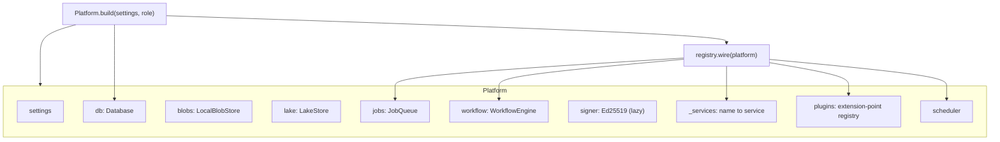
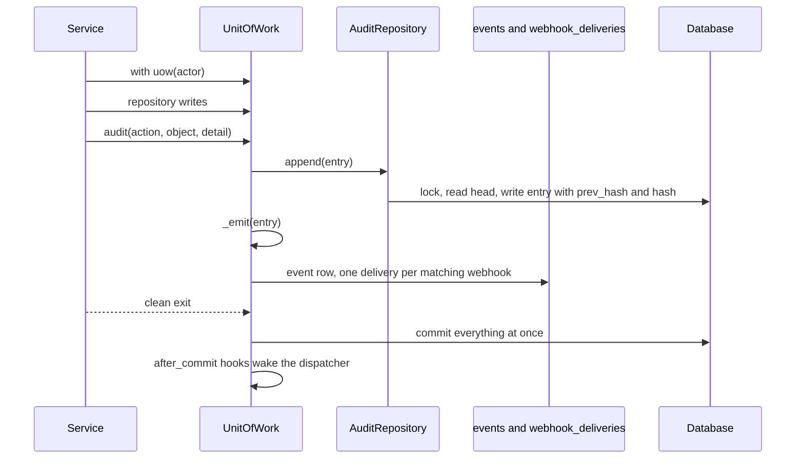

# Services and the Platform

The services are where MAYA's rules live. Every use case — define a feature, pin it, draw a warrant, record a review — is a method on a service class, and every service hangs off one object, the `Platform`, built once at startup and held by the API. This page explains how that object is built and wired, how services find and call each other, where the transaction boundary sits, how every change is written into the audit hash chain, and how an audit entry becomes an event and a webhook delivery in the same transaction.

| Module | What it does |
|---|---|
| `maya/services/platform.py` | `Platform`: settings, database, blob store, lake, job queue, workflow engine, signer, and the service registry; `Platform.build` for the three process roles; startup refusals |
| `maya/services/registry.py` | `wire()`: constructs every service, registers job handlers, workflow checks, workflow listeners, scrape-time collectors and scheduler tasks; `dispatch_transition` |
| `maya/services/*.py` | One module per area. Most hold a class taking the platform (`FeatureService(platform)`); a few (`catalog`, `refs`, `quota`, `paging`) are function libraries the classes share |
| `maya/persistence/session.py` | The `UnitOfWork` the services open: transaction, audit, events, after-commit hooks |
| `maya/persistence/repositories/special.py` | `AuditRepository`: the hash chain itself |
| `maya/observability/events.py` | Which audit actions are also events, and how workflow moves are named |
| `maya/testing/` | `Maya.start()`: a real, throwaway platform for tests of code that uses MAYA |

## Structure



## How it works

### Building the platform

`Platform.build` is the only place these objects are constructed. Its order matters, because each step depends on the one before:

```python
# maya/services/platform.py
        role = role or ("primary" if primary else "web")
        owns_estate = role == "primary"
        runs_jobs = role in ("primary", "worker")
        if role == "worker":
            start_workers = "jobs" if start_workers else False
        Backends.resolve(pins_from_config(settings.props))
        db = database_from_settings(settings)
        if owns_estate and not db.is_initialized():
            if not init_if_empty:
                db.verify_schema()
            db.init_schema()
        db.verify_schema()
        platform = cls(settings, db)
```

1. **Seams.** `Backends.resolve` settles, once, which implementation every optional capability uses (the Delta engine, the signer, the event loop, compression). The choice and its reason are printed in the banner, shown on the health page and written into every pin's provenance and every warrant. See [plugins.md](plugins.md) for how seams differ from extension points.
2. **Database and schema identity.** The primary process creates the schema from the shipped file if the database is empty; every role then verifies that the schema hash stamped in the database is the one this code generates, and refuses to start otherwise. See [persistence.md](persistence.md).
3. **Stores.** The constructor opens the blob store and the lake under the storage root, creates the job queue (bound to `self.uow`) and the workflow engine.
4. **Search index, tracing, wiring, seeding.** The primary rebuilds the derived search index if it is empty, tracing export is configured, every service is wired, and the primary seeds the bootstrap data.
5. **Startup refusals.** `startup_checks` refuses to start — never at first use — when SSO is misconfigured, when the sandbox tier is below `sandbox.min_tier` outside dev, or when the bootstrap administrator still has the default password outside dev.
6. **Background work.** The primary reaps jobs a dead process left `running`, then starts the job workers, the webhook dispatcher and the scheduler. A worker process starts the job workers only.

The three roles exist because the work has different owners: two schedulers would compact the same lake table and chase the same webhook, and a second process reaping would requeue jobs the first is halfway through. `Platform.build`'s docstring gives the reasoning in full.

### Wiring, and how services find each other

`registry.wire` constructs every service and registers it by name:

```python
# maya/services/registry.py
    for name, cls in (
        ("auth", AuthService),
        ("access", AccessService),
        ("feature_data", FeatureData),
        ("features", FeatureService),
        ("featuresets", FeatureSetService),
        ("models", ModelService),
        ("warrants", WarrantService),
        ("execution", ExecutionService),
# ...
    ):
        platform.register_service(name, cls(platform))
```

A service receives the platform and keeps it as `self.p`. It reaches another service as an attribute — `self.p.access.require(...)`, `self.p.jobs.submit(...)`, `self.p.featuresets.resolve_ref(...)` — which `Platform.__getattr__` resolves from the registry. Construction order therefore does not matter for calls (a service looks its neighbour up at call time), only for the few things `wire` does with services immediately after constructing them. The governance group — governance, monitoring, inventory, challenges, evidence, integrations, the LLM applications, training dispatch, batch scoring, the AI gateway, documents and restatements — is registered in a second batch, `_governance`, after the services it reads.

There is no dependency-injection framework and no interface per service. The trade is deliberate: one object, a flat namespace of services, and the call graph visible by searching for `self.p.<name>`. The cost is that nothing stops a cycle between two services at the language level; in practice the calls run from use cases (features, warrants) down to capabilities (access, jobs, lake), and `tools/ci/cycle_check.py` catches import-time cycles between modules.

Pure computation is not a service. `maya.resolution` and the formula modules are function libraries with no I/O; services read the data, call them, and write the result.

`wire` then connects the cross-cutting pieces:

- **Job handlers** (`_jobs`): `feature.pin`, `featureset.pin`, `assistant.challenge`, `execution.batch_score`, `documents.generate`, `restatement.assess`, `restatement.assess.one`, `model.validate_artifact`, `workspace.shadow_replay`, `integrity.verify`. Pin jobs are wrapped so subscribers hear about the outcome whether the job succeeded or failed, and get an `on_cancel` hook that fails a pin cancelled before it ran. See [jobs-and-scheduler.md](jobs-and-scheduler.md).
- **Workflow checks** (`_checks`): each named check a policy may cite is bound to a service method. See [workflow.md](workflow.md).
- **Workflow listeners**: after every move, inside its transaction, the assistant queues a challenger memo, tracking marks dependants for re-approval, and subscriptions notify followers.
- **Collectors**: scrape-time gauges for `/metrics`. See [observability.md](observability.md).
- **Scheduler tasks**: escalation, warrant expiry notices, notices, the periodic-review sweep, MLflow sync, revoked members, lake maintenance, custody anchoring and integrity verification.
- **`dispatch_transition`**: one entry point that takes a transition on any governed object by type and id, used by campaigns and the review screen.

### The transaction boundary

A service method opens a unit of work for each transaction it needs: `with self.p.uow(p.username) as uow:`. Everything inside — repository writes, the audit entry, a job submission, an event — commits together on a clean exit and rolls back together on any exception. Services do not commit inside a loop and never see a SQLAlchemy session; the [persistence page](persistence.md) explains the unit of work itself.

Most use cases are one transaction. The pin saga is deliberately several: it reads the pin row in one, resolves and writes fragments to the lake with no transaction open, and seals in another. Holding a database transaction across a lake write would hold SQLite's process-wide write mutex (or PostgreSQL row locks) for as long as the resolution takes; instead the pin row stays `materializing` until the sealing transaction, and a failure at any step leaves it `failed`. See [lake-and-storage.md](lake-and-storage.md).

A refusal is evidence too. `uow.audit(..., durable=True)` records an entry that is written even when the transaction rolls back — which it usually does, since the refusal *is* the exception. `AccessService.require` uses this for denied approvals, pins, seals and grants, so the audit log shows who tried and was refused.

### The audit hash chain

Every audit entry is linked to the one before it:

```python
# maya/persistence/repositories/special.py
    def append(self, entry: dict[str, Any]) -> dict[str, Any]:
        """Append one entry, linked to the previous head of the chain."""
        if self.session.get_bind().dialect.name == "postgresql":
            self.session.execute(text("SELECT pg_advisory_xact_lock(727274)"))
        last = self.session.scalars(
            select(operations.AuditEvent).order_by(operations.AuditEvent.seq.desc()).limit(1)
        ).first()
        prev = last.hash if last else GENESIS
        entry = dict(entry, at=entry.get("at") or utcnow().replace(microsecond=0))
        entry["prev_hash"] = prev
        entry["hash"] = audit_digest(prev, entry)
```

`audit_digest` is SHA-256 over the previous hash and the canonical JSON of the entry's content fields (time, actor, principal type, channel, action, object, detail, request id, IP). On PostgreSQL a transaction-scoped advisory lock serialises appenders across processes, so two transactions can never link to the same head; on SQLite the unit of work already holds the write mutex, and several processes are refused outright (`maya.server.check_web_processes`). The table is append-only at the database level: the shipped schema files create triggers that abort any `UPDATE` or `DELETE` on `audit_events`, on both dialects. `verify_chain` walks the chain and reports the first broken link; the health page, integrity verification and the estate import all call it.



The chain proves the log is internally consistent. It does not stop someone with database write access from rewriting history and recomputing every hash after it; that is what custody anchors are for — the chain head signed, written to a file, sent as an event and optionally timestamped by a TSA, on a schedule. See [warrants-and-custody.md](warrants-and-custody.md).

### Events

An event is an audit entry that a subscriber would want to hear about. The unit of work decides which, in the same transaction:

```python
# maya/observability/events.py
def event_type(entry: dict[str, Any]) -> str | None:
    """The event an audit entry announces, or None."""
    action = entry.get("action", "")
    if action.startswith("workflow.") and action not in (
        "workflow.approval_recorded",
        "workflow.break_glass",
    ):
        to = (entry.get("detail") or {}).get("to")
        return f"{entry.get('object_type')}.{to}" if to and entry.get("object_type") else None
    return action if action in EVENT_ACTIONS else None
```

Workflow moves are named by the object and the state reached (`feature_version.approved`), which is what a subscriber wants; other actions are events when they are in `EVENT_ACTIONS`. `UnitOfWork._emit` writes the event row and one `webhook_deliveries` row per active webhook whose subscription matches, then registers an after-commit hook to wake the dispatcher. Because all of it is inside the transaction, an event can never describe something that did not commit, and nothing that committed can go unannounced. Delivery itself is on [integrations.md](integrations.md).

## Example

`maya.testing` builds a real platform — every layer, SQLite in a temporary directory, no server — for tests of code that uses MAYA. It is the quickest way to watch the wiring work:

```python
# A throwaway platform; the SDK as a named user; a job drained inline
from maya.testing import Maya

with Maya.start() as maya:
    dana = maya.client("dana")                       # in-process maya.sdk.Client
    print(dana.features.list(namespace="test"))
    print(sorted(maya.platform.workflow.checks))     # the checks registry.wire bound
    print([name for name, _, _ in maya.platform.scheduler.tasks])
    with maya.platform.uow() as uow:
        print(uow.repo("audit_events").verify_chain())
```

## How it connects

- The [API](api.md) holds one platform on `app.state.platform` and calls its services; nothing else constructs one.
- Services persist through the [unit of work](persistence.md), store bytes through the [lake and blob store](lake-and-storage.md), call [resolution](resolution.md) and [formula](formula.md) code, take transitions through the [workflow engine](workflow.md) and queue [jobs](jobs-and-scheduler.md).
- Authorization is a call to [`AccessService.require`](security.md) in each use case, never a decorator on the route.

Gates that protect it: `tools/ci/typecheck.py` (mypy over `maya/services`), `tools/ci/file_size.py` (a module past 1,500 lines fails; `featuresets.py` is the largest service), `tools/ci/cycle_check.py`, `tools/ci/import_boundaries.py` (no SQLAlchemy, no session, no metadata above persistence), and the suites `tests/test_foundation.py`, `tests/test_workflow_and_estate.py`, `tests/test_concurrency.py`, `tests/test_worker_process.py`, `tests/test_web_processes.py` and `tests/test_testing_kit.py`.

## What it does not do

The platform is not a container framework: there is no lifecycle beyond build and shutdown, no scoping, and services are singletons for the life of the process. Services hold no per-request state; anything a request needs travels as arguments. The audit chain is tamper-evident, not tamper-proof, without external anchors. And a service is not an API: a service method may assume a validated principal and typed arguments, which only the router and the SDK guarantee.

Extending it: adding a service, a job handler or a scheduled task is in the developer guide, [extension-points.md](../developer/extension-points.md) and [jobs.md](../developer/jobs.md).
