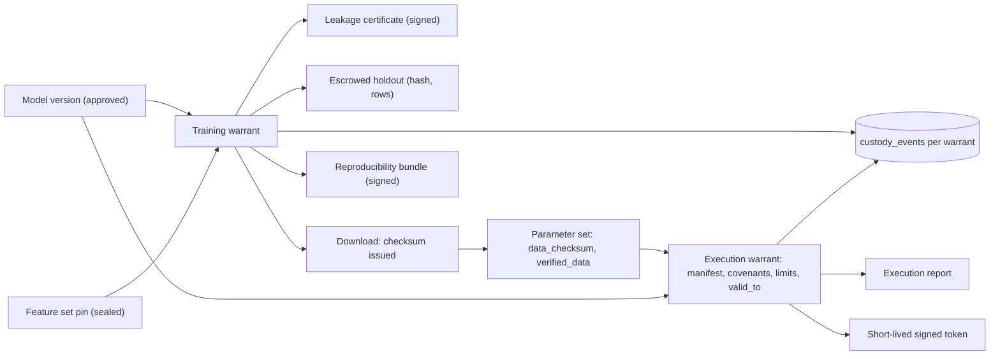
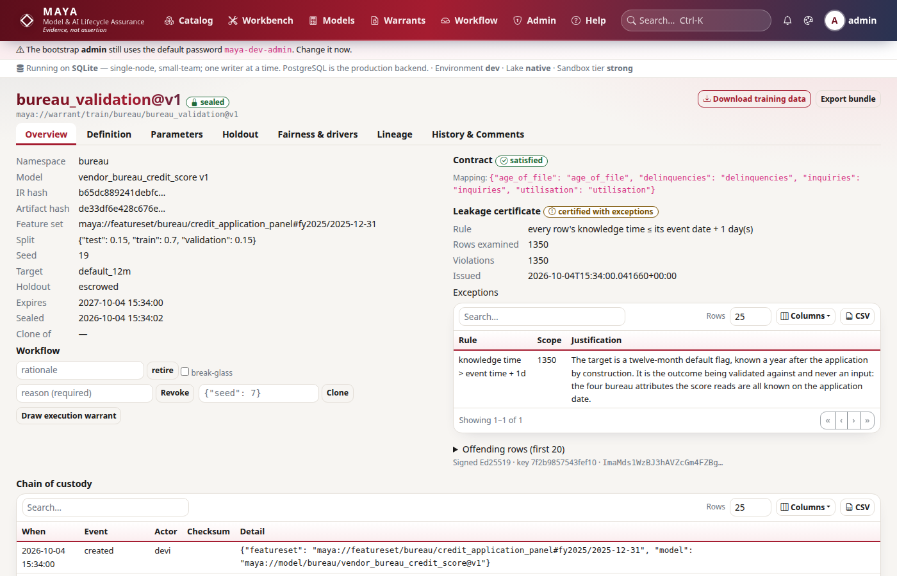
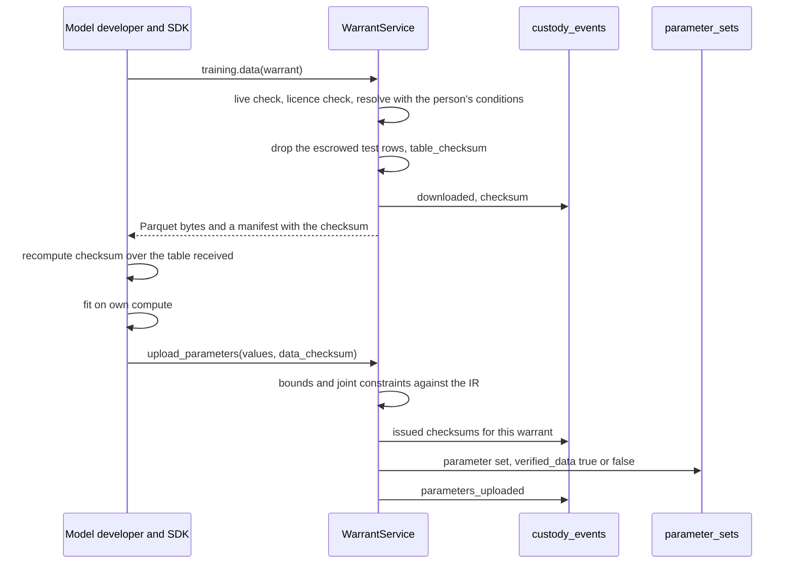
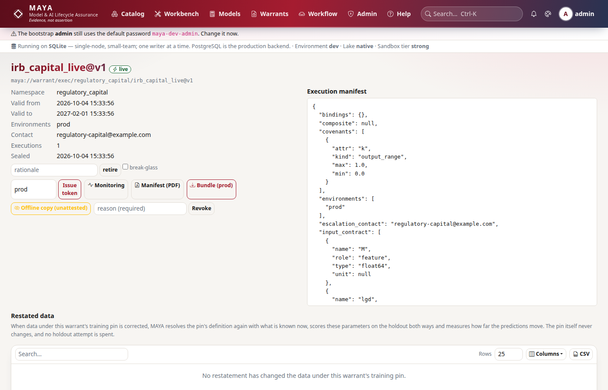

# Warrants and custody

Warrants are how MAYA governs the step from data to a running model without ever running the model itself. A training warrant binds an approved model version to a feature set pin, certifies the data free of look-ahead and escrows a holdout; parameter sets come back against it, tied to the exact data MAYA issued; an execution warrant licenses the result to run somewhere, under covenants, until a date, and fails closed the moment it should; a reproducibility bundle packages the whole so someone without MAYA can check it. Around all of them sits a custody record — every warrant's own event log, and anchors that pin the audit chain somewhere the database cannot reach. This page explains how those pieces are built and how the checks connect.

What each instrument requires, the spec keys, the covenant kinds, the lifecycle a user sees and the contents of a bundle are documented for users in the [warrants reference](../../maya/web/guides/warrants-reference.md); operating anchors is in the [audit-chain-and-custody runbook](../operations/runbooks/audit-chain-and-custody.md). This page does not repeat them.

| Module | What it does |
|---|---|
| `maya/services/warrants.py` | `WarrantService`: training warrants (create, data, seal, revoke, clone), the input contract, the leakage certificate, parameter sets and their checks, blind holdout scoring, the custody helper |
| `maya/services/execution.py` | `ExecutionService`: execution warrants, manifests, the live check, tokens, bundles for scorers, run reports, covenant evaluation, limits, expiry |
| `maya/services/bundle.py` | `BundleService`: the reproducibility bundle, its `verify.py`, and verification |
| `maya/services/custody.py` | `CustodyService`: anchoring the audit chain head (signature, file, event, RFC 3161) and verifying anchors |
| `maya/core/crypto.py` | `Signer`: Ed25519 through the `cryptography` package; refuses rather than downgrades |
| `sdk/maya/sdk/guard.py` | `WarrantGuard`: the scorer's side — check before, report after |
| `sdk/maya/sdk/io.py` | `table_checksum`: the SDK recomputes the checksum MAYA issued |

## Structure



## How it works

### Drawing a training warrant

`WarrantService.create` does its work in a fixed order and refuses at the first failure: authorization to create in the namespace; the model version approved; the feature set's licence allowing derived works; the feature set resolved *as this person may see it* (grant conditions apply, so a warrant can never issue data a direct read would have withheld); the model's input contract validated against the resolved metadata, every miss listed in a `ContractMismatch`; and the leakage certificate. A feature set given as a version is fixed to a pin reference where it can be (`_fixed_ref`), because only a pin freezes the data. Then the warrant row is written with the backend set (`Backends.provenance()`), the escrowed holdout's content hash and row count, the `created` custody event, lineage edges from the model and the pin, and the audit entry.

### The leakage certificate

The certificate proves that no row uses a value MAYA could not have known by its event time, plus an allowed lag:

```python
# maya/services/warrants.py
        unjustified = [e for e in exceptions if not e["justification"]]
        if nc and not spec.get("allow_non_causal"):
            unjustified.append({"rule": "non-causal fill without allow_non_causal"})
        status = (
            "refused"
            if unjustified
            else ("certified_with_exceptions" if exceptions else "certified")
        )
```

Two kinds of exception exist: rows whose knowledge time is later than their event date plus `leakage_lag_days`, and attributes filled by a non-causal rule (the flag set by [resolution](resolution.md)). Each needs a written justification in the spec, and non-causal fill also needs `allow_non_causal`; anything unjustified makes the certificate `refused`, and the `leakage_certified` workflow check then blocks submission. The certificate body — the rule, rows examined, violations, up to twenty example rows, exceptions, status, issue time — is canonicalised and signed with the platform's Ed25519 key. Without a crypto backend it is stored unsigned with the reason, and anything that needs a signature refuses (`CapabilityRefused`) rather than accepting an unsigned one.



### The checksum cycle

This is what turns a warrant from paperwork into a control. Every download of training data records the content hash MAYA issued in the warrant's custody log. A parameter upload names the checksum it was fitted on, and the set is `verified_data` only if MAYA issued that checksum under this warrant:

```python
# maya/services/warrants.py
        verified = bool(data_checksum) and data_checksum in issued
```



The checksum is a content hash over canonical values, not over file bytes, so the SDK recomputes it from the table it received whatever the transfer format (`Client.training_data` does so and refuses on a mismatch). A set whose checksum MAYA never issued is flagged `unverified_data`, and the `data_verified_or_justified` check stops its approval without a written, justified override. Parameter values are checked against the bounds and joint constraints the IR declares before anything is stored. A training warrant seals only when every trainable model it covers has an approved parameter set.

### Blind holdout scoring

With `holdout: escrowed`, the test partition never leaves MAYA. `holdout()` re-derives it, refuses if it no longer hashes to what was escrowed at creation ("scoring against data that moved would make every earlier score incomparable"), and returns a predictor that evaluates the IR with the given parameters — or, for a declared black box, runs its validated artifact in the sandbox. `score_holdout` returns metrics and never rows, and every attempt is counted and shown on the warrant, so a developer cannot quietly tune against the holdout. Evidence, champion and challenger comparisons and restatement impact use the same predictor ([governance.md](governance.md)). This is the narrow model-runtime exception of [ADR-007](../design/adr/ADR-007-no-model-runtime-except-blind-scoring.md).

### Execution warrants as live instruments

An execution warrant is created against a training warrant and its approved parameter set (or, for a model with no parameters, against the model version alone). Its manifest freezes the model's IR hash, the input contract, the parameter values hash, the covenants and the environments; a population-stability covenant that declares no baseline gets one, at creation, from the data the training warrant was drawn on. Once approved, `seal` sets `valid_from` and `valid_to`, and the warrant is *live*. Its status is computed, not stored:

```python
# maya/services/execution.py
    @staticmethod
    def status(ew: dict[str, Any]) -> str:
        now = utcnow()
        if ew.get("revoked_at"):
            return "revoked"
        if ew.get("suspended_at"):
            return "suspended"
        if ew.get("valid_to") and ew["valid_to"] < now:
            return "expired"
        if ew.get("sealed_at"):
            return "live"
        return ew["state"]
```

`check(ew, environment)` fails closed on anything but `live` in a listed environment, naming whom to contact; `check_allowance` refuses a run once the day's call or row allowance is spent (`QuotaExceeded` — limits throttle, where covenants suspend). `token` issues a short-lived token whose claims carry the warrant, environment, IR hash, parameters hash, subject and expiry, canonicalised and signed. `bundle` gives a scorer everything in one call — manifest, IR, member IRs, parameters, status and a token — and an offline copy is issued only as `unattested`, recorded in custody and audited, and marks the warrant as having been issued for offline use.



### Reports, covenants and suspension

Whatever runs the model reports each run: rows, and per input and output the null rate, mean, minimum and maximum (and, for inputs a PSI covenant watches, a histogram over the covenant's own bin edges). `report` checks the warrant is live, evaluates every covenant against the statistics, records the report and a lineage edge, and on any breach suspends the warrant in the same transaction:

```python
# maya/services/execution.py
                reason = "; ".join(b["detail"] for b in breaches)
                uow.repo("execution_warrants").update(
                    ew_id, {"suspended_at": utcnow(), "suspend_reason": reason}
                )
                self.p.warrants._custody(
                    uow,
                    ew_id,
                    "suspended",
                    "covenant-monitor",
                    detail={"breaches": breaches},
                    warrant_type="exec",
                )
```

The next call against the warrant is refused with `WarrantSuspended`. `WarrantGuard` in the SDK packages both ends for a scorer: it checks liveness before calling the scoring function (caching the answer for `recheck_seconds`), computes the statistics afterwards over the covenant's bin edges, reports, and forgets its cached answer if the report came back suspended. Reinstatement and revocation are separate, audited operations; the periodic-review sweep suspends through the same columns with its own reason, and recording the review lifts only those suspensions ([governance.md](governance.md)). Expiry is computed from `valid_to`; the scheduler's hourly `execution.expiry_notices` task only notifies.

### Reproducibility bundles

`BundleService.export` writes a zip holding the warrant, the model version and its IR, the generated reference implementation, the parameter set, the training data and its manifest, the leakage certificate, the environment and backend set, MAYA's canonical encoder and chunker (`lib/canonical.py`, `lib/chunker.py` — they *are* the definition of the hash) and `verify.py`. The manifest records each file's SHA-256, the data's canonical content hash, whether the model can be re-executed and, if so, the hash of its output over the data; the file list is signed. The bundle is stored as a blob and its export is a custody event.

```python
# maya/services/bundle.py
        manifest["signature"] = self.p.signer.signature_block(
            json.dumps(manifest["files"], sort_keys=True, separators=(",", ":")).encode()
        )
```

`verify.py` needs Python, `pyarrow` and `numpy` and nothing from MAYA: it recomputes every file hash, the data's content hash and — where the model is re-executable — the output hash. Where re-execution is impossible (a declared black box) the bundle says so instead of implying a verification it cannot perform. `maya.offline(bundle)` in the SDK opens the same file ([sdk.md](sdk.md)).

### Custody

Each warrant's `custody_events` are an append-only list — created, downloaded (with checksum), parameters uploaded, every workflow transition, sealed, suspended, offline issued, bundle exported (with the blob digest) — written by `WarrantService._custody` in the transaction of the change they record.

The audit chain proves the whole log is internally consistent, but someone with database write access could rewrite history and recompute every hash after it. `CustodyService.anchor` pins the current head (`seq`, `head`, `at`) where the database cannot reach, by every method in `custody.anchor.methods`: an Ed25519 signature; a JSON line appended to `custody.anchor.file` (worth something only on WORM or off-host storage); an `audit.anchored` event, so every webhook subscriber holds a copy; and an RFC 3161 timestamp from a TSA (off by default, because it sends the head hash to a third party; with a CA file configured the TSA's signature is checked, [ADR-028](../design/adr/ADR-028-tsa-signature-checked-against-its-ca.md)). It refuses to anchor a chain that does not verify — anchoring it would certify tampering. The scheduler anchors every `custody.anchor.interval_seconds`. `verify` checks each anchor against the live chain: a head that is no longer at its position means history before it was rewritten, even if the rewritten chain verifies on its own; it also checks the signature, that the signing key is this MAYA's, the file line and the TSA token.

## Example

```python
# The scorer's side, in whatever runs the model (MAYA never does)
from maya.sdk.guard import WarrantGuard

guard = WarrantGuard(my, execution_warrant_id, environment="prod")
predictions = guard.score(model.predict, frame)   # refused if suspended, expired or revoked

# A regulator's bundle, and its verification by MAYA or by anyone with verify.py
out = my.training.export_bundle(training_warrant_id)
data = my.admin.blob(out["blob"])["data"]
print(my.training.verify_bundle(data))

# The audit chain and its anchors (administrators)
print(my.custody.verify())
```

```bash
# Export and verify from the CLI
maya export bundle <training-warrant-id> --out bureau_validation.mayabundle
maya export verify bureau_validation.mayabundle
```

## How it connects

- Warrants read pins ([lake-and-storage.md](lake-and-storage.md)), resolve feature sets with the reader's conditions ([resolution.md](resolution.md), [security.md](security.md)) and evaluate the IR ([formula.md](formula.md)).
- Every warrant and parameter set moves through the [workflow engine](workflow.md), whose checks `contract_valid`, `leakage_certified`, `parameters_within_bounds`, `data_verified_or_justified` and `parameters_approved` are methods here.
- [Governance](governance.md) builds monitoring, evidence, challengers, batch scoring and restatement impact on the reports and the holdout predictor; the review sweep suspends through the same columns.
- Signing uses the `crypto` seam ([plugins.md](plugins.md)); anchors and the audit chain rest on [persistence](persistence.md).

Gates that protect it: the suites `tests/test_warrants.py`, `tests/test_sc2_aged_warrant.py`, `tests/test_custody.py`, `tests/test_parameter_files.py`, `tests/test_sdk_modes.py` (bundles opened offline), `tests/test_composite_governance.py` and `tests/test_restatements.py`.

## What it does not do

MAYA does not train, serve or run the model under an execution warrant: it licenses, checks and records. A guard and a report are only as honest as the code that calls them — a scorer that never asks and never reports leaves no trace, which is why runs scored through a guard are labelled attested and an offline copy is labelled unattested. Covenants are evaluated on reported statistics, not on rows MAYA sees. Custody anchors on the same disk only raise the bar. A bundle's signature is checked against the key in its own manifest; whether that key is your MAYA's is for the verifier to compare. A warrant retired or withdrawn through the workflow reads as such whatever was sealed, so it stops licensing at once; revoking is still the act for taking a model out of service with a recorded reason.

Extending it: covenant kinds and new instruments are not an extension point; the developer guide's [extension-points.md](../developer/extension-points.md) says what is and is not pluggable.
