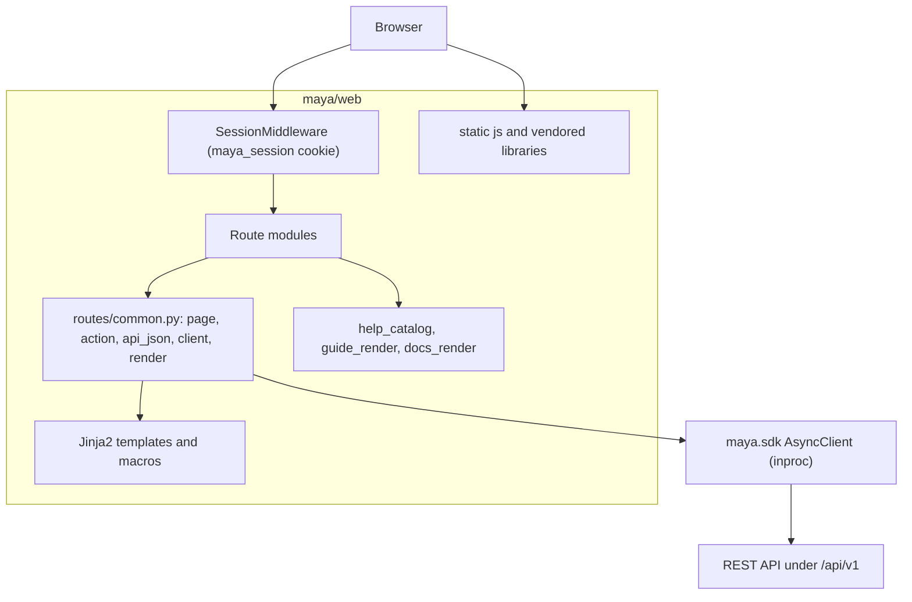
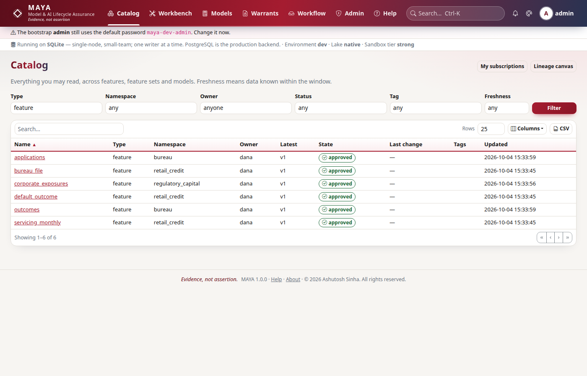
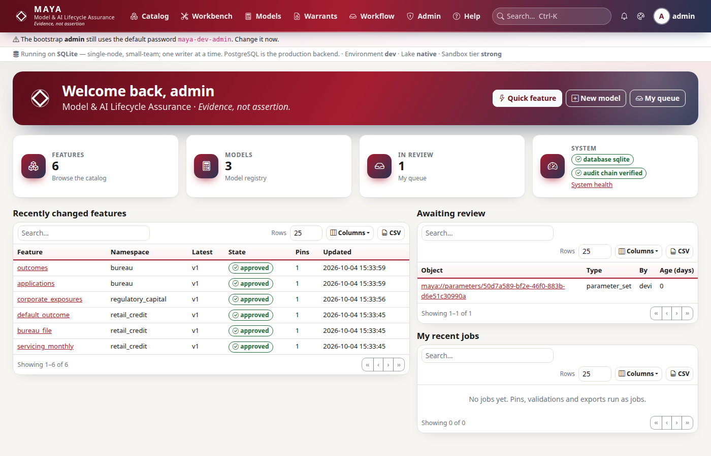
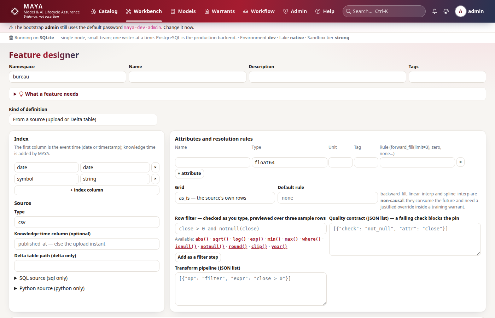
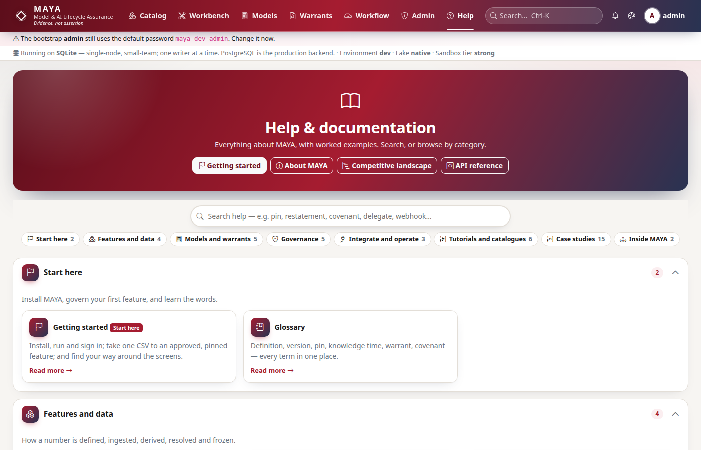

# Web UI

The web UI is the screen most people see: server-rendered Jinja2 pages over vendored Bootstrap 5 and jQuery, mounted beside the REST API in the same ASGI application. It is built as an ordinary client of MAYA — every page calls the Python SDK with the signed-in user's session token, over an in-process transport — so the browser has exactly the powers the API gives that person and no others. This page explains how that is wired, how a page is rendered, and how the help system serves the guides and these architecture pages.

| Module | What it does |
|---|---|
| `maya/web/app.py` | `mount_web`: session middleware, `/static`, and every route module's router |
| `maya/web/routes/common.py` | The per-request SDK client, the `page` / `action` / `api_json` decorators, CSRF, rendering with the page chrome |
| `maya/web/routes/*.py` | One module per area: `auth`, `home`, `catalog`, `lineage`, `workbench`, `workspaces`, `models`, `warrants`, `governance`, `integrations`, `llm`, `workflow`, `admin` |
| `maya/web/routes/tables.py` | `TABLES`, the registry of server-paged tables behind `GET /ui/table/<name>` |
| `maya/web/templates/` | Jinja2 templates; `_macros/` holds the one table macro, `_rows.html` the row macros shared by first and later pages |
| `maya/web/static/js/` | Page behaviour declared by `data-*` attributes: tables, editors, the expression mirror, the lineage canvas, the kernel wizard, WebAuthn |
| `maya/web/static/vendor/` | Bootstrap, Bootstrap Icons, jQuery, CodeMirror 5, Cytoscape, KaTeX — vendored, no build step |
| `maya/web/help_catalog.py` | The help subjects: their cards, opening parts and the guide each continues with |
| `maya/web/guide_render.py` | Renders `maya/web/guides/*.md` into help pages, cached until the file changes |
| `maya/web/docs_render.py` | Renders `docs/architecture` and `docs/developer` inside Help, Mermaid replaced by pre-drawn SVG |
| `maya/web/kernel_templates/` | The compute-kernel wizard's library of worked formulae |

## Structure



## How it works

### Mounted beside the API, reaching it only through the SDK

The composition root, `maya/server.py`, builds the API application and then mounts the web UI on the same FastAPI object. `mount_web` adds a signed session cookie, the static files and the route modules, each with `include_in_schema=False` so no page appears in the OpenAPI document.

```python
# maya/web/app.py
def mount_web(app: FastAPI, *, secret_key: str, secure_cookies: bool) -> None:
    """Attach sessions, static assets and every UI route to ``app``."""
    app.add_middleware(
        SessionMiddleware,
        secret_key=secret_key,
        session_cookie="maya_session",
        max_age=SESSION_SECONDS,
        same_site="lax",
        https_only=secure_cookies,
    )
    app.mount("/static", StaticFiles(directory=str(STATIC)), name="static")
# ...
        app.include_router(module.router, include_in_schema=False)
```

The cookie holds the MAYA session token, the username, the roles and the CSRF token — nothing the server trusts for authorization. Authorization happens in the API, from the token, on every call.

Every route reaches MAYA through one function:

```python
# maya/web/routes/common.py
def client(request: Request) -> AsyncClient:
    """The SDK, bound to the logged-in user's session token, over ASGI in-process."""
    return AsyncClient(app=request.app, token=request.session.get("token"), channel="web")
```

`AsyncClient(app=...)` builds an `httpx.AsyncClient` over `httpx.ASGITransport`, so the request runs through the whole ASGI stack — the limits middleware, the tracing span, the authentication dependency, the router, the service — and skips only the socket. The `channel="web"` header is what lets the audit log say a change came from the browser. The same request from a notebook would differ only in its transport. The SDK side of this is on [sdk.md](sdk.md).

Why not call the services directly, which would be faster? Because then the browser would have a second, privileged path, and every rule would have to be enforced twice and kept identical by hand. `tools/ci/import_boundaries.py` makes the shortcut impossible rather than discouraged:

```python
# tools/ci/import_boundaries.py
WEB_ALLOWED = ("maya.sdk", "maya.core.version", "maya.core.errors")
# ...
            if (
                mod.startswith("maya.web")
                and name.startswith("maya")
                and not name.startswith(WEB_ALLOWED + ("maya.web",))
            ):
                failures.append(f"{mod}:{line} imports {name}; maya.web may use only maya.sdk")
```

`maya.core.errors` is on the allowed list because it is now the same module as `maya.sdk._shared.errors` (see [sdk.md](sdk.md)), and `maya.core.version` because the page chrome prints the version.

### Three decorators, three kinds of route

A route is one of three kinds, and its decorator decides what happens before the body runs and what an error becomes.

| Decorator | For | Before the body | A `MayaError` becomes |
|---|---|---|---|
| `page` | `GET` screens | login, outstanding MFA, forced password change | the error page, with the error's HTTP status |
| `action` | state-changing `POST` | login, MFA, CSRF check | a flash message on the previous page and a `303` back |
| `api_json` | JSON for the page's own scripts (`/ui/jobs/<id>`, `/ui/table/<name>`, `/ui/kernel`) | login, CSRF on unsafe methods | a JSON body with `error`, `type` and `context` |

```python
# maya/web/routes/common.py
def page(fn: Callable[..., Awaitable[Any]]) -> Callable[..., Awaitable[Any]]:
    """GET page: requires login; MAYA errors render as an error page, not a traceback."""

    @functools.wraps(fn)
    async def wrapper(request: Request, *args: Any, **kwargs: Any) -> Any:
        if not request.session.get("token"):
            return _login_redirect(request)
        gate = _mfa_gate(request)
        if gate is not None:
            return gate
# ...
        except NotAuthenticated:
            request.session.clear()
            return _login_redirect(request)
        except MayaError as exc:
            return await render(request, "error.html", {"error": exc}, status=_status(exc))
```

`NotAuthenticated` is handled before the general case on purpose: a session the API no longer recognises (revoked, expired, signed out elsewhere) clears the cookie and sends the person to sign in, rather than showing them an error page they cannot act on.

A typical page body is short — it asks the SDK and renders:

```python
# maya/web/routes/catalog.py
@router.get("/catalog")
@page
async def browse(request: Request) -> Any:
    qp = request.query_params
    chosen = {f: qp.get(f) or None for f in FACETS}
    chosen["type"] = chosen["type"] or "feature"
    async with client(request) as sdk:
        facets = await sdk.catalog.facets(type=chosen["type"])
        table = await first_page(request, sdk, "catalog", q=qp.get("q") or None, **chosen)
    return await render(
        request,
        "catalog/browse.html",
        {"page": table, "facets": facets, "sel": chosen, "q": qp.get("q", "")},
    )
```



### Rendering and the page chrome

`render` merges the route's context with the *chrome* every page shows: the unread notification count and a health summary (environment, database dialect, lake backend, sandbox tier, whether the bootstrap administrator still has the default password). The chrome is itself fetched through the SDK (`access.inbox`, `admin.health`), and the health half is cached in-process for 30 seconds (`HEALTH_TTL`) because every page would otherwise ask for it. The banners at the top of each screenshot on these pages come from there.



`asset_version()` appends a token, computed once at import from the newest non-vendored CSS or JS file under `static/`, to every stylesheet and script URL, so a browser holding yesterday's `theme.css` cannot lay out today's markup with it.

### Tables

Every table in MAYA is drawn by one macro (`templates/_macros/table.html`) and enhanced by `static/js/table.js`, which is [ADR-016](../design/adr/ADR-016-universal-table-contract.md). Tables that can grow without bound render page one with the page and fetch later pages from `GET /ui/table/<name>`, which `routes/tables.py` serves from a registry:

```python
# maya/web/routes/tables.py
@dataclass(frozen=True)
class Table:
    fetch: Callable[..., Any]  # (sdk, query params, **paging) -> awaitable page
    row: str  # macro in templates/_rows.html
    sorts: dict[str, str]  # column header -> server sort key
    default_sort: str
    filters: tuple[str, ...] = field(default=())
    needs_csrf: bool = False
```

`fetch` calls an SDK `*_page` method, so later pages use the API's cursor paging (see [api.md](api.md)); `row` names the macro that renders one row, used for page one and every later page alike, so a row is defined once. `tools/ci/table_contract.py` fails the build when a route pages a table that is not in `TABLES`, or a registered table names a row macro that does not exist.

### Browser code

The content security policy is `script-src 'self'` (set in `maya/api/app.py`), so there is no inline script anywhere. Pages declare behaviour with `data-*` attributes and the scripts under `static/js/` attach it: `app.js` (job polling, JSON validation, confirmations), `table.js`, `editors.js` (CodeMirror 5, [ADR-020](../design/adr/ADR-020-codemirror-5.md)), `expr.js` (a mirror of the expression grammar for autocomplete and inline checking — the server re-parses everything on save), `lineage.js` (Cytoscape), `kernel.js`, `pin_preview.js`, `policy.js` and `webauthn.js`. None of them decides anything; each is a convenience over a server call that would refuse the same thing.



### The help system

Help is organised by subject (`help_catalog.SUBJECTS`): each subject opens with short worked *parts* (`templates/help/parts/<slug>.html`) and continues with a full reference guide in Markdown (`maya/web/guides/<slug>.md`). `guide_render.render` converts a guide with Python-Markdown, turns code blocks into captioned, copyable examples and admonitions into the help boxes, and caches the result keyed by the file's modification time.



`docs_render.py` serves the pages you are reading under `/help/docs/<group>/<page>`. It renders the same Markdown files a reader sees on GitHub, with three changes: each Mermaid block is replaced by the SVG `tools/docs/diagrams.py` drew from it, named by a hash of the block's source so a page can never show a stale picture; links between these pages stay inside Help, and links to the guides go to the Help subject that carries them; and a link to any other repository file keeps its text and loses its target. An installed package has no `docs/` folder, so these pages are offered only from a checkout.

## Example

The page above and a notebook make the same call. From a notebook:

```python
# The catalog listing the browse page renders, from a script
import maya.sdk as maya

my = maya.connect(base_url="https://maya.example.com", api_key="maya_prod_...")
page = my.catalog.browse_page(type="feature", namespace="bureau", page_size=25)
for row in page["items"]:
    print(row["name"], row["state"])
```

And from a test, exactly as the web tier does it — in-process, with a session token:

```python
# The web tier's client, built by hand against an application object
from maya.sdk import AsyncClient

async with AsyncClient(app=app, token=session_token, channel="web") as sdk:
    feature = await sdk.features.get("maya://feature/bureau/applications")
```

## How it connects

- It calls only the [SDK](sdk.md), which calls the [API](api.md); every rule a page appears to enforce is enforced in the [services](services.md).
- Sign-in, MFA and SSO pages (`routes/auth.py`) drive the flows described on [security.md](security.md); the browser never sees a password hash or a provider secret.
- Long operations started from a page are [jobs](jobs-and-scheduler.md); the page polls `/ui/jobs/<id>`, which asks the SDK for the job.

Gates that protect it: `tools/ci/import_boundaries.py` (web imports only the SDK), `tools/ci/ui_parity.py` (every SDK endpoint is reached by some page or action, with named exceptions), `tools/ci/table_contract.py`, `tools/ci/contrast.py` (colour contrast computed from `tokens.css` in both schemes), and the suites `tests/test_web.py`, `tests/test_web_journeys.py`, `tests/test_browser*.py` (real headless Chrome) and `tests/test_docs_inside.py` (Help serves these pages with working links).

## What it does not do

It holds no rules and no data of its own. It does not cache API answers beyond the 30-second health summary. It has no build pipeline: a library that needs a bundler is not used ([ADR-015](../design/adr/ADR-015-bootstrap-jquery-harvard-crimson.md), [ADR-020](../design/adr/ADR-020-codemirror-5.md)). And a JavaScript check passing in the browser is never the check that counts — the server re-validates everything it is sent.

Extending it: adding a screen is covered in the developer guide, [api-endpoints.md](../developer/api-endpoints.md) (the endpoint, its SDK method and the page that reaches it) and [testing-and-gates.md](../developer/testing-and-gates.md).
