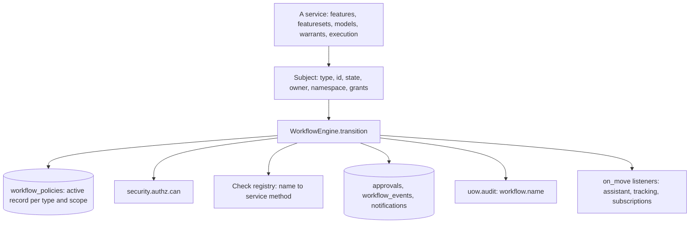
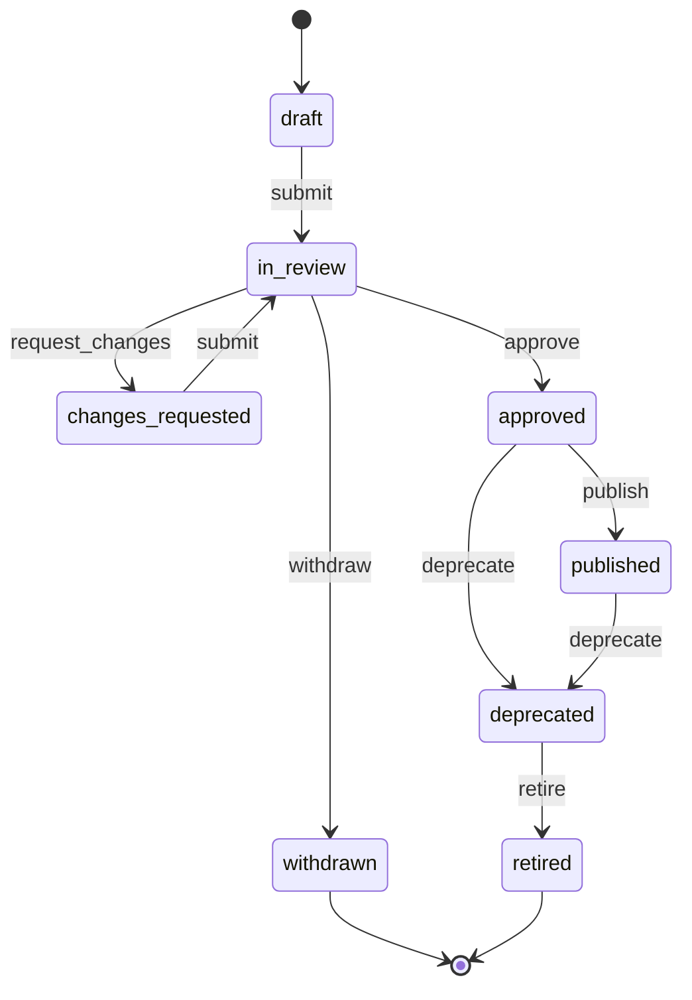
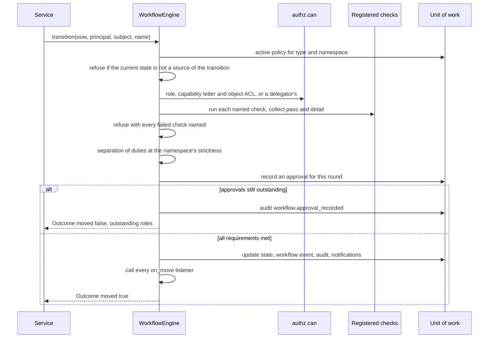
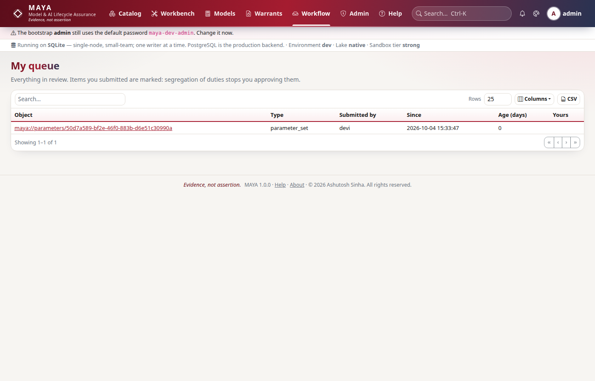

# Workflow

One engine drives the lifecycle of every governed object in MAYA — feature versions, feature set versions, model versions, parameter sets, training warrants and execution warrants. A service hands the engine a *subject* (the object's type, id, state, owner, namespace and grants) and names a transition; the engine finds the active policy, refuses a transition from the wrong state, authorizes the actor, runs the policy's named checks, applies separation of duties, accumulates approvals, and records the move — or, for break-glass, skips the checks and approvals loudly and permanently. This page explains how the engine is built, how policies are stored and validated as data, how checks are registered by the services, and how delegation, escalation and the recorded challenger hang off it.

What each shipped policy requires, the policy format, every check, SLAs, comments, campaigns and access requests are documented for users in the [workflow reference](../../maya/web/guides/workflow-reference.md); policy-in-the-UI is [ADR-017](../design/adr/ADR-017-workflow-policy-in-the-ui.md). This page does not repeat them.

| Module | What it does |
|---|---|
| `maya/workflow/engine.py` | `Subject`, `Outcome`, `WorkflowEngine`: policy lookup, the transition, checks, separation of duties, approvals, delegation, break-glass, notifications, listeners |
| `maya/workflow/policy.py` | Policies as data: validation on edit, the `when` conditions, the YAML projection, `transitions_from` |
| `maya/workflow/default_policies.yaml` | The seeded policies — an initial projection; the stored record becomes the authority |
| `maya/services/workflow_service.py` | Policy drafting, preview and activation; the queue, the review screen, history, comments, delegations, aging, escalation, campaigns |
| `maya/services/registry.py` | `_checks` binds each named check to a service method; `wire` adds the move listeners; `dispatch_transition` routes a transition by object type |
| `maya/services/assistant.py` | `on_move`: the recorded challenger's hook |

## Structure



The engine is stateless apart from two registries and its settings. It holds no reference to any service: services give it subjects and register checks and listeners with it, so the dependency runs one way.

## How it works

### Subjects and policies

A service builds the subject from the rows it has already loaded and calls the engine inside its own unit of work — so the state change, the approval rows, the workflow event, the audit entry and the notifications commit with whatever else the service did, or not at all:

```python
# maya/services/features.py
            outcome = self.p.workflow.transition(
                uow,
                p,
                self.subject(uow, feature, ns, version),
                name,
                rationale=rationale,
                force=force,
            )
            if outcome.moved:
                uow.repo("features").update(feature["id"], {"status": outcome.state})
                if outcome.state == "approved":
                    self._lineage(uow, feature, ns, version)
```

The policy is looked up per transition: the active record for the object type scoped to the subject's namespace, else the global (`*`) one. Policies are rows in `workflow_policies`, versioned and seeded once from `default_policies.yaml`; after that the stored record is the authority and YAML is only an import and export projection. Editing a policy creates a draft version; `WorkflowService.activate` supersedes the old active version and refuses when the person activating it drafted it — the rules of governance are governed too.

`policy.validate` runs when a policy is edited, not when it bites: an unknown or unreachable state, a check nobody registered, a role that does not exist, an approval no role could ever satisfy, or a `when` condition outside its tiny grammar (`prod`, `env == 'prod'`, `env != 'nonprod'` and their siblings) is refused before the policy can be saved. A condition MAYA cannot read is refused rather than read as "always", because that is how an unnoticed condition would quietly add an approver — or drop one.



The diagram is the seeded `feature_version` policy; other object types share the states with fewer transitions (a parameter set has no `publish`, a warrant retires from `approved`). Sealing a warrant and suspending an execution warrant are not workflow transitions — they are separate service operations that require the workflow state they depend on.

### The transition

```python
# maya/workflow/engine.py
        if force:
            return self._break_glass(uow, p, subject, name, t, rationale, record)
        acting = self._acting(uow, p, subject, t, name)
        results = self._run_checks(uow, subject, t)
        failed = [r for r in results if not r["passed"]]
        if failed:
            raise NotApproved(
                "Blocked by check(s): "
                + "; ".join(f"{r['check']} — {r['detail']}" for r in failed),
                checks=results,
            )
```



Authorization is the same `can()` every surface uses (see [security.md](security.md)): the transition may name roles, and a capability letter that maps to an action (`A` → approve, `U` → submit, `C` → create, `P` → seal). Checks run before separation of duties so a person learns what is wrong with the object before learning they may not approve it.

### Checks are registered by the services

A policy names checks; the engine runs whatever is registered under each name, passing the unit of work and a context holding the subject and its row:

```python
# maya/workflow/engine.py
    def _run_checks(self, uow: Any, subject: Subject, t: dict[str, Any]) -> list[dict[str, Any]]:
        out = []
        for check in t.get("checks") or []:
            fn = self.checks.get(check)
            if fn is None:
                out.append({"check": check, "passed": False, "detail": "check is not registered"})
                continue
            passed, detail = fn(uow, {"subject": subject, "row": subject.row, **subject.context})
            out.append({"check": check, "passed": bool(passed), "detail": detail})
        return out
```

A check that is named but not registered *fails* — it never passes by absence. The registrations are in `registry._checks`: `definition_valid` and `quality_passes` are defined there; the rest are service methods — `members_approved` on feature sets; `formula_typechecks`, `spec_document_complete`, `code_artifact_validated`, `code_matches_specification`, `no_live_execution_warrant`, `spec_true_build` and `composite_members_mature` on models; `contract_valid`, `leakage_certified`, `parameters_within_bounds` and `data_verified_or_justified` on warrants; `parameters_approved` on execution; `no_open_blocking_comments` on the workflow service. Each returns `(passed, detail)`, and the detail is what the refusal quotes. The plugin registry lists them at its `workflow_check` point after wiring (see [plugins.md](plugins.md)).

### Separation of duties, rounds and approvals

```python
# maya/workflow/engine.py
        level = subject.namespace.get("sod", "strict")
        if level == "none":
            return None
        row = subject.row
        involved = (
            {row.get(k) for k in SUBMITTERS if row.get(k)}
            if level == "strict"
            else {row.get("submitted_by") or row.get("created_by")}
        )
```

At `strict` (the default), whoever created, submitted or last modified the object may not approve it; at the namespace's lighter level only the submitter is excluded; at `none` nobody is. `workflow.allow_self_approval` turns the check off, and the engine honours it only in a `dev` environment. A transition's `approvals` list `{role, count}` requirements, each optionally conditional on the namespace's environment; approvals accumulate per *round*, where a round is the number of `submit` events so far, so resubmitting after changes starts the count again. One person cannot approve twice in a round, directly or through a delegation, and an approval is recorded against the first outstanding role the approver holds.

### Delegation

When the actor's own authorization fails and the transition takes approvals, `_acting` looks for an active delegation to the actor covering the object type, loads each delegator's principal (`principal_loader`, set by `wire` to `auth.build_principal`) and authorizes as the first delegator who passes. Separation of duties is then applied to both people, and the approval is recorded with `on_behalf_of`, so the record says who clicked and whose authority they used.

### Break-glass

`force=True` skips checks, separation of duties and approvals. It is reserved to administrators, needs a written reason of at least ten characters, marks the row `force_approved`, writes the workflow event with `forced`, audits `workflow.break_glass` (which is also an event a webhook can receive), and notifies the owner in addition to the policy's audience with a `BREAK-GLASS:` prefix. Nothing about it is quiet, and nothing undoes the record.

### Listeners: the recorded challenger and other consequences

```python
# maya/workflow/engine.py
    def on_move(self, fn: Callable[[Any, Subject, str, str], None]) -> None:
        """Observe moves (e.g. to queue the challenger's memo); a listener never blocks one.
```

`wire` registers three listeners, called after every move inside its transaction: the assistant's `on_move` queues a challenger memo when a feature, feature set or model version reaches `in_review`; tracking marks dependants that follow an approved version for re-approval; subscriptions notify followers. The challenger hook is structural: the memo is queued in the move's transaction (so it exists only if the submission commits), written later by an `assistant.challenge` job, stored in its own table, and read by no check — it can inform a reviewer and can neither approve, block nor edit anything. See [ai-and-documents.md](ai-and-documents.md).

### Queues, aging and escalation

The queue and the review screen are reads over objects `in_review` that the caller may see. `aging` compares each item's age with its policy's `sla_days.in_review`, and the scheduler's `workflow.escalate_overdue` task, hourly, notifies the namespace owner (or every administrator, when the namespace has none) once per item, then audits how many it sent. Campaigns apply one transition to many objects through `dispatch_transition`, recording per-item outcomes and one audit record; each item still goes through the full engine.




## Example

```python
# Submit a model version, approve it as a manager, and read why a transition was refused
my.models.transition("retail_credit/pd_logit", 1, "submit", rationale="ready for validation")

mgr = maya.connect(profile="manager")
try:
    mgr.models.transition("retail_credit/pd_logit", 1, "approve", rationale="validated")
except maya.NotApproved as exc:
    for c in exc.context.get("checks", []):
        print(c["check"], c["passed"], c["detail"])

# Delegate approvals of model versions for a week
mgr.workflow.delegate(to="mgr2", starts_on="2026-10-05", ends_on="2026-10-12",
                      object_types=["model_version"], reason="leave")
```

```bash
# The policies in force, one as its YAML projection, and activating another's draft
maya admin policy-list
maya admin policy-show <policy-id>
maya admin policy-activate <policy-id>
```

## How it connects

- Every governed service ([resolution.md](resolution.md), [formula.md](formula.md), [warrants-and-custody.md](warrants-and-custody.md)) calls the engine inside its unit of work; [services.md](services.md) shows where checks and listeners are registered.
- Authorization comes from [security](security.md); delegations, approvals and events are rows in [persistence](persistence.md); escalation is a [scheduler](jobs-and-scheduler.md) task.
- Every move is an audit entry and, named `<object_type>.<state>`, an event subscribers can receive ([integrations.md](integrations.md)).

Gates that protect it: the suites `tests/test_workflow_matrix.py`, `tests/test_workflow_and_estate.py`, `tests/test_delegation.py`, `tests/test_approval_conditions.py`, `tests/test_review_screen.py`, `tests/test_break_glass_login.py`, `tests/test_tracking_and_notices.py` and `tests/test_assistant.py`.

## What it does not do

It does not decide what a check means — services do — and a check name it cannot find fails rather than passes. It does not let a policy be edited in place or activated by its author. It does not let any listener block or change a move. Break-glass is not a hidden path: it is an administrator's override that is recorded, notified and permanent. And it is not a general workflow engine: the object types are the six governed ones, declared in `policy.OBJECT_TYPES`.

Extending it: writing a new workflow check and making a policy cite it is in the developer guide, [workflow-checks.md](../developer/workflow-checks.md).
