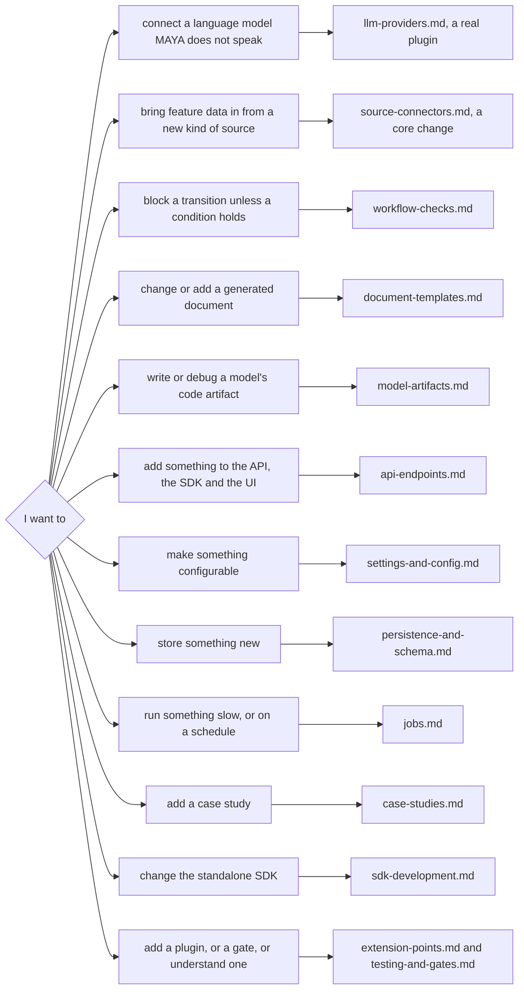

# Developer guide

This guide is for someone who will change MAYA's code: extend it at one of its seams, add a capability end to end, or fix something without breaking the controls around it. It assumes you can read Python and have used MAYA as a user; it does not assume you know the architecture, and it points to the page that explains each part when you need it.

Three other sets of documents sit beside this one, and the division matters, because a rule written in two places is a rule that will one day say two things:

| To learn | Read |
|---|---|
| **how** a component works inside | the [architecture pages](../architecture/README.md) |
| **what the rules are** for a user — definitions, refusals, settings, endpoints | the in-product references in [`maya/web/guides/`](../../maya/web/guides/), the [API guide](../reference/API_GUIDE.md), the [specification](../design/MAYA_Requirements_and_Design.md) |
| **how to operate** it | the [operations guide](../../maya/web/guides/operations-guide.md) and the [runbooks](../operations/runbooks/) |
| **how to change or extend** it | this guide |

Each page here says when you would do the thing it describes and which files you will touch, draws the pieces, walks through a worked example against the real code, says how to test it and which gates will fail until you finish, and ends with the mistakes people make. Examples that are quotes of the source begin with the file's path and are copied verbatim; examples that propose new code say so in their first line, and were run against the code before they were written down.

## Setting up

MAYA needs **exactly Python 3.13** (the server's pinned requirements are built for it; `pyproject.toml` says `>=3.13,<3.14`). The standalone SDK, `sdk/`, accepts 3.13 or later. Working in PyCharm or IntelliJ IDEA: [running MAYA in the IDE](../getting-started/IDE.md) covers the interpreter, the run configuration, debugging and the test runner. The [quick start](../getting-started/QUICKSTART.md) has the per-platform detail for getting it; the development environment is the user's plus the test and gate tools:

```bash
python3.13 -m venv .venv
.venv/bin/pip install -e ./sdk -r requirements.txt -r requirements-dev.txt
git config core.hooksPath .githooks          # the pre-commit gate ladder, and the commit-msg check
```

The `-e ./sdk` is not optional. The SDK is its own project, `maya-sdk`, in `sdk/`, and the server depends on it like any client; installing it editable is what makes `maya.sdk` importable from your working copy ([sdk-development.md](sdk-development.md) explains the namespace package that makes this work). Install both requirement files: with only the first the suite runs, and goes green at a smaller count, because tests whose tools are absent are skipped.

A few things are optional and their tests skip without them: Playwright and an installed Chrome for the browser tests, PostgreSQL for the PostgreSQL runs and the multi-process server tests, bubblewrap for the strong sandbox tier, Tectonic for true LaTeX builds, `curl` and `jq` for the API guide's shell examples. `pytest-xdist` is needed by `tools/ci/quick.py` and is not in `requirements-dev.txt`.

## Running MAYA and the tests

```bash
.venv/bin/python run_maya_web.py                       # http://127.0.0.1:8600, admin / maya-dev-admin
.venv/bin/python run_maya_web.py --server.port=8700    # any setting, as --key=value
.venv/bin/python run_maya_web.py --worker              # a job worker process, no web server
```

`run_maya_web.py` is the only supported way to start MAYA; a second way to start a server is a second set of startup invariants to get wrong. It reads `config/application.yaml` and keeps the estate — database, lake, blobs, keys — under `data/`. That estate is a development estate; when a schema change makes it refuse to start, either carry it across with the estate export ([persistence-and-schema.md](persistence-and-schema.md)) or delete `data/` and let MAYA build a fresh one. The case studies write into the same estate, which is how you get realistic content to develop against: `.venv/bin/python case_studies/01-retail-credit-pd-scorecard/run.py`.

```bash
.venv/bin/python -m pytest tests/test_plugins.py -q    # one area: what you will run most
.venv/bin/python tools/ci/gates.py                     # the static gates, as the commit hook runs them
.venv/bin/python tools/ci/gates.py --tests             # then the whole suite, coverage floor and case studies
```

Tests build their own platforms on temporary storage and never touch `data/`. [testing-and-gates.md](testing-and-gates.md) covers the fixtures, every gate, and how to run subsets.

## The repository, as a developer sees it

| Path | What it is | Guide |
|---|---|---|
| `maya/` | the server: a namespace package with no `__init__.py` | |
| `maya/services/` | the domain: one service per area, wired in `registry.py`; `mypy --strict` | most guides |
| `maya/api/` | the REST API: routers, schemas, the app and its `ROUTERS` | [api-endpoints.md](api-endpoints.md) |
| `maya/web/` | the web UI: routes, templates, the in-product guides; an SDK client and nothing more | [api-endpoints.md](api-endpoints.md) |
| `maya/persistence/` | the only database code: ORM models, the two generated schema files, the unit of work | [persistence-and-schema.md](persistence-and-schema.md) |
| `maya/resolution/`, `maya/formula/` | pure computation: resolving features, the formula IR, the artifact ladder | [source-connectors.md](source-connectors.md), [model-artifacts.md](model-artifacts.md) |
| `maya/workflow/`, `maya/jobs/` | the workflow engine and policies; the job queue and scheduler | [workflow-checks.md](workflow-checks.md), [jobs.md](jobs.md) |
| `maya/llm/`, `maya/documents/` | language-model providers and profiles; document templates | [llm-providers.md](llm-providers.md), [document-templates.md](document-templates.md) |
| `maya/config/` | the configuration schema and `Settings` | [settings-and-config.md](settings-and-config.md) |
| `maya/plugins.py` | the extension-point registry | [extension-points.md](extension-points.md) |
| `maya/testing/` | a throwaway in-process MAYA, for MAYA's tests and for users' | [testing-and-gates.md](testing-and-gates.md) |
| `maya_delta/` | the lakehouse layer, two Delta backends behind one API; no MAYA domain knowledge | |
| `sdk/` | the standalone `maya-sdk` project: its own `pyproject.toml`, version, README and licence | [sdk-development.md](sdk-development.md) |
| `tools/ci/` | the gate ladder, its locks, the schema generator | [testing-and-gates.md](testing-and-gates.md) |
| `tools/bench/`, `tools/deck/`, `tools/docs/`, `tools/ops/` | benchmarks, the deck, the specification and docs builds, dashboards | |
| `tests/` | the suite, one file per area | [testing-and-gates.md](testing-and-gates.md) |
| `case_studies/` | worked studies, run by the suite | [case-studies.md](case-studies.md) |
| `config/` | `application.yaml` (tracked, no secrets), example profile files, dashboards | [settings-and-config.md](settings-and-config.md) |

## The change workflow

1. **Find the guide** for what you are changing — the diagram below — and read its "files you will touch" table first. Most changes touch more than one layer, because the web UI reaches the server only through the SDK: a capability on screen is an endpoint, an SDK method and a page.
2. **Write the test first where you can**, imitating the neighbouring area's tests. A refusal is a feature here; test that it refuses, with its message, as well as that the happy path works.
3. **Run the area's tests, then the static gates.** `python tools/ci/gates.py` is quick, and it is what the commit hook will run anyway.
4. **Regenerate what is generated, and read the diff.** Three artefacts are written by tools rather than by hand: the API contract (`python tools/ci/api_snapshot.py --update`), the SDK's public surface (`python tools/ci/public_symbols.py --update`) and the two schema files (`python tools/ci/gen_schema.py`). A lock regenerated without reading the diff records an accident as a decision.
5. **Update the user-facing document** that states the rule you changed — the configuration reference for a setting, the workflow reference for a check, the API guide's appendix for an endpoint. Several of these are tested against the code and will fail until you do.
6. **Before you finish**, run `python tools/ci/gates.py --tests`, which adds the whole suite under a 90% coverage floor and every case study. There is no hosted CI; this is it.

The commit hooks live in `.githooks/`: `pre-commit` runs the static ladder with the project's `.venv` on the tree being committed, and `commit-msg` refuses assistant attribution trailers.

## Which guide



| Guide | When |
|---|---|
| [extension-points.md](extension-points.md) | the plugin registry, entry points and `plugins.allow` — and which points actually call a plugin (one) |
| [llm-providers.md](llm-providers.md) | a language-model provider, shipped as your own package |
| [source-connectors.md](source-connectors.md) | a new source type or SQL backend: how feature data gets in, and the contract it must meet |
| [workflow-checks.md](workflow-checks.md) | a named check, and wiring it into a policy |
| [document-templates.md](document-templates.md) | testing templates, adding a fact, adding a kind of document |
| [model-artifacts.md](model-artifacts.md) | writing, validating locally, uploading and debugging an artifact |
| [api-endpoints.md](api-endpoints.md) | an endpoint end to end: service, router, SDK, UI, locks |
| [settings-and-config.md](settings-and-config.md) | a setting, or a structured YAML file read through the configurator |
| [persistence-and-schema.md](persistence-and-schema.md) | a table or a column, with no migrations |
| [jobs.md](jobs.md) | a job type or a scheduled task |
| [testing-and-gates.md](testing-and-gates.md) | the suite, the fixtures, the gate ladder and how gates are tested |
| [case-studies.md](case-studies.md) | a new worked study |
| [sdk-development.md](sdk-development.md) | the standalone SDK: imports, `_shared`, versions, the wheel |

## What this guide does not reach

It does not explain the architecture — the guides link to the architecture pages for that — and it does not restate user-facing rules, which are tested against the code where they live and would drift here. It covers the extension points and change paths that exist; where the code has no seam, it says so instead of describing one. The clearest case is the plugin registry: it lists eleven extension points, and only `llm_provider` calls a third-party implementation, so most extensions are changes to MAYA's own code, made with the guides above. And it describes the code as it is at the time of writing. The gaps found while writing it — a stale docstring, document templates missing from the wheel, a plugin able to shadow a built-in — have since been fixed, and the pages describe the fixed code.
