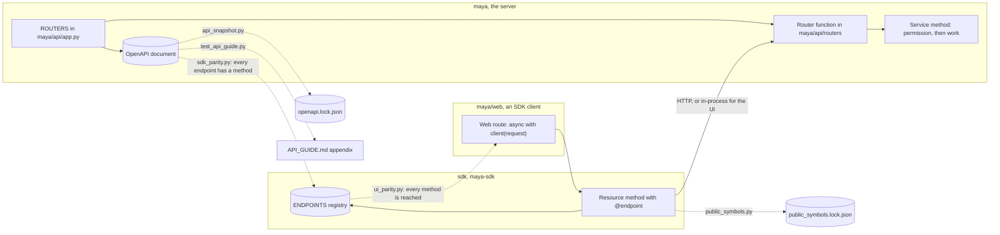

# Adding a REST endpoint

This page is for a developer adding a capability to MAYA's public API, and therefore — because of how MAYA is built — to the SDK and the web UI in the same change. It goes end to end: service, router and schema, SDK method, web page, and the locks and gates that hold the three together. How the API is structured is in [the architecture page on the API](../architecture/api.md), and the SDK's in [sdk.md](../architecture/sdk.md); what a caller sees — authentication, errors, paging, idempotency — is in the [REST API guide](../reference/API_GUIDE.md), which this page does not repeat.

One fact shapes everything below. The web UI is an SDK client: `maya/web` may import nothing from MAYA but `maya.sdk` (and the error and version modules the SDK re-exports), and `tools/ci/import_boundaries.py` fails the build otherwise. So there is no private path from a screen to a service. A capability a person can reach on screen has an endpoint and an SDK method, and a gate checks each direction.

## When you would do this, and what you touch

| File | What you add |
|---|---|
| `maya/services/<service>.py` | the behaviour, with its permission check |
| `maya/api/routers/<area>.py` | the route: parse, call the service, return `ok(...)` |
| `maya/api/schemas.py` or `schemas_governance.py` | a Pydantic model for a JSON body, if there is one |
| `maya/api/app.py`, `ROUTERS` | only for a new router module |
| `sdk/maya/sdk/resources.py` (or `governance.py`, `integrations.py`, `llm.py`) | the SDK method, decorated `@endpoint(METHOD, path)` |
| `maya/web/routes/<area>.py` and a template | the page or action that calls the SDK method |
| `tools/ci/openapi.lock.json`, `tools/ci/public_symbols.lock.json` | regenerated, and the diff reviewed |
| `docs/reference/API_GUIDE.md`, appendix | one row for the endpoint |
| `tests/test_api_contract.py` | the route in `ADMIN_ONLY` or `SELF_SERVICE` if it is either |

## How the pieces connect



## Step by step

The worked example adds `GET /system/extensions/{point}`: one extension point, its protocol, and every plugin registered at it with its status — the detail behind a row of **Admin → Extensions**. The service method, the route and the SDK method below were run together, mounted on a test platform, before this page was written.

### 1. The service method

Permission is checked in the service, never in the router, so the API, the SDK, the web UI and the CLI all meet the same rule. `OpsService.extensions` already allows administrators and techops; the new method reuses its check and its report:

```python
# maya/services/ops.py: a new service method (example)
    def extension_point(self, p: Principal, point: str) -> dict[str, Any]:
        """One extension point and every plugin registered at it, refused ones included."""
        self._techops(p, "Listing plugins is for administrators and techops")
        report = self.p.plugins.report()
        found = next((x for x in report["points"] if x["point"] == point), None)
        if found is None:
            raise NotFound(f"No extension point '{point}'; the points are {', '.join(POINTS)}")
        return {**found, "plugins": [r for r in report["plugins"] if r["point"] == point]}
```

Raise MAYA's typed errors (`maya.core.errors`): the API's exception handler turns any `MayaError` into an RFC 9457 problem document with the error's status, and the SDK turns that document back into the same class, because the two share one error module. A bare `KeyError` here would be a 500, and `tests/test_api_contract.py` asserts that nothing answers 5xx whoever calls and whatever they send.

### 2. The route

Routers are thin: parse, call, return. The existing neighbour:

```python
# maya/api/routers/retention.py
@router.get("/system/extensions", tags=["ops"])
def extensions(me: Principal = Me, plat: Any = Plat) -> Response:
    """§25's extension points, what is registered at each, and which notification channels
    are configured."""
    return ok(plat.ops.extensions(me))
```

```python
# maya/api/routers/retention.py: the new route (example)
@router.get("/system/extensions/{point}", tags=["ops"])
def extension_point(point: str, me: Principal = Me, plat: Any = Plat) -> Response:
    """One extension point: its protocol, what ships, and each plugin with its status."""
    return ok(plat.ops.extension_point(me, point))
```

`Me` resolves the bearer credential to a principal and `Plat` is the platform; `ok` serialises through MAYA's own JSON encoder so dates and numpy values are stable. The docstring is the endpoint's description in the OpenAPI document and the natural text for the guide's appendix row.

This goes in `retention.py` rather than `admin.py` for a reason worth knowing: `tools/ci/module_symbols.py` caps a module at 60 public names, router modules come closest because they are one function per route, and `admin.py` is at the cap. A route that needs a JSON body takes a Pydantic model from `maya/api/schemas.py`:

```python
# maya/api/schemas.py
class PullIn(BaseModel):
    knowledge_time: str | None = None
```

A new router **module** must also be added to `ROUTERS`, because the gates build their app from that one tuple; a router mounted anywhere else would pass every gate and be unreachable:

```python
# maya/api/app.py
ROUTERS = (
    admin.router,
    catalog.router,
# ...
    llm.router,
)
```

For a long operation, the route queues a job and returns `202` with the job row rather than doing the work in the request ([jobs.md](jobs.md)); for a write that a client may retry, accept an `Idempotency-Key` as the pin routes do.

### 3. The SDK method

```python
# sdk/maya/sdk/resources.py
    @endpoint("GET", "/system/extensions")
    def extensions(self) -> Any:
        """Extension points, their plugins, and the notification channels (§25)."""
        return self._c("GET", "/system/extensions")
```

```python
# sdk/maya/sdk/resources.py, class Admin: the new method (example)
    @endpoint("GET", "/system/extensions/{point}")
    def extension_point(self, point: str) -> Any:
        """One extension point and its plugins, refused and failed ones included."""
        return self._c("GET", f"/system/extensions/{seg(point)}")
```

`@endpoint` files the method in the `ENDPOINTS` registry under the exact method and path template the server publishes; `sdk_parity.py` compares the two sets in both directions. `seg()` percent-encodes a path segment — never interpolate a raw value into a path. The same method serves `Client` and `AsyncClient`: the transport decides whether `_c` returns a value or a coroutine. A new resource class is bound in `_Namespaces._bind` in `sdk/maya/sdk/client.py`, and must not import anything from MAYA outside `maya.sdk` ([sdk-development.md](sdk-development.md)).

### 4. The web page or action

```python
# maya/web/routes/admin.py
@router.get("/admin/extensions")
@page
async def extensions(request: Request) -> Any:
    """What MAYA can be extended at, what is registered, and what was refused (§25)."""
    async with client(request) as sdk:
        report = await sdk.admin.extensions()
    return await render(request, "admin/extensions.html", {"r": report})
```

The new endpoint is reached the same way — a route such as `/admin/extensions/{point}` that calls `await sdk.admin.extension_point(point)` and renders a template, with each point on the list linking to it. `client(request)` is an `AsyncClient` on the in-process transport carrying the signed-in user's own session token: the screen has exactly that user's permissions and no more. `ui_parity.py` finds the call by scanning `maya/web` for `.<namespace>.<method>(`; an endpoint that is genuinely not a screen action — a server-to-server callback, an event stream — is listed in its `NOT_UI` table with the reason, and a stale entry there fails too.

Tables in a template come from the one table macro (`tools/ci/table_contract.py`). A new page belongs in the list `tests/test_web.py::test_every_page_renders` walks, and in a help page that names the screen.

## How to test it, and what fails until you do

Test the behaviour at the service, the contract over HTTP. Imitate the tests of the neighbouring feature — for an admin read, `tests/test_plugins.py` uses the `world` fixture's principals (`world.admin`, `world.tess`, `world.dana`) to show who is allowed and who is refused. For the endpoint through the SDK, `maya.testing.Maya` gives an in-process client per user: `maya.client("tess").admin.extension_point("llm_provider")`.

Then the locks and gates, in the order they will complain:

| Gate or test | Why it fails | What to do |
|---|---|---|
| `tools/ci/sdk_parity.py` | the endpoint has no SDK method (or the method's path has no endpoint) | add the `@endpoint` method with the identical template |
| `tools/ci/ui_parity.py` | no web page reaches the SDK method | add the page or action, or a justified `NOT_UI` entry |
| `tools/ci/api_snapshot.py` | the contract changed | `python tools/ci/api_snapshot.py --update`, then review the diff of `openapi.lock.json` |
| `tools/ci/public_symbols.py` | the SDK's surface changed | `python tools/ci/public_symbols.py --update`, then review `public_symbols.lock.json` |
| `tests/test_api_guide.py::test_the_appendix_lists_every_endpoint` | no appendix row | add a row for `GET /system/extensions/{point}` under its area's heading |
| `tests/test_api_contract.py` | a 5xx, or a role-less user allowed a write | fix the handler; list an admin route in `ADMIN_ONLY`, a self-service write in `SELF_SERVICE` |
| `tests/test_help_accuracy.py` | the help names a call that does not exist | only if you wrote about it in the guides |

The two `--update` commands are the deliberate step: the snapshot exists so that changing what a client sends or receives is a decision someone reviewed, and rewording a docstring changes nothing in it. Removing or renaming an SDK method breaks someone's code; the public-symbols diff is where that shows.

```bash
.venv/bin/python tools/ci/sdk_parity.py && .venv/bin/python tools/ci/ui_parity.py
.venv/bin/python tools/ci/api_snapshot.py --update && .venv/bin/python tools/ci/public_symbols.py --update
.venv/bin/python -m pytest tests/test_api_contract.py tests/test_api_guide.py tests/test_web.py -q
.venv/bin/python tools/ci/gates.py
```

`tests/test_api_guide.py::test_every_example_in_the_api_guide_runs` starts a real server and executes the guide's examples, and needs `curl` and `jq`; the appendix test needs neither.

## Common mistakes

- **Checking permission in the router.** The CLI and the SDK then reach the service without it.
- **A path template that differs between server and SDK** (`{id}` against `{job_id}`): parity compares templates literally.
- **Interpolating a raw string into an SDK path.** Use `seg()`.
- **Adding the route to a module at the 60-name cap.** Choose a smaller router, as `retention.py` was for this one.
- **Running `--update` without reading the diff.** The lock then records an accident as a decision.
- **A screen that calls a service directly.** The import-boundary gate refuses it, and it would be a privileged path besides.
