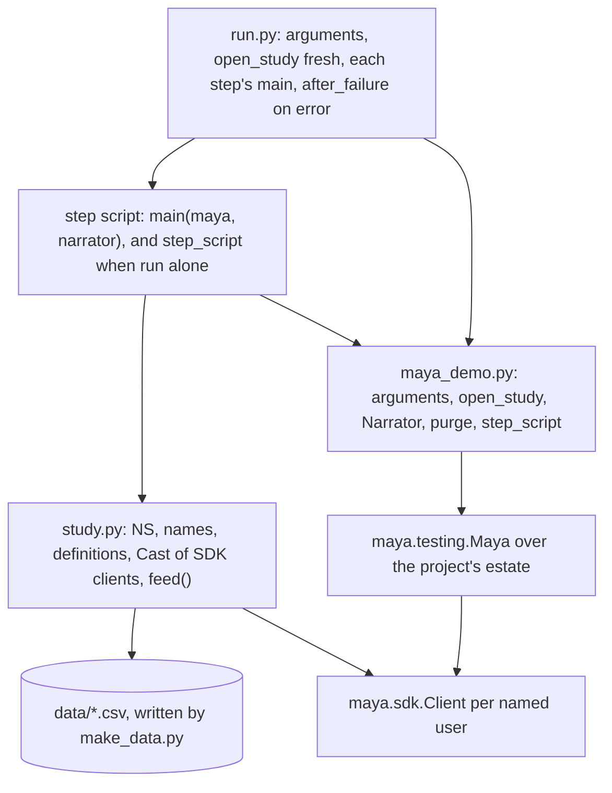

# Writing a case study

This page is for a developer adding a worked case study to `case_studies/`: a real modelling problem carried through MAYA end to end, written to be demonstrated in front of people and to be run by the test suite. It covers the folder's anatomy, the shared helper `case_studies/maya_demo.py`, narration, the README row that puts the study in Help, resetting and cleaning up, and the test that runs every study from nothing. How to *run* and *demonstrate* the studies — the users, the passwords, the flags, what to show on screen between steps — is in [the case studies README](../../case_studies/README.md), and is not repeated here.

A study earns its place by making MAYA do **one distinct thing** — a library of studies that all exercised the same six calls would demonstrate nothing that one study could not. Decide what the study is really about before writing any code, and put that sentence in the README's table; it is the card in Help.

## When you would do this, and what you touch

| File | What it holds |
|---|---|
| `case_studies/NN-name/README.md` | the theory, the mathematics, the analysis, the numbers from a real run, and a table of what each script does and shows |
| `make_data.py` | writes the study's input feeds to `data/` — the recipe, seeded, in prose and code |
| `data/*.csv` | those feeds, committed, so a reader can open exactly what MAYA was given |
| `study.py` | the declarations every step shares: namespace, names, definitions, the model, its specification document, the cast of users |
| one script per step | e.g. `setup.py`, `fit_both.py`, `challenge.py` |
| `run.py` | every step in order, in one process, against a MAYA built from nothing |
| `case_studies/README.md` | a row in the **Finished** table |

## The anatomy



Every step is importable **and** runnable. `run.py` imports the step modules and calls each one's `main(maya, narrator)` in one process; run alone, the same module ends with `step_script`, which opens MAYA, narrates and closes. That is what lets a presenter run one step, switch to the browser, show what it created, and run the next.

`run.py` from study 42, whole in its essentials:

```python
# case_studies/42-demand-elasticity/run.py
TITLE = "Case study 42 — demand elasticity (economics, champion and challenger)"
STEPS = (setup, fit_both, challenge)


def main() -> int:
    args = arguments(__doc__ or "")
    n = Narrator(TITLE, args.quiet)
    maya = open_study(NS, reset=args.reset, args=args, fresh=True, extra_users=EXTRA_USERS)
    try:
        for step in STEPS:
            print(f"\n{'─' * 78}\n{step.TITLE}\n{'─' * 78}")
            step.main(maya, Narrator("", args.quiet))
        n.done(f"{len(STEPS)} steps done")
        return 0
    except BaseException:
        after_failure(maya, NS, args)
        raise
    finally:
        maya.close()
```

and the end of each step script:

```python
# case_studies/42-demand-elasticity/setup.py
if __name__ == "__main__":
    sys.exit(step_script(TITLE, NS, main, extra_users=EXTRA_USERS))
```

## Step by step

### 1. Choose the namespace and the cast

Every study runs in the **one** project estate that `config/application.yaml` configures — the same database, lake and users the web application serves — and studies stay apart by namespace. Pick a namespace no other study uses and put it in `study.py` as `NS`. Seven users, one per built-in role, are seeded on first use; when a policy needs two holders of one role — an execution warrant submitted by one model manager is approved by another — declare the extra people:

```python
# case_studies/42-demand-elasticity/study.py
# dev2 fits the challenger as a second model developer; lara, a second manager, decides
EXTRA_USERS = {"lara": ["model_manager"], "dev2": ["model_developer"]}
```

A `Cast` class in `study.py` that holds one SDK client per person keeps the steps readable — `cast.dana.features.create(...)`, `cast.mick.features.transition(..., "approve")` — and makes each call's actor visible in the code.

### 2. Go through the SDK, as a named user

Everything a study does goes through `maya.sdk.Client`, as a named user with that user's roles. A demonstration that reached past the SDK would prove nothing about the SDK, and because the users are named the refusals are real: when a study shows a feature designer refused permission to approve her own feature, that is MAYA's capability matrix saying no. The one exception is `maya.drain()`, which runs the queued jobs a deployment's workers would run; `maya.platform` is available and the studies do not use it.

### 3. Narrate, and show a refusal

`Narrator` prints the story as it happens. `step(text)` numbers a stage, `say(text)` explains, `fact(label, value)` prints a result worth reading even with `--quiet`, `refused(what, error)` prints a refusal with its class and message, and `done(label)` closes with the elapsed time:

```python
# case_studies/maya_demo.py
    def refused(self, what: str, error: Exception) -> None:
        """A refusal is a result. Every study shows at least one on purpose."""
        message = getattr(error, "message", None) or str(error)
        print(f"    refused — {what}\n      {type(error).__name__}: {message}")
```

Show at least one refusal, and catch it by its class:

```python
# showing a refusal in a step, once version 1 is in review (example)
from maya.sdk import PermissionDenied

try:
    cast.dana.features.transition(f"{NS}/{FEED}", 1, "approve")
except PermissionDenied as exc:
    n.refused("the designer approving her own feature", exc)
```

Refusals are the platform's argument, so a study that only shows the happy path is not doing its job. Equally, a study that could not make its point honestly should say so in its output and its README rather than stage it: nothing in a study is scripted to fail.

### 4. Data, and the README's numbers

`make_data.py` is seeded and writes `data/`, and the CSVs are committed, so the reader can open exactly what MAYA was given and the run is the same every time. Give feeds a knowledge-time column (the shipped studies use `kt`) with realistic publication delays: much of what MAYA does is about when a value became known, and data that was "always known" hides it. `study.py` should refuse clearly when a feed is missing, naming `make_data.py`, rather than fail inside an ingest. The README's numbers come from a real run of `run.py`, and are re-taken when the study changes.

### 5. Add the README row

The help catalog reads the **Finished** table of `case_studies/README.md` — the rows between `### Finished` and `### The catalogue` — and renders each study's own README as its page. A row needs the number, a Markdown link whose text is the study's title and whose target is the folder with a trailing slash (`NN-name/`), the domain, the model type, and what the study is really about, in that order. Mathematics in a study README (`$…$`, `$$…$$`) is typeset in Help; a link to a file in the study opens it in the repository.

## Reset and clean-up

| Flag or event | What `maya_demo` does |
|---|---|
| `--reset` | purges the study's namespace, then runs from nothing; other studies are untouched |
| a full pass (`run.py`) fails | `after_failure` purges the namespace so the next pass starts clean, unless `--keep-on-failure` |
| a single step fails | nothing is purged — that would throw away the steps before it — and the script says how to clean up |
| `--reset-all` | deletes the whole demonstration estate and its lake |
| `run.py` over a study already in the estate | stops, naming `--reset` and `--reset-all` (`open_study(..., fresh=True)`) |

The purge is MAYA's own — `namespaces.purge`, available only in a development estate and recorded in the audit log — not a delete behind MAYA's back. A study must therefore create everything it needs in its own namespace; anything it puts elsewhere survives a reset and breaks the next run. Any other `--key=value` argument is passed to the configuration loader, so `run.py --storage.root=/tmp/demo --lake.root=/tmp/demo/lake` runs a study in an estate of its own, which is exactly how the test runs it.

## How to test it

`tests/test_case_studies.py` runs every folder that has a `run.py`, each in its own process with `--quiet` and a throwaway storage root, and asserts it exits 0 and prints `done in` — which `Narrator.done` prints, so `run.py` must end with it. The studies take a minute or two together, so they run only with `MAYA_TEST_CASE_STUDIES=1`, which `gates.py --tests` sets. A second test fails while a study with a `run.py` has no row in the README, and `tests/test_help_guides.py` checks that every runnable study has a card and a page.

```bash
.venv/bin/python case_studies/NN-name/run.py --reset            # as a reader runs it
MAYA_TEST_CASE_STUDIES=1 .venv/bin/python -m pytest tests/test_case_studies.py -k NN-name -q
.venv/bin/python -m pytest tests/test_case_studies.py tests/test_help_guides.py -q
.venv/bin/python tools/ci/lint.py
```

`case_studies/` is linted and formatted with the platform, because the studies are read as examples of how to use the SDK. They are outside the structural gates — import boundaries, module symbols, seams — which are about MAYA's own architecture.

## Common mistakes

- **Reaching past the SDK.** It proves nothing about the SDK, and a refusal it shows is not one a user would meet.
- **Objects outside the study's namespace.** They survive `--reset`.
- **Ending `run.py` without `Narrator.done`.** The test looks for `done in`.
- **A README row whose link target lacks the trailing slash** (`NN-name` instead of `NN-name/`). The help catalog's pattern does not match it, and the study has no card.
- **Unseeded data.** The README's numbers then describe a run nobody can repeat.
