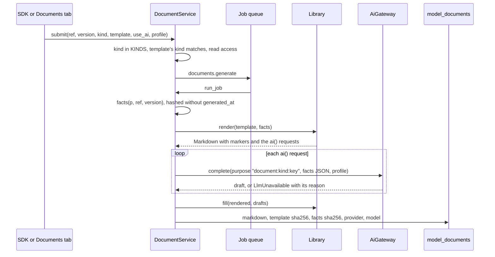

# Document templates, from a developer's side

This page is for a developer who maintains a firm's document templates as code — and wants to iterate on one without generating documents through the UI, test it, and keep it working as MAYA changes — or who is adding a new fact to the snapshot or a new kind of document to MAYA itself. What a template may contain — the header, `facts`, `ai()`, `table()`, the filters, where a firm's templates live and how one replaces a built-in — is the user-facing rule set, and it is in the [documents and AI reference](../../maya/web/guides/documents-and-ai-reference.md#templates-and-how-a-firm-overrides-them). Read that first; this page assumes it. How documents fit with the AI gateway is in [the architecture page on AI and documents](../architecture/ai-and-documents.md).

## When you would do this, and what you touch

| You want to | Touch |
|---|---|
| Change a firm's layout | a `*.md.j2` file in `documents.template_dir` (default `config/templates/documents/`); no MAYA code |
| Test templates in a firm's own CI | a test using `maya.documents.render.Library` and `maya.testing` |
| Give templates a fact MAYA does not yet gather | `DocumentService.facts` in `maya/services/documents.py` |
| Add a new kind of document | `maya/documents/__init__.py` (`KINDS`), a built-in template in `maya/documents/templates/`, the kind list on the model page, the user reference |
| Change how drafting is asked | `SYSTEM`, `FACTS_LIMIT` and `_draft` in `maya/services/documents.py` — with care, below |

## The pieces



The two passes are plain functions, which is what makes a template testable without a job, a database or a model:

```python
# maya/documents/render.py
    def render(self, template: Template, facts: dict[str, Any]) -> Rendered:
        """The first pass: the template over the facts, ``ai()`` calls left as markers."""
```

```python
# maya/documents/render.py
def fill(rendered: Rendered, drafts: dict[str, str]) -> str:
    """The second pass: each marker replaced by its draft, wrapped so it can be labelled."""
```

`Library(custom_dir)` lists the firm's folder over the built-ins, exactly as the service does; `Rendered.requests` is the list of `AiRequest(key, instruction, words, profile)` the template made.

## Iterating on a template

Get a real facts snapshot, then render against it as often as you like. `DocumentService.facts(principal, ref, version_no)` gathers it under that principal's permissions, the same way a document job does, and `Library.render` needs nothing else. In a test, the `World` helper in `tests/conftest.py` supplies principals by username (`w.mona`), so the loop is a test that renders — about two seconds a run:

```python
# a template test (example; build_platform, World and complete_spec as in tests/test_documents.py)
CHANGE_MEMO = """{# maya: kind=change_memo; title=Change memo #}

# Change memo: {{ m.name }} v{{ v.number }}

## What changed

{{ ai("what_changed", "Say what this version changes, from the facts only.", words=120) }}
"""


@pytest.fixture(scope="module")
def estate(tmp_path_factory):
    custom = tmp_path_factory.mktemp("templates")
    (custom / "change_memo.md.j2").write_text(CHANGE_MEMO, encoding="utf-8")
    p = build_platform([f"--documents.template_dir={custom}"])
    w = World(p)
    p.access.create_namespace(w.admin, name="docs", preset="standard")
    p.models.create(w.mona, namespace="docs", name="lin", formula="y = a*x + b",
                    roles={"a": "parameter", "b": "parameter"}, description="A line")
    p.models.update_draft(w.mona, "docs/lin", spec_latex=complete_spec("lin"))
    yield p, w, custom
    p.shutdown()


def test_the_memo_renders_and_asks_for_one_section(estate):
    p, w, custom = estate
    facts = p.documents.facts(w.mona, "docs/lin")
    lib = R.Library(custom)
    out = lib.render(lib.get("change_memo"), facts)
    assert "# Change memo: lin v1" in out.markdown
    assert [r.key for r in out.requests] == ["what_changed"]
    assert "<!--ai:what_changed-->" in R.fill(out, {"what_changed": "The first version."})
```

Assert on the requests as well as the text. A template's `ai()` calls are its cost and its risk — each is a model call over up to 60,000 characters of facts — so a test that pins the list catches a loop that accidentally asks for a section per input.

Because missing facts render as empty rather than failing, a template will not tell you that a fact it relies on was renamed. Render it against a model that *has* the fact and assert the value appears; render it against one that lacks it and assert the template still reads sensibly.

### Generating through the service

To exercise the whole path — job, drafting, storage, labels — use the deterministic stub provider rather than a real model, and reset it afterwards. `tests/test_documents.py` does this throughout:

```python
# tests/test_documents.py
    p.ai.override = StubProvider()
    try:
        doc = _generate(p, w, kind="model_card")
    finally:
        p.ai.override = None
```

The stub's answer contains the section's instruction and a hash of the prompt, so a test can tell which request produced which text. With `use_ai=False` no provider is consulted at all and every `ai()` section says so — the right setting for a test about layout.


## Adding a fact to the snapshot

Every fact is gathered in `DocumentService.facts`. Three things to hold to when you add one:

- **Gather it under the caller's permissions.** The snapshot is built from the same services as every screen, so a document never shows a person something the screen would not. Prefer the service method that checks read access, as `facts` does with `models.get` and `inventory.rows`, over a raw repository read.
- **It changes the facts hash of every document generated afterwards.** That hash is how "which facts was this written from" is answered; it is computed over the snapshot without `generated_at`. Adding a fact is a legitimate reason for it to change, but do not add anything that varies between two generations of the same record — a timestamp, a random id — or no two documents will ever share a hash.
- **It competes for the model's attention.** Each `ai()` request receives the snapshot as JSON, cut at `FACTS_LIMIT` characters. A large fact pushes others off the end, silently. Summarise lists; do not paste rows.

Then add the fact to the "What a template sees" table in the user reference. Nothing checks that table against the code.

## Adding a kind of document

A *kind* is what a document is — the three MAYA ships are `model_card`, `validation_report` and `model_documentation` — and it is a closed list:

```python
# maya/documents/__init__.py
KINDS = ("model_card", "validation_report", "model_documentation")
```

A firm template may declare any kind in its header, but `submit` refuses a kind not in `KINDS` (`kind must be one of …`), so a firm cannot invent a kind without a change to MAYA. That is deliberate: a kind is what a reader, an approver and the facts snapshot agree a document *is*, and a kind each firm could coin would make "this model has a validation report" a claim nobody could check. To add one, say `change_memo`:

1. add it to `KINDS`;
2. ship a built-in `maya/documents/templates/change_memo.md.j2` with the header `{# maya: kind=change_memo; title=Change memo #}`, so every estate has one to offer and to replace;
3. add it to the kind selector on the model page's Documents tab (`maya/web/templates/models/model.html`), which lists the kinds by hand;
4. describe it in the user reference.

The API, the SDK and the schema do not change: `kind` is a string in the request and a 32-character column, so neither the API snapshot nor the public-symbols lock moves. The test above, with `KINDS` extended, generated a `change_memo` through the job and the stub provider.

## Changing how drafting is asked

`SYSTEM` is the instruction every drafted section is sent with, and its sentences are controls, not style: use only the facts; write "not recorded" where they are silent; never conclude whether the model is fit for use. The built-in validation report leaves its conclusion to the validator for the same reason. Loosening any of these changes what every drafted document in every estate can claim, and the labels on those documents would go on saying "from the recorded facts". Change it only with the user reference's "Drafted sections and their labels" section in the same change.

## How to test, and what fails

```bash
.venv/bin/python -m pytest tests/test_documents.py -q
.venv/bin/python -m pytest tests/test_help_accuracy.py -q   # if the user reference changed
```

Adding a kind or a fact moves no lock. A built-in template is found by path, from `maya/documents/templates/`, so nothing registers it. The built-ins ship in the server's wheel through `pyproject.toml`'s `package-data` (`maya.documents = ["templates/*.md.j2"]`), so a new built-in template is packaged without further change.

## Common mistakes

- **Testing only against a model that has every fact.** Templates fail by rendering blanks, not by raising.
- **A firm template without a header.** Its kind is then its file name, which is a valid kind only if it replaces a built-in.
- **Putting a conclusion in an `ai()` instruction.** The system instruction tells the model not to conclude; an instruction asking it to is a contradiction the model will resolve unpredictably.
- **An `ai()` key with punctuation.** It is rewritten to `_`, so two keys can collide and one section's draft lands in both places.
- **Leaving `p.ai.override` set** after a test; every later test in the module drafts with the stub.
