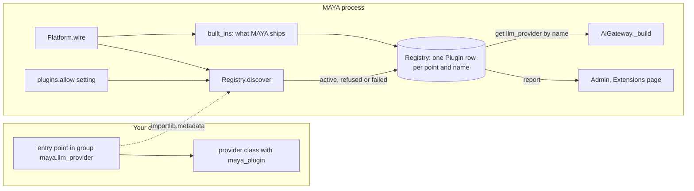
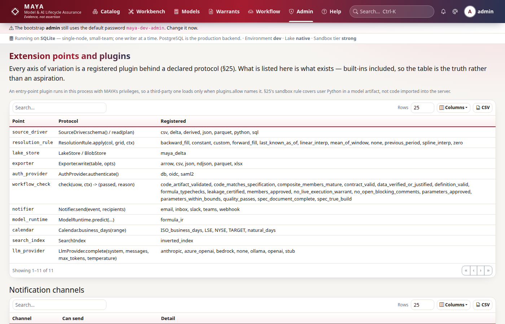

# Extension points and plugins

This page is for a developer who wants to add an implementation to MAYA without editing MAYA — a language-model provider, say — or who needs to know whether that is possible for what they have in mind. It explains the plugin registry once; the specific guides link here rather than repeating it. How the registry fits into the running platform is described in [the architecture page on plugins](../architecture/plugins.md).

The short version, which the rest of the page justifies: MAYA has one registry with eleven named extension points, it discovers third-party plugins by Python entry point, it loads one only when an administrator has named it in `plugins.allow`, and it shows every plugin's status on **Admin → Extensions**. Of the eleven points, **one** — `llm_provider` — actually calls a third-party implementation today. At the other ten an allowed plugin is loaded and listed, and nothing in MAYA calls it. Read [What the registry does not reach](#what-the-registry-does-not-reach) before you write a plugin for any point but `llm_provider`.

## When you would do this, and what you touch

| You want to | Touch | Guide |
|---|---|---|
| Ship a language-model provider as your own package | your package, its `pyproject.toml`, `plugins.allow` | [llm-providers.md](llm-providers.md) |
| Add a source type, a workflow check, a job type, a document kind | MAYA's own code — these are core changes, not plugins | [source-connectors.md](source-connectors.md), [workflow-checks.md](workflow-checks.md), [jobs.md](jobs.md), [document-templates.md](document-templates.md) |
| See what is registered and why something is missing | **Admin → Extensions**, or `GET /system/extensions` | this page |
| Add a new extension point | `maya/plugins.py` (`POINTS`, `built_ins`) and the code that should consult it | this page, [Adding a point](#adding-an-extension-point) |

## The pieces



`Platform.wire()` builds every service first, then the registry, because the workflow checks it lists are registered by the services at runtime:

```python
# maya/services/platform.py
        from maya.plugins import Registry as PluginRegistry, built_ins

        self.plugins = built_ins(PluginRegistry(), self)
        self.plugins.discover(self.settings)
```

Two consequences follow. Discovery happens once per process, at startup: installing or allowing a plugin takes effect on the next start, and with several web processes (`server.workers`) each process discovers for itself. And because `discover` runs after `built_ins`, a plugin is registered on top of what MAYA ships.

### The points

`POINTS` maps each point to the protocol it declares and what MAYA ships there. The table is meant to be the truth rather than an aspiration, so `built_ins` fills it from the code's own tables — `SUPPORTED_SOURCES`, the resolution rules' `PARAMS`, `CALENDARS`, the workflow engine's registered checks, `CHANNELS`, the LLM providers' `BUILT_IN`:

```python
# maya/plugins.py
    from maya.llm.providers import BUILT_IN

    for name, provider in BUILT_IN.items():
        registry.register("llm_provider", name, factory=provider.from_settings)
    if platform is not None:
        for name in sorted(platform.workflow.checks):
            registry.register("workflow_check", name)
```

Registering at a point that is not in `POINTS` raises `ValueError` naming the points, so a typo in a plugin's group is a refusal, not a silent no-op.

### Discovery and the allowlist

```python
# maya/plugins.py
        for point in POINTS:
            for entry in entry_points(group=f"{GROUP}.{point}"):
                origin = getattr(getattr(entry, "dist", None), "name", None) or "installed"
                if any(
                    p.point == point and p.name == entry.name and p.origin == "built-in"
                    for p in self._plugins
                ):
# ...
                if entry.name not in allowed and f"{point}:{entry.name}" not in allowed:
                    self.register(
                        point,
                        entry.name,
                        origin=origin,
                        status="refused",
# ...
                try:
                    factory = entry.load()
                except Exception as exc:  # noqa: BLE001 - one bad plugin must not stop MAYA
# ...
                declared = getattr(factory, "maya_plugin", {}) or {}
```

The allowlist is the safety story, and it is worth understanding why it exists rather than treating it as a formality. An entry-point plugin is imported into the server process. It runs with MAYA's privileges: it can read the database, the blob store and the signing key. The sandbox that confines a model artifact or a `python` source does not apply to code imported into the server, so being installed in the environment cannot count as consent. `plugins.allow` is a comma-separated list of entry-point names — a bare name for any point, or `point:name` (`llm_provider:acme`) for one point only (see the [configuration reference](../../maya/web/guides/configuration-reference.md#plugins)); anything installed and not named is registered with status `refused` and the reason, and is never imported.

Each plugin ends in one of four states, and the distinction is the point of having a screen at all — "it is installed" and "it is in use" are different claims:

| Status | Meaning |
|---|---|
| `active`, origin `built-in` | MAYA ships it |
| `active`, origin a distribution name | installed, allowed, imported without error |
| `refused` | installed and not in `plugins.allow`; not imported |
| `failed` | allowed, but importing it raised; the exception is the detail, and MAYA starts anyway |



The same report is `GET /system/extensions` (administrators and techops), and the SDK's `admin.extensions()`.

## Shipping a plugin as a package

A plugin is an ordinary Python distribution that declares an entry point in the group `maya.<point>`. The entry point's name is the name MAYA registers it under and the name `plugins.allow` must contain.

```toml
# pyproject.toml of a third-party plugin (example)
[project]
name = "acme-maya"
version = "0.1.0"
requires-python = ">=3.13"
dependencies = ["httpx>=0.28.1"]

[project.entry-points."maya.llm_provider"]
acme = "acme_maya.provider:AcmeGatewayProvider"
```

Point the entry point at the **class**, not at a `from_settings` classmethod. MAYA reads the plugin's version, capabilities and configuration schema from a `maya_plugin` attribute on whatever the entry point loads, and a bound classmethod does not expose the class's attributes — the plugin would be listed with version `unknown`. What MAYA then calls with that object depends on the point; for `llm_provider` it is called with one argument, the settings view, and must return a provider ([llm-providers.md](llm-providers.md) has the whole contract).

```python
# the metadata MAYA reads from a plugin (example)
class AcmeGatewayProvider:
    maya_plugin = {
        "version": "0.1.0",
        "capabilities": ["chat"],
        "config_schema": {"base_url": "the gateway's address"},
    }
```

Then install it into MAYA's environment and allow it:

```bash
.venv/bin/pip install ./acme-maya          # or from your index
.venv/bin/python run_maya_web.py --plugins.allow=acme
```

For a permanent setting put `allow: "acme"` under `plugins:` in `config/application.local.yaml`. Restart, and check **Admin → Extensions**: the row should say `active` with origin `acme-maya`.

## How to test a plugin

You do not need to build and install a wheel to test discovery. `tests/test_plugins.py` replaces `importlib.metadata.entry_points` with a function returning fake entries; imitate `test_an_installed_plugin_is_refused_unless_it_is_named` to prove your entry loads and that `maya_plugin` is read. To test the plugin inside a running platform, register it directly on the test platform's registry, which is what discovery would have done:

```python
# registering a plugin on a test platform (example; `world` is the fixture in tests/conftest.py)
world.p.plugins.register(
    "llm_provider", "acme", origin="acme-maya (test)", factory=AcmeGatewayProvider
)
```

Run the registry's own tests with:

```bash
.venv/bin/python -m pytest tests/test_plugins.py -q
```

No gate inspects a third-party package, because none of them scan outside MAYA's own tree. That is a reason to give your plugin its own tests, not a reason to skip them.

## What the registry does not reach

The specification promises that every axis of variation is a registered plugin, discovered by entry point and configured by name. The registry makes the variation **visible**; it does not yet make it **pluggable** everywhere. Only the AI gateway resolves an implementation through the registry:

```python
# maya/services/ai.py
            plugin = self.p.plugins.get("llm_provider", chosen.provider)
            if plugin is None or plugin.factory is None:
```

Every other point is dispatched from a table in MAYA's own code, which the registry reads from but does not feed:

| Point | What MAYA actually dispatches from |
|---|---|
| `source_driver` | `SUPPORTED_SOURCES` and the branches in `validate_feature_definition`, `FeatureService.ingest` and `SourceService.pull` |
| `resolution_rule` | `maya.resolution.rules` |
| `workflow_check` | the checks `maya/services/registry.py` registers on the engine |
| `notifier` | `maya.notifiers.CHANNELS` |
| `calendar` | `maya.core.calendars.CALENDARS` |
| `exporter`, `auth_provider`, `lake_store`, `model_runtime`, `search_index` | fixed code paths |

So an allowed third-party `source_driver` or `notifier` is imported, shown as `active`, and never called. That row is misleading, and it is stated here so nobody discovers it in production: until the consuming code consults the registry, adding a source type or a check is a change to MAYA, made with the guides linked above.

Two rules follow from how registration works. A plugin can never replace a built-in: an installed entry point with a built-in's name at the same point — an `llm_provider` called `openai` — is listed as `refused` with that reason, and MAYA's own stays in use (`register` keeps one row per point, name and origin). And a bare name in `plugins.allow` allows an entry point of that name in every group; write `point:name` to allow it at one point only.

## Adding an extension point

A new point is three changes, and the third is the one that matters:

1. add it to `POINTS` with its protocol and what ships;
2. register the built-ins in `built_ins`, from the code's own table rather than a copied list;
3. make the consuming code look the implementation up with `registry.get(point, name)`, the way `AiGateway._build` does.

Without the third step the point is a row on a screen. `tests/test_plugins.py::test_every_point_the_specification_names_is_registered` asserts the set of points, so it fails until you add the new one there.

## Common mistakes

- **Entry point on a classmethod.** The plugin loads, but its `maya_plugin` metadata is not found and the version shows `unknown`.
- **Allowing the distribution name.** `plugins.allow` takes the entry-point name (`acme`), not the package name (`acme-maya`).
- **Expecting a restart-free install.** Discovery runs once per process.
- **Naming a plugin like a built-in.** It is refused, with the reason on Admin → Extensions; give it a name of its own.
- **Writing a plugin for a point nothing consults.** It will be listed as active and do nothing.
