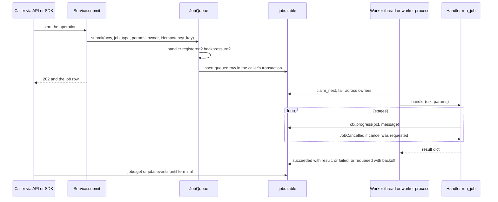
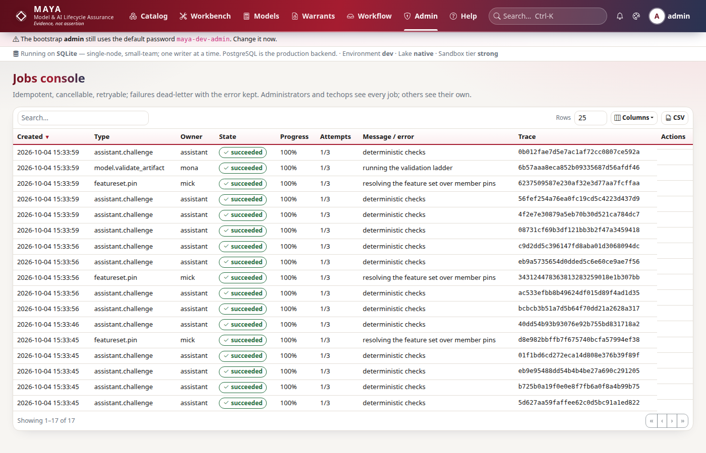

# Adding a job type

This page is for a developer whose new operation is too slow to run inside a request — anything that reads a lot of the lake, calls a model, renders a PDF or sandboxes code — or that should run on a schedule. It covers the handler contract, registration, idempotency, progress and cancellation, failure and retry, and scheduled tasks. How the queue, the workers and the scheduler are arranged across processes is in [the architecture page on jobs and the scheduler](../architecture/jobs-and-scheduler.md); what an operator sees and does — the jobs console, workers, the scheduler's sweeps — is in the [operations guide](../../maya/web/guides/operations-guide.md#jobs).

The queue is the database. A job is a row in `jobs`; workers claim rows (`SELECT … FOR UPDATE SKIP LOCKED` on PostgreSQL, under the write mutex on SQLite) and run the handler registered for the row's type. That is why a job is durable across restarts, visible on a screen, and shared by every process attached to the database.

## When you would do this, and what you touch

| File | Why |
|---|---|
| the owning service | a `submit` method that queues, and a `run_job(ctx, params)` handler |
| `maya/services/registry.py`, `_jobs` | `q.register(job_type, handler, on_cancel=…)` |
| `maya/services/registry.py`, `wire` | `platform.scheduler.every(...)` for a periodic task |
| the router | return `202` with the job row |
| `maya/config/schema.py` | an interval setting, if the schedule should be configurable |

## The pieces



## The contract

```python
# maya/jobs/queue.py
Handler = Callable[["JobContext", dict[str, Any]], dict[str, Any]]
CancelHook = Callable[[Any, dict[str, Any]], None]
```

A handler takes the job context and the parameters it was submitted with, and returns a dictionary that is stored as the job's result. The context carries `actor` (the job's owner, a username), `trace_id`, and two methods: `progress(pct, message)`, which writes the progress and its log line and raises `JobCancelled` if a cancel was requested, and `check_cancel()`, which only checks.

How the outcome is decided is the part to read twice:

```python
# maya/jobs/queue.py
        try:
            result = self.handlers[job["job_type"]](ctx, job["params"])
            self._finish(job["id"], "succeeded", result=result or {}, progress=100)
            return "succeeded"
        except JobCancelled:
            self._finish(job["id"], "cancelled", error="cancelled by request")
            return "cancelled"
        except MayaError as exc:
            # A deliberate refusal (quality failure, contract mismatch) is not
            # retried: running it again would refuse again.
```

- a returned dictionary is **succeeded**;
- `JobCancelled` is **cancelled**;
- a `MayaError` — a refusal such as `ValidationFailed` or `QualityCheckFailed` — is **failed**, at once, with the problem document in the result, because running it again would refuse again;
- any other exception is treated as transient and **requeued** with exponential backoff and jitter, until `jobs.max_attempts` is spent, then **dead-lettered** with the traceback kept.

So a handler that knows the work cannot succeed should raise a `MayaError` with a sentence saying why, not a bare exception that will be retried three times and then reported as a crash.

## Step by step

The worked example is a usage report: stored bytes per namespace, measured by reading each namespace's sealed pins. It is a read, but over the whole estate, so it belongs on a worker. This code was run against a test platform.

### 1. Submit and handle

```python
# a service with a job (example)
class UsageReports:
    """Stored bytes per namespace, as a job (example)."""

    JOB = "namespace.usage_report"

    def __init__(self, platform: Any) -> None:
        self.p = platform

    def submit(self, p: Any, *, idempotency_key: str | None = None) -> dict[str, Any]:
        with self.p.uow(p.username) as uow:
            return self.p.jobs.submit(
                uow, self.JOB, {"requested_by": p.username}, owner=p.username,
                idempotency_key=idempotency_key,
            )

    def run_job(self, ctx: Any, params: dict[str, Any]) -> dict[str, Any]:
        from maya.services import quota

        with self.p.uow() as uow:
            namespaces = uow.repo("namespaces").list(order_by=["name"])
        if not namespaces:
            raise ValidationFailed("There are no namespaces to report on")
        out = {}
        for i, ns in enumerate(namespaces, 1):
            ctx.progress(int(100 * (i - 1) / len(namespaces)), f"measuring {ns['name']}")
            with self.p.uow() as uow:
                out[ns["name"]] = quota.usage(uow, ns["id"])["stored_bytes"]
        return {"stored_bytes": out}
```

Points of the contract the example shows:

- **Submit inside a unit of work.** `submit` writes the row in the caller's transaction, so a job is queued only if the caller's own writes commit — a pin row and its pin job are both there or neither is. Workers are woken after the commit.
- **Check what you can before queueing.** `DocumentService.submit` validates the kind, the template and read access first, so a refusal comes back at once instead of as a failed job a minute later.
- **Parameters are JSON, and they are the job's identity.** They are stored and hashed; keep them small, and pass ids, not rows.
- **The handler runs as nobody in particular.** It receives the owner's username, not a principal. When permissions matter, build the principal from the parameters, as `DocumentService.run_job` does with `auth.build_principal(uow, params["user_id"])`, so the work sees exactly what the person who asked may see.
- **Short units of work.** Open one per stage rather than holding a transaction across the whole job: on SQLite a unit of work holds the process-wide write mutex.
- **Progress at each stage.** It is what the jobs console, `jobs.events` and `Client.wait` show, and the only point where a cancel is noticed.

### 2. Register the type

Every job type is registered in `_jobs`:

```python
# maya/services/registry.py
    q.register("assistant.challenge", platform.assistant.run_job)
    q.register("execution.batch_score", platform.batches.run_job)
    q.register("documents.generate", platform.documents.run_job)
```

Add `q.register("namespace.usage_report", platform.usage.run_job)`, with the service registered in `wire` beside the others. `submit` refuses a type with no handler (`No handler registered for job type …`), and so does a worker process, which registers the same handlers by building the same platform.

### 3. Idempotency

An idempotency key makes a submission safe to repeat: the second `submit` with the same key returns the first job instead of queueing another, and the same key with *different* parameters is refused with `ConflictError`. A double-click never pins twice because of it. Use one wherever a caller may retry, and take it from the caller (the pin routes accept an `Idempotency-Key` header) rather than inventing one per call, which would defeat the point.

### 4. Cancellation

A running job is cancelled cooperatively: `jobs.cancel` sets a flag and the next `ctx.progress` or `ctx.check_cancel` raises. A *queued* job is cancelled at once, and that leaves a gap: whatever the job would have finished is still waiting for it. `on_cancel` closes it, in the cancelling transaction:

```python
# maya/services/registry.py
def _cancel_pin(uow: Any, table: str, params: dict[str, Any]) -> None:
    """A pin whose job is cancelled before it ran is failed, never left 'materializing':
    a stuck pin would block its name and date for good."""
```

If your submit creates a row in a "pending" state, give the type a cancel hook that moves it to a terminal state.

### 5. A scheduled task

Periodic work is registered on the scheduler in `wire`:

```python
# maya/services/registry.py
    platform.scheduler.every("execution.expiry_notices", 3600, platform.execution.expire_sweep)
    platform.scheduler.every("notices.sweep", 3600, platform.subscriptions.notices)
```

The scheduler is a single thread in the process that launched MAYA; worker processes (`run_maya_web.py --worker`) do not run it, and with several web processes only the launcher does. A task runs in the scheduler's thread, so anything heavy should **queue a job** rather than do the work there, and should be idempotent across nodes and restarts. `OpsService.schedule_integrity_verification` is the model — it queues the sweep with the interval window as the idempotency key, so a second node, or a restart inside the same window, finds the first job instead of queueing a second full re-read of the lake:

```python
# maya/services/ops.py
        window = int(utcnow().timestamp() // interval)
        with self.p.uow("system") as uow:
            return self.p.jobs.submit(
                uow,
                "integrity.verify",
                {"scheduled": True},
                owner="system",
                idempotency_key=f"integrity.verify:{window}",
            )
```

A job queued by the scheduler has the owner `system`, which is no user. The `integrity.verify` registration turns that into a principal with `_system_principal` in `maya/services/registry.py`, which runs it as techops rather than as whichever administrator happens to exist, so the audit entry says plainly that MAYA did it; a scheduled job of yours that needs a principal should do the same. Read a configurable interval through a declared setting ([settings-and-config.md](settings-and-config.md)), as `lake.maintenance.interval_seconds` is.



## Backpressure and fairness

`submit` can refuse. When the queue is deeper than `jobs.queue.max_depth`, or the owner already has `jobs.per_user.max_queued` waiting, it raises `QuotaExceeded` before the row is written, with an estimate of when the queue will clear. A caller that submits in a loop must handle that refusal rather than treat it as a failure of the work. Claims are fair across owners — somebody with nothing running is served before the second job of somebody already running one — and capped per owner by `jobs.per_user.max_concurrent`, so a job type that fans out into thousands of jobs interleaves with everyone else's instead of preceding them. All of these are user-facing settings, in the configuration reference's `jobs` section.

## How to test it

In tests, job workers are off; `platform.jobs.drain()` (or `World.drain()`, or `maya.drain()` with `maya.testing`) runs queued jobs inline until the queue is empty, so a test is deterministic:

```python
# a test of the job type (example; `world` is the fixture in tests/conftest.py)
def test_the_job_runs_reports_progress_and_dedupes(world):
    reports = UsageReports(world.p)
    world.p.jobs.register(reports.JOB, reports.run_job)
    job = reports.submit(world.admin, idempotency_key="usage:2026-10-04")
    assert reports.submit(world.admin, idempotency_key="usage:2026-10-04")["id"] == job["id"]
    world.p.jobs.drain()
    with world.p.uow() as uow:
        done = uow.repo("jobs").get(job["id"])
    assert done["state"] == "succeeded" and "eq" in done["result"]["stored_bytes"]
    assert done["progress"] == 100 and done["logs"][0]["msg"].startswith("measuring")
```

Test the refusal path as well: a handler that raises `ValidationFailed` should leave the job `failed` after one attempt, not requeued. `tests/test_job_fairness.py` tests the queue's own guarantees and is the place to imitate for anything about claiming; `tests/test_worker_process.py` runs a real worker process against a real server.

```bash
.venv/bin/python -m pytest tests/test_job_fairness.py tests/test_worker_process.py -q
```

A new job type moves no lock by itself. The endpoint that starts it does ([api-endpoints.md](api-endpoints.md)), and `maya_job_runs_total`, `maya_job_duration_seconds` and `maya_job_wait_seconds` gain a `type` label value with no change from you.

## Common mistakes

- **Raising a bare exception for a refusal.** It is retried, then dead-lettered as a crash.
- **One long unit of work across the whole job.** On SQLite it holds every other writer off.
- **No progress calls.** The job cannot be cancelled and looks hung.
- **Heavy work in a scheduler task.** Queue a job from it.
- **A pending row with no cancel hook.** A cancelled queued job leaves it pending for ever.
- **Rows in the parameters.** They are stored, hashed and shown; pass ids.
