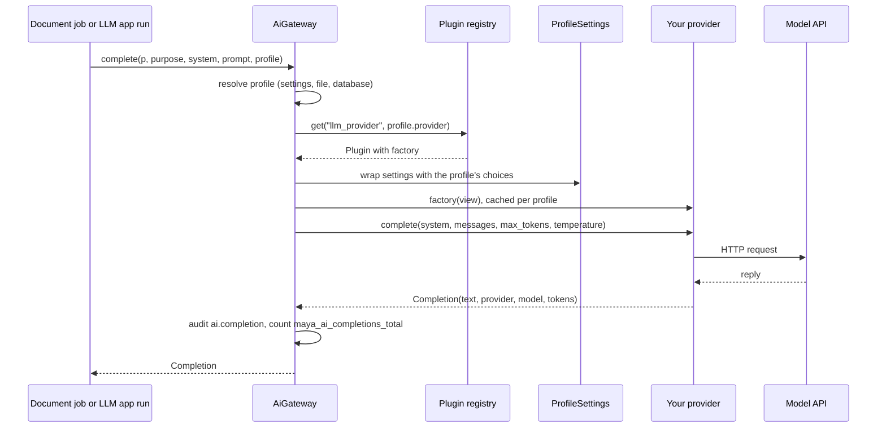

# Writing an LLM provider plugin

This page is for a developer connecting MAYA to a language model it does not already speak — a firm's internal model gateway, a hosted service with its own API. It walks through the provider contract, the settings a provider reads, registration as a plugin, and testing without a network, with a complete worked example. How the AI gateway uses a provider once it exists is in [the architecture page on AI and documents](../architecture/ai-and-documents.md); what an administrator configures — profiles, the default, Admin → AI models — is in the [documents and AI reference](../../maya/web/guides/documents-and-ai-reference.md#the-ai-gateway). The plugin mechanism itself is explained once, in [extension-points.md](extension-points.md).

Before writing one, check that you need to. The built-in `openai` provider speaks the Chat Completions API to any base URL, which covers vLLM, LM Studio, llama.cpp's server and most hosted gateways. A new provider is for an API with a different shape.

`llm_provider` is the one extension point that MAYA genuinely dispatches through the registry, so a provider can live in your own package and never touch MAYA's code.

## When you would do this, and what you touch

| File | Why |
|---|---|
| your package: `provider.py` | the provider class |
| your package: `pyproject.toml` | the entry point in group `maya.llm_provider` |
| your package: `tests/` | tests with `httpx.MockTransport` |
| `config/application.local.yaml` | `plugins.allow` names the entry point |
| `config/llm_profiles.yaml`, or Admin → AI models | a profile that uses the provider |
| `maya/llm/providers.py`, `maya/config/schema.py` | only if the provider is to ship *inside* MAYA (see the end of the page) |

## How a call reaches a provider



The gateway builds the provider from the profile and caches it, keyed by the whole profile, so an edit to a profile builds a fresh one:

```python
# maya/services/ai.py
    def _build(self, chosen: prof.Profile) -> Any:
        if self.override is not None:
            return self.override
        key = json.dumps(chosen.as_row() | {"options": chosen.options}, sort_keys=True, default=str)
        if key not in self._cache:
            plugin = self.p.plugins.get("llm_provider", chosen.provider)
            if plugin is None or plugin.factory is None:
                raise LlmUnavailable(
                    f"The provider '{chosen.provider}' is not registered or not an allowed plugin "
                    "(see Admin → AI models)"
                )
            self._cache[key] = plugin.factory(prof.ProfileSettings(self.p.settings, chosen))
        return self._cache[key]
```

So the factory is called with **one positional argument**, a settings view, and must return an object satisfying the protocol.

## The contract

```python
# maya/llm/base.py
class LlmProvider(Protocol):
    """What ``llm.provider`` names. ``name`` is the registered name; ``model`` the model it
    will ask, resolved from ``llm.model`` or the provider's own default."""

    name: str
    model: str

    def complete(
        self,
        system: str,
        messages: list[Message],
        *,
        max_tokens: int,
        temperature: float | None,
    ) -> Completion: ...

    def describe(self) -> dict[str, Any]:
        """Where it points and whether it looks usable -- without calling it."""
        ...
```

Three rules sit behind it, each learned from the built-ins:

- **Every failure is `LlmUnavailable` with a sentence a person can act on.** Not a transport exception, not a status code. The gateway records the reason in the audit log as `ai.completion_failed`, a document marks the section "Not drafted:" followed by your sentence, and Admin → AI models shows it on **Test**. "acme refused the request (401): …" is useful; `httpx.HTTPStatusError` is not.
- **`describe()` never calls the model.** It is run for every profile whenever the AI models page or `GET /ai/status` is read. It should say where the provider points and whether it looks usable — a key variable that is set, a base URL that is present.
- **A key comes from the environment, never from settings.** The built-ins read the *name* of an environment variable from settings (`llm.openai.api_key_env`) and the key from that variable. The gateway enforces the same rule on profiles saved from the UI: an option whose name contains `api_key`, `secret`, `password` or `token` is refused unless it ends in `_env`.

### What a provider reads: ProfileSettings

A provider reads `llm.model`, `llm.timeout_seconds` and its own `llm.<name>.<option>` keys. It does not know profiles exist. The gateway hands it a `ProfileSettings`, which lays the profile's choices over the real settings:

```python
# maya/llm/profiles.py
    def _override(self, key: str) -> Any:
        p = self._p
        if key == "llm.model" and p.model:
            return p.model
        if key == "llm.max_tokens" and p.max_tokens is not None:
            return str(p.max_tokens)
        if key == "llm.temperature" and p.temperature is not None:
            return str(p.temperature)
        prefix = f"llm.{p.provider}."
        if key.startswith(prefix) and key[len(prefix) :] in p.options:
            return str(p.options[key[len(prefix) :]])
        return None
```

This matters more for a plugin than for a built-in. A plugin cannot add keys to MAYA's configuration schema, and `config/application.yaml` refuses a key the schema does not declare. So a plugin's own configuration belongs in the **profile's `options`**: `options: {base_url: …}` reaches the provider as `llm.acme.base_url`. Values are strings — `ProfileSettings` passes everything through `str()` — so convert numbers yourself, or use `settings.int()`.

## Worked example: a provider for an internal gateway

The gateway in this example takes `POST {base_url}/v1/generate` with a JSON body and an `X-Api-Key` header, and answers `{"text", "model", "usage": {"input", "output"}, "stop"}`.

```python
# acme_maya/provider.py: a new LLM provider (example)
from __future__ import annotations

import os
from typing import Any

import httpx

from maya.llm.base import Completion, LlmUnavailable, Message


class AcmeGatewayProvider:
    """Completions through the firm's own model gateway (POST {base_url}/v1/generate)."""

    name = "acme"
    maya_plugin = {
        "version": "0.1.0",
        "capabilities": ["chat"],
        "config_schema": {
            "base_url": "the gateway's address",
            "api_key_env": "the environment variable holding the key",
        },
    }

    def __init__(self, settings: Any, transport: Any = None) -> None:
        self.settings = settings
        self._transport = transport  # tests pass httpx.MockTransport here
        self.model = (settings.get("llm.model", "") or "").strip() or "acme-default"
        self.base = (settings.get("llm.acme.base_url", "") or "").rstrip("/")

    def complete(
        self,
        system: str,
        messages: list[Message],
        *,
        max_tokens: int,
        temperature: float | None = None,
    ) -> Completion:
        if not self.base:
            raise LlmUnavailable("The acme provider needs a base_url in the profile's options")
        env = (self.settings.get("llm.acme.api_key_env", "ACME_GATEWAY_KEY") or "").strip()
        key = os.environ.get(env, "")
        if not key:
            raise LlmUnavailable(f"The acme provider reads its key from ${env}, which is not set")
        body: dict[str, Any] = {
            "model": self.model,
            "system": system,
            "messages": [{"role": m.role, "content": m.content} for m in messages],
            "max_tokens": int(max_tokens),
        }
        if temperature is not None:
            body["temperature"] = float(temperature)
        timeout = float(self.settings.int("llm.timeout_seconds", 120))
        try:
            with httpx.Client(timeout=timeout, transport=self._transport) as http:
                r = http.post(f"{self.base}/v1/generate", json=body, headers={"X-Api-Key": key})
        except httpx.HTTPError as exc:
            raise LlmUnavailable(f"acme at {self.base} did not answer: {exc}") from exc
        if r.status_code >= 400:
            raise LlmUnavailable(f"acme refused the request ({r.status_code}): {r.text[:300]}")
        data = r.json()
        usage = data.get("usage") or {}
        return Completion(
            str(data.get("text") or ""),
            self.name,
            str(data.get("model") or self.model),
            usage.get("input"),
            usage.get("output"),
            data.get("stop"),
        )

    def describe(self) -> dict[str, Any]:
        return {
            "provider": self.name,
            "model": self.model,
            "ready": bool(self.base),
            "detail": self.base or "no base_url in the profile's options",
        }
```

The constructor takes the settings as its first argument, so the class itself is the factory and the entry point can point at it ([why the class and not a classmethod](extension-points.md#shipping-a-plugin-as-a-package)). The optional `transport` is how the built-in HTTP providers are tested, and the same seam serves here.

`temperature` arrives as `None` when the caller means "the provider's own default" — a declared LLM application version that names no temperature is run exactly as declared — so send it only when it is set, as above.

### Register, allow, configure

```toml
# acme-maya/pyproject.toml (example)
[project.entry-points."maya.llm_provider"]
acme = "acme_maya.provider:AcmeGatewayProvider"
```

```yaml
# config/application.local.yaml (example)
plugins:
  allow: "acme"
```

```yaml
# config/llm_profiles.yaml (example)
default: drafting
profiles:
  drafting:
    provider: acme
    model: acme-large
    max_tokens: 2048
    options:
      base_url: "${ACME_GATEWAY_URL:https://llm-gw.internal.example}"
      api_key_env: ACME_GATEWAY_KEY
```

The profiles file is read through the configurator, so the `${VAR:default}` placeholder resolves exactly as a setting would ([settings-and-config.md](settings-and-config.md)). The same profile can be saved from **Admin → AI models**, where the provider must already be on offer — `save_profile` refuses a provider the registry does not hold.


## How to test it

Four tests cover a provider; all of these ran against the example above.

**What it sends and how it reads the reply**, with no network. `tests/test_documents.py` tests the built-in HTTP providers exactly this way; imitate `test_openai_and_compatible_servers_get_chat_completions` and its `_capture` helper:

```python
# tests for the provider (example)
import json

import httpx

from maya.llm.base import Message


class FakeSettings(dict):
    def get(self, key, default=None):
        return super().get(key, default)

    def int(self, key, default=0):
        return int(super().get(key, default))


def test_acme_sends_what_it_should_and_reads_what_comes_back(monkeypatch):
    monkeypatch.setenv("ACME_GATEWAY_KEY", "k-test")
    seen = {}

    def handler(request: httpx.Request) -> httpx.Response:
        seen.update(url=str(request.url), headers=dict(request.headers),
                    body=json.loads(request.content))
        return httpx.Response(200, json={"text": "drafted", "usage": {"input": 9, "output": 1}})

    s = FakeSettings({"llm.acme.base_url": "https://gw.example.com/", "llm.model": "acme-large"})
    out = AcmeGatewayProvider(s, httpx.MockTransport(handler)).complete(
        "be brief", [Message("user", "hi")], max_tokens=40, temperature=0.1
    )
    assert seen["url"] == "https://gw.example.com/v1/generate"
    assert seen["headers"]["x-api-key"] == "k-test" and seen["body"]["max_tokens"] == 40
    assert (out.text, out.provider, out.input_tokens) == ("drafted", "acme", 9)
```

**That every failure is a sentence.** Imitate `test_a_provider_that_cannot_answer_says_what_to_change`: no base URL, no key, a 4xx — each must raise `LlmUnavailable` whose message names what to change.

**That a profile's options reach it.** Build `prof.Profile("gw", provider="acme", options={"base_url": …})`, wrap a settings object in `prof.ProfileSettings`, construct the provider from the view and assert `base` and `model`. `test_a_profile_overrides_what_its_provider_reads` is the model.

**That the gateway drafts through it.** With the module-scoped `world` fixture from `tests/conftest.py`, register the provider on the platform's registry as discovery would, save a profile, and use the administrator's **Test**, which goes through `AiGateway.complete` and the audit log:

```python
# the provider inside a platform (example)
def test_the_gateway_drafts_through_it(world, monkeypatch):
    monkeypatch.setenv("ACME_GATEWAY_KEY", "k-test")
    transport = httpx.MockTransport(lambda r: httpx.Response(200, json={"text": "ready"}))
    world.p.plugins.register(
        "llm_provider", "acme", factory=lambda settings: AcmeGatewayProvider(settings, transport)
    )
    world.p.ai.save_profile(world.admin, "gateway", {
        "provider": "acme", "model": "acme-large",
        "options": {"base_url": "https://gw.example.com"},
    })
    out = world.p.ai.test(world.admin, "gateway")
    assert out["ok"] and out["reply"] == "ready" and out["provider"] == "acme"
```

For code that only needs *a* provider — a document template test, say — do not register anything: set `platform.ai.override = StubProvider()` and reset it to `None` afterwards, as `tests/test_documents.py` does. The stub answers deterministically from the prompt.

Run MAYA's own provider and gateway tests after any change near them:

```bash
.venv/bin/python -m pytest tests/test_documents.py tests/test_llm.py tests/test_plugins.py -q
```

## Shipping a provider inside MAYA instead

A provider that belongs in MAYA itself is a class in `maya/llm/providers.py` with a `from_settings(settings, **kw)` classmethod, added to `BUILT_IN`. That is a larger change than a plugin, and several gates notice it:

- every `llm.<name>.*` key it reads must be declared in `maya/config/schema.py` with the same default the code uses — `tests/test_config_schema.py` walks every `settings.get(...)` call in the tree — and documented in the configuration reference, which `tests/test_help_accuracy.py` checks covers every setting ([settings-and-config.md](settings-and-config.md));
- a vendor SDK it imports must be imported only inside `maya.llm.providers`, and listed in `tools/ci/seam_imports.py` as `anthropic` and `boto3` are;
- `tests/test_plugins.py` and the screens list built-ins from `BUILT_IN`, so nothing else needs registering;
- the provider list in `NoProvider`'s message and in the user references should name it.

## Common mistakes

- **Raising the HTTP library's exception.** The document then says nothing useful; wrap it in `LlmUnavailable`.
- **Calling the model in `describe()`.** Every read of the AI models page then costs a completion.
- **Reading configuration from keys only `application.yaml` could hold.** A plugin's keys cannot be declared there; take them from the profile's options.
- **Putting a key in options.** The UI refuses it; the file accepts it and leaks it to anyone who can read the file. Name the environment variable instead.
- **Logging the prompt.** The gateway deliberately records only its hash: a prompt carries a model's facts, which the audit log's readers may not be allowed to see. A provider should not undo that in its own logs.
- **Sending `temperature` when it is `None`.** That overrides the provider's default for a declared application version that asked for none.
