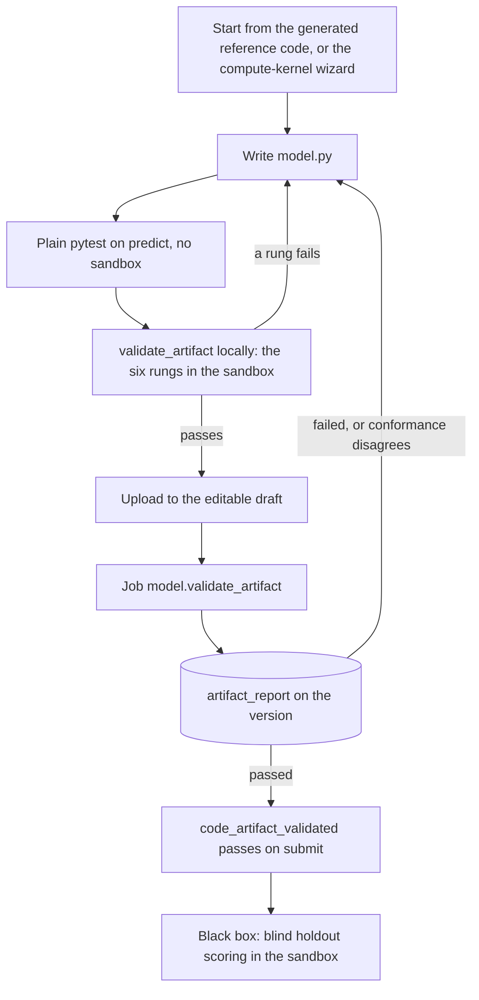
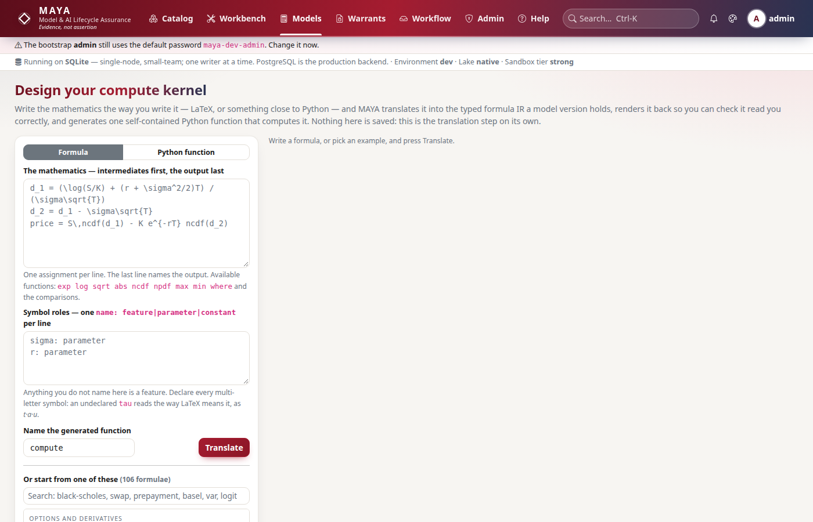

# Developing a model artifact

This page is for a quant or developer writing the code that goes with a model version — the implementation of a formula model, or the only computable form of a declared black box — and who wants a working loop: write it, check it locally exactly as MAYA will, upload it, and read a failure quickly. The rules an artifact must satisfy — the `Model` class and its two signatures, the import allowlist, what is banned, the limits — are in the [authoring reference](../../maya/web/guides/authoring-reference.md#the-python-artifact), and the validation ladder, conformance and black-box scoring are in the [models reference](../../maya/web/guides/models-reference.md#code-artifacts-and-the-validation-ladder). This page links to those rules rather than restating them. How the sandbox confines code is in [the architecture page on security](../architecture/security.md) and the [security guide](../../maya/web/guides/security-guide.md#the-sandbox-for-code-maya-did-not-write).

MAYA does not train or run models for anyone. It validates an artifact, compares it with the documented mathematics, and — for a black box only — runs it in the sandbox to score a warrant's escrowed holdout blind. Everything else that runs your model runs somewhere else.

## When you would do this, and what you touch

| File or command | Why |
|---|---|
| `model.py` | the artifact: a class `Model` with `fit` and `predict` |
| a local check script using `maya.formula.artifact.validate_artifact` | the same ladder the server runs, on your machine |
| `python -m maya.cli model push <ns>/<name> model.py`, or `my.models.upload_artifact(...)` | attach it to the model's editable draft |
| the model page, **Code** tab; or `my.models.get(ref)["versions"][-1]["artifact_report"]` | the ladder's report |
| `my.models.conformance(ref, version, n=…, featureset=…)` | re-run the comparison with the mathematics on a real domain |

## The loop



## Step 1: start from what MAYA already knows

For a **formula** model, do not start from a blank file. MAYA generates a reference implementation from the formula IR — one `predict(X, params)` function — on the model's **Code** tab and from `my.models.reference_code(ref, version)`. It is a correct implementation of the approved mathematics by construction, so the fastest correct artifact is a `Model` class whose `predict` does what that function does, rewritten for speed or for the libraries your production code uses.


The **compute-kernel wizard** (`/models/kernel`, `my.models.kernel(text, roles=…)`) does the same translation before any model exists: mathematics in, typed IR and one self-contained Python function out. Use it to check MAYA reads your formula the way you meant before you write code against it.



For a **declared black box** there is no IR to compare against, which is exactly why the artifact matters more: once validated, it is the only thing MAYA can execute to score the model, and it is what the warrant's blind score will record by hash.

## Step 2: write it, and test it without the sandbox

```python
# model.py: an artifact for a one-factor logistic PD model (example)
import numpy as np


class Model:
    def fit(self, X, y, ctx):
        A = np.column_stack([np.asarray(X["leverage"], dtype=float), np.ones(len(y))])
        coef, *_ = np.linalg.lstsq(A, np.asarray(y, dtype=float), rcond=None)
        return {"w": float(coef[0]), "b": float(coef[1])}

    def predict(self, X, params, ctx):
        z = params["w"] * np.asarray(X["leverage"], dtype=float) + params["b"]
        return {"pd": (1.0 / (1.0 + np.exp(-z))).tolist()}
```

Inside the sandbox `X` arrives as a dict of NumPy arrays, one per input in the version's contract, and `Model()` is constructed with no arguments for every run. Test the class in plain Python first — it is the fastest loop there is, and nothing about MAYA is needed:

```python
# test_model.py: a plain unit test of the artifact (example)
import numpy as np

from model import Model


def test_predict_is_a_probability_per_row():
    out = Model().predict({"leverage": np.array([0.0, 1.0, 5.0])}, {"w": 1.5, "b": -2.0}, None)
    assert len(out["pd"]) == 3 and all(0 < p < 1 for p in out["pd"])
```

## Step 3: run the ladder locally

`validate_artifact` is the function MAYA's validation job calls. With MAYA installed in your environment you can call it yourself, with your own sample and parameters, and get the same report the server will store:

```python
# maya/formula/artifact.py
def validate_artifact(
    source: str,
    sample: dict[str, list[Any]],
    params: dict[str, Any],
    *,
    allowlist: frozenset[str] | set[str] | None = None,
    entry: str = "Model",
    limits: dict[str, int] | None = None,
) -> dict[str, Any]:
    """Run the ladder; ``passed`` is true only if rungs 1–5 pass."""
```

```python
# check_artifact.py: validate an artifact locally, exactly as MAYA's job will (example)
import json
import sys
from pathlib import Path

from maya.formula.artifact import validate_artifact

source = Path(sys.argv[1]).read_text(encoding="utf-8")
sample = {"leverage": [0.2, 0.5, 0.9, 1.4]}
params = {"w": 1.5, "b": -2.0}
report = validate_artifact(source, sample, params)
for rung in report["rungs"]:
    print(f"{rung['rung']}. {rung['name']:<17} {rung['passed']!s:<5} {rung['detail']}")
print("passed:", report["passed"], "tier:", report["tier"])
print(json.dumps(report.get("smoke_output")))
```

Run on the example above, it printed:

```text
1. parse             True  ruff check ran: clean
2. entry point       True  'Model' implements fit(X, y, ctx) and predict(X, params, ctx)
3. import allowlist  True  every import is on the allowlist
4. static ban        True  no filesystem, process, network or dynamic-code use
5. smoke run         True  smoke run succeeded in 0.16s under tier 'strong'
6. determinism       True  two runs produced identical output
passed: True tier: strong
```

The tier is your machine's, not the server's. A laptop without bubblewrap reports a weaker tier and the same rungs; the report stored on the version records the server's tier, which is the one that counts as evidence.

## Step 4: upload

```bash
python -m maya.cli model push credit/pd_box model.py
```

```python
# upload with your own sample and parameters (example)
import maya.sdk as maya

my = maya.connect("prod")
out = my.models.upload_artifact(
    "credit/pd_box",
    open("model.py", encoding="utf-8").read(),
    sample={"leverage": [0.2, 0.5, 0.9]},
    params={"w": 1.5, "b": -2.0},
)
```

The upload attaches to the model's **editable draft** — an approved version refuses it with "Artifacts attach to an editable draft"; create a new draft first. The source is stored by hash and a `model.validate_artifact` job runs the ladder; until it finishes, the version's report says `validating` and `code_artifact_validated` refuses submission. Without `sample` and `params`, MAYA makes its own: eight values drawn uniformly from 0.5 to 1.5 for each input in the contract, and for each parameter a point 0.618 of the way through its declared bounds (not the midpoint, which is zero for any range symmetric about zero and would silently stop testing that term). If your inputs are not numbers in that range — a series name a per-series model groups by, a rate that must be negative — pass a `sample`.

For a formula model, a passing ladder is followed in the same job by the **differential test** against the IR over 2,000 sampled points; its result is stored in the report as `conformance`. A black box is not compared, and the report says so rather than implying a check.

## Step 5: read a failure

The report names the rung and, for code, the line. What each failure usually means:

| Rung, and what you see | Usual cause | What to do |
|---|---|---|
| 1 parse, a ruff finding | a syntax error or an undefined name | fix it; ruff's text is quoted in the detail |
| 2 entry point | `Model` missing, or a method's argument names differ | the names are checked exactly: `fit(self, X, y, ctx)`, `predict(self, X, params, ctx)` |
| 3 import allowlist | an import not on the list | use an allowed library; the list is the authoring reference's |
| 4 static ban | `open`, `getattr`, a dunder, a banned module, even unused | remove it — the check is static, so dead code counts |
| 5 smoke run, "No module named …" | the sandbox's child interpreter cannot see a library your shell can | run with the environment MAYA runs from; the child is started isolated (`python -I`) from the same interpreter |
| 5 smoke run, wall-clock or memory | the sample is small, so this is usually an import or a loop | only NumPy is imported before the memory cap applies; a heavy import counts against it |
| 5 smoke run, an exception | `predict` fails on the sample | the traceback's last lines are in the detail; reproduce it with the plain test |
| 6 determinism, a warning | randomness not taken from `ctx.seed` | seed from `ctx.seed`; this is a warning, but a reviewer will read it |
| `conformance` disagrees | the code is not the mathematics | read the counterexamples: inputs, expected, actual |

The last row is the one the ladder exists for. An artifact that parses, imports nothing forbidden and runs can still compute the wrong thing — the commonest implementation bugs pass every other rung — and the differential test is what catches them. Re-run it on the real domain with `my.models.conformance(ref, version, featureset=…)`, which draws inputs from that feature set's own values; a test that passes on the unit interval and fails on real data is telling you something about the data's range.

## Step 6: what a validated artifact unlocks

- the `code_artifact_validated` check passes on submit and approve;
- for a **black box**, blind scoring on a training warrant's escrowed holdout: MAYA runs `predict` in the sandbox on the holdout's input columns only — never the target — with 60 s of CPU, 2 GB and 120 s of wall time, and computes the metrics itself. `predict` must return one value per holdout row; a dict's first value is taken. The same path gives fairness and permutation-importance evidence.

## How to test it end to end

`maya.testing` gives you a real, throwaway MAYA in about two seconds, and the SDK is the same one you use against a server. This ran against the example above:

```python
# an end-to-end test of the artifact (example)
from pathlib import Path

from maya.testing import Maya

IR = {
    "outputs": [{"name": "pd", "type": "float64"}],
    "inputs": [{"name": "leverage", "type": "float64", "role": "feature"}],
    "black_box": {"estimates": "12-month probability of default",
                  "architecture": "logistic in leverage, two weights"},
}


def test_the_artifact_passes_the_ladder_on_the_server():
    with Maya.start() as maya:
        mona = maya.client("mona")
        mona.models.create("test", "pd_box", kind="black_box", ir=IR)
        mona.models.upload_artifact("test/pd_box", Path("model.py").read_text(),
                                    sample={"leverage": [0.2, 0.5, 0.9]},
                                    params={"w": 1.5, "b": -2.0})
        maya.drain()  # the validation job runs inline
        report = mona.models.get("test/pd_box")["versions"][-1]["artifact_report"]
        assert report["passed"], report
```

If you are changing the ladder itself — `maya/formula/artifact.py`, `maya/security/sandbox.py` — you are changing a security control. `tests/test_sandbox.py` holds a test per rung and the escape attempts; `tests/test_sandbox_linux.py` holds the strong tier's; `python tools/ci/gates.py --security` runs both. A new allowed import is a change to what code MAYA did not write may do inside the server's machine, and belongs in the security guide in the same change.

## Common mistakes

- **Testing only on MAYA's default sample** when the model's inputs live elsewhere.
- **Reading the local tier as the evidence tier.**
- **A banned name in dead code.** The ladder reads, it does not run, rungs 1–4.
- **Randomness without `ctx.seed`.** The determinism rung warns; the blind score is not reproducible.
- **Uploading to an approved version.** Create a draft.
- **Treating conformance as proof.** Its statement begins "Sampled agreement is not proof", and it means it.
