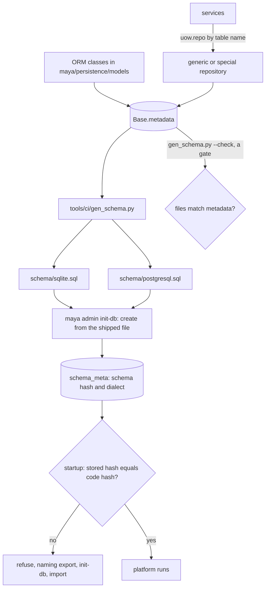

# Adding a table or a column

This page is for a developer whose change needs MAYA to remember something it does not store today. It covers where the schema is defined, how the two shipped schema files are generated from it, how services read and write through the unit of work, what to do about existing databases when there are no migrations, and the purge and import boundaries a new table has to respect. How persistence is layered is in [the architecture page on persistence](../architecture/persistence.md); how an operator upgrades or moves between databases is in the [operations guide](../../maya/web/guides/operations-guide.md#upgrades-and-moving-between-databases) and is not repeated here.

Four rules govern everything below, and each has a reason:

- **SQLite by default, PostgreSQL by configuration, never both.** One estate is one database; `db.dialect` chooses which.
- **One schema file per dialect, generated, never edited.** `maya/persistence/schema/sqlite.sql` and `postgresql.sql` are produced from the SQLAlchemy metadata, so the two cannot describe different databases.
- **No migrations.** A schema change is carried across by exporting the estate and loading it into a freshly created schema. A migration framework is a second description of the schema that can disagree with the first; the estate is plain rows, hashed per table, and is also the backup and the move between dialects.
- **Database code only in `maya/persistence`.** Everything else uses the unit of work.

## When you would do this, and what you touch

| File | Why |
|---|---|
| `maya/persistence/models/<area>.py` | the ORM class: the single source of truth |
| `maya/persistence/schema/sqlite.sql`, `postgresql.sql` | regenerated by `tools/ci/gen_schema.py` |
| the service that uses it | `uow.repo("<table>")` |
| `maya/persistence/purge.py` | if the rows belong to a namespace |
| `maya/persistence/repositories/special.py` | only if the table needs behaviour a generic repository lacks |
| your development database | rebuilt, with the estate if it holds anything you want |

## How the pieces connect



## Step by step: a new table

The worked example is `landing_reads`: one row per file a `landing` source pull has read, which is the durable replacement for the audit-log lookup the [connector guide](source-connectors.md#3-branch-in-the-pull) uses to avoid re-reading a file.

### 1. Define the class

Put it in the module for its area. Every mutable aggregate takes the `Tracked` mixin — a UUID key, `created_at`/`created_by`, `updated_at`/`updated_by`, and `row_version` for optimistic concurrency — and the portable column types from `maya.persistence.types`, which render correctly on both dialects. A neighbour, as it stands:

```python
# maya/persistence/models/catalog.py
class FeatureIngest(Tracked, Base):
    """One bitemporal batch of raw source rows: a knowledge-time slice (§29.1)."""

    __tablename__ = "feature_ingests"
    feature_id: Mapped[str] = mapped_column(PortableUUID, ForeignKey("features.id"), index=True)
    blob_hash: Mapped[str | None] = mapped_column(String(64))
    source_type: Mapped[str] = mapped_column(String(16))
```

```python
# maya/persistence/models/catalog.py: the new class (example)
class LandingRead(Tracked, Base):
    """One file a landing pull read: which feature, which file, which bytes."""

    __tablename__ = "landing_reads"
    __table_args__ = (UniqueConstraint("feature_id", "file_name", "sha256"),)
    feature_id: Mapped[str] = mapped_column(PortableUUID, ForeignKey("features.id"), index=True)
    ingest_id: Mapped[str] = mapped_column(PortableUUID, ForeignKey("feature_ingests.id"))
    file_name: Mapped[str] = mapped_column(String(500))
    sha256: Mapped[str] = mapped_column(String(64))
```

The module matters. The repository registry is built once, when `maya.persistence.models` is imported, from the modules that package imports:

```python
# maya/persistence/models/__init__.py
from maya.persistence.models.base import Base, new_id
from maya.persistence.models import catalog, governance, identity, llm, operations, registry

MODELS = {mapper.class_.__tablename__: mapper.class_ for mapper in Base.registry.mappers}
```

A class in a new module that is not added to that import line is in no schema file and has no repository: `uow.repo("landing_reads")` raises `KeyError`. Defining this example outside those modules and asking for its repository did exactly that.

Constraints are named by the metadata's naming convention (`uq_<table>_<columns>`, `fk_…`, `ix_…`), so do not name them by hand. A JSON column is `PortableJSON` (JSONB on PostgreSQL); a timestamp is `UTCDateTime`, always timezone-aware.

### 2. Regenerate the schema files

```bash
.venv/bin/python tools/ci/gen_schema.py
```

This rewrites both files with a header carrying the new schema hash. Review the diff: it is the whole of what the change does to the database, in both dialects. For the example it is one `CREATE TABLE` with its unique constraint and foreign keys, and one `CREATE INDEX` on `feature_id`, per file. `gen_schema.py --check` is part of the static gate ladder, and creating a database from a file that differs from the metadata is refused outright, so a forgotten regeneration fails early rather than producing a database the code does not describe.

### 3. Use it through the unit of work

```python
# recording what a landing pull read, inside the pull's unit of work after `row` is added (example)
    for line in origin["manifest"]:
        name, digest = line.rsplit(" ", 1)
        uow.repo("landing_reads").add(
            {"feature_id": feature["id"], "ingest_id": row["id"],
             "file_name": name, "sha256": digest}
        )
```

`uow.repo(name)` returns a generic repository for any table in `MODELS`: `add`, `get`, `require`, `find_one`, `list` (with filters such as `feature_id__in=…`, `revoked_at__isnull=True`, `order_by=["-created_at"]`), `count`, `update` (with `expected_version=` for optimistic concurrency) and `delete`. Rows go in and come out as dictionaries; `created_by` is filled from the unit of work's actor. The transaction commits when the `with` block exits cleanly and rolls back on any exception, and on SQLite the unit of work also holds the process-wide write mutex — so do not open one unit of work inside another for a write, and do not commit in a loop.

Behaviour a generic repository cannot express — the audit chain's hash linking, the job queue's claim — lives in a special repository registered in `SPECIAL` in `maya/persistence/repositories/__init__.py`. A new table rarely needs one.

### 4. The purge

MAYA deletes governed objects in one case only: purging a namespace in a development estate, which is how a demonstration or a test estate recovers from a run that stopped half way. `maya/persistence/purge.py` finds a namespace's rows by foreign key, by object id and by reference string, and deletes children before parents. A new table whose rows belong to a namespace object must be added there, before its parent:

```python
# maya/persistence/purge.py
        self.drop("feature_pins", "id", c["f_pins"])
        self.drop("feature_ingests", "id", c["f_ingests"])
        self.drop("feature_versions", "id", c["f_versions"])
        self.drop("features", "id", c["features"])
```

`landing_reads` goes in as `self.drop("landing_reads", "feature_id", c["features"])` above the `feature_ingests` line. Forget it and the purge fails on the foreign key — SQLite runs with `PRAGMA foreign_keys=ON` — and `tests/test_purge.py` will not tell you, because it only fills the tables its own fixture writes to. Add rows of the new table to that fixture.

### 5. Rebuild your database

The running code refuses a database whose stamped hash differs from the schema it defines:

```python
# maya/persistence/schema.py
            "Schema mismatch: the database was created from a different schema "
            f"(stored {found[:12]}, code expects {expected[:12]}). MAYA has no "
            "migrations. Rebuild with:\n"
            "  python -m maya.cli admin export-estate --out estate.mayabundle\n"
            "  python -m maya.cli admin init-db --force\n"
            "  python -m maya.cli admin import-estate --in estate.mayabundle",
```

On a development estate you care about, run those three commands with the **new** code: export reads the database as it is rather than as the code says it should be, precisely so that it works when startup refuses. On a throwaway estate, deleting `data/` is quicker. Tests are unaffected — every test platform creates its own database from the shipped file.

## Adding a column

The same steps, with one rule for the load: a column the new code adds takes its default when an older estate is loaded, so it must be **nullable or have a default**. A required column with neither is refused at load time, naming the table and column — `estate._require_carried` — rather than failing inside the database. Choose the default deliberately: it is what every existing row will say, and "unknown" is often the honest value, which is `None`.

Renaming or dropping a column loses its data on the way through the estate unless you carry it. Nothing is lost silently: an export made by the new code leaves out what the new schema lacks and names it in the bundle manifest's `not_carried`, and loading a bundle exported by the old code is refused, naming every table and column it would drop, unless `import-estate --allow-drop` accepts the loss explicitly. A rename that should keep its data needs the values copied in the export, by you.

## The import boundaries

`tools/ci/import_boundaries.py` enforces two rules. Nothing outside `maya.persistence` imports `sqlalchemy`. And application code may import from `maya.persistence` only the unit of work (`session`), the engine factory (`engine`), the external-source reader (`external`) and the two whole-schema operations (`estate`, `purge`) — never the ORM classes, a session, an engine or table metadata; the gate also catches `uow.session`, `.db.engine` and `Base.metadata` written out in application code. The point is that one package can describe the database, so a change to it is a change in one place. Tests are outside the gate and may inspect the database directly, as `tests/test_purge.py` does to count rows.

## How to test it

```bash
.venv/bin/python tools/ci/gen_schema.py --check
.venv/bin/python tools/ci/import_boundaries.py
.venv/bin/python -m pytest tests/test_purge.py tests/test_workflow_and_estate.py -q
MAYA_TEST_PG_URL=postgresql+psycopg://user@localhost/maya_test .venv/bin/python -m pytest tests/test_purge.py -q
```

`tests/test_workflow_and_estate.py` holds the estate round trip, the schema-mismatch refusal, and the load of a database made by another schema; imitate `test_a_required_column_the_estate_cannot_fill_is_named` if your column needs a default for a reason worth pinning down. Run the parts of the suite that touch the table on PostgreSQL too: SQLite accepts things PostgreSQL does not, and the column types render differently. With `MAYA_TEST_PG_URL` set, each test platform gets its own freshly created database on that server.

## Common mistakes

- **Editing a `.sql` file by hand.** The drift gate fails, and `init-db` refuses.
- **A new models module not imported in `maya/persistence/models/__init__.py`.** No schema, no repository.
- **A required column with no default.** Every existing estate refuses to load.
- **Forgetting the purge.** A purge then fails on a foreign key, in front of an audience.
- **Importing a model class into a service** to query it. Use `uow.repo(name)`.
- **Upgrading a database by hand-written `ALTER TABLE`.** The stamped hash will not match, and the code is right to refuse it.
